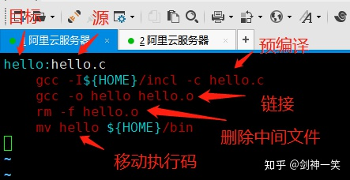

### C
1. 认识：面向过程，可移植在多种计算机编译的高级语言，简化了编程工作，高性能、语法简单、也适用硬件编程
1. 开始
    ```c
    #include <stdio.h>

    int main(void) {
        printf("Hello, World!\n");
        return 0;
    }
    ```
### 基础
1. 语言特性
   - 基础
     1. 大小写敏感
     1. 执行顺序：从上往下(后边定义的函数前边不能用，用函数声明解决)、从左至右
     1. 结束符;
     1. 进制：默认10进制，0开头为8进制，0b为2进制，0x为16进制
     1. 运算符优先级
   - 注释
     1. //：单行注释
     1. /* ... */：多行注释，不能嵌套注释
   - 表达式：整个表达式可表示真假，真为1假为0
     1. 左值：指向内存位置的表达式，可出现在左右两边，变量是左值
     1. 右值：存储在内存中某些地址的数值，不能被赋值，只能出现在右边
   - 名称空间
     1. 理解：c使用名称空间标识程序的各部分，即通过名称来识别。作用域是名称空间一部分
     1. 共享名称空间：结构、联合、枚举标记共享相同名称空间，和普通变量的空间不同。相同作用域中，变量和标记的名称可以相同，不提倡，c++不允许
1. 数据类型
   - 分类
     1. 布尔：_Bool，无符号整数类型，只有0和1。C99包含`stdbool.c`后，可用bool表示_Bool，true表示1，false表示0，和C++兼容。非零和非空为true
     1. 基本：字符型、整型、浮点型
        - `char`：1byte，-128~127
        
        - `short`：2byte，前后3万
        - `int`：4byte，前后20亿，`long/short int`
        - `long`：4byte，C99，`long long`

        - `float`：4byte，前后38次方，6位小数
        - `double`：8byte，前后308次方，15位小数
          1. `long double`：16byte，前后4932次方，9位小数
     1. 派生：数组、枚举、指针、结构、联合、函数、void
   - 符号
     1. signed：char默认signed，unsigned表示unsigned int
     1. unsigned
   - 类型转换
     1. 自动转换：一个表达式中不同类型的计算时自动转换，运算时类型不同将低换高，字节越多越高
        - 浮点数->整型：小数舍去
     1. 强制转换：(int) expression
1. 运算符
   - 算术：+ - * / % ++ --
   - 关系：== != <> <= >=
   - 赋值：= += -= *= /= %= <<= >>= &= ^= |= 
   - 逻辑：&& || !
   - 位：& | ^ ~ << >>，真值表
   - 成员
     1. 成员：.(用于结构和联合)
     1. 间接成员：->(即结构指针运算符，用于指向结构或联合的指针一起使用)
   - 指针
     1. *：间接运算符
     1. &：取址运算符
   - 混合
     1. ?:：三元
     1. ()：类型强制转换运算符
     1. ,：逗号运算符：将两个表达式链接为一个表达式，如for循环
     1. sizeof：给出对象/类型的字节大小，返回size_t类型(无符号整数类型)。类似用typeof定义的只是在头文件中定义的类型
        - 如`sizeof(int)`、`sizeof zoo`
     1. typedef：`typedef int xx`，定义关键字或标识符的别名，_t表示都是别名的数据类型
     1. _Alignof：C11，给出运算对象指定类型的对齐要求，一些系统要求以特定值的倍数在地址上存特定类型，这个整数就是对齐要求
1. 字符
   - 认识：char，''，1byte。ascii码是0~127，7位就可以保存
   - 字符类型
     1. 控制字符：ASCII编码中0到31、del符
     1. 空白字符：空格符、制表符
     1. 空格字符：制表符、换行符、垂直制表符、换页符、回车符、空格符
     1. 可打印字符：字母数字、标点符号、空格
1. 字符串
   - 认识：""，使用空字符\0终止的char类型的字符数组，本质存储整型，字符数量永远加1，不是二进制安全的
     1. 字符串如果没有\0就是普通的字符数组
     1. \转义，\分行，空格连接，如`"1" "2" == "12"`
     1. 类似数组整个字符串是首字符的指针编译器可以使用内存的一个副本表示所有的相同的字符串，就是用一个内存地址表示
   - 实例
    ```c
    // 定义字符
    char a = 'a';
    char a = 97;

    // 定义字符串
    char greeting[6] = {'H', 'e', 'l', 'l', 'o', '\0'};
    // 效果同上，通用写法，编译器用双引号来识别，并自动计算数组长度
    char greeting[] = "Hello";                                  
    //字符串数组
    char * array[] = {"aaa","bbb","ccc"};
    ```
1. 数组
   - 认识：array，固定大小的相同类型元素的顺序集合，由连续的内存位置组成，数组大小不可修改。数组名永远不会是指针
     1. 多维数组：定义`type arrayName[][][]...;`
     1. 柔性数组：即动态数组
        - 定义：是大小待定的数组，结构体的最后是空数组的话，数组大小可以在运行时进行更改。为了满足需要变长度的结构体、使用数组时内存冗余、数组越界问题，可以容易构造出缓冲区、数据包等，c99
        - 要求：必须是结构体的最后一个成员，并且至少包含一个其他类型的成员
        - 原理：对于编译器来说，长度为0的数组不占用空间，因为数组名本身不占空间只是一个偏移量或者符号或者代表一个不可修改的地址常量
        - 实例
        ```c
        typedef struct XX{
            int xx1;
            char xx2[0];        // 柔性数组，或者写为xx2[]
        }xx;

        xx->xx2[i]              // 随便赋值
        ```
   - 使用
    ```c
    // 声明：可容纳2个int值的数组
    int num[2]
    // 声明：省略大小编译器自动计算
    int num[] = {1,2}
    int num = {1,2}
    
    // 编译器自动截断
    int num[2] = {1,2,3}

    // 访问
    num[0]
    ```
1. 枚举
   - 认识：enum，声明符号名称来表示整型常量，逗号隔开，标识符可有可无。实际enum常量是int类型
     1. 可在程序运行期间修改值，提高程序可读性，是预处理指令#define的替代
   - 使用
    ```c
    // 定义
    enum DAY today;                                         # 定义标记名DAY(允许将DAY作为类型名使用)，定义枚举变量today
    enum DAY {                                              # 三个元素有两个即可
        MON, TUE, WED=7,                                    # 给元素赋值，默认按照顺序赋值0++
    } var;

    // 使用
    today = TUE;
    today++;                                                # c允许，c++不允许，可用int类型代替枚举变量

    // 别名和枚举
    typedef enum workday {} workday;                        # 两个workday有一个就能用
    workday today;                                          # 别名定义变量
    ```
1. 结构体
   - 认识：struct，用户自定义的存储不同类型的数据项，是内存对齐的。结构体的第一个元素地址就是结构体的地址，联合体每个元素的地址就是联合体的地址
   - 使用
    ```c
    // 定义，以下三项最少有两个，可以少
    struct tag {                        // 结构体的声明，即结构体模板

        int     i;
        char    title[50];
        struct  tag a;                  // 包含其他结构体
        struct  tag *next_tag;          // 包含指向自己结构体标签的指针，可以实现链表、树等数据结构

    } __attribute__ ((aligned (1)))variable;       // 结构体变量，强制按照此值为结构体的有效对齐值
    // 单独定义结构体变量
    struct tag var1;
    // 结构体数组
    struct tag bk[];

    // 初始化
    struct tag var = { .title = 1, 0.1 };
    struct tag var = var1;              // 用其他结构体初始化

    // 访问，成员访问运算符.
    variable.title                      // 使用结构变量访问
    ```
   - 不完整声明：如果两个结构体互相包含，需要对其中一个进行
    ```c
    // 对结构体B进行不完整声明
    struct B;
    struct A{
        struct B *partner;
    };
    struct B{
        struct A *partner;
    };
    ```
   - 位域
     1. 认识：将一个字节中的二进位划分为不同的区域，并说明每个区域的位数。每个域有域名，允许按域名操作，也叫位字段。可存放开关量、读取非标准的文件格式
        - 本质是结构体，但是成员按照位分配，如要表示0~7，使用3个位
        - 内存占用：结构是一个成员占一个类型的内存，位域是多个成员合并，一个位一个位的使用内存
        - 一个位域必须存储在同一个字节中，不能跨字节，可以另起一个字节存储
     1. 使用
        ```c
        // 定义
        struct 位域结构名 {
            位域列表
        }位域变量;
        // 如
        struct bs{
            int a:8;        // data为bs变量，位域a占8位，b占2位
            int b:2;
            int  :6;        // 空域，表示后6位填零不允许使用，下面的位域从新字节开始
        }data;

        // 访问成员
        data.a
        data->a
        ```
1. 联合体
   - 认识：占用相同内存位置存储不同数据类型，复用内存都从头开始存储的，会覆盖，给不同的成员赋值会影响其他成员的值
     1. 大小端：大端就是高位在低处，小端反之
   - 定义
    ```c
    union tag {                 // 联合模板
        // 成员定义，即标准的变量定义，可以是内置、自定义的数据类型
    } variables variables1      // 联合变量

    // 使用
    variables.xx
    ```
1. 函数
   - 认识：告诉编译器名称、参数、返回类型，函数定义可以提供实际主体
     1. 声明：`int max(int, int);`，调用另外文件的函数时需要被调用函数先声明
     1. 定义
   - 参数
     1. 特性
        - 标明参数类型后，编译器自动转换数据类型到声明的类型
     1. 传值方式
        - 传值
        - 指针
        - 引用：&param
     1. 参数类型：形参、实参，形参就是声明接受参数值的变量
     1. 分类
        - 普通：`int func(int n)`
        - 可变参数：`int func(int a, ...)`，需要<stdarg.h>
        - 数组
          1. 指针表示：`void func(int *param)`
          1. 数组表示：`void func(int param[n])`，等价于用指针表示
          1. 未知大小数组表示：`void func(int param[])`
        - 结构：`void func( struct Books book );`
        - 字符串：`int func(char *id);`、`int func(char *);`
        - 指针：`void func(long * ptr);`
   - 返回值
     1. 认识：return，不返回值用void
        - main中return可以表示错误类型传递给系统
     1. 表现形式
        - 指针：`int * method(){}`，函数不能直接返回数组，但数组其实就是指针，所以让函数返回指针来实现
        - 数组：不允许返回完整数组，返回指向数组的指针
        - 字符串：不能返回一个局部变量的字符串、内存地址，因为离开函数作用域时已经被销毁了，方法如下
          1. 将字符串指针作为函数参数传入，并返回该指针
          1. 使用malloc函数动态分配内存，在主调函数中释放
          1. 返回一个静态局部变量
          1. 使用全局变量
   - 函数说明符
     1. inline：`inline void func(){}`，c99
     1. _Noreturn：调用完成后不返回主调函数，void会返回但是无返回值
   - 回调函数：即通过函数指针调用函数，通过参数传递函数指针。回调函数是由别人的函数执行时调用你实现的函数
   - 静态函数：static，静态函数只能在声明它的文件中可见，其他文件不能引用该函数，不同的文件可以使用相同名字的静态函数，互不影响
   - 匿名函数：称为lambda函数，把函数看作对象，形式：`[capture](parameters)->returnType{body}`、`无返回值：[capture](parameters){body}`
     1. capture：可以访问当前作用域的变量，这是lambda表达式的闭包行为
        - [&]     // 任何被使用到的外部变量都隐式地以引用方式
        - [=]     // 任何被使用到的外部变量都隐式地以传值方式
        - [&, x]  // x显式地以传值方式，其余变量以引用方式
        - [=, &z] // z显式地以引用方式，其余变量以传值方式
     1. 实例：`[a, &b](int x, int y){ return x < y ; }`
1. 指针
   - 认识：是一个变量，值为另一个变量的内存地址，值都是十六进制数，大小就是那么大，不能改变指针的值
     1. 指针类型：指向的变量或常量的类型，可用于动态内存分配
     1. 意义
        - 完成一些任务，如动态内存分配
   - 运算
     1. 算术运算：是一个地址可以计算，有四种运算++、--、+、-，是地址的变化，不是值
     1. 比较运算：== < >
   - 使用
    ```c
    // 定义
    int *pointerName;
    // 赋值，使用地址运算符得到内存地址
    name = &str;
    // 使用指针访问值，即使用间接运算符*访问
    *name
    // 访问被存储的内存地址
    name
    ```
   - 空指针：`int *p = NULL;`，可以用于初始化指针
   - 野指针：谁知道指向哪里了
   - 间接寻址：保存指针的内存地址，就是往上垒*号和&号
    ```c
    // 定义
    int **ptr;
    // 赋值
    pptr = &ptr;
    // 获得内存地址上的值 
    `**pptr
    ```
   - 和数据类型
     1. 指针常量
        ```c
        const int * ptr = &joy;         // 创建
        joy = 1;                        // 允许
        ptr = 33;                       // 允许
        *ptr = 2;                       // 会报错，ptr被赋值的不是内存地址

        int * const ptr;                // 反过来
        int const * ptr;                // 效果同上
        const int * const ptr;          // 都不能改
        ```
     1. 指针数组：存储了数组某值的内存地址
        - 定义：`int *ptr[n];`
        - 内存地址
          1. 第一个：`ptr`
          1. 第n个：`&ptr[n]`
        - 访问元素：`ptr[1]或*(ptr+1)`
            ```c
            int *p;               // 定义指针指向数组，p是变量，打算修改字符串不用指针，因为有可能修改内存副本影响所有字符串，内存访问错误
            int array[10];        // 定义数组，array是常量，数组因为又存了一份导致内存占用大，只显示用指针
            p = array;            // 数组名是指向数组第一个元素的常量指针
            *(array + 4)          // 所以表示array[4]

            # 共同
            array[1]              // 都可使用数组表示法
            p[1]
            *(array + 1)          // 都可以进行指针加法操作
            *(p + 1)
            # 不同
            *(p++)                // 只有指针可以递增操作

            // 数组指针，num是指向&num[0]的指针，即第一个元素的地址
            int num[2]              // 等同于int * num
            
            int *p;
            p = num;
            // 指针访问
            *(num + 4)
            ```
     1. 指针结构|指针位域
        ```c
        struct Books *structPointer;        // 定义
        structPointer = &Books;             // 赋值

        structPointer->title;               // 访问，使用间接成员运算符->，不能用.了
        Books->title;                       // 访问
        &Books->title;                      // 访问
        ``` 
     1. 指针函数：指向函数的指针
        ```c
        // 声明：int (*pName)();
        int max(int x, int y){}
        int (*p)(int, int) = & max;        // &可以省略
        p(a, b)                            // 调用
        ```
### 语法
1. 变量
   - 认识：程序可操作存储区的名称，变量类型决定存储的大小和布局，如枚举、指针、数组、结构、联合等
   - 定义
    ```
    int i;
    int i,j,k;
    int a=1, b=2;
    ```
   - 作用域分类
     1. 局部：函数或代码块内部声明，只能内部使用，不会被初始化，局部会覆盖全局
     1. 全局：函数外部声明，会被初始化
        - 初始化对应表
          1. int：0
          1. char：'\0'
          1. float：0
          1. double：0
          1. pointer：NULL
     1. 形式参数：函数参数的定义中声明
   - 存储类别说明符
     1. 认识：用于定义变量、函数、对象的作用域，在类型前面书写
     1. 分类
        - static：每次进入/离开作用域不会创建/销毁(场景如重复调用函数变量不被重新赋值)，只能函数内访问，作用域为当前文件。无法定义为寄存器变量
        - extern：说明变量在其他文件中，必须引用式声明才能使用，修饰变量时可定义可声明，修饰函数时只能是定义
        - _Thread_local：c11，线程存储期变量，属于线程私有，不同线程看不见
        - typedef：别名
        - auto：只能修饰局部变量，即仅存在于当前代码块{}中，进模块生成退模块消亡，自从所有非全局变量默认为auto以来很少使用，无处不在
        - register：定义存储在寄存器中而不是内存中的局部变量，访问速度最快，意味着变量最大尺寸等于寄存器大小，取决于硬件和实现的限制不一定存储在寄存器中，也许被占满，尽量放入寄存器，是暗示不是命令，不能使用&运算符(没内存位置)。寄存器只用于大量频繁的操作、需要快速访问的变量，如计数器
   - 变量限定符
     1. 认识：限制变量的使用方式
        - const：不能改变初始化之后的变量，初始化必须在声明时完成。用于全局变量，可以定义const类型的函数参数，阻止函数修改原值
        - volatile：声明编译器不会将限定的变量被外部代理改变，如硬件地址、其他程序、同时运行的线程中共享数据，用于编译器的优化，可放在cache中
          1. 目的是禁止编译器优化读写操作
          1. 并非为并发程序设计，不会保证访问的原子性，仅可以禁止重排序。可能不同线程访问时因为读写缓存(cpu的寄存器等)表现为不同的结果
          1. MSVC中赋予其强制刷新缓存的语义，可以保证可见性，java中也可以
        - restrict：限定指针是访问指向内存的唯一方式(特定作用域中)，C99，允许编译器优化代码更好支持计算，只用于指针，有待加深理解p406
        - _Atomic：C11，原子类型
1. 常量
   - 认识：是固定值，程序执行期间不会改变，可以是任何的基本数据类型，通常大写，又叫做字面量
   - 分类
     1. 整数常量
        - u无符号整数，l长整数
        - 单精度常量：2.3f，双~：2.3，默认双
     1. 浮点常量
     1. 字符常量：即单引号引起来的一个字符，如转义字符'\n'，忽略引号会被认为是一个变量名，c认为字符常量为int类型，可以定义字符常量为'FFFF'
     1. 字符串常量：双引号引起来的多个字符，如"ab"
   - 定义
     1. `#define n v`
     1. `const type n v`
1. 流程控制
   - if、else、else if
   - switch case default
   - for、while、do/while，continue、break，goto不建议，支持无{}的一行缩进简单语句
1. 位操作
   - 有符号整数：二进制补码、二进制反码
   - 二进制浮点数：无法准确表示许多分数
1. 错误处理
   - 认识：通过检查返回值获取在errno.h头文件中的错误代码，错误代码是全局变量，0表示没有错误，错误码为1~255
   - 相关函数
     1. errno：变量，错误号
     1. perror(char *str)：可以显示给定字符串和错误文本
     1. strerror(errno)：返回指向当前错误文本的指针
     1. exit()：程序退出，指定错误号参数传EXIT_FAILURE或其他负数，0表示正常结束，main返回系统时自动调用。atexit()指定执行退出时自定义的函数
1. 内存管理
   - 栈：是c一种数据结构，用于c自动完成内存分配和回收的小块内存，栈低(高位)指针始终指向栈的开始，栈顶指针可以进行上下移动。所有的自动变量、函数形参、函数调用关系、返回值都存储在栈中，这个动作由编译器自动释放、占用，写程序时不需考虑。栈区在程序运行期间是可以随时修改的
     1. 函数被调用时该函数的返回类型和调用信息存储到栈顶，调用结束后被弹出并释放内存，当自动变量超出其作用域时，自动从栈中弹出
     1. 局部变量：使用栈来实现，在C中定义一个局部变量，编译器会在栈中寻找一块内存，将该局部变量压入栈对应的内存中，编译器自动完成，在函数退出的时候，栈将其中的元素从栈顶开始依次弹出，所有的局部变量就自动销毁了。栈里边的内存空间是进进出出反复使用的，这就是局部变量未初始化值是随机数的原因
     1. 递归每次使用新栈帧互不影响
   - 堆：动态内存分配，需要大块内存时使用，谁使用谁释放，程序自身对内存泄露负责
     1. c中静态对象、自动对象、动态分配对象(在内存堆或自由内存)存在不同区域
     1. 当程序退出时操作系统会自动释放所有分配给程序的内存，一定使用free释放内存
   - 函数
     1. malloc：int num，分配内存，单位为字节，堆区分配指定大小的内存空间，函数执行完成后不会被初始化，值未知，需要手动初始化内存的值
     1. calloc：int num/size，批量分配内存，分配num个长度为size的连续空间，每个字节初始化为0
     1. realloc：void *address/int newsize，重新分配内存，改变原来申请内存的空间大小，把内存扩展到newsize
     1. free：void *address，释放address指向的内存块，也就是释放 动态分配的内存空间
   - 原理：malloc/free底层由brk，mmap，munmap系统调用实现
1. 线程
   - 认识：标准库中c11才支持线程，各平台都有自己的线程实现方案，平台的c库都没有完成对c11的支持
     1. tinycthread：无外部依赖的开源的跨平台的忠实于c11标准库的线程库，方法名和c11都一样
   - 使用
     1. thrd_t：类型
     1. thrd_create()：创建
     1. thrd_join()/thrd_detach()/thrd_yield()：等待其他线程的结果（也是阻塞的）、不等待其他线程、让出cpu(看cpu，不一定能让出去)、
     1. thrd_sleep()：在当前线程睡眠
     1. thrd_current()：查看
     1. `#include <thread.h>`
   - _Atomic：原子类型，gcc也提供了实现，如atomic_int。通过cpu原子指令或者加锁实现，cpu性能开销小
   - mtx_t：锁，并发手段最重的方式，c11标准没规定怎么实现，gcc实现了。为减少锁的粒度，全部变量的锁先赋值给局部变量，然后放锁，知道了结果后进行耗时的其他操作
     1. mtx_t：类型，锁的类型有普通mtx_plain、超时 mtx_timed、是否可重入 mtx_recursive
     1. mtx_init()/mtx_destory()
     1. mtx_lock()/mtx_unlock()：阻塞加锁
     1. mtx_timedlock()：超时非阻塞加锁
     1. mtx_trylock()
   - condition：条件变量，用于线程通信协调，c11准备有
   - _Thread_local：线程存储期，`_Thread_local int xx = 0`，解决资源共享问题，解决问题的最好办法是解决掉提问题的那个人
   - tss_t：线程私有内存，和_Thread_local一样，自己玩自己的
     1. tss_create()/tss_set()/tss_get()：先malloc创建内存，然后set为私有
     1. tss_delete()：要保证清理时所有线程都不使用了，二是删除后不会触发tss_create的析构函数，需要手动释放内存
   - 线程安全原则
     1. 原子性：一组指令中间不能被断开，不能非原子访问，保证原子性也可以保证可见性
     1. 可见性：一个线程对资源的修改会被其他线程看到，不能看到
        - c11的内存序有很多详细定义，memory_order_relaxed最松，memory_order_seq_cst最严格，性能最差
     1. 重排序：编译器做优化只考虑线程内执行顺序不变，多个线程就会产生问题。通过改变编译优化级别实现不同的执行方式，使用volatile避免优化
   - 副作用/纯函数：表达式值以外的影响叫副作用，尽可能缩小副作用的范围，如果缩小到同一个线程，线程的同步设计复杂度就会大幅降低
   - 复杂线程返回结果
     1. 通过参数传递：子线程设置参数的结果，父线程从参数中拿结果
     1. 函数回调：还是放在参数里边的匿名回调函数进行结果通知
### 应用
1. 文件
   - 理解：是硬盘已命名的存储区，c看文件为一系列连续字节，每个字节可单独读取
     1. 文件模式：文件内容都是二进制形式存储，但是一开始以二进制编码字符就是文本文件，c和unix使用\n表示换行，早前mac是\r，window是\r\n表示换行，空字符填充总大小256的倍数，或者每行开始标出每行长度
        - 文本模式：程序所见内容和实际内容不同，c在读写时动态转换换行符
        - 二进制模式：可以访问每个字节，对于dos平台文件结束符ctrl+z可以看到
     1. io级别
        - 底层io
        - 标准高级io：无法保证所有系统使用相同底层io模型，c标准只支持标准io包，原理为读写数据时写操作缓冲区，一块一块的读写
     1. 标准文件：C语言把所有的设备都当作文件，设备被处理的方式与文件相同，标准输入stdin、标准输出stdout、标准错误stderr
     1. 文本格式、二进制格式：都是二进制格式存储，只不过按照某种规范设置表示特殊意义
     1. 缓冲io、无缓冲io
   - 基本
     1. fopen：用于新文件或已存在文件，会初始化FILE类型的对象。访问模式：r、w(覆盖写)、a(追加写)、有+即可读写，二进制文件就后面加b如a+b，有x(C11，失败不丢失原内容，环境允许有独占特性)，返回指向FILE的文件指针，FILE是包含文件信息的数据对象，包含缓冲区信息
     1. fclose：成功返回0。清空缓冲区中的数据、关闭文件、释放用于该文件的内存
   - 读取：随着读取文件指针会移动
     1. fgetc：指定输出流
     1. fgets：读取字符串到缓冲区，追加null终止字符串。途中遇到换行符\n、EOF返回
     1. fscanf：遇到空格停止读取
   - 写入
     1. fputc：指定输出流，成功返回字符
     1. fputs：不追加换行符
     1. fprintf
   - 移动文件指针
     1. rewind、fseek、ftell、fgetpos、fsetpos
     1. whence：SEEK_SET,SEEK_CUR,SEEK_END，文件头，当前点，文件尾
     1. a|a+模式总会在文件尾添加，哪怕移动文件指针
   - 二进制
     1. fread
     1. fwrite
   - 其他：fflush(刷新缓冲区，就是打印到屏幕上)、feof(指示文件末尾)、ferror(指示文件错误)、ungetc(字符放回输入流)、setvbuf(创建供标准io函数使用的缓冲区)。c函数都是失败返回EOF
1. 日期时间
1. shell交互
   - 获取参数：通过main，`int main(int argc, char *argv[]){}`，argc参数数量，argv[1]参数值，argv[0]存程序名称，参数用空格隔开，用单双引号包裹
   - 函数
     1. getchar：文件指针为标准输入
     1. putchar

     1. gets：读取一行到缓冲区，直到终止符或EOF，存在缓冲区溢出(访问未分配内存可能覆盖内容)和安全问题
     1. puts：把字符串s和换行符写入到stdout

     1. scanf：格式化输入，空格为截止符
     1. printf：格式化打印
1. 信号
   - 可捕获的：有些信号不能被程序捕获
     1. SIGABRT	程序异常终止，如调用abort
     1. SIGFPE	错误的算术运算，如除零或导致溢出
     1. SIGILL	检测非法指令
     1. SIGINT	程序终止(interrupt)信号，如ctrl + c
     1. SIGSEGV	非法访问内存
     1. SIGTERM	发送到程序的终止请求
   - 使用
     1. signal：注册信号回调程序
     1. raise：发送信号
   - 实例
    ```c++
    // 回调函数
    void signalHandler( int signum )
    {
        exit(signum);  
    }
    // 注册信号
    signal(SIGINT, signalHandler);

    // 生成信号
    raise(SIGINT);
    ```
1. 类库
   - libuv：异步事件库，提供非阻塞io操作，在所有支持的操作系统上保持一致的接口。跨平台、线程池、事件池、异步io
     1. 提供机制处理诸如文件系统、DNS、网络、子进程、管道、信号量控制、轮询机制和数据流
     1. 提供线程池，用于无法在操作系统层面进行异步操作的任务卸载
     1. 提供事件循环
   - libcat：协程事件库
   - llhttp：轻量级http解析器。它设计不会引发系统调用和系统资源分配，因而它的预请求内存痕迹极小
   - c-ares：提供异步dns
   - OpenSSL
   - zlib
   - libeio：异步io库，提供了比较齐全的异步文件操作，能够让使用者写出非阻塞程序
   - libev：事件通知库
   - libevent：c写的轻量级的开源高性能事件通知库，对epoll的封装
     1. 事件驱动，高性能
     1. 支持多种io多路复用技术epoll、poll、dev/poll、select、kqueue等
     1. 支持io、定时器、信号等事件
     1. 注册事件优先级
     1. 轻量级，专注于网络：源代码精练
     1. 跨平台，支持windows、linux、mac等
   - libffi
1. 标准库
   - <stdlib.h>：通用工具函数
     1. 库变量：size_t、wchar_t、div_t、ldiv_t
     1. 库宏：NULL、EXIT_FAILURE、EXIT_SUCCESS、RAND_MAX、MB_CUR_MAX
     1. 库函数
        - atof/atoi/atol/strtod/strtol/strtool：转换字符串为不同实数
        - callos/free/malloc/realloc：内存操作
        - abort/exit/atexit：程序退出，使异常程序终止、正常终止、指定正常终止时调用的函数
        - getenv/system：搜索环境字符串、给主机环境传命令
        - bsearch/qsort：二分查找、数组排序
        - abs/labs/rand/srand：数学计算,rand()伪随机数，种子相同输出相同，srand没问题
        - mblen/mbstowcs/mbtowc/wcstombs/wctomb：多字节字符处理

   - <float.h>：依赖于平台的关于浮点数的常量，由ANSI C提出使其具有可移植性，定义浮点数一些模式和规则
     1. 库宏：FLT_ROUNDS、FLT_MAX、FLT_MIN
   - <ctype.h>：测试字符，包括的函数不满足条件返回0，满足返回大于0
     1. isalnum()：是否字母和数字
     1. isalpha()：是否字母
     1. islower()/isupper()：是否小大写字母
     1. isdigit()：是否十进制数字
     1. isxdigit()：是否是十六进制数字
     1. ispunct()：是否标点符号字符
     1. iscntrl()：是否控制字符
     1. isspace()：是否空白字符
     1. isprint()：是否可打印的
     1. isgraph()：是否图形表示法
     1. tolower()/toupper()：转为大小写字母
   - <string.h>：操作字符数组
     1. 库变量：size_t
     1. 库宏：NULL(空指针常量的值)
     1. 库函数
        - memchr/memcmp/memcpy/memmove/memset/：搜索、比较、复制
        - strdup：复制，要使用free释放
        - strlen：长度
        - strchr/strrchr/strpbrk/strspn/strcspn/strstr：搜索
        - strcmp/strncpm/strcoll：比较
        - strcpy/strerror/：复制
        - strcat/strncat：追加
        - strtok：分解
        - strxfrm：转换

   - <stddef.h>：定义各种变量类型和宏
     1. 库变量：ptrdiff_t、size_t、wchar_t
     1. 库宏：NULL(空指针常量的值)、offsetof
   - <limits.h>：指定变量不能存储超出这些限制的值，即定义变量属性，可以确定char的范围，也需要根据编译器
     1. 库宏：CHAR_BIT、INT_MAX、LONG_MAX

   - <stdarg.h>：用于在参数个数可变时获取函数中的参数
     1. 库变量：va_list
     1. 库宏：va_start、va_arg、va_end
   - <setjmp.h>：提供函数和宏绕过正常的函数调用和返回规则，保存运行环境
     1. 库变量：jmp_buf
     1. 库宏：setjmp
     1. 库函数：longjmp：恢复最近一次调用setjmp()宏时保存的环境
   - <signal.h>：处理程序执行报告的不同信号
     1. 库变量：sig_atomic_t
     1. 库宏：SIG_DFL、SIG_ERR、SIG_IGN，SIGABRT、SIGILL、SIGINT
     1. 库函数：signal(信号处理程序)、raise(生成信号)

   - <stdio.h>：执行io，将stdin等三个文件指针和三个标准文件关联，c自动打开这三个标准文件
     1. 库变量：size_t、FILE、fpos_t
     1. 库宏：BUFSIZ、FOPEN_MAX、stderr、stdin、stdout 
     1. 库函数：参见文件操作相关函数
   - <time.h>：操作日期时间
     1. 库变量/类型：size_t、clock_t、time_t、struct、tm
     1. 库宏：NULL、CLOCKS_PER_SEC
     1. 库函数
        - asctime/ctime/time：日期时间
        - gmtime/locaLtime/mktime/strftime：格式化
        - clock/difftime：程序执行起时间、相差秒数
   - <locale.h>：定义特定地域的设置，如日期格式和货币符号
     1. 库宏：LC_ALL、LC_TIME、LC_MONETARY
     1. 库函数：setlocale()、localeconv()
     1. 库结构：lconv
   - <math.h>：各种数学函数和一个宏，都带有一个double类型的参数，都返回double类型的结果
     1. 库宏：HUGE_VAL
     1. 库函数：pow、fabs、floor、log、log10、acos、asin、atan
   - <errno.h>：定义整数变量errno，通过系统调用设置的。程序启动为0，C标准库中特定函数修改为非零值表示错误，自己也可以适当的时候修改值或重置为零
     1. 库宏：3个，errno、Domain Error、Range Error
   - <assert.h>：断言，唯一库宏assert，用于程序中添加诊断，类似if，即输入表达式，可导致运行程序终止，如返回false在stderr显示错误信息。_Static_assert__声明可使程序无法通过编译，即编译时检查
   - <thread.h>
   - <stdatomic.h>
     1. atomic_flag：bool类型，通过以下命令操作，适合做标志位，保证无锁操作
        - atomic_flag_clear()
        - atomic_flag_test_and_set()
     1. atomic_int：原子类型版int
     1. atomic_store
     1. atomic_exchange
     1. atomic_is_lock_free()：true是cpu原子指令实现，false加锁来实现
1. 被c++调用：使用extern c
    ```c
    extern "C" unsigned int xx()
    // 或者
    extern "C" {  
    }
    // 实战，c语言访问直接忽略，c++访问就有用了
    #ifdef __cplusplus
    extern "C" {
    $endif

    xxxxxxxxxxx

    $ifdef __cplusplus
    };
    #endif
    ```
### 构建
1. c的编译过程
   - 预处理：生成.i预编译文件，`gcc -E hello.c -o hello.i`
     1. 删除所有#define，并展开所有的宏定义
     1. 处理所有条件编译指令，#ifdef #ifndef #endif等
     1. 处理#include，将#include指向的文件插入到该行处
     1. 删除所有注释
     1. 添加行号和文件标示。这样在调试和编译出错的时候才能定位问题
   - 编译：生成.s汇编文件，，`gcc -S hello.i -o hello.s`
     1. 词法分析
     1. 语法分析
     1. 语义分析
     1. 源代码转为汇编代码
   - 汇编：生成.o机器指令，，`gcc -c hello.s -o hello.o`
   - 链接：多文件组合
     1. 根据链接时机
        - 静态链接
          1. 认识：程序执行前完成所有的组装工作，一起打包到可执行文件中。windows的库后缀为.lib，Linux的库后缀为.a
          1. 认识：程序编译过程的动作称作静态链接，确定外部符号的地址并将依赖的符号所对应的目标文件编译到一起形成最终的可执行文件
             - 会累加被依赖的组件，更新每一个都需要改
          1. 特点
             - 在编译时期完成
             - 程序在运行时与函数库再无联系，移植方便
             - 浪费空间和资源，更新、部署、发布麻烦
          1. 实例：`gcc hello.o -o hello -static`
          1. 示例
            ```c
            // 将源代码编译成.o文件
            gcc -c test1.c -o test1.o
            // 将.o文件使用ar工具，生成静态链接库
            ar crv libtest1_lib.a test1.o
            // 调用静态链接库
            gcc main.c -o main -I ./ -L ./ -ltest1_lib
            -I：指定头文件路径
            -L：指定静态链接库的路径
            -l：指定静态链接库名字
            ```
        - 动态链接
          1. 认识：程序已经执行被装入内存之后完成链接工作，内存中一般只保留该编译单元的一份拷贝。windows的库后缀为.dll，Linux的库后缀为.so
          1. 认识：程序运行时的动作称作动态链接，根据需要加载的动态链接库在加载时再确定外部符号的地址，使用共享内存链接库有效减少内存占用
             - 会暴露组件的方法成员
          1. 特点
             - 节省空间
             - 可实现增量更新
             - 可通过显式调用，实现自由控制
          1. 实例：`gcc hello.o -o hello`
          1. 示例
             - 生成.so库：`gcc -fPIC -shared test1.c -o libtest1_lib.so`
               1. -fPIC：告诉编译器产生与位置无关代码。即产生的代码中，没有绝对地址，全部使用相对地址，故而代码可以被加载器加载到内存的任意位置，都可以正确的执行。这正是共享库所要求的，共享库被加载时，在内存的位置不是固定的。PIC是简写
               1. -shared：为生成共享目标文件
             - 隐式调用
               1. export LD_LIBRARY_PATH=$(pwd)：通过export将LD_LIBRARY_PATH环境变量设置为当前目录
               1. gcc main.c -o main -I ./ -L ./ -ltest1_lib：同静态链接库一样，调用动态链接库
             - 显式调用：用到dlfcn.h头文件，dlopen等函数
                ```c
                #include "stdio.h"
                #include <dlfcn.h>

                void main()
                {
                    void* handler = dlopen("./libtest1_lib.so",RTLD_NOW | RTLD_DEEPBIND);

                    if(dlerror() != NULL)
                    {
                            printf("%s",dlerror());
                        }

                    void(*test1_fun)()=dlsym(handler,"test1_fun");
                        if(dlerror()!=NULL)
                    {
                        printf("%s",dlerror());
                        }

                    test1_fun();

                    dlclose(handler);
                }
                ```
1. 预处理器
   - 认识；CPP，C Preprocessor，不是编译器的组成，是编译过程一个单独的步骤，不做语法检查，就是简单的文本替换，没有运行，没有优先级，没有参数类型
     1. 处理流程：映射字符到字符集，合并换行符\，划分为不同序列(空格替换注释)
     1. 都以井号#开头，从第一列开始写，新版可以随意写
   - 分类
     1. `#include`：引用头文件，引用外部的函数变量等，是个递归的过程
        - `#include <stdio.h>`
     1. `#define、#undef`：宏
        - 认识：就是替换的标识符/有名称的代码片段,一般大写，提高程序通用性/易读性，便于修改
        - 宏定义：可嵌套
          1. `#define 标识符/符号常量/宏名/数值 字符串或表达式`：无分号，作用域为后边的程序
             - `#define XX(x, x)`：宏参数/宏函数，也会做参数替换，为了便于区分将有参数的宏称为宏函数，也支持变长参数，使用__VA_ARGS__
             - 变参宏
          1. `#undef`：终止宏定义的作用域
        - 预定义宏
          1. __DATE__：当前日期，"MMM DD YYYY"格式的字符常量
          1. __TIME__：当前时间，"HH:MM:SS" 格式的字符常量
          1. __FILE__：当前文件名，字符串常量
          1. __LINE__：当前行号，十进制常量
          1. __FUNCTION__：编译时才会有，因为预处理不会解析
          1. __STDC__：当编译器以ANSI标准编译时，定义为1
          1. __STDC_VERSION__：c的版本
          1. __STDC_HOSTED__：本机环境为1，否则为0
     1. `#ifdef、#ifndef、#if、#else、#elif、#endif`：条件
        ```c
        #define DEBUG           // 开，删除这行就是关

        // 可以用来作调试开关
        void dump(char *msg) {
        #ifdef DEBUG
            puts(msg);
        #endif
        }
        // 等同于
        #if defined(DEBUG)
        ```
     1. `#pragma`：编译指示，设置一些编译选项
        - `#pragma pack (n)`：按照n个字节对齐
     1. `#line、#error`
        - `#line 10 "a.c"`：把行号重置为10，文件名重置为a.c
        - `#error Not C11`：让预处理器发出一条错误信息
   - 运算符
     1. `\`：宏延续，可以分行写宏
     1. `#`：字符串常量化，把宏参数转换为字符串常量，如传入aa，就会变为aa
     1. `##`：记号粘合，宏定义中合并标记，不传参数时宏可以忽略，`#define XX(format, ...) printf(format"\n", ##__VA_ARGS__)`
     1. `defined(XX)`：是否定义判断符
   - 实战
     1. `#define PRINTLNF(format, ...) printf("("__FILE__":%d) %s : "format"\n", __LINE__, __FUNCTION__, ##__VA_ARGS__)`：打印文件和行号
1. 头文件
   - 认识：.h，包含c函数声明和宏定义，分为自定义和编译器自带，编写公用模块时使用，呼应在源文件中的可执行代码。常用于#define指令、结构声明、typedef和函数原型
   - 引用：<和"一是可以区分，二是<不用扫当前目录
     1. `#include <file>`，用于系统头文件，没有源文件所在路径查找，只查找工程的头文件搜索路径
     1. `#include "../file"`，用于用户头文件，首先在源文件所在路径查找，之后查找工程的头文件搜索路径
   - 编写
    ```c
    // 头文件
    #ifndef HEADER_FILE         // 添加判断，防止二次引入，即包装器
    #define HEADER_FILE
        the entire header file
    #endif

    // 源文件
    #include "HEADER_FILE"

    unsigned int xxx() {
    }
    ```
   - 常用方式
     1. 明示常量：如stdio.h的EOF、NULL、BUFSIZE
     1. 宏函数
     1. 函数声明
     1. 结构模板定义
     1. 类型定义
1. 库
   - 静态库制作
     1. 写一个加法函数
        ```c
        int add(int a, int b) {
            return a+b;
        }
        ```
     1. 编译成 .o
        ```shell
        gcc -c add.c -o add.o
        ```
     1. 制作成静态库
        ```shell
        ar rcs libadd.a add.o
        ```
     1. 使用
        ```shell
        # 写法一
        gcc test.c -o test libadd.a
        # 写法二
        gcc test.c -o test -static -ladd -L ./

        # 运行
        ./test
        ```
   - 动态库制作
     1. 写一个加法函数
        ```c
        int add(int a, int b) {
            return a+b;
        }
        ```
     1. 编译成 .o
        ```shell
        gcc -c add.c -o add.o -fPIC
        ```
     1. 制作成动态库
        ```shell
        gcc -shared -o libadd.so add.o
        ```
     1. 上边两步一步到位：`gcc -fPIC -shared -o libadd.so add.c`
     1. 使用
        ```shell
        # 将./目录配置查找到/lib目录
        # 或者放入/usr/lib64

        # 编译
        gcc test.c -o test -ladd -L ./
        ```
### Tools
1. 编译工具
   - m4
     1. 认识：类似宏处理器的编程语言，经常被用来生成makefile的脚本语言来使用，后缀.m4
        - 是POSIX标准中的一部分，所有版本的unix都可用，但大多数人需要m4仅仅是因为GNU autoconf中的“configure”脚本依赖它
   - make
     1. 认识：智能的批处理工具，本身不能编译和链接，按照用户指令工作，可以执行makefile
     1. 用以解决：只有一个源文件时可以用gcc编译，多了以后容易混乱、工作量大
   - makefile
     1. 认识：描述了整个工程的编译和链接等规则，使得项目工程的编译变得自动化，不需要每次都手动输入一堆源文件和参数。不会就操作不了多文件编程，就完成不了大的工程项目的操作
        - 类似于批处理的"脚本"文件，内含编译等指令
        - 换个平台就需要重新编写。目标比依赖的文件更旧、不存在，命令才会被执行，所以可适用于任意工作，不限于编程
     1. 书写规则
        - 组成
          1. targets：规则的目标，可以是标签、可执行文件、Object File(中间文件)
          1. prerequisites：依赖文件，要生成targets需要的n个文件或目标，可没有
          1. command：make需要执行的n个命令(任意shell命令)，每命令占一行
        - 实例
            ```
            targets : prerequisites         // 目标:依赖
                command                     // 命令
            ```
     1. 组成
        - 显式规则：写出来的明确规则
          1. 条件判断：ifeq、ifneq、ifdef、ifndef
          1. .PHONY：是一个伪目标，可防止在Makefile中定义的只执行命令的目标和工作目录下的实际文件出现名字冲突
        - 隐晦规则：利用make的自动推导功能
          1. make的时候，默认执行第一个目标
        - 变量
          1. 定义大写
          1. 使用：`$(VAR_NAME)`
        - 文件指示：设置文件的引用和生效范围
        - 注释：#，转义\#
     1. 目录结构
        - src：源码
        - incl：头文件
        - bin：执行码
        - lib：静态/动态库
     1. 实例：
        ```conf
        // vim makeFile
        # 这是注释
        compileName.out:a.c b.o
                # tab必须是6个空格，否则编译通不过
                gcc a.c b.o -o compileName.out
        b.o:b.c
                gcc b.c
        ```
   - cmake
     1. 认识：开源的跨平台的能够管理大型项目的项目构建工具，简化构建和编译过程，效率高可扩展，其他还有autotools
        - 描述编译过程，将多个源代码文件组合构建为工程的语言
        - linux生成makefile，苹果生成xcode，windows生成MSVC工程文件
        - 工具链：cmake+make
        - learning by doing：工具就是用就是会了，不用不会，用到哪儿学到哪儿
     1. 语法
        ```
        if()
        endif()
        foreach()
        endforeach
        ()
        ```
     1. 使用
        - set(XX xx)：设置变量
        - include_directories()：设置文件包含的路径，可用于头文件包含
        - LINK_DIRECTORIES()
        - FIND_PACKAGE()
        - PKG_CHECK_MODULES()
        - ADD_DEFINTIONS()
        - add_executable()：添加编译
        - 库的编译和链接
          1. add_library()：添加静态/动态库
          1. install()：动态库需要把库啥的都放一起
          1. add_subdirectory()：添加子目录
          2. target_link_libraries()：添加需要链接的静态/动态库
     1. 搭配conan
        - include(${CMAKE_BINARY_DIR}/conanbuildinfo.cmake)
        - conan_basic_setup()
        - target_link_libraries(${CONAN_LIBS})
   - nmake：vs的附带命令，相当于linux的make
   - qmake：处理qt项目的*.pro工程文件
1. Conan
   - 认识：开源的分布式的跨平台c/c++包管理器，支持cmake和vs，否则需要自己编译和引用
   - 使用
     1. 编写`conanfile.txt`
        ```
        [requires]
        libcurl/7.70.0

        [generators]
        cmake
        ```
     1. conan install
     1. `conan.lock`
     1. `conanbuildinfo.cmake`
   - 使用：install、search、info等
### Wiki
1. 关键字
   - 基本
     1. char/int/short/long/float/double
     1. unsigned/signed
     1. enum/struct/union
     1. const/volatile/restrict
     1. sizeof/typedef
     1. auto/register/static/extern
     1. if/else/switch/case/default
     1. for/do/while/break/continue/goto
     1. return/void
     1. _Packed
   - C99新增：_Bool	_Complex、_Imaginary、inline、restrict
   - C11新增：_Alignas、_Alignof、_Atomic、_Generic、_Noreturn、_Static_assert、_Thread_local
1. 历史
   - K&R标准：1972年，为了移植与开发unix操作系统，丹尼斯·里奇在贝尔电话实验室设计开发了C语言，是第一个公开可用的c描述，以B语言为基础
   - ANSI C标准：1988年，ANSI制定
   - C90
   - C99标准
     1. 提供long long类型，最少64位
     1. 新增_Bool类型：无符号整数类型，只能存储0和1，占用1位空间，如`_Bool is_good`。包含stdbool.h后，可用bool表示_Bool，ture表示1，与c++兼容
     1. 识别两种浮点数类型：实浮点数和复浮点数，浮点类型由这两种组成，头文件complex.h
        - 实浮点数：float、double、long double
        - 复数：由实部和虚部组成，复浮点数类型：float _Complex、double _Complex、long double _Complex
        - 虚数：只有虚部，虚数类型：float _Imaginary、double _Imaginary、long double _Imaginary
     1. 新增头文件：确保c在各系统中功能相同
        - <stdint.h>：精确宽度整数类型、最小宽度类型、最快最小宽度类型，uint8_t/uint16_t/uint32_t/uint64_t，无符号8/16/32位数
        - <inttypes.h>
     1. 新增变长数组：允许用变量表示数组的维度，C11变为可选特性
     1. 新增复合字面量
     1. 块作用域变量都必须声明在块开头，C99放宽限制允许任意位置声明
     1. 为类型限定符新增新属性，符号之间幂等的，可在一条声明中多次使用同一符号，如`const const const int n = 1;`，就可以写`typedef const int n;`
     1. 预定义标识符：__func__，为代表函数名的字符串
     1. 内联函数：就是用inline定义一个函数，调用时会直接剥去函数放入代码
   - C11：多线程支持，增强的Unicode的支持，匿名结构/联合体支持，静态断言，新的fopen()模式
     1. 废除gets，新增gets_c替代
     1. 对齐特性：为了效率最大化，比位填充字节更自然，_Alignof运算符给出一个类型的对齐要求
     1. 泛型选择：_Generic
        ```c
        #define Func(X) _Generic((X),\
            long double: func1((X)),\
            double:      func2((X)),\
            default:     func3((X)),\
        )
        ```
   - C14
1. wiki
   - 特性
     1. 源代码不可见，已经编译好了，可在头文件中看到对外接口(函数原型)
     1. unix的标准c库一般在/usr/lib
     1. 常用c90、c99，c11有点新
   - 系统相关
     1. 类型的存储大小和系统位数有关
     1. 32位cpu：因为地址总线是32位，最多寻址32位，即32次方
     1. 64位系统：操作系统只给前48位
   - 常见指针使用错误
     1. 使用完毕后忘记释放
     1. 使用了已经释放的内存
     1. 使用了超出边界的内存
     1. 改变内存指针，导致无法释放
   - 学习路径
     1. 基础：环境配置，上手
     1. 重难点：基础语法
     1. 进阶：c标准库、编译
     1. 实战
   - 判断是否等于0：要判断是否小于精度误差最小值
     1. `fabsf(float_value) < 1e-6`
     1. `fabs(double_value) < 1e-15`