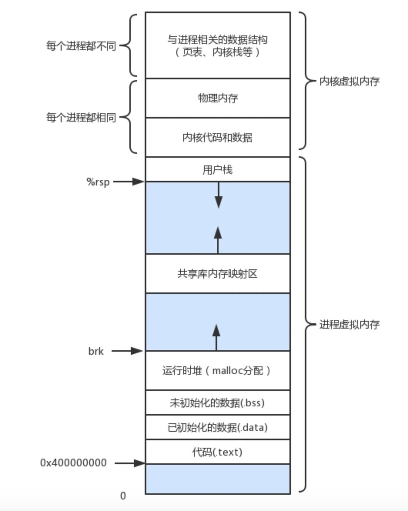
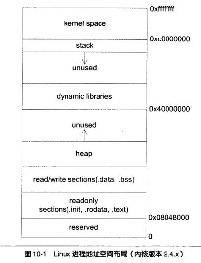

### 认识
1. asm：assembly language，汇编语言，为cpu设计的指令，使用助记符表示。不同平台的指令集和寄存器不一样，这是汇编本身的性质
   - 分类
     1. intel x86
     1. plan9
     1. AT&T
1. 内存
   - 堆：heap，从低往高，动态内存区域。自由、随时申请和释放，大小自定义。堆由操作系统的堆管理器管理，c中malloc和free是堆相关的，程序自身对内存泄露负责
   - 栈：stack，从高往低，以栈帧为单位处理，是C一种数据结构，用于C自动完成内存分配和回收的小块内存，先入后出，栈低指针始终指向栈的开始，栈顶指针可以进行上下移动。所有的自动变量、函数形参、函数调用关系都存储在栈中，这个动作由编译器自动完成，写程序时不需考虑。栈区在程序运行期间是可以随时修改的。当自动变量超出其作用域时，自动从栈中弹出
     1. rsp、rbp从内存列表确定栈帧位置。函数栈帧：
     1. 栈就是一块连续内存区域，最先进入的内存地址最大，出口在最小内存地址那，是FILO的
     1. 每个线程都有自己专属的栈
     1. 栈的最大尺寸固定，超出则引起栈溢出
     1. 局部变量：C语言中，局部变量就是使用栈来实现的，在C中定义一个局部变量，编译器会在栈中寻找一块内存，将该局部变量压入栈对应的内存中，这个动作是栈自动完成的，不需要写代码来操作这一个过程，在函数退出的时候，栈将其中的元素从栈顶开始依次弹出，所有的局部变量就自动销毁了。栈里边的内存空间是进进出出反复使用的，这样就是局部变量未初始化值是随机数的原因
     1. 栈的约束：有固定大小的，栈的大小不好设置，太小怕溢出，太大怕浪费，所以栈不够灵活，在局部变量定义过多或者过大时，或者递归层级过多时，就有可能造成栈溢出
     1. 栈分配要快得多，已经明确大小的(知道值的)，不会太大的，使用栈，否则用堆
     1. 栈的变量是局部的，随着局部空间的销毁而销毁，由系统负责。堆的变量可以提供全局访问，需要自行处理生命周期
   - 用户内存和操作系统内存是分开的，依次往上为操作系统内存栈，自由分配区，堆，数据区，代码区，数据区存常量变量
   - 全局区(静态区)：存放全局和静态变量、常量，可读可写，由编译器决定的固定空间
   - 字面量区：常量字符串存储区
   - 代码区：text，程序被操作系统加载到内存的时候，所有的可执行代码都加载到代码区，这块内存在程序运行期间不变，放在低位不会被堆栈溢出覆盖
   - 图示：
1. 寄存器
   - 认识：是cpu的存储结构，可用来暂存指令、数据和地址。是cpu运算时最频繁、最快速的一种方式
   - 分类
     1. 通用寄存器：存短暂保存的数据
        - ah/al：8 位
        - ax/bx/cx/dx：16 位
        - eax/ebx/ecx/edx：32 位
        - rax/rbx/rcx/rdx：64 位，用16进制表示就是0x0000000000000000，因为2进制和16进制转换就是2的4次方
        - di/si/rdi/rsi/edi/esi：内存操作指令中作为“源地址/目的指针”使用
        - r8-r15
     1. 指令寄存区：存储将要执行的指令的内存地址
        - pc
        - rip
        - eip
     1. 段寄存器：存下一个要执行的指令地址，包括段地址和偏移地址寄存器
     1. 栈地址寄存器：做堆栈操作，包括基址和偏移寄存器
        - bp/rbp：栈基址寄存器
        - sp/rsp：栈顶寄存器
     1. 标志寄存器：记录各种运算结果，如是否为0，是否发生溢出
        - eflags
   - plan9
     1. 规则
        - 没有r或e的前缀
     1. 伪寄存器
        - pc：即意义和作用都是指令寄存器，amd64上是rip
        - fp：使用symbol+offset的方式，引用函数的输入参数，如`arg1+8(FP)`
          1. 不加symbol时，无法通过编译，只是是为了提升代码可读性
        - sb：全局静态基指针，一般用来声明函数或全局变量
        - sp：指向当前栈帧的局部变量的开始位置，使用symbol+offset的方式引用函数的局部变量
          1. offset的合法取值是-framesize到0，注意是个左闭右开的区间。假如局部变量都是8字节，第一个局部变量就可用localvar0-8(SP)来表示
          1. symbol+offset(SP)形式表示伪寄存器SP。offset(SP)则表示硬件寄存器SP
1. 指令
   - mov
   - lea：取有效地址至寄存器
   - push/pop
   - jmp
   - call：函数调用，CALL指令将其返回地址压入堆栈，再把被调用过程的地址复制到指令指针寄存器。当过程准备返回时，它的 RET 指令从堆栈把返回地址弹回到指令指针寄存器
   - ret：返回
   - plan9
     1. 常数：$num表示，默认十进制，用$0x123表示十六进制
     1. 栈调整：没有pop、push，通过SP进行运算实现
     1. 数据搬运
        - 方法：可实现数据、寄存器、内存三者间的数据搬运，长度由mov的后缀确定
          1. MOVB：1 byte，byte
          1. MOVW：2 bytes，word
          1. MOVL：4 bytes，long
          1. MOVQ：8 bytes，quadword
        - 方向：和intel相反，左到右
     1. 计算指令，也是后缀对应不同长度
        - ADD
        - SUB：减
        - MUL：乘
        - DIV：除
        - AND：逻辑与
        - OR
        - NOT
     1. 跳转
        - JMP：无条件跳转
        - JL：Jump if less
        - JLZ：Jump if less or equal
        - JE：Jump if equal
        - JNE：Jump if not equal
        - JG：Jump if greater
        - JGE：Jump if greater or equal
        - JZ：Jump if equal zero
        - JNZ：Jump if not equal zero
     1. 方法调用
        - CALL
     1. 取地址
        - LEA
     1. SIMD
1. 寄存器和内存
1. wiki
   - 汇编文件：.s和.S结尾
   - 程序由操作系统将其可执行二进制文件整体加载到内存中才能运行，二进制文件包含了程序的代码段、数据段。段寄存器就是定位这些内存的主要方式。通过段寄存器，cpu可以使用普通寄存器读取或者改变内存中的数据