### 数据相关
1. 文件格式
   - 二进制：如 PNG
   - 数据：如 SQLite
   - 文档：如 Markdown
   - 配置：如toml
   - 编程语言：如 JavaScript
#### 二进制相关
1. 进制转换
   - 2/8/16转10：从右往左(低位到高位)，第n位的权值是 当前位的值m * 2/8/16的n次方，n依次递增，最后结果相加即结果，n从0开始。如101011为43，2B为43
   - 10转2/8/16：除2/8/16取余法，即每次将整数部分除以2，余数为该位权上的数，而商继续除以2，余数又为上一个位权的数，一直持续直到商为0，最后从最后的余数读起一直到最前面的一个余数，即反过来读取
   - 2转8/16：取三合一法/取四合一法，用三位二进制表示一位八进制，用四位二进制表示一位十六进制数
   - 8/16转2：取一分三法/取一分四法
   - 8、16互转：通过先转为2实现
1. 位运算：就是对两个二进制数进行计算，对齐位置进行计算，执行效率非常高带来性能很高
   - 分类
     1. &：按位与，都1则1，可用于将数清零、取一个数的指定位(取位的用1)、判断奇偶(&1)
     1. |：按位或，有1则1，可用于数指定位置为1
     1. ^：按位异或，相同为0，不同则1，可用于翻转指定位、交换两个数
     1. ~：取反，可用于使最低位为0(a & ~1，因为~优先级最高)
     1. <<：左移，整体移一下，总位数不变，高位丢弃，低位补0，如果舍弃高位不包含0相当于每移动一位就乘2，如左移2位`a << 2`
     1. >>：右移，高位补0，每右移一位相当于除以2。有符号数，各编译器处理方法不一样，有的补符号位（算术右移），有的补0（逻辑右移，正数左补0，负数左补1，右边丢弃）
   - 举例：bitMap位图的操作
     1. `set_bit(char x, int n);`：将x的第n位置1，`x |= (x << n)`
     1. `clr_bit(char x, int n);`：将x的第n位清0，`x &= ~(1 << n)`
     1. `get_bit(char x, int n);`：取出x的第n位的值，`(x >> n)`
     1. 除法操作：x/8改为x>>3，x%8改为x&7
1. 存储
   - 字节序
     1. 认识：存储方式，`0x2211使用两个字节储存：高位字节是0x22，低位字节是0x11`
        - 电路先处理低位字节，效率比较高。除了计算机内部处理，其他场合都是大端字节序，如网络传输和文件存储
        - 原则
          1. 只有读取的时候，才必须区分字节序，其他情况都不用考虑
     1. 分类
        - 大端字节序：高位字节在前，低位字节在后，这是人类读写数值的方法
        - 小端字节序：低位在前，高位在后，即以0x1122形式储存
#### 编码相关
1. 编码分类
   - hex：机器码的16进制编码
   - urlencode
     1. 认识：对特殊部分进行编码，符合url请求传递
        - 非字母、汉字转换成"%xy"的两位16进制的形式
     1. 特点
        - +表示空格
        - +本身会被编码为%2B
        - url请求中带有+，服务器默认是编码后的结果，就会解析为空格
        - php中$_GET和$_REQUEST已经被解码了。对$_GET或$_REQUEST里的元素使用urldecode()将会导致不可预计和危险的结果，可用rawurldecode
   - base64
     1. 认识
        - 为了使二进制数据可以通过非纯 8-bit 的传输层传输，例如电子邮件的主体，要比原始数据多占用33%左右的空间
     1. 特点
        - 编码后有/、+、=等字符，php的base64url_encode需要自己写
1. 字符编码
   - 认识：为每一个字符分配唯一的码位
   - 编码维度
     1. 输入码：如搜狗输入法+键盘编码
     1. 字符码：ASCII，Unicode，GBK，GB2312
     1. 机内码：UTF-8，UTF-16，GB2312+8080H
     1. 字形码：点阵，字体，字库
   - ASCII
     1. 认识：美国信息交换标准代码，用于把数字表示为字符，早期使用，7个比特，提供128个字符值，包括数字、英文、显示符号、控制字符
        - 基于拉丁字母的主要用于显示现代英语和其他西欧语言现今最通用的单字节编码系统，等同于国际标准ISO/IEC646
     1. 组成
        - 标准ASCII码：使用7bite（剩下的1位二进制为0）表示
          1. 大/小写字母
          1. 数字0-9
          1. 标点符号
          1. 美式英语中的特殊控制字符：LF（换行）、CR（回车）、FF（换页）、DEL（删除）、BS（退格)、BEL（响铃）
          1. 通信专用字符：SOH（文头）、EOT（文尾）、ACK（确认）
        - 扩展ASCII码：后128个，即128到255
   - GB2312
     1. 认识：ASCII的中文扩展。小于127的不变，两个大于127的字符连在一起表示一个汉字。前边的高字节0xA1~0xF7，低字节0xA1~0xFE，还包括两个字节的数字/标点称为全角字符。这一系列汉字编码称为DBCS(Double Byte Charecter Set 双字节字符集)，最大特点是两字节的汉字字符和一字节的英文字符并存于同一套编码方案里，
     1. 分类
        - GBK：增加2万汉字(包括繁体)和符号，只要第一个字节大于127就固定表示一个汉字的开始
        - GB18030：增加几千少数民族字
   - Unicode
     1. 认识：为每个字符指定唯一的4字节编码。广义上理解是定义了一个字符集一系列编码规则的标准。Unicode联盟制定了兼容多语言的Unicode标准，涵盖了世界上的所有字符、标点和符号。目标是用标准的Unicode转换格式(UTF)取代现有的字符集。现在广泛使用，联盟与领导性的标准发展组织进行合作，比如ISO、W3C、ECMA。现代浏览器默认字符集是ISO-8859-1，属于ISO制定的针对不同语言的字符集。所有的一个字符都是两个字节，半角符号扩充为两个字节
     1. 编码规则
        - 认识：即Unicode转换格式，将码位转换为字节序列的规则。是unicode的实现形式/编码方式，是字符网络传输、存储的标准，不能一字节的ASCII码都补0
        - 分类
          1. UTF-8：变长的字符编码方式，用1-4个字节表示字符，主旨是用最少的位数表示最多的信息，在ASCII码范围内为一个字节，5万多汉字占3个字节，6万多其他汉字占4个字节。按照UTF-8的模式，它还可以扩展到5字节，乃至6字节变长，但Unicode说了码点就到10FFFF，不扩充了，所以UTF-8最多到四字节足够
          1. UTF-16：16比特，能够对全部Unicode指令表进行编码，主要用于操作系统和环境
     1. 比较
        - 因为utf8编码的字符串长度和字符个数没有固定换算关系，导致排版，排序之类的复杂度上升
          1. 内存存储字节流的时候，字符不定长会给算法带来麻烦。比如你没法确定第2000个字符在哪个字节开始。就得扫过整个字节流
          1. 定长编码内存中可快速访问，处理起来效率高
        - utf8没有字节序，传输和存储很方便，传输和存储
1. 换行符
   - linux：<换行>，\n
   - windows：<换行><回车>，\n\r
   - mac：<回车>，\r
   - unix/mac的文件windows打开，所有文字变成一行
   - windows的文件在unix/mac打开，每行结尾可能会多出一个^M符号
1. 数据序列化
   - xml：是完整的标记语言
   - json：Javascript Object Notation，轻量级的数据交换语言，具有自我描述性且易于让人阅读，是Javascript的一个子集，但JSON是独立于语言的文本格式
     1. 比XML更小、更快，更易解析,以及浏览器的内建快速解析支持
   - protocol buffers
     1. 认识：语言无关、平台无关、可扩展的序列化结构数据的方法，二进制格式，用于网络通信、通用数据交换、数据存储等场景，google推出
        - 比xml、json小几倍，快几十倍
        - 更高的时间效率和空间效率，适合对数据大小和传输速率比较敏感的场合使用
     1. 作用
        - 加速数据传输速度
        - 解决数据传输不规范
     1. 比较
        - XML、JSON、protobuf都具有数据结构化和数据序列化的能力
        - XML、JSON更注重数据结构化，关注人类可读性和语义表达。protoBuf更注重数据序列化，关注效率、空间、速度，人类可读性差，语义表达能力不足（为保证极致的效率，会舍弃一部分元信息）
        - protoBuf的应用场景更为明确，XML、JSON的应用场景更为丰富
     1. 组成
        - messages：消息格式
        - 字段修饰符：每个字段唯一的数值标签
          1. singular：成员0或1个，一般省略
          1. repeated：该字段可包含0~n个元素
        - 常用数据类型：double、float、int32/64、bool、string、bytes
        - service：可以定义一个rpc服务接口
     1. 使用
        - 创建.proto文件，定义数据结构
        - protoc编译.proto文件生成读写接口
        - 调用接口实现序列化、反序列化以及读写
     1. 实例
        ```proto
        syntax = "proto3";

        package = xx.xx.xx;                     // 包名

        service Product {                       // 定义的服务
            rpc AddProduct() returns () {}
        }

        message ProductInfo {
            int64 id = 1;                       // 1是字段标识符
            string name = 2;
        }
        message ResponseProduct {
            int64 id = 1;
        }
        ```
   - msgpack
     1. 认识：高效的二进制序列化格式，比json更快、更小
        - msgpack可以直接序列化类对象，protobuf需要先写描述映射文件(.proto)
1. 哈夫曼编码
   - 认识：Huffman Coding，用二进制数和贪心算法代替字符来编码长字符串，实现对数据压缩编码，有效节省数据存储空间
     1. 难点是将要解决的问题抽象成贪心算法模型
     1. 贪心算法解决问题的正确性很多时候看起来是显而易见的，但证明算法是最优解并不容易
     1. 编码一般都很简单
   - 原理
     1. 结构：哈夫曼树搭配对应表
     1. 编码：考察文本有多少不同字符，还根据每个字符出现频率的不同选择不同长度的编码。频率多字符用短编码，频率少字符用长编码，用不等长编码进一步增加压缩效率
        - 如何根据字符的频率进行不同长度的编码？构建哈夫曼树，最小频率的字符作叶子节点，新建频率为两个字符节点频率之和的共同父节点，把这个父节点加入到先级队列中，直到构建完所有的
     1. 解码：由于不等长，其要求各个字符编码之间不会出现某个编码是另一个编码的前缀，如遍为1、01、001、0001不会为起前缀
#### 数据应用方式
1. 正则
   - 认识：描述文本模式的特殊用法，用于分割、查找、匹配、替换
     1. POSIX派系 (Portable Operating System Interface) 标准公诸于世，它制定了不同的操作系统都需要遵守的一套规则，其中就包括正则表达式的规则。Perl引入的正则表达式功能是颗耀眼明珠
        - 如grep ，sed 和 awk
     1. pcre派系：Perl Compatible Regular Expressions，Perl兼容正则表达式，是一个由Philip Hazel开发的、为了把 Perl 语言中正则的功能移植到其他语言中，全面仿制 Perl 的正则表达式的语法和语义，为很多现代工具所使用的库，如Python ， PHP 和 Java
     1. 正则从数学中来
   - 组成
     1. 通用原子
        - \d\D
        - \w：匹配大小写字母、数字、下划线
        - \W
     1. 普通字符
        - [ABC]：匹配[]中所有字符
        - [^ABC]：匹配除了[]中所有字符
        - [A-Z]：区间
        - .：匹配除换行符（\n、\r）之外任何单个字符
        - [\s\S]
     1. 非打印字符
        - \cx	匹配由x指明的控制字符。例如， \cM 匹配一个 Control-M 或回车符。x 的值必须为 A-Z 或 a-z 之一。否则，将 c 视为一个原义的 'c' 字符
        - \f	匹配一个换页符
        - \n	匹配一个换行符
        - \r	匹配一个回车符
        - \s	匹配任何空白字符，包括空格、制表符、换页符等等
        - \S	匹配任何非空白字符
        - \t	匹配一个制表符
        - \v	匹配一个垂直制表符
     1. 限定符
        - *         匹配0个或多个单字符
        - +         匹配1个或多个单字符
        - ?         匹配0个或1个
        - {n,m}     标记限定符表达式的开始，{n} {n,} {n,m}，字符重复次数的范围
     1. 定位符
        - ^         只匹配行首
        - $         只匹配行尾
        - \b    	匹配一个单词边界，即字与空格间的位置
        - \B	    非单词边界匹配
     1. 特殊字符
        - |         或
        - [,]       标记一个中括号表达式的开始，只匹配[]内字符，,表示多字符序列，-表示字符序列范围
        - ()        标记一个子表达式的开始和结束位置，分组与取值
        - \         转义符，屏蔽一个元字符的特殊含义
     1. 分隔符：/斜线 #hash符号 ~取反符号
     1. 模式修正符：i m e s U x A D u(用于utf8模式下的匹配)
     1. 非捕获元字符：?: ?= ?!
   - 特性
     1. 选择：可用$0...$9等属性获取()的匹配内容
     1. 反向引用
     1. 后向引用：一个字符类外面，反斜线紧跟一个大于0的数字就是之前出现的某个捕获组的后向引用
        ```php
        $str = '<b>abc</b>'
        $pattern = '/<b>(.*)<\/b>/';
        preg_replace($pattern, '\\1', $str);        // 用\\1后向引用括号中匹配到的
        ```
     1. 贪婪模式
        ```php
        $str = '<b>abc</b><b>bcd</b>'
        $pattern = '/<b>.*?<\/b>/';                 // ?取消贪婪模式，要不一直往后匹配
        $pattern = '/<b>.*?<\/b>/U';                // U取消
        preg_replace_all($pattern, '\\1', $str);
        ```
     1. 断言：分为前瞻断言/后瞻断言，正面断言(?<=)/消极断言(?<!)
   - 步骤
     1. 写出要匹配的字符串
     1. 从左向右使用原子和元字符拼接
     1. 加入模式修正符
   - 实例
     1. 匹配数字、逗号：`preg_match('/^\d+(?:,\d+)*$/ ', $a)`
     1. 匹配手机号：`preg_match("/^(1([34578]))\d{9}$/", $mobile)`
     1. 4到6位数字：`preg_match("/^\d{4,6}$/", $code)`
     1. 匹配中文+数字，不能是纯中文，也不是纯数字：`preg_match('/^(?!\d+$)(?![\x{4e00}-\x{9fa5}]+$)[\x{4e00}-\x{9fa5}\d]+$/u', $string)`
     1. 匹配英文逗号分隔数字：`!preg_match('/^\d+(\,\d+){0,}$/', $params['ids'])`
     1. 匹配img标签中的src值
        ```php
        $str = '';
        $pattern = '/"/i';
        preg_match($pattern, $str, $match);
        var_dump($match);
        ```
   - 引擎
     1. DFA
     1. NFA
     1. POSIX NFA
   - 工具
     1. peretest：命令行，帮忙判断是否匹配
### 数据结构
1. 认识
   - 特点
     1. 专注于快和省
     1. 可以更加高效的处理某些操作，另外一些操作也许是低效的
     1. 以数据为中心。如果已经选择了正确的数据结构并且把一切都组织得井井有条，正确的算法也就不言自明。编程的核心是数据结构，而不是算法。花哨的算法比简单算法更容易出bug、更难实现。尽量使用简单的算法配合简单的数据结构
   - 组成
     1. 物理结构
     1. 逻辑结构
     1. 数据运算
   - 思想
     1. 空间换时间/时间换空间：看需要哪个
1. 结构分类
   - list：线性表，就是数据排成像一条线一样的结构，数据之间只有前后关系，与之对应的是非线性表
     1. 数组
     1. 链表
        - 单链表
        - 双向链表
        - 循环链表
          1. 双向循环链表
        - 静态链表
     1. 栈
        - 顺序栈
        - 链式栈
     1. 队列
        - 普通
        - 双端
        - 阻塞
        - 并发
        - 阻塞并发
   - hash table
   - tree
     1. 二叉树
        - 满二叉树
        - 完全二叉树
        - 二叉查找树
        - 平衡二叉树
        - 平衡二叉查找树
          1. AVL树
          1. 红黑树
     1. 多路查找树
        - B树
        - B+树
        - 2-3树
        - 2-3-4树
     1. 堆
        - 小顶堆、大顶堆
        - 优先级队列
        - 斐波那契堆
        - 二项堆
     1. 其他
        - 树状数组
        - 线段树
   - graph
1. 理解
   - 时间复杂度：
   - array因为连续内存空间可以利用cpu缓存内存预读更快，而list动态扩容不用搬迁数据，list多了指针的内存占用，频繁修改会增加GC成本
   - 为什么哈希表和链表经常一块使用：因为用哈希表解决链表的查询慢缺点，链表可以提供排序好的数据，如LRU缓存结构、LinkedHashMap
   - 链表和树
     1. 如果链过长，为提高查找效率可将链表换成其他更加高效的数据结构，如平衡二叉查找树等
     1. 工程中但凡用到动态插入、删除、查找数据的场景都可以用红黑树。不过实现起来比较复杂，自己写代码实现难度会有些高，这个时候用跳表来替代
   - 二叉树和哈希表
     1. 哈希表中数据是无序存储的，二叉树中序遍历即可O(n)输出
     1. 哈希冲突性能不稳定，一般和O(logn)差不多，还有哈希函数耗时，平衡二叉查找树性能稳定O(logn)
     1. 哈希表要考虑哈希函数设计、冲突解决、扩缩容，平衡二叉查找树只考虑平衡
   - 链表的升级版就是跳表、红黑树
   - 树的重点：满二叉树、完全二叉树、二叉查找树、平衡二叉查找树
#### 线性表
1. array
   - 认识：数组/向量/顺序线性表，使用连续内存存储一组具有相同类型或衍生的数据，用下标访问，下标从0开始(从1cpu需要多一次减法计算)，最简单最广泛
     1. 优点
        - 按照下标查询元素速度快
          1. 支持随机访问，根据下标随机访问的时间复杂度为O(1)
          1. 排好序的数组二分查找为O(logn)
        - 按照下标遍历数组方便
     1. 缺点
        - 大小固定后无法扩容
        - 只能存储一种类型数据
        - 添加，删除的操作很慢，因为要移动其他的元素
          1. 在每个位置插入/删除元素的概率是一样的，所以平均情况时间复杂度为(1+2+...n)/n=O(n)
          1. 数组元素没规律的话，添加时可以只把那个位置原来的挪走
          1. 删除时可用垃圾回收标记清除法，一次性统一删
   - 适用场景：频繁查询，很少增加和删除，存储占用不大
1. list
   - 认识：链表，逻辑顺序通过其指针地址实现，内存非连续、非顺序，最基础的动态数据结构
     1. 是基于指针的
   - 组成
     1. data：应该也是一个定长的类型，要不然没法寻址
     1. 头节点：记录链表的基地址
     1. 尾节点：这个节点指向了一个空地址NULL
   - 分类
     1. linked-list：单链表
        - 认识：单链表，只有一个方向
        - 优点
          1. 不需要初始化容量，可任意加减元素
          1. 添加或者删除元素时只需要改变前后两个元素节点的指针域指向地址即可，所以添加、删除很快
        - 缺点
          1. 因为含有大量的指针域，占用空间较大
          1. 查找元素需要遍历链表来查找，非常耗时
        - 适用场景：数据量较小，需要频繁增加，删除操作的场景
     1. cyclic-linked-list：循环链表
        - 认识：循环链表，特殊单链表，尾节点指向了头节点
        - 优点：从链尾到链头比较方便，如约瑟夫问题相比用单链表解决更简洁
     1. doubly-linked-list：双向链表
        - 认识：双向链表，包括一个关键字key、两个指针next和prev，两个方向
        - 特点：占用更多空间，但是某些条件新增删除更高效
          1. 删除时很容易找到待修改节点的前驱和后驱节点进行修改，更高效
          1. 有序链表下记录上次查询节点，平均只需要查找一半的数据即可得出
     1. doubly-cyclic-linked-list：双向循环链表
        - 认识：你懂！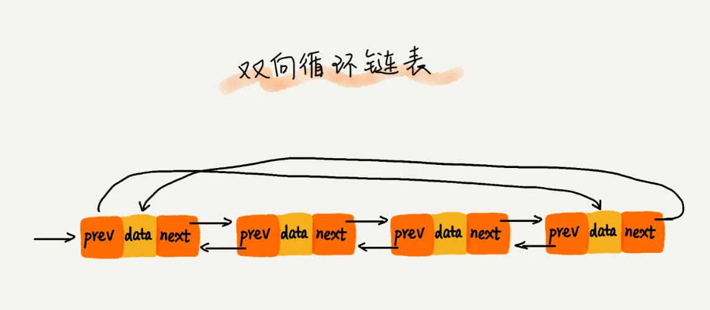
     1. 静态链表
   - 操作
     1. 链表反转
     1. 有序链表合并
   - 缓存淘汰策略
     1. FIFO：First In First－Out，先入先出
     1. LIFO：Last In First Out，先入后出
     1. LFU：Least Frequently Used，最少使用算法，需要额外空间记录字块的使用频率
     1. LRU：Least Recently Used，最近最少使用算法
        - 链表的实现思路：维护一个有序单链表，越靠近链表尾部的节点是越早之前访问的。当有新数据被访问时，从链表头开始顺序遍历链表，复杂度是O(n)
          1. 如果此数据之前已经被缓存在链表中，我们遍历得到这个数据对应的节点，并将其从原来的位置删除，然后再插入到链表的头部
          1. 如果此数据没有在缓存链表中，缓存未满将此节点插入到链表头；缓存已满将链表尾节点删除，将新的数据节点插入链表的头部
        - 工业级实现：结合hash table和list来记录每个数据的位置，将增删改查的时间复杂度都降到O(1)。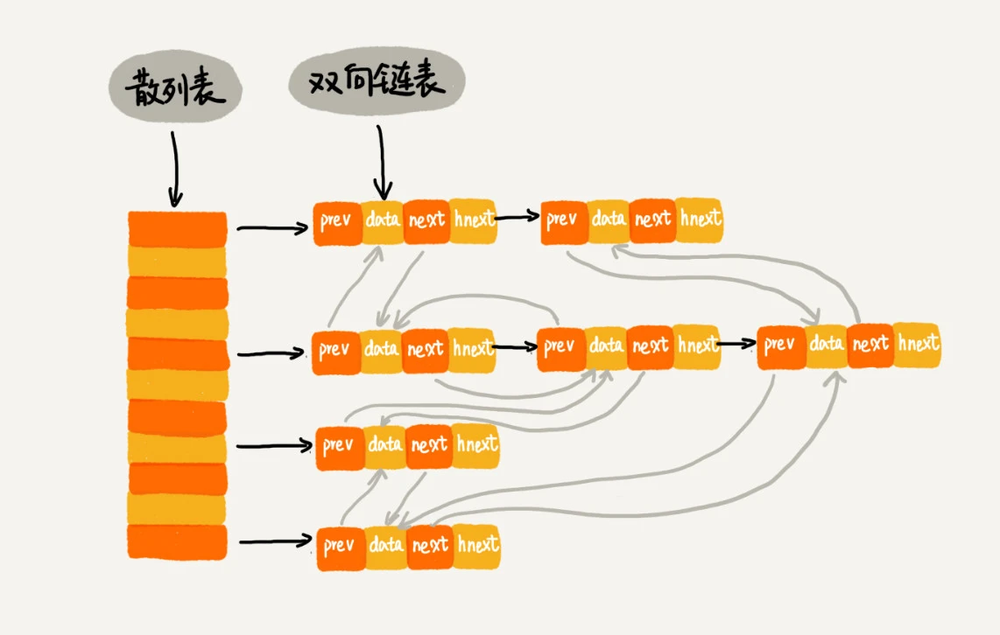
          1. 每个节点会在两条链中，双向链表和哈希表中的拉链，前驱和后继指针是为了将节点串在双向链表中(会跨不同槽位的链表哦，指明在链表中的位置)，hnext指针是为了将节点串在哈希表的拉链中(指明是哪个槽位的链表)，即改造hash_table的链表结构，数据data只存一份，但是指针各有用处
          1. 查找：O(1)，然后移动到链表尾
          1. 删除：O(1)找到，双向链表删除也是O(1)
          1. 插入：先看是否在链表中，在移动到尾部，不在看链表是否满，满了删除头部新的移动到尾部，没满新的移动到尾部
1. stack
   - 认识：栈，线性表，只有栈顶一个出口，先进后出
     1. 入栈和出栈过程中，只需要一两个临时变量存储空间，所以空间复杂度是O(1)
     1. 实现上有顺序栈和链式栈
   - 适用场景：用于实现递归，例如函数调用栈(每个函数有一个自己的栈帧、陷入后出)、表达式求值(一个保存操作数的栈，一个保存运算符的栈，互相比较执行最终实现计算)、斐波那契数列、浏览器前进后退功能(一个记录浏览过的后退栈，一个后退过的前进栈)
   - 操作
     1. 入栈：push
     1. 出栈：pop
1. queue
   - 认识：队列，只能在一端添加元素，而在另一端取出元素，是一种操作受限的线性表数据结构，FIFO 先进先出
     1. 基本操作
        - 入队：enqueue，放一个数据到尾部
        - 出队：dequeue，从头部取一个元素
     1. 实现方式
        - 顺序队列：基于数组，一个数组中，搭配head和tail两个指针指向队列的位置
          1. 随着不停地进行入队出队操作head和tail都会持续往后移动
          1. 顺序队列的假溢出现象：前边有空位，但是后边尾指针已经挤出队列外了
             - tail走到数组末尾时的数据搬迁逻辑：触发集中搬迁提高效率，将head到tail之间的数据平移到0到tail-head的位置
        - 链式队列：基于链表，一个链表中，搭配head和tail两个指针指向队列的位置
   - 分类
     1. 双端队列
        - 认识：Deque Double-ended queue，也称首尾链表，元素可以在队列两端入队或出对的线性表
        - 基本操作
          1. 头：读、入、出
          1. 尾：读、入、出
        - 实现
          1. 队满的判断条件是tail == n，队空的判断条件是head == tail
     1. 环形队列
        - 认识：ring buffer/ring queue，循环队列/环形缓冲区，固定尺寸的头尾相连的队列，是Deque的一种实现方式
        - 背景：解决多线程共享数据使用互斥锁mutex作同步开销大的问题，必须遵循1个线程push in，另一线程pull out的原则；同时避免了队列某些情况的数据搬迁
          1. 一个数据元素被读出、写入后其余数据元素不需移动其存储位置，避免了队列tail == n(队列长度)时需要将head到tail间的数据整体搬移到0到 tail-head的位置的数据搬迁成本
          1. 适合于事先明确最大容量缓冲区的的情形：如果缓冲区的大小需要经常调整，就不适合用环形缓冲区，因为在扩展缓冲区大小时，需要搬移其中的数据，这种场合使用链表更加合适，可用一个静态数组来充当缓冲区，无需重复申请内存
        - 实现
          1. 队空队满检测：队空时head==tail，队满时tail占用一个单位，即指向的位置没有存储数据，并且着head，即`(tail + 1) % n == head`
          1. 因为缓冲区成头尾相连的环形，写操作可能会覆盖未及时读取的数据。选择何种策略和具体场景是否允许
          1. cas的机制是如何的呢？
     1. 阻塞队列
        - 认识：在队列基础上增加了阻塞操作，做生产者-消费者模型，协调生产和消费的速度
          1. 队列为空时取数据会阻塞
          1. 队列已满时写数据会阻塞
     1. 并发队列
        - 认识：线程安全的队列，直接在操作上加互斥锁，并发度比较低，但是基于数组的循环队列利用CAS原子操作更高效
1. skip list
   - 认识：跳表，就是给有序链表建立多层级的索引，实现快速定位查找。可实现快速的插入、删除、查找，甚至可以替代红黑树，redis的有序集合SortedSet利用其+哈希表实现
     1. 搜索过程找目标范围时会“下降”到更细的层级的，按照一层层的点路径下降确定位置，“高度”就是索引层数，可以选择抽取的粒度如每n个抽取一层
     1. 基于单链表实现了二分查找，空间换时间，查找/插入/删除复杂度为O(logn)
   - 操作
     1. 插入：要先查询 O(logn) 才能插入 O(1)，所以为O(logn)
     1. 删除：不仅要删除索引中，而且要查找到前驱节点，双向链表简单些
     1. 跳表索引动态更新
        - 背景：多次插入时不更新索引可能出现某2个索引节点之间数据多，极端情况下会退化成单链表
        - 解决方案：通过随机函数维护平衡性，随机决定将这个节点插入到哪几级索引中，怎么随机嘿嘿嘿
#### 哈希表
1. hash table
   - 认识：哈希表/散列表/map/映射/字典/键值对。通过key和value直接访问的数据结构
     1. 有哈希表碰撞攻击
     1. 利用数组支持按照下标随机访问数据的特性，发挥快速的查找优势，插入/删除慢，时间复杂度O(1)
   - 通常实现：底层存储基于数组链表，即拉链法，数组的成员是指向一个链表头的指针。先找链表再从链表中找元素
     1. 把key通过固定的哈希函数转换成整型数字，然后将该数字对数组长度进行取余结果当数组下标，称为桶bucket/槽slot
   - 分类
     1. set：集合，不重复的元素
   - 散列函数：决定了散列冲突的概率，也就决定哈希表的性能
     1. 基本要求
        - 计算结果是非负整数，因为要用在数组下边
        - 如果key1=key2，那hash(key1)==hash(key2)
        - 如果key1≠key2，那hash(key1)≠hash(key2)，避免哈希冲突，所有算法都不完美
     1. 优化要求
        - 尽可能让散列后的值随机且均匀分布，会尽可能地减少散列冲突，即便冲突分布也均匀
        - 太复杂会太耗时间
     1. 设计方法：如每个字母的ASCll码值“进位”相加，然后再跟哈希表大小求余、取模，作为散列值。还有直接寻址法、平方取中法、折叠法、随机数法
   - 冲突解决
     1. 开放寻址
        - 认识：如果冲突就重新探测一个空闲位置插入，用于数据量小/装载因子小，java的ThreadLocalMap使用
          1. 可有效地利用cpu缓存加快查询
          1. 冲突代价更高，装载因子低更浪费内存
          1. 删除需要特殊标记
        - 解决方案
          1. 线性探测：依次循环数组往后数然后插入；查找时在对应hash的数组位置找不到还得往后看一直到空闲停止；删除也不能简单置空否则影响查找，要标记为删除。所以查找、插入、删除的复杂度都为O(n)
          1. 二次探测：将线性探测每次1个探测步长改为从0递增的2次方
          1. 双重散列：就是不断尝试下一个哈希函数直到找到空闲位置
     1. 链表法
        - 认识：数组结合链表的一种结构，相同哈希的放到相同槽位的链表中，更简单更常用，插入复杂度O(1)，查询/删除复杂度O(k)(对比较均匀的哈希函数来说)
          1. 更大装载因子，即便装载因子变成10，效率也不会降很多，最多链表长，但是链表复杂度是O(n)
          1. 链表cpu缓存不友好
          1. 如果对链表再加改造，就可以是跳表、红黑树，查询变O(logn)，不怕攻击
     1. 比较
        - 基于链表的散列冲突处理方法比较适合存储大对象、大数据量的哈希表，而且，比起开放寻址法，它更加灵活，支持更多的优化策略，比如用红黑树代替链表
   - 装载因子：表示空位比例多少，哈希表中空闲位置不多时不管哪种探测方法，冲突概率大大提高。为尽可能保证哈希表的操作效率会尽可能保证一定比例的空闲槽位
     1. 装载因子过高时效率下降，过低时浪费内存，需要动态扩缩容
   - 动态扩缩容
     1. 认识：调整装载因子
        - 分步扩容：扩容时因为要搬迁数据操作会很慢，采用扩容穿插在插入操作中分批完成，当装载因子触达阈值后只申请新空间，不将老数据搬迁，新插一个搬迁一个老的直到全部完成，查询时先查新后查老，这样插入数据的复杂度是O(1)
1. 最佳实践
   - 工业级哈希表的要求
     1. 支持快速增删改查
     1. 内存占用合理，不能浪费过多的内存空间
     1. 性能稳定，极端情况下，哈希表的性能也不会退化到无法接受的情况
   - LinkedHashMap：通过哈希表和双向链表实现，Linked指双向链表。按照访问时间排序的LinkedHashMap本身就是一个支持LRU缓存淘汰策略的缓存系统，二者实现原理也一模一样
     1. 初始大小：默认16，提前设置好预计的大小，大大提高性能
     1. 装载因子阈值和扩容：0.75，每次扩两倍
     1. 冲突解决：链表法，jdk1.8后链表长度超过8换成红黑树
#### 树
1. tree
   - 认识：树，由n个有限节点组成一个具有层次关系的集合，看起来像倒挂的树，节点左右横联的不是树
     1. 没有父节点的节点称为根节点
     1. 每个节点有零个或多个子节点
     1. 每一个非根节点有且只有一个父节点
     1. 除了根节点外，每个子节点可以分为多个不相交的子树
   - 概念
     1. 高度：节点到叶子节点的最长路径，树的高度就是根节点的高度
     1. 深度：根节点到节点的最长路径
     1. 层：深度+1
1. 二叉树
   - 认识：binary tree，添加/删除元素都很快，查找有很多算法优化，既有链表好处，也有数组好处，是两者的优化方案，在处理大批量动态数据方面很有用
     1. 每个节点最多有两颗子树，即左子树和右子树
     1. 左子树和右子树是有顺序的，次序不能颠倒
     1. 即使某节点只有一个子树，也要区分左右子树
   - 分类
     1. 满二叉树：除了叶子节点每个节点都有左右两个子节点
     1. 完全二叉树：除最后一层外其他层都被完全填充，最后一层所有叶子节点都靠左排列。更满的满二叉树，因为要内存填满所以向左填满
        - 下标为i节点的左子节点为i*2，右子节点为i*2+1，父节点为i/2(下标从1开始存)
        - 下标为i节点的左子节点为i*2+1，右子节点为i*2+2，父节点为(i-1)/2(下标从0开始存)
        - n/2+1到n的数据都是叶子节点(下标从1开始存)
        - n个节点，树的高度不会超过log2^n
     1. 最优二叉树：即哈夫曼树，在叶子结点和权重确定的情况下，带权路径长度最小的二叉树
        - WPL：树的带权路径长度
   - 实现
     1. 链式：基于链表结构，每个节点的结构为data+左指针+右指针，通过根节点可以遍历所有节点，大部分的实现方式
     1. 顺序：基于数组结构，把根节点存储在下标i=1的位置，那左子节点存储在下标2*i=2的位置，右子节点存储在2*i+1=3的位置，通过下标计算获取节点，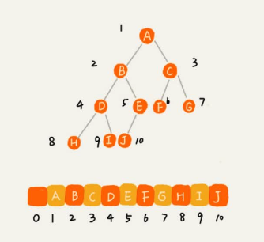
        - 父节点下标：i/2，左节点：2*i，右节点：2*i+1
        - 非完全二叉树会浪费空间，完全二叉树用数组最省内存不用多存两个指针
   - 遍历：复杂度O(n)
     1. 前序遍历：本身+左+右
     1. 中序遍历：左+本身+右
     1. 后序遍历：左+右+本身
1. 二叉树的应用
   - 二叉查找树
     1. 认识：二叉排序树，树中任意节点左子树中每个节点的值都要小于这个节点的值，而右子树则大于。支持动态数据集合的快速插入/删除/查找，最常用
        - 复杂度最差退化为链表为O(n)，复杂度和树的高度成正比
        - 在动态更新中可能出现树高度远大于logn导致效率下降，所以使用类似平衡二叉查找树的高度接近log2^n，复杂度也比较稳定是O(logn)
        - 可实现快速的插入、删除、查找
     1. 操作
        - 查找：可以二分查找了，小的往左，大的往右
        - 插入：要插入数据比节点大，并且右子树为空就插到右子树，如果不为空，就再递归遍历右子树，查找插入位置。左边同理
        - 物理删除
          1. 要删除的节点没有子节点，只需将父节点中指向要删除节点的指针置为null
          1. 要删除的节点只有一个子节点，只需将父节点中指向要删除节点的指针置为其子节点
          1. 要删除的节点有两个子节点，找到这个节点的右子树中的最小节点，把它替换到要删除的节点上，不找这个节点的左边是因为左边肯定比右边的小
        - 软删除：将节点标记为删除，删除变简单，浪费内存，没有增加查找、插入的复杂性
        - 查找最大节点、最小节点、前驱节点、后继节点
        - 中序遍历二叉查找树，可输出有序的数据序列，时间复杂度O(n)
     1. 特性
        - 支持重复数据存储
          1. 认识：用对象中某个字段作为键值构建二叉查找树，就会存在重复的数据
          1. 实现
             - 每个节点通过链表或支持动态扩容的数组等数据结构，把值相同的数据都存储在同一个节点上
             - 重复数据放右子树
               1. 查找时遇到值相同的节点不停止继续在右子树中查找，直到叶子节点停止
               1. 删除时按照以上查找依次删除
   - 平衡二叉树
     1. 认识：二叉树中任意节点的左右子树的高度相差不能大于1，满二叉树、完全二叉树都是
   - 平衡二叉查找树
     1. 认识：满足平衡二叉树和二叉查找树的特点
        - 解决普通二叉查找树在频繁的插入、删除等动态更新的情况下出现的时间复杂度退化的问题，看起来平衡，降低树高度，提高操作效率，不必强限制其定义
        - 通过左右旋的方式保持左右子树的大小平衡
     1. 红黑树
        - 认识：Red-Black Tree，一种不严格的平衡二叉查找树，所有语言中树结构的首选底层实现，即平衡二叉查找树的最佳。由2-3树演变来
          1. 根据红黑树的定义，红黑树的高度只比高度平衡的AVL树的高度(logn)仅仅大了一倍，性能上下降得并不多：去掉红色节点的四叉树高度要低于完全二叉树，完全二叉树高度近似log2^n，加回红色节点最长路径不会超过2log2^n，复杂度即2log2^n
          1. “近似平衡”就等价为性能不会退化的太严重，所以性能稳定，删除/插入不会太复杂
          1. 数据量小性能优势比链表不大
          1. 根节点到各个叶子节点的最长路径可能比最短大一倍
        - 定义：节点分红黑色
          1. 根节点是黑色的
          1. 每个叶子节点都是黑色的空节点(nil)，也就是说，叶子节点不存储数据
          1. 左右节点不能同时为红色
          1. 每个节点到达其可达叶子节点的所有路径，都包含相同数目的黑色节点
        - 平衡过程
          1. 理解：非平衡到平衡，把插入/删除破坏的第3、4条调整
             - 遇到什么样的节点排布，就对应怎么去调整
             - 基于关注节点做操作
          1. 节点操作
             - 左右旋转：左旋 围绕某个节点的左旋，右旋同样，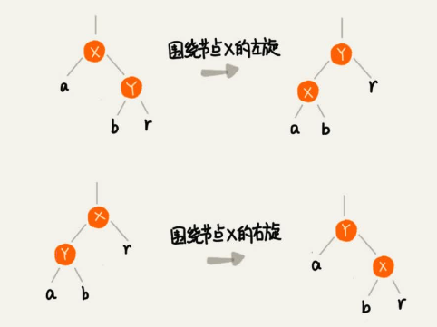
             - 改变颜色
          1. 术语
             - 关注节点：正在处理的节点，最开始的关注节点就是新插入的节点
     1. 其他
        - AVL树：严格符合平衡二叉查找树的定义，最早发明
        - play tree 伸展树/treap：树堆：绝大部分情况下操作效率都很高，无法避免极端情况下时间复杂度的退化
1. heap
   - 认识：堆/二叉堆
     1. 最大的特点是有序，一般用来做数组中的排序，称为堆排序
   - 定义 
     1. 是一个完全二叉树
     1. 堆中每一个节点的值都必须大于等于（或小于等于）其子树(或左右子节点)中每个节点的值，二叉查找树和其左右子节点则是一路变大/变小
   - 分类
     1. 大根堆/大顶堆：根节点最大
     1. 小根堆/小顶堆
     1. 斐波那契堆
   - 实现
     1. 存储：用数组，为啥肯定知道吧？连续内存
     1. 操作：调整满足堆特性的操作叫堆化，即不断递归对比节点和其子节点的大小然后交换，直到符合，交换可以避免移动的出现树节点的空洞
        - 比较、交换
     1. 插入：可以从下往上和从上往下两个方向进行操作
        - 特点：把新插入的数据放到数组的最后，然后从下往上堆化，或者反之，操作时间复杂度O(logn)
        - 代码
            ```java
            public class Heap {
                private int[] a;                                // 数组，从下标1开始存储数据
                private int n;                                  // 堆可以存储的最大数据个数
                private int count;                              // 堆中已经存储的数据个数

                public Heap(int capacity) {
                    a = new int[capacity + 1];
                    n = capacity;
                    count = 0;
                }
                public void insert(int data) {
                    if (count >= n) return;                     // 堆满了
                    ++count;
                    a[count] = data;
                    int i = count;
                    while (i/2 > 0 && a[i] > a[i/2]) {          // 自下往上堆化
                    swap(a, i, i/2);                            // swap()函数作用：交换下标为i和i/2的两个元素
                    i = i/2;
                    }
                }
            }
            ```
     1. 删除：删除节点后，迭代比较并将空洞的位置交换到叶子节点，这种有问题可能会不满足完全二叉树的特性
        - 特点：把数组中的最后一个元素放到被删除的位置，然后从上往下堆化，操作时间复杂度O(logn)
        - 代码
            ```java
            public void removeMax() {
                if (count == 0) return -1;                      // 堆中没有数据
                a[1] = a[count];
                --count;
                heapify(a, count, 1);
            }

            private void heapify(int[] a, int n, int i) {       // 自上往下堆化
                while (true) {
                    int maxPos = i;
                    if (i*2 <= n && a[i] < a[i*2]) maxPos = i*2;
                    if (i*2+1 <= n && a[maxPos] < a[i*2+1]) maxPos = i*2+1;
                    if (maxPos == i) break;
                    swap(a, i, maxPos);
                    i = maxPos;
                }
            }
            ```
   - 应用
     1. 优先级队列
        - 认识：优先级最高的最先出队，用堆来实现最直接、高效。因为一个堆可以看作一个优先级队列，取出优先级最高的元素就相当于取出堆顶元素
          1. 应用于哈夫曼编码、图的最短路径、最小生成树算法，编程语言有Java的PriorityQueue，C++的priority_queue
        - 场景
          1. 合并多个有序小文件为一个有序大文件：类似归并排序的合并函数
             - 原始方案：轮询取出每个小文件第一个然后在一个临时数组中排序，最小的放入总文件中，然后再从来源处取出一个继续比较并放入总的，不断循环
             - 优先级队列方案：轮询取出每个小文件第一个放入到小顶堆中，堆顶的元素放入总文件中，然后再从来源处取出一个继续加入小顶堆并将堆顶元素放入总的，不断循环。删除堆顶元素和往堆中插入数据的时间复杂度都是O(logn)，n为小文件的数量，效率提高
          1. 高性能定时器
             - 堆顶放需要最先触发的，避免如果距离执行时间长的定时扫这种方式的徒劳
             - 取出堆顶后计算下一个执行的时间间隔T，然后设置一个定时器T，就不用轮询了
     1. 利用堆求Top K
        - 针对数据集合的分类：是否有数据动态地加入到集合中
          1. 针对静态数据集合：n个数据查找前K大数据，则维护大小为K的小顶堆，顺序遍历数组与堆顶元素比较，大就插入，小不管。遍历数组O(n)、一次堆化操作O(logK)，所以最坏情况n个元素都入堆一次为O(nlogK)
          1. 针对动态数据集合：每次加入数据先和小顶堆比较下就好了
     1. 利用堆求中位数
        - 静态数据：先排序，然后直接返回
        - 动态数据：维护一个大顶堆、一个小顶堆。大存前半部分，小存后半部分，小顶堆都大于大顶堆。n为偶数都存，为奇数大堆顶存那n/2+1；数据插入时比较一下然后放入，当出现某一个堆数据过多时再重新移动堆顶元素到另一个堆，这样也很快。比如应用在求接口响应时间的n99，就是这样的实现
   - 最佳实践
     1. 10亿个关键词日志如何快速获取到热门Top10关键词
        - 认识：离线分析，单机分片处理，多机MapReduce
        - 步骤
          1. 顺序扫描关键词建立哈希表存储相同词出现次数，建立大小为10小顶堆，遍历散列表来建立小顶堆
          1. 哈希表太大怎么办？先给原始数据哈希分片存储，即给哈希值对文件数f取模后放入对应文件，最后合并f个小顶堆
1. trie
   - 认识：字典树，利用字符串之间的公共前缀将重复的前缀合并在一起的一种树形结构，是一个多叉树。专门处理一组字符串集合中的字符串匹配
     1. 不适合精确匹配查找，适合的前缀匹配查找；也不适合动态集合数据的查找，需要提前构造好
     1. 自身：更倾向于用散列表或红黑树，利用编程语言中现成类库
        - 字符集不能太大，否则浪费很多存储空间，即便优化也要付出牺牲查询、插入效率的代价
        - 要求字符串较多的前缀重合，不然空间消耗会变大很多
        - 如果要用trie树解决问题，就要自己从零开始实现一个trie树，还要保证没有bug，这个在工程上是将简单问题复杂化
        - 类似链表的特性对缓存不友好
     1. 主要操作：构造、查找
        - 构造：一个个字符串分解后插入到树中
        - 查找
     1. 应用：如搜索框的自动补全提示
   - 组成
     1. 结构：多叉树的结构，根节点不包含任何信息，每个节点是一个表示当前层级所有字符的字符集合，节点中不存在的字符用null表示，从根节点到红色节点的一条路径表示一个字符串，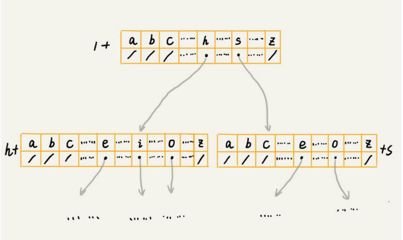
     1. 存储
        - 经典：类似哈希表，通过一个下标与字符映射的数组来存储指向子节点的指针，没有子节点就存null，实现字符的串联，可能很浪费内存，取决于字符集的多少、树的内容丰富度等
          1. 构建：O(n)
          1. 查找：将字符的ASCII码减去“a”的ASCII码得到要匹配的子节点中的指针，看下是不是null，时间复杂度O(k)，k表示要查找的字符串的长度(k个节点)
        - 更节省内存的方式：有序数组、跳表、散列表、红黑树等
   - 优化
     1. 缩点优化：只有一个子节点的节点向上合并成多个字符，增加了编码难度
1. union find
   - 认识：并查集，树型的数据结构，用于处理一些不相交集合的合并及查询问题
1. 其他
   - 线段树：解决“线段”或者是“区间”这种特殊的数据
1. 多路查找树
   - B+树：mysql的索引结构
#### 图
1. graph
   - 认识：图，由节点的有穷集合V、边的集合E组成，非线性表数据结构
   - 术语
     1. 顶点：vertex，节点
     1. 边：edge，用于连接顶点，顶点间有相邻关系就是存在一条边
        - 有向图/无向图：边是否有方向，如微博的单向关注
          1. 入度：表示有多少条边指向这个顶点
          1. 出度：表示有多少条边是以这个顶点为起点指向其他顶点
        - 带权图：每条边都有一个权重
     1. 度：degree，边的条数
   - 存储
     1. 邻接矩阵：底层依赖一个二维数组，简单直观方便矩阵计算(图的计算就是矩阵的计算)，但比较浪费存储空间，如无向图斜线用一半就行，如稀疏图边少更浪费。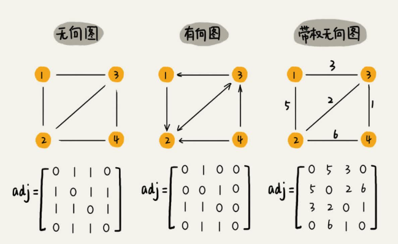
        - 如无向图，i和j有边，则A[i][j]和A[j][i]标记为1
        - 如有向图，i指向j，则A[i][j]标记为1
        - 如带权图，则存储相应的权重
     1. 邻接表：Adjacency List，每个顶点对应一条链表，链表中存储与这个顶点相连接的其他顶点。存储省空间，计算费时间(还是链表存储)，以下为有向图：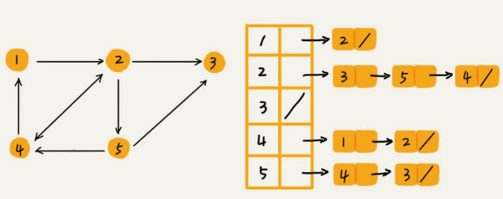
        - 可以将邻接表中的链表改成链表、散列表、平衡二叉查找树，提高效率
        - 还可以将链表改成有序动态数组，通过二分查找快速定位两个顶点之间否是存在边
   - 应用
     1. 获取用户的粉丝列表不好计算，采用逆邻接表实现
     1. 快速判断两个用户之间是否是关注与被关注的关系，选择那种结构？红黑树、跳表、有序动态数组、散列表？因为按照用户名首字母排序，分页来用户粉丝列表或关注列表，跳表再合适不过，因为跳表本身有序，分页就高效，几十万用户完全可以存内存里，几亿用户哈希分片存储，或用硬盘
   - 分类
     1. 按照结构分类
        - 十字链表
        - 邻接多重表
        - 边集数组
   - 未知
     1. 遍历：深度优先搜索和广度优先搜索
     1. Johnson
     1. A*
     1. 差分约束
     1. 欧拉路
     1. 网络流
   - 组成
     1. 最短路径
        - Dijkstra，迪杰斯特拉
        - Bellman-Ford，贝尔曼-福特
        - Floyd-Warshall：弗洛伊德
     1. 关键路径
     1. 最小生成树：Prim算法和Kruskal算法
     1. 二分图：最大匹配
     1. 最大流
### 算法
1. 算法
   - 认识：解决特定问题的步骤的描述
     1. 基于一定的数据结构
     1. 每个算法效率不同
   - 特点
     1. 有穷性
     1. 确切性
     1. 可行性
     1. 有输入/输出项
   - 分类
     1. 数据计算
     1. 图像
        - 音视频编解码(软硬结合)
        - 平滑线绘制：道格拉斯—普克
     1. 语音
        - 自然语言处理
1. 数据计算
   - 排序
   - 查找
     1. 线性表查找
     1. 树结构查找
     1. 哈希表查找
   - 搜索
     1. 深度优先
     1. 广度优先
     1. A*启发式

     1. 回溯法：Backtracking
     1. 双指针：Two Pointers
     1. 扫描线：Scan-line algorithm
   - 字符串匹配
     1. 朴素
     1. Robin-Karp
     1. Boyer-Moore
     1. KMP
     1. Trie
     1. AC自动机
     1. 后缀数组
   - 哈希算法
   - 其他
     1. 数论
     1. 计算几何
     1. 概率分析
     1. 并查集
     1. 拓扑网络
     1. 矩阵计算
     1. 线性规划

     1. 遗传算法
     1. 容斥原理
     1. 母函数
     1. 秦九韶算法
1. 评估方式
   - 指标：多方面的因素
     1. 问题规模
     1. 应用场景：结合cpu特性、磁盘io特性
     1. 数据特点
   - 复杂度分析：不使用具体数据测试，就可以粗略估计执行效率的方法，属于事先分析
     1. 时间复杂度
        - 认识：渐进时间复杂度，表示代码执行时间随数据规模增长的变化趋势的表示方法，T(n)=O(f(n))
          1. 公式解析
             - T(n)：表示总执行时间
             - n：表示数据规模大小
             - f(n)：表示每行代码执行的次数总和
             - O：表示所有代码的执行时间与每行代码的执行次数成正比
          1. 用常数1取代所有时间中的所有加法常数
          1. 只保留最高阶项，如果最高阶存在且不是1，则去除与这个项相乘的常数
          1. 举例：如O(3)也为O(1)，如O(2n+2)为O(n)执行了n次就是n，O(2n^2+2n+3)为O(n^2)
          1. 当有两个数据规模时，时间复杂度为O(m+n)，因为没法确定m和n谁大
          1. 复杂度分析并不难，关键在于多练
        - 分析方法
          1. 加法：只关注循环执行次数最多的那一段代码：只是表示一种变化趋势，通常会忽略公式中的常量、低阶、系数，只记录跟数据规模n有关系的一个最大阶的量级就可以了，从而得出算法的计算次数公式
          1. 乘法：复杂度为嵌套内外代码复杂度的乘积
          1. 最好/最坏/平均/均摊：平均的要考虑概率，找出所有发生的概率算加权平均值等，除非差别特别大否则看一种就行；均摊的应用场景更独特、有限，使用摊还分析法，将较高时间复杂度那次操作的耗时平摊到其他那些时间复杂度比较低的操作上，一般均摊时间复杂度就等于最好情况时间复杂度。大部分情况下时间复杂度都很低，只有个别情况下时间复杂度比较高，而且这些操作之间存在前后连贯的时序关系
            ```c
            // n表示数组array的长度
            int find(int[] array, int n, int x) {
            int i = 0;
            int pos = -1;
            for (; i < n; ++i) {
                if (array[i] == x) {
                pos = i;
                break;                                  // 不加这个就是O(n)，加了最好O(1)，最坏O(n)
                }
            }
            return pos;
            }
            ```
        - 量级：递增
          1. 多项式量级
             - 常量`O(1)`
             - 对数`O(logn)`，log就是平方反过来，如2^x=n求解x为x=log2n
             - 线性`O(n)`
             - 线性对数`O(nlogn)`
             - 平方`O(n^2)`/立方`O(n^3)`/k次方`O(n^k)`
          1. 非多项式量级：n越大执行时间急剧增加
             - 指数：`O(2^n)`
             - 阶乘：`O(n!)`
        - 递推公式：特征方程、母函数，通过推导得出，可以分析递归算法的时间复杂度。灵活应用复杂度分析方法来分析代码
          1. 适合分析：归并、快速排序的最好情况
          1. 递归树适合分析：快速排序的平均情况
          1. 二者都不适合：二叉树的递归前中后序遍历
        - 递归树
          1. 认识：把递归的过程改成图就是一颗树，即递归树。借助递归树的特性来分析递归算法的时间复杂度
             - 如分析归并：归并排序的递归树是一棵满二叉树，归并主要时间消耗在合并，树的每一层归并操作消耗的时间总和n一样，满二叉树高度log2^n，即总的时间复杂度O(nlogn)
          1. 实践
             - 快排的分析：分区点不为中间为十分之一k，递推公式就偏了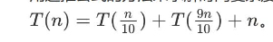
               1. 快速排序的过程中每次分区都要遍历待分区区间的所有数据，所以每层分区操作所遍历数据个数和是总数量n，所以复杂度就是树高度h * n
               1. 递归树也不是满的，从根节点到叶子最短路径是log10n，最长是log(10/9)n，所以复杂度是O(nlogn)，即使k较大也是这样都是常数
                  - 快速排序结束的条件就是待排序的小区间大小为1，也就是说叶子节点里的数据规模是1，即每个都是单叶子节点
                  - 从根节点到叶子节点，递归树中最短路径每走一层都除以10，最长路径每次都乘以9除以10，最短公式为`n/(10^h)`，最长公式为`9^h * n/(10^h)`即上边的结论
             - 斐波那契数列的分析
               1. 代码
                ```c
                int f(int n) {
                    if (n == 1) return 1;
                    if (n == 2) return 2;
                    return f(n-1) + f(n-2);
                }
                ```
               1. 转成递归树后每次数据规模都是-1或-2，即叶子节点的数据规模是1或2，即根节点到叶子节点最长路径是n，最短n/2
               1. 所以复杂度是最好`1 + 2 + ... + 2^(n-1)=2^n-1`，最差`1 + 2 ... + 2^(n/2-1)=2^(n/2)-1`，即O(2^n)到O(2^(n/2))
             - 全排列的分析
               1. 认识：即如何把n个数据的所有排列都找出来，如1、2、3有6种排列
               1. 递推公式：`f(1,2,...n) = {最后一位是1, f(n-1)} + {最后一位是2, f(n-1)} +...+{最后一位是n, f(n-1)}。`
               1. 代码
                ```c
                // 调用方式：
                // int[]a = a={1, 2, 3, 4}; printPermutations(a, 4, 4);
                // k 表示要处理的子数组的数据个数
                public void printPermutations(int[] data, int n, int k) {
                    if (k == 1) {
                        for (int i = 0; i < n; ++i) {
                            System.out.print(data[i] + " ");
                        }
                        System.out.println();
                    }
                    for (int i = 0; i < k; ++i) {
                        int tmp = data[i];
                        data[i] = data[k-1];
                        data[k-1] = tmp;
                        printPermutations(data, n, k - 1);
                        
                        tmp = data[i];
                        data[i] = data[k-1];
                        data[k-1] = tmp;
                    }
                }
                ```
     1. 空间复杂度
        - 认识：类似上边，算法处理时需要的存储空间与数据规模的增长关系，包含代码/输入数据/辅助变量，即看需要的空间和n的关系就可以了，要简单很多
          1. 注意这里的存储空间是指除了原本的数据存储空间外，算法运行还需要额外的存储空间，如排序时交换元素时临时变量所占的内存空间
        - 原地排序：即是否在原数据空间操作，包括O(1)和O(n)
   - 稳定性：相同大小的数据前后顺序是否改变，即是否稳定，关系到是否对原始进行了顺序污染
1. 最佳实践
   - 解决问题的过程中，往往是先想到如何用某个算法思想解决问题，然后才用算法理论知识，去验证这个算法思想解决问题的正确性
   - 解决问题的前提是定义清楚问题
     1. 如何清楚？对一些模糊的需求进行假设，来限定要解决的问题的范围
        - 如功能性需求，必要的
        - 如非功能性需求，比如安全、性能、用户体验等等
   - 要明确问题关键点在哪里，如8GB的数据排序改为1TB，就不是执行效率了，而是磁盘的读取效率要高
#### 算法思想
1. 认识
   - 认识事务的步骤
     1. 为什么需要？方法如何演化出来？
     1. 适合解决的问题的特征？解决的思路？思考过程？
     1. 应用？实战？
   - 特点
     1. 贪心：一条路走到黑，就一次机会，只能哪边看着顺眼走哪边
     1. 回溯：一条路走到黑，无数次重来的机会，还怕我走不出来 (Snapshot View)
     1. 动态规划：从全遍历的递归树为出发点广度优先遍历，遍历完每一层之后对每层结果进行合并（结果相同的）或舍弃（已经超出限制条件的），确保下一层遍历的数量不超过限定条件，这个操作大大减少不必要的遍历。在空间复杂度优化上，通过在计算中只保留最优结果的目的重复利用内存空间
   - 比较
     1. 贪心、回溯、动态规划可以归为一类模型可以抽象为多阶段决策最优解模型，分治不能
     1. 基本上能用的动态规划、贪心解决的问题，都可用回溯算法解决
     1. 分治要求分割成的子问题不能有重复子问题，而动态规划正好相反
     1. 贪心算法实际上是动态规划算法的一种特殊情况，需要满足三个条件，最优子结构、无后效性和贪心选择性
        - 通过局部最优的选择能产生全局的最优选择，最终由这些局部最优解构成全局最优解
1. 贪心
   - 认识：greedy algorithm，尽可能让期望值最大，应用于哈夫曼、PK最小生成树算法、Dijkstra单源最短路径算法
     1. 使算法失效的影响项：前面的选择，会影响后面的选择，或者贪心无法控制边界
   - 应用场景
     1. 理解
        - 分糖果：大小不等的m个糖果数量小于等于n个对糖果大小的需求不等的孩子数量，如何分配尽可能满足最多数量的孩子？不断找出对糖果大小需求最小的孩子先满足，然后循环，达成最大期望器
        - 钱币找零： 1元、2元、5元、10元、20元、50元、100元面额的纸币张数分别是 c1、c2、c5、c10、c20、c50、c100，用这些钱来支付K元，最少要用多少张纸币呢？先用面值最大的来支付，可以用严谨的数学推导来证明其正确性
          1. 找零问题不能用贪婪算法，即使有面值为一元的币值也不行：考虑币值为100，99和1的币种，每种各一百张，找396元。动态规划可求出四张99元，但贪心算法解出需三张一百和96张一元
        - 区间覆盖：n个有不同起始端点和结束端点的区间，如何选出最多的满足两两不相交但可以接触的区间数量？找到这些区间中最左端点和最右端点，然后每次选择时左端点跟前面的已覆盖区间不重合的，右端点又尽量小的，这样可以让剩下的未覆盖区间尽可能的大，就可以放置更多的区间
     1. 实际：任务调度、教师排课等，这些类似于区间覆盖问题
1. 分治
   - 认识：Divide Conquer，即分而治之，将问题划分成n个规模较小且结构与原问题相似的子问题，一般用递归解决这些子问题，最后合并其结果就得到原问题的解
   - 场景
     1. 求一组数据的有序对个数或者逆序对个数呢？有序和逆序一样，利用归并排序过程中每次合并计算逆序对个数，然后加总和即可得出
     1. 海量数据处理，如MapReduce
1. 回溯
   - 认识：从一组可能的解中选择出一个满足要求的解。很多用在了搜索，适合用递归实现，本质是穷举，应用于缺乏规律，或我们还不了解其规律的搜索场景中，适合小规模数据，大规模效率低
     1. 剪枝操作是提高回溯效率的一种技巧，即判定边界条件及时返回
   - 应用举例
     1. 八皇后：不满足就调整上一级数据(回溯)
        - 问题：8x8棋盘放8个棋子，每个棋子所在的行、列、对角线都不能有另一个棋子，期望找到所有满足这种要求的放棋子方式？需要逐行往上考察每一行是否满足，即有回溯
        - 代码
            ```java
            int[] result = new int[8];// 全局或成员变量,下标表示行,值表示queen存储在哪一列
            public void cal8queens(int row) { //调用方式：cal8queens(0);
                if (row == 8) { // 8个棋子都放置好了，打印结果
                    printQueens(result);
                    return; // 8行棋子都放好了，已经没法再往下递归了，所以return
                }
                for (int column = 0; column < 8; ++column) { // 每一行都有8中放法
                    if (isOk(row, column)) { //有些放法不满足要求
                        result[row] = column; // 第row行的棋子放到了column列
                        cal8queens(row+1); // 考察下一行
                    }
                }
            }

            private boolean isOk(int row, int column) {//判断row行column列放置是否合适
                int leftup = column - 1, rightup = column + 1;
                for (int i = row-1; i >= 0; --i) { //逐行往上考察每一行
                    if (result[i] == column) return false; //第i行的column列有棋子吗？
                    if (leftup >= 0) { //考察左上对角线：第i行leftup列有棋子吗？
                        if (result[i] == leftup) return false;
                    }
                    if (rightup < 8) { //考察右上对角线：第i行rightup列有棋子吗？
                        if (result[i] == rightup) return false;
                    }
                    --leftup; ++rightup;
                }
                return true;
            }

            private void printQueens(int[] result) { //打印出一个二维矩阵
                for (int row = 0; row < 8; ++row) {
                    for (int column = 0; column < 8; ++column) {
                        if (result[row] == column) System.out.print("Q ");
                        else System.out.print("* ");
                    }
                    
                    System.out.println();
                }
                System.out.println();
            }
            ```
     1. 0-1背包：经典解法是动态规划，用回溯简单但不那么高效
        - 问题：背包总承载Wkg，n个重量不等的不可分割的物品，不超背包总重量下如何让背包中物品总重量最大？用贪心不行了因为用贪心边界无法探知，改成装入的物品数量最多可用贪心，
        - 解决：不重复地穷举出这总共的2^n种装法，把物品依次排列分解为n个阶段，进行处理看看装不装的进去。先假定前边的是否确定，然后处理后边
        - 代码
            ```java
            public int maxW = Integer.MIN_VALUE; //存储背包中物品总重量的最大值
            // cw表示当前已经装进去的物品的重量和；i表示考察到哪个物品了；
            // w背包重量；items表示每个物品的重量；n表示物品个数
            // 假设背包可承受重量100，物品个数10，物品重量存储在数组a中，那可以这样调用函数：
            // f(0, 0, a, 10, 100)
            public void f(int i, int cw, int[] items, int n, int w) {
                if (cw == w ||i == n) { // cw==w表示装满了;i==n表示已经考察完所有的物品
                    if (cw > maxW) maxW = cw;
                    return;
                }
                f(i+1, cw, items, n, w);                                    // 精妙，这个是不放，尝试了第一个、二个、n个不放
                if (cw + items[i] <= w) {                                   // 没超过背包总重才继续装
                    f(i+1, cw + items[i], items, n, w);                     // 精妙，这个是放，尝试了第一个、二个、n个放，和上两行的代码搭配就可以尝试遍所有的放法，最终得出最大的结果
                }
            }
            ```
     1. 正则表达式的匹配方式：先随意选择一种匹配方案，然后继续考察剩下的字符。如中途发现无法继续匹配下去就回到这个岔路口，重新选择一种匹配方案，然后再继续匹配剩下的字符
        ```java
        public class Pattern {
            private boolean matched = false;
            private char[] pattern; //正则表达式
            private int plen; //正则表达式长度

            public Pattern(char[] pattern, int plen) {
                this.pattern = pattern;
                this.plen = plen;
            }

            public boolean match(char[] text, int tlen) { //文本串及长度
                matched = false;
                rmatch(0, 0, text, tlen);
                return matched;
            }
            private void rmatch(int ti, int pj, char[] text, int tlen) {
                if (matched) return; //如果已经匹配了，就不要继续递归了
                if (pj == plen) { //正则表达式到结尾了
                    if (ti == tlen) matched = true; //文本串也到结尾了
                    return;
                }
                if (pattern[pj] == '*') { // *匹配任意个字符
                    for (int k = 0; k <= tlen-ti; ++k) {
                        rmatch(ti+k, pj+1, text, tlen);
                    }
                } else if (pattern[pj] == '?') { // ?匹配0个或者1个字符
                    rmatch(ti, pj+1, text, tlen);
                    rmatch(ti+1, pj+1, text, tlen);
                } else if (ti < tlen && pattern[pj] == text[ti]) { //纯字符匹配才行
                    rmatch(ti+1, pj+1, text, tlen);
                }
            }
        }
        ```
   - 应用场景
     1. 算法如深度优先搜索
     1. 软件开发如正则表达式匹配、编译原理的语法分析等
     1. 数学如独、八皇后、0-1背包、图的着色、旅行商问题、全排列等
1. 动态规划
   - 认识：Dynamic Programming DP，适合求解最优问题如最大最小，显著降低时间复杂度
     1. 将原问题拆分为若干个子问题，先求解子问题，然后从这些子问题的解得出原问题的解
     1. 从全遍历的递归树为出发点广度优先遍历，遍历完每一层之后对每层结果进行合并（结果相同的）或舍弃（已经超出限制条件的），确保下一层遍历的数量不超过限定条件，这个操作大大减少不必要的遍历。在空间复杂度优化上，通过在计算中只保留最优结果的目的重复利用内存空间
     1. 每个阶段对应一个决策。我们记录每一个阶段可达的状态集合（去掉重复的），然后通过当前阶段的状态集合，来推导下一个阶段的状态集合，动态地往前推进
     1. 求解问题的过程不太符合人类常规的思维方式
     1. 大部分动态规划能解决的问题都可以通过回溯算法解决，只不过回溯算法解决起来效率比较低，时间复杂度是指数级的，空间复杂度也提高了，一种空间换时间的算法思想
   - 适用条件：一个模型三个特征
     1. 多阶段决策最优解模型：需要经历多个决策阶段，每个决策阶段都对应着一组状态，然后寻找一组决策序列，经过这组决策序列能够产生最终期望求解的最优值
     1. 最优子结构：大问题的最优解可以由小问题的最优解推出，也即后面阶段的状态可以通过前面阶段的状态推导出来
     1. 无后效性：一：只关心前面阶段的状态值不关心这个状态怎么推导出来的，二：某阶段状态一旦确定，之后阶段的决策不会影响前边阶段的状态
     1. 重复子问题：不同的决策序列，到达某个相同的阶段时，可能会产生重复的状态，这是动态规划提高效率很重要的看点
   - 解题思路：就是循环法和递归法的区别
     1. 状态转移表法：根据决策从前往后根据递推关系分阶段填充状态表中的每个状态，最后将这个递推填表的过程翻译成动态规划的代码了，如果问题复杂这个状态表就是多维的了如三维、四维，但不适合用状态转移表法来解决。一是因为高维状态转移表不好画图表示，二是人脑很不擅长思考高维的东西。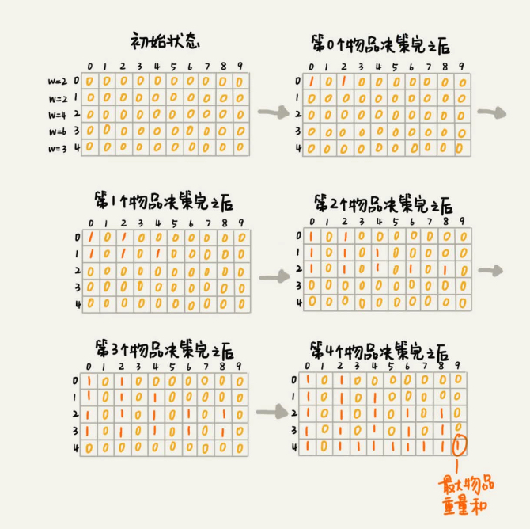
        - 状态表：想象为二维的，每个状态包含三个变量，行、列、数组值
        - 解题步骤：回溯算法实现 - 定义状态 - 画递归树 - 找重复子问题 - 画状态转移表 - 根据递推关系填表 - 将填表过程翻译成代码
          1. 构建递归树，使用回溯代码写出求解
          1. 在递归树中找到重复子问题
          1. 解决重复子问题：在回溯遍历的基础上优化处理
          1. 回溯加“备忘录”：就是找个临时变量记录每个阶段的状态，回溯的解法
          1. 状态转移表法
     1. 状态转移方程法：类似递归，根据最优子结构，写出递归公式。代码实现方法，一递归加“备忘录”，二迭代递推，这个方程是解决动态规划的关键，但是很多动态规划问题的状态本身就不好定义，状态转移方程也就更不好想到
        - 步骤：找最优子结构 - 写状态转移方程 - 将状态转移方程翻译成代码
   - 理解举例
     1. 0-1背包问题
        ```java
        public static int knapsack2(int[] items, int n, int w) {
            boolean[] states = new boolean[w+1]; //默认值false
            states[0] = true; //第一行的数据要特殊处理，可以利用哨兵优化
            states[items[0]] = true;
            for (int i = 1; i < n; ++i) { //动态规划
                for (int j = w-items[i]; j >= 0; --j) {//把第i个物品放入背包
                    if (states[j]==true) states[j+items[i]] = true;
                }
            }
            for (int i = w; i >= 0; --i) { //输出结果
                if (states[i] == true) return i;
            }
            return 0;
        }
        ```
     1. 假设一个n*n的存储正整数的矩阵w[n][n]。将棋子从起始位置左上角移动到结束右下角。每次只能向右或者向下移动一位。有很多路径可走，每条路径经过的数字加起来看作路径长度。最短路径长度是多少？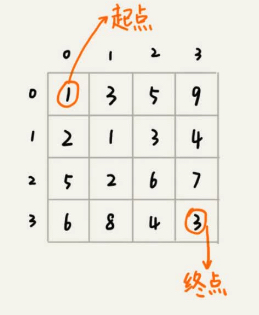
        ```java
        // 状态转移表法
        public int minDistDP(int[][] matrix, int n) {
            int[][] states = new int[n][n];
            int sum = 0;
            for (int j = 0; j < n; ++j) { //初始化states的第一行数据
                sum += matrix[0][j];
                states[0][j] = sum;
            }
            sum = 0;
            for (int i = 0; i < n; ++i) { //初始化states的第一列数据
                sum += matrix[i][0];
                states[i][0] = sum;
            }
            for (int i = 1; i < n; ++i) {
                for (int j = 1; j < n; ++j) {
                    states[i][j] = matrix[i][j] + Math.min(states[i][j-1], states[i-1][j]);
                }
            }
            return states[n-1][n-1];
        }
        // 状态转移方程法
        private int[][] matrix = {{1，3，5，9}, {2，1，3，4}，{5，2，6，7}，{6，8，4，3}};
        private int n = 4;
        private int[][] mem = new int[4][4];
        public int minDist(int i, int j) { //调用minDist(n-1, n-1);
            if (i == 0 && j == 0) return matrix[0][0];
            if (mem[i][j] > 0) return mem[i][j];
            int minLeft = Integer.MAX_VALUE;
            if (j-1 >= 0) {
                minLeft = minDist(i, j-1);
            }
            int minUp = Integer.MAX_VALUE;
            if (i-1 >= 0) {
                minUp = minDist(i-1, j);
            }
            int currMinDist = matrix[i][j] + Math.min(minLeft, minUp);
            mem[i][j] = currMinDist;
            return currMinDist;
        }
        ```
     1. 从n个满200元减50元的商品中选出几个最大化满足满减，如何编写？ 和0-1背包问题很像只不过把“重量”换成了“价格”，可以用回溯穷举
     1. 计算莱文斯坦距离
     1. 计算最长公共子串长度
        ```java
        // 状态转移方程法
        ```
   - 应用
     1. 搜索引擎中的拼写纠错功能
        - 如何量化两个字符串的相似度？编辑距离：将一个字符串转化成另一个字符串需要的最少编辑操作次数（如增加、删除、替换）。计算方式：莱文斯坦距离、最长公共子串长度
        - 问题就转化为求把一个字符串变成另一个字符串，需要的最少编辑次数
          1. 需要依次考察一个字符串中的每个字符，跟另一个字符串中的字符是否匹配，匹配的话如何处理，不匹配的话又如何处理。所以，这个问题符合多阶段决策最优解模型
        - 优化方案
          1. 一个个比成本太高，根据搜索热门程度、用户输错日志抽取取出编辑距离最小的TOP10作为纠错单词
          1. 负载均衡做纠错判断，当请求处理时间过长就发到另一个，哪个快按哪个
#### 排序
1. 认识
   - 概念：有序度和逆序度，形容数据原本的状态
   - 基于比较由比较和交换(或移动)两个基本操作组成
1. 比较：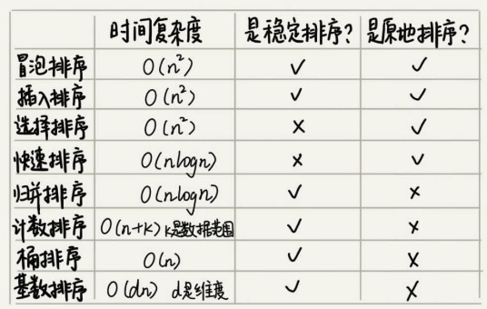
   - 插入排序是前边的已排序区找并插入，选择排序是后边的未排序区找并交换位置
   - 希尔排序是确定分组间隔，快排是确定分区位置
   - 归并排序由下到上，快速排序由上到下。快排省空间但不是稳定的，归并太费空间O(n)不常用
   - 通常使用快排和堆排序
1. 时间复杂度
   - O(n^2)：基于比较，适合小规模的数据排序
     1. 冒泡
     1. 插入
     1. 希尔
     1. 选择
   - O(nlogn)：基于比较，适合大规模的数据排序，更常用
     1. 归并
     1. 快速
     1. 堆
     1. 二叉排序树
   - O(n)：不基于比较
     1. 桶排序
     1. 计数
     1. 基数
1. 评价指标
   - 执行效率
     1. 最好情况、最坏情况、平均情况时间复杂度
     1. 时间复杂度的系数、常数、低阶
     1. 比较次数和交换次数
   - 空间复杂度
##### 基于数组的排序
1. 双重循环
   - 认识：用第n个数与后面的所有数进行比较，然后把最小的数放到第n个位置，不断循环最终形成从小到大的顺序，效率最低，时间复杂度O(n*m)
1. 冒泡
   - 认识：bubbleSort，两两相邻的数进行比较，如果反序就交换，然后每次进行n-1数量的比较，重复n次
     1. 时间最好O(n)，平均和最差O(n^2)，概率论的定量分析太复杂，平均的就简单来个O(n^2)/2取中位值
     1. 空间O(1)，原地排序
     1. 是否稳定：相同时不交换即可做到
     1. 操作：比较、移动
     1. 元素交换次数是固定值，是原始数据的逆序度
   - 优化：当某次冒泡操作没有数据交换时说明已经达到完全有序，可以停止操作
1. 插入
   - 认识：insertionSort，将数据分为已排序区间和未排序区间，初始已排序区间为数组第一个元素，核心思想是取未排序区间元素，在已排序区间找到合适的位置插入，并保证已排序区间数据一直有序。重复直到未排序区间中元素为空
     1. 时间最好O(n)，平均和最差O(n^2)
     1. 空间O(1)，原地排序
     1. 是否稳定：相同的插入到已存在元素的后边即可
     1. 操作：比较、移动
     1. 元素交换次数是固定值，是原始数据的逆序度
     1. 每次插入会将后边的元素往后移动
     1. 有优化空间
     1. 冒泡排序需要3个赋值操作，而插入排序1个，更优
1. 希尔
   - 认识：缩小增量排序，希尔排序是将数据分组，将每一组进行插入排序。再缩小增量直到1终止，是优化的插入排序
     1. 时间最坏O(n^2)，平均O(nlog2n)，取决于间隔序列
     1. 空间O(1)，原地排序
   - 理解：跳跃式分组，使得在初始阶段宏观上看基本有序，缩小增量不会涉及过多的数据移动，相当于将位置差多的飞跃式调到大致准确的位置节省大批的移动
   - 步骤
     1. 选择增量gap=length/2，分成gap个组
     1. 每个组进行插入排序
     1. 缩小增量gap=gap/2，每组继续插入排序
     1. 为1时，最后一次微调的插入排序
1. 选择
   - 认识：将数据分为已排序区间和未排序区间，每次从待排序的数据中选出最大/小的元素，并和前面轮到的元素交换位置，直到排完，和以上比逊色了
     1. 时间最好、平均、最差O(n^2)
     1. 空间O(1)，原地排序
     1. 是否稳定：否

1. 归并
   - 认识：mergeSort，即把待排序序列用递归一级级分为子序列，给子序列排序，再把子序列合并为整体有序序列
     1. 时间最坏、平均、最好O(nlog2n)，执行效率与原始数组的有序程度无关
     1. 空间O(n)
     1. 是否稳定：先把左边/前边(即A[p…q])的放入临时序列即可
   - 特点
     1. 使用分治思想
     1. 任何情况性能比较稳定，费空间
   - 步骤：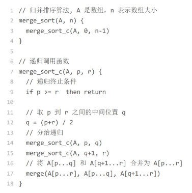
     1. 递归切分子序列
        - 递推公式：`merge_sort(p…r) = merge(merge_sort(p…q), merge_sort(q+1…r))`
        - 终止条件：p >= r 时不用再继续分解
     1. 合并两个子序列：新建相同大小的临时序列，比较两个子序列，哪个子序列的大/小就放到临时序列里，最后改变父序列，重复进行，即一个个挑
        ```c
        // 可用哨兵简化编程，怎么做
        merge(A[p...r], A[p...q], A[q+1...r]) {
            var i := p，j := q+1，k := 0         // 初始化变量i, j, k
            var tmp := new array[0...r-p]       // 申请一个大小跟A[p...r]一样的临时数组
            while i<=q AND j<=r do {
                if A[i] <= A[j] {
                    tmp[k++] = A[i++]           // i++等于i:=i+1
                } else {
                    tmp[k++] = A[j++]
                }
            }

            //判断哪个子数组中有剩余的数据
            var start := i，end := q
            if j<=r then start := j, end:=r
            //将剩余的数据拷贝到临时数组tmp
            while start <= end do {
                tmp[k++] = A[start++]
            }
            // 将tmp中的数组拷贝回A[p...r]
            for i:=0 to r-p do {
                A[p+i] = tmp[i]
            }
        }
        ```
     1. 返回递归的上层
1. 快速
   - 认识：quickSort，找一个合适的中间的点通过一趟排序将数据分割为三部分，一部分比另一部分所有数据都小，一部分相等，递归对两部分快排，更常用
     1. 时间最坏O(n^2)(概率小，要划分的区间极不均等，有方法降低)，平均O(nlog2n)
     1. 空间最坏O(n)，平均O(log2n)
     1. 是否稳定：否
     1. 核心思想
        - 分治：大化小，小化了
        - 分区
   - 理解
     1. 选择分区点算法：最理想的分区点是被分区点分开的两个分区中，数据的数量差不多
        - 三数取中法：首/尾/中间取数的中间值为分区点，数组大了就"十数取中"
        - 随机法：随机找一个，最糟糕概率低
     1. 如果数据原来有序，每次分区点都选择最后一个数据，最糟糕，O(n^2)
   - 步骤
     1. 分两半，区分三部分数据
     1. 递归对每二个部分的数据继续分，直到分完，自然变的有序
   - 伪代码
    ```c
    // 快速排序，A是数组，n表示数组的大小
    quick_sort(A, n) {
        quick_sort_c(A, 0, n-1)
    }
    // 快速排序递归函数，p,r为下标
    quick_sort_c(A, p, r) {
        if p >= r then return

        q = partition(A, p, r)          // 获取分区点：随机选择一个元素作为pivot（一般p到r的最后一个元素），然后对A[p…r]分区，返回下标
        quick_sort_c(A, p, q-1)
        quick_sort_c(A, q+1, r)
    }

    // 原地分区函数，很巧妙，代替额外内存空间，类似选择排序
    partition(A, p, r) {
        pivot := A[r]
        i := p
        for j := p to r-1 do {
            if A[j] < pivot {
                swap A[i] with A[j]     // 用交换省却插入的搬移数据
                i := i+1
            }
        }
        swap A[i] with A[r]
        return i
    }
    ```
   - 问题：如何在O(n)的时间复杂度内查找一个无序数组中的第K大元素？
     1. 方式一：类似快排数据分三部分，递归中比较K和p+1，K大则在A[p+1…n-1]区间，反之在对面分区，相等时就是所求
        - 时间复杂度因为是`n+n/2+n/4+n/8+…+1`即等比数列求和为2n-1，即O(n)
     1. 方式二：笨办法，每次移动最小值到数组最前面，剩下数组中继续找最小值，重复K次就是
        - 时间复杂度是(K*n)，K大了就是O(n^2)了

1. 线性排序
   - 认识：不基于比较，对于要排序的数据要求严格，做了很多假设，需要掌握适用场景
     1. 时间复杂度是线性的
   - 分类：桶排序、计数排序、基数排序
1. 桶排序
   - 认识：bucketSort，将数据分到n个桶里，每个桶再单独排序。桶内排序后再把每个桶数据按顺序依次取出
     1. 时间O(n)
     1. 适合用在外部排序：如排序订单金额，分100个顺序桶，第一个桶存1~100，第二个101~200...，如果外部太大还是存不下就继续往小划分
   - 场景要求
     1. 数据需要很容易划分成m个桶，桶之间要有顺序不需再排序
     1. 桶数据分布均匀，否则都到一个桶内极端退化为O(nlogn)
   - 外部排序：数据存储在外部磁盘中，数据量大，内存有限，无法全部载入
1. 计数排序
   - 认识：countingSort，范围不大时，有n个数据就划分成n个桶。每个桶内数据值都相同省掉了桶内排序。桶排序的一种特殊情况
     1. 不适合数据范围k比要排序的数据n大很多的情况
     1. 只能给非负整数排序，其他类型在不改变相对大小的情况下转化为非负整数
     1. 时间O(n+k)，k数据范围
     1. 是否稳定：原始未排序数组A倒序遍历即可
     1. 如考生分数排名问题：总分600划分601个桶(有0分)，分数相同的考生放到一个桶里，桶存储考生人数，计算排名就遍历每个桶的考生人数
   - 如何快速计算出每个分数的考生在有序数组中对应的存储位置？或者说如何得出最终的有序数组？
     1. 认识：利用另外一个数组来计数的实现方式，即通过计算得出排序
     1. 上下文
        - 原始未排序数组A
        - 计数桶C
        - 最终排序数组R
     1. 步骤
        - 对之前分好的桶C进行顺序求和(把数组前边的和自己加起来得到)，得到新C
        - 对原始未排序数组A进行倒序、倒序、倒序遍历，如分数为525，从顺序求和后桶C的下标为525的取出值a，即包括自己在内分数小于等于525的考生有a个，即525是最终有序数组R的第a个元素(下标为a-1)，当525放入R后，相应的C[525]要减一，为下次计算作准备
        - 下n个A元素当我们扫描到第2个分数为525的考生时，就放入R[a-2]的位置
        - 扫描完A就得到完整的R了
1. 基数排序
   - 认识：radixSort，利用高位比完不用比低位的特性来快速排序
     1. 位数不同的采用补位方式，如字符补0，因为ASCII值都大于0不影响
     1. 时间复杂度是位数d*每位复杂度O(dn)
     1. 是否稳定
        - 先从低位排序到高位，一步步走再重新排序，可实现稳定排序，从头往后就不行了
        - 在每位排序时要求稳定的排序算法，否则基数排序不成立，因为最后一次高位排序不管其他位关系就乱了
     1. 如给10万个手机号排序
   - 场景要求
     1. 排序数据要能分出来独立的“位”来比较，而且位之间有递进关系
     1. 每一位的数据范围不能太大，要可以用线性排序算法来排序，否则无法做到O(n) 
##### 基于树的排序
1. 堆排序
   - 认识：原地的排序算法，堆排序比快速排序的时间复杂度还要稳定，但实际使用不如其快
     1. 时间最坏/平均O(nlogn)，空间O(1)
     1. 不稳定，互换操作会改变顺序
   - 实现
     1. 方式一：从前往后依次迭代每个元素插入堆中
     1. 方式二
        - 建堆：是原地建堆，将下标从1到二分之一的节点依次进行从上到下的堆化操作，因为后一半数据是叶子节点无需处理，只处理倒数第二层往上就可形成大顶堆
          1. 特点
             - 叶子节点不需要堆化
             - 堆化过程比较和交换的节点个数跟节点高度h成正比，这样建堆的复杂度就是每个节点的高度的等比数列的求和公式，为O(n)
          1. 代码
            ```java
            private static void buildHeap(int[] a, int n) {
                for (int i = n/2; i >= 1; --i) {
                    heapify(a, n, i);
                }
            }
            private static void heapify(int[] a, int n, int i) {
                while (true) {
                    int maxPos = i;
                    if (i*2 <= n && a[i] < a[i*2]) maxPos = i*2;
                    if (i*2+1 <= n && a[maxPos] < a[i*2+1]) maxPos = i*2+1;
                    if (maxPos == i) break;
                    swap(a, i, maxPos);
                    i = maxPos;
                }
            }
            ```
        - 排序：不断迭代n、n-1、n-2...的元素和堆顶交换进行堆化操作，直到只剩下标为1的元素，数据就从小到大排列好了，复杂度为O(nlogn)
            ```java
            // n表示数据的个数，数组a中的数据从下标1到n的位置。
            public static void sort(int[] a, int n) {
                buildHeap(a, n);
                int k = n;
                while (k > 1) {
                    swap(a, 1, k);
                    --k;
                    heapify(a, k, 1);
                }
            }
            ```
1. 比较
   - 为什么快排比堆排序性能好
     1. 快排内存顺序访问cpu亲和，堆排跳着访问
     1. 同样数据排序过程中，堆排交换次数多
        - 建堆后数据反而更无序
##### wiki
1. 问题
   - 现在你有10个接口访问日志文件，每个日志文件大小约300MB，每个文件里的日志都是按照时间戳从小到大排序的。你希望将这 10 个较小的日志文件，合并为 1个日志文件，合并之后的日志仍然按照时间戳从小到大排列。如果处理上述排序任务的机器内存只有1GB，你有什么好的解决思路，能“快速”地将这 10 个日志文件合并吗？
     1. 普通比较法：先构建十条io流，分别指向十个文件，每条io流读取对应文件的第一条数据，然后比较时间戳，选择出时间戳最小的那条数据，将其写入一个新的文件，然后指向该时间戳的io流读取下一行数据，然后继续刚才的操作，比较选出最小的时间戳数据，写入新文件，io流读取下一行数据，以此类推，完成文件的合并， 这种处理方式，日志文件有n个数据就要比较n次，每次比较选出一条数据来写入，时间复杂度是O（n），空间复杂度是O（1）
     1. 归并法：可以为每个文件分配一个40M的数组，再另外分配一个400M的数组储存归并结果，每个文件每次读取40M，对十个数组做归并排序直到其中某个数组的数据被处理完，这时将归并结果写入磁盘，处理完的数组继续读入40M继续参与归并，以此类推，直到所有文件都处理完
     1. 堆法：每次从各个文件中取一条数据，在内存中根据数据时间戳构建一个最小堆，然后每次把最小值给写入新文件，同时将最小值来自的那个文件再出来一个数据，加入到最小堆中。这个空间复杂度为常数，但没能很好利用1g内存，而且磁盘单个读取比较慢，所以考虑每次读取一批数据，没了再从磁盘中取，时间复杂度还是一样O(n)
   - 如何根据年龄给100万用户排序？使用桶排序，划分140个桶
   - 10万个大小写混合字符，要求小写在前，大写在后，大小写内部不要求
     1. 指针遍历法：用两个指针a、b：a指针从头开始往后遍历，遇到大写字母就停下，b从后往前遍历，遇到小写字母就停下，交换a、b指针对应的元素；重复如上过程，直到a、b指针相交。对于小写字母放前面，数字放中间，大写字母放后面，可以先将数据分为小写字母和非小写字母两大类，进行如上交换后再在非小写字母区间内分为数字和大写字母做同样处理
     1. 桶排序思想：弄小写/大写/数字三个桶，遍历一遍，都放进去，然后再从桶中取出来就行了。相当于遍历了两遍，复杂度O(n)
   - 使用位图算法的排序：1亿个数据范围是从1到10亿的整数，如何快速并且省内存地给这1亿个数据从小到大排序？
     1. 需要考虑也许有重复的，重复的再维护一个小的散列表，记录出现次数超过1次的数据以及对应的个数
     1. 数字范围是1到10亿，用位图存储125M就够了，然后将1亿个数字依次添加到位图中，然后再将位图按下标从小到大输出值为1的下标，排序就完成了，时间复杂度为 N
1. 最佳实践
   - Glibc的qsort()函数的实现
     1. 优先归并排序：计算机现在空间都大，数据量大时快速排序
     1. 自己实现栈手动模拟递归解决
     1. 元素个数小于等于4使用插入排序，小规模数据O(n)算法不一定比O(nlogn)执行时间长，因为O(n)增长趋势小
     1. 使用哨兵少做一次判断，非常基础的函数性能优化要做到极致
#### 查找
1. 顺序查找：即按顺序找。时间最坏/平均O(n)，空间O(1)
1. 二分查找
   - 认识：binarySearch，针对有序的数组，从中间开始判断大小，之后在偏向的方向继续进行二分比较然后查找，不断循环直到找到或找不到，类似分治
     1. 时间最坏/平均O(logn)，极其高效，有时候比O(1)还高效，42亿个数据用二分查找最多才需要比较32次
     1. 空间迭代O(1)，递归O(log2n)
   - 特点
     1. 因为按照下标访问，所以依赖顺序表结构(链表成本太高)，
     1. 因为依赖有序数组，频繁更新的需要重新排序，不适合
     1. 数据量比较小不适合
     1. 数据量比较大不适合，因为连续内存受不了
     1. 比较次数非常少，如果比较费时间可以用这个
     1. 二分查找能解决的更倾向用散列表、二叉查找树解决。但对于近似(即小于、大于)的处理二分查找有优势，同时更省内存，他们不好实现
   - 实现
     1. 递归
        ```c
        // 二分查找的递归实现
        public int bsearch(int[] a, int n, int val) {
            return bsearchInternally(a, 0, n - 1, val);
        }
        private int bsearchInternally(int[] a, int low, int high, int value) {
            if (low > high) return -1;

            int mid = low + ((high - low) >> 1);
            if (a[mid] == value) {
                return mid;
            } else if (a[mid] < value) {
                return bsearchInternally(a, mid+1, high, value);
            } else {
                return bsearchInternally(a, low, mid-1, value);
            }
        }
        ```
     1. 循环
        ```c
        public int bsearch(int[] a, int n, int value) {
            int low = 0;
            int high = n - 1;

            while (low <= high) {
                int mid = (low + high) / 2;
                if (a[mid] == value) {
                    return mid;
                } else if (a[mid] < value) {
                    low = mid + 1;
                } else {
                    high = mid - 1;
                }
            }
            
            return -1;
        }
        // mid的取值：mid=(low+high)/2写法是有问题。数大之和溢出，改成ow+(high-low)/2，性能优化: low+((high-low)>>1)，计算机位运算更快
        ```
   - 变体
     1. 查找第一个值等于给定值的元素：数组存在重复数据
        ```go
        // 简洁不易理解版
        public int bsearch(int[] a, int n, int value) {
            int low = 0;
            int high = n - 1;

            while (low <= high) {
                int mid = low + ((high - low) >> 1);
                if (a[mid] >= value) {                      // 往前追，一直追到low=high，这个过程中low=mid了，后边判断下，等于就是有
                    high = mid - 1;
                } else {
                    low = mid + 1;
                }
            }
            
            if (low < n && a[low]==value) return low;
            else return -1;
        }

        // 理解版
        public int bsearch(int[] a, int n, int value) {
            int low = 0;
            int high = n - 1;

            while (low <= high) {
                int mid = low + ((high - low) >> 1);
                if (a[mid] > value) {
                    high = mid - 1;
                } else if (a[mid] < value) {
                    low = mid + 1;
                } else {
                    ///////aaa
                    if ((mid == 0) || (a[mid - 1] != value)) return mid;        // 判断下是不是第一个即可
                    else high = mid - 1;
                    ///////aaa
                }
            }
            
            return -1;
        }
        ```
     1. 查找最后一个值等于给定值的元素
        ```
        // 把上图aaa部分替换即可
        if ((mid == n - 1) ||(a[mid + 1] != value)) return mid;
        else low = mid + 1;
        ```
     1. 查找第一个大于等于给定值的元素
        ```
        public int bsearch(int[] a, int n, int value) {
            int low = 0;
            int high = n - 1;
            while (low <= high) {
                int mid = low + ((high - low) >> 1);
                if (a[mid] >= value) {
                    if ((mid == 0) || (a[mid - 1] < value)) return mid;
                    else high = mid - 1;
                } else {
                    low = mid + 1;
                }
            }
            return -1;
        }
        ```
     1. 查找最后一个小于等于给定值的元素
        ```
        public int bsearch7(int[] a, int n, int value) {
            int low = 0;
            int high = n - 1;
            while (low <= high) {
                int mid = low + ((high - low) >> 1);
                if (a[mid] > value) {
                    high = mid - 1;
                } else {
                    if ((mid == n - 1) || (a[mid + 1] > value)) return mid;
                    else low = mid + 1;
                }
            }

            return -1;
        }
        ```
   - 问题
     1. 如何在200万个ip归属地中快速定位出一个ip地址的归属地？
        - ip从小到大排序
        - 问题转变为：有序数组中查找最后一个小于等于某个给定值的元素
   - 实践
     1. 容易出错的细节有：终止条件、区间上下界更新方法、返回值选择
1. 插值查找
1. 分块查找
1. 斐波那契查找
#### 树
1. 算法
   - 前中后序二叉树遍历
#### 图
1. 图的搜索
   - 认识：针对无权图
   - 深度优先算法
   - 广度优先算法
     1. 认识：BFS，上左下右一点点探索，一层层递进，每到一个点都是最短路径，深度优先走不了最短路径
        - 往外走好多路线，往回走只有一条，可确定最短路径
        - 三种状态，已探索，未探索，待探索
        - 爬虫用到，锻炼语言理解
        - 找到确定的地方，用程序表达出来
     1. 实现方式
        - 用循环创建二维slice
        - 使用slice实现队列
        - 用Fscanf读取文件
        - 对Point的抽象，即坐标：`type point struct{i, j int}`
1. 拓扑排序算法
   - 认识：对有向无环图图构造拓扑序列，找到关键路径，可以解决工程是否能顺利进行，分全局有序、局部有序
   - 实现方法
     1. Kahn算法
     1. DFS深度优先搜索算法
   - 应用
     1. 如何确定代码源文件的编译依赖关系？a依赖b，b依赖c之类的
1. 最小生成树
1. 二分图
#### 哈希算法
1. 认识：散列算法，是一个单向函数，可以把任意长度的输入数据转化为固定长度的输出
1. 要求
   - 从哈希值不能反推出原始数据，也叫单向哈希算法
   - 原始数据只修改一个Bit，哈希值也大不相同，对数据敏感
   - 散列冲突的概率要很小，理论上无法做到完全不冲突，哈希值越长冲突概率越低
     1. 鸽巢原理：如果有10个鸽巢，有11只鸽子，那肯定有1个鸽巢中的鸽子数量多于1个，即抽屉原理，组合数学中
     1. 哈希碰撞：把一个无限的集合中的每个元素映射到一个有限的集合，就必然存在某些不同的输入得到了相同的输出。要碰撞率低
     1. 彩虹表：记录hash值的表
   - 执行效率尽量高效，长文本也快
1. 最佳实践
   - 应用方面
     1. 安全加密：各种单向加密算法
     1. 唯一标识：如海量图片查找，为避免因图片太大hash费时，方法是取图片二进制码串开头、中间、最后各100字节，放一块hash；另外存储路径也放到hash表中，取出来后全量对比即可
     1. 数据校验：文件完整性、是否篡改校验
     1. 散列函数：冲突、是否反向不敏感(链表法)，更关注值是否分布平均、执行效率快

     1. 负载均衡：取模运算指定到固定服务器，实现负载均衡。核心取模
     1. 数据分片：大数据量分片处理，MapReduce处理思想，突破单机资源限制。核心取模
        - 如1T日志文件记录了用户的搜索关键词，要快速统计出每个关键词被搜索的次数，就分发每个关键字到不同的机器
     1. 分布式存储：一致性hash，解决缓存等分布式系统的扩容、缩容导致数据大量搬移的
#### 应用
##### 其他
1. 雪花算法：参见"唯一id"分类
1. MurmurHash算法：短网址生成
   - 认识：不需考虑反向解密的难度，只需要关心计算速度和冲突概率的特性，2008年发明
   - 使用
     1. 两种长度的哈希值，32/128bits
   - 短网址生成 - hash算法
     1. 实现步骤
        - 利用这个计算出hash值
        - 进一步缩短长度：用更高的进制表示，如用62进制表示
     1. 如何解决哈希冲突
        - hash算法概率已经很低
        - 存到库中，先比较对应的地址，真冲突了就加特定的字符，每次解的时候再去掉
     1. 如何优化哈希算法生成短网址的性能
        - 利用数据库唯一索引，将之前查询+插入的两条sql，改为一条sql解决
        - 利用布隆过滤器，新网址生成时先在布隆过滤器中查找，不存在就代表不冲突，再走写入sql的流程
   - 短网址生成 - 自增id算法
     1. 实现：从ID生成器中取一个号来生成，并记录其对应关系
        - 问题一：相同的原始网址可能会对应不同的短网址。无所谓用户不关心
1. 朴素贝叶斯算法：过滤垃圾短信
   - 基于黑名单：数据量小，使用哈希表、二叉树等动态数据结构来存储，50万个电话号码大约需要10MB，使用布隆过滤器，5000万个电话号码二进制位（5000万bits），不到7MB
   - 基于规则：分词处理进行内容判定，计算是否垃圾短信的概率
   - 基于概率统计：基础理论基于朴素贝叶斯算法
     1. 认识：事件A发生的前提下事件B发生的概率，将事情变为判定同时包含一些特征值的短信是否是垃圾短信
     1. 实践
        - 判定准确率：是否会把不是垃圾的短信错判为垃圾短信
        - 召回率：是否能把所有的垃圾短信都找到
   - ai：NLP方向的很多算法可用于 anti-spam。文本分类任务，特征工程做得稍用心的话，判别式模型（典型如 logistic regression）的效果通常好于生成式模型（典型如 naive-bayes）
1. 向量空间：如何实现一个简单的音乐推荐系统？
   - 认识：利用向量空间的欧几里得距离计算推荐程度
   - 方式一：找到跟你口味偏好相似的用户，把他们爱听的歌曲推荐给你
     1. 遍历所有的用户的共同喜爱的歌曲个数，超过阈值就确认
     1. 判断喜爱程度：设置喜欢权重，单曲循环5分，分享4分，收藏3分，跳过-1分等等，这样得到了每个用户对每首歌的打分
     1. 两个用户之间的简单计数行不通了，使用欧几里得距离统计相似度
        - 每个用户对应每个歌曲的喜欢分数，形成一个二维表
        - 将所有n歌曲的分数放到n维向量中
        - 通过欧几里得公式计算每个人的相识度，从而得出
   - 方式二：找出跟你喜爱的歌曲特征相似的歌曲，把这些歌曲推荐给你
     1. 如果喜欢听的人群差不多的，那侧面就可以反映出，这两首歌比较相似
     1. 这里把歌曲和用户主次颠倒了一下，计算和上边一样，得出歌和歌的欧几里得距离
1. 并行运算
   - 对数据分片然后并行处理
     1. 一：先随意分片，再比较后合并
     1. 二：先按照区间分片，再合并
   - 广度优先搜索：可以启动多个线程，并行地搜索下一层的顶点，然后组合路径
1. GeoHash算法：将二维经纬度数据映射到一维的整数，这样所有元素都将在挂载到一条线上，距离靠近的二维坐标映射到一维后的点之间距离也会很接近
   - 映射算法：它将整个地球看成一个二维平面，然后划分成了一系列正方形的方格，对方格进行整数编码，二刀法等
1. TOTP：从共享密钥和当前时间计算一次性密码的算法，用于许多双因素身份验证系统，用oath-toolkit登录
##### 路径规划
1. 最短路径算法
   - 认识：针对有权图，即图中的每条边都有一个权重，如何计算两点之间的最短路径和权重最小
   - 算法
     1. Dijkstra，著名
        - 特点
          1. 为找到最短路径，利用动态规划对回溯搜索进行剪枝，只保留起点到某个顶点的最短路径，继续往外扩展搜索，提升效率
        - 代码
        ```java
        //因为Java提供的优先级队列，没有暴露更新数据的接口，所以我们需要重新实现一个
        private class PriorityQueue { //根据vertex.dist构建小顶堆
            private Vertex[] nodes;
            private int count;
            public PriorityQueue(int v) {
                this.nodes = new Vertex[v+1];
                this.count = v;
            }
            public Vertex poll() { // TODO:留给读者实现...
            }
            public void add(Vertex vertex) {
                // TODO:留给读者实现...
            }
            //更新结点的值，并且从下往上堆化，重新符合堆的定义。时间复杂度O(logn)。
            public void update(Vertex vertex) {
                // TODO:留给读者实现...
            }
            public boolean isEmpty() {
                // TODO:留给读者实现...
            }
        }

        public void dijkstra(int s, int t) { //从顶点s到顶点t的最短路径
            int[] predecessor = new int[this.v]; //用来还原最短路径
            Vertex[] vertexes = new Vertex[this.v];
            for (int i = 0; i < this.v; ++i) {
                vertexes[i] = new Vertex(i, Integer.MAX_VALUE);
            }
            PriorityQueue queue = new PriorityQueue(this.v);//小顶堆
            boolean[] inqueue = new boolean[this.v]; //标记是否进入过队列
            vertexes[s].dist = 0;
            queue.add(vertexes[s]);
            inqueue[s] = true;
            while (!queue.isEmpty()) {
                Vertex minVertex= queue.poll(); //取堆顶元素并删除
                if (minVertex.id == t) break; //最短路径产生了
                for (int i = 0; i < adj[minVertex.id].size(); ++i) {        
                    Edge e = adj[minVertex.id].get(i); //取出一条minVetex相连的边
                    Vertex nextVertex = vertexes[e.tid]; // minVertex-->nextVertex
                    if (minVertex.dist + e.w < nextVertex.dist) { //更新next的dist
                        nextVertex.dist = minVertex.dist + e.w;
                        predecessor[nextVertex.id] = minVertex.id;
                        if (inqueue[nextVertex.id] == true) {
                            queue.update(nextVertex); //更新队列中的dist值
                        } else {
                            queue.add(nextVertex);
                            inqueue[nextVertex.id] = true;
                        }
                    }
                }
            }
            //输出最短路径
            System.out.print(s);
            print(s, t, predecessor);
        }
        private void print(int s, int t, int[] predecessor) {
            if (s == t) return;
            print(s, predecessor[t], predecessor);
            System.out.print("->" + t);
        }
        ```
     1. Bellford
     1. Floyd
   - 应用
     1. 地图路线规划：将地图抽象为有权图，抽象为求两个顶点间的最短路径
1. A*搜索算法
   - 背景：最短路径需要计算量太大，次优解不是最短的也可以使用的场景
   - 认识：对Dijkstra的优化和改造，属于启发式搜索算法，还有DA*、蚁群、遗传、模拟退火等
     1. 一旦遍历到终点，我们就结束while循环，不会像Dijkstra求最优
   - 应用
     1. 实现游戏中的寻路功能：只需要把地图，抽象成图就可以了；宽阔的荒野、草坪等把整个地图分割成小方块作为顶点判断路径
##### 字符串匹配
1. 基础
   - 概念：在主串中查找模式串
   - 场景
     1. BF：简单场景，主串和模式串都不太长, O(m*n)
     1. KP：字符集范围不要太大且模式串不要太长， 否则hash值可能冲突，O(n)
     1. naive-BM：模式串最好不要太长（因为预处理较重），比如IDE编辑器里的查找场景，预处理O(m*m), 匹配O(n)， 实现较复杂，需要较多额外空间
     1. KMP：适合所有场景，整体实现起来也比BM简单，O(n+m)，仅需一个next数组的O(n)额外空间；但统计意义下似乎BM更快
     1. Sunday：比BM/KMP更快
     1. naive-Trie: 适合多模式串公共前缀较多的匹配(O(n*k)) 或者 根据公共前缀进行查找(O(k))的场景
     1. AC自动机: 适合大量文本中多模式串的精确匹配查找, 可以到O(n)
1. Brute Force
   - 认识：BF，暴力匹配、朴素匹配，即一个个推主串找模式串，最坏O(n*m)
     1. 比较常用，因为实际中字符串都不长，很快，实现起来简单不易出错，KISS（Keep it Simple and Stupid）设计原则
1. Rabin-Karp
   - 认识：滚动哈希函数，BF升级版，利用滚动hash计算出母串的hasharray，然后进行比较，再用字符对比解决hash冲突问题。平均O(n)，哈希大量冲突退化为O(n*m)
     1. 虽然有哈希冲突，但还是比BF效率高
     1. 即使是矩阵那种二维形式的匹配，也是可以按照这个原理去实现
   - 步骤
     1. 通过设计特殊的哈希算法，只需要扫描一遍主串就能计算出所有子串的哈希值，O(n)
        - 大概就是将主串n个字符作为n进制，然后子串做进制转换得出，这种的没有哈希冲突但是会超出整数范围，可以作个转换缩小范围允许哈希冲突；二利用前边的hash计算后边的，即哈希值计算公式有交集
     1. 一个个比较子串的哈希值，n-m+1次，O(n)
1. Boyer-Moore
   - 认识：BM，根据规律遇到坏字符时就把模式串的对比向后多滑动几位，节省比较次数，非常高效是著名的KMP的3~4倍，两位作者命名
     1. 以下只是初级版本，见论文
   - 构建规则
     1. 坏字符规则：通过对坏字符在模式串中的计算，得出需要滑动的距离，比较耗内存
        - 最好情况时间复杂度非常低O(n/m)
        - 从模式串的末尾往前倒着匹配没法匹配的字符叫作坏字符(主串中)
        - 单纯使用坏字符规则不够因为可能计算出来是负数
     1. 好后缀规则：就是能匹配上的模式串中的后缀子子串，也得出滑动距离，可以独立于坏字符规则使用(要省内存时)，取二者最大的同时避免坏字符规则的负数问题
        - 在好后缀的后缀子串中，查找最长的、能跟模式串前缀子串匹配的后缀子串
   - 步骤
     1. 坏字符规则
        - 做法：滑动位数为si(坏字符下边的模式串中的下标)-xi(这个坏字符在模式串中的下标，这个坏字符不存在为-1)，
          1. 坏字符多处出现选择最靠后的
          1. 暴力匹配有点低效，建立模式串每个字符及其下标的散列表中
        - 代码
            ```java
            public int bm(char[] a, int n, char[] b, int m) {
                int[] bc = new int[SIZE]; // 记录模式串中每个字符最后出现的位置
                generateBC(b, m, bc); // 构建坏字符哈希表
                int i = 0; // i表示主串与模式串对齐的第一个字符
                while (i <= n - m) {
                    int j;
                    for (j = m - 1; j >= 0; --j) { // 模式串从后往前匹配
                        if (a[i+j] != b[j]) break; // 坏字符对应模式串中的下标是j
                    }
                    if (j < 0) {
                        return i; // 匹配成功，返回主串与模式串第一个匹配的字符的位置
                    }
                    // 这里等同于将模式串往后滑动j-bc[(int)a[i+j]]位
                    i = i + (j - bc[(int)a[i+j]]);
                }
                return -1;
            }

            private static final int SIZE = 256; // 全局变量或成员变量

            private void generateBC(char[] b, int m, int[] bc) {
                for (int i = 0; i < SIZE; ++i) {
                    bc[i] = -1; // 初始化bc
                }
                for (int i = 0; i < m; ++i) {
                    int ascii = (int)b[i]; // 计算b[i]的ASCII值
                    bc[ascii] = i;
                }
            }
            ```
     1. 好后缀规则
        - 代码
            ```java
            // b表示模式串，m表示长度，suffix，prefix数组事先申请好了
            private void generateGS(char[] b, int m, int[] suffix, boolean[] prefix) {
                for (int i = 0; i < m; ++i) { // 初始化
                    suffix[i] = -1;
                    prefix[i] = false;
                }
                for (int i = 0; i < m - 1; ++i) { // b[0, i]
                    int j = i;
                    int k = 0; // 公共后缀子串长度
                    while (j >= 0 && b[j] == b[m-1-k]) { // 与b[0, m-1]求公共后缀子串
                        --j;
                        ++k;
                        suffix[k] = j+1; //j+1表示公共后缀子串在b[0, i]中的起始下标
                    }
                    i
                    if (j == -1) prefix[k] = true; //如果公共后缀子串也是模式串的前缀子串
                }
            }
            ```
     1. 总代码
        ```java
        // a,b表示主串和模式串；n，m表示主串和模式串的长度
        public int bm(char[] a, int n, char[] b, int m) {
            int[] bc = new int[SIZE]; //记录模式串中每个字符最后出现的位置
            generateBC(b, m, bc); //构建坏字符哈希表
            int[] suffix = new int[m];
            boolean[] prefix = new boolean[m];
            generateGS(b, m, suffix, prefix);
            int i = 0; // j表示主串与模式串匹配的第一个字符
            while (i <= n - m) {
                int j;
                for (j = m - 1; j >= 0; --j) { //模式串从后往前匹配
                    if (a[i+j] != b[j]) break; //坏字符对应模式串中的下标是j
                }
                if (j < 0) {
                    return i; //匹配成功，返回主串与模式串第一个匹配的字符的位置
                }
                int x = j - bc[(int)a[i+j]];
                int y = 0;
                if (j < m-1) { // 如果有好后缀的话
                    y = moveByGS(j, m, suffix, prefix);
                }
                i = i + Math.max(x, y);
            }
            return -1;
        }
        // j表示坏字符对应的模式串中的字符下标; m表示模式串长度
        private int moveByGS(int j, int m, int[] suffix, boolean[] prefix) {
            int k = m - 1 - j; // 好后缀长度
            if (suffix[k] != -1) return j - suffix[k] +1;
            for (int r = j+2; r <= m-1; ++r) {
                if (prefix[m-r] == true) {
                    return r;
                }
            }
            return m;
        }
        ```
1. KMP
   - 认识：最知名，本质和BM一样，O(m+n)，三位作者命名
   - 组成
     1. 最长可匹配后缀子串
     1. 最长可匹配前缀子串
     1. next数组/失效函数
1. AC自动机
   - 认识：Aho-Corasick，在trie树之上加构建在树上的类似KMP的next数组，类似KMP对暴力匹配的优化，AC自动机就是KMP算法在多模式串上的改造
   - 组成
     1. 构建
        - 将多个模式串构建成Trie树
        - 在 Trie 树上构建失败指针（相当于KMP中的失效函数 next 数组）
     1. 在AC自动机中匹配主串
   - 代码
    ```java
    public class AcNode {
        public char data;
        public AcNode[] children = new AcNode[26];  // 字符集只包含a~z26个字符
        public boolean isEndingChar = false;        // 结尾字符为true
        public int length = -1;                     // 当isEndingChar=true时，记录模式串长度
        public AcNode fail;                         // 失败指针
        public AcNode(char data) {
            this.data = data;
        }
    }
    // 其他的待续。。。。。
    ```
   - 多模式匹配算法
     1. 认识：即有多个模式串，单模式的需要扫描很多次，低效，应用在敏感词过滤
     1. 解决方案：建成Trie树，然后轮询关键字查找
##### 分布式 - 一致性算法
1. 分类
   - 共识
     1. paxos
     1. raft
     1. zab：zookeeper基于paxos提出了zab协议
     1. gossip：cassandra、consul的闲话算法
   - 一致性hash
     1. 认识：k个机器，数据哈希值范围是[0, MAX]，并划分成m个小区间（m远大于k），这样每个机器负责m/k个小区间。新机器加入时就将某几个小区间的数据搬移。这样，既不用全部重新哈希、搬移数据，也保持了各个机器上数据数量的均衡
        - 借助一个虚拟的环和虚拟节点，更加优美的实现
     1. 应用
        - es的hash路由算法
        - haproxy的hash算法
1. raft
   - 背景：选主、保持一致
     1. 抽屉理论：可以确保日志不会丢失，复制给了大多数。60个抽屉31个放了东西，随意拉开30个抽屉都会拿到东西
   - 认识
     1. paxos是出名的晦涩难懂，raft的设计初衷就是容易理解和简单，redis、etcd的使用 
     1. 是二阶段提交协议，第二阶段时master周期性通知slave提交数据的commit，所有节点的提交都是异步的
     1. 由于一半多节点通知才能写入成功，势必导致写入性能差
     1. 保证
        - 提交成功的请求，一定不会丢
        - 各个节点的数据将最终一致
     1. raft一般被认为是强一致性、顺序一致性，再加上readindex实现了线性一致读，就有了线性一致性
        - 实现了全序广播，自然有了顺序一致性
   - 组成
     1. 角色：只在这三种不断转换
        - follower
          1. 刚开始加入到集群中的默认角色
        - candidate：选举候选人
        - leader：主节点
          1. 接收client的请求，接收请求后会将日志分发到所有follower(单向)
     1. 任期：Term，是连续的整数，单调递增，可以任意时长
        - 每个节点都维护着当前的任期值，在检测到自己的任期值低于其他节点会将自己的设置为检测到的较高值
        - leader和candidate发现自己的任期低于别的节点，则会立即把自己转换为follower
     1. 日志：保证所有follower节点日志副本最终一致
        - log index：日志行在日志序列的下标
   - 选主
     1. 时机
        - 集群初始化
        - 主机宕机
     1. 步骤
        - 所有节点初始状态都是Follower，设置任期(term为0)
        - 随机时间后(150~300ms)，先到期的向其他节点发起投票并等待回复，并投自己一票，完成选主，先到期的大概率成为主节点
          1. 随机时间相同则继续下一轮随机，直到不一样
        - 选主后，term+1，leader定期向所有follower发送心跳信息(Append Entries RPC协议)保持连接
        - follower启动随机超时时间，收到心跳就重置，否则发起幂等的投票
     1. 宕机
        - leader宕机
          1. 第一个心跳超时的follower发起投票
             - 注意这个时候它依然会向宕机的原leader发出Reuest Vote,但原leader不会回复
          1. 当收到集群超过一半的节点的RequestVote reply后,此时的follower会成为leader
             - leader恢复也会变为follower
        - follower宕机
          1. 影响不大，leader会幂等的一直发心跳
   - 日志复制
     1. 认识：leader将请求包装成log entry分发，数据状态为是否commit
     1. 步骤
        - Uncommitted：未提交，leader接收到的数据 1
          1. 进行WAL记录，leader进行分发，2
          1. 集群至少一半的节点已接收到数据返回给leader后，否则为悬而未决状态 3
          1. leader向client确认数据已接收，4
        - Committed：已提交
          1. client返回leader ack，leader修改数据为已提交，5
          1. leader异步通知follower该数据状态已提交，6
          1. follower开始commit自己的数据,此时raft集群达到主节点和从节点的一致，7
     1. 异常处理
        - 1 数据未到达leader节点前：leader挂掉不影响一致性
        - 2 数据到达leader节点，未复制到follower：client不会收到ack会认为超时失败可安全发起重试
        - 3.1 成功复制到follower所有节点，但follower未向leader响应接收，leader挂掉：数据在follower节点处于未提交状态，但数据保持一致，重新选出leader后可完成数据提交
        - 3.2 数据到达leader节点，成功复制到follower的部分节点，但这部分follower还未向leader响应接收，leader挂掉：数据在follower节点处于未提交状态不一致：Raft协议要求投票只能投给拥有最新数据的节点。所以拥有最新数据的节点会被选为leader，然后再强制同步数据到其他follower，保证数据不会丢失并最终一致
        - 7 数据到达leader节点，成功复制到follower所有或多数节点，数据在leader处于已提交状态，但在follower处于未提交状态，leader挂掉：重新选出新的leader后的处理流程和阶段3.1一样
        - 7 数据到达leader节点，成功复制到follower所有或多数节点，数据在所有节点都处于已提交状态，但还未响应client。这个阶段leader挂掉，集群内部数据其实已经是一致的，client重复重试基于幂等策略对一致性无影响
   - 脑裂
     1. 形成原因：遇见网络分区一段时间后，超时各选各的主，造成多leader，网络恢复后无法处理
     1. 解决方案
        - 网络分区恢复后：leader间比较term值，小的降为follower
          1. 节点commit日志最多的选举为leader
          1. commit日志同样多，则term、log index越大选举为leader
        - 分区中的所有节点会回滚roll back自己的数据日志，并匹配新leader的log日志，然后实现同步提交更新自身的值
        - 最终集群达到整体一致，集群存在唯一leader
1. 一致性hash？？？
### 数据结构与算法 - 高级

### 程序
1. 命令和程序：命令也是程序，命令解释器 bash
#### 编程
1. 编程范式
   - 认识：编写程序的方法论，范式就像武功心法，可以更快的练成绝世神功，但还是离不开基础功。不同的范式的出现，目的就是为了应对不同的场景，但最终的目标都是提高生产力。就如华山派的剑宗、气宗之别，剑宗认为“剑为主，气为辅”，而气宗则反之。每个范式都会有自己的”心法”，但最终殊途同归，达到至高境界后则是剑气双修
     1. 现在是多范式融合
   - 分类
     1. 过程式
        - 认识：最为实际的一种思考方式，可以说面向过程是一种基础的方法。最重要的是模块化的思想方法，用到类或对象的可能是过程式编程，只用函数而没有类的也可能是面向对象编程
          1. 规模不太大时，模块与函数的方法可以很好的组织
        - 特点：易于理解，按照实际步骤依次翻译实现
          1. 性能高
          1. 有依赖，修改了外部变量；可读性低，完整阅读才能理解功能
     1. 函数式
        - 认识：核心在于“避免副作用”，不改变也不依赖当前函数外的数据。结合不可变数据、函数是第一等公民等特性，使函数带有自描述性，可读性较高
        - 高阶函数
          1. mapping（映射）：map()函数接收两个参数，一个是函数，一个是序列，map将传入的函数依次作用到序列的每个元素，并把结果作为新的list返回。把运算规则抽象了，只需要一行代码就可以处理一堆的函数
          1. reducing（归纳）
          1. piplining（管道）
          1. recursing（递归）
          1. currying（柯里化）：就是把一个多参数的函数，转化为单参数函数
        - 特点：不会依赖也不会改变当前函数以外的
          1. 函数是一等公民：函数与其他数据类型一样，处于平等地位。可以赋值给其他变量、作为参数、传入另一个函数、作为返回值
          1. 只用表达式，不用语句：表达式是一个单纯的运算过程，总是有返回值，语句是执行某种操作没有返回值，每一步都是单纯运算，都有返回值
          1. 没有副作用：函数要保持独立，所有功能就是返回一个新的值，没有其他行为，尤其是不得修改外部变量的值
          1. 不修改状态：就是不修改系统变量
          1. 引用透明：函数的运行不依赖于外部变量或"状态"，只依赖于输入的参数
        - 特性
          1. 简介快速，隔离方便管理
          1. 较占用运行资源，性能较差
     1. 面向对象
        - 认识：在于抽象，提供清晰的对象边界。结合封装、继承、多态特性，降低了代码的耦合度，提升了系统的可维护性。
        - 组成：封装、继承、多态
        - 特点：抽象描述对象的基本特征
          1. 对象易于理解和抽象；容易重用代码；可扩展和开放性；易于阅读、维护
          1. 不易于开发，容易导致修改的不确定性；代码易膨胀；性能比过程式低
     1. 响应式：一种异步编程范式，它关注数据流和变化的传播，类似事件驱动，同时缓冲、过滤、提取、转换、合并、累积。回调地狱不好解决，和人类命令式的思考方式不同，调试排查不方便。RxJava。很方便地表达静态或动态的数据流，而相关的计算模型会自动将变化的值通过数据流进行传播，如MVVM
        - 背压：抽成真空，形成低压吸引
1. 面向对象四大特性
   - 封装
   - 继承
   - 抽象
   - 多态
1. 自举
   - 理解：就是先用其他语言写出编译器用，然后自己写出自己的编译器来编译自己，当准确无误后，就可以删掉其他语言的编译器了，就自举了，可以证明语言完善，功能强大。如c++11编译c++14，之后c++14编译c++17，一代代传下去
1. 有限状态机
   - 理解：Finite-state machine, FSM。是一个模型，可模拟世界上大部分事物。进行对象行为建模，作用主要是描述对象在生命周期内所经历的状态序列、事件处理
   - 特征
     1. 状态总数是有限的
     1. 任一时刻，只处在一种状态之中
     1. 某种条件下，会从一种状态转变到另一种状态
1. 图灵完备：是针对一套数据操作规则而言的概念，这个规则可以是编程语言，也可以是指令集。当这套规则可以实现图灵机模型里的全部功能时，就称它具有图灵完备性
   - 图灵机：只要图灵机可以被实现，就可以用来解决任何可计算问题
     1. 计算问题的可计算性
1. 建模与设计
   - uml：用uml模型表达设计意图，去形成完整软件模型，可以作为设计文档。层次分明，表达明确
     1. 类图：关系
     1. 序列图：动态调用关系和对象间的交互
     1. 组件序列图：粗粒度的调用关系和交互
     1. 部署图：物理实现的蓝图，服务器数量等，概要设计阶段
     1. 用例图：需求分析阶段，反映用户和软件系统的交互，描述软件的功能需求
     1. 状态图：对象的描述状态变更
     1. 活动图：(流程图)，描述业务逻辑、业务流程
        - 实心圆 流程开始，空心圆 流程结束，圆角矩形 活动，菱形 分支判断
        - 泳道 范围划分
1. 递归
     1. 认识：recursion，是一种编程技巧，即分支限界
        - 递归使用条件：找到将大问题分解为小问题的规律
          1. 一个问题的解可以分解为几个子问题的解
          1. 子问题，除了数据规模不同，求解思路完全一样
          1. 存在递归终止条件
     1. 最佳实践
        - 编写技巧：分析得出递推公式，然后找到终止条件
        - 要限制递归深度，防止系统堆栈溢出，可以自己模拟实现一个函数调用栈来避免
##### 编程语言
1. 分类
   - 动静型
     1. 结构
        - 动态语言：运行时可以改变其结构的语言，如新的函数、对象、甚至代码可以被引进，已有的函数可以被删除或是其他结构上的变化。如Object-C、C#、JavaScript、PHP、Python、Erlang
        - 静态语言：运行时结构不可变，如Java、C、C++、Go
     1. 数据类型
        - 动态类型语言：在运行期间才去做数据类型检查的语言，说的是数据类型。如Python、Ruby、Erlang、JavaScript、swift、PHP、Perl
        - 静态类型语言：数据类型在编译期间（或运行之前）确定和检查的，编写代码的时候要明确确定变量的数据类型，如C、C++、C#、Java、Object-C
   - 编译/解释型
     1. 编译型
        - 理解：将源代码编译成机器码，之后才能执行的语言，一般有编译（compile）、链接（linker）两个步骤。编译只做一次，运行时不需要编译
          1. 编译：把源代码编译成机器码。编译器一般会有预编译的过程对代码进行优化
          1. 链接：把各个模块的机器码和依赖库串连起来生成可执行文件
        - 优点：程序执行效率高，可以脱离语言环境独立运行
        - 缺点：修改需要整个模块重新编译，不同操作系统移植有问题，需要各自编译
        - 包含：C、C++、Go、Swift
     1. 解释型
        - 理解：不需要编译，运行程序的时候才逐行翻译
        - 优点：良好的平台兼容性，需要安装解释器/虚拟机，灵活，修改代码的时候直接修改，可以快速部署，不用停机维护
        - 缺点：每次运行要解释，性能不好
        - 包含：JavaScript、Python、Erlang、PHP、Perl、Ruby
     1. 混合型
        - 理解：结合，半编译型语言，C#在编译的时候不是直接编译成机器码而是中间码，.NET平台提供了中间语言运行库运行中间码，中间语言运行库类似于Java虚拟机。.net在编译成IL代码后，保存在dll中，首次运行时由JIT在编译成机器码缓存在内存中，下次直接执行。Java先生成字节码再在Java虚拟机中解释执行。严格来说混合型语言属于解释型语言。C#更接近编译型语言
        - 包含：C#
1. 编译
   - 认识：
     1. JIT：just in time，即时编译，表示运行时将指令转为二进制机器码，jit可以将opcode直接转为机器码，大幅提升性能
   - 阶段
     1. Frontend：前端，分析源代码，检查语法级错误，并构建针对语言的抽象语法树（AST）
     1. Optimizer：优化器，用于中间代码优化，进一步优化转为新表示方式
     1. Backend：后端，生成可执行机器码
   - 编译器
     1. LLVM
        - 认识：Low Level Virtual Machine 低级虚拟机，这个名字不贴切。是一个模块化和可重复使用的编译器和工具技术的集合。提供编译器相关的支持，能够进行程序语言的编译期优化、链接优化、在线编译优化、代码生成等，包含LLVM中介码（LLVM IR）、LLVM除错工具、LLVM C++标准库
          1. 被作为实现各种静态和运行时编译语言通用基础架构（GCC家族、Java、.Net、Python、Ruby、Scheme、Haskell、D等）
        - 特点
          1. 三个模块相互独立，可以充分复用。如如果开发一门新的语言，只要制造一个该语言的前端，将源码编译为bitcode，优化和后端不用管。同理，如果新的芯片架构问世，只需基于LLVM重新编写一套目标平台的后端即可
        - 组成
          1. 前端将各种类型的源代码编译为中间代码，即bitcode，不同语言不同编译器前端，如clang负责c/c++/oc，flang负责fortran，swiftc负责swift
          1. LLVM IR：Intermediate Representation，不同的前后端使用统一的中间代码。有3种表示形式，但本质上是等价的。
             - text：便于阅读的文本格式，类似于汇编语言，拓展名 .ll，`clang -S -emit-llvm main.m`
             - memory：内存格式
             - bitcode：二进制格式，拓展名 .bc，`clang -c -emit-llvm main.m`
          1. 优化阶段是一个通用的阶段，针对的是统一的LLVM IR
          1. Clang：LLVM项目的子项目，使用模块化设计，可以将自身功能以库的方式来供上层应用来调用。如编码规范检查、IDE中的语法高亮、语法检查等上层应用，都用的这个
        - 步骤
          1. 词法分析：生成Token
             - 显示每个Token的类型、值、位置：`clang -fmodules -E -Xclang -dump-tokens main.m`
          1. 语法分析：利用上面输出的Token先按照语法组合成语义，生成类似VarDecl这样的节点，然后将这些节点按照层级关系构成抽象语法树 AST
        - wiki
          1. LLVM起源于伊利诺伊大学的研究，LLVM开始成长之后，成为众多编译工具及低级工具技术的统称
     1. wiki
        - Xcode使用LLVM，Xcode5之前是GCC
        - GCC相比LLVM，前后端耦合在了一起。所以支持新语言，或新平台，就困难
1. 组成
   - expression：表达式，表达式总是能够返回一个值
   - statement：语句，语句则只干活并不返回。一个语句由n个表达式组成
   - 注解
   - 反射
   - lambda：就是一个匿名函数，可以表示闭包，如需要一个函数但是又不想给函数命名然后再使用(即定义函数和表达式分开)，可以更简洁
     1. 闭包：声明在一个函数中的函数，叫做闭包函数。能够读取其他函数内部变量的函数，同时让这些变量的值始终保持在内存中。闭包 = 函数 + 引用环境
     1. lambda表达式：就是用了lambda的表达式
   - 泛型
     1. 认识：就是类型不确定，类型也是运行时的一个参数。要不得转换类型，如定义一个万能类型集合，有人捣乱存了别的类型就得做类型转换
        - Java泛型设计原则：只要在编译时期没有出现警告，那么运行时期就不会出现ClassCastException异常
        - 泛型编程：以一种独立于任何特定类型的方式编写代码
        - 泛型类：把泛型定义在类上，用户使用该类的时候，才把类型明确下来
     1. 特点
        - 代码更加简洁【不用强制转换】，型是一种“代码模板”，可以用一套代码套用各种类型
        - 程序更加健壮【只要编译时期没有警告，那么运行时期就不会出现异常】
        - 可读性和稳定性【在编写集合的时候，就限定了类型】
1. 语言框架区别
   - .net - webform，.net mvc, .net core2
     1. 所有微软出品的东西都是一样的感觉：很贴心，很温暖，
     1. 但前提是你得住他家，所有的东西都要用他家的
   - java - springboot
     1. 很方便，很强大，就是出了问题不知道在哪，控制台日志能看晕
     1. 就像开着坦克上高速的感觉
   - python - flask
     1. 写起来很爽、部属愁死人
   - js - express/koa
     1. 好写好部属，库不要太多
     1. 无静态检查的语言让我们这些java、.net程序员怎么放心的写啊？--typescript或许是解决办法？
     1. 总感觉像闹着玩，怎么写都行...这玩意丢到线上真不会挂掉？
1. 语言压测表现
   - php
     1. 配置：4核 xeon 2.2，12G，fpm数 500，kvm+centOS7.6
     1. 表现
        - fpm空跑hello：1w
        - composer autoload：7000
        - fend框架内echo：5000
        - swoole 1.10.x：2.4w
1. 开源许可协议
   - BSD
   - Apache
   - MIT
   - GPL：GUN Public License，包括linux。为最初的作者保留版权，可以改但是得开源
   - LGPL
#### 编译
1. 反编译
   - 工具
     1. IDA：还原出汇编指令
     1. F5插件：还原出高级语言
     1. ChatGPT：解析代码的逻辑，https://github.com/JusticeRage/Gepetto
### 数据
#### 类型
1. 向量
   - 认识：vector，k维空间中的某个位置(k1, k2, k3...)
   - 欧几里得距离：用来计算两个向量之间的距离
#### 存储结构
1. 位图
   - 认识：BitMap，用位的形式表示两种状态
   - 特点：空间节省巨大，时间也有优势，只能表示两种状态
   - 实现方式：利用int、char等数据类型的位运算实现
1. 布隆过滤器
   - 认识：空间节省90%
     1. 空间节省巨大，10亿数据只需125MB 
     1. 只对存在有误判：不存在就真的不存在。调整哈希函数的个数、位图大小跟要存储数字的个数之间的比例，可以降的很低
     1. 说某个值存在时，这个值可能不存在；当它说不存在时，那就肯定不存在
     1. 不需要存储元素本身，可用于保密场合
     1. 存在误算率，数据越多，误算率越高，可通过调整参数获得很高的准确率
     1. 空间和时间有巨大的优势
     1. 不能删除元素，需要确保的确在集合里，另外计数器回绕也有问题
   - 设计：元素hash后映射成位阵列中的一个点。只要看这个点是不是1就可以知道集合中有没有了。需要处理hash冲突，解决方法是使用多个hash，如果有一个说不在集合中，那肯定就不在
   - 原理
     1. 降低哈希冲突：K个哈希函数对同一个数字进行求哈希值得到K个不同的哈希值X1、X2、X3...XK作为下标，将对应的BitMap的位都设置成true，查询时再次多次哈希求值，是否全部存在
   - 应用
     1. 用户的已读新闻判断，新闻特别多，读了就不会再回到未读
     1. 编程语言中的实现：java的BitSet，redis的bitMap，google的Guava工具包
   - 最佳实践
     1. 由于数据量的上升，误判率越来越高，需要支持自动扩容
### 技术体系
1. 桌面开发架构
   - 分类
     1. 跨平台
        - Qt + C++/Python：大型GUI
        - Electron + JS：主要桌面端使用，向移动端发展，vs code基于这个
          1. 基于Chromium + nodeJS的能力 + native API，支持html+css+js进行桌面端开发。
        - Flutter + Dart：主要移动端使用
        - wxWidget：跨平台的开源的c++ GUI库，支持python、perl，使用native API而不是模拟GUI，不如qt那么应用广泛
        - CEF：Chromium Embedded Framework，libcef，为第三方应用提供可嵌入浏览器支持，跨平台提供c/c++接口
        - Hybrid PC
        - SDL：Simple DirectMedia Layer，是一个跨平台开发库，旨在提供对以下内容的低级接口，音频、键盘、鼠标、游戏杆、基于OpenGL和Direct3D的图形硬件
     1. windows
        - MFC+C++、WTL/WinForms+C#：上世纪，只适合标准界面，没有突破进步
          1. MFC：1992
          1. WinForms：2002，使用GDI+，GDI+是GDI的“面向对象包装”，使用c++实现
        - WPF+C#：2006，window presentation Foundation，微软推出的打破GUI编程旧模式的创新技术，现代，可实现复杂效果，整体渲染框架基于D3D，取代以上三个，使用xaml
          1. DirectX：Direct eXtension，使用c++实现
          1. 跟html一样，就是界面加元素，c#加事件、动作
        - UWP：2012，只win10，Direct UI、硬件加速、双向绑定、模板、资源字典、高DPI支持
        - WinUI3：支持win32和uwp
     1. linux
        - GTK + C
     1. macOS
        - OC
        - SwiftUI
     1. android
        - java
        - kotlin
   - 比较
     1. MFC、Qt、Cocoa 这三个库可以代表那个时间段所产生的技术：面向对象、Direct UI、Layer&GPU加速渲染
     1. 现在都不关心怎么Direct UI，而是新的开发范式，web技术也是可以很复杂，交给浏览器绘制就可以了
1. web编程
   - Web基础
     1. Web工作方式
     1. Go 搭建一个简单的web服务
     1. Go 的 HTTP 包详解
   - 表单
     1. 处理表单的输入
     1. 验证表单的输入
     1. 预防跨站脚本
     1. 防止多次递交表单
     1. 处理文件上传
   - 数据库
     1. database/sql接口
     1. 使用MySQL数据库
     1. 使用PostgreSQL数据库
     1. 使用beedb库进行ORM开发
     1. NOSQL数据库操作
   - Session 和数据存储
     1. Session 和 Cookie
     1. Go 如何使用 Session
     1. Session 存储
     1. 预防 Session 劫持
   - 文本文件处理
     1. XML 处理
     1. JSON 处理
     1. 正则处理
     1. 模板处理
     1. 文件操作
     1. 字符串处理
   - Web服务
     1. Socket 编程
     1. WebSocket
     1. REST
   - 安全与加密
     1. 预防 CSRF 攻击
     1. 确保输入过滤
     1. 避免 XSS 攻击
     1. 避免 SQL 注入
     1. 存储密码
     1. 加密和解密数据
   - 错误处理，调试和测试
     1. 错误处理
     1. 使用GDB调试
     1. Go怎么写测试用例
   - 部署与维护
     1. 应用日志
     1. 网站错误处理
     1. 应用部署
     1. 备份和恢复
   - 如何设计一个Web框架
     1. 项目规划
     1. 自定义路由器设计
     1. Controller 设计
     1. 日志和配置设计
     1. 实现博客的增删改
   - 扩展Web框架
     1. 静态文件支持
     1. Session 支持
     1. 表单支持
     1. 用户认证
     1. 多语言支持
     1. pprof支持
1. 程序移植
   - windows向mac：开源的wineskin，商业的CrossOver，原理是通过在mac中模拟win32 API让exe运行
1. windows
   - win32
     1. 认识
        - 广义：所有Windows提供的API
        - 狭义：Win95时代就有的， Kernel32、GDI32、USER32、SHELL32等
     1. 绘图
        - GDI、GDI+、Direct2D
        - 第三方绘图引擎
        - 使用以上为核心的第三方UI工具包
   - uwp
   - 客户端安装包：普遍基于NSIS实现，就是最普通那种。可以使用QT+NSIS插件实现定制安装包功能
1. 数学方法
   - 数理逻辑
   - 微积分
   - 行列式
   - 范畴论：是使用箭头连接的物体，彼此之间存在某种关系的概念、事物、对象等等，都构成"范畴"。随便什么东西，只要能找出它们之间的关系，就能定义一个"范畴"
### wiki
1. 时间
   - GMT：格林尼治时间，和UTC相等，是旧的，UTC替代
   - UTC：协调世界时，通过非常精确的原子钟来维护，为了抵消地球自转变慢的影响，需要不规则的加入闰秒
     1. Unix Time：Unix时间，定义为从UTC时间1970年1月1日00:00开始流逝的秒数
     1. ISO 8601：标准化的时间，标准UTC结尾加Z，如2017-03-25T14:35Z，东八区如2017-03-25T22:35
1. 通用翻译
   - ISO/ECMA：国际标准化组织
   - ANSI：美国国家标准协会
   - OSI：开放式通信系统互联参考模型
   - IETF：公共机构指定的标准
   - ISP：互联网服务供应商
   - IEC：国际电工委员会
   - W3C
   - WHATWG
   - IEEE
   - FSF：自由软件基金会
