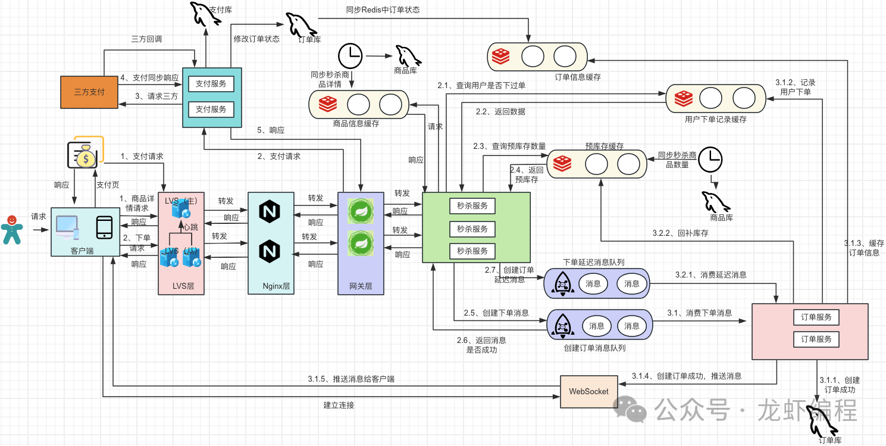
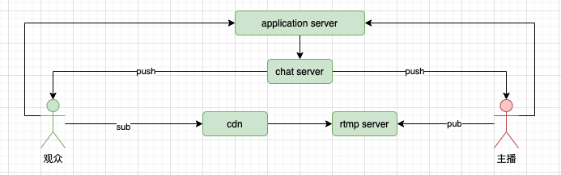
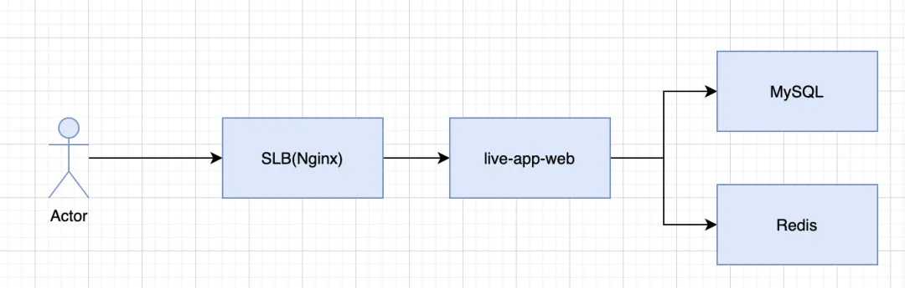

### 项目开发
1. 语言
   - 常用惯例
   - 编码规范
   - 代码组织
   - 安全性[腾讯开源多语言安全代码指南]
1. 框架
   - 库
   - 脚手架
   - RPC
   - RESTFUL
   - 分布式事务
1. 测试
   - 单元测试
   - 功能测试
   - MOCK技术
   - 全链路压测
   - 性能
1. 文化
   - DevOps
1. 工具
   - 版本管理
   - 静态分析
   - 持续集成
   - 持续发布
   - IaaC（ansible）
### 服务治理
1. 心得
   - 效果
     1. 高并发
     1. 高可用
     1. 易扩展
   - 实现
     1. 缓存
     1. 限流
     1. 隔离
     1. 解耦
     1. 降级/熔断
   - 实践
     1. 压测
     1. 日志
     1. 监控
     1. 告警
1. 限流
   - 认识：初始容量xx个，每xx秒最多xx次
   - 尽早限流————层层限流
     1. 合法限流：限制不合法的，如机器和刷单
        - 验证码限制：拉长访问时间，降低峰值
        - ip限制：拉入黑名单
        - 隐藏秒杀地址：秒杀开始后暴露
     1. 负载限流：集群+网络七层模型
        - 软件：2层的mac负载，生成虚拟mac映射到n台服务器，ip负载，lvs的端口负载，nginx的http负载，还有级联负载会增加网络延迟，单独使用nginx、lvs即可
        - 硬件：F5、Array
     1. 服务限流
        - 限流算法：令牌桶等
1. 链路追踪
   - 实现原理：根据时间线去看，一个个请求有开始时间、持续时间，上下层级关系，然后组合。
   - 网校trace
     1. 组成
        - 关键三要素：接口url(名称)、开始时间、持续时间
        - 表示整体范围：traceid不变，贯穿所有请求的始终，可用uuid。日志里收集的是乱序的
        - 表示请求层级和顺序：rpcid形式x.x.x，每一个层级多一个点，相同出发点，x值递增表示每一个请求(可以是http、mysql查询等)。即只有最后一位+1，前几层不变，子调用的时候会增加层级计数 一个点代表一个调用深度层级的执行顺序
        - 将格式化好的数据灌入数据库中
     1. 应用场景
        - 可通过TraceId能够将某次请求所有日志汇集，方便查询分析，回放
        - 可通过对标准格式的日志内容进行统计分析，可以分析出所有时间段内接口、资源的响应情况
        - 可通过对错误日志进行汇总去重，实现运行异常发现、排查、现场回放、警报
     1. 日志内容范围
        - mysql请求ip、连接耗时、响应耗时、sql模板、sql附加参数*、执行错误、连接错误
        - http请求ip、url、method、参数、httpcode、dns解析时间、连接时间、业务处理时间、执行错误、连接错误
1. 重试
   - 认识：解决瞬态错误
   - 思路
     1. 超时机制：重试也要有超时时间
     1. 重试次数限制：设置最大重试次数
     1. 指数退避：每次重试之间增加延迟时间，如指数级别的方式，避免过多重试
     1. 随机抖动：在指数退避基础上添加随机抖动，如增加随机延迟时间，避免所有客户端同时重试，减少系统冲击
### 技术点
1. 秒杀系统
   - 综述
     1. lvs + nginx，nginx加限流：高并发
     1. redis缓存商品信息、预库存信息(redis中的库存就叫预库存，用来拦截售光的无效请求)、订单信息：高并发
     1. 通过异步下单mq的方式削峰订单处理：高并发
     1. 下单成功的通知由ws推送到客户端：涉及到秒杀的整体架构设计
     1. 超卖问题采用乐观锁的机制做兜底处理：高可用
     1. 针对用户超时未支付或者多次下单同一个商品导致商品少卖的问题，采用真实库存回补的方式来处理预库存(redis的中的库存)：高可用
   - 细节问题
     1. 如何正确下单
        - 需求逻辑：如果用户在本场本商品没有下单，并且预库存扣减成功，那么允许用户下单
        - 方案：异步下单的方式，发送两个mq消息，mq消息发送成功之后通知客户已经在下单队列中等待处理
          1. 一个实时下单消息：订单服务开始消费消息队列中的消息，首先会创建订单基本的信息、下单的商品信息等，创建成功之后订单信息会保存到数据库中并且数据还会同步一份到redis中用于用户查询订单的信息。最后通过websocket技术将用户下单的成功的消息推送给客户端，方便用户支付
             - 数据库乐观锁机制保证不超卖`update item set stock = stock - 1 where id = #{itemid} and stock > 0`
          1. 一个延迟检查是否支付的消息(超时未支付取消本单，且回补预库存)：极端情况下出现超时未支付的请求和用户支付请求同时来操作订单，采用订单的状态机来处理(初始化、待支付、支付中、待发货、交易关闭这些状态的流转)，可以设置为支付成功优先于超时关闭，也可以设置为谁先来处理谁(`update order set status = #{status} where order_id = #{orderid} and status = '待支付'`)，后续的抛弃
     1. 下单的幂等性：采用setnx保证，失败需要回补库存哦。因为是先过库存再走下单
   - 图画的非常好，多参考：
1. 库存扣减的演进
   - 问题点
     1. 高性能
     1. 正确扣减、库存回滚
     1. 防止超卖
     1. 库存定时校准
   - 单数据库事务保证
     1. 认识：保证订单+库存扣减的正确性
        - 性能问题突出，分库分片也无法解决
     1. demo
        ```sql
        insert into antire(code) value (‘订单号+sku’)
        update stocknum set num=num-下单数量 where skuid=商品id and num-下单数量>0      // 由数据库保证不超卖
        ```
   - redis超卖判断 + 数据库持久化
     1. 认识
        - 数据库不必再超卖判断
        - 订单号分库分表，消除数据热点
     1. redis
        - 多库存项扣减
            ```sh
            // 演示单项扣减，多项相同
            hset iphone inStock 1               # 设置一个可售库存
            hget iphone inStock                 # 查看可售库存为1
            hincrby iphone inStock -1           # 卖出扣减一个，返回剩余0，下单成功
            hget iphone inStock                 # 验证剩余0
            hincrby iphone inStock -1           # 应用并发超卖但Redis单线程返回剩余-1，下单失败
            hincrby iphone inStock 1            # 识别-1，回滚库存加一，剩余0
            hget iphone inStock                 # 库存恢复正常
            ```
        - 扣减的幂等性保证：增加一个防重码校验，`set a100_iphone "1" NX EX 10`
        - 单向保证：顺序要对
          1. 扣减库存：1.扣减库存 2.写入防重码，反过来会超卖
          1. 回滚库存：1.写入防重码 2.扣减库存
     1. 持久化设计
        - 事务demo
            ```sql
            insert into antire(code) value (‘订单号+sku’)
            update stocknum set num=num-下单数量 where skuid=商品id
            ```
        - 任务引擎实现最终一致性：面临子任务的后续一堆处理中，先把任务落库，通过数据库事务保证子任务拆分和父任务完成的事务一致性
          1. 把任务调度抽象为业务无关的框架
          1. 就是抽象个引擎，支持简单的流程编排，并保证至少成功一次，去处理后续的流程
   - 服务接入端加上防刷
     1. 认识：解决过热SKU打向Redis单片的性能抖动
        - 服务端加上毫秒级时间窗口的限流：如10ms超过2个就限流，50台服务器一秒可卖1万个货，根据实际情况调整阈值就可以
   - 服务接入端提前分配库存
   - 后台差异对比：只要有异构一定有差异，扫描db中数据修复redis中的数据
#### 数据迁移
1. 方案
   - 每次数据库取一小批，积累一大批后，统一处理————加快速度，数据库压力小
   - 用队列异步拆分生产和消费————增强灵活性
   - 因为会拆成512个表，用512个数组存放逻辑分类后的数据————方便管理、分类
   - 分别添加处理队列、延时队列，延时队列用于数据校验和补偿
   - 用原子变量msg_count判断redis里是否全部处理完了，完了就再添加
   - 由于msg_count的顺序性，数据顺序也不会乱
1. 图：
1. 执行步骤
   - 开启一个php process扫描课班数据表，每次取出1千条数据
   - 将取出的数据根据用户id做hash，财务数据分表有512张，php process建立512个数组，来存放hash的消息数据
   - php process每循环取出1万条数据以后
     1. 将id添加到延时队列(用于延时检测与补偿)
     1. 检测redis变量msg_count是否等于0，等于0则将512个数组打包成512个payload添加到即时队列，添加前设置msg_count++; 否则再循环取1万条数据，积累数据，进行下次进行判断
   - 开启8个消费者处理payload，将payload解析，组装成财务系统需要的数据，批量添加到相应数据表，每个消费者，处理一条payload，就将原子变量msg_count–;
   - 延时检测消费者，取出消息判断财务系统是否存在，不存在则单独补偿
1. 问答
   - 怎样保证数据原子性事务插入
     1. Innodb引擎本身能够保证数据的插入原子性，批量插入数据，要么成功，要么失败
   - 怎样保证迁移数据过程中数据不丢失
     1. 通过延迟消息(5分钟)检测的机制，能够检测出来扫描出来的数据(历史数据)在财务新系统中是否存在，如果不存在，则补偿单独迁移，报警！能够保证数据完整。
   - 怎样保证消息是按照顺序排列的
     1. 脚本通过原子变量msg_count保证生产者添加消息到队列，和消费者从队列里取消息是有序进行的，从而保证了数据表中插入数据是全局有序的
   - 脚本如何优雅关停
     1. php有pcntl类库，脚本通过监听KILL信号，将一个原子任务处理完成后，才会退出，从而保证脚本的优雅关停
1. xes_admins表数据迁移：分三个阶段实施
   - 活跃账号同步：接口改造
     1. 建立一张新的xes_admins表（新表名：xes_admins_ldap）
     1. adminapi对接新的LDAP
     1. 所有登录admin系统的账号，都在新的LDAP查询一次账号信息，在xes_admins表找到对应的adminid，再写入xes_admins_ldap中
   - 数据比对
     1. 比对xes_admins与xes_admins_ldap表中的数据，找到有差异的行数据
     1. 针对有差异的行数据做甄别，判断是否有潜在风险，确认无风险后，做到数据一致
     1. 如果判断没有风险，找一个晚上业务空闲时间做xes_admins表切换
   - 在线数据切换
     1. 将xes_admins表中的临时账户数据一次性导入到xes_admins_ldap表（临时账户数据是指没有匹配到工号的数据）
        - 注：考虑到审计需要和老员工离职再入职等情况，不能只导正常账户，“冻结”和“注销”的数据也要导入到新表
     1. 禁止xes_admins表新增，将xes_admins表名改为xes_admins_old，将xes_admins_ldap表名改为xes_admins（理论上表重名可以online操作，需要咨询DBA）
     1. xes_admins_old 表自增id + 10000 （万一出现问题便于回滚）
#### 哔哩哔哩直播架构
1. 演进
   - lamp + rtmp server + cdn
     1. 认识：最初2年内演进壮大为重要且独立的业务系统，拆出了很多个子系统(主播、用户、弹幕、礼物、成就、排行榜、积分、任务等)
        - 代码从5w行到13w行
        - 曾经同时有10个左右commit的分支同时合并
        - linux + apache + mysql + php
     1. 直播系统架构：
        - 业务系统：用于直播各种业务功能逻辑实现
        - 推拉流系统：主播推流和用户拉流观看
        - 长连接系统：在直播中的各类实时业务数据推送触达
     1. 应用架构：
   - swoole化改造：微服务系统的雏形已经显现
     1. 基于swoole开发了自己的微服务框架，实现了服务进程管理、平滑重启、orm、cache、logging等，业务只需要按照模板实现controller和对应service代码即可，能够比较快速地上手开发
     1. 微服务间通信基于TCP自行封装的RPC协议并称之为liverpc
     1. zookeeper作为服务发现、配置管理，搭配叫apollo的业务伴生程序用于服务配置拉取、服务注册、服务节点发现，业务框架通过文件监听的方式感知配置变化进行热加载
     1. 基于swoole的纯异步client实现网关服务，所有请求都经过，在性能上有一定保证，实现了流量转发、url重写、超时控制、限流、缓存、降级等能力
     1. 业务上也分库了
     1. docker化改造：采用CPUSET方式部署；区分固定资源池和弹性资源池；
        - 网关服务实时统计每个接口的qps：小于x全部转发到固定资源池分组，大于时到弹性资源池
        - cpu burst技术将cfs调度导致的超时问题大大缓解
   - golang改造：毛老师作为golang布道师，推出kratos 微服务框架、discovery 服务发现、overload 缓存代理等
     1. php的问题：下线时live-app-web已累计了19w行代码、上百位contributers
        - 更大的业务流量下性能表现不佳
        - 下游响应变慢php worker不能及时释放，新的只能排队等待空闲worker，这样的级联等待进而导致系统的雪崩
        - 并行rpc困难，使得接口很慢
        - 没有数据库连接池
     1. 系统架构
        - 数据面采用Envoy作网关，非常适合作为流量转发服务，在service mesh领域几乎第一的存在
          1. 实现了分布式限流、接口条件rewrite、接口降级、统一鉴权、接口风控、多活可用区降级等特性，并提供单机15w+ qps的服务能力
          1. php也享受go的服务治理能力，通过service mesh的方式php/js进程以http协议访问本地的sidecar进程，由sidecar再将请求转发到对应的http或grpc服务，并且业务服务无需关心服务节点发现、节点错误重试、节点负载均衡等等微服务治理问题
          1. 部署配置复杂、C++代码难以二次开发，特别是流量治理和管控能力缺乏可视化的控制面，只有少数几个开发者才能正确配置，后来换到了B站统一网关
1. 问题解决 - 热Key
   - 思路：都是多级缓存、分而治之
   - 实现
     1. 提供了热门房间SDK：业务直接通过SDK判断特定的room_id/uid是否属于热点，属于的话业务通过定时器将热点房间数据直接缓存到内存中，即主动推送缓存。这样热门房间的业务数据就会直接命中内存缓存
        - 判断阈值可由各个业务服务自行控制
        - 热门的处理可模拟、可演练
     1. 热点数据主动探测：因为热门评论同样也会热key。sdk异步通过滑动窗口+lfu+优先队列计算top-k(后HeavyKeeper算法改进)，定时向业务回调统计到的热点数据id ，业务基于这些热点id将数据预加载到内存
     1. 客户端代理缓存：类似Redis6的客户端缓存机制来解决热点数据问题
     1. 热点写：提供聚合写入sdk，合并数据写入，使用内存聚合或redis聚合方式
1. 问题解决 - 请求放大
   - 问题
     1. 请求超出需要的数据：类似使用select *的问题，参考FieldMask拆模块，业务方组装API调用
     1. 重复的请求：整合新接口、修改调用时序
     1. 业务服务的请求放大：数据上看对下游的99%请求都是查空的无效请求，给其他服务埋点tag提前避免请求、减少请求
1. 活动保障
   - 认识：围绕场景梳理分析、服务容量预估、全链路压测、降级预案、现场保障等方面有一系列标准化方案、工具和平台支持
     1. 场景梳理：涉及了哪些业务功能、服务和接口；基于用户的真实操作路径进行请求录制；生成场景依赖Trace链路关系图；就明确了该场景下涉及的服务、资源等信息
     1. 容量评估：进行采购备量和提前扩容，基于历史数据和活动预估进行推算，不同的业务有不同的增长系数
     1. 服务压测：真实容量进行摸底，服务扩容前和扩容后都会进行压测
     1. 降级预案：要通过预演的方式验证sop方案有效性
     1. 现场保障：保障工作的有序流转、不重不漏、快速执行。研发了活动实时保障平台