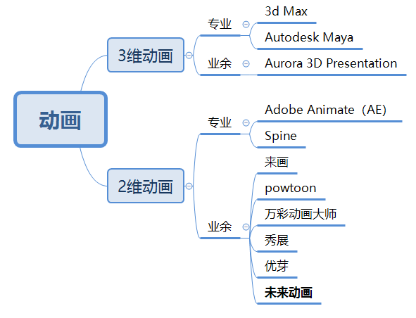

### game
1. 游戏：就是可控制的逻辑多变的一帧帧动画
   - 显示
     1. 图形系统
        - Shader
        - 动画系统：控制播放
        - 底层渲染
     1. 物理系统：碰撞检测、重力、惯性、速度
     1. 粒子系统
   - 逻辑
     1. 输入控制
     1. AI：NPC互动、自动寻路、追逐敌人
   - 声音
1. 游戏引擎
   - 特点
     1. 减少工作
     1. 减少重复开发
     1. 降低门槛
   - 分类
     1. 大而全
        - 虚幻4：Unreal Engine 4，主要C++，主机、pc、vr
        - Unity3D
     1. 小而美
        - Cocos2dx
        - 白鹭：Egret，主要Typescript，跨平台强，适合h5、微信小程序游戏
        - LayaAir：国内h5引擎，相对Egret起步晚，支持AS3.0、Typescript、JS
     1. 其他：游戏设计器
1. 动画：
1. 游戏团队：策划、美术、声音(相对独立，单独团队)、程序员
1. 图形API
   - 方法：先学背景、想法、思路，再学具体的操作和细节
   - 理解：Open Graphics Library，跨语言，跨平台的编程图形程序接口，将计算机资源抽象为OpenGL的对象，对对象的操作抽象为指令
     1. OpenGL ES：OpenGL for Embedded Systems，针对嵌入式的子集，目前3.0最流行
   - 组成
     1. 上下文：庞大的状态机，是指令执行的基础，函数都是面向过程的。不同的控制模块使用独立状态管理如多线程，防止上下文状态切换开销，共享纹理、缓冲区等资源，比反复切换上下文或大量修改渲染状态更加合理高效
     1. 帧缓冲区：FrameBuffer，即画板，可以是纹理、渲染缓冲区，放置称为Attachment 帧缓冲区的附着
        - 附着：ColorAttachment、DepthAttachment、StencilAttachment，颜色、深度(判断远近实现遮挡)、模板(一般用于渲染时像素级剔除和遮挡效果，常见应用场景如三维物体描边)，对应ColorBuffer、DepthBuffer、StencilBuffer
     1. Texture 纹理、RenderBuffer 渲染缓冲区
     1. VertexArray 顶点数组、VertexBuffer 顶点缓冲区
     1. ElementArray 索引数组、ElementBuffer 索引缓冲区
     1. Shader 着色器程序
     1. Per-Fragment Operation 逐片段操作
        - Test 测试：PixelOwnershipTest 像素所有者、ScissorTest 裁剪测试、StencilTest 模板测试、DepthTest 深度测试
        - Blending 混合
        - Dithering 抖动
     1. 渲染到纹理
     1. SwapBuffer 渲染上屏/交换缓冲区
### 工具
1. Unity3D：支持C#/JS/Boo，跨平台好，技术门槛低入门快、操作方便、开发迅速
   - 完美跨平台
   - 简单流程、方便的编辑器
   - 官方支持Asset Store
1. Cocos：游戏引擎，MIT协议的开源。包小，兼容性好，性能高，热更新方便，如保卫萝卜
   - 分类
     1. Cocos2d-x：c++/lua/js，一次编写，跨平台部署
     1. Cocos2d-js：贼火
     1. Cocos2d-lua
   - 组成
     1. 图形特性
        - 基本绘制：旋转、位移、缩放、横切
        - 动画序列帧
        - Action系统
        - 骨骼动画
     1. Box2D物理引擎
     1. 音频系统
     1. http网络模块
1. UE4：Epic公司的，UE4开源+授权费，支持c++、blueprint，如绝地求生
   - 游戏开发
   - 应用软件
   - 影视动画
### 方案
1. 多人分组模式下基于unity场景同步的前后端实现(NEXT、全真课堂)
   - 平台
     1. 组成
        - studio：基于Unity3D的场景编辑器
        - 课程运行App框架
     1. 技术架构
        - lua课包层：下载直接运行，无序发版
        - unitySDK层：基于unity的统一api
        - app native层：基于windows、安卓、ios的框架、底层能力，网络长链接等，给unitySDK提供api
   - 技术点
     1. 学员分组之间可见，老师所有人可见的实现
        - 难点
          1. 分组采用普通方式：业务要求分组人数少导致了服务器成本过高：游戏引擎的运行需要基本的资源（0.25个CPU核心、250M+的内存），如果单服务器人数太少（分组4人）会导致一台40核的服务器（一年2.4W）只能支持640人（人均37.5元）
          1. 普通游戏可以用分区方式进入不同的服务器进行分组，老师需要在每个分区里面都出现，而且动作要保持一致
        - 实现：四叉树的空间分割
          1. 一台server运行很多分组，所有人地图(空间)都一样，不是同一组的玩家不可见，一台40核服务器能支持16000人，人均服务器成本1.5元
          1. 业务逻辑进行四叉树的分割，同一组的孩子订阅这一组的逻辑服务，不同组的相互不影响
          1. 老师在一个单独的server，每组学生在一个相同的逻辑分组，一台服务器运行多个逻辑分组。然后将老师的服务端计算的结果通过网络投射到每台服务器的每个逻辑分组中。老师可以挑选对应的逻辑分组查看
     1. 多人状态同步
        - 架构：解耦计算服务和业务逻辑服务，实现分层
          1. gameServer：服务端搭建unity3D计算所有人动作，负责计算服务，并将操作计算结果给到cacheServer
          1. cacheServer：负责业务逻辑的状态转发，接收计算结果根据分组和业务要求做转发
          1. IRC服务负责所有的数据通信
        - 实现方式
          1. 状态同步：下发状态，所有计算都由服务器运算，把空间中所有数据(人物、地面等等所有)都计算好后，并同步给客户端，客户端只是做显示和渲染，数据量大，但是为了给玩家好的体验，减少同步的数据量，客户端也会做很多的本地运算，减少服务器同步的频率以及数据量
          1. 帧同步：下发操作，即时战略游戏来讲状态同步数据量太多不可接受，每个客户端接受到操作以后通过运算都可以达到一致的状态，这样的情况下就算单位再多，同步量也不会随之增加
     1. 帧server的功能实现：详情见pdf
        - 认识
          1. 帧server作为tarnode提供服务，调用k8s的api进行按场次的调度和拉起
        - 实现
          1. 单房间的信令打包转发：技术上，使用一个单独协程，基于ticker timer实现定时从打包队列获取消息，然后打包发送到发送队列
             - 每个客户端都发送上行消息给帧server
             - 帧server固定频次（15帧/s）将收到的该房间多用户消息打包，发送下行消息给该房间内的所有用户（群发逻辑）
             - 中途加入玩家，走帧补偿方案，下面有介绍
          1. 直播大班分组场景下的信令通信：技术上，帧server处理大班分组通信，单节点上使用多个协程组隔离处理多个room
             - 每个节点上可以处理多个room房间的消息
             - 每个room都初始化了一组Goroutine和queue来隔离处理业务，实现每个学生房间信令隔离
             - 每个帧server节点都启动了一个节点房间协程，来接收老师teacher room会话消息，插入当前节点下所有学生room的packMsgQueue，实现教师信令全局可见
             - 被订阅学生分组的业务协程收到学生P2P消息后，需要将消息P2P转发给teacher room所在业务协程会话，然后入teacher room所在的packMsgQueue，实现教师订阅学生房间信令
             - 帧server和客户端通过IRC消息服务进行TCP长链接通信
