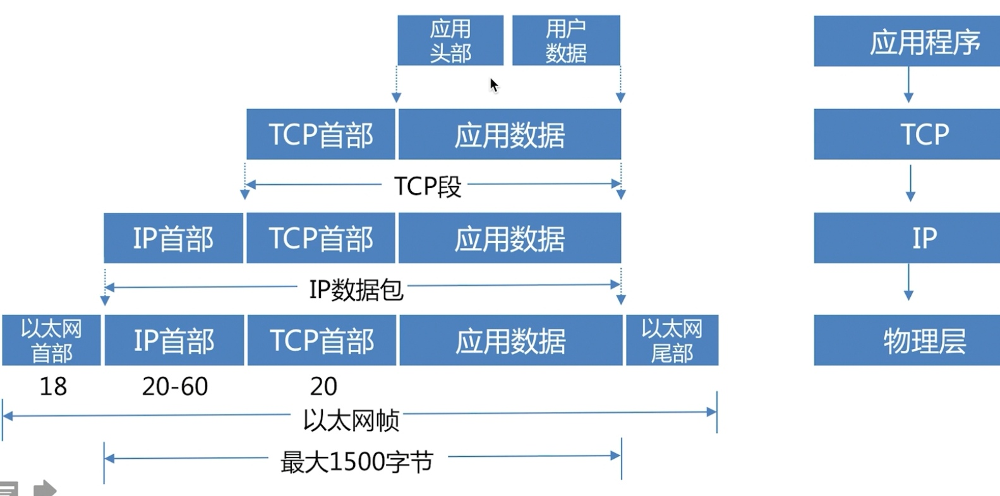
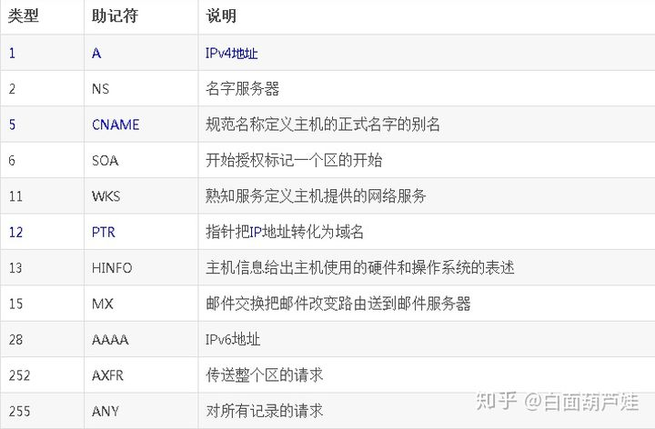
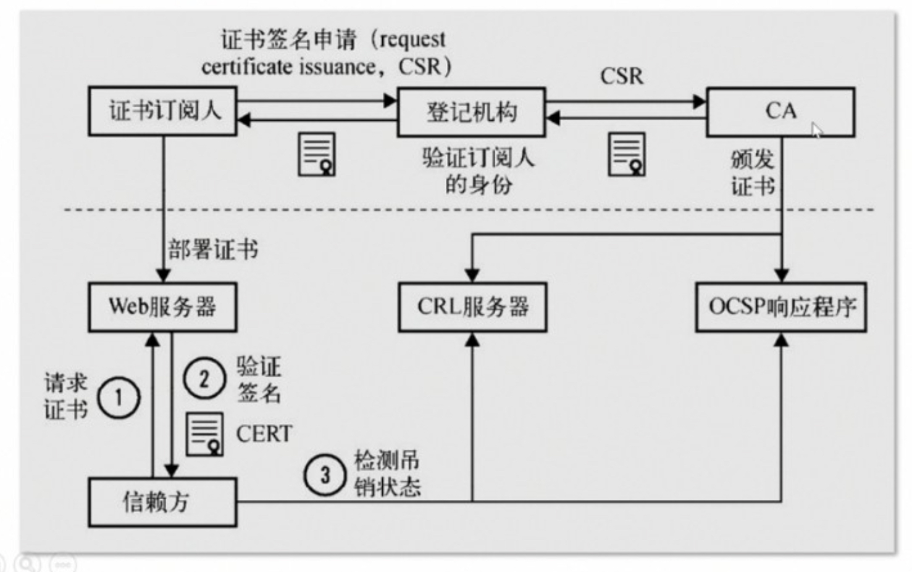
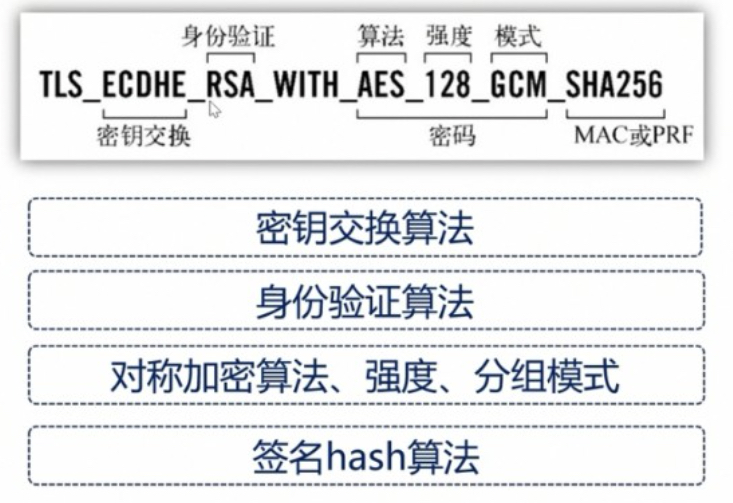
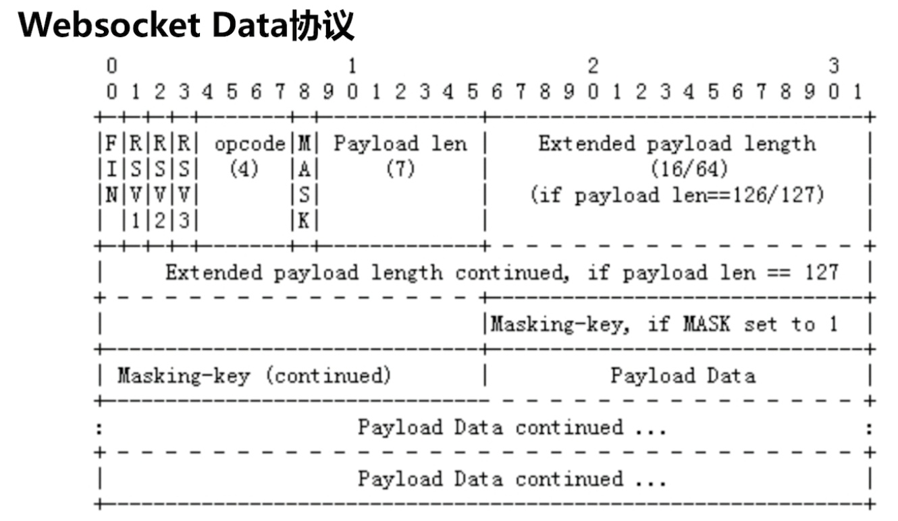
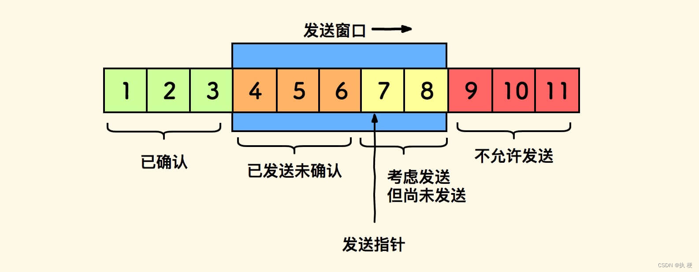
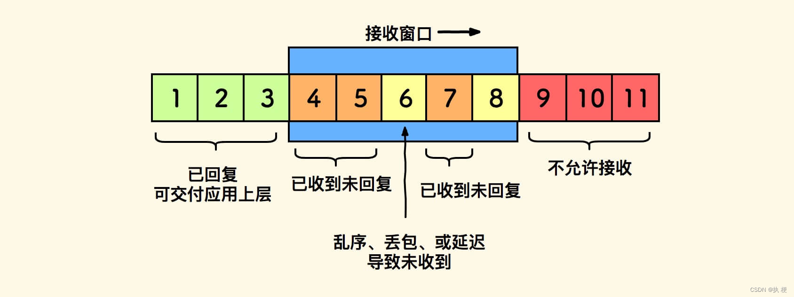

### 认识
1. 认识：用于互相通信
   - 计算机网络是不可靠的，存在丢包、乱序、延时
1. 指标
   - 带宽：Bandwidth
     1. pps：每秒包数量，几百万量级
   - 延时：Latency
   - 丢包率
1. 分类
   - LAN：局域网
     1. VLAN：虚拟局域网，分割广播域便于管理、提高性能，一个vlan里可相互通信(如arp)，不同vlan可用基于mac地址过滤的单臂路由或者三层交换机以提高安全性，把网桥给虚拟化成多个广播域的技术
        - 网卡虚拟化技术：ipvlan，macvlan
        - 特点：无需物理改动，软件可灵活配置；可将一个物理交换机当作多个虚拟交换机使用；隔绝了广播信息的不安全性
        - 划分方法：基于端口
        - 组成
          1. IPVlan：高版本linux允许物理或虚拟网卡会存在n个同mac地址但不同ip的子网卡
          1. MACVlan：比上边多了mac地址不同
   - WAN：广域网
     1. Internet：互联网，多个网络连接形成更大的网络，即网际网。由ARPANET(为可靠军用通信诞生)发展而来
     1. SD-WAN：软件定义广域网
        - MPLS：多协议标签交换，是一种高效且可靠的网络传输技术。就是在数据流上打标签，有点像鸡毛信，告诉沿路的所有设备：“我是谁，我要去哪里”
1. 实现基础
   - ISP：互联网服务提供商，能提供拨号等上网服务，是网络最终用户进入Internet的入口和桥梁。基础运营商电信联通移动、长城等
   - IDC：互联网数据中心、IDC机房
   - BGP：border gateway protocol 边界网关协议，主要是用来做tcp上的自治系统间交换各自的ip路由表，可实现最佳路由距离
     1. 组成：iBGP、eBGP
     1. BIRD：是一个实现了多种动态路由协议如BGP、OSPF等的程序，它的配置文件有自己的一套类似编程语言的语法
     1. RR：Router Reflector 路由反射器。所以当自治系统规模特别大的时候，就单独抽出来一个或几个节点作为路由反射器，其他的所有普通节点都之和这些反射器建立连接，把自己的宣告给反射器，然后反射器再告诉其他节点，这样相当于把原来 n*(n - 1) 的数据平面给拍平了
     1. BGP机房：即多线机房，你用联通访问机房就将数据发给联通返回给你，速度快，真正BGP要有AS证书，需要相互和IDC学习对方ip，假的是双线双ip
   - AS：Autonomous System 自治系统，是使用统一内部路由协议的一组网络，用于网络规模比较大，可以理解为王国
     1. AS号码：自治系统号码，用来标识独立的自治系统，最大是65536，如AS4134，全球最大的中文资源互联网络ChinaNet，即中国电信163骨干网
        - 全球的互联网被分成很多个AS自治域，每个国家的运营商/机构/公司都可申请AS号码
        - 跨运营商的流量服务不会太好，带宽不足，容易丢包，延迟大。所以财大气粗公司的服务器会提供多个运营商的入口IP，依据客户端IP归属哪个运营商(AS)，智能DNS Server会返回和客户端位于相同AS的服务器IP，这样客户端访问服务器就会低延迟、低丢包、快速响应
     1. 自治系统间使用外部路由协议，通常是BGP协议
1. 网络架构
   - 传统三层
     1. 认识：核心技术-生成树协议STP
     1. 分层
        - 核心层：OSPF100的核心交换机
        - 汇聚层：基于VRRP GROUP的汇聚交换机，采用MSTP多网接入
        - 接入层：连接到服务器
     1. 问题
        - 稳定性：stp网络中，当一条根链路出现问题时，会导致全网的生成树要重新计算，使得整个网络都不稳定
        - 扩展性：无法虚拟机迁移
        - 受限：转发浪费性能，升级割接困难
        - 不支持多租户
   - spine-leaf
     1. 认识：VPN实例区分业务、采用Vxlan+BGP EVPN技术
        - 实现大二层互访，提高了转发效率
        - Spine交换机互连所有Leaf交换机，Leaf层汇聚来自服务器的流量
        - EVPN可以看成是构建在MP-BGP上的应用，EVPN架构中PE之间的MAC/IP地址学习是基于控制平面的，是目前业界主流且成熟的云计算网络解决方案
     1. 京北网络探索：EVPN的各个事业部以租户身份共同复用一套硬件架构，网络转发延迟从2ms~3.5ms降低至0.2ms~0.7ms
### TCP/IP模型
1. 认识
   - 协议在计算机通信中的重要性
   - 分层负责、对上封装/抽象
1. 网络模型
   - TCP/IP
     1. 认识：开放、实用，迅速流行和发展，业界标准和广泛使用的通信协议，以最具代表性的TCP和IP协议命名
     1. 组成：四层网络，数据封装过程：
        - 应用层
        - 传输层：tcp、udp
        - 网络层：3个主要协议ip、igmp、icmp
        - 网络接口层
   - ISO/OSI
     1. 认识：为统一不同计算机厂商的通信ISO制定了通信系统的标准，即OSI。只是粗略的界定，对协议和接口没有详细定义
     1. 组成：七层网络
        - 应用层：应用协议，如HTTP、FTP、TELNET、SSH、P2P、SMTP、POP3、MIME、LDAP、自定义
        - 表示层：数据的表现形式/安全/压缩等功能，固有数据格式和网络标准格式的转换，如域名、DNS
        - 会话层：会话的管理、同步，决定连接/断开的时间和时机
        - 传输层：段，传输数据的协议端口号，提供错误检测/流控/速度控制，如TCP、UDP、SCTP/DCCP
        - 网络层：报文，逻辑地址寻址、实现路由选择，利用逻辑地址(ip)寻址/选路，有IP、ICMP、ARP、RARP、DHCP、NAT
        - 数据链路层：帧，硬件地址寻址、差错校验等。用mac定位媒介、错误检验与修正(发现数据错误可要求重新传包)、负责信息局域网里的准确传递，帧和比特流的转换
          1. MAC：交换机负责维护单一层次的mac转发表，实现信息转发，可自学地址/环路检测(防止数据无休传输)
          1. 各种数据链路(传输技术)：以太网、无线、ATM、FDDI、ADSL(话机到电信局交换机中传输高频数字信号，和低频信号隔离避免噪声干扰啊)
          1. PPP：纯的数据链路层，以太网和FDDI都定义了比特被定义为何种电子信号，还需要物理层实现通信，如ADSL/有线电视通过PPPoE(以太网数据加入PPP帧)实现接入
          1. VPN：依赖交换机，划分虚拟网段，使用ip包中的标签确定用户以在多协议标签交换(MPLS)网中传输，或者使用IPsec技术对ip包进行验证和加密
        - 物理层：比特，比特流的传输，建立物理连接
     1. 特点
        - 上三层针对用户，下四层针对传输
        - 越到底层，越接近硬件
        - OSI中协议没有普及其模型常被使用，TCP/IP是先有协议后建立模型，不适用非TCP/IP模型
1. 数据包
   - tcp是mss包：一般情况下，MSS=MTU-40Byte，这两个超过大小都会进行分包
   - ip中是mtu包
1. 网络接口层
   - STP：Spanning Tree Protocol，生成树协议，用于建立树形拓扑结构，在提供链路冗余消除单点故障的同时防止网络产生环路，属于数据链路层
     1. 数据帧中没有类似TTL每次转发减一为零时丢弃包的字段,如果二层网络出现环路,数据帧会一直在网络中转发
#### 网络层
1. IP
   - 认识：为了简化和提速，可靠性上移。面向无连接，版本有IPv4/IPv6
   - 分类
     1. IPv4地址范围：分为ABCDE类，特点在于是否区分、及使用不同字节数的网络地址和主机地址
        - 0.0.0.0：默认地址，也是无效的，表示本机上所有IPV4地址
        - 127.0.0.1 本机地址
        - 10.x.x.x、172.16.0.0---172.31.255.254、192.168.x.x：私有地址，免得和共有冲突
        - 255.255.255.255：限制广播地址，指所有主机，不能被路由器所转发
        - 224.0.0.1 组播地址，特指所有主机；224.0.0.2特指所有路由器，IRDP(Internet路由发现协议）使用组播功能那主机路由表中有这样一条路由
        - 169.254.x.x：DHCP服务器发生故障的默认分配地址
        - 广播地址：ip地址中的主机号全部为1的地址，它是向同一个网段中的所有主机发送数据包
          1. ip组播：用于将包发送给特定组内的所有主机，可以跨网段给全网所有组员发送组播包。广播只能在路由器范围内
     1. 类型
        - 子网掩码：为解决ip地址扩展问题，区分网络位和主机位
          1. VLSM：可变长子网掩码，可以对A、B、C类地址再进行子网划分
        - CIDR：无类域间路由，采用任意长度分割ip地址的网络号和主机号
          1. 把多个网段聚合到一起，生成一个更大的网段
          1. 汇总路由表ip地址，分担路由表压力
   - IP路由
     1. 认识：设备根据ip对数据进行转发的操作。维护路由控制表
        - 多跳路由：当数据包到达路由器时会根据数据包的目的地址查询路由表，根据查询结果将数据包转发出去的过程
        - 路由协议：缓存ip和mac地址，决定下一跳的地址
        - 路由算法：RIP、RIP2、OSFP、BGP
          1. 距离向量算法：根据路由跳数决定，由互换路由信息完成，无法获知整个传输链路的状态，容易路由循环
          1. 链路状态算法：了解整个网络连接状态下生成路由控制表，每个路由器保持相同的信息
     1. 组成
        - 路由表：为了将数据包发给目的节点，所有节点都维护着一张路由表
        - Hop：跳，指网络中的不经过路由器而能直接到达的相连主机或路由器网卡的一个区间。IP包就是在网络中一跳一跳的转发
        - 默认路由：0.0.0.0/0或default
        - 主机路由：ip/32
        - 回环地址：以127开头的ip地址都是，127.0.0.1在ipv6下表达为::1
   - ip分片与重组
     1. 认识：发送方如路由器将上层给的长度超过MTU的数据包进行分片，每个分片添加三个字段；接收方如目标主机根据字段进行重组，用以适应不同数据链路的传输
        - 内部完成，上层协议无需关心
        - MTU：Maximum Transmission Unit 最大传输单元，byte为单位，默认1500
     1. 组成
        - 标识：用来检查是否为同一数据报的片
        - 标志：表明是否为最后一片
        - 片偏移：用来检查是否发生片丢失、表明片在数据包中的顺序
1. ARP
   - 认识：Address Resolution Protocol，地址解析协议，通过ip拿mac地址，先局域网广播询问物理地址，之后缓存一段时间，ipV6中用NDP代替，广播通过ip寻找mac地址，广播不能跨路由器，所以需要ip和mac地址。路由器会记录mac和ip地址的对应，依靠mac传递数据
     1. RARP：反向地址转换协议，mac广播找ip，反过来
     1. ARP响应：发现是自己的ip，告诉别人
     1. ARP欺骗：由于建立在互相信任基础上，攻击者可伪造目标机器的ARP信息，导致数据会通过攻击者转发
1. ICMP
   - 认识：Internet Control Message Protocol，Internet控制报文协议，检测ip包是否送达、包废弃原因，ping通过ICMP消息
     1. 用于在IP主机、路由器之间传递控制消息
     1. 面向无连接的协议，是网络层协议
   - 功能
     1. 确认IP包是否成功到达目标地址
     1. 通知在发送过程中IP包被丢弃的原因
     1. 控制发送速率，改变路由路径
   - 组成
     1. 报错报文
     1. 控制报文
        - 拥塞控制、源站抑制
        - 路由控制与重定向报文
   - wiki
     1. 基于IP协议工作，并不是传输层的功能，因此仍然归结为网络层协议
     1. IPv6要用ICMPv6
1. IGMP：互联网组管理协议
1. DHCP
   - 认识：自动ip分配的协议
#### 应用层
1. 域名
   - 组成
     1. 解析记录类型
     1. 线路：电信、联通、百度...
     1. 生存周期：10分钟...
   - 分类
     1. .：根域
     1. .com：顶级域名、一级域名，理论上所有域名的查询都必须先查询根域名，因为只有根域名才能告诉你某个顶级域名由哪台服务器管理。15年时1058个
        - 通用：com、net、org
        - 国家：cn。cn托管商就是中国互联网络信息中心
     1. baidu：二级域名
     1. www：三级域名
   - 解析记录类型
     1. A记录：主机地址记录，dns域名单一指向ip
        - 语法: owner class ttl A IP_v4_address
        - 例子: host1.example.microsoft.com IN A 127.0.0.1
     1. CNAME记录：多个域名到ip，也有域名到域名
     1. MX记录：不返回权威解析
     1. NS记录：针对邮件服务解析，配合A记录
   - wiki
     1. ICANN：全世界域名的最高管理机构
1. DNS
   - 认识：域名解析服务，域名和ip的绑定查询，一级级的往上查询，使用UDP协议，53端口
     1. dns解析
        - 正向查询：A记录，域名找ip
        - 反向查询：PTR记录，ip找域名
        - 迭代查询：服务器角度，是否多次查询
        - 递归查询
   - 认识：域名解析服务，本地域名服务器缓冲、一级级往上查询，最后是全球13台根DNS服务器，保留了对所有域名的起始解释权。不会自己存，只是会告诉你去哪里找
   - SOA服务器：起始权威服务器，可以新增和删除记录。一个域SOA只有一个，而NS可以有多个
   - NS服务器：表示哪些DNS服务器可以解析该域名。NS服务器包含SOA，SOA是一种特殊的NS
   - mdns：多播dns，将主机名解析为不包含本地名称服务器的小型网络中的IP地址，在没有 DNS 的环境当中让相同网段里的设备互相通信
     1. 在ip协议里规定一些保留地址，如224.0.0.251，端口5353，基于udp
     1. 每个进入局域网的主机，如果开启了mDNS服务的话，都会向局域网内的所有主机组播一个消息，我是谁，和我的IP地址是多少
   - httpDNS：指通过ip和http协议直接访问dns服务器获取解析，绕过本地运营商。因为智能dns有很多弊端，如nat转换导致解析链路加长、域名劫持等原因，移动端用的多
     1. 用法：将请求url中的host修改为httpdns解析给我们的ip, 并在请求header中将host指定为原始域名
     1. httpdns下的https的curl写法：`curl -v "https://xxx" --resolve xx.xx.com:443:xx.xx.xx.xx`，注意httpdns面对https时需要提供正确的host，否则证书返回的不对
   - DDNS：动态域名系统，支持动态更新DNS服务器上域名和IP的关系。举例：家庭ADSL拨号如果有公网Ip地址，但是重连会变，可以用MSR810配置PPPOE拨号 + 依赖花生壳的DDNS服务，实现服务解析
   - 开源dns服务：Bind、NSD、PowerDNS、Unbound，选用了powerdns
   - 智能dns
     1. 理解：能够基于IP信息给不同的用户最合适的服务器IP，关键在于搭建ip库，提供完整准确的ip地址和位置，由第三方、isp、APINC提供。即把地理位置和dns解析服务器绑定一起，不用走多余的网络路线
        - 特点：减少动态服务响应延迟，cdn加速，负载均衡，防止ddos
     1. 攻击
        - dns污染：dns劫持
        - ddos
        - 放大攻击：dns服务器被作为肉鸡
1. 其他
   - FTP：File Transfer Protocol，文件传输协议，是一种应用层协议，可很好的实现跨平台，但无法实现文件系统挂载等其他功能
     1. 用到2种tcp连接：一是命令连接，用于客户端和服务端之间传递命令，监听在tcp/21端口；另一个是数据传输连接，用来传输数据，监听的端口是随机的
     1. 主动模式、被动模式：主要是防火墙阻挡问题，被动模式基于服务端的防火墙的连接追踪能解决防火墙问题，用的多
   - 远程控制协议
     1. telnet
     1. ssh
     1. vnc：virtual network computing 虚拟网络计算机，可以实现图形化的远程控制
   - WINS服务：将NetBIOS名转解析ip地址，实现ip和计算机名映射，作用范围是某个内部网络
   - Gopher：比Internet早几年的只支持文本的信息索引程序，是一种传输协议
### 网络协议
1. socket数据传输是unix特殊的i/o，分为流式(SOCK_STREAM，面向连接，TCP)、数据报式(SOCK_DGRAM，无连接，UDP)
#### HTTP
1. 认识：HyperText Transfer Protocol，超文本传输协议，通信开销小，简单快速
1. 发展
   - http/0.9：1991年
   - http/1.0：基本成型，性能缺陷无法复用连接，队头阻塞，1996年
   - http/1.1：大范围使用的，1999年
   - SPDY：2009年
   - QUIC：2013年
   - http/2：2015年
   - http/3：2018年
1. http/1.0
   - 特点
     1. 无连接：规定和服务器保持短暂的连接。每次请求都需建立tcp连接，服务器完成后立即断开
   - 请求过程：不止这些，还会受到浏览器的策略和特性、web server的策略
     1. 建立tcp连接
     1. 浏览器发送请求头信息、数据
     1. 服务器发送应答头信息、数据
     1. 服务器关闭tcp连接
1. http/1.1
   - 认识
     1. 请求响应模式
     1. 无状态：服务器不跟踪每个客户端也不记录过去的请求
     1. 以ascii码为编码格式传输，以字节为单位
     1. 信息安全交由ssl解决
     1. web使用http协议作应用层协议，然后使用tcp/ip做传输层协议将它发到网络上
   - 特点
     1. 增加长连接、连接复用：1.0每一次http调用就建立一次连接然后用完挥手断开，1.1会复用已建立的客户端和服务器之间的连接，具体维持有头控制、server控制等
        - 设置：增加Connection头，设置Keep-Alive
        - 即用同一个TCP连接来发送和接收多个HTTP请求/应答，避免了连接建立和释放的开销，这个称为HTTP长连接
        - 支持请求管道化：pipelining，基于长连接可以在一个连接发送多个请求，但客户端必须按顺序接收响应，不能并行。无法解决头阻塞，太苛刻很少应用，现代浏览器采用同时多个tcp连接并行加载资源
     1. 增加缓存处理：增加cache-control，强缓存和协商缓存
     1. 增加分块传输/断点传输
     1. 增加host字段：使得一个服务器可以创建多个站点
   - 组成
     1. 请求行/响应行
        - 请求方法：get/post/put/delete/head/options/trace/connect
     1. 头信息：包含日期时间、内容类型和长度、编码字符集等
     1. 空行：CR+LF，回车换行，0x0d0x0a
     1. 主体
        - 实体类型
          1. multipart/form-data
          1. multipart/byteranges
   - 响应状态码
     1. 1xx：请求处理中
     1. 2xx：正常处理。200 ok，206 范围请求
     1. 3xx：重定向
        1. 1.0标准
           - 301 永久重定向
           - 302 临时重定向
           - 304 未修改(未符合If-Match，If-None-Match，If-Modified-Since，If-Unmodified-Since、If-Range)
        1. 1.1标准
           - 303：临时重定向，允许改变方法，禁止被缓存
           - 307：临时重定向，不允许改变方法，禁止被缓存
           - 308：永久重定向，不允许改变方法
     1. 4xx：客户端错误
        - 400 请求报文语法错误
        - 401 未认证
        - 403 阻止
        - 404 未找到
        - 408 连接超时(请求发送到网站时间过长，如访问google)
        - 499 客户端或服务端主动断开连接
     1. 5xx：服务器错误
        - 500 无法预料的错误
        - 501 服务器不支持或者无法识别请求的功能
        - 502 bad gateway，上游无效响应(无法连接、连接断开等)
        - 503 service unavailable，服务不可用，提醒稍后再试，fpm不够用，可返回Retry-After头表示恢复时间
        - 504 gateway timeout，响应超时
   - 格式demo
     1. GET
        ```
        GET / HTTP/1.1
        Host: xx.com
        Accept: text/html
        Cache-Control: no-cache
        ```
     1. Post：头信息每行一条，空行之后便是body
        ```
        POST / HTTP/1.1
        Content-Type: application/x-www-form-urlencoded
        Accept-Encoding: gzip, deflate
        Host: w.sohu.com
        Content-Length: 21
        Connection: Keep-Alive
        Cache-Control: no-cache
        ```
1. https
   - 认识：防止传输过程中被监听。http和tcp中间加了ssl/tls
     1. http的攻击方式
        - http代理攻击
        - http劫持
        - dns劫持
   - 组成
     1. http+ssl/tls
     1. 数字证书
        - 认识：用于确定服务器公钥真正的来源，是一个经证书授权中心数字签名的包含公开密钥拥有者信息以及公开密钥的文件，利用了数字签名来确保服务端公钥不被篡改
          1. 一般会包含公钥、公钥拥有者名称、CA的数字签名、有效期、授权中心名称、证书序列号等信息
          1. PKI：Public Key Infrastructure 公钥基础设施。利用公钥技术为网络应用提供加密和数字签名等密码服务以及必需的密钥和证书管理体系的标准。
             - 认证中心：CA机构
             - X.500目录服务器(证书保存)
             - 服务器向ca申请公钥和私钥，nginx把公钥证书发给浏览器，浏览器通过crl，ocsp找ca验证，查询太慢nginx先查好了然后提供，证书会过期
        - 类型
          1. DV：域名验证
          1. OV：组织验证
          1. EV：扩展验证，显示公司名字，越来越贵、费事
        - 证书链：一般分三级，顶级证书机构、二级证书机构
        - 原理：CA会用自己的私钥将证书内容的摘要进行加密。因为 CA 的公钥是公开的，任何人都可以用公钥解密出 CA 的数字签名的摘要，再用同样的摘要算法提取出证书的摘要和解密 CA 数字签名后的摘要比对，一致则说明这个证书没有被篡改过，可以信任
1. ssl/tls
   - 认识：通常用ssl指代ssl/tls协议因为ssl更常用。版本号：TLSv1.2
     1. 通过对套件里不同组件的切换，实现不同效果，如文件太大降低对称加密强度
   - 组成
     1. 组件：
        - SSL：Secure Socket Layer 安全套接层，http之下tcp之上的协议加密层。网景公司开发，SSL2.0和3.0不安全
        - TLS：Transport Layer Security，传输层安全协议。继承ssl协议并写入RFC，标准化后的名称。利用对称加密、公私钥不对称加密及其密钥交换算法，CA系统进行加密且可信任的信息传输
        - SNI：为解决一个服务器使用多个域名和证书的ssl/tls扩展，原理是进行ssl/tls握手之前先发送要访问的域名，服务器根据域名返回合适的证书
     1. 加密方式：ECC、RSA、DSA、DH
     1. 协议栈：握手、记录、修改密码规范、警报等协议
   - 加密过程
     1. 客户端发送ClientHello，接收并使用服务器的公钥非对称加密自己生成的对称加密的会话秘钥，传给服务端
     1. 服务端非对称解密得到客户端对称加密的秘钥，即确认会话密钥(session key)，发送ServerHello通知客户端开始用对称加密通信，完成握手
        - 使用了协议版本/加密算法/随机数等
        - 三方都添加随机数，随机性会提高很多层级
     1. 之后双方用对称加密通信，成本低，又安全
   - 场景
     1. session的恢复、优化传输
        - session ID：双方都有直接用，只能保留在一台服务器上
        - session ticket：只有服务器才能解密，解密后就不必重新生成对话密钥了
   - 历史
     1. ssl3.0：1995
     1. tls1.0：1999
     1. tls1.1：2006
     1. tls1.2：2008
     1. tls1.3：2018
        - 握手时间降低一半
        - 废除不安全的秘钥协商方式：解决1.2太多安全套件中那些不安全的
1. websocket
   - 认识：全双工通讯的应用层协议，复用http的握手通道，基于tcp传输，属于http1.1
     1. 更好的二进制支持
     1. 较少的控制开销：数据交换的数据头部较小
     1. 支持扩展
   - 组成
     1. 头信息
        - Sec-WebSocket-Key 校验key，校验原理是什么？？？
        - Sec-WebSocket-Protocol 需要的服务名称
        - Sec-WebSocket-Version 版本号
     1. 协议描述
        - ws://
        - wss:// 加了tls
   - 实现
     1. 步骤
        - 建立连接：先期使用http建立连接，之后转换为websocket
            ```c
            // 表示发起websocket请求
            Upgrade: websocket
            Connection: Upgrade
            ```
        - 交换数据
        - 数据帧格式：消息被切分为多个frame帧传输
        - 维持连接：鉴于传输中多次路由转发等的不稳定，会发送ping/pong心跳包检测连接活性
     1. 协议细节
        - 握手
            ```php
            // 发起请求
            GET /chat HTTP/1.1
            Host: example.com
            Upgrade: websocket
            Connection: Upgrade
            Sec-WebSocket-Key:dGhIIHNhbXBsZSBub25jZQ==..

            // 响应请求
            HTTP/1.1 101 Switching Protocols
            Upgrade: websocket
            Connection: Upgrade
            Sec-WebSocket-Accept:s3pPLMBiTxaQ9kYGzzhZRbK+x00=
            Sec-WebSocket-Protocol: chat
            ```
        - 数据传输：
1. 应用
   - 连接控制
     1. 认识：keepalive，复用tcp连接，要和tcp的keepalive区别
        - 减少握手次数
        - 通过减少并发连接数减少服务器资源消耗
        - 降低tcp拥塞控制的影响
     1. 操作
        - connection头：keepalive或close，采用哪种形式
        - keep_alive头：连接最少保持时间
   - 缓存控制
     1. 认识：先读取cache-control确认缓存策略是强制还是对比，然后执行相应逻辑
     1. 强制缓存：缓存有效时不与服务器交互
        - expires：1.0支持，返回到期时间，下一次请求时请求时间小于到期时间直接使用缓存
          1. 缺点：服务器时间和客户端不一致
        - pragma
          1. no-cache：和Cache-Control的一样，可被Cache-Control代替
        - cache-control：1.1支持，优先级高于expires
          1. private：客户端可以缓存
          1. public：客户端和代理服务器都可以缓存
          1. max-age=xx：缓存的内容在xx秒后失效
          1. no-cache：需要使用对比缓存来验证
          1. no-store：所有内容都不缓存，强制和对比都不触发
     1. 对比缓存：不管缓存是否有效都先与服务器交互，生效的状态码是304
        - Last-Modified：第一次请求时，服务器返回资源的最后修改时间
        - ETag：优先级高于Last-Modified，表示当前资源在服务器的唯一表示，生成规则服务器决定
        - If-Modified—Since：再次请求时，此字段告知上次请求资源的最后修改时间，服务器和资源的最后修改时间对比，改动返回200，未改动返回304
          1. 缺点：只能精确到秒级
        - If-None-Match：优先级高于If-Modified—Since，再次请求时，告知服务器上次返回的唯一标识
     1. 浏览器缓存使用机制
        - 输入url，使用缓存
        - f5：跳过强制缓存，会检查对比缓存
        - 强制刷新：不用缓存
   - 断点续传
     1. 认识：利用range头确定传输的字节范围，响应头Content-Range返回大小。php使用fread/fseek确定读取文件的范围和小大从而实现功能
   - 登录认证方式
     1. BASIC基本认证，使用base64认证，直接传输账号密码
     1. DIGEST摘要认证，接收服务端的质询码，计算后服务端验证
     1. SSL客户端认证
   - 压缩
     1. 认识：内容编码的一种，内容即body请求体，可以搅乱、加密。纯文本可压缩到40%，gzip对jpg支持不够好
     1. 组成
        - 请求头
          1. `Accept-Encoding:gzip,deflate`：以下算法全部无损
             - gzip：GNU zip格式压缩，就是找相同字符进行替换进行减小体积，所以html/css/js效果好
             - compress：Unix的文件压缩程序
             - deflate：zlib的格式压缩
             - identity：没有编码
        - 响应头
          1. `Content-Encoding:gzip`
          1. `Content-Length:xx`：指压缩后大小，字节
   - 表单提交
     1. enctype属性：表单数据的编码方式
        - `application/x-www-form-urlencoded`：键值对，url编码方式，默认
        - `multipart/form-data`：二进制编码方式，一个控件对应一个部分，适合传输更大数据，如传输文件
          1. get请求：没有被上传文件的实际数据
          1. post请求：Content-Type会追加boundary，其值作为请求体的文件数据分隔符
        - `text/plain`：纯文本编码方式，空格转为加号，不对特殊字符编码。不含任何控件或格式字符
   - 获取客户端ip
     1. 参数
        - HTTP_CLIENT_IP：未成标准，不一定服务器都实现，一和二可以用来表示负载均衡后的真实ip
        - HTTP_X_FORWARDED_FOR：有标准定义，用来识别经HTTP代理后的客户端IP地址，没有代理则为空，多个代理ip空格隔开追加，如：clientip,proxy1,proxy2
        - REMOTE_ADDR：是可靠的，是最后一个跟你握手的ip，因为否则reponse不会达到，这个可能为代理ip
        - HTTP_VIA：代理服务器ip
     1. 代理类型
        - 透明代理：HTTP_X_FORWARDED_FOR传真实用户ip，HTTP_VIA如实
        - 普通匿名代理：HTTP_X_FORWARDED_FOR传真实代理ip，HTTP_VIA如实
        - 欺骗性代理：HTTP_X_FORWARDED_FOR传随机ip，HTTP_VIA如实
        - 高匿名代理：HTTP_X_FORWARDED_FOR和HTTP_VIA无数值
     1. 请求头
        - x-forwarded-for；累加的逐级ip，因为代理往上走会再新加一层连接
        - x-real-ip：真实ip
   - 优化
     1. 减少http请求数：每个新的请求都需要3次握手，很费时间
     1. 减少传输文件大小：使用压缩
1. http2
   - 认识：在ssl层之上增加二进制分帧层，用frame封装header和body，实现了双向并行传输，提高传输性能，突破性能限制，没有改变1.x的语义，前身是SPDY
     1. web发展的背景
        - 更多要请求的资源数
        - 更高的实时性
     1. 1.1的不足
        - 采取行尾\r\n方式切分消息，需要计算量大的状态机解析消息
        - 请求响应模式导致了等待，没有利用tcp全双工双向通信
        - ascii传输效率低，空间浪费
        - 无状态需要重复发送头部等数据
        - 网络安全风险
   - 特点
     1. 多路复用：可承载任意数量的双向数据流，即客户端可一次发起多个请求，服务器可一次返回多个响应，双方可同时互相发送数据，是和1.1最重要的区别
        - stream：流，已建立连接上的双向字节流
        - 消息：数据流，包含header帧、body帧，可以设置优先级、依赖
        - frame：帧，通信最小单位，会标识所属的流，可以乱序发送，然后再根据帧头部的流标识符重新组装
     1. 服务器推送：服务器可主动推送
     1. 头部压缩：1.x头部元数据以纯文本形式发送，给请求增加几百字节的负荷，如cookie。使用encoder通讯双方各自cache一份header fields表，避免header重复传输，减小传输大小
   - SPDY
     1. 认识：google开发的基于tcp的对http的增强的协议，目的是降低延迟，提升速度，提升网络使用体验，因IETF标准了SPDY推出了http2，都放弃支持SPDY
        - 页面加载时间减少一半
        - 减少部署复杂性，使用tcp作为传输层，不改现有网络设施
        - 支持SDPY改的是客户端代理和web服务器
     1. 功能
        - 单tcp连接支持并发http请求
        - http报头压缩，减少带宽、包数量
        - 强制ssl
        - 高级特征：允许服务器对客户端发起连接并推送数据
        - 请求优先级
     1. 原理：在ssl层之上增加SPDY会话层，为编码和传输数据设计新帧格式，这样一个tcp可以实现并发流
1. http3
   - 认识：即HTTP over QUIC，运行在QUIC之上的协议被称为HTTP/3
     1. 以前是http+tls+tcp实现，quic是http+quic+udp实现
   - http/2的问题
     1. 有序字节流引发的队头阻塞，使多路复用能力大打折扣
     1. TCP与TLS叠加了握手时延，建链时长还有1倍的下降空间
     1. 基于TCP四元组确定一个连接，这种诞生于有线网络的设计，并不适合移动状态下的无线网络，这意味着IP地址的频繁变动会导致TCP连接、TLS会话反复握手，成本高昂
1. QUIC
   - 认识：Quick UDP Internet Connection 快速UDP互联网连接，谷歌制定的基于UDP的多路并发传输协议。融合了TCP、TLS、HTTP/2等协议的特性
     1. 是用来替代TCP、SSL/TLS的传输层协议，包含了ssl
   - 特点
     1. 基于UDP协议重新定义了连接：实现了无序、并发字节流的传输，解决了队头阻塞问题
     1. 重新定义了TLS协议加密QUIC头部的方式：既提高了网络攻击成本，又降低了建立连接的速度，1个RTT就可以同时完成建链与密钥协商，以前一大堆的握手/RTT
     1. 将Packet、QUIC Frame、HTTP3 Frame分离，实现了连接迁移功能，降低了5G环境下高速移动设备的连接维护成本
     1. 新的HTTP头压缩机制：QPACK，是对HTTP/2中使用的HPACK的增强。在QPACK下，HTTP头可以在不同的QUIC流中不按顺序到达
   - 优势
     1. 改进的拥塞控制
     1. 前向冗余纠错
   - 原理
     1. 数据包格式
        - header：明文
          1. flags：1byte
          1. connection ID：8byte
          1. QUIC Version：4byte
          1. Packet Number：1~6byte
        - data：密文
          1. Frame1
             - Frame Type：1byte，Stream/ACK/Padding/Window_Update/Blocked等，Stream业务数据data length 2byte，即最大包多大？
             - payload
          1. FrameN
     1. 0-RTT握手步骤
        - 是否缓存ServerConfig，下次建连直接使用缓存数据计算通信密钥
        - 客户端
          1. 认识
             - 第一步直接就发送应用数据了，ServerConfig是服务器静态配置可以长期使用，客户端通过ServerConfig实现0-RTT握手
             - 每次会话都创建一个新的通信密钥sessionKey，来保证前向安全性：一旦服务器的随机数b（私钥）泄漏之前通信的所有数据就都可以破解
          1. 步骤
             - 生成随机数c，选择公开的大数G和P，发送Client Hello消息
             - 使用缓存的ServerConfig计算通信密钥KEY，加密发送应用数据
        - 服务器：根据Client Hello消息计算通信密钥KEY
     1. 多路复用
     1. 连接迁移：客户端切换网络时和服务器的连接不会断开，用唯一id判断，TCP的4元组就肯定需要
     1. 可靠传输
        - 数据包号是单调递增：解决TCP重传歧义问题
     1. 流量控制
        - 包括拥塞控制、慢启动、拥塞避免、拥塞发生、快速恢复
        - 也是滑动窗口机制
        - 单数据包、单个请求可插拔配置的拥塞控制算法
          1. New Reno：基于丢包检测
          1. CUBIC：基于丢包检测
          1. BBR：基于网络带宽
1. http头
   - 通用
     1. Cache-Control：控制缓存的行为，如`Cache-Control: private, max-age=0, no-cache`，
        - 请求指令：
          1. no-cache：强制向源服务器再次验证，防止从缓存中返回过期的资源
          1. no-store：不缓冲
          1. max-age：秒，指定缓存有效的最大Age值
          1. s-maxage：覆盖max-age、expires，仅用于共享缓存，私有缓存会被忽略
        - 响应指令：public/private，其他人是否可使用缓存
     1. Connection：逐跳首部、连接的管理，close、keep-alive、upgrade
        - 长连接：服务和客户端都返回Keep-Alive表示长链接
          1. 1.0默认关闭，1.1默认开启
          1. keepalive_timeout设置超时时间
     1. Date：创建报文的日期时间
     1. Transfer-Encoding：body的编码方式，有这个字段实现了该功能的两端将不会立即断开连接
        - chunked
     1. Pragma：报文指令
     1. Trailer：报文末端的首部一览
     1. Upgrade：升级为其他协议
     1. Via：代理服务器的相关信息
     1. Warning：错误通知
   - 请求头
    ```
    Host                            请求资源所在服务器，主要用来实现虚拟主机，v1.1必须存在，否则400 Bad Request
    Accept                          用户代理可处理的媒体类型
    Accept-Charset                  优先的字符集
    Accept-Encoding                 优先的内容编码
    Accept-Language                 优先的语言（自然语言）
    If-Match                        比较实体标记（ETag）
    If-Modified-Since               比较资源的更新时间
    If-None-Match                   比较实体标记（与 If-Match 相反）
    If-Range                        资源未更新时发送实体 Byte 的范围请求
    If-Unmodified-Since             比较资源的更新时间（与If-Modified-Since相反）
    Range                           实体的字节范围请求
    User-Agent HTTP                 客户端程序的信息
    Authorization                   Web认证信息
    Proxy-Authorization             代理服务器要求客户端的认证信息
    Referer                         请求中url的原始获取方
    Max-Forwards                    最大传输逐跳数
    TE                              传输编码的优先级
    Expect                          期待服务器的特定行为
    From                            用户的电子邮箱地址
    ```
   - 响应头
    ```
    Server                          HTTP服务器的信息
    Set-Cookie
    Accept-Ranges                   是否接受字节范围请求
    ETag                            资源的匹配信息
    Age                             推算资源创建经过时间
    Retry-After                     对再次发起请求的时机要求
    Location                        令客户端重定向至指定URI
    Refresh
    WWW-Authenticate                服务器对客户端的认证信息
    Proxy-Authenticate              代理服务器对客户端的认证信息
    Vary                            代理服务器缓存的管理信息
    Content-Disposition             请求内容存为文件时提供默认文件名，如attachment;filename="aaa.csv"，设置为空可以防止浏览器下载
    ```
   - 实体头
    ```
    Allow                           服务器支持的HTTP方法
    Content-Type                    实体主体的媒体类型，默认为text/html
    Content-Length                  实体主体的大小（单位：字节），keep-alive时不需要
    Content-Encoding                实体主体适用的编码方式
    Content-Language                实体主体的自然语言
    Content-Location                替代对应资源的URI
    Content-MD5                     实体主体的报文摘要
    Content-Range                   实体主体的位置范围
    Expires                         实体主体过期的日期时间，是http1.0的标准，cache-control的优先级更高
    Last-Modified                   资源的最后修改日期时间
    ```
1. wiki
   - ajax的['HTTP_X_REQUESTED_WITH']为'xmlhttprequest'
#### TCP
1. 认识：面向连接的可靠的基于字节流的传输控制协议
   - 面向连接：一对一通信
   - 可靠性：保序、不重复、不丢失。只保证传输层的消息可靠性
     1. 由于网络的丢包、乱序、延时，收包后有回执确认包的应答机制、丢包后的重发机制
   - 字节流特性：和上层应用进程的交互方式是面向字节流的，tcp会将应用层数据切割成多个数据包在网络上发送，要还原就要求发送接收方都有缓冲区，凑够了再告诉上层
   - 全双工通信：双方均可收发
1. 组成
   - 认识：一条tcp连接由源IP、源端口、目的IP、目的端口四元组决定，所以服务器可支持的连接数理论无限多
   - 流程
     1. 建立连接
     1. 数据传输：顺序控制、重发控制、流量控制、拥塞控制等特性
     1. 断开连接
   - 名词
     1. MSS：最大报文长度
     1. MSL：Max Segment Lifetime，最长报文段寿命
     1. ISN：SYN的初始序号，32bit的计数器，每4ms加1。防止在网络中被延迟的分组在以后又被传送，而导致某个连接的一方对它做错误的解释。是动态生成的
1. 建立连接
   - 认识：3次握手，，即都是全双工的。可靠传输更多的靠重传机制
     1. LISTEN、CLOSE是初始的状态
   - 必要性
     1. 明确双方有正常的接收和发送能力
     1. 基于序号的重要性，可靠地交换初始序号
     1. 历史失效连接请求乱序问题
   - 过程
     1. 客户端：发送SYN包(seq=x)，进入SYN_SEND状态
        - SYN：synchronous，同步标志位，表示开始传输数据
        - ack：acknowledgement，确认
     1. 服务端：处于LISTEN状态时收到SYN包，返回SYN(seq=y)+ACK(x+1)应答包，进入SYN_RECV状态
        - 半连接队列：处于SYN_RCVD状态的连接的服务端队列，全连接是完成握手的连接。会进行指数级数量的SYN-ACK重传多次数后从半连接队列删除，关闭连接
     1. 客户端：收到服务端包后，发送ACK(y+1)，双方进入ESTABLISHED状态
1. 断开连接
   - 认识：4次挥手，可靠地实现TCP全双工连接的终止，因为连接是全双工的，明确双方都要结束传输数据，双方都发了一次FIN、ACK
     1. 主动关闭方可能的状态：FIN-WAIT-1、FIN-WAIT-2、TIME-WAIT、CLOSE，主动关闭方产生TIME_WAIT
     1. 被动关闭方可能的状态：CLOSE-WAIT、LAST-ACK、CLOSE
     1. 被动关闭方不close是CLOSE-WAIT状态，主动关闭方是FIN-WAIT-2状态，如程序中忘记close连接
   - 流程
     1. 主动关闭方：发送FIN包(seq=x)，进入FIN-WAIT-1状态
     1. 被动关闭方：收到FIN后，发送ACK(seq=y,ack=x+1)，进入CLOSE-WAIT状态
     1. 主动关闭方：收到ACK后，进入FIN-WAIT-2状态
     1. 被动关闭方：之后主动发送FIN(seq=z,ack=x+1)，进入LAST-ACK状态，并关闭连接。告诉主动关闭方，我的数据也发送完了，不会再给你发数据了
     1. 主动关闭方：收到FIN后，发送ACK(seq=x+1,ack=z+1)，进入TIME-WAIT状态，等待2MSL后，关闭连接，进入CLOSED状态，完成了循环
     1. 被动关闭方：收到ACK后，进入CLOSE状态
   - 设计原理
     1. 为什么挥手要4次：由TCP的半关闭造成的，只有等到被动关闭方确认他自己所有的报文都发送完了，才发送FIN报文
        - 半关闭：tcp提供了连接的一端在结束它的发送后还能接收来自另一端数据的能力
     1. TIME_WAIT等待2MSL的意义
        - 确保对方收到ack：给被动方的最后一个ACK丢失，那么被动方可重传FIN+ACK报文，主动方在2MSL内的收到的话，重传ACK，并重启2MSL计时器，保证双方能正常进入CLOSED状态
        - 保证旧报文在网络中消逝：因为要防止超时重传的ACK先发挥关闭作用后，旧的ACK误将新建立的连接关闭，同时禁止主动方在time_wait期间用相同的端口再起一个连接，2MSL后旧的ACK报文肯定被丢弃了
   - 操作
     1. reset报文：RST包，用于释放连接，如服务端在以下情况发送RST包
        - 客户端尝试和未对外提供服务的端口连接时返回
        - 数据交互时程序崩溃时发送
        - 不在其已建立的TCP连接列表内发送
        - 超出重传后超时发送
1. 滑动窗口
   - 背景
     1. 确认应答机制：为确保tcp的可靠性，需要有数据确认机制，接收方收到数据包时回复一个ack包表示收到，并且确认号字段中表示接收方期望收到的下一个序列号seq+1
     1. 连续ARQ：就是流水线式连续发送数据包，然后流水线式确认，因为停止等待协议：类似乒乓你一下我一下的效率太低
   - 认识：是TCP协议的精髓，是其设计的基本框架。是流水线传输方式的细化设计
     1. 通过动态调整窗口大小实现效率最大化
     1. 由于TCP是全双工的，发送方一边连续发送数据包一边等待接收方的确认，所以有两个滑动窗口发送和接收
     1. udp不需要，因为不需要确认
   - 组成
     1. 序号：每个数据包的唯一标号，因为数据包可能重复、乱序，32bit的整数字段，每次发包就增一
        - TCP是全双工的，发送和接收端各自维护自己的序号
        - 因网络延时不可控，如果两次连接建立时差很短、或连接重建后老连接的数据包延迟到达，会造成序号冲突。所以综合时间、随机数来生成
     1. 确认号：序号为seq的数据包其确认包的确认号是seq+1，即确认号是接收方期望对方发送的下一个包的序号，32bit的整数字段
        - 确认号可以直接标在数据包上捎带确认
   - 机制
     1. 窗口大小
        - 认识
          1. 连接建立时两端协商进行初始化，后续传输阶段会因主动或被动的原因而动态变化
          1. 窗口收缩是随着已发送的数据包得到确认，会表现为窗口前沿不动，窗口后沿往前走
        - 受限
          1. 发送和接收二者都受限于各种的缓冲区大小
          1. 发送窗口大小受限于接收窗口，接收方有接收窗口才能继续收数据，用于双方网速、处理能力不同的协调
          1. 发送窗口大小受限于拥塞窗口
        - 动态：处理能力是被动变化，拥塞控制是主动变化
     1. 发送：发送类似Nagle算法，即累积发送、延迟发送，
        - 发送方只能发送窗口内的数据包，当窗口内的数据接收到确认回复时，整个窗口会往前移动，直到发送完成所有的数据
        - 设置TCP_NODELAY禁用延迟发送和延迟确认
        - tcp首部字段：窗口大小，win控制，表示接收方的剩余缓冲区大小
        - 发送方有周期性探测包来探测大小
     1. 确认：由于数据包乱序，所以接收后的数据包会按照序号重新排序才可以交付给上层。
        - 累积确认、延迟确认：接收方确认序号seq的数据包即代表确认了所有小于seq的数据包，是一种批量确认的减少确认包的数量的机制
          1. 累计确认的时机：Nagle算法，是延迟确认的
        - 选择确认(可选)：SACK，允许接收方在一个ack中指定多个失序的数据包，可更精确确定数据包的丢失位置，提高数据传输的可靠性和效率
     1. 流量控制：接收方动态控制发送方生产速度的机制。通过设置窗口的大小实现，是动态的，16bit的整数字段
        - 零窗口死锁问题：持续计时器机制，用1字节探测
        - 糊涂窗口综合征：双方处理速度不平衡导致的小包传输问题，接收方延迟宣告窗口、提前宣告零窗口
1. 传输数据
   - 重传机制
     1. 重传方式
        - 回退N个策略
        - 选择重传：依赖选择确认，必须和接收方协同
     1. 触发方式
        - 快速重传：3ACK没收到就再次重传
        - 超时重传：超时计算
          1. 接收方会丢弃收到的重复数据包，但是仍然回复确认
          1. 发送方会丢弃收到的重复确认包
   - keepalive
     1. 认识：保活机制，通过设置空闲一定时间后发送空的探测包，多次尝试不行就断开
        - http协议的长连接和短连接，实质上是tcp协议的长连接和短连接，用的人家的嘛
        - keepalive不是tcp协议规范的一部分，但几乎所有的TCP/IP协议栈如linux、windows都实现了
     1. 参数
        - KeepAlive：开关，默认关
        - tcp_keepalive_time：空闲时长，或心跳周期，默认值7200s
        - tcp_keepalive_intvl：探测包的发送间隔，默认值75s
        - tcp_keepalive_probes：探测次数，默认值9
   - 分段机制
     1. MSS：Maximum Segment Size，传输层
     1. MTU：Maximum Transmit Unit，网络层
   - 乱序重排机制：后发的数据包先到就先放到乱序队列中，等数据到齐后重新整理好乱序队列的数据包顺序后再给到用户
   - 拥塞控制
     1. 认识：基于整个网络来考虑去调节网络负载，个体角度主动减少发送量
        - 因为一直重传可能给整个网络带来网络风暴
        - 动态调整win大小，不只是依赖接收窗口的控制
     1. 拥塞征兆
        - 超时：惩罚严厉
        - 连续3个ACK：惩罚柔和
     1. 拥塞策略算法
        - 探测拥塞边缘：以下二者只要判断网络发生了拥塞就设置为当前发送窗口大小的一半
          1. 慢启动：倍增拥塞窗口
          1. 拥塞避免：线增拥塞窗口
        - 快速重传：即接收方在收到一个失序的报文段后立即主动发出重复确认让发送方知道，降低网络抖动对速率的影响
        - 快速恢复：3ACK，跳过慢开始，直接进入拥塞避免。当发送方连续收到三个重复ack时将ssthresh门限减半，然后进入拥塞避免
          1. 不认为网络拥塞因为不会收到好几个重复ack
   - 粘包/拆包
     1. 认识：tcp基于流的传输是无保护消息边界的，tcp内部处理拆包和重组，对于上层应用需要处理这个带来的问题
        - tcp并不了解上层业务数据的具体含义，它会根据TCP缓冲区的实际情况进行包的划分，所以大小可能都不一样
     1. 拆包原因
        - 要发送数据大于tcp发送缓冲区剩余空间大小
        - 要发送数据大于MSS，接收方无法重组
     1. 粘包原因
        - tcp将多次写入缓冲区的数据一次发送出去
        - 接收端应用层没有及时读取接收缓冲区中的数据
     1. 解决方案：确定数据包长度
        - 定长数据包长度，不够0补充
        - 结尾添加特殊字符识别，如FTP协议
        - 将消息分为消息头和消息尾
        - 自定义上层协议中某个字段指明
     1. 相关
        - ip有分片和重组机制，所以没有粘包/拆包处理
        - udp面向消息传输，是有保护消息边界的，没有粘包/拆包处理
          1. udp具体拆包工作由ip完成，接收方ip对数据包重组后传递给上层udp，所以每次udp都可以从ip层拿到一个完整的数据报文
          1. udp首部中有一个总长度字段，上层根据这个确定读取长度，tcp没有，所以重传成本很大
1. 最佳实践
   - 内核调优
     1. 握手设置
        - 客户端减少重发SYN包的次数，减少对服务端的重试压力：tcp_syn_retries参数，默认5，
        - 增大tcp_max_syn_backlog和somaxconn，开启syncookies功能，开启tcp_abort_on_overflow为1，0为丢弃ack，1为发送一个RST
        - 绕过第三次握手减少1个RTT，需要双方都支持，tcp_fastopen开启
     1. 内核队列
        - 认识：包含半/全连接两种状态，如果满了，客户端会收到拒绝连接。计算方式最好为qps=backlog
          1. 开启syncookies功能：在不使用SYN半连接队列的情况下成功建立连接。原理为服务器根据当前状态计算一个值放在SYN+ACK中发出，从客户端返回的ACK中取出该值验证，如果合法就认为连接建立成功
        - 组成
          1. 半连接：SYN queue，SYN_RCVD服务器端口状态的队列，第一次握手后，tcp_max_syn_backlog参数
          1. 全连接：Accept queue，ESTABLISHED服务器端口状态的队列，坐等程序执行accept()方法将其取走使用，somaxconn参数
        - 半连接状态下的tcp交互步骤
          1. 服务端进入SYN_RCVD状态，收到客户端的ACK后但是accept queue已满无法建立全连接，服务端丢弃后续客户端的ACK请求
          1. 客户端误以为连接已建立，开始调用等待至超时
          1. 服务器则等待ACK超时，会重传SYN+ACK给客户端
        - 查看状态
          1. 半连接队列溢出次数：`netstat -s | grep -i "SYNs to LISTEN sockets dropped"`
          1. 全连接队列溢出次数：`netstat -s | grep overflowed`
     1. 内核缓冲区
        - 认识：分为发送、接收两个缓冲区
          1. 发送缓冲区：用户态send后什么时候发送到网卡由内核决定
          1. 接收缓存区零窗口：即为0，表现为数据包里的win为0，后边的再来就丢包
        - 操作
          1. 查看大小：有三个值min、default、max
             - 发送：`sysctl net.ipv4.tcp_wmem`
             - 接收：`sysctl net.ipv4.tcp_rmem`
          1. 查看是否丢包：`cat /proc/net/netstat`，TCPRcvQDrop指标，v5.9引入
   - 网卡调优
     1. 发送缓冲区：tx
        - 认识：要塞入网卡的发送数据需要排队 qdisc，有流量控制机制
        - 操作
          1. 查看：`ifconfig eth0`，TX下的dropped字段大于0可能丢包
          1. 修改：`ifconfig eth0 txqueuelen 1500`
     1. 接收缓冲区：rx
        - 认识：接收数据时会将数据暂存到RingBuffer接收缓冲区中，然后等着内核触发软中断收走；一个网卡可有多个RingBuffer
        - 操作
          1. 查看：`ifconfig echo0/ethtool -S eth0|grep rx_queue_0_drops`，RX的overruns 溢出次数
          1. 修改：`ethtool -G eth1 rx 4096 tx 4096`
     1. 性能
        - 认识：速率有千兆卡，万兆卡；为发送、接收二者相加的最大速率
        - 操作
          1. 查看：`ethtool eth0`：Speed: 10000Mb/s
          1. 数据包收发情况：`sar -n DEV 1`
   - TIME_WAIT巨大原因：短连接并发大，尽量使用长连接，否则会有TCP drop风险
   - CLOSE-WAIT巨大原因：未调用或未来得及关闭连接，不正常的连接关闭
   - 丢包场景及对应原理
     1. 建立连接：半连接队列已满，新来的丢弃
     1. 内核缓冲区
        - 发送：阻塞调用则等，非阻塞返回EAGAIN错误让应用重试
        - 接收：零窗口后丢包
     1. 网卡
        - 发送的网卡流控队列长度txqueuelen不够
        - 接收的RingBuffer不够
     1. 传输过程中丢包
        - ping
        - mtr
#### UDP
1. UDP：无连接，不可靠的基于数据报的协议，传输数据不先建立连接，不能确定是否送达，可以保证收到的大小。用于需要高速传输和实时性较高的场景
     1. 如ip电话不可以使用tcp的重发，用udp声音不会大幅延迟只会停顿或混乱通常不影响
1. KCP
   - 认识：KCP over UDP，实现了快速的可靠的ARQ传输协议
     1. 比tcp浪费10%-20%的带宽的代价，换取平均延迟降低30%-40%、最大三倍的传输效果
     1. 采用了不同于tcp的自动重传策略；在队列与缓冲区、滑动窗口、快速重传、RTO计算、拥塞控制等和tcp类似
   - 生态
     1. kcp整个协议只有ikcp.h、ikcp.c两个源文件，方便用户按需集成到自己的协议栈中
     1. 不负责底层协议如udp的收发，需要使用者自己定义下层数据包的发送方式，且以callback的方式提供给kcp。甚至连时钟都需要外部传递进来，内部不会有任何系统调用
1. wiki
   - ARQ：Automatic Repeat-reQuest 自动重传请求
   - SYN攻击：服务器端的资源分配是在二次握手时分配的，而客户端的资源是在完成三次握手时分配的。服务端容易收到SYN洪水攻击，就是短时间伪造大量不存在的ip地址，不断发送SYN包，让服务端不断重发ACK，占满服务端的半连接队列，正常请求因队列满而丢弃，是典型的Dos/DDos攻击
     1. 判断方式：大量半连接，ip地址随机
     1. 防御方式：缩短SYN超时时间、增加最大半连接数、过滤网关防护、SYN cookies技术
   - CRC：Cyclic Redundancy Checksum 循环冗余校验和，用来校验数据传输或保存后可能出现错误的差错校验码，其他有奇偶校验、因特网校验
     1. 通信领域中最常用，其信息字段和校验字段长度可任意指定
     1. 在要发送的信息后附加一个校验码，这个数据要求能够使生成的新数据被一个特定的数整除
### 网络应用
#### 网络转换
1. NAT
   - 认识：即内网穿透，公私ip转换协议，NAPT端口转换协议。企业用于内部服务对外，远程办公(如VPN NAT)，个人可用于个人NAS服务网络访问、安防访问
     1. 花生壳走自己的网络，帮助进行NAT，可以不用公网ip，当然有了公网ip直接可以进行访问
   - 分类
     1. 防火墙（Firewall）：防火墙主要限制内网和公网的通讯，通常丢弃未经许可的数据包。防火墙会检测(但是不修改)试图进入内网数据包的IP地址和TCP/UDP端口信息
        - 防火墙一般只拦截入站没有拦截出站
     1. 网络地址转换器（NAT）：NAT不止检查进入数据包的头部，而且对其进行修改，从而实现同一内网中不同主机共用更少的公网IP（通常是一个）
     1. 基本NAT（Basic NAT）：基本NAT会将内网主机的IP地址映射为一个公网IP，不改变其TCP/UDP端口号。基本NAT通常只有在当NAT有公网IP池的时候才有用
     1. 网络地址-端口转换器（NAPT）：到目前为止最常见的即为NAPT，其检测并修改出入数据包的IP地址和端口号，从而允许多个内网主机同时共享一个公网IP地址
     1. 锥形NAT（Cone NAT）：在建立了一对（公网IP，公网端口）和（内网IP，内网端口）二元组的绑定之后，Cone NAT会重用这组绑定用于接下来该应用程序的所有会话（同一内网IP和端口），只要还有一个会话还是激活的
1. VPN
   - 认识
     1. NAT分为出口NAT 和入口NAT 一般是公网配置 常用于服务器公网出口使用，类似于网关
     1. VPN一般用途是想链接某一个服务 却不想直接链接 想间接连接上类似于一个通道，应用场景基本没有交叉
1. tunnel
   - 认识：隧道，是一种网络通讯协议，在其中使用一种网络协议(即发送协议)，将另一个不同的网络协议封装在负载部分。用于在不兼容的网络上传输数据，或者在不安全网络上提供一个安全路径
     1. 即overlay技术，覆盖/包裹技术
     1. 为承载协议自身以外的流量而编写的协议，关心流量传输
     1. 简单理解为数据包又包了一层传输用的数据，改变了包的传输路径
   - 分类
     1. VXLAN：是一种隧道技术，最初用于多数据中心虚拟机热迁移，原始的数据包外头包一层UDP，改变数据包的传输路径了
     1. IPIP：ip in ip
1. socks
   - 认识：防火墙安全会话转换协议，是会话层的代理协议，只提供两端连接和数据包传递，在握手阶段通知客户端，用于客户端与外网的中间传递(如防火墙)
     1. 最新协议是版本5(socks5)增加支持udp、验证、IPv6，4是tcp
     1. 1990年开发，此后作为RFC的开放标准
   - 工具
     1. redsocks：linux的透明socks、https代理软件，搭配iptables实现代理转发
   - 对比：VPN侧重搭建一个专用网络，socks侧重转换协议
1. p2p
   - 认识：不经过中间服务，双方直接通过ip和端口互发数据包
   - 原理：由于防火墙、NAT会直接忽略未向外建立连接的端口接收外部来的数据。所以需要给双方“打洞”
   - 实现方案
     1. 引入中间引导服务器，负责搭桥交换双方已建立连接的开放端口，实现双方的建联，之后就无需引导服务器了。已加入p2p网络的节点也可作为新节点的服务器来帮助其他节点建联
     1. 针对NAT的解决
        - 单级：NAT
        - ISP的多级NAT存在：需要
   - UPnP：Universal Plug and Play 通用即插即用，为了让各种设备能够相互无缝连接，如监控直接透传到互联网，p2p连接成功率，远程桌面软件
#### CDN
1. CDN：：内容分发网络，部署大量网络节点通过服务器缓存加速，让用户就近更快访问网络。指标有带宽、命中率、请求数
1. 认识：Content Delivery Network，内容分发网络，在网络各处放置节点服务器构成一层智能虚拟网络，尽可能避开可能影响传输速度和稳定的瓶颈和环节，使内容传输更快、更稳定。能够实时根据节点的流量/连接数/负载状况/响应时间/用户的距离等将用户请求导向最近的负载最轻的服务节点
   - 本地缓存加速，提高访问速度
   - 跨运营商网络加速，保证访问速度和质量
   - 自动生成镜像缓存，减少原站点负载和流量
1. 组成
   - 边缘服务器：用户直接请求的服务器，会缓存用户大量内容
   - 中间层服务器：存储容量超大，和边缘服务器会通过优化的网络进行通信，快速获取内容
   - 源站服务器
   - 最后一公里：用户到边缘服务器
   - 第一公里：源站到cdn的第一节点
1. 分类
   - 静态加速
     1. 传统访问：域名请求--解析域名获得ip--访问服务器
     1. 原理：域名请求--智能DNS解析--获得缓存服务器ip--获得数据--没有缓存到的话--向源站发起请求--给用户返回结果--缓存结果
   - 动态加速：用户到达边缘cdn服务器后，通过cdn内部专线和相关技术手段快速到达源站服务器，主要用于链路选择，加速边缘
     1. 智能选路
     1. 长连接
     1. tcp：优化tcp协议栈中针对弱网的优化
1. 适用场景
   - 静态资源，如图片、文件、js文件
   - 直播
1. 实现
   - 使用服务商提供的CDN服务，即将业务域名指向cdn服务商提供的CNAME
1. 相关
   - GLSB：service load balance，通过智能dns实现，权威dns在dns解析阶段根据用户的ISP DNS位置返回最合适的ip
     1. 提升可用性：可实现故障转义
     1. 提升扩展性：可实现负载均衡
     1. 提升性能：可指向最近的数据中心
   - CND
   - DCDN
     1. TCP/UDP四层加速
     1. 动态内容基于智能选路技术选择最优回源线路传输
1. 实际应用
   - 源站启用攻击防护返回302，cdn由于缓存导致问题继续存在的处理方案
     1. 清除站点相关所有流量访问的域名的cdn缓存
     1. 在cdn上设置302不缓存，防止未来由于302导致的问题
#### 实际应用
1. 300个点位的监控实现的方法
   - 不划分网段：不划分vlan，都用二层交换机，直接ip地址可以设置成IP地址范围是192.168.0.1—192.168.1.254，子网掩码为255.255.254.0，共有500个ip地址可以使用，完全足够
     1. 子网掩码计算：255.255.254.0这个子网掩码是怎么得出来的，这里面单独来说明IP地址范围192.168.0.1—192.168.1.254，这个网段的子网掩码为什么是255.255.254.0?这段ip地址范围里面包括两个ip段。第一个ip段是：192.168.0.1—192.168.0.254 它的子网掩码是255.255.255.0。第二个ip段是：192.168.1.1—192.168.1.254，它的子网掩码是255.255.254.0。通俗来说，它们共同的子网掩码就是255.255.254.0
   - 划分网段：使用三层交换机可以直接划分四个网段。这里面每个网段都可以容纳250个点位以上，是完合足够分配每个区域的ip地址的，另外，后续每个区域若有增加点位，都是有足够的预留，值得注意的是，这里面接入层交换机是需要合理的分配
     1. 主监控地址： 192.168.1.1 255.255.252.0
     1. A区地址： 192.168.1.2～192.168.1.254 掩码 255.255.252.0 网关192.168.1.1
     1. B区地址： 192.168.2.1～192.168.2.254 掩码 255.255.252.0 网关192.168.1.1
     1. C区地址： 192.168.3.1～192.168.3.254 掩码 255.255.252.0 网关192.168.1.1
     1. D区地址： 192.168.4.1～192.168.4.254 掩码 255.255.252.0 网关192.168.1.1
1. 配置三层交换机
   - 网络规划：整体放到一个vlan中，设置vlan端口类型
   - 划分vlan：绑定交换机端口、设置ip等接口参数
   - 设置DHCP服务器：如使用ac管理ap
   - 设置路由参数：设置下一跳到路由器
   - 网络权限ACL规则设置
   - 网络安全设置：ARP防护、DHCP侦听
### wiki
1. URI：通用资源标志符，唯一标识一个资源，一个字符串格式规范，并没有指定用途。包含URL和URN
   - URL：统一资源定位符，即网址
   - URN：统一资源命名，用名字标识资源。文件 `file://ftp.yesky.com/soft/file/robots.txt`
1. 常见端口号
   - DNS：53
   - FTP：20、21
   - SSH：22
   - Telnet：23
   - SMTP：25
   - POP3：110
1. 阿里云网络产品认识
   - NAT网关：提供公网NAT和私网NAT两种功能，就是常规的NAT服务，用于网络联通
     1. 公网NAT网关通过自定义SNAT、DNAT规则可为云上服务器提供对外公网服务及主动访问公网能力
     1. 私网NAT网关(也即VPC NAT网关)可使VPC内的ECS实例通过私网地址转换服务，实现VPC与VPC之间、及VPC与线下IDC互访能力
   - 智能接入网关：SDWAN的云计算边缘访问和接入的服务。可实现Internet就近加密接入，更智能、更可靠、更安全。主要是就近
   
   - VPC：Virtual Private Cloud 虚拟专有网络，用于构建逻辑隔离的云上数据中心，由逻辑网络设备（如虚拟路由器，虚拟交换机）组成，可以通过专线/VPN等连接方式与传统数据中心组成一个按需定制的网络环境，实现应用的平滑迁移上云
   - VPN网关：通过加密通道将企业数据中心、办公网或终端与专有网络（VPC）安全可靠连接起来的服务。支持IPsec VPN、SSL VPN及国密算法等能力，满足分支互联、移动办公等接入场景，主要是加密

   - 云企业网CEN：能快速构建混合云和分布式业务系统的全球网络服务，企业级规模和通信能力云上网络。适用于集团企业、全球网络等场景
     1. 功能有大规模灵活组网、网络资源互通、路由自动学习和分发、带宽共享与自主管理
