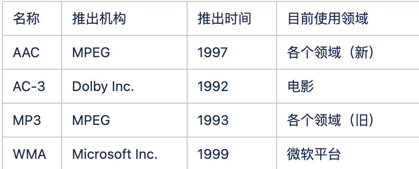
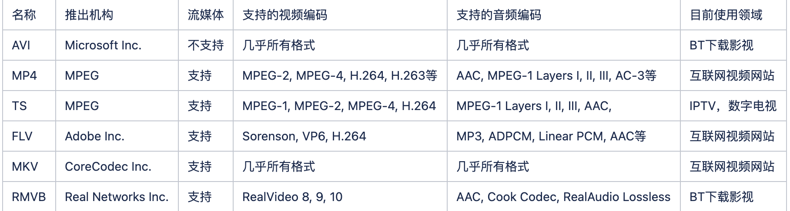
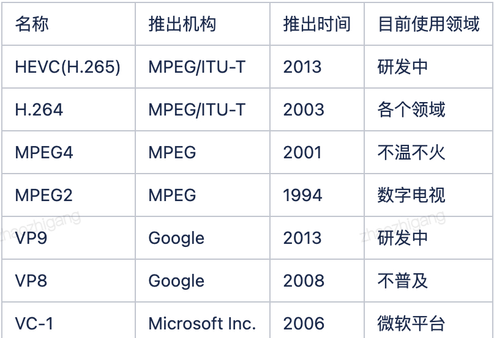
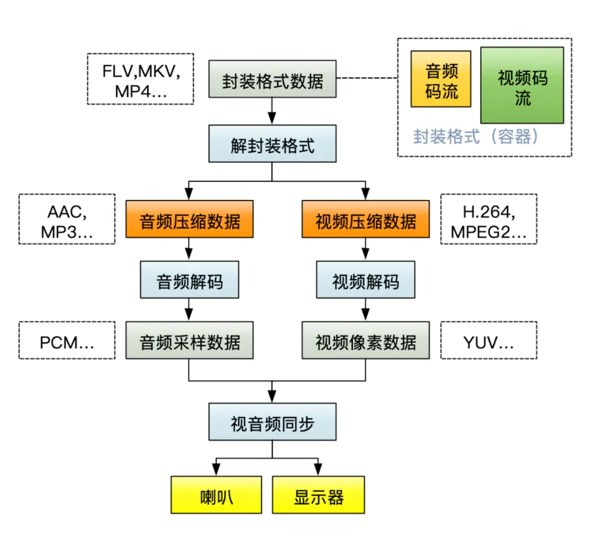

### 图形库
1. OpenGL：Open Graphics Library 开放图形库，是用于渲染2D、3D矢量图形的跨语言、跨平台的API，大部分API使用硬件加速而设计。本身并不是一个API，是由Khronos组织制定并维护的规范，开发者通常是显卡生产商
   - 分类
     1. Desktop
     1. OpenGL ES：用于手机
   - 语言无关：若干可被调用的函数语言独立，有许多语言绑定
     1. JavaScript：WebGL，OpenGL ES 2.0在Web浏览器中的进行3D渲染的API，把他们两者结合在一起，可为Canvas提供硬件3D加速渲染
     1. C：WGL、GLX和CGL
     1. IOS、Android
   - 平台无关：专注于渲染，不提供输入、音频以及窗口相关的API
1. Vulkan：是OpenGL的下一代版本，由开发OpenGL的团队提出，相对于OpenGL可实现30%的效率提升。可以更详细的向显卡描述你的应用程序打算做什么，从而可以获得更好的性能和更小的驱动开销
1. DirectX
   - 分类
     1. Direct3D：微软制定的3D图形API，可绕过图形显示接口（GDI）直接进行硬件的底层操作，提高游戏的运行速度。基于微软的通用对象模式COM（Common Object Mode）。简称D3D
     1. Direct2D：2D图形API，增加硬件加速。Vista中GDI无法进行硬件加速
   - 版本：DirectX 12，刚刚迁移到win7
1. Angle：D3D API的映射，但其语法本身依旧基于OpenGL
1. Metal：Apple推出的游戏渲染平台Metal，是低层次的渲染接口
1. 编程语言
   - GLS：基于OpenGL的可编程语言，可实现对GPU的编程
   - HLSL：基于D3D的GPU编程技术
### 视觉库
1. OpenCV
   - 认识：开源的跨平台的计算机视觉库，基于BSD许可，实现了图像处理和计算机视觉方面的很多通用算法，由一系列C函数和少量C++类构成
     1. 轻量高效
     1. 提供了Python、Ruby、MATLAB、C#、Ch、Ruby、GO等的接口
     1. 应用于：人机互动、物体识别、图像分割、人脸识别、动作识别、运动跟踪、运动分析、机器视觉、结构分析、汽车驾驶
   - 组成
     1. 图片、视频加载
     1. 图形绘制
     1. 计算：算术、位转换
     1. 图像变换、滤波器
     1. 形态学
     1. 目标识别：轮廓查找，轮廓识别
     1. 特征点检测和匹配：图像搜索用的这个
     1. 图像分割和修复
     1. 识别图片文字
     1. 机器学习：结合，识别率更高
   - 函数
     1. cv2.imread()/inshow()/cvtColor()
     1. cv2.blur()/GaussianBlur()/medianBlur()：滤波器、算子
     1. cv2.erode()/dilate()/morphologyEx()：腐蚀、膨胀
     1. cv2.Sobel()/Canny()：边缘提取算子
     1. cv2.equalizeHist()：直方图均衡化
   - 应用
     1. 和图形学
     1. FFmpeg调用opencv进行过滤
   - wiki
     1. 1999年Intel建立
     1. 如今由Willow Garage提供支持
1. libui：简单易用的c语言gui库，支持window、mac、linux三大平台，使用其本地gui技术
1. libpng
1. libjpeg
1. libx264
1. libfaac
1. stb_image
1. openalpr：开源的车牌识别
1. 人工智能：使计算机模拟人的思维过程和行为：学习、推理、思考、规划、情感、记忆、自我、听说、行动
   - 人工智能->机器学习->深度学习：一层层包含，深度学习是主流技术
1. 计算机视觉
   - 图像分类
   - 图像检索
   - 图像分割
   - 图像生成
   - 目标检测
   - 目标跟踪
   - 超分辨率重构
   - 关键点定位
   - 图像降噪
   - 图像加密
   - 多模态
   - 3D视觉
1. 特征工程
   - 认识：把原始数据变成特征的过程，这些特征可以很好的描述数据
   - 组成
     1. 特征提取
     1. 特征选择：对噪声过滤
     1. 建模、处理
   - 处理流程
     1. 分类
     1. 检测
     1. 分割
     1. 匹配
     1. 跟踪
1. 图像处理概念
   - 亮度、对比度、饱和度：亮度/对比度可从RGB进行增强，饱和度可从HSV/HSI/HSL进行增强
     1. 亮度：图像的明亮程度，在单色图像中，最高的值是白色，最低的是黑色，处理是数据的加减
     1. 对比度：图像暗和亮的落差值，最大/最小灰度级的差值，处理是数据的乘以值v，加大/减少区别，v大于1变大，v小于1变小
     1. 饱和度：颜色种类的多少，看起来更鲜艳
   - 平滑和锐化
     1. 平滑
        - 认识：用于突出图像的宽大区域、低频部分、主干部分，或者抑制图像噪声、干扰高频成分的图像处理方法
          1. 使图像亮度平缓渐变、减小突变梯度、改善图像质量，会使图像模糊，因为邻域的界限变模糊了
        - 方法
          1. 归一化块滤波器
          1. 高斯滤波器
          1. 中值滤波器
          1. 双边滤波器
     1. 锐化
        - 认识：和平滑相反，通过增强高频分量来减少图像中的模糊，增强图像细节边缘、轮廓，增强灰度反差，便于后期对目标的识别和处理，会增加图像的噪声
        - 方法
          1. 微分法
          1. 高通滤波法：低通滤波
   - 图像边缘提取
     1. 认识：完成对图像纹理信息的抓取，通过微分的方式计算图像边缘，色差、灰度值相差大的都是边缘，邻域作差即可
     1. 算子：roberts、prewitt等
   - 直方图均衡化
     1. 认识：将原图通过某种变换得到灰度直方图为均匀分布的新图像，即对像素个数多的灰度级展宽，少的缩减，拉大了对比度，可以清晰图像
   - 图像滤波
     1. 认识：更新、增强图像，是邻域操作算子，利用给定像素周围的像素的值决定此的输出值。可以强调一些特征、去除不需要的等
     1. 分类：均值、中值、高斯、双边扥
   - 形态学运算
     1. 腐蚀、膨胀
        - 腐蚀：把图片变瘦，小区域内取局部最小值
        - 膨胀：把图片变胖，小区域内取局部最大值
     1. 开运算、闭运算
        - 开运算：先腐蚀后膨胀，可分离物体、清除小区域
        - 闭运算：先膨胀后腐蚀，消除闭合里的小黑洞
     1. 形态学梯度：膨胀图减去腐蚀图，得到轮廓图
     1. 顶帽、黑帽
        - 顶帽：原减开运算
        - 黑帽：闭运算减原图
   - 术语
     1. 高低频：低频就是连续的色块
     1. 灰度级：就是某一个灰度值
### ffmpeg
1. 认识：音视频编辑、播放器、音视频编解码，99%软件底层都用ffmpeg
   - 通过ffmpeg的api，我们不用关心各种音视频文件结构怎么写，就能正确写出音视频文件
1. 组成
   - ffmpeg
     1. -i：前视频后音频冒号分隔，如`-i :0`
     1. -f
   - ffprobe
   - ffplay
1. 使用
   - 提取音频：`ffmpeg -i source.mp4 -vn -c:a copy out.aac`
   - 提取视频：`ffmpeg -i source.mp4 -an -c:v copy out.mp4`
   - 合并文件：`ffmpeg -i source.mp4 -i source.aac out.mp4`
   - 格式转换：`ffmpeg -i source.mp4 out.flv`
   - 音频采集：`ffmpeg -f avfoundation -i :0 out.wav`
   - 录屏：gdigrab
### 音频
1. 格式
   - 原始格式
     1. pcm：原始的、数字的采集过来的数据，跟文件格式没有关系
        - 数据流
          1. 采集：pcm——编码器——套马甲(封装为mp4)
          1. 播放：马甲——解码器——pcm
     1. wav：可以存储压缩数据或原始数据，在pcm之上套个头
        - RIFF字符串：包含chunkSize大小等，就是表明这是wav，微软和ibm定义
        - fmt：fmt开头，码率相关描述
        - data：data开头，数据部分，
   - 码率：采样率*采样大小*声道数，如44.1kHz * 16bit * 2 = 1411.2Kb/s，1.4MB/s很大了，需要压缩
1. 编码方式
   - 分类：
1. 常见的音频编码方式有AAC，MP3，WMA，FLAC等
1. 编解码器
   - opus：新的现在流行，延迟小、压缩率高，延迟在20ms，webRTC默认的
   - aac：应用最广泛，延迟比较高在200ms，不适合实时通信，
   - mp3
   - speex：包括回音消除
   - ogg：收费
   - ilbc
   - amr
   - g711：固话用，丢数据多
1. aac
   - 目的取代mp3，sony、杜比实验室等共同开发，基于mpeg-4，加入了sbr、ps技术
   - 格式
     1. ADIF：可以确定找到音频数据的开始，只能从头开始解码，常用于磁盘文件
     1. ADTS：每一帧都有同步字，可以在任意位置解码，类似于数据流格式
   - 规格
     1. lc：low complexity，低复杂度，128k码流(采样率)，
     1. he v1：lc + sbr，按频谱保存，低频编码保存主要成分，高频单独放大保存音质，64k
     1. he v2：v1 + ps，只存储一个声道全部信息，然后花很少字节保存不一样的地方，最常用
1. wiki
   - 声音
     1. 认识：震动产生、固液气传播、耳膜震动
     1. 三要素
        - 音调：音频的快慢
        - 音量：震动幅度
        - 音色：谐波，就是小震动
     1. 人耳听觉范围：20Hz~20kHz
   - 模数转换
     1. 数字采样：即量化
        - 采样大小：bitsPerSample，一个采样的存储比特数，通常16bit
        - 采样率：sampleRate，采样频率，8k(打电话，能听出来人特质)、16k、32k、44.1k、48k(基本完全还原)
        - 声道：channel，单声道、双声道、多声道、立体声(>1)
     1. 转为二进制：二进制方波
   - 音频重采样：将音频三元组的值转成另外的值，api有：swr_alloc_set_opts、swr_init、swr_convert、swr_free
     1. 从设备采集的音频数据和编码器要求的不一样：如对PCM数据进行重采样以达到AAC编码的要求
     1. 扬声器要求的和播放的不一致
     1. 更方便计算，如回声消除
   - 音频压缩：失真程度和最大压缩
     1. 有损压缩：去除冗余信息，包含人听觉范围外和被掩蔽的信号
        - 频域遮蔽效应
        - 时域遮蔽效应
     1. 无损编码
        - 熵编码
          1. 哈夫曼编码：用小的二进制数代替长字符串，哈夫曼树搭配对应表，实现压缩
          1. 算术编码：二进制小数
          1. 香农编码
   - 音频编码过程
     1. 时域转频域、心理声学模型(人听觉范围)：剩下有用的数据
     1. 量化编码
     1. 比特流格式化：形成可传输的数据
   - 3A处理：回音消除、降噪、自动增益
   - 丢包、抖动
### 视频
1. 视频
   - 视频帧：一组图像组成
     1. 编码帧
        - I帧即Intra-coded picture（帧内编码图像帧），不参考其他图像帧，只利用本帧的信息进行编码
        - P帧即Predictive-codedPicture（预测编码图像帧），利用之前的I帧或P帧，采用运动预测的方式进行帧间预测编码
        - B帧即Bidirectionallypredicted picture（双向预测编码图像帧)，提供最高的压缩比，它既需要之前的图像帧(I帧或P帧)，也需要后来的图像帧(P帧)，采用运动预测的方式进行帧间双向预测编码
     1. GOP：group of pictures，两个I帧之间的间隔，如GOP为120，如果是720p60的话，那就是2s一次I帧
   - 屏幕
     1. PPI：pixels per inch，每英寸的像素数量，>300是视网膜级别。1inch=2.54cm
     1. DPI：dots per inch，每英寸的点数
   - RGB码流：kb/s，宽 * 高 * 3byte(rgb) * 帧率，如720p的25帧视频每秒500多M
   - 关系
     1. 帧：就是图像，图片是RGB格式的，视频帧通常是YUV
     1. 帧率：fps Frames Per Second，平滑程度/跳动感，每秒采集、播放的图像个数，动画帧数为25，常见15、30、60，视觉暂留人眼最低24fps
     1. 分辨率：图像大小/清晰程度，x轴像素个数 * y轴像素个数，常见有360p、720p、1k、2k，常见宽高比16:9、4:3
     1. 码率：BPS Bits Per Second，
     1. 图像
        - 像素：Pixel，缩写px，一个点，是图像显示的基本单位。每三个红绿蓝二极管组成一个像素，由Picture(图像)和Element（元素）组成
        - 颜色
        - 图像处理：拉伸/留白、缩小/截断
1. 封装格式
   - 认识：打包音频和视频
   - 分类：
1. 编码方式
   - 认识：将音视频数据压缩成视频码流，从而降低数据量。常见的视频编码方式有H.265，H264，MPEG4，VP9等
   - 分类：
1. 组成
   - 流
   - 轨
1. 编解码器：可以压缩
   - h264
     1. 格式：yuv420p
   - h265
   - vpx：vp8、vp9
1. 流媒体服务器
   - nginx
   - srs
   - cdn
   - rtmp
1. RTSP：Real-Time Stream Protocol，基于文本的多媒体播放控制协议，流媒体协议，是共有协议并有专门机构做维护，一般传输TS、MP4格式的流，其传输一般需要2~3个通道，命令和数据通道分离，应用层
   - 客户->服务：
     1. RTP数据分组(UDP)
     1. RTCP分组(UDP)
   - 服务->客户
     1. RTSP分组(TCP)
1. 传输协议
   - RTMP：流媒体协议，是Adobe私有协议未完全公开，一般传输flv、f4v，一般在TCP1个通道上传输命令和数据
   - rtsp
   - rtp
   - rtcp
1. wiki
   - 直播架构：采集 → 处理 → 编码 → 传输 → 分发 → 拉取→ 解码 → 渲染
     1. 推流工具：推到流媒体服务器，如obs、ffplay
        - 采集、编码(有损、无损)
        - 传输
        - 解码、渲染
     1. 流媒体服务器，如rtmp://
     1. 拉流工具：vlc等支持网络流的
   - 硬件加速：指用gpu运算，释放cpu，对音视频做指令集优化，速度快
   - 颜色空间：即彩色模型，用于描述色彩。RGB、CMYK(纺织领域)、YUV(摄像头)、Lab、HSL、HSV/HSB
     1. RGB：基色分量，也叫三通道，对红绿蓝三个颜色通道的变化和互相叠加来得到颜色
        - RGB：24位色，三者组合256的3次方可以表示1600万色
        - RGBA：32位，加了透明度，即位深
     1. HSV
        - 色相：Hue，物体传导、反射的波长，常见以颜色来衡量，0~360
        - 饱和度：Saturation，即色度，色彩的强度/纯度，0%~100% 
        - 明度：Value，颜色明亮的程度，0%(黑)~100%(白)
     1. BGR：bmp使用，需要和RGB进行转换
     1. YUV：YCbCr，y明亮度，uv描述影像色彩和饱和度，采样格式有：4:2:0、4:2:2、4:4:4。RGB用于图像显示，YUV用于采集和编码，可以互转
     1. 灰度图：通常由uint8、uint16、单精度、双精度类型的数组描述，m*n的矩阵中每个元素和像素点对应。0代表黑色，1/255/65535代表白色，通道是1
        - 对颜色不敏感：如处理纹理信息
   - 播放原理：
   - 场景：点播(vod)、直播(live)、实时通信(rtc)
   - 开源代码
ffmpeg、ffplay、ffprobe 
     1. nginx-rtmp
     1. librtmp
     1. srs
     
     1. opencv
     1. directshow
### webRTC
1. 认识：音视频实时通信，3A处理，网络传输策略，由谷歌推广的开源实时音视频技术栈，是W3C标准，还有对应的IETF工作组(RTCWEB)
   - 主流浏览器都支持，省去客户端工作，回声消除，双讲抑制
   - 媒体服务器：客户端只和服务器建立媒体传输通道
     1. SFU：Selected Forward Unit，并发转发多路信号，带宽占用高，灵活分发
        - 媒体流：RTP数据包
        - 媒体控制流：RTCP包，包含NACK, PLI, REMB, Receiver Report
     1. MCU：Multipoint Control Unit，转码/混流后传输，带宽占用少，对服务器性能要求高，实时性稍差
     1. 开源媒体服务器：janus、licode、mediasoup
   - RTC：实时音视频通信
   - 底层也用ffmpeg
1. 高级
   - 流程：采集、处理、传输，传输难以把控，时延、抖动、丢包
   - Qos：Quality of Service，服务质量
     1. ARQ：自动重传请求，是数据链路层的错误纠正协议之一，使用NACK机制
     1. FEC：前向纠错，是增加数据通讯可靠度的方法
     1. Jitter Buffer：抖动缓冲，通过在接收端维护一个数据缓冲区，可以对抗一定程度的网络抖动
     1. Congestion Control：拥塞控制， WebRTC利用GCC算法来控制传输
   - Qoe：Quality of Experience，质量体验
1. p2p：peer to peer，点对点技术，P2P网络中的所有计算机上记载着除该台计算机外所有计算机的信息
   - 创世节点
   - 节点通信建立，NAT穿透：Network Address Translation，网络地址转换，网络地址翻译技术，将内部的私有IP转换成公网IP，一个解决地址不够，二是安全(不在转换列表的全都拒绝)
1. irc：古老简单的网络聊天协议，linux的server：ircd-hybrid，客户端：irssi/weechat，小圈子，因为古老而有门槛和纯粹