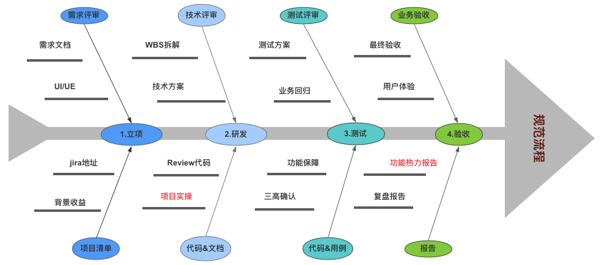

### 思想
1. 持之以恒
1. 一定要有思路


1. 做事方面
    保业务
    调研新技术
    沉淀输出成果
1. 结果和效率为导向：
    正直
    智慧
    成熟

1. 实施方案
	有活力
	胆子大
	执行力：先出一个demo
	onwer意识，是主人
	有韧劲


1. 各个业务都要熟悉
2. 如何把握技术发展，如何能够使用更好技术和能力
3. 补充技术文档，不要迟到


1. 当系统遇到无法解决的技术难题时，可以通过变换业务逻辑实现功能


代码能力要再度提高
做事情要更加积极，能够提前完成就提前完成
多业务把控能力要提高


“直线思维”：会默许认为所有事物都是直线发展，比如事物会越来越好或者越来越糟，而实际情况事物发展都会有不同的曲线变化要多曲线思考，比如会有S曲线、正态分布，驼峰曲线，滑梯曲线，倍增曲线等等，拜托“直线思维”，动态实事求是看到变化
“情急生乱”：在异常着急情况下，很容易做出情绪化不冷静的错误决策导致更严重或不良后果，更多需要控制自己的情绪（冷静深呼吸），警惕着急过激的行为，坚持以数据事实为基础，客观全面的做出判断和决策。


1. 第一性原理
   - 组成：三者之间是和/或的关系，不一定必须同时存在
     1. 公理
     1. 公设
     1. 假设
   - 认识：真正理性化思想系统，一般都会运行在一条或有限条基本原理上。第一性原理是自变量，其它是因变量。爱因斯坦说：理论家的工作可分成两步，首先是发现公理，其次是从公理出发推出结论。所以，建立一个体系，要从第一性原理开始；而学习一个体系，更要从第一性原理开始，才能理论指导实践！建立一个体系，要从第一性原理开始；而学习一个体系，更要从第一性原理开始，才能理论指导实践！
     1. 思维方法：演绎推理
     1. 思想或学科体系：第一性原理 + 演绎推理 = 体系
   - 学习和工作没有捷径可走。理解并且掌握第一性原理，知其然，知其所以然，才能达到事半功倍的效果。
     1. 对于学生，要想学好平面几何，一种是大量刷题；另一种是依据第一性原理，在理解定义的前提下，弄懂题目逻辑，以公理和公设为基础，用演绎思维理解和学习知识体系，再应用到实际解题。哪一种更好？
     1. 任何事物背后必有道理。回归基本原理，从根本开始思考，知其然，知其所以然，才是正确高效的思维之道！


1. 自驱力：对系统本身有较高追求,本身带有很强自驱力,会充分考虑架构可成长性,即使没有业务驱动也会持续去迭代代码直到自己满意,从来不会从单一业务形态去思考问题,会多场景多维度思考问题,以便应对未来复杂业务变化


1. 规划
	1. 你要热爱技术，使劲往深了挖，你要记得作业帮那个面试官惊讶你的3年经验时的知识深度，你的路还长，你要做出更大的成绩
	1. 继续深入理解各个技术，应该有一个更大的视野和更深的理解能力去做，实现更深入、更快速的跨越
	1. 还是那几大块，但是别人都掌握多门语言，自身实力还是弱，需要加强
	1. 博客太浅不系统，用看书来整体推进
1. 方法
‌	1. 自己探索性学习，积极思索改变，有什么想法就加紧实现
‌	1. 别让我遇到不会的，即使会的我也会刨根问底
	1. 大胆的玩儿
		1. 要有超越他人的心，让自己玩的优秀
		2. 大胆的装软件、尝试，让自己走向更高处
		3. 大胆的想，要不断诞生新想法，并且抓紧实践
	1. 把一个项目所有发出来的文件都保存一份，不必删除
	1. 及时将工作想法记录下来
	1. 遇到陌生项目，要将所有功能整理成书，并且记录概念点，形成知识体系
	1. 一个方法只完成一个逻辑
	1. 技术只有对错，不要怕得罪人，要打出去，对低效0容忍
1. 工作注意
    1. 工作内容：编写代码、编写接口文档和wiki
    1. 旧框架代码提交时：在wiki上记录修改的文件名，新增的方法名要在web端配置，记录修改的配置值并在web平台修改，如果修改api层需要打tag
    2. 项目开发完成后，要以认真虚心的态度好好自测下项目

1. 实践
    1. 知识获取
	1. 通过百度搜索泛泛了解
	2. 通过谷歌搜索更多了解
	3. 通过慕课网搜索掌握最基础知识
	4. 通过程序员专题网站搜索


1. 学习语言重点应该是概念和思想、原理，而不是实现细节
1. 实现原理都是相通的，对于不同的语言、框架、实现，利用原理寻找掌握的方法
1. 构建自己的知识树，学习新知识先找知识树上空缺
1. 笔记不是手册，笔记只记录你会用到的，记录一条线，关于技术理解应该只是只言片语提一下。不懂的不写，相当于精练知识点

1. 一个通用系统意味着更广泛的适用性，能够适应更多的场景。但通用的另一种解释是平庸，因为它无法在所有场景内都做到极致


1. 实践和理论结合，一边官网看概念知识点，一边动手自己玩。一边记录知识点，一边记录代码gist，应该是同等的
1. 事情是分阶段进行的，一开始不可能掌握的特别深，要一层一层的往下捋，先掌握浅层，然后顺着劲儿不能断，继续往下挖
1. 笔记不能做的详细了，笔记应该只是提纲，需要什么再去详细了解，只做重点记录。笔记应该快速让你掌握知识同时又不会忘得很快，给以后留个引子、提纲、梳理
1. 学习的形式可以有多种多样，不要被在培训班的思维所禁锢，放开思维去掌握知识，技能
1. 了解，怎么使用出活儿，原理是什么，在自己脑子里形成印象。好多东西都是有史以来固定的
1. 知识点开始要看官网，实际项目要找到官方配置，根据官方配置写项目配置
1. 利用百度的直接特性，遇到不懂的立即查询，通过直接的答案可以立即获得答案。与之对应的就是百度不能提供有深度的，优质的，全面的内容，需要经验寻找和判断
1. 深入的了解知识
   - 先认识，然后写下简要的知识提纲：就是你通过一篇文章，看完了理解了后，再通篇扫描一下，把你觉得重要的点和组成记下来，简要描述事务
   - 整理知识体系，看看这个知识点都包含哪些知识，弄体系图
   - 看书，扩大接触的知识量，多接触没有认识到的，要形成更加全面整体的认识
   - 实践
1. 我不懂的地方是用三个连续全角问号表示：？？？


多看方法源码，多思考，把握原理
事情先理解原理会更加从容，对于框架的使用也是一样


1. 主动关注一大堆的知识是没有用的，你没有那么多的精力去学习，反而因为信息量太大太多太杂而消耗你很多精力，浪费你很多时间，导致你只是泛泛的了解，这样心情很乱，精力也容易耗散，最主要的是你相同的时间精力没有获得足够含金量的知识，尤其一些综合性的编程网站和社区，千万不要关注专栏，专栏里都是你目前用不到的知识，而且是泛泛的，只关注大牛，并且对他们做分类，记住目的是把他们作为线索，一绳子把你需要的精华知识找到，并投入精力学习
1. 专研：自己去专研，更多的研究。多问搜索引擎，多看 paper，多把自己学的东西和遇到的问题结合起来，学会融会贯通。
1. 遇到阻力时，需要的是一个自己的学习方法
1. 时间管理：就是一件事情搞定后去做下一件事情，都做好，就可以了
1. 工作上要发散自己的思维，自己去解决好事情，不能只停留在增删改查的表面，要多维度将工作做好、做出花儿来
1. 经常看看别人是怎么玩的，要给自己留下足够学习的时间，来提高自己，提高工作效率和技能
1. 学习新的事情：把旧的一套和新的用标准去衡量，去测试，从而获取进步和认识，如传统的和异步io的

1. 勇于表达自己的观点，不要害怕别人的反对。别人反对你，没关系，如果耐心的去听每个人的理由，其实都会有一定道理
1. 纠错前先思考，如果你一头扎进问题中，你可能只解决了当前出现问题，通常发现和纠正一个更高层次的问题，进而改进了系统设计，防止了更多bug的出现


### 时间管理
1. 认识
   - 时间体检：计算你的时间价值
     1. 将时间看成金钱，像理财一样管理时间
     1. 自检时间的价值，学会计算单位时间价格
   - 目标管理：把时间花在最重要的地方
     1. 能够正确的分配时间
   - 日程管理：实现工作与生活的平衡
     1. 管理日程，规定什么时候做什么事
   - 效率管理：提高单位时间内的产出
### php
1. php的协程使用、任务调度，真正酷的事情是你觉得怎么样，和你能用这个解决什么东西，而不是别人说多么多么好
1. php的扩展开发，扩展用在什么地方，整套开发流程是怎样的
### php技术栈
1. linux操作系统
   - 基本命令、搭建、配置、优化
   - 各项监控指标
   - shell脚本、awk
   - 内核、内存管理、进程管理、文件管理、网络、磁盘存储
1. 开发语言
   - 语法、特性
   - 框架
   - 工具
   - 内核、执行流程
   - 其他语言
1. web服务器
   - nginx配置、优化
   - nginx常见应用场景、各模块的使用
   - 内部实现
1. 缓存
   - Varnish配置和规则配置&应用场景
   - redis基本操作及优化方案&应用场景
   - redis数据异常处理方案（雪崩，穿透，击穿，数据不一致）
   - redis工作原理，数据结构，内存管理，淘汰策略（LRU等），中间件（Twemproxy，Codis）及集群方案
1. 数据库
   - MySQL的基本操作及优化方案
   - MySQL各模块的原理（内存管理，持久化方案，主从复制，引擎，索引结构）
   - MySQL的中间件及集群方案
   - 了解其它开源软件。（MongoDB，Hbase，ES）
1. 版本控制
   - GIT命令
   - GIT的开发流程&代码发布流程
1. 网络协议
   - 网络四层通信原理
   - HTTP，HTTPS协议，请求头，响应头，状态码等
   - TCP/IP的三次握手&四次挥手，及相关的11种状态
   - 了解Socket的原理
1. 安全
   - 常见的WEB攻击技术&原理&防御方案。（XSS，CSRF，SQL注入，DNS劫持，会话劫持）
1. 异步中间件
   - 概念，操作，应用场景
   - 架构，内部工作原理，高可用方案
   - 了解其他消息中间件（kafka等）
1. 性能&稳定
   - 合理的技术方案
   - 高性能、高稳定、安全、健壮性代码，如异常捕获、日志记录、参数验证，缓存&数据库任意挂掉服务不停
   - 快速排查&解决线上问题
1. 架构
   - 各种负载算法，常见软件的集群，高可用，容灾方案。（LVS，HAproxy，Keepalived，F5等）
   - 分布式系统设计的相关原则&原理。（CAP，BASE，2PC，3PC，Raft，锁）
   - 微服务的共享配置，网关，限流，超时熔断，重试，服务拆分，发现，治理，容灾，降级，弹性缩，扩容，监控（一致性，幂等性）
   - 常见的架构思维（抽象，分层，分治，演化）
1. 项目管理
   - 五大过程组：启动，规划，执行，监督&控制，收尾
   - 十大知识领域：整合管理，范围管理，时间管理，成本管理，质量管理，人力资源管理，沟通管理，风险管理，采购管理，干系人管理
1. 基础技能
       数据结构，算法，操作系统，网络，IO，计算机内部组成，技术选型，流程意识，规范，文档编写，专业名词概念
    （线性：栈，队列，链表，非线性：树，图。算法：排序，检索等） 软技能：有效沟通


1. 理论
务实，成就客户让客户占便宜，倒逼自己
明白人性，知道自己会变得很贪婪，通过机制成面降低自己的贪婪
不同的行业不同的方法，根据事情的特点去做事情，服务行业先做强再做大，质量一定的先做大，后做强
问题抛出来了，也就有了解决的办法，要纠出原理，要分析
众生畏果菩萨畏因
不断思考，不断发展，不能停下脚步，
不要怕犯错误
建设教研，组织化建设，为了分工合作，发挥更大的力量，团队发展的问题
工作看心态，逻辑都很简单
将自己做到务实，正确，极致，你就赢了
空杯心态，积极学习
工作避免重复性的工作，要坐有创造性，体验性的工作，要有目标和成就感
不怕做不到，只怕看不到
不怕看不到，只怕看不懂(多一点空杯心态，就能看懂)
拥抱失败的人才能拥抱成功
投资未来的人才能拥有未来


1. 学习
	本周和各个研发中心负责人强调部门文化建设，团队在快速增长过程中如果还依赖于leader的个人魅力，这个团队是不健康的。首先leader无法保证能够辐射到每一位人，其次leader无法听到团队的真是声音。Leader很容易被假象迷惑而做出错误决定，这会让我们团队成员感觉失去公平且优秀人才无法脱颖而出，最终导致优秀人才流程团队整体效率降低。文化是团队选人、用人、育人、留人非常重要的准则，围绕文化建设让整个团队步伐一致非常重要的手段，各个负责人未来文化建设要放在重要位置，文化将是考核大家的核心指标。大家在述职都要围绕三高+可持续来讲。
这里在同步一下研发系统的核心使命：持续给用户提供高质量、高稳定、高体验的产品和服务
	技术晋级：围绕三高+可持续+代码讲解
1. 项目管理：
### 技能
1. 记笔记
   - 基础写功能，架构写方案，设计写各种情况下的处理方式
1. 对工具的态度：工具就是用就是会了，不用不会，用到哪儿学到哪儿
### 进步
1. 三个方面
   - 技术能力：解决一个明确问题的工程化能力，埋头干活的能力
   - 技术视野：知道当前的最好的解决方案是什么，业界的最佳实践，抬头看天的能力
   - 技术认知：能提出问题，知道什么问题对业务最重要，对需求有深入洞察能力，对业务和技术有深刻理解
1. 范儿
   - 追求极致
     1. 提高要求，延迟满足感
     1. 在更大范围里找最优解，不放过问题，思考本质
     1. 持续学习和成长
   - 务实敢为
     1. 直接体验，深入事实
     1. 不自嗨，注重效果，能突破有担当，打破定式
     1. 尝试多种可能，快速迭代
   - 开放谦逊
     1. 乐于助人和求助，合作成大事
     1. 格局大，上个台阶想问题
   - 坦诚清晰
   - 始终创业
     1. 自驱，不设边界，不怕麻烦
     1. 有韧性，直面现实并改变它
     1. 拥抱变化，对不确定性保持乐观
   - 从思想看代码，不要从代码看思想
   - 精神
     1. 不再局限于特定的技术体系、思想体系，凭借直觉，能够抓住问题本质，在众多纷扰中做出正确选择
     1. 合理的设计、经验来自于不断的技术实践和总结，来自于长年累月对技术的积累和理解
1. 技术学习方法：直接撸文档吧，他们说的都不准
   - 官方文档看一看
   - 编程实例练一练
   - 源码看一看
### 如何快速、深入学习新技术
1. 阶段：认知，技能，实战
1. 先宏观认识，从头看到尾，知道大概的样子
1. 了解技术的套路是什么，就是整个项目结构都有什么，肯定是有重复性的代码，有规律可循
1. 自己搭建一个最基本的hello world，然后不断往上加功能，自己做自己的主考官，出需求
1. 分清理论型还是实践型的技术，理论型的要拆解目标，逐个击破，实践型的要要对实践有了清晰的基础理论，实践的过程就是揭晓谜底的过程
1. 区分概念的用于和可以，”可以“从需要理解某件事情出发。”用于“是来理解某个东西本身
1. 学无止境吗？
   - 抓住核心要害、基础理论，因为人类知识体系一直在扩张，但基础理论并不高深
   - 技术学习是一场对抗赛，超越大部分选手就是一种胜利
### 如何解释一件事情
1. 事情发生的过程
1. 如何发现的这个过程
1. 事情为什么会发生
1. 对于原因的确认验证和测试
1. 如何修复这个问题
1. 反思和总结
### book
1. 携程架构实践
   - 组成
     1. 移动大前端：pc、h5、hybird、小程序
     1. 用户接入
   - React Native：携程安装包所用技术
     1. 热更新：绕过ios限制
     1. 不同业务不同rn框架，切换使用预加载
     1. 差分包对比，减少差分包大小
     1. 配套系统
        - 性能报表：首屏加载时长、分布
        - 错误报表：js异常、native runtime异常
   - CWX：针对微信小程序的，为业务提供基础微服务的业务体系框架
     1. cli
     1. 运行时框架：封装不同小程序的语法差异为统一入口
     1. 发布自动化：selenium
   - CRN-web：按需打包(tree shaking)、按需加载(热加载)、懒加载、多级缓存、pwa。AST解析、DSL转换
   - node：做数据聚合、部署工具、SSR
   - 用户接入
     1. GLSB、CDN、CND
     1. LB：硬件
     1. SLB：Server Load Balancing，软负载均衡，服务器负载均衡，基于nginx
     1. API Gateway：收口的统一网关，之前基于zuul，现在是netty，通过将filter编译层class实现动态更新，采用了私有tcp通信
   - 呼叫中心
     1. 
### work gist
1. 绩效管理
   - kpi：考核，度量工具，面向稳定业务
   - okr：管理，工作方法，关注目标和关键结果，面向变化，甚至不和绩效挂钩，就是工作方法
1. 门户
   - 新增关联用户的方法
    ```php
    public function addAdminLink() {

        $data = [
            'unique_user_id'    => 46919,
            'linked_user_id'    => 65034,
            'create_time'       => time(),
        ];

        $rs = Model_Mysql::factory()->addOrUpdate('jy_admins_link', $data);

        print_r($rs);die;
    }

    public function updateAdminLink() {

        $data = [
            'id'    => ,
            'unique_user_id'    => 46919,
            'linked_user_id'    => 65034,
            'create_time'       => time(),
        ];

        $rs = Model_Mysql::factory()->addOrUpdate('jy_admins_link', $data);

        print_r($rs);die;
    }
    ```
   - 修改用户信息
    ```php
    public function updateAdminInfo() {

        $data = [
            'id'    => ,
            'user_id'  => '',
        ];

        $rs = Model_Mysql::factory()->addOrUpdate('jy_admins', $data);

        print_r($rs);die;
    }
    ```
1. 课件
   - 根据课件id查询课件数据
    ```sql
    SELECT c.id,p.id as pageid,res.resource_id,res.path
    FROM xes_coursewares c,xes_courseware_relation_package r,xes_package_relation_page rp,xes_pages p,xes_page_resource res
    WHERE c.id = r.courseware_id
    AND r.package_id = rp.package_id
    AND rp.page_id = p.id
    AND res.page_id = p.id
    AND c.`id` = 1009482
    ```
   - 统计课件数量
    ```sql
    SELECT count(p.id)
    FROM xes_coursewares c,xes_courseware_relation_package r,xes_package_relation_page rp,xes_pages p
    WHERE c.id = r.courseware_id
    AND r.package_id = rp.package_id
    AND rp.page_id = p.id
    AND c.school_id = 1 AND c.is_freeze = 1 AND c.source_from = 2 AND (c.status = 5 OR c.status=10)
    AND r.status = 1 AND rp.status = 1
    ```
   - 查询课件api
    ```shell
    curl --location --request POST 'http://coursewareapi.xesv5.com/CourseWare/Courseware/getCoursewareInfo' \
    --header 'X-Auth-Appid: 1001060' \
    --header 'X-Auth-TimeStamp: 1593400201' \
    --header 'X-Auth-Sign: c611bca0e5c1f9da905a7f9730dec037' \
    --header 'Content-Type: application/x-www-form-urlencoded' \
    --data-urlencode 'coursewareId=50527' \
    --data-urlencode 'type=1'
    ```
   - 文档地址
     1. 总的：https://wiki.zhiyinlou.com/pages/viewpage.action?pageId=30852539
     1. 文件夹：https://wiki.zhiyinlou.com/pages/viewpage.action?pageId=38822201
     1. 异步定稿：https://wiki.zhiyinlou.com/pages/viewpage.action?pageId=30852968
     1. 课件平台：https://wiki.zhiyinlou.com/pages/viewpage.action?pageId=90909004
     1. 对外
        - https://wiki.zhiyinlou.com/pages/viewpage.action?pageId=60813822
        - https://wiki.zhiyinlou.com/pages/viewpage.action?pageId=58724741
   - 优网海外
     1. 不需要验证码登录
     1. 服务器直连数据库：`mysql -hxuexi-test-01-xesdb.chmwbtopgut6.us-west-2.rds.amazonaws.com -uxes_courseware_rw -pKvPSMGkn5jgbpEa9df0NFENnXSgfiZT6+`
        ```php
        public function checkPwdWithoutVerification()
        {
            $this->setIfRes(empty($this->params['name']))->echoFormatError(10002, '账号不能为空');
            $this->setIfRes(empty($this->params['pwd']))->echoFormatError(10003, '密码不能为空');
            $this->setIfRes(empty($this->params['verification']))->echoFormatError(10004, '验证码不能为空');
            $this->setIfRes(empty($this->params['key']))->echoFormatError(10005, '缺少必要参数');

            // 向教师中心询问登录
            $params = [
                'header' => [
                    'schoolCode'    => '415',
                    'platform'      => 'thinkTeach',
                ],
                'data'  => [
                    'accountName'       => $this->params['name'],
                    'password'          => $this->params['pwd'],
                    'teachingType'      => 0,
                ]
            ];
            $rs = $this->loadComponent('CurlService')->login(100002, $params);
            $this->setIfRes(!isset($rs['code']) || $rs['code'] != 0)->echoFormatError(10704, '账号或密码错误');
            $userInfo = $rs['data'];

            //token
            $userInfo = $this->_writeUserInfo($userInfo);

            echo $this->formatData(100, ['stat' => '1', 'data' => $userInfo]);
        }
        ```
1. 数据库操作
1. 框架
   - slim执行任意sql
    ```php
    $model = $this->loadModel('Mysql\Courseware\Courseware');
    $sql = "UPDATE `xes_courseware_folder` SET `difficulty_id` = '3' WHERE `id` = '3';";
    $rs = $model->db->query($sql);
    print_r($rs);die;
    ```
### work wiki
1. 课件
   - 三个课件对外接口
     1. /CourseWare/Courseware/getClientCoursewareInfo
     1. /CourseWare/Package/getPackageByCourseware
     1. /CourseWare/Courseware/getKaTexPath
1. CDN
   - 域名整理：https://wiki.zhiyinlou.com/pages/viewpage.action?pageId=63621439
1. 故障常见原因
   - 连表
   - 没加索引
   - 关键数据没有做好缓存
   - 计算复杂度高、逻辑复杂放到了c端
   - 监控项缺失：无法先兆发现
   - 没有全方位压测：最后一道保障
     1. 全链路压测能力不足，不能只从内网压测，无法模拟外网全链路
   - 客户端疯狂重试，造成雪崩
