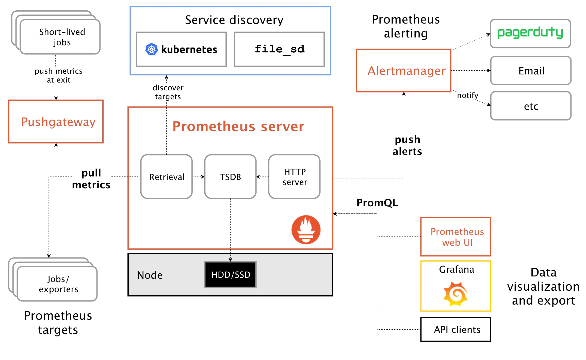
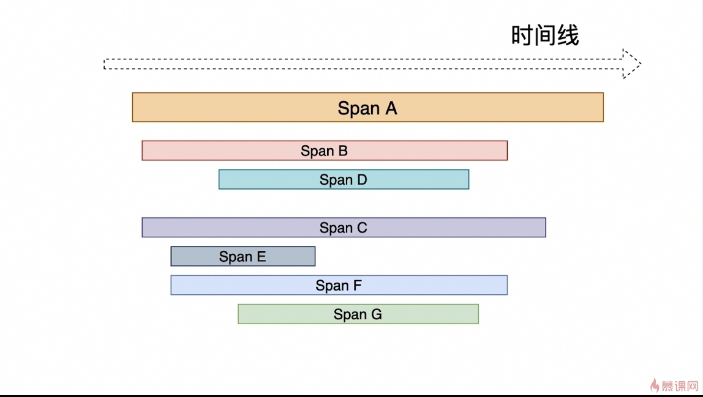
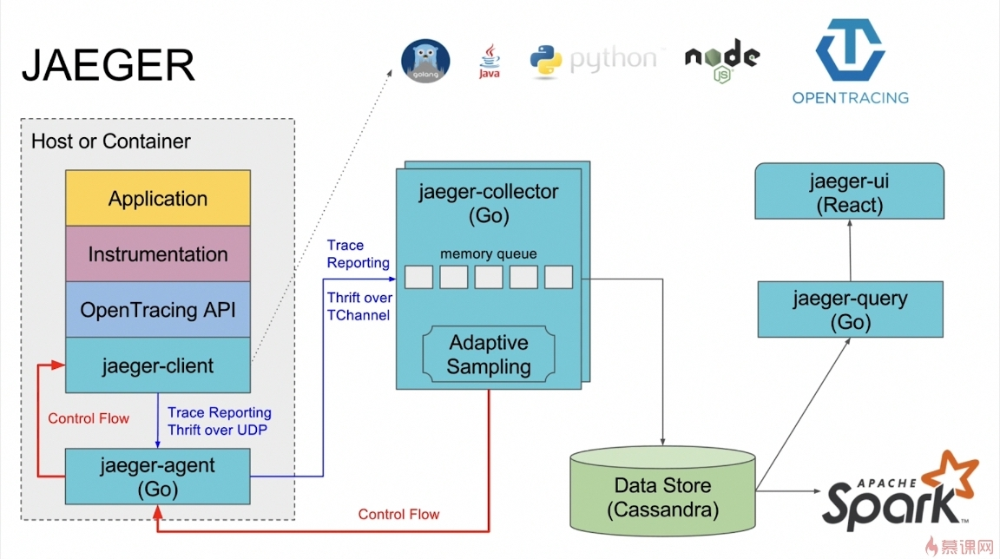
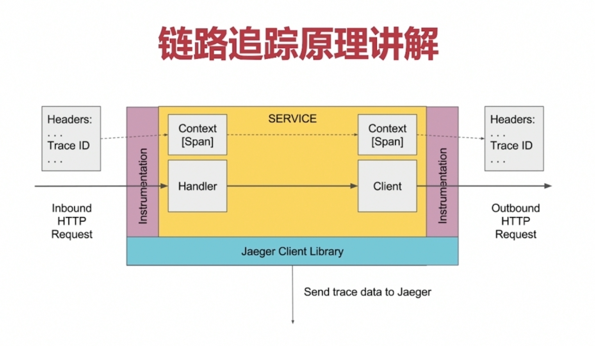
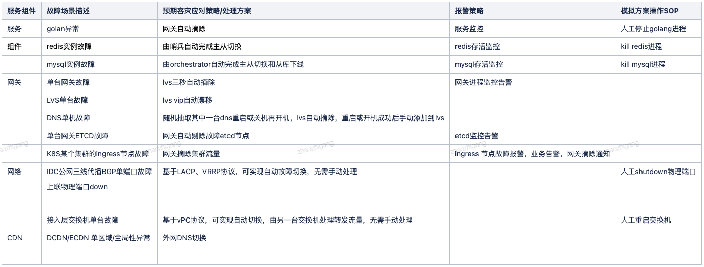
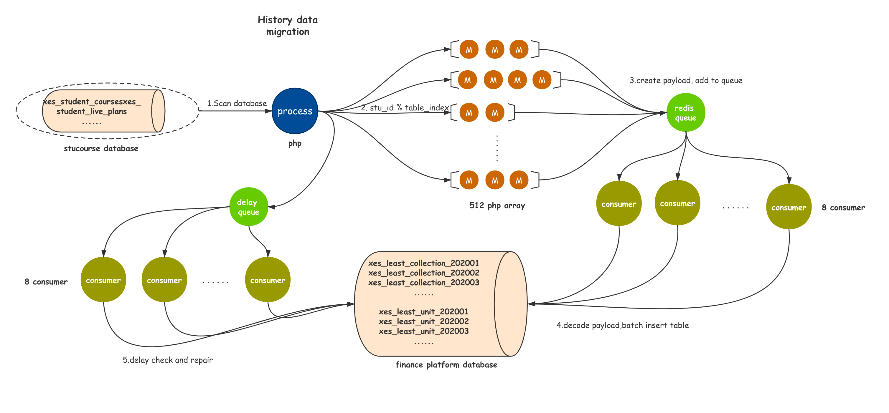

### 架构
1. 体量
   - eci 1万台以上
1. 现状
   - vpc
     1. vpc未打通比例55%，使用阿里云的云企业网打通vpc，全集团一张大网
     1. 集团内需要走专线，各个vpc又有nat、bgp
   - 北京的南北机房建设，京南，京北
1. 网校架构体系：lvs+keepalived -> openresty -> server
1. 请求
   - 海量请求————限流————削峰填谷————缓存————关系型数据库
   - 超级海量请求————非关系型数据库以及相关技术(PB级、日处理上亿，因为关系型的存储大量无效数据)
1. set化架构：即单元化架构，异地多活，有备的会浪费资源，类似微服务优先自身
   - 每个集群只负责本单元流量处理和存储，之后做双向数据同步，实现容灾切换需求
1. 混沌工程
   - 通过应用一些经验探索的原则，来学习观察弹性系统是如何反应的，主动发现问题
     1. 通过实践对系统有更新的认知
     1. 方法如模拟整个IDC当掉、选择一部分网络连连接注入特定时间的延迟、随机让一些函数抛出异常、榨干cpu
1. 多活
   - 实现方式：流量隔离、数据同步
   - 异地多活特点
     1. 本地强一致
     1. 异地最终一致
   - 网校多活实践
     1. 遇到的问题
	    - 系统性单点：BGP、网关、DCDN，是系统性的单点，虽然nginx是集群，但是是同一个slb，同时cdn也是单点
	 1. 实现方案
		- 网关
		  1. 分类：相互解耦
             - 大鱼网关控制平面
             - 大鱼网关数据平面
1. 保稳三剑客：熔断、限流、负载均衡
### 架构演进、自主探索路线
1. 面临的问题和技术手段：高并发、高可用、分布式
   1. 高并发：tomcat集群，负载均衡，请求转发机双机热备，双向同步；session集群服务器；
   1. 大负载/持久化：数据库集群(自己造数据，自己测试性能)、主从配置、读写分离；分布式文件系统
   1. 缓存：redis分布式缓存
   1. 队列：rabbitMQ原理并记录心得
   1. 搜索：Elasticssearch
1. 优化
   1. mysql优化
   1. nginx优化
   1. tomcat优化
   1. JVM调优
1. 挑战词儿：高并发、高可用、大负载
1. 解决词儿：弹性扩容、故障转移(双机热备)、负载均衡、主从配置
1. 服务发现、负载均衡、动态路由、容错限流、监控度量、安全日志
1. 两地三中心
1. 容灾、熔断、降级
1. 同步双写、超三副本数据冗余
### 服务治理
### 熔断
1. 认识：系统扛不住了，实现最大可用性，相当于拒绝服务
   - 一般原则是先降级后限流。限流是没有办法的办法，是最终的一个降级手段，让用户不能正常使用了
   - 第一步是先拒绝掉 80% 的请求，然后将整个系统全部重启，花费了近 5 分钟。等待系统恢复到满载服务的状态，又花了接近 10 分钟。20%，30%，40%，一点一点的把用户的请求放进来，确保系统的最大可服务能力输出
   - 漏斗：一开始做了很多推演和预测，最后的结论是我们真预测不了，所以还不如换一个思路，去想各种方法控制住最后进到系统里面抢红包、拆红包和分享红包的用户比例，所以我们用了一些柔性措施，将用户请求在客户端就开始做筛选，会在链路中用漏斗模型过滤请求，控制真正进入到红包系统底层的用户数量
   - 现场就是按照标准去操作，谁也别瞎来
   - 当需要阻止应用不断尝试调用远端服务或者访问共享资源，并且这些请求很容易失败的时候使用Circuit-Breaker模式很合适，即熔断，设置恢复与不可用的来回切换
1. 目标
   - 阻止故障的连锁反应
   - 快速失败、迅速恢复
   - 回退并优雅降级
1. 原则
   - 防止任何单独依赖耗尽资源
   - 过载立即切断并失败，防止排队
   - 提供尽可能的回退以保护用户免受故障
1. 熔断条件
   - 网络级别：最大的连接数
   - 服务级别：检测到上游连续出现异常，则请求不再发送到该实例
1. 实现
   - 通过上报记录失败次数，根据规则进行干预
### 负载均衡
1. 认识：
1. 功能类型
   - CLB：传统型的面向4层(TCP/UDP)，比7层的性能高
   - ALB：应用型的面向7层(HTTP/HTTPS/QUIC)
1. 实现类型
   - dns：可根据地域就近，配置简单成本低，修改生效不及时(由于多级缓存)
     1. 故障转移
     1. 地区解析
   - LB：硬件，性能高，算法灵活
   - SLB：Server Load Balancing，软负载均衡，服务器负载均衡，基于nginx
1. 均衡策略
   - 随机
   - 轮询、加权轮询：能力高的后端服务权重更高
   - 负载度、最少连接：记录正在处理的连接数
   - 响应时长
   - 源地址hash一致：同样请求ip、同样请求url对应相同后端服务
### APM
1. 认识
   - 认识：生成、收集、导出监测数据(Metrics、Logs、Traces)，应用性能产品，保障健康可监测性
     1. 分布式链路追踪
     1. 性能指标分析
     1. 应用和服务依赖
   - demo
     1. opentelemetry
     1. 听云
     1. 网校探针：发生故障的时候，能够快速定位和解决问题
     1. skywalking：是观察性分析平台和应用性能管理系统。提供分布式追踪、服务网格遥测分析、度量聚合和可视化一体化解决方案，可用于php，支持多语言，支持Istio + Envoy服务网格，国内开源并提交到Apache孵化器，华为
     1. 元老：openTracing、opencensus
     1. zipkin：Spring Cloud全家桶自带
     1. opencensus：支持多语言，谷歌出品
     1. jeager：Uber
     1. CAT：点评的
1. prometheus
   - 认识：SoundCloud的开源的Google BorgMon的监控、告警、时序数据数据库组合的解决方案，适用于容器环境。
     1. 多维度数据模型
     1. 灵活的查询语言
     1. 不依赖分布式存储，单个服务器节点是自主的
     1. 通过基于HTTP的pull方式采集时序数据
     1. 可以通过中间网关进行时序列数据推送
     1. 通过服务发现或者静态配置来发现目标服务对象
     1. 支持多种多样的图表和界面展示，比如Grafana等
   - 组件
     1. Client Library：客户端组合metrics并暴露给Push Gateway
     1. Push Gateway：支持临时性Job主动推送指标的中间网关
     1. Server：主要负责数据采集和存储，提供PromQL查询语言的支持
     1. Alertmanager：警告管理器，从server接收到alert后，进行去重、分组，并路由对应的接受方式，发出报警
     1. Exporter：暴露已有的第三方服务给server
     1. instance：一个单独监控的目标，一般是一个进程
     1. jobs：一组同类型的instances
   - metric类型
     1. counter：累加，如请求的个数、出现的错误数
     1. gauge：任意加减
     1. histogram：可对观察结果采样、分组、统计，如柱状图
     1. summary：提供观测值的count、sum功能，如请求持续时间
   - 原理：Prometheus的基本原理是通过HTTP协议周期性抓取被监控组件的状态，任意组件只要提供对应的HTTP接口就可以接入监控。不需要任何SDK或者其他的集成过程。这样做非常适合做虚拟化环境监控系统，比如VM、Docker、Kubernetes等。输出被监控组件信息的HTTP接口被叫做exporter 。目前互联网公司常用的组件大部分都有exporter可以直接使用，比如Varnish、Haproxy、Nginx、MySQL、Linux系统信息(包括磁盘、内存、CPU、网络等等)
   - 服务过程
     1. Prometheus Daemon负责定时去配置好的jobs/exporter/pushgateway抓取metrics(指标)数据，每个抓取目标需要暴露一个http服务的接口给它定时抓取。Prometheus支持通过配置文件、文本文件、Zookeeper、Consul、DNS SRV Lookup等方式指定抓取目标。Prometheus采用PULL的方式进行监控，即服务器可以直接通过目标PULL数据或者间接地通过中间网关来Push数据
     1. Prometheus在本地存储抓取的所有数据，并通过一定规则进行清理和整理数据，并把得到的结果存储到新的时间序列中
     1. Prometheus通过PromQL和其他API可视化地展示收集的数据。Prometheus支持很多方式的图表可视化，例如Grafana、自带的Promdash以及自身提供的模版引擎等等。Prometheus还提供HTTP API的查询方式，自定义所需要的输出
     1. PushGateway支持Client主动推送metrics到PushGateway，而Prometheus只是定时去Gateway上抓取数据
     1. Alertmanager是独立于Prometheus的一个组件，可以支持Prometheus的查询语句，提供十分灵活的报警方式
   - PromQL：时间序列数据查询语音
### 链路追踪
1. 实现原理
   - 链路是
   - 根据时间线去看，一个个请求有开始时间、持续时间，上下层级关系，
1. 网校trace
   - 组成
     1. 关键三要素：接口url(名称)、开始时间、持续时间
     1. 表示整体范围：traceid不变，贯穿所有请求的始终，可用uuid。但是日志里收集的是乱序的
     1. 表示请求层级和顺序：rpcid形式x.x.x，每一个层级多一个点，相同出发点，x值递增表示每一个请求(可以是http、mysql查询等)。即只有最后一位+1，前几层不变，子调用的时候会增加层级计数 一个点代表一个调用深度层级的执行顺序
     1. 将格式化好的数据灌入数据库中
   - 应用场景
     1. 可通过TraceId能够将某次请求所有日志汇集，方便查询分析，回放
     1. 可通过对标准格式的日志内容进行统计分析，可以分析出所有时间段内接口、资源的响应情况
     1. 可通过对错误日志进行汇总去重，实现运行异常发现、排查、现场回放、警报
   - 日志内容范围
     1. Mysql请求IP、连接耗时、响应耗时、SQL模板、SQL附加参数*、执行错误、连接错误
     1. Http请求IP、URL、method、参数、httpcode、dns解析时间、连接时间、业务处理时间、执行错误、连接错误
1. jaeger
   - 认识：链路追踪，
     1. 高扩展
     1. 可观察
     1. 原生支持openTracing
   - 设计
     1. jaeger-client：使用thrift通过udp发送给agent
     1. jaeger-agent：go，使用thrift通过Tchannel发送给collector
     1. jaeger-collector：go，队列入存储
     1. jaeger-query：go
     1. jaeger-ui：react
     1. 存储：cassandra
   - 组成
     1. span：逻辑工作单元，有操作名称、开始时间、持续时间，跨度可以嵌套并排序，建立因果关系模型
        - 对象
          1. tag：标签集合
          1. log：一组span日志集合
          1. spanContext：上下文对象
          1. reference：span间关系
   - 项目应用原理：
### 高负载
1. 服务器方面
   - CPU负载
   - 内存消耗
   - 磁盘 IO
   - 网络带宽
1. 程序方面
   - 执行效率
### 高可用
1. 认识：HA，就是冗余 + 自动故障转移
1. corosync+pacemaker：用于传递信息，提供心跳信息，集群框架引擎程序，高可用集群资源管理器，crmsh是pacemaker的命令行工具
1. heartbeat：和corosync一类
1. 故障转移
   - 身份切换
   - 接管职权
   - 广而告之
   - 履行义务
1. 自动故障转移
   - 故障检测
   - 故障转移
     1. DNS方式
        - dns可以不设置缓存，但是有50毫秒的更新延迟，即最少造成50毫秒服务中断
     1. vip方式
        - 只能按照ip漂移，不能按照端口，一台物理机多个redis就会都飘走
1. 故障演练：经常进行
   - 演练方案：
     1. 还包括风险应对方案、执行人、演练效果记录、是否通过
### 高并发
1. 认识：日PV千万以上可认为是高并发的系统
1. 指标
   - qps：Queries Per Second，每秒处理完的请求量，总完成请求数/平均响应时间
   - tps：Transactions Per Second，每秒处理事务数，可能包含多个qps
   - rt：响应时间，请求发出到响应的时间
   - pv：page view，综合点击量，在24小时内访问的不同页面的数量，一个人访问一个页面算一次
   - uv：Unique Visitor，独立访客数，一定时间内一个访客多次访问网站只算一个UV
   - 带宽：计算带宽需要峰值流量和页面平均大小
   - 吞吐量：qps和并发数决定
1. 计算
   - 日网站带宽=PV / 24*3600 * 平均页面大小KB * 8
1. 测试
   - 测试机和服务不能在一台服务器上
   - 不能针对线上服务做压力测试
   - 观察测试机和服务机的cpu、内存、网路都不能超过75%
   - 能承受最大的QPS
1. 工具
   - ab：apache benchmark，apache官方推出的工具，创建多个并发访问线程，测试目标基于url
     1. 参数：-c 并发数，-n 总请求数
     1. 结果解读：响应长度，总花费时间，失败数，QPS，平均响应时间，时间花费分布区间
1. 优化方案
   - 宏观
     1. 服务器：负载均衡，业务分离，分布式调用
     1. 缓存：热点数据缓存
     1. 数据库：中间件，读写分离，主从分离，分库分表
   - 微观
     1. nginx压缩，浏览器缓存，CDN存储，独立文件服务器
     1. 整合业务，减少http请求，页面静态化，业务异步处理
1. wiki
   - 1M宽带指1Mbps，即兆比特每秒，除以8就是KB每秒，再扣12%的信息头标识等各种控制讯号，上限为112KB/s
   - 当QPS为800时，每个页面大小为10k，百兆带宽基本占满
   - 当QPS为2000，文件系统的访问锁成了灾难，做业务分离等
1. 创造并发执行
   - curl的mult
   - pcntl
   - 工具：ab、jmeter
1. 负载均衡：Load Balance，主要任务为分发。阿里云产品为slb，在ecs上层
   - 认识
     1. 提高负载能力
     1. 防止单点故障
     1. 流量分发和方向控制
     1. 抵御SYN flood和DDos攻击
   - 调度策略
     1. 随机
     1. 最小响应时间
     1. 最小并发数
     1. 轮询：实现简单、不考虑每台服务器的处理能力
     1. 权重：考虑了服务器的处理能力
     1. 地址散列：保证同一个用户访问同一台服务器
        - 原ip地址
        - 目标地址
        - 最小连接：让服务器负载更加均匀
        - 加权最小连接
   - 类型
     1. 四层代理：ip加port，不能理解应用层协议，在接受SYN请求时转发，不会进行三次握手
     1. 七层代理：可区分http、mysql，进行了前后两次握手
   - 实现方式
     1. 硬件：F5、Netscaler
     1. 软件
        - LVS
        - HAProxy：不是web服务器，可基于tcp和http
        - Nginx：upstream
        - varnish：高性能、开源的反向代理服务器和缓存服务器，比squid先进
        - squid：代理缓存服务器
        - apache trafficserver
        - envoy：微服务下nginx替代者，非侵入架构，C++11编写，L3L4L7层过滤器，支持http2/gprc，支持DNS/EDS多种服务发现机制，内置健康检查，支持api配置
   - 应用场景
     1. 四层：Redis、MySQL、RabbitMQ
     1. 七层：Nginx、Tomcat、Apache、PHP、图片、API  
### CDN
1. 认识：Content Delivery Network，内容分发网络，在网络各处放置节点服务器构成一层智能虚拟网络，尽可能避开可能影响传输速度和稳定的瓶颈和环节，使内容传输更快、更稳定。能够实时根据节点的流量/连接数/负载状况/响应时间/用户的距离等将用户请求导向最近的负载最轻的服务节点
   - 本地缓存加速，提高访问速度
   - 跨运营商网络加速，保证访问速度和质量
   - 自动生成镜像缓存，减少原站点负载和流量
1. 组成
   - 边缘服务器：用户直接请求的服务器，会缓存用户大量内容
   - 中间层服务器：存储容量超大，和边缘服务器会通过优化的网络进行通信，快速获取内容
   - 源站服务器
   - 最后一公里：用户到边缘服务器
   - 第一公里：源站到cdn的第一节点
1. 分类
   - 静态加速
     1. 传统访问：域名请求--解析域名获得ip--访问服务器
     1. 原理：域名请求--智能DNS解析--获得缓存服务器ip--获得数据--没有缓存到的话--向源站发起请求--给用户返回结果--缓存结果
   - 动态加速：用户到达边缘cdn服务器后，通过cdn内部专线和相关技术手段快速到达源站服务器，主要用于链路选择，加速边缘
     1. 智能选路
     1. 长连接
     1. tcp：优化tcp协议栈中针对弱网的优化
1. 适用场景
   - 静态资源，如图片、文件、js文件
   - 直播
1. 实现
   - 使用服务商提供的CDN服务，即将业务域名指向cdn服务商提供的CNAME
1. 相关
   - GLSB：service load balance，通过智能dns实现，权威dns在dns解析阶段根据用户的ISP DNS位置返回最合适的ip
     1. 提升可用性：可实现故障转义
     1. 提升扩展性：可实现负载均衡
     1. 提升性能：可指向最近的数据中心
   - CND
1. 实际应用
   - 源站启用攻击防护返回302，cdn由于缓存导致问题继续存在的处理方案
     1. 清除站点相关所有流量访问的域名的cdn缓存
     1. 在cdn上设置302不缓存，防止未来由于302导致的问题
### NB
1. 作业调度平台：集群下的高可用多维度的定时任务
1. 服务治理框架
1. 数据一致性
### 登录鉴权
1. 认识
   - 令牌和密码
     1. 令牌是短期的，到期会自动失效，用户自己无法修改。密码一般长期有效，用户不修改，就不会发生变化
     1. 令牌可以被数据所有者撤销，会立即失效。密码一般不允许被他人撤销
     1. 令牌有权限范围，密码一般是完整权限
1. SSO
   - 理解：单点登录，用户的一次登录能得到其他所有系统的信任
     1. 共享同一个身份认证系统，也就是说所有站点的身份验证操作在同一个系统下完成
     1. 每个子系统从共同的身份认证系统中取得用户凭证，包含用户的身份/权限信息等
   - 方案
    1. 服务端写入持久化共享session（db,nosql等)，集中度高
    1. 服务端不保存session，数据由客户端发回服务端，服务端变为无状态，如jwt
1. JWT
   - 认识：JSON Web Token，跨域认证解决方案，服务端签发，客户端发回token进行校验。有官方写法，用base64和hs256
   - 组成：三者base64压缩，用.连接
     1. header：官方声明类型、加密算法
     1. playload：放一些无关紧要的东西，签发者、签发时间、过期时间等
     1. signature：加密的签名token，用来获取后续的信息
1. OAuth
   - Open Authorization，开放式授权，用来授权第三方应用，获取用户数据，v1.0有漏洞
     1. 可以让第三方应用获得权限，同时又随时可控，不会危及系统安全
   - 授权方式
     1. 授权码（authorization-code）：最常用，最安全。授权码前端传送，令牌存在后端，所有与资源服务器通信都在后端，前后端分离，避免了令牌泄露
        - 前端交互授权码
        - 后端和资源服务器交互令牌
     1. 隐藏式（implicit）：纯前端模式，称为(授权码)隐藏式，令牌直接给到前端，但是令牌位置是url锚点，不是查询字符串，因为浏览器跳转时锚点不会发到服务器，减少了泄漏令牌的风险
     1. 密码式（password）：适用于高度信任的第三方系统，直接用源站的账号密码登录
     1. 客户端凭证（client credentials）：纯后端模式，针对第三方应用而不是用户，即有可能多个用户共享同一个令牌
   - 流程
     1. 第三方备案申请
     1. 第三方请求令牌
     1. 输入本方密码，发放令牌
     1. 利用令牌访问相应api
     1. 令牌更新：颁发令牌时颁发两个，一个获取数据，一个用于获取新的，到期前用refresh token去获取新令牌
1. AUTH：基于节点的权限管理
1. RBAC
   - 理解：基于角色的访问控制，用户通过角色与权限进行关联，即 用户-角色-权限-资源
   - 表结构
     1. ucenter_member：用户表
     1. auth_group：组数据表
     1. auth_group_access：用户、组关系表
     1. auth_rule：权限表，模块+控制器+方法名、名称
1. ACL
   - 认识：Access Control List 访问控制列表，就是用户直接关联权限，数据分散，不方便集中管理
1. ABAC
   - 认识：Attribute Base Access Control 基于属性的权限控制，通过动态计算一个或一组属性是否满足设置好的逻辑进行授权判断。设计复杂，控制可以更加细粒度。如允许所有班主任在上课时间自由进出校门
     1. 属性四类：用户属性（如用户年龄），环境属性（如当前时间），操作属性（如读取），对象属性（如一篇文章，又称资源属性）
     1. 配置文件管理
### 限流
1. 认识：每xx秒最多xx次
1. 策略
   - 尽早限流————层层限流
     1. 合法限流：限制不合法的，如机器和刷单
        - 验证码限制：拉长访问时间，降低峰值
        - ip限制：拉入黑名单
        - 隐藏秒杀地址：秒杀开始后暴露
     1. 负载限流：集群+网络七层模型
        - 软件：2层的mac负载，生成虚拟mac映射到n台服务器，ip负载，lvs的端口负载，nginx的http负载，还有级联负载会增加网络延迟，单独使用nginx、lvs即可
        - 硬件：F5、Array
     1. 服务限流
        - 调优：最大连接数
        - 限流算法：令牌桶等
        - 队列限流：不同能力服务从队列中取数据
        - 缓存限流：必须是动静分离的缓存
1. 算法
   - 计数器算法：redis的key一定时间内做使用作减法、一段时间后作加法
     1. 简单粗暴
     1. 时间约小，误差越小
     1. 不是平均速率限流，即一上来全部用光
   - 滑动窗口算法：把时间划片，一点点往前挪，抛弃前一个格子，进入下一个格子，能够保留前后固定时间窗口的请求统计
     1. 不存在临界问题。划分格子越多，限流统计越精准
   - 漏斗算法
     1. 认识：将所有请求放入桶中，然后定时拿出n个执行，桶满时抛弃
        - 严格限制传输速率，流出速度大于流入就溢出
     1. code：make_space是核心，给漏斗腾出空间，取决于于过去了多久及流水速率，
        ```python
        # coding: utf8
        import time
        class Funnel(object):
            def __init__(self, capacity, leaking_rate):
                self.capacity = capacity                                    # 漏斗容量
                self.leaking_rate = leaking_rate                            # 漏嘴流水速率
                self.left_quota = capacity                                  # 漏斗剩余空间
                self.leaking_ts = time.time()                               # 上一次漏水时间
            def make_space(self):
                now_ts = time.time()
                delta_ts = now_ts - self.leaking_ts                         # 距离上一次漏水，是否可以流入，这里严格限制了并发
                delta_quota = delta_ts * self.leaking_rate
                if delta_quota < 1:
                    return

                self.left_quota += delta_quota                              # 加水
                self.leaking_ts = now_ts                                    # 更新漏水时间
                if self.left_quota > self.capacity:                         # 剩余空间不得高于容量
                    self.left_quota = self.capacity

            def watering(self, quota):
                self.make_space()
                if self.left_quota >= quota:                                # 判断剩余空间是否足够
                    self.left_quota -= quota
                    return True
                return False
        
        funnels = {}                                                        # 所有的漏斗

        # capacity 漏斗容量
        # leaking_rate 漏嘴流水速率 quota/s
        def is_action_allowed(user_id, action_key, capacity, leaking_rate):
            key = '%s:%s' % (user_id, action_key)
            funnel = funnels.get(key)
            if not funnel:
                funnel = Funnel(capacity, leaking_rate)
                funnels[key] = funnel
            return funnel.watering(1)                                       # 进行漏水消费

        # 测试
        for i in range(20):
        print is_action_allowed('laoqian', 'reply', 15, 0.5)
        ```
   - 令牌桶算法：以固定速率往桶中放入令牌，令牌有最大数量，使用时减去相应令牌即可，适合突发特性的流量，漏斗无法解决
### 接口
1. 指标
   - qps：调用量
   - 响应时长：服务响应时间与分布
     1. 最大、最小
     1. 均值/中位值：平均响应时长，总和除以数量
     1. P95值：时长从小到大排列，顺序在95%处的值，反应95%的用户的响应时长小于P95
     1. P99值
   - 成功率：错误统计
     1. 4xx、5xx
   - 资源依赖负载
     1. redis、mysql
   - 机器负载
     1. cpu
     1. 内存
     1. 硬盘
     1. 网络
1. 最佳实践
   - 自身了解
     1. 分类
     1. 调用方分布、调用方式、调用速率、调用高峰和分布
   - 维护
     1. 报错数
     1. 慢接口top
     1. 高流量top
1. 设计
   - 防重设计：避免产生重复数据，对接口返回没有太多要求
   - 幂等设计
     1. 认识：多次执行所产生的影响均与一次执行的影响相同
        - 场景
          1. 天然幂等：读
          1. 保证幂等：写、消息订阅和处理
     1. 如何保证
        - 基于状态：根据状态机，如订单状态的流转，原理同version，但是只应用在状态会变更的情况下
        - 基于唯一键：可以是几个id的组合。如一个用户每天只能领一张优惠券，通过用户id+优惠券类型+日期字符串即可唯一标识
        - 基于数据库
          1. 加悲观锁for update
          1. 加乐观锁version
          1. 加唯一索引
        - 基于redis分布式锁
### 技能树
1. 开始
   - 代码：git/svn -> jenkins
   - 日志：log -> kibana
   - 搜索：elasticsearch(更新运维大数据量)
   - 接口：openresty -> grafana
   - 深入：swoole -> zend
   - 数据：mysql -> redis -> 分布式 -> 服务治理 -> 架构
   - 其他：go -> lua -> python
   - 附属：音视频编解码 -> 流
### 性能调优
1. 机器性能
1. 性能检测
1. 调优思路
   - 根据不同机器调整参数
   - 大内存的，响应参数往大调
   - 增大tcp缓冲区，提高吞吐量，但是多占内存，
   - 能够打开的文件句柄数，多占内存
   - tcp
     1. tcp最长空余时间，用heartbeat代替更好
     1. 允许内核重用time_wait状态的套接字
     1. 减少连接关闭的时间
### 人工智能
1. 机器学习
   - 理解：利用计算机从历史数据中寻找规律，用这些规律决策未来。数据分析是人的驱动，机器学习是机器的驱动。概率论和数据统计
   - 应用方面
     1. NLP：自然语言处理，情感分析、实体识别
     1. 深度学习
     1. 强化学习
   - 算法
     1. 分类1
        - 有监督：数据被打好标签去训练
        - 无监督：聚类算法
        - 半监督
     1. 分类2
        - 分类和回归
        - 聚类
        - 标注
     1. 分类3
        - 生成模型
        - 辨别模型
     1. 排名：C4.5
   - 框架
1. 深度学习
   - 认识：用于图像、语音、文本
   - 步骤
     1. 收集数据集
     1. 训练学习：网络结构、逻辑回归、激励函数、损失函数、梯度下降、网络向量化、网络梯度下降、训练过程
     1. 生成模型
     1. 使用模型
   - 神经网络分类
     1. 深度神经网络：DNN
     1. 循环神经网络：RNN
        - 场景：语音识别、机器翻译，生成图像描述
     1. 卷积神经网络：CNN
        - 认识：对图像切割，对每个切割块进行特征检测
        - 场景
          1. 图片分类/检索
          1. 目标定位检测：faster RCNN、SSD、YOLOv5
          1. 目标分割
          1. 人脸识别
        - 实现
          1. LeNeT：98年，第一代CNN，28*28手写字
          1. AlexNet：2012
          1. VGG、GoogleNet、ResNet
     1. 自动编码器
     1. 稀疏编码
     1. 深度信念网络
     1. 限制玻尔兹曼机
   - 库：可以训练模型
     1. tensorflow：google
     1. caffe、caffe2、pytorch：facebook
     1. MXNet：apache
   - 训练数据集
     1. MNIST
     1. VOC
     1. COCO
     1. ImageNet
1. 图像翻译
   - 分类：配对、非配对
   - 应用
     1. 风格迁移：斑马变成黑马、文字换字体
     1. 人脸卡通化
     1. 虚拟试衣
     1. 换脸
     1. 照片上色：老照片上色
     1. 超分辨率：模糊图变清晰
   - 操作三部曲：pix2pix、pix2pixHD、vid2vid
   - 换脸：使用UNI2I框架
### 开放平台
1. 账号体系
   - 用户：级别、账户、余额
     1. 是否第三方登录：自建用户体系，（微信、qq）oauth2.0、OpenID
   - 鉴权：
     1. 将userId和服务id绑定，鉴定具有哪些权限
     1. 过期时间
   - 秘钥管理：accessId、accessKey。用于鉴别是否真正请求人（验证请求的发送者身份），用秘钥和参数生成加密串
     1. Format：json、xml
     1. Version：api版本号
     1. AccessId
     1. Signature：签名结果串
     1. SignatureMethod：签名方式，md5、HMAC-SHA1
     1. SignatureVersion：签名算法版本
     1. Timestamp：请求的时间戳，要标识出来UTC
     1. SignatureNonce：唯一随机数，用于防止网络重放攻击，用户在不同请求间要使用不同的随机数值
1. open api
   - 访问统计：配置能访问的模块
   - 频率控制：独立的流控模块，粒度是每秒/分钟/小时/天，
     1. 单ip
     1. 单应用
     1. 单用户
   - 安全：http/https、注入、网络重放攻击
   - 日志：访问日志
1. 问题
   - 微信为什么要用具有2小时过期的access_token？这个设计思路是：每次验证的时候将（accesskey+accessA+curTimestamp(当前时间戳)+randomNum(随机数)）这个加密，产生一个api_code,发送验证串的时候将api_code和里面的参数带到proxy验证，产生一个access_token和expire_time(token过期时间)。为了校验的时候快速？
1， 方案
   - 设计：产品设计、技术实现
   - accessId、accessKey：一般是把所有的请求参数排序后和apisecretkey做hash生成一个签名sign参数，服务器后台只需要按照规则做一次签名计算，然后和请求的签名做比较，如果相等验证通过，不相等就不通过。此排序严格大小写敏感排序。不包括sign本身
   - 参数：两个部分，公共请求参数，业务参数
   - utf-8编码
   - 返回RequestId：便于追查，和日志放在一起
   - 产品体系
     1. 简介
     1. 定价
     1. 快速入门
     1. 开发指南
     1. 用户指南
     1. 最佳实践：教用户怎么更好使用，比如设计场景，有什么好处
     1. 常见问题
     1. 相关协议
   - 频率控制
	 1. 方案1
        ```
        $listLength = LLEN rate.limiting:$IP

        if ($listLength < 10) {
            LPUSH rate.limiting:$IP now()
        }else{
            $time = LINDEX rate.limiting:$IP, -1
            if (now() - $time < 60){
                print "超过访问限制"
                exit
            }else{
                LPUSH rate.limiting:$IP now()
                LTRIM rate.limiting:$IP, 0, 9
            }
        }
        ```
	 1. 方案2
        ```php
        $key = 'ImageCode_RequestLimit_Uid';  
    	$listLen = lLen($key);  
    	if($listLen < 3){  
       		// 直接将当前时间戳插入List尾部  
        	Lpush($key, now());  
    	} else {  
        	$index0Time = Lindex($key);  
        	if((当前时间 - $index0Time) < 10min){  
            		// 触发10min内请求大于3次，提醒，“请求过多，请稍后再试。”  
            		echo "请求过多，请稍后再试。";  
            		exit;  
        	} else {  
            		// 将当前时间戳插入List尾部  
            		// 取出List头部首元素  
            		Lpush($key, now());  
            		Ltrim($key, 0, 2);  
        	}
    	}
        ```
1. wiki
   - OAuth2.0协议：是为了解决第三方程序可以获取保存在服务器上的用户的信息但用户又能不将自己的账号密码告知第三方程序
### 数据
1. 注意点
   - 数据库选型
   - 单点故障：lvs、Zookeep、MQ、异地多活
   - 安全性：热备、冷备
   - 统计分析：离线、近实时
1. 解决方案
   - 关系型
     1. 主从：备份
     1. 代理中间件
        - 心跳检测，单点故障
        - 请求分发，负载均衡
   - 非关系型
     1. 副本：备份
     1. 节点竞选：单点故障
     1. 分片：负载均衡、水平扩展
1. 分布式数据库
   - OLTP
   - OLAP
1. 开发
   - 数据平台
   - 数据处理
   - 数据分析
   - 数据算法
   - 数据可视化
### 锁
1. 死锁避免方法，破坏以下4个条件的一个或几个即可
   - 互斥：至少一个资源是被排他性独享的，其他线程必须处于等待状态，直到资源被释放
   - 持有和等待：goroutine 持有一个资源，并且还在请求其它 goroutine 持有的资源
   - 不可剥夺：资源只能由持有它的 goroutine 来释放
   - 环路等待
### 唯一id
1. 分布式ID：即全局唯一ID
   - 全局唯一
   - 高性能
   - 高可用
   - 好接入
   - 趋势递增
1. 数据库自增
1. UUID
   - 认识：128bit的string类型，一般用十六进制。为保证唯一性，规范定义了包括网卡MAC地址、时间戳、名字空（Namespace）、随机或伪随机数、时序等元素，以及从这些元素生成 UUID 的算法，可实现全球唯一
   - 优点
     1. 生成简单，无网络消耗，可以唯一
   - 缺点
     1. 太长了，存了数据库性能低
     1. 没有排序，无法按序递增
     1. 内容没有意义
   - 版本
     1. 版本1：基于时间戳和mac地址
     1. 版本2：基于时间戳，mac地址和POSIX UID/GID
     1. 版本3：基于MD5哈希算法
     1. 版本4：基于随机数
     1. 版本5：基于SHA-1哈希算法
   - 举例
     1. c2b8c2b9e46c47e3b30dca3b0d447718
     1. aaaaaaaa-bbbb-cccc-dddd-eeeeeeeeeeee
1. mysql步长
   - 简单，单调自增
   - 无法高并发、高可用
1. mysql号段模式
   - 组成：从数据库批量获取id放入内存。每次申请时，根据乐观锁version更新max_id=max_id + step，更新成功表示申请成功
     1. 建表，max_id记录最大id，step代表每次申请的步长，version乐观锁，biz_type业务类型
   - 特点
     1. 数据库访问频次低，压力小
     1. 性能较好
1. redis原子步长
   - 多台redis设置不同步长，每天重新生成一个id，然后累加获得，实现高可用、负载均衡，性能好，数字ID天然排序
1. 雪花算法
   - 认识：64bit的int64类型，来自twitter的scala编写，正数位(1byte)+ 时间戳(41byte)+ 机器ID(5byte)+ 数据中心(5byte)+ 自增值(12byte)
     1. 正数位：一般为0，正数
     1. 时间戳：毫秒时间戳，不建议存当前时间戳，而是用（当前时间戳 - 固定开始时间戳）的差值，可以使产生的ID从更小的值开始，41位的时间戳可以使用69年
     1. 自增值：支持同一毫秒内同一个节点可以生成4096个ID
   - 特点
     1. 能满足高并发分布式系统环境下ID不重复
     1. 基于时间戳，可以保证基本有序递增，集群时钟不一致可能不是自增
     1. 依赖机器时钟，倒拨可能重复
     1. 不依赖于第三方的库或者中间件
   - 组成
     1. 0～11bit	12bits	序列号，用来对同一个毫秒之内产生不同的ID，可记录4095个
     1. 12～21bit	10bits	10bit用来记录机器ID，总共可以记录1024台机器
     1. 22～62bit	41bits	用来记录时间戳，这里可以记录69年
     1. 63bit	1bit	符号位，不做处理
1. 百度uid-generator
   - 认识：基于雪花，支持自定义时间戳、工作机器ID和序列号等各部分的位数。https://github.com/baidu/uid-generator
     1. 需要worker_node表，应用每次启动插入数据的自增id为workId
1. 美团leaf
   - 认识：支持号段模式和雪花模式，https://tech.meituan.com/MT_Leaf.html
     1. 号段：需要leaf_alloc表
     1. 雪花：依赖zk的顺序id作worker_id，
1. 滴滴tinyid
   - 认识：号段模式，https://github.com/didi/tinyid/wiki
     1. 提供http和tinyid-client两种方式接入
### 测试
1. 分类
   - 业务测试
   - 性能测试
   - 测试开发
   - 算法测试
   - 数据测试
   - 音视频测试
   - 硬件测试
### 数据迁移
1. 方案
   - 每次数据库取一小批，积累一大批后，统一处理————加快速度，数据库压力小
   - 用队列异步拆分生产和消费————增强灵活性
   - 因为会拆成512个表，用512个数组存放逻辑分类后的数据————方便管理、分类
   - 分别添加处理队列、延时队列，延时队列用于数据校验和补偿
   - 用原子变量msg_count判断redis里是否全部处理完了，完了就再添加
   - 由于msg_count的顺序性，数据顺序也不会乱
1. 图：
1. 执行步骤
   - 开启一个php process扫描课班数据表，每次取出1千条数据
   - 将取出的数据根据用户id做hash，财务数据分表有512张，php process建立512个数组，来存放hash的消息数据
   - php process每循环取出1万条数据以后
     1. 将id添加到延时队列(用于延时检测与补偿)
     1. 检测redis变量msg_count是否等于0，等于0则将512个数组打包成512个payload添加到即时队列，添加前设置msg_count++; 否则再循环取1万条数据，积累数据，进行下次进行判断
   - 开启8个消费者处理payload，将payload解析，组装成财务系统需要的数据，批量添加到相应数据表，每个消费者，处理一条payload，就将原子变量msg_count–;
   - 延时检测消费者，取出消息判断财务系统是否存在，不存在则单独补偿
1. 问答
   - 怎样保证数据原子性事务插入
     1. Innodb引擎本身能够保证数据的插入原子性，批量插入数据，要么成功，要么失败
   - 怎样保证迁移数据过程中数据不丢失
     1. 通过延迟消息(5分钟)检测的机制，能够检测出来扫描出来的数据(历史数据)在财务新系统中是否存在，如果不存在，则补偿单独迁移，报警！能够保证数据完整。
   - 怎样保证消息是按照顺序排列的
     1. 脚本通过原子变量msg_count保证生产者添加消息到队列，和消费者从队列里取消息是有序进行的，从而保证了数据表中插入数据是全局有序的
   - 脚本如何优雅关停
     1. php有pcntl类库，脚本通过监听KILL信号，将一个原子任务处理完成后，才会退出，从而保证脚本的优雅关停
### 项目管理
1. 配置方式
   - jenkins判断.release、.online
   - .env
   - 环境变量
   - k8s的配置中心
1. composer
   - composer.lock提交到代码库，利用lock文件确认深层次依赖中每一个的版本号，命令` composer install -vvv --no-dev --ignore-platform-reqs --no-interaction --optimize-autoloader`
1. 文件结构（App、helper、Exceptions、Libraries、logs、vendor 、common、.env  等）
2. 日志使用规范（项目日志、nginx日志、日志级别）
   - 链路追踪
   - 程序日志
3. 异常使用规范
   - 统一异常捕获
   - 区分框架异常、业务异常
4. 多版本开发 （v1、v2等）
5. API 路由规范
7. docker 镜像管理
8. 其他细节（return、helper、composer）
   - 一个方法只有一个return, 只返回一种类型
   - 框架原生语法封装 （数据库、日志、curl等）：以后换的时候只改一个地方
   - 返回码：stat、code、data、msg、trace_id
   - 多版本开发，v1、v2，就是提高代码复用率
9. 维护（监控、报警、配置管理）
### Devops
1. 部署模式
   - 蓝绿：两套
   - 金丝雀：就一套，不断翻量
### 技术方案
1. 确定目标：性能要求，扩展性要求(提效，技术层面、业务层面)，接口标准
1. 系统设计：架构设计、数据库设计、数据结构设计
1. 核心技术：关键技术点
1. 影响范围：测试用例点、上下游业务影响范围等
1. 常见问题梳理
   - 网络故障
     1. es脑裂
     1. tw：tw每10秒向etcd续活，超过时间后续活失败，etcd就删除对应的key，导致confd下发的配置缺失
        - 方案：网络恢复后，tw继续向etcd申请新key+续活
   - 磁盘故障导致发布系统删除了一台机器，但是修复后网关系统却加上了，导致业务代码落后
   - IDC机房清洗
     1. 机房发现异常流量进行302清洗
     1. cdn缓存，1分钟缓存过期后回源再次循环302
     1. 页面302无法访问
   - 由于高峰期占用cpu，停止了clamav导致中病毒
   - mysql连接没有关闭，导致连接数打满
   - redis消费慢导致数据延迟展示
   - 队列积压导致job机oom
   - 机器光口线序不对、raid卡错误
### 分布式
1. 分布式：无中心节点
1. 特点：松耦合、无状态、伸缩性、冗余性
1. 好处
   - 增大系统容量，如内存、磁盘
   - 提高可用性：即使部分节点 
#### 分布式锁
1. 实现方式
   - mysql：利用排它锁，`select * from lock where lock_name=xxx for update;`
     1. 问题：性能和sql超时导致的锁超时
   - redis
   - etcd/zk
### 集群
1. 认识：一组节点node作为一个整体cluster集中在一起提供服务
1. 特性
   - 处理能力提升
   - 可扩展性
   - 高可用性
1. 分类
   - 高可用
   - 负载均衡
   - 高性能计算
1. 和分布式对比
   - 集群不一定是分布式的
### 日志埋点
1. 组成
   - project项目
   - module模块
   - event_type
     1. launch：应用或客户端启动
     1. pv：完整的页面展示
     1. show：页面上不同元素的曝光，比如卡片、banner等
     1. click：点击行为，可以是点击某个icon、按钮、卡片等
     1. push：统计各类通知日志、环节需要区分请求、下发、到达、展示、点击等
     1. play：播放行为、视频播放开始、结束等
     1. exception：异常行为，记录客户端异常信息
   - 提前预制字段
1. 前端方式：监听dom
### 监控与预警
1. 监控
   - 基础设施
   - 中间件、公共服务
   - 应用服务
1. 预警
   - 阈值设置
   - 事件响应机制
1. 基础设施
   - 硬件：cpu温度、服务器功率、cpu风扇转速
   - 网络
     1. 网络流出入速率
     1. tcp连接数、打开数、接收发送包速率、错误和重传数
   - 操作系统/容器：进线程数
   - 主机
     1. cpu：负载、上下文切换、可运行队列
     1. mem：使用率、swap
     1. io：文件、磁盘、网络
     1. 磁盘：使用率、读写速度/次数
1. 公共服务
   - mysql
     1. 数据增长率、连接数、表空间、非法访问
     1. qps、慢查询数量、慢sql
   - redis：内存占用、qps、连接数
   - nginx：qps、处理时间、服务器错误率
1. 应用服务
   - 服务状态(接口)：每个接口qps、接口发送/接收字节数、最大/平均响应时间、可用性检测
   - 服务错误数：5xx
   - 调用链：sql耗时、api耗时
   - 日志收集：响应码、上下游请求响应数据
### 爬虫
1. 分类
   - 通用爬虫
   - 聚焦爬虫：如聚合去哪儿、艺龙的评价数据
1. 库
   - go
     1. pholcus
     1. gocrawl
     1. colly
     1. hu17889/go_spider
### IM
1. 方案
   - 扩散读：每条消息只存一份，群聊成员都读取同一份数据
   - 扩散写：每条消息存多份，每个群聊成员在自己的存储都有一份
   - 合并插入
1. 功能点
   - 消息收发
   - 已读未读
   - 群聊、单聊
### 服务梳理
1. php+nginx
   - php扩展、ini参数
   - nginx的vhost，即server
1. 配套服务
   - rsync
   - confd、confd-tw
   - filebeat
   - flcon-agent
   - supervisor
1. 网关upstream
1. 发布系统
1. 日志收集：php、nginx
   - basiclog.xesv5.com
   - logcenter.xesv5.com
1. 机器监控
   - mao.xesv5.com
   - xesfalcon.xesv5.com
   - datamap.xesv5.com
     1. 网关监控：xesmap.xesv5.com/d/api-gw/api-gw?orgId=1
     1. k8s物理机：app.xesv5.com/k8s-core.grafana/d/fa49a4706d07a042595b664c87fb33ea/nodes?orgId=1
   - fengniao.xesv5.com/admin/#/loadshow
1. 架构
   - 配置：etcd+confd
   - supervisor
### rpc
1. SPRC：搜狗基于Sogou C++ Workflow的企业级RPC系统，qps几十万，支持Protobuf、Thrift
### 库存扣减
1. 演进
   - 单数据库事务保证
     1. 认识：保证订单+库存扣减的正确性
        - 性能问题突出，分库分片也无法解决
     1. demo
        ```sql
        Insert into antiRe(code) value (‘订单号+Sku’)
        Update stockNum set num=num-下单数量 where skuId=商品ID and num-下单数量>0      // 由数据库保证不超卖
        ```
   - redis超卖判断 + 数据库持久化
     1. 认识
        - 数据库不必再超卖判断
        - 订单号分库分表，消除数据热点
     1. redis
        - 多库存项扣减
            ```sh
            // 演示单项扣减，多项相同
            hset iphone inStock 1               # 设置一个可售库存
            hget iphone inStock                 # 查看可售库存为1
            hincrby iphone inStock -1           # 卖出扣减一个，返回剩余0，下单成功
            hget iphone inStock                 # 验证剩余0
            hincrby iphone inStock -1           # 应用并发超卖但Redis单线程返回剩余-1，下单失败
            hincrby iphone inStock 1            # 识别-1，回滚库存加一，剩余0
            hget iphone inStock                 # 库存恢复正常
            ```
        - 扣减的幂等性保证：增加一个防重码校验，`set a100_iphone "1" NX EX 10`
        - 单向保证：顺序要对
          1. 扣减库存：1.扣减库存 2.写入防重码，反过来会超卖
          1. 回滚库存：1.写入防重码 2.扣减库存
     1. 持久化设计
        - 事务demo
            ```sql
            Insert into antiRe(code) value (‘订单号+Sku’)
            Update stockNum set num=num-下单数量 where skuId=商品ID
            ```
        - 任务引擎实现最终一致性：面临子任务的后续一堆处理中，先把任务落库，通过数据库事务保证子任务拆分和父任务完成的事务一致性
          1. 把任务调度抽象为业务无关的框架
          1. 就是抽象个引擎，支持简单的流程编排，并保证至少成功一次，去处理后续的流程
   - 服务接入端加上防刷
     1. 认识：解决过热SKU打向Redis单片的性能抖动
        - 服务端加上毫秒级时间窗的限流：如10ms超过2个就限流，50台服务器一秒可卖1万个货，根据实际情况调整阈值就可以
   - 服务接入端提前分配库存
   - 后台差异对比：只要有异构一定有差异，扫描db中数据修复redis中的数据