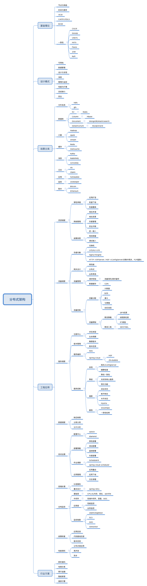

### 架构
1. 面临的问题
   1. 高并发/大负载：集群，负载均衡，动态路由，服务发现、弹性扩容
   1. 高可用：两地三中心，限流、熔断、降级；请求转发机双机热备，故障转移(双机热备)；监控、日志、安全
   1. 持久化：数据库集群(自己造数据，自己测试性能)、主从配置、读写分离；双向同步(同步双写)、三副本数据冗余；分布式文件系统；数据一致性
   1. 缓存：redis
   1. 队列：kafka
   1. 搜索：elasticssearch
1. 技术手段
   - 技术方案确认
     1. 确定目标：性能要求，扩展性要求(提效，技术层面、业务层面)，接口标准等
     1. 系统设计：架构设计、数据库设计、数据结构设计
     1. 核心技术：关键技术点
     1. 影响范围：上下游业务影响范围、测试范围
   - 架构设计
     1. 海量请求————限流————队列(削峰填谷)————缓存————关系型数据库
     1. 超级海量请求————非关系型数据库以及相关技术(PB级、日处理上亿，因为关系型的存储大量无效数据)
   - 优化
     1. mysql优化
     1. nginx优化
     1. tomcat优化
     1. JVM调优
   - 多活
     1. 实现方式：流量隔离、数据同步
     1. 异地多活特点
        - 本地强一致
        - 异地最终一致
1. 技能树
   - 接口：openresty -> grafana
   - 搜索：elasticsearch(更新运维大数据量)
   - 日志：log -> kibana
   - 其他：go -> lua -> python
   - 发布：git -> jenkins
1. wiki
   - 分布式和集群
     1. 分布式：无中心节点
     1. 特点：松耦合、无状态、伸缩性、冗余性
     1. 好处
        - 增大系统容量，如内存、磁盘
        - 提高可用性：即使部分节点宕机
   - 集群
     1. 认识：cluster，一组节点作为一个整体集中在一起提供服务。集群不一定是分布式的
     1. 特性
        - 处理能力提升
        - 可扩展性
        - 高可用性
   - C10K的并发问题引入epoll解决。随后又有了C10M使用协程
   - set化架构：即单元化架构，异地多活，有备的会浪费资源，类似微服务优先自身
     1. 每个集群只负责本单元流量处理和存储，之后做双向数据同步，实现容灾切换需求
   - 横向扩展、纵向扩展：横向加机器，纵向加内存等
   - 混沌工程：通过应用一些经验探索的原则，来学习观察弹性系统是如何反应的，主动发现问题
     1. 通过实践对系统有更新的认知
     1. 方法如模拟整个IDC当掉、选择一部分网络连连接注入特定时间的延迟、随机让一些函数抛出异常、榨干cpu
   - 框架
     1. 配置方式
        - .env
        - 环境变量
        - k8s的配置中心
     1. 异常使用规范
        - 统一异常捕获
        - 区分中间件异常、业务异常
     1. 其他细节
        - 返回码：stat、code、data、msg、trace_id
        - 多版本开发，v1、v2，提高代码复用率
   - 部署模式
     1. 蓝绿：两套
     1. 金丝雀：就一套，不断翻量
#### 网校服务梳理
1. 网校架构
   - 服务体系：lvs+keepalived -> openresty -> vanrish -> server
     1. openresty
        - 接入端、API端划分：HA、API
        - 网关upstream
     1. server
        - php+nginx
          1. php扩展、ini参数
        - supervisor
        - etcd+confd、confd-tw
   - 日志收集：php、nginx
     1. filebeat
        - basiclog.xesv5.com
        - mao.xesv5.com
   - 监控
     1. flcon-agent、xesfalcon.xesv5.com
     1. grafana、datamap.xesv5.com
        - 网关监控
        - k8s物理机
   - 发布系统
     1. rsync
1. 现状
   - 体量：eci 1万台以上
   - 网咯
     1. vpc
        - vpc未打通比例55%，使用阿里云的云企业网打通vpc，全集团一张大网
        - 集团内需要走专线，各个vpc又有nat、bgp
     1. 北京的南北机房建设
1. 网校多活实践
   - 遇到的问题
	 1. 系统性单点：BGP、网关、DCDN，是系统性的单点，虽然nginx是集群，但是是同一个slb，同时cdn也是单点
   - 实现方案
	 1. 网关：相互解耦
#### 问题
##### 高可用
1. 集群，负载均衡，动态路由，服务发现、弹性扩容
1. 认识：HA，就是冗余 + 自动故障转移
1. corosync+pacemaker：用于传递信息，提供心跳信息，集群框架引擎程序，高可用集群资源管理器，crmsh是pacemaker的命令行工具
1. heartbeat：和corosync一类
1. 故障转移
   - 身份切换
   - 接管职权
   - 广而告之
   - 履行义务
1. 自动故障转移
   - 故障检测
   - 故障转移
     1. dns方式
        - dns可以不设置缓存，但是有50毫秒的更新延迟，即最少造成50毫秒服务中断
     1. vip方式
        - 只能按照ip漂移，不能按照端口，一台物理机多个redis就会都飘走
1. 故障演练：经常进行
   - 演练方案：
     1. 还包括风险应对方案、执行人、演练效果记录、是否通过
1. db/redis的高可用
   - 方式
     1. 加入代理层，包一层后边的db服务
     1. 服务本身高可用：DNS Aware，副本配置，分片配置，主从配置，节点故障自动摘除
##### 高负载
1. 服务器方面
   - CPU负载
   - 内存消耗
   - 磁盘 IO
   - 网络带宽
1. 程序方面
   - 执行效率
##### 高并发
1. 认识：日PV千万以上可认为是高并发的系统
1. 指标
   - qps：Queries Per Second，每秒处理完的请求量，总完成请求数/平均响应时间
   - tps：Transactions Per Second，每秒处理事务数，可能包含多个qps
   - rt：响应时间，请求发出到响应的时间
   - pv：page view，综合点击量，在24小时内访问的不同页面的数量，一个人访问一个页面算一次
   - uv：Unique Visitor，独立访客数，一定时间内一个访客多次访问网站只算一个UV
   - 带宽：计算带宽需要峰值流量和页面平均大小
   - 吞吐量：qps和并发数决定
1. 计算
   - 日网站带宽=PV / 24*3600 * 平均页面大小KB * 8
1. 测试
   - 测试机和服务不能在一台服务器上
   - 不能针对线上服务做压力测试
   - 观察测试机和服务机的cpu、内存、网路都不能超过75%
   - 能承受最大的QPS
1. 工具
   - ab：apache benchmark，apache官方推出的工具，创建多个并发访问线程，测试目标基于url
     1. 参数：-c 并发数，-n 总请求数
     1. 结果解读：响应长度，总花费时间，失败数，QPS，平均响应时间，时间花费分布区间
1. 优化方案
   - 宏观
     1. 服务器：负载均衡，业务分离，分布式调用
     1. 缓存：热点数据缓存
     1. 数据库：中间件，读写分离，主从分离，分库分表
   - 微观
     1. nginx压缩，浏览器缓存，CDN存储，独立文件服务器
     1. 整合业务，减少http请求，页面静态化，业务异步处理
1. wiki
   - 1M宽带指1Mbps，即兆比特每秒，除以8就是KB每秒，再扣12%的信息头标识等各种控制讯号，上限为112KB/s
   - 当QPS为800时，每个页面大小为10k，百兆带宽基本占满
   - 当QPS为2000，文件系统的访问锁成了灾难，做业务分离等
1. 创造并发执行
   - curl的mult
   - pcntl
   - 工具：ab、jmeter
1. 负载均衡：Load Balance，主要任务为分发。阿里云产品为slb，在ecs上层
   - 认识
     1. 提高负载能力
     1. 防止单点故障
     1. 流量分发和方向控制
     1. 抵御SYN flood和DDos攻击
   - 调度策略
     1. 随机
     1. 最小响应时间
     1. 最小并发数
     1. 轮询：实现简单、不考虑每台服务器的处理能力
     1. 权重：考虑了服务器的处理能力
     1. 地址哈希：保证同一个用户访问同一台服务器
        - 原ip地址
        - 目标地址
        - 最小连接：让服务器负载更加均匀
        - 加权最小连接
   - 类型
     1. 四层代理：ip加port，不能理解应用层协议，在接受SYN请求时转发，不会进行三次握手
     1. 七层代理：可区分http、mysql，进行了前后两次握手
   - 实现方式
     1. 硬件：F5、Netscaler
     1. 软件
        - LVS
        - HAProxy：不是web服务器，可基于tcp和http进行负载均衡代理
        - Nginx：upstream
        - varnish：高性能、开源的反向代理服务器和缓存服务器，比squid先进
        - squid：代理缓存服务器
        - apache trafficserver
        - envoy：微服务下nginx替代者，非侵入架构，C++11编写，L3L4L7层过滤器，支持http2/gprc，支持DNS/EDS多种服务发现机制，内置健康检查，支持api配置
   - 应用场景
     1. 四层：Redis、MySQL、RabbitMQ
     1. 七层：Nginx、Tomcat、Apache、PHP、图片、API  
#### 方案
1. 心得
   - 实现
     1. 缓存
     1. 限流、熔断、降级
     1. 低耦合，高内聚
     1. 避免单点，拥抱无状态
   - 实践
     1. 灰度
     1. 监控
     1. 告警
     1. 评估
     1. 压测
##### 负载均衡
1. 认识：
1. 功能类型
   - CLB：传统型的面向4层(TCP/UDP)，比7层的性能高
   - ALB：应用型的面向7层(HTTP/HTTPS/QUIC)
1. 实现类型
   - dns：可根据地域就近，配置简单成本低，修改生效不及时(由于多级缓存)
     1. 故障转移
     1. 地区解析
   - LB：硬件，性能高，算法灵活
   - SLB：Server Load Balancing，软负载均衡，服务器负载均衡，基于nginx
1. 均衡策略
   - 随机
   - 轮询、加权轮询：能力高的后端服务权重更高
   - 负载度、最少连接：记录正在处理的连接数
   - 响应时长
   - 源地址hash一致：同样请求ip、同样请求url对应相同后端服务
##### 限流
1. 认识：每xx秒最多xx次
1. 策略
   - 尽早限流————层层限流
     1. 合法限流：限制不合法的，如机器和刷单
        - 验证码限制：拉长访问时间，降低峰值
        - ip限制：拉入黑名单
        - 隐藏秒杀地址：秒杀开始后暴露
     1. 负载限流：集群+网络七层模型
        - 软件：2层的mac负载，生成虚拟mac映射到n台服务器，ip负载，lvs的端口负载，nginx的http负载，还有级联负载会增加网络延迟，单独使用nginx、lvs即可
        - 硬件：F5、Array
     1. 服务限流
        - 调优：最大连接数
        - 限流算法：令牌桶等
        - 队列限流：不同能力服务从队列中取数据
        - 缓存限流：必须是动静分离的缓存
1. 算法
   - 固定时间窗口算法：即计数器，redis的key一定时间内做使用作减法、一段时间后作加法
     1. 简单粗暴
     1. 时间约小，误差越小
     1. 不是平均速率限流，即一上来全部用光
   - 滑动时间窗口算法：把时间划片，一点点往前挪，抛弃前一个格子，进入下一个格子，能够保留前后固定时间窗口的请求统计
     1. 不存在临界问题。划分格子越多，限流统计越精准
   - 漏斗算法
     1. 认识：将所有请求放入桶中，然后定时拿出n个执行，桶满时抛弃
        - 严格限制传输速率，流出速度大于流入就溢出
        - 想象一个尖嘴向下的漏斗，下边的尖嘴固定时间执行，上边的容器放需要执行的请求
     1. code：make_space是核心，给漏斗腾出空间，取决于于过去了多久及流水速率，
        ```python
        # coding: utf8
        import time
        class Funnel(object):
            def __init__(self, capacity, leaking_rate):
                self.capacity = capacity                                    # 漏斗容量
                self.leaking_rate = leaking_rate                            # 漏嘴流水速率
                self.left_quota = capacity                                  # 漏斗剩余空间
                self.leaking_ts = time.time()                               # 上一次漏水时间
            def make_space(self):
                now_ts = time.time()
                delta_ts = now_ts - self.leaking_ts                         # 距离上一次漏水，是否可以流入，这里严格限制了并发
                delta_quota = delta_ts * self.leaking_rate
                if delta_quota < 1:
                    return

                self.left_quota += delta_quota                              # 加水
                self.leaking_ts = now_ts                                    # 更新漏水时间
                if self.left_quota > self.capacity:                         # 剩余空间不得高于容量
                    self.left_quota = self.capacity

            def watering(self, quota):
                self.make_space()
                if self.left_quota >= quota:                                # 判断剩余空间是否足够
                    self.left_quota -= quota
                    return True
                return False
        
        funnels = {}                                                        # 所有的漏斗

        # capacity 漏斗容量
        # leaking_rate 漏嘴流水速率 quota/s
        def is_action_allowed(user_id, action_key, capacity, leaking_rate):
            key = '%s:%s' % (user_id, action_key)
            funnel = funnels.get(key)
            if not funnel:
                funnel = Funnel(capacity, leaking_rate)
                funnels[key] = funnel
            return funnel.watering(1)                                       # 进行漏水消费

        # 测试
        for i in range(20):
            print is_action_allowed('laoqian', 'reply', 15, 0.5)
        ```
   - 令牌桶算法：以固定速率往桶中放入令牌，令牌有最大数量，使用时减去相应令牌即可，适合突发特性的流量，漏斗无法解决
##### 熔断
1. 认识：系统扛不住了，实现最大可用性，相当于拒绝服务
   - 一般原则是先降级后限流。限流是没有办法的办法，是最终的一个降级手段，让用户不能正常使用了
   - 第一步是先拒绝掉 80% 的请求，然后将整个系统全部重启，花费了近 5 分钟。等待系统恢复到满载服务的状态，又花了接近 10 分钟。20%，30%，40%，一点一点的把用户的请求放进来，确保系统的最大可服务能力输出
   - 漏斗：一开始做了很多推演和预测，最后的结论是我们真预测不了，所以还不如换一个思路，去想各种方法控制住最后进到系统里面抢红包、拆红包和分享红包的用户比例，所以我们用了一些柔性措施，将用户请求在客户端就开始做筛选，会在链路中用漏斗模型过滤请求，控制真正进入到红包系统底层的用户数量
   - 现场就是按照标准去操作，谁也别瞎来
   - 当需要阻止应用不断尝试调用远端服务或者访问共享资源，并且这些请求很容易失败的时候使用Circuit-Breaker模式很合适，即熔断，设置恢复与不可用的来回切换
1. 目标
   - 阻止故障的连锁反应
   - 快速失败、迅速恢复
   - 回退并优雅降级
1. 原则
   - 防止任何单独依赖耗尽资源
   - 过载立即切断并失败，防止排队
   - 提供尽可能的回退以保护用户免受故障
1. 熔断条件
   - 网络级别：最大的连接数
   - 服务级别：检测到上游连续出现异常，则请求不再发送到该实例
1. 实现
   - 通过上报记录失败次数，根据规则进行干预
1. 快速失败
##### 链路追踪
1. 实现原理
   - 链路是
   - 根据时间线去看，一个个请求有开始时间、持续时间，上下层级关系，
1. 网校trace
   - 组成
     1. 关键三要素：接口url(名称)、开始时间、持续时间
     1. 表示整体范围：traceid不变，贯穿所有请求的始终，可用uuid。但是日志里收集的是乱序的
     1. 表示请求层级和顺序：rpcid形式x.x.x，每一个层级多一个点，相同出发点，x值递增表示每一个请求(可以是http、mysql查询等)。即只有最后一位+1，前几层不变，子调用的时候会增加层级计数 一个点代表一个调用深度层级的执行顺序
     1. 将格式化好的数据灌入数据库中
   - 应用场景
     1. 可通过TraceId能够将某次请求所有日志汇集，方便查询分析，回放
     1. 可通过对标准格式的日志内容进行统计分析，可以分析出所有时间段内接口、资源的响应情况
     1. 可通过对错误日志进行汇总去重，实现运行异常发现、排查、现场回放、警报
   - 日志内容范围
     1. Mysql请求IP、连接耗时、响应耗时、SQL模板、SQL附加参数*、执行错误、连接错误
     1. Http请求IP、URL、method、参数、httpcode、dns解析时间、连接时间、业务处理时间、执行错误、连接错误
1. jaeger
   - 认识：链路追踪，
     1. 高扩展
     1. 可观察
     1. 原生支持openTracing
   - 设计
     1. jaeger-client：使用thrift通过udp发送给agent
     1. jaeger-agent：go，使用thrift通过Tchannel发送给collector
     1. jaeger-collector：go，队列入存储
     1. jaeger-query：go
     1. jaeger-ui：react
     1. 存储：cassandra
   - 组成
     1. span：逻辑工作单元，有操作名称、开始时间、持续时间，跨度可以嵌套并排序，建立因果关系模型
        - 对象
          1. tag：标签集合
          1. log：一组span日志集合
          1. spanContext：上下文对象
          1. reference：span间关系
   - 项目应用原理：
##### 分布式
1. 架构图：
### 服务治理
#### 接口
1. 指标
   - qps：调用量
   - 响应时长：服务响应时间与分布
     1. 最大、最小
     1. 均值/中位值：平均响应时长，总和除以数量
     1. P95值：时长从小到大排列，顺序在95%处的值，反应95%的用户的响应时长小于P95
     1. P99值
   - 成功率：错误统计
     1. 4xx、5xx
   - 机器负载
     1. cpu
     1. 内存
     1. 硬盘
     1. 网络
   - 资源依赖负载
     1. redis、mysql
1. 最佳实践
   - 自身了解
     1. 分类
     1. 调用方分布、调用方式、调用速率、调用高峰和分布
   - 维护
     1. 报错数
     1. 慢接口top
     1. 高流量top
1. 设计
   - 防重设计：避免产生重复数据，对接口返回没有太多要求
   - 幂等设计
     1. 认识：多次执行所产生的影响均与一次执行的影响相同
        - 场景
          1. 天然幂等：读
          1. 保证幂等：写、消息订阅和处理
     1. 如何保证：业务无关和业务强关
        - 基于状态：根据状态机，如订单状态的流转，原理同version，但是只应用在状态会变更的情况下
        - 基于唯一键：可以是几个id的组合。如一个用户每天只能领一张优惠券，通过用户id+优惠券类型+日期字符串即可唯一标识
        - 基于数据库
          1. 加悲观锁for update
          1. 加乐观锁version
          1. 加唯一索引
        - 基于redis分布式锁
#### 性能
1. 硬件指标
   - kvm：单台8核16G，查询5-6次redis，接口的qps可以为5000~6000
     1. 物理机
        - 品牌型号：dell(R440、R420)、lenovo(SR530、SR570)、hpe
        - 配置：联想SR570
          1. 3个PCIe 3.0
          1. 2*4114：24核
          1. 256G：2666MHz，ddr4 
          1. 4*960G：标配4个3.5英寸硬盘
          1. 电口：2*1000M，光口：2*10G含模块
          1. RAID10 5：标配raid软件，还有Raid卡
          1. 2*550W 电源
        - 价格
          1. 服务器：单台服务器7W，单台实体机可以虚拟化成7台8核虚机
          1. 机架租赁：10U的机柜，7500机柜/月
   - aliyun云服务
     1. mysql 8核16G：最大连接数 4000（qps），最大iops8000
     1. redis 16G集群版：最大连接数 20000，160000 qps，私网带宽 1.5Gbps
     1. rocketMQ 标准版本：弹性上限5000qps
   - 网络
     1. 阿里云CDN：1Tbps
     1. 阿里云到世纪互联带宽：5Gbps
     1. 世纪互联接入互联网上行和下行专线带宽(未知)：1G/根 * 2
     1. 世纪互联出口带宽和用户数的预估，实际占用最高1.9G为71万用户，14G支持200万、20G支持300万、70G支持1000万
     1. 专线质量
        - 延时 <=2ms，1.5ms，2.5ms
        - 丢包：<=0.03%
        - 带宽：10G x 4，多线路冗余自愈
1. 耗时分析
   - 网校网关损耗
     1. 网校网关：多半1ms以下，2ms、3ms依次减少，三者占99%
     1. 容器网关：1ms以下
   - 数据库连接
     1. mysql连接：1.5ms
     1. redis连接：0.3ms
     1. 走索引单条sql查询：0.6ms
   - 一次api请求：几十ms，大于100都是慢的。例php返回字符串请求耗时6ms，其中php处理时间：1.3ms
     1. dns解析：0.01ms、0.02ms、0.8ms、1ms
     1. connect_time：0.1ms、1.2ms
     1. pretransfer_time：1.4ms
     1. starttransfer_time：6.9ms
   - 硬件延迟数字：主要看比例，cpu缓存访问秒，读内存分钟，网络发送小时，读SSD天，读机械硬盘个月，数据包来回年
     1. cpu
        - 寄存器：300ps
        - l1缓存访问：1ns
        - l2缓存访问：4ns
        - l3缓存访问：12ns
        - 分支预测错误：5ns
        - 互斥锁/解锁：25ns
     1. 内存
        - cpu访问一次内存：60~100ns
        - 内存中连续读取1mb：250µs
        - 操作带宽：7000MBps
     1. 网络
        - 通过1Gbps发送2kb：20µs
     1. 存储
        - SSD随机读取：150µs
        - SSD连续读取1mb：1ms
        - 机械磁盘寻道：10ms
        - 机械磁盘连续读取1mb：20ms
     1. 其他
        - 压缩1kb：3µs
        - 同一个数据中心的来回：0.5ms
1. 调优思路
   - 根据不同机器调整参数
   - 大内存的，响应参数往大调
   - 增大tcp缓冲区，提高吞吐量，但是多占内存
   - 能够打开的文件句柄数，多占内存
   - tcp
     1. tcp最长空余时间，用heartbeat代替更好
     1. 允许内核重用time_wait状态的套接字
     1. 减少连接关闭的时间
1. 性能压测
   - 性能场景设计
     1. 项目分析：目标、架构、业务流程
     1. 需求分析：28原则、公认标准
        - 出现问题停止即可，再大无意义
     1. 场景选定、数据确定
   - 性能监控
     1. 操作系统
     1. 架构组件
   - 结果分析
     1. 指标
        - 并发数：uv
        - 处理数：tps
        - 响应时间
        - 设备性能
   - 压测工具：测试脚本开发
     1. jmeter
     1. loadRunner
     1. grinder
1. 最佳实践
   - 开发过程压测
     1. 影响压测结果外界因素：本机句柄数限制(一般最大1024)，dns解析速度，网络质量，服务端连接数限制等
     1. 工具
        - ab：apache banch
        - apipost：可视化一键压测，底层采用自研的基于golang的压测引擎
#### 监控与预警、故障排查
1. 监控
   - 基础设施
     1. 高峰流量峰值
     1. 高峰流量时段
     1. 低峰流量时段
   - 中间件、公共服务
   - 应用服务
1. 预警
   - 阈值设置
   - 事件响应机制
1. 基础设施
   - 硬件：cpu温度、服务器功率、cpu风扇转速
   - 网络
     1. 网络流出入速率
     1. tcp连接数、打开数、接收发送包速率、错误和重传数
   - 操作系统/容器：进线程数
   - 主机
     1. cpu：负载、上下文切换、可运行队列
     1. mem：使用率、swap
     1. io：文件、磁盘、网络
     1. 磁盘：使用率、读写速度/次数
1. 公共服务
   - mysql
     1. 数据增长率、连接数、表空间、非法访问
     1. qps、慢查询数量、慢sql
   - redis：内存占用、qps、连接数
   - nginx：qps、处理时间、服务器错误率
1. 应用服务
   - 服务状态(接口)：每个接口qps、接口发送/接收字节数、最大/平均响应时间、可用性检测
   - 服务错误数：5xx
   - 调用链：sql耗时、api耗时
   - 日志收集：响应码、上下游请求响应数据
##### APM
1. 认识
   - 认识：生成、收集、导出监测数据(Metrics、Logs、Traces)，应用性能产品，保障健康可监测性
     1. 分布式链路追踪
     1. 性能指标分析
     1. 应用和服务依赖
   - demo
     1. opentelemetry
     1. 听云
     1. 网校探针：发生故障的时候，能够快速定位和解决问题
     1. skywalking：是观察性分析平台和应用性能管理系统。提供分布式追踪、服务网格遥测分析、度量聚合和可视化一体化解决方案，可用于php，支持多语言，支持Istio + Envoy服务网格，国内开源并提交到Apache孵化器，华为
     1. 元老：openTracing、opencensus
     1. zipkin：Spring Cloud全家桶自带
     1. opencensus：支持多语言，谷歌出品
     1. jeager：Uber
     1. CAT：点评的
1. prometheus
   - 认识：SoundCloud的开源的Google BorgMon的监控、告警、时序数据数据库组合的解决方案，适用于容器环境。
     1. 多维度数据模型
     1. 灵活的查询语言
     1. 不依赖分布式存储，单个服务器节点是自主的
     1. 通过基于HTTP的pull方式采集时序数据
     1. 可以通过中间网关进行时序列数据推送
     1. 通过服务发现或者静态配置来发现目标服务对象
     1. 支持多种多样的图表和界面展示，比如Grafana等
   - 组件
     1. Client Library：客户端组合metrics并暴露给Push Gateway
     1. Push Gateway：支持临时性Job主动推送指标的中间网关
     1. Server：主要负责数据采集和存储，提供PromQL查询语言的支持
     1. Alertmanager：警告管理器，从server接收到alert后，进行去重、分组，并路由对应的接受方式，发出报警
     1. Exporter：暴露已有的第三方服务给server
     1. instance：一个单独监控的目标，一般是一个进程
     1. jobs：一组同类型的instances
   - metric类型
     1. counter：累加，如请求的个数、出现的错误数
     1. gauge：任意加减
     1. histogram：可对观察结果采样、分组、统计，如柱状图
     1. summary：提供观测值的count、sum功能，如请求持续时间
   - 原理：Prometheus的基本原理是通过HTTP协议周期性抓取被监控组件的状态，任意组件只要提供对应的HTTP接口就可以接入监控。不需要任何SDK或者其他的集成过程。这样做非常适合做虚拟化环境监控系统，比如VM、Docker、Kubernetes等。输出被监控组件信息的HTTP接口被叫做exporter 。目前互联网公司常用的组件大部分都有exporter可以直接使用，比如Varnish、Haproxy、Nginx、MySQL、Linux系统信息(包括磁盘、内存、CPU、网络等等)
   - 服务过程
     1. Prometheus Daemon负责定时去配置好的jobs/exporter/pushgateway抓取metrics(指标)数据，每个抓取目标需要暴露一个http服务的接口给它定时抓取。Prometheus支持通过配置文件、文本文件、Zookeeper、Consul、DNS SRV Lookup等方式指定抓取目标。Prometheus采用PULL的方式进行监控，即服务器可以直接通过目标PULL数据或者间接地通过中间网关来Push数据
     1. Prometheus在本地存储抓取的所有数据，并通过一定规则进行清理和整理数据，并把得到的结果存储到新的时间序列中
     1. Prometheus通过PromQL和其他API可视化地展示收集的数据。Prometheus支持很多方式的图表可视化，例如Grafana、自带的Promdash以及自身提供的模版引擎等等。Prometheus还提供HTTP API的查询方式，自定义所需要的输出
     1. PushGateway支持Client主动推送metrics到PushGateway，而Prometheus只是定时去Gateway上抓取数据
     1. Alertmanager是独立于Prometheus的一个组件，可以支持Prometheus的查询语句，提供十分灵活的报警方式
   - PromQL：时间序列数据查询语音
##### 故障排查
1. 故障常见原因
   - 连表
   - 没加索引
   - 关键数据没有做好缓存
   - 计算复杂度高、逻辑复杂放到了c端
   - 监控项缺失：无法先兆发现
   - 没有全方位压测：最后一道保障
     1. 全链路压测能力不足，不能只从内网压测，无法模拟外网全链路
   - 客户端疯狂重试，造成雪崩
1. 常见问题梳理
   - cpu处理不及时，源源不断的客户端请求会堆积在内存中，导致内存占用增加，进一步导致处理时间变慢
   - 网络故障
     1. es脑裂
     1. tw：tw每10秒向etcd续活，超过时间后续活失败，etcd就删除对应的key，导致confd下发的配置缺失
        - 方案：网络恢复后，tw继续向etcd申请新key+续活
   - 磁盘故障导致发布系统删除了一台机器，但是修复后网关系统却加上了，导致业务代码落后
   - IDC机房清洗
     1. 机房发现异常流量进行302清洗
     1. cdn缓存，1分钟缓存过期后回源再次循环302
     1. 页面302无法访问
   - 由于高峰期占用cpu，停止了clamav导致中病毒
   - mysql连接没有关闭，导致连接数打满
   - redis消费慢导致数据延迟展示
   - 队列积压导致job机oom
   - 机器光口线序不对、raid卡错误