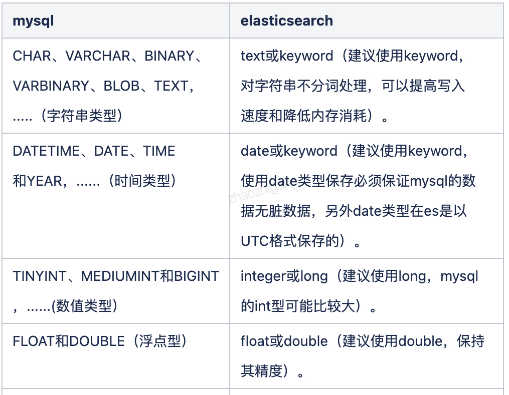

### ElasticSearch
1. 认识：基于apache lucene构建的开源分布式数据搜索和分析引擎。java编写
   - 特点
     1. 支持结构化、非结构化搜索，不需要提前定义模式
     1. 近实时存储/检索数据
     1. 支持PB级结构化/非结构化/地理位置/指标数据处理，速度超快
     1. 分布式存储：索引拆分为分片，分片多副本
     1. 支持集群部署：水平扩展、跨集群复制热备
     1. 提供简单的RESTFul API
     1. 支持插件机制：分词/同步/Hadoop/可视化
   - 设计
     1. 全文索引
     1. 多词条查询、匹配度与权重、自动联想、拼写纠错
     1. 负载再平衡和路由大多自动完成
1. 场景
   - 适用
     1. 实时数据搜索：作为关系型数据库全文、多词条搜索的功能补充，将进行全文搜索的数据缓存一份到elasticSearch上，达到处理复杂的业务与提高查询速度的目的
     1. 数据仓库
     1. 数据分析：数据聚合、日志处理与分析
   - 不适用
     1. 事务性、强一致
     1. 权限划分
1. 数据类型
   - 布尔：boolean
   - 二进制：binary
   - 数值：byte、integer、short、long、float、double、half_float(节省空间)、scaled_float
   - 字符串：text(分词)、keyword(不分词)，text类型的已经分词了，用完整全文去查，是查不到的
   - 日期：date
   - 范围：integer_range|long_range、float_range|double_range、date_range，5.x新增
   - 复杂类型
     1. 数组：array
     1. 对象：object
     1. 嵌套对象：nested object
   - 地理位置
     1. geo_point：点
     1. geo_shape：形状
   - 专用类型
     1. ip地址：ip
     1. 自动补全：completion
     1. 分词数量：token_count
     1. 字符串hash：murmur3
     1. percolator
     1. join：父子查询
1. 组成
   - index：索引，即数据库，相同属性的文档集合。分为结构化/非结构化
     1. 命名：名称必须小写/无下划线(es关键字前缀为_)，可精确搜索
     1. mapping：属性描述，类似表结构定义。定义了字段名称/类型，倒排索引的配置，分词处理规则。为空则为非结构化
        - 特性
          1. 修改：字段类型一旦设定禁止修改。需要建立新的索引，然后reindex(就是重新导入)。因为lucene的倒排索引为了提高效率生成后不允许修改
          1. 新增：允许新增字段，参数dynamic控制，默认true允许，false不允许但是可以写入到文档不能查询，strict写入报错。推荐false，不会将字段随意更改
          1. multi-fields：多字段特性，允许对同一字段采用不同的配置
            ```json
            // 查询
            GET index/_search
            {
                "query": {
                    "match": {
                        "xx.xx": "xx"
                    }
                }
            }
            ```
          1. 动态设置类型：dynamic mapping，es根据json的类型实现自动识别字段类型。如boolean为boolean，整数为long，string匹配日期/数字，匹配为text附加keyword子字段
          1. 动态模板：`dynamic_templates`属性，支持按照设定的规则设置字段类型，如所有message开头的设置为text，所有自动匹配为double的都设定为float
        - 属性
          1. enabled：默认true，只作用于object，使es不去解析该字段，并且该字段不能被查询和store
          1. index：字段是否建立倒排索引，默认true，false则不可搜索，用于不用搜索的字段，节省空间，加快速度
          1. index_options：控制放入倒排索引记录的内容。text默认positions，其他默认docs。记录越多，占用索引越大
             - docs：只记录doc id
             - freqs：以上基础加term frequencies，词频
             - positions：以上基础加term position，出现位置，可支持词语查询，因为有位置
             - offsets：以上基础加character offset，开始和结束位置，可支持高亮
          1. norms：是否存储归一化参数，即算分排序。如果仅用于过滤和聚合分析，可关闭
          1. doc_values：是否开启自动数据类型转换
          1. fields：多字段
          1. copy_to：将该字段所有值复制到目标字段，类似_all，不出现在_source中，只用来搜索。用于满足特殊搜索
          1. null_value：字段的null值处理策略，即设定默认值如设定为字符串"null"
        - 设定流程
          1. 确定类型
             - 字符串：需要分词为text，否则为keyword
             - 枚举：基于性能考虑设定为keyword，即使为整形
             - 数值：能用byte不用long
             - 其他：bool、日期、地理位置
          1. 是否需要搜索
             - 完全不需要：enabled为false，即不解析该字段
             - 不需要搜索：index为false
             - 需要搜索：设定存储粒度，index_options/norms
          1. 是否需要排序和聚合分析
             - doc_values为false，节省磁盘空间
             - fielddata为false，节省磁盘空间
          1. 是否独立存储
             - store：bool，默认所有值都建立了倒排索引，但没有存储(只记录了doc id等)，所以只能查询不能取回原始数据。要取回原始数据就会读所有字段的默认已存储的_source
               1. 大多数情况并不是必须的，从_source中获取值是快速而且高效的
               1. 当某一个字段巨大，即使使用字段过滤搜索，内部节点还是会取出来所有的字段值进行数据交换，只是返回用户时去掉了，为true时搭配store_fields，用于解决如几十万文字搜索的性能问题
               1. 为true时es会分辨出field1已经被存储了，因此不会从_source中加载，而是从field1的存储块中加载
               1. 获取独立存储的字段要比从_source中解析快得多，_source越大对比越明显
               1. 独立存储的字段越多，索引就越大，建立索引和检索就会越慢
     1. 索引模板：index template，新建索引时自动应用预先设定的配置，简化索引创建步骤
        ```json
        PUT _template/xx
        {
            "index_patterns": ["", ""],
            "order": x,                                 // 优先级
            "settings": {},
            "mappings": {},
        }
        ```
   - Type：类型，属于index，虚拟的逻辑分组，用来过滤document
     1. 不同的type应该有相似的属性、设置，因为es通过_type进行type的过滤，是放在一起存储的，不一样无法处理
     1. 6.x只允许每个index包含一个type，7.x不需要设置
   - Document：文档，单条的记录（行），最小存储单位，属于type
     1. Field：列，属于document
     1. MetaData：元数据，用于标注文档信息
        - _index：所在索引名
        - _type：所在类型名
        - _id：唯一id
        - _uid：组合id，由_type和_id组成(6.x，那俩都不起作用)
        - _source：原始的json数据
        - _all：将所有字段值连接起来，一起搜索关键字，占空间，查询慢，新版本默认禁用
### Restful Api
1. 认识
   - 使用方式
     1. Restful Api：http方法、url、json串，`http://ip/index/type/doc，get/post/put/delete`
        - xx：单个
        - | ,：多个
        - ?：单字符通配符
        - *：多字符通配符
        - _all，所有
     1. Kibana DevTools
   - index数据结构
   - doc数据结构
        ```json
        {
            "_index": "xx",                                         // 所属的索引
            "_type": "xx",                                          // type值
            "_id": "xx",                                            // 唯一值
            "_version": x,                                          // 每次更新操作+1，乐观锁的机制，同步更新时发现更新版本小于当前版本则拒绝修改
            "result": "created/updated",                            // 数据的当前状态，是新建还是更新
            "_shards": {
                "total": x,
                "successful": x,
                "failed": x,
            },
            "_seq_no": x,
            "_primary_term": x
        }
        ```
   - 查询结果解析
    ```json
    {
        "took": x,                              // 花费时间，毫秒
        "timed_out": false,                     // 是否超时，可指定最长搜索时间
        "_shards": ...,                         // 参与查询的分片数据，可能有分片失败
        "hits": {
            "total": x,
            "max_score": 1.0,
            "hits": [                           // 结果集合，默认前10个
                {
                    "_index": "xx",
                    "_type": "xx",
                    "_id": "xx",
                    "_score": x|null,           // 指定排序返回null，0表示没有算分
                    "_source": {                // 原始的字段值
                        "xx": "xx",
                    },
                }
            ]
        }
    }
    ```
1. 索引
   - 查看：`GET http://ip/index/_settings|_mapping`
   - 创建
        ```json
        // PUT http://ip/index
        {
            "setting": {                                            // 索引设置
                "number_of_shards": 5,                                      // 分片数
                "number_of_replicas": 1,                                    // 副本数
                // 分词设置
                "analysis": {
                    "char_filter": {},
                    "tokenizer": {},
                    "filter": {},
                    "analyzer": {
                        "xx": {
                            ...
                        }
                    },
                }
            },
            "mappings": {
                "xx": {                                             // type，类型
                    "dynamic": false,
                    "dynamic_templates": [                                  // 动态模板，创建字段省事
                        {
                            "string": {
                                "match_mapping_type": "string",             // 当识别为string时，都设置为keyword类型
                                "mapping": {
                                    "type": "keyword",
                                }
                            }
                        }
                    ],
                    "properties": {                                         // 字段属性
                        "xx": {                                             // 名称
                            "type": "text",                                 // 字段类型
                            "analyzer": "xx",                               // 指定分词器
                            "copy_to": "xxx",                               // 复制内容
                            "ignore_above": n,                              // 只存储特定长度字符
                            "ignore_malformed": true,                       // 是否将格式错误的字段不编制索引，同时不影响其他字段
                            "fields": {                                     // 子字段
                                "xx": {
                                    "type": "keyword",
                                    "analyzer": "xx",
                                }
                            },
                        },
                        "xx": {
                            "type": "date",
                            "format": "yyyy-MM-dd HH:mm:ss || epoch_millis" // || 或的意思
                        },
                        "xx": {                                             // 分词设置
                            "type": "text",
                            "term_vector": "with_positions_offsets",
                            "analyzer": "ik_max_word",
                            "search_analyzer": "ik_smart",
                            "fielddata": true
                        },
                    }
                },
            }
        }
        ```
   - 更新
     1. 新增字段
        ```json
        // PUT http://ip/index/type/_mapping
        {
            "properties": {
                "ee": {
                    "type": "keyword"
                }
            }
        }
        ```
     1. 修改字段：只能采取搬迁的形式
        - 创建新索引：字段名称和原来的一致
        - 同步数据
            ```json
            // POST _reindex
            {
                "source": {
                    "index": "xx1"
                },
                "dest": {
                    "index": "xx2"
                }
            }
            ```
        - 删除原索引
        - 设置别名
            ```json
            // POST _aliases
            {
                "actions": [
                    {"add": {"index": "xx2", "alias": "xx1"}}
                ]
            }
            ```
   - 删除：`DELETE http://ip/index`
1. 文档
   - 查看
     1. 单个：`GET http://ip/index/type/doc_id`
     1. 批量：`GET _mget`，
        ```json
        {
            "docs": [
                {
                    "_index": "xx",
                    "_type": "xx",
                    "_id": "xx",
                }
            ]
        }
        ```
   - 插入
     1. 分类
        - 指定id：put方法，`http://ip/index/type/doc_id`
        - 自动生成id：post方法，`http://ip/index/type`
     1. 请求参数
        ```json
        {
            "xx": "name",                                           // 要写入的字段即可
            "date": "2000-01-01"
        }
        ```
   - 更新
     1. restful方式
        ```json
        // PUT index/type/doc_id
        {
            "xx": "xx",                                             // 覆盖文档
        }
        // POST index/type/doc_id/_update
        {
            "doc": {
                "xx": "xx",                                         // 更新字段
            }
        }
        ```
     1. 脚本方式
        ```json
        {
            "script": {
                "lang": "painless/python",
                "source": "ctx._source.age (+= 10/params.age)",     // 脚本内容
                "params": {
                    "age": 11
                }
            }
        }
        ```
     1. 批量更新
        - 意义：一次操作多个文档，减少网络传输开销，提升速率
        - 使用：`POST _bulk`，请求体隔一行json一个单独操作，新增和更新紧接着下一行是内容数据。先指定索引和类型，再传数据
        - 操作分类
          1. index：文档已存在覆盖，`{"index":{"_index":"xx", "_type":"xx", "_id":"xx"}}`，换一行是具体文档内容如`{"xx":"xx"}`
          1. update
          1. create：文档已存在报错
          1. delete
   - 删除：`DELETE index/type/doc_id`，http地址最后到哪级删哪级
1. 文档查询
   - 方式
     1. `GET index/_search`
        - 认识：发送get参数，使用_all字段，仅包含部分语法，操作简单。`GET /index/type/_search?q=xx:xx&sort=xx:desc`
        - 参数类型
          1. q：指定查询语句，语法为Query String Syntax
          1. df：指定返回字段
          1. sort：xx:asc
          1. timeout：1s
          1. from,size
     1. `GET index/_search`
        - 认识：发送请求体，使用完备的查询语法 Query DSL
     1. `GET index/_count`：只获取文档数
   - 字段类举例
        ```json
        // POST index/_search
        {
            "query": {
                // 无条件
                "match_all": {},                        // 查询所有，最简单
                "match_none": {},                       // 一个都不查询

                // 不分词查询
                "term": {                               // 可以使用元数据字段
                    "xx1|_id": x,
                    "xx2": x
                },
                "terms": {                              // 单字段一次多关键字查询，即IN
                    "xx": ["xx","xx"]
                },
                "terms_set": "",                        // 满足一个或多个即可
                "range": {                              // 范围
                    "xx": {
                        "gte/gt": "2017-01-01",
                        "lte/lt": "now-1d"
                    }
                },
                "exists": {                             // 字段至少含有一个非null值
                    "field" : "xx"
                },
                "prefix": {                             // 以xx确切的开头
                    "xx" : "xx"
                },
                "wildcard": {                           // 通配符查询，只支持?*，查询比较慢
                    "xx" : ""
                },
                "regexp": {                             // 正则匹配
                    "xx":{
                        "value":"s.*y",
                        "flags" : "INTERSECTION|COMPLEMENT|EMPTY",
                        "boost":1.2
                    }
                },
                "fuzzy": {                             // 模棱两可查询
                    "xx" : "xx"
                },
                "type": "",
                "ids": "",

                // 全文查询：文本类型
                "match": {                              // 模糊匹配和解析、接近查询，先分词解析，再查询
                    "xx": "xx xx",                      // 单词间是或的关系
                    "xx": {                             // 控制单词间关系
                        "query": "xx xx",
                        "operator": "and|or",
                        "minimum_should_match": "n"     // 最少满足匹配的单词数
                    }
                },
                "mult_match": {                         // match的多字段版本
                    "query": "",
                    "fields": ["xx", "xx"]
                },
                "match_phrase": {                       // 匹配确切解析、接近查询，对词语顺序有要求
                    "xx": "xx xx",
                    "slop": "n"                         // 单词间间隔
                },
                "common": "",

                // query_string查询
                "query_string": {                       // 语法查询，根据语法规则查询，类似q。支持多字段，支持通配符/范围查询/布尔查询/正则
                    "query": "(xx AND xx) OR xx",
                    "fields": ["xx", "xx"]              // 限定字段查询范围
                },
                "simple_query_string": {                // 忽略错误查询语法，仅支持部分查询语法，不能使用AND OR NOT
                    "query": "(xx + xx) | xx",          // + 与，- 非， | 或
                },
            },


            // 其他参数

            // _source
            "_source": ["xx.*", "xx"],                  // 只取某个字段
            "_source": {
                "includes": [ "obj1.*", "obj2.*" ],     // 包含某个
                "excludes": [ "*.description" ]         // 排除某个
            },
            "_source": false,                           // 默认返回_source，除非使用stored_fields或者设置_source为false
            "stored_fields": ["xx"],                    // 只取某个store的字段，不推荐，应该使用以上方式

            // 排序
            "sort": {
                "xx": "desc" 
            },
            "sort": [                                   // 多个排序条件，从上到下依次比较
                {"xx": "desc"},
                {"xx": "desc"}
            ],

            // 分页
            "from": 1,
            "size": 1,

            // 高亮
            "highlight": {
                "field": {
                    "name": {}
                }
            },
        }
        ```
   - 复合类查询
        ```json
        // POST index/_search
        {
            "query": {
                "constant_score": {                     // 固定分数查询
                    "filter": {                         // 只有一个filter
                        "match": {
                            "xx": "xx"
                        }
                    },
                    "boost": x                          // 指定分数
                },

                "bool": {                               // 布尔查询
                    "filter": [                         // 支持数组，可以写为对象，也可以写为数组，数组要用[]，里边多套层{}
                        {
                            "term": {
                                "xx": x
                            },
                        }
                        {
                            "range": {
                                "xx": {"gt": x}
                            }
                        }
                    ],
                    "must": [],                         // 多个bool子句可同时使用，如filter不影响must的算分，只作为过滤
                    "must_not": [],
                    "should": [],                       // OR的意思
                    "minimum_should_match": n           // 规定最少满足的should条件个数
                }
            }
        }
        ```
1. endpoint
   - `PUT/GET _settings/_mapping`
   - `GET _count`
   - `GET _source`：不查询元数据，只查询source
   - `GET _all`：查询所有索引
   - `POST _search/_update/_reindex`
   - `GET _cat`
     1. _cat/plugins
     1. _cat/shards
     1. _cat/nodes
   - `GET _cluster`
### 特性
1. 查询语法
   - Query String Syntax
     1. 泛查询：所有字段查询，直接写入q中
     1. 指定字段：xx:xx
     1. term、phrase：单词和词语，区别在于顺序。空格表示or，词语查询用""来要求前后顺序
     1. 分组：使用括号，如`status:(xx OR xx) title:(xx)`
     1. 布尔操作符：AND OR NOT + -，区分大小写，后俩对应must和must not，+在url中应该写为%2B
     1. 范围：支持数值和日期
        - `xx:[1 TO 10]、xx:[1 TO 10}、xx:[1 TO ]、xx:[* TO 10]`：区间写法，闭区间用[]，开区间用{}
        - `xx:(>=1 && <=10)、xx:>=1`：算术符号写法
     1. 通配符：? *，如`xx:t?m`，执行效率低，占内存多，以?或*开头的效率最低，因为匹配所有文档
     1. 正则：//，`xx:/preg/`
     1. 模糊/相似度：~，允许n个char，可增删改查
        - `xx:xx~n`，单词级别，
        - `xx:"x x"~n`，词语级别
   - Query DSL
     1. 认识：Domain Specific Language，特定领域的语言
        - 默认进行相关性算分并排序
     1. 行为类型
        - 查询上下文：匹配程度怎么样？
        - 过滤上下文：匹配吗？只有是和否，如bool查询中的filter/must not，constant_score的filter，aggregation中的filter
     1. 查询子句类型
        - 叶子查询：可独立使用
          1. 模糊匹配：针对text类型，会先分词，再查找，然后再相关性算分
             - match
             - prefix
             - regexp
             - query_string
          1. 精确匹配：不分词，直接比较倒排索引，提供相关性算分
             - term
             - range
             - ids
        - 复合查询
          1. 认识：包含叶子查询和复合查询组合使用
          1. bool：由bool子句组成
             - filter：过滤器，只过滤符合条件的，是或否，不算分，其他的是有多接近，这个是是否。有智能缓存，执行效率高
             - must：必须符合must中的所有条件，即and，算分
             - must not：相反，不算分
             - should：可以符合，即or
               1. 只有should：或的意思
               1. 有should和must：不要求满足should条件，但是满足增加得分，可以用于将某种结果往前排
          1. constant_score：不计算相关度评分，将内部查询结果得分都设为1或boost的值，多用于结合bool实现自定义得分
             - filter：不算分
          1. dis_max
          1. function_score
          1. boosting
        - 连接查询
          1. nested
             - path
             - query
          1. has_child/has_parent
             - type/parent_type
             - query
             - inner_hits
        - geo查询
        - 专用查询
        - 跨度查询：和非跨度不能混用，用于详细控制查询和顺序
1. 排序
   - 认识：对字段原始内容进行排序的过程，这个过程倒排索引无法发挥作用，需要用到正排索引。除了text。会采用列示存储和很多压缩算法节省空间
     1. 默认按照算分，采用其他字段排序不会算分
     1. text不能排序，keyword可以
   - 实现方案
     1. fielddata：默认禁用，只针对text类型，按照分词后的term排序，结果很难符合预期。搜索时即使创建，占用jvm heap，文档多时耗时长，内存占用大。针对字段配置 `"fielddata":true`。一般对分词做聚合分析时开启，可随时开启关闭
     1. doc values：默认启用，索引时创建和倒排的时机一样，占用磁盘，会减慢创建索引速度。针对字段配置，可在创建索引时关闭 `"doc_values": false`
1. 分页与遍历
   - from + size：开始位置/文档数，从0开始，分页就是数据分片存储下，会在所有分片取出0到size个文档再汇总处理，深分页配置 `index.max_result_window`为10000。搜索引擎是为了让你尽快找到结果，而不是深分页
   - scroll
     1. 认识：遍历文档集的api，以快照方式避免深分页。指定快照保存时间，快照一个个查询，会占用内存
        - 不能用来实时搜索，数据不实时。因为建立快照需要时间，是建立快照时的数据
        - 尽量不要复杂sort，使用_doc最高效
     1. 使用
        - 发起scroll search
            ```json
            // GET _search?scroll=1m        // 指定快照有效时间
            {
                "slice": {                  // sliced scroll：切片方式指定多scroll并行查询，指定上下文保留时间、最大切片、当前切片
                    "id": 1,
                    "max": 2
                },
                "size": n                   // 每次scorll返回的文档数
            }
            ```
        - 利用scroll_id获取文档，当hits为空时可停止
            ```json
            // POST _search/scroll
            {
                "scroll": "5m",             // 刷新快照存活时间
                "scroll_id": "xx"
            }
            ```
        - 删除：`DELETE _search/scorll {"scroll_id":["",""]}`、`DELETE _search/scroll/_all`
   - search after
     1. 认识：可避免深分页的性能问题，提供实时的下一页文档获取。可用bool查询的range filter实现
        - 不能指定页数
        - 只能下一页，不能上一页
        - 原理：基于上一页排序值检索下一页实现动态分页。需要指定支持排序且值唯一的n个字段做下一页拉取的指针。因为只需找各个分片要这个排序值之后size个数据然后组合即可，性能也是极高的
     1. 使用
        ```json
        // GET _search
        {
            "search_after": [],         // 填入上一页返回的排序结果
            "sort": {}
        }
        ```
1. 关联关系处理
   - 认识：不擅长处理关联关系，因为倒排索引不能做动态数据联合，适用于某些关联关系查询等操作的，可以使用
   - api
     1. Nested Object：嵌套文档，独立存储，查询的时候可以横跨多个字段，获取每个array中符合的，普通的object array则不支持这么查，因为它必须在一个数组里
        ```json
        // 创建
        type为nested
        // 查询
        GET _search
        {
            "query": {
                "nested": {
                    "path": "xx",                           // 字段路径
                    "query": {},                            // 查询条件
                }
            }
        }
        ```
     1. Parent/Child：父子文档，类似join，6.x之前用多type方式实现
        ```json
        // 创建索引
        PUT xx
        {
            "mappings": {
                "xx": {
                    "properties": {
                        "xx": {
                            "type": "join",
                            "relations": {                  // 指明父子关系
                                "xx_parent": "xx_child"
                            }
                        }
                    }
                }
            },
        }
        // 创建父文档
        PUT xx
        {
            "xx": "xx",
            "join": "xx",                   // 指明父类型
        }
        // 创建子文档
        PUT xx?routing=1                    // 指明route值，确保父子文档在一个分片上，一般使用父文档id
        {
            "xx": "xx",
            "join": {
                "xx": "xx",                 // 指明子类型
                "parent": n,                // 指明父文档id
            },
        }
        
        // 查询
        GET _search
        {
            "query": {
                // 获取某父文档的子文档
                "parent_id": {
                    "type": "xx",           // 指定子文档类型
                    "id": n,                // 指明父文档id
                    "inner_hits": ""        // 内层过滤
                },
                // 获取包含某子文档的父文档
                "has_child": {
                    "type": "xx",           // 指定子文档类型
                    "query": {},            // 指明子文档的查询条件
                },
                // 获取某父文档的子文档
                "has_parent": {
                    "parent_type": "xx",    // 指定父文档类型
                    "query": {},            // 指明父文档查询条件
                }
            }
        }
        ```
   - 对比
     1. nested object：尽量选择这个
        - 文档存储在一起，读性能高
        - 更新父子时需更新整个文档
        - 适用于读多改少
     1. parent/Child
        - 父子文档可独立更新互不影响
        - 为维护json关系，需要占用内存，读取时候在内存中做join性能差
        - 适用于子文档更新频繁
1. reindex
   - 认识：即重建数据，用于mapping设置变更，index设置变更(如分片数修改)，迁移数据。重建更更新数据版本号
   - 方案：都是基于scroll，以后新增的、修改的无法感知，一般索引不变的时候才做重建操作
     1. _update_by_query：在现有索引上重建
        ```json
        // POST _update_by_query
        {
            "script": {
                "source": "如xx.xx++",                      // 更新字段值
                "lang": "painless"
            },
            "query": {}                                     // 可以更新部分文档
        }
        ```
     1. _reindex：在其他索引上重建，允许将数据重建到其他索引上，也支持远程es集群
        ```json
        // POST _reindex
        {
            "conflicts": "proceed",
            "source": {                                     // 原索引名称
                "index": "xx",
                "query": {},
            },
            "dest": {                                       // 目标索引
                "index": "xx"
            },
            "script": {
                "source" : "xx.xx1 = xx.xx2"
            }
        }
        ```
   - 配置
     1. `wait_for_completion`：false，改为异步重建，使用task api查看任务的执行进度和相关数据`GET _tasks/xx`，`POST _tasks/_cancel`
     1. `conflicts`：proceed，重建过程中有更新则会版本冲突，那么设置为覆盖并继续执行，否则报错并停止
     1. `requests_per_second`：限流
1. 聚合分析
   - 认识：aggregation，是除搜索功能外提供的数据统计分析功能，类似sql的sum等，可以对query后的结果进行aggregation
     1. 支持bucket、metric、pipeline等分析方式，metric是计算方式，bucket对数据分堆，这两个可以组合为xy轴展示的
        - metric：指标，进行统计计算的方式，如sum、min等，不指定默认按照value_count聚合
        - bucket：桶，即设置分组条件后的一个个数据集合
     1. 计算结果实时返回，实时性高
   - 使用
    ```json
    GET index/_search
    {
        "size": 0,                                          // 不需要返回文档列表

        "aggs": {
            "xx": {                                         // 查询名称
                // 查询条件
                "terms/stats/min/max": {                    // 关键词
                    "field": "",                            // 根据xx分桶
                    "size":n                                // 设置返回数量
                },

                "min_bucket/stats_bucket": {                // pipeline关键词
                    "buckets_path": "xx>xx",
                },

                "aggs": {                                       // 嵌套查询，可以对结果进行进一步的分析
                    "xx": {
                        "top_hits": {                           // top_hits
                            "size": n,
                            "sort": [
                                {
                                    "xx": {
                                        "order": "desc"
                                    }
                                }
                            ]
                        }
                    }
                }
            },

            // 作用范围
            "xx": {
                "filter/post_filter/global": {              // 和某个aggs同级后，修改为filter之后的聚合范围
                    "range": {
                        "xx": {
                            "to": n
                        }
                    }
                },
            },
        },

        // 排序，可以嵌套在terms中使用，或者独立使用
        "order": [
            {
                "_count": "asc"
            },
            {
                "xx.xx": "asc"
            },
        ],
        "order": {                                          // 排序，按照子聚合结果
            "xx>xx": "desc"
        }
    }
    ```
   - 分析方式
     1. metric：指标分析，类似统计函数
        - 单值：输出结果只有一个
          1. min/max/avg/sum
          1. value_count：文档总数
          1. cardinality：去重的文档总数，结果近似准确不精准
        - 多值
          1. stats/extended_stats：一次性返回min/max/avg/sum的统计值，extended stats多了方差、标准差
          1. percentile/percentile rank：百分位数统计，rank可获取指定值的位置，结果是近似准确的，不是精准
          1. top hits：一般用于分桶后获取该桶内最匹配的顶部文档数据
     1. bucket
        - 认识：分组分析，类似group by，按照一定规则将文档放入不同桶中，用于分类
        - 分桶规则
          1. terms：根据唯一值分桶，每个唯一值算一个桶，text类型则按照分词结果分桶
          1. range：根据范围分桶，`ranges`
            - date range
          1. histogram：根据固定间隔分桶，`interval`间隔大小，`extended_bounds`被间隔的数据范围
            - date histogram：根据时间间隔分桶，针对日期的直方图或柱状图，时序数据分析中常用。`calendar_interval`，`format`
          1. filter：将规则仅限于某一集合
          1. composite：符合聚合，可从不同来源创建复合存储桶，可以流式处理桶，类似scroll之于文档
     1. matrix：矩阵分析
     1. pipeline：管道分析，基于上级聚合分析再进行分析，支持链式调用，会输出到原结果中
        - 输出位置
          1. parent：内嵌到现有结果
             - derivative：求导，导数
             - moving average：移动平均值
             - cumulative sum：累积加和
          1. sibling：与现有结果同级
             - max/min/avg/sum bucket
             - stats/extended stats bucket
             - percentiles bucket
   - 作用范围：默认query结果集，可通过以下修改
     1. filter：为聚合分析设定过滤条件，不改变query的结果
     1. post-filter：在聚合分析后生效，作用于文档过滤
     1. global：无视过滤条件，基于全部文档分析
   - 排序
     1. 认识：默认按照doc_count排序，分两种
     1. 分类
        - 内置排序
          1. `_count`：按照文档数，terms/histogram有效
          1. `_term`：按词项的字符串值的字母顺序排序。只针对terms
          1. `_key`：分桶后的key值排序，只针对histogram
        - 度量指标排序：就是按照字段排序
   - 应用
     1. bucket + metric：可以先分组再计算，更加强大
     1. 精准度：
        - min：精确
        - terms
          1. 不一定准确，因为数据分散在不同的分片，只会取每个分片的top数据然后进行总和。某个数据进入不到所在分片的top就会被少算，可设置分片为1，或者合理设置shard-size大小解决，`show_term_doc_count_error`可查看每个bucket误算的最大值。尽量保证每个shard都把文档返回
          1. 是为了获得top，不是为了分页，分页用composite
        - 近似统计算法：海量数据/精确度/实时性，只能同时满足其二，es是牺牲精准度
1. cat
1. x-pack：官方提供的sql形式查询的方式
1. Modules
1. 插件
   - 操作
     1. 查看：`get _cat/plugins`
   - 列表
     1. elasticsearch-head：web管理工具。粗线框为主分片，细的为备份分片
     1. elasticsearch-ik：中文分词插件
     1. elasticsearch-jdbc：mysql数据导入和计划任务，编写脚本即可实现
     1. logstash-input-jdbc：mysql数据同步更新，可做全量同步和增量同步，数据表中定义订阅的update_time字段即可，其他的可以订阅binlog
     1. esrally：es压测工具
     1. cerebro：比head好用多的界面，可以管理
     1. x-pack monitor：官方推出的免费集群监控功能，可以看读写的性能/jvm/luceue等指标。`bin/elasticsearch/kibana-plugin install x-pack`
1. 集群
   - 特点
     1. 通过集群名称区分，`cluster.name`
     1. 每个es实例本质是个jvm进程，`node.name`
   - 表现
     1. cluster state：集群状态
        - 存储了节点信息、索引信息
        - 存储在每个节点上，master维护并同步给其他节点
     1. cluster health：`GET cluster/health`，绿黄红，绿主副分片分配正常，黄副分片未正常分配，红主分片未，不代表不能访问
     1. 节点
        - `master node`：可以修改cluster state
        - `master-eligible node`：可以被选举为master，`node.master: true`
        - `coordination node`：处理请求的节点
        - `data node`：存储数据的，`node.data: true`
     1. 文档分布式存储：会均匀存储在分片上
        - 节点n接到请求，routing计算得出分片位置，即先hash后取余
        - 查询cluster state确认主分片在哪个节点，读取文档是随机选择处理节点，批量创建和读取会并发转发请求
        - 转发创建请求给主分片所在节点
        - 主分片转发请求到副本分片
        - 副本分片执行完成后通知主分片
        - 主分片所在节点通知原接收请求节点创建成功
        - 返回给用户
     1. 可用性
        - 服务：多节点
        - 数据
          1. shards：分片，索引被分为多个分片，es汇总每个分片的查询结果，可水平拆分，默认5个。需要提前规划数量，少了无法水平扩容，多了资源浪费影响查询性能
          1. replication：副本：是某个分片的复制，数据由主分片同步，可以有多个
              - 索引创建后不能数量改
              - 存储部分数据，可分布于任意节点
              - 分为主分片、副本分片，用于实现高可用
     1. 故障转移
        - 发现节点无响应，发起master选举
        - master为损坏的主分配提升某个副分片为新主
        - master生成新的副本
     1. 脑裂问题：集群断开后会形成两个独立集群，之后无法恢复正常状态
        - 解决：多半数人参与才能选举。参与选举节点数大于等于quorum才能进行选举，quorum=eligible/2+1
     1. 惊群问题
### 运维
1. 安装/运行
   - `wget es.tar && tar -vxf es.tar && cd es`
   - `./bin/elasticsearch (-d 后台启动)`
1. 安装插件
   - `./bin/elasticsearch-plugin install xx.zip`
   - 重启es，会自动加载
1. 安装elasticsearch-head
   - `wget github/elasticsearch-head && cd head`
   - `npm install`
   - `npm run start`
   - `http.cors.enabled: true`，`http.cors.allow-origin: "*"`：最下边添加es配置，解决两个进程跨域问题，
1. 集群配置
   - master
     1. `cluster.name: clusterName`
     1. `node.name: master`
     1. `node.master: `
   - slave
     1. `cluster.name: clusterName`
     1. `node.name: slave1`
     1. `network.host: ip`
     1. `http.port: 9201`
     1. `discovery.zen.ping.unicast.hosts: ["ip"]`：主节点ip
1. 调试
   - 查看基础信息：`curl http://ip:9200`
### 实践
1. 调优
    ```json
    GET index/_search?q=xx
    {
        "profile":true,             // 返回执行信息
        "explain":true              // 返回算分方法，es的算分按照shard进行，使用时注意分片数
    }
    ```
1. 生产环境部署最佳实践
   - 按照官网文档建议设置所有系统参数：日志、安全、系统参数(jvm option等)。静态参数(只能在yml中设置)和动态参数
     1. cluster.name
     1. node.name/node.master/node.data/node.ingest
     1. network.host：指定为内网ip，外界通过代理访问，不能为0.0.0.0，否则被窃取连接不知道
     1. discovery.zen.ping.unicast.hosts/discovery.zen.minimum_master_nodes一般为2
     1. path.data/path.log
     1. jvm 内存
        - 不要超过31GB
        - 预留一半内存给操作系统，用来做文件缓存，否则反而性能不好
        - 具体大小根据node的数据量决定，建议搜索类比例在1:16之内，日志类在1:48~1:96。这是经验推算，具体要不断测试
        - 如1TB数据，3个node，1个副本。每个node存储666GB即700，预留20%则为850GB，搜索类内存大小为850GB/16=53GB，超了31GB，倒推，31*16=496，至少需要5个node；日志类，850/48=18GB,3个node足够
   - yml配置文件尽量简洁，通过api设置，因为版本迭代很多配置不支持。动态设定参数：都会覆盖elasticsearch.yml的相应配置
    ```json
    PUT _cluster/settings
    {
        "persistent" : {                // 重启不丢失
            "xx": n
        },
        "transient" : {                 // 重启丢失
            "xx": n
        }
    }
    ```
   - 优化方式：集群规划、索引配置、存储策略、索引拆分、冷热分区、段合并等几个维度优化
     1. shard数：由于es性能是线性扩展，只要测出1个shard性能指标，单不要超过15G，日志的不超过50G，越大查询性能越低，估算总数据大小，除以单shard大小，就是分片数，测试方法如下
        - 搭建和生产环境相同配置的单节点集群
        - 设定一个单分片零副本的索引
        - 写入实际生产数据进行测试，获取写指标
        - 进行实际查询请求，获取读指标
        - 工具可用esrally
   - 连接
     1. php的连接池使用静态的连接池，因为php的无共享架构，动态发现节点成本太高(每次请求来了都发现)
        - 连接池会划分出活死节点，一旦发现不可用将其列为死节点，并设置重试检测定时器(第一次60s，失败后指数增长)，重连设置只会针对活结点
     1. 节点选择器：连接池之上是选择器，随机选择不合理因为可能创建多个连接，采用粘性随机更合理
1. 写性能优化：增大写吞吐量EPS，events per second，越高越好
   - 客户端：多线程写，批量写
   - es：高质量数据建模的前提下，在refresh、translog、flush做文章
     1. refresh：降低refresh的频率
        - 增大refresh_interval，降低实时性，以增大每次refresh处理的文档数，默认1s
        - 增大index buffer size，`indices.memory.index_buffer_size`，默认为10%
     1. translog：降低translog写磁盘的频率，会降低容灾能力
        - `index.translog.durability`设置为async，`index.translog.sync_interval`设置需要的大小
        - `index.translog.flush_threshold_size`：默认512mb，往大调
     1. flush：降低flush的次数，6.x后可优化不多，多为es自动完成
     1. 合理设置shard数，保证shard均匀分配在所有node中，充分利用node资源。`index.routing.allocation.total_shards_per_node`设定每个node可分配的总主副分片数，实际要比可能分到的多1个，防止某个node下线，分片迁移失败
     1. 主要为index级别优化
        ```json
        {
            "settings": {
                "index": {
                    "refresh_interval": "30s",
                    "routing": {
                        "allocation": {
                            "total_shards_per_node": "n"
                        }
                    },
                    "translog": {
                        "sync_interval": "30s",
                        "durability": "async"
                    },
                    "number_of_replicas": "0"
                }
            },
            "mappings": {
                "xx": {
                    "dynamic": false
                }
            }
        }
        ```
     1. 副本设置为0，写入完毕再增加
1. 读性能优化
   - 没有万金油，实战出真知
   - 兵来将挡，水来土掩
   - 数据模型是否符合业务模型
     1. 因为script无法用到倒排索引，使用成本很大，需要计算的提前计算好写入字段中
   - 数据是否过大
   - 索引是否优化：合理的分片数和副本
   - 查询语句是否优化
     1. 尽量使用filter上下文，减少算分，同时有缓存机制，极大提高性能
     1. 尽量不使用script进行计算
     1. 结合profile、explain分析慢查询
1. 马蜂窝binlog同步es实践
   - 方案
     1. go-mysql-elasticsearch开源组件，binlog转入kafka，然后入es
   - 细节
     1. 数据同步正确性保证
        - 顺序性：把每条 Binlog 按照其 Primary Key，Hash 到各个 Partition 上，保证同一条 MySQL 记录的所有 Binlog 数据都发送到同一个 Partition
          1. 多 Consumer 的情况，一个 Partition 只会分配给一个 Consumer
     1. 完整性
        - 利用 Kafka 的 Offset 机制：确认一条 Message 数据成功写入 Elasticsearch 后，才 Commit 该条 Message 的 Offset
     1. es写入
        - 放入slice每200ms或长度达到一定时调用_bulk
   - 组成
     1. 配置解析：mysql、kafka、es、mapping等配置
     1. 规则：binlog和es索引关系，字段对应关系，where条件过滤数据
     1. Kafka相关：生产者、消费者等
     1. Binlog数据解析：由Canal解析Replication协议成json
     1. Elasticsearch相关
   - 定制化开发
     1. upsert：多个不同的表通过`doc_as_upsert`实现不关心顺序的数据更新
     1. filter：根据业务用where选择要同步的数据
     1. 快速增量：由于es追上来全量数据很慢，kafka全量同步完binlog直接commit最近的offset，实现截取入es
   - 高可用
     1. binlog日志全量记录
     1. 同步延时监控
     1. 心跳检测：crontab 脚本每分钟修改一次该表，同时检查上一次修改是否同步到了指定的索引，如果没有，则发送报警通知，实现整个链路的检测
   - low方案
     1. 建立数据中间表，Crontab通过更新时间将增量数据搬进es
        - 业务变更，中间表也跟着变
        - 数据量越大，改表越困难
        - 业务方需要维护中间表
1. mapping设置
   - 索引设置
     1. 新建索引必须要有type（建议指定为mysql库名）和索引名index（建议指定为mysql表名）
     1. shard分片数需要指定（建议设为机器数据节点的1.5~3倍，取8片），replication副本数需要指定（建议设为2）
     1. 建议开启字段的store功能，方便搜索时返回字段值
     1. 建议keyword类型的数据开启ignore_above模板
     1. 建议关闭动态索引功能，防止脏数据破坏索引结构
     1. 建议启动aliases别名模式。别名可以保证冷热数据的透明切换，别名的添加和删除只是操作了一个关系，不影响你的索引数据，可提高数据的健壮性
   - 类型设置：
### wiki
1. 相关 
   - 默认端口：9200
   - 版本历史
     1. 1.x
     1. 2.x
     1. 5.x：直接从2到5，支持lucene6性能大幅提升，磁盘空间少一半，索引建立时间少一半，查询性能提升25%，支持ipv6
     1. 6.x：新增join类型
     1. 7.4：不再支持索引类型，新建时不要指定类型(可设置开启，不建议，因为8会直接删除)
   - 结构化/非结构化数据：无法用统一结构表示的，可称为全文数据
   - es构建于json数据格式之上
   - painless为es内置脚本语言
   - 更全的配置可以在官网上查询到
1. Elastic Stack：新一代ELK
   - elasticsearch：存储、查询、分析
   - logstash
     1. 认识：数据收集、聚合过滤、分析，开源的服务端的多数据来源的数据转换、发送到另一端的工具
     1. 处理流程
        - input：file、syslog、redis、beats、kafka
        - filter：对数据中间处理，远强于beat的地方
          1. grok：基于正则提供了丰富可重用的模式/语法，可将非格式数据转为格式化数据
          1. mutate：对字段进行编辑
          1. drop
          1. date：字符串类型时间字段转为时间戳类型
        - output：stdout、es、redis、kafka
     1. 其他：Fluentd，收集日志文件的开源软件，目前提供数百个插件可用于存储大数据用于日志搜索，数据分析和存储
   - kibana：数据的可视化显示
     1. 组成
        - discover：数据搜索查看
        - visualize：图表制作
        - dashboard：仪表盘制作，可以将一些图表集合在一起查看
        - timelion：时序数据
        - apm：性能指标和错误
        - devTools：开发者工具
        - monitoring：
        - management：系统管理
   - beats：轻量级数据传送者、日志收集处理工具(agent)
     1. 分类
        - Filebeat：日志文件，输出数据到es、logstash、kafka、redis，go编写
          1. 处理流程：输入、过滤、输出
          1. 组成
              - prospector n：观察者，监听文件是否有变化，管理harvester并找到读取源
              - harvester：收割机，每个文件都一个，负责从每个文件取出数据输出
          1. Filebeat如何记录文件状态
              - 文件状态记录在文件中（默认在/var/lib/filebeat/registry）
              - Filebeat会记录发送前的最后一行，并再可以连接的时候继续发送
              - 每个prospector会为每个找到的文件记录一个状态
              - Filebeat存储唯一标识符以检测文件是否先前被收集
          1. elasticsearch ingest node：由于beat的转换能力较弱，新增的es的node类型，在数据写入es前对数据进行转换，使用的是pipeline api
          1. module：对常见需要封装支持易用性，如nginx、mysql、apache，封装内容有filebeat.yml/ingest node pipeline/kibana dashboard
          1. demo
            ```yml
            #Filebect输入
            Ofilebeat. inputs:
                #类型
                - type: log
                    enabled: true
                    #要抓取的文件路径
                    paths:
                    - ./*.log
            #输出
            output.logstash:
                #logstash地址
                hosts: ["localhost:5044"]
            ```
          1. 配置：yaml语法
              - 输入：filebeat.prospectors
                1. input_type：log/stdin
                1. paths
              - 输出：output.elasticsearch/console
                1. host
                1. username
                1. password
              - 过滤：过滤能力较弱
                1. input时处理：include_lines/exclude_lines/exclude_filess
                1. onput前处理：drop_event/drop_fields/decode_json_fields/include_fields
                ```
                prospectors:
                  - drop_event
                    when
                      regexp:
                        message: "^dbg:"
                  - decode_json_fields:
                    fields: ["xx"]
                ```
        - Metricbeat：度量数据，cpu、内存、nginx等
        - Packetbeat：网络包数据
          1. 功能
             - 实时抓取网络包
             - 自动解析应用层协议，如icmp、dns、http、mysql、redis
        - Winlogbeat：window日志数据
        - Heartbeat：健康检查
        - Auditbeat：审计数据
     1. ETL：Extract Transform Load，数据源多样
        - 数据文件：日志、excel
        - 数据库：mysql
        - http服务
        - 网络数据
   - Graylog：开源的日志聚合、分析、审计、展现和预警工具。功能和ELK类似，但又比ELK要简单，依靠着更加简洁，高效，部署使用简单的优势很快受到许多人的青睐
1. 问题
   - conflicts=proceed？
### deep
1. 搜索引擎
   - 认识：先分词，通过倒排索引获取文档id，再用正排索引获取完整内容
   - 索引类型
     1. 倒排索引
        - 认识：单词到文档id，即书后边的索引
        - 组成
          1. 单词词典：Term Dictionary，一般使用B+Tree数实现
             - 记录所有文档的单词，比较大
             - 记录单词到倒排列表的偏移
          1. 倒排列表：Posting List，记录单词对应文档的集合，由倒排索引项组成。es中每个字段都有自己的倒排索引
             - 文档id：查最终内容
             - 单词频率：出现次数，用于相关性算分
             - 位置：记录文档中的分词位置，用于词语搜索
             - 偏移：在文档中的开始和结束位置，用于高亮显示
        - 不可修改
          1. 好处
             - 避免文件并发写的锁机制的性能问题
             - 充分利用文件系统缓存，载入次数少，只要内存够都能从内存读，性能高
             - 写入时候利于生成缓存
             - 利于文件压缩存储，可用一些压缩算法，节省磁盘、内存空间
          1. 坏处
             - 写入新文档时，必须重新构建倒排索引文件，替换老文件后才能被检索，实时性差
     1. 正排索引：文档id到内容/单词
   - 分词器
     1. 认识：Analyzer，es中处理分词的组件，在查询、新增和更新时使用
        - 分词：analysis，将文本转换成一系列term(单词)，也叫文本分析
     1. 组成
        - character filters：原始文本处理
          1. html strip：去除html标签、转换html实体
          1. 根据mapping进行字符替换
          1. 正则匹配替换
        - tokenizer：按照一定规则切分为term
          1. standard：按照单词
          1. letter：按照非字符类
          1. whitespace：按照空格
          1. UAX URL Email：按照standard，不会分割邮箱和url
          1. NGram/Edge NGram：按照连词，自动提示用到，即结果都是相近的
          1. Path Hierarchy：按照文件路径
        - token filters：对切分后的term再加工，如转小写/删除/近义词/同义词，的/这等语义词处理
          1. lowercase
          1. stop：删除stop word
          1. NGram/Edge NGram
          1. Synonym：添加近义词
     1. 分类
        - standard：默认，按词切分，支持多语言，小写处理
        - simple：非字母切分，小写处理
        - whitespace：空格切分
        - stop：比simple多了stop word处理(指语气助词)
        - keyword：不分词，作为一个单词输出
        - pattern：通过正则自定义分隔符，默认\W+，即非单词，小写处理
        - language：提供常见30种语言的分词器
     1. 中文分词：没有形式上的分隔符(如空格)，一句话多歧义的问题
        - IK：支持中英文切分，可自定义词库，支持热更新分词词典
        - jieba：python中最流行的分词系统，支持词性标注、自定义词典、并行分词、繁体分词
        - 基于自然语言处理的分词系统：HanLp，一系列模型和算法组成的java工具包。THULAC
     1. 调试
        - 认识：es提供验证分词效果的api
        ```json
        // 指定Analyzer
        POST _analyze
        {
            "analyzer": "standard",                 // 分词器
            "text": "xx"                            // 测试文本
        }
        // 指定索引中的字段
        POST index/_analyze
        {
            "field": "xx",                          // 测试字段
            "text": "xx"
        }
        // 自定义分词器
        POST _analyze
        {
            "tokenizer": "standard",                // 分词
            "char_filter": ["html_strip"],          // 原始文本处理
            "filter": [                             // 指定token filters
                "lowercase",
                {
                    "type": "ngram",
                    "min_gram": x,
                    "max_gram": x,
                }
            ],
            "text": "xx"
        }
        ```
     1. 最佳实践
        - 不需要分词的将type设置为keyword，以节省空间和提高写性能
        - text设置一个keyword的子字段，用这个可以用于全匹配
        - 做简单匹配不考虑算分，推荐filter替代query
        - 多用分词api查看结果，多测试
        - 多看文档
        - 将mapping进行版本管理，添加好注释，可以加个metadata，维护一些文档相关的元数据，方便数据管理，加版本字段可区分老的数据文档
        - 防止字段过多，设置dynamic为true，可拆分多个索引
1. Lucene：被认为是最好的搜索引擎
   - index：倒排索引，多个segment信息用于同时查，commit point记录多个segment信息，为了提高查询实时性
     1. segment：单个倒排索引
        - segment merge：由于segment增多会导致查询变慢，es会定时在后台进行merge操作，有force_merge api
   - 删除文档：segment生成后不能修改，所以维护.del文件记录已删除的文档，记录的是lucene内部的id，查询返回前过滤掉.del的文档
   - 更新文档：先删除，再新增
1. ElasticSearch
   - 分片：相当于lucene的index
   - 搜索机制
     1. query then fetch
        - query：取各个分片from + size个文档id和排序值(每个分片上的数量可能不均衡)，根据排序值选取正确的文档id
        - fetch：向相关分片发送multi_get请求，获取文档内容
     1. 算分问题：因为分片间数据独立，一个term的IDF值在不同shard而不同，文档数不多时会导致严重不准
        - 设置分片数为1：根本上排除，适合文档数不多，但是千万级太慢
        - DFS Query-then-Fetch：拿到所有文档后重算一次，耗费更多cpu和内存，不建议。`http://xx?search_type=dfs_query_then_fetch`
   - 搜索实时性
     1. lucene特性：新文档生成新的倒排索引文件segment，查的时候同时查然后汇总计算。这样开销小，实时性高
     1. refresh：每1秒执行一次，所以文档实时性为1秒、es被称为近实时。即lucene的segment写入依然耗时，先将segment写入缓存并开放查询进一步提升实时性。refresh之前文档存储在buffer中，refresh时buffer清空并生成segment，都是在内存中操作
        - 执行时机
          1. 间隔时间达到，`index.settings.refresh.interval`，默认1秒
          1. index.buffer满时，`indices.memory.index_buffer_size`，默认jvm heap的10%，所有分片共享
          1. flush发生时
     1. flush：负责将各个数据写入磁盘
        - 步骤
          1. 将translog写入磁盘
          1. 将index buffer清空并生成新的segment文件，相当于refresh
          1. 更新commit point并写入磁盘
          1. 执行fsunc，将内存中的segment写入磁盘
          1. 删除旧的内存中的translog文件
        - 执行时机
          1. 间隔时间达到，默认30分钟，5.x之前`index.translog.flush_threshold_period`修改，之后无法修改，不建议
          1. translog满时，`index.translog.flush_threshold_size`，默认512M，一个索引一个自己的translog
   - 数据高可用：translog机制
     1. 文档写入到buffer时，同时即时落盘(fsync)写入translog，6.x默认每个请求都落盘安全性最高，可改为5秒一次忍受最长5秒的数据丢失`index.translog.*`
     1. es启动时检查translog文件，从中恢复数据
   - global ordinals：假如需要聚合的数据是海量的，如果将查询结果全部读取回来放到内存里计算，内存消耗会非常大。因此利用global ordinals先打有序标记，之后遍历时很快可以查出，成本在于原始构建上。还有High Cardinality的概念
1. 相关性算分：relevance，概念：词频、文档频率(出现的总文档数)、逆向文档频率(即1/n)、文档长度(越短越高)。算分模型：TF/IDF，BM25(5.x默认)，best match，迭代了25次才计算
1. 顺序扫描法、索引扫描法：将全文数据一部分提取出来变成一定结构，加快搜索速度
1. 通过有限状态转换器实现全文检索的倒排索引：用于存储数值数据的BKD树，和用于分析的列存储
   - 存储数据时按有序存储
   - 将数据和索引分离；
   - 压缩数据
