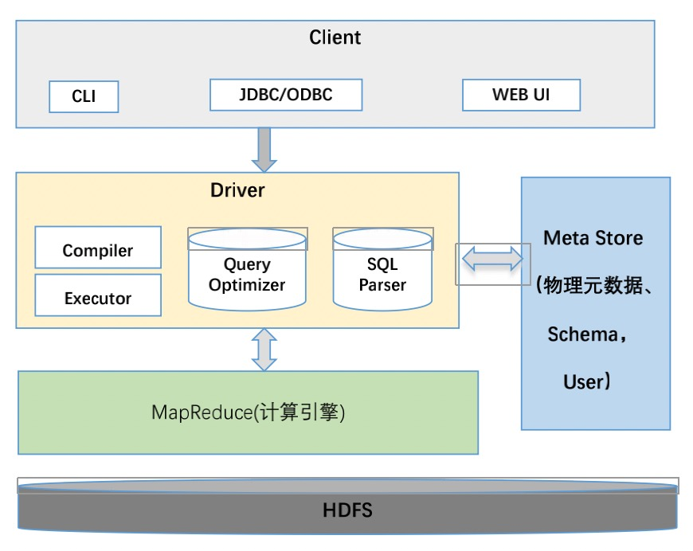
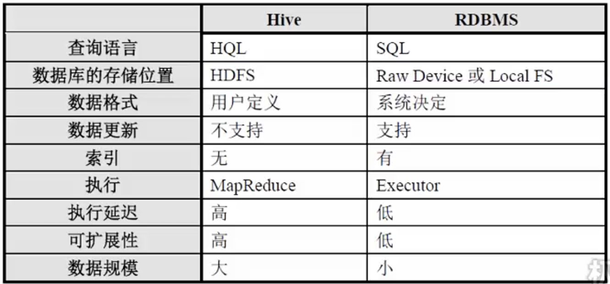

### 大数据
1. 认识：是概念也是技术，是以hadoop为代表的大数据平台框架上进行数据分析的技术。pc->云计算->大数据，因为一台机器无法处理了
   - hadoop和spark的基础大数据框架
   - 实时数据处理、离线数据处理、数据分析、日志分析、数据挖掘、机器算法预测分析
1. 学习要点
   - 概念和定位
   - 架构系统、设计模型、实现大概原理
   - 简单使用
### Hadoop
1. 认识：开源的大数据框架，分布式计算的解决方案。子项目有hive、hbase等
1. 组成
   - HDFS
   - MapReduce
   - Zookeeper
1. HDFS
   - 认识：分布式文件系统，是基础，是GFS的开源实现
     1. 管理千百台机器，用起来跟本地一样，简单便捷的文件获取
     1. 支持流式数据访问(不能改，改需要删了块重新写)，一次写入，多次读取最高效
     1. 支持TB、PB为单位的大量数据存储，有副本策略，可构建在廉价机器上，有容错和恢复机制
     1. 不适合大量小文件存储(NameNode压力高)，不支持并发写入同一文件，不支持文件随机修改，不支持随机读、不支持低延时方式
     1. 适合一次写入多次读取，顺序读写
   - 组成
     1. Block：数据块，抽象概念，屏蔽了文件的概念，简化了存储设计，按照块分开存储，非整个文件存储，默认64M，一般128M，备份3个，在两个机架的三个节点
     1. NameNode：管理节点，管理文件系统的命名空间，存放文件元数据，维护所有文件和目录，文件和数据块的映射
        - Secondary NameNode：热备节点
     1. DataNode：工作节点，存储并检索数据块，同时心跳向NameNode更新存储块的列表
   - 流程
     1. 读：client->NameNode读请求->找出最近的DataNode节点信息->client从DataNode分块下载文件
     1. 写：client->NameNode写请求->告诉client可写入的Datanode->client写入DataNode节点->DataNode自动完成副本备份，向NameNode汇报存储完成->通知client完成
1. MapReduce
   - 认识：并行处理框架，实现任务分解和调度。分而治之，大任务分为子任务(map)，并行执行后，将计算结果合并到一处(reduce)，最终得到结果
   - 组成
     1. Yarn：Hadoop2以后的资源管理器，负责整个集群MapReduce管理和调度，可扩展和可靠性、资源利用率更好，支持多种计算框架，如离线批处理、内存计算、迭代计算、流式计算，是主从架构，可实现ha
        - ResourceManager：分配和调度资源，启动并监控ApplicationMaster，监控NodeManager
        - ApplicationMaster：为MapReduce申请资源，分配给内部任务，负责数据切分，监控任务的执行和容错
        - NodeManager：管理单个节点的资源，处理以上的命令
   - 体系结构
     1. 数据分片
     1. job执行，jobTracker：一个job分为多个两类task，负责调度、任务分配、进度监控
        - map taskTracker
        - reduce taskTracker
     1. 中间结果
     1. reduce：根据映射规则交换中间结果数据，并进行reduce
     1. hdfs输出结果
   - 特性
     1. 容错机制：失败重复执行，推测执行(再找个做同样事情，谁完事谁算，不会导致某个task效率低)
   - 开发
     1. 编写java源代码，包含mapper类和reduce类
     1. 编译打包后提交到hadoop运行
1. HBase
   - 认识：面向列、高可靠、高性能、可伸缩、实时读写的分布式非关系型数据库，利用hdfs作为文件存储系统，支持mr程序读取数据，可以存储非结构化、半结构化、结构化数据，可以存储大量小文件。适合非结构化数据存储的数据库，随机访问，实时读取
     1. 海量存储：可上百亿行*上百万列，横向和纵向都有很大弹性，只有数量大了才能发挥作用
     1. 准实时查询：基于大量数据的百毫秒的查询
     1. 面向列：面向列簇的存储和权限控制，支持独立检索，可动态决定行有哪些列，减少数据量
     1. 多版本：每列数据可以有多版本
     1. 稀疏性：空列不占用空间，表很稀疏
     1. 扩展性：底层依赖hdfs，hdfs也有备份
     1. 高可靠性：WAL机制保证数据写入不会因集群异常而写入丢失，Replication保证集群出现严重问题数据不丢失损坏
     1. 高性能：底层的LSM数据结构和RowKey有序排列使得高写入性能，region切分、主键索引和缓存机制具备随机读取性能，这个随机读取性能针对RowKey的查询达到毫秒级别
     1. 支撑离线分析型应用
   - 架构体系：zk->master->多个RegionServer->hdfs
   - 数据模型
     1. Column Family：列簇，多个列的集合，越少越好不超5个否则降低性能
        - 列：数量没有限制但有顺序，只有插入数据才存在，可动态添加，数据自动切分，高性能读写
     1. RowKey：数据唯一标识，按字段排序，不支持条件查询，只支持RowKey查询
     1. TimeStamp：支持多版本数据同时存在
   - 使用
     1. 表结构模型：不需要指定列，只需要指定列簇即多个列
     1. 数据结构模型：RowKey即主键，TimeStamp版本号，还有列簇的数据填充
     1. hbase shell
        - create/drop
        - list/describe
        - scan/get/put/delete/count/truncate
        - enable/disable
        - is_enabled/is_disabled
1. Hive
   - 认识：提供大量结构化数据检索、基于hadoop的数据仓库工具，实现了sql基本操作，利用熟悉的sql为简化编写mapReduce而生，适合统计分析
     1. 基于hdfs，可以存储、查询、分析存储在HDFS中的大规模数据，表就是hdfs的目录/文件
     1. HQL：支持类sql查询，SQL Parser将用户SQL进行解析，写sql就可以执行hadoop任务，降低使用门槛。是sql解析引擎，将sql转换为mr job在hadoop中执行，sql查询，mapReduce计算
     1. Compiler将HiveQL转换Executor
        - Executor是最小处理单元
        - 每个Executor代表HDFS的一个操作或一道MapReduce作业
     1.  可用于数据提取转化加载ETL
     1. 计算引擎可支持Spark替代MapReduce
   - 优势
     1. 操作接口采用类sql语法，容易上手，避免了去写mapreduce，减少开发人员的学习成本
     1. hive适合处理大数据分析场景，对于处理小数据没有优势，因为hive的延迟比较高
     1. hive支持自定义函数 ，用户可以根据需求来实现自己的函数
   - 劣势
     1. hive的执行延迟比较高，因此hive常用于离线数据分析，对实时性要求不高的场合
     1. hive的调优比较困难、粒度较粗
     1. hive在数据挖掘算法函数支持不够好
   - 组成：
     1. MetaStore：元数据，存储在mysql等中，包括表名、表列、表分区、表属性、表目录
   - 执行过程：解释器、编译器、优化器，完成语法分析、词法分析、编译、优化、查询计划的生成，生成查询计划存储在hdfs中，随后由MapReduce执行
   - 数据类型
     1. tinyint、smallint、int、bigint
     1. float、double
     1. boolean
     1. string
     1. Array
     1. Map
     1. Struct
     1. Data
   - 数据模型
     1. table：内部表
     1. partition：分区表
     1. external table：外部表
     1. bucket table：桶表
     1. 视图
   - 数据仓库：面向主题的、集成的、不可更新的数据集合，用于企业或组织的决策分析处理
   - web管理工具：hue
   - 比较：
1. Zookeeper
   - 认识：开源的分布式协调服务框架，提供一致性服务，如配置、域名、同步。提供了分布式独享锁、选举、队列。google的chubby的实现，Hadoop的正式子项目。最常担任生产者和消费者的注册中心
   - 功能
     1. 文件系统：每个目录是一个znode节点，节点可以存储数据，类型有持久化、持久化顺序、临时、临时顺序。临时节点做ha故障切换
     1. 通知机制：znode节点有变化(数据改变/删除)时，通知客户端
   - 配置：zoo.cfg
1. 运维
   - 安装
     1. JDK
     1. hadoop端口等配置
     1. hdfs地址
     1. 调度器配置
     1. 启动
   - 维护
     1. `hadoop fs -ls/-rm/-put/-get/-cat/-mkdir /`：查看文件系统，删除、上传文件
     1. `hadoop dfsadmin -report`：文件系统状态，占用空间等
     1. `hdfs dfs -ls /`：查看根目录
        - -mkdir：创建文件夹
        - -copyFromLocal/copyTolocal：hdfs和本地文件交互
        - -get/put
     1. `hadoop jar xx.jar input output`：提交jar包，并执行
1. wiki
   - 历史
     1. 0.25
     1. 1.x
     1. 2.x
   - Hadoop生态圈
     1. Hadoop
     1. Spark
     1. Storm
     1. Flume
     1. Zookeeper
     1. HBase
     1. Hive
     1. Oozie
     1. Mahout
     1. Pig
     1. Hue
     1. Avro
     1. Bigtop
     1. HCatalog
     1. Ambari
     1. Sqoop
     1. Giraph
### Spark
1. Spark
   - 认识：基于内存的大数据并行计算框架，是主流的方案，是替代MapReduce的方案，兼容hdfs、hive、mysql等数据源，比较快。是Scale写的，运行在JVM上
     1. RDD：弹性分布式数据集，分布式内存存储数据结构
     1. 基于事件驱动，通过线程池复用提高性能
   - 组件
     1. Spark Core：任务调度、内存管理、容错机制，定义RDD
     1. Spark SQL：做报表统计，是分布式sql引擎
     1. Spark Streaming：实时数据流，类似storm，用于在kafka接受数据做实时统计
     1. Mlib：通用机器学习包，包含分类、聚类、回归，模型评估、数据导入，支持集群横向扩展
     1. Graphx：处理图的并行计算
     1. Cluster Managers：集群管理
   - 积累
     1. 用起来：目前spark sql、pyspark、struct streaming都比较易用，在自己的业务场景先用起来，再逐步的优化
     1. 视野及场景提高：可以关注类似spark submit、中国数据库技术大会、hbase中国社区相关的 topic，看看其他公司都怎么使用的；另外需要关注spark和其他组件的配合使用，类似hbase、mongo、solr等
     1. spark本身原理：可以关注spark每个版本的release note、hbase中国社区的相关问答。另外推荐几个比较好的原理博客
        - https://github.com/JerryLead/SparkInternals
        - https://github.com/jaceklaskowski/mastering-spark-sql-book
        - https://github.com/jaceklaskowski/spark-structured-streaming-book
   - 历史
     1. 09年诞生，加州大学伯克利分校的研究项目，最初基于mapReduce
     1. 10年开源
     1. 11年开发高级组件，如Spark Streaming
     1. 13年转移到apache下，成为顶级项目
   - 实战
     1. spark sql分析nginx日志
        - 日志收集：两级flume将nginx日志收集到hdfs中
        - spark生成parquet导入hive
        - spark sql分析后导入mysql
1. Storm
   - 认识：twitter开源的类似hadoop(架构比较像而已)的实时流式计算框架，解决hadoop不能实时处理的问题，应用于实时推荐/网站统计/监控预警
     1. 适用场景广泛：实时处理和更新，持续并行化查询
     1. 可伸缩性高：加机器提高并行度即可
     1. 异常健壮：集群易管理，可轮流重启节点
     1. 容错性好
   - 架构类型
     1. 主从：简单高效，主节点存在单点问题
     1. 对称：复杂，无单点问题，如zk
   - 组件
     1. Mimbus：对应多个zk，zk对应多个supervisor
     1. zk：分配任务和心跳
     1. supervisor
     1. worker
1. Flink
1. Beam
1. 应用
   - apache三大分布式计算：Hadoop、Spark、Storm
     1. Hadoop：离线处理、时效性要求不高
     1. Spark：时效要求高
   - zk服务
   - Sqoop数据库抽取工具
   - Flume日志抽取工具
   - DataFrame组件