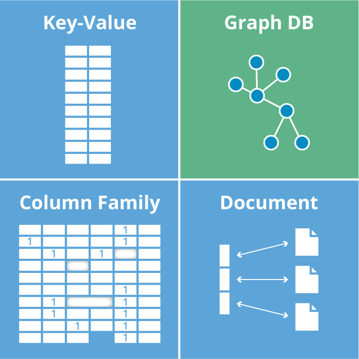
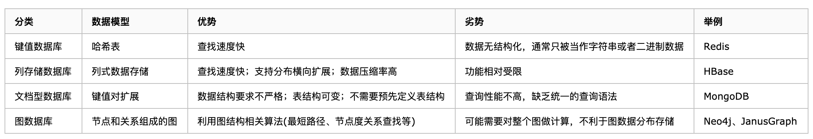
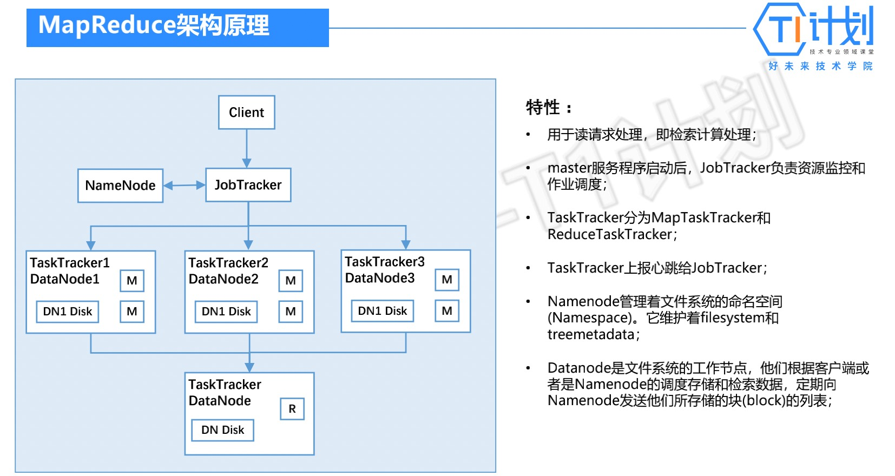
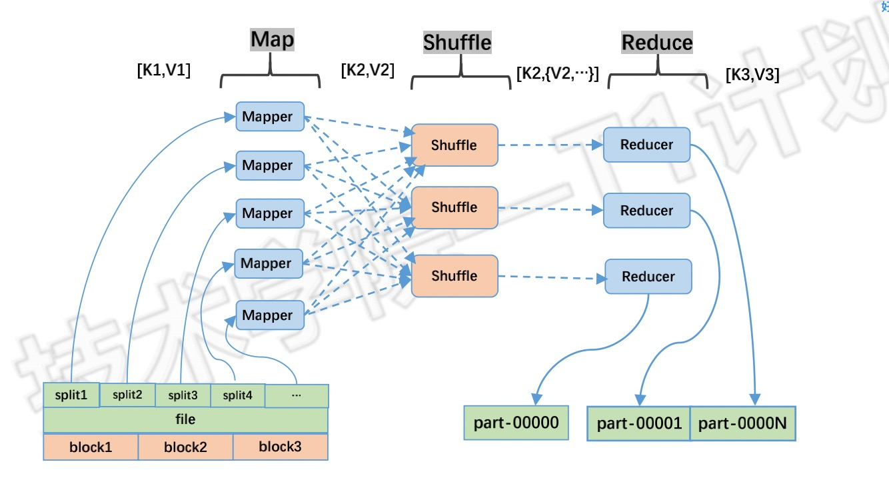

### 基础
1. ACID
   - A：Atomicity，原子性，所有操作要么全部做完，要么都不做
   - C：Consistency，一致性，数据在任何时候都要保证一致
   - I：Isolation，独立性，并发的事务之间不会互相影响
   - D：Durability，持久性，一旦事务提交后，它所做的修改将会永久保存
1. BASE方案
   - 认识：牺牲某时刻一致性保证最终一致性，对cap的延伸
     1. Basically Available：基本可用，保证核心可用
     1. Soft State：软状态，允许系统存在中间状态，不是最终态
     1. Eventually Consistent：最终一致，经过一定时间后，最终能够达到一致的状态
1. CAP
   - 认识：对于一个分布式计算系统来说，不可能同时满足以下三点，又叫布鲁尔定理。网络分区发生时，一致性和可用性两难全
     1. Consistency：一致性，所有节点在同一时间具有相同的数据
     1. Availability：可用性，保证每个请求不管成功或者失败都有响应
     1. Partition tolerance：分区容错性，系统中任意信息的丢失或失败不会影响系统的继续运作
   - 根据CAP原理，对NoSQL进行分类
     1. CA：单点集群，满足一致性，可用性的系统，通常在可扩展性上不太强大，如RDBMS
     1. CP：满足一致性，分区容忍性的系统，通常性能不是特别高，如MongoDB、Redis、HBase
     1. AP：满足可用性，分区容忍性的系统，通常可能对一致性要求低一些，如CouchDB
1. 一致性模型
   - 强一致性
     1. 认识：时时刻刻同步
   - 单调读
     1. 场景：用户从某从库查询到了一条记录，再次刷新后发现此记录不见了，就像遇到时光倒流。如果用户从不同从库进行多次读取，就可能发生这种情况
     1. 解决方案：即如果先前读取到较新的数据，后续读取不会得到更旧的数据。单调读比强一致性更弱，比最终一致性更强
     1. 实现
        - 确保每个用户总是从同一个节点进行读取(不同的用户可以从不同的节点读取)，如基于用户ID哈希来选择节点
   - 弱一致性
     1. 认识：如主库写入成功，不等待从库响应，直接返回“更新成功”，则复制是异步的，即弱一致性
     1. 实践中通常使一个从库是同步的，其他是异步的。如果同步从库出问题则使另一个异步从库同步。可确保永远有两个节点拥有完整数据：主库和同步从库。这种配置称为半同步
   - 最终一致性
     1. 认识：当用户从异步从库读取时，如果此异步从库落后，他可能会看到过时的信息。这种不一致只是一个暂时的状态，如果等待一段时间，从库最终会赶上并与主库保持一致。这称为最终一致性，可能几分之一秒，也可能几小时
   - 读写一致性
     1. 认识：也称为读己之写一致性，刚提交的数据可能尚未到达从库，但是需要立即读取到，如回复帖子立即看到
     1. 实现方案
        - 某些特定的内容，都从主库读，如查看自己的主页，适用于少部分数据用户可能编辑
        - 也可记录每个用户最后一次写入主库的时间，一分钟内都从主库读，同时监控从库的最后同步时间，任何超过一分钟没有更新的从库不响应查询
        - 客户端可在本地记住最近一次写入的时间戳，发起请求时带着此时间戳。从库提供任何查询服务前，需确保该时间戳前的变更都已经同步到了本从库中。如果不够新，则可以从另一个从库读，或者等待从库追赶上来
   - 因果一致性
     1. 场景：不同数据分片/分区，因为同步延迟，查询可能先看到回答，再看到问题
     1. 解决方案：即如果一系列写入按某个逻辑顺序发生，那么任何人读取这些写入时，会看见它们以正确的逻辑顺序出现
     1. 实现
        - 应用保证将问题和对应的回答写入相同的分区，但并不是所有的数据都能如此轻易地判断因果依赖关系
        - 向量时钟
1. RDBMS：关系数据库管理系统
1. 数据库
   - 
   - 
1. NoSql分类：按照存储方式
   - 键值
     1. 最终一致性：Cassandra
     1. 内存：Redis、Memcache
     1. 持久化：BigTable、LevelDB
   - 文档：MongoDB、CouchDB、SimpleDB，类json格式存储，内容是文档型的，可对字段建立索引实现关系数据库的某些功能
   - 列：Hbase、Cassandra、Hypertable
     1. 方便存储结构化和半结构化数据
     1. 列查询有IO优势
   - 对象：db4o、Versant
   - 图：Neo4J
   - 时序
1. 数据库和数据仓库的区别
1. 场景适用
   - mysql适合结构化数据，类似excel表格一样定义严格的数据，用于数据量中，速度一般支持事务处理场合，适合TB，GB级别的
   - redis适合缓存内存对象，如缓存队列，用于数据量小，速度快不支持事务处理高并发场合
   - mongodb，适合半结构化数据，如文本信息，用于数据量大，速度较快不支持事务处理场合
   - hadoop是个生态系统，上面有大数据分析很多组件，适合事后大数据分析任务
   - spark类似hadoop，偏向于内存计算，流计算，适合实时半实时大数据分析任务
1. 数据库
   - db2
     1. 认识：ibm的关系型的适用于大型应用系统的数据库，支持标准sql，69年发布，13年V10.5，上世纪老怪物了
        - ibm主机体系：大型机、小型机
   - Apache IoTDB
     1. 时间序列数据收集、存储与分析一体化的数据管理引擎。体量轻、性能高、易使用的特点，完美对接 Hadoop 与 Spark 生态。适用于工业物联网应用中海量时间序列数据高速写入和复杂分析查询的需求
### 索引
1. 数据结构
   - hash
   - LSM-Tree：LevelDB/RocksDB、MongoDB WiredTiger、HBase、Cassandra
     1. 快速高效率的写入，配合压缩算法
   - B+-Tree：MySQL InnoDB、Oracle、SQLite、SoltDB、各类磁盘文件系统
     1. 范围查找等，读写能力比较平衡
### 事务
1. 事务
   - 认识：保证一致性
   - 特性：ACID
     1. 原子性：a，一个事务是一个整体，要么全部成功，要么全部失败
     1. 一致性：c，有非法数据(外键约束等)，事务撤回，数据库总是从一个一致性状态转换到另一个一致状态，如唯一索引字段回滚后不能有重复键
     1. 隔离性：i，一个事务的修改最终提交前对其他事务不可见
     1. 持久性：d，一旦事务提交，则其所做的修改就会永久保存到数据库中。此时即使系统崩溃，修改的数据也不会丢失
   - 分类
     1. 扁平事务：所有操作同一层次，最简单。commit--修改过的数据块写入事务文件--一次性地写入数据库文件--如果commit挂掉--重启--再次执行事务文件--删除事务文件
        - 带保存点的：防止全部回滚成本太高
     1. 链事务：将上下文隐式传给下一个事务，提高事务和开始下一个事务操作是一个原子操作，即下一个可以看到上一个的结果，好像在一个事务中。和带保存点的不同点是操作主体的不同，一个事务内，一个事务间
     1. 嵌套事务：树状结构，可以控制子事务是否保留、回滚。innodb不支持这个，其他都支持
     1. 分布式事务
   - 问题
     1. 读的顺序：mysql的trx_id类似时间戳
     1. 故障恢复：未完全恢复的时候，依然不能被外部看到
     1. 死锁：使用轻量级锁、死锁检测(性能高成本低)、等锁超时(超长事务不可能)
1. 分布式事务
   - 认识：多个独立事务资源参与到一个全局的事务中
     1. 只能实现弱一致性
   - 实现方式
     1. XA事务
        - 认识：强一致性，带头大哥先问问ok不，再判断是否全部ok
        - 特点
          1. 允许不同数据库参与
          1. innodb的隔离级别必须为serializable
        - 组成
          1. 事务管理者：协调者，负责管理所有的资源管理器，操作他们的状态，让他们预备、就绪、提交、回滚等操作配合完成分布式事务。可以是一个客户端，一般是编程语言，如JTA
          1. 资源管理器：参与者，就是数据库
          1. 应用程序
        - 2PC流程：Two-Phase Commit 二阶段提交，简单没人用
          1. 流程
             - 第一阶段：所有参与者prepare，并通知是否准备好提交，参与者hold住自己的资源
             - 第二阶段：所有参与者都要成功，然后通知参与者是rollback还是commit，完成资源释放
          1. 特点
             - 性能：所有参与者都同步阻塞
             - 可靠性：协调者出问题全部歇菜
             - 数据一致性：局部网络问题，参与者之间数据不一致
        - 3PC流程：Three-Phase Commit 三阶段提交，加入超时机制，二阶段增加pre-commit
          1. 流程
             - 第二阶段：发出pre-commit，参与者将undo和redo写入事务日志，不提交，超时或者得不到所有的ack，就about退出
             - 第三阶段：发出do-commit，超时或者不是所有的ack，发出about退出，参与者使用undo回滚。参与者收不到消息还是会commit
          1. 特点
             - 降低了阻塞范围，避免了协调者单点问题
             - 数据不一致依然存在，因为参与者无法通信还是会commit和别人不一样
     1. TCC
        - 认识：Try-Confirm-Cancel，最终一致性，业务逻辑发起，失败了也有cancel确保结果撤销，业务逻辑主导
        - 组成
          1. try：预处理，业务检查及资源预留，要保证一定能confirm
          1. confirm：确认，做业务确认操作，confirm和cancel需要保持幂等性
          1. cancel：撤销，回滚
        - 流程
          1. TM发起所有的分支事务的try，任何一个try失败，TM发起所有的cancel操作
          1. 若try操作全部成功，TM发起所有分支事务的confirm操作
          1. Confirm/Cancel操作若执行失败，TM会进行重试
        - 特点
          1. 性能提升，具体业务实现，锁粒度小
          1. 数据最终一致性：由于幂等性，可以保证事务最终确认或取消
          1. 可靠性：解决xa的单点故障，由集群式的主业务方发起并控制整个业务活动
          1. 缺点：需要按照具体业务实现，开发成本大
     1. 本地消息表
        - 认识：最终一致性，在事务主动发起方额外新建事务消息表，本地事务中记录处理业务和事务消息，避免业务成功，消息失败的问题。还是由业务逻辑主导
          1. 各个操作需要支持幂等
          1. 本地事务日志存储支持：redis,mogondb,zookeeper,file,mysql
        - 特点
          1. 弱化对mq的依赖
          1. 具体业务绑定，需要维护消息数据，成本高
     1. mq事务
        - 认识：将本地消息表基于mq内部，其他和本地消息表一致
          1. 一次消息发送需要两次网络请求(half + commit/rollback) ，mq提供2pc的提交接口
          1. 业务处理服务需要实现消息状态回查接口
          1. 消息中间件支持：jms(activimq),amqp(rabbitmq),kafka,roceketmq
        - 特点
          1. 消息数据独立存储，吞吐量更好，降低耦合
        - 流程
          1. 发送方发送half消息
          1. mq将消息持久化成功之后，向发送方ack确认消息已经发送成功
          1. 发送方开始执行本地事务逻辑
          1. 发送方根据本地事务执行结果向 mq提交二次确认（commit 或是 rollback）
          1. mq收到 commit 状态则将半消息标记为可投递，订阅方最终将收到该消息；mq收到 rollback 状态则删除半消息，订阅方将不会接受该消息
          1. 发送异常
             - mq对该消息发起消息回查
             - 发送方收到消息回查后，需要检查对应消息的本地事务执行的最终结果
             - 发送方根据检查得到的本地事务的最终状态再次提交二次确认
             - mq基于 commit/rollback 对消息进行投递或者删除
          1. 事务被动方基于mq返回处理结果
          1. 接收异常
             - 如果事务被动方消费消息异常，需要不断重试，业务处理逻辑需要保证幂等
             - 如果是事务被动方业务上的处理失败，可以通过mq通知事务主动方进行补偿或者事务回滚
        - 基于消息中间件的解决分布式事务框架：https://github.com/yu199195/myth
     1. saga事务：不能保证隔离性
     1. rpc框架支持：dubbo(可用Fescar保持数据一致性),motan,springcloud
### 分布式存储引擎
1. 分布式存储分类
   - 分布式文件系统：数据多节点存储，以透明的方式对文件进行管理和存取。有HDFS、Ceph、GFS
     1. 中间控制节点架构，HDFS
     1. 完全无中心架构，计算模式ceph，一致性哈希Swift
   - 分布式KV存储：存储关系简单的半结构化数据；通过某种机制将key进行分节点存储；可用于分享配置、缓存和服务发现。有ETCD、Redis，CloudKV
   - 分布式存储引擎：基于分布式文件存储系统和分布式数据处理计算，实现数据的分布式查询分析及更新；有：Hive、Hbase、ElasticSearch、ClickHouse、TiDB、Dremel、Druid
1. 发展
   - oldSql
     1. 特点：行存储、列存储、SMP
     1. 代表：oracle、mysql、postgre
   - noSql：not only sql
     1. 特点：kv/index、mapReduce、MPP
     1. 代表：Hbase、Redis、MangoDB、ElasticSearch、Dremel
   - newSql：sql + noSql
     1. 特点：关系型、列存储、MPP
     1. 代表：Spanner/F1、TiDB、TDSQL、Greenplum
1. 分类
   - 分析型/事务型
     1. OLTP：联机事务处理，逻辑处理
     1. OLAP：联机分析处理，数据分析
     1. HATP(OLAP&OLTP)
   - 数据模型
     1. Relation
     1. K-V
     1. Document
     1. Gragh
     1. TimeSeries
   - 响应时效性
     1. 实时
     1. 近实时
     1. 离线
1. 存储引擎架构
   - 逻辑架构：从上到下，中间三个左中右
     1. 对外协议及接口
     1. 元数据管理
     1. 引擎处理框架
     1. 系统协调服务
     1. HDFS
   - 处理架构
     1. Master-Slave
        - 应用：Hbase、Druid、TiDB
        - 组成
          1. master：masterNode、masterManager
          1. slave n：slaveNode、TaskWorker
        - 特点
          1. Master作为总体的调度者，负责向slave分配任务
          1. WorkManager统一管理和调度TaskWorker的执行计划
          1. Master可以为Multi-Master
          1. 数据分布在SlaveNode上
          1. Slave扩展能力强，通用的分布式并行计算框架
     1. MapReduce
        - 原理图
          1. 
          1. 
        - 特点
          1. 由于MR过程耗时长，适合 PB 级以上海量数据的离线处理分析 ，不适合在线使用场景
          1. 成本低，可以采用廉价的PC机器部署运行
          1. 良好的扩展性：当计算资源不能得到满足时，可通过增加机器来扩展它的计算能力
          1. 高容错性：当其中一台机器挂了，它可以把上面的计算任务可自动转移到另外一个节点上面上运行
        - 应用：Hive
     1. MPP
        - 认识：Massively Parallel Processing，大规模并行处理
          1. 完全并行的MPP + Shared Nothing(不共享硬件，只通过网络沟通)的分布式扁平架构，无Master
          1. 单个节点完全是独立的，不存在单点瓶颈
          1. 业务数据根据数据库模型和应用特点划分到各个节点 上，节点间网络通信，协同计算
          1. 数据加载高效
          1. 行列混合存储，对多维度查询计算支持高效
        - 应用：Dremel、Drill、 ElasticSearch
     1. 主主同步：数据修改冲突需要用户处理，是最终一致性，没人用，如Dynamo的Vector Clock的设计
   - 数据更新方式
     1. 读写分离，数据文件存储和异步加载：70%
     1. 通过version记录更新：20%
     1. 通过事务型操作，直接更新原数据：10%
   - 数据一致性实现
     1. 分布式数据引擎大部分只能满足CAP原理中两点
     1. 分布式数据引擎在一致性上能做到最终一致或者强一致
     1. 一致性与多副本需要协同机制
   - 对外数据接口
     1. JDBC/ODBC
        - ODBC：Open Database Connectivity，开放数据库连接
     1. Restful API 
     1. Thrift
     1. 封装为mysql类型的访问协议，SQL标准化 
     1. 自带客户端类型的SQL协议接口
1. 原理和使用技巧
### 时序数据库
1. Influxdb
   - 认识：流行，监控、lot领域常见，go开发。分布式版本已闭源
     1. 内置http支持
     1. 类sql的灵活查询
   - 组成
     1. database：库
     1. measurement：表
     1. points：一行数据
        - tags：有索引的属性
        - fields：记录的值
        - time：数据记录的时间戳，也是自动生成的主索引
1. Druid
   - 认识：LOAP，融合了实时在线数据分析，全文检索系统和时间序列系统的特点
1. 比较
   - 小而精，性能高，数据量较小(亿级): InfluxDB
   - 简单，数据量不大（千万级），有联合查询、关系型数据库基础：timescales
   - 数据量较大，大数据服务基础，分布式集群需求： opentsdb、KairosDB
   - 分布式集群需求，olap实时在线分析，资源较充足：druid
   - 性能极致追求，数据冷热差异大：Beringei
   - 兼顾检索加载，分布式聚合计算： elsaticsearch
### 图数据库
1. 认识：Graph DB，以图这种数据结构存储和查询数据，专业处理关系的数据库，无论多复杂的关系，查询速度都非常快
1. 组成
   - 节点
     1. 属性：键值对
     1. 标签：用于将节点分组
        - 对标签进行索引以加速在图中查找节点
   - 关系
     1. 连接两个节点、是方向性的
     1. 可以有多个甚至递归的关系
     1. 属性：键值对
   - Cypher：Neo4j的图形查询语言，允许用户存储和检索图形数据库中的数据
1. 代表
   - Neo4J：java开发、开源，07年第一版
     1. Neo4J支持ACID，集群、备份和故障转移
     1. 企业版支持主从复制、读写分离、可视化管理工具
   - JanusGraph：开源、分布式，由TitanDB修改而来，2012年开始开发
### TiDB
1. 结合了传统的 RDBMS 和 NoSQL 的最佳特性，兼容 MySQL 协议，支持无限的水平扩展，具备强一致性和高可用性
   - 高度兼容 MySQL，大多数情况下无需修改代码即可从 MySQL 轻松迁移至 TiDB，即使已经分库分表的 MySQL 集群亦可通过 TiDB 提供的迁移工具进行实时迁移
   - 水平弹性扩展，通过简单地增加新节点即可实现 TiDB 的水平扩展，按需扩展吞吐或存储，轻松应对高并发、海量数据场景
   - 分布式事务，TiDB 100% 支持标准的 ACID 事务
   - 真正金融级高可用，相比于传统主从（M-S）复制方案，基于 Raft 的多数派选举协议可以提供金融级的 100% 数据强一致性保证，且在不丢失大多数副本的前提下，可以实现故障的自动恢复（auto-failover），无需人工介入
### wiki
1. sql历史
   - Oracle
     1. 不开源，传奇的公司，传奇的大老板，连续12年每年销售额翻一番。
     1. 诞生早、结构严谨、高可用、高性能，著作权归作者所有。大杀四方：金融、通信、能源、运输、零售、制造等各个行业的大型公司基本都是用了Oracle。Oracle的应用，主要在传统行业的数据化业务中，比如：银行、金融这样的对可用性、健壮性、安全性、实时性要求极高的业务；零售、物流这样对海量数据存储分析要求很高的业务。此外，高新制造业如芯片厂也基本都离不开Oracle；电商也有很多使用者，如京东（正在投奔Oracle）、阿里巴巴（计划去Oracle化）。而且由于Oracle对复杂计算、统计分析的强大支持，在互联网数据分析、数据挖掘方面的应用也越来越多。一个典型场景是这样的：某电信公司（非国内）下属某分公司的数据中心，有4台Oracle Sun的大型服务器用来安装Solaris操作系统和Oracle并提供计算服务，3台Sun Storage磁盘阵列来提供Oracle数据存储，12台IBM小型机，一台Oracle Exadata服务器，一台500T的磁带机用来存储历史数据，San连接内网，使用Tuxedo中间件来保证扩展性和无损迁移。建立支持高并发的Oracle数据库，通过OLTP系统用来对海量数据实时处理、操作，建立高运算量的Oracle数据仓库，用OLAP系统用来分析营收数据及提供自动报表。总预算约750万美金。
   - MySQL：开源，原则上开源、简便易用、面向互联网开发。基本上，互联网的爆发成就了MySQL，LAMP架构风靡天下。使用、开发最不方便，运维不方便。MYSQL只是组件没Oracle那么多而已，性能上面差点，但是免费。MySQL的可定制(自由度)、集群部署便宜被大企业使用，高手小树枝也可以打败敌人。MySQL基本是生于互联网，长于互联网。其应用实例也大都集中于互联网方向，MySQL的高并发存取能力并不比大型数据库差，同时价格便宜，安装使用简便快捷，深受广大互联网公司的喜爱。并且由于MySQL的开源特性，针对一些对数据库有特别要求的应用，可以通过修改代码来实现定向优化，例如SNS、LBS等互联网业务。一个典型的应用场景是：某互联网公司，成立之初，仅有PC数台，通过LAMP架构迅速搭起网站框架。随着业务扩张、市场扩大，迅速发展成为6台Dell小型机的中型网站。现在花了三年，终于成为垂直领域的最大网站，计划中的数据中心，拥有Dell机架式服务器40台，总预算20万美金。
   - SQL Server：不开源，为IBM公司的OS/2操作系统开发。分Microsoft SQL Server、Sybase SQL Server
可以提供全套的Microsoft服务
   - 架构：Oracle根据二进制后的文件功能行进行划分，各种优化;MySQL有软肋、支持极简单的HINT;SQL Server纵向划分，逐层解析
   - 大型数据库：海量数据、高吞吐量；复杂逻辑、高计算量，以及高可用性。Oracle，DB2比较典型
