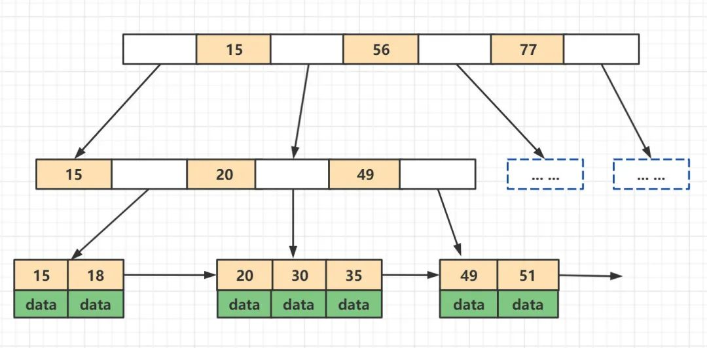
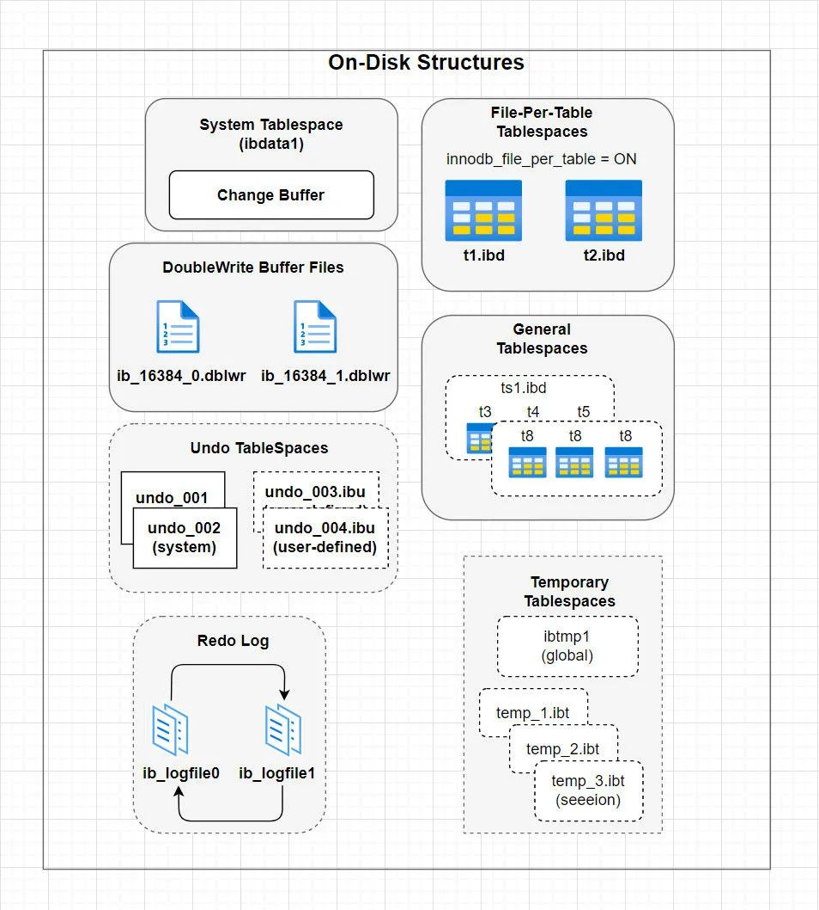
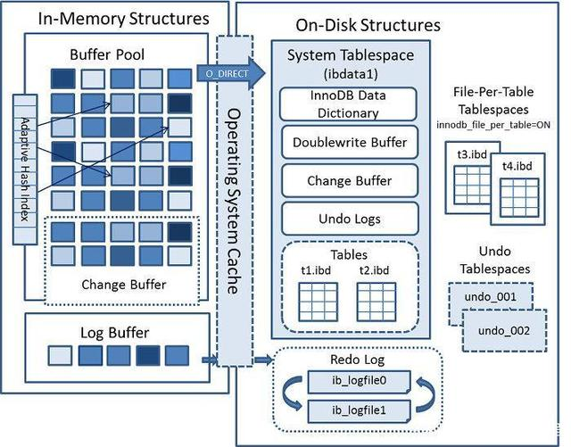
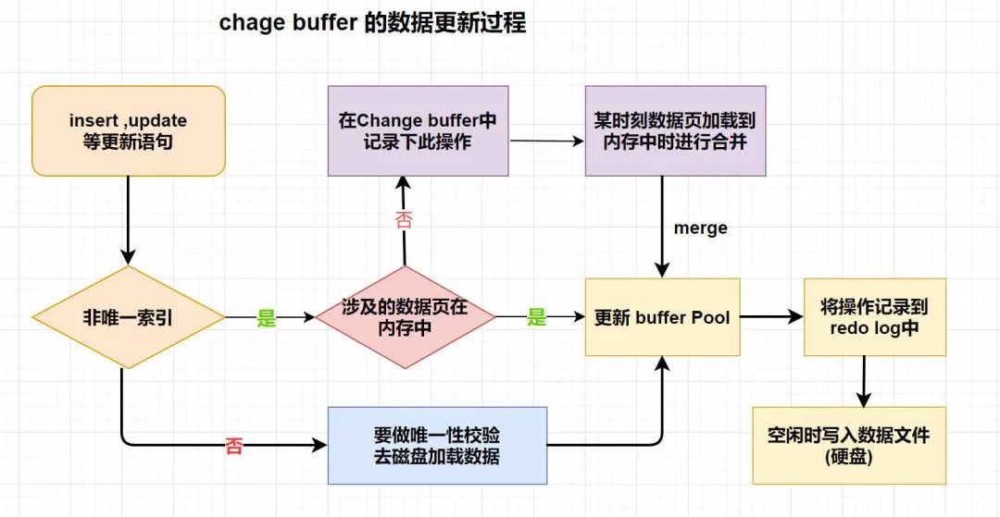

### mysql
1. 认识：单进程多线程，插件式的表存储引擎
   - 数据多了，性能下降不是线性的
   - 可靠性指的是自身的可靠，只保证自己可靠，注意区分出事节点，明确问题的归属
   - 数据库的性能很大程度上取决于其存储子系统的iops能力
1. 架构：在server层进行连接管理、查询缓存、语法解析、查询优化等操作，在存储引擎层执行具体的数据存取操作
   - 服务层：————负责跨存储引擎功能的实现，如存储过程、触发器、视图
     1. 连接器：————管理连接、连接权限验证，用户权限信息放在一个变量中以供后续使用，长连接多了容易内存爆满
     1. 查询缓存：————8.0已删除，命中率非常低，表更新会使所有查询缓存清空
     1. 分析器：————词法语法分析，之后进行precheck权限检查
     1. 优化器：————生成执行计划，选择索引
        - 决定使用哪个索引
        - join时决定表的连接顺序
        - 有些查询条件因为不能执行真正的查询，只能靠猜(condition filtering v5.7)影响的条数。这个猜不是胡乱猜，而是采用启发式规则(根据以往经验指定的一些规则)。如有n个表进行连接，MySQL查询优化器要每一种连接顺序的成本都计算一遍么，即n!种连接顺序，不过mysql用了很多办法减少计算非常多种连接顺序的成本的方法
          1. 提前结束某种顺序的成本评估：会维护一个全局的当前最小的连接查询成本的变量，如分析时已经超过这个，就直接停止了。如计算连接顺序BCA时，发现B和C的连接成本就已经大于10.0时，就不再继续往后分析BCA这个连接顺序的成本了
          1. 系统变量optimizer_search_depth：为了防止无穷无尽的分析各种连接顺序的成本，如果连接表的个数小于该值就穷举
          1. 启发式规则：凡是不满足这些规则的连接顺序压根儿就不分析，这样可极大减少需要分析的连接顺序的数量，但也可能错失最优的执行计划。使用系统变量optimizer_prune_level来控制到底是不是用这些启发式规则
     1. 执行器：————操作引擎(调用引擎接口)，返回结果，再次检查权限，因为有些只能在执行阶段才能知道具体哪张表，如触发器
   - 存储引擎层：————负责数据存取，插件式
     1. InnoDB
     1. MyISAM
     1. Memory
1. sql执行流程
   - 发送sql到服务器
   - 检查查询缓存是否命中该sql：需要sql一模一样，写频繁会降低查询效率，应该关掉
   - sql解析：语法解析，关键字正确与否、顺序是否正确
   - 预处理：表列名字是否正确
   - 由优化器生成执行计划：选择索引
     1. 生成错误查询执行计划的原因
        - 统计信息不准
        - 成本估算不准，不知道哪些页面在内存/在磁盘，可以顺序读取/随机读取
        - 基于模型而不是最快
        - 不考虑其他并发查询
        - 有时候会基于固定规则
        - 不考虑不受其控制的成本：自定义函数、存储过程等
     1. 优化器可改写优化的sql类型
        - 改变表的关联顺序：会通过统计信息决定表的关联顺序
        - 将外连接转化为内连接：join改为where执行
        - 等价变换：优化效果相同的where条件
        - 优化count、min、max：直接看索引就行
        - 将表达式转化为常数
        - 子查询优化：转为关联查询
        - 提前终止查询
        - 对in()优化：先排序再二分查找，比其他等价为多个or的更快
   - 调用存储引擎api执行
   - 返回结果
1. mysql存储结构
   - 数据文件
     1. .frm：存储表的元数据信息，主要是表结构、视图
     1. .ibd：innoDB data文件，索引和数据在一起
     1. .myd、.myi：myISAM数据文件、索引文件
     1. .index、.0001：binlog文件
   - 物理存储结构
     1. 数据文件
        - 系统表空间：存储系统数据，如information_schema
        - 用户表空间
        - 共享表空间：共用的，`.ibdata1`
        - 独占表空间：表独立存储
          1. `table_name.frm`：存储表结构信息
          1. `table_name.ibd`：存储数据
        - Undo表空间：存储Undo信息
     1. 日志文件
        - ib_logfileN：重做日志文件
   - 日志
     1. binlog：二进制日志，记录所有更改数据的语句，可用于复制，事务提交前只写一次
     1. relaylog：中继日志，从接收的主的日志

     1. slowlog：慢查询日志，执行时间超过long_query_time的查询或不使用索引的查询
     1. errorlog：错误日志，启动、运行、停止遇到的问题，平时要关注，并进行数据库优化
     1. general log：通用查询日志，客户端连接和执行的语句
     1. 引擎日志
   - 系统文件目录
     1. --basedir = /usr
     1. --datadir = /var/lib/mysql，`show global variables like "%datadir%";`
     1. --plugin-dir = /usr/lib64/mysql/plugin
     1. --log-error = /var/log/mysqld.log
     1. --pid-file = /var/run/mysqld/mysqld.pid
     1. --socket = /var/lib/mysql/mysql.sock
1. mysql数据读取机制
   - 不能直接找到行，而是找到该记录所在的页，整页读取，在内存中根据Page Directory进行二叉查找到记录
### 索引
1. 索引
   - 行锁的实现：通过给索引上的索引项加锁来实现
   - 如果内存够，会将表的索引装载到内存中
1. 哈希索引
   - 认识：基于哈希表实现，只有精确匹配的等值查询的索引所有列的查询才有效，不能排序，不能范围查询
     1. 只保存哈希码和指针，而不存储字段值
   - 机制
     1. InnoDB注意到某些索引值被使用得非常频繁时，会在内存中基于B+树索引之上再创建一个哈希索引
1. 索引结构
   - btree：二叉查找树，每个节点只有左右两个子节点，每个节点只存储一个关键字，等于则命中，小于走左节点，大于走右节点，io通过二分查找一级级查向叶子节点
   - b-tree：多路查找树，每个节点可以有n个节点，会存储M/2到M个关键字，在多个数据库中作为最主要的索引类型
     1. 非叶子节点存储关键字范围和指向的子节点id
     1. 所有关键字在整颗树中只出现一次
     1. -只是一个连接符不是减
   - b+tree
     1. 比较
        - b+tree只在叶子节点存放数据行，而btree会在叶子和非叶子结点上都放
        - b+tree的叶子节点互相链表串联，b-tree的叶子节点不需要链表串联
   - b*tree：在b+tree基础上，为非叶子节点也增加链表指针，将节点的最低利用率从1/2提高到2/3
1. B+Tree
   - 结构：Balance tree，平衡树，在b-tree基础上
     1. 所有数据行都只在叶子节点中出现，非叶子节点只存储键值和指针用于查找，即总是到叶子节点才命中
     1. 增加链表将叶子节点串联在一起，是双向链表，方便叶子节点的范围遍历，原理类似跳表
   - 不同引擎的实现
     1. MySIAM：叶子节点存的是指向数据行的指针，主索引和辅助索引在结构上没有区别，只是主索引要求key唯一，辅助索引不要求；数据和索引在不同的文件里
     1. InnoDB
        - 认识：InnoDB页中行是数据的就是叶子节点，是健值和指针的就是非叶子节点
        - 分类
          1. 聚集索引：即主键索引，叶子节点中存储完整的整行数据，InnoDB表数据文件本身就是主键索引，使用索引组织表，索引和记录一起存储在表空间，
          1. 二级索引：保存的是索引列值以及指向主键的指针，需要先查到主键id，再去主键索引获取整行的数据。如高度3的树，需要3+3=6次io
   - 认识
     1. 区间查找：用区间起始值在树中查找直到叶子节点，然后顺着叶子链表往后遍历直到结束值即可
     1. 普通索引和唯一索引在检索效率上基本没有差别，因为只是加了约束，整页在内存中判断时cpu的时间可以忽略不记
     1. 一棵树可以存多少行？总行数 = 根节点指针数 * 单个叶子节点记录条数，如主键id为bigint 8byte，指针大小6byte，单行数据1kb，那么一页能存16384/14=1170个指针，高度为2的树能存放1170*16=18720条，高度为3的2千万行1170*1170*16=21902400
     1. 检索形式
        - 从表空间文件中固定的根页开始
          1. 主键索引b+tree的根页在整个表空间文件中的第3个页开始，根页偏移量为64的地方存放该b+tree的树高度page level
        - 循环使用二分查找法，不停确定下一层的页id，直到找到
   - 原则
     1. 压缩树高度：io次数是查询最大的成本所在，所以减少io次数至关重要：其取决于树高度H
        - 假设当前数据表的数据为N，每个磁盘块的数据项的数量是M，则H=log(M+1)N，N一定M越大H越小，而M=磁盘块大小/数据项大小，磁盘块大小是一个数据页的大小
        - 数据项越小、数据项数量越多，树的高度也就越低，需要的io越少，所以索引字段要尽量的小
        - 真实数据一旦放到内层节点内，磁盘块的数据项会大幅度的下降，导致树层级的增高。当数据项为1时，B+树会退化成线性表
     1. 最左匹配特性：B+树的数据项是复合性数据结构
   - 实操
     1. 查看一张表的根页id
        ```sql
        SELECT
        b.name, a.name, index_id, type, a.space, a.PAGE_NO
        FROM
        information_schema.INNODB_SYS_INDEXES a,
        information_schema.INNODB_SYS_TABLES b
        WHERE
        a.table_id = b.table_id AND a.space <> 0
        and b.name like '%sp_job_log';
        ```
     1. 查看数高度
        - 获取根页id PAGE_NO，如3
        - 计算idb的偏移量：16384 * 3 + 64 = 49216
        - 查看数据：hexdump -s 49216 -n 10  sp_job_log.ibd，如0100，page_level为1，则高度为1+1=2
   - 索引组织表：innoDB的表都有聚集索引，都有主键。InnoDB，MyISAM是分开的
     1. 如果定义了PK，则PK就是聚集索引
     1. 如果表没有定义PK，则第一个非空unique列是聚集索引
     1. 否则，InnoDB会创建一个隐藏的rowid，6byte作为聚集索引
### 基础操作
1. 连接查询：原理如下
   - 嵌套循环连接 Nested Loop Join：基本的连接算法，驱动表的每一行都会搜索被驱动表以找到匹配的行，是一种逐行的搜索过程，可能会非常低效，尤其是当驱动表很大时
   - 连接缓冲区 Join Buffer：为提高嵌套循环连接的效率，MySQL使用叫连接缓冲区的内存区域。会将驱动表的一些行加载到缓冲区中，然后在被驱动表中搜索匹配的行。减少对被驱动表的访问次数，因为可一次性处理多行驱动表数据
   - 块嵌套循环 Block Nested Loop：是一种改进的嵌套循环算法，核心思想是使用连接缓冲区来存储被驱动表中的一块行，然后对驱动表进行一次遍历，以查找与这些行匹配的所有驱动表行。大大减少了磁盘io，因为被驱动表的行不需要为被驱动表的每一行都被重新读取
### 事务
1. ACID实现原理
   - 原子性
     1. undo：撤销所有执行了一部分但尚未提交的操作，反向操作之前记录的数据
     1. 写入原子性：redolog的存储单位是512byte，磁盘扇区大小512byte。只需无缓冲写入磁盘就可保证数据原子写入
   - 一致性：undo
   - 隔离性
     1. 全部顺序
     1. 读写锁
     1. MVCC
   - 持久性
     1. redo：redo日志记录LSN，数据页也记录LSN，数据库启动时，对比两个LSN，会将redo中多出来的写回页中
1. MVCC
   - 认识：Multi-Version Concurrency Control 数据多版本并发控制，一致性数据快照，即非锁定读
     1. mvcc做的事情就是将所有可能读的请求都放在事务开始之前，让你先读到，保证了读写并行、写读并行
     1. 通过保存数据在某个时间点的快照来实现，大多数情况下可以代替行级锁，提供事务开始时相同的数据，不管事务执行的时间有多长
     1. 读取数据时InnoDB几乎不用获得任何锁，每个查询都通过版本检查，只获得自己需要的数据版本，从而大大提高了系统的并发度
     1. 对于支持行锁的事务引擎，进行数据库的并发控制，把数据库的行锁与行的多个版本结合起来，只需很小开销就可实现非锁定读，从而大大提高并发性能
     1. 设定多个隔离级别，分批打碎传统的一致性，做到读写、写读不冲突，极大提升性能，就剩下写写的冲突了
     1. 理想的mvcc无法实现，InnoDB只是借了这个名字提供了读的非阻塞而已，没有实现核心的多版本共存，只是串行化的结果，因为类似乐观锁的特性无法代替二段提交的强一致性
        - 每行数据都存在一个版本，每次数据更新时都更新该版本
        - 修改时Copy出当前版本随意修改，各个事务之间无干扰
        - 保存时比较版本号，如果成功（commit）则覆盖原记录；失败则放弃（rollback）
   - 特点
     1. 针对读多写少场景优化，写多时可能增加系统的成本
     1. 并行度能达到或超过读未提交，而隔离级别很高，跟序列化相差不多
   - 实现
     1. 组成
        - 版本链
          1. 回滚指针：指向这条记录的上一个版本
          1. row_id
          1. trx_id
        - undoLog
        - readView
     1. 原理
        - 写时将数据复制一份，以版本号区分，copy on write
        - 并发读任务可以继续读取旧版本的数据，不至于阻塞
          1. 确定读的顺序：使用逻辑时间戳确定读写顺序，保证时间先后顺序即可，不是真正意义时间的描述，对应物理时间戳
             - SCN(oracle)
             - Trx_id(innodb)：事务id
   - 读的分类
     1. 快照读：一致性读，读可见/历史版本，基本不加锁，如读事务开始时之前的版本，可以确保是已经保存的，或者事务自身修改的
        - 每个查询都通过版本检查，只获得自己需要的数据版本，从而大大提高了系统的并发度
     1. 当前读：读最新版本，加锁
     1. 一致性非锁定读：不同隔离级别决定是否会出现不可重复读
     1. 一致性锁定读
        - for update：x锁
        - lock in share mode：s锁
1. 内部XA事务
   - 认识：最常见的是binlog和redo log二者要求是原子性的，否则导致主从不一致(因为binlog传给从了)，如果redo没做，重启后就再做一次
### 日志
1. 日志
   - 认识：undo是回滚，记录之前的数据，redo是重做，记录将要执行的操作
   - undolog
     1. 认识：回滚日志，用于回滚/撤销事务的更改，会记录修改前的数据、与当前操作相反的操作日志
        - update/delete存放数据旧记录
        - insert记录新数据行的PK(rowid)
   - redolog
     1. 认识：重做日志，存储了事务执行过程的日志，能够重新执行(重做)这些事务中的操作，确保事务的更改能够被恢复执行，保证可靠的事务，innoDB独有
        - 顺序循环写速度快，大小固定，写满后循环记录(不需要对redo进行读取)
        - LSN落后数量阈值检测，超出将脏页写回磁盘，会阻塞用户线程
        - 触发redolog更新的条件有主线程、事务提交等
        - 高可用：至少一个文件组、2个文件，循环2个文件依次写入
          1. 多个镜像文件组会有更高可靠性，有了高可用方案如磁盘阵列可不用
     1. 结构
        - redo_log_type：类型，有几十种
        - space：表空间id
        - page_no：页号
        - redo_log_body：由一个个redolog block组成，数据部分，恢复时需要调用相应函数进行解析
        每个redo log都写入了文件里的一个redo log block里了，一个block最多放496自己的redo log日志
     1. 写入流程：write pos到check point是未刷盘的，追上时推动check point向前移动覆盖来空出位置，
        - 刷盘：根据innodb_flush_log_at_trx_commit确定刷盘策略
        - redolog block：存储redo log的页，大小512byte，等于扇区大小，保证写入必定成功，不需要doublewrite
     1. 组成
        - write pos：当前记录的LSN
        - checkpoint
          1. 认识：已刷盘的LSN，之前的已刷盘，保证checkpoint之前的脏页都刷回磁盘，那么崩溃恢复直接从checkpoint的点开始应用redo即可
          1. 分类
             - sharp checkpoint：保证所有的脏页刷新到磁盘
             - fuzzy checkpoint
          1. 触发情形
             - master thread固定频率checkpoint
             - redolog不够用了，强制checkpoint以释放redo空间被新事务覆盖(write pos追上check point)
             - buffer不够用了，LRU list淘汰page，淘汰的page属于脏页，需要强制checkpoint
     1. redo和binlog
        - redo引擎层产生，binlog库上层产生，binlog会包含redo的
        - redo是物理格式，记录每个页的修改；binlog是逻辑日志，记录对应sql
1. binlog
   - 认识：记录所有除查询的DDL和DML语句，以事件形式记录的事务安全型的二进制文件集合，包含执行的时间
     1. 开启1%的性能开销
     1. 具体的写入时间：配置控制是否执行fsync，还是只写入了缓存
     1. 生成新的日志文件的情况：重启时、执行`flush logs`、大小超过`max_binlog_size`
     1. 会重写密码，不以纯文本展示；8可以进行加密
   - 用途
     1. 主从复制：传输binlog
     1. 增量备份：
     1. 数据恢复：使用mysqlbinlog工具，可进行任意时间点恢复
     1. 审计：是否有攻击
   - 组成
     1. xx.index：索引文件，存储产生的二进制日志序号
     1. xx.0001
        - 格式
          1. Statement：基于sql和上下文环境，不会记录每行变化，只记录要执行的操作
             - 减少了日志量节约了io，尤其是修改量大的场景
             - 主从版本可以不一样，从可以更高
          1. Row：只记录行的修改点，5.7.7及以上默认，会一步步的优化的更好，主流使用，之前是Statement。最好同时设置`binlog_row_image=minimal`
             - 日志量大，`alter table`每条都会记录，新版优化了
             - 从库重放日志更快
             - 避免了存储过程/function/trigger的调用和触发无法被正确复制的问题
          1. MIXED：混合模式，系统选择，一般用statment，遇到无法完成主从复制的操作用row
        - 事件类型：QUERY_EVENT、STOP_EVENT等
   - 格式对复制的影响
     1. Statement
        - 为slave正确运行而记录相关信息，但uuid()等非确定性函数还是无法复制导致主从不一致
        - 日志量较row小
        - 需要更多的行锁，主上锁多长时间，从就锁多久
     1. Row
        - 包含了要精确操作的行的主键ID，不会出现主从不一致
        - 日志量较statement大多了
        - 可应用于任何sql的复制，包括非确定函数、存储过程等
        - 传输数据量大，网络不好延迟大，同机房可保证更好
        - 减少锁的使用，因为更新时只锁那一条
        - 要求主从表结构相同
        - 无法单独执行触发器
     1. Mixed
        - 当MySQL判断可能数据不一致时用row格式，否则用statement格式
   - 操作
     1. 认识
        - 一个事务的binlog不会拆开，会确保一次性写入
        - 事务组提交：group commit，会把后边来的事务一起处理，到时候他们直接返回，一起处理的越多，效果越好
     1. 写入流程
        - 基于session，根据binlog_cache_size写入缓存或临时文件
        - 进行group commit，写入磁盘，清空缓存，同时根据sync_binlog判断是否fsync
   - 使用
     1. 配置
        - log-bin：是否开启binlog及文件名
        - binlog_cache_size：未提交的日志记录缓存的大小，超过了写入临时文件，基于会话。binlog_cache_use、binlog_cache_disk_use用于判断设置是否合适
        - sync_binlog：写缓冲多少次就同步磁盘，1是同步写磁盘，默认0，建议设置为100~1000
        - innodb_support_xa：为1解决binlog和innodb的数据文件的同步
        - max_binlog_size：单个最大值，超过就加序号新建文件
        - binlog-do-db/binlog-ignore-db：要记录库的范围
        - log-slave-update：从库需要设置，不记录自己的master的日志
        - binlog_format：格式
        - expire_logs_days：保存天数
     1. sql
        - `show variables like '%log_bin%';`：查看配置
        - `show variables like 'binlog_format';`：查看格式
          1. `set global binlog_format='ROW/STATEMENT/MIXED';`：清空所有
        - `show binary logs;`：查看二进制文件列表和大小
        - `show binlog events in '' from pos limit [offset,]count;`：查看某个binlog
        - `show master status;`：查看日志写入状态
        - `reset master;`：清空所有
     1. 工具
        - mysqlbinlog：查看、恢复
          1. -v/-vv：显示详细信息
          1. 直接恢复：`mysqlbinlog /var/lib/mysql/mysqld-bin.000001 | mysql -uroot`
          1. --database DB_name
          1. --no-defaults 
          1. --start/stop-datetime、--start/stop-position
1. 组成
   - rowId：行id
   - LSN：log sequence number 日志序号，版本标记的计数，单调递增的值，写多少日志，就加多少
   - trx_id：事务id
   - GTID
     1. 认识：Global Transaction ID 全局事务id，已提交事务的唯一的编号，v5.6。格式：source_id:transaction_id
        - 全局唯一性
        - 趋势递增
     1. 作用
        - 保证了同一个事务只在指定的从库执行一次，可以找到正确的复制位置，大大简化复制的维护
        - 强化了主备一致性，故障恢复以及容错能力
          1. 之前基于二进制日志的复制中从库需要告知主库从哪个偏移量进行增量同步，如果指定错误会造成数据的遗漏，从而造成数据的不一致
### 引擎
1. 认识：基于表
   - 分类
     1. InnoDB
     1. MyISAM
        - Maria：设计取代MyISAM
     1. Memory；存在内存中，默认使用hash索引，比MyISAM快，只支持表锁，服务器停止数据丢失，用于临时表，所有字段为固定的长度
     1. Federated：不存数据，指向远程的表，不支持异构数据表

     1. Archive：提供高速的插入和压缩功能，只支持insert、select，使用zlib将行压缩存储，压缩比一比十，适合存储归档数据如日志，行锁，事务不安全
        - .arz后缀
     1. Merge：将具有相似结构的多个MyISAM表组合到一个表中的虚拟表
     1. Blackhole
     1. CSV
   - 引擎支持的索引结构
     1. InnoDB/memory/heap：b+tree、hash
     1. MySIAM：b+tree、rtree(空间列是rtree)
1. MyISAM
   - 认识：5.5之前的默认引擎，用于olap
     1. 不支持事务、不支持外键、表大小默认256TB
     1. 支持全文索引、压缩(myisampack)、空间函数，可以压缩为只读表
     1. 系统表、临时表的类型
   - 特点
     1. 缓冲池只缓冲索引，没有数据
1. CSV
   - 认识：不适合大表和在线处理。每次查询要全表扫描
     1. csv格式的文件方式存储
     1. 所有列不为null
     1. 不支持索引
   - 文件组成
     1. .csv：表内容
     1. .csm：表元数据，如状态和数据量
#### InnoDB
1. InnoDB
   - 认识：性能优秀
     1. 事务：支持sql标准的4种隔离级别
     1. 多种行级锁
     1. 非锁定读：通过读取undo实现，没有额外开销，默认读取不产生锁，因为没人改
     1. 通过工具支持热备份
     1. 支持崩溃后安全恢复
   - 特性
     1. adaptive hash index：主动式hash索引，读取数据时自动在内存构建hash索引
     1. read ahead：预读
     1. insert buffer：插入缓存，性能提升
     1. wal
     1. double write：二次写
     1. mvcc
     1. next-key locking：避免幻读phantom
   - 数据
     1. 存储大小限制：共享表空间的页的大小16k就64TB、64k就256TB，独立表空间单表受文件系统限制
     1. 单表
        - 最多1017个列
        - 最多64个二级索引
1. 逻辑存储结构：/
   - tablespace：表空间，包含所有数据，即ibd文件
     1. 认识
        - 共享表空间文件名称ibdate1，为默认的
        - 可指定独立的表空间，命名为tableName.ibd，只包含数据、索引、插入缓冲bitmap页，提倡
        - 多文件可组合表示一个表空间，即多个磁盘文件负载可平均，可提高性能，可自动扩充大小
     1. 组成
        -数据，索引，插入缓冲bitmap页，undo信息，插入缓冲索引页、二次写缓冲、系统事务信息
   - segment/inode：段，innoDB自身管理，空间分配的最小单位。数据即索引，索引即数据。每个segment都会从表空间FREE_PAGE中分配32个page
        - 组成
          1. 数据段：b+tree的叶子节点
          1. 索引段：b+tree的非叶子节点
          1. 回滚段
        - page不够用的扩展规则
          1. 当前小于1个extent，则扩展到1个extent
          1. 小于32MB每次一个extent
          1. 大于32MB每次4个extent
   - extent：区，连续页组成，大小都是1m，一个区中有64个连续的页，逻辑管理单位
   - page：数据页/块，大小默认16k，页号是一个32位int表示页数量，对应innodb单表的64TB存储容量(16kb * 2^32)。innodb磁盘管理的最小单位
        - 结构
          1. 页头：页号、前后指针、伪记录
          1. 数据
          1. 空闲区
          1. 页目录
          1. 页尾：8byte，校验码
        - 类型
          1. b-tree node：数据页
          1. undo log page：undo页
          1. system page：系统页
          1. transaction system page：事务数据页
          1. insert buffer bitmap：插入缓冲位图页
          1. insert buffer free list：插入缓冲空闲列表页
          1. uncompressed blob page：未压缩的二进制页
          1. compressed blob page：压缩的二进制页
        - 和索引
          1. 在每个数据页里选出主键id和所在页号，组成新的record放入新生成的数据页中，加入上下页层级概念，就是B+树，用于加速查询，2层的2次io就可以完成
          1. 最末级叶子节点存放数据，其他只放下一步的页号
          1. 页的页号并不是连续的，在磁盘里也不一定是挨在一起的，这就是空洞
   - row：行，数据页中存储的一行行真实的记录，InnoDB是面向列的则按行进行存放，每页最少2行最多16KB/2-200行，用链表连接起来即b+tree
     1. 认识
        - 数据大的行记录如大字符串、text用行溢出数据存储，指针指向页类型为未压缩二进制大对象页
     1. 记录格式
        - Redundant：稀疏，最早
          1. 没有NULL标志位
        - Compact：紧凑，5.0.3以后默认，有null标志位
          1. NULL值列不占用任何存储空间
        - Dynamic：动态，Compact的升级版，完全的行溢出方式
        - Compressed：压缩，Compact的升级版，行数据会以zlib算法进行压缩
1. innoDB数据更新机制
   - 认识：即WAL Write-Ahead Logging，日志先行机制，、、/
     1. 主线程每秒将脏页写入文件，不论事务是否提交
     1. 通过写前日志和两阶段提交，实现不丢失数据
   - 认识：先写日志再持久化数据文件，利用日志的高效率的顺序写实现灵活控制的可靠持久化的一种机制，兼顾了提高性能和可靠持久化。崩溃时即使数据没有持久化也可以通过日志文件恢复，类似两阶段提交
     1. 写入文件系统缓存page cache，并没有持久化，非常快，和写内存差不多(本质就是写内存)。fsync才占用iops，耗时才非常大
     1. 参与的对象有：内存脏页、redolog、binlog、数据文件
     1. 整个过程没有完整结束，需要用redolog和binlog配合恢复
   - 步骤
     1. 执行器：通知innoDB进行数据更新
     1. innoDB：将新数据更新到内存脏页中
     1. innoDB：之后开始写入redolog，并将该记录置为prepare状态
     1. 执行器：写入binlog，完成持久化
     1. innoDB：提交事务，并更新redolog中对应数据为commit状态
        - redolog提交后才能进行事务的commit，因为保证持久性，即Force Log at Commit
     1. mySQL空闲时，会将内存中的数据落盘
   - 解释
     1. 步骤
        - 账本记录卖一瓶可乐（redolog 处于 prepare）
        - 收钱放入抽屉（binlog）
        - 收完钱，在账本该记录上打对勾，代表抵账（redolog 置为 commit）
     1. 纠错
        - 若收钱过程被打断，则整理交易时，发现只是记账了却没收钱，则删除该账本记录（回滚）
        - 若收了钱，有事情耽误了抵账，对账时将账本该记录打勾即可（即commit）
   - 场景
     1. 重启
        - 做完清理工作再关闭，如各种刷盘
        - 崩溃恢复检查
          1. redolog页是否损坏，通过共享表空间的doubleWrite数据页 恢复redolog
          1. 数据页中LSN是否小于redolog的LSN，说明redo log上记录着数据页没完成的操作，就会从最近的一个check point出发，开始重放刷盘
          1. redolog是否失败，通过binlog计算正确的数据，重新写入redolog
     1. 宕机
        - 事务回滚：redo中commit的发现LSN落后的就重放刷盘，没commit的判断binlog是否完整来重新commit或者回滚
     1. 数据丢失
        - mysql宕机：写入了文件系统缓存就丢不了
        - 服务器宕机：没有设置双一，就可能丢
   - 双一问题：可以设置为主双一，从非双一，提高从的性能，从而提高整体性能
     1. sync_binlog不为1，服务器宕机会丢失binlog
        - sync_binlog为1，innodb_support_xa不为1会造成问题，崩溃恢复时由于redolog没commit，事务会被回滚，但是binlog记录了所以不能回滚
     1. innodb_flush_log_at_trx_commit为1
        - 可以在redo commit时不进行fsync，就无法保证一致性，但是提高了效率
     1. 配置
        - innodb_log_file_size：redolog文件大小，太小老checkpoint性能抖动，太大恢复时间长
        - innodb_flush_log_at_trx_commit：提交事务时的binlog文件写入策略
          1. 0：不写，等待主线程每秒刷新，10倍性能提升，最多丢失1秒的数据
          1. 1：默认，最安全，性能最差，调用fsync，为了保持持久性，必须为1，才能保证宕机能够用redo恢复。flush log除非磁盘或者操作系统做了伪刷新
          1. 2：异步写，等待操作系统落盘，不能保证commit时肯定写入了redo log，6倍性能提升

        - sync_binlog：表示每写缓冲多少次就同步到磁盘，1表示采用同步写，redolog没commit时就写入，性能最差，默认0采用操作系统机制进行同步
        - innodb_support_xa
          1. 作用
             - 支持多实例分布式事务(外部xa事务)，分布式数据库环境
             - 支持内部xa事务，即确保binlog与redolog之间数据一致性
   - wiki
     1. 内存脏页：即脏页，内存页中缓存的数据发生变更，刷脏页就是持久化
     1. 背景
        - 磁盘的最小单元是扇区，默认512byte
        - 文件系统的最小单元是块，默认4k
        - InnoDB引擎的最小单元是页，默认16k
        - 数据行都存储在页中，一页可以存储多条数据
1. double write
   - 认识：两次写，解决redolog数据页被写坏的可能，保证其完整可靠性。因为16k的页要写到512byte的扇区里
     1. 有些文件系统提供了部分写失效的防范机制(ZFS)，不用开启两次写
   - 实现：即再写一个副本，检测到是不完整的数据页时进行还原
     1. 组成
        - 内存中的double write buffer：2m
          1. double write buffer划分为若干个redo log block
        - 共享表空间：2m，2个区，连续128个页
     1. 写入流程
        - 内存脏页要刷新时，先memcpy内存拷贝到double write buffer
        - double write buffer分2次，每次1m顺序写入共享表空间，然后立即fsync
          1. 因为顺序写入，开销不大
        - double write buffer再写入各个表空间
     1. 认识
        - 如果double write的数据页被写坏了怎么办？没关系，因为是先往共享表空间中写double write数据页，再往各个表对应的表空间文件中写实际的数据页，恰恰说明各个表对应的表空间文件中的数据页没坏，恢复的流程不会被打断 
   - 运维
     1. 配置：`SHOW VARIABLES LIKE 'innodb_doublewrite%';`
        - innodb_doublewrite：开关
        - innodb_doublewrite_batch_size
     1. 运行状态：`SHOW STATUS LIKE 'innodb_dblwr_%';`
        - Innodb_dblwr_pages_written：BP写入到dblwr的page数
        - Innodb_dblwr_writes：写文件的次数
   - wiki
     1. 部分写失效：一页没有写完整，redolog自身无法解决
     1. 文件系统写失效：只写入了页缓存，并没有落盘
        - unix的高速页缓存机制：大多数磁盘io都通过缓冲进行，用fsync主动触发，同步磁盘太慢了
1. Buffer Pool
   - 认识：innoDB的重要组件，用于缓存数据、索引和其他innoDB的内部数据结构，以减少对磁盘的访问并提高数据库性能
   - 最佳实践：主要看命中率评估其作用，参数`Innodb_buffer_pool_read`，`Innodb_buffer_pool_read_requests`请求数
1. wiki
   - innoDB最早是第三方引擎，被oracle收购，5.5.8开始是默认引擎
