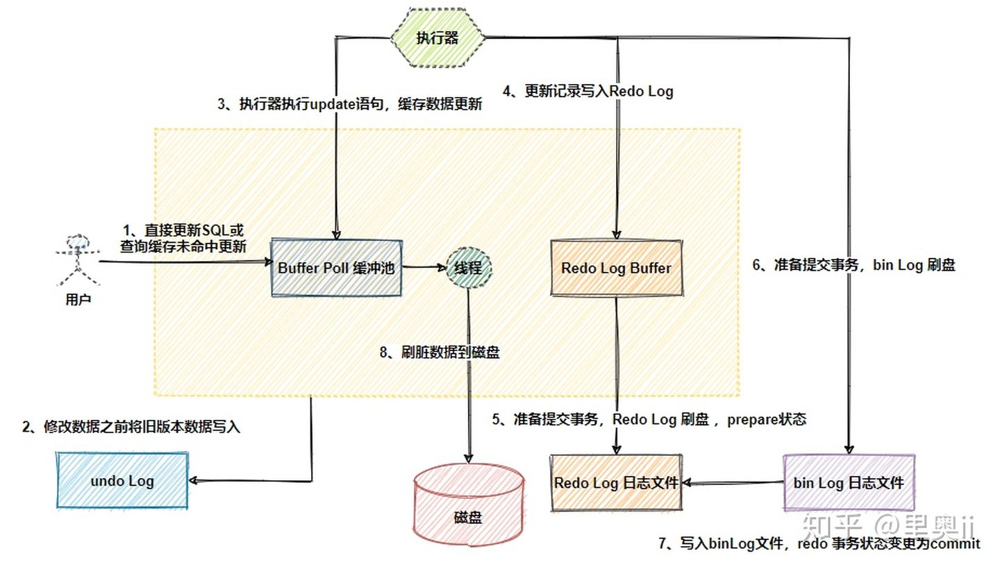

缓冲池是什么
redo的流程是什么
### 实践
1. 设计和使用
   - 数据类型
     1. 尽量使用更简单的类型，数据长度越短越好(更少存储内存空间)
     1. 长数字使用string
     1. 用枚举代替常用字符串类型
     1. 尽量用timestamp，比datetime效率高
     1. 给文本字段留足余量
     1. 不能为null
   - 列设计
     1. 一定有主键，最好是自增，否则多次读写后更离散，更多随机io
     1. 增加create_time/update_time字段，用于数据归档/自定义差异备份
     1. 大数据字段独立表进行存储，提交表性能
     1. 名称不要和关键字碰撞
   - 索引
     1. 建立原则
        - 数据量少的、数据经常改变的、数据差别不大的不能建立
        - 字符串使用前缀索引，节省大量空间
        - 尽可能扩展和整合索引，而不是增加索引
        - 最左前缀原则：不用给组合索引最左边的列单独建立索引
     1. 使用原则
        - like：最左原则，%aa%不使用索引，而aa%使用
        - or：前后条件都有索引才使用索引，否则用union
        - !=、not in、<>：不使用索引，范围查询可能用到索引如>、in等
        - 字符串列加引号，否则索引失效
        - 不在列上运算：因为每个行要运算所以索引失效
        - 使用索引列排序：唯一索引原则
        - 优化器会评估，有可能放弃使用索引
        - on、using子句上有索引，否则全表
   - 事务
     1. 不能运行大事务，否则导致主从延迟，事务执行多长时间，就延迟多长时间
     1. 事务执行成本很高，50万事务需要执行2分钟
   - 查询
     1. 无select *，sql中无计算、无函数
     1. 提高索引利用率
     1. 所有where条件加引号，防止类型隐式转换
     1. 尽量用union代替子查询
     1. union all代替union
     1. group和order尽量在一个表中，否则在两个表中两个表全表扫描
     1. 不需要排序用order by null否则依然排序
     1. 使用count(*)忽略所有列，不用列名
     1. 尽量inner join让优化器自动选择驱动表
     1. 一个大查询可以分解为小查询，内部每秒能扫描百万行
     1. 开启查询缓存
   - 运维
     1. 慢查询日志，不要直接打开，使用pt-query-digest工具分析
     1. set profile = 1;show profile;show profile for query 1;获取sql执行时间
     1. show status;show global status;分析计数器
     1. show processlist;查看线程状态
     1. 关键业务上线前explain确认执行计划
1. explain
   - 理解：sql语句分析，将过程和索引等信息列出来
   - 使用解析
     1. select_type：查询类型，simple、primary、union、subquery
     1. type：访问类型，在表中找到所需行的方式，效率由高到低
        - system/const：最多一个匹配行，主键或者唯一索引，性能最优
        - eq_ref：多表连接中使用唯一索引
        - ref：非唯一索引/唯一索引的前缀扫描
        - range：索引范围扫描
        - index：索引全扫描
        - all：全表扫描
     1. possible_keys：可用的索引
     1. key：实际使用索引
     1. key_len：索引使用字节数，越小越好越快
     1. ref：另外表的数据列名字
     1. row：预计读出的数据行数，里面所有数字乘积代表需要处理的组合数
     1. extra：问题解决提示信息
### 维护
1. 基准测试：进行定量的、可复现的测试，不关心业务逻辑，对比于压力测试。mysql由于数据一致性的要求无法简单的水平扩展(即加机器)，主要评估qps和响应时间
   - mysqlslap：简单，容易使用，无法生成数据，适合对既有数据库单个sql进行优化测试
     1. `--concurrency=5000`：并发数
     1. `--number-of-queries`：总查询数
   - sysbench：内嵌lua脚本，可生成指定规模数据，主流厂商(Oracle/Percona)使用，支持多线程，支持多种数据库
     1. 建表，塞1百万数据：`sysbench --monitis=oltp --oltp-table-size=1000000 --mysql-db=xx --mysql-user=root --mysql-password=xx prepare`
     1. 开始测试：`sysbench --monitis=oltp --oltp-table-size=1000000 --mysql-db=xx –mysql-user=root –mysql-password=xx –max-time=60 –oltp-read-only=on –max-requests=0 –num-threads=8 run`
   - mysql-tpcc
1. 监控
   - 性能测试：数据多才有参考价值，数据总量超过内存总量，如几百条数据第一条命令下去就全部加载到内存了，没有参考意义
   - 性能：连接数、qps
     1. `show status like 'Threads%';`：查看连接数
     1. `show processlist;`：查看所有连接
     1. `show variables like '%connect%';`：查看连接的配置
   - 硬件：主频高处理快高吞吐低时延，L1/2/3的cache大速度快，内存大磁盘读写少TPS高，固态快机械配阵列卡，网卡好低时延
     1. 更大内存、更快磁盘：比业务服务器要求高
   - 指标
     1. qps：select、delete、insert、update，物理机qps30000，tps10000，虚拟机qps5000，tps1000
     1. sort
        - sort_range：使用范围完成的排序数
        - sort_rows：排序的行数，sort_merge_passes：排序算法必须执行的合并传递的数量。 如果此值很大，则应考虑增加sort_buffer_size系统变量的值。
        - sort_scan：通过扫描表格完成的排序数量
     1. thread：单用户2000，单实例5000
        - conneted
        - cached
        - created
        - running
     1. threadpool_used_percent：连接数占比
     1. seconds_behind_master：主从延迟
     1. slave_status：slave_io_running，从库IO线程状态
     1. innodb_rows：每秒增删改查的行数
     1. innodb_row_lock
        - innodb_row_lock_waits：等待行锁的总次数
        - innodb_row_lock_time：等待行锁的总时间
     1. mysql_locks
        - table_locks_immediate：申请时立刻获得表锁次数
        - table_locks_waited：申请表锁时等待的次数
     1. mysql_handler
        - Handler_commit：内部提交语句数
        - Handler_delete：请求从表中删除行的次数
        - Handler_read_prev：按照键顺序读取一行的请求数。该方法主要用于优化Order By DESC
        - Handler_read_rnd_next：在数据文件中读下一行的请求数，如果你正在进行大量的表扫描，该值较高。同城说明你的表索引不正确或写入的查询没有利用索引。
        - Handler_read_last：根据键读最后一行的请求数
        - Handler_read_first：索引中第一条被读的次数。如果较高，建议服务器正执大量全索引扫描。例如 SELECT col1 From foo 假定col1有索引
        - Handler_read_next：按照键顺序读取下一行的请求数。如果你用范围约束或如果执行搜索扫描来查询索引列，该值增加
        - Handler_update：请求更新表中一行的次数
        - Handler_read_rnd：根据固定位置读一行的请求数，如果你正执行大量查询并需要对结果进行排序该值较高。你可能使用了大量需要MySQL扫描整个表的查询或你的连接没有正确使用索引
        - Handler_write：请求向表中插入一行的次数
     1. innodb_pages 
        - innodb_pages_created：buffer pool创建页的数
        - innodb_pages_read：从buffer pool中读取的页数
        - innodb_pages_written：写buffer pool的页数
     1. innodb_bytes
        - bytes_sent：发送给所有客户端的字节数
        - bytes_received：从所有客户端接收的字节数
     1. innodb_buffer_pool_bytes
        - buffer_pool_bytes_data：buffer pool中数据页的大小
        - buffer_pool_bytes_dirty：buffer pool中脏页的大小
     1. innodb_buffer_pool_pages
        - buffer_pool_pages_misc：用于存储行锁，自适应哈希索引等信息的管理层的页数
        - buffer_pool_pages_free：buffer pool中空闲的页书目
        - buffer_pool_pages_made_young：标记为young的页数目
        - buffer_pool_pages_old：在buffer pool LRU old段的页数
        - buffer_pool_pages_flushed：请求flush pages的次数
        - buffer_pool_pages_total：buffer pool包含的总页数
        - buffer_pool_pages_data：buffer pool包含数据的页数(包括dirty和clean页)
        - buffer_pool_pages_made_not_young：进入buffer pool后未被标记为young的页数
        - buffer_pool_pages_dirty：buffer pool中脏页数目
     1. innodb_data
        - data_written：innodb写入的总数据量，单位字节
        - data_writes：innodb数据写入的总次数
        - data_fsyncs：innodb进行fsync的次数
        - data_read：innodb读取的总数据量
        - data_reads：innodb数据读取的总次数
     1. mysql_innodb_log
        - innodb_os_log_fsyncs：调用fsync() writes写redo log的次数
        - innodb_log_waits：log buffer 空闲空间不足，必须等待其被写入所造成的等待数
        - innodb_log_write_requests：写redo log的请求次数
        - innodb_log_writes：redo log的物理写次数
        - innodb_os_log_written：写入redo log的bytes
     1. cardinality是索引中不重复记录的预估值，会有更新机制，不准，很小需要评估索引是否有意义
1. 调优
   - 硬件
     1. cpu：区分oltp和olap
     1. 内存：大内存性能线性提高
     1. ssd
     1. RAID
   - 参数
     1. Innodb_buffer_pool
     1. Innodb_buffer_pool_instances
     1. innodb_flush_log_at_trx_commit
     1. binlog-format
     1. transaction-isolation
     1. sync_binlog
   - 单表不能超过20G
1. 慢查询：记录超过一定时间的查询语句
    ```
    slow_query_log = ON
    slow_query_log_file = /usr/local/mysql/data/slow.log
    long_query_time = 1
    ```
1. gist
   - 查询这个数据是否存在，存在则存到另一张表里：`create table temp as select * from admin a where exists (select uid from user u where a.userName = u.account);`
   - 查询两张表中是否有相同数据：`select * from admin where uid IN(select uid from temp);`
   - 求差集：`SELECT * FROM A LEFT JOIN B ON A.xx = B.xx WHERE B.id IS NULL union SELECT * FROM A RIGHT JOIN B ON A.xx = B.xx WHERE A.id IS NULL;`
   - 求全集：`SELECT * FROM A LEFT JOIN B ON A.xx = B.xx union SELECT * FROM A RIGHT JOIN B ON A.xx = B.xx;`
   - 原所有id增加5万，必须倒叙操作：`update user SET uid=uid+50000 order by uid desc;`
   - 插入不重复数据行，mysql特有不是标准sql语法：`INSERT token(udid) values ('{$udid}') ON DUPLICATE KEY UPDATE activetime ='{$time}'`
1. 问题排查思路
   - 查看现场：`show full processlist`
   - 分析情况：`explain xx`
   - 查看信息
     1. 正在执行的事务：`select * from information_schema.innodb_trx`
     1. 锁等待：`select * from information_schema.innodb_lock_waits w inner join information_schema.innodb_trx b on b.trx_id=w.blocking_trx_id inner join information_schema.innodb_trx r on r.trx_id=w.requesting_trx_id`
     1. 锁表情况：`show open tables where In_use > 0`
     1. 锁定的事务：`select * from information_schema.innodb_locks`
     1. 锁等待的事务：`select * from information_schema.innodb_lock_waits`
     1. 死锁：``
   - 日志分析：general.log
1. 当系统遇到无法解决的技术难题时，可以通过变换业务逻辑实现功能
### 架构
1. 主从
   - 读写分离：采用数据库主从方式，多个从库分担读，主库负责写
   - 高可用
     1. 对从进行快照保存，可以防止主drop database级的防御
     1. 对从设置read-only，防止误改
1. 分表分区
   - 认识
     1. 分区：对用户透明，底层分为多个物理分区。用partition by定义每个分区存放的数据，优化器自动使用。适用于数据多，只在表最后有热点数据，其他都是历史数据。分区可以分布在不同机器上独立维护，有很多功能不能用
        - 存储更多数据：可分布在不同的物理设备
        - 优化查询：where语句中包含分区条件时，只会使用某几个分区
        - 类型：RANGE、LIST、HASH、KEY
          1. 两级映射：指定id范围和表的关系，不够了加关系就行，可通过中间件实现
        - 适用于所有数据和索引，两者不能分开
     1. 分表：可以将两种方式结合使用
        - 水平拆分：用于数据本身有独立性，可以拆分，逻辑分层算法无法变更，关键字段取模方式拆到多个表中，降低单表大小
        - 垂直拆分：把属性较多、数据较大的表某些字段拆分到不同的表中，查询时可减少io次数，但是应用增加复杂度。分主表、扩展表。因为数据库的内存buffer存row
   - 跨表分页
     1. 全局视野法：改造分页sql，每个表都取出来，然后放一起再排序。`offset X limit Y`改为`offset 0 limit X+Y`。精准返回，页码增加性能急剧下降
     1. 业务折衷
        - 禁止跳页查询：第一页作为第二页的查询条件，再全局视野
        - 允许数据精度损失：认定数据足够随机，取模去取数据
     1. 二次查询法
        - 将order by time offset X limit Y，改写成order by time offset X/N limit Y
        - 找到所有表中的最小值time_min
        - between二次查询，order by time between $time_min and $time_N_max
        - 拿time_min在各个分库中比较，得出每个表的虚拟offset，相加从而得到time_min在全局的offset
        - 得到了time_min在全局的offset，自然得到了全局的offset X limit Y，要什么从后推着拿就行
1. 数据库中间件：前端无感知
   - mycat：开源分布式数据库中间件，13年阿里开源，java写的。支持读写分离、高可用(主没了选从)、拆分(垂直、水平)
     1. 高可用：采用去中心化的集群，在虚拟ip下，在不同的节点部署多个mycat，根据某种策略(ip选举策略)选举某一个为临时master，之间采用心跳机制进行通信维持故障切换。可使用zk、haproxy、keepalived等组件，可以有选举、心跳、切换ip等功能
   - Kingshard：个人的go开发，读写分离、分库分表、sql黑名单
   - mysql proxy：mysql官方
   - amoeba
### 原理
1. 认识：单进程多线程，插件式的表存储引擎
   - 数据多了，性能下降不是线性的
1. 架构
   - Server：————负责跨存储引擎功能的实现，如存储过程、触发器、视图
     1. 连接器：————管理连接、连接权限验证，用户权限信息放在一个变量中以供后续使用，长连接多了容易内存爆满
     1. 查询缓存：————8.0已删除，命中率非常低，表更新会使所有查询缓存清空
     1. 分析器：————词法语法分析，之后进行precheck权限检查
     1. 优化器：————生成执行计划，选择索引
        - 决定使用哪个索引
        - join时决定表的连接顺序
     1. 执行器：————操作引擎(调用引擎接口)，返回结果，再次检查权限，因为有些只能在执行阶段才能知道具体哪张表，如触发器
   - 存储引擎：————负责数据存取，插件式
     1. InnoDB
     1. MyISAM
     1. Memory
1. 数据更新流程
   - 认识：流程和wal一致，
     1. 读写数据：缓存提高效率
        - 脏页：缓存中的数据发生变更的内存页
        - 刷脏页：数据发生变更的缓存刷到磁盘中
     1. mysql宕机：缓存中数据来不及刷盘，数据丢失，需要用日志恢复
     1. 磁盘特点：写入系统文件缓存page cache，并没有持久化，非常快，和写内存差不多(本质就是写内存)。一般fsync才占用iops
     1. 两阶段提交：平衡各方都完成
     1. 正常数据落盘和redo没有关系，脏页到ibdata
     1. 事务回滚：redo中commit的发现LSN落后的就重放刷盘，没commit的判断binlog是否完整来重新commit或者回滚
   - 重启操作
     1. 数据页中的LSN小于redo log的LSN，说明redo log上记录着数据页没完成的操作，就会从最近的一个check point出发，开始重放刷盘
     1. 数据库重启先进行crash recovery保证crash-safe，binlog和redolog通过事件xid关联，保证数据一致性
   - 双一问题：可以主双一，从非双一，提高性能
     1. sync_binlog不为1，服务器宕机会丢失binlog
     1. innodb_flush_log_at_trx_commit为1
        - 可以在redo commit时不进行fsync，就无法保证一致性，但是提高了效率
        - innodb_support_xa不为1，redo没commit重启后要回滚，但是binlog记录了，造成问题
   - 数据丢失场景
     1. mysql宕机：写入了文件缓存就丢不了
     1. 服务器宕机：没有设置双一，就可能丢
### 表
1. 认识：了解其物理存储特征
1. 特点
   - 索引组织表：按主键顺序存放，数据即索引，索引即数据。不显式指定主键或者唯一索引就生成6字节的rowId
1. innodb逻辑存储结构
   - 表空间
     1. 存储方式
        - 共享表空间：默认，.ibdata1
        - 独占表空间：.ibd
     1. 逻辑存储结构
        - segment：段，引擎自身完成
          1. 数据段：b+tree的叶子节点
          1. 索引段：非叶子节点
          1. 回滚段
          1. 
        - extent：区，连续页组成，都是1m
        - page：页/块，默认16k，innodb磁盘管理的最小单位，与数据库相关的所有内容都存储在里边。大小16kb，32位int表示，对应innodb的64TB存储容量(16kb * 2^32)
          1. 类型
             - b-tree node：数据页
             - undo log page：undo页
             - system page：系统页
             - transaction system page：事务数据页
             - insert buffer bitmap：插入缓冲位图页
             - insert buffer free list：插入缓冲空闲列表页
             - uncompressed blob page：二进制大对象
             - compressed blob page
        - row：行
          1. 记录格式：Redundant稀疏、Compact紧凑、Dynamic动态、Compressed压缩
     1. index：聚集方式，因此按主键顺序存放，不显式指定主键或者唯一索引就生成6字节的rowId
### 日志
1. 日志
   - 分类
     1. error log：错误日志，启动、运行、停止遇到的问题，平时要关注，并进行数据库优化
     1. general log：通用查询日志，客户端连接和执行的语句
     1. bin log：二进制日志，记录所有更改数据的语句，可用于复制，事务提交前只写一次
     1. slow log：慢查询日志，执行时间超过long_query_time的查询或不使用索引的查询
     1. relay log：中继日志，从接收的主的日志
     1. 引擎日志
1. binlog
   - 认识：记录所有除查询的DDL和DML语句，以事件形式记录的事务安全型的二进制文件集合，包含执行的时间
     1. 具体的写入时间：配置控制是否执行fsync，只写入了缓存
     1. 会重写密码，不以纯文本展示；8可以进行加密
     1. 生成新的日志文件的情况：重启时、执行`flush logs`、大小超过`max_binlog_size`
     1. 开启1%的性能开销
   - 用途
     1. 主从复制：传输binlog
     1. 数据恢复：使用mysqlbinlog工具，可进行任意时间点恢复
     1. 增量备份
     1. 审计：是否有攻击
   - 组成
     1. xx.index：索引文件，存储产生的二进制日志序号
     1. xx.0001
        - 格式
          1. Statement：基于sql和上下文环境，不记录每行变化
             - 减少了日志量节约了io，尤其是修改量大的场景
             - 主从版本可以不一样，从可以更高
             - 为了slave正确运行需要记录相关信息
          1. Row：只记录行的修改点，5.7.7及以上默认，会一步步的优化的更好，主流使用，之前是Statement
             - 避免了存储过程/function/trigger的调用和触发无法被正确复制的问题
             - 加快从库重放日志的效率
             - 日志量大，`alter tableh`每条都会记录，新版优化了
          1. MIXED：混合模式，一般用statment，无法完成主从复制的操作用row
        - 事件类型：QUERY_EVENT、STOP_EVENT等
   - 写入流程
     1. 基于session，根据binlog_cache_size写入缓存或临时文件
     1. group commit，写入磁盘，清空缓存，同时根据sync_binlog判断是否fsync
   - 特点
     1. 一个事务的binlog不会拆开，要确保一次性写入
     1. 事务组提交：group commit，会把后边来的事务一起处理，到时候他们直接返回，一起处理的越多，效果越好
   - 使用
     1. 配置
        - log-bin：是否开启binlog及文件名
        - binlog_cache_size：未提交的日志记录缓存的大小，超过了写入临时文件，基于会话。binlog_cache_use、binlog_cache_disk_use用于判断设置是否合适
        - sync_binlog：写缓冲多少次就同步磁盘，1是同步写磁盘，默认0，建议设置为100~1000
        - innodb_support_xa：为1解决binlog和innodb的数据文件的同步
        - max_binlog_size：单个最大值，超过就加序号新建文件
        - binlog-do-db/binlog-ignore-db：要记录库的范围
        - log-slave-update：从库需要设置，不记录自己的master的日志
        - binlog_format：格式
        - expire_logs_days：保存天数
     1. sql
        - `show variables like '%log_bin%';`：查看配置
        - `show variables like 'binlog_format';`：查看格式
          1. `set global binlog_format='ROW/STATEMENT/MIXED';`：清空所有
        - `show binary logs;`：查看二进制文件列表和大小
        - `show binlog events in '' from pos limit [offset,]count;`：查看某个binlog
        - `show master status;`：查看日志写入状态
        - `reset master;`：清空所有
     1. 工具
        - mysqlbinlog：查看、恢复
          1. -v/-vv：显示详细信息
          1. 直接恢复：`mysqlbinlog /var/lib/mysql/mysqld-bin.000001 | mysql -uroot`
          1. --database DB_name
          1. --no-defaults 
          1. --start/stop-datetime、--start/stop-position
1. 主从复制
   - 原理：主库将更改记录到二进制日志binlog，从库复制到中继日志，读取中继重新放到库中。异步实时
     1. 负载均衡，降低压力
     1. 高可用，故障切换
     1. 备份：异步实时备份
     1. 计算主从的LSN，可得出时延
   - 步骤
     1. master记录到binlog
     1. slave的io线程连接master，请求指定文件的指定位置之后的内容
     1. master返回信息
     1. slave的io线程将接收的日志依次记录到relaylog末尾中，将binlog日志名和位置记录到masterinfo中
     1. slave的sql线程检测到relaylog新增了内容，解析并执行
   - 查看
     1. `show master status;`
     1. `show slave status;`
### 引擎
1. 认识：基于表
   - 分类
     1. InnoDB
     1. MyISAM
        - 认识：innodb之前的默认引擎，用于olap，表大小最大256TB
          1. 不支持事务、不支持外键
          1. 支持全文索引、压缩、空间函数，可以压缩为只读表
          1. 缓冲池只缓冲索引，没有数据
        - 结构
          1. myd：数据文件
          1. myi：索引文件
     1. Memory；内存表存储在内存中，默认使用hash索引，使其比MyISAM快，只支持表锁，服务器停止数据丢失，用于临时表
     1. Archive：提供高速的插入和压缩功能，只支持insert、select，使用zlib将行压缩存储，压缩比一比十，适合存储归档数据如日志，行锁，事务不安全
     1. Federated：不存数据，指向远程的表，不支持异构数据表
     1. Maria：设计取代MyISAM
     1. Merge：将具有相似结构的多个MyISAM表组合到一个表中的虚拟表
     1. Blackhole、CSV
   - 结构
     1. frm文件：存储表的元数据信息，主要是表结构，视图也在
1. InnoDB
   - 认识：性能优秀，数据存在共享表空间，可通过配置分开。多种行锁机制组合，行锁通过给索引上的索引项加锁来实现
     1. 事务
     1. 行级锁
     1. 非锁定读：通过读取undo实现，没有额外开销，默认读取不产生锁，因为没人改
     1. sql标准的4种隔离级别
     1. 通过工具支持热备份
     1. 支持崩溃后安全恢复
     1. 全文索引、外键
     1. 索引是其表空间的组成部分
   - 特性
     1. mvcc
     1. insert buffer：插入缓存，性能提升
     1. double write：二次写
     1. adaptive hash index：读取数据时自动在内存构建hash索引
     1. read ahead：预读
     1. next-key locking：避免幻读phantom
   - 文件
     1. frm
     1. ibd：表空间文件
        - tablespace：表空间，设计为数据按照表空间存放，包含数据、索引、插入缓冲bitmap
          1. 默认表空间文件初始大小10m、名称ibdate1
          1. 多文件可组合表示表空间，即不同磁盘文件负载可平均，可提高性能，可自动扩充大小
          1. 可指定独立表空间，命名为tableName.ibd
     1. ib_logfile0/ib_logfile1：重做日志文件

1. MVCC：一致性读或者读快照就是读取当前事务开始之前的数据快照，在这个事务开始之后的更新不会被读到
1. 引擎日志
   - 认识
     1. undo是回滚，redo是前滚
     1. redo和binlog相比
        - redo引擎层产生，binlog库上层产生，binlog会包含redo的
        - redo是物理格式，记录每个页的修改；binlog是逻辑日志，记录对应sql
        - 写入磁盘时机：redo不断写入，binlog事务commit后一次写入
   - redolog
     1. 认识：重做日志，存储事务日志，保证可靠的事务，存储每个页的修改，不是某行
        - InnoDB独有，顺序整块写，效率高。固定大小，写满后循环记录
        - 至少有一个文件组，至少2个文件，循环2个文件一个个写入。可有多个镜像日志组，更高可靠性，有了高可用方案如磁盘阵列可不用
        - 有LSN落后数量最多检查阈值，否则需要将缓冲池的脏页列表的部分写回磁盘，会阻塞用户线程
        - 不需要对redo进行读取
     1. 结构：有几十种类型
        - redo_log_type：类型
        - space：表空间id
        - page_no：页偏移量
        - redo_log_body：数据部分，恢复时需要调用相应函数进行解析
     1. 流程
        - 先写入buffer，然后顺序写入日志文件
        - 刷盘：根据innodb_flush_log_at_trx_commit确定刷盘策略
          1. 流程：
             - write pos：当前记录的LSN
             - check point：已刷盘的LSN，之前的已刷盘
             - check point到write pos是未刷盘的，当write pos追上check point，先推动check point向前移动，空出位置再记录新的日志
          1. 特点
             - 触发条件有主线程、事务提交
             - 主线程每秒将buffer写入文件，不论事务是否提交
             - 每秒刷盘和崩溃恢复的逻辑，innodb认为redo log在commit时不需要fsync了，写到page cache就够了
        - 固定512byte(扇区大小)写磁盘，扇区是写入的最小单位，保证写入必定成功，不需要doublewrite
     1. 组成
        - LSN：Log Sequence Number 日志逻辑序列号，版本标记的计数，单调递增的值，写多少日志，就加多少
        - checkpoint
          1. 认识：保证checkpoint之前的脏页都刷新回磁盘，那么崩溃恢复直接从checkpoint的点开始应用redo即可
          1. 分类
             - sharp checkpoint：保证所有的脏页刷新到磁盘
             - fuzzy checkpoint
          1. 触发情形
             - master thread固定频率checkpoint
             - redo log不够用了，强制checkpoint以释放redo空间被新事务覆盖(write pos追上check point)
             - buffer不够用了，LRU list淘汰page，淘汰的page属于脏页，需要强制checkpoint
     1. 配置
        - innodb_flush_log_at_trx_commit：提交事务时的文件写入策略
          1. 0：不写，等待主线程每秒刷新，10倍性能提升
          1. 1：调用fsync，为了保持持久性，必须为1，才能保证宕机能够用redo恢复
          1. 2：异步写，等待操作系统落盘，不能保证commit时肯定写入了redo log，6倍性能提升
        - innodb_log_file_size：日志文件大小，太小老checkpoint性能抖动，太大恢复时间长
   - undolog
     1. 认识：用于回滚/崩溃恢复，记录数据修改前的数据，记录与当前操作相反的逻辑日志，做相反操作。update/delete操作存放数据旧记录，insert操作记录新数据行的PK(rowid)
1. WAL
   - 认识：Write-Ahead Logging，日志先行，先写日志再持久化数据文件，保证持久化数据之前日志已经记录。binlog和redo log都落盘了，保证mysql不丢数据
   - 步骤
     1. 执行器通知引擎数据更新
     1. 引擎将新数据更新到脏页内存中
     1. 引擎此时开始记录redolog，并将该记录置为prepare状态
     1. 执行器写binlog
     1. 引擎提交事务，并更新此行数据的redolog状态为commit
     1. Force Log at Commit：持久化redo后才能进行事务的commit，保证持久性
     1. 当MySQL空闲时，会将内存中的数据落盘
   - 解释
     1. 步骤
        - 账本记录卖一瓶可乐（redolog 处于 prepare）
        - 收钱放入抽屉（binlog）
        - 收完钱，在账本该记录上打对勾，代表抵账（redolog 置为 commit）
     1. 纠错
        - 若收钱过程被打断，则整理交易时，发现只是记账了却没收钱，则删除该账本记录（回滚）
        - 若收了钱，有事情耽误了抵账，那么之后闲下来对账的时候，将账本该记录打勾即可（即commit）
1. double write
   - 认识：两次写，保证redo数据页的完整可靠性。即再写一个页的副本，redo前先通过副本还原该页。有些文件系统提供了部分写失效的防范机制(ZFS)，不用开启两次写
     1. 部分写失效：一页没有写完整，redo log是无法解决，页本身损坏重做无意义
     1. 文件系统写失效：只写入了页缓存，并没有同步到磁盘上
        - unix的高速页缓存机制：大多数磁盘io都通过缓冲进行，用fsync主动触发，同步磁盘太慢了
   - 组成
     1. 内存buffer：2m大小
     1. 共享表空间：2m大小，连续128个页，2个区extent
   - 写入流程：在redo commit之后进行
     1. 缓冲池脏页刷新时，先memcpy到buffer
     1. buffer分2次，每次1m顺序写入共享表空间，然后立即fsync
        - 因为顺序写入，开销不大
     1. buffer再写入各个表空间
   - 恢复流程
     1. redo log失败的话，通过binlog计算正确的数据，重新写入redo log
     1. 从redo log获取页副本，复制到redo log，再应用重做操作
1. wiki
   - innoDB最早第三方引擎，被oracle收购，5.5.8开始是默认引擎
   - 数据可靠性指的是：可靠的范围划分，mysql告诉你成功了，他自身能保证数据能找回来，没告诉你成功，那就不会记录，才好理解可靠性机制
### 事务
1. ACID实现原理
   - 隔离性：锁
     1. 锁
     1. MVCC
        - 认识：Multi-Version Concurrency Control 数据多版本并发控制，即非锁定读
          1. 提供基于某时间点的快照，提供事务开始时相同的数据，不管事务执行的时间有多长
          1. 对于支持行锁的事务引擎，进行数据库的并发控制，把数据库的行锁与行的多个版本结合起来，只需很小开销就可实现非锁定读，从而大大提高并发性能
        - 原理
          1. 写任务发生时，将数据克隆一份，以版本号区分
          1. 写任务操作新克隆的数据，直至提交
          1. 并发读任务可以继续读取旧版本的数据，不至于阻塞
   - 原子性：redo
     1. undo：撤销所有执行了一部分但尚未提交的操作
   - 持久性：redo
     1. redo：redo日志记录LSN，数据页头部也记录LSN，数据库启动时，对比两个LSN，会将redo中多出来的写回页中
     1. 写入原子性：redo日志以512字节存储，称为重做日志块。磁盘一个扇区是512字节，操作系统与磁盘的数据交换扇区为基本单位。只需无缓冲写入磁盘就可保证数据原子写入
   - 一致性：undo
1. 内部XA事务
   - 认识：最常见的是binlog和redo log之间，二者要求是原子性的，否则导致主从不一致(因为binlog传给从了)，如果redo没做，重启后就再做一次
### 索引
1. 聚集索引/非聚集索引
   - 非聚簇索引：MyISAM的方式，单行检索快
   - 聚簇索引：叶结点包含了完整的数据记录，按数据存放的物理位置为顺序，多行检索快。辅助索引搜索需要检索两遍索引：首先检索辅助索引获得主键，然后用主键到主索引中检索获得记录
1. 索引
   - 类型分类
     1. 主键索引
     1. 普通索引：如果查询普通索引获取本普通索引之外的数据，那么就需要找到主键id，然后去主键索引上拿数据，n个普通索引的记录，就需要重复n次去主键上取数据
   - 属性分类
     1. Hash：由引擎根据情况自动创建，不能人为干涉。比较hash计算后的hash值会变得没有规律，只能等值过滤。只需一次定位检索效率很高，不像btree需要多次io跑节点
        - 不能范围查找，只能=/<>/in
        - 不支持索引的排序操作
        - 不能使用前缀索引查询
        - 任何时候不能避免全表查询，因为重复hash值的存在，需要查表获得实际数据
     1. B+Tree：B被认为是Balance的缩写，平衡算法
     1. full-text：全文索引，倒排索引实现
   - 引擎支持的索引结构
     1. InnoDB/memory/heap：b+tree、hash
     1. MySIAM：b+tree、rtree(空间列是rtree)
   - 不同引擎的区别
     1. Innodb中，Leaf Nodes存放其他字段实际数据，还包含主键值，Secondary Index和普通b-tree相同，所以主键查询非常快，Secondary需要先找到Leaf再找主键值
1. B+Tree
   - 特点
     1. 有非聚集索引插入的离散型
     1. 二分查找一级级向叶子节点，io查找数据库和指针，内存计算向哪个方向
     1. 三层的B+树可以表示上百万的数据，如果上百万的数据查询只需要三次I/O，性能提高将会是巨大的。B+树就是一种索引数据结构，如果没有这样的索引，每个数据项发生一次I/O，那么成本将会大大提升
     1. I/O的次数取决于B+树的高度H，假设当前数据表的数据为N，每个磁盘块的数据项的数量是M，则有：H=log(M+1)N，当数据量N一定的情况下，M越大，H越小；而M=磁盘块大小/数据项大小，磁盘块大小也就是一个数据页的大小，是固定的，如果数据项占的空间越小，数据项的数量越多，树的高度也就越低。这也就是为什么每个数据项，即索引字段要尽量的小，比如int占4个字节，要比bigint的8个字节小一半。这也是为什么B+树要求把真实数据放在叶子节点内而不是内层节点内，一旦放到内层节点内，磁盘块的数据项会大幅度的下降，导致树层级的增高。当数据项为1时，B+树会退化成线性表
     1. B+树的数据项是复合性数据结构，比如（name，age，gender）的时候，B+树是按照从左到右的顺序来建立搜索树的，比如当（小张，22，女）这样的数据来检索的时候，B+树会优先比较name来确定下一步的搜索方向，如果name相同再依次比较age和gender，最后得到检索的数据。但是，当（22，女）这样没有name的数据来的时候，B+树就不知道下一步该查哪个节点，因为建立搜索树的时候，name就是第一个比较因子，必须根据name来搜索才知道下一步去哪里查询。比如，当（小张，男）这样的数据来检索时，B+树就可以根据name来指定搜索方向，但下一字段age缺失，所以只能把名字是“小张”的所有数据都找到，然后再匹配性别是“男”的数据了。这个是非常重要的一条性质，即索引的最左匹配特性
   - 分类
     1. btree：二叉搜索树，每个结点只存储一个关键字，等于则命中，小于走左结点，大于走右结点
     1. b-tree：多路搜索树，每个结点存储M/2到M个关键字，非叶子结点存储指向关键字范围的子结点；所有关键字在整颗树中出现，且只出现一次，非叶子结点可以命中
     1. b+tree：在B-树基础上，为叶子结点增加链表指针，所有关键字都在叶子结点中出现，非叶子结点作为叶子结点的索引；B+树总是到叶子结点才命中
     1. b*tree：在B+树基础上，为非叶子结点也增加链表指针，将结点的最低利用率从1/2提高到2/3
1. 路线：基础知识（操作、配置、历史）——优化方式、方法、注意点——各种技术方案——原理
1. 提升：集群部署--中间件实施--备份设计监控--日志处理--授权
