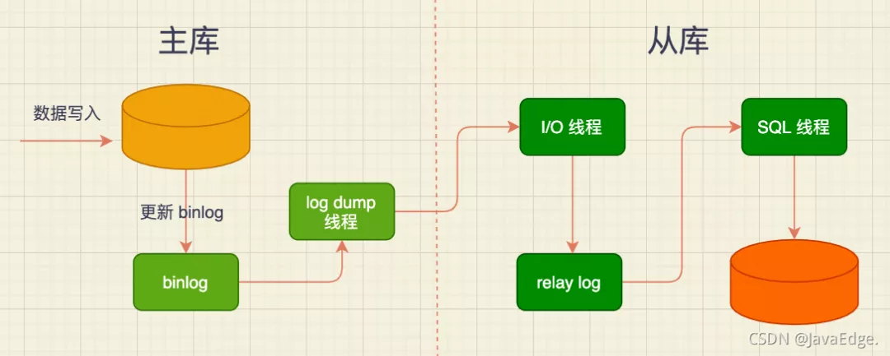
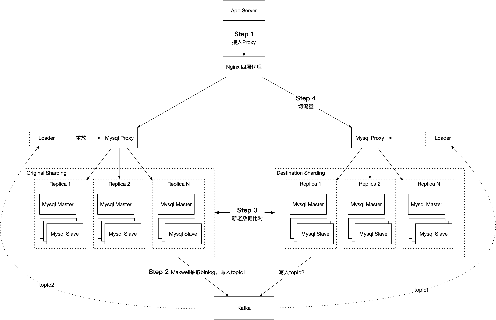
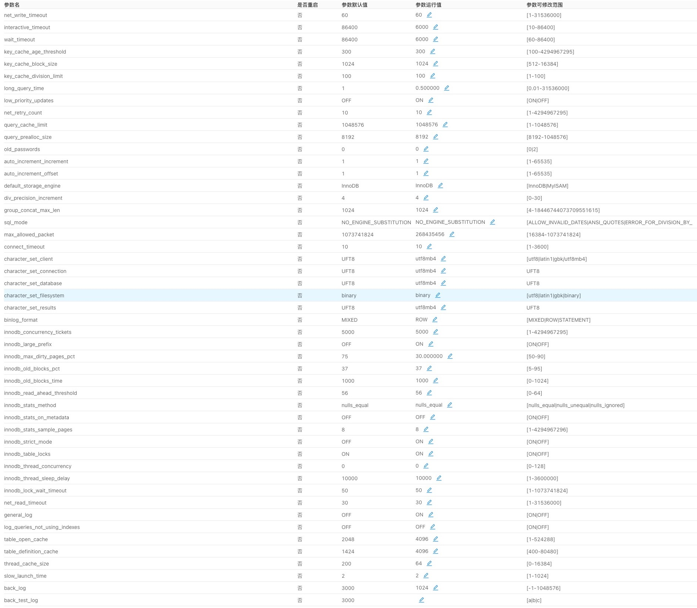
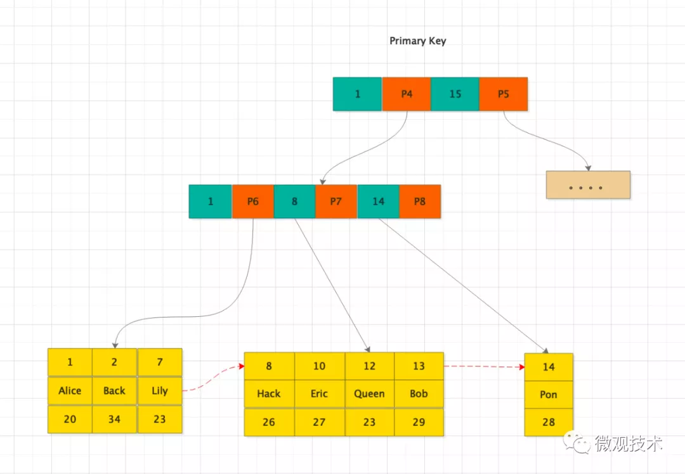
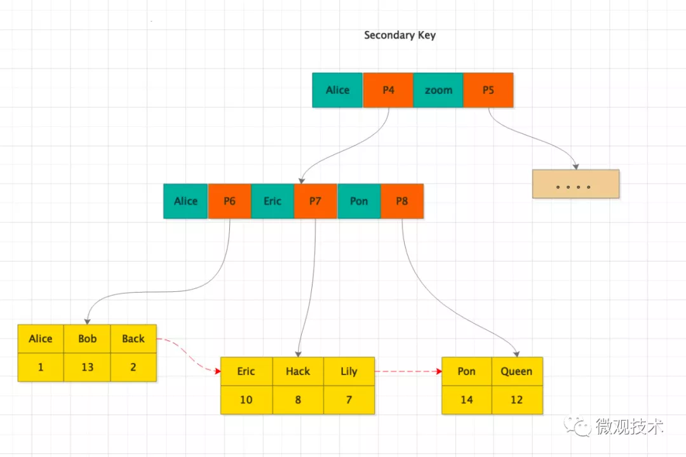

1. 路线：基础知识（操作、配置、历史）——优化方式、方法、注意点——各种技术方案——原理
1. 提升：集群部署--中间件实施--备份设计监控--日志处理--授权
## 使用
### 架构
1. 主从
   - 原理：主库将更改记录到二进制日志binlog，从库复制到中继日志，读取中继重新放到库中。是异步实时的
     1. 计算主从的LSN，可得出时延
     1. 使用Replication协议
   - 作用
     1. 负载均衡，降低压力：读写分离，采用数据库主从方式，多个从库分担读，主库负责写
     1. 高可用，故障切换
        - 对从进行快照保存，可以防止主drop database级的防御
        - 对从设置read-only，防止误改
        - 主从自动切换
     1. 数据备份：异步实时备份，复制不能代替备份，因为执行删除命令同步的很快，这个时候只能依赖备份了
   - 成本
     1. 主从延迟
        - 数据冗余，不要再查，直接传输所有数据
        - 使用Cache，但是更新怎么办，不行
        - 查主库
   - 步骤：
     1. master记录到binlog
     1. slave创建的io线程连接master，请求指定文件的指定位置之后的内容
     1. master创建独立异步的log dump线程发送binlog
        - 防止影响主库的更新
        - 会消耗主库资源，占用带宽等
     1. slave的io线程将接收的日志依次记录到relay log末尾中，将binlog日志名和位置记录到masterinfo中。防止影响从库的更新
     1. slave的sql线程检测到relaylog新增了内容，解析并执行
   - 查看
     1. `show master status;`
     1. `show slave status;`
   - 配置
     1. 主
        - bin_log=mysql-bin
        - server_id=100
     1. 从
        - bin_log=mysql-bin
        - server_id=101
        - relay_log=mysql-relay-bin
        - log_slave_update=on(可选，是否要当其他的主)
        - read_only=on(建议)
1. 复制
   - 复制方式
     1. 异步：主库宕了没同步binlog丢失数据
     1. 半同步：提交commit后等待至少有一个从库收到binlog并写入到中继日志中，再返回给客户端成功，v5.5，降低了主库写效率，
        - rpl_semi_sync_master_wait_for_slave_count：设置收到的从库数量才触发，v5.7
     1. 组复制：MGR，MySQL Group Replication，基于paxos协议的状态机复制，需要通过一致性协议层的同意才能提交，大多数节点同意，v5.7
        - 解决传统异步复制和半同步复制可能产生数据不一致的问题
        - paxos作为分布式一致性算法被广泛使用
        - 仅支持InnoDB表，并且每张表一定要有一个主键，用于做write set的冲突检测
        - 必须打开GTID特性，二进制日志格式必须设置为ROW，用于选主与write set
   - 复制方法
     1. 基于日志点的复制
        - 建立从账号：`grant replication slave on *.* to xx@ip段`
        - 备份主库
          1. 被备份表加锁：`mysqldump --master-data=2 --single-transaction`
          1. 热备，InnoDB不加，其他的加，最好的方式：`xtrabackup --slave-info`
        - scp传输sql文件
        - 从导入基础数据
        - 设置复制链路，包括binglog文件和日志点：`change master to master_host='', master_user='', master_password='', master_log_file='', master_log_pos='';`
        - 启动复制：`start slave`
     1. 基于GTID的复制
        - 认识：从告诉主已经执行到的GTID值，主发送回没没执行的GTID值
          1. 很方便进行故障转移
          1. 从不会丢失主的修改：因为自动按照GTID识别同步
        - 步骤
          1. 主：`gtid_mode=on`、`enforce-gtid-consiste`、`log-slave-updates=on(5.6要求,5.7去掉了,会带来负担)`
          1. 从：`gtid_mode=on`、`enforce-gtid-consistency`、`master_info_repository=tables(建议)`、`relay_log_info_repository=table(建议)`
          1. 备份主库，类似以上
          1. scp传输sql文件
          1. 从导入基础数据
          1. 设置复制链路，gtid方式：`change master to master_host='', master_user='', master_password='', master_auto_position=1;`
          1. 启动复制：`start slave`
   - 性能
     1. 写入binlog的时间，事务太大，主从延迟严重
     1. binlog传输时间，同机房部署、`binlog_row_image=minimal`
     1. 从只有一个sql线程，主上的并发写，从变成串行，如大事务后边所有的修改都阻塞，5.7使用多线程复制
        - `stop slave`
        - `set global slave_parallel_type='logical_clock'`：使用逻辑时钟方式
        - `set global slave_parallel_workers=4`：线程数
        - `start slave`
   - 常见问题
     1. 解决方案
        - 恢复复制
        - 最终都要数据对比
     1. 主从宕机
        - 特点
          1. 主宕机：主回滚事务，从拿不到
          1.  从宕机：master_info没写入磁盘，造成重复获取主的二进制日志，基于日志点会出现主键重复、基于Statement出现重复更新
        - 解决方案
          1. 跳过二进制日志事件：日志点复制方式
          1. 注入空事务先恢复中断复制链路：日志点或GTID方式
     1. 数据损坏
        - 特点
          1. 主binlog损坏
          1. 从relay_log损坏
        - 解决方案
          1. 通过change master重新指定
     1. 从进行了数据修改：丢掉从的修改
     1. 不唯一的server_id、server_uuid：从之间重复，数据相互拿的不对，甚至主从切换失败
     1. max_allow_packet：不一致
   - 无法解决的
     1. 自动故障转移、主从切换
     1. 读写分离
1. 主主
   - auto_increment_offset设置差1，auto_increment_increment设置为2：防止主键冲突
   - log_slave_updates：两节点都要开启，就是反着搭建主备同步，
### 中间件
1. 现有mysql的问题
   - 无集群化的解决方案
   - 无在线扩容方案，横向分片需要业务改造
   - 网络模型限制了连接数
   - 不支持跨机房部署、sql分发
   - 不支持Paxos、Raft、Dynamo等一致性协议
1. 认识
   - 优点
     1. 对前端透明
     1. 自动故障转移(带事务重放)、主从切换、从节点选取
     1. 集群健康度检查，包括复制链路
     1. 读写分离、读负载均衡
     1. 分库分表：垂直、水分拆分
     1. 防火墙：sql审核、过滤、改写、容错、转换、慢指纹、错误sql指纹
     1. 连接池
     1. 配置热加载、ip白名单
     1. 跨机房双活、多集群、多租户
     1. 查询路由
     1. 方便的运维方案：实例申请、建库表、慢查询统计、在线DDL
   - 缺点
     1. 增加中间层，执行效率降低，先进行基准测试
     1. 需要控制是否读写分离
1. 集群方案
   - MMM
     1. 认识：Master-Master replication managerfor Mysql Mysql主主复制管理器，perl实现的双主故障切换、管理的脚本程序
        - 功能
          1. 主主的管理、监控、故障迁移、主从备份、节点重新同步、宕机从自动剔除
          1. 提供多个VIP，同一时间只有一个主可写
        - 缺点
          1. 性能没有提升，每个主都要写
          1. 主从切换容易数据丢失：只做了切换，不会主动补齐丢失的数据
          1. 无读负载均衡
     1. 部署：三台服务器，两台配置主主复制，第三台作为从服务器的同时作为监控节点对主主复制进行监控
   - MHA
     1. 认识：Master High Availability 主高可用，完成主从架构下完成主从切换和从之间的选举，最大程度保证一致性，30s内完成切换，perl开发
        - 主从切换
        - 从之间的选举
        - 最大程度保证一致性
          1. 会保存主的binlog，如果主硬件、网络等无法访问，可能会丢失数据，可以结合v5.5半同步功能
          1. 新主和其他从同步差异
          1. 应用原主的binlog
          1. 提升新主
          1. 迁移其他从
        - 支持GTID
     1. 特点
        - 缺少从的vip功能，也不能自动剔除宕机从
        - 监控过程中不会管主从复制链路的健康度
        - 需要打通ssh，存在安全隐患
        - 无读负载均衡
     1. 组成
        - Manager
        - Node：部署在每台实例上
   - pxc
     1. 认识：数据多向同步的同步复制的高可用性和扩展性的集群方案，基于Percona Server 
        - 多主复制，任意节点写操作
        - 故障切换、自动节点克隆
     1. 原理
        - 在所有集群节点都要提交
     1. 注意
        - 尽可能的控制PXC集群的规模，节点越多，数据同步速度越慢
        - 所有PXC节点的硬件配置要一致，如果不一致，配置低的节点将拖慢数据同步速度
        - 只支持InnoDB
   - mysqlProxy
     1. 认识：mysql官方，很久，实验项目
   - maxscale
     1. 认识：支持高可用、负载均衡、扩展插件式的数据库中间件，mariaDB出品
        - 主从复制状态监测，自动故障转移
        - 读写分离、读负载均衡
     1. 插件
        - 认证
        - 协议
        - 路由
        - 监控
        - 过滤日志：简单防火墙，sql过滤和改写、容错、转换
   - oneProxy
     1. 认识：将一个表分片，数据写到两个实例中，也可以保持两个实例都有一个相同的表，貌似也停止维护
   - mycat
     1. 认识：开源分布式数据库中间件，13年阿里开源，java写的。支持读写分离、高可用(主没了选从)、拆分(垂直、水平)
        - 高可用：采用去中心化的集群，在虚拟ip下，在不同的节点部署多个mycat，根据某种策略(ip选举策略)选举某一个为临时master，之间采用心跳机制进行通信维持故障切换。可使用zk、haproxy、keepalived等组件，可以有选举、心跳、切换ip等功能
        - 功能复杂，细节还待改善
   - proxySQL
   - dbproxy：美团开源，Atlas基础上开发，17年停止维护
   - wxproxy
     1. 优势
        - 分片功能实现横向扩容
          1. 分片查询：Proxy根据SQL语句解析出AST，再根据AST里的WHERE条件判断是否满足id的查询条件，最后将SQL路由至该Shard
        - proxy的仅有10%性能损失
        - 监控体系：实现问题的发现、报警、追踪、排查、解除，提供web界面
        - 双活机房部署支持，配置热加载，秒级主从机房切换
     1. 功能
        - 执行计划缓存
        - 事务追踪
        - 全局索引
        - 分布式事务
        - 平滑的扩容、缩容
        - 注解路由：通过注释解析
          1. 强制读主库
          1. 强制路由到本地机房
     1. 部署
        - 前端Nginx+KeepAlived作四层负载均衡，dbproxy本身作为无状态服务，可以非常方便地横向扩容
        - etcd作配置中心
     1. 一致性支持：支持多种级别
        - 弱一致：纯异步的复制机制，通过Maxwell异步复制Binlog支持
        - 强一致：Proxy在执行SQL写入时，强制双写Local机房及Remote机房，确保两个机房都写成功后，返回客户端
          1. 强一致场景仍然会有数据不一致风险，比如主机房写入成功，从机房写入失败，则在短暂时间内会有两个机房数据不一致的情况发生，后续可通过业务重试解决
          1. 使用事务强一致可以避免数据不一致，跨库事务会有一定的开销但总体上不会太大
        - 事务强一致：通过1PC Best Effort或2PC事务（需要Mysql调整隔离级别Serializable）确保本地机房和远端机房原子性写
     1. SQL解析缓存
        - Mysql Proxy在转发SQL请求时，会经历以下几个步骤：
          1. Mysql协议解析
          1. SQL解析：确定路由规则
          1. 路由算法匹配
          1. 通过连接池分发SQL到后端的Mysql实例
        - 其中，步骤2耗时较长，因此，我们需要针对SQL解析后的AST增加缓存机制。具体做法是先将请求的SQL转化成SQL Statement（SQL指纹），屏蔽SQL中变量、大小写等
        - 然后以SQL Statement为Key缓存解析后的AST。
     1. Proxy高可用：在某个Proxy不可用时，由于Nginx本身有重试机制，当一个upstream中某个Backend无法响应时，Nginx会继续尝试下一个Backend。
     1. 数据度量
        - 单行查询的case，单核1W QPS
        - 同机房部署比直连延迟额外增加在1ms以内
        - 主从复制延迟
          1. 同机房300us
          1. 跨机房视专线网络RTT
        - 连接数
          1. 业务到Proxy：核数 * 5000
          1. Proxy到Mysql：3000/数据库实例
     1. 核心指标
        - 服务器资源用量：CPU、RAM、网络带宽、磁盘占用
        - 慢SQL
        - 错误SQL
        - SQL执行延迟
        - 业务请求QPS
        - 连接数
   - gaea
     1. 认识：定位轻量级, 高性能，小米开源
   - cetus
   - DataX：阿里巴巴开源的离线数据同步工具
   - PMM：percona公司提供的MySQL和MongoDB的监控和管理平台
   - amoeba
   - atlas：360开源
   - kingshard：个人的go开发，读写分离、分库分表、sql黑名单
1. maxwell
   - 认识：同步binlog以json写入到kafka、redis、等流平台，用于ETL、缓存刷新、指标收集、增量到搜索引擎、数据分区迁移、切库binlog回滚等场景，java写的
     1. 有过滤器功能
   - 原理：伪装为slave，接收binlog events，然后根据schemas信息拼装，可接受ddl、xid、row等各种event
   - 使用
     1. 流程
        - mysql配置maxwell用户、给与权限
        - 配置连接mysql信息
        - 配置连接kafka信息，topic
     1. maxwell-bootstrap：基于SELECT*FROM table帮助完成数据初始化
     1. 特点
        - timestamp column：对时间类型当字符串处理。所以更合理的做法是提供时区参数，然后maxwell自动处理时区问题
        - binary column：做base64_encode，消费者需要解码
   - 配置
     1. mysql角色
        - host：主机，建maxwell库表，存储捕获到的schema等信息
        - replication_host：复制主机，Event监听，读取该主机binlog
          1. 将host和replication_host分开，可以避免replication_user往生产库里写数据
        - schema_host：schema主机，捕获表结构schema的主机
          1. binlog没有字段信息，所以m需要从数据库查出schema，存起来
     1. 过滤器
        - --filter='exclude: foodb.*, include: foodb.tbl, include: foodb./table_\d+/'：# 仅匹配foodb数据库的tbl表和所有table_数字的表
        - --filter = 'exclude: *.*, include: db1.*'：排除所有库所有表，仅匹配db1数据库
        - --filter = 'exclude: db.tbl.col = reject'：排除含db.tbl.col列值为reject的所有更新
        - --filter = 'exclude: *.*.col_a = *'：排除任何包含col_a列的更新
        - --filter = 'blacklist: bad_db.*'：blacklist 黑名单，完全排除bad_db数据库，若要恢复，必须删除maxwel
     1. 输出格式
        - 是否包含 binlog position
        - 是否包含 gtid position
        - 是否包含 commit and xid
   - 架构
     1. 高可用
        - 最小队列粒度也是表，根据数据量级分开
        - 不直接支持ha，但支持断点还原
        - 不支持控制数据速率
        - 监控：baselogging mechanism,JMX,HTTP,bypush toDatadog
        - 报警
          1. 进程是否存在
          1. 监控异常日志
          1. 网络监控
          1. 数据一致性：可手动修改position位置
        - 主从切换：通过域名访问mysql，跟着切换走
     1. 架构：跟着数据库在不同集群就行，关系就是和mysql、kafka
   - 性能表现
     1. qps 16w，单核2G，20%cpu，7%内存占用，带宽会很高
   - 其他
     1. canal：分为服务端和客户端，需要自己编写客户端来消费服务端解析到的数据。性能稳定，功能强大，阿里。maxwell不用客户端了简单
     1. mysql_streamer
     1. datax
     1. flink
1. 网校架构
   - 主要
     1. 一主两从，读写分离
     1. 版本5.7.24，启用GTID模式，启用半同步复制
   - 功能划分
     1. 主库功能（rw）：承载DDL、DML、查询操作，并且通过binlog将所有操作在从库上复现，从而实现主从数据一致
     1. 线上从库功能（ro）：承载线上查询（select）操作，以减轻主库压力
     1. 线下从库功能（ofl）：供数据部门（统计类型业务）、开发进行相关查询操作，以避免慢查询影响线上业务
   - 主从切换机制：Arksentinel
     1. Arksentinel中每个哨兵均每隔一段时间探测一次状态为“online”+“normal”的数据库实例，判断其是否存活或者正常服务，若不可访问/不可正常服务，则会连续探测多次；其中间隔时长和探测次数可由参数“ping间隔时间(ms)”和“ping次数”指定
     1. 若某个哨兵连续探测次数达到参数“ping次数”之后节点仍未正常，则该哨兵标记该节点为“SDOWN”状态，此时会询问其他哨兵该节点状态。
     1. 若其他哨兵中认为该节点状态为“SDOWN”的个数达到quorum（法定数量）后，则Arksentinel认为该节点实例为“ODOWN”状态，即哨兵集群认为该数据库节点已不可用，应当发起故障切换
        - quorum法定数量是指N个节点中有N/2+1个，例如5个节点的quorum就是3，6个节点的quorum就是4；SDOWN是Subjective Down，某个哨兵主观认为节点宕机；ODOWN是Objective Down，客观事实该节点已经宕机可不服务。
        - 此处系统还有一个特殊情况处理，若非所有哨兵均认为节点SDOWN，则会延迟后面的投票和选举等操作一段时间，这样是为了极大情况排除机房间断网或者网络闪断而发生切换的情况。
     1. 哨兵内部会发起选举和投票，以选出一个Leader来执行数据库故障切换操作。
        - 哨兵的每一次探测、选举和投票，均针对其内部的同一个epoch，即不会发生某个哨兵对上一轮的选举发起投票的情况。
     1. Leader哨兵会根据用户自定义的故障转移方案完成整个高可用切换，包括MySQL集群关系重新建立、新Master/Write节点关闭read_only参数、VIP/DNS漂移等，并标记故障节点为“offline”+“problem”状态，即不再对外提供服务，需要用户在节点恢复后手动置为“online”状态。
        - 对于主从复制架构来说，新Master会选取Retrive Binlog最大的节点，即从原Master上获得最多Binlog的节点，其上的Binlog才是相对最完整的。当然新Master/Write节点的选取，还会参照权重、机房和主从复制延迟多个维度，保障数据的完整性和一致性
   - dbproxy扩容
     1. 原理图：
     1. 说明
        - Step 1：业务方将App Server的Mysql请求迁移到Nginx四层代理，Nginx四层代理指向Mysql Proxy及后面的Mysql老集群
        - Step 2：启动Mysql数据全量同步及增量同步，并始终开启新老两个集群的maxwell binlog抽取，分别写入kafka的不同topic
        - Step 3：增量数据同步结束后，执行新老集群数据对比，确保两个集群数据一致
        - Step 4：Nginx四层代理切换流量到新的Mysql Proxy
     1. 一致性保证
        - 原因：由于在Step 4的过程中，可能会出现以下两个数据来源的写入乱序，因此切流新Mysql Proxy前需要先关闭Kafka的Data Loader，而Kafka的Data Loader流量来源于业务方写入老的Mysql Proxy的流量，而这个binlog抽取可能会有延迟，该延迟理论值小于10ms（待观察），需流量低谷执行
          1. Kafka数据抽取，通过Data Loader写入新的Mysql Proxy
          1. 切流量后，业务方的请求写入新的Mysql Proxy
        - 步骤
          1. 停止老的Mysql Proxy流量
          1. 等大概200ms时间
          1. 关闭Kafka Consumer（Data Loader）
          1. 将流量切到新的Mysql Proxy
          1. 打开Kafka Consumer，观察是否还有遗漏的数据，并进行手动修复（极小概率发生）
### 设计
1. 分表分区
   - 认识
     1. 分区：对用户透明，底层分为多个物理分区。用partition by定义每个分区存放的数据，优化器自动使用。适用于数据多，只在表最后有热点数据，其他都是历史数据。分区可以分布在不同机器上独立维护，有很多功能不能用
        - 存储更多数据：可分布在不同的物理设备
        - 优化查询：where语句中包含分区条件时，只会使用某几个分区
        - 类型：RANGE、LIST、HASH、KEY
          1. 两级映射：指定id范围和表的关系，不够了加关系就行，可通过中间件实现
        - 适用于所有数据和索引，两者不能分开
     1. 分表：可以将两种方式结合使用
        - 水平拆分：用于数据本身有独立性，可以拆分，逻辑分层算法无法变更，关键字段取模方式拆到多个表中，降低单表大小
        - 垂直拆分：把属性较多、数据较大的表某些字段拆分到不同的表中，查询时可减少io次数，但是应用增加复杂度。分主表、扩展表。因为数据库的内存buffer存row
     1. 分片
        - 方式
          1. 分片键的hash取模
          1. 分片键范围划分
          1. 时间跨度（年、月、日）分片
          1. 分区键和分片映射表分配
        - 如何生成全局唯一id
          1. 分配auto_increment_increment和auto_increment_offset参数
          1. 全局id生成节点
   - 跨表分页
     1. 全局视野法：改造分页sql，每个表都取出来，然后放一起再排序。`offset X limit Y`改为`offset 0 limit X+Y`。精准返回，页码增加性能急剧下降
     1. 业务折衷
        - 禁止跳页查询：第一页作为第二页的查询条件，再全局视野
        - 允许数据精度损失：认定数据足够随机，取模去取数据
     1. 二次查询法
        - 将order by time offset X limit Y，改写成order by time offset X/N limit Y
        - 找到所有表中的最小值time_min
        - between二次查询，order by time between $time_min and $time_N_max
        - 拿time_min在各个分库中比较，得出每个表的虚拟offset，相加从而得到time_min在全局的offset
        - 得到了time_min在全局的offset，自然得到了全局的offset X limit Y，要什么从后推着拿就行
### 性能
1. 影响性能的方面
   - 硬件、系统
     1. 主数据库用RAID10做保障，从用RAID0、RAID5节省成本，注意5磁盘损坏性能的大幅下降
     1. san/nas等网络存储设备：数据库需要大量随机io他们不是优势，一旦出问题需要厂商协助恢复时间长，可以作为备份使用
     1. 足够的内存可以将随机io变为顺序io，把多次写变为一次写
   - 系统参数、数据库参数、存储引擎
   - 表结构、sql
1. 参数
   - mysql
     1. 命令行、配置文件
     1. 全局参数、会话参数
     1. 内存
        - mysql自身运行的占用：无法控制
        - 最大使用内存
          1. 32位系统无法超过3G
          1. 超过物理内存造成内存溢出
        - 每个连接的使用内存
          1. sort_buffer_size：排序缓冲区大小，需要排序时不管实际用多少全部占用
          1. join_buffer_size：连接缓冲区大小，每关联一个表就分配一个
          1. read_buffer_size：MySIAM表全表扫描的读缓冲区大小，不管大小全部占用，得是4k倍数
          1. read_rnd_buffer_size：索引缓冲区大小，只会分配需要的大小，不是参数指定的大小
        - 操作系统
          1. 独占一台物理机，不要多实例混部，也不要混合其他服务，避免资源争用
        - 缓冲池
          1. innodb_buffer_pool_size：innodb缓冲池大小，对性能非常重要，要缓存索引、数据、自适应hash索引、插入缓冲、锁、其他内部数据结构，还帮助延迟顺序写入，要分配足够的内存大小，重启才能更改，太大了重启慢需要刷脏页，总大小 = 每个线程需要的内存 * 连接数 - 系统保留内存
          1. key_buffer_size：MySIAM的索引缓冲，因为系统表还在用MySIAM
     1.  io：性能和安全的取平衡
        - innodb_log_file_size/innodb_log_file_in_group：事务日志大小的单个和个数，即redolog的，事务日志总大小为二者相乘，事务日志是循环写入的，配置多个是没有意义的，业务忙设置大些，一般记录一个小时的信息
        - innodb_log_buffer_size：日志缓冲区大小，能够保留至少一秒的事务就够，32M~128M
        - innodb_flush_log_at_trx_commit：事务日志的刷新频繁程度，和innodb_log_buffer_size搭配的
        - innodb_flush_method = O_DIRECT：flush的方式，会影响读写，这个通知操作系统不要预读也不要缓存，读写通过存储设备完成，避免操作系统和innodb的双重缓存，linux的最好选择
        - innodb_file_per_table = 1：指定innodb为每个表建立表空间，否则放入系统表空间，强烈建议开启
        - innodb_doublewrite = 1：是否开启双写缓冲，防止没有写完整导致的数据损坏，一个页默认16k，建议开启，性能影响不大
        - delay_key_write OFF：延迟键写入，每次写操作后刷新键缓冲中的脏块到磁盘，OFF最安全，ON只对建表时指定的生效，ALL所有MySIAM都使用。如果服务器崩溃内存中脏块没写回，就需要对MySIAM修复
     1. 安全
        - expire_logs_days：自动清理binlog的天数，防止占用太多空间，应该至少覆盖两次全备间隔的天数
        - max_allowed_packet：mysql可以接收的包大小，同时影响用户定义的变量容量，主从应该一致否则同步失败，如32M
        - skip_name_resolve：禁用dns查找，加快访问速度，用户授权只能使用ip了
        - sysdate_is_now：确保sysdata()返回确定性日期，建议设置，否则基于段的主从复制的不一致导致中断
        - read_only：禁止非super的写权限，建议从库指定，保证主从一致
        - skip_slave_start：禁用slave自动恢复，崩溃后自动恢复不安全
        - sql_mode：sql模式，默认比较宽松，改了可能现在的程序无法运行
          1. strict_trans_tables：如果数据无法插入到事务型引擎中会中止操作，非事务不影响
          1. no_engine_subtitution：如果引擎不可用也会建立不成功，否则使用默认引擎，确保使用想要的引擎
          1. no_zero_date：不能写入小于0的日期
          1. no_zero_in_date：不接受部分为0的日期
          1. only_full_group_by
     1. 服务器
        - sync_binlog：控制什么时候磁盘刷新binlog，建议为1，避免主崩溃，cache日志没有同步到从中，就会很难恢复
        - tmp_table_size/max_heap_table_size：控制内存临时表大小。隐式的超过后转为磁盘临时表，不要太大防止内存溢出
        - max_connections：最大连接数，一般为3000或更大
     1. 数据库设计
        - 过分的反范式化设计，建立太多列
        - 过分的范式化设计，太多的表关联
        - oltp使用分区表，分区还是olap中使用
        - 使用外键
   - 内核
     1. 配置文件：`/etc/sysctl.conf`
     1. 网路
        - net.core.somaxconn：65535，socket listen的backlog上限，监听队列每个端口最大的长度
        - net.core.netdev_max_backlog：65535，当个别接口接收包的速度快于内核处理速度时允许的最大的包数量
        - net.ipv4.tcp_max_syn_backlog：65535，还未获得连接的请求的最大数量，超出被抛弃
        - net.core.netdev_budget：每次软中断处理的网络包个数
        - net.ipv4.tcp_max_tw_buckets＝5000：同时保持TIME_WAIT套接字的最大数量

        - net.ipv4.tcp_fin_timeout：10，tcp等待超时时间，加快tcp连接回收速度，适用于大量tcp连接的系统
        - net.ipv4.tcp_tw_reuse：1，
        - net.ipv4.tcp_tw_recycle：1，

        - net.core.wmem_default：87380，tcp接收和发送的缓冲区大小和默认值，应该大一些
        - net.core.wmem_max：16777216
        - net.core.rmem_default：87380
        - net.core.rmem_max：16777216

        - net.ipv4.tcp_keepalive_time：120，发送keepalive的时间间隔(秒)，用于确认tcp是否有效，应该小一些
          1. 减少tcp失效连接占用系统资源的数量，加快资源回收效率
        - net.ipv4.tcp_keepalive_intvl：30，消息未获得响应时，重发该消息的间隔，秒
        - net.ipv4.tcp_keepalive_probes：3，认定tcp失效前最多发送多少keepalive消息
     1. 内存
        - kernel.shmmax=4294967295：定义单个共享内存段的最大值，应该足够大，能容下整个InnoDB缓冲池的大小，过低需要创建多个共享内存段，性能下降
          1. 可取最大值为物理内存值-1byte，建议为一半，一般大于InnoDB缓冲池即可
        - vm.swappiness=0：除非虚拟内存全部占满，否则不用内存交换分区
          1. 一旦发生内存交换，性能巨大影响。禁用临时需要大内存时一降低系统性能，二容易造成内存溢出、崩溃、被系统kill
   - 资源限制
     1. 配置文件：`/etc/security/limit.conf`，重启生效
     1. 文件打开数
        ```
        soft nofile 65535   # * 所有用户生效，soft 当前系统生效
        hard nofile 65535   # hard 系统中所能设定的最大值
        ```
   - 文件系统
     1. 选择：window选ntfs，linux选xfs
     1. 参数
        - ext3/ext4：最佳实践`/dev/sda1/ext4 noatime,nodiratime,data=writeback 1 1`
          1. data
             - writeback：最快
             - journal：最慢先写日志，innodb不需要
             - ordered
          1. noatime/nodiratime：不记录文件和文件夹读取的时间，加快磁盘速度
   - 磁盘调度策略
     1. 配置
        - 文件：`/sys/block/devname/queue/scheduler`
        - 设置：`echo deadline /sys/block/sda/queue/scheduler`
     1. 分类
        - cfg：公平调度
        - noop：电梯式，实现了FIFO队列，像电梯的工作方式对io进行组织，新请求到来合并到最近的请求之后保证请求同一介质，倾向饿死读而利于写。对内存、嵌入式最合适
        - anticipatory：预料io调度式，本质和deadline一致，最后一次读后等待6ms才对其他io调度，每个6ms插入新io操作，合并为大写入流，用写入延时换取最大吞吐量，适合写入较多，如文件服务器，数据库性能会很差
        - deadline：截止时间式，确保一个可调整的截止时间内的请求，默认读期限小于写，防止了写因为不能被读取而饿死，是数据库类最好的选择
1. 监控
   - 性能测试：数据多才有参考价值，数据总量超过内存总量，如几百条数据第一条命令下去就全部加载到内存了，没有参考意义
   - 性能：连接数、qps
     1. `show status like 'Threads%';`：查看连接数
     1. `show processlist;`：查看所有连接
     1. `show variables like '%connect%';`：查看连接的配置
   - 硬件：主频高处理快高吞吐低时延，L1/2/3的cache大速度快，内存大磁盘读写少TPS高，固态快机械配阵列卡，网卡好低时延
     1. 更大内存、更快磁盘：比业务服务器要求高
   - 指标
     1. qps：select、delete、insert、update，物理机qps30000，tps10000，虚拟机qps5000，tps1000
     1. sort
        - sort_range：使用范围完成的排序数
        - sort_rows：排序的行数，sort_merge_passes：排序算法必须执行的合并传递的数量。 如果此值很大，则应考虑增加sort_buffer_size系统变量的值。
        - sort_scan：通过扫描表格完成的排序数量
     1. thread：单用户2000，单实例5000
        - conneted
        - cached
        - created
        - running
     1. threadpool_used_percent：连接数占比
     1. seconds_behind_master：主从延迟
     1. slave_status：slave_io_running，从库IO线程状态
     1. innodb_rows：每秒增删改查的行数
     1. innodb_row_lock
        - innodb_row_lock_waits：等待行锁的总次数
        - innodb_row_lock_time：等待行锁的总时间
     1. mysql_locks
        - table_locks_immediate：申请时立刻获得表锁次数
        - table_locks_waited：申请表锁时等待的次数
     1. mysql_handler
        - Handler_commit：内部提交语句数
        - Handler_delete：请求从表中删除行的次数
        - Handler_read_prev：按照键顺序读取一行的请求数。该方法主要用于优化Order By DESC
        - Handler_read_rnd_next：在数据文件中读下一行的请求数，如果你正在进行大量的表扫描，该值较高。同城说明你的表索引不正确或写入的查询没有利用索引。
        - Handler_read_last：根据键读最后一行的请求数
        - Handler_read_first：索引中第一条被读的次数。如果较高，建议服务器正执大量全索引扫描。例如 SELECT col1 From foo 假定col1有索引
        - Handler_read_next：按照键顺序读取下一行的请求数。如果你用范围约束或如果执行搜索扫描来查询索引列，该值增加
        - Handler_update：请求更新表中一行的次数
        - Handler_read_rnd：根据固定位置读一行的请求数，如果你正执行大量查询并需要对结果进行排序该值较高。你可能使用了大量需要MySQL扫描整个表的查询或你的连接没有正确使用索引
        - Handler_write：请求向表中插入一行的次数
     1. innodb_pages 
        - innodb_pages_created：buffer pool创建页的数
        - innodb_pages_read：从buffer pool中读取的页数
        - innodb_pages_written：写buffer pool的页数
     1. innodb_bytes
        - bytes_sent：发送给所有客户端的字节数
        - bytes_received：从所有客户端接收的字节数
     1. innodb_buffer_pool_bytes
        - buffer_pool_bytes_data：buffer pool中数据页的大小
        - buffer_pool_bytes_dirty：buffer pool中脏页的大小
     1. innodb_buffer_pool_pages
        - buffer_pool_pages_misc：用于存储行锁，自适应哈希索引等信息的管理层的页数
        - buffer_pool_pages_free：buffer pool中空闲的页书目
        - buffer_pool_pages_made_young：标记为young的页数目
        - buffer_pool_pages_old：在buffer pool LRU old段的页数
        - buffer_pool_pages_flushed：请求flush pages的次数
        - buffer_pool_pages_total：buffer pool包含的总页数
        - buffer_pool_pages_data：buffer pool包含数据的页数(包括dirty和clean页)
        - buffer_pool_pages_made_not_young：进入buffer pool后未被标记为young的页数
        - buffer_pool_pages_dirty：buffer pool中脏页数目
     1. innodb_data
        - data_written：innodb写入的总数据量，单位字节
        - data_writes：innodb数据写入的总次数
        - data_fsyncs：innodb进行fsync的次数
        - data_read：innodb读取的总数据量
        - data_reads：innodb数据读取的总次数
     1. mysql_innodb_log
        - innodb_os_log_fsyncs：调用fsync() writes写redo log的次数
        - innodb_log_waits：log buffer 空闲空间不足，必须等待其被写入所造成的等待数
        - innodb_log_write_requests：写redo log的请求次数
        - innodb_log_writes：redo log的物理写次数
        - innodb_os_log_written：写入redo log的bytes
     1. cardinality是索引中不重复记录的预估值，会有更新机制，不准，很小需要评估索引是否有意义
1. 调优
   - 硬件
     1. cpu：区分oltp和olap
     1. 内存：大内存性能线性提高
     1. ssd
     1. RAID
   - 参数
     1. Innodb_buffer_pool
     1. Innodb_buffer_pool_instances
     1. innodb_flush_log_at_trx_commit
     1. binlog-format
     1. transaction-isolation
     1. sync_binlog
   - 单表不能超过20G
1. wiki
   - 大表
     1. 定义：一般是超一千万行，大小超10G
     1. 风险
        - 慢查询
        - DDL操作
          1. 建索引：v5.5之前锁表，之后不锁表但主从延迟，修改时间是要double的
   - 大事务
     1. 定义：运行时间较长、操作数据较多的事务
     1. 风险
        - 锁定太多数据，造成大量阻塞、锁超时
        - 容易主从延迟
        - 回滚时间长
     1. 解决
        - 避免一次操作太多数据
        - 移除不必要的sql
### 场景实践
1. explain
   - 理解：sql语句分析，将过程和索引等信息列出来
   - 使用解析
     1. select_type：查询类型，simple、primary、union、subquery
     1. type：访问类型，在表中找到所需行的方式，效率由高到低
        - system/const：最多一个匹配行，主键或者唯一索引，性能最优
        - eq_ref：多表连接中使用唯一索引
        - ref：非唯一索引/唯一索引的前缀扫描
        - range：索引范围扫描
        - index：索引全扫描
        - all：全表扫描
     1. possible_keys：可用的索引
     1. key：实际使用索引
     1. key_len：索引使用字节数，越小越好越快
     1. ref：另外表的数据列名字
     1. row：预计读出的数据行数，里面所有数字乘积代表需要处理的组合数
     1. extra：问题解决提示信息
1. 实时获取性能问题sql：`select id,user,host,db,command,time,status,info from information_schema.PROCESSLIST where time >= 60`
1. 设计和使用
   - 数据类型
     1. 尽量使用更简单的类型，数据长度越短越好(更少存储内存空间)
     1. 长数字使用string
     1. 用枚举代替常用字符串类型
     1. 尽量用timestamp，比datetime效率高
     1. 给文本字段留足余量
     1. 不能为null
     1. 日期
        - 不要用字符串，一是不好查，二是不支持时间函数
        - 使用int不如直接使用timestamp
   - 列设计
     1. 一定有主键，最好是自增，否则多次读写后更离散，更多随机io
     1. 增加create_time/update_time字段，用于数据归档/自定义差异备份
     1. 大数据字段独立表进行存储，提交表性能
     1. 名称不要和关键字碰撞
   - 索引
     1. 建立原则
        - 数据量少的、数据经常改变的、数据差别不大的不能建立
        - 字符串使用前缀索引，节省大量空间
        - 尽可能扩展和整合索引，而不是增加索引
        - 最左前缀原则：不用给组合索引最左边的列单独建立索引
     1. 使用原则
        - like：最左原则，%aa%不使用索引，而aa%使用
        - or：前后条件都有索引才使用索引，否则用union
        - !=、not in、<>：不使用索引，范围查询可能用到索引如>、in等
        - 字符串列加引号，否则索引失效
        - 不在列上运算：因为每个行要运算所以索引失效
        - 使用索引列排序：唯一索引原则
        - 优化器会评估，有可能放弃使用索引
        - on、using子句上有索引，否则全表
   - 事务
     1. 不能运行大事务，否则导致主从延迟，事务执行多长时间，就延迟多长时间
     1. 事务执行成本很高，50万事务需要执行2分钟
   - 查询
     1. 无select *，sql中无计算、无函数
     1. 提高索引利用率
     1. 所有where条件加引号，防止类型隐式转换
     1. 尽量用union代替子查询
     1. union all代替union
     1. group和order尽量在一个表中，否则在两个表中两个表全表扫描
     1. 不需要排序用order by null否则依然排序
     1. 使用count(*)忽略所有列，不用列名
     1. 尽量inner join让优化器自动选择驱动表
     1. 一个大查询可以分解为小查询，内部每秒能扫描百万行
     1. 开启查询缓存
   - 运维
     1. 慢查询日志，不要直接打开，使用pt-query-digest工具分析
     1. set profile = 1;show profile;show profile for query 1;获取sql执行时间
     1. show status;show global status;分析计数器
     1. show processlist;查看线程状态
     1. 关键业务上线前explain确认执行计划
     1. 日志文件和数据文件放在不同的磁盘分区上，获得额外性能提升，也不至于一方占满空间另一方无法使用
     1. 由于MySQL是单进程多线程模型，一个SQL语句无法利用多个cpu core去执行，这也就决定了MySQL比较适合OLTP（特点：大量用户访问、逻辑读，索引扫描，返回少量数据，SQL简单）业务系统，同时要针对MySQL去制定一些建模规范和开发规范，尽量避免使用Text类型，它不但消耗大量的网络和IO带宽，同时在该表上的DML操作都会变得很慢
        - 请求日志写本地log，然后用filebeat抽取到es
        - 图片、文本等扔了oss
        - 复杂统计分析类的SQL放了ck中
1. 使用规范
   - 建库、表
     1. 建表语句必须在sql审核平台审核通过，不然不予以创建，审核地址：http://app.xesv5.com/zeus
     1. MYSQL引擎默认使用InnoDB 使用其他引擎需要特别说明
     1. 字符集使用 utf8mb4 排序规则使用utf8mb4_general_ci
     1. `id` int(11) NOT NULL AUTO_INCREMENT 作为第一个字段，且为主键，有自增属性
     1. 所有类型的字段均有NOT NULL属性，有默认值，不使用保留字（关键字），text和json两种类型因无法设置默认值，因此不需要NOT NULL属性
        - 必须有中文说明 时间类型字段的默认值遵循此类型的范围                          
          1. datetime	0001-01-01 00:00:00	9999/12/31 23:59
          1. timestamp	1970/1/1 8:00	2038/1/19 11:14
          1. date	1000-01-01	9999/12/31
     1. 尽可能不要使用text,blob类型，如果必须使用，不要设置not null属性，不指定DEFAULT。
     1. 不要在数据库中使用varbinary或blob存储图片及文件，mysql 并不适合大量存储这类型文件
     1. 表注释部分要说明此表作用和建表人 例如：COMMENT='课程内容信息-建表人名'
     1. 如果使用分表，表名内有明确的标识作为后缀
     1. 不使用外键，触发器，函数，存储过程，事件
     1. 单表建议控制在5000万以内,文件大小不超过20G
     1. 普通索引命名规则: idx_索引名称 例:KEY `idx_channel_type` (`channel_type`)
     1. 唯一索引命名规则: uniq_索引名称 例：UNIQUE KEY `uniq_email` (`email`)
     1. 不要使用char类型，以varchar代替
   - 索引规范
     1. 单张表的索引数量不超过5个
     1. 复合索引字段数不超过5个
     1. 对长字符串使用前缀索引，前缀长度不超过8个字符
     1. 对特殊字段，增加crc32或md5的伪列并建立索引
     1. 尽量复用联合索引，避免冗余索引
     1. 不在低基数列上建立索引，例如“性别”
     1. UPDATE,DELETE语句的WHERE条件列必须使用索引
   - SQL规范
     1. 通用实例的SQL必须在SQL审核平台确认
     1. 不使用%前导的查询，尽量优化负向查询此类查询不能使用索引例如like “%abc”, not in，!= ，not like, <>
     1. SQL的返回结果尽量少，合理使用分页展示
     1. 注意字段的类型，避免隐式转换即字符型字段的值需要加单引号，数值型不加
     1. 避免使用大表的JOIN，将大SQL拆分成小SQL、OLTP类型SQL建议优化到0.05秒以内、OLAP类型在从库查询，查询最大时间为600秒
     1. 避免在数据库中进行数学运算
     1. 写入大量数据时，必须使用一个insert多个values的形式，一个insert的写入量需小于10000行数据，循环执行，有两秒的间隔
     1. 删除、更新、或查询大量数据时，where 条件必须加上id范围，每次操作1万到2万行，循环执行，且有1秒的sleep时间。例如：where id > 0 and id < 10000
     1. 不在业务高峰期批量写入、更新、删除
     1. 禁止联库查询
     1. 禁止使用 SELECT * 查询### 维护
1. gist
   - 查询这个数据是否存在，存在则存到另一张表里：`create table temp as select * from admin a where exists (select uid from user u where a.userName = u.account);`
   - 查询两张表中是否有相同数据：`select * from admin where uid IN(select uid from temp);`
   - 求差集：`SELECT * FROM A LEFT JOIN B ON A.xx = B.xx WHERE B.id IS NULL union SELECT * FROM A RIGHT JOIN B ON A.xx = B.xx WHERE A.id IS NULL;`
   - 求全集：`SELECT * FROM A LEFT JOIN B ON A.xx = B.xx union SELECT * FROM A RIGHT JOIN B ON A.xx = B.xx;`
   - 原所有id增加5万，必须倒叙操作：`update user SET uid=uid+50000 order by uid desc;`
   - 插入不重复数据行，mysql特有不是标准sql语法：`INSERT token(udid) values ('{$udid}') ON DUPLICATE KEY UPDATE activetime ='{$time}'`
### 运维
1. 安装
   - 安装：`yum -y install mysql-server`
   - 设置字符集：`vim /etc/my.cnf` ([mysqld]下添加)
     1. `character-set-server=utf8`
     1. `default-character-set=utf8`
1. 使用
   - 启动：`mysqld_safe &`
   - 关闭：`mysqladmin -u -p shutdown`
   - 重启：`service mysqld restart`
   - 查看：`ps -ef | grep mysqld`
     1. mysqld_safe：是mysqld的守护进程，在启动服务后继续监控，并在死机时重新启动
1. 配置
   - 配置文件
     1. `mysql --help | grep my.cnf`
   - 查看
     1. `show variables;`
     1. `show variables like 'slow_query%';`
   - 修改
     1. 变量方式：`set global slow_query_log='ON';`
     1. 配置文件方式：my.cnf，`slow_query_log = ON`
   - 安全
     1. sql安全：防注入(预处理)、特殊字符转义、错误信息屏蔽。权限分开、定期修改密码
     1. 备份恢复
   - 参数设置：
1. 连接方式
   - tcp/ip套接字：`mysql -h127.0.0.1`
   - 域套接字：`mysql -S /tmp/mysql.sock`
   - 命名管道、共享内存：通过配置开启
1. 实例迁移步骤
   - 搭建新实例实时和旧的同步
   - 业务方修改配置
   - 业务方停止增删改操作（停服）
   - 删除写用户，保留只读用户 （防止丢数据）
   - 断开新实例到老实例同步，开启新主库可写入
   - 发布，验证业务
   - 删除旧实例
1. 备份
   - 认识
     1. 备份文件：逻辑文件，文件可读如mysqldump，恢复时间长，用于升级、迁移等工作；裸文件
     1. 备份方式：完全、增量（记录LSN之后的备份）、日志
   - 备份策略最佳实践：定期备份
     1. 本地备份
     1. 本地增量备份：每天和每10分钟一次，备份到同机房其他服务器
     1. 异地备份，先随机加密，后传输到异地，异地双备份
   - 备份要求
     1. 备份的一致性
     1. 做好异地容灾
     1. 定期覆盖度测试
   - 备份方式
     1. 冷备
        - 理解：复制相关文件即可，应该存放到远程服务器中。如shell(mysqldump) + rsync + crontab，或者直接复制文件
        - 备份内容：frm、ibdata1、*.ibd、redo log、my.conf
     1. 热备
        - ibbackup
          1. 认识：官方提供，不阻塞，性能好(复制日志文件)，支持压缩。不支持真正增量备份，只是某时刻的恢复
          1. 原理：记录LSN，开始备份，然后找回来备份时的redo log
        - xtrabacup
          1. 认识：开源的支持在线增量备份，原理是先全备，记录此时的LSN，增量时比较LSN并且不断更新LSN
     1. 复制
     1. 逻辑备份
        - mysqldump：`mysqldump -u -p [databaseName or tableName] > data.sql`
          1. -d 只导出结构
          1. -t 只导出数据
          1. --all-databases：所有数据库
          1. --master-data=2：记录当前备份的binlog文件信息和偏移量，知道在哪儿备份的
          1. --single-transaction：设置要保证事务一致性
          1. --lock-on-tables：要备份InnoDB和MySIAM混合的需要锁表
        - select ... into outfile：`select * into outfile 'xx.txt' fields terminated by ',' optionally enclosed by '"' lines terminated by '\n' from table;`
     1. 二进制备份：用`flush logs`生成新日志文件，然后备份旧的
     1. 快照备份
        - 认识：把所有日志放到同一个逻辑卷中，用lvm快照
   - 备份方法
     1. 全量备份
     1. 实时备份
        - 实时二进制日志备份：`mysqlbinlog --raw --read-from-remote-server --stop-never --host localhost --port 3306 -u -p xxxx xx.000011`
     1. 基于时间点备份
1. 恢复
   - 逻辑日志导入
     1. mysql -u -p databaseName < data.sql
     1. source xx.sql
     1. load data local infile 'xx.txt' into table tableName;
     1. mysqlimport -u -p --local databaseName dump.sql
   - 二进制日志导入
     1. mysqlbinlog
        - start/stop-position：开始结束位置
        - --database
        - `mysqlbinlog xx.xx | mysql -u -p`
        - `mysqlbinlog xx.xx < xx.sql`
     1. binlog2sql：回滚指定时间点的sql语句
     1. xtrabackup：录binlog位置后copy文件，速度比逻辑备份快上百倍
        - innobackupex：一个工具，同时支持InnoDB引擎以及MyISAM引擎
   - 恢复方式
     1. 基于时间点恢复：`mysqlbinlog --start-position=1 --stop-position=2 --database xx.000011 < xx.sql`
        - 具有时间点之前的mysqldump全备：通过时间点确认LSN
        - 具有全备到指定时间点的mysql二进制日志：用LSN恢复
1. 问题排查思路
   - 查看现场：`show full processlist`
   - 分析情况：`explain xx`
   - 查看信息
     1. 正在执行的事务：`select * from information_schema.innodb_trx`
     1. 锁等待：`select * from information_schema.innodb_lock_waits w inner join information_schema.innodb_trx b on b.trx_id=w.blocking_trx_id inner join information_schema.innodb_trx r on r.trx_id=w.requesting_trx_id`
     1. 锁表情况：`show open tables where In_use > 0`
     1. 锁定的事务：`select * from information_schema.innodb_locks`
     1. 锁等待的事务：`select * from information_schema.innodb_lock_waits`
     1. 死锁：``
   - 日志分析：general.log
1. 监控
   - 方面
    1. 数据库服务可用性
      1. 主从复制
         - 状态：`Slave_IO_Running`、`Slave_SQL_Running`，都是yes主从才正常
         - 延迟
           1. `show slave status`：Seconds_Behind_Master这个不准确，因为是按照从执行时间减去主执行的时间，假如主阻塞很久但从都消费完了，则表现为无延迟
           1. 正确的：需要多线程程序同时检查主从的binlog偏移量
         - 数据一致性：主上执行，可以自动发现所有的从，并验证数据是否一致。`pt-table-checksum u= p= --database xx --replicate test.checksums`
      1. 是否可连接：`mysqladmin -u -p ping`、`telnet ip port`
      1. 是否可读写：`read_only=off`、简单监控表的更新测试、简单查询`select @@version`
    1. 数据库性能
      1. 服务器资源监控
        - cpu
        - 内存
        - 磁盘空间使用率
        - iops
        - 网络流量
        - 会话连接数：Threads_connected / max_connections > 0.8
          1. `show variables like max_connections`
          1. `show global status like Threads_connected`
      1. 引擎监控
        - qps/tps：单位时间内查询数、插入/修改/删除数
        - InnoDB Data读写吞吐量
        - bp请求次数
        - bp命中率
        - redo写次数
          1. innodb_log_writes
          1. innodb_os_log_fsyncs
        - row operations
          1. innodb_rows_read/inserted/deleted
          1. innodb_log_writes
          1. innodb_rows_updated
        - 内存页
          1. innodb_buffer_pool_pages_flushed
          1. innodb_buffer_pool_pages_dirty
        - 行锁
          1. innodb_row_lock_time
          1. innodb_row_lock_time_avg
          1. innodb_row_lock_waits
        - 临时表数量
        - 执行次数
        - 刷盘次数
      1. 部署监控
        - io线程状态
        - sql线程状态
        - 主从延迟时间
      1. 并发请求数：`show global status like Threads_running`：越多性能越下降，这个数远小于连接数，否则就产生了大量的阻塞
      1. innodb阻塞
        ```sql
        // 因为阻塞的sql已经执行完了，所以可能会抓到select这样的语句
        SELECT
            b.trx_mysql_thread_id AS '被阻塞线程',
            b.trx_query AS '被阻塞SQL',
            c.trx_mysql_thread_id AS '阻塞线程',
            c.trx_query AS '阻塞SQL',
            (UNIX_TIMESTAMP()-UNIX_TIMESTAMP(c.trx_started)) AS '阻塞时间' 
        FROM 
            information_schema.innodb_lock_waits a 
        JOIN 
            information_schema.innodb_trx b ON a.requesting_trx_id = b.trx_id 
        JOIN 
            information_schema.innodb_trx c ON a.blocking_trx_id = c.trx_id 
        WHERE 
            (UNIX_TIMESTAMP()-UNIX_TIMESTAMP(c.trx_started)) > 60
        ```
    1. 使用监控
        - 慢查询
1. 基准测试
   - 认识：进行可复现的某时刻的性能基准测试，以便当系统发生软硬件变化时重新进行测试以评估变化对性能的影响
     1. 要求：要简单、直接、易于比较，用于评估服务器的处理能力。和业务逻辑无关，是一种简化的压力测试
     1. 目的
        - 确定当前mysql服务器的运行情况
        - 模拟更高的负载，以找出系统的扩展瓶颈
          1. 如并发和性能的曲线关系
          1. 测试不同的软硬件、系统参数等
     1. mysql由于数据一致性的要求无法简单的水平扩展(即加机器)，主要评估qps和响应时间
   - 方式
     1. mysqlslap：简单，容易使用，自带，适合对既有数据库单个sql进行优化测试
        - `--auto-generate-sql-load-type`：指定测试中使用的类型(读、写、删除、更新)
        - `--auto-generate-sql-write-number`：指定初始化数据生成的数据量
        - `--concurrency=5000`：并发数
        - `--number-of-queries`：总查询数
     1. sysbench：内嵌lua脚本，可生成指定规模数据，主流厂商(Oracle/Percona)使用，支持多线程，支持多种数据库
        - 建表，塞1百万数据：`sysbench --monitis=oltp --oltp-table-size=1000000 --mysql-db=xx --mysql-user=root --mysql-password=xx prepare`
        - 开始测试：`sysbench --monitis=oltp --oltp-table-size=1000000 --mysql-db=xx –mysql-user=root –mysql-password=xx –max-time=60 –oltp-read-only=on –max-requests=0 –num-threads=8 run`
     1. mysql-tpcc
   - 性能评估
     1. 1核1G：最大连接数300
     1. 1核2G：最大连接数600
     1. 2核4G：最大连接数1200
     1. 4核16G：最大连接数4000
     1. 8核32G：最大连接数8000
     1. 16核64G：最大连接数16000
1. 慢查询：记录超过一定时间的查询语句
    ```
    slow_query_log = ON
    slow_query_log_file = /usr/local/mysql/data/slow.log
    long_query_time = 1
    ```
1. 碎片整理
   - 认识
     1. 产生原因：删除数据时会留下数据空洞，便于插入数据时使用，可能会一直存在，如text、varchar类型
     1. 增加了存储，增加io负担降低扫描效率
   - 解决方案
     1. 查看：看data_free
        ```sql
        SELECT CONCAT(TRUNCATE(SUM(data_length)/1024/1024,2),'MB') AS data_size,
        CONCAT(TRUNCATE(SUM(max_data_length)/1024/1024,2),'MB') AS max_data_size,
        CONCAT(TRUNCATE(SUM(data_free)/1024/1024,2),'MB') AS data_free,
        CONCAT(TRUNCATE(SUM(index_length)/1024/1024,2),'MB') AS index_size
        FROM information_schema.tables WHERE TABLE_NAME = 'datainfo';
        ```
     1. 整理：会锁表，比较慢一百万需要37秒。每月、每周一次就可以
        - ALTER TABLE datainfo ENGINE=InnoDB;
        - ANALYZE TABLE datainfo;
        - optimize table datainfo;
1. 实例切换
   - 操作步骤
     1. 停服
        - 新实例挂载为旧的从库，并设置为只读，防止两边写
        - 上线切换代码
        - 放开新实例的DML操作
   - 注意项
     1. 常驻程序的重启，如supervisor
     1. 依赖方
        - 直接使用旧从库的，注意切换，如其他业务方、数仓、es
     1. 请求、任务失败，需要有反向check机制
## 原理
### mysql
1. 认识：单进程多线程，插件式的表存储引擎
   - 数据多了，性能下降不是线性的
1. 架构
   - 服务层：————负责跨存储引擎功能的实现，如存储过程、触发器、视图
     1. 连接器：————管理连接、连接权限验证，用户权限信息放在一个变量中以供后续使用，长连接多了容易内存爆满
     1. 查询缓存：————8.0已删除，命中率非常低，表更新会使所有查询缓存清空
     1. 分析器：————词法语法分析，之后进行precheck权限检查
     1. 优化器：————生成执行计划，选择索引
        - 决定使用哪个索引
        - join时决定表的连接顺序
     1. 执行器：————操作引擎(调用引擎接口)，返回结果，再次检查权限，因为有些只能在执行阶段才能知道具体哪张表，如触发器
   - 存储引擎层：————负责数据存取，插件式
     1. InnoDB
     1. MyISAM
     1. Memory
1. 组成
   - 系统文件
     1. --basedir = /usr
     1. --datadir = /var/lib/mysql
     1. --plugin-dir = /usr/lib64/mysql/plugin
     1. --log-error = /var/log/mysqld.log
     1. --pid-file = /var/run/mysqld/mysqld.pid
     1. --socket = /var/lib/mysql/mysql.sock
   - 数据文件
     1. .frm：存储表的元数据信息，主要是表结构，视图也在
     1. .myd、.myi：MyISAM数据文件、索引文件
     1. .ibd：InnoDB文件，索引和数据在一起
     1. .index、.0001：binlog文件
1. 数据更新流程
   - 认识：流程和wal一致，
     1. 读写数据：缓存提高效率
        - 脏页：缓存中的数据发生变更的内存页
        - 刷脏页：数据发生变更的缓存刷到磁盘中
     1. mysql宕机：缓存中数据来不及刷盘，数据丢失，需要用日志恢复
     1. 磁盘特点：写入系统文件缓存page cache，并没有持久化，非常快，和写内存差不多(本质就是写内存)。一般fsync才占用iops
     1. 两阶段提交：平衡各方都完成
     1. 正常数据落盘和redo没有关系，脏页到ibdata
     1. 事务回滚：redo中commit的发现LSN落后的就重放刷盘，没commit的判断binlog是否完整来重新commit或者回滚
   - 重启操作
     1. 数据页中的LSN小于redo log的LSN，说明redo log上记录着数据页没完成的操作，就会从最近的一个check point出发，开始重放刷盘
     1. 数据库重启先进行crash recovery保证crash-safe，binlog和redolog通过事件xid关联，保证数据一致性
   - 双一问题：可以主双一，从非双一，提高性能
     1. sync_binlog不为1，服务器宕机会丢失binlog
     1. innodb_flush_log_at_trx_commit为1
        - 可以在redo commit时不进行fsync，就无法保证一致性，但是提高了效率
        - innodb_support_xa不为1，redo没commit重启后要回滚，但是binlog记录了，造成问题
   - 数据丢失场景
     1. mysql宕机：写入了文件缓存就丢不了
     1. 服务器宕机：没有设置双一，就可能丢
### 表
1. 认识：了解其物理存储特征
### 日志
1. 日志
   - 分类
     1. error log：错误日志，启动、运行、停止遇到的问题，平时要关注，并进行数据库优化
     1. general log：通用查询日志，客户端连接和执行的语句
     1. bin log：二进制日志，记录所有更改数据的语句，可用于复制，事务提交前只写一次
     1. slow log：慢查询日志，执行时间超过long_query_time的查询或不使用索引的查询
     1. relay log：中继日志，从接收的主的日志
     1. 引擎日志
1. binlog
   - 认识：记录所有除查询的DDL和DML语句，以事件形式记录的事务安全型的二进制文件集合，包含执行的时间
     1. 具体的写入时间：配置控制是否执行fsync，只写入了缓存
     1. 会重写密码，不以纯文本展示；8可以进行加密
     1. 生成新的日志文件的情况：重启时、执行`flush logs`、大小超过`max_binlog_size`
     1. 开启1%的性能开销
   - 用途
     1. 主从复制：传输binlog
     1. 数据恢复：使用mysqlbinlog工具，可进行任意时间点恢复
     1. 增量备份
     1. 审计：是否有攻击
   - 组成
     1. xx.index：索引文件，存储产生的二进制日志序号
     1. xx.0001
        - 格式
          1. Statement：基于sql和上下文环境，不记录每行变化
             - 减少了日志量节约了io，尤其是修改量大的场景
             - 主从版本可以不一样，从可以更高
          1. Row：只记录行的修改点，5.7.7及以上默认，会一步步的优化的更好，主流使用，之前是Statement。最好同时设置`binlog_row_image=minimal`
             - 避免了存储过程/function/trigger的调用和触发无法被正确复制的问题
             - 加快从库重放日志的效率
             - 日志量大，`alter tableh`每条都会记录，新版优化了
          1. MIXED：混合模式，系统选择，一般用statment，无法完成主从复制的操作用row
        - 事件类型：QUERY_EVENT、STOP_EVENT等
   - 格式对复制的影响
     1. Statement
        - 为了slave正确运行需要记录相关信息，uuid()等非确定性函数还是无法复制导致不一致
        - 存储过程、触发器、自定义函数等bug较多
        - 需要更多的行锁，主上锁多长时间，从就锁多久
     1. Row
        - 可应用于任何sql的复制，包括非确定函数、存储过程等
        - 减少锁的使用，因为更新时只锁那一条
        - 传输数据量大，网络不好延迟大，同机房可保证更好
        - 要求主从表结构相同
        - 无法单独执行触发器
   - 写入流程
     1. 基于session，根据binlog_cache_size写入缓存或临时文件
     1. group commit，写入磁盘，清空缓存，同时根据sync_binlog判断是否fsync
   - 特点
     1. 一个事务的binlog不会拆开，要确保一次性写入
     1. 事务组提交：group commit，会把后边来的事务一起处理，到时候他们直接返回，一起处理的越多，效果越好
   - 使用
     1. 配置
        - log-bin：是否开启binlog及文件名
        - binlog_cache_size：未提交的日志记录缓存的大小，超过了写入临时文件，基于会话。binlog_cache_use、binlog_cache_disk_use用于判断设置是否合适
        - sync_binlog：写缓冲多少次就同步磁盘，1是同步写磁盘，默认0，建议设置为100~1000
        - innodb_support_xa：为1解决binlog和innodb的数据文件的同步
        - max_binlog_size：单个最大值，超过就加序号新建文件
        - binlog-do-db/binlog-ignore-db：要记录库的范围
        - log-slave-update：从库需要设置，不记录自己的master的日志
        - binlog_format：格式
        - expire_logs_days：保存天数
     1. sql
        - `show variables like '%log_bin%';`：查看配置
        - `show variables like 'binlog_format';`：查看格式
          1. `set global binlog_format='ROW/STATEMENT/MIXED';`：清空所有
        - `show binary logs;`：查看二进制文件列表和大小
        - `show binlog events in '' from pos limit [offset,]count;`：查看某个binlog
        - `show master status;`：查看日志写入状态
        - `reset master;`：清空所有
     1. 工具
        - mysqlbinlog：查看、恢复
          1. -v/-vv：显示详细信息
          1. 直接恢复：`mysqlbinlog /var/lib/mysql/mysqld-bin.000001 | mysql -uroot`
          1. --database DB_name
          1. --no-defaults 
          1. --start/stop-datetime、--start/stop-position
1. GTID
   - 认识：Global Transaction ID 全局事务id，已提交事务的唯一的编号，v5.6。格式：source_id:transaction_id
     1. 全局唯一性
     1. 趋势递增
   - 作用
     1. 保证了同一个事务只在指定的从库执行一次，可以找到正确的复制位置，大大简化复制的维护
     1. 强化了主备一致性，故障恢复以及容错能力
        - 之前基于二进制日志的复制中从库需要告知主库从哪个偏移量进行增量同步，如果指定错误会造成数据的遗漏，从而造成数据的不一致
### 引擎
1. 认识：基于表
   - 分类
     1. InnoDB
     1. MyISAM
     1. Memory；内存表存储在内存中，默认使用hash索引，使其比MyISAM快，只支持表锁，服务器停止数据丢失，用于临时表
        - 所有字段为固定长度
     1. Archive：提供高速的插入和压缩功能，只支持insert、select，使用zlib将行压缩存储，压缩比一比十，适合存储归档数据如日志，行锁，事务不安全
        - .arz后缀
     1. Federated：不存数据，指向远程的表，不支持异构数据表
     1. Maria：设计取代MyISAM
     1. Merge：将具有相似结构的多个MyISAM表组合到一个表中的虚拟表
     1. Blackhole、CSV
1. CSV
   - 认识：不适合大表和在线处理。每次查询要全表扫描
     1. csv格式的文件方式存储
     1. 所有列不为null
     1. 不支持索引
   - 文件组成
     1. .csv：表内容
     1. .csm：表元数据，如状态和数据量
1. MyISAM
   - 认识：5.5之前的默认引擎，用于olap
     1. 不支持事务、不支持外键、表大小默认256TB
     1. 支持全文索引、压缩(myisampack)、空间函数，可以压缩为只读表
     1. 系统吧、临时表的类型
   - 特点
     1. 缓冲池只缓冲索引，没有数据
1. InnoDB
   - 认识：性能优秀，数据存在共享表空间，可通过配置分开。多种行锁机制组合，行锁通过给索引上的索引项加锁来实现
     1. 事务
     1. 行级锁
     1. 非锁定读：通过读取undo实现，没有额外开销，默认读取不产生锁，因为没人改
     1. sql标准的4种隔离级别
     1. 通过工具支持热备份
     1. 支持崩溃后安全恢复
     1. 全文索引、外键
     1. 索引是其表空间的组成部分
   - 特性
     1. mvcc
     1. insert buffer：插入缓存，性能提升
     1. double write：二次写
     1. adaptive hash index：读取数据时自动在内存构建hash索引
     1. read ahead：预读
     1. next-key locking：避免幻读phantom
   - 文件
     1. frm
     1. ibd：表空间文件
        - tablespace：表空间，设计为数据按照表空间存放，包含数据、索引、插入缓冲bitmap
          1. 默认表空间文件初始大小10m、名称ibdate1
          1. 多文件可组合表示表空间，即不同磁盘文件负载可平均，可提高性能，可自动扩充大小
          1. 可指定独立表空间，不用系统表空间，命名为tableName.ibd，应该多用独立表空间
     1. ib_logfile0/ib_logfile1：重做日志文件
   - innoDB的每一个表都有聚集索引
     1. 如果表定义了PK，则PK就是聚集索引
     1. 如果表没有定义PK，则第一个非空unique列是聚集索引
     1. 否则，InnoDB会创建一个隐藏的rowid作为聚集索引
1. Innodb逻辑存储结构
   - 表空间
     1. 存储方式
        - 共享表空间：默认，.ibdata1
        - 独占表空间：.ibd
     1. 逻辑存储结构
        - segment：段，引擎自身完成
          1. 数据段：b+tree的叶子节点
          1. 索引段：非叶子节点
          1. 回滚段
        - extent：区，连续页组成，都是1m
        - page：页/块，默认16k，32位int表示，对应innodb的64TB存储容量(16kb * 2^32)。innodb磁盘管理的最小单位。与数据库相关的所有内容都存储在里边
          1. 类型
             - b-tree node：数据页
             - undo log page：undo页
             - system page：系统页
             - transaction system page：事务数据页
             - insert buffer bitmap：插入缓冲位图页
             - insert buffer free list：插入缓冲空闲列表页
             - uncompressed blob page：二进制大对象
             - compressed blob page
        - row：行
          1. 记录格式
             - Redundant：稀疏，最早
             - Compact：紧凑，5.0.3以后默认
             - Dynamic：动态，将长字段完全off-page存储
             - Compressed：压缩，行数据会以zlib算法进行压缩
     1. 索引：聚集方式
1. MVCC
   - 通过保存数据在某个时间点的快照来实现，大多数情况下可以代替行级锁
   - 理想的mvcc无法实现，Innodb只是借了MVCC这个名字，提供了读的非阻塞而已，没有实现核心的多版本共存，只是串行化的结果，因为类似乐观锁的特性无法代替二段提交的强一致性
     1. 每行数据都存在一个版本，每次数据更新时都更新该版本
     1. 修改时Copy出当前版本随意修改，各个事务之间无干扰
     1. 保存时比较版本号，如果成功（commit），则覆盖原记录；失败则放弃copy（rollback）
   - 读
     1. 快照读：一致性读，读可见/历史版本，基本不加锁，如读事务开始时之前的版本，可以确保是已经保存的，或者事务自身修改的
        - 每个查询都通过版本检查，只获得自己需要的数据版本，从而大大提高了系统的并发度
     1. 当前读：读最新版本，加锁
     1. 一致性非锁定读：不同隔离级别决定是否会出现不可重复读
     1. 一致性锁定读
        - for update：x锁
        - lock in share mode：s锁
1. 引擎日志
   - 认识
     1. undo是回滚，redo是前滚
     1. redo和binlog相比
        - redo引擎层产生，binlog库上层产生，binlog会包含redo的
        - redo是物理格式，记录每个页的修改；binlog是逻辑日志，记录对应sql
        - 写入磁盘时机：redo不断写入，binlog事务commit后一次写入
   - redolog
     1. 认识：重做日志，存储事务日志，保证可靠的事务，存储每个页的修改，不是某行
        - 一是延迟同步了磁盘文件，二是顺序写速度快，三可以用来恢复数据
        - InnoDB独有，顺序整块写，效率高。大小固定，写满后循环记录
        - 至少有一个文件组，至少2个文件，循环2个文件一个个写入。可有多个镜像日志组，更高可靠性，有了高可用方案如磁盘阵列可不用
        - 有LSN落后数量最多检查阈值，否则需要将缓冲池的脏页列表的部分写回磁盘，会阻塞用户线程
        - 不需要对redo进行读取
     1. 结构：有几十种类型
        - redo_log_type：类型
        - space：表空间id
        - page_no：页偏移量
        - redo_log_body：数据部分，恢复时需要调用相应函数进行解析
     1. 流程
        - 先写入buffer，然后顺序写入日志文件
        - 刷盘：根据innodb_flush_log_at_trx_commit确定刷盘策略
          1. 流程：
             - write pos：当前记录的LSN
             - check point：已刷盘的LSN，之前的已刷盘
             - check point到write pos是未刷盘的，当write pos追上check point，先推动check point向前移动，空出位置再记录新的日志
          1. 特点
             - 触发条件有主线程、事务提交
             - 主线程每秒将buffer写入文件，不论事务是否提交
             - 每秒刷盘和崩溃恢复的逻辑，innodb认为redo log在commit时不需要fsync了，写到page cache就够了
        - 固定512byte(扇区大小)写磁盘，扇区是写入的最小单位，保证写入必定成功，不需要doublewrite
     1. 组成
        - LSN：Log Sequence Number 日志逻辑序列号，版本标记的计数，单调递增的值，写多少日志，就加多少
        - checkpoint
          1. 认识：保证checkpoint之前的脏页都刷新回磁盘，那么崩溃恢复直接从checkpoint的点开始应用redo即可
          1. 分类
             - sharp checkpoint：保证所有的脏页刷新到磁盘
             - fuzzy checkpoint
          1. 触发情形
             - master thread固定频率checkpoint
             - redo log不够用了，强制checkpoint以释放redo空间被新事务覆盖(write pos追上check point)
             - buffer不够用了，LRU list淘汰page，淘汰的page属于脏页，需要强制checkpoint
     1. 配置
        - innodb_flush_log_at_trx_commit：提交事务时的文件写入策略
          1. 0：不写，等待主线程每秒刷新，10倍性能提升，最多丢失1秒的数据
          1. 1：默认，最安全，性能最差，调用fsync，为了保持持久性，必须为1，才能保证宕机能够用redo恢复。flush log除非磁盘或者操作系统做了伪刷新
          1. 2：异步写，等待操作系统落盘，不能保证commit时肯定写入了redo log，6倍性能提升
        - innodb_log_file_size：日志文件大小，太小老checkpoint性能抖动，太大恢复时间长
   - undolog
     1. 认识：用于回滚/崩溃恢复，记录数据修改前的数据，记录与当前操作相反的逻辑日志，做相反操作。update/delete操作存放数据旧记录，insert操作记录新数据行的PK(rowid)
1. WAL
   - 认识：Write-Ahead Logging，日志先行，先写日志再持久化数据文件，保证持久化数据之前日志已经记录
     1. binlog和redo log都落盘了，保证mysql不丢数据
     1. 写磁盘需要随机写，顺序写性能高
   - 步骤
     1. 执行器通知引擎数据更新
     1. 引擎将新数据更新到脏页内存中
     1. 引擎此时开始记录redolog，并将该记录置为prepare状态
     1. 执行器写binlog
     1. 引擎提交事务，并更新此行数据的redolog状态为commit
     1. Force Log at Commit：持久化redo后才能进行事务的commit，保证持久性
     1. 当MySQL空闲时，会将内存中的数据落盘
   - 解释
     1. 步骤
        - 账本记录卖一瓶可乐（redolog 处于 prepare）
        - 收钱放入抽屉（binlog）
        - 收完钱，在账本该记录上打对勾，代表抵账（redolog 置为 commit）
     1. 纠错
        - 若收钱过程被打断，则整理交易时，发现只是记账了却没收钱，则删除该账本记录（回滚）
        - 若收了钱，有事情耽误了抵账，那么之后闲下来对账的时候，将账本该记录打勾即可（即commit）
1. double write
   - 认识：两次写，保证redo数据页的完整可靠性。即再写一个页的副本，redo前先通过副本还原该页。有些文件系统提供了部分写失效的防范机制(ZFS)，不用开启两次写
     1. 部分写失效：一页没有写完整，redo log是无法解决，页本身损坏重做无意义
     1. 文件系统写失效：只写入了页缓存，并没有同步到磁盘上
        - unix的高速页缓存机制：大多数磁盘io都通过缓冲进行，用fsync主动触发，同步磁盘太慢了
   - 组成
     1. 内存buffer：2m大小
     1. 共享表空间：2m大小，连续128个页，2个区extent
   - 写入流程：在redo commit之后进行
     1. 缓冲池脏页刷新时，先memcpy到buffer
     1. buffer分2次，每次1m顺序写入共享表空间，然后立即fsync
        - 因为顺序写入，开销不大
     1. buffer再写入各个表空间
   - 恢复流程
     1. redo log失败的话，通过binlog计算正确的数据，重新写入redo log
     1. 从redo log获取页副本，复制到redo log，再应用重做操作
1. wiki
   - innoDB最早第三方引擎，被oracle收购，5.5.8开始是默认引擎
   - 数据可靠性指的是：可靠的范围划分，mysql告诉你成功了，他自身能保证数据能找回来，没告诉你成功，那就不会记录，才好理解可靠性机制
### 事务
1. ACID实现原理
   - 隔离性：锁
     1. 锁
     1. MVCC
        - 认识：Multi-Version Concurrency Control 数据多版本并发控制，即非锁定读
          1. 提供基于某时间点的快照，提供事务开始时相同的数据，不管事务执行的时间有多长
          1. 对于支持行锁的事务引擎，进行数据库的并发控制，把数据库的行锁与行的多个版本结合起来，只需很小开销就可实现非锁定读，从而大大提高并发性能
        - 原理
          1. 写任务发生时，将数据克隆一份，以版本号区分
          1. 写任务操作新克隆的数据，直至提交
          1. 并发读任务可以继续读取旧版本的数据，不至于阻塞
   - 原子性：redo
     1. undo：撤销所有执行了一部分但尚未提交的操作
   - 持久性：redo
     1. redo：redo日志记录LSN，数据页头部也记录LSN，数据库启动时，对比两个LSN，会将redo中多出来的写回页中
     1. 写入原子性：redo日志以512字节存储，称为重做日志块。磁盘一个扇区是512字节，操作系统与磁盘的数据交换扇区为基本单位。只需无缓冲写入磁盘就可保证数据原子写入
   - 一致性：undo
1. 隔离级别
   - Read Uncommited：
   - Read Committed (RC)：读取自身版本和最新版本，以最新为主，不加锁读
   - Repeatable Read (RR)：加锁读和读的范围，新的满足查询条件的记录不能够插入(间隙锁)，防止幻读
   - Serializable
1. 内部XA事务
   - 认识：最常见的是binlog和redo log之间，二者要求是原子性的，否则导致主从不一致(因为binlog传给从了)，如果redo没做，重启后就再做一次
### 索引
1. 分类
   - 根据类型
     1. 聚集索引：主键、聚簇索引，叶子节点包含所有数据，还存储下一个叶子节点的指针
     1. 非聚集索引：二级、非聚簇索引，只存放主键id和当前索引的数据，有二次查询问题(获取本普通索引之外的数据需要找到主键id，然后去主键索引上拿数据)
   - 根据属性
     1. Hash：由引擎根据情况自动创建，不能人为干涉。比较hash计算后的hash值会变得没有规律，只能等值过滤。只需一次定位检索效率很高，不像btree需要多次io跑节点
        - 检索效率比btree高
        - 不能范围查找，只能等值查询：=、in、<>
        - 不支持索引的排序操作，无法用来避免数据排序
        - 不能使用前缀索引查询
        - 在任何时候都不能避免表扫描：由于hash冲突的存在，还是需要回表对实际数据进行比较
        - hash碰撞大时，效率也不高
     1. btree
     1. full-text：全文索引，倒排索引实现
1. BTree
   - 认识：Balance tree，平衡算法。io通过二分查找一级级查向叶子节点，叶子都是有序的
   - 分类
     1. btree：二叉搜索树，每个节点只存储一个关键字，等于则命中，小于走左节点，大于走右节点
     1. b-tree：多路搜索树，每个节点存储M/2到M个关键字，非叶子节点存储关键字范围和指向的子节点id；所有关键字在整颗树中出现且只出现一次，非叶子节点可以命中
     1. b+tree：在b-tree基础上，为叶子节点增加链表指针，所有关键字(数据行)都在叶子节点中出现，非叶子节点作为叶子节点的索引；b+tree总是到叶子节点才命中
     1. b*tree：在b+tree基础上，为非叶子节点也增加链表指针，将节点的最低利用率从1/2提高到2/3
   - 特点
     1. 压缩树高度：io次数是查询最大的成本所在，所以减少io次数至关重要：io次数取决于树的高度H，假设当前数据表的数据为N，每个磁盘块的数据项的数量是M，则有：H=log(M+1)N，当数据量N一定的情况下，M越大，H越小；而M=磁盘块大小/数据项大小，磁盘块大小也就是一个数据页的大小，是固定的
        - 如果数据项占的空间越小，数据项的数量越多，树的高度也就越低，需要的io越少。这也就是为什么每个数据项，即索引字段要尽量的小，比如int占4个字节，要比bigint的8个字节小一半
        - 这也是为什么B+树要求把真实数据放在叶子节点内而不是内层节点内，一旦放到内层节点内，磁盘块的数据项会大幅度的下降，导致树层级的增高。当数据项为1时，B+树会退化成线性表
     1. 最左匹配特性：B+树的数据项是复合性数据结构，比如（name，age，gender）的时候，B+树是按照从左到右的顺序来建立搜索树的，比如当（小张，22，女）这样的数据来检索的时候，B+树会优先比较name来确定下一步的搜索方向，如果name相同再依次比较age和gender，最后得到检索的数据。但是，当（22，女）这样没有name的数据来的时候，B+树就不知道下一步该查哪个节点，因为建立搜索树的时候，name就是第一个比较因子，必须根据name来搜索才知道下一步去哪里查询
     1. 整页读取，内存中过滤出结果
   - 认识
     1. 对一个索引字段进行检索，采用普通索引还是唯一索引在检索效率上基本上没有差别。因为只是加了约束，整页在内存中判断时cpu的时间可以忽略不记
   - InnoDB的b+tree索引
     1. 存储形式
        - 磁盘的最小单元是扇区，默认512byte
        - 文件系统的最小单元是块，默认4K
        - InnoDB引擎的最小单元是页(innodb_page_size)，默认16K
        - 数据行都存储在页中，一页可以存储多条数据
     1. 数据组织形式：使用索引组织表，表中的行(记录)都是存储在页中(叶子节点)，也可以是健值和指针(非叶子节点)，当然是有序的
        - 用于页中数据的查找，如果逐条遍历性能差，引入了b+tree
        - 主键索引的叶子节点中存储行数据：
        - 其他列的索引需要先查到主键id，再去主键索引获取整行的数据。如高度3的树，需要3+3=6次io：
        - 一棵树可以存多少行？总行数 = 根节点指针数 * 单个叶子节点记录条数，如主键id为bigint 8byte，指针大小6byte，单行数据1kb，那么一页能存16384/14=1170个指针，高度为2的树能存放1170*16=18720条，高度为3的2千万行1170*1170*16=21902400
     1. 检索形式
        - 从表空间文件中固定的根页开始
          1. 主键索引b+tree的根页在整个表空间文件中的第3个页开始，根页偏移量为64的地方存放该b+tree的树高度page level
        - 循环使用二分查找法，不停确定下一层的页id，直到找到
     1. 实操
        - 查看一张表的根页id
            ```sql
            SELECT
            b.name, a.name, index_id, type, a.space, a.PAGE_NO
            FROM
            information_schema.INNODB_SYS_INDEXES a,
            information_schema.INNODB_SYS_TABLES b
            WHERE
            a.table_id = b.table_id AND a.space <> 0
            and b.name like '%sp_job_log';
            ```
        - 数据库物理文件存放位置：`show global variables like "%datadir%";`
        - 查看数高度
          1. 获取根页id PAGE_NO，如3
          1. 计算idb的偏移量：16384 * 3 + 64 = 49216
          1. 查看数据：hexdump -s 49216 -n 10  sp_job_log.ibd，如0100，page_level为1，则高度为1+1=2
1. wiki
   - 引擎支持的索引结构
     1. InnoDB/memory/heap：b+tree、hash
     1. MySIAM：b+tree、rtree(空间列是rtree)
   - InnoDB索引和记录是存储在一起的，MyISAM是分开的