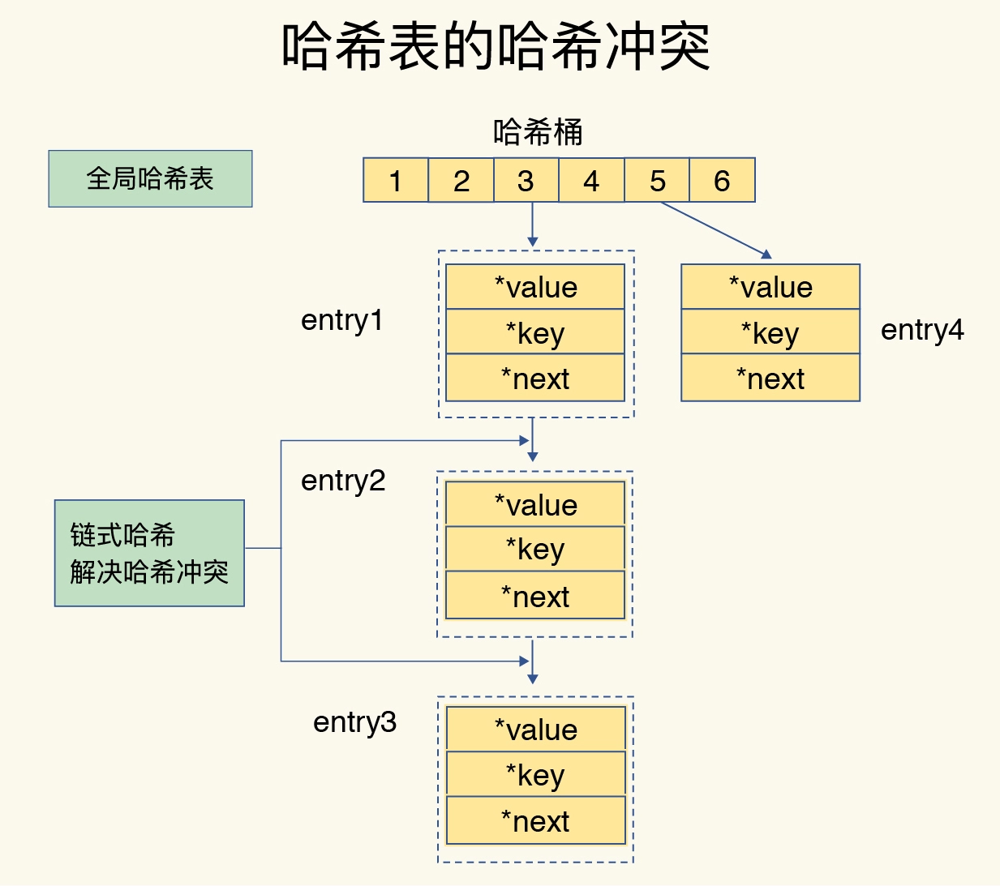
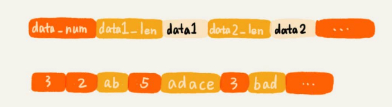
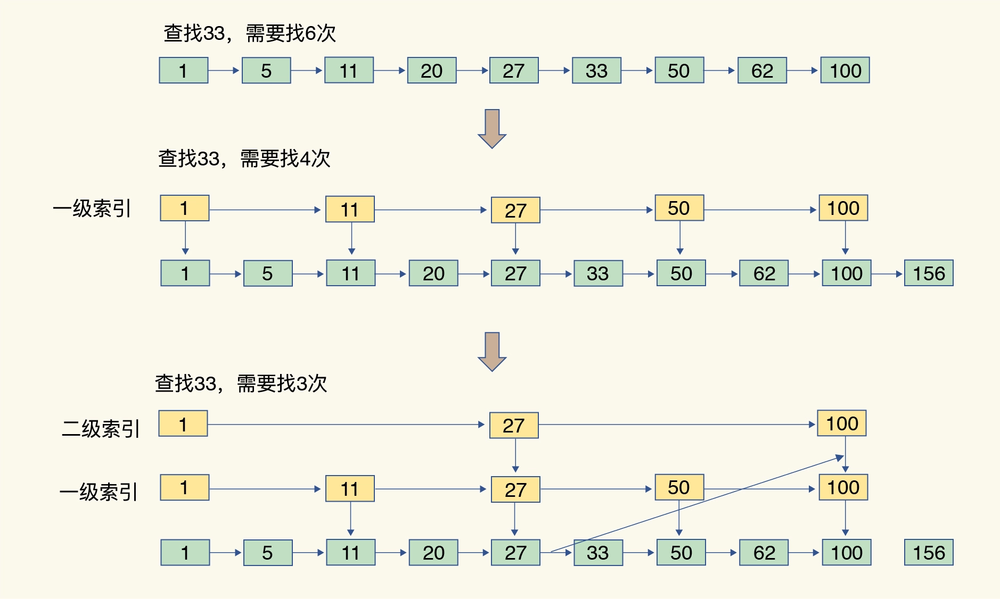

### 设计
1. 认识
   - 单进程单线程，命令是串行执行。包含单线程设计机制以及多路复用机制
     1. 认识
        - 主要指redis的网络io和键值对读写是由一个线程来完成的，其他如持久化/异步删除/集群数据同步等，由额外线程执行
        - 避免了并发访问控制的锁等待开销
     1. 特点
        - 处理所有的客户端连接、命令并发读写、内存数据结构逻辑读写的请求
        - 遇到阻塞，所有人等待
        - 单线程特性保证命令原子执行
1. 架构组成
   - 访问框架
   - 网络访问框架：socket server、请求解析
   - 基于不同value类型的操作模块
   - 索引模块
   - 存储模块：内存分配器、持久化(aof/rdb)
   - 高可用集群模块：主从复制、哨兵机制
   - 可扩展集群支撑模块：分片机制
1. 连接
   - 监听socket：或者监听端口来接收来自客户端的连接
     1. 客户端socket会被设置为非阻塞模式，因为Redis在网络事件处理上采用的是非阻塞多路复用模型
     1. socket设置TCP_NODELAY属性，禁用Nagle算法
     1. 创建一个可读的文件事件用于监听这个客户端socket的数据发送
   - 通信协议
     1. 认识：RESP Redis序列化协议，是直观的文本协议，优势在于实现异常简单，解析性能极好
     1. 数据结构
        - 单行字符串         + 符号开头
        - 多行字符串         $ 符号开头，后跟字符串长度
        - 整数值            : 符号开头，后跟整数的字符串形式
        - 错误消息           - 符号开头
        - 数组              * 号开头，后跟数组的长度
1. 命令
   - scan
     1. 采用高位进位加法遍历，考虑到字典的扩容和缩容时避免槽位的遍历重复和遗漏
        - 普通加法/高位进位加法：高位进位法从左边加，进位往右边移动，同普通加法相反。但是最终它们都会遍历所有的槽位并且没有重复
1. 内存
   - 认识
     1. 复杂的数据结构在内存中操作非常简单，redis可以做很复杂的操作
     1. 达到最大内存后，Redis会先尝试清除已到期或即将到期的Key，当此方法处理后，仍然到达最大内存设置，将无法再进行写入操作，但仍然可以进行读取操作。Redis新的vm机制，会把Key存放内存，Value会存放在swap区
     1. 虚拟内存机制：VM机制将数据分页存放，由Redis将访问量较少的页即冷数据swap到磁盘上，访问多的页面由磁盘自动换出到内存中，突破了物理内存的限制
   - 内存占用
     1. 小对象压缩：ziplist、zlbytes、zltail、zlend、intset
        - 32bit编译，内部所有数据结构的指针空间占用少一半，可用于4G内存以下
     1. 内存回收机制
        - 页上还要一个key，也不会被操作系统回收依然占用那么多，redis会重用那些尚未回收的空闲内存
     1. 内存分配算法
        - 划分内存页，需要考虑内存碎片、平衡性能和效率，redis甩手掌柜，默认使用jemalloc库，也可用tcmalloc
1. 持久化
   - 数据结构持久化方式
     1. 清除原有的存储结构，只将数据存储到磁盘中：还原到内存比较耗时，redis采用的方式
        - 如二叉树的话，通过填充叶子节点形成完全二叉树，然后以数组的形式存储到硬盘，数据还原过程也是非常高效的。如果用存储方式二就比较复杂了
     1. 保留原来的存储格式，如保存散列表的大小、数据被散列到的槽的编号等信息，可避免重新计算哈希值
   - 磁盘紧凑追加方式存在，不存在随机io
1. 主从复制
   - 步骤
     1. 主从关系建立：replicaof方式，告诉主库即将进行同步，主库确认回复后，主从就可以开始同步了，v5.0之前是slaveof
        - `replicaof masterIP 6379`：指定当前实例的主库
     1. 全量复制：
        - slave：发起psync命令，v2.8之前是sync
          1. runID：每个redis实例启动时自动生成的随机id，用来唯一标记这个实例。主从第一次复制时不知道主库的设为“?”
          1. offset：-1表示第一次复制
        - master：FULLRESYNC应答runID和offset，同意全量同步，这时使用rdb文件。使用乐观复制的机制，存在刚开始的主从数据不一致的时间窗口，但会最终同步
          1. 后台fork进程保存rdb快照，并缓存执行快照保存期间的命令(写时复制)
             - 导致io和cpu消耗，以及写时复制的内存消耗，可能造成主节点毫秒或秒级的卡顿
             - 是非阻塞的
          1. 发送rdb文件
             - 会导致网络出口爆增，磁盘顺序IO吞吐量高，会影响正常访问，并带来其他连锁影响
          1. 发送完rdb后，发送在主库将数据同步给从库的过程中没写入rdb的写操作的replication buffer，这个replication buffer每个从库都不同，不是共享的
        - slave：清空原有数据，载入rdb快照(和重启原理一样)，再执行replication buffer的命令
          1. 从同步时是非阻塞的，可设置是否响应
     1. 同步阶段：master每次收到写命令时，就将命令同步给salve，周而复始
   - 增量复制：
     1. 主库判断自己的master_repl_offset和从发过来的slave_repl_offset之间的差距
#### 功能实现
1. 定时任务
   - 实现：记录在一个最小堆的数据结构中
     1. 最快要执行的任务排在堆的最上方
     1. 在每个循环周期，Redis 都会将最小堆里面已经到点的任务立即进行处理
     1. 处理完毕后，将最快要执行的任务还需要的时间记录下来，知道可以安心睡觉了
### 数据结构的实现
1. 认识
   - 一些value类型，一个键对应了一个集合的数据
   - 操作常识
     1. 单元素操作是基础
     1. 范围操作非常耗时
        - scan作渐进式遍历，每次只返回有限数量的数据，节省资源
     1. 统计操作通常高效：结构体中已经记录
     1. 例外情况只有几个
        - 如压缩列表和双向链表都记录表头和表尾的偏移量。因此对于List类型的LPOP/RPOP/LPUSH/RPUSH四个操作是在列表的头尾增删元素，可通过偏移量直接定位，复杂度只有O(1)，快速操作
1. 底层数据结构
   - 简单动态字符串：sds
   - 整数数组：顺序读写
   - 双向链表：linkedlist，是双向循环链表吗？？？。顺序读写
   - 压缩列表：ziplist
   - 哈希表：hashtable
   - 跳表：skiplist
1. SDS
   - 认识：Simple Dynamic String 简单动态字符串
     1. c的字符串以 NULL 作为结束符，需要遍历，算法复杂度O(n)，单线程承受不起
   - 结构：是一个带长度信息的字节数组
     1. 使用泛型T，根据字符串长度使用不同数据类型，内存极致优化
     1. 存储方式：因为分配对象和sds内存的差异，embstr 最大能容纳的字符串长度是44
        - 长度不超44时，使用emb形式 (embeded)，RedisObject对象头和 SDS 对象连续存在一起，使用 malloc 方法一次分配
        - 长度超44时，使用 raw 形式，两个对象头内存地址一般不连续，需要两次malloc
   - 设计
     1. 扩容策略：预分配冗余空间，减少内存频繁分配
        - 长度小于1M加倍扩容，超过一次只会多扩1M
     1. 会自动转换类型，遇到计算了就转为数值
   - 结构
    ```c++
    struct SDS<T> {
        T capacity;       // 数组容量，分配的长度，规定长度不得超过 512M 字节
        T len;            // 数组长度，实际的长度
        byte flags;       // 特殊标识位，不理睬它
        byte[] content;   // 数组内容，以字节\0 结尾的字符串，方便使用glibc函数
    }

    struct RedisObject {
      int4 type;          // 4bits，类型
      int4 encoding;      // 4bits，存储形式，同一个类型的 type 会有不同的存储形式
      int24 lru;          // 24bits
      int32 refcount;     // 4bytes，引用计数
      void *ptr;          // 8bytes，64-bit system，存储位置指针
    } robj;
    ```
1. hashtable
   - 认识：哈希表，一个哈希表其实就是一个数组，数组的每个元素称为一个哈希桶，每个哈希桶中保存了键值对的指针，
     1. 一个桶会存储多对键值指针对
   - 操作
     1. 哈希冲突：使用拉链法解决，通过指针逐一查找
        - 哈希的数组位置碰撞时，将碰撞元素使用链表串接起来，类似java的HashMap
     1. rehash
        - 增加现有的哈希桶数量，缩短链表长度，降低冲突，防止性能下降太多
        - 渐进式rehash
   - 全局哈希表：保存了所有的键值对信息，从key找到value由全局哈希表索引完成
     1. 利用两个全局哈希表，互相渐进式搬迁，一步一步往上增长
1. rax
   - 认识：rax 有序字典树、基数树，按照key的字典序排列，支持快速地定位、插入和删除操作
     1. 易于理解，实现非常复杂
     1. 在stream中存储消息队列，可以理解为时间序列消息，使用rax结构进行存储就可快速地根据消息id定位到具体的消息，然后继续遍历指定消息之后的所有消息
   - 结构
     1. 根节点、叶节点、中间节点，有些中间节点有value，有些中间节点是结构性需要没有value
     1. rax是一棵比较特殊的radix tree，它在结构上不是标准的radix tree。如果一个中间节点有多个子节点，那么路由键就只是一个字符。如果只有一个子节点，那么路由键就是一个字符串。后者就是所谓的压缩形式，多个字符压在一起的字符串
#### list
1. ziplist
   - 认识：压缩列表，连续内存空间的自定义的数据存储结构，元素紧挨着存储
     1. 比较节省内存，读取效率高
     1. 支持不同类型数据存储
   - 结构
     1. 结构体代码：
        ```c++
        struct ziplist<T> {
            int32 zlbytes;              // 整个压缩列表占用字节数
            int32 zltail_offset;        // 最后一个元素距离压缩列表起始位置的偏移量，用于快速定位到最后一个节点
            int16 zllength;             // 元素个数
            T[] entries;                // 元素内容列表，挨个挨个紧凑存储
            int8 zlend;                 // 标志压缩列表的结束，值恒为 0xFF
        }

        struct entry {                  // 容纳的元素类型不同，也会有不一样的结构
            int<var> prevlen;           // 前一个 entry 的字节长度
            int<var> encoding;          // 元素类型编码
            optional byte[] content;    // 元素内容
        }
        ```
     1. 特点
        - 一个压缩列表表头以三个字段zlbytes、zltail和zllen为开头
        - 查找
          1. 要查找定位第一个元素和最后一个元素，可以通过表头三个字段的长度直接定位，复杂度是O(1)，查找其他是O(N)
          1. 支持双向遍历，ztail_offset字段用来快速定位到最后一个元素，然后倒着遍历
        - 增加元素：因为紧凑存储，没有冗余空间，需要用realloc扩展内存，需要一次性拷贝或者扩展原地址
        - 更新需要级联更新
     1. entry解析
        - prevlen
          1. 是一个变长的整数，当字符串长度小于254(0xFE)时，使用一个字节表示；如果达到或超出254(0xFE) 那就使用5个字节来表示。第一个字节是0xFE(254)，剩余四个字节表示字符串长度
          1. 倒着遍历时，需要通过这个字段来快速定位到下一个元素的位置
        - encoding
          1. 使用前缀位识别存储的content的数据形式，采用相当复杂的设计，如00xxxxxx，最大长度位63的短字符串，后面的6个位存储字符串的位数，剩余的字节就是字符串的内容
        - content：是可选的，如果是很小的整数就内联到encoding字段的尾部了
1. linkedlist
   - 认识：双向链表
   - 实现代码
    ```c
    typedef struct listnode {
        struct listNode *prev;
        struct listNode *next;
        void *value;
    } listNode;
    typedef struct list {
        listNode *head;
        listNode *tail;
        unsigned long len;

        // ...省略其他定义
    } list;
    ```
1. quicklist
   - 认识：快速列表
     1. 使用 quicklist 代替了 ziplist 和 linkedlist
     1. 既满足了快速的插入删除性能，又不会出现太大的空间冗余
     1. 普通链表linkedlist附加空间相对太高，prev和next指针就要占16byte，浪费空间；另外每个节点的内存都是单独分配，会加剧内存的碎片化，影响内存管理效率
     1. 插入删除非常快，时间复杂度O(1)，索引定位慢时间复杂度为O(n)
   - 结构
     1. 是ziplist和linkedlist的混合体，将linkedlist按段切分，每一段使用ziplist来紧凑存储，多个 ziplist 之间使用双向指针串接起来
     1. 快速push/pop操作，默认首尾两个ziplist不压缩，配置决定
   - 配置
     1. ziplist长度默认8kb，配置参数list-max-ziplist-size
     1. 首尾不压缩的数量：listcompress-depth 1
   - 代码
    ```c++
    struct ziplist {
      ...
    }

    struct ziplist_compressed {
      int32 size;
      byte[] compressed_data;
    }

    struct quicklistNode {
      quicklistNode* prev;
      quicklistNode* next;
      ziplist* zl;              // 指向压缩列表
      int32 size;               // ziplist 的字节总数
      int16 count;              // ziplist 中的元素数量
      int2 encoding;            // 存储形式 2bit，原生字节数组还是 LZF 压缩存储
      ...
    }

    struct quicklist {
      quicklistNode* head;
      quicklistNode* tail;
      long count;               // 元素总数
      int nodes;                // ziplist 节点的个数
      int compressDepth;        // LZF 算法压缩深度
      ...
    }
    ```
1. skiplist
   - 背景
     1. 因为要支持随机插入和删除，链表操作就要二分查找，平层太慢，所以设计为多层元素，元素可以在不同层次之间进行「跳跃」，定位时一层层下潜，越往下元素越密集
     1. 随机策略来决定新元素可以兼职写入到第几层，最顶层L31层，L2层25%的概率(0开始)，
   - 认识：跳跃列表，跳表在链表的基础上，增加了多级索引，越高级的间隙跨度越大，通过索引位置的几个跳转，实现数据的快速定位，复杂度O(log(n))
     1. 和红黑树：插入、删除、查找、迭代输出复杂度相同；区间查找跳表更高O(logn)，代码更容易实现少出错，可通过改变索引构建策略有效平衡执行效率和内存消耗
   - 结构：
     1. 查找过程就是在多级索引上跳来跳去
     1. 一共64层
     1. 每个kv块是zslnode，kv header也是，但是value为null
        - 每一层元素的遍历从kv header出发
     1. score是Double.MIN_VALUE，用来垫底
     1. kv使用指针串起来形成双向链表结构，从小到大有序排列
        - 排序时同时比较score和value，处理大批score相同的情况
        - 元素排名
          1. forward指针增加span属性，表示跨度，从前一个节点沿着当前层的forward指针跳到当前这个节点中间会跳过多少个节点
          1. 计算元素排名时，只需叠加搜索路径上所有节点的span值
     1. 不同的kv层高可能不一样，层数越高的kv越少，同一层的kv用指针串起来
        - 存储的元素越多层次就越深、深层的概率越大，只有极少数元素深入到顶层
   - 解析
     1. 查找：这个过程即搜索路径
        - 先从header的最高层开始遍历找到第一个节点 (最后一个比「我」小的元素)
        - 降一层找到第二个节点 (最后一个比「我」小的元素)
        - 最终找到最底层期望的元素
     1. 插入/删除
        - 过程：找出搜索路径，给节点随机分配层数，再将搜索路径上的节点和这个新节点通过前向后向指针串起来，再判断高度高于最大高度的，更新下，删除类似
        - 新插入的节点调用随机算法分配一个合理的层数，每层晋升概率是50%，直观上期望50%的Level1，25%的Level2，12.5%的Level3，一直到最顶层 2^-63
          1. 标准源码中的晋升概率25%，所以跳跃列表更加扁平，层高相对较低
     1. 更新
        - 更改值、调整位置，简单策略是先删了再加入，需要两次路径搜索，redis这么干有优化空间
   - 代码
    ```c++
    struct zsl {
        double score;
        String value;

        int maxLevel;                   // 跳跃列表当前的最高层
        zslnode* header;                // 跳跃列表头指针
        zslnode* backward;              // 回溯指针
        zslforward*[] forwards;         // 多层连接指针

        map<string, zslnode*> ht;       // hash 结构的所有键值对
    }

    struct zslnode {
        string value;
        double score;
        zslnode*[] forwards;            // 多层连接指针
        zslnode* backward;              // 回溯指针
    }

    struct zslforward {
        zslnode* item;
        long span;                      // 跨度
    }
    ```
1. listpack
   - 认识：紧凑列表，对ziplist的改进，v5.0
     1. 消灭了ziplist 存在的级联更新，元素之间独立
   - 代码
    ```c++
    struct listpack<T> {
        int32 total_bytes;          // 占用的总字节数
        int16 size;                 // 元素个数
        T[] entries;                // 紧凑排列的元素列表
        int8 end;                   // 同 zlend 一样，恒为 0xFF
    }
    ```
1. sortedlist
   - 认识：有序列表
   - 使用范围
     1. 数据都是整数
     1. 数据个数不超512
### 数据类型
1. 数据类型的底层实现
   - string：sds
   - list：quicklist，早期版本元素少时用ziplist，多时用linkedlist
   - hash：hashtable + ziplist
   - set：intset + hashtable + listpack，字典中所有value都是null，其它的特性和字典一样
   - zset：ziplist + skiplist
1. list
   - ziplist：满足优先使用
     1. 列表中单个数据小于64byte
     1. 列表中数据个数少于512
1. dict
   - 认识：字典，最常见的复合数据结构
     1. 使用MurmurHash2哈希算法作为哈希函数，运行速度快、随机性好的，哈希冲突使用链表法解决
     1. 支持hashtable的动态扩容、缩容
   - 使用范围
     1. hash
     1. zset的value和score的映射关系
     1. 所有key和value组成全局字典
     1. 所有带过期时间的key
   - 实现
     1. ziplist，满足即优先使用
        - 列表中单个数据小于64byte
        - 列表中数据个数少于512
     1. hashtable
   - 结构
     1. hashtable：包含两个，通常只有一个有值，扩容缩容时进行渐进式搬迁
        - 分桶的方式解决 hash 冲突，第一维是数组，第二维是链表。数组中存储的是第二维链表的第一个元素的指针
        - 元素在第二维链表上，使用siphash的hash函数平均的将元素放到第一维的某个数组位置，hashtable才能是平衡的
          1. hash攻击：利用hash函数存在偏向性，让第二维链表长度极不均匀，导致查找效率急剧下降，从 O(1)退化到 O(n)，拖垮服务器
   - 设计
     1. 渐进式rehash：保留新旧两个hash结构并同时查询，在后续的定时任务中及hash的子指令中渐进的迁移
        - 大字典扩容比较耗时间，需要重新申请新数组，将旧字典所有链表中的元素重新挂接到新的数组下面，O(n)操作太耗时，redis一点点的搬
        - 触发：定时，相关指令执行
     1. 扩容
        - 数据增加hashtable的装载因子不停变大大于1时。为避免性能下降触发扩容为2倍左右，小于0.1时缩容到0.5倍
        - 使用渐进式扩容缩容策略
        - 元素的个数等于第一维数组的长度，扩为2倍
        - bgsave时，为了减少内存页的过多分离 (Copy On Write)，不会扩，元素个数到5倍时强制扩容
     1. 缩容：元素个数低于数组长度的 10%，不会考虑bgsave条件
   - 代码
    ```c++
    struct zset {
      dict *dict;         // all values value=>score
      zskiplist *zsl;
    }


    struct dict {
      ...
      dictht ht[2];
    }

    struct dictht {
      dictEntry** table;  // 二维数组
      long size;          // 第一维数组的长度
      long used;          // hash 表中的元素个数
      ...
    }

    struct dictEntry {
      void* key;
      void* val;
      dictEntry* next;    // 链接下一个 entry
    }
    ```
1. set
   - 实现
     1. intset：有序数组，小整数集合，满足元素都是整数且个数小于512优先使用
     1. hashtable：没有拉链即可，预先分配一个固定大小的数组来存储键值对，使用散列函数生产数组索引
     1. listpack：v7.2新增，sds优先使用listpack，为提高内存利用率和操作效率，因为hashtable的空间开销和碰撞概率都比较高
        - 阈值条件
          1. set-max-listpack-entries：最大元素个数，默认128
          1. set_max_listpack_value：最大元素大小，默认64
1. sortedset
   - 认识：存储附带得分的一组数据
     1. 用ziplist记录value和score的关系
     1. 用skiplist提供范围查找，支持快速按照得分值、得分区间获取数据
   - 实现：skiplist + ziplist
     1. ziplist，满足即优先使用
        - 所有数据的大小都小于64byte
        - 元素个数要小于128