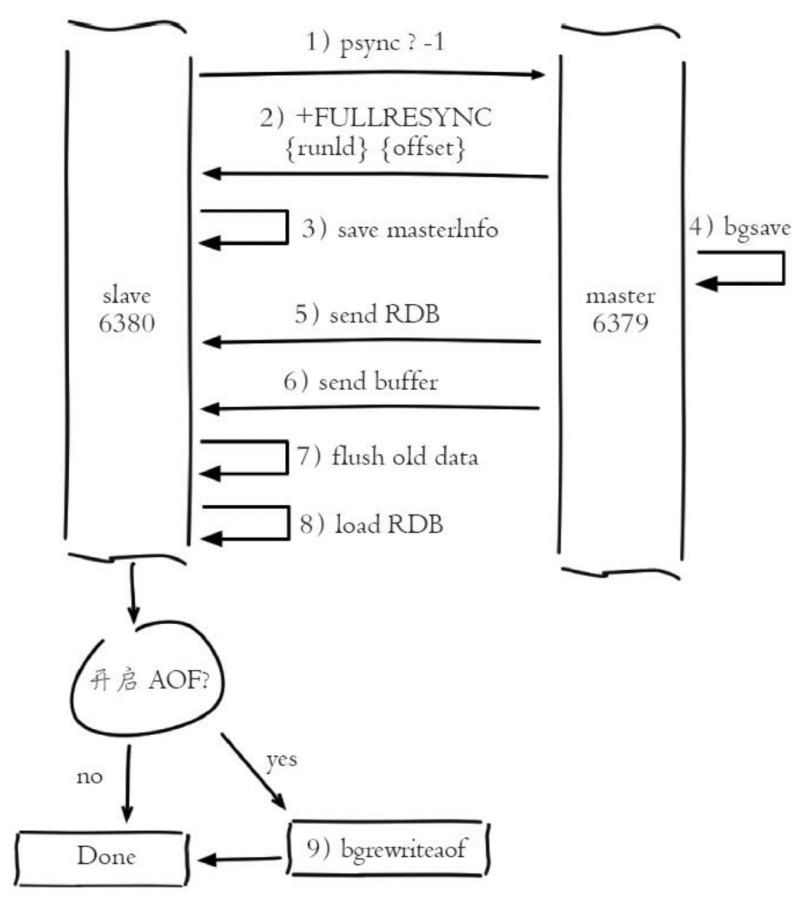
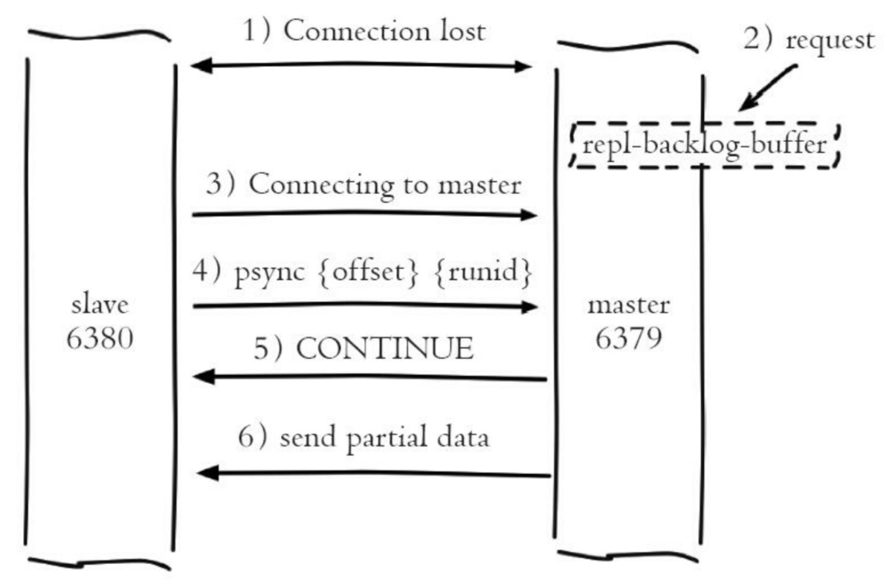
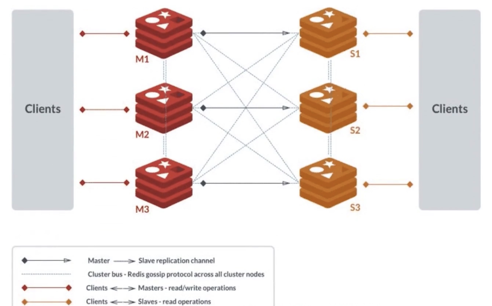
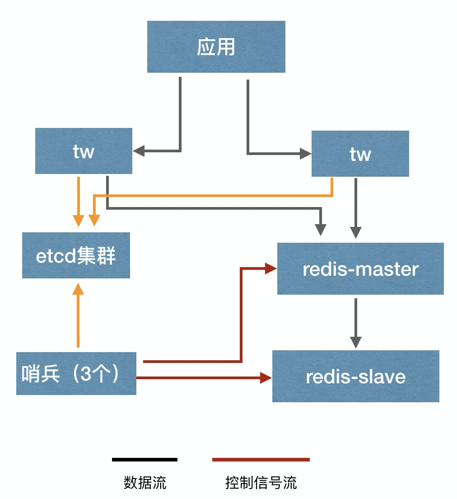
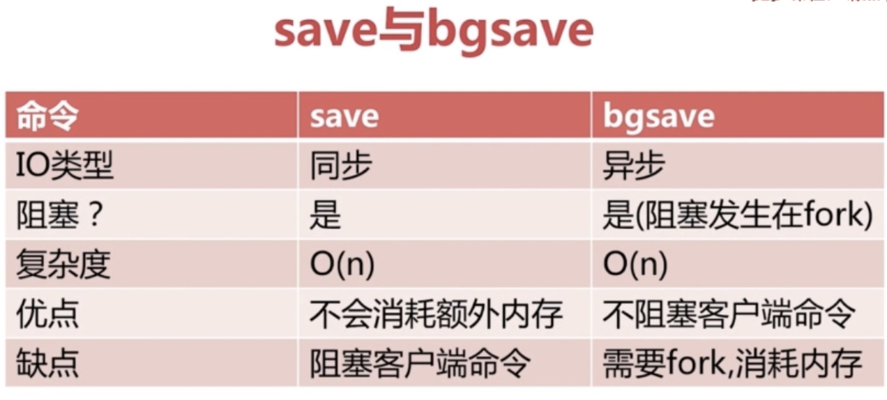
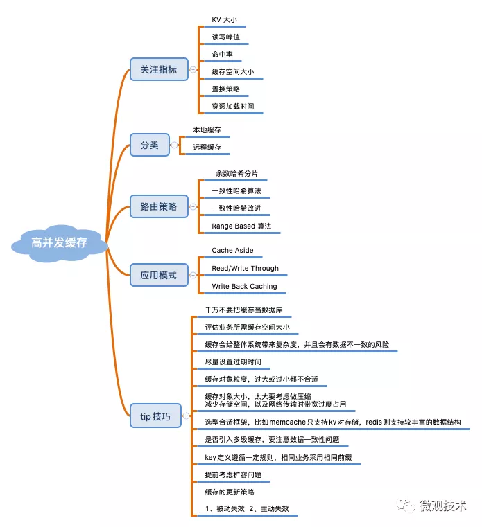
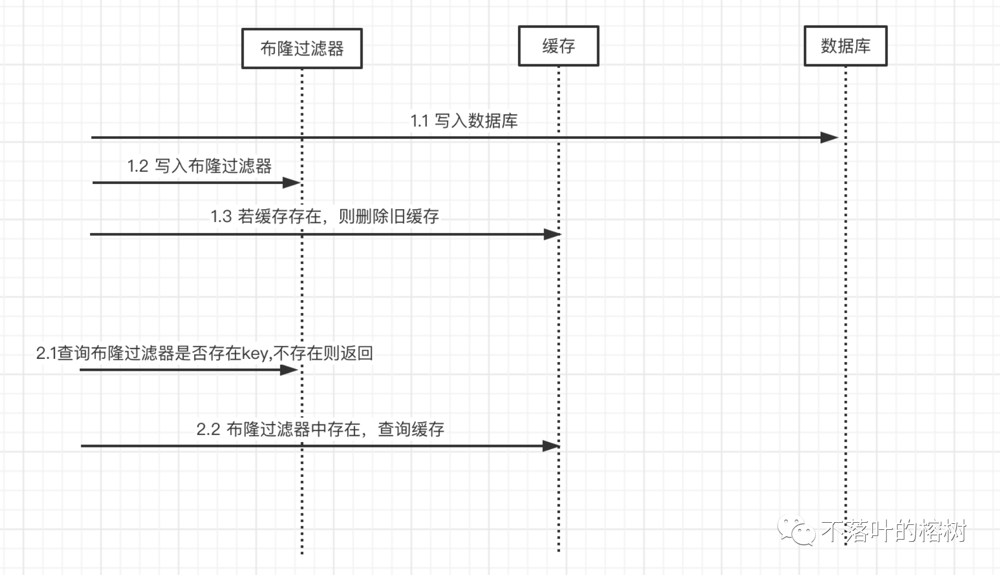

### 认识
1. 理解：开源、基于内存、可持久化的日志型的Key-Value非关系型数据库，对关系型数据库起到补充作用。常用作缓存、数据库、消息中间件，使用ANSI C编写
   - 速度快，性能高：读11万次/秒，写8万次/秒
   - 数据结构丰富
   - 功能多，key过期，发布/订阅模式，事务、Lua脚本
   - 所有操作都是原子的
   - 数据持久化、LRU回收
   - 主从同步、Sentinel提供高可用，Cluster提供自动分区
#### 基本
1. 数据类型
   - string
     1. 认识：字符串，键值对类型、二进制安全的字符串，意味着可包含任意对象(如一个图片)，最大512MB
        - 自动扩展大小、数据类型自动转换
     1. 命令
        - set/get、mset/mget、setbit/getbit：单个、多个、位操作，按照偏移量设置位(可做Bloom过滤器)
          1. set
             - EX：过期时间秒
             - PX：过期时间毫秒
             - NX：不存在才设置
             - XX：存在才设置
        - setex/psetex、setnx/msetnx、setrange/getrange：设置过期时间、存在才设置、按照偏移量设置
        - incr/incrby/incrbyfloat、decr/decrby：加/减、一/N，可当原子计数器
        - getset、strlen、append：设置并返回旧值、长度、追加到末尾
   - list
     1. 认识：双向链表，首尾插入的按照插入顺序排序的字符串列表，访问中间的时间复杂度为O(N)，最多40亿个(2^232-1)
        - 存储消耗要高于单个字符串，但是可以部分获取，不用像string整个取出来再解码
     1. 命令
        - lpush/rpush/lpop/rpop/rpoplpush/lpoprpush/lpushx/rpushx：压入、弹出、存在时才压入
        - blpop/brpop/brpoplpush：支持指定最大秒数的阻塞式弹出数据，单位秒
        - lset/linsert：指定位置的设置、前/后插入元素
        - lrange/lindex/llen：范围查看、指定位置查看、查看长度
          1. `lrange xx 0 -1`：查看所有，-1表示从尾部开始
        - lrem/ltrim：删除、指定范围删除
   - hash
     1. 认识：哈希，哈希类型的键值对集合，field为string类型，可存储对象，最多40亿对
        - 存储消耗高于字符串
     1. 命令
        - hset/hmset/hsetnx：设置
        - hget/hmget/hgetall：获取
        - hkeys/hvals/hlen/hscan：键值对数量、迭代键值对
        - hincrby/hincrbyfloat：单个key可以计数，加一
        - hdel/hexists：删除n个字段、是否存在某个字段
   - set
     1. 认识：无序集合，string类型的成员唯一的无序集合。通过hash table实现，所有操作复杂度都是O(1)
     1. 命令
        - sadd/spop/smove/srem：移除某一随机元素、移到另一集合、移除n个
        - sdiff/sdiffstone/sinter/sinterstone/sunion/sunionstone：求差集、求交集、求并集。[并储存到另一个集合]
        - scard/sismember/smembers/sscan：成员数量、是否成员、返回所有成员、迭代元素
   - zset
     1. 认识：有序集合，string类型的成员唯一的有序集合，每个元素关联一个double类型的分数
        - 成员唯一，分数可重复
        - 可通过分数进行排序，通过哈希表实现，最多40亿个(2^232-1)
        - 适用于有序且不重复
     1. 命令
        - zadd/zrem/zremrangebylex/zremrangebyscore/zremrangebyrank
        - zcard/zcount/zlexcount/zscan：成员数、指定分数区间的成员数、指定字典区间的成员数
        - zrange/zrangebylex/zrangebyscore：通过索引区间、字典区间、分数返回成员
        - zrevrange/zrevrangebyscore/zrevrank：通过索引、分数返回指定区间成员、返回排名。分数都是从高到底
        - zscore/zrank：返回分数值、返回指定成员索引
        - zincrby：已存在的score值增量加increment，不存在则添加
        - zinterstore/zunionstore：计算交并集
   - stream
     1. 认识：强大的支持多播的可持久化消息队列，代替PubSub未来消息队列的最佳方案，借鉴kafka，v5.0
        - 消息链表存储id和内容，是持久化的
        - 结构是时间唯一序列的数组队列
     1. 组成
        - 消费组：，每个消费组都有last_delivered_id，状态独立不相互影响
        - 消费者：消费组可以挂多个消费者，竞争关系，任一消费游标都往前
          1. 消费者内部状态变量pending_ids，记录被读取没有被ack的消息，用来确保客户端至少消费一次
        - 消息
          1. 消息id：timestampInMillis-sequence形式，该毫秒内产生的第n条消息，
          1. 消息内容：键值对，这没什么特别之处
     1. 概念
        - 独立消费：不定义消费组进行消费，当成普通消息队列使用，没有新消息可以阻塞等待，xread
        - 定长队列：xadd maxlen
     1. 使用
        - del
        - xadd/xdel/xrange/xlen
        - xreadgroup/xack：读取、确认收到
        - xread：使用上一个消息id获取新的
        - xgroup create：消费组设置
     1. 对比
        - Kafka支持动态增加分区数量的能力，但这种调整能力蹩脚，不会把已存在的内容进行rehash。这种简单的动态调整的能力通过增加新的 Stream 就可以做到
1. 数据类型的适用场景
   - string：可持久化的缓存，如session_id为key的session，二进制安全，图片、文件什么的，原子计数器做粉丝数、关注数、ip封锁次数啥的
     1. incr
        - 锁、原子计数器
        - 限流
        - 幂等：如MQ防止重复消费，订单防重，订单5分钟之内只能被消费一次，订单号作为key
   - list：消息排行，消息队列，日志收集器，配合发布订阅
   - hash：存对象数据，如用户基本信息，直接更新即可
   - set：做不重复的集合，存不重复用户名啦、每日投票一次啦
   - zset：有序的不重复集合，如热门内容的排序，只需修改score，排行榜
1. 操作
   - 库
     1. select index：切换库，更像命名空间，隔离key名冲突。索引号只能是数字不能自定义，可设置数量，开始和默认是0
     1. move：移动key到某个库中
   - 查看
     1. dbsize：key的数量
     1. keys：查找符合给定模式的key，支持模式匹配，会阻塞单线程的redis
     1. exists：是否存在
     1. type：查看类型
     1. scan：基于游标支持模式匹配遍历key，会使过期的key删除，带来内存占用的下降
        - 不会阻塞线程，提供limit参数
        - 返回结果可能重复，需要客户端去重
        - 遍历的过程中的数据修改，改动后的数据能不能遍历到不确定
        - 单次返回的结果是空的并不意味着遍历结束，而要看返回的游标值是否为零
     1. sort by xx*->xx desc get xx*->xx get # store xx：对队列、集合按照某些规则排序，by可用通配符，get用于获取指定键值，store结果存储
   - 过期时间
     1. 认识
        - string在set后会清除过期时间
     1. 命令
        - expire/pexpire：[用毫秒]设置过期时间
        - expireat/pexpireat：用[毫秒]时间戳设置过期时间
        - ttl/pttl：用[毫]秒返回剩余时间，time to live
        - persist：移除过期时间
     1. 删除机制
        - 定时：内部定时任务，默认10秒
          1. 不扫描所有key，简单的贪心策略，随机选20个过期超过四分之一就继续重复扫描
          1. 设置扫描时间上限，默认25ms
        - 惰性：用时判断
        - 主动：达到最大内存占用的时候触发，使用近似的lru算法，lru本身太费内存，每个key增加24bit时间戳，随机拿5个淘汰最旧的
          1. v3.0增加淘汰池，淘汰掉最旧的一个key之后，保留剩余较旧的key列表放入淘汰池中留待下一个循环
   - 修改
     1. rename/renamenx：[key不存在时]重命名
     1. del
     1. unlink：v4.0，异步删除，防止大key卡顿
        - key小了就直接删除
        - 先删除引用，将key的内存回收操作包装成任务塞进异步任务队列
   - 其他
     1. randomkey：随机返回
     1. dump：序列化
     1. echo string：打印字符串
1. 模块
   - bitmaps
     1. 认识：位图，即位的数组，用位可以表示两种情况，节省存储，如员工全年签到数据
        - 其实就是普通的字符串，也就是byte数组，可以用get/set，也可以用getbit/setbit看成「位数组」来处理
     1. 操作：「零存整取」、「零存零取」、「整存零取」都行，「零存」使用setbit对位值进行逐个设置，「整存」使用字符串一次性填充所有位数组
        - getbit/setbit
        - bitcount/bitpos
        - bitfield：v3.2，多个位的操作
   - hyperLogLog
     1. 认识：不精确的去重计数方案，标准误差0.81%，如统计千万级UV的页面，要个数就行
        - 输入元素数量非常大时，计算基数所需的空间总是固定的、很小的，就可以计算接近2^64个不同元素的基数
        - 只计算基数，不储存输入元素，无法知道在不在里边
        - 稀疏矩阵占用空间渐渐超过了阈值时才会一次性转变成稠密矩阵，才会占用12k的空间
        - 涉及概率论
     1. 命令
        - pfadd/pfmerge：添加、合并
        - pfcount：返回估算值
   - GeoHash
     1. 认识：geospatial，地理空间索引半径查找，如附近的人，v3.2
        - 结构只是个zset，score是GeoHash的52位整数值
     1. 操作
        - geoadd：没有删除
        - geopos/geohash：获取经纬度坐标、hash
        - georadiusbymember/georadius：附近的其他元素
        - geodist：计算两个元素之间的距离
     1. wiki
        - 最佳实践
          1. 全部放在一个zset中，使用单独实例部署，不使用集群环境
          1. 数据量大了，按国家/省/按市等拆分，降低单个zset集合大小
        - 附近人实现
          1. 勾股定理，经纬度坐标的密度不一样，勾股定律计算平方差时之后再求和时，需要按一定的系数比加权求和
          1. 一般通过矩形区域来限定元素的数量，然后对区域内元素进行全量距离计算再排序
          1. 矩形区域计算，r为半径：`select id from positions where x0-r < x < x0+r and y0-r < y < y0+r`
        - 经纬度
          1. 经度范围(-180, 180]，经度正负以本初子午线 (英国格林尼治天文台) 为界，东正西负
          1. 纬度范围(-90,90]，纬度正负以赤道为界，北正南负
#### 功能
1. 功能
   - 管道
     1. 认识：pipeline，不直接响应，一次性发送多条命令，一次性返回所有响应。减少了多次数据往返时间，提高服务端利用率
        - 本质由客户端改变指令的先后顺序，先一次性顺序发出去，再一次性顺序接收，真正只花费一个周期的等待实现多个周期等待的重叠，越多效率越高
          1. 写的真正耗时：等待发送缓冲空出空闲空间
          1. 读的真正耗时：等待空的接收缓冲有数据
     1. 使用
        ```php
        $redis->pipeline();
        $redis->exec();
        ```
   - 超时
     1. 认识：expire，设置超时时间，超时后不删除，只有对值进行改变才会删除，过期是不可靠的
        ```lua
        SET mykey "Hello"
        EXPIRE mykey 10
        ```
     1. 删除策略
        - 被动删除：读写时触发
        - 主动删除：后台每秒10次取出100个检查是否超过25个过期，超过则继续如此处理
        - 内存超限时触发
   - 发布订阅
     1. 认识：pub/sub，可以实现多播的消息通信模式，发送订阅模型，是原子的
        - 挂掉的消费者重新连上期间的消息会被丢弃，重启消息不会持久化，因为相当于一个消费者都没有
     1. 使用
        - subscribe/unsubscribe/psubscribe/punsubscribe：订阅/退订n个，[指定模式(通配符*等)]
        - publish：发布
        - pubsub：查看订阅和发布系统状态
   - 事务
     1. 认识：exec之前不执行缓存在一个事务队列中，执行完毕后一次性返回所有指令的运行结果
        - 原子性：2个命令组合起来才算是完成一个业务，但是2个命令组合起来就不具备原子性，所有在两个命令之间其他客户端会出现读写脏数据的情况
        - 事务中不能获取同一事务其他命令执行的结果
        - 语法错误所有命令不执行，运行错误不影响其他命令执行，不满足原子性，只满足隔离性(当前事务不被其它事务打断)
          1. 单线程特性保证能得到原子执行
        - 事务模型很不严格，不能原子执行，无回滚机制
          1. 无回滚机制，需要自己收拾烂摊子
     1. 使用
        - multi：标记开始
        - watch：监视n个key，exec前值被改变则取消事务，即提供了CAS(check-and-set)行为，即乐观锁
          1. 在multi之前watch
        - unwatch：取消所有key的监视
        - exec：执行事务
        - discard：取消
   - 脚本
      - 认识：支持lua脚本，内嵌lua解释器
      - 命令
        1. `eval script numkeys key`：执行，会缓存sha1以便下次用evalsha调用
           - 如`eval "return {KEYS[1],KEYS[2],ARGV[1],ARGV[2]}" 2 key1 key2 first second`
        1. `evalsha sha1 numkeys key`：指定sha1码执行，可以第一次eval，之后省传输用evalsha
        1. `script load script`：加载，不执行
        1. `script exists script`：是否已加载
        1. `script kill`：杀死脚本
        1. `script flush`：移除
#### 应用
1. 队列
   - 即时队列
     1. 措施
        - 模拟ack：单个队列一旦pop出去客户端崩溃，消息丢失，利用rpoplpush弄个备份队列，用lrem删除消息作ack，同时搭配监视程序超时重试、报警等
        - 轮询不延迟：使用blpop/brpop阻塞读，空队列轮询时进行睡眠的消息延迟问题
        - 闲置连接主动断开重试的处理
        - 无法实现多播，否则就要使用pub/sub
     1. 代码
        ```php
        ini_set('default_socket_timeout', -1);                          // socket不超时

        $redis = new Redis();

        $redis->connect('127.0.0.1',6379);

        while($message = $redis->brpop('queue_list_test',0)) {
            var_dump($message);
        }
        ```
   - 延时队列
     1. zset实现，消息到期时间为score
        - 多线程作高可用轮询zset
        - zrem决定多线程唯一的属主，zrangebyscore和zrem进行lua脚本原子化操作，多线程之间争抢任务不会浪费白取一次任务
     1. 实例
        ```py
        # 消费消息
        def loop():
            while True:
                values = redis.zrangebyscore("delay-queue", 0, time.time(), start=0, num=1)         # 最多取 1 条
                if not values: 
                    time.sleep(1)                                               # 延时队列空的，休息 1s
                    continue
                value = values[0]                                               # 拿第一条，也只有一条
                success = redis.zrem("delay-queue", value)                      # 从消息队列中移除该消息
                if success:                                                     # 因为有多进程并发的可能，最终只会有一个进程可以抢到消息
                    msg = json.loads(value)
                    handle_msg(msg) 
        # 添加消息
        def delay(msg):
            msg.id = str(uuid.uuid4()) # 保证 value 值唯一
            value = json.dumps(msg)
            retry_ts = time.time() + 5 # 5 秒后重试
            redis.zadd("delay-queue", retry_ts, value) 
        ```
1. 锁：锁的性能也是很高
   - 使用incr的原子计数特性实现库存扣减，防止超卖
   - 单实例分布式锁
     1. 实现
        - 加锁：set nx ex rangeValue，排他+过期+随机串，一段时间内唯一
        - 解锁：lua脚本判断随机value相等和删锁进行原子执行
          1. 设置一个不可猜测的长随机字符串作为口令串，防止持有过期锁的客户端误删现有锁
     1. 特性
        - 可重入性：支持线程在持有锁的情况下再次请求加锁就是可重入。程序要存储当前持有锁的计数，精确一点还需要考虑内存锁计数的过期时间
        - 过期性：存在执行时间超出锁时间，造成同时拥有锁，这就是setnx陷阱，可以在拿到锁三分之二时间后，进行锁的延时申请，这个申请要和一开始拿锁的校验等级相同
          1. 具体实现有java的redisson。由于需要业务代码和定时触发器同时运行，php没有异步，除非扩充多进程
     1. 加锁失败的处理
        - 直接抛出异常，通知用户稍后重试
        - sleep一会再重试：碰撞频繁不合适
        - 将请求转移至延时队列，过一会再试：合理
   - 分布式锁
     1. RedLock：一个集群中依次在大多数节点建锁(n/2+1)，建锁时间小于超时时间则成功，否则就删掉全部锁重抢(即使有的节点没有加锁成功)
        - 基于集群都是独立master，不存在集群协调机制，否则主从的架构可能在主从切换时恰好导致同时拥有锁
        - 客户端应设置响应超时时间，防止集群挂掉傻傻等待，并在超时时删掉全部锁。还可轮询重试抢锁。同样服务端也不要留给某个节点太长时间，应该尽快尝试下一个
        - redlock内部在客户端无法取到锁时，应该在一个随机的并且大于拿锁时间的延迟后重试，尽可能防止多客户端在同时抢夺同一锁(防止脑裂，没人会拿到锁)
          1. 拿到锁的时间越短，脑裂概率越低
          1. 客户端拿锁失败时，应尽快释放锁，否则已经存在脑裂，只能等待锁自动释放，叫做惩罚
        - 使用当前时间减去开始拿锁时间即获取锁使用的时间
        - 时钟漂移带来的时间差对于失效时间来说几乎可以忽略不计
        - redis重启时，没有备份锁排斥性失效，有AOF没有fsync=always也不行，不过有AOF重启后失效时间还是按照之前的，可以设置重启机ttl后再提供服务，但可能会导致服务整体不可用的时间变长
     1. etcd
     1. zk：抢锁就是节点尝试创建临时znode，建锁失败则注册监听器，解锁就是删除znode，然后zk通知客户端抢锁，也可弄成顺序节点，多个抢锁就依次监听上个znode
     1. 比较：zk设计定位就是分布式协调，注册监听器即可，但大并发压力会较大，比redis的轮询性能开销小
     1. mysql：利用排它锁，性能和sql超时导致的锁超时，`select * from lock where lock_name=xxx for update;`
1. 限流
   - 计数器：incr设置有效期内的大于某个数量，触发限流，有效期就是限流时间单位，数量就是最高请求量，不是平均限流
    ```java
    /**
     * 60秒内最大1000次
     * @param key  可以设计为用户标识及接口标识组合
     * @param expireMillis 过期时间60s
     * @return
     */
    public Boolean limiter(String key, Long expireMillis) {
        Long count = redisTemplate.opsForValue().increment(key, INCREMENT_STEP);
        if (1 == count) {
            redisTemplate.expire(key, expireMillis, TimeUnit.SECONDS);
        }
        if (count > 1000) {
            return Boolean.TRUE;
        }
        return Boolean.FALSE;
    }
    ```
   - 滑动窗口
     1. 结构：zset结构，同一个用户同一种行为用一个zset记录，用score圈出时间窗口，value只需要保证唯一性即可用毫秒时间戳
        - 如果是冷用户，滑动时间窗口内的行为是空记录，zset就可以从内存中移除，不再占用空间
        - 如果限流值非常大，会消耗很大内存，不适合数据量大的
     1. 实现
        - 每一个行为到来时，都维护一次时间窗口，将时间窗口外记录清理掉，只保留窗口内记录
        - 通过统计滑动窗口内的行为数量与阈值max_count进行比较就可以得出当前的行为是否允许
     1. code
        ```python
        # coding: utf8
        import time
        import redis

        client = redis.StrictRedis()

        def is_action_allowed(user_id, action_key, period, max_count):
            key = 'hist:%s:%s' % (user_id, action_key)
            now_ts = int(time.time() * 1000)                                    # 毫秒时间戳
            with client.pipeline() as pipe:
                # 记录行为
                pipe.zadd(key, now_ts, now_ts)                                  # value 和 score 都使用毫秒时间戳
                # 移除时间窗口之前的行为记录，剩下的都是时间窗口内的
                pipe.zremrangebyscore(key, 0, now_ts - period * 1000)
                # 获取窗口内的行为数量
                pipe.zcard(key)
                # 设置 zset 过期时间，避免冷用户持续占用内存
                # 过期时间应该等于时间窗口的长度，再多宽限 1s
                pipe.expire(key, period + 1)
                # 批量执行
                _, _, current_count, _ = pipe.execute()
            # 比较数量是否超标
            return current_count <= max_count
        
        for i in range(20):
            print is_action_allowed("laoqian", "reply", 60, 5)
        ```
   - 漏斗
     1. 认识：redis-cell 限流模块，提供原子限流指令，限流就变得简单了，使用漏斗算法，v4.0
        - 取漏斗容量，内存计算，再减去容量，都变成原子的了
        - 如果被拒绝了，就需要丢弃或重试，连重试时间都帮你算好了，直接取返回结果数组的第四个值进行sleep即可
     1. cl.throttle：只有1条指令，每xx秒最多xx次
     1. 其他实现
        ```php
        private function getLuaScript()
        {
            $luaScript = <<<LUA_SCRIPT
            -- 限制从队列中取出消息的速度
            
            local times = redis.call('incr', KEYS[1]);    --将key自增1

            if times == 1 then
            redis.call('expire', KEYS[1], ARGV[1])        --给key设置过期时间
            end

            if times > tonumber(ARGV[2]) then
            return 0
            end

            return 1
            LUA_SCRIPT;

            return $luaScript;
        }
        ```
1. 布隆过滤器
   - 认识：Bloom Filter，可理解为不怎么精确的set结构，v4.0
     1. 不存在时肯定不存在
   - 操作
     1. bf.reserve：参数设置，initial_size估计的过大浪费存储空间，过小影响准确率
     1. bf.add/bf.madd
     1. bf.exists/bf.mexists
1. 分区
   - 认识：分割数据到多个Redis实例。提高容量，扩展计算能力和带宽
     1. 不支持多个key同时操作，事务中也不行
     1. 多实体数据库维护复杂，容量调整复杂，用presharding解决
   - 类型
     1. 范围：不同范围放到不同实例中，需要维护范围表
     1. hash：使用crc32将key转为数字，然后取模(模为实例数量)确定实例
   - 自动分区：cluster
### 架构
1. 持久化
   - 认识
     1. rdb是全量快照，aof是增量日志
     1. 二者结合使用，重启优先使用aof恢复
   - 方式分类
     1. RDB
        - 认识：redis database，在指定的时间间隔内生成数据集的时间点快照，可以恢复全部数据，适用于灾备
          1. 是内存数据的二进制序列化形式，存储上很紧凑，可以设置为压缩形式
          1. 是一个非常重的操作，不适合做实时持久化
          1. redis崩溃会丢失最后一次rdb操作之后的数据
          1. 内存数据在进程产生的一瞬间就固定了，接下来子进程就可安心遍历数据进行序列化写磁盘
        - 原理
          1. 设置是否fork子进程进行操作
          1. 使用unix写时复制功能，fork之后到快照进程结束前的修改/新增不会被记录
          1. 快照结束后替换rdb文件
        - 触发条件
          1. 根据配置：save，满足其中一条就触发
          1. 执行命令：save/bgsave、flushall
          1. 主从复制：复制初始化会自动快照
        - 最佳实践
          1. 如果修改/新增较多较大时，占用内存可能显著增大，因为写时复制会增加内存占用，需要设置linux的应用申请内存超过可用内存
          1. rdb文件是默认设置被压缩的，1000万键值对，大小1G的rdb，载入内存花费20多秒
        - 配置
          1. dbfilename：默认dump.rdb
          1. save <seconds> <changes>：n时间内，n次更新操作，就将数据同步到数据文件，可存在多条，或的关系
          1. dir：目录
          1. rdbcompression：是否压缩，关闭节约cpu，但是文件变的巨大
     1. AOF
        - 认识：append only file，增量日志，以redis协议的格式来保存，新命令会被追加到文件的末尾，后台可进行重写压缩大小
          1. 只记录修改的命令
          1. rdb搭配aof使用可极大降低数据丢失可能性，甚至可以不要rdb
          1. 启动时优先rdb先恢复数据，逐个执行aof命令载入数据，比rdb方式慢
          1. 由于操作系统的缓存机制，aof记录后没有真正写入硬盘，系统默认30秒同步一次，如果系统异常则数据丢失，可设置appendfsync同步硬盘的时机
          1. redis是写后日志，和大多数数据库的wal相反，先写内存，后写日志aof，再写数据rdb
        - 实现
          1. aof_buf：内存中的记录要写入aof文件的缓冲区
          1. 重写：用于压缩aof文件，手动触发，开辟子进程进行aof优化重写到新aof文件中，如三条合一条，序列化完毕后再追加增量的，然后立即替代
             - aof重写缓冲区：为解决fork重写开始后不记录新来的命令导致的数据不一致，方案为将后边的命令也复制一份放到重写缓冲区
          1. 为什么AOF重写不复用原AOF日志？
             - 父子进程写同一个文件会产生竞争问题，影响父进程的性能
             - 如果AOF重写过程中失败了，相当于污染了原本的AOF文件，无法做恢复数据使用
          1. 在重写日志整个过程时，主线程有哪些地方会被阻塞？
             - fork子进程时，需要拷贝虚拟页表，会对主线程阻塞
             - 主进程有bigkey写入时，操作系统会创建页面的副本，并拷贝原有的数据，会对主线程阻塞
             - 子进程重写日志完成后，主进程追加aof重写缓冲区时可能会对主线程阻塞
        - 配置：默认不开启，和rdb文件位置相同
          1. appendonly：开关
          1. appendfilename：默认appendonly.aof
          1. appendfsync：记录方式，no等待系统将数据同步到磁盘(快)，always更新后将数据写到磁盘(慢，安全)，everysec每秒一次(折衷)
          1. auto-aof-rewrite-percentage：aof重写触发机制，当前aof大小超过上一次重写时大小的百分比时，进行重写
          1. auto-aof-rewrite-min-size：aof重写的最小文件大小
        - 最佳实践
          1. aof长期运行会变的超级大，为防止重启漫长，需要定期aof重写瘦身
     1. 混合持久化：v4.0，aof不再是全量的日志，而是rdb之后的增量日志，既有rdb快速恢复的好处，又有aof只记录操作命令的高性能
        - 即rdb完成后清空aof文件
1. 单机：单点故障隐患，性能瓶颈
1. 主从
   - 认识：利用复制实现数据在不同库的同步，实现读写分离、冗余备份，可继续向下配置树状从
     1. 从从同步减轻同步负担
     1. 数据安全的基础保障
   - 作用
     1. 负载均衡、读写分离
     1. 数据备份
     1. 故障转移
     1. Redis Sentinel 、Cluster的基石
   - 形式分类
     1. 一主多从
     1. 树状结构：不建议，会带来运维困难、数据一致性降低
   - 特性
     1. 快照同步：主库bgsave生成文件后，发送到从，非常耗费资源；从全量加载，将当前内存清空，加载完毕后告诉主进行增量同步
        - 如果快照同步的时间过长或者复制backlog太小，导致同步期间的增量指令在复制backlog中被覆盖，会陷入快照同步的死循环
     1. 增量同步：定长的环形数组的复制内存backlog，offset、backlog、run_id组成
        - 标识唯一运行实例：`run_id`，用于保障主从复制安全
        - 复制偏移量：`slave_repl_offset`
        - 复制缓冲：`repl_backlog_*`，主保持一个默认大小1M的先进先出的队列，有从连接时主在把写操作发送给从的同时，也写入一份到缓冲区。用于增量复制/丢失命令补救
        - replid：解决主从切换必引起全量复制的问题，通过记录旧replication id，其他从和新主执行同步时也可以增量同步
        - 如果从开启AOF，那么从重启后依然会进行全量，因为AOF没有保存replication id和offset，并且AOF的加载优先于RDB，RDB保存了这俩
     1. 主从心跳
        - 维持长连接，每隔10s主ping从，`repl-ping-slave-period`
        - 从回复offset，检查数据复制状况
        - 断线重连
          1. v2.8之前断开重连都会全量同步
          1. 偏移量不在缓冲区中只能全量同步
     1. 过期key处理：从不会让key过期，会等待主的del命令，v3.2从自己判断是否过期
     1. 加速复制：`repl-diskless-sync yes`，主不写磁盘直接发送rdb，一边遍历内存，一边发送，v2.8.18
     1. 同步复制：`wait slaveNum waitTime`，等待n秒之前的所有写操作同步到n个从，v3.0
     1. 是否延迟发包：`repl-disable-tcp-nodelay`，是否合并较小的tcp数据包以节省宽带，发送时间间隔由一般默认40ms的linux内核设置决定，默认关闭，会加重主从延迟
   - 复制原理
     1. 全量复制：v2.8之前，sync，
        - 初始化阶段
          1. slave发起sync命令，2.8之后使用psync
          1. master：乐观复制，存在一开始主从数据不一致的时间窗口，但是会最终同步。不会同步给从后再返回给客户端，保证主的性能
             - 后台进程fork保存rdb快照，并缓存执行快照保存期间的命令(写时复制)
               1. 导致io和cpu消耗，以及写时复制的内存消耗，可能造成主节点毫秒或秒级的卡顿
               1. 是非阻塞的
             - 发送rdb文件
               1. 会导致网络出口爆增，磁盘顺序IO吞吐量高，会影响正常访问，并带来其他连锁影响
          1. slave载入快照(和重启原理一致)，并执行缓存的命令
             - 从同步时是非阻塞的，可设置是否响应
        - 同步阶段：master每次收到写命令时，就将命令同步给salve，贯穿始终
     1. 增量复制：
   - 最佳实践
     1. 主从都要开启持久化
        - 主不持久化，同时出现网络分区和主宕机就会丢失数据
        - 设置最少同步的从数量，最少2个从防止网络分区
   - 命令
     1. `slaveof ip port`：设置从，可实现同步和默认的从只读
     1. `masterauth xxx`：主节点密码
     1. `slaveof no one`：停止同步(也就是变成了主)
   - 配置
     1. 增量同步
        - `repl-backlog-size`：积压队列长度，默认1M
        - `repl-backlog-ttl`：主从断开连接后，多长时间释放积压队列的内存，默认1小时
     1. 复制安全
        - `min-slaves-to-write`：主可写的最少的从数量，即设置乐观复制的尺度
        - `min-slaves-max-lag`：从最大的延迟
   - 状态：`info replication`
    ```conf
    role:master|slave
    connected_slaves:2                                          // 连接的从节点数据
    master_replid:xxxxxxxxxxxxxxxxxxxxxxxxxxx                   // 当前主节点id
    master_replid2:00000000000000000000000000                   // 老主节点id，发生主从切换时写入
    master_repl_offset:196                                      // 主节点已写入命令的偏移量，主节点会将命令转为字节写入队列，salve的offset对比得出延迟
                                                                // 以下都是2.8新增
    second_repl_offset:-1                                       // 避免每次的主从改变的全量复制
    repl_backlog_active:1                                       // 缓冲区，1开启
    repl_backlog_size:1048576                                   // 缓冲区大小，1M
    repl_backlog_first_byte_offset:1                            // 缓冲区起始位置
    repl_backlog_histlen:224                                    // 缓冲区当前长度

    // 主
    slave0:ip=xx,port=xx,state=online,offset=n,lag=1            // offset：当前从节点读取的偏移量，lag：延迟时间，秒
    // 从
    master_host:xx
    master_port:n
    master_link_status:up
    master_last_io_seconds_age:5                                // 主从最后一次同步的时间
    master_sync_in_process:0                                    // 主从同步状态，0未同步，1正在同步
    slave_repl_offset:n                                         // 从复制命令的偏移量
    slave_priority:100                                          // 从节点选举时的权重，0永远不可能
    slave_read_only:1
    ```
1. 哨兵
   - 认识：针对redis主从的分布式独立进程，提供监控、提醒、自动故障转移、配置提供者，2.6版本的sentinel不能用
     1. 属性
        - 端口26379
        - 最少3个sentinel实例，2个无法做投票
        - 独立机器中运行，甚至需要多地部署
     1. 优点
        - 降低误报可能性
        - 降低对客户端的影响
        - 任意sentinel节点都可提供服务
     1. 不足
        - 主从切换需要时间
        - 动态扩容复杂
   - TILT模式：拿不到正确的系统时间时进入，这时候无法判断redis是否下线，是sentinel的被动模式
   - 节点管理
     1. sentinel
        - 添加：直接启动
        - 删除：不会完全清除已添加过的sentinel信息
          1. 停止sentinel进程
          1. 告诉其他sentinel，`sentinel reset masterName`，也是一个个操作
          1. `sentinel master masterName`
     1. 删除旧主或者无法访问的slave：`sentinel reset masterName`，重置所有状态信息
   - 工作原理
     1. 客户端找哨兵要主节点地址，监测对比新连接的主节点地址和readOnly Error
     1. 内部定时任务
        - 每1秒每个sentinel对其他sentinel、redis执行ping
        - 每2秒每个sentinel订阅一个master的channel交换信息，检测信息传播
        - 每10秒每个sentinel对master和slave执行info
     1. 下线
        - 主观下线：sdown，单个sentinel得出的下线判断
        - 客观下线：odown，多个sentinel相互交流后得出的下线判断，然后开启failover
          1. 仲裁：少数服从多数原理，quonum
     1. 选举：raft共识算法的Leader Election方法
        - 故障迁移一致性：选择leader sentinel
          1. 一个epoch内，只有一个leader
          1. sentinel配置以最后写入者胜出的方式传播至其他sentinel
        - 选择新主
          1. 先根据权重
          1. 权重一样，根据最少的lag
          1. lag一样，run_id最小的
     1. 故障转移
        - 主恢复后会变为从
        - 新从需要全量同步新主
     1. 故障转移流程
        - 每秒ping
        - 有效回复ping的时间超时，认定主观下线
        - 共同商议后满足客观下线条件
          1. 投票选举主节点，从节点向新主全量同步数据
          1. 主标记为客观下线时，info由10s一次改为1s一次，最快恢复节点全貌
          1. sentinel节点集合更新
          1. sentinel监控新的主
        - 不满足客观下线
          1. 主客观下线状态移除
          1. 重新ping有效时，主观下线移除
   - 使用
     1. 命令
        ```
        redis-sentinel xx.conf                                  // 开启监控，只监控主数据库即可，会自动发现从，可同时监控多个主从系统
        ```
     1. 配置
        ```
        sentinel monitor masterName ip port quonum              // 执行恢复的最低哨兵通过票数，num是满足投票的比例，一般为二分之一加一
        sentinel down-after milliseconds masterName 30000       // 认定断线的豪秒数，要比主从心跳的时间长点
        sentinel failover-timeout masterName 180000             // failover操作的限定豪秒数
        ```
1. 集群
   - 认识：cluster，用于解决容量和并发性能，无中心结构、分布式、自动故障转移、高可用、可扩展。
     1. 高可用性：通过增加slave做热备数据副本，能够实现故障自动转移
     1. 官方亲儿子，去中心化，内部非常复杂，为了实现非中心化，混合使用raft和gossip协议，有大量调优参数，不好上手
   - 优点：
     1. 客户端直连，免去了代理损耗
     1. 重试时间应该大于cluster-node-time时间
     1. 不建议使用pipeline和multi-keys操作，减少max redirect产生的场景
     1. 分片了，没有库的概念
   - 缺点
     1. 数据异步复制，无法保证强一致性
     1. 不支持跨slot查询和修改，不支持跨solt事务操作
     1. 不支持多数据库空间，集群模式只能用0
     1. 不支持嵌套树状复制结构
     1. 要求客户端缓存slots mapping信息并及时更新
   - 实现
     1. 客户端获取solt信息，自己计算判断要操作的solt
     1. 跳转：节点发现不是自己的solt发出跳转，客户端自己更新配置
     1. 迁移：手动
     1. 容错
     1. 主分配solt插槽，从做故障切换
        - 最少6个节点保证高可用，3主3从，因为集群最少3个主
     1. 所有节点通过轻量的二进制流言Gossip协议连接，交换维护整个集群节点metadata，可扩展到1000个节点
        - 存放哈希槽的bitmap通过Gossip协议在结点之间传递
   - 分片方式
     1. slot：hash slot，虚拟槽，处理分区时节点变化的问题，将所有的物理节点映射到预分好的16384个slot中
        - 根据`CRC16(key) Mod 16384`决定key在哪个槽中
          1. crc16的结果是16位的，可以支持到65536进行取模运算，为什么只到16384，一是心跳消息头太大(8kb)浪费带宽，认为节点有1000个足够了，槽位越小，信息压缩越高
        - 节点变化，数据需要迁移，槽需要重新分配，服务可以不停
     1. 客户端分片：客户端直接选择正确的节点，如Jedis
        - 逻辑简单，性能高
        - 业务逻辑和数据存储逻辑耦合，可运维性查。多业务各自使用redis，集群资源难以管理，不支持动态增删节点
     1. 代理协助分片：代理根据配置的分片模式转发到正确的节点，如Twemproxy、Codis，比较成熟
     1. 查询路由：Query Routing，先到随机节点，这个节点保证你到正确的节点，或者客户端重新发起到正确节点
   - 数据分区方式
     1. 范围：同一范围查询不需要跨节点
     1. 节点取余：扩缩容数据迁移量大，翻倍扩容可相对减少迁移量
     1. 一致性哈希：每个节点分配一个token，范围一般在0~232，这些token构成一个哈希环。根据要存储的key计算hash，顺时针第一个大于等于该哈希值的token节点
        - 顺时针的组成哈希环，节点为哈希环中的键，按照节点之间的哈希范围确定位置
     1. 虚拟槽：每个node均匀分配slot范围，减少扩缩容的影响，需要存储node和slot的映射
        - CRC16(key)&16384：哈希运算后取余
   - 使用
     1. `cluster info`：查看状态
     1. `cluster nodes`：查看节点
     1. `cluster meet 127.0.0.1 6380`：连接节点
     1. `cluster addslots {0...5461}`：分配槽位
     1. `cluster replicate xx`：分配为某节点的从
     1. `redis-cli -cluster`：连接集群，c是集群模式
1. 普通tw架构：tw + redis + sentinel + keepalived
   - haproxy：负载均衡
   - keepalived：高可用
1. 网校tw架构
   - hash分片数据到redis上
   - 高可用：confd + etcd + tw + redis一从热备 + sentinel
     1. tw本身高可用
        - etcd集群做保活，设置10秒过期，tw每2秒续期，一旦tw发生变化，etcd切换tw，通知confd
          1. etcd：go编写，支持watch并且主动通知
        - confd收到etcd的通知后，完成客户端ip配置文件的更新
     1. 高可用
        - 每个业务最少提供两个 TwemProxy 供业务方连接
        - redis 发生主从切换，TwemProxy 会实时生成新的配置文件，并自动重启
     1. 客户端sdk负责负载均衡
     1. 一从热备：假如从库一直提供服务，从库一旦重连导致从库数据不对
     1. 哨兵监控：完成主从切换后，通知etcd，然后confd更新客户端ip配置文件
   - 架构图：
   - 扩容：找新机器，用工具同步存量+增量的旧数据，然后挂到tw上
#### 中间件
1. TwemProxy
   - 认识：twitter开源的redis/memcache的快速、轻量级的单线程代理服务器，可对多台redis/memcache进行管理和分配。就是分片、分布式方案
     1. 支持失败节点自动删除
     1. 支持设置HashTag：将两个key哈希到同一个实例
     1. 和redis、客户端采用长链接，减少连接数
     1. 数据自动分片
        - hash：MD5、CRC16、CRC32、CRC32a、hsieh、murmur、Jenkins
        - 分片：ketama、modular、random
        - 可设置权重
     1. 支持集群部署，上边接负载均衡
     1. 支持状态监控：监控ip、端口、刷新间隔时间
     1. 使用pipelining处理请求和响应
     1. 不支持redis事务
     1. 使用某些命令需要保证key都在同一个分片上：SIDFF,SDIFFSTORE,SINTER,SINTERSTORE,SMOVE,SUNION and SUNIONSTORE
     1. 相对于官方较新的Redis Cluster架构，容量伸缩较麻烦
     1. 支持memcached ASCII协议和redis协议
   - 如何一份数据复制两份发到两个实例？
   - 运维
     1. 同时使用tw和pipeline时，如果对pipeline的执行顺序有要求，那么要设置tw对redis的server_connections数量为1，否则会导致顺序错乱。因为tw用epoll，每个连接有独立的队列，每个连接用完就会扔到队尾准备重复利用，就势必导致两个命令在两个不同的连接上进行，到了redis那里就有可能造成顺序错乱，如zadd和expire一起用
1. Codis
   - 认识：集群解决方案，中间件，集群形式部署，go开发
     1. 支持分片，1024等倍数个solt，进行crc32取余，使用zk或者etcd共享solt关系
   - 扩容，修改solt和redis关系，用soltsscan扫描迁移key，热迁移，新来的立即进行迁移
     1. 自动均衡，空闲时自动扫描并迁移
   - 代价
     1. 事务、pipeline、rename不在一个redis的key等不支持
     1. 单key不宜太大，造成迁移阻塞
   - 优点：比官方cluster简单很多，分布式问题交给了第三方zk负责
   - 设计
     1. mget采用汇总形式
1. Pika：从rocksdb发展来的开源类redis系统，redis容量过大的解决方案，建议作Redis的备份仓库，可极大的降低运维成本
   - 用硬盘存储，速度慢
   - 支持redis协议，不是100%兼容
   - 数据在硬盘上是压缩的，迁移到redis需要将当前的容量乘以5
1. Cluster：太复杂，是去中心化的。没有tw的简单，用的稳定
### 运维
1. 客户端：发起连接，`redis-cli -h host -p port -a password`
1. 命令
   - 操作
     1. ping：查看是否运行
     1. config
        - `config get requirepass`：查看密码
        - `config set requirepass xxx/''`：设置/取消密码
     1. debug segfault：让redis崩溃
     1. monitor：实时打印接收到的命令，调试用，输出非常多，可以快速ctrl+c
   - 查看
     1. info：所有的服务器信息
        - info Stats：通用统计
          1. instantaneous_ops_per_sec：ops执行负载
          1. rejected_connections：被拒绝的客户端连接次数，观察这个设置maxclients配置
          1. sync_partial_err：主从半同步复制失败的次数，观察这个设置是否需要扩大积压缓冲区
        - info Server
        - info Memory
          1. used_memory_human:827.46K                  # 内存分配器 (jemalloc) 从操作系统分配的内存总量
          1. used_memory_rss_human:3.61M                # 操作系统看到的内存占用 ,top 命令看到的内存
          1. used_memory_peak_human:829.41K             # Redis 内存消耗的峰值
          1. used_memory_lua_human:37.00K               # lua 脚本引擎占用的内存大小
        - info CPU
        - info Persistence：持久化
        - info Replication：主从
          1. backlog相关：主从复制的效率
        - info Cluster：集群
        - info KeySpace：键值对统计
        - info Clients
          1. connected_clients：客户端连接数
     1. client list：客户端列表
   - 数据操作
     1. save/bgsave/lastsave：默认生成dump.rdb文件，查看最后一次保存，确认是否后台保存成功
        - save会阻塞所有客户端请求，避免生产环境使用
        - bgsave是fork新进程进行，fork过程中会造成阻塞，设计或使用不好同样阻塞很长时间，和save执行内容相同
        - 比较：
     1. flushdb/flushall：删除当前/所有数据库的所有key
   - 其他
     1. slowlog subcommand：管理慢日志
     1. sync：用于复制功能的内部
1. 配置
   - 操作：`config get/set/rewrite */configName configValue`
   - 分类
     1. 基础
        - port/bind/timeout(无操作连接超时时间，为0不断)
        - maxclients：最大连接数
        - databases：数量
        - maxmemory：最大占用内存，单位字节
        - maxmemory-policy：超最大内存后淘汰策略
          1. volatile-lru、allkeys-lru：根据lru算法，删除过期/一个键。并不准确，随机取n(maxmemory-samples)个找最久未被使用
          1. volatile-random、allkeys-random：随机删除过期/一个键
          1. volatile-ttl：删除过期时间最近的一个键
          1. noeviction：不删除，只报错
        - maxmemory-samples
        - include：子配置文件地址
        - requirepass：设置密码，`auth` 检验密码是否正确
     1. 日志
        - loglevel：debug/verbose/notice/warning
        - logfile：文件地址，守护进程方式运行时日志发送给/dev/null
     1. 内存
        - vm-enabled：是否启用虚拟内存机制
        - vm-swap-file：虚拟内存文件路径，多Redis实例不可共享
        - vm-max-memory 0/vm-page-size 32/vm-pages 134217728/vm-max-threads 4
     1. 守护进程：daemonize no：yes
1. 日志
   - 目录：配置，数据，日志
   - 分类
     1. redis.log：人可读
     1. sentinel.log：人可读
1. 安全
   - 命令改写：rename-command
   - Lua脚本安全
   - ssl连接：spiped，两边都安装，进行加密通信
1. 备份恢复
   - 备份：save/bgsave
   - 恢复：将dump.rdb和aof文件放到redis目录并启动即可，即重放，优先使用aof文件
1. 主库重启 checklist 
   - 世纪互联主从库节点 zabbix 关闭报警
   - 世纪互联主从库节点 注释脉搏脚本
   - 切换Master到从库，修改参数并重启
    ```
    redis-cli -h 10.20.52.245 -p 8379 sentinel failover jy-courseware-redis
    redis-cli -h 10.20.52.245 -p 9379 sentinel failover jy-tnt-redis

    vim /boot/grub/grub.conf
    isolcpus=10,11,12,13,14,15,16,17,18,19,20,21,22,23,24,25,26,27,28,29 
    for i in {1..9}; do /etc/init.d/${i}379redis stop; done 
    init 6
    ```
   - 重启完成后sysbench验证,重启redis服务
    ```
    /bin/rm -rf /root/scripts/sysbench.sh
    cd /root/scripts && wget -N --http-user=XueRs --http-passwd=xxx http://soft.xesv5.com:88/dell/sysbench.sh
    ./sysbench.sh  --test=cpu --num-threads=${v_cpu_num} --max-requests=600000 run
    for i in {1..9}; do /etc/init.d/${i}379redis start;sleep 60; done 
    for i in {1..9};do sed -i '/slaveof/d' /data/${i}379redis/etc/redis.conf;done
    for i in {1..9};do cat /data/${i}379redis/etc/redis.conf |grep slaveof;done
    ```
   - 同步完成后，切回原主
    ```
    redis-cli -h 10.20.52.245 -p 8379 sentinel failover jy-courseware-redis
    redis-cli -h 10.20.52.245 -p 9379 sentinel failover jy-tnt-redis
    ```
   - 开启zabbix报警和脉搏，sentinel reset 
   - yf的同步节点挂到sjhl从库
    ```
    /etc/init.d/irqbalance restart
    chkconfig irqbalance on
    ```
#### 性能和服务治理
1. 基准测试
   - redis-benchmark
     1. -h/-p：地址端口
     1. -s：指定socket
     1. -c：并发连接数
     1. -n：请求数
     1. -d：字节形式指定set/get大小
     1. -k：1=keep alive 0=reconnect
1. 性能监控
   - 连接数
   - qps、峰值
   - kv大小、命中率
   - cpu、内存、流量出入
1. 服务治理：连接数过多、慢查询
   - 主从延迟：外部程序监听，进行报警
   - 脏数据
     1. 主从延迟
     1. 从可写
   - 复制
     1. 增大复制缓冲区
     1. 规避复制风暴
        - 主重启，多从同时复制：提供故障转移机制，或者改为树状复制结构，因为同时发送多个RDB费带宽
1. 阿里云指标
   - 认识：百万QPS，最好性能512G内存、最大连载数320000、最大吞吐1536M
   - 功能
     1. 负载均衡
     1. 多个proxy，负责故障转移
     1. 分片服务器，单节点，不需同步数据，不提供数据持久化和备份策略，节点故障会丢失数据。集群版是双节点
     1. 配置服务器，即Configserver，存储集群配置信息及分区策略，采用双副本的高可用架构
### 最佳实践
1. 使用
   - 结构体大多数情况中只访问少量字段用hash，否则用string
   - 大key
     1. 扩容时产生卡顿，被删除内存会一次性回收，卡顿会再次产生
     1. redis-cli –-bigkeys -i 0.1：渐进式扫描排名靠前的大key
   - 过期
     1. 设置随机过期：大量key设置相同过期时间，同一时间大批量的key过期，同时100个请求每个耗费25ms回收时间，第101个请求需要等待2500ms，造成不可用
1. 缓存常见问题：
   - 缓存穿透：缓存和数据库中都没有数据，但是用户一直发起请求
     1. 加强校验，避免非法请求
     1. 缓存设置为key-null，过期时间设置短些：30s
   - 缓存击穿：缓存数据过期，并发查同一条数据
     1. 热点数据不过期，双写
     1. 互斥读锁（请求KEY，进程ID，超时），读完后写缓存，其他请求区间随机时间等待，重试
   - 缓存雪崩：大量数据同时过期
     1. 热点数据不过期，双写
     1. 缓存过期时间区间随机
     1. 如果缓存通过代理访问，调整hash算法，确保热KEY均匀分布在不同分片上
   - 热KEY：单机被集中大量访问
     1. 探测方式
        - 业务主动提出，提前准备预案
        - 监控每个集群solt的qps发现：粒度有点粗
        - proxy基于时间滑动窗口对每个key做计数发现
        - redis4.0基于LFU的热点key发现机制
     1. 解决方案
        - 数据冗余加编号存多份，通过随机数将key-value分散到不同分片中
        - 添加二级缓存，缓存到内存中、或者提前载入配置中
        - 京东的hotkey工具
   - 大key：拆，导致网卡撑爆、慢查询等
     1. 加随机数前缀放到不同分片上
     1. 用hash的hget方法只取精确的
     1. 分成小key，用mget拿
     1. 设置合理过期时间，尽量不淘汰大key
   - 缓存数据一致性的保证：根据不同场景使用不同的缓存模式
1. 缓存模式
   - 认识：即如何写入和读取数据，不同方式的应用场景和优缺点不同
     1. 缓存可以提高性能、减少数据库负载、节省成本
   - 分类
     1. 旁路型：读多写少，弱一致
     1. 穿透型
        - 读多写少，强一致
        - 读写频繁，弱一致
   - 旁路缓存：cache-aside：db为主，缓存为辅
     1. 读：先查询缓存是否存在，存在直接返回；不存在查询db，抢锁将结果写入范围随机过期的缓存，抢不到的随机时间重新读取
        - 抢锁防止db并发访问
        - 缓存随机过期时间防止雪崩
     1. 写：先更新db，然后直接删除对应缓存
        - 使用key-null或者bloom进行过滤，防止穿透。bloom流程：
     1. 特点
        - 适合读多写少，弱一致的场景
          1. 缓存和db数据不一致的情况：更新完db没来得及删缓存时
        - 第一次读取会穿透：大数据量时要有提前预热机制，预热缓存过期时间应该为范围随机
   - 穿透类型：缓存和db同等
     1. 读：和cache-aside一样
     1. 写
        - write through：先查询缓存是否存在，不存在，直接写db；存在，先更新缓存，然后更新db
          1. 适合读多写少，强一致的场景
          1. 写db失败怎么办？可引入互斥读锁，阻塞其他读请求，将写缓存和写db作为一个事务
        - write behind：后写模式，异步批量更新数据库
          1. 适合读写都频繁，弱一致的场景，需保证异步写的完整性，适合如浏览量、点击量
1. 使用规范
   - key名设计
     1. 【建议】：可读性和管理性，以业务名为前缀，以一定规则分割，比如业务名:表名:id
     1. 【建议】: 简洁性，保证语义的前提下，控制key的长度，当key较长时，内存占用也不容易忽视
     1. 【建议】：redis单实例内存控制在 10G以内，内存越大，触发持久化的操作阻塞主线程的时间越长
   - value设计
     1. 【强制】：禁止在redis中存储图片
     1. 【强制】：禁止在集合结构中只存不清，对于集合结构中数据增加频繁必须要有删除机制
     1. 【建议】：拒绝bigkey（防止网卡流量，慢查询)： string类型控制在10KB以内，hash、list、set、zset元素个数不要超过5000。
     1. 【建议】：选择合适的数据类型： 存储数据时选择合适的数据类型，要合理控制key和value的大小和个数以使用更优化的数据结构，如 ziplist
   - 命令使用
     1. 【强制】：禁止使用 FLUSHDB FLUSHALL KEYS BGSZVE SAVE BGREWRITEAOF命令
     1. 【强制】：使用 SCAN 命令时应该批次使用，单次扫描key数量不应超过 2万，间隔0.5s
     1. 【建议】：使用批量操作以提高效率
     1. 【建议】：谨慎全量操作hash set等集合结构，O(N)命令关注N的数量，如hgetall/lrange/smembers/zrange要明确N的值, 遍历需求可用hscan、sscan、zscan代替
     1. 【建议】：zset服务器消耗最高，要排序还要去重，尽量少用    
   - 客户端使用
     1. 【强制】：新上线或者迁移的redis服务强制使用密码，应用层要进行配置
     1. 【强制】：只允许读取本部门redis， 需要使用其他部门数据则将数据服务化
     1. 【建议】：应用层自行处理长连接断开问题，db组只负责维护redis服务域名的存活，应用层要考虑dns切換之后原来的连接无法使用的状况
### wiki
1. 历史
   - 2009年，开源
   - 2.6：set命令增加键存在与否的判断和过期时间的设置，新增lua环境
   - 2.8：新增，支持复制的断线重连时有条件的增量数据传输，可用的哨兵机制
   - 2.8.9：新增，HyperLogLog
   - 2.8.18：新增，无硬盘复制(避免硬盘性能瓶颈)
   - 3.0：2015年，新增，集群功能
   - 6.0
     1. ACL安全策略
   - 6.2：最新
1. 编程语言客户端
   - php：官方推荐两个
     1. Predis：php代码实现的原生客户端
     1. phpredis：c编写的php扩展，性能更好
   - ruby：redis-rb，最稳定的客户端
   - python：redis-py
   - node：node_redis、ioredis，前者早，后者功能丰富
1. memcache：高性能分布式内存对象缓存系统，内存里维护一个统一的巨大的hash表，能够存储图像等数据
1. 读书笔记
   - 《深度历险》
     1. 基础数据结构再看下，是深入的大头
     1. scan看下
     1. 通信协议看下
   - 《开发与运维》
     1. 慢查询分析，记录下
     1. 阻塞
     1. 内存看下
     1. 11章缓存设计，12.1，12.4大key
     1. 13简单看下
     1. 14可以当手册查
#### lua
1. lua
   - 认识：高效的、简洁轻量的、动态类型的、可扩展的脚本语言，lua是葡萄牙语月亮的意思，是卫星语言，能够方便嵌入其他语言中
     1. redis内嵌lua就是为了提供给用户无限可能，因为命令不可能无限提供
   - 基础
     1. 不要求缩进，结尾可以省略;
     1. 注释：-- 单行，--[[]] 多行
     1. 操作符
        - + - * / % ^
        - == ~=(不等于) > < >=
        - not and or：支持短路，只要不是nil或false就是真，0和空字符串也是真
        - ..：连接符
        - #：字符串/表长度计算符
   - 数据类型
     1. 分类
        - nil：空
        - boolean：true、false
        - number：整数和浮点数
        - string：字符串，二进制安全，单双引号定义，支持换行符
        - table：表，数组或者字典，唯一数据结构，索引为整数时和数组一样，数组从1开始
        - function：是一等值，可存变量、作为返回值等
     1. 操作
        - 转换：tonumber、tostring
     1. 详细
        - table
            ```lua
            -- 表
            a = []                          -- 定义
            a = {                           -- 定义
                k = 'v'
            }

            a['k'] = 'v'                    -- 赋值

            a.k                             -- 访问
            for k,v in pairs(a) do          -- 遍历，pairs类似迭代器，ipairs用于数组，前者遍历不为nil的，后者只会遍历整数
            end
            ```
        - 函数
            ```lua
            local a = function (...)        -- 定义，可变参数
            end
            local function a ()             -- 语法糖
            end
            ```
   - 变量
     1. 全局变量：`a = 1`
     1. 局部变量
        ```lua
        local a = 1
        local e,f
        ```
   - 流程控制
     1. if
        ```lua
        if xx then
        elseif xx then
        else
        end
        ```
     1. 循环
        ```lua
        for 初值，终止，步长 do
        end

        while xx do
        end

        repeat 
        until xx
        ```
   - 标准库
     1. 分类：Base、String、Table、Math、Debug、cJson、cmsgpack
     1. 使用：`string.len(str)`
   - 和redis的交互
     1. lua脚本使用redis
        - call：`redis.call('get', 'a')`，直接返回错误不继续
        - pcall：记录错误并继续执行
     1. 类型转换：redis类型 ===> lua类型，反转即反过来
        - 整数 => 数字、字符串 => 字符串
        - 多行字符串 => 表(数组形式)
        - 状态/错误 => 表(ok/err)
        - 空 => false
     1. 特点
        - 禁用全局变量，保证脚本隔离
        - 禁止使用lua标准库中和文件、系统调用相关的函数，一是防止拉低性能，二是防止依赖外部条件(系统时间、文件内容等)，因为日志和持久化只能记录脚本内容，内容和参数都一样才能保证执行结果一样
        - 对随机数和随机结果进行了特殊处理，可以生成了当参数传递进去
        - 脚本执行是原子的，单线程的，lua-time-limit限制脚本最长执行时间，之后接受其他指令不执行返回busy，只执行两个指令：script kill和shutdown nosave。kill还是等到脚本执行完毕，因为要原子性，nosave可以立即终止，但是丢数据
        - 不应该在脚本中执行耗时的操作，因为redis单线程，程序却是多进/线程
