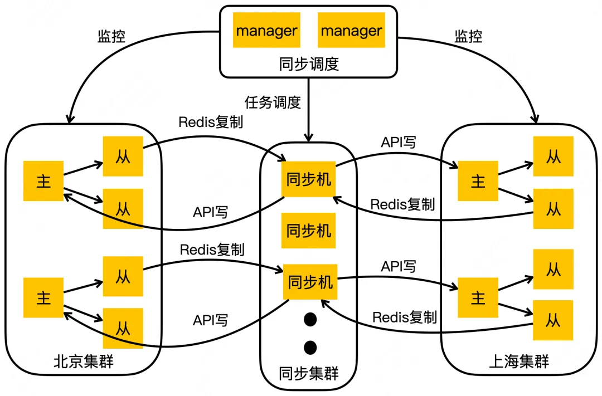
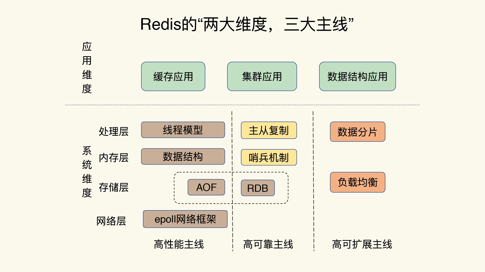
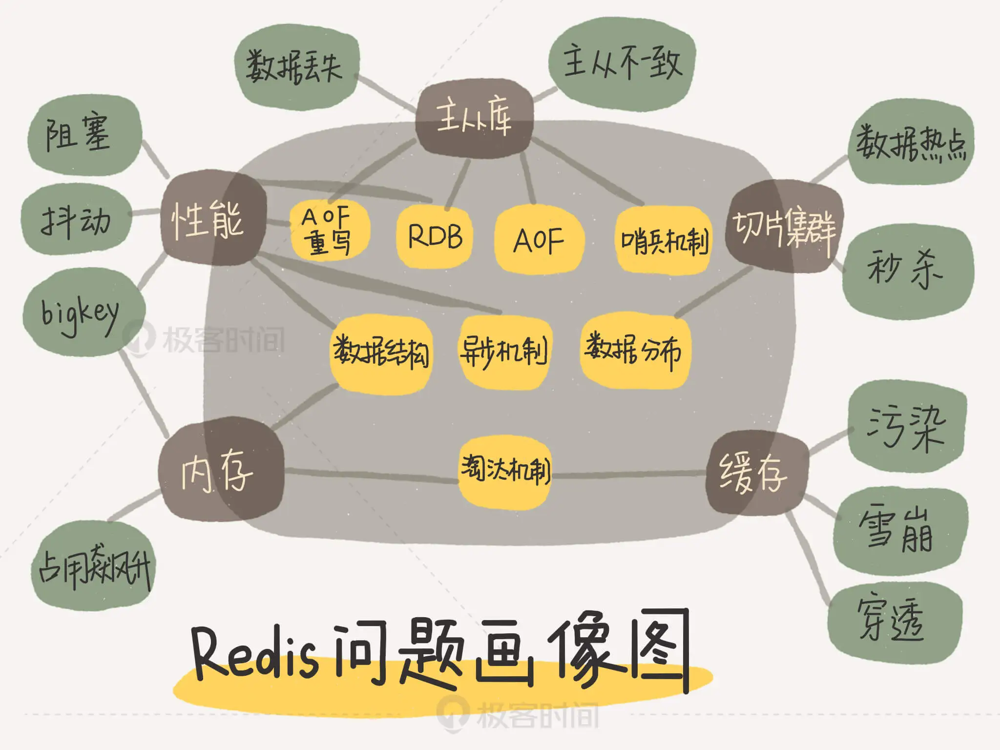

### 构成
1. 认识：基于内存的开源的非常优秀的非关系型数据库，对关系型数据库起到补充作用。常用作缓存、消息中间件、数据库，在cpu使用、内存组织、存储持久化和网络通信这四大方面的设计非常经典，用ANSI C编写
   - 速度快，性能高：读11万次/秒，写8万次/秒；能以微秒级别速度找到数据，并快速完成操作
     1. 基于内存操作，并且有高效的数据结构
     1. 单线程做核心的增删改查操作，同时搭配io多路复用机制。可以做到所有单个操作都是原子的
   - 提供的数据类型丰富
   - 提供的功能多，key过期、发布/订阅、事务、lua脚本
   - 支持LRU回收、数据持久化、日志记录
   - 支持主从同步、哨兵、集群模式
#### 基本
1. 数据类型
   - string
     1. 认识：字符串，二进制安全的键值对类型的字符串，可包含任意对象如图片，最大512MB
        - 自动扩展大小、数据类型自动转换
     1. 命令
        - set/get、mset/mget、setrange/getrange、setbit/getbit：单个、多个、按照偏移量覆盖、位操作，按照偏移量设置位(可做Bloom过滤器)。都是默认不存在就创建
          1. set
             - EX：过期时间秒
             - PX：过期时间毫秒
             - NX：不存在才设置
             - XX：存在才设置
        - setex/psetex、setnx/msetnx：设置过期时间、存在才设置
        - incr/incrby/incrbyfloat、decr/decrby：加/减、一/N，可当原子计数器
        - getset、strlen、append：设置并返回旧值、长度、追加到末尾
   - list
     1. 认识：双向链表，首尾插入的按照插入顺序排序的字符串列表，访问中间的时间复杂度为O(N)，最多40亿个(2^232-1)
        - 存储消耗要高于单个字符串，但是可以部分获取，不用像string整个取出来再解码
        - brpop为代表的br命令添加阻塞特性避免轮询开销，lpoprpush添加数据备份特性保证数据不被丢失
     1. 命令
        - lpush/rpush/lpop/rpop/rpoplpush/lpoprpush/lpushx/rpushx：压入、弹出、存在时才压入
        - blpop/brpop/brpoplpush：支持指定最大秒数的阻塞式弹出数据，单位秒
        - lset/linsert：指定位置的设置、前/后插入元素
        - lrange/lindex/llen：范围查看、指定位置查看、查看长度
          1. `lrange xx 0 -1`：查看所有，-1表示从尾部开始
        - lrem/ltrim：删除、指定范围删除
   - hash
     1. 认识：哈希，哈希类型的键值对集合，field为string类型，可存储对象，最多40亿对
        - 存储消耗高于字符串
     1. 命令
        - hset/hmset/hsetnx：设置
          1. hmset：v4.0弃用，hset支持多值
        - hget/hmget/hgetall：获取
        - hkeys/hvals/hlen/hscan：键值对数量、迭代键值对
        - hincrby/hincrbyfloat：单个key可以计数，加一
        - hdel/hexists：删除n个字段、是否存在某个字段
   - set
     1. 认识：无序集合，string类型的成员唯一的无序集合。通过hash table实现，所有操作复杂度都是O(1)
     1. 命令
        - sadd/spop/smove/srem：移除某一随机元素、移到另一集合、移除n个
        - sdiff/sdiffstore/sinter/sinterstone/sunion/sunionstone：求差集、求交集、求并集。[并储存到另一个集合]
        - scard/sismember/smembers/sscan：成员数量、是否成员、返回所有成员(会阻塞)、迭代元素
   - sorted set
     1. 认识：有序集合 zset，string类型的成员唯一的有序集合，每个元素关联一个double类型的分数
        - 成员唯一，分数可重复
        - 可通过分数进行排序，通过哈希表实现，最多40亿个(2^232-1)
        - 适用于有序且不重复
     1. 命令
        - zadd/zrem/zremrangebylex/zremrangebyscore/zremrangebyrank：增加、删除
        - zcard/zcount/zlexcount/zscan：成员数、指定分数区间的成员数、指定字典区间的成员数
        - zrange/zrangebylex/zrangebyscore：通过索引区间、字典区间、分数区间返回成员
        - zrevrange/zrevrangebyscore/zrevrank：通过索引、分数返回指定区间成员、返回排名。分数都是从高到底
        - zscore/zrank：返回分数值、返回指定成员索引
        - zincrby：已存在的score值增量加increment，不存在则添加
        - zinterstore/zunionstore：计算交并集
   - stream
     1. 认识：强大的支持多播的可持久化消息队列，代替PubSub未来消息队列的最佳方案，借鉴kafka，v5.0
        - 消息链表存储id和内容，是持久化的
        - 结构是时间唯一序列的数组队列
     1. 概念
        - 独立消费：不定义消费组进行消费，当成普通消息队列使用，没有新消息可以阻塞等待，xread
        - 使用Streams数据类型，创建多个消费者组，就可以实现同时消费生产者的数据。每个消费者组内可以再挂多个消费者分担读
        - 定长队列：xadd maxlen
        - xread block支持阻塞读
        - 自动生成全局唯一消息id
        - xack消息确认机制
     1. 组成
        - 消费组：每个消费组都有last_delivered_id，状态独立消费组之间不相互影响
        - 消费者：消费组可以挂多个消费者，竞争关系，任一消费游标都往前
          1. 消费者内部状态变量pending_ids，记录被读取没有被ack的消息，用来确保客户端至少消费一次
        - 消息
          1. 消息id：timestampInMillis-sequence形式，该毫秒内产生的第n条消息，
          1. 消息内容：键值对，这没什么特别之处
     1. 使用
        - del
        - xadd/xdel/xrange/xlen
        - xreadgroup/xack：读取、确认收到
        - xread：使用上一个消息id获取新的
        - xgroup create：消费组设置
     1. 对比
        - 和list、subpub相比就是，茅草房、土房、平房
        - Kafka支持动态增加分区数量的能力，但这种调整能力蹩脚，不会把已存在的内容进行rehash。这种简单的动态调整的能力通过增加新的stream就可以做到
1. 数据类型的适用场景
   - string
     1. 键值对的存储，如session_id为key的session
     1. incr原子计数器做粉丝数、关注数、ip封锁次数、锁、限流等
     1. 作幂等对比：如提交订单接口的防重，订单5分钟之内只能被消费一次，订单号作为key
     1. 二进制安全图片、文件等
   - list：消息排行，消息队列，日志收集器，配合发布订阅
   - hash：存对象数据，如用户基本信息，直接更新即可
   - set：做不重复的集合，存不重复用户名啦、每日投票一次啦
   - zset：有序的不重复集合，如排行榜、热门内容的排序，只需修改score
1. 数据类型的使用注意事项
   - string作为字符串使用时的内存利用率不高
   - 为充分使用ziplist的精简内存布局而不是hashtable，要控制保存在hash集合中的元素个数
1. 模块
   - bitmaps
     1. 认识：位图，即位的数组，用位可以表示两种情况，节省存储，如员工全年签到数据
        - 其实就是普通的字符串，也就是byte数组，可以用get/set，也可以用getbit/setbit看成「位数组」来处理
     1. 操作：「零存整取」、「零存零取」、「整存零取」都行，「零存」使用setbit对位值进行逐个设置，「整存」使用字符串一次性填充所有位数组
        - getbit/setbit
        - bitcount/bitpos
        - bitfield：v3.2，多个位的操作
   - 布隆过滤器
     1. 认识：Bloom Filter，可理解为不怎么精确的set结构，v4.0
        - 不存在时肯定不存在
     1. 操作
        - bf.reserve：参数设置，initial_size估计的过大浪费存储空间，过小影响准确率
        - bf.add/bf.madd
        - bf.exists/bf.mexists
   - hyperLogLog
     1. 认识：不精确的去重计数方案，标准误差0.81%，如统计千万级UV的页面，要个数就行
        - 输入元素数量非常大时，计算基数所需的空间总是固定的、很小的，就可以计算接近2^64个不同元素的基数
        - 只计算基数，不储存输入元素，无法知道在不在里边
        - 稀疏矩阵占用空间渐渐超过了阈值时才会一次性转变成稠密矩阵，才会占用12k的空间
        - 涉及概率论
     1. 命令
        - pfadd/pfmerge：添加、合并
        - pfcount：返回估算值
   - redisTimeSeries
     1. 认识：专门面向时间序列数据提供了数据类型和访问接口，支持直接对数据进行按时间范围的聚合计算
     1. 命令
        - TS.CREATE：创建时间序列数据集合
        - TS.ADD：插入数据
        - TS.GET/TS.MGET
        - TS.RANGE：支持聚合计算的范围查询
   - GeoHash
     1. 认识：geospatial，地理空间索引半径查找，如附近的人，v3.2
        - 底层使用zset实现，score是GeoHash的52位整数值
     1. 操作
        - geoadd：没有删除
        - geopos/geohash：获取经纬度坐标、hash
        - georadiusbymember/georadius：附近的其他元素
        - geodist：计算两个元素之间的距离
     1. 实现
        - GEO类型是把经纬度所在的区间编码作为Sorted Set 中元素的权重分数，把和经纬度相关的车辆ID作为Sorted Set中元素本身的值保存下来，这样相邻经纬度的查询可通过编码值大小范围查询来实现
     1. wiki
        - 最佳实践
          1. 全部放在一个zset中，使用单独实例部署，不使用集群环境
          1. 数据量大了，按国家/省/按市等拆分，降低单个zset集合大小
        - 附近人实现
          1. 勾股定理，经纬度坐标的密度不一样，勾股定律计算平方差时之后再求和时，需要按一定的系数比加权求和
          1. 一般通过矩形区域来限定元素的数量，然后对区域内元素进行全量距离计算再排序
          1. 矩形区域计算，r为半径：`select id from positions where x0-r < x < x0+r and y0-r < y < y0+r`
        - 经纬度
          1. 经度范围(-180, 180]，经度正负以本初子午线 (英国格林尼治天文台) 为界，东正西负
          1. 纬度范围(-90,90]，纬度正负以赤道为界，北正南负
        - LBS：Location-Based Service 基于位置信息服务
        - GeoHash编码方法：业界广泛使用的经纬度比较方法，“二分区间，区间编码”
1. 基本操作
   - 库
     1. select index：切换库，更像命名空间，隔离key名冲突。索引号只能是数字不能自定义，可设置数量，开始和默认是0
     1. move：移动key到某个库中
   - 查看
     1. dbsize：key的数量
     1. type：查看类型
     1. exists：是否存在
     1. keys：查找符合给定模式的key，支持模式匹配，会阻塞单线程的redis
     1. scan：基于游标支持模式匹配遍历key，会使过期的key删除，带来内存占用的下降
        - 不会阻塞线程，提供limit参数
        - 返回结果可能重复，需要客户端去重
        - 遍历的过程中的数据修改和改动后的数据能不能遍历到不确定，只能提供有限的保证
        - 单次返回的结果是空的并不意味着遍历结束，而要看返回的游标值是否为零
     1. sort by xx*->xx desc get xx*->xx get # store xx：对队列、集合按照某些规则排序，by可用通配符，get用于获取指定键值，store结果存储
   - 修改
     1. rename/renamenx：[key不存在时]重命名
     1. del
     1. unlink：v4.0，异步删除，防止大key卡顿
        - key小了就直接删除
        - 先删除引用，将key的内存回收操作包装成任务塞进异步任务队列
   - 其他
     1. randomkey：随机返回
     1. dump：序列化
     1. echo string：打印字符串
#### 功能
1. 超时
   - 认识：expire，设置超时时间，有超时清除策略，过期是不可靠的
     1. string在set后会清除过期时间
   - 命令
     1. expire/pexpire：[用毫秒]设置过期时间
     1. expireat/pexpireat：用[毫秒]时间戳设置过期时间
     1. ttl/pttl：用[毫]秒返回剩余时间，time to live
     1. persist：移除过期时间
   - 删除策略
     1. 整体策略配置
        - noeviction：不淘汰，数据满了写请求返回错误
        - volatile：针对过期的key，先后、随机、LRU、LFU四种方式
        - allkeys：针对所有的key，没有根据过期时间先后的三种方式
     1. 具体策略
        - 被动/惰性：读写时触发，即用的时候判断
        - 主动
          1. 超限：达到配置的内存占用阈值时触发，使用近似lru算法，lru本身太费内存，每个key增加24bit时间戳，随机拿5个淘汰最旧的
            - v3.0增加淘汰池，淘汰掉最旧的一个key之后，保留剩余较旧的key列表放入淘汰池中留待下一个循环
          1. 定时：内部有定时任务，默认10秒、默认100ms
            - 简单贪婪策略，不会扫描所有的key，随机选20个过期超过四分之一就继续重复扫描
            - 默认25ms扫描时间上限
   - demo
    ```lua
    SET mykey "Hello"
    EXPIRE mykey 10
    ```
1. 管道
   - 认识：pipeline，不直接响应，一次性发送多条命令，一次性返回所有响应。减少了多次数据往返时间，提高服务端利用率
     1. 本质由客户端改变指令的先后顺序，先一次性顺序发出去，再一次性顺序接收，真正只花费一个周期的等待实现多个周期等待的重叠，越多效率越高
        - 写的真正耗时：等待发送缓冲空出空闲空间
        - 读的真正耗时：等待空的接收缓冲有数据
   - 使用
    ```php
    $redis->pipeline();
    $redis->exec();
    ```
1. 发布订阅
   - 认识：pub/sub，可以实现多播的消息通信模式，发送订阅模型，是原子的
     1. 挂掉的消费者重新连上期间的消息会被丢弃，重启消息不会持久化，因为相当于一个消费者都没有
   - 使用
     1. subscribe/unsubscribe/psubscribe/punsubscribe：订阅/退订n个，[指定模式(通配符*等)]
     1. publish：发布
     1. pubsub：查看订阅和发布系统状态
1. 事务
   - 认识：exec之前不执行缓存在一个事务队列中，执行完毕后一次性返回所有指令的运行结果
     1. 原子性：2个命令组合起来才算是完成一个业务，但是2个命令组合起来就不具备原子性，所有在两个命令之间其他客户端会出现读写脏数据的情况
     1. 事务中不能获取同一事务其他命令执行的结果
     1. 语法错误所有命令不执行，运行错误不影响其他命令执行，不满足原子性，只满足隔离性(当前事务不被其它事务打断)
        - 单线程特性保证能得到原子执行
     1. 事务模型很不严格，不能原子执行，无回滚机制
        - 无回滚机制，需要自己收拾烂摊子
   - 使用
     1. multi：标记开始
     1. watch：监视n个key，exec前值被改变则取消事务，即提供了CAS(check-and-set)行为，即乐观锁
        - 在multi之前watch
     1. unwatch：取消所有key的监视
     1. exec：执行事务
     1. discard：取消
1. 脚本
   - 认识：支持lua脚本，内嵌lua解释器
   - 命令
     1. `eval script numkeys key`：执行，会缓存sha1以便下次用evalsha调用
        - 如`eval "return {KEYS[1],KEYS[2],ARGV[1],ARGV[2]}" 2 key1 key2 first second`
     1. `evalsha sha1 numkeys key`：指定sha1码执行，可以第一次eval，之后省传输用evalsha
     1. `script load script`：加载，不执行
     1. `script exists script`：是否已加载
     1. `script kill`：杀死脚本
     1. `script flush`：移除
   - 使用
     1. lua脚本使用redis
        - call：`redis.call('get', 'a')`，直接返回错误不继续
        - pcall：记录错误并继续执行
     1. 特点
        - 禁用全局变量，保证脚本隔离
        - 禁止使用lua标准库中和文件、系统调用相关的函数，一是防止拉低性能，二是防止依赖外部条件(系统时间、文件内容等)，因为日志和持久化只能记录脚本内容，内容和参数都一样才能保证执行结果一样
        - 对随机数和随机结果进行了特殊处理，可以生成了当参数传递进去
        - 脚本执行是单线程原子的，lua-time-limit限制最长执行时间，之后接受其他指令不执行返回busy，只执行两个指令：script kill和shutdown nosave。kill还是等到脚本执行完毕，因为要原子性，nosave可立即终止但丢数据
        - 不该在脚本中执行耗时的操作，因为redis单线程，程序却是多进/线程
     1. 数据类型转换：redis->lua，可反转转换
        - 整数 => 数字、字符串 => 字符串
        - 多行字符串 => 表(数组形式)
        - 状态/错误 => 表(ok/err)
        - 空 => false
#### 应用
1. 锁：锁的性能很高
   - 使用incr的原子计数特性实现库存扣减，防止超卖
   - 单实例分布式锁
     1. 实现
        - 加锁：set nx ex rangeValue，排他+过期+随机串，一段时间内唯一
        - 解锁：lua脚本判断随机value相等和删锁进行原子执行
          1. 设置一个不可猜测的长随机字符串作为口令串，防止持有过期锁的客户端误删现有锁
     1. 特性
        - 可重入性：支持线程在持有锁的情况下再次请求加锁就是可重入。程序要存储当前持有锁的计数，精确一点还需要考虑内存锁计数的过期时间
        - 过期性：存在执行时间超出锁时间，造成同时拥有锁，这就是setnx陷阱，可以在拿到锁三分之二时间后，进行锁的延时申请，这个申请要和一开始拿锁的校验等级相同，保证原子性
          1. 过期性可以保证没有死锁，在客户端崩溃的情况下保证场景能继续运行
          1. 由于需要业务代码和定时触发器同时运行，php没有异步，除非扩充多进程
     1. 加锁失败的处理
        - 直接抛出异常，通知用户稍后重试
        - sleep一会再重试：碰撞频繁不合适
        - 将请求转移至延时队列，过一会再试：合理
   - 分布式锁
     1. RedLock：一个集群中依次在大多数节点建锁(n/2+1)，建锁时间小于超时时间则成功，否则就删掉全部锁重抢(即使有的节点没有加锁成功)，下一个节点的锁超时时间要减去之前拿锁花掉的时间
        - 基于集群都是独立master，不存在集群协调机制，否则主从的架构可能在主从切换时恰好导致同时拥有锁
        - 客户端应设置响应超时时间，防止集群挂掉傻傻等待，并在超时时删掉全部锁。还可轮询重试抢锁。同样服务端也不要留给某个节点太长时间，应该尽快尝试下一个
        - redlock内部在客户端无法取到锁时，应该在一个随机的并且大于拿锁时间的延迟后重试，尽可能防止多客户端在同时抢夺同一锁(防止脑裂，没人会拿到锁)
          1. 拿到锁的时间越短，脑裂概率越低
          1. 客户端拿锁失败时，应尽快释放锁，否则已经存在脑裂，只能等待锁自动释放，叫做惩罚
        - 使用当前时间减去开始拿锁时间即获取锁使用的时间
        - 时钟漂移带来的时间差对于失效时间来说几乎可以忽略不计
        - redis重启时，没有备份锁排斥性失效，有AOF没有fsync=always也不行，不过有AOF重启后失效时间还是按照之前的，可以设置重启机ttl后再提供服务，但可能会导致服务整体不可用的时间变长
        - 具体实现有java的redisson、go的redsync
     1. etcd
     1. zk：抢锁就是节点尝试创建临时znode，建锁失败则注册监听器，解锁就是删除znode，然后zk通知客户端抢锁，也可弄成顺序节点，多个抢锁就依次监听上个znode
     1. 比较：zk设计定位就是分布式协调，注册监听器即可，但大并发压力会较大，比redis的轮询性能开销小
     1. mysql：利用排它锁，性能和sql超时导致的锁超时，`select * from lock where lock_name=xxx for update;`
1. 统计
   - 聚合统计
     1. 认识：指统计多个集合元素的聚合结果，如交集、差集、并集
        - 统计会阻塞，可选择从库专门负责计算
     1. 举例
        - 统计App每天的新增用户数和第二天的留存用户数
          1. 一个set记录所有登录过App的userId
          1. 另一群set记录每一天登录过App的userId，key为每天的日期，value记录当天登录的userId
          1. 比较二者差集即可
   - 排序统计
     1. 认识：用到list和sorted set，一个按照插入顺序排序，一个权重排序
        - list有分页时无法确定起止点的问题，sorted set不会
     1. 举例
        - 展示评论列表，使用sorted set，用值作分页依据
        - 使用Sorted Set统计一段时间内的在线用户数
          1. zadd online_us ers $timestamp $user_id：添加用户
          1. zcount online_users $start_ timestamp $end_timestamp：进行统计
   - 二值状态统计
     1. 认识：只有两种状态，使用bitmap或者string都可以，bitmap更专业些
     1. 举例
        - 员工签到问题
   - 基数统计
     1. 认识：不重复元素的统计，使用set的天然去重、hash的天然去重统计、HyperLogLog的专业统计
1. 时间序列数据
   - 特点
     1. 写要快：通常是持续高并发写入的
     1. 查询模式多：通常读的时候为单条或一段时间，且有统计需要
   - 认识：可基于hash、sorted set、redisTimeSeries模块实现
     1. hash不支持范围查询、sorted set不支持范围统计，redisTimeSeries都支持
     1. 同时组合使用hash和sorted set时，可利用hash的高效单次查询，sorted set的范围查询
1. 限流
   - 计数器：incr设置有效期内的大于某个数量，触发限流，有效期就是限流时间单位，数量就是最高请求量，不是平均限流
    ```java
    /**
     * 60秒内最大1000次
     * @param key  可以设计为用户标识及接口标识组合
     * @param expireMillis 过期时间60s
     * @return
     */
    public Boolean limiter(String key, Long expireMillis) {
        Long count = redisTemplate.opsForValue().increment(key, INCREMENT_STEP);
        if (1 == count) {
            redisTemplate.expire(key, expireMillis, TimeUnit.SECONDS);
        }
        if (count > 1000) {
            return Boolean.TRUE;
        }
        return Boolean.FALSE;
    }
    ```
   - 滑动窗口
     1. 结构：zset结构，同一个用户同一种行为用一个zset记录，用score圈出时间窗口，value只需要保证唯一性即可用毫秒时间戳
        - 如果是冷用户，滑动时间窗口内的行为是空记录，zset就可以从内存中移除，不再占用空间
        - 如果限流值非常大，会消耗很大内存，不适合数据量大的
     1. 实现
        - 每一个行为到来时，都维护一次时间窗口，将时间窗口外记录清理掉，只保留窗口内记录
        - 通过统计滑动窗口内的行为数量与阈值max_count进行比较就可以得出当前的行为是否允许
     1. code
        ```python
        # coding: utf8
        import time
        import redis

        client = redis.StrictRedis()

        def is_action_allowed(user_id, action_key, period, max_count):
            key = 'hist:%s:%s' % (user_id, action_key)
            now_ts = int(time.time() * 1000)                                    # 毫秒时间戳
            with client.pipeline() as pipe:
                # 记录行为
                pipe.zadd(key, now_ts, now_ts)                                  # value 和 score 都使用毫秒时间戳
                # 移除时间窗口之前的行为记录，剩下的都是时间窗口内的
                pipe.zremrangebyscore(key, 0, now_ts - period * 1000)
                # 获取窗口内的行为数量
                pipe.zcard(key)
                # 设置 zset 过期时间，避免冷用户持续占用内存
                # 过期时间应该等于时间窗口的长度，再多宽限 1s
                pipe.expire(key, period + 1)
                # 批量执行
                _, _, current_count, _ = pipe.execute()
            # 比较数量是否超标
            return current_count <= max_count
        
        for i in range(20):
            print is_action_allowed("laoqian", "reply", 60, 5)
        ```
   - 漏斗
     1. 认识：redis-cell 限流模块，提供原子限流指令，限流就变得简单了，使用漏斗算法，v4.0
        - 取漏斗容量，内存计算，再减去容量，都变成原子的了
        - 如果被拒绝了，就需要丢弃或重试，连重试时间都帮你算好了，直接取返回结果数组的第四个值进行sleep即可
     1. cl.throttle：只有1条指令，每xx秒最多xx次
     1. 其他实现
        ```php
        private function getLuaScript()
        {
            $luaScript = <<<LUA_SCRIPT
            -- 限制从队列中取出消息的速度
            
            local times = redis.call('incr', KEYS[1]);    --将key自增1

            if times == 1 then
            redis.call('expire', KEYS[1], ARGV[1])        --给key设置过期时间
            end

            if times > tonumber(ARGV[2]) then
            return 0
            end

            return 1
            LUA_SCRIPT;

            return $luaScript;
        }
        ```
1. 队列
   - 即时队列
     1. 措施
        - 模拟ack：单个队列一旦pop出去客户端崩溃，消息丢失，利用rpoplpush弄个备份队列，用lrem删除消息作ack，同时搭配监视程序超时重试、报警等
        - 轮询不延迟：使用blpop/brpop阻塞读，空队列轮询时进行睡眠的消息延迟问题
        - 闲置连接主动断开重试的处理
        - 无法实现多播，否则就要使用pub/sub
     1. 代码
        ```php
        ini_set('default_socket_timeout', -1);                          // socket不超时

        $redis = new Redis();

        $redis->connect('127.0.0.1',6379);

        while($message = $redis->brpop('queue_list_test',0)) {
            var_dump($message);
        }
        ```
   - 延时队列
     1. 使用zset实现，消息到期时间为score
        - 多线程作高可用轮询zset
        - zrem决定多线程唯一的属主，zrangebyscore和zrem进行lua脚本原子化操作，多线程之间争抢任务不会浪费白取一次任务
     1. 实例
        ```py
        # 消费消息
        def loop():
            while True:
                values = redis.zrangebyscore("delay-queue", 0, time.time(), start=0, num=1)         # 最多取 1 条
                if not values: 
                    time.sleep(1)                                               # 延时队列空的，休息 1s
                    continue
                value = values[0]                                               # 拿第一条，也只有一条
                success = redis.zrem("delay-queue", value)                      # 从消息队列中移除该消息
                if success:                                                     # 因为有多进程并发的可能，最终只会有一个进程可以抢到消息
                    msg = json.loads(value)
                    handle_msg(msg) 
        # 添加消息
        def delay(msg):
            msg.id = str(uuid.uuid4()) # 保证 value 值唯一
            value = json.dumps(msg)
            retry_ts = time.time() + 5 # 5 秒后重试
            redis.zadd("delay-queue", retry_ts, value) 
        ```
   - Stream应对中等规模和较弱可靠机制的队列服务
### 架构
1. 认识
   - 哨兵Sentinel提供高可用，集群Cluster提供自动分区
1. TwemProxy架构实践
   - 普通：tw + redis + sentinel + haproxy + keepalived
     1. haproxy：负载均衡
     1. keepalived：高可用
   - 网校
     1. hash分片数据到redis上
     1. 高可用：confd + etcd + tw + redis一从热备 + sentinel
        - tw本身高可用
          1. etcd集群做保活，设置10秒过期，tw每2秒续期，一旦tw发生变化，etcd切换tw，通知confd
             - etcd：go编写，支持watch并且主动通知
          1. confd收到etcd的通知后，完成客户端ip配置文件的更新
        - 高可用
          1. 每个业务最少提供两个 TwemProxy 供业务方连接
          1. redis 发生主从切换，TwemProxy 会实时生成新的配置文件，并自动重启
        - 客户端sdk负责负载均衡
        - 一从热备：假如从库一直提供服务，从库一旦重连导致从库数据不对
        - 哨兵监控：完成主从切换后，通知etcd，然后confd更新客户端ip配置文件
     1. 架构图：
     1. 扩容：找新机器，用工具同步存量+增量的旧数据，然后挂到tw上
1. 美团架构演进
   - 一致性hash + 多个memcached节点：没节点容灾
   - 一致性hash + 多个redis节点 + redis主从(可failover)：扩缩容丢数据
   - 使用Tair：中心节点只有主备没有分布式仲裁的机制，在网络分割情况下可能脑裂
     1. 中心节点主备，输出路由表，供客户端使用
     1. 存储节点负责具体的读写
   - 内存 KV：基于Redis Cluster自研出Squirrel
     1. Gossip消息过多的优化、forkless的RDB机制(降低主从同步成本)、工作多线程
     1. 两机房容灾：增加IDC3的见证者节点(Google Spanner启发)，见证者节点不存数据，在集群选主时参与投票，帮助存活的机房节点完成过半选主过程，虽然是三机房部署但是只要两机房的资源
     1. 跨地域容灾：通过一个集群间同步服务在两个不同地域的集群之间做数据同步，同步服务伪装为上游集群节点的slave拉取RDB和增量log，然后再把拉取到的数据转化成写请求发到下游的集群
        - 可搭建正反两个方向的同步任务
        - 
     1. 双向同步冲突自动解决
   - 持久化 KV：基于Tair的Cellar
#### 持久化
1. 认识
   - rdb是全量快照，aof是增量日志
   - 都可恢复数据，rdb搭配aof使用可极大降低数据丢失可能性，启动时恢复数据aof比rdb方式慢
   - 混合持久化：v4.0，aof不再是全量的日志，而是rdb之后的增量日志，即rdb完成后清空aof文件。或者说在两次快照之间，使用aof记录这期间的所有命令操作
     1. 既有rdb快速恢复的好处，又有aof只记录操作命令的高性能
     1. rdb快照不用很频繁地执行，避免了频繁fork对主线程的影响，以及快照时对机器的性能占用
     1. 不会出现aof文件过大的情况了，也可以避免重写开销
1. RDB
   - 认识：redis database，内存快照，在指定的时间间隔内生成数据集的时间点快照，可快速恢复全部数据(直接把数据读入内存即可)，适用于灾备
     1. 是内存数据的二进制序列化形式，紧凑存储，可设置为压缩形式
     1. 是一个非常重的操作，不适合做实时持久化
     1. redis崩溃会丢失最后一次rdb操作之后的数据
     1. 内存数据在进程产生的一瞬间就固定了，接下来子进程就可安心遍历数据进行序列化写磁盘
   - 设计：basave + 写时复制
   - 步骤
     1. 设置是否fork子进程进行操作，可以共享主线程的所有内存数据
     1. 使用unix写时复制功能，fork之后到快照进程结束前的修改/新增不会被记录
     1. 快照结束后替换rdb文件
   - 最佳实践
     1. 如果修改/新增较多较大时，占用内存可能显著增大，因为写时复制会增加内存占用，需要设置linux的应用申请内存超过可用内存
     1. rdb文件是默认设置被压缩的，1000万键值对，大小1G的rdb，载入内存花费20多秒
   - 触发条件
     1. 手动触发：save/bgsave、flushall
     1. 配置触发：save，满足其中一条就触发，如xx时间内xx修改数
     1. 主从复制：复制初始化后会自动快照
   - 配置
     1. dbfilename：默认dump.rdb
     1. save <seconds> <changes>：n时间内，n次更新操作，就将数据同步到数据文件，可存在多条，或的关系
     1. dir：目录
     1. rdbcompression：是否压缩，关闭节约cpu，但是文件变的巨大
1. AOF
   - 认识：append only file，增量日志，以redis协议的格式只保存修改命令，新写入的命令会被追加到文件末尾，后台可进行aof重写来压缩aof文件的大小
     1. 采用写后日志的方式：即命令执行成功才会将命令记录到日志中，避免出现记录错误的情况。区别于WAL
     1. 执行时机：写aof在主线程中执行，不会阻塞当前写操作，会阻塞后边的读写
     1. aof默认30秒刷盘，可设置append fsync同步硬盘的时机
   - 重写机制
     1. 认识：为解决aof文件体积膨胀的问题，在重写时根据数据库现状创建一个新的aof文件，进行合并相同key等的操作。由后台子进程bgrewriteaof完成
        - 用于压缩aof文件，手动触发，开辟子进程进行aof优化重写到新aof文件中，如三条合一条，序列化完毕后再追加增量的，然后立即替代
        - 可手动触发bgrewriteaof，也可由配置自动触发
     1. 步骤
        - 主进程
          1. fork子进程来进行重写操作，子进程会将当前内存中的数据快照(snapshot)写入到一个新的临时aof文件中
          1. 继续处理来自客户端的写请求，会同时追加到现有的aof文件中，和记录到aof重写缓冲区 aof rewrite buffer
        - 子进程完成aof重写并生成新的aof文件后，向主进程发送通知重写已经完成的信号
        - 主进程
          1. 接收到完成重写信号后，短暂暂停处理新的写请求，暂停期间将aof重写缓冲区中所有数据追加到新aof文件末尾。确保其包含重写期间所有写操作，确保数据一致性
          1. 原子性替换：使用rename系统调用将文件原子性地替换，不会出现部分写入的情况
          1. 完成替换后恢复写请求，此时redis使用新aof文件来记录后续的写操作
     1. 实现
        - aof_buf：aof重写缓冲区，内存中的记录要写入aof文件的缓冲区。为解决fork重写开始后不记录新来的命令导致的数据不一致，方案为将后边的命令也复制一份放到重写缓冲区
        - 为什么aof重写不复用原aof日志？
          1. 父子进程写同一个文件会有相互竞争的问题，强行实现会影响父进程的性能
          1. 如果aof重写过程中失败了，相当于污染了原本的aof文件，无法做恢复数据使用
        - 在重写日志整个过程时，主线程有哪些地方会被阻塞？
          1. fork子进程这个操作，需要拷贝虚拟页表，会对主线程阻塞
          1. 主进程有bigkey写入时，操作系统会创建页面的副本，并拷贝原有的数据，会对主线程阻塞
          1. 子进程重写日志完成后，主进程追加aof重写缓冲区时可能会对主线程阻塞
   - 配置：默认不开启，和rdb文件位置相同
     1. `appendonly`：开关
     1. `appendfilename`：名称，默认appendonly.aof
     1. `appendfsync`：三种记录方式
        - no：等待系统将数据同步到磁盘(快)
        - always：更新后立即将数据写到磁盘(慢，安全)
        - everysec：每秒一次(折衷)
     1. `auto-aof-rewrite-percentage`：aof重写触发机制，当前aof大小超过上一次重写时大小的百分比时，进行重写
     1. `auto-aof-rewrite-min-size`：aof重写的最小文件大小
   - 最佳实践
     1. aof长期运行会变的超级大，为防止重启漫长，需要定期aof重写瘦身
1. 日志文件
   - redis.log/sentinel.log：人可读
#### 分布式
1. 主从
   - 知识网络提炼：rdb和buffer作全量同步，一个循环写的圆环作增量同步预备
   - 认识：利用复制实现数据在不同库的同步，实现读写分离、冗余备份，可继续向下配置树状从
     1. 从从同步减轻同步负担
     1. 数据安全的基础保障
     1. 单机有故障隐患、性能瓶颈
   - 作用
     1. 负载均衡、读写分离
     1. 数据备份
     1. 故障转移
     1. Redis Sentinel 、Cluster的基石
   - 特性
     1. 快照同步：主库bgsave生成文件后，发送到从，非常耗费资源；从全量加载，将当前内存清空，加载完毕后告诉主进行增量同步
        - 如果快照同步的时间过长或者复制backlog太小，导致同步期间的增量指令在复制backlog中被覆盖，会陷入快照同步的死循环
     1. 增量同步：定长的环形数组的复制内存backlog，offset、backlog、run_id组成
        - 标识唯一运行实例：`run_id`，用于保障主从复制安全
        - 复制偏移量：`slave_repl_offset`
        - 复制缓冲区：`repl_backlog_*`，主保持一个默认大小1M的先进先出的队列，有从连接时主在把写操作发送给从的同时，也写入一份到缓冲区。用于增量复制/丢失命令补救
        - replid：解决主从切换必引起全量复制的问题，通过记录旧replication id，其他从和新主执行同步时也可以增量同步
        - 如果从开启AOF，那么从重启后依然会进行全量，因为AOF没有保存replication id和offset，并且AOF的加载优先于RDB，RDB保存了这俩
     1. 主从心跳
        - 维持长连接，每隔10s主ping从，`repl-ping-slave-period`
        - 从回复offset，检查数据复制状况
        - 断线重连
          1. v2.8之前断开重连都会全量同步
          1. 如果从落后的偏移量master_repl_offset比repl_backlog_buffer还多，增量同步无法完成，只能全量同步了
             - 当主从库断连后，主库会把断连期间收到的写操作命令，写入replication buffer，同时也写入repl_backlog_buffer
             - repl_backlog_buffer是一个环形缓冲区，主库上用于持续保存写操作的一块专用buffer
             - master_repl_offset表示写入位置的单调递增的，可以大于repl_backlog_buffer
             - repl_backlog_idx等于repl_backlog_size时，repl_backlog_idx会被置为0
     1. 过期key处理：从不会让key过期，会等待主的del命令，v3.2从自己判断是否过期
     1. 加速复制：`repl-diskless-sync yes`，主不写磁盘直接发送rdb，一边遍历内存，一边发送，v2.8.18
     1. 同步复制：`wait slaveNum waitTime`，等待n秒之前的所有写操作同步到n个从，v3.0
     1. 是否延迟发包：`repl-disable-tcp-nodelay`，是否合并较小的tcp数据包以节省宽带，发送时间间隔由一般默认40ms的linux内核设置决定，默认关闭，会加重主从延迟
   - 最佳实践
     1. 主从都要开启持久化
        - 主不持久化，同时出现网络分区和主宕机就会丢失数据
        - 设置最少同步的从数量，最少2个从防止网络分区
   - wiki
     1. 形式分类
        - 一主多从
        - 主从从：将主库生成和传输rdb的压力，以级联方式分散到从库上
        - 树状结构：不建议，会带来运维困难、数据一致性降低
1. 哨兵
   - 认识：针对redis主从的分布式独立进程，提供监控、提醒、自动故障转移、配置提供者，2.6版本的sentinel不能用
     1. 主要三个任务:监控、选主、通知
     1. 解决的问题
        - 主库真的挂了吗
        - 该选择哪个从库作为主库
        - 怎么把新主库的相关信息通知给从库和客户端呢
     
     1. 最少3个sentinel实例，2个无法做投票；独立机器中运行，甚至需多地部署
     1. 只监控主数据库即可，会自动发现从，可同时监控多个主从系统
     
     1. 判断是否主从切换需要时间
   - TILT模式：拿不到正确的系统时间时进入，这时候无法判断redis是否下线，是sentinel的被动模式
   - 节点管理
     1. sentinel
        - 添加：直接启动
        - 删除：不会完全清除已添加过的sentinel信息
          1. 停止sentinel进程
          1. 告诉其他sentinel，`sentinel reset masterName`，也是一个个操作
          1. `sentinel master masterName`
     1. 删除旧主或者无法访问的slave：`sentinel reset masterName`，重置所有状态信息
   - 工作原理
     1. 客户端找哨兵要主节点地址，监测对比新连接的主节点地址和readOnly Error
     1. 哨兵集群基于主库的pub/sub机制组成，实现相互发现、互相通信
     1. 内部定时任务
        - 每1秒每个sentinel对其他sentinel、redis执行ping
        - 每2秒每个sentinel订阅一个master的channel交换信息，检测信息传播
        - 每10秒每个sentinel对master和slave执行info
     1. 下线
        - 主观下线：sdown，单个sentinel得出的下线判断
        - 客观下线：odown，多个sentinel相互交流后得出的下线判断，然后开启failover
          1. 仲裁：少数服从多数原理，quonum
     1. 选举：raft共识算法的Leader Election方法
        - 故障迁移一致性：选择leader sentinel
          1. 一个epoch内，只有一个leader
          1. sentinel配置以最后写入者胜出的方式传播至其他sentinel
        - 选择新主
          1. 先根据权重
          1. 权重一样，根据最少的lag
          1. lag一样，run_id最小的
     1. 故障转移
        - 主恢复后会变为从
        - 新从需要全量同步新主
     1. 故障转移流程
        - 每秒ping
        - 有效回复ping的时间超时，认定主观下线
        - 共同商议后满足客观下线条件
          1. 投票选举主节点，从节点向新主全量同步数据
          1. 主标记为客观下线时，info由10s一次改为1s一次，最快恢复节点全貌
          1. sentinel节点集合更新
          1. sentinel监控新的主
        - 不满足客观下线
          1. 主客观下线状态移除
          1. 重新ping有效时，主观下线移除
   - 使用
     1. 命令：`redis-sentinel xx.conf`，开启监控
     1. 配置
        ```
        sentinel monitor masterName ip port quonum              // 执行恢复的最低哨兵通过票数，num是满足投票的比例，一般为二分之一加一
        sentinel down-after milliseconds masterName 30000       // 认定断线的豪秒数，要比主从心跳的时间长点
        sentinel failover-timeout masterName 180000             // failover操作的限定豪秒数
        ```
   - wiki
     1. 端口26379
1. 分区
   - 认识：分割数据到多个Redis实例。提高容量，扩展计算能力和带宽。cluster是自动分区
     1. 不支持多个key同时操作，事务中也不行
     1. 多实体数据库维护复杂，容量调整复杂，用presharding解决
   - 分片方式
     1. slot：hash slot 虚拟槽，每个node均匀分配16384个slots，需要存储node和slot的映射，可以减少扩缩容的影响
        - `CRC16(key) Mod 16384`：哈希运算后取余，决定key在哪个槽中
          1. crc16的结果是16位的，可以支持到65536进行取模运算，为什么只到16384，一是心跳消息头太大(8kb)浪费带宽，认为节点有1000个足够了，槽位越小，信息压缩越高
          1. 先crc可以极大降低要对比和存储的数据量
        - 节点变化需要迁移数据、重新分配槽
     1. 一致性哈希：顺时针组成哈希环，节点为哈希环中的token，范围一般在0~232，根据要存储的key计算hash，放在顺时针第一个大于等于该哈希值的token节点
     1. 节点取余：扩缩容数据迁移量大，翻倍扩容可相对减少迁移量
     1. range：范围，不同范围放到不同实例中，需要维护范围表，或者定规则
   - 数据分区方式
     1. 代理协助分片：代理根据配置的分片模式转发到正确的节点，如Twemproxy、Codis，比较成熟
     1. 客户端分片：客户端直接选择正确的节点，如Jedis
        - 逻辑简单，性能高
        - 业务逻辑和数据存储逻辑耦合，可运维性查。多业务各自使用redis，集群资源难以管理，不支持动态增删节点
     1. 查询路由：Query Routing，先到随机节点，这个节点保证你到正确的节点，或者客户端重新发起到正确节点
1. 集群
   - 切片集群方案：基于客户端分区的ShardedJedis，基于代理的Codis、Twemproxy等，官方的cluster
   - 认识：cluster，本质就是切片，用于解决容量和并发性能，无中心结构、分布式、自动故障转移、高可用、可扩展。
     1. 高可用性：通过增加slave做热备数据副本，能够实现故障自动转移
     1. 官方亲儿子，去中心化，内部非常复杂，为了实现去中心化，混合使用raft和gossip协议，有大量调优参数，不好上手，没有tw简单/稳定，v3.0
   - 特点
     1. 优点
        - 客户端直连，免去了代理损耗
        - 重试时间应该大于cluster-node-time时间
        - 不建议使用pipeline和multi-keys操作，减少max redirect产生的场景
        - 分片了，没有库的概念
     1. 缺点
        - 数据异步复制，无法保证强一致性
        - 不支持跨slot查询和修改，不支持跨solt事务操作
        - 不支持多数据库空间，集群模式只能用0
        - 不支持嵌套树状复制结构
        - 要求客户端缓存slots mapping信息并及时更新
   - 机制
     1. solt槽划分机制
     1. key的重定向机制：节点发现不是自己的solt发出跳转命令，客户端自己更新配置
   - 实现
     1. 所有节点通过轻量的二进制流言Gossip协议连接，交换维护整个集群节点metadata，可扩展到1000个节点
        - 存放哈希槽的bitmap通过Gossip协议在结点之间传递
     1. 主分配solt插槽，从做故障切换
        - 最少6个节点保证高可用，3主3从，因为集群最少3个主
     1. 客户端获取solt信息，自己计算判断要操作的solt
     1. 容错
     1. 迁移：手动
   - 使用
     1. `cluster addslots {0...5461}`：分配槽位
     1. `redis-cli -cluster`：连接集群，c是集群模式
     1. `cluster info`：查看状态
     1. `cluster nodes`：查看节点
     1. `cluster meet 127.0.0.1 6380`：连接节点
     1. `cluster replicate xx`：分配为某节点的从
#### 中间件
1. TwemProxy
   - 认识：twitter开源的redis/memcache的快速、轻量级的单线程代理服务器，可对多台redis/memcache进行管理和分配。就是分片、分布式方案，c写的
     1. 支持失败节点自动删除
     1. 支持设置HashTag：将两个key哈希到同一个实例
     1. 和redis、客户端采用长链接，减少连接数
     1. 数据自动分片
        - hash：MD5、CRC16、CRC32、CRC32a、hsieh、murmur、Jenkins
        - 分片：ketama、modular、random
        - 可设置权重
     1. 支持集群部署，上边接负载均衡
     1. 支持状态监控：监控ip、端口、刷新间隔时间
     1. 使用pipelining处理请求和响应
     1. 不支持redis事务
     1. 使用某些命令需要保证key都在同一个分片上：SIDFF,SDIFFSTORE,SINTER,SINTERSTORE,SMOVE,SUNION and SUNIONSTORE
     1. 相对于官方较新的Redis Cluster架构，容量伸缩较麻烦
     1. 支持memcached ASCII协议和redis协议
   - 如何一份数据复制两份发到两个实例？
   - 运维
     1. 同时使用tw和pipeline时，如果对pipeline的执行顺序有要求，那么要设置tw对redis的server_connections数量为1，否则会导致顺序错乱。因为tw用epoll，每个连接有独立的队列，每个连接用完就会扔到队尾准备重复利用，就势必导致两个命令在两个不同的连接上进行，到了redis那里就有可能造成顺序错乱，如zadd和expire一起用
1. Codis
   - 认识：集群解决方案，中间件，集群形式部署，go开发
     1. 支持分片，1024等倍数个solt，进行crc32取余，使用zk或者etcd共享solt关系
   - 扩容，修改solt和redis关系，用soltsscan扫描迁移key，热迁移，新来的立即进行迁移
     1. 自动均衡，空闲时自动扫描并迁移
   - 代价
     1. 事务、pipeline、rename不在一个redis的key等不支持
     1. 单key不宜太大，造成迁移阻塞
   - 优点：比官方cluster简单很多，分布式问题交给了第三方zk负责
   - 设计
     1. mget采用汇总形式
1. Pika：从rocksdb发展来的开源类redis系统，redis容量过大的解决方案，建议作Redis的备份仓库，可极大的降低运维成本
   - 用硬盘存储，速度慢
   - 支持redis协议，不是100%兼容
   - 数据在硬盘上是压缩的，迁移到redis需要将当前的容量乘以5
### 最佳实践
#### 使用
1. 认识
   - 掌握方法：问题 --> 主线 --> 技术点的方式梳理出来，积累越来越多，画像也会越来越丰富。以后在遇到问题的时候，就很容易解决了
   - 梳理一些方法论，做成Checklist，就像一个个锦囊，当遇到问题时就可以随时拿出自己的“锦囊妙计”解决问题了
   - 区分场景和案例，解决之。场景是使用时，倾向于理论；案例是综合运用，倾向于实践
   - redis知识全景图：
   - redis问题画像图：
1. 使用
   - 结构体大多数情况中只访问少量字段用hash，否则用string
   - 大key
     1. 扩容时产生卡顿，被删除内存会一次性回收，卡顿会再次产生
     1. redis-cli –-bigkeys -i 0.1：渐进式扫描排名靠前的大key
   - 过期
     1. 尽量设置过期时问
     1. 缓存的更新策略：主动失效、被动失效
     1. 设置随机过期：大量key设置相同过期时间，同一时间大批量的key过期，同时100个请求每个耗费25ms回收时间，第101个请求需要等待2500ms，造成不可用
   - 缓存会给整体系统带来复杂度，并且会有数据不一致的风险
   - 缓存对象粒度，过大或过小都不合远，太大压缩
     1. 提前考虑扩容问题
     1. 是否引入多级缓存
   - key定义遵循一定规则，相同业务采用相同前缀
   - 不要把缓存当数据库用，评估业务所需空间大小
1. 缓存常见问题
   - 缓存穿透：缓存和数据库中都没有数据，但是用户一直发起请求
     1. 加强校验，避免非法请求
     1. 缓存设置合理过期时间的key-null
   - 缓存击穿：缓存数据过期，并发查同一条数据
     1. 热点数据不过期
     1. 互斥读锁（请求key+进程id+超时）写缓存，其他请求区间随机时间等待，重试
   - 缓存雪崩：大量数据同时过期
     1. 过期时间区间随机
   - 热KEY：单机被集中大量访问
     1. 业务主动提出，提前准备预案
     1. 添加二级缓存，缓存到内存中、或者提前载入配置中
     1. 后台sdk基于业务调用统计
     1. 代理或者后台sdk用lru对每个key做统计
     1. redis4.0基于LFU的热点key发现机制
   - 大key：拆，会导致网卡撑爆、慢查询等
     1. 分成小key，用mget拿
     1. 加随机数前缀放到不同分片上
     1. 设置合理过期时间，尽量不淘汰大key
     1. 用hash的hget方法只取精确的
   - 缓存数据一致性的保证：根据不同场景使用不同的缓存模式
1. 缓存模式
   - 认识：即如何写入和读取数据，不同方式的应用场景和优缺点不同
     1. 缓存可以提高性能、减少数据库负载、节省成本
   - 分类
     1. 旁路型：读多写少，弱一致
     1. 穿透型
        - 读多写少，强一致
        - 读写频繁，弱一致
   - 旁路缓存：cache-aside：db为主，缓存为辅
     1. 读：先查询缓存是否存在，存在直接返回；不存在抢锁查询db，将结果写入范围随机过期的缓存，抢不到的随机时间重新读取
        - 抢锁防止db并发访问
        - 缓存随机过期时间防止雪崩
     1. 写：先更新db，然后直接删除对应缓存
        - 使用key-null或者bloom进行过滤，防止穿透。bloom流程：
     1. 特点
        - 适合读多写少，弱一致的场景
          1. 缓存和db数据不一致的情况：更新完db没来得及删缓存时
        - 第一次读取会穿透：大数据量时要有提前预热机制，预热缓存过期时间应该为范围随机
   - 穿透类型：缓存和db同等
     1. 读 read through：和cache-aside一样
     1. 写
        - write through：这里需要抢写锁，读的时候抢读锁，并且读锁要考虑没有写锁才能执行，先查询缓存是否存在，不存在，直接写db；存在，先更新缓存，然后更新db
          1. 适合读多写少，强一致的场景
          1. 写db失败怎么办？可引入互斥读锁，阻塞其他读请求，将写缓存和写db作为一个事务
        - write behind：后写模式，异步批量更新数据库
          1. 适合读写都频繁，弱一致的场景，需保证异步写的完整性，适合如浏览量、点击量
1. 使用规范
   - key名设计
     1. 【建议】：可读性和管理性，以业务名为前缀，以一定规则分割，比如业务名:表名:id
     1. 【建议】: 简洁性，保证语义的前提下，控制key的长度，当key较长时，内存占用也不容易忽视
     1. 【建议】：redis单实例内存控制在 10G以内，内存越大，触发持久化的操作阻塞主线程的时间越长
   - value设计
     1. 【强制】：禁止在redis中存储图片
     1. 【强制】：禁止在集合结构中只存不清，对于集合结构中数据增加频繁必须要有删除机制
     1. 【建议】：拒绝bigkey（防止网卡流量，慢查询)： string类型控制在10KB以内，hash、list、set、zset元素个数不要超过5000。
     1. 【建议】：选择合适的数据类型： 存储数据时选择合适的数据类型，要合理控制key和value的大小和个数以使用更优化的数据结构，如 ziplist
   - 命令使用
     1. 【强制】：禁止使用 FLUSHDB FLUSHALL KEYS BGSZVE SAVE BGREWRITEAOF命令
     1. 【强制】：使用scan命令时应该批次使用，单次扫描key数量不应超过2万，间隔0.5s
     1. 【建议】：使用批量操作以提高效率
     1. 【建议】：谨慎全量操作hash set等集合结构，O(N)命令关注N的数量，如hgetall/lrange/smembers/zrange要明确N的值, 遍历需求可用hscan、sscan、zscan代替
     1. 【建议】：zset服务器消耗最高，要排序还要去重，尽量少用    
   - 客户端使用
     1. 【强制】：新上线或者迁移的redis服务强制使用密码，应用层要进行配置
     1. 【强制】：只允许读取本部门redis， 需要使用其他部门数据则将数据服务化
     1. 【建议】：应用层自行处理长连接断开问题，db组只负责维护redis服务域名的存活，应用层要考虑dns切換之后原来的连接无法使用的状况
1. 异步的思考
   - 单线程redis阻塞的点，即花费时间较长的操作
     1. 和客户端交互的阻塞点
        - 集合全量查询和聚合操作：操作复杂度O(N)了
        - bigkey删除：需要大量内存搬迁、整理等操作
     1. 和磁盘的阻塞点(考虑到磁盘io的阻塞，redis使用子进程方式生成rdb以及执行aof重写)
        - aof日志同步写，即对数据做落盘保存
     1. 主从的阻塞点
        - 从库接收到rdb后，flushdb会阻塞，加载rdb到内存会阻塞
     1. 切片集群实例交互时的阻塞点
        - 采用渐进式哈希槽迁移，有bigkey时会阻塞
   - 是否可以异步执行的判断：操作不在关键路径上就可异步
   - 异步的子线程机制
     1. pthread_create创建AOF写、键值对删除、文件关闭的3个子线程
     1. 主线程通过一个链表形式的任务队列和子线程进行交互，任务的封装放入和取出执行
1. 跨槽查询
   - 原因：判定槽位根据键的hash确定，redis集群默认不支持跨槽查询，这种命令会报错
   - 解决方案
     1. 使用哈希标签：`SET keyName:{tagName}:xx "xx"`，{} tag标签，redis只对标签中字符串计算哈希值
     1. 客户端分拆请求/使用智能客户端库：不同槽的放到不同的mget命令中
1. cpu对redis影响的优化措施
   - 将redis执行绑定到固定核上运行，降低context switch对性能的波动，但是导致子进程、后台线程和主线程竞争cpu导致主阻塞，可以绑定物理核(逻辑核会竞争)或改源码
#### 应用场景
1. string的内存利用率不高：存储1亿条长度分别为8byte的id键值对，6.4G占用有4.8G都是元数据，可以采用hash存储来节省内存。方法是把key的前7位作为Hash的键，把key的后3位和value分别作为hash类型值中的 key和value(这么做是为了尽量使用ziplist类型的hash，更加高效)，这样多一条id键值对，只多16byte，大大节省内存
1. zset做简单的lru
   - 认识：可以简单实现，性能不是非常高
   - 实现方式
     1. 添加/更新：`ZADD mylru <timestamp> "element"`
     1. 移除最老的元素，需要定期判断执行：`zremrangebyrank mylru 0 0`，这条命令会移除有序集合中分数最低的元素
     1. 获取所有：`zrangebyscore key -inf +inf`
#### 性能和服务治理
1. 性能监控
   - 连接数
   - 慢查询：超过10ms会被认为是慢查询
   - qps、峰值
   - kv大小、命中率、占用空间大小
   - cpu、内存、流量出入
   - 置换策略
1. 服务治理
   - 主从延迟
   - 复制
     1. 增大复制缓冲区
     1. 规避复制风暴
        - 主重启，多从同时复制：提供故障转移机制，或者改为树状复制结构，因为同时发送多个RDB费带宽
   - 机制设置
     1. 自动内存碎片清理：activedefrag
     1. 定期aof重写
1. 阿里云指标
   - 认识：百万QPS，最好性能512G内存、最大连载数320000、最大吞吐1536M
   - 功能
     1. 负载均衡
     1. 多个proxy，负责故障转移
     1. 分片服务器，单节点，不需同步数据，不提供数据持久化和备份策略，节点故障会丢失数据。集群版是双节点
     1. 配置服务器，即Configserver，存储集群配置信息及分区策略，采用双副本的高可用架构
1. 基准测试
   - redis-benchmark
     1. -h/-p：地址端口
     1. -s：指定socket
     1. -c：并发连接数
     1. -n：请求数
     1. -d：字节形式指定set/get大小
     1. -k：1=keep alive 0=reconnect
   - ./redis-cli --intrinsic-latency [数字秒]：统计测试期间内的最大延迟，这个延迟可以作为redis的基线性能
1. 服务治理
   - 先明确基准性能，确认redis是否真的变慢
   - 可通过redis日志，或latency monitor工具，查询变慢的请求
### 运维
1. 客户端：发起连接，`redis-cli -h host -p port -a password`
1. 服务端：`redis-server`
   - 设置密码：修改conf文件的requirepass
1. 命令
   - 操作
     1. ping：查看是否运行
     1. config
        - `config get requirepass`：查看密码
        - `config set requirepass xxx/''`：设置/取消密码
     1. debug segfault：让redis崩溃
     1. monitor：实时打印接收到的命令，调试用，输出非常多，可以快速ctrl+c
   - 查看
     1. info：所有的服务器信息
        - info Stats：通用统计
          1. instantaneous_ops_per_sec：ops执行负载
          1. rejected_connections：被拒绝的客户端连接次数，观察这个设置maxclients配置
          1. sync_partial_err：主从半同步复制失败的次数，观察这个设置是否需要扩大积压缓冲区
        - info Server
        - info Memory
          1. used_memory_human:827.46K                  # 内存分配器 (jemalloc) 从操作系统分配的内存总量
          1. used_memory_rss_human:3.61M                # 操作系统看到的内存占用 ,top 命令看到的内存
          1. used_memory_peak_human:829.41K             # Redis 内存消耗的峰值
          1. used_memory_lua_human:37.00K               # lua 脚本引擎占用的内存大小
        - info CPU
        - info Persistence：持久化
        - info Replication：主从
          1. backlog相关：主从复制的效率
        - info Cluster：集群
        - info KeySpace：键值对统计
        - info Clients
          1. connected_clients：客户端连接数
     1. client list：客户端列表
   - 数据操作
     1. save/bgsave/lastsave：默认生成dump.rdb文件，查看最后一次保存，确认是否后台保存成功
        - save会阻塞所有客户端请求，避免生产环境使用
        - bgsave是fork新进程进行，fork过程中会造成阻塞，设计或使用不好同样阻塞很长时间，和save执行内容相同
        - 比较：
     1. flushdb/flushall [aysnc]：删除当前/所有数据库的所有key，异步操作
   - 模块操作
     1. 先编译为动态库.so
     1. 加载：loadmodule redistimeseries.so
   - 其他
     1. slowlog subcommand：管理慢日志
     1. sync：用于复制功能的内部
1. 配置
   - 操作：`config get/set/rewrite */configName configValue`
   - 分类
     1. 基础
        - port/bind/timeout(无操作连接超时时间，为0不断)
        - maxclients：最大连接数
        - databases：数量
        - maxmemory：最大占用内存，单位字节
        - maxmemory-policy：超最大内存后淘汰策略
          1. volatile-lru、allkeys-lru：根据lru算法，删除过期/一个键。并不准确，随机取n(maxmemory-samples)个找最久未被使用
          1. volatile-random、allkeys-random：随机删除过期/一个键
          1. volatile-ttl：删除过期时间最近的一个键
          1. noeviction：不删除，只报错
        - maxmemory-samples
        - include：子配置文件地址
        - requirepass：设置密码，`auth` 检验密码是否正确
     1. 日志
        - loglevel：debug/verbose/notice/warning
        - logfile：文件地址，守护进程方式运行时日志发送给/dev/null
     1. 内存
        - vm-enabled：是否启用虚拟内存机制
        - vm-swap-file：虚拟内存文件路径，多Redis实例不可共享
        - vm-max-memory 0/vm-page-size 32/vm-pages 134217728/vm-max-threads 4
     1. 守护进程：daemonize no：yes
     1. 主从：`info replication`
        ```conf
        role:master|slave
        connected_slaves:2                                          // 连接的从节点数据
        master_replid:xxxxxxxxxxxxxxxxxxxxxxxxxxx                   // 当前主节点id
        master_replid2:00000000000000000000000000                   // 老主节点id，发生主从切换时写入
        master_repl_offset:196                                      // 主节点已写入命令的偏移量，主节点会将命令转为字节写入队列，salve的offset对比得出延迟
                                                                    // 以下都是2.8新增
        second_repl_offset:-1                                       // 避免每次的主从改变的全量复制
        repl_backlog_active:1                                       // 缓冲区，1开启
        repl_backlog_size:1048576                                   // 积压队列长度，默认1M
        repl_backlog_first_byte_offset:1                            // 缓冲区起始位置
        repl_backlog_histlen:224                                    // 缓冲区当前长度
        repl_backlog_ttl:                                           // 主从断开连接后，多长时间释放积压队列的内存，默认1小时

        // 主
        slave0:ip=xx,port=xx,state=online,offset=n,lag=1            // offset：当前从节点读取的偏移量，lag：延迟时间，秒
        // 从
        master_host:xx
        master_port:n
        master_link_status:up
        master_last_io_seconds_age:5                                // 主从最后一次同步的时间
        master_sync_in_process:0                                    // 主从同步状态，0未同步，1正在同步
        slave_repl_offset:n                                         // 从复制命令的偏移量
        slave_priority:100                                          // 从节点选举时的权重，0永远不可能
        slave_read_only:1

        // 其他
        min-slaves-to-write                                         // 主可写的最少的从数量，即设置乐观复制的尺度
        min-slaves-max-lag                                          // 从最大的延迟
        ```
1. 备份恢复
   - 备份：save/bgsave
   - 恢复：将dump.rdb和aof文件放到redis目录并启动即可，即重放，优先使用aof文件
1. 安全
   - 命令改写：rename-command
   - lua脚本安全
   - ssl连接：spiped，两边都安装，进行加密通信
1. 主库重启 checklist 
   - 世纪互联主从库节点 zabbix 关闭报警
   - 世纪互联主从库节点 注释脉搏脚本
   - 切换Master到从库，修改参数并重启
    ```sh
    redis-cli -h 10.20.52.245 -p 8379 sentinel failover jy-courseware-redis
    redis-cli -h 10.20.52.245 -p 9379 sentinel failover jy-tnt-redis

    vim /boot/grub/grub.conf
    isolcpus=10,11,12,13,14,15,16,17,18,19,20,21,22,23,24,25,26,27,28,29 
    for i in {1..9}; do /etc/init.d/${i}379redis stop; done 
    init 6
    ```
   - 重启完成后sysbench验证,重启redis服务
    ```sh
    /bin/rm -rf /root/scripts/sysbench.sh
    cd /root/scripts && wget -N --http-user=XueRs --http-passwd=xxx http://soft.xesv5.com:88/dell/sysbench.sh
    ./sysbench.sh --test=cpu --num-threads=${v_cpu_num} --max-requests=600000 run
    for i in {1..9}; do /etc/init.d/${i}379redis start;sleep 60; done 
    for i in {1..9};do sed -i '/slaveof/d' /data/${i}379redis/etc/redis.conf;done
    for i in {1..9};do cat /data/${i}379redis/etc/redis.conf |grep slaveof;done
    ```
   - 同步完成后，切回原主
    ```sh
    redis-cli -h 10.20.52.245 -p 8379 sentinel failover jy-courseware-redis
    redis-cli -h 10.20.52.245 -p 9379 sentinel failover jy-tnt-redis
    ```
   - 开启zabbix报警和脉搏，sentinel reset 
   - yf的同步节点挂到sjhl从库
    ```sh
    /etc/init.d/irqbalance restart
    chkconfig irqbalance on
    ```
### wiki
1. 历史
   - 2009年，开源
   - 2.6：set命令增加键存在与否的判断和过期时间的设置，新增lua环境
   - 2.8：新增，支持复制的断线重连时有条件的增量数据传输，可用的哨兵机制
   - 2.8.9：新增，HyperLogLog
   - 2.8.18：新增，无硬盘复制(避免硬盘性能瓶颈)
   - 3.0：2015年，新增，集群功能
   - 4.0：新增异步的键值对删除和数据库清空操作
   - 5.0：新增了steam类型
   - 6.0
     1. 增加多线程模型：属于实验性新增，不建议生产环境使用
        - 只有读、和读取网络请求并进行解析是多线程，写还是单线程
     1. 增加客户端主动缓存
     1. ACL安全策略
   - 7.2：最新
1. 编程语言客户端
   - php：官方推荐两个
     1. Predis：php代码实现的原生客户端
     1. phpredis：c编写的php扩展，性能更好
   - ruby：redis-rb，最稳定的客户端
   - python：redis-py
   - node：node_redis、ioredis，前者早，后者功能丰富
1. 其他
   - simpleKV：最基本的键值数据库
     1. 功能
        - 存哪些数据：key都差不多，多种类型的value
        - 对数据哪些操作：put/get/delete/scan
     1. 架构组成
        - 访问框架整
          1. 动态库模块
        - 网络访问模块：I/O模型设计
        - 操作模块
        - 索引模块：确认有哪些key，和key对应的value是啥
          1. 内存的高性能随机访问特性可以很好地与哈希表O(1)的操作复杂度相匹配
        - 存储模块
          1. 内存分配器：采用了常用的内存分配器glibc的malloc和free，glibc的分配器在处理随机的大小内存块分配时表现并不好。一旦保存的键值对数据规模过大可能造成较严重的内存碎片问题
          1. 持久化
   - memcache：高性能分布式内存对象缓存系统，内存里维护一个统一的巨大的hash表，能够存储图像等数据
     1. value类型仅支持String
   - rocksDB以动态链接库的形式使用
1. 读书笔记
   - 《深度历险》
     1. 基础数据结构再看下，是深入的大头
     1. 通信协议看下
   - 《开发与运维》
     1. 慢查询分析，记录下
     1. 阻塞
     1. 内存看下
     1. 11章缓存设计，12.1，12.4大key
     1. 13简单看下
     1. 14可以当手册查
