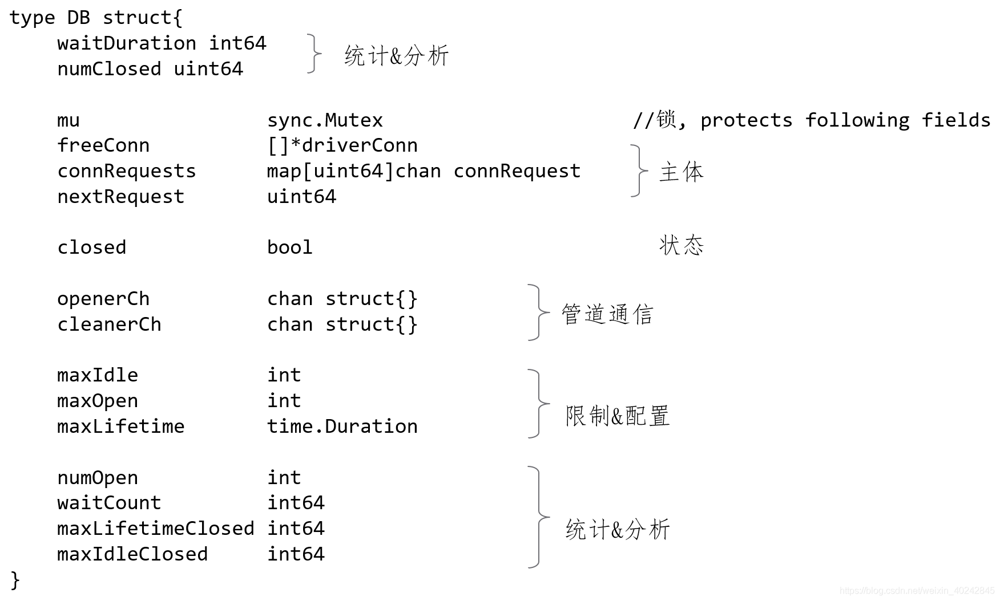
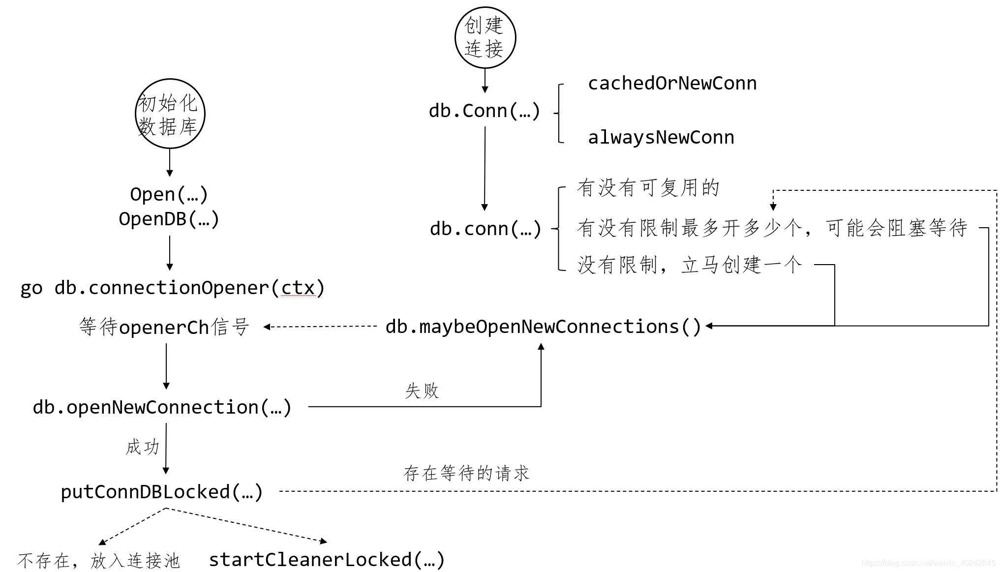
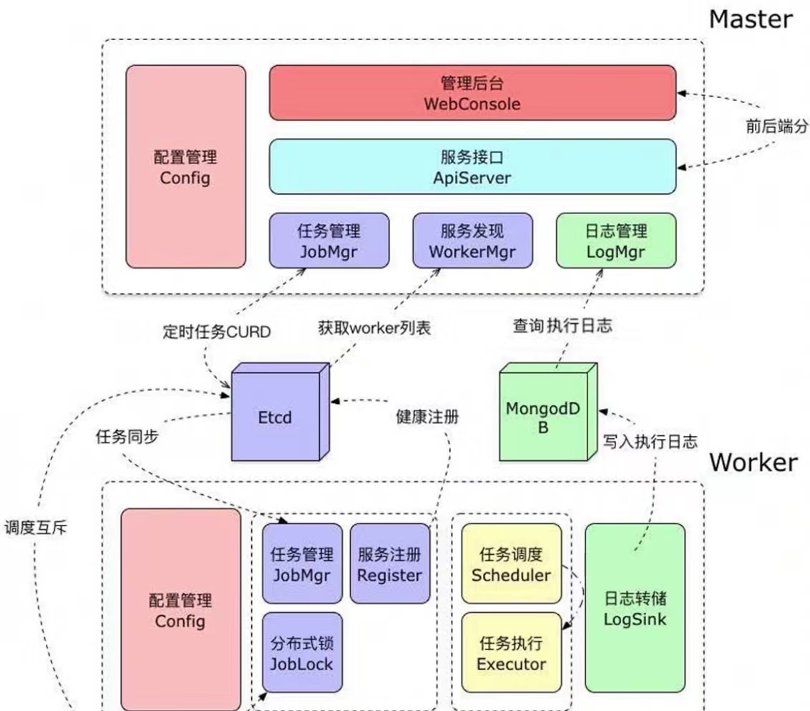

### 最佳实践
1. 编写思路
   - 编程起势：首先通过划分结构体，定义不同的功能模块，然后分别实现，最终实现功能
     1. 封装模块
        - 在一个文件中定义一组接口interface
        - 定义结构体struct，可以在一个文件或文件夹中专门存放需要用到的struct
        - 定义new结构体struct的方法，用sync.Once实现单例返回，返回值为接口interface
        - 定义属于结构体struct、并且实现了接口interface的所有方法，完成~
     1. 定义对象：针对一类组合，要定义一个结构体作为包装这个对象的载体，而不是孤零零的散着各种数据，面向对象嘛
   - 函数式编程：通过参数、返回值、变量都是函数的形式，实现更加灵活的处理
     1. 将具体执行的逻辑包装成一个方法，大家执行这个方法，内部自己定义，就可以将实现解耦了，大家不用关心执行的内容了
     1. 针对需要外部定义处理的函数，用函数式编程，实现外部定义实现，内部调度，执行那个方法就可以了
        ```go
        type Han struct {
            UseMethod func(int) bool
        }

        func main() {
            h := Han{
                UseMethod: func(i int) bool {
                    return true
                },
            }
            // 使用
            h.UseMethod(1)
        }
        ```
   - 并行思想：之前用的读io然后处理的单线程模式，改为：起多个不同的协程(有的处理读io，有的处理逻辑)，协程之间通过chan传递数据，一边读取一边处理的协程模式了
     1. 耗时的goroutine可以多起几个
   - 如何设计一个特定领域的整体的处理框架，整体架构就是先划分不同角色，怎么划分好角色最重要，然后利用interface去高内聚每个角色，之间相互配合，实现更强的扩展性
1. 避坑指南
   - 谨慎使用全局变量，全局变量不会像PHP一样，在完成一次请求之后被销毁，而是会被改变
   - 形参是slice、map类型的参数，注意值可被全局修改，array则不会
     1. 因为：浅复制过程中slice和map底层的类型是个结构体，实际存储值的类型是个指针
     1. 解决：深拷贝，开辟新内存，指针指向新内存地址，并把原有的值复制过去
        ```go
        package main

        import "fmt"

        func main() {
            paramDemo := []int32{1}
            fmt.Println("main.paramDemo 1", paramDemo)
            // 初始化新空间
            paramDemoCopy := make([]int32, len(paramDemo))
            // 深拷贝
            copy(paramDemoCopy, paramDemo)
            demo(paramDemoCopy)
            fmt.Println("main.paramDemo 2", paramDemo)
        }

        func demo(paramDemo []int32) ([]int32, error) {
            paramDemo[0] = 2
            return paramDemo, nil
        }

        // [Running] go run ".../demo/main.go"
        // main.paramDemo 1 [1]
        // main.paramDemo 2 [1]
        ```
   - 资源使用完毕，记得释放资源或回收资源
     1. 原因
        - 资源连接数线性增长
        - 如果一直持有，资源服务端也有超时时间
     1. 方法：写成`defer close()`
   - 不要依赖map遍历的顺序
     1. 因为：底层实现都是数组+类似拉链法，以下3点都决定了map本来就是无序的，所以Go语言为了避免开发者依赖元素顺序，每次遍历的时候都是随机了一个索引起始值。然后PHP通过额外的内存空间维护了map元素的顺序
        - hash函数无序写入
        - 成倍扩容
        - 等量扩容
   - 不要并发写map，会触发panic
   - 注意判断指针类型不为空nil，再操作
    ```go
    resp, err := http.Get("https://www.example.com")

    // 错误示范
	if resp.StatusCode != http.StatusOK || err != nil {
		// 当 resp为nil时 会触发panic
		// 当 resp.StatusCode != http.StatusOK 时err可能为nil 触发panic
		log.Printf("err: %s", err.Error())
	}

    // 正确示范
    if err != nil {
		// 报错并记录异常日志
		log.Printf("err: %s", err.Error())
		return
	}
	// 模拟业务code不为成功的code
	if resp != nil && resp.StatusCode != http.StatusOK {
		// 报错并记录异常日志
	}
    ```
   - json解析不存在的默认给类型零值，所以接口请求参数不要使用0作为特殊意义值
1. 性能优化
   - 当一个结构体很大、并且在函数中传递时，可以将结构体拆分成小的，将小的单独传递，将小的组合成原来的大的嘛，可以提升性能
   - 全局变量可以避免重复申请带来的内存交互
#### 语法练习
1. 数据类型
   - 引号输出
     1. 使用反引号：`a := `"xx"``
     1. 使用转义：`a := "\"xx\""`
     1. 使用strconv包：`a := strconv.Quote("xx")`
   - 类型转换
     1. 实例
        ```go
        var f float64 = float64(i)
        // 或者
        f := float64(i)

        // string转为int、int64
        aa := "111"
        // 这样是转成 int
        b, err := strconv.Atoi(aa)
        fmt.Printf("b: %d, err: %v   \n", b, err)

        // 这样是转成 int64
        c, err := strconv.ParseInt(aa, 10, 64)
        fmt.Printf("c: %d, err: %v   \n", c, err)
        ```
   - 类型检查
     1. 需要无数的`if v,ok=value.(xxType);!ok{}`
     1. 或者用`v.(xxType)`直到panic
     1. 或者封装snyc.Map并且对外提供指定类型的Load，Delete等方法实现类型限定
        - 如果改变类型，就需要重新创建一个结构体和方法，这也是go没有泛型所带来的烦恼之一
     1. 用反射帮助做类型检查
        ```go
        // 使用反射帮助做sync.Map的类型检查
        type ConcurrentMap struct {
            m         sync.Map
            keyType   reflect.Type
            valueType reflect.Type
        }

        func NewConcurrentMap(keyType, valueType reflect.Type) (*ConcurrentMap, error) {
            if keyType == nil {
                return nil, errors.New("nil key type")
            }
            if !keyType.Comparable() {
                return nil, fmt.Errorf("incomparable key type: %s", keyType)
            }
            if valueType == nil {
                return nil, errors.New("nil value type")
            }
            cMap := &ConcurrentMap{
                keyType:   keyType,
                valueType: valueType,
            }
            return cMap, nil
        }

        func (cMap *ConcurrentMap) Delete(key interface{}) {
            if reflect.TypeOf(key) != cMap.keyType {                                            // 检查是否和map本身的一致
                return
            }
            cMap.m.Delete(key)
        }
        ```
   - 判断接口类型 + 结构体切片用法
    ```go
    // 参数支持constant.ServerConfig或者[]constant.ServerConfig
    func (n *ConfigureCenterNacos) InitServer(opts interface{}) (interface{}, error) {
        switch v := opts.(type) {                                                           // v获取了opts的值和类型
        case constant.ServerConfig:
            n.serverConfig = []constant.ServerConfig{                                       // 结构体切片的赋值方式
                v,
            }
            return n.serverConfig, nil
        case []constant.ServerConfig:
            n.serverConfig = v
            return n.serverConfig, nil
        default:
            return nil, errors.New("config opts error")
        }
    }
    ```
1. slice
   - slice底层和append的值传递特性
    ```go
    a := make([]int, 0, 5)
    a = append(a, 1)
    b := append(a, 2)
    c := append(a, 3)
    fmt.Printf("v=%v || p=%p\n", a, &a) // v=[1] || p=0xc00000c060
    fmt.Printf("v=%v || p=%p\n", b, &b) // v=[1 3] || p=0xc00000c080
    fmt.Printf("v=%v || p=%p\n", c, &c) // v=[1 3] || p=0xc00000c0a0

    type slice struct {
        array unsafe.Pointer
        len   int
        cap   int
    }
    // 原因：append对于参数a是值传递，因为slice底层指向点相同，所以第二次和第三次都是针对a进行追加，导致第二次被覆盖，同时因为是新值b和c的内存地址不同，b和c都是slice哦
    ```
   - 当作函数参数传递时修改slice
    ```go
    func fn(in []int) {
        in[0] = 100                 // 引用传递方式(因为slice底层数组是一个)
    }

    func fn(in []int) {
        in = append(in, 5)          // 值传递方式
    }
    ```
   - 在循环中修改数组的值
    ```go
	slice := []int{10, 20, 30, 40}
	for index, value := range slice {
		slice[index] = 66
		fmt.Printf("value = %d , value-addr = %x , slice-addr = %x\n", value, &value, &slice[index])
	}
	fmt.Print(slice)
    ```
   - 进阶练习
    ```go
    slice := []int{0, 1, 2, 3, 4, 5, 6, 7, 8, 9}
	s1 := slice[2:5]
	s2 := s1[2:6:7]

	s2 = append(s2, 100)
	s2 = append(s2, 200)

	s1[2] = 20

	fmt.Println(s1)
	fmt.Println(s2)
	fmt.Println(slice)
    ```
1. 变量
   - 迭代器变量
    ```go
    func main() {
        var out []*int
        for i := 0; i < 3; i++ {
            out = append(out, &i)
        }
        
        fmt.Println("值:", *out[0], *out[1], *out[2])
        fmt.Println("地址:", out[0], out[1], out[2])
    }

    // 期望
    // 值: 0 1 2
    // 地址: 0x01 0x02 0x03  // 不同的地址

    // 实际
    // 值: 3 3 3
    // 地址: 0xc0000a6010 0xc0000a6010 0xc0000a6010

    // 解决方案
    // j:=i ------ 使用新变量
    // 也可以将迭代部分使用匿名函数包起来，将迭代变量通过参数的方式传递过去。基本解决思路一致，都是生成一个新的数据副本，将其和迭代变量脱离关联
    ```
1. 常量
    ```go
    // 数值常量，表示高精度的值
    const (
        Big   = 1 << 100
        Small = Big >> 99
    )

    // 存储数据的Byte、KB、MB、GB、TB、PB的计算
    const(
        b=1<<(10*iota)
        kb
        mb
        gb
        tb
        pb
    )

    func dataByte() {
        fmt.Println("b=",b)
        fmt.Println("kb=",kb)
        fmt.Println("mb=",mb)
        fmt.Println("gb=",gb)
        fmt.Println("tb=",tb)
        fmt.Println("pb=",pb)
    }
    ```
1. if
    ```go
    // 便捷写法，但是变量作用域仅在if范围，包括else范围
    if v := math.Pow(x, n); v < lim {
    }
    ```
1. switch
    ```go
    // 没有条件的switch，代替冗长的if-then-else
    switch {
    case t.Hour() < 12:
    case t.Hour() < 17:
    default:
    }
    ```
1. for简写
    ```go
    for ; sum < 10; {       // 前/后置语句为空，和c、java一样
        sum += sum
    }
    ```
1. 死循环：`for {}`
1. 函数
   - 基础
    ```go
    // 多值返回
    func swap(x, y string) (string, string) {           // 缩写参数类型
        return y, x
    }
    a, b := swap("hello", "world")
    // 命名返回值
    func split(sum int) (x, y int) {                    // x/y为返回值，为变量。长函数中使用会影响可读性
        x = sum * 4 / 9
        y = sum - x
        return
    }
    // 函数作为参数、返回值
    hypot := func compute(fn func(float64, float64) float64) float64 {
        return fn(3, 4)
    }
    // 可选参数传递
    func Del(key ...string) {
        err = vr.Del(key...)                            // 使用...传递可选参数
        return
    }
    ```
   - 可选参数实践
    ```go
    // 使用NewQueue，动态改变可选的新参数的方法
    // 用新的方法处理不同情况下不同的参数，NewQueue相当于一个代理方法
    type Queue struct {
        Name     string
        MaxLimit int

        // monitor
        MonitorInterval int
    }

    type QueueOption func(*Queue)

    func WithMaxLimit(max int) QueueOption {
        return func(q *Queue) {
            q.MaxLimit = max
        }
    }

    func WithMonitorInterval(seconds int) QueueOption {
        return func(q *Queue) {
            q.MonitorInterval = seconds
        }
    }

    func NewQueue(name string, options ...QueueOption) *Queue {
        queue := &Queue{name, 10, 5}

        for _, o := range options {
            o(queue)
        }

        return queue
    }
    ```
   - 函数式编程和循环
    ```go
    for _, m := range mySlice {
        correctM ：= m
        a := myStruct{
            name: "xx"
            myFunc: func() int {
                return m                // 这里只是返回了一个函数，这个函数的执行时机是整个for循环结束后，所以这么写m无法达到目的，应该使用另外定义的变量
            }
        }
    }
    ```
   - 闭包
    ```go
    // 闭包，闭包是一个函数值，来自函数体的外部的变量引用，函数可以对这个引用值进行访问和赋值；换句话说这个函数被“绑定”在这个变量上
    func adder() func(int) int {   // 函数adder返回一个闭包。每个闭包都被绑定到其各自的sum变量上，pos按照pos的节奏，neg按照..，两个独立变量被赋值
        sum := 0
        return func(x int) int {
            sum += x
            return sum
        }
    }
    pos, neg := adder(), adder()
    for i := 0; i < 10; i++ {
        fmt.Println(
            pos(i),
            neg(-2*i),
        )
    }
    ```
1. 结构体
   - 方法的接收者是否使用指针类型取决于，即加不加*
     1. 方法能够修改接收者指向的值，即方法会不会改变结构体的内容，如`func (m Mystruct) myMethod() {}`
     1. 避免在每次调用方法时复制该值，在值的类型为大型结构体时，这样做会更加高效
   - 在结构体上定义方法
    ```go
    func (v *vertex) Add() float64 {
	    return v.X + v.Y
    }
    v := &vertex{3, 4}
    v.Abs()                 // 使用
    ```
   - 指针访问结构体
    ```go
    v := vertex{1, 2}
	p := &v
    p.X
    ```
1. 打印
   - `fmt.Printf("s[%d] == %d\n", i, s[i])`
     1. %s：字符串
     1. %d：数字
     1. %v：slice
   - `fmt.Println(m)`
1. 反射
   - 类型
     1. `reflect.Kind`：内置元类型，表示reflect包中定义的十几种，每种有一个整数编号
        ```go
        const (
            Invalid Kind = iota         // 不存在的无效类型
            Bool
            Int
            Int8
            Int16
            Int32
            Int64
            Uint
            Uint8
            Uint16
            Uint32
            Uint64
            Uintptr                     // 指针的整数类型，对指针进行整数运算时使用
            Float32
            Float64
            Complex64
            Complex128
            Array
            Chan
            Func
            Interface
            Map
            Ptr                         // 指针类型
            Slice 
            String
            Struct                      // 结构体类型
            UnsafePointer               // unsafe.Pointer 类型
        )

        // demo
        v := reflect.ValueOf(v)
        v.Kind()                        // 获取其类型
        fmt.Println(v.String())         // 返回其值
        fmt.Println(v.Int())            // 返回其值
        ```
     1. `reflect.Type`：接口
        ```go
        type Type interface {
            // 返回接口原类型
            Kind() Kind
            // 自身包内的类型名，如果是未命名类型会返回""
            Name() string
            // 返回类型的包路径，即明确指定包的import路径，如"encoding/base64"
            // 如果类型为内建类型(string, error)或未命名类型(*T, struct{}, []int)，会返回""
            PkgPath() string
            // 返回类型的字符串表示。该字符串可能会使用短包名（如用base64代替"encoding/base64"）
            // 也不保证每个类型的字符串表示不同。如果要比较两个类型是否相等，请直接用Type类型比较。
            String() string
            // 返回要保存一个该类型的值需要多少字节；类似unsafe.Sizeof
            Size() uintptr
            // 返回当从内存中申请一个该类型值时，会对齐的字节数
            Align() int
            // 返回当该类型作为结构体的字段时，会对齐的字节数
            FieldAlign() int
            // 如果该类型实现了u代表的接口，会返回真
            Implements(u Type) bool
            // 如果该类型的值可以直接赋值给u代表的类型，返回真
            AssignableTo(u Type) bool
            // 如该类型的值可以转换为u代表的类型，返回真
            ConvertibleTo(u Type) bool
            // 返回该类型的字位数。如果该类型的Kind不是Int、Uint、Float或Complex，会panic
            Bits() int
            // 返回array类型的长度，如非数组类型将panic
            Len() int
            // 返回该类型的元素类型，如果该类型的Kind不是Array、Chan、Map、Ptr或Slice，会panic
            Elem() Type
            // 返回map类型的键的类型。如非映射类型将panic
            Key() Type
            // 返回一个channel类型的方向，如非通道类型将会panic
            ChanDir() ChanDir
            // 返回struct类型的字段数（匿名字段算作一个字段），如非结构体类型将panic
            NumField() int
            // 返回struct类型的第i个字段的类型，如非结构体或者i不在[0, NumField())内将会panic
            Field(i int) StructField
            // 返回索引序列指定的嵌套字段的类型，
            // 等价于用索引中每个值链式调用本方法，如非结构体将会panic
            FieldByIndex(index []int) StructField
            // 返回该类型名为name的字段（会查找匿名字段及其子字段），
            // 布尔值说明是否找到，如非结构体将panic
            FieldByName(name string) (StructField, bool)
            // 返回该类型第一个字段名满足函数match的字段，布尔值说明是否找到，如非结构体将会panic
            FieldByNameFunc(match func(string) bool) (StructField, bool)
            // 如果函数类型的最后一个输入参数是"..."形式的参数，IsVariadic返回真
            // 如果这样，t.In(t.NumIn() - 1)返回参数的隐式的实际类型（声明类型的切片）
            // 如非函数类型将panic
            IsVariadic() bool
            // 返回func类型的参数个数，如果不是函数，将会panic
            NumIn() int
            // 返回func类型的第i个参数的类型，如非函数或者i不在[0, NumIn())内将会panic
            In(i int) Type
            // 返回func类型的返回值个数，如果不是函数，将会panic
            NumOut() int
            // 返回func类型的第i个返回值的类型，如非函数或者i不在[0, NumOut())内将会panic
            Out(i int) Type
            // 返回该类型的方法集中方法的数目
            // 匿名字段的方法会被计算；主体类型的方法会屏蔽匿名字段的同名方法；
            // 匿名字段导致的歧义方法会滤除
            NumMethod() int
            // 返回该类型方法集中的第i个方法，i不在[0, NumMethod())范围内时，将导致panic
            // 对非接口类型T或*T，返回值的Type字段和Func字段描述方法的未绑定函数状态
            // 对接口类型，返回值的Type字段描述方法的签名，Func字段为nil
            Method(int) Method
            // 根据方法名返回该类型方法集中的方法，使用一个布尔值说明是否发现该方法
            // 对非接口类型T或*T，返回值的Type字段和Func字段描述方法的未绑定函数状态
            // 对接口类型，返回值的Type字段描述方法的签名，Func字段为nil
            MethodByName(string) (Method, bool)
            // 内含隐藏或非导出方法
        }
        ```
     1. `reflect.Value`：结构体类型
        ```go
        func (v Value) IsNil() bool
        func (v Value) IsValid() bool       // 返回v是否持有一个值。如v是Value零值会返回假，此时v除了IsValid、String、Kind之外方法都导致panic
        func (v Value) Kind() Kind          // Kind返回v持有的值的分类，如果v是Value零值，返回值为Invalid
        func (v Value) Type() Type          // 返回v持有的值的类型的Type表示
        // Elem返回v持有的接口保管的值的Value封装，或者v持有的指针指向的值的Value封装。
        // 如果v的Kind不是Interface或Ptr会panic；如果v持有的值为nil，会返回Value零值。
        func (v Value) Elem() Value
        func (v Value) Bool() bool          // 返回v持有的布尔值，如果v的Kind不是Bool会panic
        ......
        func (v Value) NumField() int       // 返回v持有的结构体类型值的字段数，如果v的Kind不是Struct会panic
        func (v Value) Field(i int) Value   // 返回结构体的第i个字段（的Value封装）。如果v的Kind不是Struct或i出界会panic
        ......
        func (v Value) Send(x Value)        // 方法向v持有的通道发送x持有的值。如果v的Kind不是Chan或x持有值不能直接赋值给v持有通道的元素类型，会panic
        .......
        func (v Value) Call(in []Value) []Value     // Call方法使用输入的参数in调用v持有的函数
        ....
        func (v Value) CanAddr() bool       // 返回是否可以获取v持有值的指针
        func (v Value) CanSet() bool        // 返回v是不是可被设定的
        func (v Value) SetBool(x bool)      // 设置v的持有值。如果v的Kind不是Bool或者v.CanSet()返回假，会panic。
        func (v Value) SetInt(x int64)      // 设置v的持有值。如果v的Kind不是Int、Int8、Int16、Int32、Int64之一或者v.CanSet()返回假，会panic。
        .......
        ......
        func DeepEqual(a1, a2 interface{}) bool     // 判断两个值是否深度相等.结构体会对字段进行深度对比，array/slice对比成员/长度等，map深度对比键值对
        ```
   - 实例
    ```go
    // 常规操作
    var demoV1 DemoInt
    demoV1 = 100

    reflectTDV1 := reflect.TypeOf(demoV1)
    reflectTDV1.Kind()                          // int，原始类型
    reflectTDV1.Name()                          // demoInt，如果是原int则是int
    reflectTDV1.String()                        // main.demoInt
    reflectTDV1.Align()                         // 8

    reflectVDV1 := reflect.ValueOf(demoV1)
    reflectVDV1.Type()                          // main.demoInt
    reflectVDV1.Kind()                          // int

    // CanAddr
    demoV1 := 100
    reflect.ValueOf(&demoV1).CanAddr()          //false
    //reflect.ValueOf(&demoV1).Elem().CanAddr()   //true

    // Set
    var a []int
    ra := reflect.ValueOf(&a)
    aElem := ra.Elem()
    fmt.Println("elem ", aElem, " source slice:", a)    //elem  []  source slice: []

    aElem.Set(reflect.ValueOf([]int{11}))
    // Comparable，判断是否可比较
    func canCompare(source interface{}) {
        sType := reflect.TypeOf(source)
        sType.Comparable()
    }

    // Call
    val := reflect.ValueOf(a)
    val.Method(1).Call(nil)                             //获取到第二个方法，调用它
    val.MethodByName("SumNum").Call(nil)
    ```
1. 上下文
   - context
     1. pipeLine的每个工人函数都使用switch处理case <-ctx.Done()。作为生产线上的命令控制
        ```go
        func lineParser(ctx context.Context, base int, in <-chan string) (<-chan int64, <-chan error, error) {
            ...
            go func() {
                defer close(out)
                defer close(errc)

                for line := range in {

                    n, err := strconv.ParseInt(line, base, 64)
                    if err != nil {
                        errc <- err
                        return
                    }

                    select {
                    case out <- n:
                    case <-ctx.Done():
                        return
                    }
                }
            }()
            return out, errc, nil
        }
        ```
     1. 超时控制
        ```go
        ctx, cancel := context.WithTimeout(context.Background(), 50*time.Millisecond)
        defer cancel()

        select {
        case <-time.After(1 * time.Second):
            fmt.Println("overslept")
        case <-ctx.Done():
            fmt.Println(ctx.Err()) // prints "context deadline exceeded"
        }
        ```
     1. 传递数据
        ```go
        var UserId = FooKey("user-id")

        ctx := context.Background()
        // 设置
        ctx = context.WithValue(ctx, UserId, "1")
        // 获取
        fmt.Println(ctx.Value(UserId))
        ```
1. io
   - io/ioutil：读取所有字符
    ```go
    resp, err := http.Get("http://example.com?user_id=121212")
	if err != nil {
	}
	body, err := ioutil.ReadAll(resp.Body)
	if err != nil {
	}
    ```
1. 代码简写
    ```go
    []T{T{}, T{}}
    // 切片表达式简化为
    []T{{}, {}}

    s[a:len(s)]
    // 切片表达式简化为
    s[a:]

    for x, _ = range v {...}
    // 迭代简化为
    for x = range v {...}

    for _ = range v {...}
    // 迭代简化为
    for range v {...}
    ```
#### 应用实例
1. 数学相关
   - 生成随机数
    ```go
    rand.Seed(time.Now().Unix())        // 需要改变随机数种子，否则每次程序启动生成的随机数相同，因为种子默认为1
    rand.Int()
    ```
1. 时间相关
   - 计算时间差
    ```go
    s := time.Now()
    dur := time.Now().Sub(s)
    ```
   - 自定义时间格式
    ```go
    en["date_format"]="%Y-%m-%d %H:%M:%S"
    cn["date_format"]="%Y年%m月%d日 %H时%M分%S秒"

    fmt.Println(date(msg(lang,"date_format"),t))

    func date(fomate string,t time.Time) string{
        year, month, day = t.Date()
        hour, min, sec = t.Clock()
        //解析相应的%Y %m %d %H %M %S然后返回信息
        //%Y 替换成2012
        //%m 替换成10
        //%d 替换成24
    }
    ```
1. web
   - url编解码
     1. get参数
        ```go
        // url encode
        v := url.Values{}
        v.Add("a", "aa")
        v.Add("b", "bb")
        v.Add("c", "有没有人")
        body := v.Encode()
        fmt.Println(v)
        fmt.Println(body)
        // url decode
        m, _ := url.ParseQuery(body)
        fmt.Println(m)
        ```
     1. 内容
        ```go
        urltest := "http://www.baidu.com/s?wd=自由度"
        // 编码
        encodeurl:= url.QueryEscape(urltest)
        fmt.Println(encodeurl)
        // 解码
        decodeurl,err := url.QueryUnescape(encodeurl)
        if err != nil {
            fmt.Println(err)
        }
        fmt.Println(decodeurl)
        ```
   - web错误处理
     1. defer + panic + recover：多加一层panic，优化默认http的的报错展示
     1. Type Assertion：通过类型定义，区分用户展示和服务器展示
     1. 函数式编程：实现错误处理的代理，接收各种逻辑处理函数遇到的错误，形式为
        ```go
        func errorWrapper(handler appHandler) func(http.ResponseWriter, *http.Request) {
            return func(writer http.ResponseWriter, request *http.Request) {
                // 多加一层panic
                defer func() {
                    if r := recover(); r != nil {

                    }
                }
                // 错误逻辑处理
            }
        }
        ```
1. 读取二进制的bmp文件头
    ```go
    import (
        "encoding/binary"
        "fmt"
        "os"
    )

    type BitmapInfoHeader struct {
        Size           uint32 // 结构体大小
        Width          int32  // 宽度
        Height         int32  // 高度
        Planes         uint16 // 面， 恒定为1
        BitCount       uint16 // 每个像素占用的字节数
        Compression    uint32 // 压缩类型
        SizeImage      uint32 // 图形大小
        XPerlsPerMeter int32  // 水平分辨率 每米的像素数
        YPerlsPerMeter int32  // 每米的像素数
        ClrUsed        uint32 // 颜色数
        ClrImportant   uint32 // 调色版
    }

    func main() {
        // 读取文件
        file, err := os.Open("image.bmp")
        if err != nil {
            fmt.Println(err)
            return
        }

        // 逐个部门一点点读取属性
        var headA, headB byte                                   // 读文件头，为 BM
        binary.Read(file, binary.LittleEndian, &headA)
        binary.Read(file, binary.LittleEndian, &headB)

        var size uint32                                         // 读文件大小
        binary.Read(file, binary.LittleEndian, &size)

        var reserveA, reserveB uint16
        binary.Read(file, binary.LittleEndian, &reserveA)
        binary.Read(file, binary.LittleEndian, &reserveB)

        var offbits uint32                                      // 读偏移数据，文件真正开始的地方
        binary.Read(file, binary.LittleEndian, &offbits)

        fmt.Println(headA, headB, size, reserveA, reserveB, offbits)

        // 读接下来的数据：构造好结构体绑定，一次性获取属性，快速
        infoHeader := new(BitmapInfoHeader)
        if err := binary.Read(file, binary.LittleEndian, infoHeader); err != nil {
            fmt.Println(err)
            return
        }
        fmt.Println(infoHeader)
    }
    ```
1. aes加解密
    ```go
    import (
        "crypto/aes"
        "crypto/cipher"
        "fmt"
        "os"
    )

    var commonIV = []byte{0x00, 0x01, 0x02, 0x03, 0x04, 0x05, 0x06, 0x07, 0x08, 0x09, 0x0a, 0x0b, 0x0c, 0x0d, 0x0e, 0x0f}

    func main() {
        //需要去加密的字符串
        plaintext := []byte("My name is Astaxie")
        //如果传入加密串的话，plaint就是传入的字符串
        if len(os.Args) > 1 {
            plaintext = []byte(os.Args[1])
        }

        //aes的加密字符串
        key_text := "astaxie12798akljzmknm.ahkjkljl;k"
        if len(os.Args) > 2 {
            key_text = os.Args[2]
        }

        fmt.Println(len(key_text))

        // 创建加密算法aes
        c, err := aes.NewCipher([]byte(key_text))
        if err != nil {
            fmt.Printf("Error: NewCipher(%d bytes) = %s", len(key_text), err)
            os.Exit(-1)
        }

        //加密字符串
        cfb := cipher.NewCFBEncrypter(c, commonIV)
        ciphertext := make([]byte, len(plaintext))
        cfb.XORKeyStream(ciphertext, plaintext)
        fmt.Printf("%s=>%x\n", plaintext, ciphertext)

        // 解密字符串
        cfbdec := cipher.NewCFBDecrypter(c, commonIV)
        plaintextCopy := make([]byte, len(plaintext))
        cfbdec.XORKeyStream(plaintextCopy, ciphertext)
        fmt.Printf("%x=>%s\n", ciphertext, plaintextCopy)
    }
    ```
1. goroutine的斐波那契数列
    ```go
    func fibonacci(c, quit chan int) {
        x, y := 0, 1
        for {
            select {
            case c <- x:
                x, y = y, x+y
            case <-quit:
                fmt.Println("quit")
                return
            }
        }
    }

    func main() {
        c := make(chan int)
        quit := make(chan int)
        go func() {
            for i := 0; i < 10; i++ {
                fmt.Println(<-c)
            }
            quit <- 0
        }()
        fibonacci(c, quit)
    }
    ```
1. 命令行执行
    ```go
    // 转换pdf为图片，依赖imageMagick
    cmd := exec.Command("convert",
        "-density", "108", // 200时间超长？
        "-units", "PixelsPerInch",
        "-resize", "1040x1471^>",
        "-background", "white",
        "-flatten",
        fmt.Sprintf("%s[%d]", i.OutPut.FilePath, j),
        filepath.Join(i.OutPut.ImageDir, "%d.jpeg"))
    
    // 获取执行结果
    result, err := cmd.CombinedOutput()

    // 错误判断
    code := 0
    if ee, ok := err.(*exec.ExitError); ok {
        code = ee.ProcessState.ExitCode()
    }
    ```
1. 插件
   - 一种优雅的Golang的库插件注册加载机制
     1. 说明：注册方面，巧妙使用隐式import来做插件的注册。而加载方面，巧妙使用有buffer的channel作为加载队列
     1. 实现
        - 框架定义插件的格式
            ```go
            type Plugin interface{
                Name() string
                Setup(config map[string]string) error
            }
            ```
        - 框架定义包含所有插件的全局变量
            ```go
            var plugins map[string]Plugin
            ```
        - 框架提供注册插件的方法
            ```go
            Register(plugin Plugin)
            ```
        - 框架加载插件
            ```go
            // 加载，直接引入即可实现
            _ import "github.com/foo/myplugin"

            // 配置，定义文件如config/plugins/myplugin.yaml

            // 依赖方案：将所有插件放在chan中，然后一个个调用Setup，遇到Depend其他插件的且依赖还未被加载，则将当前插件放在队列最后（重新塞入channel）
            // 最精妙的就是使用了一个有buffer的channel作为一个队列，消费队列一方SetupPlugins，除了消费队列，也有可能生产数据到队列，这样就保证了队列中所有plugin都是被按照标记的依赖被顺序加载的
            var setupStatus map[string]bool

            func loadPlugins() (plugin chan Plugin, setupStatus map[string]bool) {          // 获取所有注册插件
                // 这里定义一个长度为10的队列
                var sortPlugin = make(chan Plugin, 10)
                var setupStatus = make[string]bool
                
                // 所有的插件
                for name, plugin := range plugins {
                    sortPlugin <- plugin
                    setupStatus[name] = false
                }
                
                return sortPlugin, setupStatus
            }

            // 加载所有插件
            func SetupPlugins(pluginChan chan Plugin, setupStatus map[string]bool) error {
                num := len(pluginChan)
                for num > 0 {
                    plugin <- pluginChan
                    
                    canSetup := true
                    if deps, ok := p.(Depend); ok {
                        depends := deps.DependOn()
                        for _, dependName := range depends{
                            if _, setuped := setupStatus[dependName]; !setup {
                            // 有未加载的插件
                            canSetup = false
                            break
                            }
                        }
                    }
                
                    // 如果这个插件能被setup
                    if canSetup {
                        plugin.Setup(xxx)
                        setupStatus[p.Name()] = true
                    } else {
                        // 如果插件不能被setup, 这个plugin就塞入到最后一个队列
                        pluginChan <- plugin
                    }
                }
                return nil
            }
            ```
        - 插件的基本样子
            ```go
            package MyPlugin

            type MyPlugin struct{}

            func (m *MyPlugin) Setup(config map[string]string) error {}

            func (m *MyPlugin) Name() string {
                return "myPlugin"
            }

            func init() {
                plugin.Register(&MyPlugin)
            }
            ```
### 算法
1. 外部排序
   - 解析：pipeline思想，将源数据分成一个个的节点，然后归并到最终集
     1. 每个节点内部使用sort包的内部排序
     1. 多个节点进行归并计算
   - 实现
     1. 多个节点值的归并：可选参数 + 递归
        ```go
        func MergeM(inputs ...<-chan int) <-chan int {
            if len(inputs) == 1 {
                return inputs[0]
            }

            m := len(inputs) / 2
            return Merge(MergeN(inputs[:m]...), MergeN(inputs[m:]...))      // slide和可变参数的转换
        }
        ```
1. 手动内存管理
   - 回收器：多goroutine通信共享channel，实现内存共享池。有获取、回收等操作，实现内存复用，减少累积的内存占用
    ```go
    var makes int
    var frees int
    
    func makeBuffer() []byte {
        makes += 1
        return make([]byte, rand.Intn(5000000)+5000000)
    }
    
    type queued struct {
        when time.Time
        slice []byte
    }
    
    func makeRecycler() (get, give chan []byte) {
        get = make(chan []byte)
        give = make(chan []byte)
    
        go func() {
            q := new(list.List)
            for {
                if q.Len() == 0 {
                    q.PushFront(queued{when: time.Now(), slice: makeBuffer()})
                }
    
                e := q.Front()
    
                timeout := time.NewTimer(time.Minute)
                select {
                case b := <-give:
                    timeout.Stop()
                    q.PushFront(queued{when: time.Now(), slice: b})
    
                case get <- e.Value.(queued).slice:
                    timeout.Stop()
                    q.Remove(e)
        
                case <-timeout.C:
                    e := q.Front()
                    for e != nil {
                        n := e.Next()
                        if time.Since(e.Value.(queued).when) > time.Minute {
                            q.Remove(e)
                            e.Value = nil
                        }
                        e = n
                    }
                }
            }
    
        }()
    
        return
    }
    
    func main() {
        pool := make([][]byte, 20)
    
        get, give := makeRecycler()
    
        var m runtime.MemStats
        for {
            b := <-get
            i := rand.Intn(len(pool))
            if pool[i] != nil {
                give <- pool[i]
            }
    
            pool[i] = b
    
            time.Sleep(time.Second)
    
            bytes := 0
            for i := 0; i < len(pool); i++ {
                if pool[i] != nil {
                    bytes += len(pool[i])
                }
            }
    
            runtime.ReadMemStats(&m)
            fmt.Printf("%d,%d,%d,%d,%d,%d,%d\n", m.HeapSys, bytes, m.HeapAlloc
                m.HeapIdle, m.HeapReleased, makes, frees)
        }
    }
    ```
1. Nagle算法
   - 认识：借用tcp协议里的概念，数据包会在以下两个情况被发送
     1. 缓冲区的数据包长度达到某个长度（MSS）时
     1. 或者等待超时（一般为200ms）。在超时之前，来的那么多个数据包，就是凑不齐MSS长度，现在超时了，不等了，立即发送
   - 特点
     1. 动态积攒一批处理，提高了吞吐量
   - 实现：定义一个带锁的全局队列（链表）
    ```go
    func CallAPI() error {
        size := 100
        batch := 20
        // 接收任务
        videoInfos := make([]IVideoInfo, 0, size)

        // 设置一个200ms定时器
        tick := time.NewTicker(200 * time.Microsecond)
        defer tick.Stop()

        // 死循环
        for {
            select {
            // 由于定时器，每200ms，都会执行到这一行
            case <-tick.C:
                if len(videoInfos) > 0 {
                    // 200ms超时，发车！去请求下游
                    limitStartFunc(videoInfos, true)
                    // 请求结束后把之前收集的数据清空，重新开始收集
                    // TODO 这里不行吧，上下两行会弄丢数据吧？另外如果limitStartFunc时间太长就排队了
                    videoInfos = make([]IVideoInfo, 0, size)
                }
            // AddChan就是所谓的全局队列
            case videoInfo, ok := <-AddChan:
                if !ok {
                    // 通道关闭时，处理剩余数据
                    limitStartFunc(videoInfos, false)
                    videoInfos = make([]IVideoInfo, 0, size)
                    return nil
                } else {
                    videoInfos = append(videoInfos, videoInfo)
                    // 攒够了一批，发车！
                    if len(videoInfos) > batch {
                        limitStartFunc(videoInfos, false)
                        videoInfos = make([]IVideoInfo, 0, size)
                        // 重置定时器
                        tick.Reset(200 * time.Microsecond)
                    }
                }
            }
        }
        return nil
    }
    ```
### 技术方案
#### 池化：连接池、工作者池
1. 认识
   - 连接池
     1. 因为资源有限，目的是降低频繁创建和关闭连接的开销
     1. 主要内容是获取连接、释放连接、复用连接、清理连接。用的时候取出空闲的，如果没有空闲的就等待或者在最大数的限制下新建
        - 尽量减少阻塞的请求。同时尽量回收连接
        - 非阻塞式的处理方式是直接拒绝，阻塞式的是将请求排队，排队要把握队伍长度相关的响应时间、充分利用系统资源/发挥最大性能之间的关系
     1. 原理：
   - 工作者池是抢占，连接池是先查空闲的队列
   - 感觉大多数都用chan实现了，也就很简单了
1. go-redis的连接池
   - 特性：池数量控制、空闲连接控制、超时逻辑、
     1. 拿连接只实现了简单的线性表形式，没有加权等其他形式
     1. 有最小空闲连接队列特性
     1. 有超时逻辑
        - 从池子中获取连接超时就报错
        - 连接创建以来超时就关闭
        - 空闲连接超时了就关闭
     1. 自己要实现就要有全局视野，自己有想法了再按照想法去实现就可以了
   - 组成
     1. Options：配置项
        ```go
        type Options struct {
            Dialer  func(context.Context) (net.Conn, error)
            OnClose func(*Conn) error

            PoolFIFO           bool                             // 配置是否FIFO，否则先进后出
            PoolSize           int                              // 池大小
            MinIdleConns       int                              // 最小空闲数
            MaxConnAge         time.Duration                    // 自创建以来连接的最大存活时间，可以理解为最长重用时间
            PoolTimeout        time.Duration                    // 获取连接池的连接的超时时间
            IdleTimeout        time.Duration                    // 空闲连接的超时时间
            IdleCheckFrequency time.Duration                    // 空闲连接的检查频率
        }
        ```
     1. ConnPool：连接池本池
        ```go
        type ConnPool struct {
            opt *Options

            dialErrorsNum uint32 // atomic

            lastDialError atomic.Value

            queue chan struct{}                     // 能获取池子最大数的保证

            connsMu      sync.Mutex
            conns        []*Conn                    // 总连接数，长度等于queue的容量
            idleConns    []*Conn                    // 空闲连接数，最大长度等于queue的容量
            poolSize     int
            idleConnsLen int

            stats Stats

            _closed  uint32 // atomic
            closedCh chan struct{}
        }
        ```
   - 实现
     1. slice和chan配合使用
        - 使用chan(queue属性)作为从可用池中获取最大可用数量的保证，拿完了则阻塞(占满)，这时候计时器介入，实现获取连接的超时逻辑：waitTurn()方法
        - 使用slice存储所有连接conns和空闲连接idleConns，使用mutex作为增减chan与配套slice正确的互斥保证
   - 方法
     1. Get()：获取连接。从空闲池拿、阻塞了(到最大数)就等待连接、新建连接(大于空闲数小于最大数)
        - 利用waitTurn实现池子最大数的获取阻塞占用
        - 之后用锁获取空闲连接
        - 没有空闲连接就新建一个，然后释放一个queue(waitTurn使用)的数量
     1. Put()：给连接池新增一个空闲连接
   - 拿连接排队和超时的机制
    ```go
    var timers = sync.Pool{
        New: func() interface{} {
            t := time.NewTimer(time.Hour)
            t.Stop()
            return t
        },
    }

    func (p *ConnPool) waitTurn(ctx context.Context) error {
        select {                                                    // 先看下全协程生命周期是否超时
        case <-ctx.Done():
            return ctx.Err()
        default:
        }

        select {                                                    // 进行忙碌chan占用，写入则表示占用成功，waitTurn的turn拿到了
        case p.queue <- struct{}{}:
            return nil
        default:
        }

        // 接下来进入阻塞排队等待turn
        timer := timers.Get().(*time.Timer)                         // 使用并发池
        timer.Reset(p.opt.PoolTimeout)

        select {
        case <-ctx.Done():                                          // 继续监测全协程生命周期是否超时，是的话重新整理好自己的timer
            if !timer.Stop() {
                <-timer.C
            }
            timers.Put(timer)
            return ctx.Err()
        case p.queue <- struct{}{}:                                 // 等待占用，占用成功重新整理好自己的timer
            if !timer.Stop() {
                <-timer.C
            }
            timers.Put(timer)
            return nil
        case <-timer.C:                                             // 超时逻辑
            timers.Put(timer)
            atomic.AddUint32(&p.stats.Timeouts, 1)
            return ErrPoolTimeout
        }
    }
    ```
1. sql.DB连接池
   - 认识
     1. gorm的连接池复用了sql.DB
     1. 连接池的操作都是靠锁和流程操作完成，只有异常情况才备用了openerCh来监听新建，而cleanerCh则监听去清理
   - 属性
     1. MaxOpenConns：最大打开连接数
     1. MaxIdleConns：最大空闲连接数
     1. maxLifetime：最长重用时间间隔，只针对freeConn中的
     1. maxIdleTime：关闭前的最长空闲时间
   - 设计
     1. 设计哲学
        - 抽象底层的实现接口，中间件实现平台层逻辑，对上层应用提供一个标准的API，对驱动层定义一个标准接口层
          1. 隔离了不同的数据库实现，应用层不关心底层
          1. 增强功能但是调用接口不变，驱动层实现的接口和应用层的调用接口几乎一模一样
        - 复杂功能放在sql包内部实现
          1. 并发的安全性支持
          1. 连接池的管理
        - 面向组合的编程
          1. 如sql包中定义数据结构组合了driver层的接口变量和内部数据元素
        - 定义一个连接接口Connector，用来创建连接（依赖倒置原则），当初始化DB时再将具体实现注入到DB对象中（也就是依赖注入）
     1. 设计实现
        - 将需要加锁的字段和锁放在一起，用空行和其他字段分开，更好的看到需要加锁的字段
        - 之前靠返回值来设计逻辑，现在用管道通信，代码解耦，更好的设计逻辑
        - 设计数据结构的时候一定有个主体，确定整体框架
        - 限制与配置，给数据结构一个边界的考量，看到可能与不可能
        - 统计与分析，给数据结构一个状态的考量
     1. 不足
        - 大量的锁，代码非常难看
        - 包中各个实体资源的复用、回收、清理等逻辑较混乱，阅读代码很难搞清楚实体依赖关系、生存期等，就是过程代码 + 组合的形式
        - 大牛的特点，你不要管我的实现，我只要保持接口的清晰，你只管用就好了，至于内部实现是我自己的事情，我不保证可读性，我可以使用我认为的任何技巧
   - 组成
     1. database/sql：包含了sql的通用形接口和类型，是对外应用层，是db的抽象
        - DB：数据库连接池管理器结构体类型，
          1. connector：连接创建器
          1. numOpen：总连接数，正在用的、在连接池里的、将要打开的连接数量
          1. maxOpen：最大连接数，正在用的、在连接池里的的连接数量
          1. maxIdle：连接池的大小，即freeConn的大小，大了更多空闲连接，小了更多阻塞请求要等待连接
          1. waitCount：请求等待的总，即connRequests的kv总数
          1. maxLifeTime：连接总生存时间，从创建到关闭，包含idle时间

          1. openerCh：连接请求chan，需要打开新连接的阻塞队列
          1. freeConn：`[]*driverConn`
          1. stop：用于取消协程
          1. cleanerCh：`chan struct{}`：需要清理的

          1. connRequests：`map[uint64]chan connRequest`，请求队列，递增管理每个请求，每多个请求就自增为key的存储每个请求的缓冲chan
        - driverConn：用互斥锁包装的driver.Conn，在所有调用driver.Conn的期间保持
          1. *DB
          1. createdAt
          1. inUse
        - Conn：单个数据库的连接接口
          1. *DB：表示属于哪个管理器
          1. *driverConn：会返回到连接池中
     1. database/sql/driver：数据库驱动的抽象接口
        - Driver，驱动接口
          1. Open()
        - Connector：连接创建器接口，提供了Connect()用于创建实际连接
          1. dsnConnector：实现了Connector接口的dsn连接创建器类型
        - Conn：连接接口，需要由不同数据库去实现。这才是是真正的连接，多个协程不会同时使用
          1. Prepare()
          1. Begin()
          1. Close()
        - Rows：是Query接口的返回，是一个迭代器抽象，可以通过rows.Next遍历查询操作返回的所有结果行。rows依赖于它的子成员rowsi
        - Stmt：Prepare会返回一个stmt，表示一个被prepared的语句。然后就可以提供具体参数，调用这个stmt的Exec执行
          1. Prepare完成之后该Prepare使用的连接机会被回收，而不会等到它返回的stmt执行close才被回收
          1. 每个prepare statement的id只会被执行该prepare语句的连接识别。也就是说每个prepare statement只和唯一一个连接绑定，不能在一条连接上prepare，而在另一条连接上Exec，使用css结构来记录绑定关系
          1. 
     1. 数据库驱动的操作的具体实现
        - 分类
          1. github.com/go-sql-driver/mysql
          1. sqlite3
        - 功能
          1. 实现和数据库服务端的通信部分功能，缓冲区管理、通信编码等
          1. 通过封装通信细节使得返回的rows支持迭代器功能，以及将conn封装在stmt中，使stmt支持执行指令的功能
   - 方法
     1. 打开方法
        - sql.Register(）：先注册数据库驱动
        - sql.Open(）
          1. 获取某个数据库驱动：driver.Driver，是database/sql/driver包的接口
          1. 建立连接：使用创建连接器
             - 判断驱动实现driver.DriverContext接口，则调用OpenConnector方法获取连接创建器Connector
             - 否则使用dsnConnector类型
        - sql.OpenDB()
          1. 创建可取消的上下文，并交给用于创建连接的协程connectionOpener
          1. 创建sql.DB
     1. 连接池方法
        - sql.DB.conn()：新增连接
          1. 判断db、上下文是否关闭
          1. 如果策略是先从空闲中获取就获取一个连接、生命周期判断
          1. 创建连接
             - 使用具体驱动创建连接：`ci, err := db.connector.Connect(ctx)`
             - 封装成一个driverConn类型
          1. 已达最大创建连接数等待
             - 如果用户停止了等待则删除该请求，并且记录等待时间，如果连接已建立则放回到连接池中
             - 如果有连接释放，则从req中获得一个连接并返回
        - sql.DB.putConn()：将连接放入空闲slice，如果放满了就关闭
        - sql.DB.putConnDBLocked()：判断是否存在等待的请求，存在直接用，不存在扔到freeConn
        - startCleanerLocked()：定时根据maxLifetime(连接最大生命时长)来清理连接。被SetConnMaxIdleTime()/SetConnMaxLifetime()/putConnDBLocked()调用
            ```go
            for {
                select {
                case <-t.C:
                case <-db.cleanerCh:            // 单纯起到阻塞作用，感觉直接等待调度就好，如果用sleep还得加个定时器，成本更高
                }

                db.mu.Lock()                    // 搭配锁去操作数据
                db.mu.Unlock()
            }
            ```
        - sql.DB.maybeOpenNewConnections：连接一次出错的兜底方法，一次性触发所有请求去发起连接
     1. 执行方法
        - 查询
          1. sql.QueryContext() —— sql.query() —— sql.DB.conn()、sql.DB.queryDC()
          1. sql.QueryRowContext()：只查询一行
        - 执行：sql.DB.Exec() —— sql.DB.ExecContext() —— sql.DB.exec() —— sql.DB.conn()、sql.DB.execDC()：不返还结果集，主要是非select的场景
   - 流程：
     1. 打开连接：获取数据库驱动、初始化sql.DB、异步协程监听需要新建连接的chan
     1. 执行
        - 获取连接sql.DB.conn()
        - 执行查询、更新等操作
        - 释放连接sql.driverConn.releaseConn()到空闲slice
   - 原理
     1. sql.DB.freeConn保存了idle的连接，获取连接优先尝试从freeConn空闲的拿
     1. 异步协程监听db.openerCh获得一个创建连接的信号，正常的freeConn的增减都是用锁按流程操作，只有异常才用db.openerCh添加连接，主要用于异常需要创建的情况，感觉锁的成本比协程的成本低才大量用锁
     1. 通过db.stop设置上下文关闭的信号
     1. 清理
        - 数据库初始化完之后不会直接挂一个清理连接的协程，而是放回连接池发起一次清理连接池空闲连接的动作，重新设置连接最大生存时间的时候也触发一次，一上来就搞多low，肯定没超时
        - 先获取超时的所有连接，才一个一个close
     1. 提供了两种获取连接的策略，alwaysNewConn/cachedOrNewConn，总是新建/优先复用free连接
     1. 方法带Locked后缀的，都是需要外边用锁保护的
     1. 方法带Context后缀的，都是有上下文的
   - 最佳实践
     1. db.Conn()能够持续占用一条连接，但在该连接中没办法调用之前prepare生成的stmt，但在事务中可以，tx.Stmt()可以生成特定于该事务的stmt
     1. 每次对连接池操作时，都要先加一把全局大锁，当连接数较多且请求量较大时，会存在较为严重的锁竞争。一个简单的方式是将大连接池拆分为多个小连接池，一般情况下通过简单轮询将请求打散在多个连接池上
     1. 数据库连接池的回收策略是针对freeConn的，换句话说，连接如果被一直占用，哪怕已经超过了生存时间，也不会被回收
   - 更新
     1. 1.16.x优化：增加maxIdleTime，空闲连接毕竟占的是资源，一旦创建了很多，最大生存时间又很长，是很占内存的
1. gomemcache的连接池
   - 采用Mutex+Slice实现Pool
   - 实现
    ```go
    // 放回一个待重用的连接
    func (c *Client) putFreeConn(addr net.Addr, cn *conn) {
        c.lk.Lock()
        defer c.lk.Unlock()
        // 如果对象为空，创建一个map对象
        if c.freeconn == nil {
            c.freeconn = make(map[string][]*conn)
        }
        // 得到此地址的连接列表
        freelist := c.freeconn[addr.String()]
        // 如果连接已满, 关闭，不再放入
        if len(freelist) >= c.maxIdleConns() {
            cn.nc.Close()
            return
        }
        // 加入到空闲列表中
        c.freeconn[addr.String()] = append(freelist, cn)
    }

    // 得到一个空闲连接
    func (c *Client) getFreeConn(addr net.Addr) (cn *conn, ok bool) {
        c.lk.Lock()
        defer c.lk.Unlock()
        if c.freeconn == nil {
            return nil, false
        }
        freelist, ok := c.freeconn[addr.String()]
        // 没有此地址的空闲列表，或者列表为空
        if !ok || len(freelist) == 0 {
            return nil, false
        }
        // 取出尾部的空闲连接
        cn = freelist[len(freelist)-1]
        c.freeconn[addr.String()] = freelist[:len(freelist)-1]
        return cn, true
    }
    ```
1. fatih/pool的tcp连接池
   - 认识：Connection pool for Go's net.Conn interface，最常用的tcp连接池，非常稳定，已经归档了
     1. Pool 是通过 Channel 实现的，空闲的连接放入到 Channel 中
   - 使用套路如下
    ```go
    // 工厂模式，提供创建连接的工厂方法
	factory := func() (net.Conn, error) { return net.Dial("tcp", "127.0.0.1:400") }

	// 创建一个tcp池，提供初始容量和最大容量以及工厂方法
	p, err := pool.NewChannelPool(5, 30, factory)

	// 获取一个连接
	conn, err := p.Get()
	// 当前池子中的连接的数
	current := p.Len()

	// Close并不会真正关闭这个连接，而是把它放回池子，所以你不必显式地Put这个对象到池子中
	conn.Close()
	// 通过调用MarkUnusable, Close的时候就会真正关闭底层的tcp的连接了
	if pc, ok := conn.(*pool.PoolConn); ok {
		pc.MarkUnusable()
		pc.Close()
	}
	// 关闭池子就会关闭池子中的所有的tcp连接
	p.Close()
    ```
   - 实现
    ```go
    type PoolConn struct {
        net.Conn
        mu       sync.RWMutex
        c        *channelPool
        unusable bool
    }

    // Get implements the Pool interfaces Get() method. If there is no new
    // connection available in the pool, a new connection will be created via the
    // Factory() method.
    func (c *channelPool) Get() (net.Conn, error) {
        conns, factory := c.getConnsAndFactory()
        if conns == nil {
            return nil, ErrClosed
        }

        // wrap our connections with out custom net.Conn implementation (wrapConn
        // method) that puts the connection back to the pool if it's closed.
        select {
        case conn := <-conns:
            if conn == nil {
                return nil, ErrClosed
            }

            return c.wrapConn(conn), nil
        default:
            conn, err := factory()
            if err != nil {
                return nil, err
            }

            return c.wrapConn(conn), nil
        }
    }

    // put puts the connection back to the pool. If the pool is full or closed,
    // conn is simply closed. A nil conn will be rejected.
    func (c *channelPool) put(conn net.Conn) error {
        if conn == nil {
            return errors.New("connection is nil. rejecting")
        }

        c.mu.RLock()
        defer c.mu.RUnlock()

        if c.conns == nil {
            // pool is closed, close passed connection
            return conn.Close()
        }

        // put the resource back into the pool. If the pool is full, this will
        // block and the default case will be executed.
        select {
        case c.conns <- conn:
            return nil
        default:
            // pool is full, close passed connection
            return conn.Close()
        }
    }

    // 通过把 net.Conn 包装成 PoolConn，实现了拦截 net.Conn 的 Close 方法，避免了真正地关闭底层连接
    func (p *PoolConn) Close() error {
        p.mu.RLock()
        defer p.mu.RUnlock()
        
        if p.unusable {
            if p.Conn != nil {
                return p.Conn.Close()
            }
            return nil
        }
        return p.c.put(p.Conn)
    }
    ```
1. Worker Pool
   - 认识
     1. 创建一组固定数量的goroutine（worker），由这一组worker去处理任务，防止大量的goroutine使用
     1. 协程抢占式执行任务，没有状态
   - 要求
     1. pool
        - 有些Worker Pool的生命周期和程序一样长
        - 有些只是临时使用，执行完毕后，pool就销毁了
     1. 任务本身
        - 有些在后台执行
        - 有些无需等待返回结果
        - 有些依赖等待一批任务执行完
        - 有些需要暂停
   - 组成
     1. dispatch：调度器
     1. worker：实际处理任务的
   - 实现
     1. 初始化worker池配置
     1. 使用协程开启调度器：设置超时基准时钟，设置worker队列，转发任务
     1. 使用协程执行worker
   - 推荐库
     1. gammazero/workerpool：提供了更便利的Submit、SubmitWait、Pause方法，提供当前的worker数、task数、关闭Pool
        ```go
        // 关键代码
        // 任务和执行分开；worker去抢，抢不到就新建worker
        for {
            select {
                case task, ok := <-p.taskQueue:
                    if !ok {
                        break Loop
                    }
                    // Got a task to do.
                    select {
                    case p.workerQueue <- task:
                    default:
                        // Create a new worker, if not at max.
                        if workerCount < p.maxWorkers {
                            wg.Add(1)
                            go worker(task, p.workerQueue, &wg)
                            workerCount++
                        } else {
                            // Enqueue task to be executed by next available worker.
                            p.waitingQueue.PushBack(task)
                            atomic.StoreInt32(&p.waiting, int32(p.waitingQueue.Len()))
                        }
                    }
                    idle = false
            }
        }

        // 每个worker循环去抢workQueue
        func worker(task func(), workerQueue chan func(), wg *sync.WaitGroup) {
            for task != nil {
                task()
                task = <-workerQueue
            }
            wg.Done()
        }
        ```
     1. ivpusic/grpool
     1. dpaks/goworkers
   - 简易demo
    ```go
    var (
        cOnce   sync.Once
        GlobalP *CalculatePool
    )

    type CalculatePool struct {
        Max        int                                                          // 池子最大数
        WaitChanel chan func()                                                  // 等待队列，等待最大数
        Quit       chan int                                                     // 停止控制位，通过close控制
        Wg         *sync.WaitGroup
        TaskRun    int                                                          // 优化点：1. 结束时判断是否还有任务没完成，可以在加任务处(外边)套waitGroup直接暴力解决。2. 并发加减有问题，保证并发安全
    }

    func InitCalculatePool(poolSize int, waitBuff int) *CalculatePool {
        cOnce.Do(func() {
            GlobalP = new(CalculatePool)
            GlobalP.Max = poolSize
            GlobalP.Wg = new(sync.WaitGroup)
            GlobalP.WaitChanel = make(chan func(), waitBuff)
            GlobalP.Quit = make(chan int)
            go GlobalP.Start() // 默认启动
        })
        return GlobalP
    }

    func (p *CalculatePool) Start() {
        defer func() {
            p.close()
        }()
        for i := 0; i < p.Max; i++ {
            p.Wg.Add(1)
            go p.work(i)
        }
        p.Wg.Wait()
    }

    func (p *CalculatePool) close() {
        close(p.Quit)
    }

    func (p *CalculatePool) work(no int) {
        logger.D("debug_pool_nu", "___start calculate--[pooNo]:%d", no)
        defer func() {
            recover()                                                                               // 处理实际运行程序的panic情况
            p.Wg.Done()
        }()
        for {
            select {                                                                                // 每个worker中使用select太浪费了，在调度器即可，参考gammazero/workerpool
            case funcD := <-p.WaitChanel:
                logger.D("debug_2", "___start calculate--[pooNo]:%d,[func]%+v", no, funcD)
                // 执行函数
                funcD()
                p.TaskRun--
            case _, ok := <-p.Quit:
                if ok {
                    return
                }
            default:
                time.Sleep(time.Duration(5) * time.Millisecond)
            }
        }
    }

    func (p *CalculatePool) AddWork(funcD func()) {
        p.TaskRun++
        p.WaitChanel <- funcD
    }
    ```
#### 锁
1. 锁
   - 实践
     1. 尽量减少锁的持有时间
        - 细化锁的粒度
        - 不要在持有锁的时候做io操作：尽量只通过持有锁来保护io操作需要的资源而不是io操作本身
     1. 在适当时候使用 RWMutex
     1. 改为使用channel
     1. 实现tryLock功能：https://colobu.com/2017/03/09/implement-TryLock-in-Go/
        - 可以用channel
            ```go
            type ChanMutex chan struct{}
            func (m *ChanMutex) Lock() {
                ch := (chan struct{})(*m)
                ch <- struct{}{}
            }
            func (m *ChanMutex) Unlock() {
                ch := (chan struct{})(*m)
                select {
                case <-ch:
                default:
                    panic("unlock of unlocked mutex")
                }
            }
            func (m *ChanMutex) TryLock() bool {
                ch := (chan struct{})(*m)
                select {
                case ch <- struct{}{}:
                    return true
                default:
                }
                return false
            }
            ```
     1. copy结构体操作可能导致非预期的死锁：如果结构体中有锁的话，记得重新初始化一个锁对象，否则会出现非预期的死锁
     1. 善用 defer 来确保在函数内正确释放了锁
        - 注意不要导致无意中在持有锁的时候做了io操作，出现了非预期的持有锁时间太长的问题
     1. 工具
        - go vet 工具检查代码中锁
          1. `go vet $(go list ./... | grep -v /vendor/)`：忽略vender
        - build/test 时使用 -race 参数以便运行时检测数据竞争问题
        - go-deadlock 检测死锁或锁等待问题
1. 锁
   - 优化方式：尽量减少锁的粒度、锁的持有时间
     1. 锁的粒度：分片 shard
   - 超时锁：time.Sleep和sync.Mutex搭配
    ```go
    // 遍历指定的次数（即指定的超时时间）
    for i := 0; i < timeout; i = i + con_Lock_Sleep_Millisecond {
        // 如果锁定成功，则返回成功
        if this.lock() {
            successful = true
            break
        }

        // 如果锁定失败，则休眠con_Lock_Sleep_Millisecond ms，然后再重试
        time.Sleep(con_Lock_Sleep_Millisecond * time.Millisecond)
    }
    ```
   - 写锁保护：读锁非常频繁，持有量总是大于０，写锁一直无法获得
     1. 思路：思路１的缺陷在于，一旦一个用户获取写锁失败后，并设定了写锁保护，但是由于超时退出；这样写锁保护的状态将无法重置，直到下一个用户来获取写锁。在这段时间内，所有的读锁都将被阻塞。而思路２的好处在于，由于设定了写锁保护的截止时间，即便获取写锁的用户超时退出了，也仅仅阻塞读锁一段时间
        - 设定一个状态：在无法获取到写锁时，设定写锁保护，而在成功获得写锁时将其重置；而读锁只要检测到有写锁保护就等待；
        - 设定一个截止时间：在无法获取到写锁时，设定写锁保护时间，而在成功获得写锁时将其重置；而读锁只要检测到当前时间小于写锁保护结束时间就等待；
     1. 实例：https://github.com/Jordanzuo/goutil/tree/master/syncUtil
        ```go
        /*
        通过在RWLocker对象中引入writeProtectEndTime（写锁保护结束时间），来提高获取写锁的成功率。
        当写锁获取失败时，就设置一个写锁保护结束时间，在这段时间内，只允许写锁进行获取，而读锁的获取请求会被拒绝。
        通过重置写锁保护结束时间的时机，对写锁的优先级程度进行调整。有两个重置写锁保护结束时间的时机：
        １、在成功获取到写锁时：此时重置，有利于下一个写锁需求者在当前写锁持有者处理逻辑时设置保护时间，从而当当前写锁持有者释放锁时，下一个写锁需求者可以立刻获得写锁；
        ２、在写锁解锁时：此时重置，给了读锁和写锁的需求者同样的机会进行锁的竞争机会；
        综上：RWLocker可以提供３中级别的写锁优先级：
        １、高级：在获取写锁失败时设置写锁保护结束时间；在获取写锁成功时重置。
        ２、中级：在获取写锁失败时设置写锁保护结束时间；在释放锁时重置。
        ３、无：不设置写锁保护时间。
        */
        package syncUtil

        import (
            "fmt"
            "runtime/debug"
            "sync"
            "time"
        )

        // 读写锁对象
        type RWLocker struct {
            read                int
            write               int   // 使用int而不是bool值的原因，是为了与read保持类型的一致；
            writeProtectEndTime int64 // 写锁保护结束时间。如果当前时间小于该值，则会阻塞读锁请求；以便于提高写锁的优先级，避免连续的读锁导致写锁无法获得；
            prevStack           []byte
            mutex               sync.Mutex
        }

        // 尝试加写锁
        // 返回值：加写锁是否成功
        func (this *RWLocker) lock() bool {
            this.mutex.Lock()
            defer this.mutex.Unlock()

            // 如果已经被锁定，则返回失败；并且设置写锁保护结束时间；以便于写锁可以优先竞争锁；
            if this.write == 1 || this.read > 0 {
                this.writeProtectEndTime = time.Now().UnixNano() + con_Write_Protect_Nanoseconds
                return false
            }

            // 否则，将写锁数量设置为１，并返回成功；并重置写锁保护结束时间；这样读锁和写锁都可以参与锁的竞争；
            this.write = 1
            this.writeProtectEndTime = time.Now().UnixNano()

            // 记录Stack信息
            this.prevStack = debug.Stack()

            return true
        }

        // 写锁定
        // timeout:超时毫秒数,timeout<=0则将会死等
        // 返回值：
        // 成功或失败
        // 如果失败，返回上一次成功加锁时的堆栈信息
        // 如果失败，返回当前的堆栈信息
        func (this *RWLocker) Lock(timeout int) (successful bool, prevStack string, currStack string) {
            timeout = getTimeout(timeout)

            // 遍历指定的次数（即指定的超时时间）
            for i := 0; i < timeout; i++ {
                // 如果锁定成功，则返回成功
                if this.lock() {
                    successful = true
                    break
                }

                // 如果锁定失败，则休眠1ms，然后再重试
                time.Sleep(time.Millisecond)
            }

            // 如果时间结束仍然是失败，则返回上次成功的堆栈信息，以及当前的堆栈信息
            if successful == false {
                prevStack = string(this.prevStack)
                currStack = string(debug.Stack())
            }

            return
        }

        // 写锁定(死等)
        func (this *RWLocker) WaitLock() {
            successful, prevStack, currStack := this.Lock(0)
            if successful == false {
                fmt.Printf("RWLocker:WaitLock():{PrevStack:%s, currStack:%s}\n", prevStack, currStack)
            }
        }

        // 释放写锁
        func (this *RWLocker) Unlock() {
            this.mutex.Lock()
            defer this.mutex.Unlock()
            this.write = 0
            // this.writeProtectEndTime = time.Now().UnixNano()
        }

        // 尝试加读锁
        // 返回值：加读锁是否成功
        func (this *RWLocker) rlock() bool {
            this.mutex.Lock()
            defer this.mutex.Unlock()

            // 如果已经被锁定，或者处于写锁保护时间段内，则返回失败
            if this.write == 1 || time.Now().UnixNano() < this.writeProtectEndTime {
                return false
            }

            // 否则，将读锁数量加１，并返回成功
            this.read += 1

            // 记录Stack信息
            this.prevStack = debug.Stack()

            return true
        }

        // 读锁定
        // timeout:超时毫秒数,timeout<=0则将会死等
        // 返回值：
        // 成功或失败
        // 如果失败，返回上一次成功加锁时的堆栈信息
        // 如果失败，返回当前的堆栈信息
        func (this *RWLocker) RLock(timeout int) (successful bool, prevStack string, currStack string) {
            timeout = getTimeout(timeout)

            // 遍历指定的次数（即指定的超时时间）
            // 读锁比写锁优先级更低，所以每次休眠2ms，所以尝试的次数就是时间/2
            for i := 0; i < timeout; i++ {
                // 如果锁定成功，则返回成功
                if this.rlock() {
                    successful = true
                    break
                }

                // 如果锁定失败，则休眠1ms，然后再重试
                time.Sleep(time.Millisecond)
            }

            // 如果时间结束仍然是失败，则返回上次成功的堆栈信息，以及当前的堆栈信息
            if successful == false {
                prevStack = string(this.prevStack)
                currStack = string(debug.Stack())
            }

            return
        }

        // 读锁定(死等)
        func (this *RWLocker) WaitRLock() {
            successful, prevStack, currStack := this.RLock(0)
            if successful == false {
                fmt.Printf("RWLocker:WaitRLock():{PrevStack:%s, currStack:%s}\n", prevStack, currStack)
            }
        }

        // 释放读锁
        func (this *RWLocker) RUnlock() {
            this.mutex.Lock()
            defer this.mutex.Unlock()
            if this.read > 0 {
                this.read -= 1
            }
        }

        // 创建新的读写锁对象
        func NewRWLocker() *RWLocker {
            return &RWLocker{}
        }
        ```
#### 并发版爬虫
1. 爬虫
   - 步骤
     1. 抓取
        - 规划爬取路径，明确节点和之间的关系
        - 针对不同的节点/网页，编写对应的解析器，`Request(URL string, parser parser) itemData {}`
          1. 正则解析
          1. css选择器解析
        - 得到解析器整理的数据
     1. 分析
     1. 存储
   - 设计思想/架构：
     1. seed：种子页面，即起始点，放入engine
     1. engine：驱动核心，总协调作用，需要轻量，耗时操作要交出去，放入fetcher提取
     1. fetcher：输入url，输出文本，放入parser
     1. parser：输入文本，输出下一个请求、条目
     1. queue：队列，存放即将要操作的数据
   - 实现方案
     1. 用http获取原始页面html字符串
     1. 用同一类的parser解析同一类的页面，用正则获取目标下一个页面，将下一个页面的url和对应使用的解析器放入engine中等待scheduler获取
        - 解析内容的方式：正则、css选择器、xpath
     1. 用正则在页面中获取需要的信息
   - 并发版：使用调度器scheduler，最重要的是调度器
     1. 第一版：简易
        - 只是简单的新起多个协程的scheduler去投递给所有worker公用的一个worker chan，让多个worker抢这个chan，但是由于和engine他们三者互通chan，导致worker数量占满后，没有可用的worker去接收调度器的任务，即循环等待
          1. 解决方案：调度器投递worder的chan时，每次新建协程处理，就不会卡主了
        - 只是交给了go自己去调度，自己不用管，虽然不是性能最好的，但是最方便的
     1. 第二版：队列版
        - 特点
          1. scheduler自己维护request chan和worker chan
          1. 利用一个select，同时用两个分别的slice缓存接收到的request和worker，判断二者都有时，才协调二者同时运行，同时能运行入/运行出放到队列里，这就是一种任务分发
        - 代码
            ```go
            s.workerChan = make(chan chan engine.Request)
            s.requestChan = make(chan engine.Request)
            go func() {
                var requestQ []engine.Request
                var workerQ []chan engine.Request
                for {
                    var activeRequest engine.Request
                    var activeWorker chan engine.Request
                    if len(requestQ) > 0 && len(workerQ) > 0 {
                        activeWorker = workerQ[0]
                        activeRequest = requestQ[0]
                    }
                    select {                                        // 将任务分发和内部的两个队列缓存，一起调度
                    case r := <-s.requestChan:
                        requestQ = append(requestQ, r)
                    case w := <-s.workerChan:
                        workerQ = append(workerQ, w)
                    case activeWorker <- activeRequest:             // 只有request和worker都ready时，才进行任务分发，因为request和worker都要干活
                        workerQ = workerQ[1:]
                        requestQ = requestQ[1:]
                    }
                }
            }
            ```
   - 分布式版：新起goroutine同步调用jsonrpc
     1. 使用连接池管理不同(端口)的rpc server
        - go只需要一个chan就可以解决大多数连接池遇到的加锁、同步问题，只需要写入、读取
     1. 启动rpc server process作为服务承载
        - 后续这些自己写的服务process，可以接入服务发现框架consul，实现更健壮的控制
     1. rpc不能传输函数
        - 解决方案：传函数名称的字符串过去，用switch选择
#### 分布式任务调度
1. 认识：分为master、worker角色负责不同内容，利用etcd作中间件实现分布式高可用、服务注册发现、任务数据分发等，然后批量写入日志
   - 节点多任务调度，调度模块涉及并发执行
   - 依赖etcd的分布式协调服务，做分布式离不开
     1. 做集群间任务分发
     1. 做事件广播
     1. 做分布式锁：抢任务
   - 实现服务注册和发现
   - 很多设计不合理
     1. 每个worker全量缓存所有任务，太占内存
     1. 所有worker一哄而上用锁抢任务
     1. 日志队列满了直接丢弃日志
1. 架构设计
   - 原理
     1. go执行shell的原理是fork子进程进行exec调用，通过pipe获取直接结果
     1. 应用直接接入raft成本太高
     1. 伪分布式
        - 经过网络的都可能异常，rpc异常属于常态，导致worker是否完成master不知道，引发worker和master状态不一致、任务重复执行等
   - 特点
     1. 所有节点都和etcd交互，利用raft屏蔽分布式环境网络的不确定性
     1. 无状态master将任务存储到etcd并查询任务，worker通过etcd会实时同步
     1. 每个worker用分布式锁抢任务，解决并发调度
   - 结构
     1. master
        - 任务管理：将定时任务curd到etcd
        - 服务发现：通过etcd获取worker列表
        - 日志管理：查询执行日志
        - 配置管理
     1. worker
        - 任务管理：将目录通过chan传递，内存中建立一模一样的数据
          1. 任务同步：监听/cron/jobs
          1. 任务调度：基于cron表达式触发过期任务
          1. 任务执行：协程池并发执行，基于分布式锁抢占，捕获执行结果写入日志
          1. 任务控制：监听/cron/killer下的put操作，master把需要kill的put入
        - 分布式锁：调度互斥，争抢自己要执行的定时任务
        - 服务注册：健康注册
        - 日志转储：日志任务调度、执行写入
          1. 监听调度发来的执行日志，放入batch中
          1. 对新batch启动定时器，超时未满自动提交
          1. batch满了立即提交，并取消定时器
        - 配置管理
   - 依赖
     1. gorhill/cronexpr：cron表达式解析工具
   - 实现摘录
    ```go
    // etcd结构
    /cron/jobs/taskName -> {
        name,                   // 任务名
        command,                // shell命令
        cronExpr                // cron表达式
    }
    ```
1. 意义
   - 记录下整个架构实现，之后设计分布式架构就有参考了
   - https://github.com/owenliang/crontab
   - 
1. 实现
   - 简单任务调度的实现
     1. 设定一个结构体，包含cron表达式和下次执行时间
     1. 用一个全局map存储所有的结构体，写入map后，用一个独立协程for循环读取map
     1. 超过了时间或者到时了就执行，执行完了更新结构体中下次执行时间
     1. 改进：精确睡到下次任务执行
   - 常见开源调度架构 - quartz
     1. 调度master，利用zk做master的standby热备
     1. 调度master，rpc下发任务给多个执行worker，反之进行状态上报
#### 网关
1. 网关/反向代理
   - 认识：利用官方httputil包的NewSingleHostReverseProxy方法
   - demo
    ```go
    type ServerHandle struct {
    }

    func (this *ServerHandle) ServeHTTP(w http.ResponseWriter, r *http.Request) {
        remote, err := url.Parse("http://127.0.0.1:8090")                               // 把请求代理到了8090
        if err != nil {
            panic(err)
        }
        proxy := httputil.NewSingleHostReverseProxy(remote)                             // 设定代理
        proxy.ServeHTTP(w, r)                                                           // 开始提供代理服务
    }

    func main() {
        err := http.ListenAndServe(":8086", &ServerHandle{})                            // 使用代理
        if err != nil {
            log.Fatalln("ListenAndServe: ", err)
        }
    }
    ```
1. 流量转发
   - 使用io.Copy(dst Writer, src Reader)，可实现流量转发
     1. 长连接可以加入心跳机制，保证一直连接，成本低的方式是每次收到信息就重置心跳时间
   - demo1
    ```go
    // shadowsockets中流量转发的实例
    func relay(left, right net.Conn) error {
        var err, err1 error
        var wg sync.WaitGroup                                                   // 转发前后各留了5秒的超时限制，超时自动断开连接
        var wait = 5 * time.Second
        wg.Add(1)
        go func() {
            defer wg.Done()
            _, err1 = io.Copy(right, left)
            right.SetReadDeadline(time.Now().Add(wait))                         // unblock read on right，
        }()
        _, err = io.Copy(left, right)
        left.SetReadDeadline(time.Now().Add(wait))                              // unblock read on left
        wg.Wait()
        if err1 != nil && !errors.Is(err1, os.ErrDeadlineExceeded) {            // requires Go 1.15+
            return err1
        }
        if err != nil && !errors.Is(err, os.ErrDeadlineExceeded) {
            return err
        }
        return nil
    }
    ```
   - demo2
    ```go
    //长连接入口 
    func handleConnection(conn net.Conn,timeout int) { 
        buffer := make([]byte, 2048) 
        for { 
            n, err := conn.Read(buffer) 
    
            if err != nil { 
                LogErr(conn.RemoteAddr().String(), " connection error: ", err) 
                return 
            } 
            Data :=(buffer[:n]) 
            messnager := make(chan byte) 
            postda :=make(chan byte) 
            //心跳计时 
            go HeartBeating(conn,messnager,timeout) 
            //检测每次Client是否有数据传来 
            go GravelChannel(Data,messnager) 
            Log( "receive data length:",n) 
            Log(conn.RemoteAddr().String(), "receive data string:", string(Data 
    
        } 
    } 
    
    //心跳计时，根据GravelChannel判断Client是否在设定时间内发来信息 
    func HeartBeating(conn net.Conn, readerChannel chan byte,timeout int) { 
        select { 
        case fk := <-readerChannel: 
            Log(conn.RemoteAddr().String(), "receive data string:", string(fk)) 
            conn.SetDeadline(time.Now().Add(time.Duration(timeout) * time.Second)) 
            //conn.SetReadDeadline(time.Now().Add(time.Duration(5) * time.Second)) 
            break 
        case <-time.After(time.Second*5): 
            Log("It's really weird to get Nothing!!!") 
            conn.Close() 
        }
    } 
    
    func GravelChannel(n []byte,mess chan byte){ 
        for _ , v := range n{ 
            mess <- v 
        } 
        close(mess) 
    } 
    
    func Log(v ...interface{}) { 
        log.Println(v...) 
    } 

    // 这样，就可以成功实现对于长连接的处理了~~，我们可以这么进行测试：
    func sender(conn net.Conn) { 
        for i := 0; i <5; i++ { 
            words:= strconv.Itoa(i)+"This is a test for long conn"  
            conn.Write([]byte(words)) 
            time.Sleep(2*time.Second) 
    
        } 
        fmt.Println("send over") 
    } 
    ```
1. 微服务网关设计
   - 认识：https://github.com/e421083458/go_gateway
#### 其他
1. 基于cpu使用率动态调整工作协程数程序的小框架
    ```go
    // pod中使用go.uber.org/automaxprocs获取可用cpu数量，直接top命令获取的是宿主机的
    // 容器在运行中会将cpu的时间片信息记录到/sys/fs/cgroup/cpuacct/cpuacct.usage文件中，其中cgroup是容器化的环境标识
    // 我们只需按一定频率读取文件内容做解析，将上一次记录的时间片和本次的相减，再除以两次采样的时间差，再除以cpu核数，就得到了容器当前真实的cpu使用率
    type statT struct {
        currentUsage float64
        currentTime  float64

        iterUsage float64
        iterTime  float64

        lastUsage float64
    }

    var stat statT

    func init() {
        stat.currentUsage = getContainerCpuAcctUsage()
        stat.currentTime = float64(time.Now().UnixNano())

        go func() {
            var ticker = time.NewTicker(1 * time.Second) // 采样频率
            for {
                select {
                case <-ticker.C:
                    stat.iterUsage = stat.currentUsage
                    stat.iterTime = stat.currentTime

                    stat.currentUsage = getContainerCpuAcctUsage()
                    stat.currentTime = float64(time.Now().UnixNano())

                    stat.lastUsage = (stat.currentUsage - stat.iterUsage) * 100 / (stat.currentTime - stat.iterTime)
                }
            }
        }()
    }

    func getContainerCpuAcctUsage() (usage float64) {
        var file = `/sys/fs/cgroup/cpuacct/cpuacct.usage`

        buf, err := ioutil.ReadFile(file)
        if err != nil {
            //log.Printf(`can not read file: %s, err: %v`, file, err)
            return
        }

        content := strings.Replace(string(buf), "\n", "", -1)
        usage, err = strconv.ParseFloat(content, 64)
        if err != nil {
            log.Printf(`can not parse content, file: %s, err: %v`, content, err)
        }

        return
    }

    func GetCpuUsage() (usage float64) {
        if stat.iterTime <= 0 {
            return
        }

        var cpuNum = runtime.GOMAXPROCS(-1)

        usage = stat.lastUsage / float64(cpuNum)

        return
    }

    // SetupSignalHandler setup signal handler
    func SetupSignalHandler(shutdownFunc func()) {
        usrDefSignalChan := make(chan os.Signal, 1)

        signal.Notify(usrDefSignalChan, syscall.SIGUSR1)
        go func() {
            buf := make([]byte, 1<<16)
            for {
                sig := <-usrDefSignalChan
                if sig == syscall.SIGUSR1 {
                    stackLen := runtime.Stack(buf, true)
                    log.Printf("\n=== Got signal [%s] to dump goroutine stack. ===\n%s\n=== Finished dumping goroutine stack. ===\n", sig, buf[:stackLen])
                }
            }
        }()

        closeSignalChan := make(chan os.Signal, 1)
        signal.Notify(closeSignalChan,
            syscall.SIGHUP,
            syscall.SIGINT,
            syscall.SIGTERM,
            syscall.SIGQUIT)

        go func() {
            sig := <-closeSignalChan
            log.Printf("got signal to exit, signal: %v", sig)
            shutdownFunc()
        }()
    }

    func GracefulExit(ctx context.Context) bool {
        select {
        case <-ctx.Done():
            return true

        default:
            return false
        }
    }

    // GenerateRandom 生成一个区间范围的随机数,左闭右开
    func GenerateRandom(min, max int) int {
        if min >= max {
            return max
        }

        rand.Seed(time.Now().UnixNano())
        randNum := rand.Intn(max - min)
        randNum += min

        return randNum
    }

    func Worker(ctx context.Context, workId int) {
        sleep := GenerateRandom(1, 5)
        log.Printf(`work id is: %d, spend time: %ds`, workId, sleep)

        time.Sleep(time.Duration(sleep) * time.Second)
    }

    func main() {
        ctx, cancelFn := context.WithCancel(context.Background())

        SetupSignalHandler(func() {
            log.Println(`get exit signal`)
            cancelFn()
        })

        var (
            ticker = time.NewTicker(3 * time.Second)
            cpuNum = runtime.GOMAXPROCS(-1)
            wg     sync.WaitGroup
        )

        for {
            for i := 0; i < cpuNum; i++ {
                wg.Add(1)

                go func(workId int) {
                    defer wg.Done()

                    for {
                        select {
                        case <-ctx.Done():
                            log.Printf(`child goroutine get exit signal, workId: %d`, workId)
                            return

                        case <-ticker.C:
                            cpuUsage := GetCpuUsage()
                            log.Printf(`workId: %d, cup current usage: %.2f`, workId, cpuUsage)

                            // 由于demo程序无法触cpu占用过高而动态调整协程数，采用随机数
                            // 此处可以根据业务来实现各种控制策略

                            randUsage := GenerateRandom(0, 100)
                            if randUsage <= 80 {
                                log.Printf(`child goroutine will exit with randdom cpu usage, workId: %d, randUsage: %d`,
                                    workId, randUsage)
                                return
                            }

                        default:
                            // do something
                            Worker(ctx, workId)
                        }
                    }
                }(i)
            }

            wg.Wait() // 等待所有工作协程退出，进入下一轮

            if GracefulExit(ctx) {
                log.Println(`graceful exit work loop event`)
                break
            }

            log.Printf(`trigger dynamic adjustment`)
        }

        <-ctx.Done()

        time.Sleep(time.Second * 5) // 等待所有协程安全退出
        log.Printf(`graceful exit`)
    }
    ```
### 应用案例
1. 千万级WebSocket弹幕消息推送服务
   - 难点
     1. 推送频率：在线人数 * 每秒弹幕数 = 10亿条每秒
     1. 有多个房间
   - 方案
     1. 推拉模式的选择：拉请求量不可控，并且大多数请求无效，消息不及时；推需要维持多个长链接
     1. 瓶颈破除
        - 内核：linux内核发送tcp极限包频100万/秒
          1. 方案：消息合并，将同一秒内n条消息合并成1条，这样每秒推送次数只等于在线连接数
        - 锁：需要维护在线用户集合(百万在线)，1. 发送消息需要遍历，耗时长，2. 推送期间客户端正常上下线，集合需要上锁
          1. 方案：大拆小
             - 连接打散到多个集合中，每个集合有自己的锁
             - 多线程并发推送多个集合，避免锁竞争
             - 读写锁替代互斥锁
        - cpu：百万级消息百万次json编码非常耗费cpu
          1. 方案：减少重复计算，编码前置，n条消息只编码1次
     1. 分布式架构：上下三层，通过网关集群对外用http1.1打散管理一部分连接，网关对内用http2对接业务服务器
        - http2支持连接复用，可以在单个连接上可以实现高吞吐的通讯，作为内部通讯rpc很适合
   - demo实现
     1. api设计：拿一个结构体，读消息用in chan，发消息用out chan
     1. websocket设计：go起一个协程，for死循环读websocket消息扔到in chan；go再起一个协程，死循环读out chan，将消息写到websocket
        - 问题1：当in chan写满进入读ws协程阻塞时，写协程网络报错关闭ws链接，此时读协程不知道链接已经关闭了
          1. 解决方案：用select同时监听in chan和新加的容量为1的close chan，当进入close chan分支时(关闭ws时同时关闭close chan使其不阻塞)，表示链接被关闭了。同样ws断了链接api也会阻塞，所以都加上
        - 问题2：ws的close是线程安全的，是可重入的，所以可多次关闭，但是close chan不可重入，所以用结构体的标志位指示是否关闭，同时用mutex锁住防止并发关闭
1. 石墨的WebSocket长链接网关设计
   - 简介
     1. 场景：多客户端数据互相实时同步，服务端批量数据在线推送
     1. 性能：16核32G单机50万WebSocket长连接，包括用户上下线、消息、回执等四个场景
        - cpu也就30~40%，内存70~90%
        - 连接数建立峰值：1~1.5w/s，用户上下线：4w/s，每个用户占用内存47K
        - 接收数据峰值：10~40w条/s，发送数据峰值：10~40w条/s
   - 设计
     1. 连接：可降级的握手流程，网络差客户端webSocket退化成http方式，post方式推送数据，get长轮询读取
        - 过程
          1. client发送get获取唯一webSocket ID
          1. client发起post确认后期降级通路情况，返回ok，第一阶段握手完成
          1. 通过唯一webSocket ID发起webSocket请求，首先进行2probe和3probe的请求响应确认通信是否畅通
     1. 心跳设计
        - 心跳上报时间戳过期两级缓存刷新机制，先在内存进行更新，然后再通过另外的周期进行redis同步
            ```go
            for {
            select {
            case <-t.C:
                var now = time.Now().Unix()
                var clients = make([]*Connection, 0)
                dispatcher.clients.Range(func(_, v interface{}) bool {
                    client := v.(*Connection)
                    lastTs := atomic.LoadInt64(&client.LastMessageTS)
                    if now-lastTs > int64(expireTime) {
                        clients = append(clients, client)
                    } else {
                        dispatcher.clearRedisMapping(client.Id, client.Uid, lastTs, clearTimeout)
                    }
                    return true
                })
                for _, cli := range clients {
                    cli.WsClose()
                }
            }
            }
            ```
        - 动态心跳上报频率，降低心跳上报产生的服务端性能压力
        - 每x次正常心跳上报，心跳间隔增加a，增加上限为y，动态QPS最小值为：QPS2=500000/y
        - 极限情况下，心跳产生的QPS降低y倍。在单次心跳超时后服务端立刻将a值变为1s进行重试。采用以上策略，在保证连接质量的同时，降低心跳对服务端产生的性能损耗
     1. 自定义Headers：使用kafka自定义headers避免网关层对消息体解码带来的性能损耗，headers中写入了trace id和时间戳追踪消息的完整消费链路及各阶段时间消耗
     1. 消息接收与发送
        - 认识：将每个连接都需要读写的3个goroutine减少为2个，避免内存大量占用
          1. c.reader的goroutine改为轮询会延迟和锁，c.writer是低频的调整为主动调用，不采用启动goroutine持续监听降低内存消耗
          1. gev和gnet等基于事件驱动的轻量级高性能网络库，实测发现在大量连接场景下可能产生的消息延迟的问题没有采用
        ```go
        // 旧结构
        type Packet struct {
            ...
        }
        
        type Connect struct {
            *websocket.Con
            send chan Packet
        }
        
        func NewConnect(conn net.Conn) *Connect {
            c := &Connect{
                send: make(chan Packet, N),
            }
            go c.reader()
            go c.writer()
            return c
        }

        // 新结构
        type Packet struct {
        ...
        }
        
        type Connect struct {
            *websocket.Conn
            mux sync.RWMutex
        }
        
        func NewConnect(conn net.Conn) *Connect {
            c := &Connect{
                send: make(chan Packet, N),
            }
            go c.reader()
            return c
        }
        
        func (c *Connect) Write(data []byte) (err error) {
            c.mux.Lock()
            defer c.mux.Unlock()
            ...
            return nil
        }

        ```
     1. 网关核心对象缓存：采用sync.pool缓存降低GC频率，Connection核心对象重置后put回
        ```go
        var ConnectionPool = sync.Pool{
            New: func() interface{} {
                return &Connection{}
            },
        }
        
        func GetConn() *Connection {
           cli := ConnectionPool.Get().(*Connection)
            return cli
        }
        
        func PutConn(cli *Connection) {
            cli.Reset()
            ConnectionPool.Put(cli)
        }
        ```
     1. 数据传输过程优化：采用MessagePack对消息体进行序列化压缩消息体大小，调整MTU值避免出现分包情况
        - 对目标服务ip进行MTU极限值探测：a为探测包大小，`ping -s {a} {ip}`
   - 演进
     1. 1.0
        - 架构
          1. nginx连接到基于Socket.IO的Node.js的网关，被业务逻辑感知
          1. 业务逻辑将数据pub到redis
          1. 网关服务通过redis Sub收到消息
          1. 查询网关集群中的用户会话数据，向客户端进行消息推送
        - 问题
          1. nginx仅做TLS解密，请求就透传了
          1. node性能不好，消耗大量cpu、内存
          1. 维护与观测：现有监控告警不好接入
          1. 业务耦合：业务服务与网关功能在同一个服务中，业务对性能的损耗无法针对性水平扩容
     1. 2.0
        - 组件：go开发
          1. WS-Gateway：网关部分，负责TLS证书验证、webSocket连接管理、用户鉴权
             - ca证书挂载到了服务上：通过火焰图分析TLS握手的内存消耗占总30%，解决要么挂七层负载均衡转移，要么优化Go对TLS握手过程性能
             - 唯一Socket ID的生成采用雪花算法，容器pod写数据库获取唯一机器码
             - redis存储uid和Socket ID的关系，kafka只传递uid，WS-API用Socket ID通过事件广播方式查找WS-Gateway节点，评估使用redis，较于kafka性能优异，功能简单，适用于简单业务场景
          1. WS-API：业务部分，后续组件服务与该服务进行gRPC通信
        - 流程
          1. 用户建立连接后，WS-Gateway将连接信息映射关系缓存到redis进行会话节点存储，并通过kafkaWS-API推送消息
          1. WS-API通过kafka接收客户端上线、上行消息，处理后通过kafka返回消息
          1. WS-Gateway通过kafka接收，返回给客户端
### wiki
1. 问题
   - 拷贝大切片一定比小切片代价大吗？
     1. 将一个 slice 变量分配给另一个变量只会复制三个字段(一个 uintptr，两个int)。所以 拷贝大切片跟小切片的代价应该是一样的
   - 字符串转成byte数组，会发生内存拷贝吗？
     1. 严格来说，只要是发生类型强转都会发生内存拷贝
     1. 在底层转换二者，只需要把 StringHeader 的地址强转成 SliceHeader 就行
#### config
1. yaml
   - 认识：YAML Ain't a Markup Language，用于跨不同语言和框架的配置文件，xml子集，01年开始，后缀.yaml或.yml
     1. 缩进和冒号为主要特征，复杂
   - 举例
    ```conf
    key: 
        child-key: value
        child-key2: value2
        
    a1: abc  # string
    a2: true # boolean
    b1: nil  # string
    b2: null # null
    b3: NULL # null
    b4: NuLL # string

    c:
        x: c.x
        y: c.y
    e:
        - x: e[0].x
          y: e[0].y
        - x: e[1].x
          y: e[1].y
    ```
1. toml
   - 认识：Tom's Obvious，Minimal Language，目标成为最小的配置文件格式
     1. 语义精确，格式易于阅读
   - 特点
     1. 区分大小写
     1. 文件只能包含UTF-8编码的Unicode字符
     1. 空格表示制表符（0x09）或空格（0x20）
     1. 换行符表示LF（0x0A）或CRLF（0x0D0A）
   - 举例
    ```conf
    [server]
    name = "magic-lamp"
    port = "8000"
    mode = "test"
    debug = true

    [auth.ucenter]
    appID = ""
    secret = ""


    [f.A]
    x.y = "f.A.x.y"

    [f.B]
    x.y = """
    f.
        B.
            x.
                y
    """

    [f.C]
    points = [
        { x=1, y=1, z=0 },
        { x=2, y=4, z=0 },
        { x=3, y=9, z=0 },
    ]
    ```
1. dotenv项目：从.env文件加载配置到环境变量，认为配置要放在环境变量中，Ruby的
1. .ini