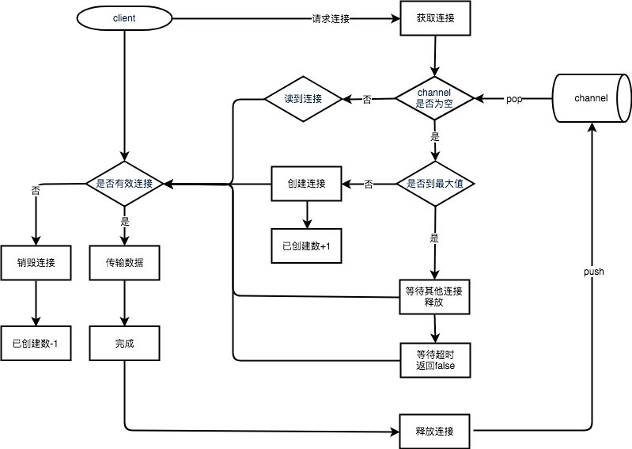
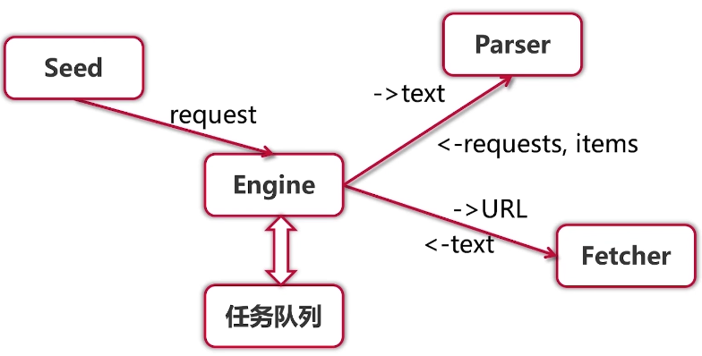

### 语法练习
1. 数据类型转换
    ```go
    var f float64 = float64(i)
    // 或者
    f := float64(i)
    ```
1. slice
   - 当作函数参数传递时修改slice
    ```go
    func fn(in []int) {
        in[0] = 100                 // 引用传递方式(因为slice底层数组是一个)
    }

    func fn(in []int) {
        in = append(in, 5)          // 值传递方式
    }
    ```
   - 在循环中修改数组的值
    ```go
	slice := []int{10, 20, 30, 40}
	for index, value := range slice {
		slice[index] = 66
		fmt.Printf("value = %d , value-addr = %x , slice-addr = %x\n", value, &value, &slice[index])
	}
	fmt.Print(slice)
    ```
   - 进阶练习
    ```go
    slice := []int{0, 1, 2, 3, 4, 5, 6, 7, 8, 9}
	s1 := slice[2:5]
	s2 := s1[2:6:7]

	s2 = append(s2, 100)
	s2 = append(s2, 200)

	s1[2] = 20

	fmt.Println(s1)
	fmt.Println(s2)
	fmt.Println(slice)
    ```
1. 常量
    ```go
    // 数值常量，表示高精度的值
    const (
        Big   = 1 << 100
        Small = Big >> 99
    )

    // 存储数据的Byte、KB、MB、GB、TB、PB的计算
    const(
        b=1<<(10*iota)
        kb
        mb
        gb
        tb
        pb
    )

    func dataByte() {
        fmt.Println("b=",b)
        fmt.Println("kb=",kb)
        fmt.Println("mb=",mb)
        fmt.Println("gb=",gb)
        fmt.Println("tb=",tb)
        fmt.Println("pb=",pb)
    }
    ```
1. if
    ```go
    // 便捷写法，但是变量作用域仅在if范围，包括else范围
    if v := math.Pow(x, n); v < lim {
    }
    ```
1. switch
    ```go
    // 没有条件的switch，代替冗长的if-then-else
    switch {
    case t.Hour() < 12:
    case t.Hour() < 17:
    default:
    }
    ```
1. for简写
    ```go
    for ; sum < 10; {       // 前/后置语句为空，和c、java一样
        sum += sum
    }
    ```
1. 死循环：`for {}`
1. 函数
    ```go
    // 多值返回
    func swap(x, y string) (string, string) {           // 缩写参数类型
        return y, x
    }
    a, b := swap("hello", "world")
    // 命名返回值
    func split(sum int) (x, y int) {                    // x/y为返回值，为变量。长函数中使用会影响可读性
        x = sum * 4 / 9
        y = sum - x
        return
    }
    // 函数作为参数、返回值
    hypot := func compute(fn func(float64, float64) float64) float64 {
        return fn(3, 4)
    }
    // 可选参数传递
    func Del(key ...string) {
        err = vr.Del(key...)                            // 使用...传递可选参数
        return
    }
    ```
1. 结构体
   - 方法的接收者是否使用指针类型取决于，即加不加*
     1. 方法能够修改接收者指向的值，即方法会不会改变结构体的内容，如`func (m Mystruct) myMethod() {}`
     1. 避免在每次调用方法时复制该值，在值的类型为大型结构体时，这样做会更加高效
   - 在结构体上定义方法
    ```go
    func (v *vertex) Add() float64 {
	    return v.X + v.Y
    }
    v := &vertex{3, 4}
    v.Abs()                 // 使用
    ```
   - 指针访问结构体
    ```go
    v := vertex{1, 2}
	p := &v
    p.X
    ```
1. 打印
   - `fmt.Printf("s[%d] == %d\n", i, s[i])`
     1. %s：字符串
     1. %d：数字
     1. %v：slice
   - `fmt.Println(m)`
1. 闭包
    ```go
    // 闭包，闭包是一个函数值，来自函数体的外部的变量引用，函数可以对这个引用值进行访问和赋值；换句话说这个函数被“绑定”在这个变量上
    func adder() func(int) int {   // 函数adder返回一个闭包。每个闭包都被绑定到其各自的sum变量上，pos按照pos的节奏，neg按照..，两个独立变量被赋值
        sum := 0
        return func(x int) int {
            sum += x
            return sum
        }
    }
    pos, neg := adder(), adder()
    for i := 0; i < 10; i++ {
        fmt.Println(
            pos(i),
            neg(-2*i),
        )
    }
    ```
1. 反射
   - 类型
     1. `reflect.Kind`：内置元类型，表示reflect包中定义的十几种，每种有一个整数编号
        ```go
        const (
            Invalid Kind = iota         // 不存在的无效类型
            Bool
            Int
            Int8
            Int16
            Int32
            Int64
            Uint
            Uint8
            Uint16
            Uint32
            Uint64
            Uintptr                     // 指针的整数类型，对指针进行整数运算时使用
            Float32
            Float64
            Complex64
            Complex128
            Array
            Chan
            Func
            Interface
            Map
            Ptr                         // 指针类型
            Slice 
            String
            Struct                      // 结构体类型
            UnsafePointer               // unsafe.Pointer 类型
        )

        // demo
        v := reflect.ValueOf(v)
        v.Kind()                        // 获取其类型
        fmt.Println(v.String())         // 返回其值
        fmt.Println(v.Int())            // 返回其值
        ```
     1. `reflect.Type`：接口
        ```go
        type Type interface {
            // 返回接口原类型
            Kind() Kind
            // 自身包内的类型名，如果是未命名类型会返回""
            Name() string
            // 返回类型的包路径，即明确指定包的import路径，如"encoding/base64"
            // 如果类型为内建类型(string, error)或未命名类型(*T, struct{}, []int)，会返回""
            PkgPath() string
            // 返回类型的字符串表示。该字符串可能会使用短包名（如用base64代替"encoding/base64"）
            // 也不保证每个类型的字符串表示不同。如果要比较两个类型是否相等，请直接用Type类型比较。
            String() string
            // 返回要保存一个该类型的值需要多少字节；类似unsafe.Sizeof
            Size() uintptr
            // 返回当从内存中申请一个该类型值时，会对齐的字节数
            Align() int
            // 返回当该类型作为结构体的字段时，会对齐的字节数
            FieldAlign() int
            // 如果该类型实现了u代表的接口，会返回真
            Implements(u Type) bool
            // 如果该类型的值可以直接赋值给u代表的类型，返回真
            AssignableTo(u Type) bool
            // 如该类型的值可以转换为u代表的类型，返回真
            ConvertibleTo(u Type) bool
            // 返回该类型的字位数。如果该类型的Kind不是Int、Uint、Float或Complex，会panic
            Bits() int
            // 返回array类型的长度，如非数组类型将panic
            Len() int
            // 返回该类型的元素类型，如果该类型的Kind不是Array、Chan、Map、Ptr或Slice，会panic
            Elem() Type
            // 返回map类型的键的类型。如非映射类型将panic
            Key() Type
            // 返回一个channel类型的方向，如非通道类型将会panic
            ChanDir() ChanDir
            // 返回struct类型的字段数（匿名字段算作一个字段），如非结构体类型将panic
            NumField() int
            // 返回struct类型的第i个字段的类型，如非结构体或者i不在[0, NumField())内将会panic
            Field(i int) StructField
            // 返回索引序列指定的嵌套字段的类型，
            // 等价于用索引中每个值链式调用本方法，如非结构体将会panic
            FieldByIndex(index []int) StructField
            // 返回该类型名为name的字段（会查找匿名字段及其子字段），
            // 布尔值说明是否找到，如非结构体将panic
            FieldByName(name string) (StructField, bool)
            // 返回该类型第一个字段名满足函数match的字段，布尔值说明是否找到，如非结构体将会panic
            FieldByNameFunc(match func(string) bool) (StructField, bool)
            // 如果函数类型的最后一个输入参数是"..."形式的参数，IsVariadic返回真
            // 如果这样，t.In(t.NumIn() - 1)返回参数的隐式的实际类型（声明类型的切片）
            // 如非函数类型将panic
            IsVariadic() bool
            // 返回func类型的参数个数，如果不是函数，将会panic
            NumIn() int
            // 返回func类型的第i个参数的类型，如非函数或者i不在[0, NumIn())内将会panic
            In(i int) Type
            // 返回func类型的返回值个数，如果不是函数，将会panic
            NumOut() int
            // 返回func类型的第i个返回值的类型，如非函数或者i不在[0, NumOut())内将会panic
            Out(i int) Type
            // 返回该类型的方法集中方法的数目
            // 匿名字段的方法会被计算；主体类型的方法会屏蔽匿名字段的同名方法；
            // 匿名字段导致的歧义方法会滤除
            NumMethod() int
            // 返回该类型方法集中的第i个方法，i不在[0, NumMethod())范围内时，将导致panic
            // 对非接口类型T或*T，返回值的Type字段和Func字段描述方法的未绑定函数状态
            // 对接口类型，返回值的Type字段描述方法的签名，Func字段为nil
            Method(int) Method
            // 根据方法名返回该类型方法集中的方法，使用一个布尔值说明是否发现该方法
            // 对非接口类型T或*T，返回值的Type字段和Func字段描述方法的未绑定函数状态
            // 对接口类型，返回值的Type字段描述方法的签名，Func字段为nil
            MethodByName(string) (Method, bool)
            // 内含隐藏或非导出方法
        }
        ```
     1. `reflect.Value`：结构体类型
        ```go
        func (v Value) IsNil() bool
        func (v Value) IsValid() bool       // 返回v是否持有一个值。如v是Value零值会返回假，此时v除了IsValid、String、Kind之外方法都导致panic
        func (v Value) Kind() Kind          // Kind返回v持有的值的分类，如果v是Value零值，返回值为Invalid
        func (v Value) Type() Type          // 返回v持有的值的类型的Type表示
        // Elem返回v持有的接口保管的值的Value封装，或者v持有的指针指向的值的Value封装。
        // 如果v的Kind不是Interface或Ptr会panic；如果v持有的值为nil，会返回Value零值。
        func (v Value) Elem() Value
        func (v Value) Bool() bool          // 返回v持有的布尔值，如果v的Kind不是Bool会panic
        ......
        func (v Value) NumField() int       // 返回v持有的结构体类型值的字段数，如果v的Kind不是Struct会panic
        func (v Value) Field(i int) Value   // 返回结构体的第i个字段（的Value封装）。如果v的Kind不是Struct或i出界会panic
        ......
        func (v Value) Send(x Value)        // 方法向v持有的通道发送x持有的值。如果v的Kind不是Chan或x持有值不能直接赋值给v持有通道的元素类型，会panic
        .......
        func (v Value) Call(in []Value) []Value     // Call方法使用输入的参数in调用v持有的函数
        ....
        func (v Value) CanAddr() bool       // 返回是否可以获取v持有值的指针
        func (v Value) CanSet() bool        // 返回v是不是可被设定的
        func (v Value) SetBool(x bool)      // 设置v的持有值。如果v的Kind不是Bool或者v.CanSet()返回假，会panic。
        func (v Value) SetInt(x int64)      // 设置v的持有值。如果v的Kind不是Int、Int8、Int16、Int32、Int64之一或者v.CanSet()返回假，会panic。
        .......
        ......
        func DeepEqual(a1, a2 interface{}) bool     // 判断两个值是否深度相等.结构体会对字段进行深度对比，array/slice对比成员/长度等，map深度对比键值对
        ```
   - 实例
    ```go
    // 常规操作
    var demoV1 DemoInt
    demoV1 = 100

    reflectTDV1 := reflect.TypeOf(demoV1)
    reflectTDV1.Kind()                          // int，原始类型
    reflectTDV1.Name()                          // demoInt，如果是原int则是int
    reflectTDV1.String()                        // main.demoInt
    reflectTDV1.Align()                         // 8

    reflectVDV1 := reflect.ValueOf(demoV1)
    reflectVDV1.Type()                          // main.demoInt
    reflectVDV1.Kind()                          // int

    // CanAddr
    demoV1 := 100
    reflect.ValueOf(&demoV1).CanAddr()          //false
    //reflect.ValueOf(&demoV1).Elem().CanAddr()   //true

    // Set
    var a []int
    ra := reflect.ValueOf(&a)
    aElem := ra.Elem()
    fmt.Println("elem ", aElem, " source slice:", a)    //elem  []  source slice: []

    aElem.Set(reflect.ValueOf([]int{11}))
    // Comparable，判断是否可比较
    func canCompare(source interface{}) {
        sType := reflect.TypeOf(source)
        sType.Comparable()
    }

    // Call
    val := reflect.ValueOf(a)
    val.Method(1).Call(nil)                             //获取到第二个方法，调用它
    val.MethodByName("SumNum").Call(nil)
    ```
1. 代码简化
    ```go
    []T{T{}, T{}}
    // 切片表达式简化为
    []T{{}, {}}

    s[a:len(s)]
    // 切片表达式简化为
    s[a:]

    for x, _ = range v {...}
    // 迭代简化为
    for x = range v {...}

    for _ = range v {...}
    // 迭代简化为
    for range v {...}
    ```
### 应用实例
1. 数学相关
   - 生成随机数
    ```go
    rand.Seed(time.Now().Unix())        // 需要改变随机数种子，否则每次程序启动生成的随机数相同，因为种子默认为1
    rand.Int()
    ```
1. 时间相关
   - 计算时间差
    ```go
    s := time.Now()
    dur := time.Now().Sub(s)
    ```
   - 自定义时间格式
    ```go
    en["date_format"]="%Y-%m-%d %H:%M:%S"
    cn["date_format"]="%Y年%m月%d日 %H时%M分%S秒"

    fmt.Println(date(msg(lang,"date_format"),t))

    func date(fomate string,t time.Time) string{
        year, month, day = t.Date()
        hour, min, sec = t.Clock()
        //解析相应的%Y %m %d %H %M %S然后返回信息
        //%Y 替换成2012
        //%m 替换成10
        //%d 替换成24
    }
    ```
1. url编解码
   - get参数
    ```go
    // url encode
	v := url.Values{}
	v.Add("a", "aa")
	v.Add("b", "bb")
	v.Add("c", "有没有人")
	body := v.Encode()
	fmt.Println(v)
	fmt.Println(body)
	// url decode
	m, _ := url.ParseQuery(body)
	fmt.Println(m)
    ```
   - 内容
    ```go
    urltest := "http://www.baidu.com/s?wd=自由度"
    // 编码
	encodeurl:= url.QueryEscape(urltest)
	fmt.Println(encodeurl)
    // 解码
	decodeurl,err := url.QueryUnescape(encodeurl)
	if err != nil {
		fmt.Println(err)
	}
    fmt.Println(decodeurl)
    ```
1. 读取二进制的bmp文件头
    ```go
    import (
        "encoding/binary"
        "fmt"
        "os"
    )

    type BitmapInfoHeader struct {
        Size           uint32 // 结构体大小
        Width          int32  // 宽度
        Height         int32  // 高度
        Planes         uint16 // 面， 恒定为1
        BitCount       uint16 // 每个像素占用的字节数
        Compression    uint32 // 压缩类型
        SizeImage      uint32 // 图形大小
        XPerlsPerMeter int32  // 水平分辨率 每米的像素数
        YPerlsPerMeter int32  // 每米的像素数
        ClrUsed        uint32 // 颜色数
        ClrImportant   uint32 // 调色版
    }

    func main() {
        // 读取文件
        file, err := os.Open("image.bmp")
        if err != nil {
            fmt.Println(err)
            return
        }

        // 逐个部门一点点读取属性
        var headA, headB byte                                   // 读文件头，为 BM
        binary.Read(file, binary.LittleEndian, &headA)
        binary.Read(file, binary.LittleEndian, &headB)

        var size uint32                                         // 读文件大小
        binary.Read(file, binary.LittleEndian, &size)

        var reserveA, reserveB uint16
        binary.Read(file, binary.LittleEndian, &reserveA)
        binary.Read(file, binary.LittleEndian, &reserveB)

        var offbits uint32                                      // 读偏移数据，文件真正开始的地方
        binary.Read(file, binary.LittleEndian, &offbits)

        fmt.Println(headA, headB, size, reserveA, reserveB, offbits)

        // 读接下来的数据：构造好结构体绑定，一次性获取属性，快速
        infoHeader := new(BitmapInfoHeader)
        if err := binary.Read(file, binary.LittleEndian, infoHeader); err != nil {
            fmt.Println(err)
            return
        }
        fmt.Println(infoHeader)
    }
    ```
1. aes加解密
    ```go
    import (
        "crypto/aes"
        "crypto/cipher"
        "fmt"
        "os"
    )

    var commonIV = []byte{0x00, 0x01, 0x02, 0x03, 0x04, 0x05, 0x06, 0x07, 0x08, 0x09, 0x0a, 0x0b, 0x0c, 0x0d, 0x0e, 0x0f}

    func main() {
        //需要去加密的字符串
        plaintext := []byte("My name is Astaxie")
        //如果传入加密串的话，plaint就是传入的字符串
        if len(os.Args) > 1 {
            plaintext = []byte(os.Args[1])
        }

        //aes的加密字符串
        key_text := "astaxie12798akljzmknm.ahkjkljl;k"
        if len(os.Args) > 2 {
            key_text = os.Args[2]
        }

        fmt.Println(len(key_text))

        // 创建加密算法aes
        c, err := aes.NewCipher([]byte(key_text))
        if err != nil {
            fmt.Printf("Error: NewCipher(%d bytes) = %s", len(key_text), err)
            os.Exit(-1)
        }

        //加密字符串
        cfb := cipher.NewCFBEncrypter(c, commonIV)
        ciphertext := make([]byte, len(plaintext))
        cfb.XORKeyStream(ciphertext, plaintext)
        fmt.Printf("%s=>%x\n", plaintext, ciphertext)

        // 解密字符串
        cfbdec := cipher.NewCFBDecrypter(c, commonIV)
        plaintextCopy := make([]byte, len(plaintext))
        cfbdec.XORKeyStream(plaintextCopy, ciphertext)
        fmt.Printf("%x=>%s\n", ciphertext, plaintextCopy)
    }
    ```
1. goroutine的斐波那契数列
    ```go
    func fibonacci(c, quit chan int) {
        x, y := 0, 1
        for {
            select {
            case c <- x:
                x, y = y, x+y
            case <-quit:
                fmt.Println("quit")
                return
            }
        }
    }

    func main() {
        c := make(chan int)
        quit := make(chan int)
        go func() {
            for i := 0; i < 10; i++ {
                fmt.Println(<-c)
            }
            quit <- 0
        }()
        fibonacci(c, quit)
    }
    ```
### 算法
1. 外部排序
   - 解析：pipeline思想，将源数据分成一个个的节点，然后归并到最终集
     1. 每个节点内部使用sort包的内部排序
     1. 多个节点进行归并计算
   - 实现
     1. 多个节点值的归并：可选参数 + 递归
        ```go
        func MergeM(inputs ...<-chan int) <-chan int {
            if len(inputs) == 1 {
                return inputs[0]
            }

            m := len(inputs) / 2
            return Merge(MergeN(inputs[:m]...), MergeN(inputs[m:]...))      // slide和可变参数的转换
        }
        ```
1. 广度优先算法
   - 认识：上左下右一点点探索，一层层递进，每到一个点都是最短路径，深度优先走不了最短路径
     1. 往外走好多路线，往回走只有一条，可确定最短路径
     1. 三种状态，已探索，未探索，待探索
     1. 爬虫用到，锻炼语言理解
     1. 找到确定的地方，用程序表达出来
   - 实现方式
     1. 用循环创建二维slice
     1. 使用slice实现队列
     1. 用Fscanf读取文件
     1. 对Point的抽象，即坐标：`type point struct{i, j int}`
### 最佳实践
1. 编写思路
   - 编程起势：首先通过划分结构体，定义不同的功能模块，然后分别实现，最终实现功能
     1. 封装模块
        - 在一个文件中定义一组接口interface
        - 定义结构体struct，可以在一个文件或文件夹中专门存放需要用到的struct
        - 定义new结构体struct的方法，用sync.Once实现单例返回，返回值为接口interface
        - 定义属于结构体struct、并且实现了接口interface的所有方法，完成~
     1. 定义对象：针对一类组合，要定义一个结构体作为包装这个对象的载体，而不是孤零零的散着各种数据，面向对象嘛
   - 函数式编程：通过参数、返回值、变量都是函数的形式，实现更加灵活的处理
     1. 将具体执行的逻辑包装成一个方法，大家执行这个方法，内部自己定义，就可以将实现解耦了，大家不用关心执行的内容了
     1. 针对需要外部定义处理的函数，用函数式编程，实现外部定义实现，内部调度，执行那个方法就可以了
        ```go
        type Han struct {
            UseMethod func(int) bool
        }

        func main() {
            h := Han{
                UseMethod: func(i int) bool {
                    return true
                },
            }
            // 使用
            h.UseMethod(1)
        }
        ```
   - 并行思想：之前用的读io然后处理的单线程模式，改为：起多个不同的协程(有的处理读io，有的处理逻辑)，协程之间通过chan传递数据，一边读取一边处理的协程模式了
     1. 耗时的goroutine可以多起几个
   - 如何设计一个特定领域的整体的处理框架，整体架构就是先划分不同角色，怎么划分好角色最重要，然后利用interface去高内聚每个角色，之间相互配合，实现更强的扩展性
1. 避坑指南
   - 谨慎使用全局变量，全局变量不会像PHP一样，在完成一次请求之后被销毁，而是会被改变
   - 形参是slice、map类型的参数，注意值可被全局修改，array则不会
     1. 因为：浅复制过程中slice和map底层的类型是个结构体，实际存储值的类型是个指针
     1. 解决：深拷贝，开辟新内存，指针指向新内存地址，并把原有的值复制过去
        ```go
        package main

        import "fmt"

        func main() {
            paramDemo := []int32{1}
            fmt.Println("main.paramDemo 1", paramDemo)
            // 初始化新空间
            paramDemoCopy := make([]int32, len(paramDemo))
            // 深拷贝
            copy(paramDemoCopy, paramDemo)
            demo(paramDemoCopy)
            fmt.Println("main.paramDemo 2", paramDemo)
        }

        func demo(paramDemo []int32) ([]int32, error) {
            paramDemo[0] = 2
            return paramDemo, nil
        }

        // [Running] go run ".../demo/main.go"
        // main.paramDemo 1 [1]
        // main.paramDemo 2 [1]
        ```
   - 资源使用完毕，记得释放资源或回收资源
     1. 原因
        - 资源连接数线性增长
        - 如果一直持有，资源服务端也有超时时间
     1. 方法：写成`defer close()`
   - 不要依赖map遍历的顺序
     1. 因为：底层实现都是数组+类似拉链法，以下3点都决定了map本来就是无序的，所以Go语言为了避免开发者依赖元素顺序，每次遍历的时候都是随机了一个索引起始值。然后PHP通过额外的内存空间维护了map元素的顺序
        - hash函数无序写入
        - 成倍扩容
        - 等量扩容
   - 不要并发写map，会触发panic
   - 注意判断指针类型不为空nil，再操作
    ```go
    resp, err := http.Get("https://www.example.com")

    // 错误示范
	if resp.StatusCode != http.StatusOK || err != nil {
		// 当 resp为nil时 会触发panic
		// 当 resp.StatusCode != http.StatusOK 时err可能为nil 触发panic
		log.Printf("err: %s", err.Error())
	}

    // 正确示范
    if err != nil {
		// 报错并记录异常日志
		log.Printf("err: %s", err.Error())
		return
	}
	// 模拟业务code不为成功的code
	if resp != nil && resp.StatusCode != http.StatusOK {
		// 报错并记录异常日志
	}
    ```
   - json解析不存在的默认给类型零值，所以接口请求参数不要使用0作为特殊意义值
1. 代码规范
   - 若变量类型为 bool 类型，则名称应以 Has, Is, Can 或 Allow 开头
    ```go
    var isExist bool
    var hasConflict bool
    var canManage bool
    var allowGitHook bool
    ```
   - 带 mutex 的 struct 的接收者 receivers 必须是带指针
   ```go
   type foo struct {
        mutex sync.Mutex
        ...
    }

    // 这里的接收者必须是指针，保证只对同一个锁操作，达到对同一个资源操作的互斥效果。
    func (f *foo) Write (content []byte) error {
        f.mutex.Lock()
        defer f.mutex.Unlock()
        
        ...
    }
   ```
   - 函数
     1. 见名知义，使用动词命名
     1. 长命名并不会使其更具可读性，一份有用的说明文档通常比额外的长名更有价值
     1. 若函数或方法为判断类型（返回值主要为 bool 类型），则名称应以 Has、Is、Can 或 Allow 等判断性动词开头
   - go 协程启动时，一定要 recover，防止因单一协程引起主程序 panic
   - 空 map 请使用 make(..) 初始化
    ```go
    var (
        // m1 读写安全
        // m2 在写入时会 panic
        m1 = make(map[T1]T2)
        m2 map[T1]T2
    )
    ```
1. 实用技巧
   - 全局变量：可以避免重复申请带来的内存交互
   - sync.Pool
    ```go
    // 使用sync.Pool
    func BenchmarkDemo_Pool(b *testing.B) {
        // 使用缓存池sync.Pool
        demoPool := &sync.Pool{
            // 定义初始化结构体的匿名函数
            New: func() interface{} {
                return &AddressModule{
                    Country: &Country{
                        ID:   0,
                        Name: "",
                    },
                    Province: &Province{
                        ID:   0,
                        Name: "",
                    },
                    City: &City{
                        ID:   0,
                        Name: "",
                    },
                    County: &County{
                        ID:   0,
                        Name: "",
                    },
                    Street: &Street{
                        ID:   0,
                        Name: "",
                    },
                }
            },
        }
        b.RunParallel(func(pb *testing.PB) {
            for pb.Next() {
                // 从缓存池中获取对象
                addressModule, _ := (demoPool.Get()).(*AddressModule)
                // 下面这段代码没意义 只是为了不报语法错误
                if addressModule == nil {
                    return
                }

                // 重置对象 准备归还对象到缓存池
                addressModule.Consignee = ""
                addressModule.Email = ""
                addressModule.Mobile = 0
                addressModule.Country.ID = 0
                addressModule.Country.Name = ""
                addressModule.Province.ID = 0
                addressModule.Province.Name = ""
                addressModule.County.ID = 0
                addressModule.County.Name = ""
                addressModule.Street.ID = 0
                addressModule.Street.Name = ""
                addressModule.DetailedAddress = ""
                addressModule.PostalCode = ""
                addressModule.IsDefault = false
                addressModule.Label = ""
                addressModule.Longitude = ""
                addressModule.Latitude = ""
                // 还对象到缓存池
                demoPool.Put(addressModule)
            }
        })
    }

    // 使用sync.Pool执行结果
    // goos: darwin
    // goarch: amd64
    // pkg: demo
    // cpu: Intel(R) Core(TM) i5-7360U CPU @ 2.30GHz
    // BenchmarkDemo_Pool-4   	988550808	        12.41 ns/op	       0 B/op	       0 allocs/op
    // PASS
    // ok  	demo	14.215s
    ```
   - sync/singleflight：缓存等穿透时减少请求数
    ```go
    func TestDemo_Singleflight(t *testing.T) {
        t.Parallel()
        singleGroup := singleflight.Group{}
        wg := sync.WaitGroup{}
        // 模拟并发远程调用
        for i := 0; i < 3; i++ {
            wg.Add(1)
            go func() {
                defer wg.Done()
                // 使用singleflight
                res, err, shared := singleGroup.Do("cache_key", func() (interface{}, error) {
                    resp, err := http.Get("http://example.com")
                    if err != nil {
                        return nil, err
                    }
                    body, err := ioutil.ReadAll(resp.Body)
                    if err != nil {
                        return nil, err
                    }
                    return body, nil
                })
                if err != nil {
                    t.Error(err)
                    return
                }
                _, _ = res.([]byte)
                t.Log("log", shared, err)
            }()
        }

        wg.Wait()
    }
    ```
1. 应用场景
   - 引号输出
     1. 使用反引号：`a := `"xx"``
     1. 使用转义：`a := "\"xx\""`
     1. 使用strconv包：`a := strconv.Quote("xx")`
   - 判断接口类型 + 结构体切片用法
    ```go
    // 参数支持constant.ServerConfig或者[]constant.ServerConfig
    func (n *ConfigureCenterNacos) InitServer(opts interface{}) (interface{}, error) {
        switch v := opts.(type) {                                                           // v获取了opts的值和类型
        case constant.ServerConfig:
            n.serverConfig = []constant.ServerConfig{                                       // 结构体切片的赋值方式
                v,
            }
            return n.serverConfig, nil
        case []constant.ServerConfig:
            n.serverConfig = v
            return n.serverConfig, nil
        default:
            return nil, errors.New("config opts error")
        }
    }
    ```
   - 函数
     1. 可选参数实践
        ```go
        // 使用NewQueue，动态改变可选的新参数的方法
        // 用新的方法处理不同情况下不同的参数，NewQueue相当于一个代理方法


        type Queue struct {
            Name     string
            MaxLimit int

            // monitor
            MonitorInterval int
        }

        type QueueOption func(*Queue)

        func WithMaxLimit(max int) QueueOption {
            return func(q *Queue) {
                q.MaxLimit = max
            }
        }

        func WithMonitorInterval(seconds int) QueueOption {
            return func(q *Queue) {
                q.MonitorInterval = seconds
            }
        }

        func NewQueue(name string, options ...QueueOption) *Queue {
            queue := &Queue{name, 10, 5}

            for _, o := range options {
                o(queue)
            }

            return queue
        }
        ```
     1. 函数式编程和循环
        ```go
        for _, m := range mySlice {
            correctM ：= m
            a := myStruct{
                name: "xx"
                myFunc: func() int {
                    return m                // 这里只是返回了一个函数，这个函数的执行时机是整个for循环结束后，所以这么写m无法达到目的，应该使用另外定义的变量
                }
            }
        }
        ```
   - channel
     1. 通过设置为缓存通道，实现抢购场景的解决方案
        ```go
        // 响应公共结构体
        type APIBase struct {
            Code    int32  `json:"code"`
            Message string `json:"message"`
        }

        // 模拟接口A的响应结构体
        type APIDemoA struct {
            APIBase
            Data APIDemoAData `json:"data"`
        }

        type APIDemoAData struct {
            Title string `json:"title"`
        }

        // 模拟接口B的响应结构体
        type APIDemoB struct {
            APIBase
            Data APIDemoBData `json:"data"`
        }

        type APIDemoBData struct {
            SkuList []int64 `json:"sku_list"`
        }

        // 模拟接口逻辑
        func main() {
            // 创建接口A传输结果的通道
            execAResult := make(chan APIDemoA)
            // 创建接口B传输结果的通道
            execBResult := make(chan APIDemoB)

            // 并发调用接口A
            go func(execAResult chan<- APIDemoA) {
                // 模拟接口A远程调用过程
                time.Sleep(2 * time.Second)
                execAResult <- APIDemoA{}
            }(execAResult)

            // 并发调用接口B
            go func(execBResult chan<- APIDemoB) {
                // 模拟接口B远程调用过程
                time.Sleep(1 * time.Second)
                execBResult <- APIDemoB{}
            }(execBResult)

            var resultA APIDemoA
            var resultB APIDemoB
            i := 0
            for {
                if i >= 2 {
                    fmt.Println("退出")
                    break
                }
                select {
                case resultA = <-execAResult: // 等待接口A的响应结果
                    i++
                    fmt.Println("resultA", resultA)
                case resultB = <-execBResult: // 等待接口B的响应结果
                    i++
                    fmt.Println("resultB", resultB)
                }
            }
        }
        ```
     1. select的简单调度
        ```go
        func createWorker(id int) chan<- int {
            c := make(chan int)
            go worker(id, c)
            return c
        }

        func main() {

            var c1, c2 = generator(), generator()
            var worker = createWorker(0)

            var values []int
            tm := time.After(10 * time.Second)
            tick := time.Tick(time.Second)

            for {
                var acticeWorker chan<- int
                var acticeValue int
                if len(values) > 0 {                                // 利用切片实现，生产者比消费者快的积压效果，不丢数据
                    acticeWorker = worker                           // 由于chan类型的c是一个指针，返回了一个指针，这样go worker(id, c)这个协程就能跑起来
                    acticeValue = values[0]
                }

                select {
                case n := <-c1:
                    values = append(values, n)
                case n := <-c2:
                    values = append(values, n)
                case acticeWorker <- acticeValue:                   // 利用var出来的为nil的channel，实现没有值时阻塞
                    values = values[1:]
                case <-time.After(800 * time.Millisecond):          // 超时时间，和总时长原理相同
                    fmt.Print("timeout")
                case <-tick:                                        // 定时报告channel的状态
                    fmt.Print("queue len = ", len(values))
                case <-tm:                                          // 总运行时长，time.After控制
                    fmt.Print("bye")
                    return
                }
            }
        }
        ```
   - context
     1. pipeLine的每个工人函数都使用switch处理case <-ctx.Done()。作为生产线上的命令控制
        ```go
        func lineParser(ctx context.Context, base int, in <-chan string) (<-chan int64, <-chan error, error) {
            ...
            go func() {
                defer close(out)
                defer close(errc)

                for line := range in {

                    n, err := strconv.ParseInt(line, base, 64)
                    if err != nil {
                        errc <- err
                        return
                    }

                    select {
                    case out <- n:
                    case <-ctx.Done():
                        return
                    }
                }
            }()
            return out, errc, nil
        }
        ```
     1. 超时控制
        ```go
        ctx, cancel := context.WithTimeout(context.Background(), 50*time.Millisecond)
        defer cancel()

        select {
        case <-time.After(1 * time.Second):
            fmt.Println("overslept")
        case <-ctx.Done():
            fmt.Println(ctx.Err()) // prints "context deadline exceeded"
        }
        ```
     1. 传递数据
        ```go
        var UserId = FooKey("user-id")

        ctx := context.Background()
        // 设置
        ctx = context.WithValue(ctx, UserId, "1")
        // 获取
        fmt.Println(ctx.Value(UserId))
        ```
   - io/ioutil：读取所有字符
    ```go
    resp, err := http.Get("http://example.com?user_id=121212")
	if err != nil {
	}
	body, err := ioutil.ReadAll(resp.Body)
	if err != nil {
	}
    ```
   - web错误处理
     1. defer + panic + recover：多加一层panic，优化默认http的的报错展示
     1. Type Assertion：通过类型定义，区分用户展示和服务器展示
     1. 函数式编程：实现错误处理的代理，接收各种逻辑处理函数遇到的错误，形式为
        ```go
        func errorWrapper(handler appHandler) func(http.ResponseWriter, *http.Request) {
            return func(writer http.ResponseWriter, request *http.Request) {
                // 多加一层panic
                defer func() {
                    if r := recover(); r != nil {

                    }
                }
                // 错误逻辑处理
            }
        }
        ```
1. 性能优化
   - 当一个结构体很大、并且在函数中传递时，可以将结构体拆分成小的，将小的单独传递，将小的组合成原来的大的吗，可以提升性能
1. 锁
   - 实践
     1. 尽量减少锁的持有时间
        - 细化锁的粒度
        - 不要在持有锁的时候做io操作：尽量只通过持有锁来保护io操作需要的资源而不是io操作本身
     1. 在适当时候使用 RWMutex
     1. 改为使用channel
     1. 实现tryLock功能：https://colobu.com/2017/03/09/implement-TryLock-in-Go/
        - 可以用channel
            ```go
            type ChanMutex chan struct{}
            func (m *ChanMutex) Lock() {
                ch := (chan struct{})(*m)
                ch <- struct{}{}
            }
            func (m *ChanMutex) Unlock() {
                ch := (chan struct{})(*m)
                select {
                case <-ch:
                default:
                    panic("unlock of unlocked mutex")
                }
            }
            func (m *ChanMutex) TryLock() bool {
                ch := (chan struct{})(*m)
                select {
                case ch <- struct{}{}:
                    return true
                default:
                }
                return false
            }
            ```
     1. copy结构体操作可能导致非预期的死锁：如果结构体中有锁的话，记得重新初始化一个锁对象，否则会出现非预期的死锁
     1. 善用 defer 来确保在函数内正确释放了锁
        - 注意不要导致无意中在持有锁的时候做了io操作，出现了非预期的持有锁时间太长的问题
     1. 工具
        - go vet 工具检查代码中锁
          1. `go vet $(go list ./... | grep -v /vendor/)`：忽略vender
        - build/test 时使用 -race 参数以便运行时检测数据竞争问题
        - go-deadlock 检测死锁或锁等待问题
### 技术解决方案
1. 千万级WebSocket弹幕消息推送服务
   - 难点
     1. 推送频率：在线人数 * 每秒弹幕数 = 10亿条每秒
     1. 有多个房间
   - 方案
     1. 推拉模式的选择：拉请求量不可控，并且大多数请求无效，消息不及时；推需要维持多个长链接
     1. 瓶颈破除
        - 内核：linux内核发送tcp极限包频100万/秒
          1. 方案：消息合并，将同一秒内n条消息合并成1条，这样每秒推送次数只等于在线连接数
        - 锁：需要维护在线用户集合(百万在线)，1. 发送消息需要遍历，耗时长，2. 推送期间客户端正常上下线，集合需要上锁
          1. 方案：大拆小
             - 连接打散到多个集合中，每个集合有自己的锁
             - 多线程并发推送多个集合，避免锁竞争
             - 读写锁替代互斥锁
        - cpu：百万级消息百万次json编码非常耗费cpu
          1. 方案：减少重复计算，编码前置，n条消息只编码1次
     1. 分布式架构：上下三层，通过网关集群对外用http1.1打散管理一部分连接，网关对内用http2对接业务服务器
        - http2支持连接复用，可以在单个连接上可以实现高吞吐的通讯，作为内部通讯rpc很适合
   - demo实现
     1. api设计：拿一个结构体，读消息用in chan，发消息用out chan
     1. websocket设计：go起一个协程，for死循环读websocket消息扔到in chan；go再起一个协程，死循环读out chan，将消息写到websocket
        - 问题1：当in chan写满进入读ws协程阻塞时，写协程网络报错关闭ws链接，此时读协程不知道链接已经关闭了
          1. 解决方案：用select同时监听in chan和新加的容量为1的close chan，当进入close chan分支时(关闭ws时同时关闭close chan使其不阻塞)，表示链接被关闭了。同样ws断了链接api也会阻塞，所以都加上
        - 问题2：ws的close是线程安全的，是可重入的，所以可多次关闭，但是close chan不可重入，所以用结构体的标志位指示是否关闭，同时用mutex锁住防止并发关闭
1. 连接池
   - 原理：
   - go-redis
     1. 特点
        - 只实现了简单的轮询形式，没有加权等筛选
     1. 实现
        - 使用chan作为存储池
        - 使用mutex作为增减chan与其配套数据的互斥保证
        - 队列、池子就是slice和chan的配合使用
        - 利用连接池最大数量作为一个chan(随便struct{}类型就可以)的缓冲大小，存储工作的连接
          1. 在从连接池拿连接时写入chan，不停拿不停写，写满阻塞实现了池的最大忙碌数量，这时候计时器介入，实现获取连接的超时逻辑
          1. 往连接池放连接时，不停放，不停取出chan的值，作减法
1. 锁
   - 超时锁：time.Sleep和sync.Mutex搭配
    ```go
    // 遍历指定的次数（即指定的超时时间）
    for i := 0; i < timeout; i = i + con_Lock_Sleep_Millisecond {
        // 如果锁定成功，则返回成功
        if this.lock() {
            successful = true
            break
        }

        // 如果锁定失败，则休眠con_Lock_Sleep_Millisecond ms，然后再重试
        time.Sleep(con_Lock_Sleep_Millisecond * time.Millisecond)
    }
    ```
   - 写锁保护：读锁非常频繁，持有量总是大于０，写锁一直无法获得
     1. 思路：思路１的缺陷在于，一旦一个用户获取写锁失败后，并设定了写锁保护，但是由于超时退出；这样写锁保护的状态将无法重置，直到下一个用户来获取写锁。在这段时间内，所有的读锁都将被阻塞。而思路２的好处在于，由于设定了写锁保护的截止时间，即便获取写锁的用户超时退出了，也仅仅阻塞读锁一段时间
        - 设定一个状态：在无法获取到写锁时，设定写锁保护，而在成功获得写锁时将其重置；而读锁只要检测到有写锁保护就等待；
        - 设定一个截止时间：在无法获取到写锁时，设定写锁保护时间，而在成功获得写锁时将其重置；而读锁只要检测到当前时间小于写锁保护结束时间就等待；
     1. 实例：https://github.com/Jordanzuo/goutil/tree/master/syncUtil
        ```go
        /*
        通过在RWLocker对象中引入writeProtectEndTime（写锁保护结束时间），来提高获取写锁的成功率。
        当写锁获取失败时，就设置一个写锁保护结束时间，在这段时间内，只允许写锁进行获取，而读锁的获取请求会被拒绝。
        通过重置写锁保护结束时间的时机，对写锁的优先级程度进行调整。有两个重置写锁保护结束时间的时机：
        １、在成功获取到写锁时：此时重置，有利于下一个写锁需求者在当前写锁持有者处理逻辑时设置保护时间，从而当当前写锁持有者释放锁时，下一个写锁需求者可以立刻获得写锁；
        ２、在写锁解锁时：此时重置，给了读锁和写锁的需求者同样的机会进行锁的竞争机会；
        综上：RWLocker可以提供３中级别的写锁优先级：
        １、高级：在获取写锁失败时设置写锁保护结束时间；在获取写锁成功时重置。
        ２、中级：在获取写锁失败时设置写锁保护结束时间；在释放锁时重置。
        ３、无：不设置写锁保护时间。
        */
        package syncUtil

        import (
            "fmt"
            "runtime/debug"
            "sync"
            "time"
        )

        // 读写锁对象
        type RWLocker struct {
            read                int
            write               int   // 使用int而不是bool值的原因，是为了与read保持类型的一致；
            writeProtectEndTime int64 // 写锁保护结束时间。如果当前时间小于该值，则会阻塞读锁请求；以便于提高写锁的优先级，避免连续的读锁导致写锁无法获得；
            prevStack           []byte
            mutex               sync.Mutex
        }

        // 尝试加写锁
        // 返回值：加写锁是否成功
        func (this *RWLocker) lock() bool {
            this.mutex.Lock()
            defer this.mutex.Unlock()

            // 如果已经被锁定，则返回失败；并且设置写锁保护结束时间；以便于写锁可以优先竞争锁；
            if this.write == 1 || this.read > 0 {
                this.writeProtectEndTime = time.Now().UnixNano() + con_Write_Protect_Nanoseconds
                return false
            }

            // 否则，将写锁数量设置为１，并返回成功；并重置写锁保护结束时间；这样读锁和写锁都可以参与锁的竞争；
            this.write = 1
            this.writeProtectEndTime = time.Now().UnixNano()

            // 记录Stack信息
            this.prevStack = debug.Stack()

            return true
        }

        // 写锁定
        // timeout:超时毫秒数,timeout<=0则将会死等
        // 返回值：
        // 成功或失败
        // 如果失败，返回上一次成功加锁时的堆栈信息
        // 如果失败，返回当前的堆栈信息
        func (this *RWLocker) Lock(timeout int) (successful bool, prevStack string, currStack string) {
            timeout = getTimeout(timeout)

            // 遍历指定的次数（即指定的超时时间）
            for i := 0; i < timeout; i++ {
                // 如果锁定成功，则返回成功
                if this.lock() {
                    successful = true
                    break
                }

                // 如果锁定失败，则休眠1ms，然后再重试
                time.Sleep(time.Millisecond)
            }

            // 如果时间结束仍然是失败，则返回上次成功的堆栈信息，以及当前的堆栈信息
            if successful == false {
                prevStack = string(this.prevStack)
                currStack = string(debug.Stack())
            }

            return
        }

        // 写锁定(死等)
        func (this *RWLocker) WaitLock() {
            successful, prevStack, currStack := this.Lock(0)
            if successful == false {
                fmt.Printf("RWLocker:WaitLock():{PrevStack:%s, currStack:%s}\n", prevStack, currStack)
            }
        }

        // 释放写锁
        func (this *RWLocker) Unlock() {
            this.mutex.Lock()
            defer this.mutex.Unlock()
            this.write = 0
            // this.writeProtectEndTime = time.Now().UnixNano()
        }

        // 尝试加读锁
        // 返回值：加读锁是否成功
        func (this *RWLocker) rlock() bool {
            this.mutex.Lock()
            defer this.mutex.Unlock()

            // 如果已经被锁定，或者处于写锁保护时间段内，则返回失败
            if this.write == 1 || time.Now().UnixNano() < this.writeProtectEndTime {
                return false
            }

            // 否则，将读锁数量加１，并返回成功
            this.read += 1

            // 记录Stack信息
            this.prevStack = debug.Stack()

            return true
        }

        // 读锁定
        // timeout:超时毫秒数,timeout<=0则将会死等
        // 返回值：
        // 成功或失败
        // 如果失败，返回上一次成功加锁时的堆栈信息
        // 如果失败，返回当前的堆栈信息
        func (this *RWLocker) RLock(timeout int) (successful bool, prevStack string, currStack string) {
            timeout = getTimeout(timeout)

            // 遍历指定的次数（即指定的超时时间）
            // 读锁比写锁优先级更低，所以每次休眠2ms，所以尝试的次数就是时间/2
            for i := 0; i < timeout; i++ {
                // 如果锁定成功，则返回成功
                if this.rlock() {
                    successful = true
                    break
                }

                // 如果锁定失败，则休眠1ms，然后再重试
                time.Sleep(time.Millisecond)
            }

            // 如果时间结束仍然是失败，则返回上次成功的堆栈信息，以及当前的堆栈信息
            if successful == false {
                prevStack = string(this.prevStack)
                currStack = string(debug.Stack())
            }

            return
        }

        // 读锁定(死等)
        func (this *RWLocker) WaitRLock() {
            successful, prevStack, currStack := this.RLock(0)
            if successful == false {
                fmt.Printf("RWLocker:WaitRLock():{PrevStack:%s, currStack:%s}\n", prevStack, currStack)
            }
        }

        // 释放读锁
        func (this *RWLocker) RUnlock() {
            this.mutex.Lock()
            defer this.mutex.Unlock()
            if this.read > 0 {
                this.read -= 1
            }
        }

        // 创建新的读写锁对象
        func NewRWLocker() *RWLocker {
            return &RWLocker{}
        }
        ```
1. 超时排队
   - go-redis
    ```go
    var timers = sync.Pool{
        New: func() interface{} {
            t := time.NewTimer(time.Hour)
            t.Stop()
            return t
        },
    }

    func (p *ConnPool) waitTurn(ctx context.Context) error {
        select {                                                    // 先看下全协程生命周期是否超时
        case <-ctx.Done():
            return ctx.Err()
        default:
        }

        select {                                                    // 进行忙碌chan占用，写入则表示占用成功，waitTurn的turn拿到了
        case p.queue <- struct{}{}:
            return nil
        default:
        }

        // 接下来进入阻塞排队等待turn
        timer := timers.Get().(*time.Timer)                         // 使用并发池
        timer.Reset(p.opt.PoolTimeout)

        select {
        case <-ctx.Done():                                          // 继续监测全协程生命周期是否超时，是的话重新整理好自己的timer
            if !timer.Stop() {
                <-timer.C
            }
            timers.Put(timer)
            return ctx.Err()
        case p.queue <- struct{}{}:                                 // 等待占用，占用成功重新整理好自己的timer
            if !timer.Stop() {
                <-timer.C
            }
            timers.Put(timer)
            return nil
        case <-timer.C:                                             // 超时逻辑
            timers.Put(timer)
            atomic.AddUint32(&p.stats.Timeouts, 1)
            return ErrPoolTimeout
        }
    }
    ```
1. go自己的数据缓存管理：依赖sync.Map，根据map元素的最后更新时间+最大缓存时间判断数据是否过期
1. 爬虫
   - 步骤
     1. 抓取
        - 规划爬取路径，明确节点和之间的关系
        - 针对不同的节点/网页，编写对应的解析器，`Request(URL string, parser parser) itemData {}`
          1. 正则解析
          1. css选择器解析
        - 得到解析器整理的数据
     1. 分析
     1. 存储
   - 设计思想/架构：
     1. seed：种子页面，即起始点，放入engine
     1. engine：驱动核心，总协调作用，需要轻量，耗时操作要交出去，放入fetcher提取
     1. fetcher：输入url，输出文本，放入parser
     1. parser：输入文本，输出下一个请求、条目
     1. queue：队列，存放即将要操作的数据
   - 实现方案
     1. 用http获取原始页面html字符串
     1. 用同一类的parser解析同一类的页面，用正则获取目标下一个页面，将下一个页面的url和对应使用的解析器放入engine中等待scheduler获取
        - 解析内容的方式：正则、css选择器、xpath
     1. 用正则在页面中获取需要的信息
   - 并发版：使用调度器scheduler，最重要的是调度器
     1. 第一版：简易
        - 只是简单的新起多个协程的scheduler去投递给所有worker公用的一个worker chan，让多个worker抢这个chan，但是由于和engine他们三者互通chan，导致worker数量占满后，没有可用的worker去接收调度器的任务，即循环等待
          1. 解决方案：调度器投递worder的chan时，每次新建协程处理，就不会卡主了
        - 只是交给了go自己去调度，自己不用管，虽然不是性能最好的，但是最方便的
     1. 第二版：队列版
        - 特点
          1. scheduler自己维护request chan和worker chan
          1. 利用一个select，同时用两个分别的slice缓存接收到的request和worker，判断二者都有时，才协调二者同时运行，同时能运行入/运行出放到队列里，这就是一种任务分发
        - 代码
            ```go
            s.workerChan = make(chan chan engine.Request)
            s.requestChan = make(chan engine.Request)
            go func() {
                var requestQ []engine.Request
                var workerQ []chan engine.Request
                for {
                    var activeRequest engine.Request
                    var activeWorker chan engine.Request
                    if len(requestQ) > 0 && len(workerQ) > 0 {
                        activeWorker = workerQ[0]
                        activeRequest = requestQ[0]
                    }
                    select {                                        // 将任务分发和内部的两个队列缓存，一起调度
                    case r := <-s.requestChan:
                        requestQ = append(requestQ, r)
                    case w := <-s.workerChan:
                        workerQ = append(workerQ, w)
                    case activeWorker <- activeRequest:             // 只有request和worker都ready时，才进行任务分发，因为request和worker都要干活
                        workerQ = workerQ[1:]
                        requestQ = requestQ[1:]
                    }
                }
            }
            ```
   - 分布式版：新起goroutine同步调用jsonrpc
     1. 使用连接池管理不同(端口)的rpc server
        - go只需要一个chan就可以解决大多数连接池遇到的加锁、同步问题，只需要写入、读取
     1. 启动rpc server process作为服务承载
        - 后续这些自己写的服务process，可以接入服务发现框架consul，实现更健壮的控制
     1. rpc不能传输函数
        - 解决方案：传函数名称的字符串过去，用switch选择
1. 流媒体任务调度
    ```go
    func (r *Runner) startDispatch() {
        defer func() {
            if !r.longLived {
                close(r.Controller)
                close(r.Data)
                close(r.Error)
            }
        }()

        for {
            select {                                                    // 指示进行何种任务，生产者消费者模型，dispatcher完后加入到executor
            case c :=<- r.Controller:
                if c == READY_TO_DISPATCH {
                    err := r.Dispatcher(r.Data)                         // 执行任务的数据
                    if err != nil {
                        r.Error <- CLOSE
                    } else {
                        r.Controller <- READY_TO_EXECUTE
                    }
                }

                if c == READY_TO_EXECUTE {
                    err := r.Executor(r.Data)
                    if err != nil {
                        r.Error <- CLOSE
                    } else {
                        r.Controller <- READY_TO_DISPATCH
                    }
                }
            case e :=<- r.Error:
                if e == CLOSE {
                    return
                }
            default:
            }
        }
    }
    ```