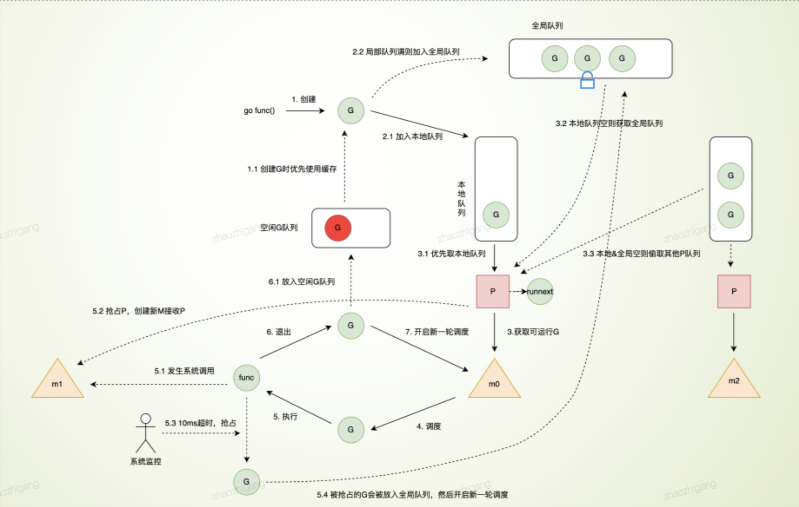
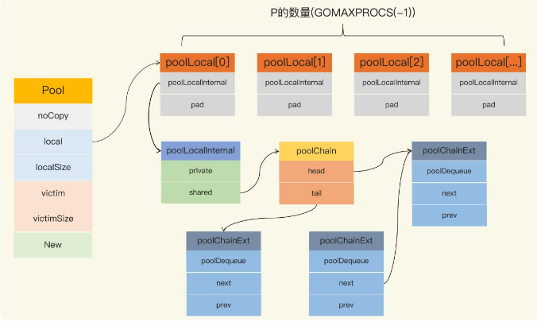

### 数据结构
1. string
   - 认识：[]rune，字符数组实现
1. array
   - 认识
     1. 是一个在栈上分配的连续内存
     1. 编译期的类型检查会检测下标是否越界，因此使用起来比C语言的数组安全
   - 组成
     1. 编译期间
        ```go
        // src/go/types/type.go
        type Array struct {
            len  int64
            elem Type
        }
        ```
     1. 运行时：进行内存的分配
        ```go
        // runtime/malloc.go
        func newarray(typ *_type, n int) unsafe.Pointer {
            if n == 1 {
                return mallocgc(typ.size, typ, true)
            }
            mem, overflow := math.MulUintptr(typ.size, uintptr(n))
            if overflow || mem > maxAlloc || n < 0 {
                panic(plainError("runtime: allocation size out of range"))
            }
            //申请一块内存空间
            return mallocgc(mem, typ, true)
        }
        ```
1. slice
   - 认识：内部通过指针引用底层数组，设定相关属性将数据读写操作限定在指定的区域内
     1. 会判断越界
   - 组成
     1. 
        ```go
        // runtime/slice.go
        type slice struct {
            array unsafe.Pointer        // 指针，可指向数组的首地址、中间位置，数组可以被多个slice同时指向
            len   int                   // 长度
            cap   int                   // 容量，容量 >= 长度
        }
        ```
   - slice自动扩容的策略：append空间不足会发生扩容，会重新分配一块更大的内存，将原slice拷贝到新slice，然后返回新slice。扩容后再将数据追加进去
     1. len小于1024，cap翻倍
     1. 大于1024每次四分之一翻倍，直至大于要求容量
     1. 每次扩容最后都要进行内存(向上)对齐，`roundupsize(size uintptr) uintptr`
   - 浅拷贝和深拷贝
     1. slice之间赋值是浅拷贝，包括子slice
     1. append是深拷贝
     1. copy是深拷贝
1. map
   - 认识
     1. 拉链法：hmap的buckets关联多个bmap即bucket，每个bmap最多存储8个元素，超过后用overflow指向溢出桶继续存储
     1. 解决hash冲突：用两个数组分别存储键和值
        - 正常桶的bmap关联溢出桶的bmap，实际构成了链表关系
     1. 写数据时并没有单独维护键值对的顺序，php5通过一个全局链表维护了map里元素的顺序
   - 组成
     1. 结构
        - hmap：包含多个bmap数组
          1. buckets：指向类型为[]bmap的数组，正常桶
          1. oldbuckets：扩容时，存放之前的buckets

          1. extra：溢出桶结构体
             - overflow：溢出桶。类型是[]bmap
             - oldoverflow：扩容时存放之前的overflow(Map扩容相关字段)
             - nextoverflow：指向溢出桶里下一个可以使用的bmap
          1. noverflow：溢出桶里bmap大致的数量
          1. nevacuate：分流次数，成倍扩容分流操作计数的字段(Map扩容相关字段)

          1. flags：状态标识，比如正在被写、buckets和oldbuckets在被遍历、等量扩容(Map扩容相关字段)
        - bmap：包含两个分别存放key和value的数组
          1. topbits：长度为8的数组，[]uint8，元素为：key的hash的高8位，遍历时对比使用，提高性能
          1. keys：长度为8的数组，[]keytype，元素为：具体的key值
          1. elems：长度为8的数组，[]elemtype，元素为：键值对的key对应的值
          1. overflow：指向的hmap.extra.overflow溢出桶里的bmap
          1. pad：对齐内存使用的，不是每个bmap都有会这个字段，需要满足一定条件
     1. 特性
        - hmap
          1. 没有溢出桶或者溢出桶用完了，内存空间重新分配一个bmap
          1. 溢出桶可以继续关联溢出桶
        - bmap
          1. topbits、keys、elems长度为8，每个bmap结构最多存放8组键值对，
          1. bmap.overflow是个存放了对应使用的溢出桶hmap.extra.overflow里的bmap的地址的指针类型，某个bmap存满了就往指向的这个bmap里存
     1. 流程
        - 读：先找到对应的bucket，然后遍历这里面的元素，如果此bucket没有找到就会检查是否有溢出桶，如果有则会遍历溢出桶
          1. 获取bmap数组的索引位置：key进行hash和位操作，通过高8位topbits加速查找
          1. 遍历bmap里的键，和目标key对比获取key的索引
          1. 根据key的索引通过计算偏移量，获取到对应value
          1. 查找溢出桶获取值，即如果当前“正常桶的bmap”中的overflow值不为nil(说明“正常桶的bmap”关联了“溢出桶的bmap”)，则遍历当前指向的“溢出桶的bmap”继续上边的bmap遍历
        - 遍历：因为遍历map的索引的起点是随机的
        - 写：为什么遍历索引起点是随机的，因为map本质上是“无序的”
          1. 正常写入：写入无法确认hash到具体哪个bucket上，不是按buckets顺序写入
          1. 哈希冲突写入：会写到同一个bucket上，但是bucket上的位置不确定，甚至也许写到溢出桶上
        - 扩容
          1. 认识
             - 就是把hmap中的buckets数组进行扩容，并且迁移bucket
             - 并不是立刻把旧的数组中的元素转义到新的bucket中，而是，只有当访问到具体的某个 bucket 的时候，会把 bucket 中的数据转移到新的 bucket 中
          1. 成倍扩容：迫使元素顺序变化
             - 条件
               1. map写操作
               1. (元素数量/bucket数量) > 6.5
             - 过程
               1. 原buckets指向oldbuckets
               1. 初始化成倍新的buckets指向buckets
               1. 每次只扩容当前的键对应的bucket(bmap)
               1. 原bucket(bmap)被分流到两个新的bucket(bmap)中
          1. 等量扩容：4没有改变元素顺序
             - 目的：整理溢出桶，GC回收冗余的溢出桶
             - 条件：溢出桶的数量大于等于2*B时，函数 `tooManyOverflowBuckets`，公式 `noverflow >= uint16(1)<<(B&15)`
   - wiki
     1. 要点
        - map实现的了解
        - map如何读取数据
        - 溢出桶
        - 遍历是无序的
     1. 一般map
        - 结构
          1. 数组：数组里的值指向一个链表
          1. 链表：目的解决hash冲突的问题，并存放键值
        - 流程
          1. key通过hash函数得到key的hash
          1. key的hash通过取模或者位操作得到key在数组上的索引，位操作的性能好些
          1. 通过索引找到对应的链表
          1. 遍历链表对比key和目标key
          1. 相等则返回value
1. sync.Map
   - 结构
    ```go
    type Map struct {
        mu Mutex                            // 在read中查不到key时，加锁，继续在dirty中查找，mu就是那把锁
        read atomic.Pointer[readOnly]       // read map：查询缓存，具有原子性，可以做到避免加锁就能查找数据。正是这一点，在读多写少的场景下，sync.Map比map+锁的形式 查询效率更高
        dirty map[any]*entry                // dirty map：新增的k-v
        misses int                          // 每次在read中查询失效，都会在misses中+1，如果misses值>dirty的长度，就会将dirty中的数据都添加到read中
    }

    type readOnly struct {
        m       map[any]*entry              // 保存k-v的map
        amended bool                        // 表示dirty中是否有数据
    }

    type entry struct {
        p atomic.Pointer[any]
    }
    ```
   - 解析
     1. 利用机制保障read map的原子性去提高性能，利用misses数量保障dirty map的刷新
     1. 两个map中相同的key指向同一个entry，每个entry的p指针都有3种状态
        - nil：表示这个k-v已经删除，并且dirty为nil或者dirty[k]指向这个entry
        - expunged：表示这个k-v已经被删除，但是dirty!=nil，m.dirty中没有这个key
        - 正常状态：如果p存的是正常的数据，read和dirty会指向同一个entry
     1. 加锁：使用了doubleCheck确保无误
   - 实现
     1. Store的过程 
        - 如果在read中能够key，且对应的entry中的p是正常的数据，表示key没有被删除，就直接更新entry
        - 否则，read中没有这个key，或者这个key被标记为删除，这时就加锁mu
        - 再次确认read中是否有这个可以，这里就是为了重新确认一下
        - 如果存在，但是entry中的p为expunged，表示k-v被删除。这时将p的状态改为nil，在dirty map中插入key，更新对应的entry
        - 如果read中不存在key，就看dirty中是否有key，如果有，直接更新entry
        - 如果read、dirty中都没有key。如果dirty为空，就创建dirty，并将未被删除的元素复制到dirty中；更新amended字段，表示dirty中有新k-v了，将新的k-v添加到dirty中
     1. Load的过程
        - 直接在read中查找key，存在就返回对应的entry；
        - read中不存在，amended为false，表示dirty中为空，就直接返回
        - 否则，加锁，在read中重新确认。read中没有，就在dirty中查找
        - 加锁后，无论是否找到都会将misses+1
        - 如果misses>=len(dirty)，表示在read中查询失效次数过多，就将dirty晋升为read，并清空dirty和misses
1. 结构体
   - 内存对齐
### 语法
1. goyacc：和yacc的功能一样，根据输入的语法规则文件，生成该语法规则的golang版的yacc
   - Lex & Yacc：用来生成词法分析器和语法分析器的工具，yacc用c写的
     1. Flex&Bison：Flex是由Vern Paxon实现的一个Lex，Bison则是GNU版本的YACC
1. defer
   - 数据结构：defer有栈地址
    ```go
    type _defer struct {
        sp      uintptr   // 函数栈指针
        pc      uintptr   // 程序计数器
        fn      *funcval  // 要执行的函数地址
        link    *_defer   // 指向自身结构的指针，用于链接多个defer
    }
    ```
   - 认识
     1. 有全局和p本地的defer池，新声明的defer复用拿到的defer对象
        - defer池：减少反复资源申请、GC，预备了不同大小的defer池，反复使用，并且申请了也不会释放
        - 会切换到系统栈再去拿，从全局拿到p本地，只有系统栈才会处理扩栈
     1. 内存结构上，defer函数的参数不在_defer结构体中，而是紧跟着
     1. deferreturn通过递归来回切换需要执行的defer函数和主流程函数
        - 两种递归结束方式
          1. d为nil，链表为空，说明没执行的了
          1. d.sp != sp，如果_defer对象的sp和调用deferreturn的sp不一样，说明不是本层函数要执行的defer，这是为什么不同层函数defer不会执行的原因
        - 每次递归都不会增加栈空间，为啥，来回倒腾bp、sp
   - 流程
     1. 编译期
        - defer翻译成对deferproc函数的调用：将 defer 关键字转换成 runtime.deferproc
        - 并在调用 defer 关键字的函数返回之前插入 runtime.deferreturn
     1. 运行时
        - 调用 runtime.deferproc 会将一个新的 runtime._defer 结构体追加到当前 Goroutine 的链表头
        - 对_defer对象进行赋值
        - 返回到调用 deferproc 的函数继续执行后面的代码
        - 调用 runtime.deferreturn 会从 Goroutine 的链表中取出 runtime._defer 结构并依次执行
1. panic
   - 遍历当前 goroutine 所注册的 defered 函数并通过 reflectcall 调用遍历到的函数，如果某个 defered 函数调用了recover（对应到runtime的gorecover函数）则使用 mcall(recovery)  恢复程序的正常流程，否则执行完所有的 defered 函数之后打印出 panic 的栈信息然后退出程序
1. sleep
   - 认识
    ```
    Go语言中的`time.Sleep()`函数是用于暂停当前goroutine（轻量级线程）执行指定的时间。其实现原理通常基于操作系统提供的定时器和调度器功能。

    在Go的源代码中，`time.Sleep()`函数最终会调用`runtime.sleep()`函数。`runtime.sleep()`会创建一个定时器，并将当前的goroutine与该定时器关联。定时器被设置为在指定的时间后触发，当定时器触发时，它会唤醒之前暂停的goroutine。

    实现细节如下：
    1. 创建一个 Timer 对象，并设置其到期时间。
    2. 将当前 goroutine 设置为等待状态，并将其添加到等待队列中。
    3. 当定时器到期时，定时器的回调函数会被调用，该函数将等待的goroutine标记为可运行。
    4. Go调度器再次调度该goroutine继续执行。

    这种实现方式使得`time.Sleep()`函数在暂停goroutine时不会占用任何CPU资源，因为它是通过操作系统的定时器和事件系统实现的，而不是通过忙等或其他CPU密集型操作。这使得Go程序能够高效地处理大量并发的goroutine。
    ```
   - 非常多goroutine同时运行的时候，sleep可能不准：因为操作系统资源紧张或者调度器延迟调度含有time.Sleep的goroutine，可能会变长
### 协程
1. goroutine
   - 认识
     1. 高效、公平的结合了抢占式调度和协作式调度的模型
        - 协作式：遇到阻塞就换出
        - 抢占式：资源调度
     1. 轻量
        - 无大小限制的goroutine栈：goroutine stack默认2k，可轻易创建几十万goroutine不用担心内存耗尽等问题
     1. 方便使用
1. go程序启动的阶段
   - 认识
     1. 过程是：ELF入口点、GMP初始化、执行用户main，三大阶段
   - 操作系统阶段
     1. exec系统调用加载到内存中
     1. 判断并初始化可执行文件中的多个段（如text段，data段，bss段等）
     1. 创建一个线程来执行程序，这通常是进程的主线程
     1. 内核将控制权转交给Go程序的入口点（通常是`_start`），这是程序开始执行的地方
   - go自身阶段
     1. go的初始化函数，有内存分配器、调度器、垃圾回收器等关键系统
     1. 创建n个系统线程，并将Go协程分配到这些线程上运行
     1. 调用所有已导入包的`init`函数，然后调用`main.main()`函数
     1. main执行完后会清理并终止程序，包括结束所有goroutines，执行垃圾回收等
   - go详细步骤：运行入口是runtime定义的一个汇编函数
     1. 通过runtime中的osinit、schedinit等函数对golang运行时进行关键的初始化，包括GMP初始化、调度逻辑初始化
     1. 创建入口函数是runtime.main的主协程（因为操作系统加载的时候只创建好了主线程，协程这种东西还是得用户态的golang自己来管理。golang在这里创建出了自己的第一个协程）
     1. 调用runtime·mstart真正开启调度器进行运行，即runtime.main函数
        - 新建一个线程执行sysmon。sysmon的工作是系统后台监控（定期垃圾回收和调度抢占）
        - 启动gc清扫的goroutine
        - 执行runtime init，用户init
        - 执行用户main函数
1. scheduler
   - 认识：调度器，基于M:N的G-P-M线程调度模型，
     1. 协程调度：模仿linux的进程调度，在其之上自己实现一套
     1. M:N：内核线程和用户线程多对多的关系
   - 设计
     1. 资源池、资源池分离：对有一定规模约束的资源进行池化管理，如内存池、机器池、协程池、线程池等
     1. 计算存储分离，分别从逻辑、数据结构两个角度进行设计，规划二者的耦合关系
   - GMP
     1. g：goroutine，执行的go代码片段/用户态协程，g在m上运行
        - g的栈采用Growable stack方案，在函数入口有栈检查的指令，如需扩容栈，会拷贝到新申请的更大的栈
        - g0是特殊的协程，负责创建
        - runtime用后台线程来运行一些相对特别的G，如Network Poller、Timer
          1. sysmon：监控协程，变动的周期性检查
             - 改变goroutine的抢占标志位，goroutine下一次调用时runtime可以将其抢占
             - 释放闲置超过5分钟的span物理内存
             - 如果超过2分钟没有垃圾回收，强制执行
             - 将长时间未处理的netpoll结果添加到任务队列
             - 向长时间运行的G任务发出抢占调度
             - 收回因syscall长时间阻塞的P
     1. m：machine，内核线程，和一个p互相绑定，负责执行当前m绑定的p的g队列及全局g队列，所以g可被并发执行
        - m结束系统调用会被放进闲置m链表
     1. p：processor，对处理器的抽象，通常和逻辑cpu数量相同，p按照规则自己给自己做调度，调度室代码+数据，和一个m互相绑定
        - 维护了一个可执行G的队列，分为自己/全局
   - 组成
     1. 调度算法：依据有优先级、时间片

协作式调度：在早期版本的 Go 中，调度主要采用协作式调度。这意味着 Goroutine 只有在特定情况下才会被抢占，例如：

函数调用：当 Goroutine 调用一个函数时，可能会检查是否有其他 Goroutine 需要运行。
I/O 操作：当 Goroutine 进行 I/O 操作时，会释放 M，让其他 Goroutine 运行。
阻塞操作：当 Goroutine 进入阻塞状态时，会释放 M，让其他 Goroutine 运行。


抢占式调度:从 Go 1.14 版本开始，Go 引入了抢占式调度机制，以解决长时间运行的 Goroutine 无法被抢占的问题。抢占式调度的主要特点包括：

时间片抢占：Go 运行时会为每个 Goroutine 分配一个时间片（通常为 10ms）。如果一个 Goroutine 在一个时间片内没有主动让出 CPU，运行时会强制抢占该 Goroutine。
系统调用抢占：当 Goroutine 进行系统调用时，运行时会检查是否有其他 Goroutine 需要运行，并进行抢占。
调度器信号：运行时会定期检查调度器信号，以决定是否需要抢占当前正在运行的 Goroutine


        - 认识
          1. 长时间霸占cpu的必然引起不公平，会进行抢占
          1. go对于轮询更加合适：有runtime、golang编译器控制代码、正好搭上检测是否扩栈的指令一起
          1. 理论缺陷：若有一个死循环，里面的所有代码都不包含check指令，依然会无法抢占，基本不存在情况
          1. 系统调用问题：线程一旦进入系统调用会脱离runtime的控制无法抢占，是否会一直阻塞？解决方案是不抢占，由其主动让出
             - 线程A在系统调用之前handoff让出Processor的执行权，唤醒一个空闲线程B做交接。当线程A从系统调用返回时，不会继续执行，而是将G放到run queue，然后进入idle状态等待唤醒，这样一来便能确保活跃线程数依然与Processor数量相同
          1. 自己没了，全局也没了，去其他p上拿一半的g过来
          1. m和p都会进入挂起状态
        - 调度时机
          1. 创建新协程
          1. io、select
          1. timer：定时器
          1. channel
          1. netPoll：网络轮询器
          1. syscall：函数调用(有时)
          1. 等待锁：G和M锁定
          1. runtime.Gosched()
          1. 抢占
        - 抢占常见方式
          1. 中断：通过信号，系统依赖
          1. 轮询：效率低一些
     1. 逃逸分析
1. Channel
   - 认识：通道功能的核心原理涉及多个方面，包括数据结构、同步机制、内存管理和调度
   - 数据结构
     1. `runtime.hchan`：通道本身的必要信息
        ```go
        type hchan struct {
            qcount   uint           // 当前队列中的元素数量
            dataq    unsafe.Pointer // 指向缓冲区的指针
            buf      unsafe.Pointer // 缓冲区的起始地址
            elemsize uint16         // 元素大小
            closed   uint32         // 是否关闭
            epoch    uint64         // 用于检测死锁
            sendx    uint           // 下一个发送的位置
            recvx    uint           // 下一个接收的位置
            recvq    waitq          // 等待接收的 goroutine 队列
            sendq    waitq          // 等待发送的 goroutine 队列
            lock     mutex          // 互斥锁
        }
        ```
     1. sudog：管理等待在通道上的goroutine的结构体，用链表串起来，记录了在哪个hchan上
        ```go
        type sudog struct {
            g       *g               // 挂起的 goroutine
            next    *sudog           // 链表中的下一个 sudog
            prev    *sudog           // 链表中的前一个 sudog
            elem    unsafe.Pointer   // 指向要发送的数据
            releasetime int64        // 释放时间，用于调度器的统计
            waitlink *sudog          // 等待链表中的下一个 sudog
            parent  *sudog           // 父 sudog，用于 select 语句
            isSelect bool            // 是否在 select 语句中
            c       *hchan           // 等待的通道
            isRcv   bool             // 是否是接收操作
            locked  uint32           // 是否锁定
        }
        ```
   - 同步机制
     1. 互斥锁：用于保护通道的共享状态，确保并发安全
     1. 等待队列：recvq、sendq，用于管理等待接收和发送的goroutine。每个队列是一个双向链表，由sudog组成
   - 调度机制：就绪、发送、唤醒、接收、关闭等操作
     1. makechan：目标生成hchan对象，makechan64只做了size检查，底层都是makechan
     1. chansend：chansend1调用chansend
     1. chanrecv1、chanrecv2：一个参数、两个参数，会调用chanrecv
     1. closechan
1. Context
   - 认识：是个接口，没有属性
   - 方法
     1. WithTimeout
        ```go
        func WithTimeout(parent Context, timeout time.Duration) (Context, CancelFunc) {
            // 当前时间+timeout就是deadline
            return WithDeadline(parent, time.Now().Add(timeout))
        }
        ```
     1. WithDeadline
        ```go
        func WithDeadline(parent Context, d time.Time) (Context, CancelFunc) {
            // 如果parent的截止时间更早，直接返回一个cancelCtx即可
            if cur, ok := parent.Deadline(); ok && cur.Before(d) {
                return WithCancel(parent)
            }
            c := &timerCtx{
                cancelCtx: newCancelCtx(parent),
                deadline:  d,
            }
            // 同cancelCtx的处理逻辑
            propagateCancel(parent, c)
            dur := time.Until(d)
            if dur <= 0 {
                // 当前时间已经超过了截止时间，直接cancel
                c.cancel(true, DeadlineExceeded)
                return c, func() {
                    c.cancel(false, Canceled)
                }
            }
            c.mu.Lock()
            defer c.mu.Unlock()
            if c.err == nil {
                // 设置一个定时器，到截止时间后取消
                c.timer = time.AfterFunc(dur, func() {
                    c.cancel(true, DeadlineExceeded)
                })
            }
            return c, func() { c.cancel(true, Canceled) }
        }
        ```
1. Cond
   - 认识：Cond 的实现非常简单，或者说复杂的逻辑已经被 Locker 或者 runtime 的等待队列实现了
   - 结构
    ```go
    type Cond struct {
        noCopy noCopy

        // 当观察或者修改等待条件的时候需要加锁
        L Locker

        // 等待队列
        notify  notifyList
        checker copyChecker                                                 // nocpoy是静态检查，copyChecker是运行时检查
    }

    func NewCond(l Locker) *Cond {
        return &Cond{L: l}
    }

    func (c *Cond) Wait() {
        c.checker.check()
        // 增加到等待队列中
        t := runtime_notifyListAdd(&c.notify)                               // 运行时实现的方法
        c.L.Unlock()
        // 阻塞休眠直到被唤醒
        runtime_notifyListWait(&c.notify, t)
        c.L.Lock()
    }

    // Signal wakes one goroutine waiting on c, if there is any.
    //
    // It is allowed but not required for the caller to hold c.L
    // during the call.
    func (c *Cond) Signal() {
        c.checker.check()
        runtime_notifyListNotifyOne(&c.notify)
    }

    // Broadcast wakes all goroutines waiting on c.
    //
    // It is allowed but not required for the caller to hold c.L
    // during the call.
    func (c *Cond) Broadcast() {
        c.checker.check()
        runtime_notifyListNotifyAll(&c.notify)
    }
    ```
1. wiki
   - v1.14之前没有抢占，只能依靠程序goroutine主动让出cpu才能触发调度，问题有
     1. 某些goroutine长时间占用线程，造成其它goroutine饥饿
     1. 垃圾回收需要暂停整个程序（Stop-the-world，STW），最长可能几分钟，导致整个程序无法工作
#### WaitGroup
1. 结构
    ```go
    type WaitGroup struct {
        // 避免复制使用的一个技巧，可以告诉vet工具违反了复制使用的规则
        noCopy noCopy
        // 64bit(8bytes)的值分成两段，高32bit是计数值，低32bit是waiter的计数
        // 另外32bit是用作信号量的
        // 因为64bit值的原子操作需要64bit对齐，但是32bit编译器不支持，所以数组中的元素在不同的架构中不一样，具体处理看下面的方法
        // 总之，会找到对齐的那64bit作为state，其余的32bit做信号量
        state1 [3]uint32
    }

    // 得到state的地址和信号量的地址
    func (wg *WaitGroup) state() (statep *uint64, semap *uint32) {
        if uintptr(unsafe.Pointer(&wg.state1))%8 == 0 {
            // 如果地址是64bit对齐的，数组前两个元素做state，后一个元素做信号量
            return (*uint64)(unsafe.Pointer(&wg.state1)), &wg.state1[2]
        } else {
            // 如果地址是32bit对齐的，数组后两个元素用来做state，它可以用来做64bit的原子操作，第一个元素32bit用来做信号量
            return (*uint64)(unsafe.Pointer(&wg.state1[1])), &wg.state1[0]
        }
    }
    ```
1. 组成
   - noCopy：如果你想要自己定义的数据结构不被复制使用，或者说不能通过vet工具检查出复制使用的报警，就可以通过嵌入noCopy这个数据类型来实现
   - state1
     1. 64位环境
        - 第一个元素是waiter数
        - 第二个元素是WaitGroup的计数值
        - 第三个元素是信号量
     1. 32位环境：如果 state1 不是 64 位对齐的地址，那么 state1 的第一个元素是信号量，后两个元素分别是 waiter 数和计数值。
   - add()
    ```go
    func (wg *WaitGroup) Add(deltaint) {
        statep, semap := wg.state()
        // 高32bit是计数值v，所以把delta左移32，增加到计数上
        state := atomic.AddUint64(statep, uint64(delta)<<32)
        // 当前计数值
        v := int32(state >> 32)
        // waiter count
        w := uint32(state)
        if v > 0 || w == 0 {
            return
        }
        // 如果计数值v为0并且waiter的数量w不为0，那么state的值就是waiter的数量
        // 将waiter的数量设置为0，因为计数值v也是0,所以它们俩的组合*statep直接设置为0即可。此时需要并唤醒所有的waiter
        *statep = 0
        for ; w != 0; w-- {
            runtime_Semrelease(semap, false, 0)
        }
    }
    ```
   - wait()
    ```go
    func (wg *WaitGroup) Wait() {
        statep, semap: = wg.state()

        for {
            state := atomic.LoadUint64(statep)
            v := int32(state >> 32)
            // 当前计数值
            w := uint32(state)
            // waiter的数量
            if v == 0 {
                // 如果计数值为0, 调用这个方法的goroutine不必再等待，继续执行它后面的逻辑即可
                return
            }
            // 否则把waiter数量加1。期间可能有并发调用Wait的情况，所以最外层使用了一个for 循环
            if atomic.CompareAndSwapUint64(statep, state, state+1) {
                // 阻塞休眠等待
                runtime_Semacquire(semap)
                // 被唤醒，不再阻塞，返回
                return
            }
        }
    }
    ```
### 内存管理
1. 认识
   - 内存分配
     1. 内存什么时候栈分配什么时候堆分配：主要取决于变量的作用域和类型。局部变量和函数参数在栈上分配，这些变量的生命周期通常与语句块的范围一致；而全局变量和动态分配的内存会在堆上分配
        - 逃逸分析：编译器进行，如果一个对象只在当前函数作用域内使用，编译器可能会将其分配在栈上，以减少堆分配的开销
        - 内联：编译器会尽可能内联小函数，减少函数调用开销，同时减少栈帧分配
     1. TCMalloc
   - 内存回收
     1. gc
        - 内存碎片整理：gc会特定情况进行，形成紧凑堆，提高内存利用率
     1. 对象池`sync.Pool`
   - 内存手动处理
     1. 内存对齐：不进行内存对齐，很可能增加cpu访问内存的次数
        - go的内存对齐和unsafe包的关系和特点：go可以设置内存对齐的字节数，默认为8字节
     1. unsafe包
     1. pprof分析工具
1. 实现
   - 认识：go使用了高效的多线程内存内存分配器，用于替代系统的内存分配相关的函数，采用了和TCMalloc一样的三层架构，提前申请好，不够了一级级去拿
     1. m的cache被p持有
   - 逻辑结构
     1. mcache：线程缓存
     1. mcentral：中央缓存，136个mcentral类型元素的数组构成
     1. mheap：堆内存
   - 内存对象分类
     1. 微对象：0 < Micro Object < 16B
     1. 小对象：16B =< Small Object <= 32KB
     1. 大对象：32KB < Large Object
   - 内存线性分配：用到哪标识到哪，释放的使用FreeList链表标识
     1. 没有Next属性，使用前8字节存放下一个节点的指针
     1. 分配出去的节点，节点整块内存空间可以被复写
1. TCMalloc
   - 认识：Thread Cache Memory alloc 线程缓存内存分配器，基于FreeList实现，添加线程的内存缓存，性能更加优异。google开源
     1. 给线程添加内存缓存，减少竞争从而提高性能，当线程内存不足时才会加锁去共享的内存中获取内存
        - 背景：多线程申请内存时由于并行问题会产生竞争不安全，加锁又会影响性能
   - 逻辑架构
     1. ThreadCache：线程缓存
     1. CentralFreeList(CentralCache)：中央缓存
     1. PageHeap：堆内存
   - 概念
     1. Page
     1. Span
        - SpanList
     1. Object
        - SizeClass
   - 其他
     1. libc
     1. jemalloc
1. go的GC
   - 认识：自动垃圾回收，独立进程运行
     1. 是一种比例GC, GC结束时堆大小和上一次GC存活堆大小成比例
     1. 贪婪占用不返还是带GC程序的通病：程序不断执行，Heapidle memory会被重用但很少归还到操作系统
   - 发展
     1. v1.1：2013/5，STW，几百ms级别
     1. v1.3：2014/6，Mark STW, Sweep 并⾏，百ms级别
     1. v1.5：2015/8，三⾊标记法, 并发标记清除，10ms级别
     1. v1.8：2017/2，hybrid write barrier，小于1ms
   - 组成
     1. GC(idle)是在没有工作时标记内存的goroutine
     1. MARK ASSIST是在分配过程中帮助标记内存的goroutine
     1. GXX runtime.gcBgMarkWorker 是帮助标记内存的专用后台 goroutine
     1. 一旦垃圾收集器完成，GXX runtime.bgsweep 是内存扫描阶段
   - 使用
     1. 主动触发：`runtime.GC()`，释放内存，性能短时间下降
     1. 被动触发
        - 系统监控由runtime.forcegcperiod变量控制的触发条件，默认周期2分钟
        - 使用步调算法Pacing，核心思想是控制内存增长的比例
     1. 析构方法：`runtime.SetFinalizer()`
        - 内存中对象被GC前触发：由于可能任意时间被触发，因此一般只用于长期运行的程序中释放非内存资源
        - 会按依赖顺序执行
   - 策略：采用并发垃圾回收策略，减少垃圾回收对程序运行时的影响，使用写屏障技术，在新建/修改对象引用时插入代码钩子，用于帮助垃圾回收器追踪对象之间的引用关系变化
     1. 混合写屏障：用于辅助并发垃圾回收的重要机制之一，类似在发生写(变动)时能够拦住从而简化操作、减少成本。当应用程序线程和垃圾收集器线程并发运行时，用来确保垃圾收集器能正确识别新创建对象及对象间引用变化的机制
        - 原理：每当程序尝试修改对象之间的引用时，如赋值操作a.b=c，会触发写入屏障并负责记录这次修改，确保垃圾收集器不会错过任何新的引用或者被更新的引用
        - 作用阶段
          1. 标记阶段：为了保证标记正确，写入屏障会记录任何新创建的对象引用，防止其被标记前被误认为是垃圾
          1. 清扫阶段：确保当对象引用发生变化时，垃圾收集器能够及时更新其内部状态，避免误删仍然被引用的对象
        - 实现：卡表的数据结构，每个对象的内存地址都被映射到卡表的一个条目上。当发生写操作时，不直接记录具体的对象引用，而是标记相应的卡表条目。这种方式减少了写屏障的开销，因为多个对象引用的变化可能只影响同一个卡表条目。
     1. 读取屏障：在每次读取对象字段时检查该对象是否已被标记，如需要将该对象加入到垃圾收集器的工作列表中，较大性能开销go不常用
1. GC的基本认识
   - 认识：Garbage Collection 垃圾回收，指程序把不用的内存空间视为垃圾并回收掉的整套动作，现在自动的GC需要耗费后台程序一定的cpu和内存资源去释放内存
     1. 实现步骤
        - 找到内存空间里的垃圾
        - 回收垃圾，让程序能再次利用这部分空间
     1. 释放内存容易产生的问题
        - 内存泄露：忘记释放，可能导致占满、oom后被kill
        - 悬挂指针：即忘记初始化指向已经回收的内存地址的指针，如果在程序中错误地引用了悬垂指针就会产生无法预期的bug
        - 错误释放使用中的内存：大多数情况下会发生段错误，甚至可能引发恶性bug、安全漏洞
     1. GC算法性能的评价标准
        - 吞吐量：即GC运行的时间占据总运行时间的比值，运行用户代码时间/(运行用户代码时间 + 垃圾收集时间)
        - 最大暂停时间：因执行GC而暂停执行应用程序的最长时间，一般和吞吐量互斥
        - 堆使用效率：程序运行中单位时间内能使用的堆内存空间的大小，一般和最大暂停时间互斥
        - 访问的局部性：利用局部性原理把具有引用关系的对象安排在堆中较近的位置，提高缓存命中性
1. GC的基本算法
   - 标记-清除法
     1. 认识：从根对象出发，根据对象之间的引用信息，一步步推进直到扫描完毕整个堆并确定可回收的对象，Go、Java、V8、JS的实现都是
     1. 组成
        - 阶段组成
          1. 标记阶段：把有活动对象做上标记，递归地通过指针数组访问
          1. 清除阶段：把没有标记的对象回收，把对象作为分块连接到被称为“空闲链表”的单向链表，之后进行分配时只要遍历这个空闲链表就可以找到分块
        - 操作组成
          1. 合并：小分块合并成大分块
          1. 分配：搜索空闲链表并寻找大小合适的分块，重新利用内存
        - 角色组成
          1. 根对象：gc在标记过程时最先检查的对象
          1. 全局变量：程序在编译期就能确定的那些存在于程序整个生命周期的变量
          1. 执行栈：每个goroutine都包含自己的执行栈，这些执行栈上包含栈上的变量及指向分配的堆内存区块的指针
          1. 寄存器：寄存器的值可能表示一个指针，参与计算的这些指针可能指向某些赋值器分配的堆内存区块
     1. 步骤
        - 标记清扫：从根对象出发，将确定存活的对象进行标记，并清扫可以回收的对象
        - 标记整理：为了解决内存碎片问题而提出，在标记过程中，将对象尽可能整理到一块连续的内存上
        - 增量式：将标记与清扫的过程分批执行，每次执行很小的部分，从而增量的推进垃圾回收，达到近似实时、几乎无停顿的目的
        - 增量整理：在增量式的基础上，增加对对象的整理过程
        - 分代式：将对象根据存活时间的长短进行分类，存活时间小于某值为年轻代，否则为老年代，永远不会参与回收的对象为永久代。并根据分代假设对对象进行回收
          1. 如果一个对象存活时间不长则倾向于被回收，如果一个对象已经存活很长时间则倾向于存活更长时间1
     1. STW：Stop the World，为了避免GC的过程中新修改的引用关系到GC的结果发生错误需要进行STW，会影响程序性能，通过写屏障(Write Barrier)尽可能缩短STW的时间
        - 对大哈希表非常要命，如4千万堆上对象，GC的扫描过程超过4秒
        - 垃圾收集器中的两个“停止世界”阶段，其中goroutine会停止
     1. 优点
        - 实现简单，易于改进和其他方法组合
        - 因为不会移动对象，适合搭配保守式GC算法
     1. 缺点
        - 碎片化：会逐渐产生被细化的散布在堆各处的分块
          1. 改进二：碎片化，BiBOP法，Big Bag Of Pages，将大小相近的对象整理成固定大小的块进行管理的做法
        - 分配速度慢：需要遍历空闲链表找到足够大的分块才行
          1. 改进一：分配速度慢，多个空闲链表
        - 与写时复制技术不兼容
   - 引用计数法
     1. 认识：事先记录每个对象被引用的计数，当计数归零时自动回收。因为此方法缺陷较多，在追求高性能时通常不被应用。Python、OC使用
     1. 优点
        - 可即刻回收垃圾
        - 最大暂停时间短：只有计数器变更时程序才会执行垃圾回收
        - 无需遍历对象链表
     1. 缺点
        - 计数器值的增减处理繁重
          1. 改进一：延迟引用计数法，采用一个零数表ZCT(Zero Count Table)存储从根引用的各对象的被引用数，即使值变为0，也先不回收这个对象(即延迟)，而是等ZCT爆满或空闲链表为空时再扫描零数表，删除确实没有被引用的对象
        - 计数器需要占用很多位：32位机器就有可能要让2的32次方个对象同时引用一个对象
          1. 改进二：减少计数器位数的Sticky，引用计数法，超出引用位数后要么什么都不做，要么用标记清除法处理。什么都不做的依据是很多对象一创建就死了，基本不会超出
        - 实现起来复杂：需同时变更对象引用和计数器
        - 循环引用无法回收
   - 标记-复制法
     1. 认识：把定义为from空间的活动对象复制到to空间，复制完成后把from空间和to空间互换，即清空form空间，二者空间大小相同
     1. 操作：从根空间出发检索，包括复制和修改指针地址(已经复制过的对象，其他人对其的引用改指针即可不用复制)，深度优先方式
     1. 优点
        - 吞吐量大、比标记清除时间短，省去了清除阶段
        - 内存高速分配：不使用空闲链表，移动空闲分块的指针就可以进行分配大小
        - 无碎片化：活动对象被集中安排在from空间的开头
        - 满足局部性原理：有引用关系的对象会被安排在堆里相近的位置，访问效率更高
     1. 缺点
        - 堆使用效率低下：把堆二等分
          1. 改进二：多空间复制算法，把堆n等分，对其中2块空间执行gc复制算法，对剩下的（n-2）块空间执行gc标记清除算法
             - 优点：不能使用的只有1/n个堆
             - 缺点：突出了标记清除算法的分配耗费问题
        - 不兼容保守式：会移动对象
        - 递归复制成本大：没有迭代高效，每次递归调用都会消耗栈，有栈溢出的可能
          1. 改进一：Cheney的GC复制算法，深度优先搜索改为广度优先，将递归复制改为迭代复制
1. GC的延伸算法：对三种基本算法的组合
   - 标记-压缩法：标记清除 + 复制，由标记阶段和压缩阶段构成，压缩阶段不会改变对象的排列顺序，只会按顺序向左移动到堆的开头
     1. 优点
        - 堆利用效率高
        - 没有标记清除碎片化问题
     1. 缺点
        - 压缩花费计算成本
        - 吞吐量低下
          1. 改进一：减少堆搜索次数的Two-Finger二指算法，必须将所有对象整理成大小一致，3次堆搜索改为2次，但是压缩移动对象时没有考虑把有引用关系的对象放在一起，无法利用高速缓存基于局部性原理提升访存效率，结合“将大小相近的对象整理成固定大小的块进行管理的做法”的BiBOP算法珠联璧合
   - 保守式GC
     1. 认识：为避免错误回收分不清是变量还是指针的地址而导致的程序故障，尽量避免移动对象的位置，c/c++的早期GC中存在。java、golng在语言设计之初就是强类型语言，不存在无法识别变量和指针的问题，从而使用准确式GC，回收垃圾会比较彻底
   - 分代回收法
     1. 认识：根据对象生存的GC轮数划分不同生命周期的代空间，分2个为新生代和老年代，不同代有不同的回收算法和回收频率
        - 来源的应用程序经验：大部分的对象在生成后马上就变成了垃圾，很少有对象能活得很久
     1. 优点
        - 减少了花费的时间
     1. 缺点
        - 对于不符合这条规律的程序就是：新生代gc所花费的时间增多，老年代gc频繁运行
          1. 改进一：多代垃圾回收
   - 增量回收法：三色并发标记清除法
     1. 认识：通过将gc和应用程序一点点交替运行来控制应用程序最大暂停时间的方法，将三色标记和标记清除结合起来增量执行
        - 无分代：对象没有代际之分
        - 不整理：回收过程中不对对象进行移动与整理
        - 并发：与用户代码并发交替执行
          1. 三色标记清除算法本身不可以并发或者增量执行，需要STW暂停应用程序，因为会干扰
     1. 组成
        - 白色：还未搜索过的对象，GC开始前所有对象都是白色
        - 灰色：正在搜索的对象，所有从根能到达的对象及其子对象都被标记为灰色
        - 黑色：搜索完成的对象，当所有的子对象都被涂成灰色时，对象涂成黑色。GC结束时已经不存在灰色对象了，活动对象全部为黑色，垃圾则为白色
     1. 阶段
        - 根查找阶段
        - 标记阶段
        - 清除阶段
     1. 优点
        - 适合比起提高吞吐量，更重视缩短最大暂停时间的应用程序
     1. 缺点
        - 标记阶段要STW暂停应用程序
          1. 改进一：Steele 的写入屏障，发出引用的对象是黑色对象，且新的引用的目标对象为灰色或白色，那么我们就把发出引用的对象涂成灰色
          1. 改进二：删除屏障：被删除的对象，如果自身为灰色或者白色，那么需要被标记为灰色。C被B删除时，C本身为白色，所以需要被标记为灰色
1. 并发读写的顺序
   - 认识：编程语言有自己的内存模型，提供上层对内存访问的控制，并允许编译器开发者和硬件对程序做一些优化
     1. 由于cpu和编译器优化的指令重排和多级cache的存在，保证多核访问同一个变量变得非常复杂
     1. 重排、可见性：看不到其他协程对数据的操作，可能导致程序一直被hang住，甚至出现半初始化的情况
        ```go
        var a string
        var done bool

        func setup() {
            a = "hello, world"
            done = true
        }
        func main() {
            go setup()
            for !done {                 // 即使观察到done变成true了，读取到的a仍然可能为空
            }
            print(a)
        }
        ```
   - happens-before
     1. 认识：描述两个时间的顺序关系
        - 在一个goroutine内部，程序的执行顺序和它们的代码指定的顺序是一样的，即使编译器或者 CPU 重排了读写顺序，从行为上来看，也和代码指定的顺序一样。
            ```go
            // 一个goroutine里，打印结果依然能保证是 1、2、3
            var a = 1
            var b = 2
            var c = 3
            println(a)
            println(b)
            println(c)
            ```
     1. 保证方式
        - init函数：main函数一定在导入的包的init函数之后执行
        - goroutine：启动goroutine的go语句的执行，一定happens-before此goroutine内的代码执行，如go语句传入的参数是一个函数执行的结果，那么这个函数一定先于goroutine内部的代码被执行
          1. goroutine退出的时候没有保证
        - channel
          1. 给chan发送happens-before从该chann接收相应数据的动作完成之前：发送早于接收
          1. close操作happens-before从关闭的chan中读取出一个零值
          1. unbuffered的即容量为0的chan，读取happens-before发送，因为读取会阻塞
          1. 容量为m的chan，第n个receive一定happens-before第n+m个send的完成
        - Mutex/RWMutex
          1. 第n次的m.Unlock一定happens before第n+1的m.Lock方法的返回
          1. 读写锁RWMutex如果它的第n个m.Lock方法的调用已返回，那么它的第n个m.Unlock的方法调用一定happens before任何一个m.RLock方法调用的返回，只要这些m.RLock方法调用happens after第n次m.Lock的调用的返回。这就可以保证只有释放了持有的写锁，那些等待的读请求才能请求到读锁
          1. 读写锁RWMutex如果它的第n个m.RLock方法的调用已返回，那么它的第k（k<=n）个成功的m.RUnlock方法的返回一定happens before任意的m.RUnlockLock方法调用，只要这些m.Lock方法调用happens after第n次m.RLock
        - WaitGroup
          1. Wait 方法等到计数值归零之后才返回
        - Once
          1. 对于once.Do(f)调用，f函数的那个单次调用一定happens before任何once.Do(f)调用的返回
        - atomic
          1. go内存模型的官方文档并没有明确给出atomic的保证，相关研究太复杂，现阶段还是不要使用atomic来保证顺序性
1. 最佳实践
   - 内存使用
     1. 认识：将变量的内存分配在合适的地方，确保变量整个生命周期运行时完全可知，就可以在栈上分配，否则就是逃逸到堆上分配了
        - 模糊堆栈，编译器自动优化放堆还是放栈
        - 能在编译期确定作用域的，就会到堆上
        - 堆上分配开销大很多
        - 逃逸分析：基本原则是如果函数返回了变量的引用，那么这个变量就会逃逸。编译器通过分析代码决定变量分配的地方
          1. 如何进行逃逸分析普通使用者不用关心，这是语言编译该考虑的，但是使用上可避免
     1. 引发内存逃逸的情况
        - 在方法内把局部变量指针返回：局部变量逃逸。局部变量原本应在栈中分配、栈中回收。但由于返回时被外部引用，因此其生命周期大于栈，则溢出
        - 发送指针或带有指针的值到channel中：指针的值逃逸。编译时没有办法知道哪个goroutine会在channel上接收数据，所以编译器无法知道变量什么时候被释放
        - 在一个切片上存储指针或带指针的值：切片的值逃逸。其底层数组可能在栈上分配，但其引用的值一定在堆上，如`[]*string`
        - slice的底层数组重新分配，因为append时可能会超出其容量cap：slice逃逸，slice编译时在栈上，基于运行时扩充则会在堆上
        - 在interface上调用方法：方法都是动态调度的因为方法的真正实现只能在运行时知道，如变量r io.Reader, 调用r.Read(b)会使r的值和切片b的背后存储都逃逸
     1. 最佳实践
        - 不要盲目使用指针作为函数参数，虽然会减少复制操作。当参数为变量自身时，复制是在栈上完成，开销远比变量逃逸到堆上开销小
     1. 操作
        - 观察逃逸情况：`go build -gcflags=-m main.go`，提示`xx escapes to heap`
        - 避免逃逸检测
            ```go
            // 作用是遮蔽输入和输出的依赖关系。使编译器不认为p会通过x逃逸， 因为uintptr()产生的引用是编译器无法理解的
            // 用于清楚被unsafe.Pointer引用的数据肯定不会被逃逸但编译器却不知道的情况，要小心使用
            func noescape(p unsafe.Pointer) unsafe.Pointer {
                x := uintptr(p)
                return unsafe.Pointer(x ^ 0)
            }
            // 使用示例
            func NewA(s string) A {                                 // NewA会逃逸
            return A{S: &s}
            }
            func NewATrick(s string) ATrick {
                return ATrick{S: noescape(unsafe.Pointer(&s))}
            }
            ```
   - local cache的优化思路
     1. 使用offheap(堆外内存)：GC只会扫描堆上的对象，那就把对象都放到栈上，缓存库就高度依赖malloc和free操作了
     1. 利用v1.5+特性：当map中的key和value都是基础类型时，GC就不会扫到map里的key和value
     1. 参考freecache的思路，用ringbuffer存entry，绕过了map里存指针
   - 拷贝场景
     1. 投射到 interface
     1. chan的接收和发送
     1. 替换map中的元素
     1. 向slice添加元素
     1. 迭代（range）
   - 不会内联的场景
     1. recovery
     1. select 块
     1. 类型声明
     1. defer
     1. goroutine
     1. for-range
### 其他机制
#### Once
1. 要求
   - 保证并发的goroutine会等待f完成，而且还不会多次执行f
1. 原理
   - 使用atomic原子操作flag标记是否初始化过
   - 一个正确的 Once 实现要使用一个互斥锁，这样初始化的时候如果有并发的goroutine，就会进入doSlow 方法
   - 双检查的机制：再次判断 o.done 是否为 0，如果为0，则是第一次执行，执行完毕后，就将 o.done 设置为 1，然后释放锁
     1. 即使此时有多个 goroutine 同时进入了 doSlow 方法，因为双检查的机制，后续的goroutine 会看到 o.done 的值为 1，也不会再次执行 f
1. 实现
    ```go
    type Once struct {
        done uint32
        m    Mutex
    }

    func (o *Once) Do(f func()) {
        if atomic.LoadUint32(&o.done) == 0 {
            o.doSlow(f)
        }
    }

    func (o *Once) doSlow(f func()) {
        o.m.Lock()
        defer o.m.Unlock()
        // 双检查
        if o.done == 0 {
            defer atomic.StoreUint32(&o.done, 1)
            f()
        }
    }
    ```
#### Pool
1. 组成：
   - local：存放所有当前主要的空闲可用的元素，优先从这里查找
     1. poolLocalInternal：提供cpu缓存对齐，避免false sharing
        - private：代表一个缓存的元素，而且只能由相应的一个p存取。因为一个p同时只能执行一个 goroutine，所以不会有并发的问题
        - shared：可以由任意的p访问，但只有本地的p才能pushHead/popHead，其它p可以popTail，相当于只有一个本地的p作为生产者多个p作为消费者，是使用一个local-free的queue列表实现的
   - victim
1. 实现
   - 每次垃圾回收的时候，Pool 会把 victim 中的对象移除，然后把 local 的数据给 victim，这样的话，local 就会被清空，而 victim 就像一个垃圾分拣站，里面的东西可能会被当做垃圾丢弃了，但是里面有用的东西也可能被捡回来重新使用
1. 方法
   - Get
     1. 从private和vintim查找元素
        - 首先，从本地的private字段中获取可用元素，因为没有锁，获取元素的过程会非常快
        - 然后，从本地的 shared 获取一个，如果还没有，会使用 getSlow 方法去其它的 shared 中“偷”一个。最后，如果没有获取到，就尝试使用 New 函数创建一个新的
   - 优先设置本地 private，如果 private 字段已经有值了，就把此元素 push 到本地队列中
1. 代码
   - Get
    ```go
    func (p *Pool) Get() interface{} {
        if race.Enabled {
            race.Disable()
        }
        // 把当前goroutine固定在当前的P上
        l, pid := p.pin()
        x := l.private
        l.private = nil
        if x == nil {
            // Try to pop the head of the local shard. We prefer
            // the head over the tail for temporal locality of
            // reuse.
            x, _ = l.shared.popHead()
            if x == nil {
                // 重点是 getSlow 方法，它的耗时可能比较长。它首先要遍历所有的 local，尝试从它们的 shared 弹出一个元素。如果还没找到一个，那么，就开始对 victim 下手了
                // 去偷一个
                x = p.getSlow(pid)
            }
        }
        runtime_procUnpin()
        if race.Enabled {
            race.Enable()
            if x != nil {
                race.Acquire(poolRaceAddr(x))
            }
        }
        if x == nil && p.New != nil {
            x = p.New()
        }
        return x
    }

    func (p *Pool) getSlow(pid int) interface{} {
        // See the comment in pin regarding ordering of the loads.
        size := runtime_LoadAcquintptr(&p.localSize) // load-acquire
        locals := p.local                            // load-consume
        // Try to steal one element from other procs.
        // 从其它proc中尝试偷取一个元素
        for i := 0; i < int(size); i++ {
            l := indexLocal(locals, (pid+i+1)%int(size))
            if x, _ := l.shared.popTail(); x != nil {
                return x
            }
        }

        // Try the victim cache. We do this after attempting to steal
        // from all primary caches because we want objects in the
        // victim cache to age out if at all possible.
        // 如果其它proc也没有可用元素，那么尝试从vintim中获取
        size = atomic.LoadUintptr(&p.victimSize)
        if uintptr(pid) >= size {
            return nil
        }
        locals = p.victim
        l := indexLocal(locals, pid)
        if x := l.private; x != nil {                           // 同样的逻辑先从vintim中的local private获取
            l.private = nil
            return x
        }
        for i := 0; i < int(size); i++ {                        // 从vintim其它proc尝试偷取
            l := indexLocal(locals, (pid+i)%int(size))
            if x, _ := l.shared.popTail(); x != nil {
                return x
            }
        }

        // Mark the victim cache as empty for future gets don't bother
        // with it.
        // 如果victim中都没有，则把这个victim标记为空，以后的查找可以快速跳过了
        atomic.StoreUintptr(&p.victimSize, 0)

        return nil
    }
    ```
   - Put
    ```go
    func (p *Pool) Put(x interface{}) {
        // nil直接丢弃
        if x == nil {
            return
        }
        if race.Enabled {
            if fastrand()%4 == 0 {
                // Randomly drop x on floor.
                return
            }
            race.ReleaseMerge(poolRaceAddr(x))
            race.Disable()
        }
        l, _ := p.pin()
        if l.private == nil {                       // 如果本地private没有值，直接设置这个
            l.private = x
            x = nil
        }
        if x != nil {                               // 否则加入到本地队列中
            l.shared.pushHead(x)
        }
        runtime_procUnpin()
        if race.Enabled {
            race.Enable()
        }
    }
    ```
#### Mutex
1. 认识
   - 现在的 Mutex 代码已经复杂得接近不可读的状态了，而且代码也非常长，删减后占了几乎三页纸。但是，作为第一个要详细介绍的同步原语，我还是希望能更清楚地剖析 Mutex 的实现，向你展示它的演化和为了一个貌似很小的 feature 不得不将代码变得非常复杂的原因
1. 组成
    ```go
    type Mutex struct {
        state   int32           // 通过state字段，可以知道锁是否已经被某个 goroutine 持有、当前是否处于饥饿状态、是否有等待的 goroutine 被唤醒、等待者的数量等信息
        sema    uint32
    }
    ```
1. 设计历程
   - 第一版：会排队等待获取互斥锁
   - 第二版：排队的唤醒之后要和正在请求锁的 goroutine 进行竞争。这会让 CPU 中正在执行的 goroutine 有更多的机会获取到锁，在一定程度上提高了程序的性能，还能优化
   - 第三版：获取不到锁会通过自旋一定次数后，再执行原来的逻辑，更加公平
     1. 因为一般抢锁临界区都很小，节约了休眠唤醒的成本
   - 1.9：增加饥饿模式，进入饥饿状态，优先让等待者先获取到锁。不公平的等待时间限制在1ms，新来的同学主动谦让一下，给老同志一些机会
   - 2019：对于 Mutex 唤醒后持有锁的那个 waiter，调度器可以有更高的优先级去执行，这已经是很细致的性能优化了
1. 使用
    ```go
    const (
        mutexLocked      = 1 << iota // 加锁标识位置
        mutexWoken                   // 唤醒标识位置
        mutexStarving                // 锁饥饿标识位置
        mutexWaiterShift = iota      // 标识 waiter的起始bit位置
    )

    // 扩展一个 Mutex 结构
    type Mutex struct {
        sync.Mutex
    }

    // 没有加锁，这个看的都是调用的那一时刻的锁的状态
    // 获取等待者的数量
    func (m *Mutex) Count() int {
        // 获取 state 字段的值
        v := atomic.LoadInt32((*int32)(unsafe.Pointer(&m.Mutex)))
        v = v >> mutexWaiterShift
        // 得到等待者的数值
        v = v + (v & mutexLocked)
        // 再加上锁持有者的数量， 0 或者 1
        return int(v)
    }
    // 锁是否被持有
    func (m *Mutex) IsLocked() bool {
        state := atomic.LoadInt32((*int32)(unsafe.Pointer(&m.Mutex)))
        return state&mutexLocked == mutexLocked
    }
    // 是否有等待者被唤醒
    func (m *Mutex) IsWoken() bool {
        state := atomic.LoadInt32((*int32)(unsafe.Pointer(&m.Mutex)))
        return state&mutexWoken == mutexWoken
    }
    // 锁是否处于饥饿状态
    func (m *Mutex) IsStarving() bool {
        state := atomic.LoadInt32((*int32)(unsafe.Pointer(&m.Mutex)))
        return state&mutexStarving == mutexStarving
    }
    ```
#### RWMutex
1. 实现：一般都是基于互斥锁、条件变量或信号量等并发原语来实现，go基于Mutex实现
1. 设计方式：readers-writers问题一般有三类，基于对读和写操作的优先级区分
   - Read-preferring：读优先，提供很高并发性，竞争激烈写饥饿(因为读完了才能写)
   - Write-preferring：写优先，有写会阻止新来的读，避免了写饥饿，可能读饥饿
   - 不指定优先级：解决了两种饥饿问题
1. go的实现
   - Write-preferring方式
   - 既有的锁和后续来的锁有关系
   - 组成
    ```go
    type RWMutex struct {
        // 互斥锁解决多个writer的竞争
        w Mutex
        // writer信号量
        writerSem uint32
        // reader信号量
        readerSem uint32
        // reader的数量，以及是否有 writer 竞争锁，通过正负反转实现表示
        readerCount int32
        // writer等待完成的 reader的数量
        readerWait int32
    }
    ```
#### Sync
1. sync.Map
   - 实现
     1. 空间换时间。通过冗余的两个数据结构（只读的 read 字段、可写的 dirty），来减少加锁对性能的影响
     1. 优先从read字段读取、更新、删除，因为对 read 字段的读取不需要锁
     1. 动态调整：miss 次数多了之后，将 dirty 数据提升为 read，避免总是从 dirty 中加锁读取
     1. double-checking：加锁之后先还要再检查 read 字段，确定真的不存在才操作 dirty 字段
     1. 延迟删除：删除一个键值只是打标记，只有在提升 dirty 字段为 read 字段的时候才清理删除的数据
   - 认识：通过空间换时间的方式，内部使用键固定的read和包含所有键值对的dirty两个map来进行读写分离，降低锁时间来提高效率
     1. 所有对read上已有的键值对的增删改查都是无锁实现（read中标记删除的例外），基于使用场景“写特别少几乎固定”也就是说基本用不上锁，从而大大提高性能
     1. read和dirty存储的都是值的地址，是共享地址的，就是说所有对read的无锁增删改查都会同步反馈在dirty上
     1. 通过读写分离，降低锁时间来提高效率，写dirty，读read
     1. dirty始终反映着最新值，从而为快速切换做准备
   - 特性
     1. 新写入的 key 会保存到 dirty 中，如果这时 dirty 为 nil，就会先新创建一个 dirty，并将 read 中未被删除的元素拷贝到 dirty。当 dirty 为 nil 的时候，read 就代表 map 所有的数据；当 dirty 不为 nil 的时候，dirty 才代表 map 所有的数据
     1. 调用 Load 或 LoadOrStore 函数时，如果在 read 中没有找到 key，则会将 misses 值原子地增加 1，当 misses 增加到和 dirty 的长度相等时，会将 dirty 提升为 read。以期减少“读 miss”
   - 关于range：如果发现read表和dirty表不一致，那么会提前触发一次表替换（因为Range本身时间复杂度为O(N)所以可以分摊部分消耗。Range可以通过返回false提前中断，不过考虑到中间可能涉及到的替换表，时间复杂度不会有太多的变化
   - 关于kv类型：尽量避免使用函数、切片、map作为key，因为他们不可比较
### 应用
1. tcp/udp实现
   - 认识
     1. net包定义连接接口，包括Read、Write等方法，runtime包实现
     1. 对上层封装多路复用抽象层
     1. 用主协程监听Listener，每个Conn使用一个新协程处理
   - 组成：Network Poller为主体
     1. pollCache：一个带锁的链表头
     1. pollDesc：链表的成员，是runtime包对socket的详细描述
   - 实现
     1. runtime循环调用netpoll发现socket是否可读写
1. http
   - http server服务度实现
     1. 核心组成
        - 创建一个路由表，http.NewServeMux()
        - 向路由表注册路由，并绑定处理器Handler{}
        - 调用 http.ListenAndServe(":9090", mutex)提供服务
     1. 路由表结构体解析
        ```go
        type ServeMux struct {
            mu sync.RWMutex             // 锁，由于请求涉及到并发处理，因此这里需要一个锁机制
            m map[string]muxEntry       // 路由规则，一个 string 对应一个 mux 实体，这里的 string 就是注册的路由表达式
            es []muxEntry               // 路由表达式切片，按路由从最⻓到最短排序，用来实现最⻓前缀匹配
            hosts bool                  // 是否在任意的规则中带有 host 信息
        }
        ```
     1. 流程
        - 实例化 Server
        - 调用 Server 的ListenAndServe()
        - 调用 net.Listen ("tcp", addr) 监听端口
        - 启动一个 for 循环，在循环体中 Accept 请求
        - 对每个请求实例化一个 Conn，并且开启一个 goroutine 为这个请求进行服务 go c.serve () 6 读取每个请求的内容，把请求分配到路由表处理
        - 判断 handler 是否为空，如果没有设置 handler，handler 就设置为 DefaultServeMux 8 调用 handler 的 ServeHttp
        - 根据 request 选择 handler，并且进入到这个 handler 的 ServeHTTP
        - 选择 handler:
          1. map精确匹配
          1. 切片最⻓前缀匹配，`strings.HasPrefix`
          1. 如果没有路由满足，调用 NotFoundHandler 的 ServeHTTP
   - http client客户度实现
    ```go
    res, err := client.Do(req)
    func (c *Client) Do(req *Request) (*Response, error) {
        return c.do(req)
    }

    func (c *Client) do(req *Request) {
        // ...
        if resp, didTimeout, err = c.send(req, deadline); err != nil {
            // ...
        }
        // ...
    }
    func send(ireq *Request, rt RoundTripper, deadline time.Time) {
        // ...
        resp, err = rt.RoundTrip(req)
        // ...
    }

    // 从这里进入 RoundTrip 逻辑   /src/net/http/roundtrip.go: 16
    func (t *Transport) RoundTrip(req *Request) (*Response, error) {
        return t.roundTrip(req)
    }

    func (t *Transport) roundTrip(req *Request) (*Response, error) {
        // 尝试去获取一个空闲连接，用于发起 http 连接
        pconn, err := t.getConn(treq, cm)
        // ...
    }

    // 重点关注这个函数，返回是一个长连接
    func (t *Transport) getConn(treq *transportRequest, cm connectMethod) (*persistConn, error) {
        // 省略了大量逻辑，只关注下面两点
        // 有空闲连接就返回
        pc := <-t.getIdleConnCh(cm)

        // 没有创建连接
        pc, err := t.dialConn(ctx, cm)

    }
    ```
1. tcp
   - 认识：
     1. Blocking IO和Non-blocking IO
        - 认识
          1. BIO: 线程被阻塞直到读到数据或写入完成
          1. NIO: 线程不被阻塞，可以去做其他事情，但是有数据到来或者写入完成时，线程会接收到通知
        - net/http 里BIO体现在两个地方
          1. case 1: listener 在for循环里等待接收新的tcp conn
          1. case 2: conn 等待读取新的 request
        - 示例
        ```go
        // case 1
        for {
        rw, err := l.Accept()
        // ... 省略一部分代码
        c := srv.newConn(rw)
        c.setState(c.rwc, StateNew, runHooks) // before Serve can return
        go c.serve(connCtx)
        }

        // case 2
        for {
        w, err := c.readRequest(ctx)
        // ... 省略部分代码
        serverHandler{c.server}.ServeHTTP(w, w.req)
        // ... 省略一部分代码
        w.finishRequest()
        // ... 省略一部分代码
        }
        ```
   - 实现
     1. per goroutine per connection 模型，是对unix socket的一层包装
        - net.Listen("tcp", addr) 方法通过系统调用socket、bind、listen生成net.Listener对象
        - 在后面的for循环中，通过系统调用 accept 等待新的tcp conn，将其包装成一个 conn 对象，在新的 goroutine 中对这个conn进行处理
        - 创建socket时设置了syscall.SOCK_NONBLOCK
### 编译
1. 认识：拥有媲美C/C++的运行时性能，同时又能像脚本语言一样轻松部署
   - go的编译结果是纯粹的、静态链接的机器码可执行文件
     1. 静态链接的优势
        - 无外部依赖：不关心是否安装了go、不关心特定的.dll/.so库文件或任何虚拟机
        - 部署极其简单：将其复制到任何相同操作系统的机器上就可以运行，“复制即部署”模式，非常适合容器化和云环境
   - Go运行时也编译进了最终的可执行文件，不是外部的虚拟机是一个专门的库，提供了强大的管理器、运行时(GC、goroutine调度、网络IO)
1. 编译过程
   - 编译器编译
     1. 源码解析为AST：编译器先解析源代码将其转化为抽象语法树（AST）
     1. 语法/类型检查：进行类型检查确保代码符合Golang的类型系统
     1. 语义分析：对程序的语义进行分析，包括变量的定义和使用、包导入等
     1. 编译优化：将语法树转化为中间表示，进行各种优化，提高代码执行效率
     1. 代码生成：生成目标平台的机器代码
   - 链接器链接
     1. 链接器将编译后的所有代码片段，以及Go运行时，全部打包到一个单一的文件中
   - 输出
     1. 生成一个静态链接的二进制可执行文件，如exe、linux/mac上无扩展名等
1. 代码编译期插桩，增加两个阶段
   - 预处理：Preprocess，分析依赖关系并选择稍后应该使用的规则
   - 代码注入：Instrument，根据规则生成代码，并将新代码注入源代码
### 源码阅读方法
1. 方法
   - 如果你阅读的是syscall包，恭喜你，感觉正常：再简洁的语言，遇到环境相关，仍然会有很多 tricks，甚至用到 Cgo
   - 如果你阅读的是os一类的包，恭喜你，感觉也挺正常：涉及到与其他层面的调用， 正常
   - 如果你阅读的是net/http一类的包，那么可能是你对这部分协议不大理解，可以先看看相关的 RFC 之类的，应该会容易得多
   - 如果你阅读的是它的解释器和编译器，那么你需要先有一点编译原理的基础，至少你得知道什么是lexer，什么是parser，好歹能用yacc实现一个玩具语言，会轻松很多
   - 如果你阅读了math等包，那么很有可能是你相关算法、细节知识不足（对于并发有关的包也是如此），这不是语言的原因，是素养的问题，可以选择相应的进行适当的知识扩充。- 可以先从strings，bufio，io/ioutils这一类不大需要背景知识的包开始，感受 Golang 标准库的魅力
   - 借助注释，英文不理解的可以借助机器翻译
1. 实践
   - 了解设计思想，看实现是一个证实的过程
   - 先通览，再找感兴趣的，语言相关的肯定难
   - 先会用，才知道这么设计的目的
   - 先理解流程+设计思想，通过画图来辅助
   - 由简入深，先看相对独立的简单模块，如map，slice，channel
1. 学习资料
   - 书
     1. `go语言高级编程`：侧重源码级高级应用，CGO介绍
     1. `Go语言学习笔记`：系统化的介绍源码
   - 零散知识：https://zhuanlan.zhihu.com/poloxue-go
1. 内容
   - 编译原理
     1. 抽象语法树：语法分析之后的表示编程语言的语法结构，辅助编译器进行语义分析
     1. 中间代码：是一种应用于抽象机器的编程语言
        - SSA：静态单赋值，即每个变量只会被赋值一次。中间代码的特性，属于编译器后端，是代码优化的一种方法。编译器生成代码的优化也是一个非常古老并且复杂的领域
     1. 指令集：cpu的架构，如x86_64，精简和复杂没有绝对的好坏
     1. 阶段：词法与语法分析、类型检查和AST转换、通用SSA生成、机器代码生成
        - 词法分析：将字符串序列转换成Token序列，即标记序列
        - 语法分析：将Token序列按照定义好的文法生成有意义的结构体即抽象语法树，不存在语法错误了
        - 类型检查：遍历抽象语法树，改写内建函数、关键字等，不存在类型错误了
          1. 常量、类型和函数名及类型
          1. 变量的赋值和初始化
          1. 函数和闭包的主体
          1. 哈希键值对的类型
          1. 导入函数体
          1. 外部的声明
        - 抽象语法树转为中间代码，Goroutine会参与。也要经过多轮性能优化，也会根据不平平台特定的修改
          1. 关键字和内置函数的功能是由编译器和运行时共同完成的：即编译器替换名称为运行时包中的方法名，然后运行时进行调用
        - 中间码生成不同平台的机器码
   - 语言基础
     1. 接口：
        - iface：结构体，包含方法的interface{}类型
        - eface：结构体，不包含任何方法的interface{}类型
   - 运行时：runtime只提供go程序执行时候使用的库
1. 目录
   - src/cmd/compile：编译器所在
     1. src/cmd/compile/internal/gc/main.go：编译器入口
     1. src/cmd/compile/internal：机器码生成相关的包，不同平台兼容性可能会有问题
     1. src/cmd/compile/internal/ssa：对SSA中间代码进行降级、执行架构特定的优化和重写并生成obj.Prog指令
     1. src/cmd/internal/obj：作为汇编器，最终转换成机器码完成编译
1. wiki
   - 编译器
     1. 前端：词法分析、语法分析、类型检查和中间代码生成
     1. 后端：目标代码的生成和优化（二进制码）
   - 汇编器
1. interface
   - 组成
     1. ‌runtime.iface 表示第一种
     1. runtime.eface 表示第二种不包含任何方法的接口