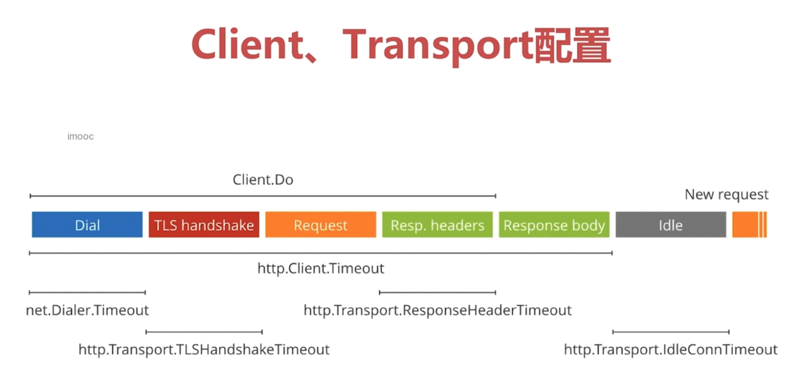

### go
1. 认识：全称golang，静态强类型、编译型、并发型具有垃圾回收的开源编程语言。现代的、良好支持网络与多核计算的语言，结合了解释型语言的游刃有余，动态类型语言的开发效率，以及静态类型的安全性
   - 性能
     1. 并发机制，goroutine跟channel，有效利用多核和网络，为并发而生
     1. 直接编译成机器码运行
   - 简单：清晰高效
     1. 语法类似于C+Python
     1. 方便的自动垃圾回收
   - 强大
     1. 支持跨平台编译，几秒内编译完成，比java快
     1. 丰富的内置类型如slice、map、struct等，支持函数多返回值
     1. 丰富的标准库、强大的工具类库如fmt、go get等
     1. 强大的运行时反射机制，便于在线的性能分析，以及堆栈分析
1. 特点
   - 原则
     1. 通过通信共享内存，不要通过共享内存来通信
     1. 函数是一等公民
     1. 复制一点总比依赖一点好：A little copying is better than a little dependency
        - 依赖的原则
          1. 只要核心：去掉多余无用代码
          1. 依赖最小版本选择：避免复杂依赖
   - 编程范式
     1. 面向接口
     1. 函数式编程
     1. 并发编程
1. 用途
   - 网络/服务器编程：web、api应用
   - 云平台：k8s
   - 分布式系统：数据库代理器、NewSQL
   - 内存数据库：groupcache、couchbase
1. 示例
    ```go
    package main

    import "fmt"

    func main() {
        fmt.Println("Hello, 世界")
    }
    ```
### 语法
1. 语法
   - 行分隔符：每行可以不加分号，写在一行可用;区分，不推荐
   - 注释：多行/* */、单行//
   - 关键字：函数外的每个语句都必须以关键字(var/func/...)开始
   - 标识符：用来命名变量、类型等程序实体
   - 符号
1. 关键字：25个
   - var、const、map、struct、type
   - if、else、for、range、switch、case、fallthrough、break、continue、default
   - goto、defer
   - func、interface、return
   - go、chan、select
   - package、import
1. 标识符
   - 认识：对各种变量、方法、函数等命名时使用的字符序列称为标识符，包括变量名、函数名、常量名、类型名、包名
     1. 只能由字母、数字和下划线组成；第一个字符必须是字母或下划线，不能是数字；不能是Go的关键字；区分大小写；长度没有限制
   - 组成
     1. 空白标识符：_，用作匿名占位
     1. 预先声明的标识符：39个，可直接使用，不用声明
        - 类型
          1. bool、byte、string、uintptr
          1. int、int8、int16、int32、int64、uint、uint8、uint16、uint32、uint64、float32、float64、complex64、complex128
          1. error、rune
          1. any：interface{}的别名，用来表示一个空接口，v1.18，为了提高代码可读性和与即将到来的泛型功能的兼容性
        - 常量
          1. true、false、iota
        - 零值
          1. nil
        - 方法
          1. len、cap
          1. append、copy、delete
          1. print、println：输出到标准错误流，不建议写程序使用，debug可以用
          1. make、new、close
          1. panic、recover
          1. complex、real、imag
   - 方法
     1. 数据操作
        - `len(v T)`：长度，string、array、slice、map、chan、pointer(指向元素的数量)
          1. 含有中文的长度：`utf8.RuneCountInString(str)`，否则统计的是字节的长度
        - `cap(v T)`：容量，array、slice(返回cap)、chan、pointer(指向元素的数量)
        - `append(slice []T, elems ...T)`、`copy(dst, src)`：slice，容量够重新分配地址以容纳新元素，不够分配新底层数组，变长参数
            ```go
            append(x, 4, 5, 6)                     // 支持多个类型参数
            append(x, y...)                        // 只支持两个slice参数，把y追加到x中
            ```
        - `delete(m map[T]T1, key T)`：map
     1. 资源操作
        - make：只用于slice、map、chan三种类型的内存分配，返回有初始值非零的T类型，帮忙将数据初始化好，参数是类型
          1. 因为这三种类型是引用类型，就没有必要返回他们的指针
        - new：用于任意类型的内存分配，返回传入类型的零值的指针，会将分配出来的内存置零，参数是类型。是go进行动态内存分配的一种方式
            ```go
            type Person struct {  
                Name string  
            }  
            
            func main() {  
                // 为int类型分配内存  
                x := new(int)  
                fmt.Println(*x) // 输出: 0，因为int的零值是0  
            
                // 为Person结构体类型分配内存  
                p := new(Person)  
                fmt.Println(p)  // 输出: &{ 0}，显示p是指向Person的指针，Person的字段被初始化为零值  
                fmt.Println(*p) // 输出: { 0}，解引用p，显示Person结构体的内容  
            
                // 使用复合字面量创建Person实例，更为常用  
                p2 := Person{Name: "John"}  
                fmt.Println(p2) // 输出: {John}  

                p3 := &Person{Name: "Mary"}
                fmt.Println(p3) // 输出: &{Mary}
            }
            ```
        - 复合字面量：通过类型后跟由花括号{}括起来的复合元素列表来定义，提供了定义时的简洁和灵活性。基础数据类型和复合类型的都是这样定义的，如`s := []int{1,2}`
        - &：返回指针，不仅可以取已经存在变量的地址分配内存，还可以直接初始化变量，更常用，如搭配复合字面量使用`&Aaa{a:1}`，new的话需要先new再赋值，费劲
        - close：`func close(c chan<- Type)`，关闭
     1. 其他
        - 异常
          1. `func panic(v interface{})`
          1. `func recover() interface{}`
        - 复数相关
          1. `func complex(r, i FloatType) ComplexType`
          1. `func real(c ComplexType) FloatType`
          1. `func imag(c ComplexType) FloatType`
   - nil
     1. 认识：是一个预先声明的标识符，表示声明了没有赋值，只表示slice/map/channel/point/func/interface六种类型的零值，go中没有null，设计理念也不同
        - 设计思想：能不分配的内存就先不分配，nil pointer其实是一切nil值的根本形态，制定很多固定的特殊用法，目的使得nil的使用是非常自然的，这样是好是坏？
        - nil和空不同，nil不会指向底层地址，空会
     1. 特点
        - nil有类型，(*int)(nil)和(interface{})(nil)就是两个不同的变量，即不相等
        - nil是不能比较的，`nil==nil`
        - untyped nil：没有类型的nil，直接写一个nil就是untyped nil
          1. 不能直接赋值给变量
          1. 可以与一些特定类型的变量进行比较，会根据不同的变量，就会有不同的逻辑
          1. 实例
            ```go
            var a = nil                     // 报错
            var a = (*int)(nil)             // 可以
            var _ Conn = (*DBConn)(nil)
            
            var a *B
            print(a == nil)                 // true
            ```
        - 不同类型nil的指针是一样的，地址都是0x0。不同类型的nil值占用的内存大小可能是不一样的

        - interface类型的变量只有在类型和值均为nil时才为 nil
        - 当一个interface的value和type都unset的时候，它才等于nil

        - 不是关键字只是变量名(在buildin/buildin.go中)，如可以定义一个名为nil的变量`var nil = errors.New("11")`不推荐
     1. 实例
        ```go
        type A interface{}
        type B struct{}
        var a *B

        print(a == nil)                 // true
        print(a == (*B)(nil))           // true
        print((A)(a) == (*B)(nil))      // true，类型都是*B，值都是nil

        print((A)(a) == nil)            // false，结构体的type不是nil
        ```
1. 运算符
   - + 字符串连接符
   - 引号
     1. 单引号：只能有一个ASCII码字符，也就是一个字节，输出会返回这个字符的ASCII码 ，如果想输出为字符需要用string()函数转换一下
        ```go
        var asc byte = 'a'
        fmt.Println(asc)        // 输出a的ASCII码值 97
        ```
     1. 双引号：表示字符串
     1. ``：表示多行文本
   - 算术：++、--、+-*/%
   - 关系：==、!=、>、<、>=、<=，可以直接运算字符串的大小，如`fmt.Println("b"<"a")`，如果字符串都是数字就按数字的方式，如果是字符串就按字符串的方式
   - 逻辑：&&、||、!
   - 按位：&、|、^、<<、>>
   - 赋值：=、+=等
1. 数据类型
   - 意义：将数据分为所需内存不同的，充分利用内存
   - 基本类型
     1. 布尔：bool，只能是true、false
     1. 字符串：string，统一编码为utf-8，16byte
     1. 数值
        - 有符号整形：int8 int16 int32 int64，数字是位数，如int32为前后20亿
        - 无符号整形：uint8 uint16 uint32 uint64
        - 浮点型：float32 float64
        - 复数：complex64 complex128，即实部和虚部
     1. 其他
        - int/uint：32位cpu为4byte，64位为8byte
        - byte：类似uint8，代表ASCII码的一个字符
        - rune：类似int32，代表一个Unicode码，可用来操作中文
        - uintptr：无符号整型，足够大可以容纳任何指针的位模式，跟系统位数有关系，用于存放一个指针
        - 引用：8byte
   - 复合类型
     1. 非引用类型：array、struct
     1. 引用类型：slice、map、channel、pointer
     1. 派生
        - func
        - interface
   - 扩展类型
     1. 组合扩展：struct组合之前的类型
     1. 别名扩展：type定义别名再扩展
   - 应用
     1. 类型零值：变量无初始化时的默认值，可以表现为false，0，""，nil
        - struct{}{}结构体不占用内存，但是空切片和nil切片都占用内存
     1. 类型推导：不指定其类型时，由右值推导得出
     1. 类型转换：T(v)，将值v转换为类型T，不同类型相互转换的时候需要显式转换
     1. 类型别名：type可以定义任何自定义的类型
     1. 类型比较：可不可以比较需要根据类型的特性去判断取舍
        - 不同类型不能比较
        - 不可比较的类型：slice、map、func
        - 可比较的类型：bool、整数、浮点数、复数、字符串、指针、Channel、复合类型
        - 相同struct类型可以比较，不同struct类型不可以比较，编译都不过，类型不匹配
        - 比较interface用反射，reflect.DeepEqual(a, b interface{})
        - 如果复合类型中有不可比较的类型，那么复合类型就不可比较
        - 接口值的动态值不可比较，直接比较会panic
1. string
   - 认识：字符串，是一串字符连接的任意字节的固定长度的变宽常量字符序列，由单个字节连接起来，使用utf-8编码
     1. 使用双引号或反引号创建
        - 双引号：可解析的。可以转义，不能换行
        - 反引号：原生的。不能转义，可以换行。一般用于sql、html等大段内容，以及正则表达式
     1. 字符串的不可改变性
        - 认识：内部用指针指向UTF-8字节数组，在字符串创建后是只读的不能被修改
          1. 体现在如不能通过索引访问字符串中的某个字符然后修改它
          1. 任何看似修改字符串内容的操作都会创建一个新的字符串，而不是修改原有字符串
        - 好处：协程条件下安全共享，简化内存管理(不考虑重分配和拷贝问题)
        - 修改方式
          1. `strings.Replace(str, "World", "Go", 1)`
          1. 字符串变量重新赋值
   - 最佳实践
     1. string和[]byte在底层结构上非常相近，有时这两种类型之间可以通过强转换来避免内存分配
     1. 可以池化字符串，从而帮助编译器只存储一次相同的字符串
   - 使用
     1. string转byte数组：`[]byte(str)`
     1. byte数组转string：`string(data[:])`
1. array
   - 认识：数组，`[n]T`，相同类型T的值的定长数组
     1. […]：语法糖，让编译器根据后边元素数量自动推导数组长度
     1. 数组的长度是数组类型的一部分，`[2]int`和`[3]int`是不同的数组类型
        ```go
        arr1 := [2]int{}
        arr2 := [3]int{}
        fmt.Println(arr1 == arr2)           // invalid operation: arr1 == arr2 (mismatched types [2]int and [3]int)
        ```
     1. 赋值和参数传递都是值传递
   - 代码
    ```go
    // 定义
    var a [2]string
    a[0]                // 访问
    a[1] = "World"      // 赋值
    ```
1. slice
   - 认识：切片，`[]T`，相同类型的值的变长序列
     1. 空切片与nil切片
        - 所有空切片的底层引用数组指向的地址都是同一个内存地址，不是nil，没有分配任何内存空间，元素0个
        - 二者的append操作对len和cap的效果一样
     1. 由于slice包含了指向底层数据的指针，在复制、作为函数的参数、函数返回值时需要注意。append可能会改变底层数组，是可能，不是一定。如果剩余容量够会在原数组改动，不够会分配一个新的底层数组
        - slice确实是一个引用类型，但它并不是纯粹的指针引用
   - 二维slice
    ```go
    // 定义
    s := [][]int{                     
        []int{1},
        []int{2},
    }

    // 赋值
    s[0][0] = 3                        
    ```
   - 最佳实践
     1. 不要留下不使用的切片部分如果需要从切片中切下一小块并仅使用它，该切片的主要部分也将被保留。正确的做法是，为这小块切片使用新的副本，而将旧切片扔给GC
     1. 创建slice时，尽可能为make()函数提供一个容量值，如果不能确定，也要预估一个，性能相差4倍
     1. 检查slice是否为空，始终使用len(s)==0，而非nil
     1. 作为函数返回值时，不应该明确返回长度为0的slice，应该返回nil代替
     1. 拷贝大切片一定比小切片代价大吗？
        - 将一个slice变量分配给另一个变量只会复制三个字段(一个uintptr，两个int)。所以拷贝大切片跟小切片的代价应该是一样的
     1. 字符串转成byte数组，会发生内存拷贝吗？
        - 严格来说，只要是发生类型强转都会发生内存拷贝
        - 在底层转换二者，只需要把StringHeader的地址强转成SliceHeader就行
   - 初始化
    ```go
    // 声明
    var s []int                             // 等于nil

    // 定义
    s := []int{}                            // 不等于nil，长度和容量是0

    s := *new([]int)                        // 等于nil

    // 构造slice，分配一个零长度的数组并且返回一个slice指向这个数组
    s := make([]int, 5)                     // 长度：不等于nil，5个0的元素，不会限制只有5个
    s := make([]int, 0, 5)                  // 长度+容量：不等于nil，0个元素len=0，但是cap=5

    // 取子切片，s[start(闭区间) : end(开区间) : max(开区间)]，s[start : end]；默认从头、尾开始；和父切片共用底层数组
    s[0:1:4]
    s[1:4]
    s[:3]
    s[4:]
    s[:]                                    // 全部
    ```
   - 使用
    ```go
    // 访问
    a := s[i]

    // 修改
    s[i] = 1
    
    // 添加
    s = append(s, 2, 3, 4)
    s = append(s, a...)                     // 将a全部加入s中

    // 删除，没有提供现成的，原理是以被删除元素为分界点，将前后两个部分的内存重新连接起来
    s = s[n:]                               // 删除头部n个
    s = s[:len(s)-n]                        // 删除尾部n个
    s = append(s[:l], s[l+n:]...)           // 删除中间n个，...是解包操作符，表示多对使用
    s = s[:i+copy(s[i:], s[i+n:])]

    // 遍历，也适用于map
    for i, v := range pow {}
    for i := range pow {}
    for _, v := range pow {}

    // s []byte为24byte，s [1024]byte为1024byte
    ```
1. map
   - 认识：字典，键值对，`map[keyType]valueType`
     1. key
        - key唯一，必须是可比较的
        - key没有顺序，遍历输出顺序与填充顺序无关，不要期望输出顺序的结果
        - float可以作为map的key，由于精度问题，不要使用
        - struct作为key，如果struct的某个字段值修改了，查询map时无法获取
     1. 可以直接读取值而不报错，不存在返回类型默认值
     1. 返回值可以是一个，可以是两个，第二个用于判断是否存在
     1. 删除并不能释放内存，只会增长，不会减少
     1. map是引用类型，引用类型的变量在使用前必须初始化，未初始化时默认的zero value是nil，此时写入会panic
     1. 运行时会检测并发写，触发panic；并发读没问题，只是不保证能读到正确的
   - 使用
    ```go
    // 此情况value是一个结构体，可以是其他的基础类型
    type Vertex struct {
        Lat, Long int
    }

    // 定义
    var m map[string]Vertex

    // 声明，以下二者均可，代表申请到了内存地址
    m := map[string]Vertex{}
    m := make(map[string]Vertex)

    // 定义、赋值
    var m = map[string]Vertex{
        "a": {1, 2},
        "b": vertex{5, 6},
    }

    // 获取，获取不存在的不会报错，返回类型的零值
    m["key"]
    // 插入或修改
    m["a"] = Vertex{1, 2}
    // 删除
    delete(m, "key")                                    // 没有返回值；删除不存在的不报错
                                                        // 删除键值对后map容量不会变少；与该键值对相关联内存标记为可回收，在下次垃圾回收时内才回收
    // 检测是否存在，双赋值，ok为bool指示是否存在
    v, ok := m["key"]
    if ok {}
    ```
   - 最佳实践
     1. 空map请使用make(..)初始化，只声明未定义的写入会panic
        ```go
        var (
            m1 := make(map[string]string)       // m1 读写安全
            var m2 map[string]string            // m2 在写入时会 panic
        )
        ```
     1. 提前分配内存：初始化指定其大小
     1. 清空map：map只能增长，不能缩小。我们需要重置map时，删除其所有元素不管用

     1. 尽量少的使用Map，多使用结构体，Map会占用更多的内存且包含指针会增加垃圾回收压力
     1. 尽量不在键值中使用指针：如果map中不包含指针，那么GC就不会在上面浪费宝贵的时间。字符串也使用了指针，因此应该使用字节数组而不是字符串作为键
     1. 减少修改次数：同样，我们不想使用指针，可以用map和slice的组合，将键存储在map中，将值存在slice。这样我们就可以不受限制地更改值
   - 常见错误
     1. 未初始化：尤其是在struct中更加容易忘记
        ```go
        var m map[int]int
        fmt.Println(m[100])             // 获取不会panic，会返回零值
        m[100] = 10                     // 会panic
        m := make(map[int]int)          // 先初始化
        ```
     1. 并发读写
        ```go
        var m = make(map[int]int, 10)
        // 初始化一个map
        go func() {
            for {
                m[1] = 1                        // 设置key
            }
        }()
        go func() {
            for {
                _ = m[2]                        // 访问这个map
            }
        }()
        select {}
        ```
   - 并发安全的map
     1. 加读写锁：由于go不支持泛型，实现略显繁琐
        ```go
        type RWMap struct {
            // 一个读写锁保护的线程安全的map
            sync.RWMutex
            // 读写锁保护下面的map字段
            m map[int]int
        }

        func NewRWMap(n int) *RWMap {
            return &RWMap{
                m: make(map[int]int, n),
            }
        }

        func (m *RWMap) Get(k int) (int, bool) {
            m.RLock()
            defer m.RUnlock()
            // 在锁的保护下从map中读取
            v, existed := m.m[k]
            return v, existed
        }
        func (m *RWMap) Set(k int, v int) {
            m.Lock()
            defer m.Unlock()
            m.m[k] = v
        }
        func (m *RWMap) Delete(k int) {
            m.Lock()
            defer m.Unlock()
            delete(m.m, k)
        }
        func (m *RWMap) Len() int {
            m.Lock()
            defer m.RUnlock()
            return len(m.m)
        }
        func (m *RWMap) Each(f func(k, v int) bool) {
            m.Lock()
            defer m.RUnlock()
            for k, v := range m.m {
                if !f(k, v) {
                    return
                }
            }
        }
        ```
     1. 分片
        ```go
        var SHARD_COUNT = 32

        // 分成SHARD_COUNT个分片的map
        type ConcurrentMap []*ConcurrentMapShared

        // 通过RWMutex保护的线程安全的分片，包含一个map
        type ConcurrentMapShared struct {
            items        map[string]interface{}
            sync.RWMutex // Read Write mutex, guards access to internal map.
        }

        // 创建并发map
        func New() ConcurrentMap {
            m := make(ConcurrentMap, SHARD_COUNT)
            for i := 0; i < SHARD_COUNT; i++ {
                m[i] = &ConcurrentMapShared{items: make(map[string]interface{})}
            }
            return m
        }

        // 根据key计算分片索引
        func (m ConcurrentMap) GetShard(key string) *ConcurrentMapShared {
            return m[uint(fnv32(key))%uint(SHARD_COUNT)]
        }
        ```
     1. 分片加锁：性能比以上单个map和分片map都好，降低锁的粒度了，尤其是面对大数据量时
1. 变量
   - 认识：var或者:=
     1. 类型在变量名后边，避免了类c的含糊不清的定义
     1. 默认类型推导
   - 零值：不指定变量的默认值时，即是零值
     1. 一般：bool false、数值类 0、字符串 ""
     1. nil：slice/map/channel/point/func/interface，只有这6个
   - 分类
     1. 值类型：声明默认分配内存
     1. 引用类型：slice、map等
        - 认识：声明 + 分配内存用于存放值
   - 最佳实践
     1. 若变量类型为 bool 类型，则名称应以 Has, Is, Can 或 Allow 开头
        ```go
        var isExist bool
        var hasConflict bool
        var canManage bool
        var allowGitHook bool
        ```
   - 举例
    ```go
    // 声明变量
    var i,j int = 1,2       // 声明、赋值

    var i,j = 1,true        // 类型推导

    var (                   // 批量格式
        i int = 1
        j float32
    )

    k := 3                  // 简短格式：短声明 + 类型推导
    ```
   - 属性
     1. _：匿名变量，类似黑洞，可像其他标识符那样用于变量的声明或任何类型都可以给它赋值，但任何赋给这个标识符的值都将被抛弃，可极大增强代码灵活性
     1. 变量类型转换：必须是显式的，只能发生在两种兼容的类型之间，如int和bool不可以。`a := int32(b)`
     1. 作用域
        - 分类：局部(花括号内)、全局(函数外)、形式参数(函数定义中)
        - 特点
          1. 局部和全部可以重名，局部变量的改变不会改变全局变量，局部变量的优先级高于全局变量
1. 常量
   - 认识：const，是程序运行时不会被修改的简单值的标识符
     1. 只能是bool、数字类型(整数、浮点、复数)、string
     1. 常量表达式中只能是内置函数，自定义的会报错
     1. 会自动类型推导，分显式类型和隐式类型定义
     1. 作用域
        - 首字母大写可包外
        - 函数体内声明的只在函数体内生效
   - 定义：`const identifier [type] = value`
    ```go
    const PI = 3.14
    const i,j = 1,true
    const (
        a int = 1
        b int = 1
    )

    const c = len(b)    // 通过内置函数定义
    ```
   - iota：无类型整数常量，可被编译器修改，iota在const关键字出现时将被重置为0，在下一个const出现之前，每出现一次iota则iota+1，`const a = iota`
     1. 跳值使用法
        ```go
        const (
            a = iota
            _ = iota        // 跳过了，b为2，中间不想有其他常量，黑洞嘛
            b = iota
        )

        const (             // 简写，输出为012
            a = iota
            b
            c
        )
        ```
     1. 插队使用法
        ```go
        const (
            a = iota
            b = 1           // 独立值，iota += 1，输出为012
            c = iota
        )
        ```
1. 类型断言
   - 认识：语法`x.(T)`，形式点+括号+类型，即接口类型向普通类型的转换，运行期确定，通过断言实现类型转换。x是interface{}类型的变量。如：`item.(model.id)`
     1. 没有判断，断言失败会触发panic。加上判断即有第二个返回值ok时，不会触发
   - demo
        ```go
        // 返回转换后的变量、是否成功
        type intS []int
        a,ok := arr.(intS)
        if ok {}

        // 简写形式
        if _, ok := arr.(intS); ok {}

        // 判断是否相等
        if arr.(intS) == xxx {}
        ```
1. 反射
   - 认识：reflect，反射是在运行时动态的针对对象，获取属性、调用方法，go是静态类型的语言
     1. go的反射是基于interface的
     1. go会记录变量的类型等信息
   - 应用场景：在必须传参类型不固定的场景下（业务开发一般用不到）
     1. 框架的路由中
     1. orm库、json序列化库、运行时
   - 组成
     1. 类型
        - `reflect.Kind`：内置元类型，表示reflect包中定义的十几种，每种有一个整数编号
        - `reflect.Type`：接口
        - `reflect.Value`：结构体类型
     1. 基础反射方法
        - reflect.TypeOf()：，`func TypeOf(v interface{}) Type`，获取type对象，具体类型
        - reflect.ValueOf()：`func ValueOf(v interface{}) Value`，获取value结构体，具体值
          1. CanSet()
          1. Elem()：指针指向的元素类型
        - v.MethodByName("SumNum").Call(nil)：调用方法
   - 最佳实践
     1. 尽量避免使用，涉及内存copy、内存逃逸，性能相对差
     1. 很难实现清晰并好维护的代码，导致代码可读性变差
     1. 优先使用TypeOf，不会产生内存逃逸，性能更高，ValueOf包含了TypeOf
     1. 一定注意不同的数据类型使用对应的函数，否则会导致panic
     1. 官方反射三定律
        - Reflection goes from interface value to reflection object
        - Reflection goes from reflection object to interface value
        - To modify a reflection object, the value must be settable
1. 泛型
   - 认识：泛型代码使用抽象的数据类型编写，以下笔记要根据理念来延伸出语法元素来理解整个概念，v1.18
     1. 设计理念：三大概念
        - 类型参数：T，泛型代码是使用抽象的数据类型编写的，将其称之为类型参数；类型参数是泛型的抽象数据类型
          1. 类型参数列表在常规参数前面，为区分类型参数列表和常规参数列表，使用[]，不是()
        - 类型约束：规定可用的范围，可以为基础数据类型、any、自定义的接口
          1. 定义函数约束：可用interface类型约束`[T interfaceName]`
          1. 定义运算符约束：可使用重载运算符，但go用的是新的设计，允许限制类型参数的类型范围
             - ~T指底层类型为T的所有类型的集合，包括类型别名
        - 类型推导：用来偷懒，类型推导+约束推导
     1. 语法元素：四大落实方式
        - 近似元素：~
        - 联合元素：|
        - 嵌入约束：支持嵌入约束
        - 接口类型：使用接口会把该类型添加进约束中
   - 分类
     1. 泛型函数：使用泛型参数
     1. 泛型结构体：使用泛型类型的结构体字段
     1. 泛型接口：
   - 示例
    ```go
    // 泛型函数
    定义：可以打印任何slice的元素
    func Print[T1 any, T2 any](s []T) {}

    // 泛型结构体
    type Pair[T1, T2 any] struct {
        First  T1
        Second T2
    }

    // 泛型接口：Sizer接口定义了一个方法Size，该方法返回类型T的大小
    type Sizer[T any] interface {
        Size() T
    }
    type IntSize struct {                       // IntSize结构体实现了Sizer接口
        length int
    }
    func (i IntSize) Size() int {
        return i.length
    }

    // 使用
    Print[int]([]int{1, 2, 3})

    // 类型约束
    type AnyInt interface{ ~int | ~int64 }       // 所有类型为int或int64的类型，如int/int8/int16/int32/int64/AnyInt8

    func Print(s []T) {
        for _, v := range s {
            fmt.Println(v)
        }
    }

    // 类型推导：
    fmt.Println(Min(1, 2))                      // 自动推导出泛型函数的T为int类型
    fmt.Println(Min(3.5, 2.8))                  // 自动推导出T为float64类型
    p1 := Pair{First: 1, Second: "apple"}       // 自动推导出泛型结构体的T1为int，T2为string
    var sizer Sizer[int] = IntSize{length: 5}   // 自动推导出泛型接口的T为int

    // 嵌入约束
    type Signed interface {
        ~int | ~int8 | ~int16 | ~int32 | ~int64
    }
    type Ordered interface {
        Signed | ~string
    }

    // 接口类型
    type Stringish interface {
        string | fmt.Stringer
    }
    ```
   - 最佳实践
    ```go
    // 类型约束：函数参数类，某些类型不具有某某方法
    func Stringify[T any](s []T) (ret []string) {
        for _, v := range s {
            ret = append(ret, v.String())                   // 无效，因为any时，如int、float64等类型没有实现String()
        }
        return ret
    }
    // 解决方案
    type Stringer interface {                               
        String() string
    }
    func Stringify[T Stringer](s []T) (ret []string) {      // 使用接口统一实现String()
        for _, v := range s {
            ret = append(ret, v.String())
        }
        return ret
    }

    // 类型约束：运算符类，某些类型不能比较，需要约束运算符相关的
    ```
   - wiki
     1. generic programming，是程序设计语言的一种风格或范式，允许在强类型语言编写代码时使用一些以后(如实例化时)才指定的类型
1. 流程控制
   - 判断：不能使用()
     1. if
        ```go
        if x < 0 {
            return 1
        } else {
            return 2
        }
        ```
     1. switch
        - 特点
          1. 默认匹配跳过剩下的case，不用加break，取消break用fallthrough
          1. case后的所有val必须为同一类型或最终结果为相同类型的表达式
        - 实例
            ```go
            switch os := runtime.GOOS; os {
            case "darwin":                      
                return 1
            case "linux", "mac":                // 可写多个
                return 1
            case f():
                return 1
            default:
            }
            
            // type-switch，判断某个interface变量的实际变量类型
            switch x.(type){
            case type:
                statement(s);
            case type:
                statement(s);
            default:
                statement(s);
            }
            // 实例
            switch i := x.(type) {
            case nil:
                fmt.Printf(" x 的类型 :%T",i)
            case int:
                fmt.Printf("x 是 int 型")
            default:
                fmt.Printf("未知型")
            }
            ```
   - 循环
     1. for
        ```go
        // 形式
        for init; condition; post {}        // 赋值表达式、关系表达式或逻辑表达式(循环控制条件)、赋值表达式
        for condition {}
        for {}


        sum := 0
        for i := 0; i < 10; i++ {
            sum += i
        }
        // 无限循环
        for {}
        for true{}

        // 链表遍历
        type ListNode struct {
            Val int
            Next *ListNode
        }
        s := []int{}
        for it := head; it != nil; it = it.Next {
            s = append(s, it.Val)
        }
        ```
     1. range：后边跟一个可循环的，自动类型推断，可针对string、array、slice、map
        - 特点
          1. `for range`其实是golang的语法糖，在每次的循环开始前会获取其长度，然后再执行这个长度的循环
            ```go
            s := []int{1, 2, 3, 4, 5, 6}
            for i, v := range s {
                if i == 2 {
                    s = s[3:]
                }
                fmt.Print(v)
            }

            fmt.Println(s)
            // 输出123456[4 5 6]，slice会固定次数的遍历

            m := map[int]int{}
            m[1] = 1
            m[2] = 2
            m[3] = 3

            for k, v := range m {
                if k == 2 {
                    delete(m, 3)
                }

                fmt.Println(v)
            }

            fmt.Println(m)
            // 输出1 2 map[1:1 2:2]，map遍历次数会变

            ch := make(chan int)  
            for value := range ch {  
                // ... 处理从通道接收到的值  
            }
            // 这里会阻塞，直到通道关闭
            ```
          1. 在range中迭代得到的值，不论是被迭代的值，还是k、v，都是值拷贝
             - 更新拷贝并不会更改原来的元素，可以用索引直接访问，指针类型可以直接改
             - 直接更新值也不会在这次range循环中体现，依然会按照一开始的值进行循环；但是原值确实是产生了变化
        - demo
            ```go
            a := []string{"a","b"};
            for i,v := range a{}                // 下标i，值v
            for i := range a{}                  // 只需要下标，chan类型也是这样的
            for _,v := range a{}                // 只需要值，忽略下标
            ```
     1. while：for代替，没有分号
        ```go
        for sum < 1000 {
            sum += sum
        }
        ```
     1. 循环控制
        - break：中断当前循环
        - continue：跳过当前循环
        - fallthrough：强制执行后面的case代码，不能用在最后一个分支上
        - goto：跳跃
            ```go
            goto LABEL;
            ...
            LABEL: statement;       // 标记点，后边是表达式

            // 无限循环
            goto LABEL
            LABEL:
            LABEL:
            goto LABEL
            ```
   - 延迟
     1. 认识：defer，一般用于异常处理、资源释放(锁、连接)、调用栈记录等
        - 在当前函数return前或者发生panic时延迟执行函数
        - 所有的defer会压入栈中，先入后出，但是是一层层函数互不影响的
     1. 特点
        - 会即时对函数参数进行求值：传递给defer的参数在到达defer时就会确定，之后修改参数不会变
        - 丢弃被修饰函数的返回值

        - 可以影响主函数的返回值：defer在return之前执行
        - defer在return下边不会执行，实践中如果defer放最下边，中间加了return，会导致永远不会defer

        - 可以在for循环中使用defer，但需注意会将函数调用推迟到当前函数返回时执行，而不是在每次循环迭代结束时执行
          1. 问题：可能导致资源未及时释放或意外行为。如可能导致资源占用时间过长、defer执行时使用的是当时的值而不是循环结束后变量当前的值
          1. 解决方案：使用匿名函数包裹defer确保defer在每次循环结束时执行
          1. 实例
            ```go
            type conn struct {
                MU sync.Mutex
            }
            connections := make([]*conn, 0)

            // bad code
            for _, conn := range connections {
                conn.MU.Lock()
                defer conn.MU.Unlock() // 导致资源占用时间过长
            }

            // good code
            for _, conn := range connections {
                conn.MU.Lock()
                func() {
                    defer conn.MU.Unlock()
                }()

                // 下边再写业务逻辑，确保defer可以执行到，因为万一bizEvent崩溃了，defer就执行不到了
                if err := bizEvent(); err != nil {
                    break
                }
            }
            ```
        - 有一定开销，为节省性能可避免使用。估计是对栈的占用吧，走到哪儿都要带着
     1. 应用
        - 确保安全的回收资源，同时简化资源回收
        - 捕获panic异常
     1. 实例
        ```go
        // 安全回收资源
        mu.Lock() 
        defer mu.Unlock()
        ```
1. func 函数
   - 认识：`func xx() [T]{}`，是基本的代码块
     1. 可以返回多个值
     1. 参数传递方式：值传递(默认)、引用传递
     1. go语言中只存在值传递，要么是值的副本，要么是指针的副本，都会发生值拷贝。引用类型作为变量传递可影响到函数外部是因为新旧变量指向了相同的内存地址
     1. 方法的定义：包含了接受者的函数，`func (variable_name variable_data_type) function_name() [return_type]{}`
     1. 没有可选参数，也不支持方法重载
   - 最佳实践
     1. 见名知义，使用动词命名
     1. 长命名并不会使其更具可读性，一份有用的说明文档通常比额外的长名更有价值
     1. 若函数或方法为判断类型（返回值主要为bool类型），则名称应以Has、Is、Can 或 Allow等判断性动词开头
     1. 使用内联函数或自己内联它们：尝试编写可供编译器内联的小函数，它会很快，甚至快过自己在函数中嵌入代码
     1. 命名返回值：似乎比在函数体中声明更高效
     1. 保存中间结果：帮助编译器优化代码
     1. 仔细地使用defer：尽量不要使用，或者至少不要在循环中使用它
   - 实例
    ```go
    // 定义
    func add(x int, y int) int {            // 参数类型，返回值类型
        return x + y
    }
    // 调用
    aFunc()

    // 直接执行
    func() {
    }()


    // 返回多个值
    func aFunc() {
        return x, y
    }

    // 可变参数，value是形参名称，类型统一
    func add(value...int) {
        for _,v := range value {}
    }

    // 函数变量
    hypot := func(x, y int) int {}

    // 匿名函数，可作闭包，函数内变量保留
    func adder() func(int) int {
        i:=0
        return func(x int) int {
            i += x
            return i
        }
    }
    pos := adder()
    pos(i)                               // 使用匿名函数


    // 结构体内部的方法类型
    // 声明
    type hasMethod struct {
        myMethid func() int
    }
    // 定义
    s := hasMethod{myMethid: func() int {
        fmt.Print(111)
        return 0
    }}
    // 调用
    s.myMethid()
    ```
1. 函数式编程
   - 认识：go里函数是一等公民：参数、变量、返回值都可以是函数。c++只有函数指针，java函数只是一个名字无法传给别人
     1. 灵活性大大加强，原来写死的，都可以注入进去改变功能
     1. 方法是一种特殊的函数，可以为函数实现一些方法，从而实现一些接口
     1. go对函数式编程的支持体现在闭包上面
   - 闭包
     1. 认识：定义在一个函数内部的函数，闭包内部的局部变量会保留其引用所以不释放值。闭包是将函数内外部连接起来的桥梁
        - 更为自然，不需要更多的修饰
        - 语法层面：没有lambda表达式，但是有匿名函数
     1. 特性
        - 在调用时对函数参数进行求值，会固定给闭包的参数数值
     1. 示例
        - 用法
        ```go
        // 上边的普通型，参数和返回值中间加个func()
        // 定义
        var varClosure func() = func() {}

        // defer模拟
        x, y := 1,2
        defer func(a int){
            fmt.Println("defer x, y = ", a, y)      // y为闭包引用
        }(x)                                        // x值拷贝 调用时传入参数
        x += 100
        y += 200
        fmt.Println(x, y)

        // 多个匿名函数
        func calc(base int) (func(int) int, func(int) int) {
            add := func(i int) int {
                return base
            }
            sub := func(i int) int {
                return base
            }
            return add, sub
        }
        f1, f2 := calc(100)

        // goroutine模拟：闭包 + goroutine的死锁，goroutine未启动前，变量已经改变
        ```
        - 斐波那契数列
        ```go
        func fibonacci() func() int {
            a, b := 0, 1
            return func() int {
                a, b = b, a + b
                return a
            }
        }

        func main() {
            f := fibonacci()
            fmt.Println(f())    // 1
            fmt.Println(f())    // 1
            fmt.Println(f())    // 2
            fmt.Println(f())    // 3
            fmt.Println(f())    // 5
            fmt.Println(f())    // 8
        }
        ```
        - 为函数实现接口，将斐波那契函数包装成文件进行读取
        ```go
        // 利用闭包实现的斐波那契
        func fibonacci() intGen {                               // 这里可以将func() int替换为intGen
            a, b := 0, 1
            return func() int {
                a, b = b, a + b
                return a
            }
        }

        // 定义一个函数类型
        type intGen func() int

        // 函数实现了Reader接口
        func (g intGen) Read(p []byte) (n int, err error) {
            // 运行intGen本身获取值
            next := g()
            // 限制斐波那契运行上限
            if next > 10000 {
                return 0, io.EOF
            }
            s := fmt.Sprintf("%d\n", next)
            // s写进p中，让以下来代理read
            return strings.NewReader(s).Read(p)
        }

        // 负责读取操作
        func printFileContents(reader io.Reader) {
            scanner := bufio.NewScanner(reader)

            for scanner.Scan() {
                fmt.Println(scanner.Text())
            }
        }

        func main() {
            f := fibonacci()
            // fibonacci()函数返回intGen，同时intGen隐式实现Reader接口，所以可作实参
            printFileContents(f)
        }
        ```
   - wiki
     1. 正统函数式编程：数学味道非常浓
        - 不可变性：不能有状态，只有常量和函数
        - 函数只能有一个参数
     1. 高阶函数：函数的参数也是函数
1. * 指针
   - 认识：`var ptr_name *T`，保存变量的内存地址，即间接引用。别人的地址存的是确切的数，指针的地址存的是别的变量的地址，指针类型*T是指向类型T的值的指针，零值是nil
     1. &a：取指针，获取指针
     1. *a：解指针，获取指针对应的值
   - 特点
     1. 指针大小：8字节，64位系统的寻址范围
     1. 二级指针：指向指针的指针变量，第一个指针存放第二个指针的地址，第二个指针存放变量的地址，`var pptr **int`
     1. 值传递和指针传递
        - 值传递：赋值和参数传递时会创建副本赋给对应的变量
          1. 即修改只会影响副本
          1. 复制次数多、复制的值大，造成较大gc压力，使用指针
   - 分类：unsafe.Pointer是桥梁，可以和其他二者相互转换
     1. *：普通类型，只能传递对象地址
     1. unsafe.Pointer：通用类型，用于转换不同类型的指针，不能进行指针运算，不能读取内存存储的值，可以引用内存对象，不被GC
     1. uintptr：运算类型，用于指针运算，GC不将其当指针，即其无法持有对象，表示的地址的数据可能被GC回收
   - 指针数组
     1. 指针数据：是数组，数组中全是指针
        ```go
        var i int
        // 数组
        a := []int{10,100,200}
        
        // 指针数组
        var ptr [3]*int;
        ptr[i] = &a[i]
        ```
     1. 数组指针：是指针
        ```go
        arr := make([]int, 2)
        arrPoint := &arr
        ```
   - 结构体指针
     1. 结构体指针方法和值方法调用时形式上没有区别，一个可以改变结构体内部状态另一个不会。指针方法使用结构体值变量可以调用，值方法使用结构体指针变量也可调用
     1. 接收者是值类型的方法，自动实现了接收者是指针类型的方法，编译器实现
     1. 一些特殊结构体不允许被复制，如结构体内部包含锁时，这时就必须使用它的指针形式来定义方法，否则会发生一些莫名其妙的问题
     1. 通过指针访问内部字段需要2次内存读取操作，第一步取得指针地址，第二步读取地址内容，比值访问要慢。但在方法调用时，指针传递可避免结构体的拷贝操作，结构体比较大时，性能差距会比较明显
   - 最佳实践
     1. 解引用是昂贵的
   - 实例
    ```go
    var ptr *int      // 声明指针类型，ptr是指针变量名

    i := 42
    ptr = &i          // 赋值指针一个作用对象
    *ptr              // 读取i，*又变为取值运算符
    *ptr = 21         // 设置i
    ```
1. 错误和异常
   - 认识
     1. 意料之中用error，如文件打不开；意料之外用panic，如数组越界
     1. 异常定义为无法预测的，几乎不可能失败但是特殊条件下也会发生，同时没法返回错误，也无法继续执行的情况
     1. 在错误处理上采用了与c类似的检查返回值方式
   - 错误处理：通过内置的error接口作为错误处理的标准模式，如果函数要返回错误，则返回值类型列表中肯定包含error。为nil时表示没有错误；非nil表示错误
    ```go
    // 定义
    type error interface {
        Error() string
    }
    // 抛出
    func Sleep() (int,error) {
        return 0, errors.New("xxxx")
    }
    // 使用
    i, err := strconv.Atoi("42")
    if err != nil {}

    // 判断错误的类型
    var targetErr *MyCustomError
    if errors.As(err, &targetErr) {                                                 // errors.As，检查错误链中是否包含特定的错误类型，找到了会提取为目标类型
        // err是MyCustomError类型，可以用targetErr访问MyCustomError的方法和属性
        targetErr.Xxx
    }

    if errors.Is(err, SomeSpecificError) {}                                         // errors.Is，判断是否目标类型
    
    if specificErr, ok := err.(*MyCustomError); ok {}                               // err.(Type)，使用断言复制为目标类型。传统使用，不如errors.As清晰
    if reflect.TypeOf(err) == reflect.TypeOf(&MyCustomError{}) {}                   // reflect.TypeOf，使用反射判断是否目标类型。性能差，代码可读性差
    ```
   - 异常处理
     1. 认识：`panic recover`，抛出、接收异常
        - panic：中断原有流程，进入panic流程。执行每一层的已经载入的defer函数，如果没有遇到recover进程打印异常信息后程序退出
          1. 可手动触发，也可运行时发生错误产生
          1. panic无法跨协程, 当前协程产生的异常, 必须由当前协程处理，如果当前协程不处理，整个进程所有协程退出即整个程序panic。每个协程只维护自己的panic、defer、recover链表，只在单个协程中生效
          1. panic可以嵌套
        - recover：可以捕获到panic的输入值，让进入panic流程中的goroutine恢复正常执行
          1. 只能在defer语句中使用，只能捕获当前协程的panic，以下情况无法捕获
             - 普通错误error
             - 致命错误或Go运行时无法恢复的严重问题：Map并发写、栈内存耗尽、所有协程都死锁
             - 信号导致的退出、调用os.Exit导致的退出
          1. 直接使用没有任何效果且返回nil，因为只要panic后面的代码都不会被执行
          1. 如果无法处理，可以重新panic
          1. recover中可以继续调用方法重启执行，但需要确保资源关闭，且明确控制重试逻辑和退出条件，避免潜在的资源泄漏和栈溢出问题
     1. 定义
        ```go
        func panic(interface{})         // 接受任意类型参数 无返回值 
        func recover() interface{}      // 可以返回任意类型 无参数
        ```
     1. 实例
        ```go
        panic("haha")                   // string类型
        panic(errors.New("kuku"))       // error类型

        // recover最佳实践
        defer func() {                                      // 直接执行的匿名方法
            if err := recover(); err != nil {               // 发生panic才会返回非nil
                fmt.Println("错误原因为：", err)

                buf := make([]byte, 4096)                   // 打印堆栈
				n := runtime.Stack(buf, false)
				fmt.Printf("协程发生异常:\n%s\n", buf[:n])

                // return                                   // 不需要写return
            }
        }()

        // recover重试版
        func saferRetry(fn func() error, maxAttempts int) error {
            for i := 0; i < maxAttempts; i++ {
                err := func() (err error) {
                    defer func() {
                        if r := recover(); r != nil {
                            err = fmt.Errorf("recovered from panic: %v", r)
                        }
                    }()
                    return fn()
                }()
                
                if err == nil {
                    return nil
                }
                
                if i == maxAttempts-1 {
                    return err
                }
                
                // 等待后重试
                time.Sleep(time.Second * time.Duration(i+1))
            }
            return nil
        }
        ```
     1. 常见panic情况
        - 除数为0：`panic: runtime error: integer divide by zero`
        - slice越界：先判断长度，`panic: runtime error: index out of range`
        - map没有初始化就直接使用、多个groutine写写map
        - 空指针解引用`panic: runtime error: invalid memory address or nil pointer dereference`
          1. 结构体连续取值中间的为nil：req.UserInfo.Signature：改为使用方法获取
            ```go
            var p *Person
            fmt.Println(p)
            fmt.Println(p.Name)

            // panic: runtime error: invalid memory address or nil pointer dereference
            ```
          1. 方法连续调用中间的为nil：req.GetUserInfo().GetSignature()：逻辑增加先判断是否为nil
        - 类型断言失败：先判断断言是否成功，`panic: interface conversion: interface {} is <type>, not <expected type>`
            ```go
            func main() {
                add(20, 18)
                add(1, "hello")
            }
            func add(a, b interface{}) {
                i := a.(int)
                j := b.(int)
                fmt.Println(i+j)
            }
            // panic: interface conversion: interface {} is string, not int
            ```
        - 写已关闭的通道、重复关闭chan：`panic: close of closed channel`
            ```go
            func main() {
                var ch chan int
                ch = make(chan int,0)
                close(ch)
                ch <- 108
            }
            // panic: close of nil channel
            ```
        - 多个协程并行写一个websocket连接
   - 致命错误
     1. 认识：fatal error，不能被recover捕获，会导致程序直接崩溃
     1. 常见情况
        - map并发写：`concurrent map writes`

        - goroutine泄露：`too many open files`
        - 所有协程都死锁：`fatal error: all goroutines are asleep - deadlock!`
          1. 使得所有线程睡眠、或goroutine互相竞争资源造成死锁
            ```go
            func main() {
                var ch chan int
                ch = make(chan int)
                ch <- 108
            }
            // fatal error: all goroutines are asleep - deadlock!
            ```

        - 栈内存耗尽：`fatal error: stack overflow`
        - 内存溢出：`fatal error/runtime: out of memory`
          1. 递归死循环或超出栈空间
1. 运行时
   - 认识：负责goroutine调度、垃圾回收、网络I/O、获取运行时信息等，是go可执行程序的重要组成部分
   - 功能
     1. `runtime.GC()`：手动触发GC
     1. 打印内存占用
        ```go
        func printMemUsage() {
            var m runtime.MemStats

            runtime.ReadMemStats(&m)

            fmt.Printf("Alloc = %v MiB", bToMb(m.Alloc))
            fmt.Printf("\tTotalAlloc = %v MiB", bToMb(m.TotalAlloc))
            fmt.Printf("\tSys = %v MiB", bToMb(m.Sys))
            fmt.Printf("\tNumGC = %v\n", m.NumGC)
        }

        func bToMb(b uint64) uint64 {
            return b / 1024 / 1024
        }
        ```
     1. 获取goroutine id
        - 简单方式
            ```go
            func GoID() int {
                var buf [64]byte
                n := runtime.Stack(buf[:], false)
                // 得到 id 字符串
                idField := strings.Fields(strings.TrimPrefix(string(buf[:n]), "goroutine "))[0]
                id, err := strconv.Atoi(idField)
                if err != nil {
                    panic(fmt.Sprintf("cannot get goroutine id:, %v", err))
                }
                return id
            }
            ```
        - hacker方式：每个运行的goroutine结构的g指针保存在当前goroutine的TLS对象中，不同Go版本的goroutine的结构可能不同，常用库`petermattis/goid`
1. GC
   - 认识
     1. 既有内存自动管理的便利(像解释型语言），又无需承受像java那样复杂的JVM调优
### 面向接口
1. 理解：面向对象，核心是合成复用
1. struct
   - 理解：结构体，`type struct`，字段的组合
     1. 不支持多态
     1. 字段标签：tag，不是注释是描述字段的元数据。不属于数据的组成部分是类型的组成部分
        ```go
        type user struct {
            name string `昵称`
            age  int    `年龄`
        } `我也是标签`

        // 最佳实践写法
        type user struct {
            name, realname              string
            createTime,modifyTime       int
        }
        ```
   - 方法
     1. 认识：属于结构体的函数，`func (variable_name variable_data_type) function_name() [return_type]{}`
        - 定义在结构体作用域外，在函数声明中指定接收者，除了基础类型或其他包的，可以在任意类型里定义方法
        - 非引用形式是深拷贝，每次调用方法时会复制一个结构体出来，表现为多个方法间对结构体数据的作用相互无影响，结构体内部数据不会被修改
        - 接收者是值类型的方法，自动实现了接收者是指针类型的方法，编译器实现
     1. demo
        ```go
        type person struct {
            age int
        }

        func (p person) getAge() int {      // 值接收类型
            return p.age
        }

        func (p *person) growUp() {         // 指针接收类型
            p.age += 1
        }

        u1 := person(age:1)                 // 接收者是值类型的方法，自动实现了接收者是指针类型的方法，编译器实现
        u1.growUp()
        u1.getAge()
        u2 := &person(age:1)                // 反过来不会
        u2.growUp()
        u2.getAge()
        ```
   - 匿名组合：可以直接用父结构体的属性和方法，类似继承
     1. 方法的继承和重写：都支持
     1. 实例
        ```go
        // 结构体组合
        type Animal struct{
            Color string
            Size int
        }
        type Dog1 struct{
            Animal
            name string
            Color string
        }
        dog := Dog1{                // 定义变量
            Animal{"red", 11},
            "miao",
            "blue",
        }
        dog.Color = "1"             // 直接使用，优先级高于父级的

        type Dog2 struct{
            someAnimal Animal       // 把父结构体作为一个属性使用，原理类似
            name string
        }

        fmt.Println(dog.someAnimal.Color)
        ```
   - 最佳实践
     1. 避免拷贝大结构体
     1. 避免通过指针访问结构体字段：解引用是昂贵的，尤其是在循环中。同时也失去使用快速寄存器的能力
     1. 构造结构体时根据字段的大小注意字段顺序，进行内存对齐，以此减小结构体本身的大小
     1. 使用空结构体为值：struct{}{}什么都不是（不占内存），因此例如传递信号时，使用它是非常有益的
     1. 判断结构体是否是nil时，通常在实际应用的用法是判断某个字段是否为nil，而不能用整个结构体去判断。如果非要，可以使用指针或者比较所有字段或者使用反射`reflect.DeepEqual(v, reflect.Zero(reflect.TypeOf(v)).Interface())`判断
        - 结构体的零值是指其所有字段都为各自类型的零值
     1. 当对象内部私有变量类型为map时，千万不要将其作为函数的返回值；这样会对外暴露对象内部状态，而且可能会导致其他意外情况
        ```go
        type Stats struct {
            mu sync.Mutex
            counters map[string]int
        }
        
        // Snapshot 返回当前状态。
        func (s *Stats) Snapshot() map[string]int {
            s.mu.Lock()
            defer s.mu.Unlock()
        
            return s.counters

            // 正确做法：创建map类型的副本并返回
            result := make(map[string]int,len(s.counters))
            for k, v := range s.counters {
                result[k] = v
            }
            return result
        }
        
        // 生成的对象内部counters不再受互斥锁保护，修改snapshot将直接影响stats.counters
        snapshot := stats.Snapshot()
        ```
     1. 带 mutex 的 struct 的接收者 receivers 必须是带指针
        ```go
        type foo struct {
                mutex sync.Mutex
                ...
            }

            // 这里的接收者必须是指针，保证只对同一个锁操作，达到对同一个资源操作的互斥效果。
            func (f *foo) Write (content []byte) error {
                f.mutex.Lock()
                defer f.mutex.Unlock()
                
                ...
            }
        ```
   - 实例
    ```go
    // 定义
    type Dog struct {
        x int               // 封装
        y int
    }
    var Dog struct{
        x int  
    }{}

    // 赋值方法1
    dog := Dog{x: 1}               	// 指定字段，y:0可以被省略
    dog := Dog{1, 2}
    dog := Dog{}                    // 都用零值初始化
    // 赋值方法2
    dog := new(Dog)
    var dog *Dog = new(Dog)         // 返回的是指针类型
    dog.x = 1
    // 赋值方法3
    var dog Dog
    dog.x = 1

    // 定义+赋值
    dog := struct {
        x int
        y int
    }{
        1,
        2,
    }

    // 访问
    dog.x

    // 添加方法
    func (d *Dog) Run {}            // 函数名前加接受者
    func (d Dog) Run {}				// 深拷贝，会复制一个出来

    var p *Dog
    p = &Dog{1, 2}                  // 类型为 *Dog

    // 结构体切片
    s := []Dog{
		Dog{1},
		Dog{2},
	}
    ```
1. interface 接口
   - 理解：是一种定义了一组方法的抽象类型，它本身不包含也不能包含字段。接口类型是一组具有共性的方法定义在一起的集合。即抽象、封装、多态
     1. ‌是派生类型
     1. 接口是松散的结构，不与定义绑定，可以同时从多个维度对数据进行抽象，找出共同点，并使用同一套逻辑来处理。弱关联关系，接口已经可以在很多方面替代继承的作用，比如多态和泛型，而且接口的关系松散、随意，可以有更高的自由度、更多的抽象角度。
   - 接口实现：接口的实现都是隐式的，实现接口了的所有方法就隐式地实现了接口，是duck-type编程的一种体现，不关心属性（数据），只关心行为（方法）
     1. 没有了显式声明的必要。解藕了实现接口的包和定义接口的包
     1. 结构体指针实现接口，结构体初始化变量不会编译通过，因为go的传参值拷贝特性，全新的变量不会指向原来的结构体，也就找不到了，所以提示未实现接口
        - 反之则可以，因为可以隐式的对变量解引用（dereference）获取指针指向的结构体
        - 实现接口的具体方法时，如果以指针作为接收者，接口的具体实现类型只能以指针方式使用，值接收者既可以按指针方式使用也可以按值方式使用
   - 接口变量赋值
     1. 认识：只有实现了这个接口类型的对象才可赋值
     1. 方式
        - 实现接口的对象实例赋值给接口
        - 另外一个接口赋值给接口
   - 空接口类型：`interface{}`，可用于存储任意数据类型的实例，达到抽象数据类型的目的
     1. 所有的数据类型都实现了空接口，参数是的话表明可以使用任何类型的数据，函数内部该变量仍然为空接口类型，而不是传入的实参类型
     1. 函数也是一种类型，也可以实现接口`type funcTypeName func() int`
   - 接口组合：继承，和struct一样，支持组合
    ```go
    // 接口组合,默认继承了IReader和IWriter中的抽象方法
    type IReader interface {
       Read(file string) []byte
    }
    type IWriter interface {
        Write(file string, data string)
    }

    type IReadWriter interface {
        IReader
        IWriter
    }
    ```
   - 接口和方法
    ```go
    type animal interface {
        code()
        debug()
    }

    type dog struct {
        age int
    }

    func (p dog) getAge() int {
        return p.age
    }

    func (p *dog) growUp() {
        p.age += 1
    }

    var a animal = &dog{age:1}              // 正常，
    var b animal = dog{age:1}               // 报错，dog类型没有实现animal接口，以为growUp指向了dog本身
    ```
   - 内置接口
     1. Stringer
        ```go    
        type Person struct {
	        name string
	        age int
        }

        func (p Person) String() string {                                   // 改变了结构体输出时的样式，Stringer是一个用字符串描述自己的类型
	        return fmt.Sprintf("(name is %v) (%v years)", p.name, p.age)
        }

        func main() {
            a := Person{"Arthur Dent", 42}
            z := Person{"Zaphod Beeblebrox", 9001}
            fmt.Println(a, z)
        }
        ```
     1. error
   - 最佳实践
     1. 计算内存分配：请记住，要为接口分配值时，首先需要将其复制到某处，然后将指针黏贴给它。关键是复制。事实证明，接口的装箱和拆箱的成本将近似于结构体大小的一次分配
     1. 选择最优类型：在某些情况下，接口的装箱和拆箱期间没有分配。例如，变量和常量的小值或布尔值、具有一个简单字段的结构体、指针（包括 map、channel、func）
     1. 避免内存分配：与其他地方一样，尽量避免不必要的分配。例如将一个接口分配给另一个接口，而不是装箱两次
     1. 仅在需要时使用：避免在频繁调用的函数参数和返回结果中使用接口。我们不需要额外的拆装包操作。减少使用接口方法调用的频率，因为它会阻止内联
   - 实例
    ```go
    // 定义
    type ISayHello interface {
        sayHello()
        sayGoodbye()
    }
    // 实现
    type AmericalPerson struct {}
    func (person AmericalPerson) sayHello(){
        fmt.Println("Hello！")
    }
    func (person AmericalPerson) sayGoodbye(){
        fmt.Println("Goodbye！")
    }
    // 使用
    ameriacal := AmericalPerson{}
    var i ISayHello                             // 1. 定义接口变量
    i = ameriacal                               // 2. 赋值给变量，即ameriacal实现了ISayHello
    i.sayHello()                   
    // 惯用用法：在多个接口的大型项目中允许实现灵活决定是否要实现某个接口
    func (dc *driverConn) resetSession(ctx context.Context) error {
        if cr, ok := dc.ci.(driver.SessionResetter); ok {               // 实现了才执行
            return cr.ResetSession(ctx)
        }
    }
    ```
### 协程
#### 基本
1. 协程
   - 场景
     1. 不适用：cpu密集、阻塞io，如计算
     1. 适用：异步io密集，如读数据库
   - 价值
     1. 轻量级
        - 需要的内存极小，栈空间默认2k，会自动扩容到1GB(不同架构最大数不同)
        - 切换成本低：无需内核态、需要的上下文更少，堆当栈用
        - 大量的goroutine对于调度和垃圾回收的耗时还是会有影响的
     1. 易调度：调度更积极主动，给了我们自己调度的自由
     1. 其他操作耗时的时候让出cpu，不用等待
1. goroutine
   - 认识：协程(coroutine)，是go中最小的执行单位，可实现并发编程、并行计算(多处理器同时运行)
     1. 内部调度器在合适点自动切换，可认为调度顺序不确定
     1. 无锁，无callback(写程序不用，底层有)
     1. 协程间的通信和同步基于csp模型
     1. golang中主goroutine退出程序即结束，系统自动回收运行时资源，所以子goroutine也会释放。应尽量避免泄露
   - 优势
     1. 降低加解锁的需要
     1. 去掉了冗余的协程生命周期管理
     1. 降低了延迟和开销：来源是协程间的频繁交互
     1. 管道和协程为并发编程提供了优雅的、便利的、与传统并发控制不同的方案，并演化出很多并发模式
        - 传统并发编程问题是共享数据(内存)如何加锁、同步
   - 操作
     1. 使用和控制
        - go：启动一个协程
        - waitGroup
            ```go
            func main() {
                var wg sync.WaitGroup
                wg.Add(1)
            
                go func(i int) {
                    defer wg.Done()
                    A(i)
                }(1)

                wg.Wait()

                fmt.Println("end")
            }
            ```
        - channel
            ```go
            func main() {
                ch := make(chan bool, 1)
                go func(i int, chp chan<- bool) {
                    defer close(chp)
                    fmt.Println("finish")
                    chp <- true

                }(1, ch)
                
                <-ch
                fmt.Println("end")
            }
            ```
        - Cond
            ```go
            func main() {
                var locker = new(sync.Mutex)
                var cond = sync.NewCond(locker)
                var done bool = false
                fmt.Println("我是main")
                cond.L.Lock()

                go func(i int) {
                    A(i)
                    fmt.Println("finish")
                    done = true
                    cond.Signal()

                }(1)
                fmt.Println("wait")
                if !done {
                    cond.Wait()
                    cond.L.Unlock()
                }
                fmt.Println("end")
            }
            ```
     1. 崩溃处理
        ```go
        func main() {
            var wg sync.WaitGroup
            wg.Add(1)

            go func() {
                defer func() {                              //在panic前声明defer recover能捕获异常
                    if err := recover(); err != nil {
                        fmt.Println("恢复", err)
                    }
                    wg.Done()
                }()

                panic("崩溃")
            }()

            wg.Wait()

            fmt.Println("end")
        }
        ```
     1. 协程超时控制
        ```go
        func Do(ctx context.Context, wg *sync.WaitGroup) {
            ctx, cancle := context.WithTimeout(ctx, time.Second*2)
            defer func() {
                cancle()
                wg.Done()
            }()

            done := make(chan struct{}, 1) //执行成功的channel
            go func(ctx context.Context) {
                fmt.Println("go goroutine")
                time.Sleep(time.Second * 10)
                done <- struct{}{} //发送完成的信号
            }(ctx)

            select {
            case <-ctx.Done(): //超时
                fmt.Printf("timeout,err:%v\n", ctx.Err())
            case <-time.After(3 * time.Second): //超时第二种方法
                fmt.Printf("after 1 sec.")
            case <-done: //程序正常结束
                fmt.Println("done")
            }
        }

        func main() {
            fmt.Println("main")
            ctx := context.Background()
            var wg sync.WaitGroup
            wg.Add(1)
            Do(ctx, &wg)
            wg.Wait()
            fmt.Println("finish")
        }
        ```
     1. 
   - demo
    ```go
    go say("hello")
    go say("world")

    go func(i int) {
        i++                     // 没有协程切换的机会，会一直运行
    }(i)                        // 传参的形式保存下来

    // 协程和参数
    sli := []int{1, 2, 3, 4, 5, 6, 7, 8, 9}
	wg := sync.WaitGroup{}
	for k, v := range sli {
		wg.Add(1)
		go func() {                             // 会输出一大堆8或者9什么的，因为for的速度太快了，等for到8、9时，协程才起来，于是多个协程同时调用了当时的k, v
			time.Sleep(time.Second)
			fmt.Println(k, v)
			wg.Done()
		}()
	}
	wg.Wait()
    // 解决方案1：协程使用局部变量，因为局部变量是不共享的
    k1 := k
    v1 := v
    // 解决方案2：将k、v以协程参数的形式传过去
    ```
1. 最佳实践
   - 多协程对于全局变量的操作是不可预估的，需要有锁或者用once来保证只运行一次
   - channel同步比其他同步原语方法慢
   - 每个协程一定要有defer里的recover保护，防止因单一协程引起所有程序全部停止
   - go的func的参数，如果不使用闭包参数，则go在运行到时才去拿for中的那个参数，可能导致不准，go闭包会暂存状态，也可用局部变量、协程参数
   - 因为协程并行执行，协程的闭包内部可能并发修改外部的变量和指针对应的值，会导致互相影响。所以调用协程要通过传入闭包参数的形式来固定值
   - 使用time.Ticker或time.After等方式来代替time.Sleep，防止降低程序性能
1. 并发编程场景
   - 并发安全
     1. 认识
        - 类型本身并发修改安全的条件：在cpu的层面，是一条机器指令完成
        - 单一变量(如int、map、slice、struct)的并发修改会脏写，无论类型，需要锁或原子操作保证，因为不是对类型本身的保证
        - 其他
          1. 并发修改map会发生panic
          1. n++不是原子操作，并发执行时会存在脏写。n++分为3步：取出n，加1，结果赋给n
     1. 单核的并发赋值与类型本身
        - 安全
          1. 字节型，布尔型，整形，浮点型：不超64位，一条机器指令完成，在32位系统中由于高位、地位分开了不安全
          1. 指针：内存地址的变量，32或64的一条机器指令完成
          1. 函数：函数类型的变量赋值时，实际上赋的是函数地址，一条机器指令便可完成
        - 不安全
          1. 复数型：实部和虚部的赋值是分开进行的
          1. 结构体：结构体中有多个字段，每个字段都是单独赋值的
          1. 字符串：底层是只读字节切片，切片是结构体。如果读取字符串时，巧好有另外一个goroutine只更改了uintptr没修改Len就panic
          1. 切片，字典，通道，接口：底层都是结构体，接口只要存在并发读写，就会partial write部分写
          1. 数组：和上边都是复合类型，底层是其本身，如果数组位宽不大于64且是2的整数次幂，并发赋值其实也是安全的，大部分并非如此
     1. 方式
        - 锁：原子函数、互斥锁
        - channel
        - copyOnWrite：写哪个就单门复制一份出来，节省内存，快
   - 任务编排
     1. chan：原始的同步方式，每多一级就需要多一个chan
     1. waitGroup：限制多个的同步
     1. context：多种控制方式，树级多级模型，可传递数据
   - 消息传递
     1. chan
   - 开发
     1. 检测：-race，race detector 冲突检测，编译器内置数据冲突检测器，有时候不准编译器不是万能的
        - go test -race mypkg：测试时检测
        - go run -race main.go：运行时检测
        - go build -race main.go：编译时检测
        - go install -race mypkg：安装时检测
     1. 共享变量导致的计数不准
        ```go
        var n int32

        func inc() {
            n++
        }

        func main() {
            const P = 100
            wg := sync.WaitGroup{}
            wg.Add(P)
            for i := 0; i < P; i++ {
                go func() {
                    defer wg.Done()
                    inc()                           // 这个即使放了select的case里，如果channel的缓存量>1，也是不准的，是1就相当于阻塞住了，可以保证正确
                }()
            }
            wg.Wait()
            fmt.Printf("n=%d\n", n)
        }
        ```
     1. 共享变量由于协程切换导致的预期不符
        ```go
        func main() {
            var testNum = 0
            go func() {
                time.Sleep(10000)
                testNum = 1
            }()
            for testNum == 0 {
                if testNum==1 {
                    println("testNum=1")            // 永远不会执行到这里，因为刚好在执行完一次循环之后，才发生testNum=1，即当testNum=1时，for条件不成立
                }
                println("testNum=",testNum)         // 因为在这里到io输出就一定协程切换走了才去发生testNum=1，等再回来for条件不成立了
            }
            println("loop end.")
        }
        ```
1. wiki
   - csp：通信顺序进程，描述两个独立的并发实体通过共享的通讯channel(管道)进行通信的很强大的并发数据模型，并行开发神器，go没有全部都实现
     1. go仅仅借用了这两个概念：通道 channel，实体 process，s shared或safe，共享的/安全的，理解为保障并发实体间通信安全性和正确性的关键因素
     1. 允许使用进程组件来描述系统，它们独立运行，并且只通过消息传递的方式通信
#### channel
1. channel
   - 认识：有类型的管道，用于协程间通信，操作符<-
     1. 使得goroutine可以在没有明确的锁或竞态变量(共享内存)的情况下同步，更高级，可以用-race检测数据访问冲突，内部还是有锁的
     1. 一般用在无状态的处理，数据库连接池就不合适
     1. 就是个阻塞队列，遵循先进先出FIFO的原则
   - 特性：
     1. nil的chan，即用var声明的chan
        - 只声明不分配资源，var声明的是，make不是
        - 读写不会报错，永远阻塞
     1. 无缓冲chan
        - 即同步chan，不会存储数据，双方都没准备好，双方都会阻塞
        - 读写不能放一个协程里，写读颠倒会死锁
        - 无缓冲chan只是有缓冲chan数量为0的特例，他们的其他特性是一样的
     1. 有缓冲chan
        - 可以提高性能
        - 缓冲区满时写阻塞，缓冲区空时读会阻塞
     1. 已关闭的chan
        - 只有发送者才能关闭chan，表示再没有值会被发送
        - 通过二参判断是否关闭
        - 读，可以一直读取非阻塞
          1. 有剩余缓存：返回缓存，第二个bool值（是否读成功）为true
          1. 无剩余缓存：返回chan的零值，第二个bool为false
        - 写，会panic
     1. chan中的元素是任意的类型，所以也可能是chan类型
        - <-有个规则，总是尽量和左边的 chan 结合，可以区分属于哪个chan
     1. 操作
        - cap：返回chan的容量
        - len：返回chan中缓存的还未被取走的元素数量
        - for、range：遍历，会等待channel一直到channel被关闭
            ```go
            // 清空ch
            for range ch {}
            ```
        - 双向通道可以赋值给单向,反过来不可以
     1. main协程没有其他协程并且阻塞时，会fatal error deadlock(源码逻辑)
   - 和基本并发原语
     1. 认识
        - 管道是内置类型，sync、atomic需要引入包才能使用
        - 管道和基本并发原语是有竞争关系的
        - 管道用于协调，锁用于同步、并发保护
     1. 选择使用准则
        - 共享资源的并发访问使用传统并发原语
        - 消息通知机制使用 chan，除非只想signal一个goroutine，才使用 sync.cond

        - 需要和select结合，使用 chan
        - 简单等待所有任务的完成用 waitGroup，也有 chan 的推崇者用 chan，都可以
        - 需要和超时配合时，使用 chan 和 context
        - 复杂的任务编排和消息传递使用 chan
   - 实例
    ```go
    ch := make(chan int)        // ch是一个指针类型
    v := <- ch                  // 读
    ch <- v                     // 写
    foo(<-ch)                   // 作为参数传给函数
    close(ch)                   // 关闭

    // 缓冲chan
    ch := make(chan int, 100)
    ch := make(chan int)

    // 单向chan
    var send chan <- int         // 只能发送
    var receive <- chan int      // 只能接收

    // 简便写法，不断从channel接收值，直到它被关闭，可替换下边判断的写法
    for v := range ch{}         
    // 检测channel是否关闭
    v,ok := <-ch                    
    for{
        v,ok := <- ch
        if ok == false {        // 通道已关闭
            break
        }
    }
    ```
1. select
   - 认识：同时监听多个chan并收发消息，会阻塞直到条件分支中的某个可以继续执行
     1. 谁来的快收谁
     1. 用于gorotine的完美退出、多个写一个读场景
     1. select会消耗ch，如写一次ch两个读的select只有一个能拿到
   - 特性
     1. 每次select都会对所有通信表达式求值
        - `case <- timer.After(time.Second)`：不应该解释为每一秒执行一次，而是其它case如果有一秒都没有执行，那么就执行这个case
     1. 多个都准备好的伪随机选一个
     1. 其他的case不满足则执行default，有default就变为非阻塞，套层for就是循环default，去掉default就是deadlock
        - 一般for和default基本不会同时出现
     1. 读写case中为nil的chan，会直接忽略，永远走不到
     1. for和select配合时，break不能跳出循环，可以使用goto
   - 实践
     1. case中使用go可能导致go中还没处理完，select又接到了下一步的任务，如果二者有依赖的话导致go之后的流程在go没完成的情况下执行了
     1. 为了让select多次执行套上for
   - 实例
    ```go
    select {
        case ch <- ch1:                               // 如果成功向c信道成功发送数据，则执行该分支
        case <- ch:                                   // 如果从c信道成功接收数据，则执行该分支
        case <- time.After(5 * time.Second):          // 设置超时
        default:

        // 读多个chan，都返回给一个chan
        case n := <- ch1:
        case n := <- ch2:
            out <- n                                // 这样会阻塞
        case out <- n:                              // 这样不会阻塞
    }

    // 将当前goroutine阻塞住
    select {}
    ```
1. 应用场景
   - 数据传递：将数据从一个goroutine转移到另一个goroutine中，即数据的拥有权 (引用) 托付出去
   - 队列、缓存
     1. 认识：内部实现看是以一个循环队列的方式存放数据，所以可以当成线程安全的queue和buffer使用，解决生产者和消费者的问题
        - 多个goroutine可以并发当作生产者和消费者
        - 多个goroutine可以安全的读写数据
     1. bad demo：解耦生产者、消费者，可以分别设置最大值，提高系统处理能力
        - goroutine数量会爆掉型
            ```go
            for _, payload := range content.Payloads {
                go payload.UploadToS3()
            }
            ```
        - 没解决根本问题型。关键点没有增加处理器的数量，会导致任务堆积，生产、消费还是没有解耦
            ```go
            for _, payload := range content.Payloads {          // 添加任务
                Queue <- payload
            }

            func StartProcessor() {                             // 处理任务
                for {
                    select {
                    case job := <-Queue:
                        job.payload.UploadToS3()
                    }
                }
            }
            ```
     1. good demo
        ```go
        // 正解。创建2个chan，一个用于作业排队，另一个用于控制同时消费的消费者数量
        // 1. 隔离了生产者、消费者
        //    生产者：有JobQueue实现排队，队列满了阻塞
        //           方式：无脑将需要处理的job扔到JobQueue
        //    消费者：共用调度器的消费者池，调度器启动一下子塞满可用的消费者池，有空闲消费者立马取出JobQueue进行处理
        // 2. 实现了生产者、消费者最大数量的控制
        var (                                                       // 控制处理器、排队队列的最大数量
            MaxWorker = os.Getenv("MAX_WORKERS")
            MaxQueue  = os.Getenv("MAX_QUEUE")
        )

        type Job struct {                                           // 任务本身
            Payload Payload
        }

        var JobQueue chan Job                                       // 排队队列

        type Worker struct {                                        // 消费者
            WorkerPool  chan chan Job                                   // 共用的任务池
            JobChannel  chan Job                                        // 任务排队队列
            quit    	chan bool
        }
        func NewWorker(workerPool chan chan Job) Worker {
            return Worker{
                WorkerPool: workerPool,
                JobChannel: make(chan Job),
                quit:       make(chan bool)}
        }

        func (w Worker) Start() {                                   // 开动消费者
            go func() {
                for {
                    
                    w.WorkerPool <- w.JobChannel                    // 将自己注册到共用消费者池，共用消费者池满了就阻塞在这，富余一个消费者等待递补干活

                    select {
                    case job := <-w.JobChannel:                     // 获得一个可处理的请求，并进行处理
                        if err := job.Payload.UploadToS3(); err != nil {
                            log.Errorf("Error uploading to S3: %s", err.Error())
                        }

                    case <-w.quit:                                  // 监听退出信号
                        return
                    }
                }
            }()
        }
        func (w Worker) Stop() {                                    // 退出方法
            go func() {
                w.quit <- true
            }()
        }

        // 调度器，用于管理消费者
        type Dispatcher struct {
            WorkerPool chan chan Job                                // 调度器的消费者池
        }

        func NewDispatcher(maxWorkers int) *Dispatcher {
            pool := make(chan chan Job, maxWorkers)
            return &Dispatcher{WorkerPool: pool}
        }

        func (d *Dispatcher) Run() {
            for i := 0; i < d.maxWorkers; i++ {
                worker := NewWorker(d.pool)
                worker.Start()
            }

            go d.dispatch()                                         // 开始调度
        }

        func (d *Dispatcher) dispatch() {
            for {
                select {
                case job := <-JobQueue:                             // 收到任务
                    go func(job Job) {
                        jobChannel := <-d.WorkerPool                // 尝试获取可用的消费者，会阻塞直到一个消费者空闲
                                                                    // 如果所有消费者都在忙，那么d.WorkerPool是空的，因为被自己拿光了

                        jobChannel <- job                           // 将任务加到任务池
                    }(job)
                }
            }
        }

        // 最终使用，启动调度器 + 添加任务
        dispatcher := NewDispatcher(MaxWorker)
        dispatcher.Run()

        // 添加任务的入口
        func payloadHandler(w http.ResponseWriter, r *http.Request) {
            for _, payload := range content.Payloads {
                work := Job{Payload: payload}
                JobQueue <- work
            }
        }
        ```
   - 广播，如聊天室消息广播给所有客户端
    ```go
    for {
      select {
      case client := <-h.register:                              // 登录
         h.clients[client] = true
      case client := <-h.unregister:                            // 退出登录
         if _, ok := h.clients[client]; ok {
            delete(h.clients, client)
            close(client.send)
         }
      case message := <-h.broadcast:                            // 接收广播消息
         for client := range h.clients {                        // ***进行广播
            select {                                            // 防止send chan关闭的写法
            case client.send <- message:
            default:
               close(client.send)
               delete(h.clients, client)
            }
         }
      }
   }
    ```
   - 锁：模拟为锁
     1. 方式
        - 容量为1的chan，谁接收到谁有锁，放回去就是释放锁
        - 容量为1的chan，谁发送到谁有锁，反之亦然
     1. 搭配功能：TryLock、Timeout
        - select中的default实现TryLock
        - Timer实现Timeout
     1. demo
        ```go
        // 使用chan实现互斥锁
        type Mutex struct {
            ch chan struct{}
        }

        // 使用锁需要初始化
        func NewMutex() *Mutex {
            mu := &Mutex{make(chan struct{}, 1)}
            mu.ch <- struct{}{}
            return mu
        }

        // 请求锁，直到获取到
        func (m *Mutex) Lock() {
            <-m.ch
        }

        // 解锁
        func (m *Mutex) Unlock() {
            select {
            case m.ch <- struct{}{}:
            default:
                panic("unlock of unlocked mutex")
            }
        }

        // 尝试获取锁
        func (m *Mutex) TryLock() bool {
            select {
            case <-m.ch:
                return true
            default:
            }
            return false
        }

        // 加入一个超时的设置
        func (m *Mutex) LockTimeout(timeout time.Duration) bool {
            timer := time.NewTimer(timeout)
            select {
            case <-m.ch:
                timer.Stop()
                return true
            case <-timer.C:
            }
            return false
        }

        // 锁是否已被持有
        func (m *Mutex) IsLocked() bool {
            return len(m.ch) == 0
        }


        func main() {
            m := NewMutex()
            ok := m.TryLock()
            fmt.Printf("locked v %v\n", ok)
            ok = m.TryLock()
            fmt.Printf("locked %v\n", ok)
        }
        ```
   - 信号通知：将信号从一个goroutine传递给另外n个goroutine，如masterr告诉worker停止工作
     1. 场景
        - 利用空chan的receiver一直阻塞，实现wait/notify模式
     1. demo
        - 如实现程序优雅退出，退出前给shutdownChan发个信号，如退出程序非常耗时
          1. 给业务也发一个退出信号
          1. 有退出超时逻辑
          1. 代码
            ```go
            func main() {
                var closing = make(chan struct{})
                var closed = make(chan struct{})

                go func() {
                    // 模拟业务处理
                    for {
                        select {
                        case <-closing:
                            return
                        default:
                            // ....... 业务计算
                            time.Sleep(100 * time.Millisecond)
                        }
                    }
                }()

                // 处理CTRL+C等中断信号
                termChan := make(chan os.Signal)
                signal.Notify(termChan, syscall.SIGINT, syscall.SIGTERM)
                <-termChan

                close(closing)                                                  // 告诉业务逻辑协程进行退出，利用closing传递
                // 执行退出之前的清理动作，利用closed传递
                go doCleanup(closed)

                select {
                case <-closed:
                case <-time.After(time.Second):
                    fmt.Println("清理超时，不等了")                               // 清理时间兜底
                }
                fmt.Println("优雅退出")
            }

            func doCleanup(closed chan struct{}) {
                time.Sleep((time.Minute))
                close(closed)
            }
            ```
   - 任务编排：击鼓传花，控制goroutine按照一定顺序并发或串行的执行
     1. 流水线模式：一个个轮着来
     1. 扇入模式：多个源channel输入、一个目的channel输出
        ```go
        // 递归模式
        func fanInRec(chans ...<-chan interface{}) <-chan interface{} {
            switch len(chans) {
            case 0:
                c := make(chan interface{})
                close(c)
                return c
            case 1:
                return chans[0]
            case 2:
                return mergeTwo(chans[0], chans[1])
            default:
                m := len(chans) / 2
                return mergeTwo(
                    fanInRec(chans[:m]...),
                    fanInRec(chans[m:]...))
            }
        }

        func mergeTwo(a, b <-chan interface{}) <-chan interface{} {
            c := make(chan interface{})
            go func() {
                defer close(c)
                for a != nil || b != nil { //只要还有可读的chan
                    select {
                    case v, ok := <-a:
                        if !ok { // a 已关闭，设置为nil
                            a = nil
                            continue
                        }
                        c <- v
                    case v, ok := <-b:
                        if !ok { // b 已关闭，设置为nil
                            b = nil
                            continue
                        }
                        c <- v
                    }
                }
            }()
            return c
        }

        // 反射模式
        func fanInReflect(chans ...<-chan interface{}) <-chan interface{} {
            out := make(chan interface{})
            go func() {
                defer close(out)
                // 构造SelectCase slice
                var cases []reflect.SelectCase
                for _, c := range chans {
                    cases = append(cases, reflect.SelectCase{
                        Dir:  reflect.SelectRecv,
                        Chan: reflect.ValueOf(c),
                    })
                }
                
                // 循环，从cases中选择一个可用的
                for len(cases) > 0 {
                    i, v, ok := reflect.Select(cases)
                    if !ok { // 此channel已经close
                        cases = append(cases[:i], cases[i+1:]...)
                        continue
                    }
                    out <- v.Interface()
                }
            }()
            return out
        }
        ```
     1. 扇出模式：和上者相反
        ```go
        func fanOut(ch <-chan interface{}, out []chan interface{}, async bool) {
            go func() {
                defer func() { //退出时关闭所有的输出chan
                    for i := 0; i < len(out); i++ {
                        close(out[i])
                    }
                }()

                for v := range ch { // 从输入chan中读取数据
                    v := v
                    for i := 0; i < len(out); i++ {
                        i := i
                        if async { //异步
                            go func() {
                                out[i] <- v // 放入到输出chan中,异步方式
                            }()
                        } else {
                            out[i] <- v // 放入到输出chan中，同步方式
                        }
                    }
                }
            }()
        }
        ```
     1. Stream模式：把channel当作流式管道使用
        ```go
        // 创建流
        func asStream(done <-chan struct{}, values ...interface{}) <-chan interface{} {
            s := make(chan interface{}) //创建一个unbuffered的channel
            go func() { // 启动一个goroutine，往s中塞数据
                defer close(s) // 退出时关闭chan
                for _, v := range values { // 遍历数组
                    select {
                    case <-done:
                        return
                    case s <- v: // 将数组元素塞入到chan中
                    }
                }
            }()
            return s
        }
        // 方法
        // takeN：只取流中的前n个数据
        func takeN(done <-chan struct{}, valueStream <-chan interface{}, num int) <-chan interface{} {
            takeStream := make(chan interface{}) // 创建输出流
            go func() {
                defer close(takeStream)
                for i := 0; i < num; i++ { // 只读取前num个元素
                    select {
                    case <-done:
                        return
                    case takeStream <- <-valueStream: //从输入流中读取元素
                    }
                }
            }()
            return takeStream
        }
        // takeFn：筛选流中的数据，只保留满足条件的数据
        // takeWhile：只取前面满足条件的数据，一旦不满足条件，就不再取
        // skipN：跳过流中前几个数据
        // skipFn：跳过满足条件的数据
        // skipWhile：跳过前面满足条件的数据，一旦不满足条件，当前这个元素和以后的元素都会输出给 Channel 的 receiver。
        ```

     1. 等待模式：模拟WaitGroup功能，即启动一组goroutine执行任务，然后等待这些任务都完成
     1. Or-Done模式：只要有一个就通知
        - 实现
          1. 当 chan 的数量大于 2 时，使用二分法递归的方式等待信号，case值是个函数，一级级case回来
          1. 数据量多递归用反射代替，最笨的是为每一个channel启动一个goroutine
        - demo
            ```go
            func or(channels ...<-chan interface{}) <-chan interface{} {
                // 特殊情况，只有零个或者1个chan
                switch len(channels) {
                case 0:
                    return nil
                case 1:
                    return channels[0]
                }

                orDone := make(chan interface{})
                go func() {
                    defer close(orDone)

                    switch len(channels) {
                    case 2: // 2个也是一种特殊情况
                        select {
                        case <-channels[0]:
                        case <-channels[1]:
                        }
                    default: //超过两个，二分法递归处理
                        m := len(channels) / 2
                        select {
                        case <-or(channels[:m]...):
                        case <-or(channels[m:]...):
                        }
                    }
                }()

                return orDone
            }

            func sig(after time.Duration) <-chan interface{} {
                c := make(chan interface{})
                go func() {
                    defer close(c)
                    time.Sleep(after)
                }()
                return c
            }

            // 测试程序
            func main() {
                start := time.Now()

                <-or(                                               // 在这里只要一个返回就可以
                    sig(10*time.Second),
                    sig(20*time.Second),
                    sig(30*time.Second),
                    sig(40*time.Second),
                    sig(50*time.Second),
                    sig(01*time.Minute),
                )

                fmt.Printf("done after %v", time.Since(start))
            }
            ```
     1. map-reduce模式
        - 认识
          1. map是协程异步处理，reduce是不断从map生成的结果chan中取数据处理
          1. reduce利用for range实现不close这个chan，就一直取数据处理
        - 代码
            ```go
            // map
            func mapChan(in <-chan interface{}, fn func(interface{}) interface{}) <-chan interface{} {
                out := make(chan interface{}) //创建一个输出chan
                if in == nil { // 异常检查
                    close(out)
                    return out
                }

                go func() { // 启动一个goroutine,实现map的主要逻辑
                    defer close(out)
                    for v := range in { // 从输入chan读取数据，执行业务操作，也就是map操作
                        out <- fn(v)
                    }
                }()

                return out
            }

            // reduce
            func reduce(in <-chan interface{}, fn func(r, v interface{}) interface{}) interface{} {
                if in == nil { // 异常检查
                    return nil
                }

                out := <-in // 先读取第一个元素
                for v := range in { // 实现reduce的主要逻辑
                    out = fn(out, v)
                }

                return out
            }

            // 处理一组整数，map 函数就是为每个整数乘以 10，reduce 函数就是把 map 处理的结果累加起来
            func asStream(done <-chan struct{}) <-chan interface{} {                                    // 生成一个数据流
                s := make(chan interface{})
                values := []int{1, 2, 3, 4, 5}
                go func() {
                    defer close(s)
                    for _, v := range values { // 从数组生成
                        select {
                        case <-done:
                            return
                        case s <- v:
                        }
                    }
                }()
                return s
            }

            func main() {
                in := asStream(nil)

                // map操作: 乘以10
                mapFn := func(v interface{}) interface{} {
                    return v.(int) * 10
                }

                // reduce操作: 对map的结果进行累加
                reduceFn := func(r, v interface{}) interface{} {
                    return r.(int) + v.(int)
                }

                sum := reduce(mapChan(in, mapFn), reduceFn) //返回累加结果
                fmt.Println(sum)
            }
            ```
#### sync
1. 认识：提供了并发编程中基本的同步原语，保证执行不会出现混乱。这是传统的同步机制，是通过共享内存来通信的，更高级别的同步最好通过通道和通信来完成，多协程就要用到sync了
   - sync的同步原语在使用后是不能复制的，因为原变量状态不确定
1. wiki
   - 临界区：受影响的最小范围，要最小化锁粒度，提高性能
   - race detector：检测并发访问共享资源是否有问题的工具，基于Google的C/C++ sanitizers。编译器通过探测所有的内存访问(加入代码能监视对这些内存地址的访问（读还是写）)。在代码运行的时候，race detector 就能监控到对共享变量的非同步访问
     1. 只能通过真正对实际地址进行读写访问的时候才能探测，所以它并不能在编译的时候发现
     1. 而且，在运行的时候，只有在触发了 data race 之后，才能检测到，如果碰巧没有触发也是检测不到
   - vet：可以发现死锁和一些并发问题，go有在运行时检查死锁的机制
     1. 如对Mutex进行复制的问题
##### 锁
1. 互斥锁
   - 认识：`sync.Mutex`，保证同时只有一个goroutine能访问一个共享的变量从而避免冲突
     1. 使用不恰当有死锁问题
     1. Mutex的零值是还没有 goroutine 等待的未加锁的状态，所以不需要额外的初始化，直接声明变量即可
     1. 会导致额外开销，因为需要维护等待队列、协程切换等
   - 特点
     1. 因为Mutex的实现中没有记录哪个 goroutine 拥有这把锁，所以mutex不是可重入的锁，Unlock方法也可以被任意的 goroutine 调用释放锁，所以一定要遵循谁申请、谁释放的原则，尤其注意加解锁不在一个方法里的情况
     1. 模式：正常、饥饿
        - 正常模式：非公平锁，即G1持有锁，G2会自旋尝试获取这个锁，自旋超过4次会被加入到获取锁的等待队列，并阻塞等待唤醒
          1. 队列为FIFO(先进先出)顺序等待
          1. 唤醒的g不会直接拥有城，而是和新请来顿的g竞争锁。新请求的g具有优势：它正在CPU上执行、可能有好几个，所以刚刚唤醒的g很大可能在锁竞争中失败，长时间获取不到锁，就会切换到饥饿模式
          1. 允许自旋条件非常苛刻
             - 锁已被占用,并且锁不处于饥饿模式
             - 积累的自旋次数小于最大自旋次数(active_spin=4)
             - cpu核数大于1
             - 有空闲的P
             - 当前 goroutine所挂载的P下，本地待运行队列为空
        - 饥饿模式：公平锁，为解决公平问题。g等锁超过1毫秒时可能会遇到饥饿问题
          1. 进入饥饿模式：直接把读交给等待队列中第一位，参与抢锁的也不进入自旋状态，直接进入等待队列尾部，这样很好的解决了老的goroutine一直抢不到锁的场景
          1. 回归正常模式：任一条件满足即可
             - G的执行时间小于1ms
             - 等特队列已经全部清空了
     1. cas和非公平锁的目的都是为了减少线程的上下文的切换，因为如果我们能够把锁交给正在占用cpu时间片的 goroutine 的话，那就不需要做上下文的切换，在高并发的情况下，可能会有更好的性能
   - 方法
     1. `Lock()`
     1. `Unlock()`：作用于未加锁的会panic
     1. `TryLock()`：TryLock的使用通常表明在特定的互斥锁使用中存在更深层次的问题，go一开始说不加的，v1.18
        - 意义在于不会阻塞，要么就加上了锁，要么返回false，lock方法没超时嘛
        - 可用于并发修改，只要有一个成功了就行，其他人撤就可以
   - 使用方法
    ```go
    // 基本语法
    var mu sync.Mutex
    mu.Lock()
    mu.Unlock()

    // 临界区使用：在临界区前面获取锁，在离开临界区的时候释放锁
    c.mux.Lock()                            
    defer c.mux.Unlock()                                    // 非临界区使用的解锁的正确写法

    // 嵌入字段：在struct上直接调用锁方法
    type Counter struct {
        sync.Mutex    
        Count uint64
    }

    // 可以用匿名函数实现逻辑体的加解锁
    func() {     
        c.mux.Lock()
        defer c.mux.Unlock()     
    }()
    ```
   - 易错场景
     1. 和协程结合时，没有彻底保证逻辑是原子执行的
        ```go
        for {
            select {
            case client := <-h.register:
                h.clients[client] = true
                mutex.Unlock()                                      // 这才解锁，但是下边可能先执行(因为for+select)。下边执行完整个goroutine就阻塞了，43行代码永远没机会执行
                                                                    // 我觉得很扯淡，究竟对不对
            case client := <-h.unregister:
                mutex.Lock()
                if _, ok := h.clients[client]; ok {
                    delete(h.clients, client)
                    close(client.send)
                    if len(h.clients) == 0 {
                        delete(house, h.roomId)
                        mutex.Unlock()
                        break
                    }
                }
                mutex.Unlock()
        }
        ```
     1. Lock/Unlock 不是成对出现：保证Lock/Unlock成对出现，尽可能采用 defer mutex.Unlock 的方式，把它们成对、紧凑地写在一起
     1. 复制已使用的Mutex，在拷贝锁时会同时拷贝它的状态
     1. 重入：不是可重入的，同一个goroutine重复加锁不对
     1. 死锁
        - 如RWMutex：有活跃reader的时候，writer会等待，如果在reader时调writer（它会调用Lock方法），那么这个reader和writer会形成互相依赖的死锁
   - 可重入锁的实现
     1. 记录goroutine id：解决了重入问题，recursion是辅助字段记录次数
        - 需要解决的问题
          1. 统计重入的次数
          1. 记住持有锁的协程id
        - demo
        ```go
        // RecursiveMutex 包装一个 Mutex, 实现可重入
        type RecursiveMutex struct {
            sync.Mutex
            owner     int64                                 // 当前持有锁的 goroutine id
            recursion int32                                 // 这个 goroutine 重入的次数
        }

        func (m *RecursiveMutex) Lock() {
            gid := goid.Get()
            // 如果当前持有锁的 goroutine 就是这次调用的 goroutine, 说明是重入
            if atomic.LoadInt64(&m.owner) == gid {
                m.recursion++
                return
            }
            m.Mutex.Lock()
            // 获得锁的 goroutine 第一次调用， 记录下它的 goroutine id, 调用次数加 1
            atomic.StoreInt64(&m.owner, gid)
            m.recursion = 1
        }
        func (m *RecursiveMutex) Unlock() {
            gid := goid.Get()
            // 非持有锁的 goroutine 尝试释放锁， 错误的使用
            if atomic.LoadInt64(&m.owner) != gid {
                panic(fmt.Sprintf("wrongtheowner( % d):%d!", m.owner, gid))
            }
            // 调用次数减 1
            m.recursion--
            if m.recursion != 0 {
                // 如果这个 goroutine 还没有完全释放， 则直接返回
                return
            }
            // 此 goroutine 最后一次调用， 需要释放锁
            atomic.StoreInt64(&m.owner, -1)
            m.Mutex.Unlock()
        }
        ```
     1. 使用token：就是不用goroutine id，需要使用token作为凭证
        ```go
        // Token方式的递归锁
        type TokenRecursiveMutex struct {
            sync.Mutex
            token     int64
            recursion int32
        }

        // 请求锁，需要传入token
        func (m *TokenRecursiveMutex) Lock(token int64) {
            if atomic.LoadInt64(&m.token) == token {
                // 如果传入的 token 和持有锁的 token 一致，
                m.recursion++
                return
            }
            m.Mutex.Lock()
            // 传入的 token 不一致， 说明不是递归调用
            // 抢到锁之后记录这个 token
            atomic.StoreInt64(&m.token, token)
            m.recursion = 1
        }

        // 释放锁
        func (m *TokenRecursiveMutex) Unlock(token int64) {
            if atomic.LoadInt64(&m.token) != token {
                // 释放其它 token 持有的锁
                panic(fmt.Sprintf("wrongtheowner(%d):%d!", m.token, token))
            }
            m.recursion--
            // 当前持有这个锁的 token 释放锁
            if m.recursion != 0 {
                // 还没有回退到最初的递归调用
                return
            }
            atomic.StoreInt64(&m.token, 0)

            // 没有递归调用了，释放锁
            m.Mutex.Unlock()
        }
        ```
   - 基本同步原语模拟TryLock
    ```go
    const (
        mutexLocked      = 1 << iota // 加锁标识位置
        mutexWoken                   // 唤醒标识位置
        mutexStarving                // 锁饥饿标识位置
        mutexWaiterShift = iota      // 标识 waiter的起始bit位置
    )

    // 扩展一个 Mutex 结构
    type Mutex struct {
        sync.Mutex
    }

    // 尝试获取锁
    func (m *Mutex) TryLock() bool {
        // 如果能成功抢到锁
        if atomic.CompareAndSwapInt32((*int32)(unsafe.Pointer(&m.Mutex)), 0, mutexLocked) {
            return true
        }

        // 如果处于唤醒、 加锁或者饥饿状态， 这次请求就不参与竞争了， 返回 false
        old := atomic.LoadInt32((*int32)(unsafe.Pointer(&m.Mutex)))
        if old&(mutexLocked|mutexStarving|mutexWoken) != 0 {
            return false
        }
        // 尝试在竞争的状态下请求锁
        newed := old | mutexLocked
        return atomic.CompareAndSwapInt32((*int32)(unsafe.Pointer(&m.Mutex)), old, newed)
    }
    ```
   - 模拟协程安全的队列：结合slice
    ```go
    type SliceQueue struct {
        data []interface{}
        mu   sync.Mutex
    }

    func NewSliceQueue(n int) (q *SliceQueue) {
        return &SliceQueue{data: make([]interface{}, 0, n)}
    }

    // Enqueue 把值放在队尾
    func (q *SliceQueue) Enqueue(v interface{}) {
        q.mu.Lock()
        q.data = append(q.data, v)
        q.mu.Unlock()
    }

    // Dequeue 移去队头并返回
    func (q *SliceQueue) Dequeue() interface{} {
        q.mu.Lock()
        if len(q.data) == 0 {
            q.mu.Unlock()
            return nil
        }
        v := q.data[0]
        q.data = q.data[1:]
        q.mu.Unlock()
        return v
    }
    ```
1. 读写互斥锁
   - 认识：`sync.RWMutex`，变为并行读，在某一时刻只能由任意数量的reader持有，或者是只被单个的writer持有
     1. sync.Map在读多写少性能比较好，否则并发性能很差
     1. 有读锁时写锁会等待，读读互相不等待
     1. 当大量读时写不会饿死，因为写优先。一旦没有任何读或写锁，写操作会立即获取到锁并优先执行，即使此时已经有很多读操作在等待
     1. 零值是未加锁的状态，声明或嵌入struct都不必显式初始化
     1. 应用场景：可以明确区分reader和writer goroutine的场景，且有大量的并发读、少量的并发写，并且有强烈的性能需求
   - 方法
     1. RLock()/RUnlock()：读时用，如果锁已经被writer持有会一直阻塞
     1. Lock()/Unlock()：写时用，如果锁已经被reader或writer持有会一直阻塞
     1. RLocker()：返回读对象
   - 使用方法：同Mutex
1. 最佳实践
   - 不要一把大锁撸到底，数据量多的时候防止性能问题，多用几把锁，使用分段锁
   - 一次性申请好最终需要的锁，不要先读锁再写锁
   - 对不同数据类型的操作、对id的操作要先排序后加锁
##### 并发编排
1. 同步器
   - 认识：`sync.WaitGroup`，是信号量，需要某个条件完成才能继续，解决的是并发 - 等待的问题，用于并发控制/并发编排/任务编排
     1. 场景：在一个goroutine等待一组goroutine执行完成的通知时
     1. 原理：拥有一个内部计数器。当计数器等于0时，则Wait()方法会立即返回。否则一直阻塞执行Wait()方法的goroutine
     1. 特点：WaitGroup 是可以重用的
     1. 替代实现：低级的用轮询+锁实现，初级的可以多用一个done的channel阻塞实现等待某个goroutine结束的通知，每次循环进出这个channel；多个可以使用通道切片来分别存储，使用waitGroup更加高效优雅
     1. 类似
        - linux中的barrier
        - pthread(POSIX 线程)中的barrier
        - c++中的std::barrier
        - java中的CyclicBarrier、CountDownLatch
   - 方法
     1. `Add(n)`：设置计数器数量n，传负数就是减n
     1. `Done()`：计数器数量减一
     1. `Wait()`：等待，调用这个方法的goroutine会同步等待所有记录的协程全部结束
   - demo
    ```go
    var wg sync.WaitGroup
    
    wg.Add(2)
    go func() {
        defer wg.Done()
    }()
    go func() {
        defer wg.Done()
    }()

    wg.Wait()                           // 阻塞，使其等待
    ```
   - 常见问题
     1. 进行了复制
        ```go
        type TestStruct struct {
            Wait sync.WaitGroup
        }

        func main() {
            w := sync.WaitGroup{}
            w.Add(1)
            t := &TestStruct{
                Wait: w,
            }
            t.Wait.Done()
            fmt.Println("Finished")
        }
        ```
     1. 计数器设置为负
     1. 不期望的Add时机：add和done写在了一起，wait不起作用，可以提前add好
     1. 前一个Wait还没结束就重用WaitGroup：因为可重用，如果没有恢复到零值就重用会panic
1. 条件变量/发送信号
   - 认识：`sync.Cond`，为等待/广播场景下的并发问题提供支持，通常应用于等待某个条件的一组goroutine，等条件变为true时其中一个或所有的goroutine都会被唤醒执行。用于发出信号（一对一）或广播信号（一对多）到goroutine，特定场景
     1. caller和waiter的数量对应是不确定的，如N:M
     1. 原理：关联的Locker实例可以通过c.L访问，它内部维护着一个先入先出的等待队列，操作是移除并唤醒
     1. 违反go的基本原则：不要通过共享进行通信；而是通过通信共享
     1. 有人认为Cond是唯一难以掌握的Go并发原语
   - 比较
     1. 可以通过channel、waitGroup代替通知，实现更简洁，不容易出错，好多都被替换了
        - Channel 被 close 掉了之后不支持再open，可以加for一直监听嘛
        - waitGroup只支持确定的数量，cond支持任意多
     1. Cond三点特性是channel无法替代的
        - 和一个Locker关联，可以利用这个 Locker 对相关的依赖条件更改提供保护
        - 可以同时支持signal和broadcast方法，channel只能同时支持一种
        - Broadcast 方法可以被重复调用。等待条件再次变成不满足的状态后，我们又可以调用 Broadcast 再次唤醒等待的 goroutine。这也是 Channel 不能支持的，适用于每次改变了就通知
   - 方法：是计算机科学中条件变量的通用方法名。每个Cond都会关联一个Lock（*sync.Mutex or *sync.RWMutex），当修改条件或调用Wait方法时，必须加锁保护condition
     1. `NewCond()`：创建，需要关联一个Locker接口的实例
     1. `Signal`：唤醒一个，从等待队列中移除第一个goroutine并唤醒
     1. `Broadcast`：唤醒所有
     1. `Wait`：将调用者放入Cond的等待队列中并阻塞，直到被唤醒
        - 要求持有c.L的锁，即加锁，上边俩不要求
        - waiter goroutine 被唤醒不等于等待条件被满足，需要进一步检查，因为不知道前N-1个被唤醒的waiter所作的修改是否使等待条件再次成立
   - demo
    ```go
    // 复杂在于：一，这段代码有时候需要加锁，有时候可以不加；二，Wait 唤醒后需要检查条件；三，条件变量的更改，其实是需要原子操作或者互斥锁保护的
    c := sync.NewCond(&sync.Mutex{})
	var ready int
	for i := 0; i < 10; i++ {
		go func(i int) {
			time.Sleep(time.Duration(rand.Int63n(10)) * time.Second)
			// 加锁更改等待条件
			c.L.Lock()
			ready++
			c.L.Unlock()
			log.Printf("运动员#%d已准备就绪\n", i)
			// 广播唤醒所有的等待者
			c.Broadcast()
		}(i)
	}
	c.L.Lock()
	for ready != 10 {
		c.Wait()
		log.Println("裁判员被唤醒一次")
	}
	c.L.Unlock()
	// 所有的运动员是否就绪
	log.Println("所有运动员都准备就绪。比赛开始，3，2，1,.....")
    ```
   - 常见错误
     1. 调用 Wait 的时候没有加锁
     1. 只调用了一次 Wait，没有检查等待条件是否满足，结果条件没满足，程序就继续执行了：因为每次都会唤醒等待着
##### 其他
1. 并发池
   - 认识：`sync.Pool`，可以保存池化的、临时的、多协程安全的对象
     1. 可以有效地减少新对象的申请
        - 将暂时不用的对象缓存起来，待下次需要的时候直接使用，不用再次经过内存分配流程，复用对象的内存；同时减轻GC压力，提升系统的性能
        - 对象的复用，避免重复创建、销毁
     1. 池化的对象可能会被垃圾回收掉，对于长连接等场景不合适，get的时候没有就new一下
   - 背景
     1. 性能优化之对象池：把重复使用的对象回收起来避免被垃圾回收掉，这样使用的时候就不必在堆上重新创建了，减轻重新创建的成本，减轻垃圾收集器的压力
     1. gc耗时特别高，有大量的相同类型的临时对象不断地被创建销毁时
   - 方法：使用流程是先new，然后get，用完了put，没了
     1. `New()`：没有元素可返回时，会调用New方法创建
     1. `Get()`：随机返回一个对象并从内部的池中移除，没有元素并且不设置New方法返回nil，无法保证以固定的顺序
     1. `Put()`：放回池中，给nil会忽略
   - 常见问题
     1. 内存泄漏：在使用 sync.Pool 回收 buffer 的时候，一定要检查回收的对象的大小。如果 buffer 太大，就不要回收了，否则就太浪费了
        - 因为 Pool 回收的机制，重新放回的大的Buffer(slice类型)可能不被回收，而是会一直占用很大的空间，这属于内存泄漏的问题
          1. 改成放回的超过一定大小的 buffer，就直接丢弃掉，不再放到池子中
     1. 内存浪费：大buffer中只用到很少一部分
        - 将buffer按照大小分层，分层依据：512 bytes、1k、4k
   - 常用三方库
     1. bytebufferpool：提供了校准（calibrate，用来动态调整创建元素的权重）的机制，可以“智能”地调整 Pool 的 defaultSize 和 maxSize。一般来说，我们使用 buffer size 的场景比较固定，所用 buffer 的大小会集中在某个范围里。有了校准的特性，bytebufferpool 就能够偏重于创建这个范围大小的 buffer，从而节省空间
     1. oxtoacart/bpool：保持持池子中固定的元素数量，多了丢弃，sync.Pool是没有限制的；bpool基于channel实现，性能不如原生
        - BufferPool：元素类型bytes.Buffer
        - BytesPool：元素类型byte slice
        - SizedBufferPool：限制最大大小
   - 场景引申
     1. 有大量的相同类型的临时对象，不断地被创建销毁：sync.Pool
     1. 大量的并发Client请求：池化Client
     1. goroutine数量非常多：通过Worker Pool降低数量
   - demo
    ```go
    // 使用sync.Pool
    func BenchmarkDemo_Pool(b *testing.B) {
        // 使用缓存池sync.Pool
        demoPool := &sync.Pool{
            // 定义初始化结构体的匿名函数
            New: func() interface{} {
                return &AddressModule{
                    Country: &Country{
                        ID:   0,
                        Name: "",
                    },
                    Province: &Province{
                        ID:   0,
                        Name: "",
                    },
                    City: &City{
                        ID:   0,
                        Name: "",
                    },
                    County: &County{
                        ID:   0,
                        Name: "",
                    },
                    Street: &Street{
                        ID:   0,
                        Name: "",
                    },
                }
            },
        }
        b.RunParallel(func(pb *testing.PB) {
            for pb.Next() {
                // 从缓存池中获取对象
                addressModule, _ := (demoPool.Get()).(*AddressModule)
                // 下面这段代码没意义 只是为了不报语法错误
                if addressModule == nil {
                    return
                }

                // 重置对象 准备归还对象到缓存池
                addressModule.Consignee = ""
                addressModule.Email = ""
                addressModule.Mobile = 0
                addressModule.Country.ID = 0
                addressModule.Country.Name = ""
                addressModule.Province.ID = 0
                addressModule.Province.Name = ""
                addressModule.County.ID = 0
                addressModule.County.Name = ""
                addressModule.Street.ID = 0
                addressModule.Street.Name = ""
                addressModule.DetailedAddress = ""
                addressModule.PostalCode = ""
                addressModule.IsDefault = false
                addressModule.Label = ""
                addressModule.Longitude = ""
                addressModule.Latitude = ""
                // 还对象到缓存池
                demoPool.Put(addressModule)
            }
        })
    }

    // 使用sync.Pool执行结果
    // goos: darwin
    // goarch: amd64
    // pkg: demo
    // cpu: Intel(R) Core(TM) i5-7360U CPU @ 2.30GHz
    // BenchmarkDemo_Pool-4   	988550808	        12.41 ns/op	       0 B/op	       0 allocs/op
    // PASS
    // ok  	demo	14.215s
    ```
1. 只执行一次
   - 认识：`sync.Once`，一个函数在所有goroutine执行且仅执行一次，常用于单例对象的初始化或只需初始化一次的共享资源的场景
   - 方法
     1. `Once.Do(f func())`：只有这一个，可以多次调用但只有第一次才执行，f是无参数无返回值的函数
        - 在一个文件中多次调用，只有第一次执行，即使f不同
   - go的初始化方式
     1. package级别的变量
     1. 在init函数中
     1. 执行自定义初始化函数
   - 常见错误
     1. 死锁：f中再次执行Once.Do()
     1. 未初始化：f 方法执行的时候 panic，或者f方法失败
     1. 内部实现不熟悉：内部用了锁
        ```go
        type Once struct {
            m sync.Mutex
        }

        func (o *Once) doSlow() {
            o.m.Lock()
            defer o.m.Unlock()
            // 这里更新的o指针的值!!!!!!!, 会导致上一行Unlock出错。因为修改Once的指针后，上边Lock的指针变为了一个未加锁的Locker，Unlock就报错了
            *o = Once{}
        }
        func main() {
            var once Once
            once.doSlow()
        }
        ```
   - 应用案例
     1. 支持查询是否初始化过版
        ```go
        // Once是一个扩展的sync.Once类型，提供了一个Done方法
        type Once struct {
            sync.Once
        }

        // Done返回此Once是否执行过
        // 如果执行过则返回true
        // 如果没有执行过或者正在执行，返回false
        func (o *Once) Done() bool {
            return atomic.LoadUint32((*uint32)(unsafe.Pointer(&o.Once))) == 1
        }
        func main() {
            var flag Once
            // false
            fmt.Println(flag.Done())
            flag.Do(func() {
                time.Sleep(time.Second)
            })
            // true
            fmt.Println(flag.Done())
        }
        ```
     1. 返回当前调用 Do 方法是否正确完成、初始化失败后如果再调用 Do 方法会再次尝试初始化
        ```go
        // 一个功能更加强大的Once
        type Once struct {
            m    sync.Mutex
            done uint32
        }

        // 传入的函数f有返回值error如果初始化失败，需要返回失败的error
        // Do方法会把这个error返回给调用者
        func (o *Once) Do(f func() error) error {
            if atomic.LoadUint32(&o.done) == 1 {
                // fast path
                return nil
            }
            return o.slowDo(f)
        }

        // 如果还没有初始化
        func (o *Once) slowDo(f func() error) error {
            o.m.Lock()
            defer o.m.Unlock()
            var err error
            // 双检查，还没有初始化
            if o.done == 0 {
                err = f()
                // 初始化成功才将标记置为已初始化
                if err == nil {
                    atomic.StoreUint32(&o.done, 1)
                }
            }
            return err
        }
        ```
1. `sync/singleflight`
   - 认识：抑制重复的函数调用
   - demo：缓存等穿透时减少请求数
    ```go
    func TestDemo_Singleflight(t *testing.T) {
        t.Parallel()
        singleGroup := singleflight.Group{}
        wg := sync.WaitGroup{}
        // 模拟并发远程调用
        for i := 0; i < 3; i++ {
            wg.Add(1)
            go func() {
                defer wg.Done()
                // 使用singleflight
                res, err, shared := singleGroup.Do("cache_key", func() (interface{}, error) {
                    resp, err := http.Get("http://example.com")
                    if err != nil {
                        return nil, err
                    }
                    body, err := ioutil.ReadAll(resp.Body)
                    if err != nil {
                        return nil, err
                    }
                    return body, nil
                })
                if err != nil {
                    t.Error(err)
                    return
                }
                _, _ = res.([]byte)
                t.Log("log", shared, err)
            }()
        }

        wg.Wait()
    }
    ```
1. 并发版map
   - 认识：`sync.Map`，并发安全版的基于特定场景的map
     1. 认为写并发是个低频动作，读比较高频，很多map结构就是初始化的constant。增加同步会严重降低读效率，拒绝因小失大
     1. RWLock配合map方案在高读取+多核cpu上表现不佳，为了改善多核读多写少的性能而引入
     1. 普通map并发操作会panic，对sync.Map的读写，不需要加锁
   - 使用场景
     1. 只会增长的缓存系统中，读多写少
        - 写多的场景会导致read map缓存失效，失效次数增多容易触发dirty map提升为read map，会进一步降低性能
     1. 多个goroutine为不相交的键集读、写、重写键值对
   - 特性
     1. 和普通map相比，仅遍历的方式略有区别
     1. 所有的key和value都是interface{}，换言之失去了类型检查
     1. 一旦使用不能复制
   - 方法
     1. Load()：检索
     1. Range()：遍历，支持在多goroutine下运作，能确保每个key最多被处理一次，但是无法保证遍历过程中实时同步其他goroutine的增删操作
        ```go
        x.Range(func(k, v interface{}) bool {
            err := v.(error)
            if err != nil {
                return false
            }
            return true
        })
        ```
     1. Store()：添加
     1. Delete()：删除
     1. LoadOrStore()：检索或新增
##### atomic
1. 认识：`sync.atomic`，实现了同步算法底层的原子的内存操作原语，提供实现原子操作的方法
   - 这个是保护一个值，逻辑需要自己处理，channel/sync可以同步保护一段逻辑
   - 很多场景中，使用并发原语实现起来比较复杂，而原子操作可以帮助我们更轻松地实现底层的优化，不需要复杂的逻辑
     1. 比如特简单的flag场景
     1. 比如简单的实现配置对象的更新和加载
     1. 在实现lock-free的数据结构时，我们可以不使用互斥锁这样就不会让线程因为等待互斥锁而阻塞休眠，而是让线程保持继续处理的状态。另外，不使用互斥锁的话，lock-free的数据结构还可以提供并发的性能
   - 提供了非常好的兼容各种cpu架构的一致性的API
1. 特点
   - atomic操作的对象是一个地址，要把可寻址的变量的地址作为参数传递给方法，而不是变量值
1. 组成
   - 操作的对象：6个，int32/int64/uint32/uint64/uintptr/unsafe.Pointer(Add方法不支持)
   - 类型
     1. Value：可以原子地存取对象类型，只能存取，不能CAS和Swap，常用在配置变更等场景
   - 方法：即使在多处理器、多核、有CPU cache的情况下也是一个原子操作
     1. `LoadInt32(&addr)`：读取
     1. `StoreInt32(&addr,newaddr)`：存储，别的协程不会看到存了一半的值
     1. `AddInt32(&addr,n)`：增减，n负数为减，只能操作数值类
     1. `SwapInt32(&addr,newaddr)`：直接交换，不管旧值，可以返回旧值
     1. `CompareAndSwapInt32(&addr,old,new)`：比较并交换，Compare And Swap 即CAS，判断相等才替换，比较当前addr地址的值是不是old，如果不等于old，就返回false；如果等于old，就把此地址的值为new
1. 实践
   - 无符号整数和uintptr类型实现减去一个值：利用计算机补码的规则
    ```go
    AddUint32(&x, ^uint32(c-1))
    // 减1简化为
    AddUint32(&x, ^uint32(0))
    ```
   - 第三方库
     1. uber-go/atomic：封装了几种与常见类型相对应的原子操作，类型如Bool、Duration、Error、Float64、String，操作如CAS、Store、Swap、Toggle、MarshalJSON等
1. demo
   - 多协程等待通知，就加载最新的配置
    ```go
    type Config struct {
        NodeName string
        Addr     string
        Count    int32
    }

    func loadNewConfig() Config {
        return Config{
            NodeName: "北京",
            Addr:     "10.77.95.27",
            Count:    rand.Int31(),
        }
    }
    func main() {
        var config atomic.Value                                                 // 使用具备原子操作的结构体
        config.Store(loadNewConfig())
        var cond = sync.NewCond(&sync.Mutex{})
        // 设置新的config
        go func() {
            for {
                time.Sleep(time.Duration(5+rand.Int63n(5)) * time.Second)
                config.Store(loadNewConfig())
                // 通知等待着配置已变更
                cond.Broadcast()
            }
        }()
        go func() {
            for {
                cond.L.Lock()
                cond.Wait()
                // 等待变更信号
                c := config.Load().(Config)
                // 读取新的配置
                fmt.Printf("newconfig:%+v\n", c)
                cond.L.Unlock()
            }
        }()
        select {}
    }
    ```
   - 使用atomic实现Lock-Free queue：先入先出
    ```go
    主要逻辑
    // 使用一个辅助头指针（head），头指针不包含有意义的数据，只是一个辅助的节点，这样的话，出队入队中的节点会更简单
    // 入队的时候，通过CAS操作将一个元素添加到队尾，并且移动尾指针
    // 一个是queue自身的头、尾指针，一个是节点里的移动下一跳指针
    // 出队的时候移除一个节点，并通过CAS操作移动head指针，同时在必要的时候移动尾指针


    // lock-free的queue
    type LKQueue struct {
        head unsafe.Pointer
        tail unsafe.Pointer
    }

    // 通过链表实现，这个数据结构代表链表中的节点
    type node struct {
        value interface{}
        next  unsafe.Pointer
    }

    func NewLKQueue() *LKQueue {
        n := unsafe.Pointer(&node{})
        return &LKQueue{head: n, tail: n}
    }

    // 入队
	func (q *LKQueue) Enqueue(v interface{}) {
		n := &node{value: v}
		for {
			tail := load(&q.tail)
			next := load(&tail.next)
			// 下边开始每一步都是原子操作
			// 尾还是尾 ———— 因为并发的存在，需要看下上边拿到的尾巴是否还处于尾部，不是的话，需要利用for循环重来，粗粒度的更早放弃争抢节约性能
			if tail == load(&q.tail) {
				// 还没有新数据入队 ———— 因为并发的存在，需要判断是否修改当前拿到tail，因为tail可能继续改变
				if next == nil {
					// 增加到队尾
					// 证明确实拿到了队尾
					if cas(&tail.next, next, n) {
						// 入队成功，移动尾巴指针 ———— 再修改尾巴指针为新加入的
						cas(&q.tail, tail, n)
						return
					}
				} else {
					// 已有新数据加到队列后面，需要移动尾指针 ———— 弥补没来得及改的next值？
					cas(&q.tail, tail, next)
				}
			}
		}
	}

    // 出队，没有元素则返回nil
	func (q *LKQueue) Dequeue() interface{} {
		for {
			head := load(&q.head)
			tail := load(&q.tail)
			next := load(&head.next)
			// head还是那个head
			if head == load(&q.head) {
				// head和tail一样
				if head == tail {
					// 是空队列
					if next == nil {
						return nil
					}
					// 只是尾指针还没有调整，弥补尝试调整它指向下一个
					cas(&q.tail, tail, next)
				} else {
					// 读取出队的数据
					v := next.value
					// 既然要出队了，头指针移动到下一个
					if cas(&q.head, head, next) {
						// Dequeue is done，return
						return v
					}
				}
			}
		}
	}

    // 将unsafe.Pointer原子加载转换成node
    func load(p *unsafe.Pointer) (n *node) {
        return (*node)(atomic.LoadPointer(p))
    }

    // 封装CAS, 避免直接将*node转换成unsafe.Pointer
    func cas(p *unsafe.Pointer, old, new *node) (ok bool) {
        return atomic.CompareAndSwapPointer(p, unsafe.Pointer(old), unsafe.Pointer(new))
    }
    ```
1. wiki
   - 泛型支持后atomic的API会清爽很多
   - 单核cpu中单条指令是原子的，多条可能会被中断；多核cpu由于cache、指令重排，可见性的存在，不同架构cpu提供了不同的原子操作指令，采用内存屏障(memory fence，管道中所有写都刷新到内存中)保证数据正确性
   - 内存对齐用一条指令写内存可防止多条指令对于内存的撕裂写(torn write)
#### context
1. 认识：控制生命周期、追踪协程之间的调用树(上下文树，继承衍生)，在这些树中传递通知和元数据，用在发生超时、主动取消、产生异常时需要进行的抢占、中断其他等后续操作，是一种协程调度的方式。v1.7
   - 使用一条context链贯穿Server、Connection、Request等，可以将上游的信息共享给下游任务、可发送取消所有下游任务的信号
   - context本身是不可变的，是线程安全的，可以放心地在多个协程中传递使用
   - 底层依赖channel实现
   - v1.7加入标准库
   - 问题：Context在函数里满天飞，还支持了超时、截止时间方法等“额外”方法
   - Contexts一个优点是树形的一个取消，关闭所有子context
1. 应用场景
   - 上下文信息传递：如http的链路信息传递
   - 控制子goroutine的运行、取消、超时
1. 组成
   - `type CancelFunc`：取消方法
   - `type Context`：初始化
     1. 默认：`context.Background()`，返回非nil的、空的、不会被取消的、无截止时间、无超时的context。作为初始节点，方便以后初始化cancelCtx, timerCtx。通常在主方法、初始化、测试时用
     1. 未定：`context.TODO()`，返回非nil的、空的、不会被取消的、无截止时间、无超时的context。不清楚是否使用或目前还不知道要传递什么上下文信息的时候使用。这俩底层实现一样，仅仅是约定俗成
   - 方法
     1. 传值：`context.WithValue()`，复制类型为valueCtx的父Context，保存一个kv对，用于传递数据
        - 优先从自己存储中检查key，不存在会一级级从parent中继续检查直到顶
     1. 取消方法：`context.WithCancel()`，创建基于parent的可取消的cancelCtx类型的副本，返回一个context和一个CancelFunc，调用CancelFunc即可触发cancel操作
        - 会向下传递不会向上传递，cancelCtx取消时会将后代节点中所有cancelCtx类型的Context都取消
        - 处理完后需要调用CancelFunc否则资源占用不释放，可以使用defer确保
     1. 截止时间：`context.WithDeadline()`，创建一个基于parent的可取消的context，其过期时间deadline不晚于所设置时间
        - 如果它的截止时间晚于parent的截止时间就以parent的为准，因为parent的截止时间到了就会取消这个cancelCtx
        - 如果当前时间已经超过了截止时间，就直接返回一个已经被cancel的timerCtx
     1. 超时时间：`context.WithTimeout()`，类似WithDeadline，时间是相对当前时间的过期时长
1. 最佳实践
   - 使用
     1. 一般函数第一个形参通常都为变量命名为ctx的context
     1. 不将nil作为Context类型的参数值，用Background或TODO创建一个空的
     1. 只用来临时做函数之间的上下文透传，不持久化 
     1. key的类型不应该是字符串类型或者其它内建类型，否则容易在包之间使用Context时产生冲突。使用WithValue时，key应是自定义类型
     1. 常常使用struct{}作为定义key的底层类型。对于exported key的静态类型，常常是接口或指针。这样可以尽量减少内存分配
     1. context.WithValue()只用于传输流程和API的请求范围数据，不要用它来传递可选参数
     1. 不要把context存储在结构体中，而是要显式地进行传递
   - 要尽早地调用才能尽早释放资源，不要单纯地依赖截止时间被动取消
1. 实例
    ```go
    ctx= context.TODO()
    // 设置数据
    ctx = context.WithValue(ctx, "key1", "0001")
    // 获取数据
    v := ctx.Value("key1")
    ```
1. demo
   - demo1
    ```go
    // WithTimeout相关，子线程监听主线程传入的ctx实现监听主线程状态，一旦ctx.Done()返回子线程即可获知主线程超时

    ctx, cancel := context.WithTimeout(context.TODO(), 5*time.Second)
	defer cancel()
	go func(ctx context.Context) {
		execResult := make(chan bool)
		// 模拟业务逻辑
		go func(execResult chan<- bool) {
			// 模拟处理超时
			time.Sleep(6 * time.Second)
			execResult <- true
		}(execResult)
		// 等待结果
		select {
		case <-ctx.Done():                                              // goroutine需要尝试检查Context的Done是否关闭
			fmt.Println("超时退出")
			return
		case <-execResult:
			fmt.Println("处理完成")
			return
		}
	}(ctx)

	time.Sleep(10 * time.Second)
    ```
   - demo2
    ```go
    // WithCancel相关，搭配WaitGroup实现主协程等待子协程

    // 初始化一个context
	parent := context.Background()
	// 生成一个取消的context
	ctx, cancel := context.WithCancel(parent)
	runTimes := 0

	var wg sync.WaitGroup
	wg.Add(1)
	go func(ctx context.Context) {
		for {
			select {
			case <-ctx.Done():
				fmt.Println("Goroutine Done")
				return
			default:
				fmt.Printf("Goroutine Running Times : %d\n", runTimes)
				runTimes = runTimes + 1
			}
			if runTimes > 5 {
				cancel()
				wg.Done()
			}
		}
	}(ctx)
	wg.Wait()
    ```
### 包和依赖
1. package
   - 认识：包，是go基本的分发单位和工程管理中依赖的体现，可以提供更好的可重用性与封装性
     1. 每个Go程序都是由包组成的
   - 定义
     1. 程序必须以package开头，用来表示所属代码包，`package packageName`
     1. 同一个目录下go文件包名必须相同，即同一个目录下可有多个文件
     1. 可执行的程序必须有main包，并且main包有main函数
     1. 一个包只能有一个main函数，多余的文件以`//+build ignore`开头即可
   - 导入
     1. 认识：import
        - 是按照目录导入其他包的，导入目录后可以使用这个目录下的所有包，通常目录和包名设置的一样，有种错觉
        - 顺序导入，先导入最上层依赖的包，然后初始化
        - 所有包导入完成后，对main初始化常量和变量、执行init方法
        - 包只会被导入一次，import只有这一个功能
        - 导入未使用的包会报错
     1. 导入方式
        - 绝对导入：使用绝对路径，推荐
        - 相对导入：从当前目录中搜索包，使用./和../的相对路径，不利于依赖关系的表现
          1. 项目不要放在$GOPATH/src下，否则会报错
     1. 路径优先级
        - 有vendor目录时，不管有没有域名只会在vendor目录中找
        - 如果有域名，先在$GOPATH/pkg/mod下查找，没有就连网下载
        - 没有域名到$GOROOT查找
     1. 导入的初始化顺序：导入时会依次执行包中的常量申明、变量定义、init方法
        - 常量申明
        - 变量定义
        - init方法：没有返回值和参数、不能显式调用
        - main函数
     1. 导入形式
        ```go
        // 单包导入
        import "fmt"
        // 多包导入
        import (
            "math"
            "math/rand"         // 导入某一个子包

            xx "math"           // 别名，可避免冲突、缩短名称
            . "math"            // 在调用该引入包的函数时可省略包前缀进行调用，当成自己的，不建议用，容易迷惑
            _ "math"            // 只执行引入包的init函数、变常量？，不能访问该包
        )
        ```
   - 导出
     1. 认识：用package定义
        - 首字母大小写来区分包的可见性，首字母大写的名称是被导出的，可被其他包读取的
1. Go Module
   - 认识：依赖管理，官方的包依赖版本管理工具，前身vgo
     1. go内置对模块的支持，支持vendor、GOPATH
     1. 至少1.11及以上版本，最好1.13或以上，称13以下是老版本，哈哈
   - 组成
     1. go.mod：依赖配置文件，可以将工程从GOPATH中移出来
        ```go
        module rsc.io/hello                                             // 模块名

        go 1.12

        require (
            golang.org/x/text v0.0.0-20180208041248-4e4a3210bb54
            rsc.io/quote v1.5.2
            github.com/BurntSushi/toml v0.4.1 // indirect               // 表示该模块为间接依赖
        )

        replace (                                                       // 指定替换包
            golang.org/x/text => github.com/golang/text v0.3.0
        )
        
        exclude example.com/thismodule v1.3.0                           // 从使用中排除特定模块版本
        ```
     1. go.sum：用来校验依赖的文件，都是命令行自动操作
     1. 重定向：提供版本控制的网址重定向服务，更多地用于引用主版本号，会自动使用指定大版本的最新版本
        ```go
        import "gopkg.in/user/example.v1"
        ```
     1. go.work：是用于定义和管理工作区的配置文件，允许在单一的工作区内同时管理和工作于多个Go Module，对于大型项目或在多个相关模块间进行开发时有用，v1.18
        ```go
        go 1.18

        use (
            ./path/to/module1
            ./path/to/module2
        )
        ```
   - 命令
     1. `go mod <command> [arguments]`
        - init projectName：初始化
        - download：下载
        - edit -module/require/version/print xx：手动修改依赖文件
        - tidy：整理，需要的加，不要的删
        - verify：验证是否被篡改过
        - graph：查看现有的依赖结构
        - why：查看某模块都用在了什么地方
          1. `go mod why github.com/go-resty/resty/v2`
        - vendor：导出依赖放入vendor目录
     1. `go list`：查看安装的package
        - -f '{<!-- -->{.GoFiles}}'：查看将被编译的文件名
        - `go list -m -json all | more`：查看库的依赖，包括go版本的依赖等
        - `go list -m -json go.uber.org/zap`：查看特定
     1. `go get`
        - 认识：安装远程包、更新要安装模块的依赖并修改go.mod，包含clone、compile、install三个步骤。原理类似先通过源码工具clone代码到GOROOT/src目录，然后执行go install
          1. 会自动根据不同域名调用不同源码工具，如git或svn
        - 参数
          1. `-d`：不构建和安装，只下载，go-get应该与-d标志一起使用，以调整当前模块的依赖关系而不构建包，不推荐使用go-get来构建和安装包。在未来的版本中，-d标志将始终启用
          1. 支持build的参数
          1. `golang.org/x/text@latest`：指定包名和版本
             - latest：拉取最新的版本，若存在tag，则优先使用
             - master：拉取 master 分支的最新 commit
             - v0.3.2：指定tag
             - 342b2e：指定commit，最终转换为tag
             - none
          1. `-u`：强制使用网络更新直接或间接的依赖模块
          1. `-t ./...`：包括单元测试中用到的
          1. `-v`：显示执行的命令
     1. `go install`：编译和安装，用于安装第三方库的可执行文件。将编译好的结果移到$GOPATH/pkg或$GOPATH/bin，.a移到$GOPATH/pkg，可执行文件移到$GOPATH/bin
        - `go install example.com/pkg@v1.2.3`：忽略mod文件指定依赖版本
1. wiki
   - 发展
     1. 阶段
        - GOPATH：所有包必须放GOPATH目录下，无法支持不同版本包存在
        - Vendor：工程子目录存放依赖包，没有版本记录
        - Module：官方指定默认开启
     1. 时间线
        - 13年：Godep
        - 16年：vendor机制 默认开启，v1.6
        - 17年：Dep作为准官方试验
        - 18年：Modules作为官方试验，v1.11
        - 19年：默认开启Go Mod，v1.13
        - GO111MODULE默认为on，v1.16
   - 其他
     1. dep
        - 认识：实现了tag管理代码，而不是trunk/mainline，如go get下载的代码
          1. 依赖管理工具为应用管理代码，而go get为GOPATH管理代码
        - 组成
          1. `Gopkg.toml`：配置文件，可以手工修改
          1. `Gopkg.lock`
          1. vendor：依赖管理目录，vendor属性是go编译时，先从项目根目录的vendor目录查找代码，有则不再去GOPATH中查找
        - 命令
          1. `dep init`：初始化新项目
          1. `dep status`
          1. `dep check`：检查toml和lock文件是否同步
          1. `dep ensure`
             - `dep ensure`：安装依赖
             - `dep ensure -update`：更新依赖
             - `dep ensure -add github.com/pkg/errors`：添加依赖
          1. `dep version`：dep的版本
     1. godep：Godeps/Godeps.json
     1. glide：glide.yaml、glide.lock，官方建议迁移到dep
     1. govendor
     1. gvt
#### 标准库包
1. 数据类型、变量
   - strconv：基本数据类型和其字符串表示的相互转换，Itoa/Atoi针对int，FormatInt/ParseInt针对int64，支持进制(大多为第二参数)
     1. `strconv.FormatBool/FormatInt/FormatUint/FormatFloat/Itoa()`：转为字符串
        - FormatFloat
            ```go
            str1 := strconv.FormatFloat(num1, 'f', 2, 64)  // 保留两位小数
            str2 := strconv.FormatFloat(num2, 'e', 4, 64)  // 科学计数法，保留四位小数
            ```
     1. `strconv.ParseBool/ParseInt(str, 10, 64)/ParseUint/ParseFloat/Atoi(s string, base int, bitSize int)`：字符串转换为其他类型
        - base 基数：0、2到36，即进制，2表示“0b”，8表示“0”或“0o”，16表示“0x”，否则为10
        - bitSize 位大小：0到64，即整数类型，0/8/16/32/64对应int/int8/int16/int32/int64
     1. `strconv.AppendInt/AppendBool/AppendQuote/AppendQuoteRune()`：转换为字符串后添加到字节数组中
     1. `strconv.Quote(s string)/Unquote(s string)`：转义/反转义输出，转义输出时两侧带双引号，中间特殊字符添加转义符\，反之去除
   - sort：对切片和用户定义集合的排序操作
     1. 函数
        - `sort.Ints(x []int)/sort.Float64s()/IntsAreSorted()/Float64sAreSorted()`：升序、是否升序
        - `sort.Strings()`：升序
        - `sort.Reverse()`：降序
            ```go
            s := []int{5, 2, 6, 3, 1, 4}
            sort.Sort(sort.Reverse(sort.IntSlice(s)))
            ```
        - `sort.Slice(x any, less func(i, j int) bool)/sort.SliceStable()/sort.SliceIsSorted()`：用户自定义排序
            ```go
            // 可以实现某结构体三个字段的按优先级的排序，当然也支持一个字段
            less := func(i, j int) bool {
                if resp[i].OpenedStoreManageNum != resp[j].OpenedStoreManageNum {
                    return resp[i].OpenedStoreManageNum > resp[j].OpenedStoreManageNum
                }
                if resp[i].PlayedStoreManageNum != resp[j].PlayedStoreManageNum {
                    return resp[i].PlayedStoreManageNum > resp[j].PlayedStoreManageNum
                }
                return resp[i].Distance <= resp[j].Distance
            }
            sort.Slice(resp, less)
            ```
        - `sort.Find(n int, cmp func(int) int) (i int, found bool)/Search(n int, f func(int) bool) int/SearchInts/SearchStrings()`：使用二分搜索来查找并返回[0, n)中f(i)为真的最小索引i，n为查找的数量范围，不会先排序，是直接搜
            ```go
            a := []int{1, 3, 6, 10, 15, 21, 28, 36, 45, 55}
            x := 6

	        i := sort.Search(len(a), func(i int) bool { return a[i] >= x })
            ```
     1. 认识：该包实现了四种基本排序算法：插入、归并、堆、快速，只被用于sort包内部使用。只要实现了`sort.Interface`定义的Len()、比较两个元素大小的Less()方法、交换两个元素位置的Swap()三个方法，就可调用该包的Sort()方法对数据集合进行排序，sort包会根据实际数据自动选择高效的排序算法
        - sort包提供了Reverse()方法，可以允许将数据按Less()定义的排序方式逆序排序，而不必修改Less()代码
        - 为方便使用提前定义好了常用3种类型：`type IntSlice []int`、`type StringSlice []string`、`type Float64Slice []float64`、
     1. demo
        - 自定义排序类型
            ```go
            // 举例
            
            type StuScore struct {                          // 学生成绩结构体
                name  string
                score int
            }

            type StuScores []StuScore

            func (s StuScores) Len() int {
                return len(s)
            }

            func (s StuScores) Less(i, j int) bool {
                return s[i].score < s[j].score              // 升序
            }

            func (s StuScores) Swap(i, j int) {
                s[i], s[j] = s[j], s[i]
            }

            // 使用
            stus := StuScores{{"alan", 95},{"hikerell", 91},{"acmfly", 96},{"leao", 90}}
            // StuScores已实现了sort.Interface接口，可以用Sort方法排序了
            sort.Sort(stus)
            // 是否已排序
            sort.IsSorted(stus)
            ```
   - expvar：提供公共变量的标准接口
1. 文本相关
   - bytes：处理字节切片[]byte，类似strings包，就是处理单个字符的嘛，strings处理多个的
   - strings：处理utf-8编码的字符串，包含分割、连接、转换、取索引、前后缀检测等
     1. 是否包含相关
        - `strings.Contains(s, substr string) bool/ContainsAny/ContainsRune(s string, r rune) bool`：返回布尔值，是否包含任何字符的二参
            ```go
            fmt.Println(strings.ContainsRune("aardvark", 97))   // true
            ```
        - `strings.Count(s, substr string) int`：数数包含几个(二参为空要+1)
        - `HasPrefix(s, prefix string) bool/HasSuffix())`：前缀后缀
     1. 位置索引相关
        - `strings.Index(s, substr string) int/IndexAny/IndexByte/IndexRune/IndexFunc`：获取位置索引(返回int，不存在-1)，包含任何字符的二参，自定义
            ```go
            f := func(c rune) bool {
                return unicode.Is(unicode.Han, c)
            }
            fmt.Println(strings.IndexFunc("Hello, 世界", f))
            ```
        - `strings.LastIndex/LastIndexAny/LastIndexFunc`：最后匹配到的索引，不存在-1
     1. 空白字符相关
        - `strings.Trim(s, cutset string) string/TrimLeft/TrimPrefix/TrimSpace/TrimFunc`：去除、TrimLeft只要包含一个字符就去除，TrimPrefix需要全相等才去除，TrimSpace去除空白字符
            ```go
            f := func(c rune) bool {
                return !unicode.IsLetter(c) && !unicode.IsNumber(c)
            }
            strings.FieldsFunc("  foo1;bar2,baz3...", f)                // 结果：Fields are: ["foo1" "bar2" "baz3"]
            ```
        - `Fields(s string) []string/FieldsFunc`：根据n个空白字符切分为字符串切片
     1. 切字符串相关
        - `strings.Split(s, sep string) []string/SplitAfter/SplitAfterN/SplitN`：返回字符串切片，返回前后内容、是否找到
        - `strings.Cut(s, sep string) (before, after string, found bool)/CutPrefix/CutSuffix`
        - `str = str[:20]`：截取n个英文和标点字符串
        - `str = string([]rune(str)[:20])`：截取n个中文字符串
     1. 连接相关，根据给定字符串将字符串切片连接为字符串
        - `strings.Join(elems []string, sep string) string`
     1. 替换相关
        - `strings.Replace(s, old, new string, n int) string/ReplaceAll`：替换n次字符串
        - `strings.Map(mapping func(rune) rune, s string) string`：映射替换
            ```go
            rot13 := func(r rune) rune {
                switch {
                case r >= 'A' && r <= 'Z':
                    return 'A' + (r-'A'+13)%26
                case r >= 'a' && r <= 'z':
                    return 'a' + (r-'a'+13)%26
                }
                return r
            }
            fmt.Println(strings.Map(rot13, "'Twas brillig and the slithy gopher..."))
            ```
        - `strings.Repeat(s string, count int) string`：重复n次字符串
     1. 大小写相关
        - `strings.ToLower(s string) string/ToUpper/ToTitle`：全变大写
        - `strings.EqualFold(s, t string) bool`：忽略大小写比较
     1. 克隆
        - `strings.Clone()`：新的内存分配，用于用小串代替大串节省内存用，空的话不会分配空间
   - regexp：正则
     1. 认识：实现RE2标准，实现搜索、替换、解析，strings包优先
        - `regexp.syntax`：正则表达式解析为解析树，并将解析树编译为程序，一般用regexp不用这个
     1. 方法
        - `func Compile(expr string) (*Regexp, error)/func MustCompile(str string) *Regexp`：解析正则表达式，如果成功返回可用于与文本匹配的Regexp对象，MustCompile正则预编译，可以加快速度，解析不了就panic
            ```go
            regexp.Compile("\\<script[\\S\\s]+?\\</script\\>")
            re.MatchString(os.Args[1])
            ```
        - `func (re *Regexp) Find(b []byte) []byte/func (re *Regexp) FindIndex(b []byte) (loc []int)/func (re *Regexp) FindString(s string) string`
            ```go
            	re := regexp.MustCompile(`foo.?`)
	            re.Find([]byte(`seafood fool`))         // 返回"food"
            ```
        - `FindAll/FindAllIndex/FindAllString/FindAllStringIndex/FindAllStringSubmatch`：返回所有结果，数据类型升级为slice
        - `func (re *Regexp) Match(b []byte) bool/func (re *Regexp) MatchString(s string) bool`：是否包含
        - `func (re *Regexp) ReplaceAll(src, repl []byte) []byte/ReplaceAllFunc`：
        - `func (re *Regexp) Split(s string, n int) []string`：
   - index/suffixarray
     1. 认识：循环查多个子串，通过使用内存中的后缀树实现了对数级时间消耗的子字符串搜索
     1. 方法
        - `suffixarray.New()`
        - `func (x *Index) Lookup(s []byte, n int) (result []int)`
        - `func (x *Index) FindAllIndex(r *regexp.Regexp, n int) (result [][]int)`
     1. 示例
        ```go
        index := suffixarray.New([]byte("banana"))
    	offsets := index.Lookup([]byte("ana"), -1)      // 返回[]int{1,3}
        ```
   - text
     1. 组成
        - `text.template`：输出模板文本
        - `text.scanner`：扫描字符串然后输出编程语言的位置和语法token的语法扫描器，为utf-8编码的文本提供了一个扫描程序和标记器
        - `text.tabwriter`：实现了一个用于将输入中的选项卡列转换为正确对齐的文本的写过滤器，使用Elastic Tabstop算法，已冻结不接受新功能
1. 编码相关
   - encoding
     1. json：`encoding/json`
        - 认识
          1. 共性
             - 只有可导出成员(首字母大写)才可和json互转，加了tag也不行
             - 不加tag时，json内字段名跟结构体内字段原名一致；加了tag，以tag中为准
             - 当变量实现了Marshaler或者Unmarshaler，会调用其MarshalJSON或者UnmarshalJSON方法来生成json编码
             - 默认将数值当做float64
          1. 编码时
             - tag：生成json时替换key，做个映射，反过来也会用到
               1. 为_的不输出
               1. "xx,string"的转换类型
               1. "xx,omitempty"的该字段值为0值或者空值时不会输出到json中
             - 指针变量编码时自动转换为所指向的值
          1. 解码时
             - 从json中确认字段的查找顺序：tag注明的->首字母大写其他小写的字段名->首字母之外其他大小写随意的导出字段(如NAME/NAmE)
             - 空字段默认给出类型默认值，指定默认值的一个方法是：定义一个带需要的默认值的结构体变量给到Unmarshal
             - 使用空接口可实现任意类型的成员赋值和转换
             - map结构是采用map[string]interface{}和[]interface{}结构来存储任意的JSON对象和数组
        - 最佳实践
          1. 返回空值
             - {}：`struct{}{}`
             - []：`make(map[string]interface{})`
        - Marshal：序列化为json，用于map和struct
            ```go
            type Server struct {
                ServerName string `json:"name"`
                ServerIP   string `json:"ip"`
            }

            server := new(Server)
            server.ServerName = "1"

            a, _ := json.Marshal(server)
            fmt.Println(string(a))
            ```
        - Unmarshal：反序列化json
          1. struct
            ```go
            // 已知结构的
            type Server struct {
                ServerName string `json:"name"`
                ServerIP   string `json:"ip"`
            }
            type Serverslice struct {
                Servers []Server
            }

            var s Serverslice
            str := `{"servers":[{"name":"1","ip":"127"},{"name":"2","ip":"127"},{"name":"2"}]}`
            err := json.Unmarshal([]byte(str), &s)
            fmt.Println(s)
            ```
          1. map
            ```go
            // 未知结构，interface和type assert配合
            str := []byte(`{"name":"tom","age":6,"servers":[{"name":"1","ip":"127"},{"name":"2","ip":"127"}]}`)
            var f interface{}
            _ = json.Unmarshal(str, &f)
            m := f.(map[string]interface{})             // 断言形式来访问
            for k, v := range m {
                switch vv := v.(type) {
                case string:
                    fmt.Println(k, "is string", vv)
                case int:
                    fmt.Println(k, "is int", vv)
                case float64:
                    fmt.Println(k,"is float64",vv)
                case []interface{}:
                    fmt.Println(k, "is an array:")
                    for i, u := range vv {
                        fmt.Println(i, u)
                    }
                default:
                    fmt.Println(k, "is of a type I don't know how to handle")
                }
            }
            fmt.Println(m["servers"])
            // f的形式为
            f = map[string]interface{}{
                "Name": "tom",
                "Age":  6,
                "Parents": []interface{}{
                    "1",
                    "127",
                },{
                    "2",
                    "127",
                },
            }


            // 第三方simplejson包
            js, err := NewJson([]byte(`{"servers":[{"name":"1","ip":"127"},{"name":"2","ip":"127"}]}`))
            arr, _ := js.Get("servers").Get("name").Array()
            i, _ := js.Get("servers").Get("name").Int()
            ms := js.Get("servers").Get("name").MustString()
            ```
     1. base64：`encoding/base64`，string和[]byte之间的来回转换
        - 普通
          1. `base64.StdEncoding.EncodeToString(src)`
          1. `base64.StdEncoding.DecodeString(string(src))`
        - 兼容url
          1. `base64.URLEncoding.EncodeToString(src)`
          1. `base64.URLEncoding.DecodeString(string(src))`
     1. url：`net/url`
        - `url.QueryEscape(s string) string`：编码
        - `url.QueryUnescape(s string) (string, error)`：解码
     1. csv：csv读写逗号分隔值（csv）的文件
     1. xml：`encoding/xml`，读取Unmarshal，生成Marshal/MarshalIndent
     1. base32
     1. hex：hex包实现了16进制字符表示的编解码
     1. binary：实现数字与字节序列的转换、变长值的编解码
     1. ascii85：ascii85数据编码
     1. asn1：DER编码的ASN.1数据结构
     1. gob：gob流——在编码器（发送器）和解码器（接受器）之间交换的binary值
     1. pem：PEM数据编码
   - crypto：加解密
     1. rand：`crypto/rand`，实现用于加解密的更安全的随机数生成器，每次都是不同的随机数，性能肯定比`math/rand`低啦
        - `func Int(rand io.Reader, max *big.Int) (n *big.Int, err error)`：生成一个范围随机数
            ```go
            import (  
                "math/rand"  
            )
            func main() {  
                // 初始化随机数种子，通常使用当前时间
                rand.Seed(time.Now().UnixNano())

                // 生成一个[0, 1)之间的随机浮点数
                randomFloat := rand.Float64()
            
                // 生成一个[0, n)之间的随机整数，其中n是你要指定的上限
                n := 100
                randomInt := rand.Intn(n)
            }
            ```
        - `func Prime(rand io.Reader, bits int) (*big.Int, error)`：返回一个给定比特长度的数字，该数字高概率是素数
        - `func Read(b []byte) (n int, err error)`：给定的字节切片塞满随机数
     1. md5：`crypto/md5`
        - 方法
          1. `func New() hash.Hash`
          1. `func Sum(data []byte) [Size]byte`：直接返回md5，数据类型不好转，Size是md5包的常量
        - 示例
            ```go
            h := md5.New()
            h.Write([]byte(str))                 // 写入要加密的字符串
            hex.EncodeToString(h.Sum(nil))
            ```
     1. sha256：`crypto/sha256`，实现SHA224和SHA256哈希算法
        - 方法
          1. `func New() hash.Hash`
          1. `func Sum256(data []byte) [Size]byte`：直接返回md5，数据类型不好转，Size是sha256包的常量
        - 示例
            ```go
            h := sha256.New()
            h.Write([]byte(str))
            return hex.EncodeToString(h.Sum(nil))
            ```
     1. sha512：实现SHA384和SHA512哈希算法
     1. sha1

     1. des：`crypto.des`，实现DES标准和TDEA算法
     1. aes：`crypto.aes`，
        - `aes.NewCipher`

     1. rsa
     1. dsa

     1. hmac
     1. tls
     1. ecdsa：实现椭圆曲线数字签名算法
     1. cipher：`crypto/cipher`，实现多个标准的用于包装底层块加密算法的加密算法实现
     1. elliptic：实现几条覆盖素数有限域的标准椭圆曲线
     1. rc4：RC4加密算法
     1. subtle
     1. x509：x509包解析X.509编码的证书和密钥.
     1. pkix：pkix包提供了共享的、低层次的结构体，用于ASN.1解析和X.509证书、CRL、OCSP的序列化.
   - unicode：提供测试Unicode码点属性的数据和函数，参数和返回值基本都是围绕rune类型
     1. `unicode.Is(unicode.Han, r)`：是否汉字，r为rune类型
     1. `unicode.IsSpace(r rune) bool`：是否空白字符，包括`'\t', '\n', '\v', '\f', '\r', ' ', U+0085 (NEL), U+00A0 (NBSP)`
     1. `unicode.IsLetter(r rune) bool/IsNumber(r rune) bool`
   - hash
     1. 认识：描述hash加密的总包
        ```go
        type Hash interface {
            io.Writer
            Sum(b []byte) []byte
            Reset()
            Size() int
            BlockSize() int
        }

        type Hash32 interface {
            Hash
            Sum32() uint32
        }

        type Hash64 interface {
            Hash
            Sum64() uint64
        }
        ```
     1. 子包
        - crc32：`hash/crc32`
          1. `crc32.ChecksumIEEE([]byte(s)) uint32`：返回纯整型的使用IEEE表达式的crc32值
        - crc64
        - adler32
        - maphash
        - fnv：实现了FNV-1和FNV-1a（非加密hash函数）
   - html：转义和解转义HTML文本的函数
     1. template：`html/template`，实现数据驱动模板，用于生成可对抗代码注入的安全html输出
     1. charset：`html/charset`，`charset.DetermineEncoding()`
   - mime：实现了MIME的部分规定
     1. multipart：实现MIME的multipart解析
     1. quotedprintable
1. io相关
   - io：提供i/o原语的基础接口
     1. 方法
        - `io.TeeReader()`：支持多次读取
     1. 类型
        - Reader接口：`func (T) Read(b []byte) (n int, err error)`，数据填充指定字节切片，数据流结尾返回io.EOF错误，作为流存在，不支持多次读取
            ```go
            // 以每次8字节的速度读取
            r := strings.NewReader("Hello, Reader!")
            b := make([]byte, 8)
            for {
                n, err := r.Read(b)
                fmt.Printf("n = %v err = %v b = %v\n", n, err, b)
                fmt.Printf("b[:n] = %q\n", b[:n])
                if err == io.EOF {
                    break
                }
            }
            ```
   - bufio：带缓存增强版，比io写的快多了，一口气flush到硬盘
     1. 可读取一行
     1. 会缓存下来，遇到flush才输出`bufio.NewWriter.Flush()`
   - ioutil：实现一些io实用功能，v1.16后逐步放到了io、os中
   - path：路径
     1. filepath：兼容各操作系统文件路径的实用操作函数
   - archive
     1. 认识：文件解压缩
     1. 子包
        - `archive.tar`
        - `archive.zip`
   - compress
     1. 认识：解压缩
     1. 子包
        - zlib
        - gzip
        - bzip2
        - flate：deflate压缩数据格式
        - lzw：Lempel-Ziv-Welch数据压缩格式
1. 系统相关
   - os
     1. 方法
        - 目录：`Mkdir/MkdirAll/Remove/RemoveAll`
          1. `os.Mkdir("a", 0777)`
        - 文件
          1. `Create()/NewFile()/Remove()`
          1. `Open()/OpenFile`
          1. `Read()/ReadAt()/Seek()`：设置文件相对于当前/首/尾的偏移量
          1. `Write()/WriteString()`
        - 命令行
          1. 简单：`os.Args/os.Args[0]`：0是命令本身
          1. 复杂：`flag`：用于命令行的标签解析，支持Int/Uint/Bool/Float64/String/Duration类型
             - 选项格式
               1. -flag
               1. -flag=x
               1. -flag x
             - 方式
               1. flag.TypeVar
               1. flag.Type
             - 高级用法
               1. 定义短选项：即一个变量共享两个值
               1. 自定义选项类型
             - 最佳实践库
               1. spf13/cobra：k8s在用，强大
               1. urfave/cli：简单、快速、有趣
             - 实例
                ```go
                // 格式化定义
                var intflag int
                var boolflag bool
                var stringflag string

                flag.IntVar(&intflag, "intflag", 0, "int flag value")
                flag.BoolVar(&boolflag, "boolflag", false, "bool flag value")
                flag.StringVar(&stringflag, "stringflag", "default", "string flag value")

                // 另一种方式
                var intflag *int
                var boolflag *bool
                var stringflag *string

                intflag = flag.Int("intflag", 0, "int flag value")
                boolflag = flag.Bool("boolflag", false, "bool flag value")
                stringflag = flag.String("stringflag", "default", "string flag value")

                // 解析，必须在所有选项都定义之后调用，且调用之后不能再定义选项
                flag.Parse()
                // 使用
                *ptr
                ```
     1. 子包
        - exec：执行外部命令
          1. `exec.Command()`
          1. `exec.ExitError`
        - signal：对输入信号的访问
        - user：查询用户帐户
   - log
     1. 认识：写入stderr并打印每条记录消息的日期和时间，每条都在单独的行上输出
        - fmt属于stdout输出
     1. 方法
        - Print()：输出日志
        - Fatal()：输出日志同时调用os.Exit(1)退出，小提示：如果函数下存在defer不会执行
        - Panic()：输出日志同时调用panic，defer会执行
        - New()：可指定写入日志的目的地、前缀、属性
     1. 函数
        - log.SetFlags()：定义日志输出格式
        ```go
        // 系统常量
        const (
            Ldate         = 1 << iota     // 日期示例：2009/01/23
            Ltime                         // 时间示例: 01:23:23
            Lmicroseconds                 // 毫秒示例: 01:23:23.123123.
            Llongfile                     // 绝对路径和行号: /a/b/c/d.go:23
            Lshortfile                    // 文件和行号: d.go:23.
            LUTC                          // 日期时间转为0时区的
            LstdFlags     = Ldate | Ltime // Go提供的标准抬头信息
        )

        // 示例
        log.SetFlags(log.Ldate | log.Ltime | log.LUTC | log.Lshortfile)
        ```
        - log.SetPrefix()：设置前缀
        - log.SetOutput()：设置输出方式
            ```go
            // 设置文件的输出方式
            logFileLocation, _ := os.OpenFile("/Users/q1mi/test.log", os.O_CREATE|os.O_APPEND|os.O_RDWR, 0744)
            log.SetOutput(logFileLocation)
            ```
        - log.New()：返回新的Logger类型，并定义一些特性
     1. 子包
        - syslog：使用域套接字、udp、tcp时可向syslog守护进程发送日志，可以Dial远端也可以本地，不再更新，有替代产品
   - syscall
     1. 认识：包含到低级操作系统基元的接口，详细信息因底层系统而异，有关此软件包中的功能和数据类型的详细信息，请参阅相应操作系统的手册。syscall的主要用途是应用在os、time、net等包中，不建议直接使用这个包
1. 语法相关
   - container：数据结构
     1. heap：任意类型的堆操作
     1. list：双向链表
        - 认识
          1. 用上下来想象队列
          1. 方法基本都是返回*Element类型，可以继续使用如挪动位置
        - 方法
          1. `func New() *List`：创建List类型
          1. `func (l *List) Back() *Element/Front()/Len()`：查看前后、长度
          1. `PushBack()/PushFront()/PushBackList()/PushFrontList()/Remove()/Init()`：
          1. `InsertAfter(v any, mark *Element) *Element/InsertBefore()/MoveAfter()/MoveBefore()/MoveToBack()/MoveToFront()`：在mark之前之后插入
          1. ``：
        - 示例
            ```go
            l := list.New()
            e4 := l.PushBack(4)
            e1 := l.PushFront(1)
            l.InsertBefore(3, e4)
            l.InsertAfter(2, e1)

            // Iterate through list and print its contents.
            for e := l.Front(); e != nil; e = e.Next() {
                fmt.Println(e.Value)
            }
            ```
     1. ring：环形链表
   - unsafe
     1. 认识：不安全的直接操作内存，避免使用，只有两个类型，三个函数
        - 内存对齐：每种类型占用内存不同，结构体8byte对齐，占不满8byte的不连续的独占，连续的n个类型共同8byte
     1. 组成
        - 类型
          1. `type ArbitraryType int`：int别名，代表一个任意go表达式类型
          1. `type Pointer *ArbitraryType`：int指针类型别名，可理解成任何指针的父类型
        - 函数
          1. `unsafe.Sizeof()`：接受任意类型的值或表达式，返回其占用的字节数
          1. `func Offsetof(x ArbitraryType) uintptr`：返回结构体中元素所在内存的偏移量
          1. `func Alignof(x ArbitraryType) uintptr`：返回变量对齐字节数量，对齐因子
     1. 用法
        ```go
        // 修改、读取不可访问的私有变量
        func GetDemoStruct() DemoStruct {                                                   // 获取一个DemoStruct对象
            return DemoStruct{age: 21, Name: "hong", Id: 2, Man: false, china: true}
        }
        func changeUnreadField()  {                                                         // 修改不可读取的变量
            demo := common.GetDemoStruct()
            fmt.Println("demo is ",demo)
            *(*uint8)(unsafe.Pointer(uintptr(unsafe.Pointer(&demo)) + 32) ) = 100           // 32是结构体的内存偏移量
            fmt.Println("demo now is ",demo)
        }

        // 绕开编译器的对类型做强制转换
        func Float64ToUint64(f float64) uint64 {
            p := unsafe.Pointer(&f)                     // 拿到指向f的指针(通过f的地址拿到可操作的指针Pointer)
            p2 := (*uint64) (p)                         // 将指针(*float)转换为uint64指针(*uint64)类型。因为uint64为无符号位，所有能够拿出当前64位bit内容
            return * p2
        }
        
        // 保存任意类型，用于系统函数交互、cgo等
        syscall.Syscall(SYS_READ, uintptr(fd), uintptr(unsafe.Pointer(p)), uintptr(n))
        ```
     1. 最佳实践
        - 类型转换必须是可相互转的类型，否则panic
        - uintptr指针失效
            ```go
            func UitptrDisable() {
                demo := common.GetDemoStruct()
                //引入临时变量
                tmp := uintptr(unsafe.Pointer(&demo)) + 32
                demoAge := (*uint8)(unsafe.Pointer(tmp))
                demoAge = nil                                   //临时变量可能会被gc回收
                *demoAge  = 98
                fmt.Println("demo now is ",demo)
            }
            ```
   - reflect
   - errors
     1. `errors.New("xxxx")`
   - builtin：为go的预声明标识符提供文档
1. 语言相关
   - runtime
     1. 子包
        - cgo：含有cgo工具生成的代码的运行时支持
        - debug：debug包含有程序在运行时调试其自身的功能
        - pprof：按照可视化工具pprof所要求的格式写出运行时分析数据
        - race：实现数据竞争检测逻辑
        - trace：Go execution tracer
     1. 组成
        - `runtime.GOMAXPROCS`：使用最大核心数
        - `runtime.NumCPU`：cpu核心数
        - `runtime.Gosched()`：使goroutine让出调度
        - `runtime.Goexit()`：使goroutine立即终止
        - NumGoroutine
   - internal：内部包，不在internal根目录的不让引用
     1. cpu
     1. poll
     1. syscall
     1. race
   - debug：调试包
     1. dwarf
     1. elf
     1. gosym
     1. macho
     1. pe
     1. plan9obj
   - testing
1. 应用相关
   - fmt
     1. 认识：类似c的printf、scanf的格式化输入输出，scann扫描格式化文本以生成值
        - 格式化动作源自c但更简单
        - 可以使用map（级联）而不是复合键，可以使用字节切片。尽量不使用fmt包，因为它所有的方法都用到了反射
     1. 方法
        - Print：都是输出到标准输出流，支持多个参数输出
          1. 前边加S：返回该字符串
          1. 前边加F：写入给定源，默认写入标准输出
          1. 后边加f：根据format参数，`fmt.Printf("%3d%d", val)表示3位对齐和数字格式`
          1. 后边加Ln：总是用空格分隔并且加换行符，采用默认格式
        - Errorf：根据格式说明符进行格式化，并将字符串作为错误返回
     1. 格式化参数：记住常用即可，特殊的查手册
        - %v   值的默认格式
        - %+v  结构体时添加字段名
        - %#v　相应值的Go语法表示
        - %T 　相应值的类型的Go语法表示

        - %t   布尔
        - %d   整型，十进制表示，其他数字会表示其他进制
        - %g   浮点型和复数，根据情况选择 %e 或 %f 以产生更紧凑的（无末尾的0）输出 
        - %s   字符串或切片的无解释字节

        - %p   指针，十六进制表示，前缀 0x (用于指针和chan)
     1. 实例
        - 拼接字符串：`fmt.Sprintf("my name is %s and I'm %d years old.", name, age)`
        - float保留一位小数：`fmt.Sprintf("%.1f", f)`
   - time
     1. 类型
        - Time：时间
          1. 默认值：0001-01-01 00:00:00 +0000 UTC
          1. 判断是否为默认值：`time.Time.IsZero()`
        - Location：时区
          1. time.Now()输出默认本地时区时间(如CST中国时间)
          1. time.Parse()默认输出UTC时区时间(Unix标准时间)
        - Duration：int64纳秒计数的单调时钟
          1. ParseDuration()：解析持续时间字符串，`time.ParseDuration("1h10m10s")`
          1. Since()：缩写，`time.Now().Sub(t)`
          1. Until()：缩写，`t.Sub(time.Now())`
          1. Nanoseconds()：返回纳秒数 
        - Timer：用来代表一个单独的事件，当设置的时间过期后，发送当前的时间到channel
     1. 方法
        - `time.Tick(d)`：每隔一段时间送一个值过来
        - `time.After(d)`：倒计时，结束后往channel里送一个时间，可利用阻塞实现定时，for里边的select每次循环都重新开启
        - `time.Sleep(time.Second * 5)`
     1. 应用
        - 时间
          1. 获取时间(time类型的格式)：`time.Now()`
          1. `time.Now().Unix()`：秒
          1. `time.Now().UnixMilli()`：毫秒
          1. `time.Now().UnixMicro()`：微秒
          1. `time.Now().UnixNano()`：纳秒
        - 字符串和时间
          1. 获取格式化时间的字符串：`time.Now().Format("2006-01-02 15:04:05")`
          1. 字符串转时间
            ```go
            timeStr := "2015-01-01 00:00:00"
            loc, _ := time.LoadLocation("Local")
            timeObj, _ := time.ParseInLocation("2006-01-02 15:04:05", timeStr, loc)
            ```  
        - 时间戳和时间
          1. 获取时间戳/时间转时间戳：`time.Now().Unix()`
          1. 时间戳转时间，并且格式化：`time.Unix(sr, 0).Format("2006-01-02 15:04:05")`
   - math
     1. 类型
        - `math.MinInt64`
        - `math.MaxInt64`
     1. 方法
        - `math.Nextafter(2, 3)`
     1. 子包
        - big：大数的高精度运算
        - cmplx：为复数提供基本常量和数学函数
        - rand：`math/rand`，伪随机数生成器
          1. `rand.Seed(time.Now().Unix())/rand.New(rand.NewSource(time.Now().UnixNano()))`：使用种子生成
          1. `rand.Intn(n int) int/Float64`：生成区间随机数
          1. `rand.Int63n()`：指定位数随机数
   - image
     1. 子包
        - color：基本的颜色库
          1. palette：标准的调色板
        - draw：提供组装图片的方法
        - gif
        - jpeg
        - png
     1. 实例
        ```go
        m := image.NewRGBA(image.Rect(0, 0, 100, 100))
        m.Bounds()
        m.At(0, 0).RGBA()
        ```
#### 应用
1. 限流
   - time/rate：使用令牌桶算法，是并发安全的
     1. 方法
        - limiter.Allow()：检查是否可以立即处理事件，可能导致某些事件过早丢弃
     1. 实例
        ```go
        ctx := context.Background()    

        limiter := rate.NewLimiter(2, 3)                // 每秒允许2个事件，具有3个事件的最大以及初始容量

        err := limiter.Wait(ctx)                        // 会阻塞
        ```
1. 数据库
   - database/sql：接口，数据库驱动的官方标准、通用接口
     1. 类型
        - Conn：表示单个数据库连接
        - DB：表示n个数据库连接池，使用的正确姿势
     1. 方法
        - sql.Register：命名一个数据库驱动
   - database/sql/driver：定义了被sql包使用的、数据库驱动程序需要实现的接口，大多数代码应该使用sql包
     1. 类型
        - driver.Driver：数据库驱动必须实现的接口
        - driver.Conn：是到数据库的连接，多个goroutine不会同时使用
   - MySQL：github的go-sql-driver/mysql
   - NOSQL：github的garyburd/redigo
1. 国际化
   - 地区：`i18n.SetLocale("zh-CN")`
   - 资源：展示
        ```go
        locales = make(map[string]map[string]string, 2)
        en := make(map[string]string, 10)
        cn := make(map[string]string, 10)

        en["pea"] = "pea"
	    cn["pea"] = "豌豆"
        locales["en"] = en
        locales["zh-CN"] = cn
        lang := "zh-CN"

        fmt.Println(msg(lang, "pea"))
        ```
   - 日期和时间：格式、时区
        ```go
        en["time_zone"]="America/Chicago"
        cn["time_zone"]="Asia/Shanghai"

        loc,_ := time.LoadLocation(msg(lang,"time_zone"))
        ```
1. 配合其他语言
   - gopherjs：目的是将Go代码编译为纯JavaScript代码
     1. 不支持CGO
   - rust
     1. Goscript：通过WASM实现，Go语言规范的非官方实现，用于Rust项目的内嵌或封装。像Lua之于Redis/WoW，或者Python之于NumPy
   - python
   - cgo
     1. 认识：cgo，允许go程序与c语言库相互操作
        - 非常有用，内部用到其他底层语言会使用它来做胶水，是在Android和iOS上运行Go程序的关键
        - 是两个世界的交叉点，而不是结合点，互相对对方一无所知
          1. 由于go的自我完善和复杂性，需要更多的照顾到c
          1. 复杂的构建，构建时间变长
          1. 复杂的部署
          1. go的交叉编译不能支持了，各种go工具不能用
          1. 性能
             - 二者转换有性能开销：记录goroutine堆栈的所有细节，然后切换到c堆栈
     1. 原理：先由编译器识别出import "C"的位置，然后在其上的注释中提取C代码，最后调用C编译器进行分开编译
     1. 写法
        - go代码开始部分(package xxx之后)，添加注释，注释中编写需要使用C
        - 紧挨着注释结束，另起一行增加import "C"，且不要跟其他golang的import放在一起
     1. go语言调用c函数举例
        ```go
        package main

        // #include <stdio.h>
        // #include <stdlib.h>
        /*
        void print(char *s) {
            printf("print used by C language:%s\n", s);
        }
        */
        import "C" //和上一行"*/"直接不能有空行或其他注释

        import "unsafe"

        func main() {
            s := "hello"
            cs := C.CString(s)
            defer C.free(unsafe.Pointer(cs))
            C.print(cs)
        }
        ```
     1. c++调用go
        - 编写go代码，并导出为c兼容的api
            ```go
            package main

            import "C"                                  // 特殊的c包
            import "fmt"

            //export HelloFromGo                        // 告诉go编译器导出该函数为c兼容的函数
            func HelloFromGo(name *C.char) {
                fmt.Printf("Hello, %s! This is Go.\
            ", C.GoString(name))
            }

            func main() {} // 空的main函数，确保可以构建为C兼容的库
            ```
        - 使用`go build`命令构建go代码，生成c兼容的静态库或动态库
            ```sh
            // 生成静态库
            go build -o libhello.a -buildmode=c-archive hello.go
            // 生成动态库
            go build -o libhello.so -buildmode=c-shared hello.go
            ```
        - 在c++代码中调用这些函数
            ```cpp
            #include <iostream>

            extern "C" {
                void HelloFromGo(const char* name);
            }

            int main() {
                HelloFromGo("C++");
                return 0;
            }
            ```
        - 在c++代码中声明和链接这些c兼容函数
            ```sh
            // 静态库
            g++ -o main main.cpp -L. -lhello -pthread               
            // `-L.`告诉编译器在当前目录下查找库
            // `-lhello`指定链接到`libhello.a`或`libhello.so`库（不需要写出完整的库文件名，编译器会自动添加`lib`前缀和适当的文件扩展名）
            // `-pthread`是因为Go的运行时可能需要链接到线程库

            // 动态库，添加库的路径到`LD_LIBRARY_PATH`环境变量
            export LD_LIBRARY_PATH=$LD_LIBRARY_PATH:.
            g++ -o main main.cpp -L. -lhello -pthread
            ```
1. GUI
   - govcl
     1. 认识：跨平台的开源的gui库，核心绑定于liblcl
        - 原生的，不是基于html的，更别说DirectUI
   - fyne
   - gio
     1. 认识：全平台的可移植的即时模式gui程序，对浏览器的实验性支持 (Webassembly/WebGL)
     1. 组成
        - 基于Pathfinder的高效矢量渲染器
        - 基于piet-gpu的实验渲染器，两种渲染器都支持Vulkan、Metal、Direct3D 11和OpenGL ES
1. gomobile
   - 认识：可编译成移动端应用或者移动端SDK，可以没有main函数入口，然后在android中通过包名调用方法
     1. 平台
        - 安卓
          1. 编译生成arr包和jar包，android studio导入aar包即可调用
          1. 工具：Android Studio的NDK和CMake
        - ios
          1. 生成xxx.FrameWork目录，目录拷贝到IOS目录下，然后添加到项目的依赖，即可调用
          1. 工具：XCode和Command Line Tools
   - 步骤
     1. bind生成对应平台的包
     1. 
   - 使用
     1. `gomobile init`：初始化环境，自动下载安装依赖
     1. `gomobile bind [path]`：编译当前目录下所有go文件
        - -v -trimpath
        - -ldflags "-s -w"
        - -o build/OpenIMCore.aar
        - -target=android/ios
     1. `gomobile clean`
   - 运维
     1. 安装：`go install golang.org/x/mobile/cmd/gomobile`
   - 实现
     1. go自身支持跨平台编译，可以在一个平台（如macOS上编译出另一个平台（如Windows、Android或iOS）上运行的程序
     1. 安卓平台的.aar文件包含了所有必要的java类以及用go编写的库的jni（java native interface）接口。这样android应用可以通过jni调用go代码作为库
     1. ios平台生成的是一个静态库，可以直接被oc或swift调用。这通常是通过在go代码中导出c函数，然后在ios项目中通过桥接文件调用这些函数来实现的
     1. gomobile提供了转换不同平台的数据类型和函数的机制
     1. 这种转换运行会涉及一定的性能开销，同时会带有go运行时环境，这意味着go的垃圾回收和协程调度等机制也会在移动设备上运行
##### net
1. net
   - 类型
     1. Conn：使用goroutines保证请求独立、非阻塞
        - 方法
          1. `SetDeadline/SetReadDeadline/SetWriteDeadline`：超时异常抛出机制，不会断开连接。可重新调用SetDeadline实现不断刷新状态，否则状态不变
          1. `DialTimeout`
        - 最佳实践
          1. 所有timeout操作都是通过设置Deadline实现的
          1. 明确设置ReadTimeout和WriteTimeout，并使用相应的方法来使server更完善
     1. ServeMux：多路复用器，用作请求的路由分发
     1. IP
        - 方法
          1. `addr := net.ParseIP()`
   - 子包
     1. http
     1. rpc
     1. url
     1. netip
     1. mail：解析邮件消息
     1. smtp：简单邮件传输协议
     1. textproto：实现对基于文本的请求/回复协议的一般性支持
   - 示例
     1. tcp连接
        ```go
        // client
        tcpAddr := net.ResolveTCPAddr("tcp4", service)
        conn := net.DialTCP("tcp", nil, tcpAddr)
        result := ioutil.ReadAll(conn)
        // server，单任务
        tcpAddr := net.ResolveTCPAddr("tcp4", service)
        listener := net.ListenTCP("tcp", tcpAddr)
        for {
            conn := listener.Accept()
            conn.Write()
            conn.Close()
        }
        // server，多任务
        tcpAddr := net.ResolveTCPAddr("tcp4", service)
        listener := net.ListenTCP("tcp", tcpAddr)
        for {
            conn := listener.Accept()
            go handleClient(conn)
        }

        func handleClient(conn net.Conn) {
            defer conn.Close()
            conn.SetReadDeadline(time.Now().Add(2 * time.Minute))
            conn.Write()
        }
        ```
     1. udp连接
        ```go
        // client
        udpAddr := net.ResolveUDPAddr("udp4", service)
        conn := net.DialUDP("udp", nil, udpAddr)
        conn.Write()
        var buf [512]byte
        n := conn.Read(buf[0:])
        // server，多任务
        udpAddr := net.ResolveUDPAddr("udp4", ":1200")
        conn := net.ListenUDP("udp", udpAddr)
        for {
            var buf [512]byte
            _, addr, err := conn.ReadFromUDP(buf[0:])
            conn.WriteToUDP([]byte(), addr)
        }
        ```
1. http
   - 认识：`net/http`，提供http客户端和服务端的实现
     1. serve方法中对panic作了保护，防止服务停止
   - 类型
     1. `Client`：实现连接池的代码在Transport类型中，使用idleConn保存持久化的可重用的长连接
     1. `Transports`
        - 超时时间配置：
     1. `Handler`
     1. `Request`
     1. `Response`
   - 方法
     1. ServeContent()：根据请求头range的ReadSeeker方法
        ```go
        // 可拖拽播放的mp4文件输出
        video, err := os.Open(vl)
        if err != nil {
            log.Printf("Error when try to open file: %v", err)
            sendErrorResponse(w, http.StatusInternalServerError, "Internal Error")
            return
        }

        w.Header().Set("Content-Type", "video/mp4")
        http.ServeContent(w, r, "", time.Now(), video)

        defer video.Close()
        ```
   - 子包
     1. cookiejar：实现保管在内存中的符合RFC 6265标准的httpCookieJar接口
     1. httputil：提供http公用函数，是http的函数补充
        - ReverseProxy()：设置反向代理
        - DumpResponse()：打印响应体
     1. cgi：实现RFC3875协议描述的CGI（公共网关接口）
     1. fcgi：实现FastCGI协议
     1. httptest：http测试的单元工具
     1. pprof：返回runtime的统计数据，返回pprof可视化工具规定的格式
     1. httptrace
   - demo
     1. 发起http请求
        ```go
        // 创建连接池
        transport := &http.Transport{
            DialContext: (&net.Dialer{
                Timeout:   30 * time.Second, // 等待连接完成的超时时间，默认无，操作系统可能施加自己较早的超时
                KeepAlive: 30 * time.Second, // 活动探测之间的时间间隔，为负则禁用
            }).DialContext,
            MaxIdleConns:          100,              // 最大空闲连接
            IdleConnTimeout:       90 * time.Second, // 空闲连接关闭的超时时间
            TLSHandshakeTimeout:   10 * time.Second, // tls握手超时
            ExpectContinueTimeout: 1 * time.Second,  // 100-continue状态码超时时间
        }
        // 创建客户端
        client := &http.Client{
            Timeout:   time.Second * 30, // 请求超时时间
            Transport: transport,
        }
        //请求数据
        resp, err := http.Get("http://")
        defer resp.Body.Close()

        s, err := httputil.DumpResponse(resp, true)
        fmt.Printf("%s\n", s)
        ```
     1. 一个简单的http服务
        ```go
        func handler(w http.ResponseWriter, r *http.Request) {
            video, err := os.Open("/Users/peanut/Documents/资料/测试资源/016ea36d3ffa47529f086eb1ec149163.mp4")
            if err != nil {
                log.Printf("Error when try to open file: %v", err)
                return
            }

            data, _ := ioutil.ReadAll(video)
            w.Header().Set("Content-Type", "video/mp4")

            i, _ := w.Write(data)
            defer video.Close()
        }

        func main() {
            http.HandleFunc("/", handler)
            log.Fatal(http.ListenAndServe(":8080", nil))
        }
        ```
     1. web服务器
        ```go
        type Hello struct{}
        var h Hello
        func (h Hello) ServeHTTP(w http.ResponseWriter,r *http.Request) {
            r.ParseForm()                           // 解析参数
            // form
            r.Form
            r.Form["id"]
            // url
            r.URL.Path
            r.URL.Scheme
            // cookis
            cookie := r.Cookie("id")
            for _, cookie := range r.Cookies() {
                fmt.Fprint(w, cookie.Name)
            }
            // echo
            fmt.Fprintf(w, "Hello!")
        }

        // cookis
        expiration := time.Now()
        expiration = expiration.AddDate(1, 0, 0)
        cookie := http.Cookie{Name: "id", Value: "astaxie", Expires: expiration}
        http.SetCookie(w, &cookie)

        err := http.ListenAndServe("localhost:4000", h)                             // 启动服务器
        if err != nil {
            log.Fatal(err)
        }
        ```
     1. 服务端cookie操作
        - 直接操作http头部
            ```go
            // 获取cookie，r *http.Request
            r.Header.Get("Cookie")

            // 设置Set-Cookie字段，w http.ResponseWriter
            c2 := http.Cookie{
                Name:     "second_cookie",
                Value:    "Go Web Programming",
                HttpOnly: true,
            }
            w.Header().Set("Set-Cookie", c2.String())
            w.Header().Add("Set-Cookie", c2.String())
            ```
        - 使用http方法
            ```go
            // 获取
            http.Request.Cookie(key string)         // 单个
            http.Request.Cookies()                  // 所有
            // 设置
            http.SetCookie(w, &c2)
            ```
1. webSocket
   - 认识：`golang.org/x/net/websocket`支持
   - 库
     1. gorilla/websocket：快速、经过充分测试且广泛使用的Go WebSocket实现
1. rpc
   - 认识：支持三个级别：TCP、HTTP、JSONRPC，使用Gob编码的只能go内部
     1. SOAP RPC：不支持
   - 访问条件：`func (t *T) MethodName(argType T1, replyType *T2) error`，T/T1/T2必须能被encoding/gob包编解码
     1. 函数必须是导出的
     1. 必须有两个导出类型的参数，第一个是接收的参数，第二个是返回给客户端的参数，第二个必须是指针类型的
     1. 函数要有一个返回值error
   - tcp协议
    ```go
    // client
    client, err := rpc.Dial("tcp", "127.0.0.1")
    // Synchronous call
    var reply int
    err = client.Call("Xxx.Multiply", args, &reply)

    // server
    xxx := new(Xxx)
    rpc.Register(xxx)
    tcpAddr := net.ResolveTCPAddr("tcp", ":1234")
    listener := net.ListenTCP("tcp", tcpAddr)
    for {
        conn := listener.Accept()                       // 需要自己控制连接
        rpc.ServeConn(conn)                             // 有连接后，把连接交给rpc来处理
    }
    ```
   - json rpc：使用json编码，不是gob，支持跨语言调用
    ```go
    // client
    client, err := jsonrpc.Dial("tcp", service)
    // synchronous call
    args := Args{17, 8}
    var reply int
    err = client.Call("Xxx.Multiply", args, &reply)

    // server
    xxx := new(Xxx)
    rpc.Register(xxx)
    tcpAddr := net.ResolveTCPAddr("tcp", ":1234")
    listener := net.ListenTCP("tcp", tcpAddr)
    for {
        conn, _ := listener.Accept()
        go jsonrpc.ServeConn(conn)                      // 要异步，只能接收一个就阻塞了
    }
    ```
   - http协议
    ```go
    // client
    client := rpc.DialHTTP("tcp", "127.0.0.1:1234")
    // synchronous call
    var reply int
    err = client.Call("Xxx.func", args, &reply)

    // server
    type Xxx int
    xxx := new(Xxx)
    rpc.Register(xxx)
    rpc.HandleHTTP()                                    // 注册到HTTP协议上
    err := http.ListenAndServe(":1234", nil)
    ```
1. url
   - 获取字符串中get参数
    ```go
    parsedURL, err := url.Parse(str)
	if err != nil {
		return false, nil
	}
	queryParams := parsedURL.Query()
	conversationId := queryParams.Get("xxx")
    ```
### 测试与性能
1. testing包
   - 认识：用于支持自动化测试，包含了接口和对应的go test工具，可以编写单元测试、基准测试、简单的例子测试
   - 组成
     1. 函数
        - 测试函数：以Test开头，后跟一个大写字母，`func TestXxx(t *testing.T)`，*testing.T提供了日志记录、错误报告、失败声明等方法
        - 基准测试函数
        - 示例函数：以Example开头，后跟一个大写字母，函数签名通常为`func ExampleXxx()`
     1. 断言：Assertions，testing包不提供断言函数，但提供了足够的支持断言的方法。如t.Errorf、t.Fatalf、t.FailNow等
     1. 子测试：Subtests，通过调用t.Run可以创建子测试，允许创建分层和更加结构化的测试
     1. 并行测试：Parallel tests，测试函数可以调用t.Parallel()来表明函数可以与其他并行测试同时执行
     1. 跳过测试：Skipping tests，当某些条件不满足时，可以使用t.Skip()、t.SkipNow()、t.Skipf()来跳过当前测试
     1. Setup 和 Teardown：Go 测试并不直接提供 Setup 和 Teardown 的特殊函数，但可以在测试函数中直接实现初始化和清理的代码块
   - demo
    ```go
    func TestSum(t *testing.T) {
        result := Sum(1, 2)
        if result != 3 {
            t.Errorf("Sum(1, 2) = %d; want 3", result)
        }
    }
    // 子测试
    func TestMyFunction(t *testing.T) {
        testCases := []struct {
            name     string
            input    int
            expected int
        }{
            {"case1", 1, 2},
            {"case2", 0, 1},
            // 更多测试案例...
        }
        for _, tc := range testCases {
            t.Run(tc.name, func(t *testing.T) {
                // 使用 tc.input 和 tc.expected 运行测试
            })
        }
    }
    ```
   - iotest
   - quick
   - B
     1. 方法
        - RunParallel
1. 基准测试
   - 认识：即benchmark，`func BenchmarkXxx(b *testing.B)`，*testing.B提供了性能测试所需的方法，如重置计时器、设置迭代次数等。
     1. 函数一般以Benchmark开头
     1. case一般会跑N次，case无法达到一个稳态时无法完成测试，会自动跑到稳态时，才停止
   - 使用：`go test -bench=.`
     1. 举例：`go test -bench -benchmem -run=^$ ^(BenchmarkSyncMap)$ demo -v -count=1 -cpuprofile=cpu.profile -memprofile=mem.profile -benchtime=10s`
     1. 参数
        - -benchmem: 输出内存指标
        - -run: 正则，指定需要test的方法
        - -bench: 正则，指定需要benchmark的方法
        - -v: 即使成功也输出打印结果和日志
        - -count: 执行次数
        - -cpuprofile: 输出cpu的profile文件
        - -memprofile: 输出内存的profile文件
        - -benchtime: 执行时间
   - demo
    ```go
    func BenchmarkAll(b *testing.B) {
        for n:=0; n <b.N; n++ {}
    }

    // 压力测试sync.Map
    // 简单
    func BenchmarkSyncMap(b *testing.B) {
        demoMap := &sync.Map{}
        b.RunParallel(func(pb *testing.PB) {
            for pb.Next() {
                demoMap.Store("a", "a")
                for i := 0; i < 1000; i++ {
                    demoMap.Load("a")
                }
            }
        })
    }

    // 用读写锁实现一个并发map
    type ConcurrentMap struct {
        value map[string]string
        mutex sync.RWMutex
    }

    // 写
    func (c *ConcurrentMap) Store(key string, val string) {
        c.mutex.Lock()
        defer c.mutex.Unlock()
        if c.value == nil {
            c.value = map[string]string{}
        }
        c.value[key] = val
    }

    // 读
    func (c *ConcurrentMap) Load(key string) string {
        c.mutex.Lock()
        defer c.mutex.Unlock()
        return c.value[key]
    }

    // 压力测试并发map
    func BenchmarkConcurrentMap(b *testing.B) {
        demoMap := &ConcurrentMap{}
        b.RunParallel(func(pb *testing.PB) {
            for pb.Next() {
                demoMap.Store("a", "a")
                for i := 0; i < 1000; i++ {
                    demoMap.Load("a")
                }
            }
        })
    }
    ```
1. 单元测试
   - 认识
     1. testing包：可以使用包中的方法
   - 操作：`go test`
     1. 认识：自动读取源码目录下*_test.go文件，自动生成并运行测试用的可执行文件
        - 必须import一个testing，以_test.go结束
        - 每个test case必须以Test开头，否则不执行
        - test case的入参为t *testing.T或者b *testing.B
     1. 实例
        ```go
        func TestDemo(t *testing.T) {
            t.SkipNow()                            // 跳过写到第一行才管用
            t.Errorf("aaaaaa")                     // 触发会跳过当前case
        }

        func TestMain(m *testing.M) {
            m.Run()                                 // 有了TestMain没有Run其他test不执行，包括benchmark
        }
        ```
     1. 最佳实践
        - 使用testMain作为入口，做一些初始化的工作
        - 使用t.Run()来执行子test，用于控制测试的依赖
   - 使用方式：`go test -timeout 30s -run ^TestDemo$ demo -v -count=1`
    ```go
    // 简单
    func TestDemo(t *testing.T) {
        t.Parallel()
        // 模拟调用接口
        resp, err := http.Get("http://example.com?user_id=121212")
        if err != nil {
            t.Error(err)
            return
        }
        body, err := ioutil.ReadAll(resp.Body)
        if err != nil {
            t.Error(err)
            return
        }
        t.Log("body", string(body))
    }
    // 多个测试用例
    func TestDemo(t *testing.T) {
        t.Parallel()
        tests := []struct {
            TestName string
            *Req
        }{
            {
                TestName: "测试用例1",
                Req: &Req{
                    UserID: 12121212,
                },
            },
            {
                TestName: "测试用例2",
                Req: &Req{
                    UserID: 829066,
                },
            },
        }
        for _, v := range tests {
            t.Run(v.TestName, func(t *testing.T) {
                // 模拟调用接口
                url := fmt.Sprintf("http://example.com?user_id=%d", v.UserID)
                resp, err := http.Get(url)
                if err != nil {
                    t.Error(err)
                    return
                }
                body, err := ioutil.ReadAll(resp.Body)
                if err != nil {
                    t.Error(err)
                    return
                }
                t.Log("body", string(body), url)
            })
        }
    }
    ```
   - 单元测试框架
     1. GoConvey
        - 自动监控文件修改并启动测试，并可以将测试结果实时输出 到 Web 界面
        - 提供了丰富的断言简化测试用例的编写
     1. GoStub
     1. GoMock
     1. Monkey
1. cover
   - 认识：代码覆盖率分析
   - 步骤
     1. `go test -coverprofile`：生成覆盖率测试结果
        - -covermode=count：在每个代码块插入计数器以统计代码块被执行的次数，可发现频繁执行的热点代码
     1. `go tool cover -html=c.out`：分析以上结果，绿色是覆盖的，红色未覆盖，采用插桩源码方式
   - 工具
     1. gocov：可将生成的覆盖率文件cover.out转换成可被sonar识别的Cobertura格式的xml
1. 静态代码分析工具
   - golangci-lint
     1. 认识：是开源的go静态分析和代码审查工具，用以提高代码质量和一致性。通过运行多个静态分析工具linters发现问题
     1. 使用
        - 命令
          1. linters：查看linter，并按启用/禁用分类
          1. run：执行所有检查
          1. run xx.go：执行单个检查
          1. config：查看配置
          1. completion：生成bash/fish/powershell/zsh等自动补全脚本
          1. cache：缓存控制并打印缓存的信息
        - 排除代码检查
        ```go
        var bad_name int //nolint

        //nolint
        //nolint:govet
        func allIssuesInThisFunctionAreExcluded() *string {         // 排除整块代码
        // ...
        }
        ```
   - go vet
   - golint
   - revive
   - gometalinter：停止维护
#### 性能分析
1. pprof
   - 认识：性能分析，找出时间花在哪里。通过分析profile文件，实现可视化的火焰图、链路耗时图、top函数
     1. 目前用的就是profile下载看火焰图等
   - 组成
     1. profile：整体cpu的profile
     1. allocs：整体内存分配的
     1. trace：trace的

     1. goroutine：所有协程的
     1. heap：堆内存的
     1. block：调用阻塞的
     1. mutex：锁的
     1. threadcreate：线程的
     1. cmdline：用到的命令行的
   - 最佳实践
     1. 步骤：重复进行，不断优化
        - 先命令行或者web接口生成profile文件
        - 使用pprof分析profile：`go tool pprof -http=127.0.0.1:8000 cpu.profile`，
        - 查看慢在哪里优化代码
        - 优先解决耗时大的、内存占用大的
     1. 直接获取远端pprof并指定时间：`go tool pprof -http=:8000 http://xxx/debug/pprof/profile?seconds=5`
   - 使用
     1. web应用：`go tool pprof`
        - 开启访问入口
            ```go
            go func() {
                http.ListenAndServe(":8888", nil)
            }()

            // 另一边可以施加流量，用以观察
            siege -c 50 -t 100 "http://localhost:8080/ping"
            ```
        - 获取分析文件
            ```go
            // 直接访问
            http://localhost:8888/debug/pprof

            // pprof工具获取
            go tool pprof -http=:8000 http://localhost:8888/debug/pprof/profile?seconds=5
            ```
        - demo
            ```go
            import (
                "net/http"
                _ "net/http/pprof"
                "github.com/gin-gonic/gin"
            )

            var GlobalVarDemo int32 = 0

            // 模拟接口逻辑
            func main() {
                r := gin.Default()

                // 业务逻辑
                r.GET("/ping", func(c *gin.Context) {
                    GlobalVarDemo++
                    c.JSON(200, gin.H{
                        "message": GlobalVarDemo,
                    })
                })
                // 启动web服务
                r.Run()

                // 再开启一个端口获取pprof数据
                go func() {
                    http.ListenAndServe(":8888", nil)
                }()
            }
            ```
     1. 工具
        - go-torch：将profile转换成火焰图的开源工具
          1. Flame：火焰图绘制
          1. graphviz：调用链生成
1. trace
   - 认识：调用链路，找出程序在一段时间内正在做什么，用于诊断性能问题，如延迟，并行化、竞争异常
     1. 清晰查看每个逻辑处理器中Goroutine的执行过程，及阻塞消耗如网络阻塞、同步阻塞(锁)、系统调用阻塞、调度等待、GC耗时、GC STW(Stop The World)
   - 使用：`go tool trace`
     1. 生成
        - `go test -bench -benchmem -run=^$ ^BenchmarkDemo_Pool$ demo -v -count=1 -trace=trace.out`
        - `curl http://localhost:8888/debug/pprof/trace?seconds=20 > trace.out`：web方式
     1. 分析：`go tool trace -http=127.0.0.1:8000 trace.out`
   - 工具
     1. go-callvis：通过分析main包将代码的调用关系可视化，即用箭头图显示所有方法的调用关系
        - 使用：`go-callvis main.go`
### 运维
1. 环境变量
   - GOROOT：go的安装路径，可以不设置，默认在/usr/local/go，编译的时候从GOROOT找system libariry
   - GOPATH：开发的工作空间，作为编译后二进制的存放目的地和import包时的搜索路径。必须设置，可以有多个。可以弄俩，第一个放第三方包(因为默认安装到第一个)，第二个自己的
     1. src：源码目录，import时来src查找
     1. bin：可执行命令，go get二进制文件下载的目的地
     1. pkg：包对象，编译生成的lib文件存储的地方
   - GO111MODULE：mod功能是否打开
     1. off：使用$GOPATH/src或vendor
     1. on：在$GOPATH/src不找也不存放，放在$GOPATH/pkg/mod，多项目可共享
     1. auto：检测到go.mod就开启
   - 代理相关
     1. 走代理
        - `GOPROXY=https://proxy.golang.org,direct|off`
          1. 多个代理逗号分隔
          1. direct：回源到模块版本的源地址去抓取
        - `GOSUMDB=sum.golang.org|off`：校验是否被篡改
     1. 不走代理
        - `GOPRIVATE=*.100tal.com`：设置不走代理的，GOPRIVATE会作为下边俩的默认值
        - `GONOPROXY=*.100tal.com`
        - `GONOSUMDB=*.100tal.com`
   - CGO_ENABLED：设置是否开启cgo编译，0关闭1开启
1. 编译
   - 运行
     1. `go run hello.go`：进行高速编译，用作脚本语言
        - 汇编代码：`go run -gcflags -S main.go`
   - 编译：一个package只能有一个main，否则build不过
     1. `go tool compile -N -l -S main.go`：不优化编译，可用dlv调试
     1. `go build`
        - 认识：构建，用于测试编译
          1. 会同时编译依赖包，会在GOROOT/src和GOPATH/src搜索包，默认编译当前目录下的所有go文件，可指定要编译的文件名，会忽略_或.开头的go文件，会根据当前系统选择性地编译以系统名结尾的文件(_linux|darwin|windows|freebsd.go)
          1. 普通包不产生任何文件只做检查性编译，main包生成可执行文件
        - 条件编译
          1. 认识：`// +build condition`，构建约束，即编译标签，和编译条件`-tags`相同字符的才编译在包中
             - 约束可以出现在任何文件中
             - +build必须出现在package之前，之后应要有一个空行
             -  *_GOOS、*_GOARCH、*_GOOS_GOARCH结尾的隐式包含构建约束
          1. 语法
             - 只允许是字母数字或_
             - 多个条件之间，空格表示OR；逗号表示AND；叹号(!)表示NOT
             - 一个文件可以有多个+build，关系是AND
          1. 应用
             - `// +build ignore`：用于不想编译某文件
        - 交叉编译
          1. 认识：go命令集原生支持交叉编译，指在一个平台上生成另一个平台的可执行程序
        - 参数
          1. -v：打印包名
          1. -o：指定输出的可执行文件
          1. -ldflags "-s -w"
             - -s：去掉符号信息，panic时候的stack trace就没有任何文件名/行号信息了，等价于c/c++的strip
             - -w：去掉DWARF调试信息，不能用gdb调试了
          1. -gcflags
             - 关闭内联优化：`go build -gcflags "-N -l" *.go`
             - 逃逸分析：`go build -gcflags "-m -l" *.go`
          1. 跨平台
             - GOOS=linux|windows|darwin(mac)|freebsd|plan9，代表操作系统
             - GOARCH=386|amd64|arm|wasm|mips|ppc64，代表编译的处理器体系架构
        - 最佳实践
          1. 线上部署：`go build -ldflags "-s -w" -tags "production"`
     1. `go clean`：移除当前源码包里面编译生成的文件，如_obj/、_test/、test.out
1. 部署
   - supervisor来管理go程序，go自己用异常捕捉来处理
   - 打包linux的：`CGO_ENABLED=0 GOOS=linux GOARCH=amd64 go build main.go`
   - 编译脚本
    ```sh
    #!/bin/bash

    # 设置环境变量
    export GO111MODULE=on
    export GOPROXY=https://goproxy.cn,direct
    export GOSUMDB="off"
    export GOPRIVATE=*.100tal.com

    # 配置git，能够拉取gitlab依赖
    git config --global url."ssh://git@git.100tal.com/".insteadOf https://git.100tal.com/

    # 编译
    make
    ```
1. 工具链
   - 查看
     1. `go version`
     1. `go env`：查看当前go的环境变量
     1. 文档
        - `go doc`：查看go程序上的文档，如某个具体go程序，`go doc applet/internal/repo/applet.go`
        - `godoc`：查看官方文档，v1.5开始自带，v1.13之后需安装
          1. `godoc fmt`
          1. ` -http=:8080`：生成本机的go官网，可用浏览器打开
     1. `go help`
   - 编写
     1. `go fmt`：格式化代码文件，是gofmt的简单封装，在go安装目录的bin文件夹中
        - v1.18，goimports 的功能已经集成到了 go fmt 命令中
     1. `go generate`：用于在编译前自动化生成某类代码，举例：`//go:generate go tool yacc -o gopher.go -p parser gopher.y`
        ```go
        // 会放到main文件的最上边

        //go:generate go env -w GO111MODULE=on
        //go:generate go env -w GOPROXY=https://goproxy.cn,direct
        //go:generate go mod tidy
        //go:generate go mod download
        ```
     1. `go bug`
     1. `go tool cgo`
     1. `go fix`：转换老版本的代码到新版本，是命令go tool fix的简单封装
   - 代码检测
     1. `go vet`：代码格式错误检查
     1. `go race`：代码格式错误检查
   - 断点调试：delve(命令是dlv)
### wiki
1. 历史
   - 1.0：稳定版本，12年发布，09年开源，07年开发
   - 1.4：14年
   - 1.8
     1. 移除yacc工具，使用goyacc
   - 1.11：里程碑式版本，2018年
     1. module支持、webAssembly支持、grpc支持
     1. 依赖改进
   - 1.12
     1. 改善GC和大堆内存操作的性能
     1. 支持TLS1.3
     1. 支持匿名导入
   - 1.13
     1. 优化sync.Pool，其中的资源不会在垃圾回收时被清除(通过新机制里引入的缓存，两次垃圾回收之间没有被使用过的实例才会被清除)
     1. 逃逸分析减少了堆上的分配次数
   - 1.14
     1. 改进defer性能
     1. goroutines异步可抢占
     1. 内部定时器更高效
   - 1.15
     1. 链接器的重大改进
     1. 改进了对具有大量内核的小对象的分配，并弃用X.509 CommonName
     1. 编译器/汇编器/链接器的优化，二进制大小减少约5%，减少了链接器资源的使用（时间和内存）并提高了代码的稳健性/可维护性。
   - 1.16
     1. GO111MODULE 默认为 on
     1. 支持编译阶段将静态资源文件打包进编译好的程序中，并提供访问这些文件的能力：//go:embed
   - 1.17
     1. []T可转换为数组指针类型 *[N]T
     1. 编译器额外改进：即一种传递函数参数和结果的新方法，程序性能提高了约5%
     1. modules支持“修剪模块图”（Pruned module graphs）：go mod tidy -go=1.17
     1. net包改进
   - 1.18
     1. 泛型支持
     1. sync包新增Mutex.TryLock、RWMutex.TryLock和RWMutex.TryRLock
     1. workspaces工作区
     1. strings包和bytes包新增Cut函数
     1. go get不再执行编译和安装工作
     1. 使用256作为threshold，切片的扩容算法
     1. 支持go fuzzing test单元测试，函数名样式：FuzzXxx
     1. runtime/pprof精确性提升
     1. AMD64平台上引入architectural level带来20%cpu性能改进
     1. 1.18明确了能修改go.mod、go.sum的命令只有三个：go get、go mod tidy和go mod download
     1. net/netip包：之前ip包设计不合理。定义了ip地址类型Addr，占用更少内存（24 byte），不可变（immutable），具有可比性（支持==并作为map键）
   - 1.19：2022.05
     1. Go程序空闲时GC进入到周期性的GC循环的情况下(2分钟一次)，Go运行时现在会在idle的操作系统线程上安排更少的GC worker goroutine，减少空闲时Go应用对os资源的占用
     1. Go行时将根据goroutine的历史平均栈使用率来分配初始goroutine栈，避免了一些goroutine的最多2倍的goroutine栈空间浪费
     1. Go编译器使用jump table重新实现了针对大整型数和string类型的switch语句，平均性能提升20%左右
     1. sync/atomic包增加新的高级原子类型Bool, Int32, Int64, Uint32, Uint64, Uintptr, Pointer
     1. 修订Go memory model、go doc comment
     1. 启动时默认提高打开文件的限值，导入os包的go程序到hard limit
     1. race detector将升级到v3版thread sanitizer：race detector性能相对于上一版将提升1.5倍-2倍，内存开销减半，并且没有对goroutine的数量的上限限制
     1. 新增runtime.SetMemoryLimit和GOMEMLIMIT环境变量：避免Go程序因分配heap过多超出系统内存资源限制被kill，默认memory limit是math.MaxInt64，limit限制的是go runtime掌控的内存总量，手动不算
     1. 正式支持64位龙芯cpu架构 (GOOS=linux, GOARCH=loong64)
   - 1.20：2023.02
     1. 支持将slice直接转为数组
     1. 标准库加强
        - 新增了几个时间转换格式常量
        - 新包 crypto/ecdh 支持通过NIST曲线和Curve25519椭圆曲线Diffie-Hellman密钥交换
        - os/exec.Cmd 结构体中的新字段 Cancel 和 WaitDelay, 指定 Cmd 在其关联的 Context 被取消或其进程退出时的回调
     1. 性能提升
        - 编译器和GC的优化减少了内存开销，并将cpu性能整体提高了2%
        - 编译时间优化提升10%
     1. Comparable类型可比较
     1. unsafe包添加Slice，SliceData，String，StringData 4个函数
     1. 支持macOS 10.13 High Sierra和10.14 Mojave的最后一个版本
     1. PGO引入
   - 2.0：下一个主要版本
1. 特点
   - 语法糖
     1. ...：可变参数
     1. :=：声明、赋值、类型推断
   - go先写变量名，再写类型，和c是反的，其实更加符合人写程序的思考方式
   - go都是值传递
   - go没有引用类型，只有指针
   - slice类型是不可比较的
   - go没有提供session的支持
     1. session设计要点
        - 创建
        - 全局管理器
        - Session ID的全局唯一性
        - 存储（可以存储到内存、文件、数据库等）
        - 过期处理
   - go没有的元素：不要想着去模拟这些元素，要用新的思想去思考
     1. 类、继承、多态、重载：go有不同的世界观，面向对象也流行变继承为组合的思维。面向对象的元素太容易被滥用，go为组合提供了直接的支持
     1. try/catch/finally：常态化的err处理，高效不出错
        - 太多的错误被当作异常
        - 很多c++项目组禁用try/catch
        - 正确使用try/catch处理错误，导致代码混乱
        - try/catch在产品代码中并不能减少开发人员负担
     1. 泛型
        - 泛型作为模板类型，实际想实现duck typing，go支持了
        - 泛型来约束参数类型，本身复杂：类型通配符、covariance等问题。go支持强类型的slice、map、channel，这个解决了大部分约束参数类型的场景
     1. 操作符重载
     1. 构造函数/析构函数/RAII
        - 大型项目很少使用构造函数，多使用工厂函数
        - 析构函数和垃圾回收不匹配
        - RAII技巧性太强，隐藏了意图
          1. Resource Acquisition Is Initialization：资源获取就是初始化，是c++一种管理资源、避免泄漏的惯用法。构造时获取资源，对象生命期内控制对资源的访问，对象析构时释放资源
1. 箴言
   - 不要通过共享内存进行通信，通过通信共享内存：大大降低传统多线程编程中竞态条件和死锁的风险
   - 组合优于继承
   - 并发不是并行
   - 管道用于协调；互斥量（锁）用于同步
   - 接口越大，抽象就越弱
   - 利用好零值
   - 空接口 interface{} 没有任何类型约束
   - Gofmt 的风格不是人们最喜欢的，但 gofmt 是每个人的最爱
   - 允许一点点重复比引入一点点依赖更好
   - 系统调用必须始终使用构建标记进行保护
   - 必须始终使用构建标记保护 Cgo
   - Cgo 不是 Go
   - 使用标准库的 unsafe 包，不能保证能如期运行
   - 清晰比聪明更好
   - 反射永远不清晰
   - 错误是值
   - 不要只检查错误，还要优雅地处理它们
   - 设计架构，命名组件，（文档）记录细节
   - 文档是供用户使用的
   - 不要（在生产环境）使用 panic()
1. 开发配置
   - 配置GOROOT、GOPATH
   - 配置代理：`GOPROXY=https://goproxy.cn;GOPRIVATE=*.100tal.com`
   - 配置gofmt、golangci-lint，在Tools > File Watcher
   - 运行
     1. go工具实参：`-gcflags="all=-N -l"`
     1. 程序实参：`-conf=$ProjectFileDir$/configs/dev`
   - 工具
     1. gofmt：代码格式化
     1. goimports：代码包管理，功能已经集成到了go fmt命令中
     1. govet：代码格式错误检查，关注正确性
     1. golint：代码规范检查，关注编码风格，打印出代码规范的错误
     1. gometalinter：代码静态分析并规范化其输出的linter工具集
   - 配置注释空格：设置 Preferences > Editor(编辑器) > Code Style(代码样式) > Go > Other 勾选上 Add leading space to comments
1. plugin
   - 认识：go的运行时动态加载插件机制，即热插拔，v1.8
     1. 支持将go包编译为共享库.so的形式单独发布
     1. 没有广泛使用，一违背了静态编译的优势，二有一些约束
        - 只支持Linux, FreeBSD和macOS
        - 主程序与plugin的共同依赖包的版本必须一致
        - 主程序与plugin使用的编译器版本必须一致
        - 使用plugin的主程序仅能使用动态链接
   - 使用
     1. 编写
        - 必须包含一个main包
     1. 打包：`go build -buildmode=plugin`，打包为.so的插件
     1. 使用：`plugin.Open("path")`
   - 最佳实践
     1. 存在插件的版本管理问题
