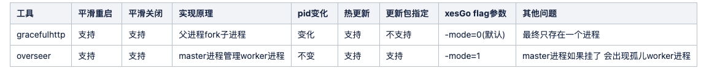
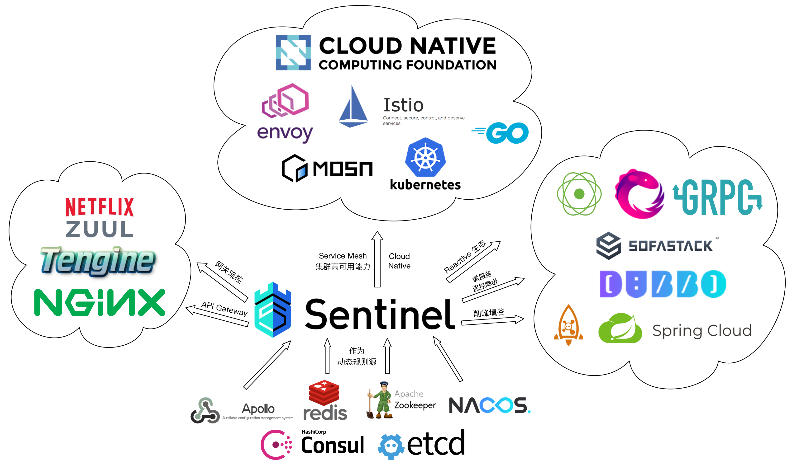
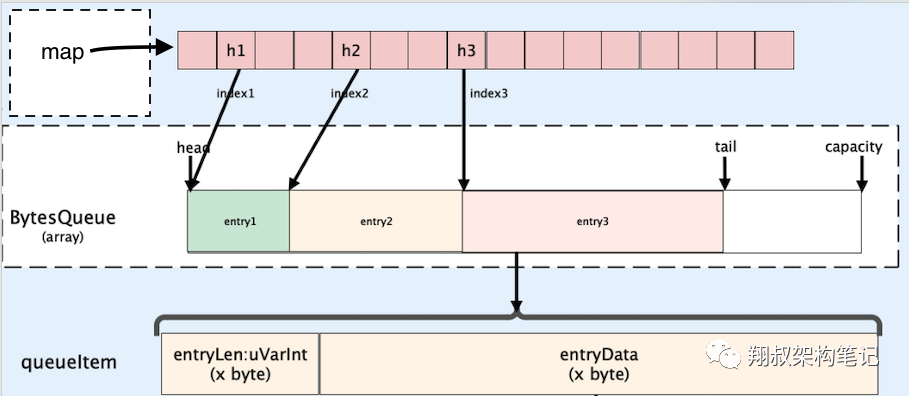
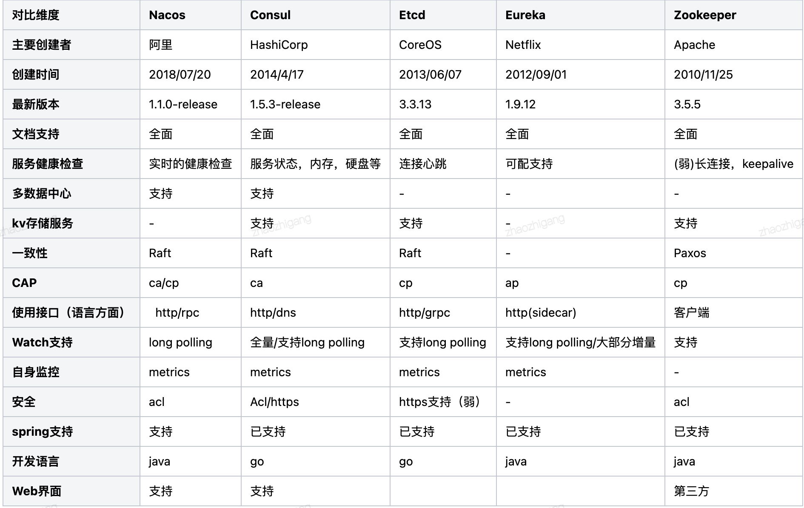
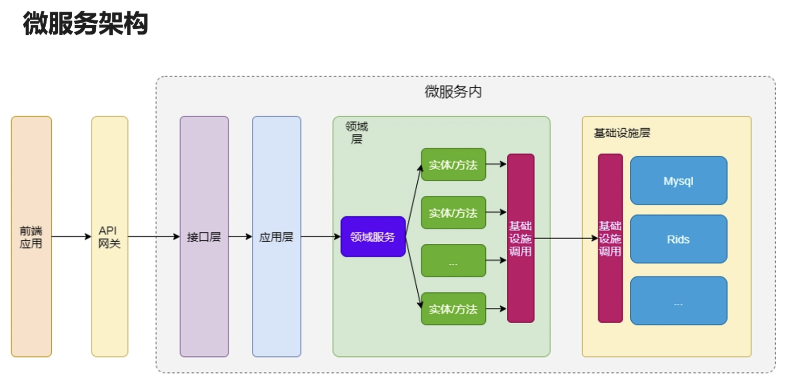
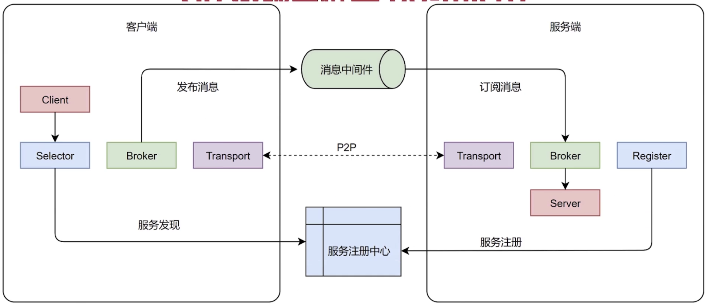
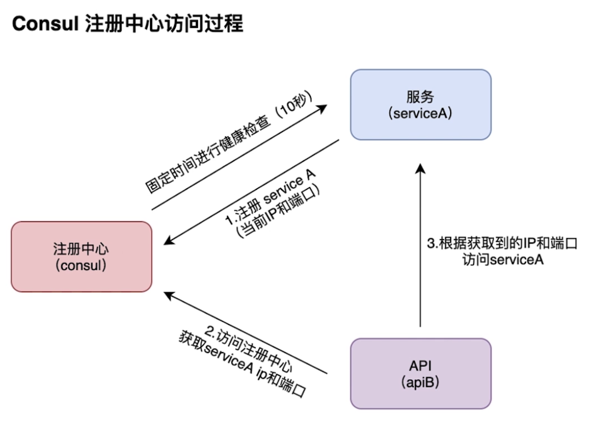
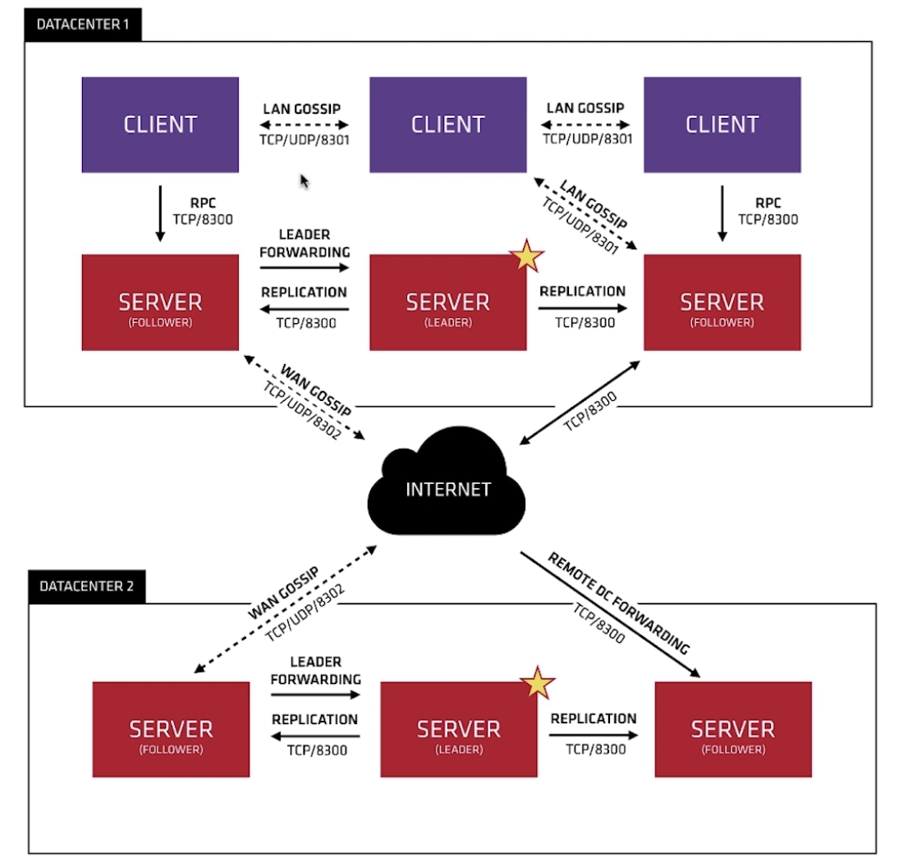

### 日志
1. log的缺陷
   - 不支持日志切割
     1. 日期方式
     1. 最大行数方式
     1. 最大容量方式
   - 不支持多个日志级别
   - 不支持日志格式化
   - 大量使用interface{}和反射，内存分配次数多，性能低
1. logrus：最活跃的日志库
   - 特点
     1. 完全兼容标准日志库，拥有七种日志级别：Trace, Debug, Info, Warning, Error, Fataland Panic
     1. 可扩展的Hook机制，允许使用者通过Hook的方式将日志分发到任意地方，如本地文件系统，logstash，elasticsearch或者mq等，或者通过Hook定义日志内容和格式等
     1. 可选的日志输出格式，内置了两种日志格式JSONFormater和TextFormatter，还可以自定义日志格式
     1. Field机制，通过Filed机制进行结构化的日志记录
     1. 线程安全
1. zap：uber开源的高性能日志库，结构化的多日志级别的日志格式，性能比logrus好，更少的内存分配次数
   - 组成
     1. Sugared Logger
     1. Logger：比SugaredLogger更快，只支持强类型的结构化日志记录
   - 使用
     1. 日志切割：搭配lumberjack
     1. 全局Logger：`zap.S()`，`zap.L()`
   - demo
    ```go
    logger, _ = zap.NewProduction()
    defer logger.Sync()
    logger.Error("Error fetching url..", zap.String("url", url), zap.Error(err))
    logger.Info("Success..", zap.String("statusCode", resp.Status), zap.String("url", url))
    ```
### 框架
1. Gin：以更好的性能实现类似Martini框架的API，5万star
   - 特点
     1. 简洁
     1. 高性能路由
   - validator
     1. 功能
        - 自定义约束
        - 错误处理
     1. 范围约束
        - len：等于
        - max：小于等于
        - min：大于等于
        - eq：等于，注意与len不同。对于字符串，eq约束字符串本身的值，而len约束字符串长度
        - ne：不等于
        - gt：大于
        - gte：大于等于
        - lt：小于
        - lte：小于等于
        - oneof：只能是列举出的值其中一个，这些值必须是数值或字符串，以空格分隔，如果字符串中有空格，将字符串用单引号包围，如`oneof=red green`
     1. 跨字段约束：形式为约束组合
        - 组成
          1. 约束：如eq
          1. 更深层次的字段：cs，cross-struct
          1. field
        - 举例
          1. `eqfield=Xx`
          1. `eqcsfield=Xx.Xx`
     1. 字符串
        - contains=：包含参数子串
        - containsany：包含参数中任意的 UNICODE 字符
        - containsrune：包含参数表示的 rune 字符
        - excludes：不包含参数子串
        - excludesall：不包含参数中任意的 UNICODE 字符
        - excludesrune：不包含参数表示的 rune 字符，excludesrune=☻
        - startswith：以参数子串为前缀
        - endswith：以参数子串为后缀
     1. 特殊
        - -：跳过该字段不检验
        - |：多个约束只需要满足其中一个
        - required：字段必须设置，不能为默认值
        - omitempty：如果字段未设置，则忽略它
        - 唯一性：`unqiue|unqiue=field`，可约束数组/切片的元素、map的值、struct的字段
        - 邮件：`email`
     1. 其他：ASCII/UNICODE字母、数字、十六进制、十六进制颜色值、大小写、RBG颜色值，HSL颜色值、HSLA颜色值、JSON 格式、文件路径、URL、base64编码串、ip地址、ipv4、ipv6、UUID、经纬度等
1. beego
   - 用于开发api、web的http框架，自带orm，大而全，最后一次更新20年12月
     1. 简单：RESTFul、mvc，支持热编译，自动化打包
     1. 智能：路由、监控
     1. 模块：Session、缓存、日志、配置解析、性能监控、上下文操作、ORM 模块、请求模拟
     1. 性能：原生http包、goroutine
   - 架构
     1. cache
     1. config
     1. context
     1. httplibs
     1. logs
     1. orm
     1. session
     1. toolbox
   - 组成
     1. mvc
     1. 路由
     1. orm
     1. 配置
     1. 模块
     1. 进程内监控
     1. 部署
        - 独立部署：`nohup ./beepkg &`
        - supervisor部署
        - nginx反向代理
1. 分类
   - 大型：功能大而全
     1. tars
     1. Kratos
   - rpc
     1. tars：性能强
   - web
     1. Echo：简约、高性能，2万star
     1. Iris：最快，完善的mvc
     1. Buffalo：快速构建web
     1. Revel：高效、全栈
     1. Martini：轻巧、功能强大、模块化web，不再维护
1. wiki
   - xes框架解析
    ```go
    // main函数中
    testing.Init()      // 注册测试标志，用于不使用go test的情况下，进行如基准测试的函数调用
    err = gracehttp.Serve(&http.Server{Addr: ":" + configs.GetServer().Server.Port, Handler: g})        // grace承接http服务
    ```
### 库
#### db相关
1. ORM
   - gorm
   - xorm
   - ent
   - Gaea：小米基于mysql协议的数据库中间件，支持分库分表、sql路由、读写分离等基本特性
1. redis
   - go-redis
     1. 认识：官方推荐第一个
        - 全命令支持
        - 自带的自动连接池，超时控制
        - pipeline、script支持
        - 订阅、事务支持
        - 哨兵、集群支持
        - 报表支持
     1. 生态：分布式锁、缓存、限流
     1. 连接池配置说明
        ```go
        gClient = redis.NewClient(&redis.Options{
            //连接信息
            Network:  "tcp",
            Addr:     "127.0.0.1:6379",
            Password: "",
            DB:       0,

            // 连接池
            PoolSize:     15,                           // 最大连接数，默认为4倍CPU数， 4 * runtime.NumCPU
            MinIdleConns: 10,                           // 启动阶段指定的Idle连接，即长期维持的最少数量

            //超时
            DialTimeout:  5 * time.Second,              // 连接建立超时时间，默认5秒
            ReadTimeout:  3 * time.Second,              // 读超时，默认3秒， -1表示取消读超时
            WriteTimeout: 3 * time.Second,              // 写超时，默认等于读超时
            PoolTimeout:  4 * time.Second,              // 当所有连接都处在繁忙状态时，客户端等待可用连接的最大等待时长，默认为读超时+1秒

            // 闲置连接检查
            IdleCheckFrequency: 60 * time.Second,       // 闲置连接检查的周期，默认为1分钟，-1表示不做周期性检查，只在客户端获取连接时对闲置连接进行处理
            IdleTimeout:        5 * time.Minute,        // 闲置超时，默认5分钟，-1表示取消闲置超时检查
            MaxConnAge:         0 * time.Second,        // 连接存活时长，从创建开始计时，超过指定时长则关闭连接，默认为0，即不关闭存活时长较长的连接

            // 命令执行失败时的重试策略
            MaxRetries:      0,                         // 命令执行失败时，最多重试多少次，默认为0即不重试
            MinRetryBackoff: 8 * time.Millisecond,      // 每次计算重试间隔时间的下限，默认8毫秒，-1表示取消间隔
            MaxRetryBackoff: 512 * time.Millisecond,    // 每次计算重试间隔时间的上限，默认512毫秒，-1表示取消间隔

            // 自定义连接函数
            Dialer: func() (net.Conn, error) {
                netDialer := &net.Dialer{
                    Timeout:   5 * time.Second,
                    KeepAlive: 5 * time.Minute,
                }
                return netDialer.Dial("tcp", "127.0.0.1:6379")
            },

            // 钩子函数
            OnConnect: func(conn *redis.Conn) error {   // 连接池需要新建连接时则会调用此钩子函数
            },
        })

        defer gClient.Close()
        ```
#### 进程管理
1. 相关：
#### 网络
1. chromedp
   - 认识：golang编写的基于Chrome DevTools Protocol协议的操作chrome headless和chrome devTools的程序
     1. 可用于需要js解析后形成dom树的场景
     1. 可实现点击，提交，上传，截图等操作
     1. 结合go并发可用于爬虫
### 中间件
#### 架构组件
1. Sentinel
   - 认识：面向分布式服务架构的高可用流量防护组件，以流量为切入点，从限流、流量整形、熔断降级、系统负载保护、热点防护等多个维度来帮助开发者保障微服务的稳定性
     1. 承接ali的双11流量
   - 生态：
1. 限流
   - 认识：保护后端服务
   - 举例
     1. uber/limit
     1. didip/tollbooth
1. grace
   - 认识：零停机部署的开源库，facebook开发
     1. 优雅重启：SIGUSR2
     1. 优雅结束：SIGTERM
   - 过程
     1. 构造server
     1. 设置ConnState，监听各连接的状态变化
     1. 启动新协程，接管各chan信号
     1. 在新协程中正式启动服务
#### 文件和配置
1. viper
   - 认识：配置信息处理框架，各种文件格式、环境变量、ETCD等，检测文件变动
     1. 支持 JSON/TOML/YAML/HCL/envfile/Java properties 等多种格式的配置文件
     1. 可以设置监听配置文件的修改，修改时自动加载新的配置
     1. 从环境变量、命令行选项和io.Reader中读取配置
     1. 从远程配置系统中读取和监听修改，如 etcd/Consul
     1. 代码逻辑中显示设置键值
   - demo
    ```go
    viper.SetConfigName("config")
    viper.SetConfigType("toml")
    viper.AddConfigPath(".")
    viper.SetDefault("redis.port", 6381)
    err := viper.ReadInConfig()
    if err != nil {
        log.Fatal("read config failed: %v", err)
    }
    name := viper.Get("app_name")
    ```
1. fsnotify：监听文件变化，viper的内部就是fsnotify
#### 数据格式
1. json-iterator/go：几倍性能于标准库`encoding/json`的100%兼容的json库
   - 只有使用struct才能获得显著的性能提升，因为struct只需一次反射，map每次都要
   - 1.10后性能和标准库差不多了，意义不大了
1. Simplejson：json快速处理器，关键部分c实现
#### 网络
1. go-resty/resty/v2：http请求库
   - 简单、功能丰富，链式调用
   - 自动Unmarshal
1. goreplay
   - 认识：开源网络监控工具，可以实时记录TCP/HTTP流量，支持把流量记录到文件或es实时分析，也支持流量的放大、缩小，还支持频率限制
     1. 不是代理，无需任何代码入侵，只需要在服务相同的机器上运行goreplay守护程序，其会在后台侦听网络接口上的流量
     1. 可以做流量回放
   - 原理：底层使用cgo调用Libpcap
     1. Libpcap：数据包捕获函数库，c写的，tcpdump也是基于这个实现
#### 时间
1. libi/dcron：基于一致性哈希的分布式定时任务库
1. gorhill/cronexpr：cron表达式解析库，支持到秒，年配置，计算下次调度时间
#### 程序
1. go-callvis：函数调用关系图，用来快速分析调用关系
1. go-cmp：Google开源的比较库，递归、切片、浮点数、自定义比较，差异查找
1. 其他
   - NSQ：实时分布式mq
   - GoDotEnv：Ruby dotenv项目的go版本
     1. 支持yaml语法
     1. 支持不写入环境变量，使用`myEnv, err := godotenv.Read()`读取
   - go-app：是一个使用 Go + WebAssembly技术编写渐进式Web应用的库，可以输出布局
1. db
   - vitessio/vitess：youtube通过通用分片对mysql进行水平扩展
1. 业务相关
   - casbin/casbin：访问控制库，支持ACL/RBAC/ABAC
1. 图像
   - plot：绘图库，内置很多组件，可以生成静态图片
     1. 支持折线图、直方图、函数图像、气泡图
     1. 搭配web服务可以直接返回一张图片给前端
1. windows
   - go-ole：通过使用动态库绑定Windows COM来代替cgo
1. html
   - PuerkitoBio/goquery：go版本的jQuery，用于读取html文档，基于net/html包和css包cascadia
     1. 不是功能齐全的DOM树，jQuery的有状态操作函数被忽略
#### 本地缓存
1. 基本款：依赖sync.Map，根据map元素的最后更新时间+最大缓存时间判断数据是否过期
1. localcache
1. bigcache
   - 认识
     1. 快速读写、支持过期淘汰、支持大数据量、无锁push
     1. 柔性删除机制会导致byteQueue出现很多内存空洞，而bigCache并没有有效重用起来，当我们对同个key频繁更新的时候，此时造成的空洞只有等待清理最老的元素的时候清理到空洞位置才能把这些空洞"删除掉"
     1. 不能作复杂删除操作，所有的缓存对象的lifewindow都是一样的，比如30分钟、两小时，依赖过期删除，无法set的时候指定expireTime过期时间
   - 设计
     1. 通过分片降低资源竞争
     1. 按位取余做分片（需要是 2 的整数幂 - 1）比取余效率高
     1. 避免map中出现指针、使用go基础类型可以显著降低 GC 压力、提升性能
        - 数据存在堆上，因为场景中多条数的map的k、v都使用了基础类型，可以避免gc
        - 目前是2000w条22ms的gc时延，高性能场景不允许
     1. bigcache底层存储是bytes queue，初始化时设置合理的配置项可以减少queue扩容的次数，提升性能
   - 特性
     1. 出现hash冲突时直接返回结果不存在
   - 结构：
     1. 内部对key进行分片，拆成一个个的cacheShard
     1. cacheShard由hashmap和entries组成
          1. `hashmap map[uint64]uint32`：key为hash值，value为BytesQueue中的偏移量
          1. `entries queue.BytesQueue`：类似ringbuffer的FIFO的BytesQueue结构即[]byte，如果空间不足则进行内存分配，符合按照时序淘汰的需求
1. fastcache
1. freecache
1. caffeine
   - 认识：基础存储没有采用复杂数据结构采用的是ConcurrentHashMap，所有的管理操作异步化、数据驱逐（淘汰）算法采用 W-TinyLFU，以及部分情况 LRF+LFU结合的方式，各种优秀的队列设计，冲突严重hash情况下链表降级采用红黑树来处理 等等优化处理
#### 分布式协调
1. etcd
   - 认识：分布式高可用强一致性的键值对的开源的数据存储系统，被用来作共享配置、服务注册和发现，依赖其作为分布式协调服务。web程序、kubernetes、openstack都在用，go编写
     1. 可靠：利用raft算法在集群中同步kv，数据持久化
     1. 快速：单实例支持每秒2k+读操作、1k写操作
     1. 简单、安全：部署简单、支持ssl验证
   - 应用场景
     1. 服务发现
        - 高可用强一致性的服务存储目录
        - 心跳：注册服务的健康状况机制，如设置key ttl，保持服务心跳
        - 查找和连接服务：集群中互相连接，如集群中每个机器部署proxy模式的etcd
     1. 分布式锁：etcd提供的API
     1. 分布式队列：在保证队列达到某个条件时再统一按顺序执行，监听不同的目录节点，协调运行
     1. 集群监控与Leader竞选：本质还是抢锁
   - 特性
     1. 能容忍单点故障，能应对网络分区
   - 功能
     1. 存储在集群的高可用kv
     1. 提交版本revision单调递增
     1. key的底层存储是有序排列的，可以顺序遍历，天然支持用seek和scan实现类似目录的高效遍历
     1. 同一个key维护多个历史版本，用于实现watch机制，可以用compact删除
     1. 支持watch机制监听key变化，或某个目录(key前缀)的连续变化，可用于分布式系统的配置分发，状态同步
     1. 支持复杂事务，如if...then...else...的能力
     1. 支持lease租约机制实现key的自动过期，会返回租约id，etcd帮忙挂上关系，到期了去删除，可以续租
   - 最佳实践
     1. 使用心跳检测：保证服务稳定，通过etcd的目录关联，而不是直接关联，极大减少耦合性
     1. 可代替zookeeper，可做配置存储
   - 使用
     1. 连接
        - http+json
        - grpc：更高效
     1. 数据操作：`etcdctl set/get/update/rm/mk/ [/xx/xx] xx`，`etcdctl mkdir/setdir/updatedir/rmdir/ls`
     1. watch：`etcdctl watch/exec-watch`，值一旦变化则输出/执行命令
     1. txn：事务，`cli.Txn(context.TODO()).If().Then(xx, xx).Commit()`
        - Txn()：创建
        - If()/Then()/Else()：条件判断
        - Commit()：提交
     1. lease：续约
        - Grant()：创建一个TTL的Lease，Lessor会将Lease信息持久化存储在boltdb中，`put a=1 with lease=5`
        - Revoke()：撤销Lease并删除其关联的数据
        - TimeToLive()：获取一个Lease的剩余时间
        - KeepAlive()：续期
        - KeepAliveOnce()
        - Leases()
        - Close()
   - 运维
     1. 基本
        - etcd 服务端，etcdctl 客户端
        - 端口
          1. 2379：http api
          1. 2380：peer通信
     1. 安装最少3个节点
     1. 集群操作：`etcdctl member list/remove/add`，节点管理
     1. 备份数据：`etcdctl backup`
   - 比较：
     1. Consul：内置服务注册与发现框架、分布一致性协议实现、健康检查、KV存储、多数据中心方案，go编写
     1. Zookeeper：ZooKeeper是一个分布式的，开放源码的分布式应用程序协调服务，是Google的Chubby一个开源的实现，是Hadoop和Hbase的重要组件。它是一个为分布式应用提供一致性服务的软件，提供的功能包括：配置维护、域名服务、分布式同步、组服务等。现在都用下边俩了，zk out了
     1. Nacos ：是构建以“服务”为中心的现代应用架构 (例如微服务范式、云原生范式) 的服务基础设施致力于发现、配置和管理微服务。并且提供了一组简单易用的特性集，能够快速实现动态服务发现、服务配置、服务元数据及流量管理。帮助开发人员更敏捷和容易地构建、交付和管理微服务平台。
     1. Apollo
     1. Eureka：netflix的服务发现框架，基于REST服务，定位运行在AWS域中的中间层服务，负载均衡和中间层服务故障转移目的。SpringCloud将它集成在其子项目spring-cloud-netflix中，以实现服务发现功能。主要是包含两个组件，Eureka Server和Eureka Client
   - 分布式锁
    ```go
    // 特性使用：事务txn、lease租约、watch监听
    // 建立连接
	if client, err = clientv3.New(config); err != nil {
		fmt.Println(err)
		return
	}

	// 1. 上锁并创建租约
	lease = clientv3.NewLease(client)

	if leaseGrantResp, err = lease.Grant(context.TODO(), 5); err != nil {
		panic(err)
	}
	leaseId = leaseGrantResp.ID

	// 2 自动续约
	// 创建一个可取消的租约，主要是为了退出的时候能够释放
	ctx, cancelFunc = context.WithCancel(context.TODO())

	// 3. 释放租约
	defer cancelFunc()
	defer lease.Revoke(context.TODO(), leaseId)

	if keepRespChan, err = lease.KeepAlive(ctx, leaseId); err != nil {
		panic(err)
	}
	// 续约应答
	go func() {
		for {
			select {
			case keepResp = <-keepRespChan:
				if keepRespChan == nil {
					fmt.Println("租约已经失效了")
					goto END
				} else { // 每秒会续租一次, 所以就会受到一次应答
					fmt.Println("收到自动续租应答:", keepResp.ID)
				}
			}
		}
	END:
	}()

	// 1.3 在租约时间内去抢锁（etcd 里面的锁就是一个 key）
	kv = clientv3.NewKV(client)

	// 创建事务
	txn = kv.Txn(context.TODO())

	//if 不存在 key，then 设置它，else 抢锁失败
	txn.If(clientv3.Compare(clientv3.CreateRevision("lock"), "=", 0)).
		Then(clientv3.OpPut("lock", "g", clientv3.WithLease(leaseId))).
		Else(clientv3.OpGet("lock"))

	// 提交事务
	if txnResp, err = txn.Commit(); err != nil {
		panic(err)
	}

	if !txnResp.Succeeded {
		fmt.Println("锁被占用:", string(txnResp.Responses[0].GetResponseRange().Kvs[0].Value))
		return
	}

	// 抢到锁后执行业务逻辑，没有抢到退出
	fmt.Println("处理任务")
	time.Sleep(5 * time.Second)
    ```
### 微服务
1. 微服务
   - 理解：微服务架构是一种更独立的架构模式，能够单独更新和发布。是分布式网状结构，它提倡将单一应用程序划分成一组小的服务，服务之间互相协调、互相配合，为用户提供最终价值。微服务架构 ≈ 模块化开发 + 分布式计算
     1. 一组小的服务
     1. 轻量级通信
     1. 现在开发模式：端到端ownership理念，啥都管：设计、开发、评审、测试、发布、运行、支持
   - 好处
     1. 强模块化边界
     1. 可独立部署
     1. 支持技术多样性
   - 坏处
     1. 分布式复杂性
     1. 最终一致性
     1. 运维负责
     1. 测试复杂
   - 中台战略
     1. 业务前台：各种应用
     1. 业务中台：支付、用户
     1. 技术中台：iaas云基础(计算、存储、网络、监控)、paas云平台(持续交付、服务框架)
   - 服务
     1. 开发框架
     1. 持续交付流水线
     1. 端到端工具链
     1. 工程实践规范
1. 微服务架构：
   - 设计原则
     1. 要领域驱动设计，不是数据驱动设计，也不是界面驱动设计
     1. 边界清晰
     1. 分层清晰
1. go-micro
   - 认识：构建、管理分布式程序的系统，微服务框架
   - 组成
     1. runtime：运行时，即micro工具，管理配置、认证、网络
        - api网关
        - broker：允许异步消息的代理
        - network：通过微网络服务构建多云网络
        - new：服务模板生成器
        - proxy：透明服务代理
        - registry：服务资源管理器
        - store：简单的状态存储
        - web：仪表盘浏览服务
     1. framework：开发框架,
        - server、client
        - registry：提供服务发现机制
        - selector：服务选择器
        - transport：服务间的通信接口
        - broker：异步的消息发布、订阅接口
        - codec：消息的编解码
     1. clients：多语言客户端
   - 使用
     1. 注册服务
     1. micro工具new生成服务
   - 历史：1.0、2.0、3.0的升级都不兼容，3.0改为了云原生的托管平台收费模式(就像阿里云卖硬件，它卖软件)。Licence改为了Polyform Shield，就是还是开源，但是防止AWS这样的云服务部署Micro服务，和Micro公司进行直接竞争
   - 组件
     1. 注册配置中心：consul
     1. 链路追踪：jaeger
     1. 监控：promethues
     1. 熔断器：hystrix
     1. 通信：grpc
     1. 限流：ratelimit
     1. 负载均衡：selector
     1. 日志：zap + ELK
     1. 协议：protobuf
1. consul
   - 认识：注册中心，支持多数据中心的分布式高可用的服务发布和注册服务，基于go开发
     1. 可组合构建完整的服务管理系统
     1. 是一种服务网格解决方案
   - 功能
     1. 提供了三种不同的应用场景，每个功能都能单独使用
        - 服务注册发现：就是可以让服务地址想怎么变就怎么变
        - 服务配置(kv形式)：可用于动态配置、功能标记、协调、leader选举
        - 服务隔离(分段)
     1. 支持健康检查、运行状况检查
     1. 支持多数据中心
     1. 安全服务通信：可为服务生成、分发tls证书，建立相互的tls连接
     1. 内置简单代理
   - 使用流程：
   - 架构：
     1. 两个数据中心，通过wan gossip
     1. 数据中心内部，分leader、follower
   - 协议
     1. Raft Protocol：选举，保证服务的一致性
     1. Gossip Protocol：八卦，一个事件发生时，其他节点需要知道这个事件
        - lan pool：局域网池
        - wan pool
1. 熔断
   - 认识：hystrix-go，记录成功调用、失败、超时、拒绝数量，在需要的地方加熔断，要根据业务设计一整套的熔断流程和处理逻辑
     1. 熔断计数器：默认DefaultMetricCollector，保存熔断器的所有状态数量
     1. 熔断器状态
        - close：允许流量通过
        - open：不允许
        - half_open：允许一部分，如果出现异常，进入open，否则一点点放量
     1. 字段
        - timeout：超时时间
        - maxConCurrentRequest：最大并发量
        - sleepWindow：熔断后重启时间，默认5秒
        - requestVolumeThreshold：单位时间请求量
        - errorPercentThreshold：熔断百分比，超过自动熔断
     1. hystrix-dashboard：web管理平台
1. 负载均衡：selector
### wiki
1. 脚手架
   - 认识：比喻各类语言的前期工作环境，方便直接进行开发
   - 组成举例
     1. git代码管理工具
     1. gin框架
     1. gorm操作数据库
     1. godotenv加载
     1. go-playground/validator
     1. golang-jwt/jwt
     1. logker日志库 
1. 目标
   - 编码能力和质量
   - 并发编程实践、设计模式实践
