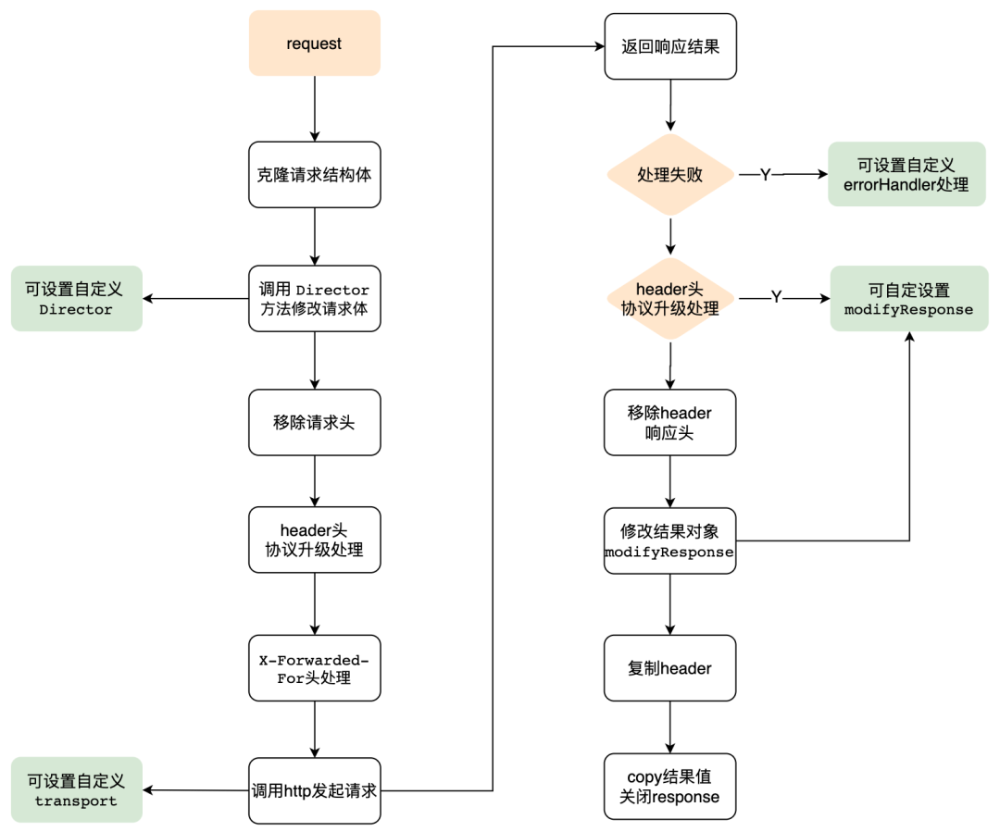

### 服务
1. go的百万长连接
   - 100W连接，占用了25.8g的内存，一个连接占用27kb的内存、2个goroutine(一个读一个写)
   - go中一个goroutine循环read的方法对应每一个socket，大量连接下是巨大资源浪费，go中也可以用epoll优化，把fd拿到epoll中，检测到事件然后在协程池里面去读就行了，看情况读写分别10-20个协程的goroutine池应该够
   - go启动默认有8个协程
### 框架
1. 分类
   - 大型：功能大而全
     1. tars
     1. kratos
   - rpc
     1. tars：性能强
   - web
     1. Echo：简约、高性能，2万star
     1. Iris：最快，完善的mvc
     1. Buffalo：快速构建web
     1. Revel：高效、全栈
     1. Martini：轻巧、功能强大、模块化web，不再维护
   - tcp框架
     1. zinx：基于tcp的轻量级的带工作池的服务器框架，类似ws的读写分开处理的架构
1. wiki
   - xes框架解析
    ```go
    // main函数中
    testing.Init()      // 注册测试标志，用于不使用go test的情况下，进行如基准测试的函数调用
    err = gracehttp.Serve(&http.Server{Addr: ":" + configs.GetServer().Server.Port, Handler: g})        // grace承接http服务
    ```
#### http框架
1. Gin：以更好的性能实现类似Martini的API框架，5万star
   - 特点
     1. 简洁：只专注于对http handler的web处理，用了随之配合的一些组件
     1. 高性能路由：会形成压缩字典树，性能非常高，支持路由分组
     1. 好用的middleware机制
   - 缺点
     1. 不是大而全，不是微服务，适合小项目
   - 结构
     1. Engine：是gin的实例，最终调用http.ListenAndServe(address, engine)来启动
     1. RouterGroup
        - 方法有：路由分组Group()、http方法POST()等
        - 添加路由：`Engine.addRoute()`
        - 路由匹配：使用julienschmidt/httprouter
     1. Context
   - validator
     1. 功能：`json:"type" binding:"required,oneof=1 2"`
        - 自定义约束
        - 错误处理
     1. 范围约束
        - len：等于
        - max：小于等于
        - min：大于等于
        - eq：等于，注意与len不同。对于字符串，eq约束字符串本身的值，而len约束字符串长度
        - ne：不等于
        - gt：大于
        - gte：大于等于
        - lt：小于
        - lte：小于等于
        - oneof：只能是列举出的值其中一个，这些值必须是数值或字符串，以空格分隔，如果字符串中有空格，将字符串用单引号包围，如`oneof=red green`
     1. 跨字段约束：形式为约束组合
        - 组成
          1. 约束：如eq
          1. 更深层次的字段：cs，cross-struct
          1. field
        - 举例
          1. `eqfield=Xx`
          1. `eqcsfield=Xx.Xx`
     1. 字符串
        - contains=：包含参数子串
        - containsany：包含参数中任意的 UNICODE 字符
        - containsrune：包含参数表示的 rune 字符
        - excludes：不包含参数子串
        - excludesall：不包含参数中任意的 UNICODE 字符
        - excludesrune：不包含参数表示的 rune 字符，excludesrune=☻
        - startswith：以参数子串为前缀
        - endswith：以参数子串为后缀
     1. 特殊
        - -：跳过该字段不检验
        - |：多个约束只需要满足其中一个
        - required：字段必须设置，不能为默认值
        - omitempty：如果字段未设置，则忽略它
        - 唯一性：`unqiue|unqiue=field`，可约束数组/切片的元素、map的值、struct的字段
        - 邮件：`email`
     1. 其他：ASCII/UNICODE字母、数字、十六进制、十六进制颜色值、大小写、RBG颜色值，HSL颜色值、HSLA颜色值、JSON 格式、文件路径、URL、base64编码串、ip地址、ipv4、ipv6、UUID、经纬度等
   - 实现
     1. httprouter：基于基数树
        - radix tree：更节省空间的字典树，该节点是唯一的子树的话，就和父节点合并
          1. root tree，存储http方法的映射，用slice而不是用map并不是为了内存考虑，在短长度的情况下，slice的速度会比map快很多
     1. middleware：基于HandlersChain []HandlerFunc来确认事件内容
1. beego
   - 用于开发api、web的http框架，自带orm，大而全
     1. 简单：RESTFul、mvc，支持热编译，自动化打包
     1. 智能：路由、监控
     1. 模块：Session、缓存、日志、配置解析、性能监控、上下文操作、ORM 模块、请求模拟
     1. 性能：原生http包、goroutine
   - 架构
     1. cache
     1. config
     1. context
     1. httplibs
     1. logs
     1. orm
     1. session
     1. toolbox
   - 组成
     1. mvc
     1. 路由
     1. orm
     1. 配置
     1. 模块
     1. 进程内监控
     1. 部署
        - 独立部署：`nohup ./beepkg &`
        - supervisor部署
        - nginx反向代理
#### 微服务框架
1. 微服务
   - 理解：微服务架构是一种更独立的架构模式，能够单独更新和发布。是分布式网状结构，它提倡将单一应用程序划分成一组小的服务，服务之间互相协调、互相配合，为用户提供最终价值。微服务架构 ≈ 模块化开发 + 分布式计算
     1. 一组小的服务
     1. 轻量级通信
     1. 现在开发模式：端到端ownership理念，啥都管：设计、开发、评审、测试、发布、运行、支持
   - 好处
     1. 强模块化边界
     1. 可独立部署
     1. 支持技术多样性
   - 坏处
     1. 分布式复杂性
     1. 最终一致性
     1. 运维负责
     1. 测试复杂
   - 中台战略
     1. 业务前台：各种应用
     1. 业务中台：支付、用户
     1. 技术中台：iaas云基础(计算、存储、网络、监控)、paas云平台(持续交付、服务框架)
   - 服务
     1. 开发框架
     1. 持续交付流水线
     1. 端到端工具链
     1. 工程实践规范
1. 微服务架构：
   - 设计原则
     1. 要领域驱动设计，不是数据驱动设计，也不是界面驱动设计
     1. 边界清晰
     1. 分层清晰
1. kratos
   - 特性
     1. 不过度设计，代码简单
     1. 强大的中间件：Tracing（OpenTelemetry）、Metrics（默认为Prometheus）、Recovery等
1. go-micro
   - 认识：构建、管理分布式程序的系统，微服务框架
   - 组成
     1. runtime：运行时，即micro工具，管理配置、认证、网络
        - api网关
        - broker：允许异步消息的代理
        - network：通过微网络服务构建多云网络
        - new：服务模板生成器
        - proxy：透明服务代理
        - registry：服务资源管理器
        - store：简单的状态存储
        - web：仪表盘浏览服务
     1. framework：开发框架,
        - server、client
        - registry：提供服务发现机制
        - selector：服务选择器
        - transport：服务间的通信接口
        - broker：异步的消息发布、订阅接口
        - codec：消息的编解码
     1. clients：多语言客户端
   - 使用
     1. 注册服务
     1. micro工具new生成服务
   - 历史：1.0、2.0、3.0的升级都不兼容，3.0改为了云原生的托管平台收费模式(就像阿里云卖硬件，它卖软件)。Licence改为了Polyform Shield，就是还是开源，但是防止AWS这样的云服务部署Micro服务，和Micro公司进行直接竞争
   - 组件
     1. 注册配置中心：consul
     1. 链路追踪：jaeger
     1. 监控：promethues
     1. 熔断器：hystrix
     1. 通信：grpc
     1. 限流：ratelimit
     1. 负载均衡：selector
     1. 日志：zap + ELK
     1. 协议：protobuf
1. 熔断
   - 认识：hystrix-go，记录成功调用、失败、超时、拒绝数量，在需要的地方加熔断，要根据业务设计一整套的熔断流程和处理逻辑
     1. 熔断计数器：默认DefaultMetricCollector，保存熔断器的所有状态数量
     1. 熔断器状态
        - close：允许流量通过
        - open：不允许
        - half_open：允许一部分，如果出现异常，进入open，否则一点点放量
     1. 字段
        - timeout：超时时间
        - maxConCurrentRequest：最大并发量
        - sleepWindow：熔断后重启时间，默认5秒
        - requestVolumeThreshold：单位时间请求量
        - errorPercentThreshold：熔断百分比，超过自动熔断
     1. hystrix-dashboard：web管理平台
1. 负载均衡：selector
#### gRPC
1. gRPC
   - 认识：基于http2.0 + protocol buffer的cs型的高性能的开源的通用的rpc框架，比webSocket高效，google主导开发，包 `google.golang.org/grpc`
     1. 语言中立，支持多语音，默认采用protocol buffers数据序列化协议，支持c(c++、node.js、c#)、java、go
     1. 基于IDL文件定义服务，通过proto3工具生成指定语言的数据结构、服务端接口以及客户端Stub
     1. 支持双向数据流、消息头压缩、单tcp多路复用、服务端推送等，gRPC在移动端设备上更加省电和节省网络流量
     1. 序列化支持protocol buffer和json
   - 模式
     1. 简单模式：单调的顺序请求、响应
     1. 双向数据流模式：请求、响应并行起来
   - 实例
     1. proto生成go代码
        - 编写proto文件，生成.pb.go代码
          1. `protoc --go_out=plugins=grpc:. arith.proto`，包含了rpc方法定义和服务注册的代码，即有service
          1. `protoc --proto_path=. --go_out=./ --go-grpc_out=./ ./mind-im-server/pkg/proto/auth/auth.proto`：插件新用法
        - 插件
          1. protoc-gen-go：旧的在github上，新的在golang.org上
          1. protoc-gen-go-grpc：专为生成grpc代码拆出来的，在golang.org上
        - 使用
          1. 服务端：`pb.ListenAndServeArithService("tcp", "127.0.0.1:8097", new(Arith))`
          1. 客户端
            ```go
            conn, err := pb.DialArithService("tcp", "127.0.0.1:8097")
            if err != nil {
                log.Fatalln("dailing error: ", err)
            }
            defer conn.Close()

            req := &pb.ArithRequest{9, 2}

            res, err := conn.Multiply(req)
            if err != nil {
                log.Fatalln("arith error: ", err)
            }
            ```
     1. 使用grpc
        - 实现pb.go的RegisterXXServiceServer接口
        - 服务端
            ```go
            // 1. new一个grpc的server
            rpcServer := grpc.NewServer()

            // 2. 将刚刚我们新建的ProdService注册进去
            service.RegisterProdServiceServer(rpcServer, new(service.ProdService))

            // 3. 新建一个listener，以tcp方式监听8082端口
            listener, err := net.Listen("tcp", ":8082")
            if err != nil {
                log.Fatal("服务监听端口失败", err)
            }

            // 4. 运行rpcServer，传入listener
            _ = rpcServer.Serve(listener)
            ```
        - 客户端
            ```go
            conn, err := grpc.Dial(":8082", grpc.WithInsecure())
            if err != nil {
                log.Fatal(err)
            }

            // 退出时关闭链接
            defer conn.Close()

            // 2. 调用Product.pb.go中的NewProdServiceClient方法
            productServiceClient := service.NewProdServiceClient(conn)

            // 3. 直接像调用本地方法一样调用GetProductStock方法
            resp, err := productServiceClient.GetProductStock(context.Background(), &service.ProductRequest{ProdId: 233})
            if err != nil {
                log.Fatal("调用gRPC方法错误: ", err)
            }

            fmt.Println("调用gRPC方法成功，ProdStock = ", resp.ProdStock)
            ```
1. Protocol Buffers
   - 认识：protobuf，google开发的一种数据序列化协议，二进制格式，和xml/json都是编码方式
     1. 效率高：二进制格式，比文本格式更紧凑，序列化/反序列化速度也很快
     1. 跨语言支持，包括c++、java、python
     1. 清晰的结构定义、向后兼容性
   - 组成
     1. 数据类型
        - `int64 fieldName`：基本类型
        - `repeated typeName fieldName`：列表类型
        - `map<string, int32> fieldName`：map类型
          1. 键的类型：int、string、bool
          1. 值的类型：除了另一个map或者stream字段的基本数据类型、枚举类型或者其他消息类型
            ```
            // 嵌套举例
            message InnerMap {
                map<string, string> sub_map = 1;
            }

            message OuterMap {
                map<string, InnerMap> nested_map = 1;           // InnerMap需要新定义一个类型
            }
            ```
   - 最佳实践
     1. proto跟顺序强相关，加字段要在下边加，不能在中间，会导致序号和字段名对不上导致丢失参数
   - 实例
    ```conf
    package test;
    option go_package="test";           // 指定go的包名

    // 定义数据类型
    message MyMessage {
        map<string, int32> my_map = 1;                              // 定义一个从string到int32的map
        repeated server_api_params.UserInfo UserInfoList = 2;       // 定义一个列表类型
    }

    // 定义RPC服务接口
    service SearchService {
        rpc Search (SearchRequest) returns (SearchResponse) {}
    }
    ```
   - 其他
     1. MessagePack：高效的二进制的跨语言的序列化框架
     1. thrift：高性能、跨语言
     1. java默认：java.io.Serializable，字节数组，无法跨语言、体积大、效率低
1. rpc
   - 认识：Remote Procedure Call Protocol 远程过程调用协议，调用远程方法像调用本地一样，不需要关注通信细节和调用过程，打通了应用层和传输层
     1. 支持了分布式部署、网络化
     1. 程序内连接，解耦
     1. 包含了编码协议、传输协议
     1. linux的固定端口111
   - 实现原理
     1. 序列化和反序列化数据
     1. 远端反射调用
   - 分类
     1. 只支持特定语言的
        - 微博的Motan
        - 古老的RMI
        - phprpc、yar、swoole、hprose
     1. 跨语言：没有服务发现、负载均衡等相关机制
        - grpc
        - thrift：接口描述语言和二进制通讯协议，结构和grpc很像，facebook捐赠给apache
     1. 支持服务治理等服务化特性的分布式服务框架：dubbo、spring cloud
        - go的rpcx
          1. 高性能：gRPC性能的两倍
          1. 交叉语言：各种编程语言的调用
          1. 服务发现：支持直连、Zookeeper、Etcd、Consul、mDNS等注册中心
          1. 服务治理：支持Failover、Failfast、Failtry、Backup等失败模式，支持随机、轮询、权重、网络质量、一致性哈希、地理位置等路由算法
        - SPRC：搜狗基于Sogou C++ Workflow的企业级RPC系统，qps几十万，支持Protobuf、Thrift
   - 跨语言rpc
     1. 实现基础：通用数据结构
     1. 实现方式
        - 文件方式：web service
          1. 实现原理：将被调用的方法名、参数封装到WSDL的xml文件中，然后解析xml进行调用
          1. 弊端：xml的数据传输低效性，网络传输的路径长(基于http协议)
        - 二进制方式：新一代rpc实现原理
          1. 编写描述文件
          1. 转换描述文件为相应语言的数据结构(结构体、类等)，使用Protobuf
          1. 翻译：将数据结构转为二进制数据、字节数组
          1. 传输：通过socket传给另一个编程语言
          1. 再次翻译：翻译为本语言的数据结构
          1. 调用执行
   - 最佳实践：
     1. 基础能力
        - 核心通信能力：请求构建封装、序列化、网络传输、反序列化、服务端处理等多个环节
          1. 调用方式：oneway、async（异步）、sync(同步)、stream 
        - 高性能：框架级别通讯耗时p99 1～2ms左右，单POD如4核 2GJVM进程能支持10w～15w以上qps
        - 高可用：关键依赖如注册中心的可用性
          1. 强AP: 对数据的可用性要求很高，对节点数据不一致性要求不太高，甚至异常情况可允许部分节点错误
        - 服务注册发现
        - 容错：FailFast（快速失败）、FailOver（重试）、FailBack（后台自动调用恢复）
     1. 服务治理能力
        - 限流：限流粒度可以基于IP、上游服务标识、调用接口、参数等
        - 熔断降级：返回特定的降级逻辑从而不影响核心业务；常见判断指标有线程数、信号量、错误率、超时数等
        - 其他：务内调用强弱依赖度分析、客户端自适应容错等
     1. 流量管控
        - 流量路由：支持请求按条件、标签、脚本等自动路由能力，实现类似服务分组、版本分组调用，实例tag分组，按机房、地域等流量分配能力，基于以上路由能力可以构建相关服务治理场景如流量分组、机房调度、灰度、泳道能力等
        - 负载均衡：在流量路由的基础上完成对该组内节点的流量分配，常见的LB算法有随机、随机+权重，一致性Hash、roundrobin、最小连接等
        - 其它
          1. 优雅上下线
          1. 服务预热：循环更新
     1. 应用可观测性
        - 监控：应用核心metric，例如每秒请求数、错误数、超时数、异常数等等（可覆盖应用、接口、方法等统计维度）
        - trace：全链路追踪系统，把请求从API 网关、服务层各层调用节点进行串联， 可用来分析请求过程中服务、资源相关调用情况、调用瓶颈，强弱依赖等
        - 日志：应用级相关日志，对访问、超时、内部异常等需要有日志覆盖
     1. 微服务管理后台：查看、控制等
     1. 运维体系集成：CI\CD、CMDB、发布系统、k8s、监控系统等
#### websocket
1. 一种设计
    ```go
    // 使用协程和通道来管理连接
    type ConnectionManager struct {
        connections map[*websocket.Conn]bool
        register   chan *websocket.Conn
        unregister chan *websocket.Conn
    }
    // 处理连接时无锁设计提高性能
    func (manager *ConnectionManager) run() {
        for {
            select {
            case conn := <-manager.register:
                manager.connections[conn] = true
            case conn := <-manager.unregister:
                if _, ok := manager.connections[conn]; ok {
                    delete(manager.connections, conn)
                    conn.Close()
                }
            }
        }
    }

    // 具体实现
    func NewServer() *Server {                                                          // 初始化
        return &Server{
            ConnectionManager: &ConnectionManager{
                connections: make(map[*websocket.Conn]bool),
                register:    make(chan *websocket.Conn),
                unregister:  make(chan *websocket.Conn),
            },
        }
    }
    func (s *Server) HandleNewConnection(w http.ResponseWriter, r *http.Request) {      // 接受新连接
        conn, err := websocket.Upgrade(w, r, nil, 1024, 1024)
        if err != nil {
            log.Println(err)
            return
        }
        s.ConnectionManager.register <- conn
    }
    ```
   - 服务器优化
     1. ulimit -n 1000000：文件描述符
     1. sysctl -w net.ipv4.tcp_fin_timeout=30：tcp参数
     1. sysctl -w net.ipv4.tcp_tw_reuse=1：tcp参数
### 库
1. 执行相关
   - brahma-adshonor/gohook：在运行时动态挂钩go函数，从而实现动态语言修补等功能。
     1. 总体思路是gohook会找出go函数的地址，然后插入一些跳转指令将执行流程重定向到新函数
        - 找出函数的地址，这可以通过标准反射库来完成
        - 使用精心设计的二进制指令将跳转代码注入目标函数
        - 实现trampoline函数以允许回调到原始函数
1. 业务相关
   - casbin/casbin：访问控制库，支持ACL/RBAC/ABAC
1. json
   - json-iterator/go：几倍性能的100%兼容的标准库`encoding/json`的json库
     1. 只有使用struct才能获得显著的性能提升，因为struct只需一次反射，map每次都要
     1. 1.10后性能和标准库差不多了，意义不大了
   - sonic
     1. 背景
        - 平时业务里json操作cpu占用基本10%，甚至40%
        - json-iterator在泛型编解码、大数据量级场景下的性能也会下降
     1. 认识：字节开源的基于JIT、向量化编程、lazy-load设计思想，大幅提升go的json编解码性能，在网关、转发和入口服务等计算密集型提升较大性能
        - 核心技术点是使用c语言编写热点操作，使用clang的深度优化编译选项编译后供golang调用
        - 不使用cgo
          1. 实现简便、调用方便、cgo也可以对c代码进行o3级别的优化
          1. cgo在调用c代码的时候引入了调度、切换线程栈等开销，会造成较大（有的场景中高达20多倍）的性能损耗
     1. 实现
        - 热点操作编译成汇编
          1. 代码级优化
             - SIMD：根据预设条件（字符串长度、float精度），动态选择使用向量化编程或标量编程
             - loop unrolling，为什么要在编码阶段做？
               1. 若编译器在编译阶段即可知道循环次数，会自动做loop unrolling。因为此处因为字符串的长度不可知，编译器不知如何优化，因此在编码阶段实现
               1. 编译器可以做到直接优化到直接返回运算结果
          1. sonic当前支持avx、avx2和sse三个向量指令集来编译：clang编译出来的是x86，golang是plan9。为在golang中调用clang编译出来的汇编，字节开发工具(tools/asm2asm)转换为plan9
          
   - tango
   - simpleJson：json快速处理器，关键部分c实现
1. 任务调度
   - libi/dcron：基于一致性哈希的分布式定时任务库
   - gorhill/cronexpr：cron表达式解析库，支持到秒，年配置，计算下次调度时间
   - ouqiang/gocron：轻量级定时任务集中调度和管理系统，用于替代linux-crontab
1. mq
   - NSQ：实时分布式mq
1. 图像
   - plot：绘图库，内置很多组件，可以生成静态图片
     1. 支持折线图、直方图、函数图像、气泡图
     1. 搭配web服务可以直接返回一张图片给前端
1. html
   - go-app：是一个使用Go + WebAssembly技术编写渐进式Web应用的库，可以输出布局
   - PuerkitoBio/goquery：go版本的jQuery，用于读取html文档，基于net/html包和css包cascadia
     1. 不是功能齐全的DOM树，jQuery的有状态操作函数被忽略
1. windows
   - go-ole：通过使用动态库绑定Windows COM来代替cgo
#### db相关
1. ORM
   - xorm
   - ent
   - Gaea：小米基于mysql协议的数据库中间件，支持分库分表、sql路由、读写分离等基本特性
   - vitessio/vitess：youtube通过通用分片对mysql进行水平扩展
1. redis
   - go-redis
     1. 认识：官方推荐第一个
        - 全命令支持
        - 自带的自动连接池，超时控制
        - pipeline、script支持
        - 订阅、事务支持
        - 哨兵、集群支持
        - 报表支持
     1. 生态：分布式锁、缓存、限流
     1. 连接池配置说明
        ```go
        gClient = redis.NewClient(&redis.Options{
            //连接信息
            Network:  "tcp",
            Addr:     "127.0.0.1:6379",
            Password: "",
            DB:       0,

            // 连接池
            PoolSize:     15,                           // 最大连接数，默认为4倍CPU数， 4 * runtime.NumCPU
            MinIdleConns: 10,                           // 启动阶段指定的Idle连接，即长期维持的最少数量

            //超时
            DialTimeout:  5 * time.Second,              // 连接建立超时时间，默认5秒
            ReadTimeout:  3 * time.Second,              // 读超时，默认3秒， -1表示取消读超时
            WriteTimeout: 3 * time.Second,              // 写超时，默认等于读超时
            PoolTimeout:  4 * time.Second,              // 当所有连接都处在繁忙状态时，客户端等待可用连接的最大等待时长，默认为读超时+1秒

            // 闲置连接检查
            IdleCheckFrequency: 60 * time.Second,       // 闲置连接检查的周期，默认为1分钟，-1表示不做周期性检查，只在客户端获取连接时对闲置连接进行处理
            IdleTimeout:        5 * time.Minute,        // 闲置超时，默认5分钟，-1表示取消闲置超时检查
            MaxConnAge:         0 * time.Second,        // 连接存活时长，从创建开始计时，超过指定时长则关闭连接，默认为0，即不关闭存活时长较长的连接

            // 命令执行失败时的重试策略
            MaxRetries:      0,                         // 命令执行失败时，最多重试多少次，默认为0即不重试
            MinRetryBackoff: 8 * time.Millisecond,      // 每次计算重试间隔时间的下限，默认8毫秒，-1表示取消间隔
            MaxRetryBackoff: 512 * time.Millisecond,    // 每次计算重试间隔时间的上限，默认512毫秒，-1表示取消间隔

            // 自定义连接函数
            Dialer: func() (net.Conn, error) {
                netDialer := &net.Dialer{
                    Timeout:   5 * time.Second,
                    KeepAlive: 5 * time.Minute,
                }
                return netDialer.Dial("tcp", "127.0.0.1:6379")
            },

            // 钩子函数
            OnConnect: func(conn *redis.Conn) error {   // 连接池需要新建连接时则会调用此钩子函数
            },
        })

        defer gClient.Close()
        ```
##### gorm
1. 认识
   - 模型映射：倾向于约定优于配置
     1. 蛇形复数：涉及表名、字段(ID/CreatedAt/UpdatedAt/DeletedAt)
        - 识别为对应下划线+s的表名
        - Update/Updates/Save会更新UpdatedAt字段，UpdateColumn/UpdateColumns不会；禁用`gorm:ignore_updated_at`
        - 查询时会自动加条件判断DeletedAt的状态
     1. 标签：primaryKey/not null/scale(列大小)/column
     1. 手动指定
        - `.Model(&User{})`
        - `.Table("users")`
   - 组成
     1. StructField 结构体：字段配置
     1. Relationship 结构体：预定义链表的配置，根据配置相应操作
     1. Scope
   - 实现
     1. sql生成：gorm内部使用sql builder生成sql。每个操作gorm都会创建一个*gorm.statement对象，所有的gorm api都是在为statement添加、修改子句，最后gorm会根据这些子句生成sql
        - 后面就是对Statement中的Clauses属性进行添加、修改和执行，执行过程中调用Expression接口的表达式生成器，生成最终的sql语句，`scope.SQLDB().QueryRow(scope.SQL, scope.SQLVars...).Scan(primaryField.Field.Addr().Interface())`
     1. 各种反射的应用：判断类型、情况
1. 基本使用
   - 字段选择
     1. Select：在查询和创建、更新时指定选择
        - `.Select("count(distinct(name))")`：自定义select
     1. Omit：在查询和创建、更新时指定忽略
   - 创建
     1. Save
        - 会保存包括字段是零值的所有字段
        - 如果保存值不包含主键将Create，否则Update(包含所有字段)
        - 不要将Save和Model一同使用, 这是未定义的行为
     1. Create：支持单条、多条、关联创建(嵌套结构体)，支持结构体、map
     1. CreateInBatches
   - 更新
     1. Update：更新单个列，`.Update("name", "hello")`，没条件会抛ErrMissingWhereClause错误
        - 根据条件更新：`.Model(&User{})`，只指定模型，全依赖where
        - 根据条件和model的值进行更新：`.Model(&user)`，即添加`WHERE id=111`，依赖变量user中的id和where
        - 使用表达式更新：`.Update("price", gorm.Expr("price * ? + ?", 2, 100))`、`UPDATE "products" SET "price" = price * 2 + 100`
        - 使用sql表达式、sql上下文更新：结构体拥有GormValue方法实现
        - 子查询更新
            ```go
            db.Model(&user).Update("company_name", db.Model(&Company{}).Select("name").Where("companies.id = users.company_id"))
            // UPDATE "users" SET "company_name" = (SELECT name FROM companies WHERE companies.id = users.company_id);
            ```
     1. Updates：更新多列
        - 多列字段选择
          1. 根据结构体：`.Updates(User{Name: "hello", Age: 18, Active: false})`，使用struct默认只会更新非零值的字段
          1. 根据map：`.Updates(map[string]interface{}{"name": "hello", "age": 18, "active": false})`，全部更新
        - 根据条件：和Update相同
     1. UpdateColumn/UpdateColumns：会跳过钩子、不更新约定的时间字段
   - 删除
     1. Delete：根据主键、内联条件、额外条件更新。主键就是结构体内的主键、内联就是Delete的二参、额外就是where条件
        - 批量删除：`.Delete(&Email{})`
     1. 软删除
        - 认识：model有gorm.DeletedAt类型字段自动软删除
        - 使用
            ```go
            import "gorm.io/plugin/soft_delete"

            type User struct {
                DeletedAt soft_delete.DeletedAt                                     // 使用unix时间戳作为删除标志
                IsDel soft_delete.DeletedAt `gorm:"softDelete:flag"`                // 使用1/0作为删除标志

                DeletedAt soft_delete.DeletedAt `gorm:"softDelete:milli"`           // 使用毫秒milli或纳秒nano作为值
                // DeletedAt soft_delete.DeletedAt `gorm:"softDelete:nano"`             
            }
            ```
        - 其他
          1. `.Unscoped()`查找被软删除的记录
          1. `.Unscoped().Delete(&order)`永久删除
   - 查询
     1. 获取：会抛出ErrRecordNotFound的方法：Take/First/Last()：find不会
        - First、Last：加了order by，没有主键将按model第一个字段进行排序
        - Take
        - Find：支持单条、多条，单条时会查询所有但是只返回第一条
          1. `.Find(&APIUser{})`：指定接口的结构体实现特定字段的返回
          1. 加条件，省略where
             - `.Find(&user, "name = ?", "jinzhu")、.Find(&users, "name <> ? AND age > ?", "jinzhu", 20)`
             - `.Find(&users, User{Age: 20})`
             - `.Find(&users, map[string]interface{}{"age": 20})`
        - Count：`.Count(&count)`
        - Pluck：只取单列，`.Pluck("age", &ages)`
        - Distinct
          1. `.Distinct("name", "age").`
     1. 条件
        - Where
          1. `.Where("name = ?", "jinzhu")`
          1. `.Where("name <> ?", "jinzhu")`
          1. `.Where("created_at BETWEEN ? AND ?", lastWeek, today)`

          1. `.Where(&User{Name: "jinzhu", Age: 0})`：结构体查询时会自动忽略零值的
          1. `.Where(map[string]interface{}{"name": "jinzhu", "age": 20})`
          1. `.Where([]int64{20, 21, 22})`：按照主键id搜索
          1. 嵌套where
            ```go
            db.Where(
                db.Where("pizza = ?", "pepperoni").Where(db.Where("size = ?", "small").Or("size = ?", "medium")),
            ).Or(
                db.Where("pizza = ?", "hawaiian").Where("size = ?", "xlarge"),
            ).Find(&Pizza{})
            // SELECT * FROM `pizzas` WHERE (pizza = "pepperoni" AND (size = "small" OR size = "medium")) OR (pizza = "hawaiian" AND size = "xlarge")
            ```
          1. 多列的in
            ```go
            db.Where("(name, age, role) IN ?", [][]interface{}{{"jinzhu", 18, "admin"}, {"jinzhu2", 19, "user"}}).Find(&users)
            // SELECT * FROM users WHERE (name, age, role) IN (("jinzhu", 18, "admin"), ("jinzhu 2", 19, "user"));
            ```
        - Not：where not xx的简洁版，会根据不同的类型转变为where not、WHERE xx <>、WHERE xx NOT IN
        - Or
          1. `.Or(User{Name: "jinzhu 2", Age: 18})`：`OR (name = 'jinzhu 2' AND age = 18)`
          1. `.Or(map[string]interface{}{"name": "jinzhu 2", "age": 18})`
        - Order
          1. `.Order("age desc, name")`：直接写要order的
          1. `.Order("age desc").Order("name")`：多个要order的，效果如上一样
          1. Clauses子句
          ```go
          db.Clauses(clause.OrderBy{
            Expression: clause.Expr{SQL: "FIELD(id,?)", Vars: []interface{}{[]int{1, 2, 3}}, WithoutParentheses: true},
          }).Find(&User{})

          // SELECT * FROM users ORDER BY FIELD(id,1,2,3)
          ```
        - Limit/Offset
          1. `.Limit(3).Offset(3)`：常规用法
          1. `.Limit(10).Find(&users1).Limit(-1).Find(&users2)`：一次取俩，用-1取消limit
          1. `.Offset(10).Find(&users1).Offset(-1).Find(&users2)`：效果如上
        - Group By/Having
          1. `.Group("date(created_at)").Having("sum(amount) > ?", 100)`：常规用法
     1. 连接
        - Joins/InnerJoins
          1. `.Joins("left join emails on emails.user_id = users.id")`
          1. `.Joins("Company", db.Where(&Company{Alive: true}))`：joins时加条件
          1. join子表
            ```go
            query := db.Table("order").Select("MAX(order.finished_at) as latest").Joins("left join user user on order.user_id = user.id").Where("user.age > ?", 18).Group("order.user_id")
            db.Model(&Order{}).Joins("join (?) q on order.finished_at = q.latest", query).Scan(&results) // query作为子表
            // SELECT `order`.`user_id`,`order`.`finished_at` FROM `order` join (SELECT MAX(order.finished_at) as latest FROM `order` left join user user on order.user_id = user.id WHERE user.age > 18 GROUP BY `order`.`user_id`) q on order.finished_at = q.latest
            ```
        - Preload
          1. 嵌套预加载：继续预加载，`db.Preload("Orders.OrderItems.Product").Find(&users)`
          1. 条件预加载：`db.Preload("Orders", "state NOT IN (?)", "cancelled").Find(&users)`
          1. 自定义预加载
            ```go
            db.Preload("Orders", func(db *gorm.DB) *gorm.DB {
                return db.Order("orders.amount DESC")
            }).Find(&users)
            ```
          1. 预加载全部：`db.Preload(clause.Associations).Find(&users)`
   - 关联
     1. 认识
        - 根据关系可以实现自动创建、更新，即为标签constraint配置OnUpdate、OnDelete实现外键约束
        - 多态关联：使用标签polymorphicValue
     1. belongs to关系
        ```go
        // 员工属于一家公司
        type User struct {
            gorm.Model

            CompanyID int                                           // 外键一般是结构体名+主键名
            Company   Company

            CompanyRefer int                                        // 自定义外键，指的是用user的哪个字段
            Company   Company `gorm:"foreignKey:CompanyRefer"`

            CompanyID string
            Company   Company `gorm:"references:Code"`              // 使用Code作为引用，指的是用company的哪个字段
        }

        // 公司
        type Company struct {
            ID   int
            Code string
            Name string
        }
        ```
     1. has one关系
        ```go
        // User有一张CreditCard
        type User struct {
            gorm.Model
            Name       string

            CreditCard CreditCard                                                   // 外键一般是结构体名+主键名，现在是CreditCard的UserID

            CreditCard CreditCard `gorm:"foreignKey:UserName"`                      // 使用CreditCard的UserName作为外键

            CreditCard CreditCard `gorm:"foreignKey:UserName;references:name"`      // 使用User的name作为引用
        }

        type CreditCard struct {
            gorm.Model
            UserID uint
            UserName string
        }

        // 使用
        db.Model(&User{}).Preload("CreditCard").Find(&users)
        ```
     1. has many关系
        ```go
        // User有多张CreditCard
        type User struct {
            gorm.Model
            CreditCards []CreditCard
        }

        type CreditCard struct {
            gorm.Model
            Number string
            UserID uint
        }

        // 使用
        db.Model(&User{}).Preload("CreditCards").Find(&users)

        // 自引用Has Many
        type User struct {
            gorm.Model
            ManagerID *uint
            Team      []User `gorm:"foreignkey:ManagerID"`          // 引用自己，team中有多个user
        }
        ```
     1. many to many关系：会在两个model中添加一张连接表(AutoMigrate为User创建表时会自动创建连接表)
        ```go
        type User struct {
            gorm.Model
            Languages []Language `gorm:"many2many:user_languages;"`

            Friends []*User `gorm:"many2many:user_friends"`         // 自引用
        }

            type Language struct {
            gorm.Model
            Name string
        }

        // 使用
        db.Model(&User{}).Preload("Languages").Find(&users)
        ```
1. 进阶使用
   - 锁
    ```go
    // SELECT * FROM `users` FOR UPDATE NOWAIT
    db.Clauses(clause.Locking{
        Strength: "UPDATE",
        Options: "NOWAIT",                                  // 可以不加这个options，选项也可以是SKIP LOCKED
    }).Find(&users)

    // SELECT * FROM `users` FOR SHARE OF `users`
    db.Clauses(clause.Locking{
        Strength: "SHARE",
        Table: clause.Table{Name: clause.CurrentTable},     // 不加这个就是lock in share mode，用于指定将要被锁定的表，在join多个表并且锁定其一时有用
    }).Find(&users)
    ```
   - 子查询：当使用*gorm.DB对象作为参数时，gorm会自动生成子查询
    ```go
    // 简单子查询
    db.Where("amount > (?)", db.Table("orders").Select("AVG(amount)")).Find(&orders)
    // SELECT * FROM "orders" WHERE amount > (SELECT AVG(amount) FROM "orders");

    // 内嵌子查询
    subQuery := db.Select("AVG(age)").Where("name LIKE ?", "name%").Table("users")
    db.Select("AVG(age) as avgage").Group("name").Having("AVG(age) > (?)", subQuery).Find(&results)
    // SELECT AVG(age) as avgage FROM `users` GROUP BY `name` HAVING AVG(age) > (SELECT AVG(age) FROM `users` WHERE name LIKE "name%")

    // 在from子句中结合n个子查询
    subQuery1 := db.Model(&User{}).Select("name")
    subQuery2 := db.Model(&Pet{}).Select("name")
    db.Table("(?) as u, (?) as p", subQuery1, subQuery2).Find(&User{})
    // SELECT * FROM (SELECT `name` FROM `users`) as u, (SELECT `name` FROM `pets`) as p
    ```
   - Clause：子句生成器，直接调节gorm的策略，父级到子集的实现排列为DB --> Statement --> Clause --> Expression
     1. 冲突
        ```go
        // 有冲突时什么都不做
        db.Clauses(clause.OnConflict{
            DoNothing: true
        }).Create(&user)

        // 当 `id` 有冲突时，更新指定列为默认值
        db.Clauses(clause.OnConflict{
            Columns:   []clause.Column{{Name: "id"}},
            DoUpdates: clause.Assignments(map[string]interface{}{"role": "user"}),
        }).Create(&users)
        // MERGE INTO "users" USING *** WHEN NOT MATCHED THEN INSERT *** WHEN MATCHED THEN UPDATE SET ***; SQL Server
        // INSERT INTO `users` *** ON DUPLICATE KEY UPDATE ***; MySQL

        // 当 `id` 有冲突时，更新指定列为新值
        db.Clauses(clause.OnConflict{
            Columns:   []clause.Column{{Name: "id"}},
            DoUpdates: clause.AssignmentColumns([]string{"name", "age"}),
        }).Create(&users)

        // 当 `id` 有冲突时，更新其他所有列
        db.Clauses(clause.OnConflict{
            UpdateAll: true
        }).Create(&users)

        // SELECT * FROM users ORDER BY FIELD(id,1,2,3)
        db.Clauses(clause.OrderBy{
        Expression: clause.Expr{SQL: "FIELD(id,?)", Vars: []interface{}{[]int{1, 2, 3}}, WithoutParentheses: true},
        }).Find(&User{})
        ```
     1. 关联处理
        ```go
        clause.Associations         // 查找、保存时指定全部
        ```
     1. 优化器、索引提示
        ```go
        // SELECT * /*+ MAX_EXECUTION_TIME(10000) */ FROM `users`
        db.Clauses(hints.New("MAX_EXECUTION_TIME(10000)")).Find(&User{})                        // 使用优化器提示来设置最大执行时长

        // SELECT * FROM `users` USE INDEX (`idx_user_name`)
        db.Clauses(hints.UseIndex("idx_user_name")).Find(&User{})                               // 对指定索引提供建议

        // SELECT * FROM `users` FORCE INDEX FOR JOIN (`idx_user_name`,`idx_user_id`)"
        db.Clauses(hints.ForceIndex("idx_user_name", "idx_user_id").ForJoin()).Find(&User{})    // 强制对join操作使用某些索引，更灵活地选择更有效的执行计划
        ```
   - Scope：是强大的特性，允许您将常用的查询条件定义为可重用的方法/作用域，使代码更加模块化和可读
    ```go
    // 定义：Scopes被定义为返回gorm.DB实例的函数
    func AmountGT10(db *gorm.DB) *gorm.DB {
        return db.Where("amount > ?", 10)
    }
    func PaidWithCreditCard(db *gorm.DB) *gorm.DB {
        return db.Where("pay_mode_sign = ?", "C")
    }

    // 使用
    db.Scopes(AmountGT10, PaidWithCreditCard).Find(&orders)
    ```
   - AutoMigrate：用于自动迁移schema，即根据model来创建或修改数据库表
     1. 并不会删除未在model中定义的列或者删除现有的表；默认不会改变已经存在的列的数据类型，但是如果大小、精度、是否为空(null)可以更改会改变列的类型，如`gorm:"type:varchar(255);"`改为`gorm:"type:varchar(10);"`就会更改
     1. 会自动创建数据库外键约束，可在初始化时禁用此功能，DisableForeignKeyConstraintWhenMigrating
   - Migrator：迁移接口
    ```go
    // 表相关
    db.Migrator().CreateTable/HasTable/DropTable/RenameTable(&User{})
    // 列相关
    db.Migrator().AddColumn/AlterColumn/HasColumn/RenameColumn(&User{}, "Name")
    // 索引相关
    db.Migrator().CreateIndex/DropIndex/HasIndex(&User{}, "Name")
    ```
   - Gen：gorm官方代码生成器
     1. 自动生成CRUD和DIY方法
     1. 多种生成代码模式
     1. 自动根据表结构生成model
     1. 完全兼容GORM
     1. 更安全、更友好
1. 低频使用
   - 原生
     1. Exec
        ```go
        db.Exec("DROP TABLE users")
        db.Exec("UPDATE orders SET shipped_at = ? WHERE id IN ?", time.Now(), []int64{1, 2, 3})     // 加参数
        ```
     1. Raw/Scan(&result{})/Rows()：迭代，用在需要处理大型数据集或在每个记录上单独执行操作时，适合于使用标准查询方法无法轻松实现的复杂数据处理
        ```go
        // Scan用法
        var result Result
        db.Raw("SELECT name, age FROM users WHERE name = ?", "Antonio").Scan(&result)

        // Rows用法
        rows, err := db.Model(&User{}).Where("name = ?", "jinzhu").Rows()
        defer rows.Close()

        for rows.Next() {
            var user User
            // ScanRows 扫描每一行进结构体
            db.ScanRows(rows, &user)

            // 对每一个 User 进行操作...
        }
        ```
   - 查询
     1. `.FirstOrInit(&user)`：没查到数据时就初始化一个对象
     1. `.Attrs(User{Age: 20})`：没查到数据时添加额外属性，不会用在sql中，但可搭配FirstOrCreate用于创建时写入
     1. `.Assign(User{Age: 20})`：始终添加额外属性，不会用在sql中，但可搭配FirstOrCreate用于创建时写入，找到时更新，注意是更新

     1. `FindInBatches`：分批查询
        ```go
        // 处理记录，批处理大小为100
        result := db.Where("processed = ?", false).FindInBatches(&results, 100, func(tx *gorm.DB, batch int) error {
            for _, result := range results {}               // 对批中的每条记录进行操作
                
            // 保存对当前批记录的修改
            tx.Save(&results)

            // tx.RowsAffected 提供当前批处理中记录的计数（the count of records in the current batch）
            // 'batch' 变量表示当前批号（the current batch number）

            // 返回 error 将阻止更多的批处理
            return nil
        })

        // result.Error 包含批处理过程中遇到的任何错误
        // result.RowsAffected 提供跨批处理的所有记录的计数（the count of all processed records across batches）
        ```
   - 创建
     1. `.Where(User{Name: "jinzhu"}).FirstOrCreate(&user)`：找不到就创建，使用result.RowsAffected判断是否创建
1. 特性
   - 模式
     1. ToSQL/DryRun：只生成sql不执行
        ```
        sql := db.ToSQL(func(tx *gorm.DB) *gorm.DB {
           return tx.Model(&User{}).Where("id = ?", 100).Limit(10).Order("age desc").Find(&[]User{})
        })
        ```
     1. QueryFields：打开后添加表名来查询
        ```go
        db, err := gorm.Open(sqlite.Open("gorm.db"), &gorm.Config{
            QueryFields: true,                                          // 打开
        })

        db.Find(&user)
        // 打开的效果：SELECT `users`.`name`, `users`.`age`, ... FROM `users`
        ```
     1. Session：会话模式
        ```go
        db.Session(&gorm.Session{QueryFields: true}).Find(&user)        // 打开QueryFields
        ```
   - 钩子
     1. 认识：前缀Before/After，后缀Find/Create/Update/Save/Delete
     1. 场景
        - 检查字段是否有变更
        - 在Update时修改值
     1. 举例
        ```go
        func (u *User) AfterFind(tx *gorm.DB) (err error) {
            // 在找到 user 后自定义逻辑
            if u.Role == "" {
                u.Role = "user" // 如果没有指定，将设置默认 role
            }
            return
        }

        // 当用户被查询时，会自动使用AfterFind钩子
        ```
   - 命名参数：提高sql查询的可读性和可维护性，即sql的参数非常多且多个地方同时引用一个参数时，给参数命名了
        ```go
        db.Where("name1 = @name OR name2 = @name", sql.Named("name", "jinzhu")).Find(&user)                         // sql.NamedArg
        db.Where("name1 = @name OR name2 = @name", map[string]interface{}{"name": "jinzhu"}).First(&user)           // map

        // SELECT * FROM `users` WHERE name1 = "jinzhu" OR name2 = "jinzhu"
        ```
1. 最佳实践
   - first/last会自动加where
    ```go
    var user = User{ID: 10}
    db.Where("id = ?", 20).First(&user)
    // SELECT * FROM users WHERE id = 10 and id = 20 ORDER BY id ASC LIMIT 1
    ```
   - 优雅返回时间格式
     1. 使用
        ```go
        type TestTimes truct{
            CreatedTime utils.LocalTime "json: "created_time"
        }
        ```
     1. 定义utils.time
        ```go
        const (  
            LocalDateTimeFormat string = "2006-01-02 15:04:05"  
        )  
        type LocalTime time.Time  
        
        func (l *LocalTime) Scan(v interface{}) error {  
            value, ok := v.(time.Time)  
            if ok {  
                *l = LocalTime(value)  
                return nil  
            }

            return fmt.Errorf("can not convert %v to timestamp", v)  
        }  
        
        func (l LocalTime) MarshalText() (text []byte, err error) {  
            b := make([]byte, 0, len(LocalDateTimeFormat))

            b = time.Time(l).AppendFormat(b, LocalDateTimeFormat)
            
            if string(b) == `0001-01-01 00:00:00` {
                b = []byte(``)  
            }

            return b, nil  
        }
        ```
#### 队列相关
1. kafka
   - 消费者组进行消费：使用Shopify/sarama库，初始化sarama.NewConsumerGroup，然后阻塞调用Consume消费，注入实现了ConsumeClaim等3个回调方法的sarama.ConsumerGroupHandler，在回调中接收消息
   - 事务生产：参考https://github.com/IBM/sarama/blob/v1.40.1/examples/txn_producer/main.go，主要涉及方法有
    ```go
    sarama.NewAsyncProducer(brokers, config)
    producersLock.Lock()/Unlock()                           // 保护一些变量

    producer.BeginTxn()                                     // 事务方法
    producer.CommitTxn()
    if producer.TxnStatus()&sarama.ProducerTxnFlagFatalError/ProducerTxnFlagAbortableError != 0 {}          // 判断事务异常类型
    ```
   - 确保消息正好一次：参考https://github.com/IBM/sarama/blob/v1.40.1/examples/exactly_once/main.go
    ```go
    // 配置
    producerConfig.Net.MaxOpenRequests = 1
    producerConfig.Producer.RequiredAcks = sarama.WaitForAll
    producerConfig.Producer.Idempotent = true                   // 幂等性
    producerConfig.Producer.Transaction.ID = "sarama"

    config.Consumer.IsolationLevel = sarama.ReadCommitted
	config.Consumer.Offsets.AutoCommit.Enable = false

    // 为什么生产要放在ConsumeClaim里？
    ```
1. rabbitMQ的断线重连
   - 实践经验
     1. 不能把事件的监听写在消费事件startConsumer里边，否则需要给监听连接的协程中的for加break让上一个退出
     1. 连接方法里要有指数退避的连接策略
   - 实例
    ```go
    // 初始的连接
    conn := connectRabbitMQ(rabbitMQURL)
    defer conn.Close()

    // 初始的消费
    go startConsumer(conn, queueName)

    // 监听连接关闭事件，并重新连接
    go func() {
        for {
            reason, ok := <-conn.NotifyClose(make(chan *amqp.Error)) // 阻塞直到连接关闭
            if !ok {
                log.Println("连接正常关闭")
                break
            }
            log.Printf("连接关闭，原因：%s", reason)

            // 重新连接
            conn = connectRabbitMQ(rabbitMQURL)
            // 重新启动消费者
            go startConsumer(conn, queueName)
        }
    }()

    // 为保持主进程运行
    forever := make(chan bool)
    <-forever


    // 指数退避的连接，maxRetries为8，baseDelay为5，可实现40ms、1秒、2秒、2分钟、3小时、23小时，较为合理的指数值
    func connectRabbit(amqpUrl string, maxRetries int, baseDelay int) (*amqp.Connection, error) {
        var conn *amqp.Connection
        var err error

        for attempt := 1; attempt <= maxRetries; attempt++ {
            conn, err = amqp.Dial(amqpUrl)
            if err == nil {
                global.GVA_LOG.Info("Successfully connect to RabbitMQ:")
                return conn, nil
            }

            // 进行指数运算
            backoff := time.Duration(baseDelay*int(math.Pow(2, float64(attempt*3)))) * time.Millisecond

            global.GVA_LOG.Error("Failed to connect to RabbitMQ:"+err.Error(), zap.Int("attempt", attempt+1), zap.Int("backoff", int(backoff)))

            // 进行等待
            time.Sleep(backoff)
        }

        return nil, fmt.Errorf("after %d attempts, last error: %s", maxRetries, err)
    }
    ```
1. machinery
   - 认识：分布式异步任务队列
   - 使用
     1. 任务类型：普通、并发(即多个任务)、回调、链式、延迟
#### 日志相关
1. log标准库的缺陷
   - 不支持日志切割
     1. 日期方式
     1. 最大行数方式
     1. 最大容量方式
   - 不支持多个日志级别
   - 不支持日志格式化
   - 大量使用interface{}和反射，内存分配次数多，性能低
1. logrus
   - 认识：go的结构化、可插拔的日志记录器
   - 特点
     1. 完全兼容标准日志库，七种日志级别：Trace, Debug, Info, Warning, Error, Fataland, Panic
     1. Field机制定义输出字段，进行结构化的日志记录
     1. 可选的日志输出格式，内置了两种日志格式JSONFormater和TextFormatter，还可以自定义日志格式
     1. 可扩展的Hook机制，允许使用者通过Hook的方式将日志分发到任意地方，如本地文件系统，logstash，elasticsearch或者mq等，或者通过Hook定义日志内容和格式等
     1. 线程安全的
   - 搭配使用
     1. rifflock/lfshook：logrus的钩子
     1. lestrrat-go/file-rotatelogs：支持指定时间和文件数的循环写、文件分割
1. zap
   - 认识：uber开源的高性能日志库，支持结构化的多日志级别的日志格式
     1. 性能比logrus好：zap的写日志性能是logrus的4倍
        - 使用sync.Pool减少堆内存分配
        - 避免使用interface{}带来的开销（拆装箱、对象逃逸到堆上）
        - 坚决不用反射，每个要输出的字段（field）在传入时都携带类型信息
     1. 需要更多的指定明确类型
   - 组成
     1. Sugared Logger
     1. Logger：比SugaredLogger更快，只支持强类型的结构化日志记录
   - 使用
     1. 日志切割：搭配lumberjack
     1. 全局Logger：`zap.S()`，`zap.L()`
     1. NewTee：写入多log文件
     1. 自动rotate（轮转）：原生不支持，提供了WriteSyncer接口方便加入rotate功能
   - demo
    ```go
    logger, _ = zap.NewProduction()
    defer logger.Sync()
    logger.Error("Error fetching url..", zap.String("url", url), zap.Error(err))
    logger.Info("Success..", zap.String("statusCode", resp.Status), zap.String("url", url))
    ```
1. Zerolog
1. Apex
#### 网络相关
1. go-resty/resty/v2：http请求库
   - 认识
     1. 简单、功能丰富、链式调用
     1. 重试控制，超时控制，cookie管理，链接池，代理，TLS管理，支持多种认证方式(base/OAuth2)，支持发送json/xml/url编码，文件上传和下载，支持发送大量请求并批量处理响应结果
     1. 自动Unmarshal
   - 采坑实录
     1. 没使用连接池，导致无法复用长连接：每次使用都resty.New()
     1. 复用http.Request连接没有初始化cookie，造成cookie累加，最终超出nginx最大限制
        ```go
        // 该方式创建的client会默认生成cookie管理器，不能使用
        // c := resty.New().SetRetrycount(retryCnt)

        // 方式一，直接使用http提供的 DefaultClient
        hc := http.DefaultClient
        c := resty.NewWithClient(hc).SetRetryCount(retryCnt)

        // 方式二，自定构建 http.client
        hc = &http.Client{
            Transport: http.DefaultTransport,
            Timeout: t，
        }
        c = resty.NewWithClient(hc).SetRetryCount(retryCnt)
        ```
   - 提供的api
     1. Resty 对象方法：New()/NewWithClient()/SetHeaders()/SetBody()/SetResult()
     1. Request 对象方法：SetHeaders()/SetResult()/ToJSON()
     1. Response 对象方法：StatusCode()/Time()
   - 最佳实践
     1. 初始化resty
        ```go
        // 设置http.Client
        cookieJar, _ := cookiejar.New(&cookiejar.Options{PublicSuffixList: publicsuffix.List})
        var myClient = http.Client{
            Jar:       cookieJar,                                                                   // 独立的cookie管理器
            Timeout:   6 * time.Second,
            Transport: http.Transport{
                TLSClientConfig:        &tls.Config{InsecureSkipVerify: true},                      // 关闭证书校验，加快速度
                Proxy:                  http.ProxyFromEnvironment,
                DialContext:            (&net.Dialer{
                    Timeout:   30 * time.Second,
                    KeepAlive: 30 * time.Second,
                }).DialContext,
                MaxIdleConns:           100,
                IdleConnTimeout:        90 * time.Second,
                ForceAttemptHTTP2:      true,
                TLSHandshakeTimeout:    10 * time.Second,
                ExpectContinueTimeout:  1 * time.Second,
                MaxIdleConnsPerHost:    maxIdleConnsPerHost,
            },
        },
        // 方法一，使用http.Client初始化
        resty.NewWithClient(http.Client)

        // 方法二，设置连接池参数，需要注意cookie管理
        client := resty.New()
        client.SetTransport(&http.Transport{
            MaxIdleConnsPerHost: 10, // 对于每个主机，保持最大空闲连接数为 10
            IdleConnTimeout: 30 * time.Second, // 空闲连接超时时间为 30 秒
            TLSHandshakeTimeout: 10 * time.Second, // TLS 握手超时时间为 10 秒
            ResponseHeaderTimeout: 20 * time.Second, // 等待响应头的超时时间为 20 秒
        })
        ```
     1. 其他
        ```go
        // 设置超时控制
        resty.Client.SetTimeout(5 * time.Second)
        // 设置自动重试：最大重试2次，重试间隔500毫秒
        client = client.
            SetRetryCount(2).
            SetRetryWaitTime(500 * time.Millisecond).
            SetRetryMaxWaitTime(2 * time.Second).
            AddRetryCondition(
                func(r *resty.Response, err error) bool {
                    var tempApiResp thirdApiResp.SensitiveMsgCheckResp
                    err = json.Unmarshal(r.Body(), &tempApiResp)
                    if err != nil {
                        global.LOG.Error("文本检查请求失败:", zap.Any("err", err), zap.Any("resp", r.Body()))
                        return true
                    }
                    if tempApiResp.ErrCode != 0 {
                        global.LOG.Error("文本检查请求失败:", zap.Any("resp", r.RawBody()))
                        return true
                    }

                    return false
                },
            )
        // SetRetryCount() 用于 Resty 对象上的全局设置，所有使用该 Resty 对象发送的请求都会遵循这个重试次数
        // RetryMax() 方法是应用于请求对象上的设置，即每次请求都可以根据具体需要独立地设置重试次数
        // 关闭证书校验
	    client.SetTLSClientConfig(&tls.Config{InsecureSkipVerify: true})
        // 设置请求压缩
        data, err = utils.GzipEncode(data)
        resty.Client.SetHeader("x-Accept-Encoding", "gzip")
        // 获取各阶段耗时
        resp, err := client.R().EnableTrace().SetHeader("user-agent", "im").SetHeader("token", p).SetBody(req).SetResult(&output).Post(url)
        ti := resp.Request.TraceInfo()
        ti.TLSHandshake等
        // 设置连接池参数
        client.SetTransport(&http.Transport{
            MaxIdleConnsPerHost: 10, // 对于每个主机，保持最大空闲连接数为 10
            IdleConnTimeout: 30 * time.Second, // 空闲连接超时时间为 30 秒
            TLSHandshakeTimeout: 10 * time.Second, // TLS 握手超时时间为 10 秒
            ResponseHeaderTimeout: 20 * time.Second, // 等待响应头的超时时间为 20 秒
        })
        ```
1. parnurzeal/gorequest：http请求库
   - 简单、功能丰富，链式调用
1. goreplay
   - 认识：开源网络监控工具，可以实时记录TCP/HTTP流量，支持把流量记录到文件或es实时分析，也支持流量的放大、缩小，还支持频率限制
     1. 不是代理，无需任何代码入侵，只需要在服务相同的机器上运行goreplay守护程序，其会在后台侦听网络接口上的流量
     1. 可以做流量回放
   - 原理：底层使用cgo调用Libpcap
     1. Libpcap：数据包捕获函数库，c写的，tcpdump也是基于这个实现
1. go-ping/ping
   - 使用icmp包探测得出时间的包
1. mssola/useragent：解析http用户代理的go库
1. chromedp
   - 认识：golang编写的基于Chrome DevTools Protocol协议的操作chrome headless和chrome devTools的程序
     1. 可用于需要js解析后形成dom树的场景
     1. 可实现点击，提交，上传，截图等操作
     1. 结合go并发可用于爬虫
1. Netpoll
   - 认识：字节开发的高性能NIO网络库，专注于RPC场景，推荐在RPC设计中替代net。基于Netpoll开发的RPC框架Kitex和HTTP框架Hertz，性能均业界领先
     1. 认为一个goroutine一个连接在高并发低效，也没有提供检查连接活性的api，因此RPC框架很难设计出高效的连接池，池中的失效连接无法及时清理
1. cenkalti/backoff
   - 指数退避算法：用于重试，不用自己写for循环了
     1. 其他如jpillora/backoff
   - demo
    ```go
    // 至少会执行1次，最多会重试3次
	err := backoff.RetryNotify(
        operation,
        backoff.WithMaxRetries(backoff.NewExponentialBackOff(), 3),
        func(err error, duration time.Duration) {
		log.Printf("failed err:%s,and it will be executed again in %v", err.Error(), duration)
	})

    err = backoff.Retry(operation, backoff.WithMaxRetries(backoff.NewExponentialBackOff(), 3))
    ```
#### 架构组件
1. 进程管理：
1. sentinel
   - 认识：面向分布式服务架构的高可用流量防护组件，以流量为切入点，从限流、流量整形、熔断降级、系统负载保护、热点防护等多个维度来帮助开发者保障微服务的稳定性
     1. 承接ali的双11流量
   - 生态：
1. 限流
   - 认识：保护后端服务
   - 举例
     1. time/limit：官方
     1. uber/limit
     1. didip/tollbooth
1. go-callvis：函数调用关系图，用来快速分析调用关系
1. 平滑重启或升级
   - facebookarchive/grace
     1. 认识：优雅重启和零停机部署的开源库，facebook开发
        - 不丢失任何连接
          1. 在服务器关闭之前会正常地服务活动连接
          1. 在某一时刻，新服务器和旧服务器同时运行
        - 使用了和systemd相同的api实现
     1. 操作
        - 优雅重启：SIGUSR2
        - 优雅结束：SIGTERM
     1. 过程
        - 构造server
        - 设置ConnState，监听各连接的状态变化
        - 启动新协程，接管各chan信号
        - 在新协程中正式启动服务
   - fvbock/endless
     1. 认识：go服务器零停机重启，替代http.ListenAndServe和http.ListenAndServeTLS
        - 和信号挂钩，在信号之前或之后执行您自己的代码（SIGHUP、SIGUSR1、SIGUSR2、SIGINT、SIGTERM、SIGTSTP）
   - overseer：实现了master-worker的方式，使得在和supervisor配合使用的时候，父子进程交替时不会引起supervisor的误解导致子进程被1号进程接管、supervisor认为服务挂掉重启服务
     1. 不能用supervisor restart，需要使用supervisor signal sigusr2 api的命令
   - 比较
     1. grace与endless原理比较像，不支持supervisor管理，都是以下平滑重启或升级的实现原理
        - 发布新的bin文件覆盖老的bin文件
        - 发送一个信号量(USR2)，告诉正在运行的进程，进行重启
        - 正在运行的进程接受到信号后，以子进程的方式启动新的bin文件
        - 新进程接收并处理新的请求
        - 老进程不再接收新请求，等待所有正在处理的请求处理完成后自动退出
        - 新进程在老进程退出后，继续提供服务
     1. overseer不同于
        - 添加了fetcher：用来支持自动升级bin文件，fetcher运行在一个goroutine中，通过预先设置好的间隔时间来检查bin文件；支持File、Github、S3的方式
        - 添加了主进程管理平滑重启：子进程处理链接，能够保持主进程pid不变
#### 字符串
1. hbollon/go-edlib：字符串比较和编辑距离算法库，包含Levenshtein、LCS、Hamming等
1. bwmarrin/snowflake
   - 认识
     1. 使用默认设置允许每个节点ID每毫秒生成4096个唯一ID，每次操作大约需要243-244纳秒。是单线程的，取决于单核的处理速度
     1. 考虑到虽然有时钟同步，但是单个计算机存在时钟漂移，有微小的差别
#### 结构体
1. fatih/structs：struct的工具包，包括map和struct的互转、对struct封装的各种简便反射方法，基本上是一个基于反射包中的原语的高级包
#### 文件和配置
1. viper
   - 认识：配置信息处理框架，各种文件格式、环境变量、ETCD等，检测文件变动
     1. 支持 JSON/TOML/YAML/HCL/envfile/Java properties 等多种格式的配置文件
     1. 可以设置监听配置文件的修改，修改时自动加载新的配置
     1. 从环境变量、命令行选项和io.Reader中读取配置
     1. 从远程配置系统中读取和监听修改，如etcd、consul
     1. 代码逻辑中显示设置键值
   - demo
    ```go
    viper.SetConfigName("config")
    viper.SetConfigType("toml")
    viper.AddConfigPath(".")
    viper.SetDefault("redis.port", 6381)
    err := viper.ReadInConfig()
    if err != nil {
        log.Fatal("read config failed: %v", err)
    }
    name := viper.Get("app_name")
    ```
1. fsnotify：监听文件变化，viper的内部就是fsnotify
1. goDotEnv：Ruby dotenv项目的go版本
   - 支持yaml语法
   - 支持不写入环境变量，使用`myEnv, err := godotenv.Read()`读取
1. go-cmp：Google开源的比较库，递归、切片、浮点数、自定义比较，差异查找
1. jinzhu/copier：简约的深拷贝所有东西到另一个结构体，包括字段field、method到字段、字段到method、slice到struct、map到map，根据tag忽略等
#### 缓存
1. rockscache：首个确保最终一致、强一致的redis缓存库。支持分布式缓存。使用上只有Fetch和TagAsDeleted
   - 强一致性确保：采用旁路缓存方式，但是添加使用了标记删除方式，确保强一致性，原理大概是不再返回旧版本的数据，而是同步等待“取数据”的最新结果，因为有个微锁持有过期时间和锁持有者的一些判断
   - 降级以及强一致：可设置关闭缓存读(Fetch不读缓存直接读fn)、关闭缓存删除(delete什么都不做)来降级
   - 自带防缓存击穿
     1. 一：Fetch会在进程内部使用singleflight
     1. 二：在redis层使用分布式锁
   - 自带防缓存穿透：当Fetch中fn返回空字符串时，认为是空结果，会将过期时间设定为rockscache选项中的EmptyExpire
   - 自带防缓存雪崩：RandomExpireAdjustment默认为0.1，如设定为600的过期时间，那么过期时间会被设定为540s~600s的随机数，避免数据出现同时到期
#### 本地缓存
1. 基本款：依赖sync.Map，根据map元素的最后更新时间+最大缓存时间判断数据是否过期
1. bigcache
   - 认识
     1. 快速读写、支持过期淘汰、支持大数据量、无锁push
     1. 柔性删除机制会导致byteQueue出现很多内存空洞，而bigCache并没有有效重用起来，当我们对同个key频繁更新的时候，此时造成的空洞只有等待清理最老的元素的时候清理到空洞位置才能把这些空洞"删除掉"
     1. 不能作复杂删除操作，所有的缓存对象的lifewindow都是一样的，比如30分钟、两小时，依赖过期删除，无法set的时候指定expireTime过期时间
   - 设计
     1. 通过分片降低资源竞争
     1. 按位取余做分片（需要是 2 的整数幂 - 1）比取余效率高
     1. 避免map中出现指针、使用go基础类型可以显著降低 GC 压力、提升性能
        - 数据存在堆上，因为场景中多条数的map的k、v都使用了基础类型，可以避免gc
        - 目前是2000w条22ms的gc时延，高性能场景不允许
     1. bigcache底层存储是bytes queue，初始化时设置合理的配置项可以减少queue扩容的次数，提升性能
   - 特性
     1. 出现hash冲突时直接返回结果不存在
   - 结构：
     1. 内部对key进行分片，拆成一个个的cacheShard
     1. cacheShard由hashmap和entries组成
          1. `hashmap map[uint64]uint32`：key为hash值，value为BytesQueue中的偏移量
          1. `entries queue.BytesQueue`：类似ringbuffer的FIFO的BytesQueue结构即[]byte，如果空间不足则进行内存分配，符合按照时序淘汰的需求
1. groupcache
   - 认识：memcache作者开源的memcached的节点池替代品
     1. 数据不支持更新和删除，载入数据通过GetterFunc函数来操作
     1. 适合有高性能要求，数据无更新的场景
   - 组成
     1. singleflight：解决缓存击穿
1. localcache
1. fastcache
1. freecache
1. caffeine
   - 认识：基础存储没有采用复杂数据结构采用的是ConcurrentHashMap，所有的管理操作异步化、数据驱逐（淘汰）算法采用 W-TinyLFU，以及部分情况 LRF+LFU结合的方式，各种优秀的队列设计，冲突严重hash情况下链表降级采用红黑树来处理 等等优化处理
#### 锁
1. go-redsync/redsync：使用redis的分布式互斥锁
#### 延时队列
1. 利用zset
    ```go
    type DelayQueue struct {
        RedLockKey    string
        Key           string
        Interval      time.Duration
        RetryInterval time.Duration
        AutoRenewal   bool
    }

    var Queue = make(map[string]*DelayQueue)

    func NewDelayQueue(redLockKey string, key string, interval time.Duration, retryInterval time.Duration, autoRenewal bool) {
        Queue[redLockKey] = &DelayQueue{
            RedLockKey:    redLockKey,
            Key:           key,
            Interval:      interval,
            RetryInterval: retryInterval,
            AutoRenewal:   autoRenewal,
        }
    }

    func (d *DelayQueue) Set(operationID string, key string, members []*redis.Z) error {
        t := time.Now()

        if d == nil {
            log.Error(operationID, "delay queue set d is nil")
            return fmt.Errorf("delay queue set d is nil")
        }

        _, err := db.DB.RDB.ZAdd(context.Background(), key, members...).Result()
        if err != nil {
            log.Error(operationID, "delay queue set zadd key:", key, "member:", utils.StructToJsonString(members), "err:", err)
            return fmt.Errorf("delay queue set zadd err:%v", err)
        }

        log.Info(operationID, "delay queue set time:", time.Since(t))
        return nil
    }

    func (d *DelayQueue) Del(operationID string, key string, members []interface{}) error {
        if d == nil {
            log.Error(operationID, "delay queue del d is nil")
            return fmt.Errorf("delay queue del d is nil")
        }

        _, err := db.DB.RDB.ZRem(context.Background(), key, members...).Result()
        if err != nil {
            log.Error(operationID, "delay queue del zrem key:", key, "member:", utils.StructToJsonString(members), "err:", err)
            return fmt.Errorf("delay queue del zrem err:%v", err)
        }
        return nil
    }

    func (d *DelayQueue) Len(operationID string, key string) (int64, error) {
        n, err := db.DB.RDB.ZCount(context.Background(), key, "-inf", "+inf").Result()
        if err != nil {
            log.Error(operationID, "delay queue len zcount key:", key, "err:", err)
            return 0, fmt.Errorf("delay queue len zcount err:%v", err)
        }

        return n, nil
    }

    func (d *DelayQueue) Get(operationID string, key string) ([]redis.Z, error) {
        if d == nil {
            log.Error(operationID, "delay queue get d is nil")
            return nil, fmt.Errorf("delay queue get d is nil")
        }

        mutex := db.DB.RedLock.NewMutex(d.RedLockKey)
        if err := mutex.Lock(); err != nil {
            log.Error(operationID, "delay queue get lock failed red lock key:", d.RedLockKey)
            return nil, fmt.Errorf("delay queue lock failed err:%v", err)
        }

        defer func() {
            if ok, err := mutex.Unlock(); !ok || err != nil {
                log.Error(operationID, "delay queue get unlock failed red lock key:", d.RedLockKey)
            }
        }()

        opt := &redis.ZRangeBy{
            Min:    "0",
            Max:    strconv.FormatInt(time.Now().Unix(), 10),
            Offset: 0,
            Count:  100,
        }

        members, err := db.DB.RDB.ZRangeByScoreWithScores(context.Background(), key, opt).Result()
        if err != nil {
            log.Error(operationID, "delay queue get zrange by score key:", key, "err:", err)
            return nil, fmt.Errorf("delay queue get zrange by score err:%v", err)
        }

        if len(members) <= 0 {
            return members, nil
        }

        if !d.AutoRenewal {
            return members, nil
        }

        tempMembers := make([]*redis.Z, 0)
        for i, _ := range members {
            members[i].Score = float64(time.Now().Add(d.RetryInterval).Unix())
            tempMembers = append(tempMembers, &members[i])
        }

        err = d.Set(operationID, key, tempMembers)
        if err != nil {
            log.Error(operationID, "delay queue get reset key:", key, "err:", err)
            return nil, fmt.Errorf("delay queue get reset err:%v", err)
        }

        return members, nil
    }

    func (d *DelayQueue) Done(operationID string, key string, members []interface{}) error {
        err := d.Del(operationID, key, members)
        if err != nil {
            log.Error(operationID, "delay queue done del key:", key, "err:", err)
            return fmt.Errorf("delay queue done del err:%v", err)
        }
        return nil
    }

    func (d *DelayQueue) run(f func(string, interface{}) error) {
        defer func() {
            if err := recover(); err != nil {
                log.NewError("", "delay queue run panic", err, string(debug.Stack()))
            }
        }()

        t := time.NewTicker(d.Interval)
        defer t.Stop()

        for {
            select {
            case <-t.C:
                operationID := utils.OperationIDGenerator()
                startTime := time.Now()

                length, err := d.Len(operationID, d.Key)
                if err != nil {
                    log.Error(operationID, "delay queue get len err:", err)
                }

                if length <= 0 {
                    continue
                }

                log.Info(operationID, "delay queue start key:", d.Key, "queue len:", length)

                members, err := d.Get(operationID, d.Key)
                if err != nil {
                    log.Error(operationID, "run delay queue err:", err)
                    continue
                }

                if len(members) <= 0 {
                    continue
                }

                val := make([]interface{}, 0)
                for i, _ := range members {
                    err = f(operationID, members[i].Member)
                    if err != nil {
                        log.Error(operationID, "delay queue handle func err:", err, "members:", members)
                        continue
                    }
                    val = append(val, members[i].Member)
                }

                if len(val) <= 0 {
                    continue
                }

                err = d.Done(operationID, d.Key, val)
                if err != nil {
                    log.Error(operationID, "run delay queue done err:", err)
                    continue
                }
                log.Info(operationID, "delay queue end time", time.Since(startTime), "members:", members)
            }
        }
    }

    func (d *DelayQueue) Run(f func(string, interface{}) error) {
        go d.run(f)
    }
    ```
#### 任务调度
1. github.com/robfig/cron
#### 其他
1. engo：游戏引擎
### 技术方案
#### 池
1. 认识
   - 连接池
     1. 因为资源有限，目的是降低频繁创建和关闭连接的开销
     1. 主要内容是获取连接、释放连接、复用连接、清理连接。用的时候取出空闲的，如果没有空闲的就等待或者在最大数的限制下新建
        - 尽量减少阻塞的请求。同时尽量回收连接
        - 非阻塞式的处理方式是直接拒绝，阻塞式的是将请求排队，排队要把握队伍长度相关的响应时间、充分利用系统资源/发挥最大性能之间的关系
     1. 原理：
   - 工作者池是抢占，连接池是先查空闲的队列
   - 感觉大多数都用chan实现了，也就很简单了
##### 连接池
1. go-redis的连接池
   - 特性：池数量控制、空闲连接控制、超时逻辑
     1. 拿连接只实现了简单的线性表形式，没有加权等其他形式
     1. 有最小空闲连接队列特性
     1. 有超时逻辑
        - 从池子中获取连接超时就报错
        - 连接创建以来超时就关闭
        - 空闲连接超时了就关闭
     1. 自己要实现就要有全局视野，自己有想法了再按照想法去实现就可以了
   - 组成
     1. Options：配置项
        ```go
        type Options struct {
            Dialer  func(context.Context) (net.Conn, error)
            OnClose func(*Conn) error

            PoolFIFO           bool                             // 配置是否FIFO，否则先进后出
            PoolSize           int                              // 池大小
            MinIdleConns       int                              // 最小空闲数
            MaxConnAge         time.Duration                    // 自创建以来连接的最大存活时间，可以理解为最长重用时间
            PoolTimeout        time.Duration                    // 获取连接池的连接的超时时间
            IdleTimeout        time.Duration                    // 空闲连接的超时时间
            IdleCheckFrequency time.Duration                    // 空闲连接的检查频率
        }
        ```
     1. ConnPool：连接池本池
        ```go
        type ConnPool struct {
            opt *Options

            dialErrorsNum uint32 // atomic

            lastDialError atomic.Value

            queue chan struct{}                     // 能获取池子最大数的保证

            connsMu      sync.Mutex
            conns        []*Conn                    // 总连接数，长度等于queue的容量
            idleConns    []*Conn                    // 空闲连接数，最大长度等于queue的容量
            poolSize     int
            idleConnsLen int

            stats Stats

            _closed  uint32 // atomic
            closedCh chan struct{}
        }
        ```
   - 实现
     1. slice和chan配合使用
        - 使用chan(queue属性)作为从可用池中获取最大可用数量的保证，拿完了则阻塞(占满)，这时候计时器介入，实现获取连接的超时逻辑：waitTurn()方法
        - 使用slice存储所有连接conns和空闲连接idleConns，使用mutex作为增减chan与配套slice正确的互斥保证
   - 方法
     1. Get()：获取连接。从空闲池拿、阻塞了(到最大数)就等待连接、新建连接(大于空闲数小于最大数)
        - 利用waitTurn实现池子最大数的获取阻塞占用
        - 之后用锁获取空闲连接
        - 没有空闲连接就新建一个，然后释放一个queue(waitTurn使用)的数量
     1. Put()：给连接池新增一个空闲连接
   - 拿连接排队和超时的机制
    ```go
    var timers = sync.Pool{
        New: func() interface{} {
            t := time.NewTimer(time.Hour)
            t.Stop()
            return t
        },
    }

    func (p *ConnPool) waitTurn(ctx context.Context) error {
        select {                                                    // 先看下全协程生命周期是否超时
        case <-ctx.Done():
            return ctx.Err()
        default:
        }

        select {                                                    // 进行忙碌chan占用，写入则表示占用成功，waitTurn的turn拿到了
        case p.queue <- struct{}{}:
            return nil
        default:
        }

        // 接下来进入阻塞排队等待turn
        timer := timers.Get().(*time.Timer)                         // 使用并发池
        timer.Reset(p.opt.PoolTimeout)

        select {
        case <-ctx.Done():                                          // 继续监测全协程生命周期是否超时，是的话重新整理好自己的timer
            if !timer.Stop() {
                <-timer.C
            }
            timers.Put(timer)
            return ctx.Err()
        case p.queue <- struct{}{}:                                 // 等待占用，占用成功重新整理好自己的timer
            if !timer.Stop() {
                <-timer.C
            }
            timers.Put(timer)
            return nil
        case <-timer.C:                                             // 超时逻辑
            timers.Put(timer)
            atomic.AddUint32(&p.stats.Timeouts, 1)
            return ErrPoolTimeout
        }
    }
    ```
1. sql.DB的连接池
   - 认识
     1. gorm的连接池复用了sql.DB
     1. 连接池的操作都是靠锁和流程操作完成，只有异常情况才备用了openerCh来监听新建，而cleanerCh则监听去清理
   - 属性
     1. MaxOpenConns：最大打开连接数
     1. MaxIdleConns：最大空闲连接数
     1. maxLifetime：最长重用时间间隔，只针对freeConn中的
     1. maxIdleTime：关闭前的最长空闲时间
   - 设计
     1. 设计哲学
        - 抽象底层的实现接口，中间件实现平台层逻辑，对上层应用提供一个标准的API，对驱动层定义一个标准接口层
          1. 隔离了不同的数据库实现，应用层不关心底层
          1. 增强功能但是调用接口不变，驱动层实现的接口和应用层的调用接口几乎一模一样
        - 复杂功能放在sql包内部实现
          1. 并发的安全性支持
          1. 连接池的管理
        - 面向组合的编程
          1. 如sql包中定义数据结构组合了driver层的接口变量和内部数据元素
        - 定义一个连接接口Connector，用来创建连接（依赖倒置原则），当初始化DB时再将具体实现注入到DB对象中（也就是依赖注入）
     1. 设计实现
        - 将需要加锁的字段和锁放在一起，用空行和其他字段分开，更好的看到需要加锁的字段
        - 之前靠返回值来设计逻辑，现在用管道通信，代码解耦，更好的设计逻辑
        - 设计数据结构的时候一定有个主体，确定整体框架
        - 限制与配置，给数据结构一个边界的考量，看到可能与不可能
        - 统计与分析，给数据结构一个状态的考量
     1. 不足
        - 大量的锁，代码非常难看
        - 包中各个实体资源的复用、回收、清理等逻辑较混乱，阅读代码很难搞清楚实体依赖关系、生存期等，就是过程代码 + 组合的形式
        - 大牛的特点，你不要管我的实现，我只要保持接口的清晰，你只管用就好了，至于内部实现是我自己的事情，我不保证可读性，我可以使用我认为的任何技巧
   - 组成
     1. database/sql：包含了sql的通用形接口和类型，是对外应用层，是db的抽象
        - DB：数据库连接池管理器结构体类型，
          1. connector：连接创建器
          1. numOpen：总连接数，正在用的、在连接池里的、将要打开的连接数量
          1. maxOpen：最大连接数，正在用的、在连接池里的的连接数量
          1. maxIdle：连接池的大小，即freeConn的大小，大了更多空闲连接，小了更多阻塞请求要等待连接
          1. waitCount：请求等待的总，即connRequests的kv总数
          1. maxLifeTime：连接总生存时间，从创建到关闭，包含idle时间

          1. openerCh：连接请求chan，需要打开新连接的阻塞队列
          1. freeConn：`[]*driverConn`
          1. stop：用于取消协程
          1. cleanerCh：`chan struct{}`：需要清理的

          1. connRequests：`map[uint64]chan connRequest`，请求队列，递增管理每个请求，每多个请求就自增为key的存储每个请求的缓冲chan
        - driverConn：用互斥锁包装的driver.Conn，在所有调用driver.Conn的期间保持
          1. *DB
          1. createdAt
          1. inUse
        - Conn：单个数据库的连接接口
          1. *DB：表示属于哪个管理器
          1. *driverConn：会返回到连接池中
     1. database/sql/driver：数据库驱动的抽象接口
        - Driver，驱动接口
          1. Open()
        - Connector：连接创建器接口，提供了Connect()用于创建实际连接
          1. dsnConnector：实现了Connector接口的dsn连接创建器类型
        - Conn：连接接口，需要由不同数据库去实现。这才是是真正的连接，多个协程不会同时使用
          1. Prepare()
          1. Begin()
          1. Close()
        - Rows：是Query接口的返回，是一个迭代器抽象，可以通过rows.Next遍历查询操作返回的所有结果行。rows依赖于它的子成员rowsi
        - Stmt：Prepare会返回一个stmt，表示一个被prepared的语句。然后就可以提供具体参数，调用这个stmt的Exec执行
          1. Prepare完成之后该Prepare使用的连接机会被回收，而不会等到它返回的stmt执行close才被回收
          1. 每个prepare statement的id只会被执行该prepare语句的连接识别。也就是说每个prepare statement只和唯一一个连接绑定，不能在一条连接上prepare，而在另一条连接上Exec，使用css结构来记录绑定关系
          1. 
     1. 数据库驱动的操作的具体实现
        - 分类
          1. github.com/go-sql-driver/mysql
          1. sqlite3
        - 功能
          1. 实现和数据库服务端的通信部分功能，缓冲区管理、通信编码等
          1. 通过封装通信细节使得返回的rows支持迭代器功能，以及将conn封装在stmt中，使stmt支持执行指令的功能
   - 方法
     1. 打开方法
        - sql.Register(）：先注册数据库驱动
        - sql.Open(）
          1. 获取某个数据库驱动：driver.Driver，是database/sql/driver包的接口
          1. 建立连接：使用创建连接器
             - 判断驱动实现driver.DriverContext接口，则调用OpenConnector方法获取连接创建器Connector
             - 否则使用dsnConnector类型
        - sql.OpenDB()
          1. 创建可取消的上下文，并交给用于创建连接的协程connectionOpener
          1. 创建sql.DB
     1. 连接池方法
        - sql.DB.conn()：新增连接
          1. 判断db、上下文是否关闭
          1. 如果策略是先从空闲中获取就获取一个连接、生命周期判断
          1. 创建连接
             - 使用具体驱动创建连接：`ci, err := db.connector.Connect(ctx)`
             - 封装成一个driverConn类型
          1. 已达最大创建连接数等待
             - 如果用户停止了等待则删除该请求，并且记录等待时间，如果连接已建立则放回到连接池中
             - 如果有连接释放，则从req中获得一个连接并返回
        - sql.DB.putConn()：将连接放入空闲slice，如果放满了就关闭
        - sql.DB.putConnDBLocked()：判断是否存在等待的请求，存在直接用，不存在扔到freeConn
        - startCleanerLocked()：定时根据maxLifetime(连接最大生命时长)来清理连接。被SetConnMaxIdleTime()/SetConnMaxLifetime()/putConnDBLocked()调用
            ```go
            for {
                select {
                case <-t.C:
                case <-db.cleanerCh:            // 单纯起到阻塞作用，感觉直接等待调度就好，如果用sleep还得加个定时器，成本更高
                }

                db.mu.Lock()                    // 搭配锁去操作数据
                db.mu.Unlock()
            }
            ```
        - sql.DB.maybeOpenNewConnections：连接一次出错的兜底方法，一次性触发所有请求去发起连接
     1. 执行方法
        - 查询
          1. sql.QueryContext() —— sql.query() —— sql.DB.conn()、sql.DB.queryDC()
          1. sql.QueryRowContext()：只查询一行
        - 执行：sql.DB.Exec() —— sql.DB.ExecContext() —— sql.DB.exec() —— sql.DB.conn()、sql.DB.execDC()：不返还结果集，主要是非select的场景
   - 流程：
     1. 打开连接：获取数据库驱动、初始化sql.DB、异步协程监听需要新建连接的chan
     1. 执行
        - 获取连接sql.DB.conn()
        - 执行查询、更新等操作
        - 释放连接sql.driverConn.releaseConn()到空闲slice
   - 原理
     1. sql.DB.freeConn保存了idle的连接，获取连接优先尝试从freeConn空闲的拿
     1. 异步协程监听db.openerCh获得一个创建连接的信号，正常的freeConn的增减都是用锁按流程操作，只有异常才用db.openerCh添加连接，主要用于异常需要创建的情况，感觉锁的成本比协程的成本低才大量用锁
     1. 通过db.stop设置上下文关闭的信号
     1. 清理
        - 数据库初始化完之后不会直接挂一个清理连接的协程，而是放回连接池发起一次清理连接池空闲连接的动作，重新设置连接最大生存时间的时候也触发一次，一上来就搞多low，肯定没超时
        - 先获取超时的所有连接，才一个一个close
     1. 提供了两种获取连接的策略，alwaysNewConn/cachedOrNewConn，总是新建/优先复用free连接
     1. 方法带Locked后缀的，都是需要外边用锁保护的
     1. 方法带Context后缀的，都是有上下文的
   - 最佳实践
     1. db.Conn()能够持续占用一条连接，但在该连接中没办法调用之前prepare生成的stmt，但在事务中可以，tx.Stmt()可以生成特定于该事务的stmt
     1. 每次对连接池操作时，都要先加一把全局大锁，当连接数较多且请求量较大时，会存在较为严重的锁竞争。一个简单的方式是将大连接池拆分为多个小连接池，一般情况下通过简单轮询将请求打散在多个连接池上
     1. 数据库连接池的回收策略是针对freeConn的，换句话说，连接如果被一直占用，哪怕已经超过了生存时间，也不会被回收
   - 更新
     1. 1.16.x优化：增加maxIdleTime，空闲连接毕竟占的是资源，一旦创建了很多，最大生存时间又很长，是很占内存的
1. gomemcache的连接池
   - 采用Mutex+Slice实现Pool
   - 实现
    ```go
    // 放回一个待重用的连接
    func (c *Client) putFreeConn(addr net.Addr, cn *conn) {
        c.lk.Lock()
        defer c.lk.Unlock()
        // 如果对象为空，创建一个map对象
        if c.freeconn == nil {
            c.freeconn = make(map[string][]*conn)
        }
        // 得到此地址的连接列表
        freelist := c.freeconn[addr.String()]
        // 如果连接已满, 关闭，不再放入
        if len(freelist) >= c.maxIdleConns() {
            cn.nc.Close()
            return
        }
        // 加入到空闲列表中
        c.freeconn[addr.String()] = append(freelist, cn)
    }

    // 得到一个空闲连接
    func (c *Client) getFreeConn(addr net.Addr) (cn *conn, ok bool) {
        c.lk.Lock()
        defer c.lk.Unlock()
        if c.freeconn == nil {
            return nil, false
        }
        freelist, ok := c.freeconn[addr.String()]
        // 没有此地址的空闲列表，或者列表为空
        if !ok || len(freelist) == 0 {
            return nil, false
        }
        // 取出尾部的空闲连接
        cn = freelist[len(freelist)-1]
        c.freeconn[addr.String()] = freelist[:len(freelist)-1]
        return cn, true
    }
    ```
1. fatih/pool的tcp连接池
   - 认识：Connection pool for Go's net.Conn interface，最常用的tcp连接池，非常稳定，已经归档了
     1. Pool 是通过 Channel 实现的，空闲的连接放入到 Channel 中
   - 使用套路如下
    ```go
    // 工厂模式，提供创建连接的工厂方法
	factory := func() (net.Conn, error) { return net.Dial("tcp", "127.0.0.1:400") }

	// 创建一个tcp池，提供初始容量和最大容量以及工厂方法
	p, err := pool.NewChannelPool(5, 30, factory)

	// 获取一个连接
	conn, err := p.Get()
	// 当前池子中的连接的数
	current := p.Len()

	// Close并不会真正关闭这个连接，而是把它放回池子，所以你不必显式地Put这个对象到池子中
	conn.Close()
	// 通过调用MarkUnusable, Close的时候就会真正关闭底层的tcp的连接了
	if pc, ok := conn.(*pool.PoolConn); ok {
		pc.MarkUnusable()
		pc.Close()
	}
	// 关闭池子就会关闭池子中的所有的tcp连接
	p.Close()
    ```
   - 实现
    ```go
    type PoolConn struct {
        net.Conn
        mu       sync.RWMutex
        c        *channelPool
        unusable bool
    }

    // Get implements the Pool interfaces Get() method. If there is no new
    // connection available in the pool, a new connection will be created via the
    // Factory() method.
    func (c *channelPool) Get() (net.Conn, error) {
        conns, factory := c.getConnsAndFactory()
        if conns == nil {
            return nil, ErrClosed
        }

        // wrap our connections with out custom net.Conn implementation (wrapConn
        // method) that puts the connection back to the pool if it's closed.
        select {
        case conn := <-conns:
            if conn == nil {
                return nil, ErrClosed
            }

            return c.wrapConn(conn), nil
        default:
            conn, err := factory()
            if err != nil {
                return nil, err
            }

            return c.wrapConn(conn), nil
        }
    }

    // put puts the connection back to the pool. If the pool is full or closed,
    // conn is simply closed. A nil conn will be rejected.
    func (c *channelPool) put(conn net.Conn) error {
        if conn == nil {
            return errors.New("connection is nil. rejecting")
        }

        c.mu.RLock()
        defer c.mu.RUnlock()

        if c.conns == nil {
            // pool is closed, close passed connection
            return conn.Close()
        }

        // put the resource back into the pool. If the pool is full, this will
        // block and the default case will be executed.
        select {
        case c.conns <- conn:
            return nil
        default:
            // pool is full, close passed connection
            return conn.Close()
        }
    }

    // 通过把 net.Conn 包装成 PoolConn，实现了拦截 net.Conn 的 Close 方法，避免了真正地关闭底层连接
    func (p *PoolConn) Close() error {
        p.mu.RLock()
        defer p.mu.RUnlock()
        
        if p.unusable {
            if p.Conn != nil {
                return p.Conn.Close()
            }
            return nil
        }
        return p.c.put(p.Conn)
    }
    ```
##### 协程池/工作者池
1. Worker Pool
   - 认识
     1. 创建一组固定数量的goroutine（worker），由这一组worker去处理任务，防止大量的goroutine使用
     1. 协程抢占式执行任务，没有状态
   - 要求
     1. pool
        - 有些Worker Pool的生命周期和程序一样长
        - 有些只是临时使用，执行完毕后，pool就销毁了
     1. 任务本身
        - 有些在后台执行
        - 有些无需等待返回结果
        - 有些依赖等待一批任务执行完
        - 有些需要暂停
   - 组成
     1. dispatch：调度器
     1. worker：实际处理任务的
   - 实现
     1. 初始化worker池配置
     1. 使用协程开启调度器：设置超时基准时钟，设置worker队列，转发任务
     1. 使用协程执行worker
   - 推荐库
     1. panjf2000/ants：高性能且低损耗的goroutine池，支持对大规模goroutine的调度管理和复用
        - 资源复用，极大节省内存使用量；在大规模批量并发任务场景下比原生goroutine并发具有更高的性能，2-6倍吞吐性能，10-20倍内存消耗，大体是通过运用PoolWithFunc，免除了每次给goroutine传送func的损耗
        - 非阻塞机制
        - 支持定期清理过期的goroutines
        - 提供了大量有用的接口：任务提交、获取运行中的 goroutine 数量、动态调整Pool大小、释放Pool、重启Pool
     1. gammazero/workerpool：提供了更便利的Submit、SubmitWait、Pause方法，提供当前的worker数、task数、关闭Pool
        ```go
        // 关键代码
        // 任务和执行分开；worker去抢，抢不到就新建worker
        for {
            select {
                case task, ok := <-p.taskQueue:
                    if !ok {
                        break Loop
                    }
                    // Got a task to do.
                    select {
                    case p.workerQueue <- task:
                    default:
                        // Create a new worker, if not at max.
                        if workerCount < p.maxWorkers {
                            wg.Add(1)
                            go worker(task, p.workerQueue, &wg)
                            workerCount++
                        } else {
                            // Enqueue task to be executed by next available worker.
                            p.waitingQueue.PushBack(task)
                            atomic.StoreInt32(&p.waiting, int32(p.waitingQueue.Len()))
                        }
                    }
                    idle = false
            }
        }

        // 每个worker循环去抢workQueue
        func worker(task func(), workerQueue chan func(), wg *sync.WaitGroup) {
            for task != nil {
                task()
                task = <-workerQueue
            }
            wg.Done()
        }
        ```
   - 简易demo
    ```go
    var (
        cOnce   sync.Once
        GlobalP *CalculatePool
    )

    type CalculatePool struct {
        Max        int                                                          // 池子最大数
        WaitChanel chan func()                                                  // 等待队列，等待最大数
        Quit       chan int                                                     // 停止控制位，通过close控制
        Wg         *sync.WaitGroup
        TaskRun    int                                                          // 优化点：1. 结束时判断是否还有任务没完成，可以在加任务处(外边)套waitGroup直接暴力解决。2. 并发加减有问题，保证并发安全
    }

    func InitCalculatePool(poolSize int, waitBuff int) *CalculatePool {
        cOnce.Do(func() {
            GlobalP = new(CalculatePool)
            GlobalP.Max = poolSize
            GlobalP.Wg = new(sync.WaitGroup)
            GlobalP.WaitChanel = make(chan func(), waitBuff)
            GlobalP.Quit = make(chan int)
            go GlobalP.Start() // 默认启动
        })
        return GlobalP
    }

    func (p *CalculatePool) Start() {
        defer func() {
            p.close()
        }()
        for i := 0; i < p.Max; i++ {
            p.Wg.Add(1)
            go p.work(i)
        }
        p.Wg.Wait()
    }

    func (p *CalculatePool) close() {
        close(p.Quit)
    }

    func (p *CalculatePool) work(no int) {
        logger.D("debug_pool_nu", "___start calculate--[pooNo]:%d", no)
        defer func() {
            recover()                                                                               // 处理实际运行程序的panic情况
            p.Wg.Done()
        }()
        for {
            select {                                                                                // 每个worker中使用select太浪费了，在调度器即可，参考gammazero/workerpool
            case funcD := <-p.WaitChanel:
                logger.D("debug_2", "___start calculate--[pooNo]:%d,[func]%+v", no, funcD)
                // 执行函数
                funcD()
                p.TaskRun--
            case _, ok := <-p.Quit:
                if ok {
                    return
                }
            default:
                time.Sleep(time.Duration(5) * time.Millisecond)
            }
        }
    }

    func (p *CalculatePool) AddWork(funcD func()) {
        p.TaskRun++
        p.WaitChanel <- funcD
    }
    ```
1. 基于cpu使用率动态调整工作协程数程序的小框架
    ```go
    // pod中使用go.uber.org/automaxprocs获取可用cpu数量，直接top命令获取的是宿主机的
    // 容器在运行中会将cpu的时间片信息记录到/sys/fs/cgroup/cpuacct/cpuacct.usage文件中，其中cgroup是容器化的环境标识
    // 我们只需按一定频率读取文件内容做解析，将上一次记录的时间片和本次的相减，再除以两次采样的时间差，再除以cpu核数，就得到了容器当前真实的cpu使用率
    type statT struct {
        currentUsage float64
        currentTime  float64

        iterUsage float64
        iterTime  float64

        lastUsage float64
    }

    var stat statT

    func init() {
        stat.currentUsage = getContainerCpuAcctUsage()
        stat.currentTime = float64(time.Now().UnixNano())

        go func() {
            var ticker = time.NewTicker(1 * time.Second) // 采样频率
            for {
                select {
                case <-ticker.C:
                    stat.iterUsage = stat.currentUsage
                    stat.iterTime = stat.currentTime

                    stat.currentUsage = getContainerCpuAcctUsage()
                    stat.currentTime = float64(time.Now().UnixNano())

                    stat.lastUsage = (stat.currentUsage - stat.iterUsage) * 100 / (stat.currentTime - stat.iterTime)
                }
            }
        }()
    }

    func getContainerCpuAcctUsage() (usage float64) {
        var file = `/sys/fs/cgroup/cpuacct/cpuacct.usage`

        buf, err := ioutil.ReadFile(file)
        if err != nil {
            //log.Printf(`can not read file: %s, err: %v`, file, err)
            return
        }

        content := strings.Replace(string(buf), "\n", "", -1)
        usage, err = strconv.ParseFloat(content, 64)
        if err != nil {
            log.Printf(`can not parse content, file: %s, err: %v`, content, err)
        }

        return
    }

    func GetCpuUsage() (usage float64) {
        if stat.iterTime <= 0 {
            return
        }

        var cpuNum = runtime.GOMAXPROCS(-1)

        usage = stat.lastUsage / float64(cpuNum)

        return
    }

    // SetupSignalHandler setup signal handler
    func SetupSignalHandler(shutdownFunc func()) {
        usrDefSignalChan := make(chan os.Signal, 1)

        signal.Notify(usrDefSignalChan, syscall.SIGUSR1)
        go func() {
            buf := make([]byte, 1<<16)
            for {
                sig := <-usrDefSignalChan
                if sig == syscall.SIGUSR1 {
                    stackLen := runtime.Stack(buf, true)
                    log.Printf("\n=== Got signal [%s] to dump goroutine stack. ===\n%s\n=== Finished dumping goroutine stack. ===\n", sig, buf[:stackLen])
                }
            }
        }()

        closeSignalChan := make(chan os.Signal, 1)
        signal.Notify(closeSignalChan,
            syscall.SIGHUP,
            syscall.SIGINT,
            syscall.SIGTERM,
            syscall.SIGQUIT)

        go func() {
            sig := <-closeSignalChan
            log.Printf("got signal to exit, signal: %v", sig)
            shutdownFunc()
        }()
    }

    func GracefulExit(ctx context.Context) bool {
        select {
        case <-ctx.Done():
            return true

        default:
            return false
        }
    }

    // GenerateRandom 生成一个区间范围的随机数,左闭右开
    func GenerateRandom(min, max int) int {
        if min >= max {
            return max
        }

        rand.Seed(time.Now().UnixNano())
        randNum := rand.Intn(max - min)
        randNum += min

        return randNum
    }

    func Worker(ctx context.Context, workId int) {
        sleep := GenerateRandom(1, 5)
        log.Printf(`work id is: %d, spend time: %ds`, workId, sleep)

        time.Sleep(time.Duration(sleep) * time.Second)
    }

    func main() {
        ctx, cancelFn := context.WithCancel(context.Background())

        SetupSignalHandler(func() {
            log.Println(`get exit signal`)
            cancelFn()
        })

        var (
            ticker = time.NewTicker(3 * time.Second)
            cpuNum = runtime.GOMAXPROCS(-1)
            wg     sync.WaitGroup
        )

        for {
            for i := 0; i < cpuNum; i++ {
                wg.Add(1)

                go func(workId int) {
                    defer wg.Done()

                    for {
                        select {
                        case <-ctx.Done():
                            log.Printf(`child goroutine get exit signal, workId: %d`, workId)
                            return

                        case <-ticker.C:
                            cpuUsage := GetCpuUsage()
                            log.Printf(`workId: %d, cup current usage: %.2f`, workId, cpuUsage)

                            // 由于demo程序无法触cpu占用过高而动态调整协程数，采用随机数
                            // 此处可以根据业务来实现各种控制策略

                            randUsage := GenerateRandom(0, 100)
                            if randUsage <= 80 {
                                log.Printf(`child goroutine will exit with randdom cpu usage, workId: %d, randUsage: %d`,
                                    workId, randUsage)
                                return
                            }

                        default:
                            // do something
                            Worker(ctx, workId)
                        }
                    }
                }(i)
            }

            wg.Wait() // 等待所有工作协程退出，进入下一轮

            if GracefulExit(ctx) {
                log.Println(`graceful exit work loop event`)
                break
            }

            log.Printf(`trigger dynamic adjustment`)
        }

        <-ctx.Done()

        time.Sleep(time.Second * 5) // 等待所有协程安全退出
        log.Printf(`graceful exit`)
    }
    ```
#### 锁
1. 锁
   - 实践
     1. 尽量减少锁的持有时间
        - 细化锁的粒度
        - 不要在持有锁的时候做io操作：尽量只通过持有锁来保护io操作需要的资源而不是io操作本身
     1. 在适当时候使用 RWMutex
     1. 改为使用channel
     1. 实现tryLock功能：https://colobu.com/2017/03/09/implement-TryLock-in-Go/
        - 可以用channel
            ```go
            type ChanMutex chan struct{}
            func (m *ChanMutex) Lock() {
                ch := (chan struct{})(*m)
                ch <- struct{}{}
            }
            func (m *ChanMutex) Unlock() {
                ch := (chan struct{})(*m)
                select {
                case <-ch:
                default:
                    panic("unlock of unlocked mutex")
                }
            }
            func (m *ChanMutex) TryLock() bool {
                ch := (chan struct{})(*m)
                select {
                case ch <- struct{}{}:
                    return true
                default:
                }
                return false
            }
            ```
     1. copy结构体操作可能导致非预期的死锁：如果结构体中有锁的话，记得重新初始化一个锁对象，否则会出现非预期的死锁
     1. 善用 defer 来确保在函数内正确释放了锁
        - 注意不要导致无意中在持有锁的时候做了io操作，出现了非预期的持有锁时间太长的问题
     1. 工具
        - go vet 工具检查代码中锁
          1. `go vet $(go list ./... | grep -v /vendor/)`：忽略vender
        - build/test 时使用 -race 参数以便运行时检测数据竞争问题
        - go-deadlock 检测死锁或锁等待问题
1. 锁
   - 优化方式：尽量减少锁的粒度、锁的持有时间
     1. 锁的粒度：分片 shard
   - 超时锁：time.Sleep和sync.Mutex搭配
    ```go
    // 遍历指定的次数（即指定的超时时间）
    for i := 0; i < timeout; i = i + con_Lock_Sleep_Millisecond {
        // 如果锁定成功，则返回成功
        if this.lock() {
            successful = true
            break
        }

        // 如果锁定失败，则休眠con_Lock_Sleep_Millisecond ms，然后再重试
        time.Sleep(con_Lock_Sleep_Millisecond * time.Millisecond)
    }
    ```
   - 写锁保护：读锁非常频繁，持有量总是大于０，写锁一直无法获得
     1. 思路：思路１的缺陷在于，一旦一个用户获取写锁失败后，并设定了写锁保护，但是由于超时退出；这样写锁保护的状态将无法重置，直到下一个用户来获取写锁。在这段时间内，所有的读锁都将被阻塞。而思路２的好处在于，由于设定了写锁保护的截止时间，即便获取写锁的用户超时退出了，也仅仅阻塞读锁一段时间
        - 设定一个状态：在无法获取到写锁时，设定写锁保护，而在成功获得写锁时将其重置；而读锁只要检测到有写锁保护就等待；
        - 设定一个截止时间：在无法获取到写锁时，设定写锁保护时间，而在成功获得写锁时将其重置；而读锁只要检测到当前时间小于写锁保护结束时间就等待；
     1. 实例：https://github.com/Jordanzuo/goutil/tree/master/syncUtil
        ```go
        /*
        通过在RWLocker对象中引入writeProtectEndTime（写锁保护结束时间），来提高获取写锁的成功率。
        当写锁获取失败时，就设置一个写锁保护结束时间，在这段时间内，只允许写锁进行获取，而读锁的获取请求会被拒绝。
        通过重置写锁保护结束时间的时机，对写锁的优先级程度进行调整。有两个重置写锁保护结束时间的时机：
        １、在成功获取到写锁时：此时重置，有利于下一个写锁需求者在当前写锁持有者处理逻辑时设置保护时间，从而当当前写锁持有者释放锁时，下一个写锁需求者可以立刻获得写锁；
        ２、在写锁解锁时：此时重置，给了读锁和写锁的需求者同样的机会进行锁的竞争机会；
        综上：RWLocker可以提供３中级别的写锁优先级：
        １、高级：在获取写锁失败时设置写锁保护结束时间；在获取写锁成功时重置。
        ２、中级：在获取写锁失败时设置写锁保护结束时间；在释放锁时重置。
        ３、无：不设置写锁保护时间。
        */
        package syncUtil

        import (
            "fmt"
            "runtime/debug"
            "sync"
            "time"
        )

        // 读写锁对象
        type RWLocker struct {
            read                int
            write               int   // 使用int而不是bool值的原因，是为了与read保持类型的一致；
            writeProtectEndTime int64 // 写锁保护结束时间。如果当前时间小于该值，则会阻塞读锁请求；以便于提高写锁的优先级，避免连续的读锁导致写锁无法获得；
            prevStack           []byte
            mutex               sync.Mutex
        }

        // 尝试加写锁
        // 返回值：加写锁是否成功
        func (this *RWLocker) lock() bool {
            this.mutex.Lock()
            defer this.mutex.Unlock()

            // 如果已经被锁定，则返回失败；并且设置写锁保护结束时间；以便于写锁可以优先竞争锁；
            if this.write == 1 || this.read > 0 {
                this.writeProtectEndTime = time.Now().UnixNano() + con_Write_Protect_Nanoseconds
                return false
            }

            // 否则，将写锁数量设置为１，并返回成功；并重置写锁保护结束时间；这样读锁和写锁都可以参与锁的竞争；
            this.write = 1
            this.writeProtectEndTime = time.Now().UnixNano()

            // 记录Stack信息
            this.prevStack = debug.Stack()

            return true
        }

        // 写锁定
        // timeout:超时毫秒数,timeout<=0则将会死等
        // 返回值：
        // 成功或失败
        // 如果失败，返回上一次成功加锁时的堆栈信息
        // 如果失败，返回当前的堆栈信息
        func (this *RWLocker) Lock(timeout int) (successful bool, prevStack string, currStack string) {
            timeout = getTimeout(timeout)

            // 遍历指定的次数（即指定的超时时间）
            for i := 0; i < timeout; i++ {
                // 如果锁定成功，则返回成功
                if this.lock() {
                    successful = true
                    break
                }

                // 如果锁定失败，则休眠1ms，然后再重试
                time.Sleep(time.Millisecond)
            }

            // 如果时间结束仍然是失败，则返回上次成功的堆栈信息，以及当前的堆栈信息
            if successful == false {
                prevStack = string(this.prevStack)
                currStack = string(debug.Stack())
            }

            return
        }

        // 写锁定(死等)
        func (this *RWLocker) WaitLock() {
            successful, prevStack, currStack := this.Lock(0)
            if successful == false {
                fmt.Printf("RWLocker:WaitLock():{PrevStack:%s, currStack:%s}\n", prevStack, currStack)
            }
        }

        // 释放写锁
        func (this *RWLocker) Unlock() {
            this.mutex.Lock()
            defer this.mutex.Unlock()
            this.write = 0
            // this.writeProtectEndTime = time.Now().UnixNano()
        }

        // 尝试加读锁
        // 返回值：加读锁是否成功
        func (this *RWLocker) rlock() bool {
            this.mutex.Lock()
            defer this.mutex.Unlock()

            // 如果已经被锁定，或者处于写锁保护时间段内，则返回失败
            if this.write == 1 || time.Now().UnixNano() < this.writeProtectEndTime {
                return false
            }

            // 否则，将读锁数量加１，并返回成功
            this.read += 1

            // 记录Stack信息
            this.prevStack = debug.Stack()

            return true
        }

        // 读锁定
        // timeout:超时毫秒数,timeout<=0则将会死等
        // 返回值：
        // 成功或失败
        // 如果失败，返回上一次成功加锁时的堆栈信息
        // 如果失败，返回当前的堆栈信息
        func (this *RWLocker) RLock(timeout int) (successful bool, prevStack string, currStack string) {
            timeout = getTimeout(timeout)

            // 遍历指定的次数（即指定的超时时间）
            // 读锁比写锁优先级更低，所以每次休眠2ms，所以尝试的次数就是时间/2
            for i := 0; i < timeout; i++ {
                // 如果锁定成功，则返回成功
                if this.rlock() {
                    successful = true
                    break
                }

                // 如果锁定失败，则休眠1ms，然后再重试
                time.Sleep(time.Millisecond)
            }

            // 如果时间结束仍然是失败，则返回上次成功的堆栈信息，以及当前的堆栈信息
            if successful == false {
                prevStack = string(this.prevStack)
                currStack = string(debug.Stack())
            }

            return
        }

        // 读锁定(死等)
        func (this *RWLocker) WaitRLock() {
            successful, prevStack, currStack := this.RLock(0)
            if successful == false {
                fmt.Printf("RWLocker:WaitRLock():{PrevStack:%s, currStack:%s}\n", prevStack, currStack)
            }
        }

        // 释放读锁
        func (this *RWLocker) RUnlock() {
            this.mutex.Lock()
            defer this.mutex.Unlock()
            if this.read > 0 {
                this.read -= 1
            }
        }

        // 创建新的读写锁对象
        func NewRWLocker() *RWLocker {
            return &RWLocker{}
        }
        ```
#### 并发版爬虫
1. 爬虫
   - 步骤
     1. 抓取
        - 规划爬取路径，明确节点和之间的关系
        - 针对不同的节点/网页，编写对应的解析器，`Request(URL string, parser parser) itemData {}`
          1. 正则解析
          1. css选择器解析
        - 得到解析器整理的数据
     1. 分析
     1. 存储
   - 设计思想/架构：
     1. seed：种子页面，即起始点，放入engine
     1. engine：驱动核心，总协调作用，需要轻量，耗时操作要交出去，放入fetcher提取
     1. fetcher：输入url，输出文本，放入parser
     1. parser：输入文本，输出下一个请求、条目
     1. queue：队列，存放即将要操作的数据
   - 实现方案
     1. 用http获取原始页面html字符串
     1. 用同一类的parser解析同一类的页面，用正则获取目标下一个页面，将下一个页面的url和对应使用的解析器放入engine中等待scheduler获取
        - 解析内容的方式：正则、css选择器、xpath
     1. 用正则在页面中获取需要的信息
   - 并发版：使用调度器scheduler，最重要的是调度器
     1. 第一版：简易
        - 只是简单的新起多个协程的scheduler去投递给所有worker公用的一个worker chan，让多个worker抢这个chan，但是由于和engine他们三者互通chan，导致worker数量占满后，没有可用的worker去接收调度器的任务，即循环等待
          1. 解决方案：调度器投递worder的chan时，每次新建协程处理，就不会卡主了
        - 只是交给了go自己去调度，自己不用管，虽然不是性能最好的，但是最方便的
     1. 第二版：队列版
        - 特点
          1. scheduler自己维护request chan和worker chan
          1. 利用一个select，同时用两个分别的slice缓存接收到的request和worker，判断二者都有时，才协调二者同时运行，同时能运行入/运行出放到队列里，这就是一种任务分发
        - 代码
            ```go
            s.workerChan = make(chan chan engine.Request)
            s.requestChan = make(chan engine.Request)
            go func() {
                var requestQ []engine.Request
                var workerQ []chan engine.Request
                for {
                    var activeRequest engine.Request
                    var activeWorker chan engine.Request
                    if len(requestQ) > 0 && len(workerQ) > 0 {
                        activeWorker = workerQ[0]
                        activeRequest = requestQ[0]
                    }
                    select {                                        // 将任务分发和内部的两个队列缓存，一起调度
                    case r := <-s.requestChan:
                        requestQ = append(requestQ, r)
                    case w := <-s.workerChan:
                        workerQ = append(workerQ, w)
                    case activeWorker <- activeRequest:             // 只有request和worker都ready时，才进行任务分发，因为request和worker都要干活
                        workerQ = workerQ[1:]
                        requestQ = requestQ[1:]
                    }
                }
            }
            ```
   - 分布式版：新起goroutine同步调用jsonrpc
     1. 使用连接池管理不同(端口)的rpc server
        - go只需要一个chan就可以解决大多数连接池遇到的加锁、同步问题，只需要写入、读取
     1. 启动rpc server process作为服务承载
        - 后续这些自己写的服务process，可以接入服务发现框架consul，实现更健壮的控制
     1. rpc不能传输函数
        - 解决方案：传函数名称的字符串过去，用switch选择
#### 分布式任务调度
1. 认识：分为master、worker角色负责不同内容，利用etcd作中间件实现分布式高可用、服务注册发现、任务数据分发等，然后批量写入日志
   - 节点多任务调度，调度模块涉及并发执行
   - 依赖etcd的分布式协调服务，做分布式离不开
     1. 做集群间任务分发
     1. 做事件广播
     1. 做分布式锁：抢任务
   - 实现服务注册和发现
   - 很多设计不合理
     1. 每个worker全量缓存所有任务，太占内存
     1. 所有worker一哄而上用锁抢任务
     1. 日志队列满了直接丢弃日志
1. 架构设计
   - 原理
     1. go执行shell的原理是fork子进程进行exec调用，通过pipe获取直接结果
     1. 应用直接接入raft成本太高
     1. 伪分布式
        - 经过网络的都可能异常，rpc异常属于常态，导致worker是否完成master不知道，引发worker和master状态不一致、任务重复执行等
   - 特点
     1. 所有节点都和etcd交互，利用raft屏蔽分布式环境网络的不确定性
     1. 无状态master将任务存储到etcd并查询任务，worker通过etcd会实时同步
     1. 每个worker用分布式锁抢任务，解决并发调度
   - 结构
     1. master
        - 任务管理：将定时任务curd到etcd
        - 服务发现：通过etcd获取worker列表
        - 日志管理：查询执行日志
        - 配置管理
     1. worker
        - 任务管理：将目录通过chan传递，内存中建立一模一样的数据
          1. 任务同步：监听/cron/jobs
          1. 任务调度：基于cron表达式触发过期任务
          1. 任务执行：协程池并发执行，基于分布式锁抢占，捕获执行结果写入日志
          1. 任务控制：监听/cron/killer下的put操作，master把需要kill的put入
        - 分布式锁：调度互斥，争抢自己要执行的定时任务
        - 服务注册：健康注册
        - 日志转储：日志任务调度、执行写入
          1. 监听调度发来的执行日志，放入batch中
          1. 对新batch启动定时器，超时未满自动提交
          1. batch满了立即提交，并取消定时器
        - 配置管理
   - 依赖
     1. gorhill/cronexpr：cron表达式解析工具
   - 实现摘录
    ```go
    // etcd结构
    /cron/jobs/taskName -> {
        name,                   // 任务名
        command,                // shell命令
        cronExpr                // cron表达式
    }
    ```
1. 意义
   - 记录下整个架构实现，之后设计分布式架构就有参考了
   - https://github.com/owenliang/crontab
   - 
1. 实现
   - 简单任务调度的实现
     1. 设定一个结构体，包含cron表达式和下次执行时间
     1. 用一个全局map存储所有的结构体，写入map后，用一个独立协程for循环读取map
     1. 超过了时间或者到时了就执行，执行完了更新结构体中下次执行时间
     1. 改进：精确睡到下次任务执行
   - 常见开源调度架构 - quartz
     1. 调度master，利用zk做master的standby热备
     1. 调度master，rpc下发任务给多个执行worker，反之进行状态上报
#### 网关
1. 网关/反向代理
   - 认识：利用官方httputil包的NewSingleHostReverseProxy方法简单处理，定制需要再实现自己的interface{}
     1. 架构图：
     1. 为什么请求下游移除Connetion头？因为代理的连接要自己管理
   - demo
    ```go
    type ServerHandle struct {
    }

    func (this *ServerHandle) ServeHTTP(w http.ResponseWriter, r *http.Request) {
        remote, err := url.Parse("http://127.0.0.1:8090")                               // 把请求代理到了8090
        if err != nil {
            panic(err)
        }
        proxy := httputil.NewSingleHostReverseProxy(remote)                             // 设定代理
        proxy.ServeHTTP(w, r)                                                           // 开始提供代理服务
    }

    func main() {
        err := http.ListenAndServe(":8086", &ServerHandle{})                            // 使用代理
        if err != nil {
            log.Fatalln("ListenAndServe: ", err)
        }
    }

    // 简化版
    target, _ := url.Parse("http://www.domain.com")                                   // 设置要转发的地址
    proxy := httputil.NewSingleHostReverseProxy(target)                                 // 实例化 ReverseProxy 包
    //http.HandleFunc("/", proxy.ServeHTTP)
    log.Fatal(http.ListenAndServe(":8082", proxy))                                      // 启动服务

    // 手动版
    func (p *Pxy) ServeHTTP(rw http.ResponseWriter, req *http.Request) {
        transport := http.DefaultTransport
        // 浅拷贝对象，并新增属性
        outReq := new(http.Request)
        *outReq = *req
        if clientIp, _, err := net.SplitHostPort(req.RemoteAddr); err != nil {
            ...
        }
        
        // 请求下游
        res, err := transport.RoundTrip(outReq)
        if err != nil {...}

        // 返回下游数据
        for key, value := range res.Header {...}
        rw.WriteHeader(res.StatusCode)
        io.Copy(rw, res.Body)
        res.Body.Close()
    }
    ```
1. 流量转发
   - 使用io.Copy(dst Writer, src Reader)，可实现流量转发
     1. 长连接可以加入心跳机制，保证一直连接，成本低的方式是每次收到信息就重置心跳时间
   - demo1
    ```go
    // shadowsockets中流量转发的实例
    func relay(left, right net.Conn) error {
        var err, err1 error
        var wg sync.WaitGroup                                                   // 转发前后各留了5秒的超时限制，超时自动断开连接
        var wait = 5 * time.Second
        wg.Add(1)
        go func() {
            defer wg.Done()
            _, err1 = io.Copy(right, left)
            right.SetReadDeadline(time.Now().Add(wait))                         // unblock read on right，
        }()
        _, err = io.Copy(left, right)
        left.SetReadDeadline(time.Now().Add(wait))                              // unblock read on left
        wg.Wait()
        if err1 != nil && !errors.Is(err1, os.ErrDeadlineExceeded) {            // requires Go 1.15+
            return err1
        }
        if err != nil && !errors.Is(err, os.ErrDeadlineExceeded) {
            return err
        }
        return nil
    }
    ```
   - demo2
    ```go
    //长连接入口 
    func handleConnection(conn net.Conn,timeout int) { 
        buffer := make([]byte, 2048) 
        for { 
            n, err := conn.Read(buffer) 
    
            if err != nil { 
                LogErr(conn.RemoteAddr().String(), " connection error: ", err) 
                return 
            } 
            Data :=(buffer[:n]) 
            messnager := make(chan byte) 
            postda :=make(chan byte) 
            //心跳计时 
            go HeartBeating(conn,messnager,timeout) 
            //检测每次Client是否有数据传来 
            go GravelChannel(Data,messnager) 
            Log( "receive data length:",n) 
            Log(conn.RemoteAddr().String(), "receive data string:", string(Data 
    
        } 
    } 
    
    //心跳计时，根据GravelChannel判断Client是否在设定时间内发来信息 
    func HeartBeating(conn net.Conn, readerChannel chan byte,timeout int) { 
        select { 
        case fk := <-readerChannel: 
            Log(conn.RemoteAddr().String(), "receive data string:", string(fk)) 
            conn.SetDeadline(time.Now().Add(time.Duration(timeout) * time.Second)) 
            //conn.SetReadDeadline(time.Now().Add(time.Duration(5) * time.Second)) 
            break 
        case <-time.After(time.Second*5): 
            Log("It's really weird to get Nothing!!!") 
            conn.Close() 
        }
    } 
    
    func GravelChannel(n []byte,mess chan byte){ 
        for _ , v := range n{ 
            mess <- v 
        } 
        close(mess) 
    } 
    
    func Log(v ...interface{}) { 
        log.Println(v...) 
    } 

    // 这样，就可以成功实现对于长连接的处理了~~，我们可以这么进行测试：
    func sender(conn net.Conn) { 
        for i := 0; i <5; i++ { 
            words:= strconv.Itoa(i)+"This is a test for long conn"  
            conn.Write([]byte(words)) 
            time.Sleep(2*time.Second) 
    
        } 
        fmt.Println("send over") 
    } 
    ```
1. 微服务网关设计
   - 认识：https://github.com/e421083458/go_gateway
### 应用案例
1. 千万级WebSocket弹幕消息推送服务
   - 难点
     1. 推送频率：在线人数 * 每秒弹幕数 = 10亿条每秒
     1. 有多个房间
   - 方案
     1. 推拉模式的选择：拉请求量不可控，并且大多数请求无效，消息不及时；推需要维持多个长链接
     1. 瓶颈破除
        - 内核：linux内核发送tcp极限包频100万/秒
          1. 方案：消息合并，将同一秒内n条消息合并成1条，这样每秒推送次数只等于在线连接数
        - 锁：需要维护在线用户集合(百万在线)，1. 发送消息需要遍历，耗时长，2. 推送期间客户端正常上下线，集合需要上锁
          1. 方案：大拆小
             - 连接打散到多个集合中，每个集合有自己的锁
             - 多线程并发推送多个集合，避免锁竞争
             - 读写锁替代互斥锁
        - cpu：百万级消息百万次json编码非常耗费cpu
          1. 方案：减少重复计算，编码前置，n条消息只编码1次
     1. 分布式架构：上下三层，通过网关集群对外用http1.1打散管理一部分连接，网关对内用http2对接业务服务器
        - http2支持连接复用，可以在单个连接上可以实现高吞吐的通讯，作为内部通讯rpc很适合
   - demo实现
     1. api设计：拿一个结构体，读消息用in chan，发消息用out chan
     1. websocket设计：go起一个协程，for死循环读websocket消息扔到in chan；go再起一个协程，死循环读out chan，将消息写到websocket
        - 问题1：当in chan写满进入读ws协程阻塞时，写协程网络报错关闭ws链接，此时读协程不知道链接已经关闭了
          1. 解决方案：用select同时监听in chan和新加的容量为1的close chan，当进入close chan分支时(关闭ws时同时关闭close chan使其不阻塞)，表示链接被关闭了。同样ws断了链接api也会阻塞，所以都加上
        - 问题2：ws的close是线程安全的，是可重入的，所以可多次关闭，但是close chan不可重入，所以用结构体的标志位指示是否关闭，同时用mutex锁住防止并发关闭
1. 石墨的WebSocket长链接网关设计
   - 简介
     1. 场景：多客户端数据互相实时同步，服务端批量数据在线推送
     1. 性能：16核32G单机50万WebSocket长连接，包括用户上下线、消息、回执等四个场景
        - cpu也就30~40%，内存70~90%
        - 连接数建立峰值：1~1.5w/s，用户上下线：4w/s，每个用户占用内存47K
        - 接收数据峰值：10~40w条/s，发送数据峰值：10~40w条/s
   - 设计
     1. 连接：可降级的握手流程，网络差客户端webSocket退化成http方式，post方式推送数据，get长轮询读取
        - 过程
          1. client发送get获取唯一webSocket ID
          1. client发起post确认后期降级通路情况，返回ok，第一阶段握手完成
          1. 通过唯一webSocket ID发起webSocket请求，首先进行2probe和3probe的请求响应确认通信是否畅通
     1. 心跳设计
        - 心跳上报时间戳过期两级缓存刷新机制，先在内存进行更新，然后再通过另外的周期进行redis同步
            ```go
            for {
            select {
            case <-t.C:
                var now = time.Now().Unix()
                var clients = make([]*Connection, 0)
                dispatcher.clients.Range(func(_, v interface{}) bool {
                    client := v.(*Connection)
                    lastTs := atomic.LoadInt64(&client.LastMessageTS)
                    if now-lastTs > int64(expireTime) {
                        clients = append(clients, client)
                    } else {
                        dispatcher.clearRedisMapping(client.Id, client.Uid, lastTs, clearTimeout)
                    }
                    return true
                })
                for _, cli := range clients {
                    cli.WsClose()
                }
            }
            }
            ```
        - 动态心跳上报频率，降低心跳上报产生的服务端性能压力
        - 每x次正常心跳上报，心跳间隔增加a，增加上限为y，动态QPS最小值为：QPS2=500000/y
        - 极限情况下，心跳产生的QPS降低y倍。在单次心跳超时后服务端立刻将a值变为1s进行重试。采用以上策略，在保证连接质量的同时，降低心跳对服务端产生的性能损耗
     1. 自定义Headers：使用kafka自定义headers避免网关层对消息体解码带来的性能损耗，headers中写入了trace id和时间戳追踪消息的完整消费链路及各阶段时间消耗
     1. 消息接收与发送
        - 认识：将每个连接都需要读写的3个goroutine减少为2个，避免内存大量占用
          1. c.reader的goroutine改为轮询会延迟和锁，c.writer是低频的调整为主动调用，不采用启动goroutine持续监听降低内存消耗
          1. gev和gnet等基于事件驱动的轻量级高性能网络库，实测发现在大量连接场景下可能产生的消息延迟的问题没有采用
        ```go
        // 旧结构
        type Packet struct {
            ...
        }
        
        type Connect struct {
            *websocket.Con
            send chan Packet
        }
        
        func NewConnect(conn net.Conn) *Connect {
            c := &Connect{
                send: make(chan Packet, N),
            }
            go c.reader()
            go c.writer()
            return c
        }

        // 新结构
        type Packet struct {
        ...
        }
        
        type Connect struct {
            *websocket.Conn
            mux sync.RWMutex
        }
        
        func NewConnect(conn net.Conn) *Connect {
            c := &Connect{
                send: make(chan Packet, N),
            }
            go c.reader()
            return c
        }
        
        func (c *Connect) Write(data []byte) (err error) {
            c.mux.Lock()
            defer c.mux.Unlock()
            ...
            return nil
        }

        ```
     1. 网关核心对象缓存：采用sync.pool缓存降低GC频率，Connection核心对象重置后put回
        ```go
        var ConnectionPool = sync.Pool{
            New: func() interface{} {
                return &Connection{}
            },
        }
        
        func GetConn() *Connection {
           cli := ConnectionPool.Get().(*Connection)
            return cli
        }
        
        func PutConn(cli *Connection) {
            cli.Reset()
            ConnectionPool.Put(cli)
        }
        ```
     1. 数据传输过程优化：采用MessagePack对消息体进行序列化压缩消息体大小，调整MTU值避免出现分包情况
        - 对目标服务ip进行MTU极限值探测：a为探测包大小，`ping -s {a} {ip}`
   - 演进
     1. 1.0
        - 架构
          1. nginx连接到基于Socket.IO的Node.js的网关，被业务逻辑感知
          1. 业务逻辑将数据pub到redis
          1. 网关服务通过redis Sub收到消息
          1. 查询网关集群中的用户会话数据，向客户端进行消息推送
        - 问题
          1. nginx仅做TLS解密，请求就透传了
          1. node性能不好，消耗大量cpu、内存
          1. 维护与观测：现有监控告警不好接入
          1. 业务耦合：业务服务与网关功能在同一个服务中，业务对性能的损耗无法针对性水平扩容
     1. 2.0
        - 组件：go开发
          1. WS-Gateway：网关部分，负责TLS证书验证、webSocket连接管理、用户鉴权
             - ca证书挂载到了服务上：通过火焰图分析TLS握手的内存消耗占总30%，解决要么挂七层负载均衡转移，要么优化Go对TLS握手过程性能
             - 唯一Socket ID的生成采用雪花算法，容器pod写数据库获取唯一机器码
             - redis存储uid和Socket ID的关系，kafka只传递uid，WS-API用Socket ID通过事件广播方式查找WS-Gateway节点，评估使用redis，较于kafka性能优异，功能简单，适用于简单业务场景
          1. WS-API：业务部分，后续组件服务与该服务进行gRPC通信
        - 流程
          1. 用户建立连接后，WS-Gateway将连接信息映射关系缓存到redis进行会话节点存储，并通过kafkaWS-API推送消息
          1. WS-API通过kafka接收客户端上线、上行消息，处理后通过kafka返回消息
          1. WS-Gateway通过kafka接收，返回给客户端
### 开发
1. swagger和go的配合
   - 安装swag：`go install github.com/swaggo/swag/cmd/swag@last`
   - 生成文档：`swag init`
   - done
### 语法
#### chan的应用
1. 通过设置为缓存通道，实现抢购场景的解决方案
    ```go
    // 响应公共结构体
    type APIBase struct {
        Code    int32  `json:"code"`
        Message string `json:"message"`
    }

    // 模拟接口A的响应结构体
    type APIDemoA struct {
        APIBase
        Data APIDemoAData `json:"data"`
    }

    type APIDemoAData struct {
        Title string `json:"title"`
    }

    // 模拟接口B的响应结构体
    type APIDemoB struct {
        APIBase
        Data APIDemoBData `json:"data"`
    }

    type APIDemoBData struct {
        SkuList []int64 `json:"sku_list"`
    }

    // 模拟接口逻辑
    func main() {
        // 创建接口A传输结果的通道
        execAResult := make(chan APIDemoA)
        // 创建接口B传输结果的通道
        execBResult := make(chan APIDemoB)

        // 并发调用接口A
        go func(execAResult chan<- APIDemoA) {
            // 模拟接口A远程调用过程
            time.Sleep(2 * time.Second)
            execAResult <- APIDemoA{}
        }(execAResult)

        // 并发调用接口B
        go func(execBResult chan<- APIDemoB) {
            // 模拟接口B远程调用过程
            time.Sleep(1 * time.Second)
            execBResult <- APIDemoB{}
        }(execBResult)

        var resultA APIDemoA
        var resultB APIDemoB
        i := 0
        for {
            if i >= 2 {
                fmt.Println("退出")
                break
            }
            select {
            case resultA = <-execAResult: // 等待接口A的响应结果
                i++
                fmt.Println("resultA", resultA)
            case resultB = <-execBResult: // 等待接口B的响应结果
                i++
                fmt.Println("resultB", resultB)
            }
        }
    }
    ```
1. 超时控制：使用channel的阻塞特性
   - 简单啰嗦版
    ```go
    timeoutCh := make(chan struct{}, 1)
    go func() {
        time.Sleep(100 * time.Millisecond)
        timeoutCh <- struct{}{}
    }()
    ```
   - `case <-time.After(100 * time.Millisecond)`
   - `context.WithCancel(context.Background())`
   - `context.WithTimeout(context.Background(), time.Millisecond)`
1. 限流
   - 简单的多协程的时间频率limiter：常见于限制自己的程序
    ```go
    ratelimiter := time.Tick(100 * time.Millisecond)

    // 调用处
    <-ratelimiter
    ```
   - 简单的多协程的并存数limiter：计数法限流，常见于限制外部
    ```go
    type ConnLimiter struct {
        concurrentConn int
        bucket         chan int
    }

    func NewConnLimiter(cc int) *ConnLimiter {
        return &ConnLimiter{
            concurrentConn: cc,
            bucket:         make(chan int, cc),
        }
    }

    func (cl *ConnLimiter) GetConn() bool {
        if len(cl.bucket) >= cl.concurrentConn {
            log.Printf("Reached the rate limitation.")
            return false
        }

        cl.bucket <- 1
        return true
    }

    func (cl *ConnLimiter) ReleaseConn() {
        C := <-cl.bucket
        log.Printf("New connction coming: %d", C)
    }

    // 使用
    用的时候先GetConn，然后defer ReleaseConn
    ```
1. select的简单调度
    ```go
    func createWorker(id int) chan<- int {
        c := make(chan int)
        go worker(id, c)
        return c
    }

    func main() {

        var c1, c2 = generator(), generator()
        var worker = createWorker(0)

        var values []int
        tm := time.After(10 * time.Second)
        tick := time.Tick(time.Second)

        for {
            var acticeWorker chan<- int
            var acticeValue int
            if len(values) > 0 {                          // 利用切片实现，生产者比消费者快的积压效果，不丢数据
                acticeWorker = worker                     // 由于chan类型的c是一个指针，返回了一个指针，这样go worker(id, c)这个协程就能跑起来
                acticeValue = values[0]
            }

            select {
            case n := <-c1:
                values = append(values, n)
            case n := <-c2:
                values = append(values, n)
            case acticeWorker <- acticeValue:             // 利用var出来的为nil的channel，实现没有值时阻塞
                values = values[1:]
            case <-time.After(800 * time.Millisecond):    // 超时时间，和总时长原理相同
                fmt.Print("timeout")
            case <-tick:                                  // 定时报告channel的状态
                fmt.Print("queue len = ", len(values))
            case <-tm:                                    // 总运行时长，time.After控制
                fmt.Print("bye")
                return
            }
        }
    }
    ```
1. 动态数量的case处理：利用反射`reflect.Select`
    ```go
    func main() {
        var ch1 = make(chan int, 10)
        var ch2 = make(chan int, 10)

        // 创建SelectCase
        var cases = createCases(ch1, ch2)

        // 执行10次select
        for i := 0; i < 10; i++ {                                           // 不用在意这个for，因为select中本来就不是顺序循环
            chosen, recv, ok := reflect.Select(cases)                       // 从cases中选择一个case执行，相当于普通的select
            if recv.IsValid() { // recv case
                fmt.Println("recv:", cases[chosen].Dir, recv, ok)
            } else { // send case
                fmt.Println("send:", cases[chosen].Dir, ok)
            }
        }
    }

    func createCases(chs ...chan int) []reflect.SelectCase {                // 业务可以改造这个方法，创造自己要的case
        var cases []reflect.SelectCase


        // 创建recv case
        for _, ch := range chs {
            cases = append(cases, reflect.SelectCase{
                Dir:  reflect.SelectRecv,
                Chan: reflect.ValueOf(ch),
            })
        }

        // 创建send case
        for i, ch := range chs {
            v := reflect.ValueOf(i)
            cases = append(cases, reflect.SelectCase{
                Dir:  reflect.SelectSend,
                Chan: reflect.ValueOf(ch),
                Send: v,
            })
        }

        return cases
    }
    ```
1. select无任务退出
    ```go
    forloop:
    for {
        select {
        case d :=<- dc:
            log.Printf("Executor received: %v", d)
        default:
            break forloop                               // 只执行一次
            goto forloop                                // 会在for和forloop循环运行
        }
    }
    ```
#### 扩展并发原语
1. 信号量
   - 认识：Semaphore，是用来控制(保护)多个goroutine同时访问多个资源的并发原语，比如数据库连接池、一组客户端的连接
     1. 优势：在批量获取资源的场景中，我建议你尝试使用官方扩展的信号量
   - 操作
     1. P：减少
     1. V：增加
   - 分类
     1. 计数信号量：计数使用数字可以是任意值，到达某个特殊值时有固定操作
     1. 二进位信号量：计数值只能是0或者1，就是互斥锁了
   - go使用
     1. go的扩展包：Weighted，使用互斥锁+List实现
     1. go内部：信号量的P/V操作通过函数实现
        ```go
        type Mutex struct {
            state int32
            sema  uint32                // 这个就是信号量
        }

        func runtime_Semacquire(s *uint32)
        func runtime_SemacquireMutex(s *uint32, lifo bool, skipframes int)
        func runtime_Semrelease(s *uint32, handoff bool, skipframes int)
        ```
1. 请求合并
   - 认识：SingleFlight，多个goroutine同时调用同一个函数，只让一个goroutine去执行，且返回时给到所有goroutine，减少并发调用的数量，go开发组提供
     1. 和sync.Once的区别是只有一次，而SingleFlight主要用在合并并发请求的场景中
     1. 使用互斥锁Mutex和Map实现
     1. 特别适合缓存击穿场景
   - 组成
     1. 类型：Group
     1. 方法
        - Do()：通过传入一个key识别在同一时间只有一个在执行，其他并发的请求会等待。第一个执行的请求返回的结果，就是它的返回结果。shared表示是否返回给多个请求
        - DoChan()：类似Do，只不过返回一个chan，有了结果能从这个chan接收
        - Forget()：忘记，对这个key不进行合并
1. 循环栅栏
   - 认识：CyclicBarrier，可重用，用来控制一组请求同时执行的数据结构，用于重复进行一组goroutine同时执行的场景中。大家都到后放开栅栏通过，类似java的CountDownLatch/CyclicBarrier，C#的Barrier
     1. 允许一组 goroutine 彼此等待，到达一个共同的执行点
     1. 编排一组节点，让这些节点在同一个时刻开始执行任务
     1. 和WaitGroup，
        - WaitGroup：适用“一个goroutine等待一组goroutine到达同一个执行点”或者不需要重用的场景，重用需要小心翼翼，需要保证将WaitGroup的计数值重置到n的时候不会出现并发问题
        - CyclicBarrier：适合在“固定数量的 goroutine 等待同一个执行点”场景中
   - 方法
     1. New()：指定循环栅栏参与者的数量
     1. NewWithAction()：额外提供一个函数可以在每一次到达执行点的时候执行一次。具体的时间点是在最后一个参与者到达之后、其它参与者还未被放行之前。可以利用它做放行之前一些共享状态的更新等操作
   - demo
    ```go
    // 三条产线，生产氢原子，氧原子，最后等待一起输出水
    // 定义水分子合成的辅助数据结构
    type H2O struct {
        // 氢原子的信号量
        semaH *semaphore.Weighted
        // 氧原子的信号量
        semaO *semaphore.Weighted
        // 循环栅栏， 用来控制合成
        b cyclicbarrier.CyclicBarrier
    }

    func New() *H2O {
        return &H2O{
            // 氢原子需要两个
            semaH: semaphore.NewWeighted(2),
            // 氧原子需要一个
            semaO: semaphore.NewWeighted(1),
            // 需要三个原子才能合成1
            b: cyclicbarrier.New(3),
        }
    }

    func (h2o *H2O) hydrogen(releaseHydrogen func()) {
        h2o.semaH.Acquire(context.Background(), 1)
        // 输出H
        releaseHydrogen()
        // 等待栅栏放行
        h2o.b.Await(context.Background())
        // 释放氢原子空槽
        h2o.semaH.Release(1)
    }

    func (h2o *H2O) oxygen(releaseOxygen func()) {
        h2o.semaO.Acquire(context.Background(), 1)
        releaseOxygen()
        // 输出O
        h2o.b.Await(context.Background())
        // 等待栅栏放行
        h2o.semaO.Release(1)
        // 释放氢原子空槽
    }

    func TestWaterFactory(t *testing.T) {
        // 用来存放水分子结果的channel
        var ch chan string
        releaseHydrogen := func() {
            ch <- "H"
        }
        releaseOxygen := func() {
            ch <- "O"
        }
        // 300个原子，300个goroutine, 每个goroutine并发的产生一个原子
        var N = 100
        ch = make(chan string, N*3)
        h2o := New()
        // 用来等待所有的goroutine完成
        var wg sync.WaitGroup
        wg.Add(N * 3)
        // 200个氢原子goroutine
        for i := 0; i < 2*N; i++ {
            go func() {
                time.Sleep(time.Duration(rand.Intn(100)) * time.Millisecond)
                h2o.hydrogen(releaseHydrogen)
                wg.Done()
            }()
        }
        // 100个氧原子goroutine
        for i := 0; i < N; i++ {
            go func() {
                time.Sleep(time.Duration(rand.Intn(100)) * time.Millisecond)
                h2o.oxygen(releaseOxygen)
                wg.Done()
            }()
        }
        // 等待所有的goroutine执行完
        wg.Wait()
        // 结果中肯定是300个原子
        if len(ch) != N*3 {

            t.Fatalf("expect %d atom but got %d", N*3, len(ch))
        }
        // 每三个原子一组，分别进行检查。要求这一组原子中必须包含两个氢原子和一个氧原子，这样才能
        var s = make([]string, 3)
        for i := 0; i < N; i++ {
            s[0] = <-ch
            s[1] = <-ch
            s[2] = <-ch
            sort.Strings(s)
            water := s[0] + s[1] + s[2]
            if water != "HHO" {
                t.Fatalf("expect a water molecule but got %s", water)
            }
        }
    }
    ```
1. 分组编排
   - 认识：处理一组子任务的并发原语
     1. 分组执行一批相同或类似的任务是任务编排中一类情形
   - 组成
     1. ErrGroup
     1. go-pkgz/syncs
     1. gollback
     1. Hunch
     1. schedgroup：和时间相关，可以指定任务在某个时间或者某个时间之后执行
   - ErrGroup
     1. 场景：用于将父任务拆成n个小任务并发执行的场景，对比waitGroup增加了错误传递，实现了统一处理各个协程的错误、或取消整个goroutine集合
     1. 认识：类似WaitGroup，提供的功能更加丰富
        - 和Context集成
        - error向上传播，可以把子任务的错误传递给Wait的调用者
        - 只能返回子任务的第一个错误，后续的抛弃，可以用全局变量slice保存
     1. 方法
        - `WithContext(ctx context.Context) (*Group, context.Context)`：初始化
        - `Go(f func() error)`：开协程进行子任务处理
        - `SetLimit(n int)`：限制该组中活动goroutine的数量最多为n
        - `TryGo(f func() error) bool`：试着能不能执行，即是否小于limit限制了，返回是否已启动
        - `Wait()`：阻塞，等待所有子任务并返回其中第一个如果有的非零错误
     1. 扩展库
        - bilibili/errgroup
          1. 功能
             - 可以使用固定数量的goroutine处理子任务，控制资源占用
             - cancel：失败的子任务可以cancel所有正在执行任务
             - recover：会把panic的堆栈信息放到error中，避免子任务panic导致的程序崩溃
          1. 缺陷
             - 并发优化：超过设置的并发数会限制值子任务在调用者调用Wait之后才会执行，而不是只要goroutine空闲下来就去执行，可能出现子任务不能及时处理的情况，可以优化
             - 并发死锁：子任务放入了非并发安全的slice中，高并发下可能append不进去，但是却g.Go()了，程序一直会hang在Wait的调用上。如果是一直运行的服务器程序死锁问题可能检测不出来
        - neilotoole/errgroup：可以直接替换官方，只不过增加了可以控制并发goroutine的功能
        - facebookgo/errgroup：是对WaitGroup的扩展，功能类似
     1. demo
        ```go
        type result struct {
            path string
            sum  [md5.Size]byte
        }

        // 一个多阶段的执行流水线pipeline，使用有限的goroutine计算每个文件的md5值，就是规定了20个goroutine
        // 遍历根目录下所有的文件和子文件夹，计算它们的md5的值
        func MD5All(ctx context.Context, root string) (map[string][md5.Size]byte, error) {
            g, ctx := errgroup.WithContext(ctx)
            // 文件路径channel
            paths := make(chan string)

            g.Go(func() error {
                defer close(paths)
                // 遍历完关闭paths chan
                return filepath.Walk(root, func(path string, info os.FileInfo, err error) error {
                    ...... // 将文件路径放入到paths
                    return nil
                })
            })
            // 启动20个goroutine执行计算md5的任务，计算的文件由上一阶段的文件遍历子任务生成
            c := make(chan result)
            const numDigesters = 20
            for i := 0; i < numDigesters; i++ {
                g.Go(func() error {
                    for path := range paths {
                        // 遍历直到paths chan被关闭
                        ...... // 计算path的md5值，放入到c中
                    }
                    return nil
                })
            }
            go func() {
                // 20个goroutine以及遍历文件的goroutine都执行完
                g.Wait()
                // 关闭收集结果的chan
                close(c)
            }()

            m := make(map[string][md5.Size]byte)
            // 将md5结果从chan中读取到map中, 直到c被关闭才退出
            for r := range c {
                m[r.path] = r.sum
            }

            // 再次调用Wait，依然可以得到group的error信息
            if err := g.Wait(); err != nil {
                return nil, err
            }
            return m, nil
        }

        ```
   - go-pkgz/syncs
     1. SizedGroup：使用信号量和WaitGroup实现，通过信号量控制并发的goroutine数量，或者只控制子任务并发执行时的数量
     1. ErrSizedGroup：比上边提供了error处理的功能
#### 分布式并发原语
1. 认识：借助etcd，etcd提供了非常好的分布式并发原语，如分布式互斥锁、分布式读写锁、leader选举、分布式队列、栅栏、STM
1. leader选举
   - 认识：leader选举可以交给etcd
     1. 主从结构、主备结构
     1. 架构中只能存在一个主，提供正确的写功能
   - 方法
     1. 选举：Campaign()、Proclaim()、Resign()
     1. 查询：Leader()
     1. leader变动监控：Observe()
   - 使用
    ```go
    var (
        nodeID    = flag.Int("id", 0, "nodeID")
        addr      = flag.String("addr", "http://127.0.0.1:2379", "etcd addresses")
        electName = flag.String("name", "my-test-elect", "election name")
    )

    func main() {
        flag.Parse()
        // 将etcd的地址解析成slice of string
        endpoints := strings.Split(*addr, ",")
        // 生成一个etcd的clien
        cli, err := clientv3.New(clientv3.Config{Endpoints: endpoints})
        if err != nil {
            log.Fatal(err)
        }
        defer cli.Close()

        // 创建session, 如果程序宕机导致session断掉，etcd能检测到
        session, err := concurrency.NewSession(cli)
        defer session.Close()

        // 生成一个选举对象。下面主要使用它进行选举和查询等操作
        // 另一个方法ResumeElection可以使用既有的leader初始化Election
        e1 := concurrency.NewElection(session, *electName)

        // 从命令行读取命令
        consolescanner := bufio.NewScanner(os.Stdin)
        for consolescanner.Scan() {
            action := consolescanner.Text()
            switch action {
            // 选举命令
            case "elect":
                go elect(e1, *electName)
            // 只更新leader的value
            case "proclaim":
                proclaim(e1, *electName)
            // 辞去leader, 重新选举
            case "resign":
                resign(e1, *electName)
            // 监控leader的变动
            case "watch":
                go watch(e1, *electName)
            // 查询当前的leader
            case "query":
                query(e1, *electName)
            case "rev":
                rev(e1, *electName)
            default:
                fmt.Println("unknown action")
            }
        }
    }
    ```
1. 互斥锁
   - 认识：没有主从，所有节点一样，同一时刻只允许一个节点持有
   - 组成
     1. Locker：基于Mutex实现
     1. Mutex：有了ctx，可以设置超时时间或主动取消
   - demo
    ```go
    // Locker
    func useLock(cli *clientv3.Client) {
        // 为锁生成session
        s1, err := concurrency.NewSession(cli)
        if err != nil {
            log.Fatal(err)
        }
        defer s1.Close()

        // 得到一个分布式锁
        locker := concurrency.NewLocker(s1, *lockName)

        // 请求锁
        locker.Lock()

        // 等待一段时间
        time.Sleep(time.Duration(rand.Intn(30)) * time.Second)

        // 释放锁
        locker.Unlock()
    }

    // Mutex
    func useMutex(cli *clientv3.Client) {
		// 为锁生成session
		s1, err := concurrency.NewSession(cli)
		if err != nil {
			log.Fatal(err)
		}
		defer s1.Close()
	
		m1 := concurrency.NewMutex(s1, *lockName)
		
		// 在请求锁之前查询key
		log.Printf("before acquiring.key:%s", m1.Key())
		
		// 请求锁
		if err := m1.Lock(context.TODO()); err != nil {
			log.Fatal(err)
		}
		log.Printf("acquired lock.key:%s", m1.Key())
		
		// 等待一段时间
		time.Sleep(time.Duration(rand.Intn(30)) * time.Second)
	
		// 释放锁
		if err := m1.Unlock(context.TODO()); err != nil {
			log.Fatal(err)
		}
	}
    ```
1. 读写锁
   - 认识：可以在分布式环境中的不同的节点使用
   - 方法：RLock/RUnlock、Lock/Unlock
1. 分布式队列
   - 认识：多个写节点和多个读节点
   - 方法
     1. NewQueue()
     1. NewPriorityQueue()：优先级队列
     1. Enqueue()：入队
     1. Dequeue()：出队
1. 分布式栅栏
   - 分类
     1. Barrier：分布式栅栏，如果持有Barrier的节点释放了它，所有等待这个Barrier的节点就不会被阻塞而继续执行
     1. DoubleBarrier：计数型栅栏，初始化时提供参与节点的数量，当节点都Enter或Leave后，栅栏放开
   - 方法
     1. NewBarrier()
        - Hold()
        - Release()
        - Wait()
     1. NewDoubleBarrier
        - Enter()：持有，调用会阻塞，直到Enter调用数量满足了count才能继续。让这些节点在同一个时刻开始执行任务
        - Leave()：释放，和Enter一样，如果你想让一组节点在同一个时刻完成任务
1. STM
   - 认识：软件事务内存，简化多个key的操作并且提供事务功能
     1. etcd的有更新多个key的事务，基于CAS实现
   - demo
    ```go
    func doTxnXfer(etcd *v3.Client, from, to string, amount uint) (bool, error) {
		// 一个查询事务
		getresp, err := etcd.Txn(ctx.TODO()).Then(OpGet(from), OpGet(to)).Commit()
		if err != nil {
			return false, err
		}
	
		// 获取转账账户的值
		fromKV := getresp.Responses[0].GetRangeResponse().Kvs[0]
		toKV := getresp.Responses[1].GetRangeResponse().Kvs[1]
		fromV, toV := toUInt64(fromKV.Value), toUint64(toKV.Value)
		if fromV < amount {
			return false, fmt.Errorf("insufficientvalue")
		}
	
		// 转账事务
	
		// 条件块
		txn := etcd.Txn(ctx.TODO()).If(v3.Compare(v3.ModRevision(from), "=", fromKV.ModRevision), v3.Compare(v3.ModRevision(to), "=", toKV.ModRevision))
		// 成功块
		txn = txn.Then(OpPut(from, fromUint64(fromV-amount)), OpPut(to, fromUint64(toV+amount))
		// 提交事务
		putresp, err := txn.Commit()
		// 检查事务的执行结果
		if err != nil {
			return false, err
		}
		return putresp.Succeeded, nil
	}
    ```
### wiki
1. 脚手架
   - 认识：比喻各类语言的前期工作环境，方便直接进行开发
   - 组成举例
     1. git代码管理工具
     1. gin框架
     1. gorm操作数据库
     1. godotenv加载
     1. go-playground/validator
     1. golang-jwt/jwt
     1. logker日志库 
   - 实现
     1. 命令行的交互
        - survey/v2：交互式命令行工具库
        - spf13/cobra：眼镜蛇，命令行工具
     1. 框架整体：使用exec函数，借助git拷贝，然后删除.git文件夹
     1. 动态生成mysql：使用text/template包，提前写好模板字符串，一个个写入到文件中
1. 目标
   - 编码能力和质量
   - 并发编程实践、设计模式实践
