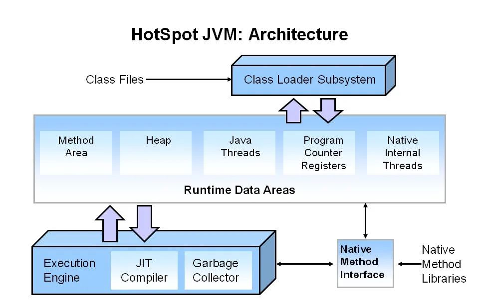

### JVM
1. 原理
1. 重难点
   - 编译、加载、执行原理过程
   - 内存管理
   - GC：Garbage Collection，垃圾回收
1. GC
   - 理解：哪些对象要被回收，什么时候回收，如何回收
   - JVM运行时主要的内存组成
     1. 程序计数器
1. JVM
   - 认识：java虚拟机，用于填平不同平台和操作系统，一套代码，处处运行
   - 一些实现
     1. HotSpot
     1. OpenJ9：最初由 IBM 开发，现在是 Eclipse 基金会的一部分。用于需要快速启动和低内存
     1. GraalVM：高性能
     1. JRockit：用于需要高性能和实时响应的应用程序，如金融服务行业的实时交易系统
1. HotSpot
   - 认识：是JVM的实现，高性能、高效的垃圾回收机制。
   - 特点
     1. 即时编译 JIT
        - 将java字节码动态编译成机器码
        - 会根据程序运行情况识别出热点代码（频繁执行的代码），并对其进行优化编译
     1. 高效的垃圾回收：多种垃圾回收器如Serial、Parallel、CMS、G1、ZGC、Shenandoah
     1. 多平台支持：多操作系统平台
     1. 丰富的诊断工具：如jps、jstack、jmap、jcmd
   - 组成
     1. 类加载器： 加载java类
     1. 运行时数据区：包括方法区、堆、栈、程序计数器寄存器和本地方法栈等，用于存储类信息、对象实例、方法调用栈等数据
     1. 执行引擎：解释器和JIT编译器
     1. 垃圾回收器
1. 注释和空行都会被java编译器忽略
### 函数式编程
1. 分类
   - Guava