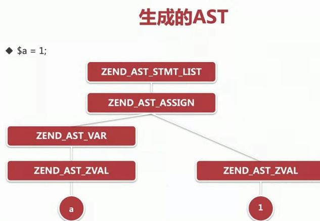
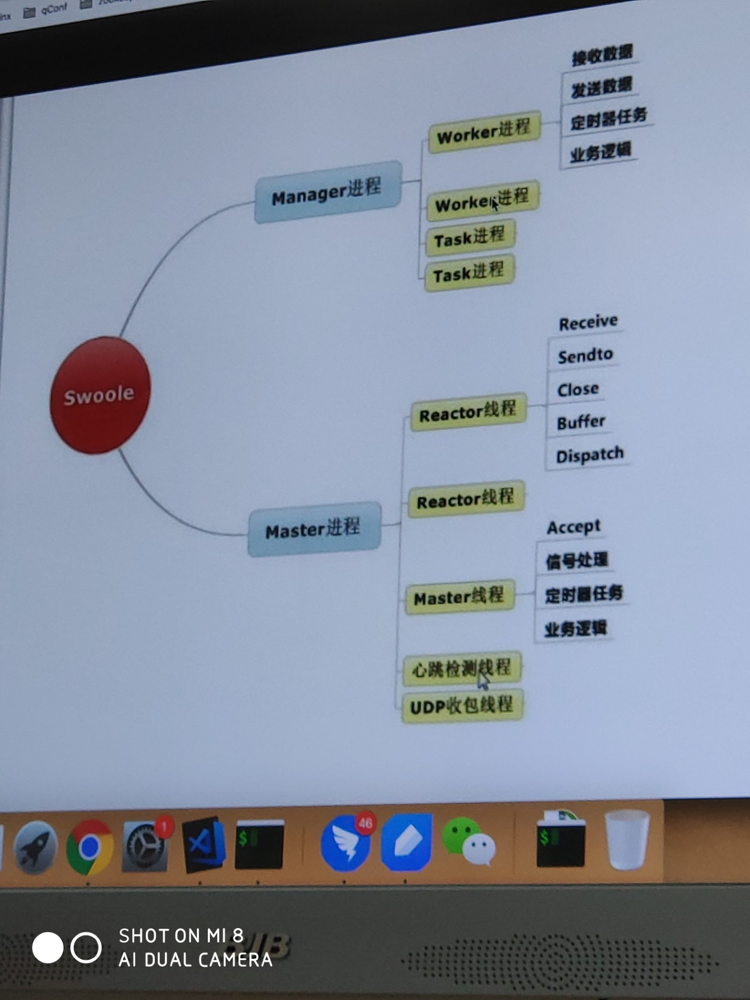

### 底层实现
1. 目录
   - main：框架主要代码，输入输出、框架初始化等
   - sapi：php的应用接口层
     1. 认识：Server Application Programming Interface，服务器端应用编程端口，是php与其它应用交互的接口，是php的接入层，接受请求，然后调用php内核api，严格来说不属于内核。为内部的PHP提供一套固定的, 统一的接口, 使得PHP自身实现能够不受错综复杂的外部环境影响，保持一定的独立性
     1. 组成：cli、cgi、mod_php5(apache)、isapi(iis)、fpm
   - Zend：解析器、执行器
     1. 理解：引擎，核心，负责从编译到执行。zend engine、zend api、zend extension api
     1. 组成
        - 编译器：代码->抽象语法树->opcode，相当于gcc，编译器是一个语言实现的基础
        - 执行器：执行opcode，即执行逻辑
     1. 分类
        - Zend
        - HHVM
   - ext：扩展相关
1. 变量
   - zval：16byte
   - val的结构简单描述下，用type来指示是什么
     1. 要点有直接复制和写时复制，简单类型直接复制，复杂的用写时复制
   - 类型，不同类型的特点
     1. 索引数组是哪个？
     1. string的二进制安全和结构
     1. array，组织形式和结构
        - 组成
          1. bucket和索引数组的分类形式，拉链法、头插法，后来的往前边插入，
          1. packed array和hash array的认识，是否需要需要建立散列关系，packed前边的索引数组只保留2位且不需要hash运算能省内存，packed的退化(key较大或者间隔大)
        - 索引数组
          1. gc
          1. u
          1. nTableMask
          1. *arData
          1. nNumUsed
          1. nNextFreeElement
          1. pDestructor
        - bucket数组：重复就采用链表
          1. 0~7
          1. -1~-8
     1. 引用类型
        - 循环引用：使用&后，两个都是引用类型，指向了那谁，自己引用自己，引用计数还是1，产生死亡拥抱，产生了垃圾
1. 内存管理描述下
   - 文件
     1. zend_alloc_sizes.h
     1. zend_alloc.c
     1. zend_alloc.h
   - 组成
     1. small、page、chunk
     1. alloc_globals：全局变量
        - mm_heap
          1. size：已经使用大小
          1. pick：历史使用峰值
          1. free_solt：存小块内存
          1. huge_list：挂huge
          1. main_chunk：第一个的chunk
   - chunk
     1. 认识
     1. 组成
        - chunk首地址：高43，低21全是0
     1. 函数
        - zend_mm_chunk_alloc_int
     1. 特性
        - 2M对齐：通过申请4m-4k拿到对齐的2m首地址，然后释放掉两边的内存并移动指针
   - small
     1. ZEND_MM_BINS_INFO：不同大小对应的数量
   - 方法
     1. _emalloc
     1. _efree
   - 背景
     1. 内存已内存页管理，一定是4k的整数倍
1. 内存管理
   - 内存分配
     1. 概念
        - chunk：2M大小，仓库
        - page：4kb，面粉袋
     1. 理解：将1个page分成512个，要一个给一个，用链表管理，因为内存回收时无顺序，用回插法。是页管理的，是4k的整数倍，为了更好的管理，给php进程都进行内存分配
        - 减少malloc次数
        - 给我任意大小都知道放哪儿
     1. 流程
        - emalloc 分配
        - zend_mm_alloc_heap
        - size大小，人为划分，直接卖面包，没有了就用一整袋面(page)做很多面包出来
          1. 小于3072 3k：zend_mm_alloc_small、zend_mm_small_slow
          1. 小于2M-4k：zend_mm_alloc_large、zend_mm_small_pages
          1. 大于2M-4k：zend_mm_alloc_huge、zend_mm_chunk_alloc、mmap
   - 内存对齐
   - 内存回收
   - 内存类型标记
   - wiki
     1. 内存规格
        - 内存预分配：
          1. 分类
             - small
             - large
     1. 缺陷
        - 内核态和用户态的切换，很大的浪费
     1. php7内存接口
1. 垃圾回收
   - 认识：解决引用回收的缺陷，因为只记录了次数，没有记录引用的地址
     1. 引用计数
     1. 循环引用
   - 四色法
     1. 标成紫色放到垃圾桶（默认10000），标记后不会再次放入
     1. 垃圾桶满时，触发回收，触发gc
     1. 遍历垃圾桶，标记为灰色，同时引用计数减1
     1. 再一次遍历，都是0的标记为白色，回收，大于0的标记为黑色返回
1. 生命周期
   - 认识：记录下，每个生命周期的异同，都完成了哪些
1. 代码解析
   - 认识：是实时编译的，最终生成opcode。之前直接生成opcode，php7新增词法分析后生成ast
   - 过程
     1. 词法分析
        - 认识：将代码看作长字符串，用正则匹配，找出所有的词块(token)，用zval存储，如变量、表达式、函数等类型，后缀.l
        - 方法
          1. NFA，不确定有穷自动机。自动机就是遇到输入是否进行下一个状态切换，有一个最终状态，是穷举所有的可能
          1. DFA，确定有穷自动机，每一个输入都有确定的下一个状态的迁移,NFA没有
        - 实现：编写正则表达式来定义词法规则，用re2c生成c语言方式的DFA，`/*!re2c xxxxxx */`
        - php7表现
          1. 用全局变量scanner_globals存文件指针位置，进行词法分析
     1. 语法分析
        - 认识：建立关系、确定token如何彼此关联，会生成语法树。将语法写成巴科斯范式，然后利用bison生成状态机，bsion后缀.y
        - php7表现
          1. 语法分析后create生成zend_ast_*，如list/zval/decl
     1. `$a=1`的ast：
   - 流程
     1. zend_execute_scripts()
     1. compile_file()
     1. znedparse()：语法解析函数yyparse()，生成ast
     1. zend_compile_top_stmt()：生成opcode
     1. pass_two()
     1. zend_execute()
   - 特征
     1. 二者都要生成c文件
     1. 语法相关的在zend_language_*，词法scanner，语法parser
1. 代码编译
   - 认识：从ast到opcode
   - opcode
     1. 认识：就是一个个的zend虚拟机具体执行命令的，结构体类似汇编，有指令集，符号表，堆栈
        - hander是提前定义好的c函数
     1. opcode：字节码/虚拟指令，然后Zend解析引擎逐条执行
     1. 结构：zend_op、zend_op_array、zend_execute_data、zend_vm_stack
1. 代码执行
   - 认识：zend虚拟机 + opcode才能在物理机运行，三层，虚拟机只包含中间数据层和执行层，执行就是zend虚拟机把全局的execute_global中的oplines，包含op1和op2取出来通过hander计算放到result中
   - zend虚拟机
     1. 解释层：词法分析+语法分析 -> AST -> 编译器
     1. 中间数据层：执行栈、opline指令、符号表
     1. 执行层：执行引擎
1. 问题
   - 词法语法解析的过程还是不懂
   - re2c生成的DFA怎么用于bison？二者同时进行又是怎么进行的？
   - ast怎么编译为opcode的？
   - opcode是怎么执行的？
1. wiki
   - HHVM提升性能方式：替代Zend引擎将php代码转换成中间字节码(HHVM自己的，通常称为中间语言)，然后运行时通过JIT编译器将字节码转换成机器码，类似于Java的JVM。为了达到最佳优化效果，需要将PHP的变量类型固定下来，而不是让编译器去猜测，Facebook的工程师们就定义一种Hack写法，进而达到编译器优化
   - 内存对齐：存取速度会更快
   - 写时复制：只用一份，需要改的时候再独立复制一份
### 扩展
1. 扩展开发
   - 理解：C/C++基础，同时需要熟悉php扩展api，要用到PHP自身定义的函数和宏
   - 扩展编译分动态编译和静态编译
     1. 动态：phpize、configure
   - ext_skel快速开发工具
   - 开发
     1. config.m4：PHP_ARG_WITH、PHP_ARG_ENABLE
     1. php_xx.h、xx.c
1. POSIX：提供了在POSIX中定义的函数的接口，如posix_kill，posix_access
1. php5和php7的扩展大部分都不一样了
### swoole
1. 组成
   - 目录：头文件include，.cc是c++文件，swoole_server.cc是php相关的，是所有的入口
   - 结构：两部分，core是swoole的核心，不依赖php，可以编译为.so文件，是基于c++的
‌编译sw源代码：cmake gcc ldd nm ldconfig strace   uname -a
‌abi：.h描述内存布局，.a静态库，.so，这是c体系，二进制调用，nm对应的符号即指针，去指示链接的过程，可能是动态的，完成函数的调用
‌头文件可以任意地址
‌service.c：service这个结构体在栈上
‌init方法开始，先设置默认值，初始化cpu核数等
‌create：创建进程模式，线程模式，资源的申请，创建管道，
‌service可以挂很多端口，tcp udp sock，用于挂ipv6，ssl等6种，用add_port方法，最多65536
‌挂回调，7个
‌start，启动了
‌gcc test_server.c -lswoole -I../include -L指定lib绝对路径，这时候头文件不一致了，好乱啊，设置的so和指定的不一样
‌工作进程，master进程，
‌核心lib/swoole.so，跟php没有关系，
‌写tcp用swoole，链接so，复制头文件，
‌协程使用libco
‌模式：base模式，单线程不一定单进程，accept receive close一个线程，一个线程只能一个核，如只能核数分之一，fork可变多进程，但是只监听一个端口，和node，nginx相同，有惊群问题，异步的进程，阻塞在epoll wait上，一个连接到来无法解决惊群，epoll进程都唤醒，高版本可只唤醒一个进程，进程唤醒开销4微秒，fpm不存在这个问题，操作系统只唤醒一个，老系统2.6以下不行
‌process模式，即代理模式，manager负责进程管理，和fpm相似，发生core dump，php fatalerror，oom只有这三种，manager得到退出信号启动新的。master监听端口、accept，fd取模分给reator线程，生命周期为receive、send、close。reator线程最大2M投递dispatch给worker进程，是一个完整的包，每个进程有4个内存地址，一次投递全放进来，一个worker和reator数据一定是串行的，保证数据正确性，得到结果返回给reator，由reatorsend。多路进程：每个worker进程有双向unix socket管道和reator交互，他们多对多的关系，从而实现并发处理。多线程的话每个工作线程一个内存队列，由于php多进程，完全无锁多个管道不停数据。所有线程和进程都是在epoll wait的状态
process.c：创建manager和worker进程，用pthread创建reator线程，然后在epoll wait循环，她们全是异步的，基于reator模型，add后wait，在回调中处理，wait不停接受事件，接收完继续接受。
master线程也是reator模式，也在epoll wait状态，和reator线程在一个进程中。master线程添加了监听端口listen_list、定时器swTime_add、等事件，设置SW_FD_LISTEN给swServer_回调方法，master线程通过epoll wait给到reator，fd取模线程数的给到方式。reator有自己epoll队列，master线程accept以后产生 new fd，即最新连接，取模，为什么监听可写事件？可写缓冲区可写的话一定可写，可读在可写前，add是master添加的，先拿ctl，就是wait中可读可写切换，有连接以后不发包如恶意客户。可读用于pipe满处理慢，是否可读。可写事件一步一步触发，如2M就200k的一点点写，状态一直切换，然后等。缓冲区为空去掉可写状态
水位控制：即缓冲区不足，一种多出来的直接丢弃，一种扩大占用内存
unix socket：为出和入，多路管道不能用stream因为数据没边界，用dgram，
linux 3.1新增 重用端口，4个进程都用相同端口sock，reuse port，内核线程是串行的
http：连接握手 syn包，发，收，发ack，服务端放到backlog，之后再accept。发data，然后服务端onread，给worker然后onwrite，返回数据
ipv4的udp一次最多发64k，dgram最大2M
重点在理解，知道原理，协调好东西

1. 其他
   - 24核，4个网卡队列，4个核处理网卡中断，网卡处理不及时就会丢包，将24个核都平均都处理网卡中断，最大化减少丢包
   - server.h和.c是一个库，是开放的
   - master.cc是master进程的主文件，
   - 守护进程就是fork两次，然后让主进程退出，即父进程的进程id为1
   - 一些结构体，用位存储，节省内存
   - 用session取代fd，避免fd高度重用从而导致错误发送的问题，各种措施保证fd不被释放，
   - 连接关闭碰撞：客户端主动关闭，服务费关闭，双端关闭会产生冲突
   - 上节课是进程的通信，用的管道，
   - 这节课是通信的细节，协议的实现，结合man查看使用方法，协议中数据流的传输
   - socket有六种。新的连接放到reator_thread的事件循环中，socket_create方法，是异步的，然后reator_add添加到epoll中，调用epoll_wait，从listen队列中取出来，加到epoll的事件监听中
   - 四种消耗之一的系统调用消耗很大，内存拷贝，进程切换，锁（碰撞就进程切换）
### 调优
1. 优化方式
   - 语言本身
     1. 配置
        - php.ini：memory_limit、session.save_handler、output_buffering
        - php-fpm：动态和静态的子进程管理，平衡cpu和内存
   - 架构
     1. 部署环境：nginx+php-fpm方式
     1. 框架选择
     1. 缓存
        - 程序层面的文件静态和优化比底层来的更有效、直接
        - 开启opcode缓存：避免重复编译，如APC、xcache
        - 本地缓存：如用xcache缓存元数据，不用每次读文件
     1. 外部
        - nginx开启gzip压缩
   - 编码
     1. 文件加载：一个文件操作胜过优化N个CPU指令
     1. 提前销毁大变量
     1. 避免使用魔术方法耗性能
     1. requiere_once耗性能
     1. 少用正则
     1. 不要用@符掩盖错误
     1. 单引号代替双引号
1. 工具
   - xdebug
   - tideways
   - xhprof
     1. 认识：php的层次性能分析工具，查看资源占用和各个调用的耗时，搭配graphviz图显示更直接，还有xhGui。facebook开源，性能开销低，可用在生产活动中
        - graphviz：开源的图形可视化软件，以简单的文本语言获取图形的描述，应用于网页、svg、pdf、postscript中，有颜色，字体，表格节点布局，线条样式，超链接和自定义形状的选项
     1. 使用
        ```php
        // 抓取
        xhprof_enable(XHPROF_FLAGS_NO_BUILTINS | XHPROF_FLAGS_CPU | XHPROF_FLAGS_MEMORY);
        // --业务代码--
        $xhprof_data = xhprof_disable();

        // 获取此次分析id
        include_once "/usr/share/pear/xhprof_lib/utils/xhprof_lib.php";
        include_once "/usr/share/pear/xhprof_lib/utils/xhprof_runs.php";
        $xhprof_runs = new XHProfRuns_Default();
        $run_id = $xhprof_runs->save_run($xhprof_data, "dengling");

        // 查看生成报告，nginx指向xhprof的目录
        http://xhprof.xesv5.com/index.php?run=604994b1e56a4&source=dengling
        ```
     1. 字段含义
        - microsec：微秒
        - Calls：方法被调用的次数
        - Incl.Wall Time：方法执行花费的时间，包括子方法执行时间
        - IWall%：方法执行花费的时间百分比
        - Excl. Wall Time(microsec)：方法本身执行花费的时间，不包括子方法
        - Incl. CPU(microsecs)：方法执行花费的CPU时间，包括子方法
     1. 配置
        ```conf
        [xhprof]
        extension=xhprof.so;
        xhprof.output_dir=/tmp/xhprof           // 分析文件生成地址
        ```
1. 性能检测
    ```php
    ini_set('memory_limit', "1024M");
    set_time_limit(0);
    echo microtime() . PHP_EOL;
    echo microtime() . PHP_EOL;
    echo memory_get_usage() . PHP_EOL;
    ```
1. 发挥PHP7的性能
   - 开启Opcache
     1. zend_extension=opcache.so
     1. opcache.enable=1
     1. opcache.enable_cli=1
   - 使用GCC 4.8以上进行编译
   - 开启HugePage （根据系统内存决定）：操作系统默认的内存是以4KB分页的，而虚拟地址和内存地址需要转换，而这个转换要查表，CPU为了加速这个查表过程会内建TLB(Translation Lookaside Buffer)。 显然，如果虚拟页越小，表里的条目数也就越多，而TLB大小是有限的，条目数越多TLB的Cache Miss也就会越高，所以如果我们能启用大内存页就能间接降低这个TLB Cache Miss。php将采用大内存页来保存，减少TLB miss，提高性能
   - PGO：Profile Guided Optimization，第一次编译成功后，用项目代码去训练PHP，会产生一些profile信息，最后根据这些信息第二次gcc编译PHP就可以得到量身定做的PHP7
1. php7性能优化：使用Zend Engine 3.0，ZEND引擎升级到Zend Engine 3，也就是所谓的PHP NG，重写了ZendVM
   - 标量类型声明：为了v7.1的jit特性做准备，因为jit有了准确的变量类型，可以生成最佳的机器指令
   - zval使用栈内存：ZVAL结构的重构，一个php变量就是一个zval指针，之前是动态从堆上分配，php7直接使用栈内存
   - zend_string存储hash值，array查询不再需要重复计算hash
   - hashtable桶内直接存数据，减少了内存申请次数，提升了cache命中率和内存访问速度
   - zend_parse_parameters改为宏实现，性能提升5%
   - 新增4种opcode，call_user_function，defined等函数变为OpCode指令，速度更快
   - int、float改为直接进行值拷贝
   - AST：Abstract Syntax Tree, 抽象语法树，在编译过程中作为中间件，替换原来直接从解释器吐出opcode的方式，让解释器(parser)和编译器(compliler)解耦, 可以减少一些Hack代码, 同时, 让实现更容易理解和可维护
     1. PHP5 : PHP代码 -> Parser语法解析 -> OPCODE -> 执行
     1. PHP7 : PHP代码 -> Parser语法解析 -> AST -> OPCODE -> 执行
   - 数组php5的底层是HashTable实现的，php7使用了新的Zend Array类型，性能和访问速度上都有了大幅度提升
   - https://www.csdn.net/article/2015-09-16/2825720   