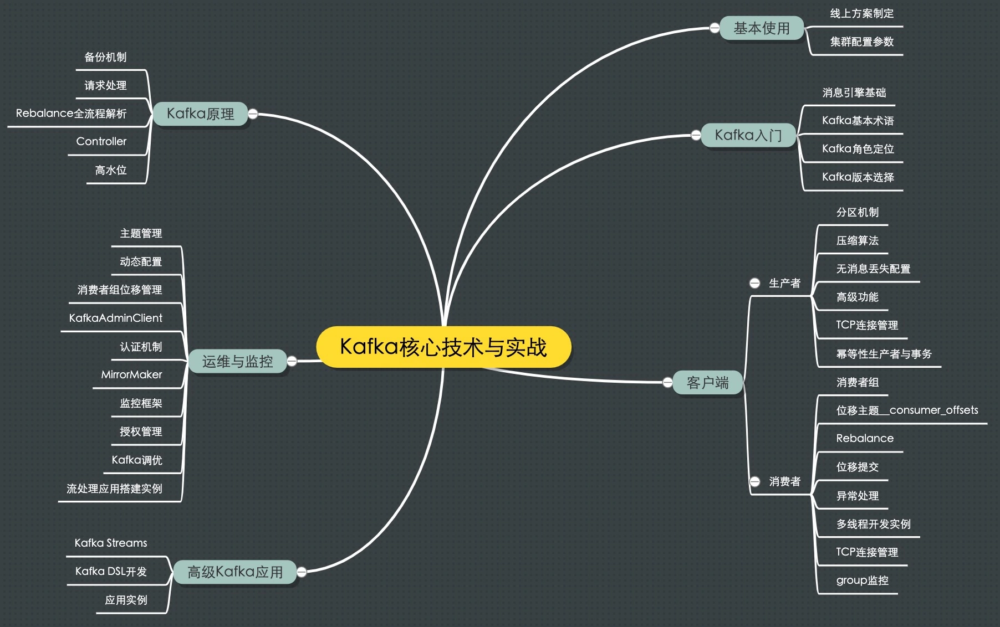
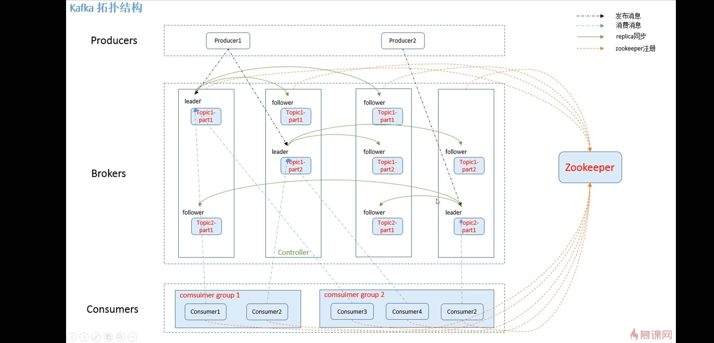
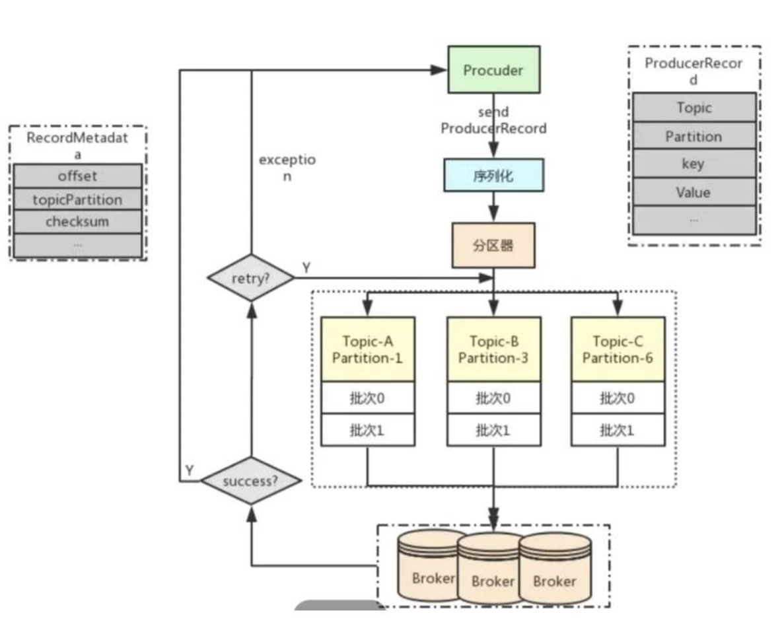
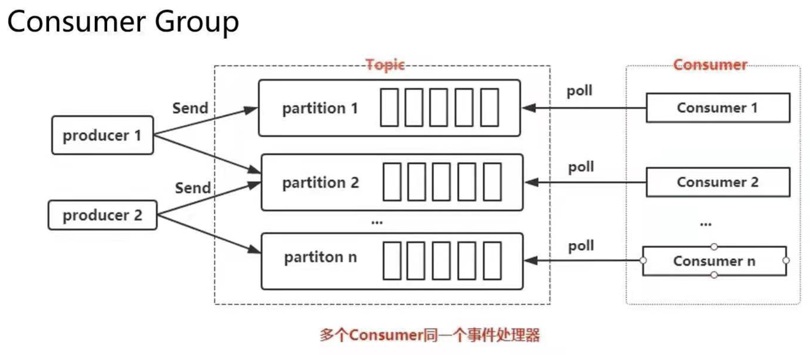
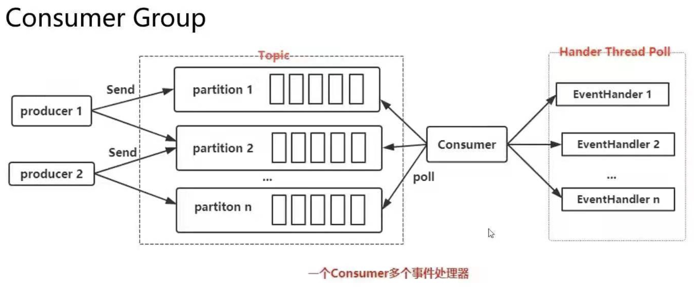
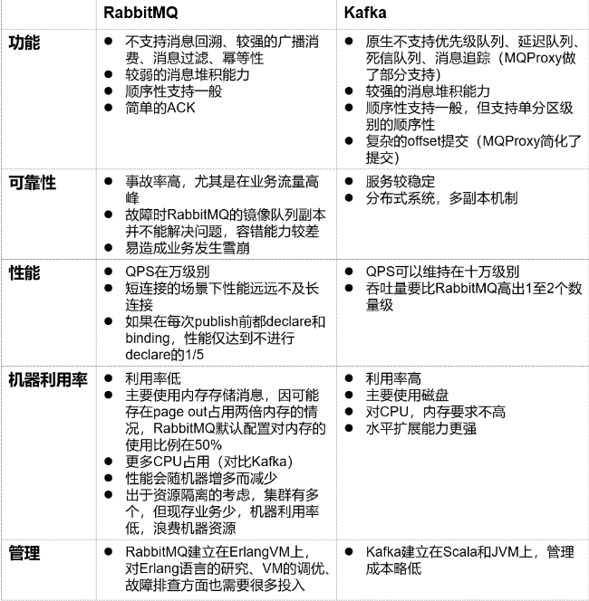
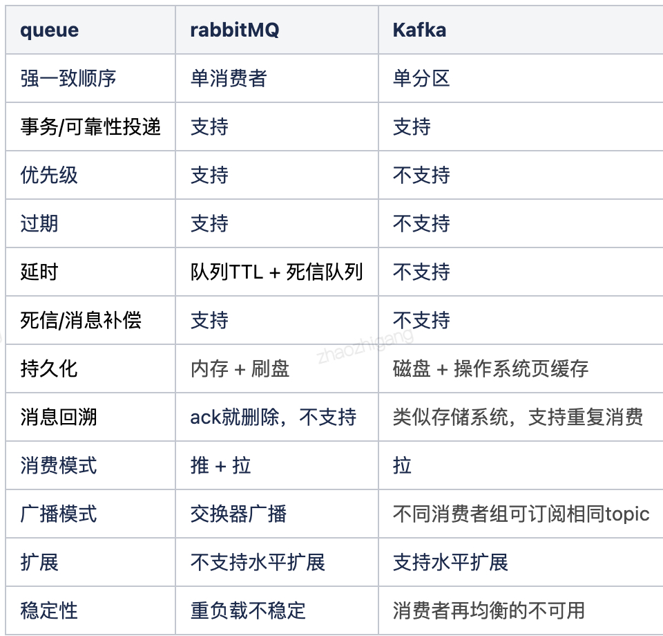

### 认识
1. 认识：高吞吐量、高负载量的分布式流处理平台和消息系统，
   - 高性能：高吞吐量/高并发/低延迟/时间复杂度O(1)，单机写入TPS约在100万条/秒，消息大小10个字节
   - 高可用：数据快速持久化、故障转移
   - 分布式：基于zk原生支持集群的水平热扩展、集群容错、消息自动平衡
1. 理解
   - 0.10之前Kafka社区将其清晰地定位为一个分布式、分区化且带备份功能的提交日志(Commit Log)服务，设计之初的目标
     1. 提供一套API实现生产者和消费者
     1. 降低网络传输和磁盘存储开销
     1. 实现高伸缩性架构
   - kafka被越来越多的公司应用到它们企业内部的数据管道中，特别是在大数据工程领域，Kafka在承接上下游、串联数据流管道方面发挥了重要的作用，所有的数据几乎都要从一个系统流入Kafka然后再流向下游的另一个系统中
   - 这样的使用方式屡见不鲜以至于引发了Kafka社区的思考:与其我把数据从一个系统传递到下一个系统中做处理，我为何不自己实现一套流处理框架呢?基于这个考量Kafka社区于0.10.0.0版本正式推出了流处理组件Kafka Streams，也正是从这个版本开始，Kafka正式“变身”为分布式的流处理平台，而不仅仅是消息引擎系统了
     1. 主:消息引擎，辅:流处理
   - 有人甚至把Kafka当作分布式持久化存储来用
1. 特点
   - 适用
     1. 消息实时传输：消息系统、用户活动跟踪
     1. 在线和离线分析：大数据日志收集处理
     1. 流式数据处理：能构建实时的流数据处理程序来处理数据流，大数据时代数据管道技术首选
   - 缺点
     1. 严格的顺序机制，不支持标准的消息协议，不支持消息优先级
1. 功能
   - 发布/订阅：消息系统，使用推拉模式
   - 提供offset管理，支持消息堆积，可查看历史数据，零消息丢失和高效的一致性处理
   - 内置流处理：连接、聚合、过滤器、转换
   - 实时事件响应
   - 支持数据批量发送拉取
   - 自己的二进制消息传输协议，消息压缩传输：消费者获取，镜像数据传输
   - 集群镜像：提供官方工具同步并重新发布消息
1. 组成
   - 消息：Record。是kafka消息引擎的处理对象
   - 主题：Topic。主题是承载消息的逻辑容器，在实际使用中多用来区分具体的业务
   - 分区：Partition。一个有序不变的消息序列。每个主题下可以有多个分区
   - 消息位移：Offset。表示分区中每条消息的位置信息，是一个单调递增且不变的值
   - 副本：Replica。Kafka中同一条消息被拷贝到多个地方以提供数据冗余。分为领导者副本和追随者副本，各自有不同的角色划分。副本是 在分区层级下的，即每个分区可配置多个副本实现高可用

   - 生产者：Producer。向主题发布新消息的应用程序
   - 消费者：Consumer。从主题订阅新消息的应用程序
     1. 消费者位移：Consumer Offset。表征消费者消费进度，每个消费者都有自己的消费者位移
   - 消费者组：Consumer Group。多个消费者实例共同组成的一个组，同时消费多个分区 以实现高吞吐
     1. 重平衡：Rebalance。消费者组内某个消费者实例挂掉后，其他消费者实例自动重新分配订阅主题分区的过程。Rebalance 是 Kafka 消费者端实现高可用的重要手段
1. 设计：topic --> partition --> replica --> segment --> message
   - 多分区、多副本，消息自动平衡，快速持久化、容错性
   - 支持同步和异步复制：副本模式
     1. 同步：生产者从zk找到leader，发布消息后存入leader的log中，follow使用一个channel来pull消息，写入自己log后发送确认消息，收到所有follow的确认消息才给生产者发送ack
     1. 异步：写入log后立即发送确认信息，无法保证broker故障时的消息分发
   - 基于zk调度，进行服务协调管理
1. 原理
   - kafka的模型是几个分区几个消费者，这样相应消费者多，就会分区多，从而加大生产者的延时
### 组成
#### 结构
1. topic
   - 认识：主题，逻辑概念，用于存储、区分消息，在broker上
     1. 紧凑的二进制字节数组，避免了java繁重的堆上内存分配
   - 组成
     1. 名称
     1. 分区数：建议为3，数据分布更均衡
     1. 副本：选择n个副本时，最多允许有(n-1)台broker宕机
        - 不完全副本选举
          1. 开启：可用性优先
          1. 不开启：可靠性优先
     1. 消息
        - 最大字节数：最大10MB
        - topic维度的消息保留时间
     1. 消息版本号：0.11之前不推荐使用
     1. 最少ISR
        - 1：可用性优先
        - 2：可靠性优先
     1. 节点选取
1. message
   - 组成
     1. key：消息键，决定放到哪个partition
        - 有key：按照key进行哈希，相同key去一个partition
        - 无key：round-robin来选partition
     1. batch：分批发送
     1. schema：消息编码方式
   - 属性
     1. 自动删除时间
     1. 消费超时时间
     1. 最大重试次数：重新投递给业务方的最大重试次数，业务方消费消息的时间超过"消费超时时间"时，消息会判断消费失败，
     1. QOS：并发回调个数
1. partition
   - 认识：分区，有序的数据存储基本单元，一个topic分为n个有序号的partition，提供负载均衡的高伸缩性能力
     1. 只能追加写，避免了缓慢的随机io操作
     1. 使用日志段Log Segment机制，总是写最新的segment，每个消息有一个位移，单partition消息有序，全局不是
     1. kafka中叫分区，在mongodb和elasticsearch中叫分片shard，hbase中叫region，cassandra中叫vnode
     1. offset：偏移量，递增的整数值。既可表示固定不变的消息的位置Offset，也能表示可能随时变化的消费者消费到的位置Consumer Offset
   - 索引
     1. 认识：为减少索引文件大小方便直接加载进内存，索引使用稀疏矩阵，每隔一定的字节数再建立一条索引
     1. 组成
        - baseOffset：对应segment文件中的第几条message。方便使用数值压缩算法节省空间。如varint
        - position：在segment中的绝对位置
   - 压缩类型：zstd、lz4、snappy、gzip、生产者决定
   - 分区策略
     1. 轮询：round-robin
        - 将n个broker和待分配的partition排序
        - 将第i个partition分配到第(i mod n)个leader broker上
        - 将第i个partition的第j个replica分配到第((i+j) mode n)个broker上
     1. 随机：如果追求数据均匀分布使用轮询策略比随机好
     1. 自定义消息键：对标志位设定专门的分区策略，保证同一标志位的所有消息都发送到同一分区，可实现顺序发送
        - 更加合适的做法是把标志位数据提取出来统一放到key中，这样更加符合kafka的设计思想
     1. 其他：如根据ip地址
     1. 自定义
   - 重分配：partition reassign：发生在分区数变化，或分区更改到其他broker
1. replica
   - 认识：副本，partition的复制，防止数据丢失
     1. 一个partition可多个replica，每个都可能成为leader
     1. 主失效立即再选举，从挂掉/卡住/同步太慢会被删除再创建一个
     1. 同一个partition的多个replica不会在一个节点上
   - 组成
    1. leader：首领replica，同一个topic只有一个
        - 接受生产消费请求
        - 明确同步的follower
    1. prefer leader：首选首领，即希望成为leader的partition
        - 如果设置自动leader平衡，那么首选首领不是当前首领时会自动触发选举
    1. follower：主要用于备份消息
        - 从leader复制数据，可以有多个
1. api
   - admin
     1. 查看topic列表、属性等
   - producer
     1. high level api：替我们把很多事情都干了，offset，路由啥都替我们干了，用以来很简单
     1. simple api：offset啥的都是要我们自己记录
   - consumer
   - stream processor：高效将输入流转换到输出流
   - connector
#### 角色
1. 角色：
   - cluster
     1. 认识：集群，很多台机器组成
        - 天然支持集群，没有单节点说法，一台也是集群，通过brokerId区分不同节点
        - 依赖zk进行协调，连接同一个zk就是同一个集群
     1. 组成
        - controller：执行者，活跃broker中选举，负责partition在broker的分配、leader的选举、broker监控，在zk的/brokers/ids节点上注册watch
   - leader
     1. 选举
        - unclean leader election：不完全首领选举，允许不同步的副本成为首领，提高可用性，增加丢消息的风险
        - 过程
          1. 没有采用多数投票来选举，首先通过抢注zookeeper的/controller+epoch机制竞争leader
          1. 当controller发现有broker离开集群，在ISR中选择速度比较快的作为leader，谁先接收到算谁
          1. 随后新leader开始接受生产消费请求，follower从leader复制数据
     1. 容灾
        - broker宕机后，controller从zk的/brokers/topics/[topic]/partitions/[partition]/state中，读取ISR（in-sync replica已同步的副本）列表，选一个出来做leader
   - broker
     1. 认识：kafka集群的部署节点
        - 对消息集群内分区部署平衡，partition会平均分布在节点中，自己有协调机制
        - 访问任意一个broker都可以完成请求，因为有数据同步机制
     1. 组成
        - replicaManager：管理当前节点所有分区和副本
        - temporary node：临时节点，其他broker订阅zk的临时节点从而知道有broker宕机
     1. 容灾
        - 认识
          1. 不会因为节点故障丢失数据
          1. kafka的语义担保也能很大程度避免数据丢失
          1. 会对消息进行reblance，减少节点消息热度太高
        - 判定标准：心跳未保持、消息落后leader太多
        - 动作：移除
   - client
     1. metadata request：元数据请求，客户端可向任意broker获取topic的分区/副本/leader。客户端会缓存信息并定时刷新，客户端会直接发送请求到leader
1. producer
   - 认识：
     1. thread safe：线程安全，生产者是线程安全，消费者不是线程安全的
   - 生产请求：produce request
     1. 先验证是否有权限写入
     1. 其次看返回值acks=0、1、all，以便消息成功接收
   - 压缩消息
     1. 认识：时间换空间的trade-off思想，producer端压缩、broker端保持、consumer端解压缩
   - 幂等生产
     1. 认识：根据一些额外的字段自动做消息去重，只支持单分区幂等、不支持跨会话。`props.put(“enable.idempotence”, ture)`
     1. 原理
        - 为每个producer分配一个唯一标识pid，producer为每一个partition维护一个单调递增的seq
        - 当req_seq == broker_seq+1时，broker才会接受该消息，大了还没写入，小了已经写入了
   - 事务生产
     1. 认识：跨多分区的原子性写入，同时保证consumer只能看到事务成功提交的和非事务型的消息，不怕kafka重启，隔离级别为read_committed
     1. 方法
        - initTransactions
        - beginTransaction
        - sendOffsets
        - commitTransaction
        - abortTransaction
     1. demo
        ```java
        producer.initTransactions();
        try {
            producer.beginTransaction();
            producer.send(record1);
            producer.send(record2);
            producer.commitTransaction();
        } catch (KafkaException e) {
            producer.abortTransaction();
        }
        ```
     1. 开启
        - `enable.idempotence = true`
        - `transctional.id = xxx`：可以设置个有意义的值
   - 发送方式
     1. 异步发送：不关心是否成功，速度最快，fire and forget，`producer.send(msg)`
        - 到没到kafka都不一定
     1. 异步回调发送：使用回调函数保证消息一定收到，` producer.send(msg, callback)`
     1. 异步阻塞发送
     1. 同步发送：等待返回发送后的结果
     1. 批量发送：积攒一批然后一起发送
1. consumer group
   - 认识：多消费者组成组来消费一组主题，可扩展且具有容错性的消费者机制，同时可控制读写等权限，
     1. 传统队列点对点多个消费者会抢，造成性能浪费；传统发布订阅方式伸缩性不足(要订阅所有分区)，二者提取各自优点就是消费者组
     1. 规定一个partition只能由组中某一个消费者消费，因为否则需加锁影响性能
   - 特性
     1. 可以绑定多个topic，某memberID绑定有对应partition的最大的、未消费的offset位置
     1. 一个partition只能由组中某一个消费者消费，单个消费者可以消费多个partition
   - 功能
     1. group id
     1. consume request：消费请求，broker会缓冲一些消息直到达到数量或时间，以此提高性能
     1. poll：轮询，消费者请求数据、心跳发送、rebalance的行为
     1. 均衡算法
        - sticky
        - roundrobin
        - range
     1. consume限流，怕把consume流量高打死，用令牌桶方式
     1. commit：手动控制offset位置
        - 分类
          1. commitSync：同步提交
          1. commitAsync：异步提交，不会阻塞立即返回，不能重试
        - 应用场景
          1. 指定开始位置
          1. 消费失败，需要重复消费
        - 最佳实践
            ```java
            try{
                while (true) {
                    ConsumerRecords<String, String> records = consumer.poll(Duration.ofSeconds(1));
                    process(records);                                                                   // 处理消息
                    commitAysnc();                                                                      // 使用异步提交规避阻塞
                }
            } catch (Exception e) {
                handle(e); // 处理异常
            } finally {
                try {
                    consumer.commitSync();                                                              // 最后一次提交使用同步阻塞式提交
                } finally {
                    consumer.close();
                }
            }
            ```
     1. auto commit：每过一定周期自动提交poll下来的最大偏移量
   - 实现
     1. 概念
        - partition ownership：拥有分区所有权的消费者
        - consumer heartbeat：消费者心跳，用于维持与群组的关系和分区的所有权
          1. 心跳也会在poll或者commit offset时发送的
        - consumer reblance
          1. 认识：消费者再均衡，组内发生分区所有权转移，规定消费者如何达成一致，臭名昭著，造成很多bug
             - 带来了消费者的高可用性和可伸缩性
             - 发生时所有消费者都参与、且停止消费
             - 发生后消费者当前读取状态会丢失，可能需要刷新缓存
             - 只会在poll操作中发生
          1. 分配策略：3种
          1. 发生条件
             - 组员数变更：消费者加入/离组/崩溃/提交位移
             - topic数量变化
             - partition数量变化
          1. 配置
             - max.poll.interval.ms：设置稍长的消费时间
             -  session.timeout.ms = 6s、heartbeat.interval.ms = 2s：心跳快一些
        - lag：消费者延迟，消费者位置与最新的offset之间的距离
     1. 组成
        - group coordinator：群组协调器，也是某个broker，负责接收消费者的心跳，传递由群主发来的分区分配信息到其他消费者
        - group manager：群主
          1. 消费者要加入群组时，会向群组协调器发送joinGroup请求，第一个加入的成为群主
          1. 群主从协调器拿到消费者列表并为其他消费者分配分区，之后传递给协调器，协调器再发送所有权关系到相应的消费者，所以只有群主知道所有消费者的分区分配信息。rebalance时这个过程会重复发生
        - rebalance listener：再均衡监听器，发生时可让某些消费者失去分区的所有权之前，做一些提交或清理工作
          1. 有两个钩子，再均衡之前、重分配之后
   - 最佳实践
     1. consume数量和partation数量相同，性能最好，否则存在分配的开销
     1. 消费者数量和partation相等或者是其2倍，多了没活干歇着浪费，少了性能不行
1. client
   - 拦截器
     1. 认识：支持链的方式，类似gin的middleware
     1. 分类
        - 生产者拦截器：发送消息前 onSend、消息提交成功后 onAcknowledgement
        - 消费者拦截器：消费消息前、提交位移后
#### 机制
1. Log Compaction
   - 认识：日志压缩，提供保留键名key最新版本的机制，可以删除更早的、重复的记录
1. LSO
   - 认识：Log Stable Offset，消息的稳定offset，消息在LSO之前被认为是不可变的，不会被任何未决的事务更改，即提供了一个安全点，用于日志的清理和压缩操作，同时为处理事务提供稳定的基准
     1. 有助于Kafka管理存储空间，并确保在处理消费者读取请求时的一致性和持久性
   - 作用
     1. 可以被副本同步和日志清理器（日志压缩器）读取与处理，即支持了日志压缩的实现
     1. 事务依靠LSO来判断事务型消费者的可见性
1. LEO
   - 认识：Log End Offset 日志的末端位移，是此分区中下一个将要写入的消息的偏移量
     1. leader副本所在的broker上还保存了其他follower副本的leo值
1. ISR
   - 认识：in-sync replica，同步的replica，集合里的才能选为主
     1. leader检测follower的偏移量，滞后一定程度时踢出ISR，追上再加回，自动的
     1. 集合中所有replica都收到消息才会置为已提交
     1. kafka的信息交付承诺：在ISR存活的条件下已提交信息不会丢失
   - 配置
     1. min insync replicas：最少同步replica
1. 多副本同步
   - 认识
     1. follower同步leader拉取数据，replica通过fetcher去同步
   - 概念
     1. high watermark：高水位机制，既是消费者能看到的最大消息offset，也用于异步的副本同步
        - 高水位以下是已提交消息，反之未提交；分区的高水位就是其leader副本的高水位
     1. low watermark
   - leader epoch机制：为了弥补高水位机制的一些缺陷，v0.11
#### 流式计算
1. 认识
   - 流处理平台：对比批处理，即处理源源不断数据，由于精确一次处理语义(Exactly Once Semantics，EOS)的状态流转和控制不好把握(如状态回滚、消息重复)，造成结果精确性不足，而批处理能实现精确结果
     1. 结合二者，利用流处理快速地给出不那么精确的结果，另一方面批处理最终实现数据一致性
     1. 流处理既包含真正的实时流处理，也包含微批化，即重复地执行批处理引擎来实现对无限数据集的处理，如Spark Streaming
     1. Flink v1.4实现了端到端的EOS，基于2PC实现分布式事务，kafka streams本来和kafka紧密相连天然支持端到端的EOS
   - connect连接各种数据源，stream做流式处理
   - kafka不是一整套流式处理解决方案或平台，只算一个组件，自身没有调度和资源管理器类的东西
1. 开发
   - 组成：流处理逻辑用拓扑来表征，是有向无环图，由多个node和边组成
     1. node：即processor，具体事件处理逻辑，包括转换(map)、过滤(filter)、连接(join)、聚合(aggregation)
   - 提供的API分类
     1. DSL：声明式的函数式api，感觉和sql类似
     1. Processor API：命令式的低阶API
   - 处理的应用分类
     1. 有状态的
     1. 无状态的
   - 概念
     1. 流表二元性：流在时间维度上聚合之后形成表，表在时间维度上不断更新形成流。表像快照
     1. 时间窗口
        - 固定时间窗口
        - 滑动时间窗口
        - 会话窗口
1. connect
   - 认识：是流式计算的一部分，可高效连接其他中间件建立流式通道将数据输入到kafka中，如mysql、hadoop、es等。支持流式和批处理集成
     1. 连接一端数据转换后输出到另一端
     1. 连接器，直连db数据交互，从源系统中拉取数据到kafka
     1. 大家都用的少，logstace比他强
   - 模式
     1. standalone
     1. distributed
1. stream
   - 认识：流式数据处理，通过state store实现高效状态操作，支持原语processor和高层抽象DSL，会涉及stream开发
     1. stream流处理流程
        - 有inputTopic和outputTopic，处理完自动输出，state store记录每个task的状态
   - 组成
     1. 流、流处理器
     1. 流处理拓扑
     1. 源处理器、sink处理器
   - 思考
     1. 更容易实现端到端的正确性：因为所有的数据流转和计算都在Kafka内部完成，故Kafka可以实现端到端的精确一次处理语义。Spark 或 Flink因为只能保证内部精确一次处理语义，外部不行如灌入重复消息
     1. 明确自己对于流式计算的定位：Kafka Streams是一个用于搭建实时流处理的客户端库而非是一个完整的功能系统，你不能期望着Kafka提供类似于集群调度、弹性部署等开箱即用的运维特性。瞄准了小公司，这是其用武之地，哈哈
   - demo
    ```java
    final Gson gson = new Gson();
    final StreamsBuilder builder = new StreamsBuilder();

    KStream<String, String> source = builder.stream("access_log");
    source.mapValues(value -> gson.fromJson(value, LogLine.class)).mapValues(LogLine
        .groupBy((key, value) -> value.contains("ios") ? "ios" : "android")
        .windowedBy(TimeWindows.of(Duration.ofSeconds(2L)))                             // 每2秒计算一次ios端和android端请求的总数，并把这些数据写入到os-check主题中
        .count()
        .toStream()
        .to("os-check", Produced.with(WindowedSerdes.timeWindowedSerdeFrom(Strin

    final Topology topology = builder.build();

    final KafkaStreams streams = new KafkaStreams(topology, props);
    final CountDownLatch latch = new CountDownLatch(1);
    ```
### 最佳实践
1. 队列积压处理
   - 多起n个消费者，将分区数占满
   - 新建topic，将新数据转移到新topic，不够快再迁移老数据
   - 设计轻量的消费者，保证消费速度，耗时的后续处理
#### 可靠
1. 如何实现顺序消费
   - 生产消息时指定分区键key，来让kafka发送到同一分区，如指定用户id、订单号等。并且在单线程中处理每个分区的消息，保证顺序执行
   - 分区数设置为1
   - 可以使用key + offset做到业务有序，一个key确定同一类型，offset作为顺序的判断，如先存了es，时序数据库中，攒够了一起处理
1. 如何实现不丢数据
   - kafka的策略
     1. produce设置
        - `request.required.acks`的策略
          1. 0：不关心broker是否处理成功，可能丢数据
          1. 1：写Leader成功就返回，主备切换可能丢数据
          1. all：等到ISR里大于`min.insync.replicas`同步成功，才返回，延时取决于最慢的机器。强一致，kafka本身不会丢数据
        - retries大一些，自动重试消息发送
     1. consumer
        - enable.auto.commit = false：自动提交位移改为手动提交位移
     1. broker设置
        - replication.factor >= 3：消息副本数
        - min.insync.replicas > 1：消息算已提交状态，至少写入的副本数，目的是限制下限
   - client使用producer.send(msg, callback)，不使用producer.send(msg)
1. 消息交付可靠性保障
   - 认识：默认提供至少一次
     1. Producer禁止重试肯定不会重复发送，但是可能会丢失消息
1. 如何实现精确处理一次
   - 认识：默认最少一次，允许重试
     1. produce幂等
   - 步骤
     1. 最少一次
        - 生产者：消息是否成功写入不确定，重做写入重复消息
        - 消费者：业务处理成功后commit offset，更新offset失败，会重复消费
     1. 最多一次
        - 生产者生产消息异常，不管
        - 消费者：先commit offset，最后进行业务处理
     1. 正好一次
        - 下游系统保证幂等性
          1. 把commit offset和业务处理绑定成一个事务
          1. 唯一id识别
        - consumer先消费消息，再更新位移的原子性：反过来就是重复消费，让消费者的offset存储和消费者的输出存储之间实现一个两段式的提交
          1. 多个topic下，把commit offset和输出到其他的topic绑定成一个事务
        - 事务严重影响队列性能，用数据库代替队列的事务保障，记录消息状态，即先提交数据库事务，然后消息失败就定时去补偿
1. 精确处理一次
   - 认识：通过幂等性 Idempotence和事务 Transaction实现
   - 幂等性：Producer默认不是幂等性的，v0.11.0.0。enable.idempotence设置成true后，自动升级成幂等性Producer，其他所有的代码逻辑都不需改变。Kafka自动做消息的重复去重
     1. 底层原理大致这么理解，就是经典的用空间去换时间的优化思路，即在 Broker 端多保存一些字段。当 Producer 发送了具有相同字段值的消息后，Broker 能够自动知晓这些消息已经重复了，于是可以在后台默默地把它们“丢弃”掉
     1. 引入ProducerID和SequenceNumber：Producer初始化时像向 Broker 申请一个 ProducerID，为每条消息绑定一个 SequenceNumber
        - Kafka Broker 收到消息后会以 ProducerID 为单位存储 SequenceNumber，也就是说即时 Producer 重复发送了， Broker 端也会将其过滤掉。
     1. 只能保证单分区上的幂等性，因为 SequenceNumber 是以 Topic + Partition 为单位单调递增的
     1. 只能实现单会话上的幂等性
   - 事务：使用事务API，可包括多条消息。开启 enable.idempotence = true，设置 Producer 端参数 transactional. id。最好为其设置一个有意义的名字。
     1. 事务型 Producer 也不惧进程的重启
     1. read_uncommitted：这是默认值，表明 Consumer 能够读取到 Kafka 写入的任何消息，不论事务型 Producer 提交事务还是终止事务，其写入的消息都可以读取。
        - 很显然，如果你用了事务型 Producer，那么对应的 Consumer 就不要使用这个值。
     1. read_committed：表明 Consumer 只会读取事务型 Producer 成功提交事务写入的消息。
        - 当然了，它也能看到非事务型 Producer 写入的所有消息
#### 性能
1. 如何快速消费
   - consume改为非阻塞消费，后边线程池处理业务逻辑，不关心处理结果实现快速消费，适合非业务系统，如流处理/gps打点/机器监控，丢一些无所谓。
1. topic分区数如何确定：根据实际需要设置数量，实现性能最大化
   - 特点
     1. kafka集群非常喜欢顺序读写，过多的分区会使得集群退化为随机读写
   - 原则
     1. 最好为broker的倍数，一般为3的倍数，这样分区可以均匀分布在所有broker上
     1. key hash的业务，需要在最初就定义好分区数，因为如果添加分区，原来的数据是不会自动重新hash的
1. 查看积压数：通过检查 current-offset 和 log-end-offset 之间的差值，可以看到每个 partition 的积压消息数。
1. topic操作
   - 删除topic：需要考虑生产者生产，消费者消费，broker损坏怎么办
     1. 设置
        - auto.create.topics.enable = false：要不然删不掉
        - delete.topic.enable = true：最好打开，不然有问题
     1. 原理
        - 特点
          1. 异步线程 + 延时操作
        - 步骤
          1. 注册zk的delete_topics节点的变化监听器
          1. 启动删除topic线程，这时删除线程阻塞并等待删除事件
          1. 执行删除命令时，在delete_topics节点添加
          1. 唤起删除线程
          1. 执行删除逻辑：删除分区信息、删除zk目录、清除controller中相关cache
          1. 删除线程继续阻塞
        - 最佳实践
          1. 断掉所有访问：使用域名访问，切断解析，保证一定无流量进入
          1. 进行删除
1. out-of-range
   - 认识：一般是消费速度不够快，服务端已经删除了消息。要么增大kafka的保留策略，要么提高消费能力
### PRO
1. topic
   - 组成
     1. serializer：序列化器，对象、字节相互转换的编解码器
     1. __consumer_offsets：位移主题，储存offset，是普通topic，存的也是普通message，保存了group id，主题名，分区号
        - 删除位移主题的过期消息：Compact策略，即key值相同只保留最新；Log Cleaner异步定义执行
        - 之前放到了zk中，因为有高强度写不合适就挪出了
1. partition
   - 组成：TopicName + Num是日志目录
     1. active segment list：追加、读取、删除，用于确认具体的索引文件
        - 是一个offset区间，有了offset就可确认哪个segment
        - 查找消息用二分法，找出对应的offset在哪个segment的索引中，在定位出offset在segment中的大概位置，再遍历查找message
     1. segment
          1. xxxxxxx.index
             - 左边是partation的全局offset，右边是segment的offset，
             - 一条条的记录每条消息的字节位置，这样直接可以取到消息
          1. xxxxxxx.log：segment file，包含一个个的message内容
          1. xxxxxxx.timeindex：时间排序的索引
          1. leader-epoch-checkpoint
     1. message
        - offset：4byte
        - message length：4byte(1+4+n)，消息长度
        - crc：4byte，CRC校验码
        - magic value：1byte，版本号
        - attributes：1byte
        - timestamp：4byte
        - key length：4byte
        - key
        - value length：4byte
        - playload：n byte，消息内容
   - 读写
     1. 特点
        - 每个partition的日志分为n个大小相等的segment文件存储
        - 每个segment的消息数量不一定相等(消息大小不同)
     1. 写
        - partition将消息串行追加到最后一个segment上，segment达到阈值就滚动到新segment
          1. active segment：活跃片段，当前正在写入的片段，活动片段不会被删除
        - segment一定阈值后flush到磁盘上
     1. 读：一级级的检索快速找到消息内容，顺序读取磁盘可以有很高的性能
        - 用offset通过active segment list文件：找出具体的哪个segment
        - 找这个segment的index文件得到segment中消息的起始位置offset
        - 通过上个offset移动到某条消息的开头后，先读取4字节，就可以知道整个消息的长度了，最后读取整个消息内容
   - offset保存
     1. 保存在__consumer offsets的topic中，消息的key由groupid、topic、partition组成
     1. value是偏移量offset，清理策略compact，缓存在内存中，第一次遍历partition建立缓存
1. leader&follower
   - leader处理生产者请求
     1. 写入消息到本地磁盘
     1. 更新分区高水位值
        - 获取leader所在broker端保存的所有远程副本leo值{leo-1，leo-2， ......，leo-n}
        - 获取leader高水位值currenthw
        - 更新currenthw=min(currenthw, leo-1，leo-2，......，leo-n)
   - leader处理follower拉取消息
     1. 读取磁盘(或页缓存)中的消息
     1. 使用 follower 副本发送请求中的位移值更新远程副本 leo 值 
     1. 更新分区高水位值(具体步骤与处理生产者请求的步骤相同)
   - follower从leader拉取消息
### 运维
1. 端口
   - kafka：9092
   - zk：2181
1. 启动
   - mac启动
     1. `zookeeper-server-start /usr/local/etc/kafka/zookeeper.properties`
     1. `kafka-server-start /usr/local/etc/kafka/server.properties`
   - EFAK启动
     1. 启动zk和kafka
     1. 启动docker中的mysql
     1. export KE_HOME=
     1. ./ke.sh start/stop
1. 命令行使用
   - topic
     1. 查看列表：`kafka-topics --list --bootstrap-server localhost:9092`
     1. 查看某个：`kakfa-topics --describe --zookeeper localhost:2181 --topic xx`
     1. 创建：`kakfa-topics --create --zookeeper localhost:2181 --topic xx --partition 1 --replication-factor 1`
        - replication factor：复制系数，一个分区的副本数量
     1. 修改：`kafka-topics --bootstrap-server broker_host:port --alter --topic <topic_name> --partitions < 新分区数 >`
        - 修改主题级别参数：`kafka-configs.sh --zookeeper zookeeper_host:port --entity-type topics --entity-name <topic_name> --alter --add-config max.message.bytes=10485760`
     1. 删除：`kafka-topics --delete --zookeeper localhost:2181 --topic <topic_name>`
   - message
     1. 发送：`kafka-console-producer --broker-list localhost:9092 --topic xx`：不间断，回车发送
     1. 消费：`kafka-console-consumer --bootstrap-server localhost:9092 --topic xx --form-beginning`
   - kafka
     1. 动态配置、静态配置：动态就是命令行直接改的参数，存了zk，静态就是配置文件的
1. 部署需要考虑的点
   - 不同操作系统区别
     1. linux：epoll模型，零拷贝技术，
     1. windows：select模型，Java 8的60+版本才有，window上bug口头依然保证尽力解决，一般不会修复
   - 带宽：直接传输的消息带宽 + 2倍的集群内副本复制所需带宽
   - 监控：消息量监控(生产、消费、堆积)
1. 配置
   - topic
     1. 清理策略
        - 单分区数据保留字节数
        - 单分区数据保留天数
        - 压缩方式
          1. compact：压实：当键不为null时，相同的键只会保留最后的值
          1. delete：完全删除某个key：设置value=null。kafka会先进行常规清理，该消息作为墓碑消息保留一段时间
          1. compact + delete
   - message：大小最大2G
     1. broker
        - retention.ms:规定了该topic消息被保存的时长
        - message.max.bytes :524288000B(500M)，单消息最大值
        - replica.fetch.max.bytes :536870912B(512M)，可复制的单消息最大值，比上边小了复制不了
     1. producer
        - max.request.size：524288000B(500M) 生产者能请求的最大消息，大于或等于message.max.bytes
     1. consumer
        - fetch.message.max.bytes：524288000B(500M) 消费者能读取的消息最大值，大于或等于message.max.bytes
     1. jvm
        - 堆内存：kafka-server-start.sh文件的`export KAFKA_HEAP_OPTS="-Xmx6G -Xms6G"`
   - producer
     1. ack
     1. 压缩
     1. 生产方式：同步、异步
   - consumer：设置不合理会频繁发生rebalance，造成消费不可用
     1. session.timeout.ms：超时时间
     1. heartbeat.interval.ms：心跳时间间隔，需要有心跳线程
     1. max.poll.interval.ms：每次消费的处理时间
     1. max.poll.records：每次消费的消息数
   - broker：提供了近200个参数
     1. log.dirs：配置多个路径，最好这些目录挂载到不同的物理磁盘上(提升读写性能/能够实现故障转移)
     1. auto.leader.rebalance.enable：bool，是否允许定期进行leader选举
     1. min.insync.replicas：最小的同步状态的副本，否则不接受写入请求
     1. cleanup.policy：生命周期结束的数据处理，默认删除
     1. flush.messages：强制刷新写入的最大缓存消息数
     1. flush.ms：强制刷新写入的最大等待时长
     1. replication.factor = min.insync.replicas + 1：如果两者相等只要一个副本挂机整个分区无法工作
     1. unclean.leader.election.enable = false：落后原先的leader太多一旦成为新leader必然造成消息丢失，所以不允许
   - zk相关
     1. chroot：别名，用于多个kafka集群使用同一套ZooKeeper集群，`zookeeper.connect————zk1:2181,zk2:2181,zk3:2181/kafka1`
     1. zookeeper.connect
   - 服务器
     1. ulimit：文件描述符，10万以上
     1. pagecache：和大多数的激活日志段大小相同
     1. swap：建议调小点给调休排查留时间，禁用改为0
     1. 分区：单broker数量不超2000，大小不超25G
1. 监控
   - web管理界面：provectus/kafka-ui、cmak即Kafka-Manager
   - 管理工具：kafka-run-class.sh
   - 脑裂问题：检测、自动恢复？
### 架构
1. Kafka Vs Rabbitmq
   - 图：
   - 特性对比：
   - RabbitMQ的优势在于灵活的路由和丰富的特性，可以让编码迭代很舒服。Kafka的优势在于重复消费和流（这对流式计算很重要），以及它的性能
   - kafka的优势
     1. Kafka的吞吐量比RabbitMQ高出至少一个数量级，消息体为1KB的情况下，RabbitMQ单Queue性能在55000msg/s - 60000msg/s之间，Kafka的性能在240000records/sec ～ 250000records/sec之间，kafka集群性能比rabbit高
     1. 高负载的情况下，Kafka比RabbitMQ更稳定，占用的机器资源更少，且不会有类似于RabbitMQ的流控限制、高CPU和内存占用等情况发生
     1. Kafka消息存储在磁盘上，比RabbitMQ能存储的消息更多，而RabbitMQ需要借助Lazy Queue使用磁盘
     1. 天然的广播消费与重复消费，RabbitMQ在消费者ack之后便会删除服务端消息，无法进行重复消费，除非有多份完整消息，占用多份存储
     1. Kafka比RabbitMQ有更好的顺序性支持
   - kafka的劣势
     1. Kafka官方支持Java客户端，PHP、Go等语言是第三方开发，而RabbitMQ为AMQP的实现，本身对多语言支持稍好
     1. Kafka消费模式为pull，RabbitMQ通常为push。所以Kafka消费进度由客户端控制，RabbitMQ由服务端控制，从而导致Kafka消费者在提交offset方面较为复杂，RabbitMQ只需要ack就好
     1. Kafka在优先级队列、延时队列等方面支持不如RabbitMQ好
1. 认识
   - Replication：备份、副本
   - Scalability：伸缩性
1. 中间件
   - MQProxy
     1. 认识：让用户更便捷的使用kafka，用户无需对kafka有过多的了解，无需过多关心kafka的健康状况，专注业务编码
        - 通过http 的形式和proxy进行交互，proxy负责保障数据写入的可靠性和位移提交的便捷性
        - java dobbo开发
     1. 提供的服务
        - 延时队列
        - 重复消费
        - 位移回溯
        - 死信队列
        - lag监控
        - 消息灾备：由决策器来判断将消息发往目标kafka还是备份kafka
        - 消息回调
     1. 待开发的服务
        - 顺序性
        - 事务性
        - 消息审计
        - trace
        - 死信重发
     1. 架构
        - 生产者
          1. 心跳连接：生产者代理收到消息后通过和kafka之间的心跳来判断server的健康状态
          1. 重新投递：发往备份kafka的消息都会由备份kafka的消费者从新把消息投递回目标队列
          1. 本地存储/删除：生产者异步的将消息发送到kafka,发送前会把消息存储至本地mapdb做磁盘存储，成功就删除
        - 消费者
          1. 过期时间：可以指定消息的最大消费次数,和消费时间
          1. 重复消费: 在指定的消费时间内没有提交位移,我们会把消息重新投递给业务方,直到消息提交或达到消息的最大消费次数为止
          1. 预拉取: 为了保障业务方的消费速率,我们采用的是预拉取模式,即预先将消息拉取到mqproxy内存中,但是这样使得mqproxy变成了有状态模型
          1. 无状态: 为了消除对业务方的状态,我们采用了java的高速率分布式传输框架dubbo,dubbo的提供者(server端)负责从kafka拉取消息, dubbo的消费者(portal端)负责从提供者拉取消息并推送给业务方,server和portal通过zookeeper做协同, 这样对于业务方来说mqproxy是无状态的,即可以从portal的任意节点拉取消息
          1. 位移合并细节实现
             - merge proxy 负责将业务方提交的位移进行合并
             - 它用流计算的方式 消费"offset-commit-topic"中的消息,并进行位移合并,将合并的结果存放到"offset-merge-topic"
             - "offset-merge-topic"是compact类型的topic,因为最后一次的位移结果对mqproxy来说才是有价值的
             - offset-merge-topic的key值设计为 topic+group+partition , value值设计为 位移合并结果如:[1-80],[82-100]
             - 消费者代理第一次启动会读取"offset-merge-topic"中的所有位移,并找到回溯位置进行消息回溯,因为是compact类型的topic,所以这个过程很快
        - 延时队列架构
          1. 指定级别延时队列实现
             - 预先创建常用固定时延级别的topic，用户只能发送这些时延种类的消息
             - proxy消费这些消息并且把消息拉取到内存中,在java的延时队列中进行倒计时
             - 倒计时结束，将消息投递给真实的topic，并且向固定时延的topic提交位移
          1. 任意级别延时队列实现
             - 基于指定级别延时队列来实现任意级别延时队列
             - 投递到一个指定级别的topic中,如果在这个级别的消息过期后,我们再将它投递到下一个级别的topic中，余数原理
   - 多数据中心数据同步：MirrorMaker是Kafka官方提供的用来做跨机房同步的组件，使用Kafka Connect的方式进行部署，现在还有2.0版本
     1. 可实现主主、主备
        - 主备：数据同步到备，必要时（如failover）启动，使用历史数据进行恢复
        - 主主：数据同步到其他数据中心，被其他数据中心的消费者消费。同步后的Topic带有机房标识的前缀，应该有明确的需要同步的topic列表便于控制，而不是全部
1. 应用案例
   - 基于SSD的Kafka应用层缓存架构设计与实现
     1. 背景
        - 出色的io优化和异步化设计
        - Produce的Server端的I/O线程统一将请求中的数据写入到操作系统的PageCache后立即返回，当消息条数到达一定阈值后，Kafka应用本身或操作系统内核会触发强制刷盘操作
        - Consume请求主要利用了操作系统的ZeroCopy机制，Broker接收到读数据请求时，会向操作系统发送sendfile系统调用，操作系统接收后，首先试图从PageCache中获取数据；如果数据不存在，会触发缺页异常中断将数据从磁盘读入到临时缓冲区中，随后通过DMA操作直接将数据拷贝到网卡缓冲区中等待后续的TCP传输
     1. 问题：多个Consumer时，竞争PageCache资源导致产生延迟。消费延迟后会刷盘而且PageCache中不存在，读的时候需要多一次磁盘读取并触发预读部分数据到PageCache，因为LRU策略会替换PageCache中实时的缓存数据
        - 消费能力充足的Consumer消费时会失去PageCache的性能红利
        - 多个Consumer相互影响，预期外的磁盘读增多，HDD负载升高，毛刺增多，服务不稳
     1. 现状：通过线上统计消费延迟分布情况，20%的没有使用PageCache，单机的PageCache平均分配为80GB，流量在170MB/s，PageCache最大可缓存数据时间跨度为80*1024/170/60 = 8min，对延迟消费容忍度较低
     1. 方案
        - 根据数据局部性原理：SSD做"PageCache"高速存储，HDD做更底层存储，技术有FlashCache、BCache、DM-Cache、OpenCAS
          1. 优点：数据对应用层透明，应用代码改动小
          1. 问题：没有根本改变，都会发生缓存污染
        - kafka内部实现：维护的消息偏移量区分实时和低速消费，随时间的推移淘汰到HDD上，采用
          1. 优点：充分考虑kafka读写特性，实时消费全在SSD保证低时延，HDD读取不会会刷到SSD防止缓存污染；日志段有明确唯一状态，查询路径最短，不存在CacheMiss的开销
          1. 缺点：需要server端改进，开发、测试工作量大，需要随社区大版本升级，但可以代码贡献社区解决迭代问题
### wiki
1. 历史
   - 2010：开源，一开始Scala编写，后来Java，Linkedin开发
   - 2011：贡献给apache基金会并成为顶级开源项目
   - 2013：v0.8
     1. 引入副本机制，至此Kafka成为了一个真正意义完备的分布式高可靠消息队列解决方案
     1. 使用java重写生产者
     1. offset不再依赖zk
   - 2015：v0.9
     1. 使用java重写消费者，千万别用0.9的新版本Consumer API，Bug超多，社区也不会管的会无脑地推荐你升级到新版本再试试
   - 2016：v0.10，里程碑式的大版本，推出kafka streams组件，成为流式处理框架
     1. 本质还是消息的流转
   - 2017：v0.11，11版本前非常依赖zk，之后慢慢减轻
     1. 提供幂等性Producer API以及事务Transaction API，事务支持
     1. 重构消息格式
   - 2019.10：2.3.1
   - 2023：3.5
1. 其他
   - 不同公司的版本
     1. Apache Kafka：最“正宗”的
     1. Confluent Platform：商业公司的增强版，提供了kafka没有的完善的跨数据中心数据备份和集群监控方案等。分开源和商业版本
     1. Cloudera/Hortonworks Kafka：两家公司宣布合并，也是商业公司
   - SASL：一种身份认证框架，sasl验证架构决定服务器本身如何存储客户端的身份证书以及如何核验客户端提供的密码。成功通过验证服务端能确定用户的身份和权限
     1. kafka使用java认证和授权服务（JAAS）进行SASL配置
   - LinkIn开源的东西
     1. Databus：分布式数据同步系统
     1. Cubert：高性能计算引擎
     1. ParSeq：java异步处理框架
   - Pro：底层实现知道原理，来龙去脉，不变应万变
1. 设计原理
   - 消息偏移量
   - 日志存储机制
   - 主题订阅
   - 故障发现
   - 顺序读写、快速检索
   - partition机制
   - 批量发送接收、数据压缩机制
   - 可伸缩的消息持久化
   - 高效率
   - 消息传递保障
   - 副本集
   - leader选举
   - 日志压缩
   - 存储：采用内存页缓存 + 异步io + 追加写入的方式，磁盘顺序访问，实现吞吐量高，写操作性能强
   - 读取：消费过程零拷贝 + 线性操作 + 批量操作。将突发消息转化为线性写入，用少量的延迟换取更好的吞吐
     1. 避免了过高的byte copying和过多的small I/O，良好调优的磁盘io负载很少，因为直接命中缓存
     1. 使用基础
        - java nio channel.transforTo
        - linux sendfile系统调用：io不需上下文切换(内核和用户态之间)，利用直接存储器访问技术(DMA 内核缓冲区之间)
   - 故障转移：基于zk的会话注册机制
   - 伸缩性：基于zk保存服务器状态和消费者信息
1. 面试题
   - 为什么吞吐量大？
   - Kafka的用途有哪些？使用场景如何？
   - Kafka中的ISR、AR又代表什么？ISR的伸缩又指什么
   - Kafka中的HW、LEO、LSO、LW等分别代表什么？
   - Kafka中是怎么体现消息顺序性的？
   - Kafka中的分区器、序列化器、拦截器是否了解？它们之间的处理顺序是什么？
   - Kafka生产者客户端的整体结构是什么样子的？
   - Kafka生产者客户端中使用了几个线程来处理？分别是什么？
   - Kafka的旧版Scala的消费者客户端的设计有什么缺陷？
   - “消费组中的消费者个数如果超过topic的分区，那么就会有消费者消费不到数据”这句话是否正确？如果不正确，那么有没有什么hack的手段？
   - 消费者提交消费位移时提交的是当前消费到的最新消息的offset还是offset+1?
   - 有哪些情形会造成重复消费？
   - 那些情景下会造成消息漏消费？
   - KafkaConsumer是非线程安全的，那么怎么样实现多线程消费？
   - 简述消费者与消费组之间的关系
   - 当你使用kafka-topics.sh创建（删除）了一个topic之后，Kafka背后会执行什么逻辑？
   - topic的分区数可不可以增加？如果可以怎么增加？如果不可以，那又是为什么？
   - topic的分区数可不可以减少？如果可以怎么减少？如果不可以，那又是为什么？
   - 创建topic时如何选择合适的分区数？
   - Kafka目前有那些内部topic，它们都有什么特征？各自的作用又是什么？
   - 优先副本是什么？它有什么特殊的作用？
   - Kafka有哪几处地方有分区分配的概念？简述大致的过程及原理
   - 简述Kafka的日志目录结构
   - Kafka中有那些索引文件？
   - 如果我指定了一个offset，Kafka怎么查找到对应的消息？
   - 如果我指定了一个timestamp，Kafka怎么查找到对应的消息？
   - 聊一聊你对Kafka的Log Retention的理解
   - 聊一聊你对Kafka的Log Compaction的理解
   - 聊一聊你对Kafka底层存储的理解（页缓存、内核层、块层、设备层）
   - 聊一聊Kafka的延时操作的原理
   - 聊一聊Kafka控制器的作用
   - 消费再均衡的原理是什么？（提示：消费者协调器和消费组协调器）
   - Kafka中的幂等是怎么实现的
   - Kafka中的事务是怎么实现的（这题我去面试6加被问4次，照着答案念也要念十几分钟，面试官简直凑不要脸。实在记不住的话...只要简历上不写精通Kafka一般不会问到，我简历上写的是“熟悉Kafka，了解RabbitMQ....”）
   - Kafka中有那些地方需要选举？这些地方的选举策略又有哪些？
   - 失效副本是指什么？有那些应对措施？
   - 多副本下，各个副本中的HW和LEO的演变过程
   - 为什么Kafka不支持读写分离？
   - Kafka在可靠性方面做了哪些改进？（HW, LeaderEpoch）
   - Kafka中怎么实现死信队列和重试队列？
   - Kafka中的延迟队列怎么实现（这题被问的比事务那题还要多！！！听说你会Kafka，那你说说延迟队列怎么实现？）
   - Kafka中怎么做消息审计？
   - Kafka中怎么做消息轨迹？
   - Kafka中有那些配置参数比较有意思？聊一聊你的看法
   - Kafka中有那些命名比较有意思？聊一聊你的看法
   - Kafka有哪些指标需要着重关注？
   - 怎么计算Lag？(注意read_uncommitted和read_committed状态下的不同)
   - Kafka的那些设计让它有如此高的性能？
   - Kafka有什么优缺点？
   - 还用过什么同质类的其它产品，与Kafka相比有什么优缺点？
   - 为什么选择Kafka?
   - 在使用Kafka的过程中遇到过什么困难？怎么解决的？
   - 怎么样才能确保Kafka极大程度上的可靠性？
   - 聊一聊你对Kafka生态的理解
