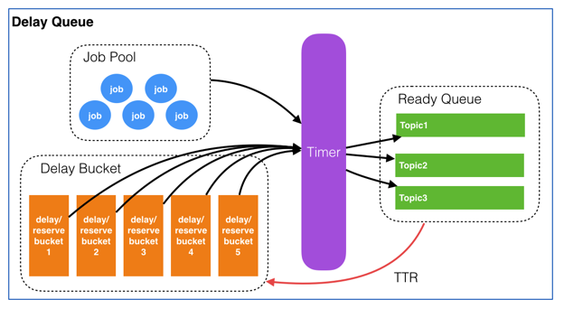

### 队列
1. 认识：生产者/消费者模型，负责消息的接收、存储、转发
   - 异步处理：时间无关可延后处理、可以并行处理
   - 解耦：两边修改不互相影响
   - 削峰填谷
1. 功能
   - 消息传输
     1. 点对点模型
     1. 发布/订阅模型

   - 消息顺序
   - 消息优先级

   - 消息延时
   - 消息过期
   
   - 消息事务
   - 消息持久化/回溯
1. 典型问题
   - 确保消息顺序
     1. 拆分多个queue，每个queue一个消费者
        - kafka不适用，本身是高吞吐处理系统，不能这么做
   - 确保消息精确一次
     1. 认识：依赖queue、producer和consumer三者共同实现
     1. 分类
        - 最少一次：消息重复，不会丢失，可能重复，需要队列和业务配合
          1. 发送方确认已发送
          1. 队列自身保证
          1. 消费方手动确认已收到
        - 最多一次：消息丢失，可能丢失，不会重复
          1. 发送方不关心发送结果，不能重试发送
          1. 队列保证不能重复处理
          1. 消费方爱收到收不到
        - 可能丢失并且可能重复
        - 精确一次
   - 确保消息幂等：业务保证
     1. 唯一id + 指纹码
     1. redis原子性实现
   - 死信队列的最佳实践
     1. 记录处理失败的消息，当业务解决完bug，能够处理时，进而进行消费，补全数据，起到一个临时存储的作用
1. 一种延迟队列的设计
   - 架构图：
   - 流程
     1. 用户对某个商品下单，系统创建订单成功，同时往延迟队列里put一个job。job结构为：{‘topic':'orderclose’, ‘id':'ordercloseorderNoXXX’, ‘delay’:1800 ,’TTR':60 , ‘body':’XXXXXXX’}
     1. 延迟队列收到该job后，先往job pool中存入job信息，然后根据delay计算出绝对执行时间，并以轮询(round-robbin)的方式将job id放入某个bucket
     1. timer每时每刻都在轮询各个bucket，当1800秒（30分钟）过后，检查到上面的job的执行时间到了，取得job id从job pool中获取元信息。如果这时该job处于deleted状态，则pass，继续做轮询；如果job处于非deleted状态，首先再次确认元信息中delay是否大于等于当前时间，如果满足则根据topic将job id放入对应的ready queue，然后从bucket中移除；如果不满足则重新计算delay时间，再次放入bucket，并将之前的job id从bucket中移除
     1. 消费端轮询对应的topic的ready queue（这里仍然要判断该job的合理性），获取job后做自己的业务逻辑。与此同时，服务端将已经被消费端获取的job按照其设定的TTR，重新计算执行时间，并将其放入bucket
     1. 消费端处理完业务后向服务端响应finish，服务端根据job id删除对应的元信息
1. wiki
   - 商业的有微软的MSMQ、IBM的WebSphere
   - JMS试图通过公共Java API的方式，隐藏不同mq的实际接口，解决互通问题，但是使用单独接口胶合众多不同的接口也是存在很多问题。老牌ActiveMQ是JMS的一种实现
   - 消息通信标准化方案：2006年思科、红帽等联合制定了AMQP的公开标准。rabbitMQ是其开源实现，阿里的rocketMQ、kafka
### 常见消息队列
1. nsp
   - 认识：实时分布式mq，go编写
     1. 原生分布式，无中心化，无限横向扩展。故障容错
     1. 分布式权衡：消息可靠传递、消息是否持久
     1. 主要内存操作，磁盘透明保存
     1. 支持多消息协议
   - 功能
     1. 发布订阅
     1. 负载均衡、多播
     1. 面向流式处理（高吞吐量），面向worker的（低吞吐量）
1. beanstalkd
   - 认识：简单快速的通用工作队列，c写的
     1. 背景：最初目的是通过后台异步执行耗时任务来降低web系统的页面访问延迟，11年前项目就有了，最近更新是2年前
     1. 典型的类Memcached设计，协议和使用方式都是同样的风格
     1. 内部都是生产者-消费者模式
     1. 有人说beanstalk之于rabbitmq，好比apache之于nginx。更简单、轻量级、高性能、易使用。但比kafka数据处理能力有差距
   - 组成
     1. job：任务
     1. tube：任务队列
     1. producer/consumer
1. activeMQ
   - 认识：Apache出品，是最流行的开源消息总线。完全支持JMS1.1和J2EE1.4规范的JMS provider实现。10年左右的技术
     1. 优点：遵循JMS规范、安装部署方便
     1. 缺点：会丢消息，重心在下代产品上
     1. 适用：中小企业级消息应用场景
   - 特性
     1. 多语言客户端：Java、C、C++、C#、Ruby、Python、PHP
     1. 多种应用协议：OpenWire、Stomp REST、WS Notification、XMPP、AMQP
     1. 支持JMS1.1和J2EE1.4规范，包括持久化、XA消息、事务
     1. 高级特性：虚拟主题、组合目的、镜像队列
### rocketMQ
1. 认识：阿里kafka基础上开源
   - 高性能、高可用：吞吐量超高，消息生产低延迟，为在线交易系统带去福音
   - 功能丰富，适合大规模分布式系统应用
   - 微服务架构设计，每个部分都支持多节点扩展
   - 基于Netty异步事件驱动通讯框架，采用长连接
1. 功能
   - 消息类型
     1. 普通
     1. 顺序(全局/分区)
     1. 定时/延时
     1. 分布式事务：类似 X/Open XA 的分布事务，保证最终一致性
   - 发布/订阅、集群消费(全部/任一)
     1. 拉模式
   - 消息路由
   - sql形式的消息查询，全链路消息轨迹、消息回放
1. 特点
   - 单机支持上万Topic，Topic 数量增加对性能影响很小
   - 单机亿级消息堆积能力
   - 内存模式支持同步请求处理，不落盘，适用于“request-reply”同步请求处理场景
   - 流数据处理：如日志流数据，支持log4j、logback等日志异步appender，其他非交易数据处理需求，也可采用异步发送+batch模式提高数据传输效率
   - Consumer支持Java,C++,Go
   - 企业服务总线
   - 分布式事务方式是增加了事务反查的机制来解决事务消息提交失败的问题，需要业务提供反查接口
1. 模式
   - 集群模式
     1. broker存储消费者的消息偏移量offset
   - 广播模式
     1. 不支持消息重试：因为每个消费者维护自己的offset，重试的话会同时给其他消费者产生消息
1. 组成：
   - NameServer：注册中心，各节点互相独立，彼此没有通信关系
   - broker集群：支持主从模式，有同步双写、异步复制两种模式
   - Producer集群
   - Consumer集群
### pulsar
1. 认识：云原生、分布式的消息传递和流处理平台，Apache软件基金会排名前10的项目
   - 快速水平动态扩容：服务和存储分层架构允许跨数百个节点快速扩展，而无需重新调整数据，独立的存储层可以在几秒钟内横向扩展
   - 非常低的消息端到端延迟：单独确认消息(RabbitMQ 风格)或按分区累积确认消息(即类似偏移量)。支持大规模(数百个节点)和低延迟(<10ms)的分布式工作队列或保序数据流等用例
   - 跨区域的异地复制
     1. 支持多集群，能够无缝的基于地理位置进行跨集群的备份
     1. 支持客户端自动故障转移到健康集群
   - 自动负载平衡：热点主题包会自动拆分并均匀分布在代理之间
   - 具有资源分离和访问控制的多租户
   - 官方集成第三方连接器，MySQL、ES、Cassandra等流数据输入或输出
   - 无服务的轻量级计算框架Pulsar Functions提供了原生的流数据处理
   - 支持单个集群100万个主题
1. 架构
   - 存算分离：计算与存储分离
   - 分片存储
1. 高可用
   - 消息存储：分片存储、水平扩展、自动负载
   - 消息可靠性：强一致、昇常转移、副本修复
1. 原理
   - pulsar都是服务器推模式
1. 最佳实践
   - 确认分区数的参考指标
     1. 吞吐量、延迟、Broker负载
   - 允许增加分区数量，但不能减少
1. 其他
   - 生态
     1. 计算框架对接：Spark、Storm、Flink
     1. 存储对接：HDFS、HBase、Elasticsearch
#### 使用
1. 消息
   - 消息类型：普通、定时、顺序、延迟消息
     1. 延迟
        - Exclusive/Failover模式不支持
   - 消息发送：同步、批量、异步、分区
1. 消费的订阅模式
   - Shared 共享、Key_Shared key共享
     1. 多个消费者使用同一个订阅名称时，就是共享了同一个订阅，Pulsar通过轮询机制将消息分发给不同的消费者，同时只能一个消费者消费。不同的订阅名称就会多消费
     1. Key_Shared多支持了指定key值可实现顺序消费，只给某一个消费者
     1. Shared模式通常能提供更高的吞吐量，因为它不需要考虑消息的键值，可以直接进行轮询分发
   - Exclusive 独占、Failover 灾备
     1. 每个分区只能由一个消费者处理
1. 角色
   - namespace、topic
   - producer
   - consumer
   - reader：读模式访问消息，没有游标(Pulsar不会跟踪Reader的进度)，也不需要对消息进行确认
     1. 功能：消息重放
##### 消费
1. 正常消费
   - 组成
     1. DLQ：dead letter queue，死信队列
     1. RLQ：retry letter queue，重试队列，和死信队列的地位同等，只是是否将重试和原队列分开
        - 重试队列实际上是一个延迟队列
   - ack
     1. 不进行ack的情况
        1. Shared和Key_Shared订阅类型
           - 重试机制：会根据配置的重试策略重新推送，如negativeAckRedeliveryDelay 指定的时间后重新发送
           - 死信队列：如重试多次后仍未被确认，pulsar可将消息发送到死信队列，以便进行进一步的处理
        1. Exclusive订阅类型：一直发，直到消息被确认或消费者断开连接
     1. 示例
        ```go
        // 重试队列和死信队列的配置
        consumer, err := client.Subscribe(pulsar.ConsumerOptions{
            Topic: "persistent://group/server/xxx",
            SubscriptionName: "test",
            Type: pulsar.Failover,
            RetryEnable: true,
            DLQ: &pulsar.DLQPolicy{
                MaxDeliveries: 3,
                RetryLetterTopic: "persistent://group/server/xxx-RETRY",            // 重试队列名称
                DeadLetterTopic: "persistent://group/server/xxx-DLQ",               // 死信队列名称
            },
            NackRedeliveryDelay: time.Second * 3,
        })

        // 确认的处理
        consumer.Ack(msg)

        // 不确认，等NackRedeliveryDelay后将被重新投递到主队列进行消费
        consumer.Nack(msg)
        // 稍后处理,等 xx 秒后将被重新投递到重试队列
        consumer.ReconsumeLater(msg, time.Second * 5)
        ```
1. 顺序消费
   - 使用 Message Key
    ```go
    err = producer.Send(context.Background(), &pulsar.ProducerMessage{
        Payload:  []byte(msg),
        Key:      "my-order-key", // 确保所有消息都使用相同的键
    })
    ```
   - 使用 Ordering Keys (有序键)
    ```go
    err = producer.Send(context.Background(), &pulsar.ProducerMessage{
        Payload:     []byte(msg),
        OrderingKey: "my-order-key", // 确保所有消息都使用相同的有序键
    })
    ```
1. 事务消费
    ```go
    txnID, err := client.NewTransaction(pulsar.TransactionOptions{
        TransactionTimeoutMs: 30000,
    }).ID()
    if err != nil {}

    // 在事务中处理消息
    consumer.AckWithTxn(msg, txnID)
    client.CommitTransaction(txnID)
    ```
1. ack最佳实践
   - 及时确认消息
    ```go
    msg, err := consumer.Receive(context.Background())
    if err != nil {
        // 处理错误
    }
    // 处理消息
    consumer.Ack(msg)

    // 如期望再次消费，可不进行ack，Pulsar会自动将其重新排队
    ```
   - 使用批量确认
     1. AckCumulative
        - 订阅类型限制：AckCumulative主要用于Exclusive和Failover订阅类型，在Shared和Key_Shared订阅类型中，由于消息可能被多个消费者共享，使用AckCumulative可能会导致其他消费者的消息被错误确认
        - 正确使用：确保在使用 AckCumulative 时，消费者已经正确处理了所有之前的消息，以避免消息丢失或重复处理
     1. 实例
        ```go
        for {
            msg, err := consumer.Receive(context.Background())
            if err != nil {
                // 处理错误
                continue
            }
            // 处理消息
            consumer.Ack(msg)
            if consumer.MessagesReceived() % 100 == 0 {
                consumer.AckCumulative(msg)                         // 累积消息确认机制，会将该消息及其之前的所有消息全部标记为已确认，适用于顺序性、高吞吐量的场景
            }
        }
        ```
   - 使用消息监听器：来异步处理消息，这样可以提高应用的响应性和吞吐量
    ```go
    consumer.MessageListener(func(msg pulsar.Message) {
        // 处理消息
        consumer.Ack(msg)
    })
    ```
#### 原理
1. 实现
   - 用BookKeeper持久化存储消息和游标信息，是bookies的节点集群，BookKeeper一致性协议
   - pulsar无状态的代理负载均衡topic，有缓存
1. 游标
   - 认识：pulsar为每个订阅名称都会维护一个游标，指示该订阅已经消费到的消息位置
     1. ack时会更新
     1. 存储在BookKeeper集群中进行持久化，不会丢失
   - 作用
     1. 确保消息不会被重复处理
     1. 根据消费者的确认情况决定何时删除消息
   - 游标与消息
     1. 未确认消息：所有未被确认的消息会一直保存在订阅的backlog中
     1. 消息删除：当一条消息被所有订阅者确认后，该消息进入可以被删除的状态。pulsar会根据配置的保留策略（retention policy）和时间阈值（ttl）来决定何时删除这些消息
