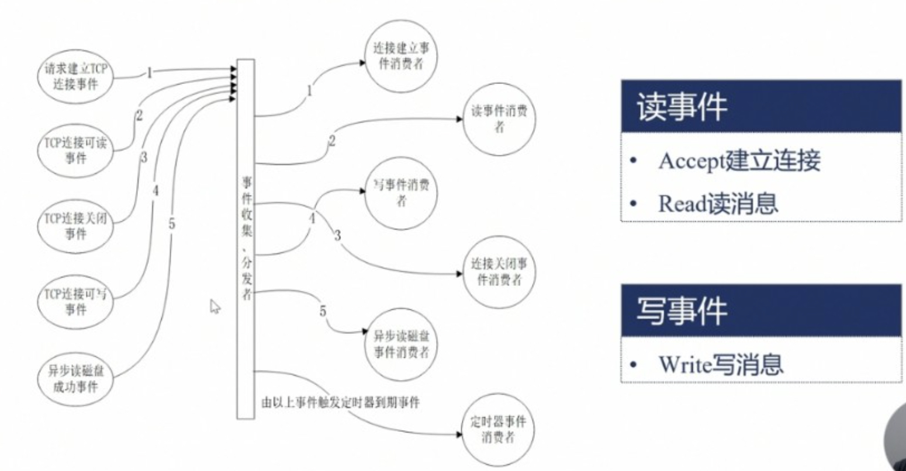

### 认识
1. 认识：基于事件驱动、高性能非阻塞的轻量级http/反向代理/负载均衡服务器。C编写，官方测试5万并发。windows系统不能发挥全部的性能
   - 资源消耗低，运行稳定，并发高
     1. 分阶段资源分配技术，cpu/内存占用率低
   - 静态文件可开启索引和描述符缓冲
   - 32核64G，千万qps，简单静态文件百万qps
1. 特点
   - 高并发，高性能
   - 模块化，扩展性好
   - 高可靠性，热部署
   - BSD许可证
1. 使用场景
   - 静态资源服务器：如js、images，本地文件系统
   - 反向代理：负载均衡、缓存
   - api服务：openresty
   - 虚拟主机：实现一台服务器虚拟出多个网站
1. nginx
   - 认识
     1. 是多进程结构，多线程会共享地址空间如果段错误越界访问进程都挂掉，不安全
     1. 进程间通信使用共享内存，如缓存模块
     1. 进程间使用信号通信，子进程退出会告诉主进程，主再起一个
   - 组成，执行文件，配置，access log，error log
   - 单位
     1. 时间：ms、s、m(分钟)、h、d、w(周)、M(月，30天)、y(年)
     1. 空间：bytes、k/K、m/M、g/G
   - 处理流程
     1. web、email、tcp流量进入
     1. nginx整体
        - 状态机处理机制
          1. 特点
             - 非阻塞事件驱动处理器，线程池处理磁盘阻塞调用
          1. 功能
             - access、error日志
          1. 组成
             - 传输层状态机
             - http状态机
             - mail状态机
        - 代理机制
          1. http、email、stream(tcp)网络层协议的代理
          1. fastCGI、uWCGI、memcached等应用层协议的代理
   - 进程结构
     1. 请求切换
        - apache：一个线程只处理一个连接，不做连接的切换，依赖os的进程调度实现并发
          1. 切换成本会随着请求数指数增加
        - nginx：用户态代码完成连接切换，尽量减少os进程切换
          1. 省去了进程线程间切换成本，增大worker的cpu时间片，让其更好的完成任务，更多保留在用户态，让操作系统少做无用功
     1. 组成
        - master：通过master管理worker进程
        - cache manager
        - cache loader
        - worker
   - 信号
     1. 命令行：跟直接给nginx发信号一样
        - reload：HUP
        - reopen：USR1
        - stop：TERM
        - quit：QUIT
     1. master
        - USR2
        - WINCH
     1. worker：TERM、QUIT、USR1、WINCH
   - 优雅关闭
     1. 只针对http，websocket协议无法做到因为不解析后边的frame帧，tcp/udp不知道后边还有无数据包，不会发送tcp的reset
     1. reload流程
        - 收到HUP信号
        - 检验配置、打开新配置的端口
        - 启动新w子进程
        - 老w子进程发送QUIT信号
        - 老w子进程关闭监听句柄，处理完当前连接后结束进程
          1. 设置定时器
          1. 关闭监听句柄：不会接收新的连接
          1. 关闭空闲连接
          1. 在循环中等待全部连接关闭：为了资源最大化，保存了一些空闲连接没断开，循环中每一个请求关闭就连接关闭
          1. 退出进程
   - tcp协议与非阻塞接口：事件收集分发者，
     1. 无非是读写事件
     1. 给tcp各种事件设置定时器，记录网络事件的到期时间
   - 事件循环：
     1. 事件循环中用epoll_wait阻塞，操作系统把事件放队列中
        - 设置超时时间，不能容忍处理程序长时间占用cpu导致处理时间长，大量任务连接都超时断开从而恶性循环，资源消耗在处理大量不正常的断开上
   - epoll
     1. 大量连接中只有少数是活跃的，epoll仅遍历活跃连接，采用红黑树、链表，增删改查都快
1. nginx.conf配置
    ```conf
    user                        www;                            # 用户和用户组
    worker_processes            8;                              # 同时工作的进程数，建议设置为cpu核心数
    error_log                   /var/nginx/error.log error;     # 全局错误日志，类型有debug|info|notice|warn|error|crit
    pid                         /var/nginx.pid;                 # 进程文件
    worker_rlimit_nofile        65535;                          # 一个nginx进程打开的最多文件描述符数

    events {                                                    # 工作模式
        worker_connections      1024;                           # 单个进程最大连接数，最大连接数=连接数*进程数
        use epoll               kqueue|epoll|poll;
    }

    http {                                                      # 服务器配置
        include                 /etc/nginx/mime.types;
        default_type            application/octet-stream;
        client_max_body_size    8M;
        
        access_log              /var/log/nginx/access.log  main;

        sendfile                on;                             # 高效文件传输模式，指定nginx是否调用sendfile函数来输出文件，普通应用为on，下载等应用磁盘IO重负载应用可为off，以平衡磁盘与网络I/O处理速度，降低系统的负载。如果图片显示不正常改成off
        send_timeout            60;                             # 防止网络阻塞
        tcp_nopush              on;

        keepalive_timeout       65;                             # 长连接超时时间，秒

        include /etc/nginx/conf.d/*.conf;
    }
    ```
### 指令
1. 认识：一门微型的编程语言
1. 语法
   - 嵌套结构：main-->http-->server-->location
   - include用于组合多个配置文件
   - 组成
     1. 指令
        - 组成
          1. synta：语法
          1. default：默认值
          1. context：作用域
        - 每条指令;结尾
        - 指令与参数空格分隔，部分指令参数支持正则
        - #注释，$变量
     1. 指令块：用{}组织，可以有名称
   - 特点
     1. 指令的合并
        - 值指令：可以，子配置不存在使用父的，子存在覆盖父的
        - 动作指令：不可以
1. server
   - 认识：执行处理哪些域名、虚拟主机
   - listen：设置server监听的地址和端口
     1. default：`listen *:80|*:8000`
     1. context：server
     1. demo
        - `listen 80;`：等于`listen *:80;`
        - `listen host|ip:8080;`：单独指定ip或域名，其他就无法访问了
        - `listen unix:/tmp/xx.sock;`：只能本机通信
        - `listen [::]80 ipv6only=on;`
        - `listen 80 default_server;`
   - server_name：设置server匹配host请求头的路由
     1. 匹配规则
        - 设置多个，第一个是主域名，通过`server_name_in_redirect on|off`，设置请求跳转时是否用主域名返回，默认off
        - 泛域名：最前或最后加*号全匹配
        - 正则：加~前缀，可用()设置匹配到的变量
            ```
            server{
                server_name ~^(www\.)?(.+)$;
                location / { root /sites/$2;}               # $2使用上边第二个括号里内容
            }
            server{
                server_name ~^(www\.)?(<domain>.+)$;
                location / { root /sites/$domain;}          # 指定变量名
            }
            ```
        - 其他
          1. .xx.com可以匹配xx.com和*.xx.com
          1. _匹配所有
          1. ”“匹配无host请求头的
     1. 匹配顺序：上边的优先，先遍历所有配置的server_name，如果找到了则执行对应的server，如果没有找到，则默认执行第一个server或default
        - 精确
        - *在前的泛域名
        - *在后的泛域名
        - 正则：都匹配的按配置文件中顺序来
        - default_server
          1. 第一个
          1. listen指定default
   - root
   - demo
    ```conf
    server {
        listen 127.0.0.1:80;
        server_name  somename;
        root /var/html;
    }
    ```
1. location
   - 认识：匹配路径
   - syntax
     1. `location [=|~|~*|^~] uri {...}`：优先级递减
     1. `location @name {...}`
   - context：server、location，location可相互嵌套
   - 匹配规则：仅匹配uri，忽略参数
     1. 前缀字符串
        - =     精确匹配 1
        - ^~    以某个字符串开头，不以开头的可以新建另一个server不同port解决 2
     1. 正则
        - ~     开头表示区分大小写的正则匹配 3
        - ~*    开头表示不区分大小写的正则匹配 4
        - !~    区分大小写不匹配的正则 5
        - !~*   不区分大小写不匹配的正则 6
        - /     通用匹配，任何请求都会匹配到 7
     1. 用于内部跳转的命名location
   - 实例
    ```conf
    location / {
        root   html;
        index  index.html index.htm;
    }

    location ~ \.php$ {                                                         # php-fpm
        fastcgi_pass   127.0.0.1:9000;
        fastcgi_index  index.php;
        fastcgi_param  SCRIPT_FILENAME  $document_root$fastcgi_script_name;     # 以下两句也可替换为include fastcgi.conf;
        include        fastcgi_params;                                          # 这是个文件
    }

    location ~* .(gif|png|jpg|jpeg|zip|apk)$ {                                  # 定向文件
    location ~* (^/statics/dishes/.*\.(html|js|css|eot|svg|ttf|woff)$){
        root   /mnt/opt/wecook-base/uploads;
        expires 7d;                                                             # 缓存时间
        access_log off;
    }

    error_page   500 502 503 504  /50x.html;                                    # 错误页面
    location = /50x.html {
        root   html;
    }

    location ~ /\.ht {                                                          # 拒绝
        allow 127.0.0.1/24;
        deny  all;
    }
    location ~ /\.(git|svn|vcs)/ {
        return 404;
    }

    location / {                                                                # 添加header
        add_header headerName headerValue
    }
    ```
1. 变量
   - http请求相关
     1. $query_string|$args         全部url参数
     1. $arg_参数名                  映射到url中某个具体参数的值
     1. $is_args                    返回参数或空
     1. $uri|$document_uri          不带请求参数的当前URI，不含主机名，如'/foo/bar.html'
     1. $request_uri                包含请求参数的原始URI，不含主机名
     1. $scheme                     协议名，http/https
     1. $request_method             请求方法
     1. $request_length             请求头中的Content-length字段，所有请求内容的大小，包括请求行、请求头、包体
     1. $content_length             请求头中的Content-length字段
     1. $content_type               请求头中的Content-Type字段
     1. $remote_user                已经经过Auth Basic Module验证的用户名
     1. $request_body_file          临时存放请求包体的文件，非常小不存，`client_body_in_file_only`设置是否强制存入
     1. $request_body               包体，仅当使用反向代理并且内存暂存包时有效
     1. $request                    原始的url请求
     1. $host                       先从请求行取，如果有host头则替换，前二者都没有用匹配上的server_name
     1. $http_头部名字                返回具体请求头的信息，以下会做特殊处理
        - http_host
        - http_user_agent
        - http_referer
        - http_via
        - http_x_forwarded_for
        - http_cookie
   - http响应相关
     1. $body_bytes_sent            body长度
     1. $bytes_sent                 全部响应长度
     1. $status                     返回码
     1. $sent_trailer_名字           响应结尾内容里值返回
     1. $sent_http_头部名字          具体响应头值，以下九个会做特殊处理
        - $sent_http_content_type
        - $sent_http_content_length
   - tcp连接相关：四元组
     1. $remote_addr|$binary_remote_addr|$remote_port                   客户端，binary为整型格式，ipv4是4字节，ipv6是16字节
     1. $server_port|$server_addr|$server_protocol                      服务端，端口、地址、协议，完成一次系统调用后可以确定这个值
     1. $connection                 递增的连接序号
     1. $connection_requests        当前连接上执行过的请求数，对keepalive有意义
     1. $proxy_protocol_addr|$proxy_protocol_port                       返回使用了proxy_protocol协议的地址或空
     1. $TCP_INFO                   tcp内核层参数
   - 处理过程中产生的
     1. $https                      是否开始tls/ssl
     1. $server_name                匹配上的那个值
     1. $server_protocol            请求使用的协议，通常是HTTP/1.0或HTTP/1.1
     1. $request_time               请求处理到现在的耗时
     1. $request_id                 16进制输出请求标识id
     1. $request_completion         是否处理完成
     1. request_filename            待访问文件的完整路径
     1. document_root               由uri和root/alias规则生成的文件夹路径
     1. realpath_root               将document_root中的可能的软连接等换成真实路径
     1. $limit_rate                 返回客户端响应时的速度上限，bytes/s
   - 系统变量
     1. $time_local|$time_iso8601   本地时间，8601标准的时间
     1. $nginx_version
     1. $pid                        所属worker进程的pid
     1. $pipe                       是否使用管道
     1. $hostname                   服务器主机名
     1. $msee                       毫秒时间戳
   - 存放变量的哈希表
     1. `variables_hash_bucket_size`
     1. `variables_hash_max_size`
1. 其他配置文件
   - mime.types：文件扩展名与文件类型映射表，找不到使用默认default_type
   - fastcgi.conf/fastcgi_params/uwsgi_params/scgi_params：使用对应cgi时，向cgi传递的变量
   - koi-utf/koi-win/win-utf：编码转换映射文件
### 模块
1. 认识
   - 不同模块在不同的阶段执行，其执行顺序受阶段的顺序决定
1. 分类
   - 官方
     1. ngx_event_module
     1. core_module
        - core
        - errlog
        - thread_pool
        - openssl
     1. http_module
     1. conf_module
     1. stream_module
     1. mail_module
   - 第三方
1. realip
   - 认识：识别用户真实ip并修改客户端地址为在指定头字段中发送的，用于覆盖binary_remote_addr、remote_addr变量，否则这俩变量就是和nginx建立连接的ip，不准
     1. binary_remote_addr是二进制的，效率更高
   - 变量
     1. realip_remote_addr
     1. realip_remote_port
   - 指令
     1. set_real_ip_from：设置对于什么样的地址才做转换，比如自己集群中的上游，自己的cdn
     1. real_ip_header：设置从哪个请求头字段取ip
     1. real_ip_recursive：环回地址
1. rewrite
   - 认识：重定向，根据正则匹配内容跳转到replacement
   - 场景
     1. 调整用户浏览的URL，看起来规范
     1. 为了让搜索引擎收录网站内容，让用户体验更好
     1. 网站更换新域名后
     1. 根据特殊的变量、目录、客户端信息进行跳转
   - 使用
     1. 应用位置：server、location、if
     1. 默认值：none
   - 指令
     1. rewrite：`rewrite regex replacement [flag];`
        - regex：表示想要匹配的目标URL
        - replacement：将正则匹配的内容替换成replacement，可作分组和变量提取，$1是取自regex部分()里的内容
        - flag
          1. last	本条规则匹配完成后继续向下匹配新的location URI规则
          1. break	本条规则匹配完成后终止，不在匹配任何规则
          1. redirect	返回302临时重定向
          1. permanent	返回301永久重定向
     1. if
        - syntax：`if (condition) {...}`，条件为真执行
          1. 变量是否为空或0、变量和字符串(= !+)、变量和正则表达式(~ !~ ~* !~*)
          1. 文件(-f !-f)、目录(-d !-d)、软连接(-e !-e)是否存在
          1. 是否为可执行文件(-x !-x)
        - context：server、location
        - demo
            ```lua
            if ($http_cookie ~* "id=([^;]+)(?:;|$)") {
                set $id $1                                  // cookie中提取值
            }

            if ($request_method = POST) {}

            if (!-e $request_filename) {                    // php去除index.php
                rewrite  ^(.*)$  /index.php?s=$1  last;
            }
            ```
     1. return
        - syntax
          1. return code [text]：body中返回text，444，nginx自定义，立刻关闭连接不返回任何
          1. return code url
          1. return url
     1. error_page
        - syntax：error_page code ... [=[response]] uri;
        - context：可在if in location
        - demo：`error_page 404 /my404.html`
     1. rewrite_log：是否打开记录
     1. break
     1. set
   - 实例
     1. `rewrite /last.html /index.html last;`
     1. `rewrite ^/html/(.+?).html$ /post/$1.html permanent;`：把/html/*.html => /post/*.html，301定向
     1. `rewrite ^/(.*) http://www.jd.com/$1 permanent;`：把当前域名的请求，跳转到新域名上，域名变化但路径不变
     1. `rewrite  ^(.*)$  /index.php?s=$1  last;`：
     1. `rewrite [^/]$ $uri/?$query_string break;`：携带参数跳转
1. limit
   - 认识：限流
     1. 全部w进程，生效开始阶段：preaccess
     1. limit_conn依赖有效性取决于key的设计，依赖postread阶段的realip模块的真实ip
     1. limit_req是漏桶算法
   - 组成
     1. limit_conn：限制同时存在的连接数
     1. limit_req：限制每秒请求处理数
   - limit_conn模块指令
     1. `limit_conn_zone $binary_remote_addr zone=addr:10m;`：定义共享内存大小，key关键字
     1. `limit_conn zone number`：定义限制的数量
     1. `limit_conn_log_level`：限制发生时的日志级别
     1. `limit_conn_status`：限制发生时的返回码
     1. `limit_rate`
   - limit_req模块指令
     1. `limit_req_zone $binary_remote_addr zone=one:10m rate=1r/s;`
     1. `limit_req`：限制数量
     1. `limit_req_log_level`：限制发生时的日志级别
     1. `limit_req_status`：限制发生时的返回码
1. access阶段
   - access：控制ip可以访问的url，access阶段
     1. 指令
        - allow：`allow address | CIDR | unix: | all`
        - deny
     1. demo
        ```lua
        location / {
            deny 192.168.1.1;
            allow 192.168.1.0/24;
            deny all;
        }
        ```
   - auth_basic：使用账号密码校验，RFC2617协议的http basic authentication
   - auth_request：生成子请求询问是否能通过
   - satisfy：决定是否需要通过全部以上三个
1. precontent阶段
   - try_files：是模块也是指令，依次访问文件，存在返回内容，不存在按最后一个url结果或code返回，常用于反向代理
     1. syntax
        - `try_files file ... uri`
        - `try_files file ... =code`
     1. context：server location
     1. demo
        ```lua
        location /aa {
            try_files /tmp/main.html $uri $uri/index.html @lasturl
            try_files /tmp/main.html $uri $uri/index.html =404
        }
        location @lasturl {
            return 200 'lasturl\n';
        }
        ```
   - mirror模块：处理请求时生成不处理返回值的子请求
     1. 指令
        - mirror url | off：默认关闭
        - mirror_request_body on | off：是否转发body
1. content阶段
   - static模块
     1. 指令
        - root：将完整url映射为文件路径，以返回静态文件内容，使用更广，因为可以在多个指令块中继承使用
        - alias：将location后的url映射为文件路径，以返回静态文件内容，只在location中
        - type：文件扩展名作映射，即响应值content-type
          1. default_type
          1. types_hash_bucket_size
          1. types_hash_max_size
        - 重定向跳转设置
          1. server_name_in_redirect：是否返回主域名
          1. port_in_redirect：是否返回端口
          1. absolute_redirect：是否添加域名
        - log_not_found：未找到文件时的错误日志，关闭提高性能，默认开
     1. 变量
        - request_filename：待访问文件的完整路径
        - document_root：由uri和root/alias规则生成的文件夹路径
        - realpath_root：将document_root中的可能的软连接等换成真实路径
   - index模块：指定默认的文件名称
   - autoindex模块：url以/结尾时，尝试以html/xml/json/jsonp等格式返回root/alias指向目录的目录结构
     1. 指令
        - autoindex：是否打开
        - autoindex_exact_size
   - merge_slashes on|off：默认开，合并连续的/符号
   - concat模块：一次请求返回多个文件内容，提升小文件性能。uri后面加上??，通过多个,分隔文件，参数用?
     1. 指令
        - concat：是否打开
        - concat_types
1. log
   - 认识：记日志的，log阶段
   - log_format
     1. syntax：`log_format name [escape=default|json] string ...`
     1. context：http
   - access_log
     1. syntax：`access_log path [format [buffer=size] [gzip[=level]] [flush=time] [if=condition]];`
        - 配置日志缓存，多次积累一次性写入
        - 配置if符合条件才记录
        - 配置压缩
     1. context：server location
     1. demo
   - open_log_file_cache：对打开的日志文件句柄进行管理，省去记录日志时重复的打开、关闭操作，提升性能，超出最大时使用lru淘汰，设置最少使用数才缓存
     1. syntax：`open_log_file_cache max=N [inactive=time] [min_uses=N] [valid=time];`
1. 过滤模块
   - sub模块：将响应中指定字符串替换为新字符串
     1. sub_filter
     1. sub_filter_last_modified
     1. sub_filter_once
     1. sub_filter_types
   - addition模块：在响应前后增加内容，通过新增子请求的响应完成
1. cache：缓存
   - proxy_cache
    ```conf
    proxy_cache cacheName;
    proxy_cache_key $host$uri$is_args$args;     // 设置缓存的key
    proxy_cache_valid 200 304 302 1d;           // 为不同响应码设置缓存时间      
    proxy_pass http://xx;                       // 缓存的是这个结果
    ```
1. map
   - 认识：通过组合一系列已有变量映射新变量，提供更多可能，类似switch、case形式
   - 指令
     1. map
     1. map_hash_bucket_size
     1. map_hash_max_size
1. geo
   - 认识：匹配ip范围生成新变量
   - demo
    ```
    geo $country {
        default        ZZ;
        include        conf/geo.conf;
        delete         127.0.0.0/16;
        proxy          192.168.100.0/24;
        proxy          2001:0db8::/32;

        127.0.0.0/24   US;
        127.0.0.1/32   RU;
        10.1.0.0/16    RU;
        192.168.1.0/24 UK;
    }
    ```
1. geoip
   - 认识：基于maxMind数据库计算ip的地理位置，也是生成新变量
1. split_client
   - 认识：通过变量值按照百分比指定少量用户实现AB测试
   - 指令
     1. split_client
### 应用
1. keepalive控制
   - keepalive_disable：指定某些浏览器禁用
   - keepalive_requests：一个tcp最多执行的http请求
   - keepalive_timeout timeout [header_timeout]：两个时间，没有http请求的超时时间，连接的保留时间
1. gzip压缩：可在任何层级定义，越细优先级越高
    ```lua
    gzip on;
    gzip_static on;        
    gzip_min_length 1k/1024;                            // 最小压缩文件大小
    gzip_http_version 1.1;                              // 压缩版本，默认1.1
    gzip_buffers 16 8k;                                 // 压缩缓冲区
    gzip_comp_level 6;                                  // 压缩等级
    gzip_types text/plain application/x-javascript application/javascript application/json text/javascript text/css;
    gzip_disable "msie6";
    gzip_vary on;
    gzip_proxied any;
    limit_zone crawler $binary_remote_addr 10m;         // 开启限制IP连接数的时候需要使用
    ```
1. 反向代理
   - 认识：请求转发，支持多种协议
     1. tcp/udp：直接转发，没啥可做的
     1. http：转为http、fastcgi、grpc等
   - 指令
     1. 属性设置
        - `proxy_pass url`：对上游服务使用http/https进行反向代理，url必须以`http://`或`https://`开头，接下来是ip/域名/socket/upstream名称，可以带变量，可以用rewrite改写，不带url就原封转发(如location的@方式)，带就是location匹配到的地址，即地址是location匹配到的地址
        - `proxy_method method;`
        - `proxy_http_version 1.0 | 1.1;`

        - `proxy_pass_request_headers on | off;`                              是否将用户header、body发给上游
        - `proxy_pass_request_body on | off;`
        - `proxy_set_header field value;`
        - `proxy_set_body value;`                                             手动设置包体

        - `client_body_in_single_buffer on | off;`
        - `client_body_buffer_size size`                                      接收上游包体的内存

        - `proxy_request_buffering on | off;`                                 客户端的包体是否边收边发
        - `client_max_body_size size`                                         最大包体长度，仅对有content-length且超出的返回413
        - `client_body_timeout time;`                                         读取包体超时，返回408

        - `client_body_in_file_only on | clean | off;`                        是否放入临时文件
        - `client_body_temp_path path [level1 [level2 [level3]]];`          临时文件地址，一个文件夹不能太多文件，性能非常慢
     1. 发起连接
        - `proxy_connect_timeout time;`：
        - `proxy_next_upstream http_502 | ..;`：

        - `proxy_socket_keepalive on | off;`：启用tcp的keepalive
        - `keepalive connections;`：启用http的keepalive
        - `keepalive_requests number;`：

        - `proxy_bind address [transparent] | off;`：
        - `proxy_ignore_client_abort on | off;`：
        - `proxy_send_timeout time;`：
        - `proxy_buffer_size size;`：
     1. 接收上游
        - `proxy_buffers number size;`：
        - `proxy_buffering on | off;`：
        - `proxy_max_temp_file_size size;`：
        - `proxy_temp_path path [level1 [level2 [level3]]];`：缓存临时文件
        - `proxy_temp_file_write_size size;`：
        - `proxy_busy_buffers_size size;`：高负荷下缓存大小
        - `proxy_read_timeout time;`：
        - `proxy_limit_rate rate;`：
        - `proxy_store_access users:permissions ...;`：
        - `proxy_store on | off | string;`：
        - `proxy_cookie_domain off;`：
        - `proxy_cookie_path off;`：
        - `proxy_redirect default;`：
        - `proxy_next_upstream error | timeout | invalid_header | http_500 | http_502 | http_503 | http_504 | http_403 | http_404 | http_429 | non_idempotent | off ...;`：
          1. `proxy_next_upstream_timeout time;`：
          1. `proxy_next_upstream_tries number;`：
        - `proxy_intercept_errors on | off;`：
1. 超时时间
   - proxy_connect_timeout：和后端服务器的连接(发起握手后的)等待超时时间
   - proxy_read_timeout：等待后端服务器的响应超时时间
   - proxy_send_timeout：发送请求给后端服务器的超时时间，规定时间之内后端服务器接收完所有的数据
1. 缓存
   - proxy_buffer_size：缓存区大小
   - proxy_buffers：缓存区大小和数量
   - proxy_busy_buffers_size：高负荷下缓存大小
   - proxy_temp_file_write_size：缓存临时文件大小

   - client_max_body_size 500m;              # 客户端请求服务器最大允许大小
   - client_body_buffer_size     128k;       # nginx分配给请求数据的Buffer大小
   - proxy_ignore_client_abort   on;         # 是否开启proxy忽略客户端中断


   - 最佳实践
     1. 客户端请求是否边收边发，proxy_request_buffering
        - on
          1. 客户端网速慢
          1. 上游并发能力低
          1. 适应高吞吐
        - off
          1. 更及时的响应
          1. 降低nginx io消耗
          1. 一旦开始发送内容，proxy_next_upstream功能失效
     1. 使用长连接：降低和上游建立/关闭连接的损耗，提升吞吐量，降低时延
        ```lua
        server {
            location /api/wx1matrix/ {
                rewrite ^.+api/wx1matrix/?(.*)$ /$1 break;
                proxy_set_header Host wx1matrix.xueersi.com;

                // 改为长连接用这俩，必须都有，否则不生效
                proxy_http_version 1.1;                         // 防止使用http1.0
                proxy_set_header Connection "";                 // 防止关掉长连接

                proxy_redirect off;
                proxy_pass http://images;
            }
        }
        upstream images {
            server 10.20.27.13:80;
            server 10.20.27.14:80;
            
            // 改为长连接同时需要搭配这个
            keepalive 100;
        }
        ```
   - 实例
    ```conf
    location / {
        proxy_pass http://localhost:99;
        proxy_set_header Host $host;
        proxy_set_header X-Real-IP $remote_addr;
        proxy_set_header X-Forwarded-For $proxy_add_x_forwarded_for;
        proxy_redirect off;             # 当上游服务器返回的响应是重定向或刷新请求时，是否重设http头部的location或refresh字段
        proxy_next_upstream off;        # 当请求服务器发生错误或超时时，转发到下一台服务器，默认off
    }
    ```
1. 负载均衡
   - 特点：实现了四七层负载均衡，功能多、性能好、运行稳定，自动剔除不正常服务器，上传文件使用异步模式，有权重等多种分配策略
   - 指令
     1. 指向上游服务
        - `upstream name {...}`：指定上游服务组，只在http中
        - `server address [param]`：指定上游服务地址，可以是ip/域名/本机socket地址，默认用80端口，参数backup非备份不可用才用，down标识下线
          1. weight：权重
          1. max_conns：最大并发连接数
          1. max_fails：最大失败次数
          1. fail_timeout：max_fails的时间范围；max_fails的紧闭时长 
        - `keepalive conns`：这一组upstream和上游服务的最多保持的空闲tcp连接，只在upstream中
          1. keepalive_requests：v1.15.3不稳定，最多请求数
          1. keepalive_timeout：v1.15.3不稳定，没有请求的断开等待时长
        - `resolver address ... [valid=time][ipv6-on|off]`：指定上游域名dns服务器
   - 变量
     1. $upstream_addr：格式为可读字符串，如127.0.0.1:8012
     1. $upstream_connect_time：上游建立连接的耗时
     1. $upstream_header_time：上游接收发回响应中http头的耗时，因为先发头部，nginx需要根据header做出处理，很关键
     1. $upstream_response_time：上游接收完整响应的耗时
     1. $upstream_http_名称：上游响应头的值
     1. $upstream_bytes_received：上游接收的响应长度，单位字节
     1. $upstream_response_length：上游返回的包长度，单位字节
     1. $upstream_status：状态码，未连接上是502
     1. $upstream_cookies_名称
     1. $upstream_trailer_名称：上游响应尾部的值
   - 内置策略
     1. hash：变相轮询算法，将请求固定到某一机器上
        - `ip_hash`：根据客户端ip划分
        - `hash key [consistent]`
          1. 通用hash：以nginx内置的变量为key进行hash
          1. 一致性hash：加consistent，使用nginx内置的一致性hash环。解决以上hash算法宕机/扩容时，引发大量路由变更，导致缓存失效
     1. weight：加权round-robin轮询算法，优先给高权重机器直到其权值降到比其他低才给其他机器，当所有机器都down时nginx立即初始所有机器标志位，避免全部timeout
     1. least_conn：最少连接算法，跨w进程
        - `least_conn`
        - `zone name [size]`：分配存储其他upstream的策略、上游服务状态的共享内存
     1. fair策略：根据机器响应时间判断负载情况，选出最快的
   - demo
    ```lua
    --print("七层")
    http{
        upstream host {
            ip_hash;                                                    # 加上几位ipHash策略，去掉为加权
            server 0.0.0.1:80 weight=3 max_fails=3 fail_timeout=30s;    # max_fails节点多少次失败就摘除，fail_timeout节点不可用时暂停多久
            server 0.0.0.2:80 weight=2 backup;                          # 别的节点都挂了才用这个
            server 0.0.0.3:80 weight=3 proxy_next_upstream;
            keepalive_timeout 5s;                                       # nginx主动发起关闭tcp通道的时间，防止上游关闭连接的瞬间，下游来请求产生502
        }
        server {
            location / {
                proxy_pass http://somename
            }
        }
    }
    --print("四层")
    stream {
        server {
            listen 1034;
            proxy_pass app;
        }
        upstream app {
            server 192.168.0.3:1034;
        }
    }
    ```
1. 防盗链
   - 认识：校验referer或签名，检测访问的来源网页，防止非法访问referer模块
   - referer模块
    ```lua
    location ~ .*\.(gif|jpg|png|fiv|swf)$ {

        valid_referers none blocked imooc.com *.imooc.com       # 针对referer
        if($invalid_referer) {
            rewrite ^/ http://403.jpg
        }

        accesskey on;                                           # 针对伪造referer，第三方模块HttpAccessKeyModule
        accesskey_hashmethod md5;
        accesskey_arg "key";                                    # get参数名称
        accesskey_signature "mypass$remote_addr"                # 加密规则，nginx会检查签名的正误
    }
    ```
   - secure_link模块：通过校验url中hash值实现，通过某服务器(或nginx)生成加密安全链接url，请求来时判断
     1. 使用hash不可逆
     1. 包含时间戳，和加密后的串来校验
     1. demo
        ```
        location / {
            secure_link $arg_md5,$arg_expires;
            secure_link_md5 "$secure_link_expires$uri$remote_addr secret";

            if($secure_link = "") {
                return 403;
            }
            if($secure_link = "0") {
                return 410;
            }

            return 200;
        }
        ``` 
1. CORS
    ```lua
    location / {
        if ($request_method = 'OPTIONS') {
            add_header 'Access-Control-Allow-Origin' '*';
            add_header 'Access-Control-Allow-Methods' 'GET, POST, OPTIONS';
            #
            # Custom headers and headers various browsers *should* be OK with but aren't
            #
            add_header 'Access-Control-Allow-Headers' 'DNT,User-Agent,X-Requested-With,If-Modified-Since,Cache-Control,Content-Type,Range';
            #
            # Tell client that this pre-flight info is valid for 20 days
            #
            add_header 'Access-Control-Max-Age' 1728000;
            add_header 'Content-Type' 'text/plain; charset=utf-8';
            add_header 'Content-Length' 0;
            return 204;
        }
        if ($request_method = 'POST') {
            add_header 'Access-Control-Allow-Origin' '*';
            add_header 'Access-Control-Allow-Methods' 'GET, POST, OPTIONS';
            add_header 'Access-Control-Allow-Headers' 'DNT,User-Agent,X-Requested-With,If-Modified-Since,Cache-Control,Content-Type,Range';
            add_header 'Access-Control-Expose-Headers' 'Content-Length,Content-Range';
        }
        if ($request_method = 'GET') {
            add_header 'Access-Control-Allow-Origin' '*';
            add_header 'Access-Control-Allow-Methods' 'GET, POST, OPTIONS';
            add_header 'Access-Control-Allow-Headers' 'DNT,User-Agent,X-Requested-With,If-Modified-Since,Cache-Control,Content-Type,Range';
            add_header 'Access-Control-Expose-Headers' 'Content-Length,Content-Range';
        }
    }
    ```
1. https
   - 使用：`listen 443 ssl;`
   - 指令
     1. 对下游使用证书
        - `ssl_certificate file;`：
        - `ssl_certificate_key file;`：
     1. 验证下游证书
        - `ssl_verify_client on | off | optional | optional_no_ca;`：
        - `ssl_client_certificate file;`：
     1. 对上游使用证书
        - `proxy_ssl_certificate file;`：
        - `proxy_ssl_certificate_key file;`：
     1. 验证上游游证书
        - `proxy_ssl_trusted_certificate file;`：
        - `proxy_ssl_verify on | off;`：
        - ``：
        - ``：
   - 变量
     1. 安全套件
        - ssl_cipher/ssl_ciphers
        - ssl_protocol
        - ssl_curves
     1. 证书
1. fastcgi：`fastcgi.conf`
    ```conf
    fastcgi_param  SCRIPT_FILENAME    $document_root$fastcgi_script_name;
    fastcgi_param  QUERY_STRING       $query_string;
    fastcgi_param  REQUEST_METHOD     $request_method;
    fastcgi_param  CONTENT_TYPE       $content_type;
    fastcgi_param  CONTENT_LENGTH     $content_length;

    fastcgi_param  SCRIPT_NAME        $fastcgi_script_name;
    fastcgi_param  REQUEST_URI        $request_uri;
    fastcgi_param  DOCUMENT_URI       $document_uri;
    fastcgi_param  DOCUMENT_ROOT      $document_root;
    fastcgi_param  SERVER_PROTOCOL    $server_protocol;
    fastcgi_param  REQUEST_SCHEME     $scheme;
    fastcgi_param  HTTPS              $https if_not_empty;

    fastcgi_param  GATEWAY_INTERFACE  CGI/1.1;
    fastcgi_param  SERVER_SOFTWARE    nginx/$nginx_version;

    fastcgi_param  REMOTE_ADDR        $remote_addr;
    fastcgi_param  REMOTE_PORT        $remote_port;
    fastcgi_param  SERVER_ADDR        $server_addr;
    fastcgi_param  SERVER_PORT        $server_port;
    fastcgi_param  SERVER_NAME        $server_name;

    # PHP only, required if PHP was built with --enable-force-cgi-redirect
    fastcgi_param  REDIRECT_STATUS    200;
    ```
1. 网关接口
   - CGI
     1. 理解：Common Gateway Interface，通用网关接口，外部应用程序和web服务器的数据交换的接口标准，允许web服务器执行外部程序，并将输出发回web服务器。早期动态网页处理程序一次只能处理一个请求。跨平台好，性能低下，NCSA维护
     1. 原理
        - 请求——创建子进程——处理，即fork-and-execute模式，请求数=cgi子进程数，子进程的反复加载是cgi性能低下的原因，会大量占用cpu和内存
        - 每个web请求都必须重新解析php.ini，重新载入全部扩展，初始化全部数据结构
   - FastCGI
     1. 理解：类似常驻型cgi，先启一个master，cgi解释器保持在内存中并接受fastcgi的调度，类似线程池的技术特性，也是一个协议
     1. 原理
        - web服务器载入fastcgi进程管理器
        - fastcgi自身初始化，启动多个cgi解释器进程等待调用
        - 请求到达时，web服务器连接到fastcgi，fastcgi选择一个cgi解释器交给web服务器
        - cgi将结果返回web服务器
     1. 特点
        - 所有配置只在进程启动时加载一次
        - PHP死掉不会带死apache，而且会立即启动一个新的php进程
        - fastcgi是适用高并发场景的，对web服务器不挑可以自由更换
   - SCGI：Simple CGI，精简数据协议和响应过程的FCGI，为适应ajax和rest，做出更快更简介应答，并规定http响应后立刻关闭链接，适合SOA提倡的请求-忘记的通信模式
   - WSGI：Web Server Gateway Interface，
   - GRPC
    ```conf
    server {
        listen 1443 ssl http2;
        ssl_certificate     ssl/xx.pem;
        ssl_certificate_key     ssl/xx.pem;

        location / {
            grpc_pass grpc://grpc_server;

            error_page 502 = /error502grpc;
        }

        location /error502grpc {
            internal;                   # ???
            
            return 204;
        }
    }

    upstream grpc_server {
        server 127.0.0.1:10000;
        server 127.0.0.1:10001;
    }
    ```
### 调优
1. 配置
   - worker_processes auto;                                 # 进程数
   - worker_cpu_affinity 1000 0100 0010 0001;               # 每个进程分配cpu，这是4核，worker进程数量和核数相同，并且和cpu绑定
   - worker_connections 65535;                              # 连接数=进程数*单个进程连接数
   - worker_rlimit_nofile 65535;                            # 打开的最多文件描述符
   - worker_priority -20;                                   # 数字越小，cpu优先级越高，默认120，-20就是100
   - use epoll;                                             # 不同系统不同模型
   - keepalive_timeout 60;
   - gzip on;
   - listen 80 deferred;                                    # 延迟处理新连接，deferred是发送数据过来才激活nginx，建立连接不激活
   - tcp_max_syn_backlog
     1. 太大：php-fpm处理不过来，nginx等待超时断开连接，报504 gateway timeout，同时php-fpm处理完准备write数据给nginx时发现TCP连接断开报Broken pipe
     1. 太小：进不了php-fpm的accept queue，报502 Bad Gateway
1. wiki
   - nginx绑定cpu为了尽可能复用cpu缓冲
   - 为了性能不会混部运行其他耗性能的程序
   - cpu
     1. 尽可能占用全部cpu
     1. 尽可能占用更大的cpu时间片、减少进程间切换
### 运维
1. 安装
   - linux
     1. 源码安装
        ```
        yum -y install gcc gcc-c++ automake autoconf libtool make                           // 编译依赖

        wget ftp://ftp.csx.cam.ac.uk/pub/software/programming/pcre/pcre-8.41.tar.gz         // pcre
        tar -zxvf pcre-8.41.tar.gz && ./configure && make && make istall
        wget http://zlib.net/zlib-1.2.11.tar.gz                                             // zlib
        tar -zxvf zlib-1.2.11.tar.gz && ./configure && make && make istall
        wget http://nginx.org/download/nginx-1.12.2.tar.gz
        tar -zxvf nginx-1.12.2.tar.gz && cd nginx-1.12.2

        groupadd  www                                                                       // 添加www组    
        useradd -g  www www -s /bin/false                                                   // 加入到www组，不允许www用户直接登录系统

        ./configure \
        --user=www --group=www \
        --sbin-path=/usr/local/nginx/nginx \
        --conf-path=/usr/local/nginx/nginx.conf \
        --pid-path=/usr/local/nginx/nginx.pid \
        --with-http_ssl_module \
        --with-pcre=/opt/app/openet/oetal1/chenhe/pcre-8.37 \
        --with-zlib=/opt/app/openet/oetal1/chenhe/zlib-1.2.8 \
        --with-openssl=/opt/app/openet/oetal1/chenhe/openssl-1.0.1t
        make
        make install
        ```
     1. yum安装
        - 更新至nginx官方yum源，如centos6则OS=centos, OSRELEASE=6
        ```
        vim /etc/yum.repos.d/nginx.repo
        [nginx]
        name=nginx repo baseurl=http://nginx.org/packages/mainline/OS/OSRELEASE/$basearch/ gpgcheck=0
        enabled=1

        yum makecache
        yum install nginx
        ```
   - tengine
    ```
    wget -c --no-check-certificate ftp://ftp.csx.cam.ac.uk/pub/software/programming/pcre/pcre-8.39.tar.gz
    wget -c --no-check-certificate https://www.openssl.org/source/openssl-1.0.2j.tar.gz
    wget -c --no-check-certificate https://github.com/alibaba/tengine/archive/tengine-2.2.0.tar.gz
    tar -zxf pcre/openssl/tengine
    cd tengine
    ./configure --with-pcre=pcre解压位置 --with-openssl=openssl解压位置
    make && make install
    ```
1. 操作
   - `nginx`：启动
   - -p：运行指定目录
   - -s：发送信号
     1. stop：立即停止
     1. quit：优雅停止
     1. reload：重载配置文件，热重启
     1. reopen：重新开始记录日志文件
   - -c：指定配置文件
   - -t：测试配置文件是否有语法错误
   - -v：版本
### 架构
1. nginx + keepalived
   - nginx_health.sh
    ```shell
    #!/bin/bash
    #

    ps -ef | grep nginx | grep -v grep &> /dev/null
    if [ $? -ne 0 ];then
        killall keepalived
    if
    ```
1. nginx + lua
   - 认识：结合nginx的并发处理epoll优势，和lua的轻量实现简单的功能切高并发的场景
     1. 用命令行进入能执行代码的，就是这个语言的解释器
     1. nginx在不同阶段调用lua，同时也提供了自己的api
   - 使用
     1. nginx调用lua：nginx的可插拔模块化加载执行，共11个处理阶段
        - set_by_lua、set_by_lua_file：设置nginx变量，可以实现复杂的赋值逻辑
        - access_by_lua、access_by_lua_file：请求访问阶段处理，用于访问控制
        - content_by_lua、content_by_lua_file：内容处理器，接收请求处理并输出响应
     1. lua调用nginx api
        - ngx.var                   nginx变量
        - ngx.req.get_headers       获取请求头
        - ngx.req.get_uri_args      获取url请求参数
        - ngx.redirect              重定向
        - ngx.print                 输出响应内容体
        - ngx.say                   同print，最后再输出一个换行符
        - ngx.header                输出响应头
   - 实例
     1. 基于ip的灰度选择功能
        ```lua
        // nginx配置
        server {
            listen 80;
            server_name localhost;

            location /myip {
                default_type 'text/plain';
                content_by_lua '
                    clientIp = ngx.req.get_headers()["x_forwarded_for"]
                    ngx.say("IP:",clientIp)
                ';
            }

            location / {
                content_by_lua_file /xx/xx.lua
            }

            location @server {
                proxy_pass http://server
            }

            location @server_test {
                proxy_pass http://server_test
            }
        }

        // lua文件，memcache里边存储灰度ip，判断是否相等
        
        // 获取客户ip
        clientIp = ngx.req.get_headers()["x_forwarded_for"]

        // 初始化memcache
        local memcached = require "resty.memcached"
        local memc, err = memcached:new()
        if not memc then
            ngx.say("failed to instantiate memc: ", err)
            return
        end

        // 连接memcache
        local ok, err = memc:connect("127.0.0.1", 11211)
        if not ok then
            ngx.say("failed to connect: ", err)
            return
        end

        // 能否获取值
        local res, flags, err = memc:get(clientIP)
        ngx.say("value key:",res,clientIP)
        if err then
            ngx.say("failed to get clientIP ", err)
            return
        end

        // 选择调用哪个location
        if res == "1" then
            ngx.exec("@server_test")
            return
        end
        ngx.exec("@server")
        ```
   - 搭建
     1. 依赖
        - luaJIT：更快的解释器
        - ngx_devel_kit、ua-nginx-module
        - 重新编译nginx
     1. 步骤：https://www.imooc.com/article/19597
1. kong
1. OpenResty：ngx_openresty，基于nginx与lua的高性能web平台，用于方便地搭建处理高并发、扩展性的服务和动态网关，给nginx赋予lua脚本编程的能力同时保持高并发
   - 可以使用lua脚本语言调动nginx的各种c、lua模块，让web服务直接跑在nginx内部
   - 针对域名、目录结构做分流、转发的策略，既能做负载又能做反向代理
   - 具有Lua协程 + Nginx 事件驱动的事件循环回调机制，即Cosoket，对远程后端如MySQL、Memcached、Redis等都可实现同步写代码的方式实现非阻塞I/O
   - 依托于LuaJit，即时编译器会将频繁执行的代码编译成机器码缓存起来，当下次调用时将直接执行机器码，相比原生逐条执行虚拟机指令效率更高，而对于那些只执行一次的代码仍然可以逐条执行
   - lua和nginx的c交互
1. wiki
   - C10K：OpenResty、JavaNetty、Golang、NodeJS 
   - 调整文件打开数、设置 TCP Buckets、设置 TIME_WAIT等
   - 马蜂窝广告数据处理
     1. 收集
        - lua代码缓存，设置Resolver、epoll、keepalive
        - 数据收集部分不需要考虑时序或对数据进行聚合处理，因此核心的推送介质选择 Lua 共享内存即可，以 I/O 请求来代替访问其他中间件所需要的网络服务
     1. 处理
        - FFI处理ip
        - 之后创建内部的日志 location，结合 Lua 自定义 log_format，利用 Nginx 子请求特性离线完成数据落盘，同时保证数据延迟时长在毫秒级
        - Redis+FluxDB
          1. 去中心化，配置链接池来增加链接复用，增加 AOF与延时入库保证可靠
          1. FluxDB保证数据日志时序性可查，聚合统计与实时报表表现较优
     1. 存储
        - 实时数据源：数据采集服务→ Filebeat → Kafka → Flink → ES
        - 离线数据源：HDFS → Spark → Hive → ES
     1. 流程
        - init_worker_by_lua阶段：负责服务配置业务
        - access_by_lua阶段：负责CC防护、权限准入、流量时序监控等业务
        - content_by_lua阶段：负责实现限速器、分流器、WebAPI、流量采集等业务
        - log_by_lua阶段：负责日志落盘等业务
     1. 分流器业务：NodeJS上报cpu、内存使用情况；Lua脚本调用RedisCluster获取时间窗口内NodeJS集群使用情况，计算出负载较高的，进行熔断、降级、限流等处理；将监控数据同步InfluxDB，进行时序监测
     1. 小型web防火墙：使用第三方开源 lua_resty_waf 类库实现，支持 IP 白名单和黑名单、URL 白名单、UA 过滤、CC 攻击防护功能。在此基础上增加WAF对InfluxDB 的支持，进行时序监控和服务预警
### 最佳实践
1. 代理线上配置
    ```lua
    server { 
        listen 80;
        server_name tntapi.xesv5.com ;
        set_by_lua_block $request_trace_id {
            local mid = ngx.var.pid..ngx.var.server_addr..ngx.var.remote_addr..ngx.var.connection..ngx.var.connection_requests..ngx.var.bytes_sent..ngx.now()
            return ngx.md5(mid)
        }
        access_log /home/nginx/logs/tntapi.xesv5.com_access.log main;
        error_page 500 502 503 504  http://www.xueersi.com/wait.html;
        location /  { 
            add_header 'Access-Control-Allow-Methods' 'GET,POST,OPTIONS';
            add_header 'Access-Control-Allow-Credentials' 'true';
            add_header 'Access-Control-Allow-Origin' '$http_origin';
            add_header 'Access-Control-Allow-Headers' 'prelogid,Authorization,DNT,User-Agent,Keep-Alive,Content-Type,rpcid,traceid,jytoke';
            proxy_pass http://tntapi.xesv5.com;
            proxy_set_header Host $host;
            proxy_set_header X-Real-IP $remote_addr;
            proxy_set_header X-Request-Id $request_trace_id;
            proxy_set_header X-Forwarded-For $proxy_add_x_forwarded_for;
            proxy_redirect off;
            client_max_body_size 500m;
            client_body_buffer_size 128k;
            proxy_ignore_client_abort on;
            proxy_connect_timeout 60;
            proxy_send_timeout 60;
            proxy_read_timeout 60;
            proxy_buffer_size 128k;
            proxy_buffers 32 32k;
            proxy_busy_buffers_size 128k;
            proxy_temp_file_write_size 128k;
            proxy_next_upstream off;
            add_header X-Request-Id $request_trace_id;
            add_header "Set-Cookie" "X-Request-Id=$request_trace_id; path=/";
            add_header Xes-App $upstream_http_server;
        } 
    } 
    ```
1. 线上业务机配置
    ```lua
    user  nobody nobody;
    worker_processes auto;
    error_log  /home/nginx/logs/error.log  error;
    pid        /home/nginx/logs/nginx.pid;

    worker_rlimit_nofile 51200;

    events {
        use epoll;
        worker_connections 51200;
    }

    http {
        include       mime.types;
        default_type  application/octet-stream;

        server_names_hash_bucket_size 128;
        client_header_buffer_size 4k;
        large_client_header_buffers 4 32k;
        client_max_body_size 500m;

        sendfile on;
        tcp_nopush     on;

        server_tag xes-app/bj-sjhl-api-jiaoyan-online-94-32;

        keepalive_timeout 75;

        tcp_nodelay on;

        fastcgi_connect_timeout 300;
        fastcgi_send_timeout 300;
        fastcgi_read_timeout 300;
        fastcgi_buffer_size 256k;
        fastcgi_buffers 4 256k;
        fastcgi_busy_buffers_size 512k;
        fastcgi_temp_file_write_size 512k;

        client_body_buffer_size 256k;
        send_timeout 3m;
        proxy_ignore_client_abort on;

        gzip on;
        gzip_min_length  1k;
        gzip_buffers     4 16k;
        gzip_http_version 1.0;
        gzip_comp_level 2;
        gzip_types text/plain text/css text/javascript application/json application/javascript application/x-javascript application/xml application/x-httpd-php image/jpeg image/gif image/png font/ttf font/otf image/svg+xml;
        gzip_vary on;

        server {
                listen  80;
                server_name 10.20.94.32;

                location /nginx_status {
                        stub_status on;
                        access_log   off;
                }
                location ~ ^/(php56fpmstatus)$ {
                        fastcgi_index index.php;
                        fastcgi_pass  unix:/dev/shm/php56-cgi.sock;
                        include fastcgi.conf;
                }

                location ~ ^/(php7fpmstatus)$ {
                        fastcgi_index index.php;
                        fastcgi_pass  unix:/dev/shm/php7-cgi.sock;
                        include fastcgi.conf;
                }
        }

        log_format main '{ "@timestamp": "$time_iso8601", '
                '"hostname": "$hostname", '
                '"server_name": "$server_name", '
                '"xes-app": "$upstream_http_server", '
                '"remote_addr": "$remote_addr", '
                '"remote_user": "$remote_user", '
                '"body_bytes_sent": $body_bytes_sent, '
                '"request_time": $request_time, '
                '"upstream_response_time": "$upstream_response_time", '
                '"status": $status, '
                '"upstream_status": "$upstream_status", '
                '"connection_requests": $connection_requests, '
                '"request": "$request", '
                '"request_method": "$request_method", '
               # '"request_body": "$request_body", '
                '"http_referrer": "$http_referer", '
                '"http_cookie": "$http_cookie", '
                '"http_x_request_id": "$http_x_request_id", '
                '"http_user_agent": "$http_user_agent" }';

        include vhost/*.conf;
    }
    ```
1. 平滑升级版本
   - 新老版本安装目录一致
   - 老版本备份：nginx -> nginx.old
   - reload重启
     1. 老master发送USR2信号
     1. 老pid改为pid.oldbin
     1. 启动新master
     1. 向老master发送WINCH信号，关闭老w子进程
     1. 回滚：向老master发送HUP，新的发送QUIT
1. 工具
   - Goaccess：开源的且具有交互视图界面的实时web日志分析工具，分析access日志
   - python2-certbot-nginx：nginx证书安装工具，`certbot --nginx --nginx-server-root=/etc/nginx/conf -d xx.pub`
#### 网关
1. 网关
   - 意义：控制访问，让调用方快速接入，让业务方安全对外开放
   - 功能点
     1. 应用服务管理
        - 鉴权：权限校验
        - vhost和upstream管理
     1. 流量管理、调度策略
        - 多种协议代理：tcp、http、websocket、grpc
        - 多种负载均衡策略
        - 限流：可根据接口响应时间判断服务健康度制定限流值，也可根据某特征实现访问控制
        - 熔断：摘除规则，即容错保护
        - 降级：确保核心业务可用
        - 缓存：vanish
        
        - 黑白名单
        - 分流：指定请求转发，灰度测试、A/B测试、ab_room
        - 流量克隆：请求在网关层的完全复制，可用于业务重构时流量双写到新的b系统
        - 放火：故障模拟，如500、502、504等故障和响应时长变长，可用于制定容灾方案
        - dyroute
     1. 安全
        - 防火墙
     1. 业务监控告警
        - 健康检查类型
          1. tcp检测
          1. http检测：基于检测接口，如php7fpmstatus
        - 健康检查项
          1. 超时时间
          1. 检查间隔时间
          1. 合法状态码
          1. 累计失败数：连续检测多少次失败后网关认为该节点已挂
          1. 累计成功数：连续检测多少次成功后网关认为该节点已恢复
          1. 是否通知
          1. 是否摘除
     1. 自动化
        - 自动下游服务发现
        - 横向扩容：加机器就能解决高并发
1. 有赞网关
   - 架构：Jetty部署
     1. 容器线程池异步处理：开启Servlet3.0异步，然后分发到应用线程池异步处理，通过异步回调通知任务完成
     1. 链式处理：和Zuul 1.x类似，采用PRPE模式(Pre、Routing、Post、Error)，不同模块不同pipe，最后的ResultPipe处理正常返回值和统计打点
     1. 线程池隔离：QTP接受http，交由应用线程池CommonGroup，ExecutionGroup, ResultGroup，实现部分Pipe之间线程隔离。前置Pipe处理快共享线程池即可
     1. 缓存
        - Codis分布式缓存：减少db请求，加快数据读写速度
        - 本地缓存：读取从ms降低到ns，使用zk监听节点变化来更新本地缓存，实现多台的一致性
   - 功能
     1. 限流
        - 第一版：Codis计数实现限流
        - 第二版：令牌桶，比漏桶限流能适应闲置后的尖峰调用
     1. 熔断：即降级，达到多少错误率时进行熔断。使用Hystrix
        - 它支持线程池和信号量的隔离方案。API可能路由到不同后端服务，如果对API或做线程池隔离就会产生大量的线程，选择了信号量
        - Hystrix会对每个API做统计，总量、正确率、QPS等指
     1. 超时控制
     1. 分流：将接口按比例分发
     1. 数据统计
        - 利用rsyslog采集数据到Kafka，然后从Kafka消费进行统计，之后回流到数据库供在线查询
        - 通过Storm从Kafka实时消费，并实时统计落HBase，每天凌晨将前一天的数据同步到Hive进行统计并回流到数据库
     1. 报警：从Kafka消费API调用日志，发现错误超过阈值
   - 问题
     1. Meta区Full GC：现场dump了内存，GC记录，以及线程运行快照，在本地用HeapAnalysis分析，堆区没看出什么问题，大对象都是应该占用的；于是查看方法区，通过ClassLoader Analysis发现Fastjson相关的类较多，因此怀疑是class泄露，进一步通过MAT的OQL语法分析，发现是Fastjson在序列化Jetty容器的HttpServletRequest时，为了加快速度于是创建新的类时抛了异常，导致动态创建的类在方法区堆积从而引发Full GC，后续我们也向Fastjson提了相关bug
     1. 伪死循环导致CPU 100%：经过日志分析，发现该接口存在大量超时，但是从代码没看出特别有问题的地方。于是我们将接口在QA环境模拟调用，用VisualVM连上去，通过抽样器抽样CPU，发现某个方法消耗CPU较高，因此我们迅速定位到源码，发现这段代码主要是执行轮询任务是否完成，如果完成则调用完成回调，如果未完成继续放到队列。再结合之前的环境观察发现大量超时的任务被放到队列，导致任务被取出后，任务仍然是未完成状态，这样会将任务放回队列，这样其实构成了一个死循环。解决方案：将主动轮询改为异步通知
### 原理
1. 内存池，连接池，自旋锁，红黑树
1. 进程模型：管理进程(master)和工作进程(worker)
1. 模块化设计：主框架只提供核心代码，各模块继承同套标准接口规范和数据结构，模块进行分层，为核心/配置/事件/HTTP/mail
1. 事件驱动：event模块，采用红黑树管理事件定时器，支持各种事件驱动模型
1. 网络模型
   - apache是线程池实现多请求，占用资源多
   - nginx是io多路复用
### wiki
1. 版本：偶数是稳定的
   - 1.13.10：支持grpc
   - x.x：2018年，支持TLSv1.3
   - x.x：2016年，支持动态模块
   - x.x：2015年，支持thread pool、stream四层反向代理、httpv2协议、reuseport特性
   - x.x：2013年，支持websocket、TFO协议
   - 1.0：2011年，支持keepalive的http长连接
   - 0.7.52：09年，支持windows
   - 0.1.0：04年
1. wiki
   - nginx模块具有非常好的设计，第一个模块到现在都没有修改过
   - 依赖组件
     1. pcre：nginx的http模块使用pcre来解析正则表达式
     1. zlib：提供了多种压缩/解压缩的方式。nginx使用zlib对http包的内容进行gzip
     1. openssl
   - 代理
     1. 正向代理：面向client的，server可以感知不到
     1. 反向代理：面向server的，client始终和反向代理通信，client可以感知不到
   - 隧道
     1. 认识：tunnel，是一种网络通讯协议，在其中使用一种网络协议(即发送协议)，将另一个不同的网络协议封装在负载部分。用于在不兼容的网络上传输数据，或者在不安全网络上提供一个安全路径
        - 为承载协议自身以外的流量而编写的协议，关心流量传输
1. 同类
   - Lighttpd：web服务器，低内存开销、模块丰富、动态页面处理能力很强
   - HaProxy
     1. 认识：基于tcp、http的提供高可用、高并发、负载均衡的应用代理。c语言编写，通过反向代理实现负载均衡，不是web服务器，是专门的应用代理
        - 快速、免费、可靠
        - 事件驱动、单一进程模型，可以支持很大的并发连接数
        - 适用场景：需要会话保持、负载均衡的高并发、多连接数的场景
     1. 功能
        - 支持负载均衡，支持长连接，支持正则调度
        - 支持添加cookie后调度，支持基于cookie调度
        - 支持双向http的header数据增删改查
        - 支持基于端口的监控、故障切换
        - 支持停机模式、支持监控界面、监控api输出
        - 支持虚拟主机
     1. 配置
        ```conf
        listen rabbitmq_cluster
        bind 0.0.0.0:5672
        mode tcp                                                            # tcp模式
        balance roundrobin                                                  # 简单轮询
        server xxx1 x.x.x.x:5672 check inter 5000 rise 2 fall 3             # 主节点，每5秒健康检查，2次成功服务可用，3次失败服务不可用
        server xxx2 x.x.x.x:5672 backup check inter 5000 rise 2 fall 3      # 备用节点
        ```
