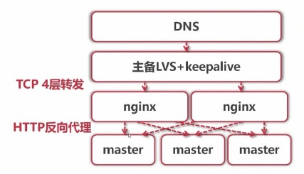
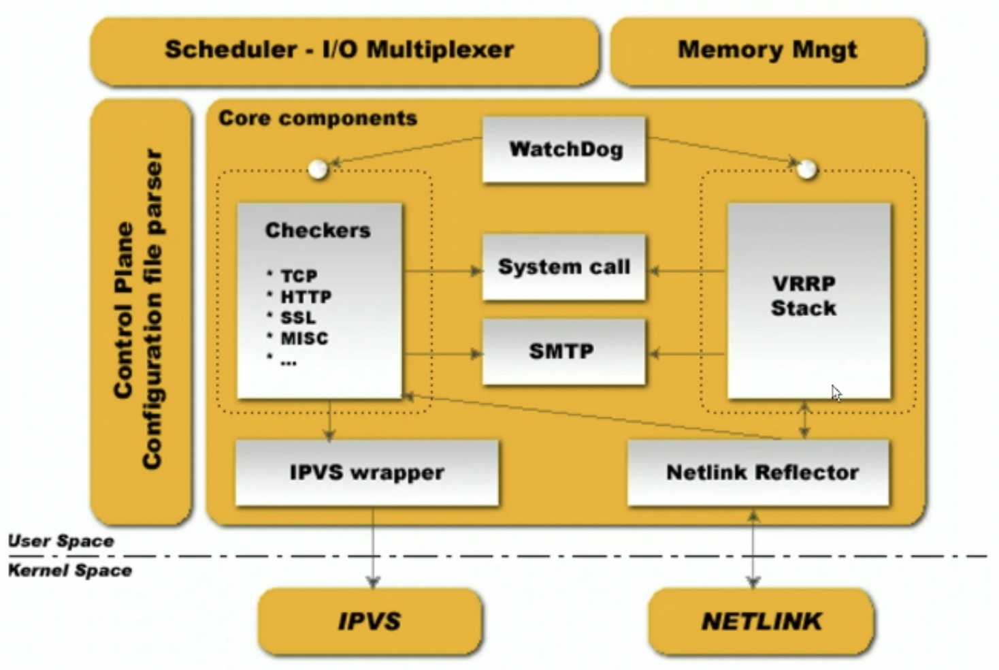

### 认识
1. caddy：开源的go写的http服务器
   - http新特性支持全面，如http2、quic、https
   - 配置简便，5秒可完成配置
1. lighttpd：web服务器，低内存开销、模块丰富、动态页面处理能力很强
1. apache
   - 特点
     1. 模块化，模块多
     1. 支持虚拟主机
     1. 支持cgi、fastcgi、ssl、servlet
   - 工作模式
     1. cgi模式
        - 用法：`Action application/x-httpd-php "/php/php-cgi.exe"`
        - 原理：apache调用php.exe去解释文件，再将结果以网页的形式返回给客户机
     1. 模块模式
        - 用法：`LoadModule php5_module "c:/php/php5apache2.dll"`
        - 原理：php和apache一起启动并运行
     1. FastCGI模式
        - 下载fastcgi模块mod_fcgid.so/mod_fcgid.pd
        - 添加配置
   - 常用命令
     1. httpd.exe -t // 检测配置文件是否正确
     1. httpd.exe -k install
     1. httpd.exe -k start/stop/restart
   - window下安装apache+php
     1. 安装目录
        - Apache：C://http/http/Apache24
        - PHP：C://http/php
     1. 安装vc_redist.x64.exe和vcredist_x64
     1. apache配置修改
        - 将c:/Apache24全部替换成c:/http/http/Apache24
        - 在#LoadModule xml2enc_module modules/mod_xml2enc.so下面添加
          1. LoadModule php5_module "C:/http/php/php5apache2_4.dll"
          1. AddType application/x-httpd-php .php .html .htm
          1. PHPIniDir "C:/http/php"
        - 将DirectoryIndex index.html改为DirectoryIndex index.php index.html
        - 将ServerName www.example.com:80的注释去掉
     1. php环境配置
        - 把php文件目录下的libeay32.dll/php5ts.dll/ssleay32.dll和ext文件中的php_curl.dll复制到windows/system32下
        - 把C:/http/php和C:/http/php/ext加入环境变量
     1. php配置
        - 将php.ini-development在当前目录复制一份，保存为php.ini
        - extension_dir 指向c://http/php/ext
        - extension=php_curl.dll的分号去掉
        - date.timezone = 修改为date.timezone = Asia/Shanghai，去掉分号
     1. 启动
        - 双击C://http/php/php.exe
        - httpd.exe -k install
        - httpd.exe -k start
1. 部署：基于systemctl + nginx实现高可用，不是nginx + keepalive？
### 服务组件
#### confd 配置管理工具
1. confd
   - 认识：是一个轻量级的配置管理工具，应用非常广泛的是etcd+confd，后端支持的数据类型有：etcd、consul、vault、environment variables、redis、zookeeper、dynamodb、stackengine、rancher
     1. 可通过查询etcd，结合配置模板引擎，用于保持本地配置最新
     1. 具备定期探测机制，配置变更自动reload
   - 工作流程
     1. 读取后端配置
     1. 组装到template，生成stage_files
     1. 对比stage_files和dest_file，有变更，更新dest_file、reload cmd
     1. 继续下一次循环
   - 运维
     1. 安装：下载、运行
        - `confd --help`
        - `confd-cli getall/get/set/delete` 操作confd的命令行程序
     1. confd配置：`confd -config-file xx.toml`
        ```conf
        backend = "etcdv3"
        confdir = "/home/www/confd-tw"                  # 指向模板配置文件
        log-level = "debug"
        watch = true # watch模式，实时更新。设置为interval = xxx 时为轮询模式，定时查询
        nodes = [
            "http://10.90.72.49:2379",
            "http://10.90.72.56:2379",
        ]
        ```
     1. 模板配置
        - `conf.d/xx/xx/config.toml`：指定模板
            ```conf
            [template]
            src = 'zhongtai/tnt/config.tmpl'
            dest = '/home/www/tnt.xesv5.com/database/redistw/tnt.php'
            keys = [
                "/serviceMesh/twemproxy-redis/twemproxy/zhong-tai/tnt",
            ]
            check_cmd="/usr/local/php7/bin/php -l  {{.src}}"
            ```
        - `templates/xx/xx/config.tmpl`：模板内容
            ```conf
            <?php
            return[
            {{range gets "/serviceMesh/twemproxy-redis/twemproxy/zhong-tai/tnt/*" -}}
            {{$data := split (.Value) ":" }}
                [
                "host" => "{{index $data 0}}",
                "port" => {{index $data 1}},
                "auth" => "",
                "pconnect" => 0,
                "timeout" => 100,
                "weight" => "{{index $data 2}}",
                ],
            {{end}}
            ];
            ```
#### 负载均衡器
1. lvs
   - 认识：Linux Virtual Server，基于linux操作系统实现的负载均衡器
     1. linux 2.6放入了内核
     1. 工作在4层，几乎可以对所有应用做负载均衡
   - 特点
     1. 负载均衡里lvs性能最高，可以支持100～400万条并发连接。抗负载能力强、是工作在网络4层之上仅作分发之用，没有流量的产生，这个特点也决定了它在负载均衡软件里的性能最强的，对内存和cpu、IO资源消耗比较低
     1. lvs功能比nginx弱，性能最高
     1. 只花128个字节记录一个连接信息，不涉及到文件句柄操作，故没有65535最大文件句柄数的限制
     1. 实践：一般搭配KeepAlived做主备形式的ha，可以不用dns了，避免了dns的耗时和错误问题
   - 组成
     1. 负载均衡器：IPVS，IP Virtual Server，在真实服务器前充当4层负载均衡器
     1. 服务器池
     1. 共享存储
   - 请求转发方式
     1. NAT
     1. DR：必须是Linux操作系统，不支持端口映射，处于同一个广播域中
     1. TUN
   - 调优
     1. LVS的调优建议将hash table的值设置为不低于并发连接数。例如，并发连接数为200，Persistent时间为200S，那么hash桶的个数应设置为尽可能接近200x200=40000，2的15次方为32768就可以了
     1. 当ip_vs_conn_tab_bits=20 时，哈希表的的大小（条目）为 pow(2,20)，即 1048576，对于64位系统，IPVS占用大概16M内存，可以通过demsg看到：IPVS:Connection hash table configured (size=1048576, memory=16384Kbytes)。对于现在的服务器来说，这样的内存占用不是问题。所以直接设置为20即可。
        - 关于最大“连接数限制”：这里的hash桶的个数，并不是LVS最大连接数限制。LVS使用哈希链表解决“哈希冲突”，当连接数大于这个值时，必然会出现哈稀冲突，会稍微降低性能，但功能上不对LVS造成影响
1. haProxy
   - 认识：基于tcp、http协议的提供高可用、高并发、负载均衡的应用代理。c编写，通过反向代理实现负载均衡，不是web服务器，是专门的应用代理
     1. 快速、免费、可靠
     1. 事件驱动、单一进程模型，可以支持很大的并发连接数
     1. 适用场景：需要会话保持、负载均衡的高并发、多连接数的场景
   - 功能
     1. 支持负载均衡，支持长连接，支持正则调度
     1. 支持添加cookie后调度，支持基于cookie调度
     1. 支持双向http的header数据增删改查
     1. 支持基于端口的监控、故障切换
     1. 支持停机模式、支持监控界面、监控api输出
     1. 支持虚拟主机
   - 最佳实践
     1. haproxy + keepalived
   - 配置
    ```conf
    listen rabbitmq_cluster
    bind 0.0.0.0:5672
    mode tcp                                                            # tcp模式
    balance roundrobin                                                  # 简单轮询
    server xxx1 x.x.x.x:5672 check inter 5000 rise 2 fall 3             # 主节点，每5秒健康检查，2次成功服务可用，3次失败服务不可用
    server xxx2 x.x.x.x:5672 backup check inter 5000 rise 2 fall 3      # 备用节点
    ```
#### 热备监控器
1. keepalived
   - 认识：以VRRP协议为基础实现服务热备，一般应用为：lvs+keepalived、nginx+keepalived、haProxy+keepalived
     1. 健康检查：可根据ip、端口、http请求判断是否正常，即工作在OSI的3、4、7层
        - 3：发送ICMP数据包判断是否故障(ping)
        - 4：端口
        - 7：自定义检测脚本
     1. 自动切换：主恢复后可抢占回备占用的vip
        - 支持自身健康检查
   - 应用
     1. 主备都部署服务 + keepalived的部署方案：
     1. 主备的keepalived通过VRRP交互，虚拟出一个vip，并落在主上
        - 主不断向备多播心跳，备接收不到时就接管，主恢复后抢回
     1. 主备的keepalived设置为：当检测服务不可用时尝试重启服务，不成功则关闭keepalived，实现服务转移
   - 组成：
     1. vrrp stack：实现VRRP协议
     1. ipvs wrapper：为集群内节点生成ipvs规则
     1. checkers：负责健康检查、各种检查方式
     1. core：负责主进程的启动、维护，全局配置文件的加载和解析
   - wiki
     1. VRRP协议：虚拟路由冗余协议，为消除静态路由单点故障引起的网络失效设计的主备模式的协议
        - 一主一备，同时只有一个提供服务。即将n台设备虚拟成一个设备，对外提供一个或多个虚拟IP
        - 检测到故障，虚拟IP地址会自动漂移到备份服务器，即keepalived广播vip对应的vmac地址由主切换到备用，其他客户端更新ARP表，实现故障转移
        - keepalive设计是对lvs做故障转移，用在nginx上要写脚本
     1. 线上故障：vrrp通道被占用