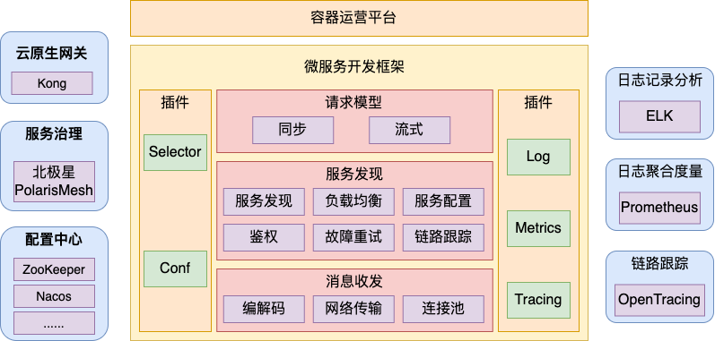
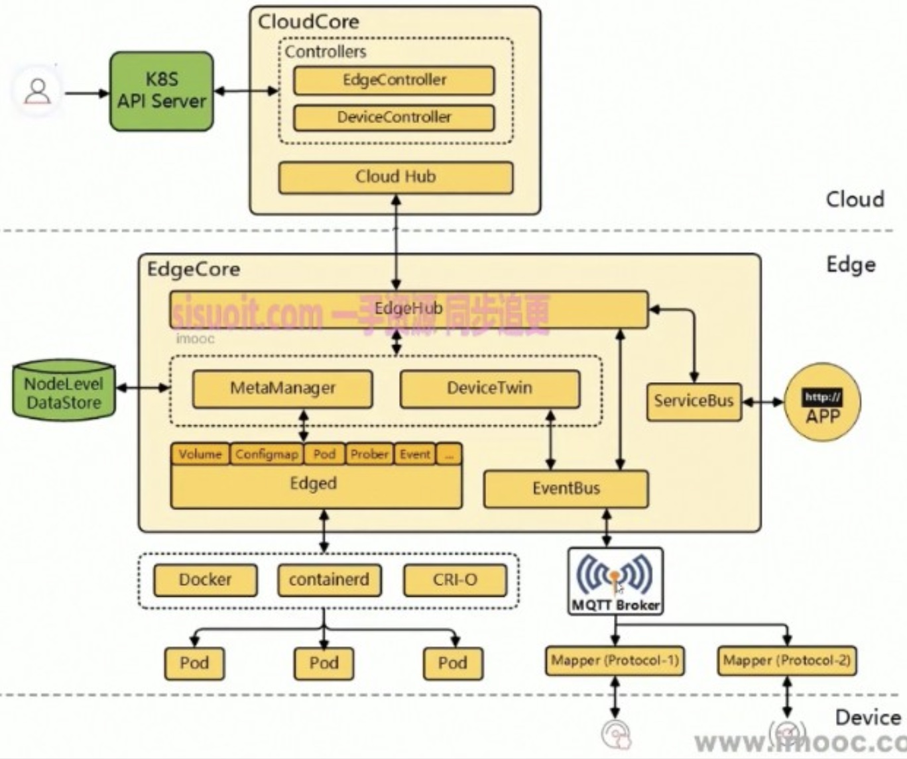
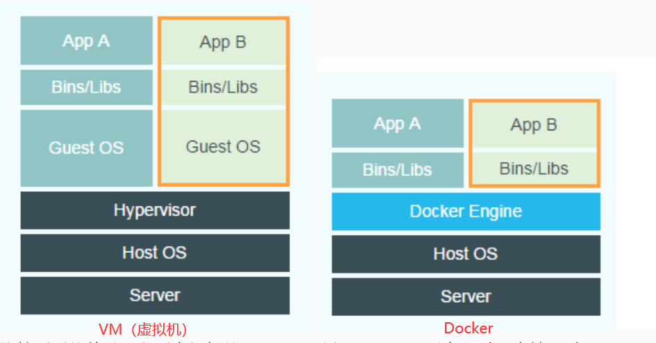
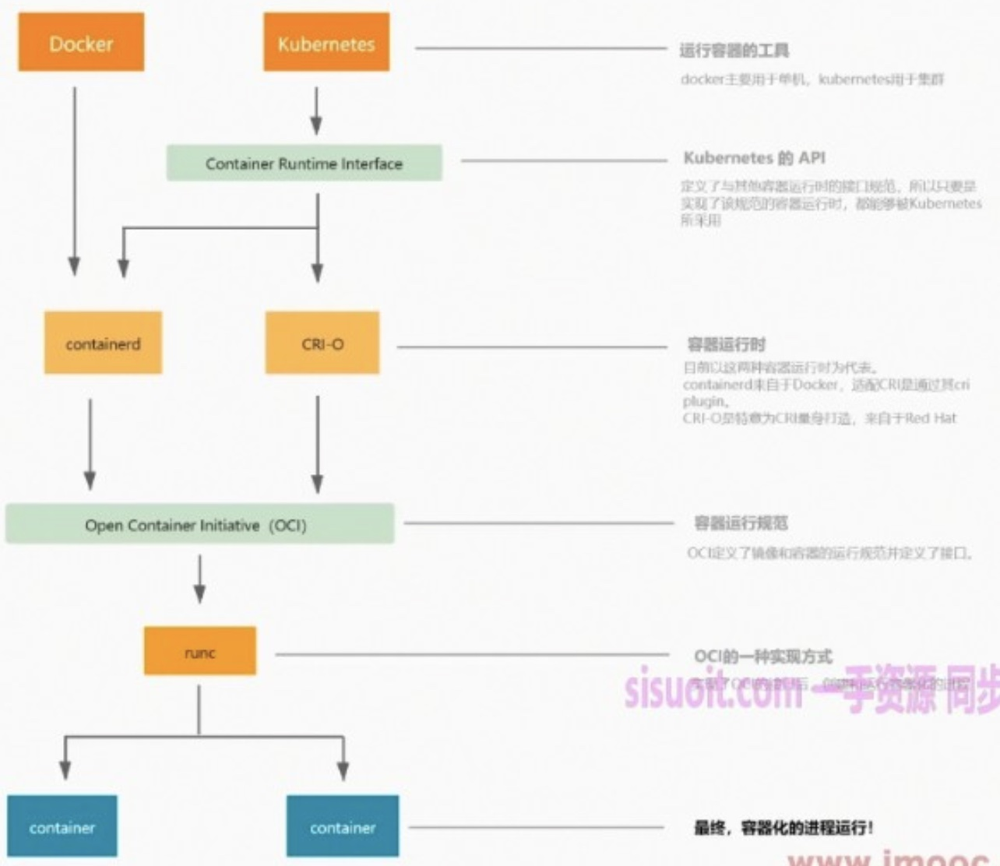
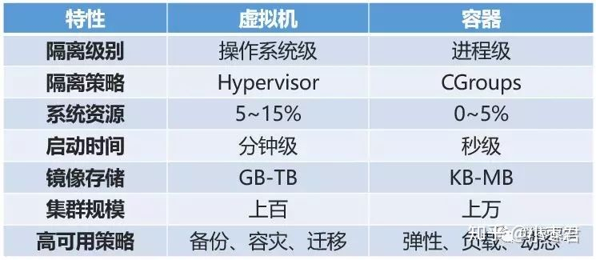

### 云计算
1. 认识：是互联网按需的访问资源的形式，是一种服务
   - 组成三要素：计算、存储、网络
   - 现状
     1. 都可以用OpenStack的开源Iaas自己搭一套出来了
     1. 业务上云
1. 特点
   - 按需使用，按使用量付费：像水和电
   - 弹性资源，无限容量
   - 自助服务，无人值守
1. 优势
   - 省时：基础设施投资为0、缩短产品时间
   - 省钱：按需付费
   - 省力：业务高可用，运维自动化
1. 发展展望
   - 高可用，强扩展，“零”运维，低成本
   - 面向应用的云服务：大数据，AI，人工智能等方面
   - 行业深耕，行业解决方案专家，如安全、金融
1. 云服务
   - 资源编排：利用脚本自己手动控制自己对云上资源的需要
   - 服务托管：以应用为中心，只要求提供某某服务，屏蔽底层基础设施无需关心，但是自身管理应用的编写、发布和运维
1. wiki
   - 云服务模式
     1. IaaS：基础设施即服务
     1. PaaS：平台即服务
     1. SaaS：软件即服务，面向用户
   - 云服务平台
     1. Amazon的AWS、Microsoft的Azure、Google的Google cloud
     1. OpenStack
     1. aliyun
   - 著名基金会
     1. OpenStack
     1. CNCF：云原生计算基金会
   - 发展史
     1. 2006：amazon推出s3、ec2
     1. 2008：google发布google app engine
     1. 2011：openstack推出开源Iaas
     1. 2014：amazon推出lambda
   - 云部署形式
     1. 公有云
     1. 私有云：企业内部
     1. 混合云：如存储内部、计算外部
   - 其他
     1. eBPF
        - 认识：扩展的伯克利包过滤器，是一种无需更改linux内核代码，对linux内核是黑盒的情况下也能安全且较为容易地便能让程序在内核中运行的技术，类似AOP中的拦截器
          1. 能把你写的这个程序插入到内核的固定地方，然后内核执行到这个地方的时候就会触发你自己写的函数
          1. 增加了内核的可扩展性，可以不断向内核添加eBPF模块来增强内核的功能
        - 使用举例：使用 python 和 bcc 工具开发一个用户态程序，调用bpf()函数加载一个c写的ebpf内核态程序
        - wiki
          1. bpf：也叫cbpf classic bpf，ebpf的早期版本，现在被其取代，被用来处理网络数据包过滤的一种技术
          1. 只有通过特定的写法写出来的c代码，并且通过clang编译器指定了相关参数的情况下，编译出来的东西才能被作为ebpf程序加载到内核
1. 自动化部署工具
   - 认识：用于几百上千台服务的管理
   - 分类
     1. 当下正流行：ansible、terraform，跟云计算走得近、轻量级
     1. 之前：saltstack、chef、puppet
   - chef
     1. 认识：ruby编写，cs架构，使用recipe脚本编写部署规范
   - ansible
     1. 认识：python开发的开源远程部署工具
        - 轻量级无客户端，使用ssh连接管理系统，不占用机器资源
        - 敏捷容易上手，适合中小型
        - 模块化配置
     1. 使用：playbooks，配置部署编排的规范，语法简单，yml格式
     1. 模块
        - file文件和目录以及权限的操作
        - copy文件传送模块
        - stat远程文件状态信息
        - debug打印语句
        - command/shell执行目标主机命令行
        - template模板传送
        - packaging调用目标主机系统包管理工具yum/apt
        - service系统服务
     1. 实践
        - 确保ansible隔离的独立环境运行，使用virtualenv启动隔离环境实例，实现第三方的包的隔离使用
1. 云管理平台
   - 认识：部署，配置管理
   - virsh/virt-manager
   - openstack：用于管理基础设施的一系列开源项目组成的平台，是拥有众多支持者的大项目，白金会员等等一堆
     1. openstack本身不提供虚拟化功能只是管理平台，虚拟化能力由底层的hypervisor（如KVM、Qemu、Xen等）提供，为了方便使用。如果没有openstack，一样可以通过virsh、virt-manager的命令行来实现创建虚拟机的操作
     1. 基础设施层
        - Nova：计算服务
        - Glance：镜像服务
        - Keystone：认证、身份服务
     1. 扩展基础设施层
        - Neutron：flat\flatdhcp\vlan，网络服务
        - Cinder/Swift：存储服务
        - Designate：dns
        - ironic：裸机服务
     1. 增强特性
        - Horizon：可视化、ui服务
        - Ceilometer：监控计量服务
     1. 消费型服务
        - Heat：编排组织服务
   - saltstack
     1. 认识：服务器管理平台，具备配置管理、远程执行、监控等功能，用salt命令控制多台机器，基于python实现，用python函数执行。可以批量执行命令
        - 自动化运维利器，提高工作效率、规范业务配置与操作，替换了早期运维人员写特定脚本完成大量重复性工作
        - 使用yaml脚本编写部署规范
        - 适合大规模集群部署
     1. 结构：cs架构，master中心控制，minion被管理客户端
   - cloudstack
#### 云原生
1. 认识：在公有/私有/混合云中构建和运行可弹性扩展的应用，代表性的是k8s
   - 容错性好、易于管理、便于观察的松耦合系统。结合可靠的自动化手段，云原生技术使工程师能够轻松地对系统做出频繁和可预测的重大变更
   - 就是之前是服务器改为云部署，本质没变，“原生”的意义在于享受云带来的一系列便利性，改革技术栈、工具链、交付体系，如service mesh
   - 容器是云原生的代表技术
1. 特性
   - 容器
   - 不可变基础设施：基础设施就是应用运行的环境，和升级有关。将基础设施作为升级的一部分，直接替换，如pod相互替换的概念，更加稳健
   - 声明式API：通过一行命令执行多个命令的集合，就是写配置然后执行，如用docker-compose，kubectl
   - 微服务：和spring cloud的对比，spring配套非常的全；但是服务网格也可以很全，配套的东西都有，限流什么的
   - 服务网格：建立在微服务之上
   - 持续集成
1. wiki
   - 云原生的微服务通过serviceName和kube-dns联通到下边的pod实现，优势是不受语言限制，但是组件不全，可以用服务网格补全
#### 服务网格
1. Service Mesh
   - 认识：服务网格，云原生时代下的微服务架构，解决微服务的通信治理问题，屏蔽了复杂的微服务通信，接入对业务无侵入，直接接管tcp和rpc
     1. 用路由规则定义服务间流量的流向，用enery proxy处理流量
     1. 价值
        - 规模大、复杂、大型
        - 业务复杂度高（子模块多）
        - 需要长期演进
1. 容器管理平台对微服务的支撑
   - 服务注册发现、服务编排、内部路由
   - 快速部署、负载均衡
   - 有状态的服务支持
1. 组成：
   - 服务网关：服务网关是服务调用的唯一入口，可以在这个组件实现用户鉴权、动态路由、灰度发布、A/B 测试、负载限流等功能
     1. 之前按照域名将请求分发，现在提供统一的安全、路由、流控、监控等服务
   - 服务治理：解决rpc调用的服务注册、动态路由、负载均衡、限流、熔断，提供各语言的SDK，支持Spring Cloud/gRPC 、服务网格、k8s服务治理等多种主流客户端
     1. 服务注册：服务提供方将自己调用地址注册到服务注册中心，心跳包。自注册模式和第三方注册模式
     1. 服务发现：找到自己需要调用的服务的地址。从配置中的ip端口变为集中管理的机制，这样可以解耦服务提供方的地址
        - 客户端发现：客户端与服务注册中心耦合在一起，强要求客户端支持服务发现，但可定制
        - 服务端发现：中间加一层代理做中心，nginx可做负载均衡器
   - 配置中心：本地化的配置信息（properties, xml, yaml 等）注册到配置中心，如Zookeeper、Eureka、Nacos、Consul、Apollo
   - 集成框架：集成框架以配置的形式将所有微服务组件集成到统一的界面框架下
   - 调用链：记录完成一个业务逻辑时调用到的微服务，便于排错
   - API管理：以方便的形式编写及更新API文档
   - 支撑平台：系统微服务化后，系统变得更加碎片化，系统的部署、运维、监控等都比单体架构更加复杂，那么，就需要将大部分的工作自动化，如持续集成、蓝绿发布、健康检查、性能健康
1. 结构
   - 服务发布和引用常用的三种方式：RESTful API、XML配置、IDL文件
     1. IDL：接口描述文件，如thrift框架、gRPC
   - 服务注册发现：zk、etcd、
1. 服务注册发现
   - 注册中心
     1. 服务注册、注销
     1. 心跳、健康检测
     1. 服务状态变更通知
     1. 白名单、权限校验
1. 发展历史
   - 第一代：集中代理方式，如nginx、lvs，需要引入dns进行配合
     1. 需要运维手动配置灵活性不高、配置效率低
     1. 多一跳开销、单点失败问题：vip形式的网关链路上增加了2跳，带来了成本，如生产环境多个机房，或同机房内部有全流量环境、小流量环境等多套，就会有多的路由策略和动态路由切换需求，就需要探索服务层面是否可以有一种对效率和扩展性更好的平衡方式
     1. 要有服务发现、流量路由调度、负载均衡、请求降级、熔断、mock支持、请求跟踪、监控统计等特性
   - 第二代：客户端嵌入式代理方式，需要独立服务注册中心配合(注册、保活)，然后发现服务实例ip列表来实现，主流，如eureka+ribbon(spring cloud封装这俩)、dubbo、nacos、consul
     1. 基于智能客户端：和远程Proxy不同，客户端和服务端直接通信，中间不经过任何节点，性能提升、增强稳定性
     1. 服务框架需要支持完善的流量调度和容错设计，同时需要支持常见的服务治理策略，对技术的要求相对较高，对于中小公司来说，开发或维护一款完善的服务框架的开销都是不小的。治理成本高
     1. 灵活开发可自助，但语言栈依赖：不同语言栈不同的客户端，同时引入复杂性
     1. 没有单点、性能好
   - 第三代：主机独立进程代理方式，独立进程部署在每个主机上，主机上消费者共享代理来实现发现和均衡，需要服务注册中心配合
     1. sidecar：本地部署，端口号访问，本地网络损耗小，挂了影响不大，具有感知本地部署环境的能力，如机房级动态路由调整。需要有一套完善的运维工具体系支撑，很少有公司具备这样的技术实力，因此这种模式在一些中大型互联网公司中得到采用，如Netfilx、Airbnb等
     1. 即service mesh，如envoy、linkerd，istio作服务注册中心，还有流量治理、监控安全等功能
     1. k8s内置这个方案，nacos、consul也支持这种sidecar模式
     1. 性能好、语言栈无关，引入门槛高、运维部署复杂
   - 第四代：使用eBPF技术将TCP/IP处理等服务功能直接挂到内核中运行
1. 应用
   - Istio：就是gateway，istio像nginx作外部网关，envoy作为服务层的sidecar，可以识别内部调用走内部mesh集群调用
     1. 架构：control plane对envoy proxy提供发现、配置、证书管理，反之envoy proxy向其提供心跳，envoy proxy之前互通
   - Envoy
     1. 认识：C++编写的云原生高性能边缘代理、中间代理和服务代理，在服务层上边，作为专门为微服务架构设计的通信总线，定位是作为Service Mesh的数据平面，接管微服务通信的全部流量，对应用程序屏蔽网络和通信的复杂性
        - 内置一个HTTP Server，作为Envoy的管理平面，会注册一系列Handler，对外暴露管理平面的API，用于外界查询当前Envoy各个维度的状态，比如外界可以通过管理平面API查询Envoy当前的集群和路由配置、当前的统计信息等
        - Envoy对Service Mesh的一大贡献是第一个提出了通用数据平面API的概念，通过通用数据平面API，建立了数据平面和控制平面之间交互的标准，实现了数据平面和控制平面通信的标准化。只要基于数据平面API实现，可以根据需要方便的对数据平面或控制平面进行替换，有利于Service Mesh生态体系的建设
        - Nginx的关键词是web服务器和反向代理，Envoy是透明接管流量，更加体现对流量的控制和掌控力，而且调用时不需感知其存在
     1. 组成
        - 数据平面，对流量路由和转发相关的策略和配置进行管理
        - 控制平面
        - 管理平面
1. 实例
   - 使用Spring Cloud提供的 服务注册(Eureka)、服务发现(Ribbon)、服务网关(Zuul)三个组件即可以快速入门
     1. 步骤
        - 现有技术体系开发单一职责微服务————注册中心、服务发现、负载均衡
        - 服务提供方将地址信息注册到注册中心，调用方将服务地址从注册中心拉下来
        - 通过服务网关将微服务API暴露给门户或移动APP————服务网关
        - 将管理端模块集成到统一的操作界面上————管理端集成框架
     1. 技术点
        - 负载均衡：实现服务注册和转发功能
        - 服务网关：反向代理、权限认证、数据剪裁、数据聚合
        - 管理端框架
1. 演进
   - LAMP(Linux + Apache + MySQL + PHP)、MVC(Spring + iBatis/Hibernate + Tomcat)
   - KVM -> 容器
#### 无服务
1. 认识：函数即服务，核心理念是让开发者只关注编写代码，而不需关注底层的服务器和网络，存储等基础设施，将应用程序以函数的形式部署到云平台上，由云平台负责根据请求自动扩展
   - 无需管理服务器，自动扩展与缩减容量，都是建立在k8s基础之上
   - 主要适用场景，混合云
   - 有事件才有服务，按使用量付费
   - 更高的安全与可用性
   - 目前缺乏标准
1. 项目
   - knative
     1. 特点
        - 支持配置事件源，事件源和服务隔离
        - 支持应用弹性扩缩
        - 应用多版本发布
        - 流量分发策略：依赖gateway
     1. 组成
        - products：google cloud run、redhat openshift
        - components：serving、eventing
        - gateway：istio、gloo、contour、kourier
        - platform：kubernetes
   - keda：cncf官方项目，基于事件的服务伸缩，专注事件驱动，支持不同事件源
   - fission
     1. 先运行运行时，再执行函数
     1. 面向代码，接近aws lambda
     1. 支持php、go、python等
     1. 支持容器
     1. 可以与keda集成
1. 生态
   - Github + ArgoCD实现应用自动部署
     1. 为Kubernetes而生，遵循声明式GitOps理念的持续部署(CD)工具，负责CD，CI(持续集成)主要是交给jenkins，Gitlab CI等工具
   - Prometheus监控
### 边缘计算
1. 认识：应用部署在边缘端，离设备更近，类似设备和总控中间用作计算、整理的角色，如交通大数据
   - 用于：不稳定连接、数据移动性等，并且需要实时决策、本地化算力
   - 边缘计算AI用的多
   - 涉及方面：背景、应用案例、VS物联网、VS云原生，开源社区，大厂
   - 云端、边缘端
1. 生态
   - 应用：智慧社区、医疗、农业、物流等
   - 网络：5G、NB-loT、zigbee、工业网关
   - 边缘计算：设备连接、函数计算、流式计算、模型更新、数据暂存
   - 感知层：监控、PDA、车联网
1. 分类
   - 传统：远程进入边缘节点，进行运维部署
   - 云原生：云原生边缘计算，云端统一编排部署
     1. 特点：云端管理、边缘计算、云边协同：采用websocket协议
     1. 优势
        - 标准环境：标准api开发和移植应用
        - 统一编排：单一控制面
        - 可伸缩性
        - 去中心化：模糊边缘和中心边界
1. 框架
   - kubeEdge：
     1. 认识：华为开源的捐赠给CNCF的首个边缘计算的项目，可以搭建边缘计算管理平台，引用云原生对边缘节点进行管理
        - 植入k8s，运行部分和k8s类似
        - 只要接入云端，都可以作为边缘端
     1. 架构设计
        - cloud端
          1. edgeController：控制pod资源
          1. deviceController：控制设备资源
          1. cloud hub：控制面，云到边，下发镜像、配置
        - edge端
          1. Edged：负责pod的管理，操作，监控，卷等
          1. MetaManger：负责断网存储edged的数据，解决云边断网pod运行的正常工作的问题
          1. DeviceTwin：数据复制，解决云边断网设备运行的问题
          1. EventBus/ServiceBus：事件、消息总线
          1. edge hub：可接受不可靠连接，上报pod状态，mqtt和设备进行通信
        - 特点
          1. 云边通讯方式：都会发生云到边，边到云的数据交互
   - openyurt
   - baetyl
### docker
1. 认识：go开发的开源应用容器引擎，可打包应用用于创建可移植的、轻量级的容器，然后批量在生产环境部署
   - 内核容器技术，将(LXC、cgroups、Union FS)整合和包装，形成了标准镜像格式
   - 所有的文件隔离都是进程级别的，隔离效果相比VM要差很多
   - 是分层存储的，是通过checksum增量存储的
1. 特点
   - 轻量，内存占用小，高密度(每个虚拟机需要一套os)
   - 快速，毫秒启动
   - 隔离，沙盒技术更像虚拟机
1. 用途
   - web应用的自动化打包和发布
   - 自动化测试和持续集成、发布
   - 应用分发变的很容易
1. 实现
   - 认识：linux内核实现的命名空间，能够清楚地知道命名空间及其中的进程，但共用相同的系统内核
     1. 容器只是被隔离和限制了资源的进程，包含了进程运行所必须的资源如文件系统、系统类库、shell环境等
     1. 对容器的修改默认不会被保存
   - 和虚拟机相比：
     1. 比虚拟机更少的抽象层
     1. docker在宿主机器操作系统上创建docker引擎，在引擎的基础上再安装应用；VM需要的是Guest OS
   - 组成
     1. 命名空间：容器隔离的基础，包括User，Mnt，Network，UTS，IPC，Pid
     1. cgroup：限制资源的使用，硬件资源切割为多份，包括cpu，blkio，device，freezer，memory，使用了很多linux的隔离功能
     1. unionfs：是一种为linux设计的用于把多个文件系统联合到同一个挂载点的文件系统服务
   - 镜像分层机制
     1. image layer
     1. container layer
     1. union mount point
1. 体系
   - 镜像：运行时镜像就是容器，保存时容器就是镜像。镜像是分层的
   - 仓库
1. 组成
   - docker engine
     1. docker server
        - persistent storage
          1. volumes、bind mounts、txxpfs mounts
        - containerd
          1. runC：namespace、cgroups、filesystem、linux security
          1. snapshotter：storage driver
        - networking
          1. sandbox
          1. endpoint
          1. network driver：host、bridge、overlay、none、macvlan
          1. IPAM driver
     1. docker rest api
     1. docker CLI
1. volume
   - 理解：提供独立于容器之外的持久化存储
   - 使用
     1. docker run -v /usr/download imageName                                  # 给容器指定本地路径，通过inspect查看mounts的路径
     1. docker run -v $PWD/locationPosition:/usr/download imageName            # 指定本地和容器目录的挂接
1. 容器编排器：Docker Compose、Swarm
1. Swarm
   - 认识：是原生的Docker集群服务工具，将一群扩散到多台主机上的Docker主机集成为单一的虚拟Docker主机
1. docker-compose
   - 认识：用于定义、运行多容器配合工作的工具，使用yml文件作配置服务，通过docker-compose命令控制
     1. 背景
        - 多次使用Dockerfile、Build、Image命令或DockerHub拉取Image
        - 需要创建多个Container，多次编写启动命令
        - 对互相依赖的容器进行管理和编排
     1. 版本：v2、v3
   - 使用步骤
     1. dockerfile定义应用环境
     1. docker-compose.yml定义构成的服务
     1. docker-compose up启动
   - 命令
     1. `docker compose up -d`：后台运行
     1. `docker compose ps`：列出所有容器
     1. `docker compose down`：停止、删除容器和网络
     1. `docker compose version`：查看docker compose版本
   - 配置demo
    ```yml
    #声明版本
    version: "3"
    services:
        #服务名称，并且这个服务名称能够在同一个网络进行访问
        consul-imooc:
            #说明采用的镜像地址
            image: cap1573/consul
            ports:
                - "8501:8500"
        #链路追踪
        jaegef-imooc:
            image: cap1573/jaeger
            ports:
                - "6832:6831/udp"
                - "16683: 16686"
        #普罗米修斯
        prometheus:
            image: cap1573/prometheus
            volumes:
                - ./prometheus.yml:/etc/prometheus/prometheus.yml
            ports:
                - "19090: 9090"
    ```
1. wiki
   - 前端发布：k8s + skaffold + kaniko + gitops
#### 命令操作
1. 镜像操作
   - 常用
     1. docker images       # 显示所有
     1. docker load         # 从tar包加载
     1. docker save         # 保存为tar包，带layers和tag信息
     1. docker rmi          # 删除
   - 其他
     1. docker import       # 从tar包创建
     1. docker export       # 导出为tar包，不带layers、tag信息
     1. docker history      # 显示历史
     1. docker tag          # 起tag名
1. 容器信息
   - docker ps              # 查看正在运行的容器，-a 列出所有
   - docker events          # 查看实时事件
   - docker version/info/logs/inspect/diff
   - docker port/top
1. 容器操作
   - docker create                                      # 创建不启动
   - docker run                                         # 创建并启动
     1. -p：-p 8080:80，端口映射，容器中的80映射到8080
     1. -d：将所运行的容器当做守护进程，即一直运行
     1. -v：挂载指向的本地目录
     1. -i：保持shell持续运行
     1. -t：创建虚拟tty
     1. --privileged：docker中的root具有真正的root权限
   - docker attach                                      # 进入容器
   - docker exec                                        # 在容器里执行命令，docker exec -it imageName /bin/bash，执行bash并进入交互式
   - docker start/stop/restart/kill/wait
   - docker commit                                      # 保存容器为新镜像
   - docker rm                                          # 删除容器
1. 文件传输
   - docker cp fileName imageId://usr/download          # 复制文件到容器
   - docker cp                                          # 从容器里向外复制文件
1. 仓库操作：docker login/search/pull/push
#### Dockerfile
1. 理解：Dockerfile是docker构建镜像的基础，也是区别于其他容器的重要特征，有了Dockerfile，docker的自动化和可移植性才成为可能
1. 语法
   - FROM                   # 基础镜像
   - MAINTAINER             # 维护者，如MAINTAINER zzg 546268492@qq.com
   - ENV                    # 设置环境变量   
   - RUN                    # 执行命令
   - ADD                    # 添加文件，可加入远程文件
   - COPY                   # 复制文件
   - WORDDIR                # 指定命令运行路径
   - USER                   # 指定运行命令的用户   
   - ENTRYPOINT             # 容器入口   
   - CMD                    # 执行命令
   - EXPOSE                 # 暴露端口
   - VOLUME                 # 指定容器挂载的卷
1. 镜像分层：Dockerfile每一行都产生一个新层
1. 实例
    ```
    # 编辑
    vim Dockerfile
    FROM ubuntu                                                                             // 基础镜像
    MAINTAINER zzg
    RUN sed -i 's/archive.ubuntu.com/mirrors.ustc.edu.cn/g' /etc/apt/sources.list           // 修改源地址
    RUN apt-get update                                                                      // 更新apt库
    RUN apt-get install -y nginx                                                            // -y不需要确认
    COPY index.html /var/www/html
    ENTRYPOINT ["/usr/sbin/nginx", "-g", "daemon off;"]     // 容器入点，数组语法，用数组元素表示隔开的空格，将nginx前台执行，而不是守护进程
    EXPOSE 80
    # 构建运行
    docker build -t zzg/hello-nginx .
    docker run -p 80:80 -d zzg/hello-nginx
    ```
#### 实例
1. 根据centos创建带ssh镜像
    ```
    docker run -i -t -d -p 22:22/tcp -p 80:80/tcp --name centos1 centos /bin/bash
    docker attach centos1
    yum -y install openssh-server passwd
    /usr/sbin/sshd
    ssh-keygen -q -t rsa -b 2048 -f /etc/ssh/ssh_host_rsa_key -N ''
    ssh-keygen -q -t ecdsa -f /etc/ssh/ssh_host_ecdsa_key -N ''
    ssh-keygen -t dsa -f /etc/ssh/ssh_host_ed25519_key  -N ''
    /usr/sbin/sshd
    passwd
    docker commit -m '' hash image-name:tagName
    启动新镜像并启动sshd
    ## TODO 应该设置开机启动，否则需要先进入shell
    ```
1. 运行容器
    ```
    docker load -i okayAdmin.tar
    docker run -t -i -d --privileged -p 8050:8050/tcp -v /xdfapp/centos:/xdfapp/xdf --name containerName xdfAdmin /bin/bash
    docker attach xdfAdmin
    ```
#### 虚拟技术
1. 虚拟机
   - 认识：VM，Virtual Machine
   - 虚拟技术
     1. 全虚拟化：软件模拟硬件接口，性能低
     1. 半虚拟化：修改客户操作系统配合
     1. 硬件辅助虚拟化：硬件支持虚拟硬件接口
     1. 主机虚拟化
        - 虚拟硬件接口
        - 虚拟操作系统接口：更轻量，无法更深层次虚拟，不安全
     1. 操作系统虚拟化
1. Hypervisor
   - 认识：VMM，即Virtual Machine Monitor，虚拟机监视器，一种运行在物理服务器和操作系统之间的中间软件层,可允许多个操作系统共享硬件
     1. 是一种在虚拟环境中的“元”操作系统。他们可以访问服务器上磁盘和内存在内的所有物理设备
     1. 不但协调着这些硬件资源的访问，而且在各个虚拟机之间施加防护
   - 分类
     1. I型：虚拟机直接运行在系统硬件上，创建硬件全仿真实例，被称为“裸机”型。直接管理调用硬件资源，不需要底层操作系统，也可以将Hypervisor看作一个很薄的操作系统
        - 方案的性能处于主机虚拟化与操作系统虚拟化之间
     1. II型：虚拟机运行在传统操作系统上，同样创建的是硬件全仿真实例，被称为“托管（宿主）”型，性能是三种虚拟化技术中最差的
     1. III型：虚拟机运行在传统操作系统上，创建一个独立的虚拟化实例（容器），指向底层托管操作系统，被称为“操作系统虚拟化”。
        - 在操作系统中模拟出运行应用程序的容器，所有虚拟机共享内核空间，性能最好，耗费资源最少。缺点是底层和上层必须使用同一种操作系统
   - 厂商和产品
     1. VMware vSphere
     1. Proxmox VE：开源的企业虚拟化平台，内置的web界面，可在单个解决方案中轻松管理VM和容器、软件定义的存储和网络、高可用性集群及多个开箱即用的工具
        - VMware在自己主机上，PVE需要另外一台小主机或电脑作为载体，因此对于自己的主机资源消耗少很多，而且PVE连接更方便，体验度上吊打VMware，PVE内容更丰富
        - VMware 是一种完全虚拟化，敏感指令在操作系统和硬件之间被捕捉处理，客户操作系统无需修改，且所有软件都能在虚拟机中运行。PVE 虚拟化是一种基于内核的虚拟机，可将 Linux 内核转化成虚拟机监视器
     1. ZStack
     1. OpenStack
     1. 微软Hyper-V
     1. Citrix XenServer 
     1. IBM PowerVM
     1. Red Hat Enterprise Virtulization
     1. Huawei FusionSphere
     1. 开源的：KVM、Xen、VirtualBSD等
1. kvm
   - 认识：Kernel-Based Virtual Machine，是集成到linux内核的Hypervisor，完全内置于Linux，只需加载即可
     1. 开源的，需要硬件支持(如Intel-VT，AMD-V)的完全虚拟化
     1. kvm本身只关注虚拟机调度和内存管理、硬件交互。IO外设的任务交给linux内核和qemu
   - qemu：虚拟化软件，可以虚拟不同的cpu，支持异构（x86架构可虚拟化出不是x86的架构）
     1. qemu-kvm：kvm借鉴qemu进行一定修改而形成，用户态管理kvm，网卡，声卡，PCI设备等都是qemu来管理
   - 安装
     1. 确认cpu支持虚拟化，intel的VMX，amd的SVM。`grep -E "svm|vmx" /proc/cpuinfo`
     1. 安装
        - `yum install -y qemu-kvm libvirt`
        - `yum install -y virt-install`
     1. 创建虚拟磁盘：`qemu-img create`
     1. 启动服务：`systemctl enable libvirtd`
     1. 上传镜像
     1. 挂载目录
     1. 创建虚拟机：`virt-install`
     1. 启动、查看：`virsh list/start xx`
     1. 热添加cpu：`virsh edit xx.xml`
   - 优化
     1. cpu：物理机到虚拟机多次的上下文切换有性能问题，intel实现了技术VT-x在cpu硬件实现加速转换
     1. cpu缓存绑定：提高ln缓存亲和力从而提升性能
     1. 内存：以前VMM通过影子页表决解内存转换，coreI7系列处理器上集成了EPT技术，以硬件辅助的方式完成客户物理内存到机器物理内存的转换，完成内存虚拟化
### kubernetes
1. 认识：k8s，google开源的容器管理、编排、调度的引擎和平台。用于管理云平台中多个主机上的容器化的应用，让部署容器化的应用简单并且高效
   - 组成
     1. 以pod为基本的编排和调度单元，声明式的对象配置模型(控制器、configMap、secret)
   - 功能
     1. 提供资源分配管理、健康检查、自愈、伸缩、滚动升级
     1. 提供域名、负载均衡、纠错、回滚等管理
   - 意义
     1. 是微服务的支撑平台，是可移植的云平台
     1. 颁布了云原生的标准，已经成为容器管理领域事实上的标准，支持跨云迁移
     1. 生态圈：是google最成熟的管理经验输出，是战胜Docker Swarm和Apache Mesoc唯一值得绑定的平台
1. 基本概念
   - 实体
     1. Pods：共享命名空间和文件系统的容器组
        - 一个pod有一个ip，该ip在其容器间共享
        - sidecar就是利用pod多个容器实现的
        - pod在node上，会销毁
          1. 生命周期：挂起、运行、成功、失败、未知，和调度、创建、停止相关
     1. Storage：存储，volume
     1. Service：为一组Pod提供负载均衡，对外提供统一访问入口。主要解决pod ip短生命周期带来的问题，kube-proxy是Service的一部分，有四种类型，可以实现接受外边的访问
     1. Ingress：路由，为提供统一、灵活的声明式的方式来控制外部用户如何访问集群内部的service。相当于7层负载均衡器
        - 作用
          1. 简化资源暴露：允许使用单一入口来暴露多个service
          1. 统一的入口和路由管理：作为集群统一入口点，可以统一管理外部到集群内部服务的流量，包括路径的路由规则、SSL终端、重定向、重写规则等
          1. 统一管理tls证书，提供安全的https连接；支持扩展和插件
        - ingress-controiler：ingress依靠其来实现具体功能，有不同的ingress-controller实现，官方有google云的GCE与ingress-nginx两个
          1. 原理：其形式都是一个pod，里面跑着demon程序和反向代理程序。daemon负责不断监控集群的变化，根据ingress对象生成配置并应用新配置到反向代理
          1. 步骤
             - ingress-controller通过和kubernetes APIServer交互，动态的去感知集群中ingress规则变化
             - 然后读取它，按照自定义的规则，规则就是写明了哪个域名对应哪个service，生成一段nginx配置
             - 再写到nginx-ingress-controller的pod里，这个ingres-controller的pod里运行着一个Nginx服务，控制器会把生成的nginx置写入/etc/nginx.conf文件中
             - 然后reload一下使配置生效。以此达到域名区分配置和动态更新的作用
     1. Job：任务
     1. ConfigMap：配置映射，实际是环境变量键值列表
     1. Secret：机密配置，类似ConfigMap，只是会进行加密
   - 描述
     1. Namespace：命名空间，s将资源对象逻辑上隔离，从而形成多个虚拟集群，也利于权限控制
     1. Label：标签，过滤系统中资源的方式
     1. Annotation：注解，用于以自由的字符串形式保存不同对象的元数据
     1. 集合
        - ReplicaSet：副本集，目的是维护一组任何时候都处于运行状态的pod副本的稳定集合，通常用来保证给定数量的、完全相同的pod的可用性
        - StatefulSet：有状态集，用来管理有状态应用的工作负载api对象，用来管理某pod集合的部署和扩缩，并为这些pod提供持久存储和持久标识符
        - DaemonSet：守护进程集，确保全部或某些节点上运行一个pod的副本
          1. 代理需要运行在所有节点上
   - 工作负载资源
     1. Deployment：最常见的用于部署、发布pod和ReplicaSet的控制器，
        - 可执行的操作
          1. 替换
          1. 滚动升级
     1. Service Discovery：服务发现
        - 所有Pod使用自定义的DNS服务器
1. 组成
   - Master：通过etcd的List-Watch方式通信（事件发送与监听）
     1. APIServer：负责鉴权等处理
     1. Controller Manager：管理，调整资源状态、执行宕机修复流程等，是运维自动化的核心，分为8个Controller
     1. Scheduler：调度，根据调度算法负责选择node执行pod
        - 将待调度的Pod按照算法和策略绑定到Node上，同时将信息保存在etcd中
        - kubelet通过APIServer监听到Scheduler产生的Pod绑定事件，然后通过Pod的描述装载镜像文件，并且启动容器
     1. Etcd：提供一致性存储能力，作为数据库，存master节点信息，多master作高可用
   - Node：子节点
     1. kube-proxy：即Service
        - 定义服务访问入口地址：IP+Port
        - Service与后端Pod副本集群通过组(Label Selector)实现连接
        - Service的type=NodePort改为type=LoadBalancer，Kubernetes就会自动创建一个对应的Load Balancer实例并返回它的IP地址供外部客户端使用
     1. Pod：被操作的对象
        - cAdvisor：监控资源
        - container：容器
     1. kubelet：负责执行 
1. 存储
   - 认识
     1. 容器中文件是临时存放的，崩溃、重启丢失
     1. 一个pod的多个容器需要共享文件时
     1. docker中的volume是一个目录
   - 组成
     1. Volume：数据卷，解决文件因容器重启而丢失的存储问题，不同类型有不同的作用
     1. PersistentVolume：pv 持久卷、集群内的存储资源，提供了将存储如何供应的细节从其如何使用中抽象出来的api，独立于pod的生命周期，可根据不同的StorageClass类型创建不同类型的PV
     1. Storage Class：提供了可以自动创建pv的api
     1. PersistentVolumeClaim：pvc 一种数据卷定义方式，将数据卷抽象成独立于pod的对象，供kubernetes负载挂载使用
        - 其设计意图是分离存储与应用编排，将存储细节抽象出来并实现存储的编排解耦
        - 集群内的存储请求，pod通过pvc向storage class申请存储
   - Volume类型
     1. 本地：数据保存在集群的特定节点上，并且不能随着应用迁移，节点停机时数据即不再可用
        - EmptyDir：空白卷，pod删除也删除，pod崩溃会保留
          1. 做基于磁盘的归并排序的缓存空间
          1. 为耗时长的任务提供检查点，以便从崩溃前状态恢复执行
        - HostPath：能将宿主机上文件、目录挂载到pod中
     1. 网络：数据不在集群的某个节点上而在远端的存储服务上，使用时需将存储服务挂载到本地使用
        - Ceph
        - GlusterFS
        - NFS
        - iSCSI
     1. Secret、ConfigMap：特殊的数据卷，是集群的一些对象信息，以卷的形式被挂载到节点上供应用使用
   - 存储卷挂载方式
     1. 静态：手动编辑和创建一个PV和PVC进行挂载
     1. 动态：用于大量挂载
   - 使用原则
     1. 一个pod可以挂载多个数据卷、多种类型的数据卷。不建议给一个pod挂载过多数据卷
     1. 每个被pod挂载的volume卷，可以在不同的容器间共享
     1. 推荐使用PVC和PV方式挂载数据卷
1. 网络
   - 认识：CNI定义容器网络规范
   - service实现：Service clutserIP就是node side Loadbalancer
     1. 认识
        - LoadBalancer类型的Service默认基于NodePort实现，会有公共ip，CLB会绑定各节点的NodePort作为后端RS（Real Server），将流量转发到节点的NodePort，节点再通过Iptables或IPVS将请求路由到Service对应的后端Pod（即 Nginx Ingress Controller 的 Pod）。后续如有节点的增删，CLB 也会自动更新节点NodePort的绑定
     1. 转发方式
        - Iptables
        - IPVS
        - BPF
   - 模式分类
     1. 隧道封包模式: 静态路由/ebpf/VxLan/IPIP/GRE/IPVlan/MACVlan，通过tunnel隧道封包建立overlay网络，实现Pod到Pod的通信
     1. 路由模式：通过映射目标容器网段和主机IP的关系，Pod之间的通信数据包通过路由表转发到相应节点上
   - 大型容器网络
     1. 经典：用VxLAN构建大型overlay网络，从google到阿里云底层都使用这种方式构建数据中心网络，使用MAC in UDP的方法进行封装，对端进行解封
     1. BGP Router模式
   - 容器网络与集群网络
     1. 集群网络：为集群内主机分配在节点网络地址范围内的ip地址，如使用腾讯云的VPC
     1. 容器网络：为集群内容器分配在容器网络地址范围内的 IP 地址
        - GlobalRouter模式：可以自定义三大私有网段作为容器网络，根据选择的集群内服务数量的上限，自动分配适当大小的CIDR段用于 Kubernetes service。也可根据选择的每个节点的Pod数量上限，自动为集群内每台云服务器分配一个适当大小的网段用于该主机分配Pod的IP地址。此模式基于底层私有网络VPC的全局路由能力，实现了容器网络和VPC互访的路由策略
        - VPC-CNI模式
        - Cilium-Overlay模式：基于Cilium VXLan实现的容器网络插件，可设置Overlay容器网段
1. 运维
   - 安装：单机安装、集群安装
   - 操作
     1. kubeadm：用来初始化集群
     1. kubelet：在集群中的每个节点上用来启动 Pod 和容器
     1. kubectl
     1. restful api
     1. dashboard
   - 应用部署
     1. 形式：使用manifests文件，即yaml配置形式，其他工具都是这个的封装
     1. 工具
        - helm
        - kustomize：回归manifests
        - operator: Controller + CRD
1. kubectl
   - 认识：用来与集群通信的命令行工具
   - 部署流程
     1. 制作镜像
     1. 使用控制器部署镜像：kubectl create deployment [name] --image=xx
     1. 对外暴露应用：kubectl expose deployment [name] --port=80 --target-port=8080 --type=NodePort
        - –port：service端口，内部使用，用于集群内其它pod访问的端口
        - –target-port：容器中运行的应用的端口，如nginx 80、tomcat 8080、mysql 3306
        - NodePort：外界访问的端口，如果不指定端口随机生成，通过kubectl get svc查看
     1. 日志、监控
     1. 运维
   - 命令
     1. config：生成config指令、kubeconfig文件
        - kubectl config get-contexts --kubeconfig=xx
        - kubectl config use-context --kubeconfig=xx xx
     1. create
        - kubectl create namespace xxx：创建namespace
     1. delete
        - kubectl delete namespace test
     1. get
        - kubectl get nodes
        - kubectl get svc：查看service
        - kubectl get endpoints：查看service关联的容器
        - kubectl get namespaces
        - kubectl get pod [--show-labels]
        - kubectl get pods -n [命名空间名称]
     1. set
        - kubectl set images xx xx
     1. label
        - kubectl label node
     1. 集群和节点
        - kubectl cluster-info
        - kubectl describe node [name]：查看节点详细信息
1. helm
   - 认识：k8s的包管理工具，使用helm可以使用更简化、系统化的方式对k8s应用进行部署、升级。作用类似apt/yum/homebrew
     1. chart开发者和使用者的界限，正是由于在跨越这个界限的时候，从需要理解大量的配置到只需要理解少量的配置，使得ops的工作变得简便，这也是helm核心的设计哲学
   - 概念
     1. chart：即helm package，包含了k8s app运行起来的所有要素，如service、deployment、configmap、serviceaccount、rbac。这些要素是以template文件的形式存在，再结合values文件最终渲染出能够被k8s执行的yaml文件
     1. repository：charts的集合，仓库有
        - 官网：https://artifacthub.io/
        - 阿里：https://developer.aliyun.com/hub
     1. release：是helm chart在kubernetes的一个运行实例，可以用不同的release name多次安装同一个chart，如安装多个redis
   - 运行流程
     1. 从chart仓库中获取chart
     1. 使用者配置自己的values文件，根据自己的运行环境对values进行修改
        - 默认values文件和使用者values文件会进行一个merge，形成最终的values文件
     1. 使用最终的values文件，渲染chart的template，形成可以被kubernetes执行的yaml
     1. 调用kube apply提交yaml到kubernetes
   - 操作
     1. chart
        - helm show chart [name]：查看详情
        - helm show values [name]：查看values，即配置文件
     1. 仓库
        - helm repo list/add [name] [url]/update：新增/更新仓库列表到本地
        - helm search repo xx：搜索
        - helm pull [repoName]：将包拉到当前目录
     1. relase
        - helm install [releaseName] [repoName] -f [xx.values] [--dry-run] --set service.type=NodePort --set persistence.enabled=false
          1. .values本地配置文件
          1. --dry-run：仅检查，不安装
          1. service.type：对外暴露端口的方式NodePort，缺省为LoadBalancer
          1. persistence.enabled：是否启用持久化存储卷
        - helm history
1. 实现
   - CNI：实现挂载网络，规范简单所以非常灵活
     1. k8s的CNI规范
        - 首先！有一个配置文件！配置文件里写上要使用的网络插件名儿，然后以及一些该插件需要的信息
        - 其次！让 CRI 调用这个插件，并把容器的运行时信息，包括容器的命名空间，容器 ID 等信息传给插件
        - 最后！你这插件自己爱干啥干啥去吧，都嚯嚯完了玩够了给我吐一个结果，结果里头能让我知道你给 pod 的 ip 是啥就行了
     1. 需解决的问题
        - pod ip地址的管理
        - 同一节点上的pod之间互相通信
        - 不同节点上的pod之间互相通信
   - CSI：实现挂载存储
1. 最佳实践
   - 资源使用
     1. `requests`字段指定了该容器启动时最少需要的资源，调度器会找到一个至少有这么多可用资源的节点来运行此pod；`limits`字段指定了容器可以使用的最大资源
     1. 如果设置得太低，应用可能无法获得足够资源而性能不佳；如果设置得太高，可能会导致资源浪费或者其他应用资源不足
1. wiki
   - 运行时
     1. 认识：k8s支持其他容器运行时，k8s移除dockershim进而移除docker运行时，因为除了docker的containerd，其他功能二者有重叠
     1. CRI：k8s的容器运行时，定义了k8s和容器运行时的接口规范，只要实现了该规范的容器运行时都能被k8s所采用，k8s通过CRI操作容器，扩展了对容器的支持范围
     1. OCI：容器运行规范，定义了镜像和容器的运行规范并定义了接口
        - runC：OCI的一种方式
     1. 流行的CRI
        - containerd：docker自带，通过cri plugin适配CRI
        - CRI-O：为CRI量身订造，来自redhat
   - 和docker：
     1. kubelet之前通过gRPC控制dockershim，进而控制docker，现在换成了CRI
   - 开发
     1. Ambassador Telepresence：开发工具，可以将集群流量重定向到你的IDE，免去开发完再部署的步骤
   - 名称来源：用8代替8个字符“ubernete”而成的缩写
   - k3s
     1. 认识：轻量级kubernetes发行版，小型，部署快，CNCF完全认证的kubernetes产品
        - 二进制程序不足50MB，只需要512MB内存即可运行
   - 开源云原生平台：KubeSphere、Rainbond、kubeVela
### ack
#### 网络
1. ingress
   - 网络模式：是7层负载均衡，可用来配置不同的7层的转发规则。如前后端分离用ingress根据url来划分流量
1. 服务发现DNS：使用DNS来实现应用的服务发现能力，让集群中应用间的调用与IP地址和部署环境解耦。即把service名和pod名翻译成ip
#### 存储
1. CSI：容器存储接口
   - 分类
     1. 块存储
        - Local Disk：数据库、Hadoop
        - Cloud Disk：数据库、有状态的应用
     1. 文件存储
        - NAS：日志、共享数据
        - CPFS：HPC(高性能计算)、深度学习
     1. 对象存储
        - OSS：多媒体、基因数据
     1. 本地存储
        - LVM 逻辑卷管理：数据库、文件存储
        - QuotaPath 限制特定路径的存储配额：数据库
        - AEP：数据库
### other
1. MinIO
   - 认识：软件定义的高性能的企业级开源对象存储系统，能够构建自己的云储存服务
     1. 原生支持kubernetes：可用于公共云、私有云、边缘云的每个Kubernetes发行版
     1. 高性能：是世界上最快的对象存储没有之一。在32个NVMe驱动器节点和100Gbe网络上发布的GET/PUT结果超过325GiB/秒和165GiB/秒
     1. 简单：使用和部署非常简单
   - 特性
     1. 对象存储的主动、多站点复制
     1. 存储桶和对象不变性：对象锁定、保留、法律保留、治理和合规性。MinIO 的存储桶和对象不变性已通过 Veeam 认证和验证，可根据SEC规则 17a-4（f）、FINRA 规则 4511 和 CFTC 规则 1.31 使用
     1. 数据生命周期管理和分层：包括版本控制、对象锁定和各种衍生组件
     1. 可扩展性：服务器池的概念进行水平扩展
     1. 加密、自带数据管理界面
     1. 与S3兼容
### wiki
1. wiki
   - 应用部署形式：物理单机->虚拟机(openstack)->容器->云原生，更敏捷、自动化、效率、低成本
   - 边缘计算：是一种分散式运算的架构，将应用程序、数据资料与服务的运算，由网络中心节点移往网络逻辑上的边缘节点来处理。类似cdn思想，实现更快速，去中心化
   - 裸金属服务器：就是直接对接hypervisor的服务器
   - DevOps
     1. Prometheus监控：资源、性能、办公网连通性、流量
     1. Graylog日志
   - vagrant：基于Ruby的工具，用于创建和部署虚拟化开发环境。使用Oracle的开源VirtualBox，使用Chef创建自动化虚拟环境
1. 和虚拟机比较：