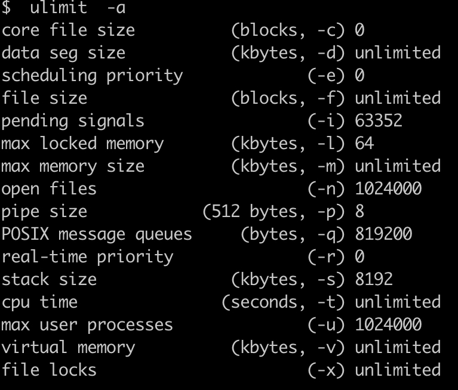

### 性能观察方法
1. 集成方案
   - cacti
1. cpu工具
   - ps
     1. 常用组合
        - ps aux
        - ps -ef
        - ps -eFH
     1. 参数解读
        - a：所有与终端相关的进程
        - x：所有与终端无关的进程
        - u：以用户为中心组织进程状态信息显示
        - -e：显示所有进程
        - -f：显示完整格式的进程信息
        - -F：显示完整格式的进程信息；
           - C：cpu utilization cpu占用百分比
           - PSR：运行于哪颗CPU之上
        - -H：以层级结构显示进程的相关信息；
     1. 指标解读
        - %CPU：cpu使用占比
        - %MEM：内存使用占比
        - VSZ：虚拟内存大小
        - RSS：占用物理内存大小，kb
        - STAT：进程状态
          1. R：running 运行
          1. S：interruptable sleeping 可中断睡眠
          1. D：uninterruptable sleeping 不可中断睡眠
          1. T：Stopped 停止
          1. Z：zombie 僵死态
          1. +：前台进程
          1. l：多线程进程
          1. N：低优先级进程
          1. <：高优先级进程
          1. s：session leader  进程领导者
        - TTY：命令所运行的位置(终端)
        - START：进程开始时间
        - TIME：占用CPU的时间
        - COMMAND：所执行的命令
   - top
     1. 功能
        - 基础：系统时间，系统运行时间，登录用户数，平均负载
          1. 平均负载：1、5、15分钟的指标，每5秒检查活跃进程数，特定算法算出，除以逻辑cpu数量高于5表示高负荷运转
        - 进程数：总数、运行数、休眠数、停止数
        - cpu使用率
        - 内存使用率
          1. total
          1. free：内核还未纳入控制的大小，纳入内核管理的内存不一定都在使用中，还包括过去使用过的现在可以被重复利用的内存，内核并不把这些可被重新使用的内存交还到free中去，因此linux上free内存会越来越少，但不用担心
          1. used：内核使用的内存
          1. buff/cache：缓存的内存大小
        - 内存交换率：swap
          1. total
          1. free
          1. used
          1. avail Mem
     1. 参数解读
        - USER：进程所有者
        - PR：进程优先级
        - NI：nice值
        - VIRT：virtual memory usage，指进程使用的虚拟内存总量，单位kb，VIRT = SWAP + RES
          1. 进程“需要的”虚拟内存大小，包括进程使用的库、代码、数据等
          1. 假如进程申请100m的内存，但实际只使用了10m，那么它会增长100m，而不是实际的使用量
        - RES：resident memory usage 指进程使用的、未被换出的内存大小，RES = CODE + DATA
          1. 进程当前使用的内存大小，但不包括swap out
          1. 包含其他进程的共享
          1. 如果申请100m的内存，实际使用10m，它只增长10m，与VIRT相反
          1. 关于库占用内存的情况，它只统计加载的库文件所占内存大小
        - SHR：shared memory 共享内存。计算某个进程所占的物理内存大小公式：RES – SHR
        - S：进程状态
        - %MEM：进程使用的物理内存百分比
        - TIME+：进程使用的CPU时间总计
     1. 命令
        - l：第一行是否显示
        - t：硬盘、cpu显示样式
        - m：内存显示样式
        - k：终止指定的进程
        - 
        - `shift+p`：占用cpu最高的进程
        - `top -Hp pid`：占用CPU最高的线程
        - `x`：高亮排序的列
        - `shift >/shift <`：左右切换高亮排序的列
   - mpstat
        - usr：用户态的cpu时间百分比，不包含nice值为负进程
        - nice：nice值为负进程的cpu时间百分比
        - sys：核心时间百分比
        - iowait：硬盘IO等待时间百分比
        - irq：硬中断时间百分比
        - soft：软中断时间百分比
        - steal：显示虚拟机管理器在服务另一个虚拟处理器时虚拟cpu处在非自愿等待下花费时间的百分比
        - guest：显示运行虚拟处理器时cpu花费时间的百分比
        - gnice
        - idle：cpu除去等待磁盘IO操作外的因为任何原因而空闲的时间闲置时间百分比
        - intr/s：每秒cpu接收的中断总数
   - htop
     1. F1到F10切换显示
1. 内存工具
   - free：分mem和swap两种，free的数据和top中的一致
   - vmstat
     1. 参数解读
        - r：run queue，运行队列里等待cpu的个数
        - b：被资源阻塞(blocked)的任务数(io/页面调度等)，通常接近0
1. 硬盘工具
   - sar
     1. -r：内存
        - kbmemfree：类似free命令的free，所以不包括buffer和cache
        - kbmemused：类似free命令的used，所以包括buffer和cache
        - %memused：kbmemused和内存总量(不包括swap)的百分比
        - kbbuffers和kbcached：free命令的buffer和cache
        - kbcommit：保证当前系统所需要的内存，即为了确保不溢出而需要的内存(RAM+swap)
        - %commit：kbcommit与内存总量(包括swap)的百分比
     1. -d 2 3：io
        - DEV：设备编号
        - tps：实际每秒的io次数，多个逻辑请求可能合成一个io请求
        - avgrq：请求的平均大小
        - avgqu：请求的平均队列长度
        - await：每次io操作的平均等待时间，包括队列和服务的时间，单位ms。和svctm接近则性能很好，高的话就io等待了
        - svctm：每次io操作的平均服务时间，单位ms
        - %util：向设备发送io操作的时间占比(设备的带宽利用率)，接近100%，则已满负荷，越高负荷越重
     1. -n：network
        - IFACE：interface，网络设备名称
        - rxpck/s：接收包数/每秒钟
        - txpck/s：发送包数/每秒钟
        - rxkB/s：接收字节数/每秒钟
        - txkB/s：发送字节数/每秒钟
        - rxcmp/s：接收压缩包数/每秒钟
        - txcmp/s：发送压缩包数/每秒钟
        - rxmcst/s：接收的多播包包数/每秒钟
   - iotop
     1. read/write_bytes/s
     1. TID
     1. PRIO
     1. DISK READ/WRITE
     1. SWAPIN
     1. IO>
   - iostat：cpu信息、读写速率、读写字节数大小
     1. rrqm/s、wrqm/s：进行merge的读写操作数量/每秒
     1. r/s、 w/s：完成读写io设备次数/每秒
     1. Blk_read/s、Blk_wrtn/s：块数/每秒
     1. Blk_read/Blk_wrtn：取样时间间隔内 读写扇区数量
     1. rsec/s、wsec/s：读写扇区数/每秒
     1. rkB/s、wkB/s：每秒读写kb/每秒。是rsec/s的一半，因为每扇区大小为512字节
     1. avgrq-sz：平均每次设备io操作的数据大小 (扇区)
     1. avgqu-sz：平均io队列长度
     1. await：平均每次设备io操作的等待时间 (毫秒)
     1. svctm：平均每次设备io操作的服务时间 (毫秒)
     1. %util：一秒中有百分之多少的时间用于 io 操作，或者说一秒中有多少时间io队列是非空的
1. 网络工具
   - netstat
     1. Active Internet connections
        - Proto：协议，tcp
        - Recv-Q：接收队列
        - Send-Q：发送队列
        - Local Address
        - Foreign Address
        - State：ESTABLISHED
     1. Active UNIX domain sockets：域套接字，和网络套接字一样，但是只能用于本机通信，性能可以提高一倍
        - Proto
        - RefCnt：进程号
        - Flags
        - Type：套接字类型，DGRAM、STREAM
        - State：状态，CONNECTED
        - I-Node
        - Path：执行的命令
     1. -s
        - Ip
        - Icmp
        - IcmpMsg
        - Tcp
        - Udp
        - UdpLite
        - TcpExt
        - IpExt
        - Sctp
   - ss
     1. `ss -o state established '( dport = :smtp or sport = :smtp )'`：显示所有已建立的SMTP连接
     1. `ss -o state established '( dport = :http or sport = :http )'`：显示所有已建立的HTTP连接
     1. `ss -x src /tmp/.X11-unix/*`：找出所有连接X服务器的进程
   - iftop
     1. h 切换是否显示帮助
     1. t 切换显示格式为2行/1行/只显示发送流量/只显示接收流量
     1. l 打开屏幕过滤功能，输入要过滤的字符，比如ip,按回车后，屏幕就只显示这个IP相关的流量信息
     1. N 切换显示端口号或端口服务名称
     1. S 切换是否显示本机的端口信息
     1. D 切换是否显示远端目标主机的端口信息
     1. p 切换是否显示端口信息
     1. P 切换暂停/继续显示
     1. b 切换是否显示平均流量图形条
     1. B 切换计算2秒或10秒或40秒内的平均流量
     1. T 切换是否显示每个连接的总流量
     1. L 切换显示画面上边的刻度刻度不同，流量图形条会有变化
     1. j 或 k 可以向上或向下滚动屏幕显示的连接记录
     1. 1 或 2 或 3 可以根据右侧显示的三列流量数据进行排序
     1. < 根据左边的本机名或IP排序
     1. > 根据远端目标主机的主机名或IP排序
     1. o 切换是否固定只显示当前的连接
   - nicstat：solaris平台下的，需要安装
   - traceroute/tracert
     1. 认识：利用IP数据包的ttl字段值 + tcmp，用于探测网络路径的数据包的IP之上的协议可以是udp、tcp或tcmp，显示经过的路由器ip和时间。ping只能显示终点
        - ttl：数据包生存时间，每次转发都减1，为0就丢弃
        - tcmp：产生一个主机不可达的tcmp数据报返回给主机
     1. 原理：ttl=1开始，循环+1探测经过的路由器，依赖tcmp返回获取路由器数据，同时使用udp的大于30000的端口，利用目的主机只能发送端口不可达的tcmp数据识别终点
        - tcmp：出于安全性考虑，大多数防火墙以及启用了防火墙功能的路由器缺省配置为不返回各种tcmp报文，其余路由器或交换机也可能被管理员主动修改配置变为不返回 tcmp报文，不一定能拿到所有的沿途网关地址
        - UDP：UDP常被用来做网络攻击，因为UDP无需连接，因而没有任何状态约束它，方便攻击者伪造源IP、伪造目的端口发送任意多的UDP包，长度自定义。所以运营商为安全考虑，对于UDP端口常常采用白名单ACL，如允许DNS/DHCP/SNMP等
     1. 使用模式
        - UDP模式：UDP探测数据包（目标端口大于30000） + 中间网关发回 tcmp ttl 超时数据包 + 目标主机发回 tcmp Destination Unreachable 数据包
        - TCP模式：TCP[SYN]探测数据包 + 中间网关发回tcmp ttl超时数据包 + 目标主机发回TCP[SYN ACK]数据包
        - tcmp模式：tcmp Echo (ping) Request 探测数据包 + 中间网关发回tcmp ttl超时数据包 + 目标主机发回tcmp Echo (ping) reply 数据包
1. 进程
   - pidstat
     1. CPU：处理进程的cpu编号
     1. Minflt/s：任务每秒发生的次要错误，不需要从磁盘中加载页
     1. Majflt/s：任务每秒发生的主要错误，需要从磁盘中加载页
     1. kB_rd/s：每秒从磁盘读取的kb
     1. kB_wr/s：每秒写入磁盘kb
     1. kB_ccwr/s：任务取消写入磁盘的kb。当任务截断脏的pagecache的时候会发生
     1. Cswch/s：每秒主动任务上下文切换数量
     1. Nvcswch/s：每秒被动任务上下文切换数量
     1. TGID：主线程的表示
     1. TID：线程id
1. 全局监控
   - top/htop：查看系统性能，htop高亮，3秒刷新一次
   - sar：System Activity Reporter 系统活动情况报告，最全面的系统性能分析工具之一，可以看文件读写、系统调用情况、磁盘I/O、CPU效率、内存使用、进程活动及IPC等，查看上下文切换数量`sar -w 1 10`
     1.  -A：所有报告的总和

     1.  -p：报告每个CPU的状态
     1.  –u：输出cpu使用情况和统计信息

     1.  -R：显示内存状态
     1.  -B：显示换页状态
     1.  -r：报告内存利用率的统计信息
     1.  -w：显示交换分区的状态

     1.  -b：显示I/O和传递速率的统计信息
     1.  -d：输出每一块磁盘的使用信息
     
     1.  -x：显示给定进程的装

     1.  –v：显示索引节点、文件和其他内核表的状态
     1.  -e：设置显示报告的结束时间
     1.  -f：从制定的文件读取报告
     1.  -i：设置状态信息刷新的间隔时间
   - dstat
     1. 认识：系统资源统计命令（动态）
     1. 常用组合
        - dstat -tpcdrmgln 2 2
     1. 参数解读
        - -c：cpu
        - -m：内存
        - -g：内存页速率
        - -s：交换分区
        - -d：磁盘
        - -r：io
        - -D sda,sdb：硬盘设备
        - -n：网络
        - --socket/--udp/--tcp/--raw/--ipc：tcp、udp端口状态

        - -lock

        - -p：进程
        - –top-cpu：最占用CPU的进程
        - –top-io：最占用io的进程
        - –top-mem：最占用内存的进程

        - -tpcdrmgln 2 2：各种指标刷新
        - --output xx.csv：输出，用excel生成趋势图
1. 指标
   - cpu
     1. 指标
        - id：CPU完全空闲百分比，不包括i/o等待时间，`idle`
        - sy：内核空间和中断占用CPU百分比，`system`
        - us：用户空间占用CPU百分比，`user space`
        - wa：io等待占比，`io wait`

        - cs：每秒做上下文切换的数，`context switch`
        - in：每秒被中断数，`interrupts`
        - hi：硬中断占比，`hardware interrupts`
        - si：软中断占比，`software interrupts`
        - ni：nice值，改变过优先级的进程占比，负值表示高优先级，正值表示低优先级
        - st：被Hypervisor偷去给其它虚拟机使用的CPU时间占比，steal time
        - load：1min、5min、15min：多核cpu需要除以核数才是正确答案
          1. 0：完全空闲
          1. 0.5：占用50%cpu，但是依然可以立即分配cpu给其他进程而无需等待
          1. 1：100%，需要等待另一个进程释放cpu，或者等待cpu时间过期
          1. 1.5：100%，并且15个任务只有5个请求CPU时间，超过1就是过载了，3极慢，5可能无法恢复正常
     1. 认识：如sy高us低，以及高cs，说明应用程序进行了大量的系统调用
        - CPU利用率
          1. User Time <= 70%
          1. System Time <= 35%
          1. User Time + System Time <= 70%
        - 上下文切换：与CPU利用率相关联，如果CPU利用率状态良好，大量的上下文切换可接受，一次切换需要2~5us，8核一般可达4万次每秒，5*40000/1000/8=25ms的成本
        - 可运行队列：每个处理器不超过3个线程
   - 内存：数据源头在/proc/meminfo
     1. 指标
        - memory
          1. total：不包括内核使用的总内存大小
          1. used：被使用的内存总额
          1. free：自由物理内存大小，单位kb
          1. buff：被用来缓存读写操作的大小，做磁盘缓存。缓存满了一次写，提高io性能(内存 -> 磁盘)
          1. cache：被用来缓存进程地址空间的大小，做文件缓存区。读取过的数据缓存起来，减少io(磁盘 -> 内存)，会动态调整
          1. share：多进程共享的内存总额
        - swap
          1. swpd：已使用的swap空间大小
          1. si：swap in，到内存的速率，单位block/s
          1. so：swap out，从内存出的速率
        - /proc/meminfo
          1. MemAvailable：MemFree不能代表全部可用的内存，有些内存虽被使用但可回收。MemAvailable = MemFree + 可回收的cache/buffer/slab等，这是系统估算值，不准确
          1. Buffers：直接访问块设备时缓冲区的总大小，有时对文件系统元数据的操作也会用到buffers。这部分内存不好直接对应到某个用户进程，应该算作kernel占用
          1. Cached：包括所有file-backed pages
          1. Mapped/LRU/Hugepages
     1. 认识
        - 留30%的内存
        - swap大小越少内存越够，如果swap的used不断变化，说明内存不够用，cpu在频繁进行内存和swap的数据交换
        - swap操作可导致io性能下降
        - 延迟、冲突、阻塞等因素影响机器性能
        - 内存黑洞：kernel没有统计所有内存分配，如动态分配的一部分，所以用量总和物理内存对不上
   - 硬盘：busy-percent、msec-weighted-total(io完成时间和积压)
     1. 指标
        - 容量相关
          1. df.bytes.free：磁盘可用量
          1. df.bytes.free.percent：磁盘可用量占比
          1. df.bytes.total：磁盘总大小
          1. df.bytes.used：磁盘已用大小
          1. df.bytes.used.percent：磁盘已用大小占比
          1. df.inodes.total：inode总数
          1. df.inodes.free：可用inode数目
          1. df.inodes.free.percent：可用inode占比
          1. df.inodes.used：已用的inode数据
          1. df.inodes.used.percent：已用inode占比
        - 性能相关
          1. read/write_bytes：大小
          1. read/write-ms&num：速率
          1. free-mount：剩余空间
          1. inodes-free：inode空余
          1. bi：每秒读取的块数，块大小为1024bytes
          1. bo：每秒写入的块数
          1. df.bytes.free.percent/fstype=ext4,mount=/
          1. df.inodes.free.percent/fstype=ext4,mount=/
          1. df.statistics.total
          1. df.statistics.used
          1. df.statistics.used.percent
        - 文件相关
          1. kernel.files.allocated
     1. 认识
        - iowait % < 20%
        - 提高性能可以提高命中率，一个方法为增大文件缓存区面积，缓存区越大预存的页面就越多，命中率也越高。内核希望尽可能产生次缺页中断（从文件缓存区读）并避免主缺页中断（从硬盘读），随着次缺页中断的增多文件缓存区也越大，直到系统只有少量可用物理内存的时候linux才开始释放一些不用的页
   - 网卡：接收/发送缓冲区等待处理的网络包耗时较少
     1. received、transmitted、drop、compressed、time-wait
     1. fifo.errs、errors
     1. reqTime
     1. out/in/dropped_bytes
     1. out/in/dropped_packets
     1. abort-ontimeout(达到最大重试时间/次数的次数)、time-outs(超时重传时间)
     1. Iface
     1. MTU
     1. RX-OK/RX-ERR/RX-DRP/RX-OVR
     1. TX-OK/TX-ERR/TX-DRP/TX-OVR
     1. Flg
     1. 端口：net.port.listen
     1. ss
        - ss.orphaned
        - ss.estab：tcp的estab状态的数量
        - ss.closed
        - ss.synrecv
        - ss.timewait：timewait数量
        - ss.slabinfo.timewait
   - 进程：fpm active processes
     1. 进程状态
        - R：正在执行中，run
        - S：静止状态，sleep
        - T：暂停执行，traced
        - D：无法中断的休眠状态(通常io等待的进程)
        - Z：不存在但暂时无法消除，僵尸进程
        - <：高优先序的行程
        - N：低优先序的行程
        - W：没有足够的记忆体分页可分配
        - L：有记忆体分页分配并锁在记忆体内 (实时系统或I/O)
     1. cpu相关
        - %guest：进程在虚拟机占用cpu的百分比
   - php
     1. accepted_conn
	 1. active_processes
	 1. idle_processes
	 1. listen_queue
	 1. listen_queue_len
	 1. max_active_processes
	 1. max_children_reached
	 1. max_listen_queue
	 1. slow_requests
	 1. total_processes
1. 分析
   - 很多参数可以看到系统从重启以来的数据，这个可用于分析系统平均负载
   - 内存
     1. VSZ：当程序真正用到内存时，内核再映射到物理内存
     1. 内存够用，si和so基本都是0，长期大于0，磁盘和cpu都被消耗，系统性能受影响
     1. free要和si、so一起看，free很少，si和so也很少、不代表系统性能不足
   - vmstat/mpstat差别：mpstat可显示每个处理器的统计，而vmstat显示所有。可用于分析程序运行的cpu均衡性
1. 火焰图
   - 认识：基于perf结果产生的svg图片，用于展示cpu调用栈。顶部有平顶就可能有性能问题
     1. perf：linux原生提供的性能分析工具，返回cpu正在执行的函数和调用栈，能够进行函数级和指令级的热点查找，可以分析CPU占用率，通常抽样频率是99Hz，结果不易阅读，火焰图就有了
        - 原理：perf通过linux的性能分析框架-性能计数器，通过分析硬件(cpu、PMU)和软件(软件计数器、tracepoint)进行性能统计
        - 步骤：每隔固定时间在CPU上产生一个中断，看当前哪个进程/函数，然后给对应的进程/函数加一个统计值，就知道CPU有多少时间在某个进程/函数上了
     1. y轴：调用栈，顶部是正在执行的，下方是父函数。越高调用栈越深
     1. x轴：抽样数，不是时间，是所有调用栈合并后，按字母排序。一个函数在x轴越宽执行的时间就越长
   - 安装
     1. `yum install perf`
     1. `git clone https://github.com/brendangregg/FlameGraph.git`
   - 使用
     1. 用perf生成报告
     1. 将报告转为图片
### 应用场景
1. 安全：SELinux，Security Enhanced Linux，安全强化Linux，是强制访问控制系统的一种实现，用于指明进程可以访问的资源，增强系统抵御0-Day的攻击
   - 特点：可查看、热更改、进程初始化/继承/执行三方面进行策略控制、控制范围包括文件系统/目录/文件/文件启动描述符/端口/消息接口/网络接口
   - 使用
     1. getenforce、/usr/sbin/sestatus -v：运行状态，Enforcing/Permissive/Disabled，记录警告并阻止/记录警告不阻止/禁用
     1. setenforce：Enforcing|Permissive|1|0，切换状态保持至关机，从Disabled切出时，要重启并重新创建安全标签(touch /.autorelabel && reboot)
     1. /etc/sysconfig/selinux、/etc/selinux/config：永久修改，修改后重启
1. 其他
   - tumx：多个界面，断网保存用户操作的界面
   - 数据恢复工具：ext3grep
   - 文件、目录的变动监控
     1. linux、android：inotify
     1. macOS、iOS、BSD：kqueue、FSEvents(比kqueue更高效、先进)
     1. windows：ReadDirectoryChangesW
     1. Solaris 11：FEN
   - inotify
     1. 认识：通过inode绑定和epoll通知链，实现高效、异步的监控
     1. 配置：`/proc/sys/fs/inotify`
        - max_user_watches
        - max_user_instances
        - max_queued_events
     1. 衍生工具：inotify-tools，提供命令行、api等
   - irqbalance
#### 进程守护
1. 工具：supervisor、systemd、monit(还能性能监控)
1. supervisor：进程管理器，用于保证进程的自动重启等。通过fork/exec的方式将这些被管理的进程当作supervisor的子进程来启动，配置进程命令即可，python写的
   - 启动
    ```sh
    supervisord -c supervisor.conf                                            // 通过配置文件启动supervisor
    supervisorctl -c supervisor.conf start/stop [all]|[zzg_worker]            // 启动停止所有/一个
    ```
   - 操作
     1. `supervisorctl start/stop/restart all/xx`
     1. `supervisorctl status`        //查看所有进程的状态
     1. `supervisorctl update`        //配置文件修改后使用该命令加载新的配置
     1. `supervisorctl reload`        //重新启动配置中的所有程序
   - supervisor的配置文件：supervisor.conf
    ```conf
    [unix_http_server]
    file=/tmp/supervisor_zzg.sock                   ; UNIX socket 文件，supervisorctl 会使用
    chmod=0770                                      ; socket 文件的 mode，默认是 0700
    chown=zhaozhigang:www                           ; socket 文件的 owner，格式： uid:gid

    [inet_http_server]                              ; HTTP 服务器，提供 web 管理界面
    port=0.0.0.1:9568                               ; Web 管理后台运行的 IP 和端口，如果开放到公网，需要注意安全性
    username=resource                               ; 登录管理后台的用户名
    password=1a2s3dqwe                              ; 登录管理后台的密码

    [supervisord]
    logfile=/tmp/supervisord_zzg.log                ; 日志文件，默认是 $CWD/supervisord.log
    logfile_maxbytes=50MB                           ; 日志文件大小，超出会 rotate，默认 50MB
    logfile_backups=10                              ; 日志文件保留备份数量默认 10
    loglevel=info                                   ; 日志级别，默认 info，其它: debug,warn,trace
    pidfile=/tmp/supervisord_zzg.pid                ; pid 文件
    nodaemon=false                                  ; 是否在前台启动，默认是 false，即以 daemon 的方式启动
    minfds=655350                                   ; 可以打开的文件描述符的最小值，默认 1024
    minprocs=65535                                  ; 可以打开的进程数的最小值，默认 200

    [rpcinterface:supervisor]
    supervisor.rpcinterface_factory = supervisor.rpcinterface:make_main_rpcinterface

    [supervisorctl]
    serverurl=unix:///tmp/supervisor_zzg.sock       ; 通过 UNIX socket 连接 supervisord，路径与 unix_http_server 部分的 file 一致
    ;serverurl=http://127.0.0.1:9001                ; 通过 HTTP 的方式连接 supervisord

    [include]                                       ; 包含其他配置文件
    files = /xdfapp/_zzg/*.conf
    ```
   - 子进程配置文件
    ```conf
    ; /etc/supervisor.d/*.ini
    [program:zzg_worker]
    process_name=%(program_name)s_%(process_num)02d
    command=php /xdfapp/develop/okayAdmin/artisan queue:work redis --daemon --sleep=1 --tries=1 --env=_lj
    autostart=true
    autorestart=true
    user=zhaozhigang
    numprocs=1
    redirect_stderr=true
    stdout_logfile=/tmp/zzg_worker.log


    ; xes的tw配置
    [program:confd-tw]
    command=/usr/local/bin/confd -config-file /home/www/confd-tw/etc/confd-tw.toml
    autostar=true
    autorestart=true
    redirect_stderr=true                            ; redirect proc stderr to stdout
    stdout_logfile =/dev/stdout
    stderr_logfile=/dev/stdout
    loglevel=info
    startretries=3000                               ; 启动重试次数
    stopwaitsecs=300                                ; 搞死子进程，等待操作系统将SIGCHLD返回给supervisor的秒数，超过了就直接SIGKILL
    startsecs=10                                    ; 确认是否启动成功的等待秒数
    ```
1. Systemd
   - 背景：linux采用init进程启动服务，如`/etc/init.d/apache2 start`或`service apache2 start`，缺点为只能串行启动，只启动脚本，不管其他事情，如session信号通知
   - 理解：linux系统自带，是操作系统一部分，直接与内核交互，性能出色、功能强大、面向目标，体系庞大复杂。给出目标及依赖条件即可执行。即将程序交给系统管理了，d是daemon的缩写，systemd取代initd，成为系统的第一个进程（PID等于1），其他进程都是它的子进程，EL7才能用
     1. 处理进程和服务
     1. 挂载文件系统
     1. 监控网络套接字(如动态开关进程)
     1. 运行时系统
   - 使用：systemctl，systemd的管理命令
     1. `systemctl xx start`：兼容service启停
     1. `systemctl enable xx`：开机启动
   - 功能：处理时称之为单元，有单元类型
     1. 服务单元：.service文件，控制unix上的传统服务守护进程，编写.service文件，通过设置参数决定某一命令的守护
     1. 挂载单元：.mount文件，控制文件系统的挂载，类似mount命令
     1. 目标单元：.target文件，控制其余的单元，通常是通过将他们分组的方式
     1. 文件单元：.wants文件，定义要执行的文件集合
#### DNS
1. DNS
   - 组成
     1. bind服务
        - 理解：加州大学开发的开源、稳定、应用广泛的dns服务
          1. 组成：域名解析服务、权威域名解析服务(级级查询中最终提供ip的服务)、dns工具
        - 安装：`yum install bind bind-chroot`，`apt-get install bind9`
        - 配置：options、logging、zone dns域解析
          1. 配置域名
            ```shell
            // named.conf
            zone "imooc.com" {                                                      // 一个域名一个 
                type master;                                                        // 主从配置
                file "imooc.com.zone";
            }
            // imooc.com.zone，@是保留字，表示当前域名
            $TTL 7200
            imooc.com. IN SOA imooc.com. jeson.imooc.com. (222 1H 15M 1W 1D)        // 解析域的开始
            imooc.com. IN NS dns1.imooc.com.
            dns1.imooc.com. IN A 10.10.10.135
            www.imooc.com IN A 2.2.2.2                                              // 解析了一个ip
            // 查询命令
            dig @ 10.10.10.135 www.imooc.com
            nslookup www.imooc.com
            ```
        - 应用场景
     1. bind负载均衡
        - dns转发：子域授权
        - dns主从模式：主从传输、主从同步、数据加密、事务签名
        - dns传输限制
### 运维内容
1. 组成
   - 基础：配机器
   - 私有云：openstack等
   - 监控
   - 网络
   - 开发：配套工具和功能开发
1. hypervisor
   - xen
   - kvm
   - vmvare vshpere
   - puppet：管理配置工具，ruby开发，cs方式运行
   - ansible
1. 监控
   - 意义
     1. 运行状态展示
     1. 故障发现、故障预警、故障定位
   - 如何使用
     1. 了解监控对象的运行过程、工作原理
     1. 确立监控指标
     1. 确立报警范围、报警阈值、报警等级
     1. 完善故障处理流程
   - 监控流程
     1. 收集数据：收集什么，怎么收集
     1. 存储数据：怎么存，保留多久
     1. 展示数据
     1. 故障报警：电话、短信、钉钉
     1. 报警处理：预案
   - 监控方面
     1. cpu使用情况
     1. 内存：已用、可用
     1. 磁盘：容量、io、读写效率
     1. 网络：出入流量、tcp状态
     1. 进程：运行状态、运行开销
     1. 服务：个性化需要
     1. api：可用性、响应时间
     1. 硬件：服务器、路由器、交换机
     1. 安全：攻击、漏洞
   - 监控工具
     1. grafana：非常强大的开源的度量分析和数据可视化工具，导入数据源即可用，数据支持广泛，丰富的dashboard、图表编辑
     1. 开源：zabbix(最常用)、nagios
     1. 数据收集、服务器指标收集
        - Open-falcon
        - Nightingale
        - TICK Stack：Telegraf
        - Thanos
        - VictoriaMetrics
        - M3DB
1. 操作系统性能监控体系
   - 组成：node_exporter+Prometheus+Grafana
     1. node_exporter：机器系统数据收集
1. cmdb
1. 技术
   - nat：网络地址转换服务，可基于状态过滤连接（就是内网出去的能回来，其他进不来），可做对外网的口子
   - lvm：逻辑卷管理，磁盘空间动态扩缩容
   - dns：智能dns，DNS view，可根据用户ip返回不同的ip，解决了同域名不同解析地址问题，使用bind 9
   - 标准化、自动化、平台化、服务化
   - DevOps：Developers+Operators
   - SRE：Site Reliability Engineer，网站可靠性工程师
   - SLA：Service-Level Agreement，服务等级协议，保证要提供的服务协议，包括正常运行时间占比，如运营商承诺的带宽、时延、抖动、丢包率
1. 实操
   - 网卡bond模式：linux多网卡的7种bond模式原理：bond0~6。通过多张网卡绑定为一个逻辑网卡，实现本地网卡的冗余，带宽扩容和负载均衡
     1. mode=0：平衡负载模式，有自动备援，但需要”Switch”支援及设定
     1. mode=1：自动备援模式，其中一条线若断线，其他线路将会自动备援
     1. mode=6：平衡负载模式，有自动备援，不必”Switch”支援及设定
1. 虚拟机网卡模式
   - nat模式：虚拟系统会通过宿主机的网络来访问外网，虚拟网络访问外网必须通过宿主机的ip地址。不需要手动分配ip地址和子网掩码，虚拟机可ping宿主机，反之不行
     1. 宿主机相当于有两个网卡
        - 真实网卡：链接了现实世界的真实路由器
        - 虚拟网卡：链接了一个可以认为是虚拟交换机，同时链接了虚拟机和宿主机
     1. 宿主机和虚拟交换机形成一个网段，宿主机和真实路由形成一个网段
   - 桥接模式：bridge，相当于局域网内创立了一个单独主机，需要手动分配ip地址和子网掩码，和真实主机在同一个网段，可以互相ping通
     1. 将虚拟网卡桥接到物理网卡上，和linux下一个网卡绑定两个不同地址类似，实际上是将网卡设置为混杂模式，从而达到侦听多个ip的能力
     1. 虚拟机和host机处于对等的地位，在网络关系上是平等的
   - 主机模式：host-only，仅让虚拟机与物理机通信，不能访问外网
1. 安全
   - ossec：开源的入侵检测系统
   - clamav：linux杀毒软件
### 最佳实践
1. 生产环境ulimit配置：
