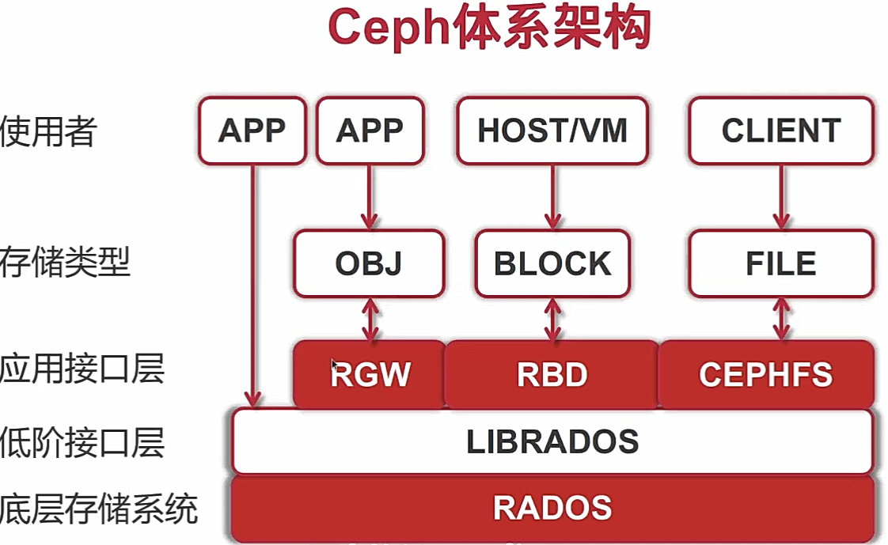

### 认识
1. 特点
   - 一切皆文件：linux环境下任何事物都以文件的形式存在
   - 对后缀不敏感
### 组成
1. 环境变量
   - 认识：系统预定义的参数，window也有
     1. 用冒号连接多个path，用$PATH表示之前的path
   - 作用
     1. 定义每个用户的操作环境。如PATH、ps1。有环境变量的配置文件
     1. 在程序里可以获得环境变量的值，根据值决定如何操作，运行，找路径，文件夹等等
   - 组成
     1. SHELL：当前用户使用的Shell
     1. HOSTNAME：主机名
     1. LANG：系统所用语言，`echo $LANG`
   - 配置文件
     1. mac默认地址
        - /bin、/sbin：系统命令目录
        - /usr/bin、/usr/sbin：用户程序命令目录
     1. 全局：系统启动时加载，针对所有用户生效
        - /etc/profile
        - /etc/paths
        - /etc/bashrc
        - /etc/environment
     1. 个人：按顺序依次加载，存在则终止
        - ~/.bash_profile
        - ~/.bash_login
        - ~/.profile
        - ~/.bashrc或~/.zshrc：shell打开时候加载，对应的shell分别为bash或zsh
   - 操作
     1. 查看
        - `echo $SHELL`：查看单个
        - `env`：当前用户所有
        - `export`：系统定义所有
        - `set`：显示所有本地定义的shell变量，也可以用作修改
     1. 设置
        - `export PATH=/php/bin:$PATH`：临时修改PATH，用:连接，用$PATH防止覆盖。仅对当前用户立即生效，关闭窗口后无效
        - `source .bash_profile`：使生效，修改后要么重新登录要么用source
1. 命令
   - 执行
     1. sudo、su、setfacl
     1. command1 && command2，可以一次执行两个命令，前一个报错则停止运行
     1. echo &?：获取上一条命令的错误码
     1. watch：可以重复执行命令，默认2秒间隔，搭配cat方便查看文件内容`watch cat xx`
        - -n：执行间隔时间
        - -d：高亮显示变化的区域
   - 重定向
     1. |：管道，前面输出作为后面输入。`cat file.txt | uniq | grep txt | sort`
     1. > >>：输出
        - `more file1 file2 file3 > file2`：清空file2
        - `cat file1 1 >> file2`：追加，1标准输出流
        - `> file3`：清空文件
        - demo
            ```shell
            cat > ~/xjj <<EOF
            echo "pleasant taste"
            EOF
            ```
     1. < <<：输入，表示当前命令的标准输入为来自命令行中一对分隔号之间的内容
     1. tee：将程序的输出结果重定向，同时显示和保存。`echo "127.0.0.1 foobar" | tee -a /etc/hosts`
     1. xargs：给命令传递参数的过滤器，捕获一个命令输出，传递给另外一个命令，一般和管道一起使用。因为很多命令不支持管道来传递参数
        - 可读取管道、标准输入、文件输出的数据，并转换成命令行参数
        - 可将单/多行文本输入转换为其他格式，例多行变单行，单行变多行
        - 默认命令为echo，换行和空白经过xargs处理被空格替代
     1. `2>&1 > /dev/null`，shell会自动打开和关闭0、1、2这三个文件描述符
        - /dev/null是黑洞，只写文件，写进去找不回来
        - 2>&1：&表示等同于，2等同于1
   - 通配符
     1. 分类
        - * 一个或多个
        - ? 单一字符
        - [] 包含在其中的任意字符，- 字符范围
     1. 举例
        - `ls /dev/sda[12345]`：出现/dev/sda1  /dev/sda2  /dev/sda3
        - `ls [0-9]?.conf`：以数字开头，随后一个是任意字符，接着以.conf结尾的所有文
   - wiki
     1. man/info：查看命令手册。帮助一般为：-h/-help/--help
     1. 输入语句中有空格需加双引号
        - 字符串参数最好采用是双引号括，一是以防被误解为shell命令，二是可以用来查找多个单词组成的字符串
     1. 命令的语法风格
        - UNIX 风格：选项可组合，选项前必有“-”连字符
        - BSD 风格：选项可组合，选项前不能有“-”连字符
        - GNU 风格：选项前有两个“-”连字符
     1. 参数的一般作用
        - i       忽略大小写
        - n       显示行号
        - r/-R    一般没区别
1. 输入输出
   - 分类
     1. 标准输入文件stdin 0
     1. 标准输出文件stdout 1
     1. 标准错误输出文件stderr 2
   - 命令
     1. echo：输出，-e 支持反斜线控制的字符转换，\a 警告音 \n 换行键 \r 回车键 \t 制表符，Tan键 \v 垂直制表符
     1. print：默认带换行符，printf 没有
     1. write/wall：给同一台机器正在登录的其他用户发消息，历史上最古老的即时通信，wall给所有人发
1. 日志
   - 认识：一般保存在/var/log目录下，linux日志守护进程为syslog，希望生成日志的程序都可以向syslog发送信息。发行版的日志系统都略有差异
     1. 类别
        - kern：系统内核
        - local0.local7：由自定义程序使用
        - auth/authpriv：用户认证日志，如login/su命令
        - ftp：ftp服务
        - cron：定时任务
        - daemon：守护进程
        - console：系统控制台
        - lpr：打印机
        - mail：邮件
        - mark：产生时间戳，系统每隔一段时间向日志文件中输出当前时间，每行的格式类似于 May 26 11:17:09 rs2 -- MARK --，可以由此推断系统发生故障的大概时间
        - news：网络新闻传输协议(nntp)
        - ntp：网络时间协议(ntp)，提供高精准度的时间校正，LAN上与标准间差小于1毫秒，WAN上几十毫秒
        - user：用户进程
     1. 优先级：emerg、alert、crit、err、warning、notice、info、debug
     1. 常用日志文件
        - /var/log/boot.log：系统开机自检
        - /var/log/syslog：只记录警告信息，常常是系统出问题的信息
        - /var/log/messages ：常见的系统和服务
        - /var/log/secure ：Linux系统安全日志，记录用户和工作组变坏情况、用户登陆认证情况
        - /var/log/btmp ：记录Linux登陆失败的用户、时间以及远程IP地址
        - /var/log/lastlog ：最后一次用户成功登陆的时间、ip等信息
        - /var/log/wtmp：该日志文件永久记录每个用户登录、注销及系统的启动、停机的事件，使用last命令查看
        - /var/run/utmp：该日志文件记录有关当前登录的每个用户的信息。如 who、w、users、finger等就需要访问这个文件
   - 命令
     1. journalctl：查看内存日志
     1. last：显示所有登入系统的用户信息
     1. lastlog：所有用户最后一次登录的时间信息
1. 时间
   - date：查看时间
     1. -s：设置系统时间
   - timedatectl：查看时间详细信息，时区等
   - chronyc：centos7.2开始用chrony同步时间
1. 配置
   - 查看：ulimit，用户资源限制
     1. -a：列出所有资源极限
     1. -c：设置core文件最大值
     1. -d：设置一个进程数据段的最大值
     1. -f：Shell创建文件的文件大小的最大值
     1. -h：指定设置某个给定资源的硬极限。如果用户拥有 root 用户权限，可以增大硬极限。任何用户均可减少硬极限
     1. -l：可以锁住的物理内存的最大值
     1. -m：可以使用的常驻内存的最大值
     1. -n：每个进程可以同时打开的最大文件数
     1. -p：设置管道的最大值，单位为block，1block=512bytes
     1. -s：指定堆栈的最大值：单位：kbytes
     1. -S：指定为给定的资源设置软极限。软极限可增大到硬极限的值。如果 -H 和 -S 标志均未指定，极限适用于以上二者
     1. -t：指定每个进程所使用的秒数,单位：seconds
     1. -u：可以运行的最大并发进程数
     1. -v：Shell可使用的最大的虚拟内存，单位：kbytes
     1. -x：最多能拿到的文件锁数量
1. 定时任务
   - crontab：linux原生定时器，只能支持到分
     1. -l
     1. -e：打开vi后添加`* * * * *(分时日月周) php index.php >> index.log`
     1. at：执行一次，`at 2:00 tomorrow`
   - 运维
     1. service crond start/stop/restart/reload/status
     1. chkconfig -level 35 crond on       加入开机启动
     1. ntsysv                             查看是否开机启动
1. 开关机
   - chkconfig：开机启动项
     1. --list
     1. --add/--del name
     1. --level 2345 name on/off
   - shutdown：关机、重启，是最安全的会保存用户的配置和服务。halt、poweroff、init 0：关机，reboot init 6：重启
     1. -h：关机
     1. -r：重启
     1. -c：取消前一个关机命令
   - 运行级别
     1. 0  关机
     1. 1  单用户，即window的安全模式，启动最小的程序模式，多用于修复系统
     1. 2  不完全多用户，不含NFS服务
     1. 3  完全多用户，标准的运行级
     1. 4  未分配
     1. 5  图形界面
     1. 6  重启
   - logout、exit、q：退出
   - 整个桌面进程都拖死，因为linux运行着7个工作台的，切到第一个工作台，杀死那个进程，ctrl+alt+1
#### 文件系统
1. 文件系统
   - 认识：启动时挂载根文件系统，之后可以挂载其他文件系统，要挂载到挂载点上，和虚拟文件系统、通用块设备层建立联系
     1. 挂载点：是linux访问磁盘的入口，所以一个系统可有不同的文件系统
   - 组成
     1. 用户层：应用，用户空间文件系统(FUSE)
     1. 内核层
        - SCI：System Call Interface，系统调用接口
        - VFS：Virtual File System，虚拟文件系统，是物理文件系统与服务应用之间的接口层，提供了mount等api
          1. 数据结构
             - superblock：Linux 用来标注具体已安装的文件系统的有关信息
             - inode：inode文件，每个文件/目录都有一个，记录逻辑块位置、权限、修改时间
               1. 间接索引：解决inode文件本身大小问题
             - desty：目录项，是路径中的一部分，所有的目录项对象串起来就是一棵 Linux 下的目录树
             - file：文件对象，用来和打开它的进程进行交互
        - General Block Device Layer：通用块设备层，统一对外输出底层不同的io接口
     1. 物理层：硬盘
   - 原理：这三点是层层递进的
     1. 把磁盘空间切成离散的、定长的block来管理
     1. 通过inode能查找到所有离散的数据（保存了所有的索引）
     1. 实现索引块和数据块空间的后分配
   - 操作系统使用的分类
     1. linux：ext3、ext4、xfs(建议)、zfs
     1. windows：fat、ntfs(只有这个合适)
     1. 移动/闪存
     1. 索尼的ps
     1. 操作系统中常用的文件系统
1. 块
   - 认识：操作系统的最小逻辑存储单位，一个或多个连续的扇区组成一个块，即逻辑块。NTFS叫簇，一般为4k
     1. 因为扇区众多寻址困难，就将相邻扇区组合一起，进行整体操作
     1. 分离对底层依赖：忽略对底层物理存储结构的设计
     1. 文件：由一个或多个逻辑块组成，且逻辑块之间不连续分布。逻辑块大于或等于物理块整数倍，所以多个扇区一起读
        - 文件拆块存储为了充分利用空间，不产生空洞
   - 层次关系：扇区→物理块→逻辑块→文件系统
   - 备份
     1. 文件级备份：一层层向下至扇区全部备份，慢
     1. 块级备份：指物理块复制，增量备份时只备份修改过的物理块
     1. 快照原理：新数据写入，旧数据移除，同时记录数据变化位图。实现方式由各个厂商自行决定，但主要技术分为2类
        - 写时拷贝：COW Copy On Write，创建快照时，仅复制原始卷的元数据。创建完成后，原始卷有写，快照会跟踪改变，将要改变的数据在改变之前复制到快照预留的空间里
          1. 越来越多的共享页面被分离出来，内存就会持续增长
          1. 读取是没有修改过的到原始卷上，修改过的到快照上
          1. 创建快照时，占用非常小，非常快，之后修改多了就变大了
        - 写重定向：ROW（Redirect On Write）
1. 本地文件系统格式
   - RAW：是一种磁盘未经处理或者未经格式化的文件系统。可能由于未格式化、格式化中途取消、硬盘出现坏道等
   - Ext
     1. 认识：只有linux支持
        - 拥有最快的读写速度和最小的cpu占用率，中小文件更有优势，得利于簇快取层的优良设计
        - 盘分区格式和其它操作系统完全不同，其C、D、E等分区的意义也和windows操作系统不一样
     1. 分类
        - Ext2：单一文件大小与文件系统本身的容量上限与文件系统本身的簇大小有关
        - Ext3
        - Ext4：最大支持1EB，单个文件最大16TB
     1. 原理：由inode（包含有文件的所有信息）进行唯一标识
   - XFS：centos7默认文件系统，最大支持18EB，单个文件最大8EB。用xfs/ext4不用ext3
   - FAT
     1.认识：File Allocation Table，是一种由微软发明并拥有部分专利的文件系统，一般指FAT32。Linux等都支持FAT
        - 容易产生文件碎片：不会将文件整理成完整片段再写入，长期使用会使文件数据变得逐渐分散从而减慢了读写速度，碎片整理是一种解决方法
        - 磁盘空间利用率低
        - 安全性较差
     1. 分类：指用xx位二进制数记录管理的磁盘文件管理方式
        - FAT12：最多32M，最多几十个文件
        - FAT16：最多2.1G
        - FAT32：分区通常不超过32G，单文件最大4G，从1997年Windows 95开始用
          1. 将文件数据与metadata一起存储，存储过程先将文件按照文件系统的最小块大小来打散（如4M的文件一个块4K打散成为1000个小块，过程中没有区分数据/metadata，每个块最后告知下一个要读取的块的地址
   - ExFAT：扩展FAT，专为闪存和U盘设计，空间浪费小
   - NTFS
     1. 认识：New Technology File System，新技术文件系统。Windows NT以后开始普及
        - 比FAT更新，处理速度更快，碎片更少
        - 分区最大2T，支持分区、文件夹、文件的压缩
        - FAT32分区能够在DOS下直接访问，NTFS不能
   - VFAT：长文件名系统，一个与Windows系统兼容的Linux文件系统，支持长文件名，可以作为Windows与Linux交换文件的分区
1. 网络文件系统
   - 认识
     1. 发展趋势：软件定义存储 SDS，软件定义网络 SDN
     1. 基于文件的存储系统中，文件是通过文件目录进行寻址
     1. 分布式文件系统和网络文件系统(对象存储系统)的区分要分清
   - 网络存储协议
     1. NFS：sun公司研制的unix表示层协议，unix常用，基于UDP/IP协议，主要采用RPC实现，因为nfs不同的功能都会使用不同的程序来启动，rpc沟通对应的网络端口来交互
        - 权限需要搭配NIS，Network Information Services，以用户组和/etc/passwd来判断权限(和本地权限一样)
     1. CIFS: Common Internet File System 通用网络文件系统，windows主机之间共享的协议，samba实现了这个协议
        - SMB：Service Message Block，服务器消息块协议，在windows中被称为“Microsoft Windows 网络”，基于CIFS开发，被称为CIFS/SMB协议
     1. AFP：运行macOS的apple设备的专有协议
   - 分类
     1. NFS：Network File System，网络文件系统，通过网络让不同的机器、不同的操作系统可以共享文件，让pc将网络中的NFS服务器共享的目录挂载到本地的文件系统中，使用非常便利。一般用来存储静态数据，工作在内核模式下
     1. Samda：基于SMB协议的开源软件，linux上共享文件和打印机等资源，是cs型，client(linux)访问server(windows)的资源，两个系统文件共享
     1. AFS：Andrew File System，分布式文件系统，用于管理分部在不同网络节点上的文件，采用安全认证和灵活的访问控制提供一种分布式文件系统，卡内基梅隆大学开发，结构与NFS相似，但有所增强
     1. DFS：Distributed File System，分布式文件系统
1. 分布式文件系统
   - 认识：通过网络在多台主机上存储的文件系统。新手用fastdfs，淘宝tfs，七牛。阿里云nas用于存日志、小文件等，oss
     1. 如同访问本地磁盘
     1. 容错：部分节点损坏，数据不丢失，系统可继续运行
     1. 海量存储
     1. 扩展性强
     1. 文件副本进行负载均衡
     1. 进行特定索引文件计算
   - 分类
     1. 应用级：GFS、HDFS、Ceph、GridFS、mogileFS、TFS、FastDFS
        - Lustre：存储量PB起步，万级节点
        - HDFS：Hadoop内置，价格低廉，高可靠性，高容错性，小文件过多的情况HDFS不能很好的支持
     1. 系统级
   - 历史
     1. 80年代：NFS(linux的文件共享服务)、AFS
     1. 90年代：SFS、Tiger Shark
     1. 2000年：GFS
     1. 最近：Lustre
   - 知识基础
     1. 分布式数据排布算法，集群元数据管理
     1. 分布式一致性算法，分布式层数据副本/分片一致性协议，选主等
     1. 单盘存储引擎，文件系统
   - wiki
     1. san和das对于iops和存储性能有很强要求的可以使用，如mysql使用，因为假定存入的数据都不会丢
     1. ceph等分布式系统通常假定任何设备都是不可靠的，算法都有冗余存储，
1. ceph
   - 认识：开源的分布式的统一存储系统，通过一系列管理和存储节点分开、副本读写、重新hash定位等方式实现高可用、高性能。openstack的默认后端，redhat也支持
     1. 是以服务器的形式存在，管理1TB大约需要1GB的内存
     1. 以我司踩坑的经历来看，没有深入ceph代码定制修改的能力，就不要给ceph太大压力。否则分分钟给你脸色看。ceph在元数据太多或者修复磁盘损坏的时候贼容易挂掉
   - 特点
     1. 低成本
     1. 高性能
        - 摒弃传统的集中式存储元数据寻址的方案，采用CRUSH算法，数据分布均衡，并行度高，基于计算的扁平寻址设计(可以直接和服务端任意节点通信)
        - 考虑了容灾域的隔离，能够实现各类负载的副本放置规则，例如跨机房、机架感知等
        - 能够支持上千个存储节点的规模，支持TB到PB级的数据
     1. 高可用
        - 副本数可以灵活控制
        - 支持故障域分隔，数据强一致性
        - 多种故障场景自动进行修复自愈
        - 没有单点故障，自动管理
     1. 高可扩展性
        - 去中心化
        - 扩展灵活，对象通过唯一的标识符进行寻址，并存储在扁平的寻址空间中，通过算法动态计算存储和获取某个对象的位置
        - 随着节点增加而线性增长
     1. 特性丰富
        - 支持三种存储接口：块存储、文件存储、对象存储
        - 支持自定义接口，支持多种语言驱动
   - 接口
     1. Block：支持精简配置、快照、克隆
     1. File：Posix接口，支持快照
     1. Object：有原生的API，而且也兼容Swift和S3的API
   - 组件：：
     1. RADOS：ceph集群精华，用户实现数据分配、Failover等集群操作
     1. Libradio：因为RADOS是协议很难直接访问，因此上层的RBD、RGW和CephFS通过librados访问，提供PHP、Java、Python、C和C++支持
     1. Object：最底层的存储单元，每个Object包含元数据和原始数据
     1. MDS：Ceph Metadata Server，是CephFS服务依赖的元数据服务
     1. OSD：Object Storage Device，负责响应客户端请求返回具体数据的进程
     1. CRUSH：数据分布算法，类似一致性哈希，让数据分配到预期的地方
     1. PG：Placement Grouops，逻辑概念，一个PG包含多个OSD。引入PG这一层其实是为了更好的分配数据和定位数据
     1. Monitor：需要多个Monitor组成的小集群，通过Paxos同步数据，用来保存OSD的元数据
     1. RBD：对外提供的块设备服务
     1. CephFS：对外提供的文件系统服务
     1. RGW：对外提供的对象存储服务，接口与S3和Swift兼容
   - 同类
     1. FastDFS：开源国产的分布式文件存储系统，实现了冗余备份、负载均衡、线性扩容等机制，注重高可用、高性能，提供上传、下载功能。Tracker集群提供负载均衡等调度，Storage集群提供存储
1. wiki
   - 写文件流程，和读相反
     1. 先写实际存储的数据，按照逻辑块的粒度存储
     1. 再写inode元数据，存储逻辑块的位置等其他信息
   - 多级索引寻址性能
     1. 访问小文件中的任意数据理论只需要两次读盘，一次读 inode，一次读数据块
     1. 访问大文件中的数据则需要最多五次读盘操作：inode、一级间接寻址块、二级间接寻址块、三级间接寻址块、数据块
   - 文件大小和实际物理占用不同，实际物理空间占用则是要看用户数据放了多少个block
   - 文件/目录存储原理
     1. 分为元信息、实际数据
        - 存储属性：找到空i-node，存储文件小大、所有者、创建时间，inode用于区分文件
        - 存储实际数据：找到n个自由块，将数据依次写入
        - 将磁盘序号写入i-node
        - 文件名写入目录，将文件名和i-node连接起来
#### 网路
1. 认识
   - 端口号1024以下是系统保留的，总共65526个
1. 组成
   - /etc/sysconfig/network-scripts/ifcfg-eth0
   - hostname
   - ifdown/ifup
   - ethtool
   - 防火墙：都是内核的netfilter在干活，以下2个作用都是维护规则
     1. iptables
        - 编辑：`vim /etc/sysconfig/iptables`
        - 增加：`-A INPUT -m state --state NEW -m tcp -p tcp –-dport 80 -j ACCEPT`
        - 状态/重启/关闭：`/etc/init.d/iptables status/restart/stop`
     1. centos7防火墙配置
        - 添加端口：firewall-cmd --zone=public --add-port=80/tcp --permanent
        - 查看端口：firewall-cmd --zone=public --list-ports
        - 开关：systemctl start/disable/restart firewalld
   - route
        - 认识：可显示、操作ip路由表，可设置网关来访问Internet
        - 操作
          1. 查看
             - -n：不显示主机名，直接显示ip、port
          1. 操作：`route add/del [-net|-host] [网域或主机] netmask [mask] [gw|dev]`
             - -net    ：表示后面接的路由为一个网域
             - -host   ：表示后面接的为连接到单部主机的路由
             - netmask ：与网域有关，可以设定netmask决定网域的大小
             - gw      ：指定网关ip
             - dev     ：指定发送网卡，如eth0
        - 实操：`route add -net 192.168.62.0 netmask 255.255.255.0 gw 192.168.1.1`
        - 结果解析
          1. Destination：目标网络或目标主机
          1. Gateway：网关地址，没有显示星号
          1. Genmask：网络掩码
          1. Flags：总共有多个旗标，代表的意义如下：                        
             - U：该路由是启动的                      
             - H：目标是主机而非网域                      
             - G：需要透过外部的主机来转递封包                      
             - R：使用动态路由时，恢复路由资讯的旗标                      
             - D：已经由服务或转port功能设定为动态路由                       
             - M：路由已经被修改了                      
             - !：这个路由将不会被接受
          1. Metric 距离、跳数。暂无用
          1. Ref：恒为0，Number of references to this route. (Not used in the Linux  ker-nel.)
          1. Use：该路由被使用的次数，可以粗略估计通向指定网络地址的网络流量。
          1. Iface：网络接口名
1. 参数
   - 查看
     1. 查看进程连接、排队状况：`netstat -lntup`
     1. 查看各个tcp状态的数量：`netstat -an | awk '/^tcp/ {++S[$NF]}  END {for (a in S) print a,S[a]}'`
   - 连接队列设置
     1. SYN queue：`/proc/sys/net/ipv4/tcp_max_syn_backlog`
        - 查看SYN queue溢出：`netstat -s | grep LISTEN`
     1. Accept queue：`/proc/sys/net/core/somaxconn`或/etc/sysctl.conf的`net.core.somaxconn=128`
        - 查看Accept queue溢出：`netstat -s | grep TCPBacklogDrop`
     1. 重传SYN+ACK次数：`net.ipv4.tcp_synack_retries`：默认为5，表示重发5次，每次等待30~40秒，即半连接默认时间大约为180秒
     1. keepalive相关
        - tcp_keepalive_time：从连接开始到发送探测数据包之间的空闲时间
        - tcp_keepalive_probes：发送探测数据包的最大数量，之后关闭连接
        - tcp_keepalive_intvl：发送两个探测数据包的间隔时间
   - 路由设置
     1. 子网通信：两个子网想要通信，需要连接两个网络的路由器，或者同时位于两个网络的网关
     1. 永久保存路由
        - `/etc/rc.local`添加
        - `/etc/sysconfig/network`添加到末尾
        - `/etc/sysconfig/static-router`：`any net x.x.x.x/24 gw y.y.y.y`
1. tcp连接
   - 四元组：源ip、源port、目标ip、目标port，都相同了才是一条相同的tcp连接
   - 资源耗费：寻找最近的资源瓶颈
     1. 端口：操作系统自动分配可用的
        - 可用端口范围
          1. 查看：`cat /proc/sys/net/ipv4/ip_local_port_range`
          1. 设置：`vim /etc/sysctl.conf：net.ipv4.ip_local_port_range`
          1. 生效：`sysctl -p /etc/sysctl.conf`
     1. 文件描述符：每一个tcp链接就要一个fd，就是数字
        - 查看可打开的最大数量
          1. 整个系统：`cat /proc/sys/fs/file-max`
          1. 指定用户：`cat /etc/security/limits.conf `
          1. 单个进程：`cat /proc/sys/fs/nr_open`
        - 修改：`echo 10000 > /proc/sys/fs/nr_open`
     1. 线程：默认一个tcp占用一个线程，用io多路复用
     1. 内存：tcp本身和其缓冲区，都要占用内存
     1. cpu：上下文切换成本
1. 问题定位
   - network
     1. telnet：检测端口是否正常
        - `telnet 10.2.4.100 17778`
     1. ping：有些可能禁止检测
     1. mtr -rzn ip
     1. strace：跟踪系统调用的执行
        - 查看统计：`strace -p xx -c`
        - 查看实时：`strace -p xx -T -s 4094`
     1. netstat：
        - `netstat -s | grep LISTEN`
        - `netstat -s | grep TCPBacklogDrop`
     1. ss -l
     1. tcpdump
   - log
     1. dmesg：查看系统日志
        - /var/log/message
   - pstack
   - gdb
   - ltrace
#### 软件安装
1. 软件安装
   - RedHat
     1. rpm：以.rpm结尾的软件包名称，方便安装/升级/卸载，不能处理包依赖
        - -q：查询
        - -q afilcdR：查询已安装的，文件名绝对路径，安装包信息，安装目录，配置文件，文档位置，所依赖的文件
        - -qpi：查询未安装的，版本信息
        - –requires：显示依赖信息
        - -i：安装
        - -ivh：安装，显示文件信息，显示安装进度
        - -U：升级
        - -Uvh：升级，显示文件信息，显示安装进度
        - -e：卸载，先用-q查询名称
        - --import：签名导入
     1. yum：Yellow dog Updater Modified，包管理工具，基于rpm，epel是yum的扩展源
        - 参数
          1. search/info
          1. install/update/remove
          1. list/info installed/updates
        - 查看安装的服务：`rpm -qa | grep xx`
        - 查看安装的位置：`rpm -ql xx`
        - 配置yum源：配置分两部分，全局配置项为/etc/yum.conf，定义每个源/服务器的具体配置在/etc/yum.repo.d的rep文件
   - Debian
     1. deb/dpkg：软件包名称，比rpm晚，`dpkg -l`
     1. apt-get：包管理工具，基于deb。`install/remove/purge`
   - ArchLinux
     1. pacman：软件包管理器，将二进制包格式和易用的构建系统结合，软件都能很方便管理。是Arch Linux的一大亮点，如安装sublime `pacman -S sublime-text`
1. VirtualBox安装虚拟机、连接网络
   - 安装：blog.csdn.net/risingsun001/article/details/37934975
   - 调通网络
     1. vi /etc/sysconfig/network-scripts/ifcfg-eth0
        ```
        NM_CONTROLLED=no
        ONBOOT=yes  #自动启动
        BOOTPROTO=dhcp  #动态IP
        ```
     1. service network start
   - 调通ssh：blog.csdn.net/risingsun001/article/details/38040451
1. ssh省去输入密码
   - ssh -kengen
   - cd ~/.ssh
   - ssh -copy-id peter@happypeter.net       // 把公钥复制到服务器上
### 基本操作
1. 查看状态
   - 系统信息
     1. uname -a：显示系统信息
     1. uptime：当前系统时间、开机到现在运行时间、用户在线数、系统平均负载
     1. runlevel：查看系统运行级别，修改系统默认运行级别`cat /etc/inittab id:3:initdefault:`
     1. dmesg：显示内核相关信息
   - 系统版本
     1. `cat /etc/redhat-release`：查看centos版本
     1. `cat /proc/version`：查看内核版本
     1. `getconf LONG_BIT`：查看centos位数
   - 内核
     1. `cat /proc/sys/kernel`
   - 硬件
     1. `cat /proc/cpuinfo`：cpu信息
     1. `lscpu`：cpu信息
   - 硬盘
     1. `cat /proc/meminfo`：查看物理内存和文件缓存情况
   - 状态
     1. ps
     1. top/htop
     1. dstat
     1. vmstat
     1. iostat
     1. netstat
     1. nicstat
     1. pidstat
     1. mpstat
        - 认识：Multiprocessor Statistics，实时系统监控工具，查看cpu信息
        - 使用
          1. `mpstat`：从启动以来的平均值
          1. `mpstat 5 2`：生成2个间隔5秒的报告
          1. `mpstat -P ALL 5 2`：分别查看每个cpu
1. 内存
   - free：-m 以兆显示内存状态
   - vmstat：Virtual Meomory Statistics，虚拟内存统计信息，是实时系统监控工具，包括进程情况、内存情况、交换页、I/O、系统中断、CPU。`vmstat/vmstat 3/vmstat 3 3`：用法和mpstat一致
     1. `vmstat -a`：查看活动和非活动内存
   - pmap：查看进程内存占用信息。`pmap -d xx`
1. cpu
   - nice：设置cpu使用优先级，如用来对付那些缓慢而且漫长的io进程
#### 文件、目录
1. 认识
   - 目录结构
     1. 系统目录
        - /：根目录，不要存放文件，/etc、/bin、/dev、/lib、/sbin应该和根目录在一个分区中
        - /boot：启动文件存放
        - /etc：系统配置文件
        - /dev：设备文件
        - /sbin：可执行命令
        - /lib：函数库
        - /srv：数据
        - /var：数据经常变化
        - /mnt：磁盘挂载点
        - /proc：内存数据
     1. 软件安装目录
        - /opt：存放应用安装
        - /usr：/usr/bin 存放应用程序，/usr/sbin 存放可执行文件，/usr/local 习惯安装应用程序
     1. 其他目录：/home、/root、/tmp、/lost+fount
   - wiki
     1. .开头的文件和目录都是隐藏的
     1. ls -l参数下-为文件、d为目录、l为符号链接；目录是蓝色的
1. 查看
   - 目录
     1. pwd
     1. ls [dir]：查看当前或指定目录。-l：列表详细查看，-lh：以兆查看文件大小，-S：按照大小排序，--full-time：完整修改时间查看
   - 文件
     1. stat：查看文件详情信息，修改时间、Inode、Links数等
     1. file：查看文件类型
     1. hexdump：查看二进制文件
   - 搜索
     1. find：查找具有某些特征的文件或目录，可遍历整个文件系统。`find pathname -options`：路径+命令选项
        - -type：f文件，d目录，p管道文件，i符号链接文件，b块设备文件，e字符设备文件
        - -name：按照文件名查找
        - -print：显示文件名
        - -depth：查找层级
        - -mtime -n +n：按照修改时间查找，-n表示距现在n天以内，+n表示距现在n天以前，还有atime、ctime
        - -newer file1 !file2：查找更改时间比file1新，但比file2旧的
        - -exec：执行操作
        - -perm：按照文件权限查找
        - -user：按照文件属主查找
     1. locate：系统全局范围定位文件，从database中查找数据。一般一天更新一次，更新文件数据库`updatedb`。-r：正则
     1. whereis
1. 操作
   - 目录切换
     1. cd：回到用户主目录
     1. cd ../../：连续向上
     1. cd -：回到上一次的目录
   - 创建
     1. mkdir
        - -p dir/dir：递归创建
     1. vi/vim file
     1. touch file
   - 删除
     1. rm
        - -r dir：删除目录
        - 文件防删除：chattr +i|-i file：加/解除提醒
   - 复制
     1. cp
        - -r dir1 dir2：递归复制
   - 移动
     1. mv file|dir dir/
     1. rename
   - 链接
     1. ln/link：文件或目录，默认硬链接
        - 硬链接：多个路径指向一个inode号，最后inode号删除才删除文件，可防止误删除
        - 软连接：-s，即符号链接，类似快捷方式
     1. unlink
1. 查看内容
   - cat：查看文件内容，整个文件都载入
     1. `cat file1 file2`：同时查看两个文件
     1. `cat -n file | grep ''| more`：分页查看
     1. `cat file > xxx.txt`：将显示结果保存到文件
     1. `cat -n file | tail -n +92 | head -n 20`：92行之后的查询结果中显示前20
   - tac：反向查看文件内容
     1. -s：到某一字符串停止
   - head/tail：输出文件头/尾
     1. -n：行数
     1. -f：tail不停显示
     1. `tail -n +1000`：从1000行开始显示以后的
   - less/more：分页查看内容，一点点载入；less在另一屏打开，不占用当前屏幕内容
     1. -M：显示更多文件信息：页码等
     1. enter：下一行
     1. space：下一屏
     1. B：上一屏
     1. /：字符查找，n查找下一次，gg到文件头，G到文件尾，q退出
     1. =：显示当前行号
     1. 数字 + 回车：向下多少行
   - awk：
     1. 认识：从文件或字符串中基于指定规则浏览和抽取信息，是一种自解释的编程语言。`awk [options] 'command' files`。三剑客：awk sed grep
        - awk脚本：用awk命令解释器作为脚本的首行，以便通过键入脚本名称来调用它
        - 域标识：浏览域，标记为$1/$2/$n，$0为所有域
        - 默认用空格识别分块，是逐行处理的
     1. 关键字
        - NEXT显示告诉去下一行
        - GEGIN
        - END关键字代表一个触发器，当前面的输入全部完成后才会执行END {}中的语句
     1. 变量
        - 用法：$FS
        - 分类
          1. FS：设置分隔符
     1. 运算符
        - + - * / % ^
        - == !- >= ~(匹配)
     1. 使用
        - 输出所有行
          1. `awk '{print $0}' file`
          1. `awk -F : '{ print $1 }' file`：以:作为分隔符
        - 给结果加上头尾字符串：`awk 'BEGIN {print "begin\n"}{print $1 "\t" $4} END{print "end"}' file`
        - 匹配第一个行是xx：`awk '{if($1=="xx") print $0}' file`
     1. 例子
        - 每日pv多少，即按每天分组，用日期去重倒序排序取前三表示：`awk '{print substr($4, 2, 11)}' access.log | sort | uniq -c | sort -rn | head -n 3`
          1. uniq是前后两两比较排序，所以需要sort
        - 每日uv多少，用访问ip去重统计表示：`awk '{print $1}' access.log | sort | uniq | wc -l`
        - 相同ip访问次数，空格分隔：`cat filename | awk -F '' '{print $1}' | sort | uniq -c`
        - 每日的uv数量：`awk '{print substr($4, 2, 11) " " $1}' access.log | sort | uniq | awk '{uv[$1]++;next}END{for (ip in uv) print ip, uv[ip]}'`
        - 找出目录下的最大的文件和最小的文件，输出平均大小
            ```shell
            # 思路： ls 有一个参数大写字母S，会把文件从大到小排序，
            # 排序后，最大文件就是第一行（NR＝1），最小文件就是最后一行，平均大小为（累计总大小/NR）
            cat 1.awk
            BEGIN {total=0}
            {
                if(NR==2) print "max file:"  $NF, "size " $5
                total+=$5
            }
            END {
                print "min file:" $NF, "size " $5
                print "mean file size: " total/NR
            }
            ```
   - sed
     1. 认识：文本过滤工具，是一种非交互性的文本流编辑
     1. 运行方式：`sed [options] 'command' files`，脚本执行方式：`sed[options] -f sed脚本文件`
     1. 查找文本方式：行号(可范围)，正则
     1. 选项
        - -n：只打印匹配信息
     1. 操作模式：替换c\，删除d，后附加a\，打印p，显示行号h，前插入i\，
     1. 使用
        - `sed '2,4p' file`：打印2到4行
        - `sed '/xx/p' file`：匹配并打印
        - `sed '/xx/a\XX' file`：匹配到xx后附加XX
        - `sed '2,/xx/p' file`：从第二行开始直到正则匹配第一个并打印
        - `sed '2,4d' file`：删除2到4行
   - grep：过滤作用，`grep [options] '基本正则表达式' file`
     1. -n：只显示匹配行及其行号
     1. -c：只输出匹配行的数量
     1. -i：不区分大小写（只适用于单个字符）
     1. -H：只显示文件名
   - cut：内容查看、删除指定部分
     1. -b：指定范围
     1. -c：指定行显示，如-c1-3为1到3行
     1. -d：指定字段分隔符
     1. -f：显示指定字段
   - wc：Word Count，统计文件或输入
     1. -c：字节数
     1. -l：行数
     1. -m：字符数
     1. -w：字数
   - sort：排序显示
     1. -u：删除同样行
     1. -r：逆序
     1. -c：测试文件是否已排序
     1. -m：合并两个排序文件
     1. -o：存储sort结果的输出文件名
     1. -t：域分隔符，用非空格或tab开始排序
     1. +n：n为列号，使用此列号开始排序
     1. -n：指定排序是域上的数字分类项
   - uniq：过滤显示
     1. -u：只显示不重复行
     1. -d：只显示有重复数据行
     1. -c：打印每一重复行出现次数
   - join：连接显示 
   - split：切割显示
     1. -l，每个分割文件的行数，-n同-l
     1. -b，每个分割文件的大小n
     1. -C，每个分割文件一行最多n字节
   - cut：截取显示
     1. -c n-m：截取的字符范围，单位字符
   - diff：查看文件差异
   - md5sum：查看校验和，32位小写
     1. `md5sum a.sql`
     1. `echo -n "hello world"|md5sum`
1. 解压缩
   - tar
     1. tar.gz
        - zxvf：解压缩
        - zcvf：压缩
     1. tar.bz2
        - jxvf：解压缩
        - jxvf：压缩
   - zip/unzip
     1. `zip -r xx.zip dir/`
     1. `unzip xx.zip`、`unzip -o xx.zip -d dir/`
   - gzip/gunzip：gz结尾
     1. -d：解压缩
   - bzip2/bunzip2
   - rar/unrar
   - ar
1. vim
   - 打开
     1. vim +n file：打开文件，置于第n行首
     1. vim + file：打开文件，置于最后一行首
     1. vim +/pattern file：打开文件，光标到第一个匹配的地方
     1. vim file file：打开多个，依次编辑
   - 状态
     1. 视图模式：v、V、ctrl+v、y、d
     1. 编辑模式：i、a、r
     1. 命令行模式：: / ?
     1. :setnu：显示行号
     1. :syntax on：语法高亮
     1. ctrl+b：向上翻一屏
     1. ctrl+f：向下翻一屏
   - 跳转
     1. :n/nG：跳到n行
     1. nk：向上移动n行
     1. nj：向下移动n行

     1. space：右移一个字符
     1. backSpace：左移一个字符

     1. w：右移一个字到字首
     1. b：左移一个字到字首
     1. e：右移一个字到字尾

     1. (：移到句首
     1. )：移到句尾
     1. {：移到段落开头
     1. }：移到段落结尾

     1. H：移至屏幕顶
     1. L：移至屏幕底
     1. gg：移至第一行
     1. G：移至最后一行
   - 操作
     1. 插入
        - i：在光标前
        - a：在光标后
     1. 删除
        - d$：删至行尾
        - do：删至行首
        - dd：删除当前行，ndd删除当前和之后的n-1行
     1. 复制粘贴
        - yy：复制当前行，nyy复制n行
        - p：之后粘贴，之前粘贴P
     1. 撤销
        - u：撤销
     1. 查找替换
        - /pattern：向文件尾搜索
        - ?pattern：向文件首搜索
        - n/N：向下上继续搜索
     1. 书签
        - m[a-z]：打书签，a-z26个字母
        - `a-z：移动到书签
##### 用户、权限
1. 用户和用户组
   - 查看
     1. /etc/passwd
     1. /etc/group
     1. who、w：显示当前用户，w更加详细(显示当前所有已登录的用户)
   - 管理
     1. id
     1. useradd/usermod
     1. groupadd/groupmod/groupdel
   - 操作
     1. passwd：修改密码
1. 权限
   - 认识
     1. 分类：r、w、x
     1. 目录含义
        - r：可查看目录下内容
        - w：对目录里文件进行创建、删除、重命名等操作
        - x：可进入到目录中
     1. 文件模式：即rwxr-r--
   - 操作
     1. chmod：改变权限，以8进制控制文件模式
     1. chown：改变所有者和组
        - -R：递归修改
        - +x：添加
     1. owner
     1. group
     1. setfacl
     1. chgrp
     1. su/sudo
##### 实践操作
1. find
   - 全局查找文件：`find / -name "nginx.conf"`
   - 查找txt结尾的文件并输出：`find -name "*.txt" -print`
   - 查找所有sh文件并输出：`find ".sh" -print`
   - 查找当前目前目录所有文件的指定内容
     1. `grep -rn "内容"`：查找精确，还带高亮
     1. `find . -type f -exec grep -n 内容 '{}' ';' -print`：查找精确
     1. `find . | xargs grep -rin "内容"`：查找出了重复内容
   - 删除目录中的所有class文件：`find . | grep .class$ | xargs rm -rvf`
   - 把所有的rmvb文件拷贝到目录：`ls *.rmvb | xargs -n1 -i cp {} /tmp`
1. grep
   - 显示e或a：`grep 'w[ea]ll' a.log`
   - 匹配以非2、1、0开头的行：`grep ^[^210] file`
#### 网络
1. 认识
   - OpenSSL：是用于TLS和SSL的工具包和加密库，可用来进行安全通信，包含了SSL协议库、应用程序、密码算法库
   - Socket：应用层与各种网络协议通信的中间软件抽象层，是一组调用接口/API/封装。用socket组织数据，兼容多网络协议，负责程序通信，以符合指定的协议
1. 常用
   - ifconfig：显示、设置网络
     1. -a：inet addr，ip addr
     1. 设置
        - `ifconfig eth0 up/down`：开关网卡
        - `ifconfig eth0 192.168.1.56 `：配置ip
        - `ifconfig eth0 192.168.1.56 netmask 255.255.255.0 broadcast 192.168.1.255`：配置ip、子网掩码、广播地址
        - `ifconfig eth0 add/del 33ffe:3240:800:1005::2/ 64`：增删IPv6地址
        - `ifconfig eth0 hw ether 00:AA:BB:CC:DD:EE`：修改MAC地址
        - `ifconfig eth0 arp/-arp`：开关arp
        - `ifconfig eth0 mtu xx`：设置最大数据包，字节
   - curl
     1. -X POST：
     1. -x '127.0.0.1：80'
     1. -H 'CONTENT-TYPE:application/json' -H 'traceid:123abc'：多个就写多个-H
     1. -d '{"id":xx}'：http post data
     1. -i 查看返回头
     1. -v：查看请求详细信息
     1. -w "\n dnslookup: %{time_namelookup} | connect: %{time_connect} | appconnect: %{time_appconnect} | pretransfer: %{time_pretransfer} | starttransfer: %{time_starttransfer} | total: %{time_total}\n"：建立TCP连接所用时间、请求发出后服务器返回数据的第一个字节所用的时间、总时间
        - time_namelookup：dns解析总共消耗的时间
        - time_connect：从开始dns解析到tcp建联成功之间总共消耗的时间
        - time_appconnect：从开始dns解析到ssl握手成功之间总共消耗的时间，以收到Finished包为准。
        - time_pretransfer：从开始dns解析到发起http请求之间总共消耗的时间
        - time_starttransfer：从开始dns请求到服务器响应首个字节之间总共消耗的时间
        - time_total：整个请求所消耗的时间，包含dns解析、tcp握手和ssl握手的时间
     1. –http2 / --http1.1 / --http1.0：指定协议
     1. `curl ipinfo.io/curl cip.cc`：查看出口ip
     1. `curl -Lvo /dev/null -s -w 'DNS解析时长：%{time_namelookup}\n建立tcp时长：%{time_connect}\n客户端到服务器时长：%{time_starttransfer}\n从开始到结束时长：%{time_total}\n下载速度：%{speed_download}\nSSL建联时间%{time_appconnect}\n请求总耗时%{time_total}\n' https://xxx`：查看耗时
1. 和进程相关
   - lsof
     1. 认识：list open files，列出打开的文件
     1. `lsof -i:80`：查看端口号对应的进程
   - netstat
     1. 认识：显示网络连接/运行端口/路由表等，太慢淘汰了
     1. 实例
        - `netstat -antl | grep 30000`：查看某个端口的使用情况
        - `ps aux | grep 30000`：查看端口占用的进程
     1. 参数：和ss的相同
        - -i：网卡列表
        - -g：组播组关系
        - -s：网络详细统计
        - –e：网络统计
        - -r：路由信息
   - ss
     1. 认识：socket statistics，用来获取socket统计信息，显示和netstat类似，优势在于能显示更详细的tcp和连接状态的信息，比netstat更快速更高效
     1. 实例
        - ss -ant：查看本机所有tcp连接
        - ss -ntpl：每个进程具体打开的tcp
     1. 参数
        - -n：不要尝试解析服务名称
        - -s：socket详细信息
        - -l：显示本地打开的端口
        - -pl：每个进程具体打开的socket
        - -o state xx：显示端口状态为xx的连接，状态有estab，closed，orphaned，synrecv，timewait
        - -t -a：所有tcp socket
        - -u -a：所有udp Socekt
        - src/dst xx.xx.xx.xx：显示本地/远端某ip的连接
        - dport OP port：显示和端口的连接，OP为运算符，<=、==、!=、<
1. 检测相关
   - 网络链路
     1. telnet ip port：检测端口是否打开
     1. ping：查看总的延时和丢包率，ping对于ssl的建联时间判定有100ms左右的误差
     1. mtr
        - 认识：my traceroute，查看每个节点延时和丢包率，把ping和traceroute合并到一个程序的网络诊断工具
          1. 显示数据包通过节点或者路由器来达到目的主机的一系列跳数
          1. 默认使用ICMP包，有点节点会限制ICMP包导致不能正常显示，ICMP在某些路由节点的优先级要比其他数据包低，所以测试得到的数据可能低于实际情况
        - 使用
          1. -u看udp包，二者结合看节点；看最后一行，才是最终正确的
          1. -r：会发10个ICMP包并打印报告，否则一直动态运行，
          1. -s：指定数据包大小
          1. -c：指定数据包数量
          1. -n：不对主机host name进行解释
          1. -4、-6：只使用IPv4、6协议
        - 输出参数
          1. Loss：丢包率
          1. Snt：已发送的包数
          1. Last：最后一个包的延时
          1. Avg：平均延时
          1. Best：最低延时
          1. Wrst：最差延时
          1. StDev：方差（稳定性）
        - 实例
          1. `mtr ip`：交互式界面，持续进行
          1. `mtr -rzn ip`：进入监测状态
     1. tracepath：端对端路由检测
     1. traceroute：显示网络数据包传输到指定主机的路径信息，追踪数据传输路由状况，默认使用udp数据包探测
     1. strace
   - 域名
     1. nslookup：域名检测
     1. dig：域名检测，从DNS域名服务器查询主机地址信息
     1. host
     1. openssl：查看网站证书链`openssl s_client -connect github.com:443 -showcerts`
        - 网站检测：myssl.com
1. 文件相关
   - wget
   - ftp/sftp
   - sz/rz
   - scp
     1. 上传：`scp [-r] local addr@ip:/addr`
     1. 下载：`scp [-r] addr@ip:/addr local`
   - rcp
     1. 认识：remote file copy 远程文件拷贝，把远程的文件拿过来
     1. 例子：`rcp root@127.0.0.1:/xxx xxx`
   - rsync
     1. 认识：linux的文件备份、同步工具
        - 计算源文件和目标文件的差异，仅同步差异（因为全量成本高）
        - 压缩、解压数据以进一步提高速度
     1. 参数
        - --address=
        - --port=10873
        - --daemon
        - -r：同步
        - -av：同步文件，删除--delete
   - samba
     1. 运维：`yum install samba`，配置：`/etc/samba/smb.conf`，即可开始共享文件
1. 抓包相关
   - tcpdump
     1. 认识：网络数据包分析器，是网络分析和问题排查的首选工具。支持针对网络层/协议/主机/端口的过滤，并提供and/or/not等逻辑语句去掉无用信息
        - 使用tcpdump抓到包后，往往需要再借助其他的工具进行分析，比如常见的wireshark
     1. 用法：tcpdump [option] [not] proto dir type
        - option
          1. 抓包选项
             - -c：指定要抓取包数量
             - -i：指定监听网卡。如eth0
             - -n：不把ip转化成域名直接显示ip，也就是说不做主机名解析，避免执行DNS lookups的过程，速度会快很多
             - -nn：除了-n的作用外，还把端口显示为数值，否则显示端口服务名
             - -P：指定要抓取的包是流入还是流出的包。可以给定的值为"in"、"out"和"inout"，默认为"inout"
             - -X/-XX：输出包的头部数据，越来越详细
             - -s x：设置数据包抓取长度
          1. 输出选项
             - -e：显示数据链路层头部信息，如mac地址
             - -v/-vv/-vvv：越来越详细的输出
          1. 其他
             - -D：显示可抓包的网卡
        - proto：tcp、udp、ip、ether、arp、icmp
        - dir：src、dst、src and dst、src or dst(默认这个)
        - type：host(ip地址)、net(网段如ip/xx)、port、portrange(xx-xx)
     1. 结果解析
        - Flags标识符
          1. [S] : SYN（开始连接）
          1. [P] : PSH（推送数据）
          1. [F] : FIN （结束连接）
          1. [R] : RST（重置连接）
          1. [.] : 没有 Flag，由于除了SYN包外所有的数据包都有ACK，所以一般这个标志也可表示ACK
     1. 实操
        - `tcpdump -c 10 -nn not port 10088 and not port 8080 and src host xx`：抓10个来自xx ip的数据包
        - `tcpdump -c 10 -nn -v port 80`：抓10个80端口上来回交互的包，并详细显示
        - `tcpdump -nn 'tcp port 80 and (((ip[2:2] - ((ip[0]&0xf)<<2)) - ((tcp[12]&0xf0)>>2)) != 0)'`：源或目的端口是80, 网络层协议为IPv4, 并且含有数据,而不是SYN,FIN以及ACK-only等不含数据的数据包
        - `tcpdump -nn 'tcp[tcpflags] & (tcp-syn|tcp-fin) != 0 and not src and dst net 10.90.100.46'`：打印TCP会话中的的开始和结束数据包，不包括本地的
        - 抓syn包
          1. `tcpdump -i eth0 "tcp[13] & 2 != 0"`
          1. `tcpdump -i eth0 "tcp[tcpflags] & tcp-syn != 0"`
        - 抓syn+ack包
          1. `tcpdump -i eth0 'tcp[13] == 2 or tcp[13] == 16'`
          1. `tcpdump -i eth0 'tcp[tcpflags] == tcp-syn or tcp[tcpflags] == tcp-ack'`
        - 抓post请求的包：`tcpdump -s 0 -A -vv 'tcp[((tcp[12:1] & 0xf0) >> 2):4]'`，判断tcp报文内容来过滤，不能保证post的都抓到因post分了多个tcp包
        - 抓get的包：`tcpdump -s 0 -A -vv 'tcp[((tcp[12:1] & 0xf0) >> 2):4] = 0x47455420'# or$ tcpdump -vvAls0 | grep 'GET'`
        - 提取请求头：` tcpdump -nn -A -s1500 -l | grep "User-Agent:"`
        - 找出发包最多的ip：`tcpdump -nnn -t -c 200 | cut -f 1,2,3,4 -d '.' | sort | uniq -c | sort -nr | head -n 20`
        - 抓ip是xx的包并写入pcap文件：`tcpdump -iany host 125.39.223.xx -w xx.pcap`
1. 登录
   - ssh
   - telnet：用于远程登录，基于TCP/IP协议族一员的telnet协议，采用明文传送报文安全性不好，都用ssh
1. 其他
   - bestTrace：查看AS等网络包跳转路由，命令行和客户端形式
   - netcat：即nc，tcp/ip的瑞士军刀，体积小，功能灵活
   - nethogs：实时将进程按网络流量列表显示
   - iftop：实时流量监控工具
     1. TX：发送流量
     1. RX：接收流量
     1. TOTAL：总流量
     1. Cumm：运行iftop到目前时间的总流量
     1. peak：流量峰值
     1. rates：分别表示过去 2s 10s 40s 的平均流量
#### 磁盘
1. 认识
   - linux规定，硬盘用sda/sdb/sdc依次命名，一块硬盘只能存在4个主分区，为sda1/sda2/sda3/sda4，逻辑分区不限制数量，从5开始
   - 磁盘的最小单元是扇区，扇区是操作系统与磁盘数据交换的基本单位，默认大小512byte
   - 文件系统的最小单元是块，默认4k
1. 文件系统
   - 文件树：一根文件数，根目录为/
   - 分区
     1. 分区名称：sda1、sda2
     1. swap分区：交换区，物理内存不够时，将不用的内存数据放到这个分区。分的大了浪费小了影响性能，小内存为2倍，大内存(8G)相等
        - swappiness：使用权重，复杂算法
        - swapon：启用，-s，查看swap相关信息
        - swapoff：关闭/回收
        - mkswap：格式化
   - 挂载点：把sda1挂载到根目录/上，则所有数据都在sda1分区
1. 查看
   - iotop: 查看进程和磁盘，将进程按磁盘读写次数、频率排序，无法统计内核的io
   - iostat：查看io状态，`iostat/iostat 3/iostat 3 3`：用法和mpstat一致。`iostat -dxm 3`
1. 操作
   - mount/umount：挂载
     1. /dev/sd*：设备文件，`mount /dev/sda1 /mnt/sda1`
   - df：查看磁盘占用情况
     1. -a：显示所有文件系统信息，包括系统特有/proc、/sysfs
     1. -m：以mb为单位显示容量，默认kb
     1. -h：使用人们习惯的KB、MB或GB等单位自行显示容量
     1. -T：显示名称
     1. -i：不用硬盘容量显示，用inode数量
   - du：统计目录或文件所占大小。df从文件系统角度，du从文件角度，df更准
     1. 参数
        - -a：显示每个子文件的磁盘占用量。默认只统计子目录的磁盘占用量
        - -h：使用习惯单位显示磁盘占用量，如KB、MB
        - -s：统计总磁盘占用量，而不列出子目录和子文件的磁盘占用量
     1. 实例
        - `du -d 1 -h`：mac查看某个文件夹下所有隐藏文件(夹)的大小
        - `du -ah --max-depth=1`：linux的，同以上
   - dd：用指定大小的块拷贝一个文件，并在拷贝的同时进行指定的转换
     1. 性能测试：`time dd if=test.dbf bs=4k count=300000 of=/dev/null`，time计时，dd用于复制，从if读出，写到of
        - if=/dev/zero产生字符、不产生IO，可以用来测试纯写速度
        - of=/dev/null回收站、无底洞、不产生IO，可以用来测试纯读速度
        - 将/tmp/test拷贝到/var测试读写速度
        - bs是每次读或写的大小，即一个块的大小，count是读写块的数量
   - dlkid
   - fsck：检查文件系统，并尝试修复
   - fdisk：分区，大于2TB用parted
   - parted
   - mkfs：对分区进行格式化
   - lvreduce
1. 实用
   - 经验
     1. df -m以兆为结尾查看磁盘空间，du查看文件占用
     1. 进程不重启，删除这个进程创建的文件，磁盘空间不释放，造成df和du对不上，因为进程持有的文件描述符没释放，解决如下
        - 重启进程
        - 不重启进程
          1. lsof -n /|grep delete：查看删除的文件
          1. cd /proc/30504/fd
          1. echo -> 16：覆盖指向的那个文件编号
   - 查询大于200M的文件：`find / -type f -size +200M | xargs ls -Slh`
   - 查看占用：`du -h --max-depth=1 /*`
#### 进程
1. 认识
   - systemctl
   - 子进程的fd限制会继承父进程
   - 僵死进程
     1. 认识：进程结束后绝大部分资源都清除了，进程表中还保留着这个进程项(entry)的(进程ID，退出状态，占用的资源等)
        - 标记为defunct
        - 父进程先于子进程去世，那么子进程将被init进程收养
        - 
     1. 产生原因：父进程长期运行，没有显式给子进程调用wait或者waitpid，同时也没有处理SIGCHLD信号，这个时候init进程就没有办法来替子进程接管
     1. 危害
        - 还占据PID，意味着海量的子进程会占据满进程表项，会使后来的进程无法fork
        - 内核栈无法被释放掉（1K/2K大小），为啥会留着它的内核栈，因为在栈的最低端，有着thread_info结构，它包含着 struct_task 结构，这里面包含着一些退出信息。
     1. 避免方法
        - 在SIGCHLD信号处理函数中调用wait来释放资源
        - 显示调用signal(SIGCHLD, SIG_IGN)来忽略SIGCHLD信号，这样子进程结束后，由内核来wait和释放资源
        - fork两次，第一次fork的子进程在fork完成后直接退出，这样第二次fork得到的子进程就没有爸爸了，会自动被init接管
1. 参数
   - 查看内核所能打开的线程数：`cat /proc/sys/kernel/threads-max`
   - 最大文件打开数
     1. 查看
        - 查看系统级最大限制：`cat /proc/sys/fs/file-max`
        - 查看一个进程的最大限制：`ulimit -n`
        - 查看某个进程已经打开的文件数：`cat /proc/pid/limits|fd`
     1. 修改
        - 临时修改：`ulimit -HSn 2048`
        - 永久修改：`vi /etc/security/limits.conf`
   - 单机最大连接数
     1. 进程的文件句柄限制，可以改配置变大
     1. 端口号限制，根据tcp连接标识定义，连接数即客户端ip数×客户端port数，不考虑地址重用/地址分类，对于ipv4，server端单机最大tcp连接数约为2的48次方
1. 查看
   - ps：显示进程状态
     1. `ps -aux --sort -pcpu,+pmem | less`，所有进程并且详细模式，按cpu升序、内存降序。x显示没有控制终端的进程。less可换成`head -n 10`显示前10个
     1. `ps -f -C php-fpm`：查看某进程详细信息
     1. `ps -L pid`：查看某进程的线程
     1. `ps -eLf`：查看线程
   - pstree：树状显示所有进程，`pstree | grep php`
   - pidof：打印pid
   - jstack：查看进程
   - pidstat：进程信息，默认显示进程的cpu使用信息
     1. -r：显示内存使用信息
     1. -d：显示IO使用信息
     1. -w：显示上下文切换信息
     1. -t：显示线程信息
     1. -p：指定进程号
   - which：查看程序安装位置
   - 查看/设置允许打开的最大文件句柄数：`ulimit -n xx`，重启或用户退出失效
1. 运行
   - 后台运行：xx &
   - 断开shell继续运行：因为shell断开进程收到SIGHUP，该信号的默认处理导致进程终止，进程不终止主要是处理SIGHUP信号
     1. 未运行
        - `nohup xx &`：需要按下任意键返回shell，并且使用exit退出，不能直接断开shell，否则还是会shutdown
          1. 同时不输出日志：`nohup xx 1>/dev/null 2>&1 &`
        - `setsid xx &`
     1. 已运行
        - disown
            ```shell
            $ xx &
            [1] 2222
            $ disown -h %1
            ```
        - `screen -dmS|-r xx`
        - `subshell`：实质为子进程执行方式，通常为fork
        - `trap "" SIGHUP SIGINT | trap SIGHUP SIGINT | trap "" 1 2 | trap : 1 2`
1. 杀死
   - 分类
     1. kill：发指定的信号
     1. killall：按照名字消灭进程
     1. pkill：根据名字和其它属性查看、发出信号
     1. skill：发送信号、报告进程状态
   - 参数
     1. -HUP：1，重载配置
     1. -2：SIGINT，即ctrl+c
     1. -QUIT：3，从容关闭
     1. -TERM：15，快速关闭，默认的，杀死没俘获该信号的进程
     1. -KILL：9，强制关闭，该信号不能被捕获
     1. -USR1/USR2 pid：用户定义
   - 应用
     1. 杀死僵死进程：`ps -ef | grep defunct | grep -v grep | cut -b8-20 | xargs kill -9`
     1. 杀死所有fpm：`ps -ef | grep php-fpm | awk -F ' ' '{print $2}' | xargs kill -9`
### wiki
1. 操作系统分类
   - 硬实时：RT-Linux
   - 软实时
   - 嵌入式/专用操作系统：vxWorks、ucos
1. 发展历史
   - unix
     1. 1969，AT&T实验室一个研究项目
     1. 1979，无偿提供使用
        - BSD：伯克利软件发行版，伯克利分校修改的unix版本。1989，无unix代码的完全开源的BSD诞生，后续有FreeBSD、OpenBSD
   - GUN：GUN's Not UNIX，GUN计划，自由软件计划，参与者包括emacs、gcc、linux，即革奴计划，理查德·斯托曼1983年发起，目标打造出一套完全自由（即自由使用、自由更改、自由发布）、开源的操作系统
   - linux
     1. 1991，linus开源
     1. 1994，内核1.0发布
     1. 2010，centos6，内核2.6发布，ext4
     1. 2017，centos7.4，内核3.1，xfs
     1. 最新内核5.4
1. linux的发行版本
   - RedHat
     1. Fedora：红帽赞助的社区免费版本，有点像实验版本，经过测试稳定后，增加的特性和功能会迁移到RHEL上
     1. RHEL：Redhat Enterprise Linux，红帽的企业级商业化版本。红帽：来源于开源社区，服务于开源社区
        - Centos：模仿红帽企业版的免费版本，无法得到红帽公司的商业支持，但可以获得开源社区的维护和支持，使用上相差无几
   - SUSE
     1. SUSE Linux Enterprise：novell公司的商业化版本
     1. openSUSE：novell公司的社区版本
   - Debian
     1. Debian：免费版本
     1. Ubuntu：类似Debian的免费版本
   - alpine：基于musl libc和busybox的面向安全的轻量级linux发行版，最常用成docker容器的系统底包，系统镜像体积小，消耗内存少，安装迅速
     1. 磁盘占用：一个容器不超过8MB。磁盘中最小安装大约130MB
   - openEuler：华为欧拉，数字基础设施的开源操作系统
1. 其他
   - linux比windows的io模型和网络传输的零拷贝都厉害
#### shell
1. 理解：壳，命令行解释器，利用ASCII码表转换将命令传给内核，敲命令的界面就是shell。支持命令执行、条件判断、循环控制
1. 语法
   - 等号左右无空格表示赋值，有空格表示判断
1. 符号
   - 运算符：expr、let
   - 单引号中$a保持原样输出。而双引号中的$a会替换成其变量值
1. 数据类型
   - 字符串(string) - 字符串是由一组字符组成的序列。
   - integer：整型
   - float：浮点型
   - boolean：布尔型，只能是true或false
   - array：数组，存储一组值
     1. 定义
        - `xx=(x x)`，元素用空格换换行隔开
        - `declare -a xx='([n]="xx")'`：
     1. 访问
        - `${xx[n]}`：下标访问，0开始
        - `${xx[*]}`、`${xx[@]}`：输出所有元素
        - `${#xx[@]}`、`${#xx[*]}`：获取长度
     1. 添加
        - `xx[n]="xx"`：添加
        - `xx+=(value1…valueN)`：添加多个
        - `xx[${#xx[@]}]=xx`：追加
   - dictionary、map：字典，键值对类型
     1. 定义：`declare -A m=(["a"]="1" ["b"]="2")`
     1. 访问
        - `${m["a"]}`：查看单个
        - `m["c"]="3"`：定义
        - `${!m[@]}`、`${m[@]}`：查看所有
        - `${#m[@]}`：查看数量
   - command：命令
1. 变量
   - 声明
     1. declare +/-X 变量名：声明变量类型
        - -    给变量设定类型属性
          1. -a   声明为数组
          1. -i   声明为int
        - +    取消变量类型属性
        - -x   环境变量
        - -r   只读变量
        - -p   显示被声明的类型，不加变量参数的话查询所有的
   - 分类
     1. 用户自定义变量(本地变量)
     1. 环境变量
     1. 默认变量
        - $n    命令行的组成，0是命令本身，1是第一个参数，以此类推
        - $#	脚本接收的所有参数个数
        - $@	脚本接收的所有参数
        - $*	脚本接收的所有参数
        - $?	前一行命令的执行状态
     1. 预定义变量
     1. 位置参数变量
   - 实例
    ```bash
    aa=11                    # 整型
    bb=22
    cc=$aa+$bb
    echo cc                  # 结果为11+22
    declare -i cc=$aa+$bb    # 为33

    # 数组型
    movie[0] = cl
    echo ${movie[0]}
    echo ${movie[*]}

    # 判断是否为空
    if [ "$pid" = "" ]; then
    if
    ```
1. 流程控制
   - 判断
     1. if
        ```bash
        # 写法1
        if [ 条件 ];then
        fi
        # 写法2
        if [ 条件 ]
            then
        else
        fi
        # 写法3
        if [ 条件 ]
            then
        elif [ 条件 ]
            then
        else
        fi
        ```
     1. case
        ```bash
        case $var in
            "value1")
                ;;
            "value2")
                ;;
            "*")
                ;;
        esac
        ```
   - 循环
     1. for
        ```bash
        for 变量 in 值1 值2 值3
            do
                命令
            done
        ```
     1. while/until
        ```bash
        while [ 条件判断式 ]
            do
                命令
            done
        ```
     1. 控制
        - break n
        - continue n
   - 实例
     1. 遍历数组
        ```sh
        for i in ${singleServiceArray[*]}; do
            chmod +x $i                                 # 添加执行权限
            ./$i                                        # 执行
                if [ $? -ne 0 ]; then                   # 判断返回结果
                    exit -1
            fi
        done
        ```
     1. 遍历用|分隔的字符串并添加到数组中
        ```sh
        singleServiceArray=()
        for s in ${1//|/ }
        do
        case $s in
            "push")
            singleServiceArray[${#singleServiceArray[@]}]=push_start.sh
            ;;
            "msg_gateway")
            singleServiceArray[${#singleServiceArray[@]}]=msg_gateway_start.sh
            ;;
        esac
        done

        echo ${singleServiceArray[*]}
        ```
1. 判断
   - 文件判断
     1. 判断文件类型
        ```
        方法1(推荐)：[-X /root/install.log]
        方法2：test -X /root/install.log
        参数：
        -b 是否存在,块设备文件
        -c 是否存在,字符设备文件(一切皆文件)
        -e 是否存在
        -d 是否存在,目录
        -f 是否存在,普通文件
        -L 是否存在,符号链接文件
        -p 是否存在,管道文件
        -s 是否存在,是否为空
        -S 是否存在，套接字文件
        // 例
        [-d /root] && echo "yes" || echo "no"     // 如果为真则yes
        ```
     1. 文件权限
        ```
        -r 是否存在，是否有读权限
        -w 是否存在，写
        -x 是否存在，执行
        -u 是否存在，是否有SUID
        -g 是否存在，SGID
        -k 是否存在，SBit
        // 例
        [-d /root]    // 只要有读的等就为真，要是判断用户和用户组的需要自己截取权限位
        ```
     1. 两个文件比较
        ```
        文件1 -nt 文件2      修改时间1是否比2新
        文件1 -ot 文件2      修改时间1是否比2旧
        文件1 -et 文件2       判断Inode号是否一致，即是否同一文件，用来判断硬链接
        // 例
        [ /root/a.log -ef /tmp/b.log]
        ```
   - 常量判断
     1. 整型比较
        ```
        [ num1 -eq num2]
        -ne 不相等
        -gt 大于
        -lt 小于
        -ge 大于等于
        -le 小于等于
        ```
     1. 字符串比较
        ```
        -z string   是否为空
        -n string   是否非空
        == 相等
        != 不等
        := 变量是空的或者未赋初值，则对其进行赋值。否则不赋值如var:="888"
        // 例子：
        aa=11 bb=22
        [ "$aa" == "$bb" ] && echo "yes" || echo "no"        // no，不等
        ```
     1. 多重条件判断
        ```
        判断1 -a 判断2   逻辑与
        判断1 -o 判断2   逻辑或
        ！ 判断          逻辑非
        例子：
        aa=11
        [ -n "$aa" -a "$aa" -gt 23 ] && echo "yes" || "no"
        ```
1. 引用
   - 理解：通知shell将特殊字符当做普通字符来使用
   - 分类
     1. 转义字符：\
        - `mv abc\?\* abc`：将abc?*重命名为abc
        - `mv C\:\\backup backup`：将C:\backup重命名为backup
     1. 单引号 ''，单引号中的所有字符串的特殊意义都被忽略
        - `mv 'C:\backup'  backup`
     1. 双引号 ""
        ```shell
        // $、\和`在双引号中不能被转成普通意义
        str="The \$SHELL Current shell is $SHELL"
        str1="\$$SHELL"
        echo $str
        The $SHELL Current shell is /bin/bash
        echo $str1
        $/bin/bash
        从上面可以看出，$和\在双引号内仍然保留了特殊含义。
        str="This hostname is `hostname`" 
        echo $str
        This hostname is WEBServer
        ```
1. 应用
   - 获取命令行参数
     1. 方法一：简单，$n，0为命令本身，1为第一个参数
     1. 方法二：明确
        ```sh
        while getopts ":a:p:n:" opt
        do
            case $opt in
                n)
                    echo "$OPTARG"
                ;;
                a)
                    echo "$OPTARG"
                ;;
                p)
                    echo "$OPTARG"
                ;;
                *)
                    echo "未知参数$opt"
                    echo "参数值$OPTARG"
                ;;
                ?)
                    echo "未知参数$opt"
                    echo "参数值$OPTARG"
                ;;
            esac
        done
        ```
   - 获取操作系统名称
    ```sh
    system=`uname`
    if [ "$system" == "Darwin" ]; then      # 还有Linux
    else
    fi
    ```
1. 知识
   - 查看shell版本：`echo $SHELL`
   - 注释：#
   - 进入sh的shell：`sh`
   - 解释器：bash、csh、ash、bsh、ksh
   - 指定解释器：#!，如#!/bin/sh
   - 主要语法类型，彼此不兼容
     1. Bourne：包括标准的Bash、sh、ksh、psh、zsh
        - zsh是比bash更强大的shell
     1. C：包括csh、tcsh。C shell主要在Unix中使用，语法有较大区别
   - 指定解析器：#!/bin/bash #!/usr/bin/env bash/python/ruby
   - 语句即命令，命令就是语句
   - 命令、目录自动补全
   - shell语法不重要，实现功能即可，不用考虑多人访问
   - $n 表示第n个参数，$#表示参数总个数
   - 脚本执行
     1. ./a.sh           当前脚本不会更换路径
     1. bash hello.sh
     1. source a.sh      会改变当前的路径，在当前的shell执行，脚本在另一shell中执行看不见
   - 不同shell稍稍不同，shell的语法分析是指对命令的扫描处理过程
   - shell命令格式：command [options] [arguments] ------命令本身+选项+操作对象即参数
    ```
    ls–a –l
    // 也可写成
    ls -al
    // 加上参数
    ls –al  /etc
    // 一行输入多个命令用;隔开
    // 一个命令多行用\持续
    ```
   - 找出占用cpu最高的线程：`ps -eo %cpu,pid |sort -n -k1 -r (第一列倒序排序)| head -n 1 (取第一行)|  awk '{print $2}' (取第二列)|xargs  top -b -n1 -Hp | grep COMMAND -A1 (后面一行)| tail -n 1 (取最后一行)| awk '{print $1}' | xargs printf 0x%x`
     1. 在命令行输入top，然后shift+p查看占用CPU最高的进程，记下进程号
     1. 在命令行输入top -Hp 进程号，查看占用CPU最高的线程
     1. 使用printf 0x%x 线程号，得到其16进制线程号
     1. 使用jstack pid得到java执行栈，然后grep16进制找到相应的信息
1. demo
   - 判断是否是root用户
        ```bash
        #!/bin/bash
        test=$(env | grep USER | cut -d "=" -f 2)
        if [ "$test" == "root" ];then
            echo "you are root now"
        fi
        ```
   - 判断是否是目录
        ```bash
        #!/bin/bash
        read -t 30 -p "input a dir:" dir
        if [ -d "$dir" ]
            then
                echo "dir"
            else
                echo "not dir"
        fi
        ```
   - 批量解压缩脚本
        ```bash
        #! /bin/bash
        cd /root/test
        ls *.tar.gz > ls.log
        for i in $(cat ls.log)
            do
                tar -zxf $i &>/dev/null
            done
        ```
   - 判断apache是否启动
        ```bash
        test=$(ps aux | grep httpd | gerp -v gerp)              # 脚本名中是不能包括httpd关键字的，因为你得脚本也算进程
        /etc/rc.d/init.d/httpd start $>/dev/null                # 启动apache
        echo "aa" >> /tmp/err.log                               # 写入日志文件
        ```
   - 判断磁盘使用率
        ```bash
        #!/bin/bash
        test=$(df -h | grep sda5 | awk '{print $5}' | cut -d "%" -f 1)
        if [ "$test" -ge "90" ];then
            echo "sda5 is full"
        fi
        ```
   - git：判断分支、提交develop、合并到release、自动递增tag号
    ```bash
    #!/bin/bash
    branch='develop';
    status=`git status`
    status=${status:9:8};
    # 判断是否在develop分支上
    if [ $status != $branch ];then
        git checkout develop;
    fi

    # 提交develop分支
    git pull;
    git add -A;
    git commit -m "$1";
    git push origin develop;

    # 打tag
    res=`git tag -l`
    tag=`echo $res | awk -F ' ' '{print $NF}'`
    # 创建tag号
    # 三级版本号情况
    if [ ${#tag} = 6 ];then
        last=$[${tag:5:1}+1];
        newTag=${tag:0:5}$last;
    fi
    # 二级版本号情况
    if [ ${#tag} = 4 ];then

        newTag=${tag}'.1';
    fi
    # push tag
    git tag $newTag;
    git push origin tag $newTag;
    ```
