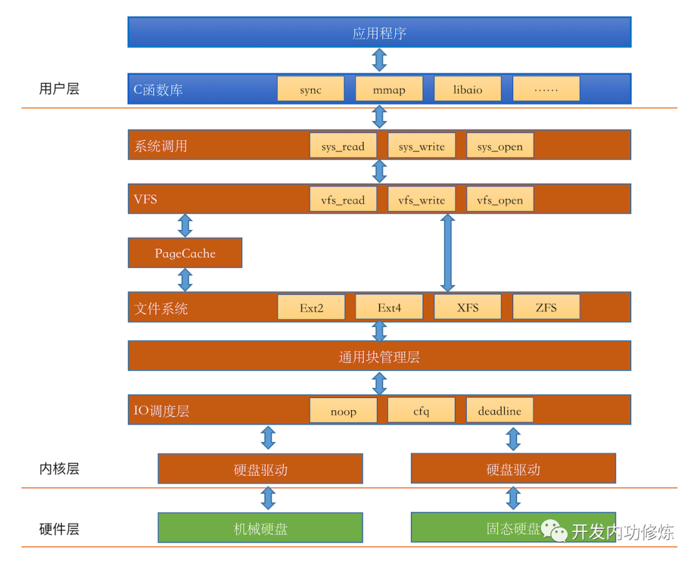
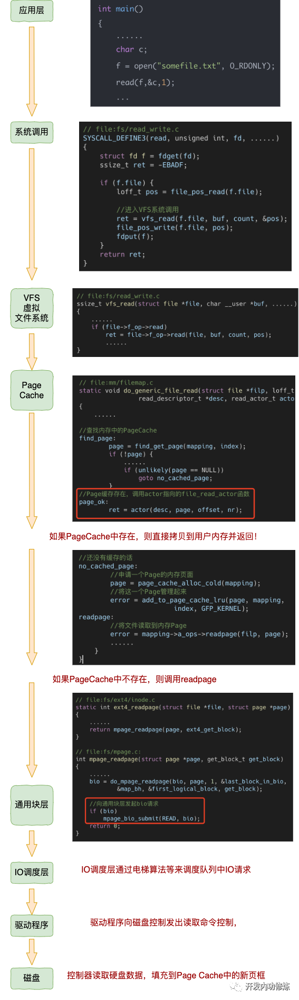
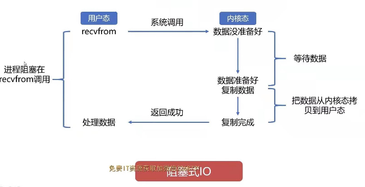
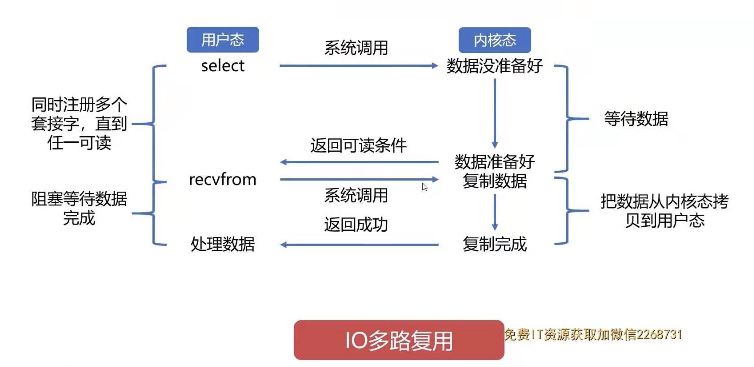
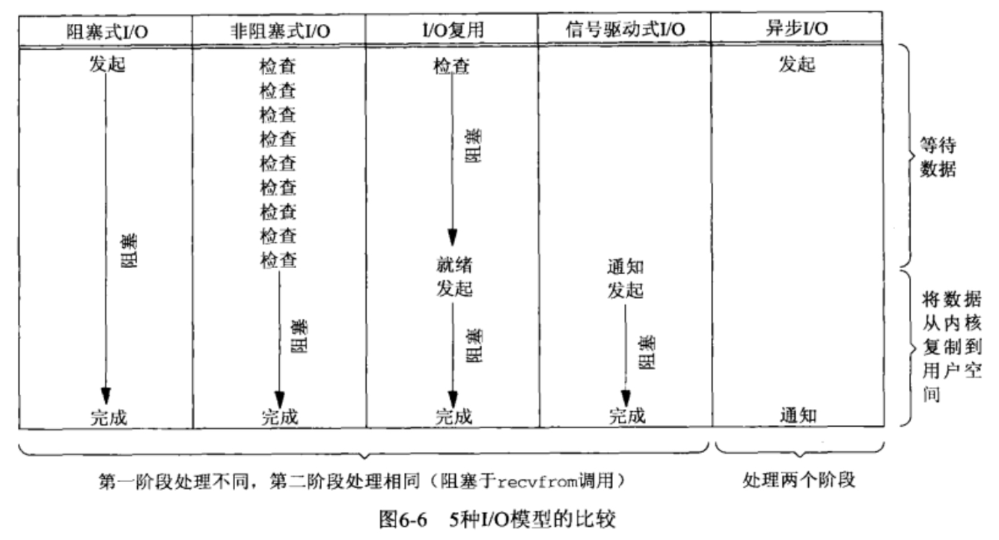
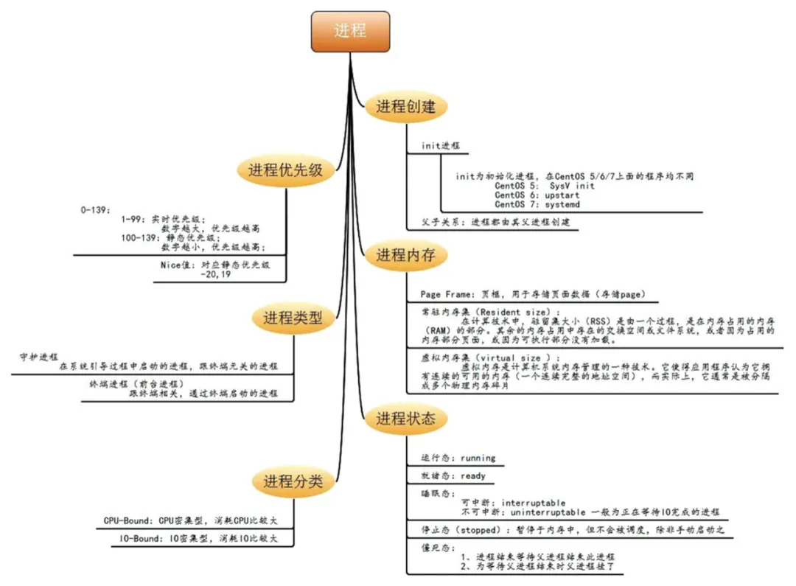

### 标准和实现
1. 标准化
   - ISO C：c语言标准，涉及是否支持头文件和库函数
   - IEEE POSIX：Portable Operating System Interfac，可移植操作系统接口，是IEEE为要在各种UNIX上运行软件而定义API的一系列互相关联的标准的总称，用于提升应用程序在unix操作系统的可移植性，规定了各种必须的服务
     1. 通过应用编程接口(API)而不是直接通过系统调用来编程
   - Single UNIX Specification：单一unix规范，是POSIX.1标准的超集，包括XSI(X/Open System Interface)
1. 实现
   - 分支
     1. AT&T：系统三、系统五
     1. 加州大学伯克利分校：4.xBSD(替换AT&T的源代码，以避免许可证)，FreeBSD(继承4.4BSD)
     1. AT&T贝尔实验室的计算科学研究中心：SVR4
   - 其他实现
     1. Linux：在GUN公用许可证指导下，免费使用，亮丽风景线，吸引全世界开发
     1. Mac OS X：基于Mach内核，FreeBSD以及面向对象框架的驱动和其他内核扩展结合而成
     1. Solaris：Sun公司开发，唯一商业成功的SVR4
1. 限制
   - 编译时限制：头文件中定义
   - 运行时限制：进程调用函数获得、修改
     1. 文件目录：sysconf
     1. 其他：pathconf、fpathconf
1. 整体
   - 系统调用、库函数：unix提供同样名字的系统函数，和库函数对于程序员可视为无区别，但完全不同，如sbrk系统存储空间分配函数，如fork、exec、wait进程控制的系统调用，system、popen的库函数调用
1. 特点：一切皆文件
### IO
1. 文件IO：不带缓冲的io，缓冲长度的影响，不是c标准是unix标准
   - 文件描述符：所打开文件通过其引用，是非负整数。内核和进程来回传递，012为三大标准
     1. 由于linux所有的事物都以文件的形式存在，要使用诸如共享内存、信号量、消息队列、内存映射等都会打开文件，但这些不会占用文件句柄
     1. 打开的多只会多占资源，没有其他问题，只是限制了不同程序的最大打开数
   - 常用函数
     1. open、openat(可指定相对目录)：也可以新建文件(O_CREAT)
     1. create、close(释放记录锁、进程终止自动关闭)
     1. lseek：当前文件偏移量，字节为单位
     1. read、write：管道、FIFO
   - io效率：文件系统的预读技术
   - 文件共享
     1. 内核的表示打开文件的数据结构：每个进程的记录项 --> 每个打开文件的文件表 --> 每个打开文件的v节点结构。dup和fork、fcntl是多个描述符指向一个文件表项
     1. 原子操作：多步操作要么全成功要么全失败，如多个进程共享资源，在于偏移量的控制。其他有记录锁
        - pread、pwrite：XSI扩展中，原子性的执行，包括先lseek再读写
   - sync、fsync：强制缓冲写入硬盘
   - dup、dup2：复制描述符，共享一个文件表项
   - fcntl、ioctl：改变打开文件的属性、杂物箱
   - /dev/fd：打开n相当于复制描述符n，`fd=open("dev/fd/0", mode);`
   - truncate：文件截断
   - 和句柄：是FILE*（fopen()返回），而文件描述符是fd（int型，open()函数返回），FILE这个结构体中有一个字段是_fileno其就是指fd
1. 文件和目录的其他属性
   - 属性
     1. stat：返回文件信息结构，fstat(fd)、lstat(符号链接)、fstatat(fd/符号链接)
        - st_size：文件长度
     1. 文件类型
        - 普通文件
        - 目录文件：包含其他文件的名字和指向信息的指针
        - 符号链接：指向一个文件
        
        - FIFO：用于进程间通信，也称命名管道
        - 套接字：socket，用于进程间网络通信，也可一台机器进程间的非网络通信，一般用.sock后缀作个标识

        - 块特殊文件：针对设备带换冲固定长度的访问
        - 字符特殊文件：对设备无缓冲的长度可变的访问
     1. 时间：数据最后访问时间、数据最后修改时间、i节点最后更改时间
     1. 其他
        - 只有内核可以直接写目录文件，所以只能用函数操作目录
        - 符号链接：硬链接直接指向文件i节点，避开了限制
   - 权限、掩码
     1. 用户ID、组ID：实际/有效/保存，用户ID/组ID。实际决定你是谁，有效决定权限
     1. 权限
        - 特点
          1，所有文件类型都有访问权限，对目录的下的文件删除需要目录的写和执行权限，对文件没有要求
          1. 粘着位：即交换区保存正文副本位，被虚拟存储系统和快速文件系统代替，S_ISVTX，现在可以针对目录如/tmp 
        - 组成：9个访问权限位：用户/组/其他，读/写/执行
        - 函数
          1. 权限测试：access、faccessat
          1. umask：为进程设置文件模式创建屏蔽字
          1. 更改权限：chmod、fchmod、fchmodat。都是指定文件、针对fd、特殊情况下相同
          1. 更改所属：chown、fchown(fd)、fchownat(两种情况)、lchown
   - 创建、重命名、遍历、删除
     1. link、linkat
     1. unlink、unlinkat：打开的进程数和文件链接数都为0时系统才会删除。remove
     1. symlink、symlinkat
     1. readdir
     1. opendir、fdopendir、closedir
     1. rewinddir、telldir、seekdir
     1. futimens、utimensat、utimes：访问时间、修改时间
     1. rename、renameat
     1. mkdir、mkdirat、rmdir
     1. chdir、fchdir、getcwd
1. 标准io
   - 流：标准io的核心，使用流和文件关联。FILE承载
     1. 字符和字节：fwide设置
     1. 打开：fopen、freopen、fdopen
     1. 读写
        - getc、fgetc、getchar：输入一个字符。ungetc压回流中
        - fgets、gets：输入一行，换行符结束
        - ferror、feof：出错、到达文件尾端
        - fread、fwrite：二进制操作
     1. 定位
        - ftell、fseek
        - ftello、fseeko
        - fgetpos、fsetpos
     1. 格式化
        - printf、fprintf、dprintf、sprintf、snprintf：输出
        - scanf、fscanf、sscanf：输入
     1. 获得描述符：fileno
     1. 创建临时文件：tmpnam、tmpfile
   - 特征
     1. 认识：ISO C标准说明，SUS扩充
     1. stdin、stdout、stderr
     1. 缓冲：多弄点，多拿点，减少read和write的次数，自动管理，有缓冲区分配，以优化块长度执行io
        - 缓冲类型：全缓冲、行缓冲、不缓冲。stderr无缓冲，终端设备行缓冲，其他全缓冲(填满后进行实际io操作)，函数setbuf、setvbuf
     1. 效率：和直接read、write差不多
     1. 内存流：创建fmemopen、open_memstream、open_wmemstream
1. 系统数据文件和信息
1. 文件类型
   - 套接字
   - 普通文件
   - 目录文件
   - 符号链接
   - 设备文件
   - FIFO
1. 文件描述符fd分类
   - 进程级fd表
   - 系统级fd表
   - 文件系统的iNode表
1. io栈：
   - 组成
     1. 用户层：c函数库
     1. 内核：IO引擎、VFS、PageCache、通用块管理层、IO 调度层、硬盘驱动、硬件
1. 读文件过程：
   - 理解
     1. Page Cache缓存
     1. 硬盘自带缓存、Raid卡缓存
     1. Page Cache：页为单位，一般4KB，所以多个扇区一起读
     1. 文件系统：block 块为单位，一般4KB
     1. 通用块层：段为单位，来处理磁盘io请求，一个段为一个页或页的一部分
     1. io调度程序：DMA方式传输n个扇区到内存，
     1. 硬盘以扇区为单管理和传输数据，一般为512字节
     1. 还有一套复杂的预读取的策略
1. io引擎
   - 分类
     1. 同步
        - sync：read、write
        - psync：pread、pwrite
        - vsync
        - pvsync
     1. 异步
        - libaio
        - posixaio
     1. 存储映射
        - mmap
### 高级IO
1. 阻塞io原理
   - read后：进程进入阻塞态
   - 系统产生中断：即io完成，进程进入就绪状态
   - 等待cpu调度：即分配时间片，获得后进入执行，否则重新进入就绪状态
1. 非阻塞io
   - 理解：即永远不阻塞的io，操作不能完成即出错返回，但是数据并没有完成，可以使用轮询或者多线程多进程代替非阻塞(线程切换开销大)，但是都不好，搭配io多路复用即可高效获取通知
   - 使用：两种方式指定
     1. 获得描述符时：open，指定O_NONBLOCK
     1. 已经打开的描述符时：使用fcntl
1. 同步io：以上阻塞和非阻塞都是，因为需要用户等待I/O操作完成，并接收返回的内容
1. 异步io
   - 理解：当描述符准备好可以io时，用信号通知，不常用，支持比较少
     1. 不同版本实现不用，可移植性
     1. 无法分辨多描述符的信号通知。SUSv4解决了这种局限性
   - System/BSD/POSIX
     1. System V：异步io信号是SIGPOLL，调用ioctl
     1. BSD：通用异步io信号是SIGIO，SIGURG通知进程网络连接上的带外数据到达如tcp，调用fcntl
     1、POSIX：使用aio控制块描述io操作，如aio_read/aio_write/aio_fsync/aio_error/aio_return/aio_suspend/aio_cancel/lio_listio
   - 方案
     1. Linux
        - aio：只支持Direct I/O（文件操作）
        - io_uring：kernel在5.1加入，新归宿，适合长连接
     1. windows
        - iocp：libuv在windows的异步方案
1. 信号驱动io：和异步io一样靠信号通知和回调函数实现，信号驱动io是数据准备好了，没有拷贝前信号通知；异步io更彻底，是已经把数据从内核空间拷贝到用户空间了再通知
1. io多路复用
   - 场景解释：有100万个客户端同时与一个服务器进程保持着TCP连接。而每一时刻，通常只有几百上千个TCP连接是活跃的(事实上大部分场景都是这种情况)。如何实现这样的高并发？在select/poll时代，服务器进程每次都把这100万个连接告诉操作系统(从用户态复制句柄数据结构到内核态)，让操作系统内核去查询这些套接字上是否有事件发生，轮询完后，再将句柄数据复制到用户态，让服务器应用程序轮询处理已发生的网络事件，这一过程资源消耗较大，因此，select/poll一般只能处理几千的并发连接
   - 理解：解决非阻塞io带来的不成功问题，构造描述符列表，调用函数即阻塞，当某描述符准备好io时函数返回，那么确知read/write函数不会阻塞
   - io多路复用：一个进程监视多个描述符，一旦某个描述符就绪(一般是读写)能够通知程序进行相应操作。但select，pselect，poll，epoll本质上都是同步io，因为都需要在读写事件就绪后自己负责读写，也就是说这个读写过程是阻塞的，而异步I/O则无需自己负责进行读写，异步I/O的实现会负责把数据从内核拷贝到用户空间
   - select/pselect：指定变动条件的描述符列表、等待时间，准备好的描述符数量、3个条件(读写异常)的哪些描述符准备好
     1. select
        - 理解：轮询扫描文件描述符，拿着全部句柄数据来回在内核和用户间倒腾。调用后select函数会阻塞，直到有描述符就绪(有数据可读/可写/有except)，或者超时(指定等待时间，如果立即返回设为null)，函数返回。当select函数返回后，可以通过遍历fdset，来找到就绪的描述符
        - 特点
          1. 监听文件描述符的方式：单进程通常能够监听的文件描述符最大1024(linux内核头文件定义)，所以监控越多性能越差
          1. 内存拷贝：需要复制大量句柄数据结构，会产生内存拷贝的巨大开销
          1. 数据返回：返回的是整个句柄数据，用户需要遍历获取发生事件的句柄
          1. 触发方式：水平触发，如果io操作没有完成但文件描述符已经就绪，之后每次select调用都会将文件描述符通知进程
        - 其他：select函数监视的文件描述符分3类，分别是writefds、readfds、和exceptfds
   - poll：指定描述符数组、变动条件、等待时间
     1. 理解：链表保存文件描述符，没有文件数量限制，其他缺点存在。直到设备就绪或主动超时，poll被唤醒后又要再次遍历fd，这个过程经历了多次无谓的遍历
   - epoll：epoll模型是Linux2.6以上内核高性能网络I/O模型，如果FreeBSD用kqueue，只支持pipe/网络产生的fd，不支持文件系统产生的，即Reactor模式，红黑树管理，log(n)
     1. 认识：即eventpoll，事件机制，linux自带，没有描述符限制，不会因为fd数量而效率下降，利用mmap()文件映射内存加速与内核的消息传递，利用回调激活描述符，并在调用wait时得到通知
     1. 过程：在内核申请简易文件系统(B+树)，然后
        - 调用epoll_create()建立一个epoll对象(在epoll文件系统中为这个句柄对象分配资源)。此调用返回一个句柄，之后所有都依靠这个句柄来标识
        - 调用epoll_ctl向epoll对象中添加这100万个连接的套接字(即通过此调用向epoll对象中添加、删除、修改感兴趣的事件)
        - 调用epoll_wait收集已经发生的事件的连接
     1. 原理：通过红黑树和双链表数据结构，并结合回调机制，造就了epoll的高效
        - epoll_create：创建一个eventpoll结构体，有两个成员和epoll的使用方式相关，红黑树的根节点rb_root，存储返回给用户事件的双链表list_head
        - epoll_ctl：存储添加进来的事件，重复事件会被红黑树高效的识别出来，所有事件和网卡驱动程序建立回调关系，即发生事件添加到rdlist
        - epoll_wait：只需检查双链表rdlist是否有epitem即可
     1. 模式：LT默认，ET高速模式，一次和多次就绪通知的区别
   - iocp：window上异步方案
   - kqueue：macos上epoll的替代品
   - 比较
     1. 历史：epoll是Linux所特有，而select则应该是POSIX所规定，一般操作系统均有实现
     1. 自身：去掉了遍历文件描述符，而是通过监听回调的的机制
     1. 应用：如果都是活跃请求，epoll和select一样
   - libuv
     1. epoll支持的，用epoll_wait
     1. 文件处理/DNS解析/解压缩等，使用工作线程进行处理，将请求和结果通过两个队列建立联系，由pipe与主线程通信，epoll监听该fd来确定读取队列的时机
1. 阻塞io：结合io多路复用，就是这俩图的流程，只是步骤不同而已
1. io多路复用：
1. 比较：
1. IO：cpu对n内存以外的设备进行读取，如硬盘和网卡。调用recv作为例子从套接字上接收一个消息，因为是一个系统调用，所以调用时会从用户进程空间切换到内核空间运行一段时间再切换回来，网络数据到达并且复制到用户进程空间或者发生错误时返回，以下为io模型
   - 阻塞io模型：recv默认参数，一直等数据直到拷贝到用户空间，这段时间内进程始终阻塞
   - 非阻塞IO模型：让recv不管有没有获取到数据都返回，轮询(往返用户进程空间)调用recv查看，可以做其他的事情。只有是检查无数据的时候是非阻塞的，数据到达的时依然要等待复制数据到用户空间(等着水将水杯装满)，因此还是同步io
   - IO复用模型：调用recv前先调用select或者poll，这2个系统调用都可以在内核准备好数据(网络数据到达内核)时告知用户进程，这个时候再调用recv一定是有数据的。因此这一过程中它是阻塞于select或poll，而没有阻塞于recv，有人将非阻塞IO定义成在读写操作时没有阻塞于系统调用的IO操作(不包括数据从内核复制到用户空间时的阻塞，因为这相对于网络IO来说确实很短暂)，如果按这样理解，这种IO模型也能称之为非阻塞IO模型，但是按POSIX来看，它也是同步IO，那么也和楼上一样称之为同步非阻塞IO。能同时监听多个文件描述符(fd)，舍管阿姨告诉他这些水龙头都还没有水，等有水了告诉他。于是等啊等(select调用中)，过了一会阿姨告诉他有水了，但不知道是哪个水龙头有水，自己看吧。于是C同学一个个打开，往杯子里装水(recv)。这里再顺便说说鼎鼎大名的epoll(高性能的代名词啊)，epoll也属于IO复用模型，主要区别在于舍管阿姨会告诉C同学哪几个水龙头有水了，不需要一个个打开看(当然还有其它区别)
   - 信号驱动IO模型：调用sigaction注册信号函数，等内核数据准备好的时候系统中断当前程序，执行信号函数(这里为recv)，还是同步IO(省不了装水的时间)
1. 同步和阻塞：网卡和磁盘离CPU太远，数据获取太慢
   - 理解
     1. 同步、异步：消息通知机制，是否是别人来完成io的操作然后来告诉你。POSIX(可移植操作系统接口)定义同步io操作为导致进程阻塞直到io完成的操作，反之则是异步io
     1. 阻塞、非阻塞：等待调用结果的状态，是发生在消息的处理的时刻。阻塞就是等待，发出通知等待结果完成，非阻塞是发出通知立即返回结果，没有等待过程
   - 举例
     1. 阻塞：调用io操作的api时，数据没有到达前，read挂起，进程卡主。当数据读取完毕返回给进程时，read返回(数据从内核拷贝到用户空间)，然后进程继续执行
     1. 非阻塞：read在数据没有读完前，就返回(返回值为-1，errno 设置为 EAGAIN)，此时进程没有拿到需要的数据，这个时候有两种办法
        - 同步：不断轮询(重新调用read)，某些特殊情况效率特别高
        - 异步
          1. 早期：信号驱动，内核给进程发信号(SIGIO或SIGPOLL)，然后进程内的信号处理函数再调用read。缺陷是多个fd读写时无法区分，需要全部调用
          1. 后来：io多路，更好的select/poll/epoll(I/O multiplexing)
1. 四大模型
   - 同步阻塞：调用者发起io操作请求，等待io操作完成再返回。io操作的过程需要等待，io操作执行完成后返回结果
   - 同步非阻塞：调用者发起io操作请求，询问io操作状态，如果未完成，则立即返回；如果完成，则返回结果。io操作的过程需要等待执行完成才返回结果
   - 异步阻塞：调用者发起io操作请求，等待io操作完成再返回。io操作的过程不需要等待，操作完成后通过通知或回调获得结果
   - 异步非阻塞：调用者发起io操作请求，询问io操作状态，如果未完成立即返回；如果完成，则返回结果。io操作的过程不需要等待，操作完成后通过通知或回调获得结果
1. 同步/阻塞模型
   - BIO：同步且阻塞，遇到io操作cpu占用并等待，可通过线程池改善
   - NIO：同步非阻塞，都注册到多路复用器上，一个线程处理多个连接，逻辑部分是单线程模式，是异步io，轮询到有i/o请求时才启动一个线程处理
   - AIO：异步非阻塞，一个有效请求一个线程，由os完成了再通知服务器应用启动线程处理。用于连接数目多且连接比较长，充分调用os参与并发操作，编程复杂，JDK7支持
1. 异步io的应用：假设一项工作有两个计算部分，一个io部分，io占用时间比计算多得多，同步式io想要实现高并发必须开多个线程。而使用异步单线程即可胜任
1. 记录锁
   - 理解：解决多方写入同一文件的问题，平时取决于最后一个写进程。记录锁可实现单独写一个文件，真正是字节范围锁，即锁定某区域
     1. 加解锁时系统会自动组合、分裂相邻区
     1. 绝不能测试进程自己是否有锁
   - 使用：fcntl，指定文件描述符、命令、flock的指针
     1. 命令：三个命令非原子操作，需要兼容被插队
        - F_GETLK：测试是否可加锁(被另外锁阻塞)
        - F_SETLK：非阻塞加锁(不能加锁立即返回)
        - F_SETLKW：阻塞加锁(调用进程会休眠，锁可用被唤醒)
     1. flock组成：锁类型、字节偏移量、字节长度
        - 锁类型：共享读、独占性写、解锁
          1. 多个进程中可有多个共享读锁，一个独占性写锁，有了读/写锁不能加写/读锁
          1. 单个进程多次加锁(当然是同一字节区域)会替换
   - 相关
     1. 死锁：内核选择一个进程接受出错返回
     1. 锁的隐含继承和释放
        - 进程终止，锁释放
        - 文件描述符关闭，锁释放：dup/二重open然后close都会释放
        - fork的子进程不继承锁
        - exec后新程序可继承锁
     1. 文件尾端加锁：特别小心，加锁时内核指定偏移量为绝对文件偏移量，因为要处理加锁和获取文件长度不定
     1. 建议性锁/强制性锁：进程间是否通过一致的方法处理记录锁，强制性锁是让内核检查是否违背锁，ed可绕过强制性锁,centos7不支持强制性锁
1. 存储映射io
   - 理解：能将磁盘文件映射到存储空间的一个缓冲区上，不用read和write情况下执行io，使用mmap/mprotect/msync/munmap
   - 特点
     1. 步长要求为系统虚拟存储页长度的倍数
     1. 可做多进程的共享存储区
1. readv/writev/readn/writen
   - readv/writev：用于一次函数中读写多个非连续缓冲区
   - readn/writen：读写指定的n字节数据，并处理返回值可能小于要求值的情况，apue自定义
1. io模型：epoll兼容3和4的特性
   - 阻塞io
   - 非阻塞io
   - io多路复用
   - 信号驱动io
   - 异步io：iocp支持
### 进程
1. 认识：
   - 资源分配和调度的基本单位
   - 进程的状态可以互相切换，形成有限状态机
   - 隔离资源和运行环境，提升资源利用率
1. 运行背景
1. 命令行参数
   - c编译器调用->连接编译器调用->调用特殊启动例程作为程序起始地址，从内核取得命令行参数和环境变量->exec main
   - exec可将命令行参数传递给新程序
1. 环境变量
   - 环境指针：environ，整个环境kv对的全局变量
   - getenv、putenv(只能影响自己和子孙)、unsetenv(删除name)
1. 资源限制
   - getrlimit、setrlimit
   - 修改规则
     1. 软限制必须小等于硬限制
     1. 任何进程可以降低硬限制
     1. 超级用户进程可以提高硬限制
1. 终止
   - 终止方式：只有自愿的exit、_exit、_Exit，非自愿的由信号终止
     1. 正常
        - 从main返回
        - 调用exit：
        - 调用_exit、_Exit
        - 最后一个线程从其启动例程返回
        - 从最后一个线程调用pthread_exit
     1. 异常
        - 调用abort
        - 接到一个信号
        - 最后一个线程对取消请求做出响应
     1. 针对线程 TODO
   - 退出
     1. main返回：特殊启动例程立即调用exit
     1. exit：先清理再返回内核，即关闭所有io(也即缓冲冲洗)，可返回整数形式的终止状态否则状态随机，exit(0)=return(0)
     1. _exit、_Exit：立即进入内核
     1. atexit：注册自动退出时调用的函数，不期望返回值，最多32个
1. 存储空间
   - 布局：空间顶部的环境变量改变会在堆中开辟指针表
   - 分配
     1. malloc、calloc、realloc、free
     1. libmalloc、vmalloc...
1. setjmp、longjmp、goto
1. 多进程编程模型
   - 唯一id标识符：可重用，存在延迟复用算法保证无误认
     1. id为0：调度进程，或交换进程、系统进程，内核一部分
     1. id为1：init进程，绝不会终止，是普通用户进程，以root身份运行
     1. id为2：页守护进程
   - 进程状态：就绪(具备所有条件、cpu没来)、运行(内核态、用户态)、阻塞
   - 与标准io：因为标准io是对及哦啊胡设备是行缓冲的，对其他是全缓冲的，fork之后会有两份缓存数据输出
   - 与文件描述符：共享一个文件表项，输出会相互混合，子进程不继承文件锁
   - 与setenv：可以影响子进程的环境变量
   - 竞争条件：避免逻辑依赖因为进程间的执行顺序而受影响，以及轮询等待，使用信号、IPC处理、管道
   - 最小特权模型：更改用户、组ID，setuid、setgid，setreuid、setregid
   - 进程会计：进程结束时内核写一个记录，包含命令名、cpu时间总量等较小的二进制数据，可以再次观察进程。acct
   - 进程调度：只基于优先级，调度策略和优先级由内核确定，可以调整nice值，越低越友好。nice
1. 多进程进程管理
   - 获取标识符：getpid、getppid、getuid、geteuid、getgid、getegid
   - 创建：fork，父子谁先执行不确定，取决于内核的调度算法，互相同步需要进程间通信，父进程数据段、栈、堆的完全副本，使用写时复制。
     1. 用法：一父进程复制自己，同一时间执行不同代码段，如fpm。二执行不同程序，fork返回后立即exec
     1. fork失败：系统有太多进程，或实际用户id的进程总数超过限制
     1. 有些系统将fork后exec合成一个操作，成为spawn
     1. vfork废弃，创建子进程后立即exec，不会复制父空间，在父进程空间中执行，效率高，保证子进程先执行，返回之后父进程才可能执行。如果子进程修改数据，函数调用，没有exec或exit就返回会导致未知后果
   - 调用：exec函数，从main函数开始运行，用磁盘新程序替换了当前进程的正文段、数据段、堆和栈段。有execl/v/le/ve/lp/vp、fexecve
     1. 路径：搜索path或绝对路径，作为可执行文件或者shell执行
     1. 继承了调用进程的：各种用户ID、当前工作目录、文件锁、未处理信号
     1. 解释器文件：#! /bash/sh 的脚本文件
   - 执行：system，执行命令u
   - 等待：获取终止状态
     1. 进程收养：一个进程终止，检查所有活动进程，父进程终止子进程被pid为1的init进程收养，保证每个进程都有父进程
     1. 僵死进程：已经终止，父进程尚未进行处理(获取终止信息、释放占用的资源)的进程
     1. wait、waitpid：4个互斥的WIF*宏获取终止原因
        - 所有子进程运行，则阻塞
        - 一个子进程终止，正等待父进程获取终止状态，则立即返回
        - 没有子进程，出错返回
        - 接到SIGCHLD信号：调用wait会立即返回，进程终止向父进程发送异步信号，默认动作忽略，也可指定信号发生时的函数(信号处理程序)
     1. waitpid
        - 可指定进程号获取终止状态，也可通过循环wait存储每个终止状态实现
        - 提供wait的非阻塞版本
        - 通过WUNTRACED和~支持作业控制
     1. waitid：更加灵活的waitpid，可指定pid类型，其他的终止情况
     1. wait3、wait4：允许内核返回终止进程和其所有子进程使用的资源情况
1. 进程组：每个进程属于一个进程组，同一作业结合起来的，所有进程都会收到来自终端的信号，进程组ID=组长进程ID，最后一个进程终止进程组才终止
   - setpgid加入/创建新进程组
   - 孤儿进程组
1. 会话：是n个进程组的集合
   - setsid创建新会话，getsid获得会话首进程的进程组ID
   - 会话中的进程组可分为一个前台进程组，n个后台进程组
1. 控制终端
   - 会话可有一个控制终端，控制终端连接的会话首进程称为控制进程，终端断开会发送挂断信号
   - tcgetpgrp/tcsetpgrp：获得/设置前台进程组ID，后台运行加&，作业编号1转为前台fg %1
1. 作业控制：允许一个终端启动多个作业(进程组)，控制前后台调配
1. pid
   - 认识：Process Identification，进程代号。每个进程的唯一代号，是启动时系统随机分配的，运行中不会改变，停止后会被系统回收，可能分配给其他新运行的程序
     1. pid文件：文本文件，只记录了进程的id，作用是防止进程启动多个副本，只有获得pid文件写入权限(F_WRLCK)的才能正常启动，其他的自动退出
1. 进程调度方式：抢占式/非抢占式
   - 先来先服务：FCFS
   - 最短作业优先：SJF，估算剩余所需运行时间，保持就绪队列很小，提高吞吐量
   - 最高响应比优先：HRRN，估算执行时间、等待时间
   - 时间片轮转：RR，到了强制切出，程序不会感知被暂停
1. 进程、线程、协程
   - 进程：是某数据集合上的一次运行活动，是系统进行资源分配和调度的基本单位，是操作系统结构的基础
     1. 三态模型：多程序系统中，进程在处理器上交替运行，状态不端变化
        - 运行：此状态的进程数小于等于处理器数，没有进程可执行时通常自动执行系统空闲进程
        - 就绪：获得了除处理机的所有资源，可按多个优先级划分队列。如由于时间片用完进入就绪状态时进入低优先级，io操作完成进入高优先级
        - 阻塞：也是等待、睡眠状态，即等待某一事件发生(如请求io而等待)，暂时停止运行，即使给了处理器也无法运行
     1. 五态模型：进程的状态和转换更复杂
        - 新建：进程刚刚创建没有被提交的状态，等待系统完成创建所有的必要信息
        - 活跃就绪：在内存中可被调度的状态，
        - 静止就绪：被对换到辅存时的就绪状态，不能直接被调度，没有活跃就绪或者自身更优先，系统则将其调回主存转为活跃
        - 运行
        - 活跃阻塞：在主存，一旦等待事件产生进入活跃就绪状态
        - 静止阻塞：在辅存，一旦等待事件产生进入静止就绪状态
        - 终止：进程终止运行，回收除进程控制块之外的其他资源，并让其他进程从进程控制块中收集信息
   - 线程：程序执行流的最小单元，可由系统独立调度和分派cpu，线程可以创建和撤销另一个线程，多线程可并发执行
     1. 就绪：同进程
     1. 运行：占有处理机正在运行
     1. 阻塞：等待一个事件，如某个信号量，逻辑上不可执行
   - 协程：是用户态的轻量级线程，由用户控制调度。有自己的寄存器上下文和栈，协程调度切换时，将二者保存到其他地方，切回来恢复之前的，直接操作栈基本没有内核切换开销，可不加锁的访问全局变量，所以上下文切换非常快。
     1. 不能使用阻塞io，否则不起作用，用专用的方法
1. 相互的理解
   - 进程和线程
     1. 进程是资源分配的最小单元
     1. 线程是进程中的实体、执行单元。所有线程共享进程地址空间，进程是资源分配和拥有的单位，进程有自己的地址空间
     1. 一个程序最少有一个线程，就是程序本身。线程是处理器调度的基本单位，进程不是
     1. 都可并发执行
     1. 每个线程都有运行入口、顺序执行序列、程序出口，不能独立执行，必须在程序中由程序提供多个线程执行的控制
   - 线程和协程
     1. 线程、进程都可有多个协程
     1. 线程进程都是同步，协程是异步
     1. 协程能保留上一次调用时的状态，每次过程重入时，相当于进入上一次的状态
   - 多线程、多进程
     1. 多进程：多个进程同时运行，多分配了一份资源，进程间通讯不方便，边玩游戏边听歌
     1. 多线程：同时运行，可以直接通信
### 守护进程
1. 认识：生存期长，系统引导装入时启动，系统关闭时停止，没有控制终端后台运行，就是长时间提供服务呗。系统的如kswapd、flush、sync_supers、jbd
1. 实现
   - 规则
     1. umask的注意
     1. 调用fork，然后使父进程exit，则继承了进程组id，保证子进程不是组长进程
     1. 调用setsid创建新会话，则成为新会话的首进程，成为新组长进程，没有控制终端
     1. 当前工作目录改为根目录，防止占用挂载的文件系统
     1. 关闭文件描述符
     1. 打开/dev/null，使其具有文件描述符0124
   - 惯例
     1. 配置：启动时读取一次配置文件，需要捕捉SIGHUP信号然后重新读配置，存放在/etc目录
     1. 日志记录：调用syslog，函数有openlog/syslog/closelog/setlogmask
     1. 使用锁文件：name.pid
     1. 自动重启：/etc/inittab设置respawn记录项
     1. 单实例：任何时刻只运行一个副本，使用文件和记录锁lockfile提供互斥机制，如需要排他访问设备
   - 编写：
     1. 变为一个守护进程：P375
     1. 单线程守护进程捕捉SIGHUP并重读配置文件：P384
### 信号
1. 认识：全称为软中断信号，是软件层次上对中断的一种模拟。是进程间通信唯一的异步通信机制，只能用于通知进程发生了某个事件，除信号本身信息之外不具备传递用户数据的功能。POSIX.1有了标准化的可靠信号机制
   - 名字：SIG开头，正整数常量，0为空信号，<signal.h>定义了64个
   - 中断的系统调用：执行低速系统调用(可能永远阻塞的系统调用，如读设备)的阻塞期间捕捉到信号会被中断而不继续执行，自动重启动包括ioctl/read/readv/write/writev/wait/waitpid，可基于信号禁用
   - 可重入：即异步信号安全，保证函数调用安全，同时阻塞任何引发不一致的信号发送的函数，如open、read、socket、listen等，在信号处理程序中调用非可重入函数，结果是不可预估的
   - 是否可靠：即是否支持排队，是否会导致信号丢失
1. 分类
   - 不可靠信号：1-31，早期unix继承而来
   - 可靠信号：34-64，是实时信号，每收到一个可靠信号就会去注册这个信号，不会丢失
     1. 信号声明周期：内核产生、递送、收到
     1. 递送：递送称信号为未决的，进程可以阻塞信号递送
        - 送达之前可以改变对信号的动作
        - 同种信号发生多次，支持递送一次或多次
        - 多个信号没有规定顺序
1. 产生方式
   - 终端：ctrl+c
   - 硬件：通常由硬件检测并通知内核，然后内核产生信号发送给相关进程，如除数为0
   - 软件：主动调用等
1. 对信号的处理方式
   - 认识：捕获、阻塞、忽略
     1. 可被捕获的退出信号如果进程捕获了可能不会退出，但是不可捕获的进程一定会退出
     1. sigkill和sigstop不能被捕获、不能被忽略、不能被阻塞，否则报错
   - 方式
     1. 忽略
     1. 捕捉：注册对应信号的用户的回调函数
     1. 执行系统默认动作：大多数默认终止进程，还有生成core文件、忽略
1. 处理
   - 信号的接收：接收信号的任务是由内核代理的，当内核接收到信号后，会将其放到对应进程的信号队列中，同时向进程发送一个中断，使其陷入内核态。我们将进程刚接收到信号并未处理的那种状态称为信号未决(Pending)。注意，此时信号还只是在队列中，对进程来说暂时是不知道有信号到来的。
   - 信号的检测：进程陷入内核态后，在两种场景下会对信号进行检测，当发现有新信号时，便会进入下一步，信号的处理。
     1. 进程从内核态返回到用户态前进行信号检测
     1. 进程在内核态中，从睡眠状态被唤醒的时候进行信号检测
   - 信号的处理：信号处理函数是运行在用户态的，之所以如此是由于若处于内核态程序便拥有过高的权利会对系统有潜在的危险，故调用处理函数前，内核会将当前内核栈的内容备份拷贝到用户栈上，并且修改指令寄存器（eip）将其指向信号处理函数。接下来进程返回到用户态中，执行相应的信号处理函数。信号处理函数执行完成后，还需要返回内核态，检查是否还有其它信号未处理。如果所有信号都处理完成，就会将内核栈恢复（从用户栈的备份拷贝回来），同时恢复指令寄存器（eip）将其指向中断前的运行位置，最后回到用户态继续执行进程。至此，一个完整的信号处理流程便结束了，如果同时有多个信号到达，上面的处理流程会在第2步和第3步骤间重复进行。
1. 函数
   - 产生
     1. raise：允许向自身发送信号
     1. kill：指定pid、同一进程组、进程组id、所有权限进程，权限为除超级用户外，用户id必须相等
     1. sigqueue：只能把信号发给单进程，可传递额外数据，有数量限制
     1. alarm：一个进程只能有一个闹钟时间多次调用替换，由于进程调度，时间会多，秒数
     1. setitimer
     1. about
   - signal：设定信号处理方式
     1. 使用：`signal(SIGXX, SIG_IGN(忽略)/SIG_DFL(默认)/函数指针)`
   - pause：使进程挂起，直到捕捉到信号
   - about、system：采用信号实现
   - 睡眠函数：sleep、nanosleep、clock_nanosleep：避免了竞争条件(使用longjmp)，但是未处理与之前闹钟的交互作用，纳秒级精度，基于特定时钟的延迟时间，相对休眠更不准
   - 信号名和编号：psignal、psiginfo
1.信号集
   - 理解：表示多个信号的数据类型，将多个信号组合起来使用，格式为sigset_t
   - 操作函数：sigemptyset、sigfillset、sigaddset、sigdelset、sigismember，使用前必须用前两个初始化
   - 信号屏蔽字：规定了当前要阻塞递送给进程的信号集，可以保护不希望由信号中断的代码临界区。同时只能处理同种信号的一个，所以当前是阻塞的
     1. sigpending：返回当前的信号集
     1. sigprocmask：检测和更改，单线程使用
     1. sigaction：检查和修改指定信号的处理动作，可修改是否自动重启，是否通知父进程，是否创建僵死进程，可实现signal
     1. sigsetjmp/siglongjmp：信号处理程序中，非局部转移使用，增加参数是否保存当前信号屏蔽字，siglongjmp恢复sigsetjmp当前的屏蔽字，设置是否可跳转信号变量可用于保证sigsetjmp初始化完成，普通的没问题，因为信号可能随时发生，需要保护
     1. sigsuspend：形成原子操作，用于恢复屏蔽字时，先恢复再使进程休眠(替代先恢复屏蔽字再pause，其中间可能丢失信号)，如果捕捉到信号并且从信号处返回，则返回，并且屏蔽字设置为调用之前的值。结合信号处理函数中设置全局变量实现了等待信号时休眠不占用cpu，结合kill实现父子进程的信号通信。但是等待期间不能执行其他系统函数，单线程没有好解决办法，多线程可以专门安排一个线程处理信号
1. wiki
   - 信号举例
     1. SIGKILL：9，和SIGSTOP不可忽略，因为提供了进程终止的可靠方法，也因为忽略硬件异常信号的话进程的运行行为未定义，也不可捕捉
     1. SIGSTOP：17
     1. SIGTERM：15，系统默认终止信号，kill产生

     1. SIGINT：2，中断信号，用户按中断键触发
     1. SIGQUIT：3，退出信号，同时产生core文件

     1. SIGCHLD：进程终止通知父进程
     1. SIGABRT：夭折信号，调用about触发，进程异常终止
     1. SIGALRM：闹钟信号，alarm超时触发
     1. SIGSEGV：无效内存引用
   - 作业控制信号：SIGCHLD、SIGCONT、SIGTSTP、SIGTTIN、SIGTTOU
   - 安全性
     1. root可以向任意进程发信号
     1. 普通user只能向同一user的发信号
     1. 可以向内核发信号，但不会被响应
### 线程
1. 认识
   - 组成：线程ID、寄存器、栈、调度优先级和策略、信号屏蔽字、errno变量，功能测试宏`_POSIX_THREADS`，libpthread.so，linux没有真正意义上的线程，由进程模拟
   - 好处
     1. 每种事件类型分配单独的线程，简化异步事件处理复杂度，可以采用同步编程模式
     1. 避免了进程间复杂的资源共享问题
     1. 并行处理提高吞吐量
   - 特点
     1. 自动的访问进程所有的资源
     1. 除了寄存器外，一个线程无法阻止另一个访问其数据
     1. 线程函数一般返回错误码，不会依赖全局错误状态，缩小了错误范围
1. 认识
   - 线程是操作系统最小的运行调度单位
1. 属性
   - 限制：sysconf，如进程最大线程数
   - 属性
     1. 线程属性
        - pthread_attr_init
        - pthread_attr_destory：对线程相关资源清理的唯一接口，失败就造成内存泄露
        - pthread_attr_get/setdetachstate：是否分离状态
        - pthread_attr_get/setstack：栈属性
        - pthread_attr_get/setstacksize
        - pthread_attr_get/setguardsize：线程栈末尾避免栈溢出的扩展内存大小
     1. 同步属性
        - 函数关键字：互斥量 mutexattr、读写锁 rwlockattr、条件变量 condattr、屏障 barrierattr
        - 共同属性：pthread_xxx_init/destory/getsetpshared
        - 进程共享属性：即多个进程将同一内存区块映射到各自独立的地址空间中，实现进程共享，也可限制开销较大的互斥量，pshared
        - 独特属性：条件变量 getsetclock
   - 重入：即线程安全：一个函数在相同时间点可被多个线程安全调用，不能是因为数据放在静态内存缓存区，操作系统为一些函数提供了线程安全版本，和信号的可重入没关系
   - 和信号：每个线程有自己的信号屏蔽字，但信号处理所有线程共享，信号是递送给单个任意线程的
     1. pthread_sigmask：多线程中使用
     1. sigwait：等待n个信号出现，可以将异步产生的信号同步处理，可以安排专用线程处理
     1. pthread_kill：将信号发给线程，闹钟是进程资源，所有线程互不合作的使用
     1. 不能把pthread函数用于成为异步信号安全的其他函数的一部分
   - 和fork：由于写时复制，子进程fork之后不是立马exec需要清理锁状态(因为exec后旧地址空间被丢弃，锁没问题了)
     1. pthread_atfork：可安装清理锁的函数，POSIX.1声明fork返回和调用exec之间，子进程只能调用异步信号安全的函数
   - 和IO：所有线程共享文件描述符，
     1. pread、pwrite：将偏移量和数据操作成为一个原子操作
1. 操作
   - 线程标识：不可移植，是整形或结构，不能直接比较
     1. pthread_self：获取线程ID
     1. pthread_equal：判断是否相等
   - 创建
     1. pthread_create，不能保证哪个线程先执行，后边的会覆盖前边的栈内容，所以线程间用全局结构或者malloc分配数据
   - 特定数据：绑定一个key用于对特定数据的访问，可以设置析构函数只有正常退出才触发，exit不触发
     1. pthread_key_create/delete
     1. pthread_get/setspecific：获得某个线程键的特定地址
   - 保证只调用一次：pthread_once
   - 等待结束
     1. pthread_join，将线程置于分离状态
     1. pthread_detach，分离线程，就是不关心终止状态，让系统在线程退出时收回资源
   - 终止：线程调用exit/_Exit/_exit，进程终止
     1. 终止方式
        - 直接返回，返回值是退出码，`return((void *)1)`
        - 被其他线程取消：pthread_cancel，可以忽略或控制如何取消
          1. pthread_setcancelstate：是否可取消，将取消请求挂起，直到再次改变是否可取消状态
          1. pthread_testcancel：添加自定义取消点
          1. pthread_setcanceltype：设置推迟取消/异步取消，默认推迟取消，到达取消点才被取消，异步的任意时间取消
        - pthread_exit
     1. 清理程序：调用pthread_exit、响应取消、非0参数调用pthread_cleanup_pop，触发。必须在和线程相同作用域中成对使用，可以实现为宏，可以包含{}字符
        - pthread_cleanup_push
        - pthread_cleanup_pop：都会删除push设置的程序，执行顺序和注册顺序相反
1. 线程同步
   - 原因：单个资源在多个用户共享的问题
     1. 访问变量需要先拿到锁
     1. 同一时间对一个变量做增量要同步，当多个线程观察不到数据不一致时操作就是顺序一致的
   - 同步机制
     1. 互斥量：是把锁，确保同一时间只有一个线程访问数据。就是互斥量的争抢设置和释放，只有所有线程都使用互斥量才起作用，是递归的就表示占有锁时可再次获取该锁
        - 方法
          1. pthread_mutex_init：必须初始化，也可设置为只适用静态分配互斥量的常量
          1. pthread_mutex_destory：动态分配(如malloc)互斥量要销毁
          1. pthread_mutex_lock：如上锁会阻塞
          1. pthread_mutex_trylock：试着上锁，不会阻塞
          1. pthread_mutex_timedlock：设置能加上锁的超时时间，避免永远阻塞
          1. pthread_mutex_unlock
        - 避免死锁：控制互斥量加锁的顺序来避免，即锁A前先锁B，只可能和相反顺序加锁的发生死锁。也可以trylock不行就释放自己的锁，过一会再来试。需要控制锁的粒度，实现复杂性和性能的平衡
     1. 读写锁：读锁，写锁，无锁，读锁可同时存在多个不阻塞读锁，读锁不会抢先写锁以免写一直得不到满足，也称共享互斥锁
        - 方法
          1. pthread_rwlock_init：使用前必须初始化，释放锁内存前必须销毁
          1. pthread_rwlock_destory：
          1. pthread_rwlock_rdlock
          1. pthread_rwlock_wrlock
          1. pthread_rwlock_unlock
          1. pthread_rwlock_timedrdlock
          1. pthread_rwlock_timedwrlock
     1. 条件变量：为线程提供会合的场所。和互斥量一起使用时，允许线程以无竞争的方式等待特定条件发生，必须先锁住互斥量来保护条件，其他线程获得互斥量之前不会觉察到改变
        - pthread_cond_init：同上
        - pthread_cond_destory
        - pthread_cond_wait：等待条件变量为真，自动将线程放到等待条件的线程列表上并对互斥量解锁，就关闭了条件检查和线程进入休眠等待条件改变之间的时间通道，不会错过任何变化，函数返回时互斥量再次被锁住。是一个原子操作，等待前会解锁，唤醒后会加锁
        - pthread_cond_timedwait
        - pthread_cond_signal：通知线程条件已经满足，最少唤醒一个
        - pthread_cond_broadcast：唤醒所有等待的线程
     1. 自旋锁：拿锁前一直处于忙等(自旋)阻塞状态，不是休眠(互斥量)，用于锁持有时间短，线程不希望重新调度上花费太多成本。可用于非抢占式内核、实时调度中，会阻塞中断，不要有自旋锁的情况下使用可能会休眠的函数，会增加时间。有些互斥会自旋一小段时间才休眠
        - pthread_spin_init：同上
        - pthread_spin_destory
        - pthread_spin_lock
        - pthread_spin_trylock
        - pthread_spin_unlock
     1. 屏障：协调多个线程并行工作的机制，允许每个线程等待，直到所有线程到达某一点，然后继续执行
        - pthread_barrier_destory
        - pthread_barrier_wait：可以使用一个线程作为主线程，等待其他线程的执行结果
1. 使用
   - `#include <pthread.h> `
   - 链接libpthread.so：`gcc program.o -o program -lpthread`
1. 线程实现方式
   - 内核级
   - 用户级：用户自行调度，内核无法干涉，依赖的内核线程阻塞了所有都阻塞
   - 组合方式
     1. python：提供Thread线程对象，yield、await、async等关键字，asyncio等协程库
1. cas：Compare and Swap, 比较并交换
1. 组合理解
   - 互斥锁：mutex，即互斥量，可以指所有实现互斥作用的同步机制，作用是互斥。狭义上讲就是mutex这种特定的二元锁机制
   - 自旋锁：spinlock，互斥锁的一种实现方式，相比一般的互斥锁会在等待期间放弃cpu，自旋锁是不断循环并测试锁的状态，这样就一直占着cpu
   - 信号量：semaphore，更高级的同步机制，mutex可以说是semaphore在仅取值0/1时的特例，可以有更多的取值空间，实现更加复杂的同步，不单单是线程间互斥
   - 同步锁：能实现同步作用的都可以叫同步锁，比如信号量
   - 临界区：每个进程中访问临界资源的那段程序称为临界区，每次只允许一个进程进入临界区
### 进程间通信
1. 理解：缩写IPC
1. 管道
   - 理解：最古老的通信机制，不能假定为全双工的，只能在有共同祖先的进程间使用
   - 使用
     1. pipe，可控制数据流向，可与fork联合使用，PIPE_BUF确定传输字节数，可有多个写端
     1. popen/pclose：参数传递w/r用于读写管道
   - 协同进程：同时产生某个过滤程序的输入，和读取其输出，相当于有两个popen
1. FIFO
   - 理解：命名管道，FIFO是一种文件类型，不相关进程可用
   - 使用：mkfifo/mkfifoat
1. XSI
   - 特点
     1. 标识符和键：都有一个非负整数的标识符，是内部名，和一个键关联作为外部名
     1. 权限结构：包括uid、gid等
     1. 结构限制
     1. 没有引用计数，在文件系统中没有名字从而多了系统调用(函数)，不使用文件描述符从而不能多路转接
     1. 不相关进程可用
   - 分类
     1. 消息队列
        - 理解：存储在内核中的消息链表，由标识符标识，和信号量不建议使用，使用全双工管道和记录锁
        - 使用：msgget、msgsnd、msgrcv、msgctl(类似ioctl垃圾桶函数)
     1. 信号量
        - 理解：是一个计数器，用于多进程的共享数据对象访问， 初值表示多少个单位可共享，使用加1，放弃减1，和记录锁、互斥量比较
        - 使用：semget、semctl、semop
     1. 共享存储
        - 理解：不需要数据复制，最快，需要保证写时不能读，可用信号量/记录锁/互斥量。mmap映射的存储段是文件相关联的，共享存储没有。匿名存储映射
        - 使用：shmget、shmctl、shmat、shmdt
1. POSIX 信号量
   - 理解：比XSI 信号量有更高性能，删除时更完美。未/已命名，未命名的只能是同一进程的线程中，或不同进程中已映射相同内存内容中的线程
   - 命名使用：sem_open、sem_close、sem_unlink、sem_trywait、sem_wait、sem_timewait、sem_post
   - 未命名使用：sem_init、sem_destory、sem_getvalue、sem_
1. 网络IPC
   - 理解：一套为实现不同或相同计算机上的进程通信的接口，双向传输，使用tcp/ip协议栈，即套接字api
     1. 套接字：是通信端点的抽象，使用套接字描述符访问套接字
     1. 套接字描述符：在unix中当做文件描述符
   - 使用
     1. socket：创建，可指定协议，可指定底层的ip层传输，read/write/dup/dup2/poll/select为可正常工作的函数
     1. bind：关联地址
     1. listen：监听请求
     1. accept：获得连接请求并建立连接
     1. send/sendto/sendmsg：发送数据
     1. recv/recvfrom/recvmsg
     1. connect：建立连接
     1. close：关闭连接
     1. shutdown：禁止读/写端
   - 寻址
     1. 字节序：大/小端，tcp/ip指定了字节序，函数有htonl/htons/ntohl/ntohs
     1. 地址格式：使用sockaddr结构，转换函数inet_ntop/inet_pton
     1. 地址查询：hostent/sethostent/endhostent，getnetbyaddr/getnetbyname/getnetent/setnetent/endnetent,getprotobyname/getprotobynumber/getprotoent/setprotoent/endprotoent，getservbyname/getservbyport/getservent/setservent/endservent，getaddrinfo/freeaddrinfo，getsockname/getpeername
   - 设置：setsockopt/getsockopt
   - 带外数据：允许更高优先级数据传输，tcp支持，称为紧急数据，也可有紧急标记，使用sockatmark
   - 非阻塞：使用poll或select判断是否能够操作数据
   - 异步io：发送信号SIGIO，使用fcntl、ioctl
1. unix 域套接字
   - 理解：高级IPC，可传送打开的文件描述符，进程可关联描述符。提供流和数据报两种接口，不是网络协议只能本地，.sock后缀
     1. 效率更高，仅复制数据，不执行协议处理
   - 使用
     1. 数据报：SOCK_DGRAM，可靠，不会丢失报文不会传递出错，像套接字和管道的混合
        - socketpair：创建无命名、相互连接的unix域套接字，全双工，意味着无关进程不能使用
        - sockaddr_un：命名域套接字，域套接字的地址，使用socket创建
   - 唯一连接：就是每有新客户端连接，就新建一条
   - 传送文件描述符
### 网络
1. tcp连接数
   - client：发起连接请求时，除非绑定端口，通常会让系统选取一个空闲的本地端口，所以可用端口最多只有65535(0特殊，不能用)
   - 每个socket占用内存在15~20k之间，每一个tcp连接都要占一个文件描述符
### Application
1. 同时读写：`open(path, O_RDWR|O_CREAT|O_TRUNC, mode);`，creat需要开关两次实现
1. 进程崩溃时临时文件的确保删除：进程运行，open临时文件后，就unlink，等崩溃时就会删除

1. 获取命令行参数：getopt、getopt_long

1. for循环的写法
   - for (i=0; i<5; i++)
   - for (i=0; argv[i] != NULL; i++)
   - for (dirst=readdir(dir); dirst; dirst=readdir(dir))

1. realloc可创建恰好的数组，如路径

1. 进程线程很昂贵，存在上下文切换开销。协程：非抢占式的用户态进程/线程，遇到io主动让出，是串行的
### 问题
1. 多进程模式下的文件原子读写
1. 避免死锁的代码再好好理解下，11.6.2
1. 互斥量的递归非递归
1. 线程和信号的代码，12.8
1. 线程和fork理解，12.9
1. 守护进程的收到信号重读配置的信号处理部分不理解，P383
### wiki
1. libc：泛指C函数库，包括头文件和基本C库libc.a，最初由c发明者写，后来移植到多个平台，有了多个版本。包含常用的数据结构和处理方法，如数组(长度可变),单(双)向链表,hash表,队列,关系，处理方法如:字符串,标准输出(g_print等),错误输出,日志记录，还有事件循环,线程,IO操作等，是ANSI C函数库
   - glibc：c运行库，是GNU发布的libc库，是linux最底层的api，包括了unix通行的标准，各发行版Linux用的就是glibc，是GUN C函数库，Linux下面的标准c库还有uclibc、klibc、libc，glibc用得最多，glib是GTK+的基础库
1. unix
   - cpu、memcory、devices->kernel->applications
1. Linux：Linux的基石是Unix内核，其基于Unix的基本特点以及POSIX和单独的UNIX规范标准
1. 编译apue.h：gcc a.c -l apue，.a文件是静态库文件，在链接阶段，会将汇编生成的目标文件.o与引用到的库一起链接打包到可执行文件中称为静态库，是一组目标文件的集合。-l指定头文件目录，-std=c99指定c方言
1. 内核级进程是自己的父进程
1. 并发编程实战
1. 操作系统的本意是做到让你简单可依赖， 让你尽量把它当成一个黑盒。你想要一个字节，它就给你一个字节，但是自己默默干了许许多多的活儿