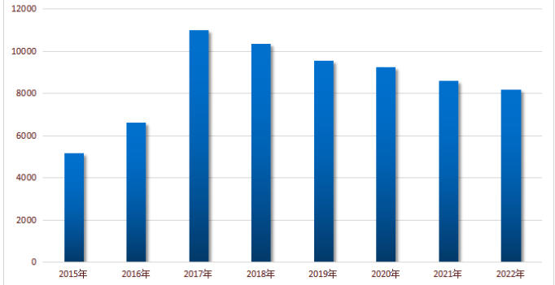

### money
1. 二级债券
   - 受银保监会监管，本质是左兜放右兜，证监会、外汇局、国资委
   - 存款保险制度，理财产品不受保护
1. 欧元统一：这个货币联盟缺乏足够的武力支持，对欧元区以外的地方基本是无能为力，而一种货币的疆域面积有多大，最终是要取决于发钞方的大炮射程的
#### 投资
1. 个人投资是千人千面的，每个人的情况不同
### home
1. 共有产权
   - 认识：用地性质由划拨改为出让，完全按照商品房进行开发，且销售价格计算也等同于商品房
   - 比例
     1. 7:3
     1. 5:5
   - 产权回购
     1. 5年内，原价格
     1. 5年外，重新评估
   - 新闻
     1. 2017年8月，北京拟推"共有产权住房" 新北京人分配不少于30%
     1. 2018年8月30日，上午10时启动申购北京海淀2141套共有产权房申购，全装修均价37800元
1. 两限房：限房价、限地价、限套型的普通商品住房，低收入本地人和拆迁户可买，满5才能交易，需补交综合地价款
1. 限竞房
   - 认识：限房价，竞地价，土地出让时锁定未来上市销售价，是防止开发商炒地进而推高房价的一种调控举措，不是保障性住房，是惠民生、稳预期、注重社会效应最大化
   - 条件
     1. 北京家庭：两套
     1. 非京籍：一套，有60个月社保
   - 供给
     1. 2017：56宗
     1. 2018：43宗
     1. 2019：14宗
     1. 2020：6宗
   - 现售
     1. 华樾国际
     1. 京投发展臻御府
     1. 首开龙湖熙悦宸著
     1. 奥森one、奥海明月：6万，东小口
     1. 公园十七区
     1. 顺颐府
1. 公产房：即公有住房，为使用权房，产权归国家所有
1. 自住房：五年不得上市，五年后收益30%上交财政
1. 经济适用房：为新建住房，用地一般行政划拨，免收土地出让金，各种收费半价，出售价格为政府指导价。经济性、保障性、实用性。是具有社会保障性质的商品住宅，限价房
   - 购买：本地户口+收入限制
   - 出售：满5年不得出售
1. 租房
   - 廉租房
   - 公租房：外地人可申请，对年收入有要求，面积小，不合适
1. 问题
   - 现在北京环内还有新房吗？
1. 北京现状
   - 普通/非普通住宅：容积率1.0以上、140平以下、五环外超374w，非普通的一套40%首付，二套80%，普通的35%，二套60%
   - 政策
     1. 17年3月17日出台的史上最严限购政策，全国认贷
     1. 17年9月的共有产权房政策
     1. 18年9月的市管公积金新政
     1. 19年4月的国管公积金新政
#### 张家口
1. 房价
   - 分析
     1. 上涨存在很多非理性与投机成分
        - 北京文旅避暑度假、滑雪：怀来、下花园，小洋房、
        - 北京居住需求外溢
        - 棚改、京津冀一体化、冬奥
   - 发展趋势
     1. 2015年-2022年张家口二手房房价均值：
     1. 2015年申奥成功，均价在6000元
     1. 2016年张家口开始掀起大规模棚户区
     1. 2017年均价破万，中旬最高13000元
     1. 2018年下半年房价下行
     1. 2019年降到万元出头
     1. 2020年均价正式跌破万元，疫情复工后密集取证期，进入全面去库存时代
     1. 2021年降到8000
        - 众多在售的商品房楼盘开始接纳异地回迁安置，这里边就包括了凤凰城三期、鸿坤礼域府、中泰城等众多知名楼盘
        - 彩虹城、水岸国际星城、逸景苑等几个著名的烂尾楼小区在停工好几年之后终于开始交房了。这几个小区整体交付品质不高，但能交房就大于一切
     1. 2022年
        - 保利在当地某项目，之前卖一万一左右，现在也在做优惠活动，现房卖九千多。“此外，融创在市区一个项目，最贵的时候卖一万二，目前尾盘八千左右；荣盛在宣化的一个盘，19年高点时卖8500元/平方米，现在卖四千多
        - 入住率很低，暖气只有14度
   - 当下
     1. 如今来买房的大多为度假自住，很少有投机心理
     1. 随着张家口政策红利基本出尽，市场已由狂热恢复到理性状态。从目前市场需求看，本地内生置业需求相对有限，外地吸附能力也太不强，高房价时代已难以再现
1. 信息
   - 住宅供地
     1. 20：399公顷
     1. 21：173
     1. 22：235
   - 地王：碧桂园天玺，2018年拿地
     1. 9900元均价，红旗楼区域首个均价低于万元的楼盘
     1. 2021年11月，三期6500元
   - 事件
     1. 降价
     1. 限跌令
     1. 商品房小区改回迁安置房
     1. 棚户区改造：2022年继续推荐和正在进行
     1. 返租商铺暴雷：很难保证如约继续支付收益
   - 去化
     1. 2020：三个主城区去化7000套，去化周期依然2年以上
##### 数据来源
1. 公众号
   - 21世纪不动产张家口区域
   - 张家口房地产观察
1. 抖音、微信视频号
   - 主题
     1. 开元溪府、开元瑞府
     1. 张家口房产
     1. 张家口房价
### 个人养老金
1. 养老金是什么？
    存一笔钱，自愿参加，每年限额12000元，作为基本养老保险的补充
    个人养老金实行个人账户制度，缴费完全由个人承担，完全积累
    通过个人养老金信息管理服务平台，建立个人养老金账户
    可以用缴纳的养老金在符合规定的金融机构购买金融产品，与普通理财不同，拿个人养老金投资可享受延期征税等优惠（具体没细节，能延期多久？还有什么优惠？）
    个人养老金作为国家制度推出，汇集资金多，容易产生规模效应，有利于提高收益率
    国家投资、单位出钱，个人也要适当储蓄，‘多条腿走路’，从而共担养老责任
2. 如何领？
    参加人达到领取基本养老金年龄、完全丧失劳动能力、出国定居或其他符合规定的情况，核验成功后，可按月、分次或者一次性领取个人养老金，领取方式一旦确定不可更改
    将个人养老金由个人养老金资金账户转入本人社保卡银行账户
    参加人死亡后，其个人养老金资金账户中的资产可以继承
    退休时，遇到不可控风险导致收益下降或还希望持续投资进一步积累养老钱，可以不领
    个人养老金是一种投资型制度，收益高低取决于很多因素，它既与经济发展水平、制度运行质量密切相关，又受个人投资眼光、投资能力和风险容忍度的影响，将是多重因素作用的结果
    
3. 证监会2022年4月21日表示，将抓紧制定出台个人养老金投资公募基金配套规则制度，优化中长期资金入市环境
4. 人社部、财政部加强指导和协调，结合实际分步实施，选择部分城市先试行1年，再逐步推开
5. 中国当前养老保险三大支柱：
   1. 第一支柱:基本养老保险（71.7%）
   2. 第二支柱：企业补充养老金（22.4%）
   3. 第三支柱：个人存储型养老保险
6. 个人养老金不会取代第一、第二养老金，作为第三支柱的短板补充
1. 政策背景
   - 2021年5月全国第七次普查结果
     1. 65岁以上人口占总人口的13.5%，即将步入深度老龄化社会
     1. 预测2033年左右进入超级老龄化社会（65岁占比超20%），2060年老龄化比例超35%
     1. 全国336个地级城市中，有149个城市进入深度老龄化（65岁以上人口占比超14%）
     1. 四川省深度老龄化城市数量14个，东三省36个城市全部进入深度老龄化阶段，湖北9个深度老龄化城市
   - 全国养老金收支
     1. 收入：2020年 - 2050年养老金收入逐渐提交，到2030年每年增量约为119832亿元，2050年增至252425亿元
     1. 支出：到2030年每年支出总量约为122775亿元，2050年增至356315亿元
     1. 预计2028年养老金收支出现缺口，2020-2050年养老金累计缺口超85万亿
        - 2028年收入与支出的差额约为-727.54亿元
        - 到2035年差额将扩大到-16548.93亿元
        - 到2050年收入与支出的差额将为-10.4万亿
### stone
1. 认识
   - 标准
     1. 颜色：≥H
        - 无色：DEFG
        - 接近无色：HIJK
        - 微黄：LMN
        - 浅黄：O~Z
     1. 净度：≥SI1
        - FL：无包裹体、缺陷
        - IF：无包裹体、不明显缺陷
        - VVS1、VVS2：包裹体难看到
        - VS1、VS2：小包裹体
        - SI1、SI2：10倍放大镜可见
        — I1、I2、I3：肉眼可见
     1. 切工：3EX
        - 切工：EX、VG、G、F、P
        - 抛光：EX、VG、G、F、P
        - 对称性：EX、VG、G、F、P
     1. 重量
     1. 荧光级别：无，在紫外荧光灯下发光现象，通常是蓝色荧光
        - N(无)、F(弱)、M(中等)、S(强)、VS( 很强)
   - 证书
     1. 国家：GIA(最权威)、IGI、HRD
     1. 国检、省检的
   - 特性
     1. 异形钻不能最体现火彩，便宜70%