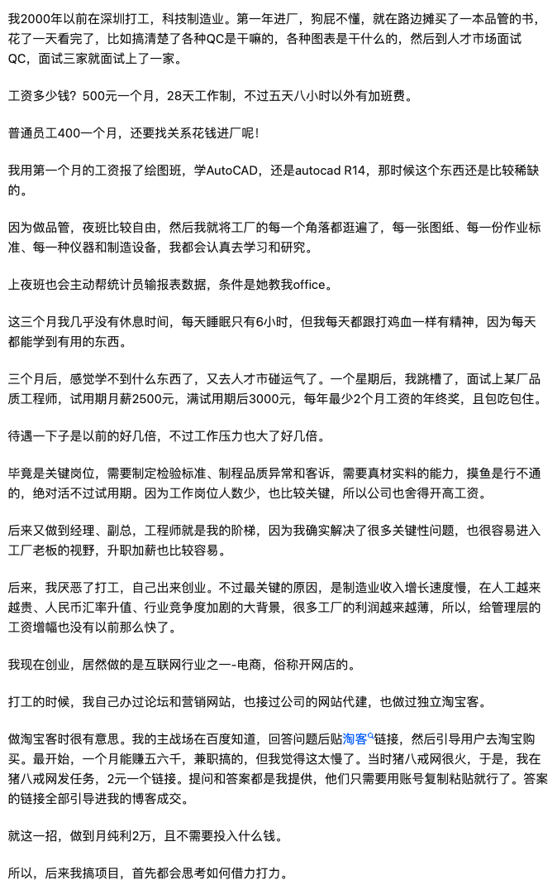

1. 我的特征
   - 有结果的人、能够创造价值的人：
     1. 都是能够折腾出东西，折腾出利益；发现机会，创造机会；有事情发展大可能的苗头；能不断升级、改变自己的人
1. 场景
   - 如何看待今年互联网行业的应届生薪资是制造业薪资的四倍
     1. 解决方案
        - 复合型人才，能够解决问题的人才
        - 贪玩，错过机会
        - “我们”作为一个群体，是没有固定的路径的。而“我”作为一个个体，是可以找到相对优解的。知道“跑”或者“问”，你就迈出了漫漫求索中的第一步
        - 机械制业一张图纸可以用上百年，能想到的任何东西在机械手册上都有，过几年，程序员就和机械工人一样，价值会被压缩，被替代，变成劳动密集型
     1. 思想
        - 工人应该联合起来打倒资本家，而不是矛头指向多拿工资的其他工人
     1. 哲学
        - 生活永远都不是争取的产物, 而是妥协的产物：是一系列结果相加得到的最终结果
     1. 意见
        - 机械制业一张图纸可以用上百年，能想到的任何东西在机械手册上都有，过几年，程序员就和机械工人一样，价值会被压缩，被替代，变成劳动密集型